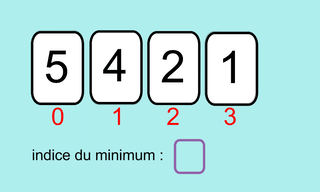

## <H2 style="color:blue;">🔍 Le principe</h2>

Le travail se fait essentiellement sur les **indices**.  
On part de l’indice du premier élément et on considère que cet élément est le **minimum**.

👉 On parcourt les éléments suivants. Si on repère un élément plus petit que notre minimum, on garde **en mémoire son indice**.

📌 Une fois le parcours terminé, on **échange** l’élément de travail avec le minimum trouvé.  
🔁 On recommence jusqu’à l’avant-dernier élément de la liste.

---

## <H2 style="color:blue;">⚙️ L’algorithme</h2>



### <H3 style="color:green;">💻 Script Python</h3>

```python
def tri_selection(l):
    for i in range(0, len(l)):
        mini = i
        for j in range(i + 1, len(l)):
            if l[j] < l[mini]:
                mini = j
        if mini != i:
            l[i], l[mini] = l[mini], l[i]
    return l
```

### <H3 style="color:green;">🔎 Vérification</h3>

```python
# tester avec :
a = [7, 5, 2, 8, 1, 4]
tri_selection(a)
print(a)
```

???+ question "❓Tester ce qui est proposé"

    {{ IDE() }}

---

## <H2 style="color:blue;">📈 Complexité de l’algorithme</h2>

### <H3 style="color:green;">🔬 Observation</h3>

On va mesurer une **moyenne de durée** sur 5 exécutions avec deux tailles de listes, dans le pire des cas (liste décroissante).

Ajoute ce script :

```python
import time

somme_des_durees = 0
for i in range(5):
    a = [k for k in range(100 - 1)]
    start_time = time.time()
    tri_selection(a)
    somme_des_durees += time.time() - start_time
moyenne = somme_des_durees / 5
print("Temps pour 100 : %s sec ---" % moyenne)

somme_des_durees = 0
for i in range(5):
    b = [k for k in range(1_000 - 1)]
    start_time = time.time()
    tri_selection(b)
    somme_des_durees += time.time() - start_time
moyenne = somme_des_durees / 5
print("Temps pour 1_000 : %s sec ---" % moyenne)
```

❓ **Recopier le script du tri par sélection et tester le code ci-dessus.**
⚠️ **Cela peut prendre un peu de temps !**

???+ question "❓Tester ce qui est proposé"

    {{ IDE() }}

📊 En local, on trouve :

* Pour 1 000 : \~0.039 s
* Pour 10 000 : \~4.57 s

🧠 Conclusion : si on multiplie la taille par 10, le temps est multiplié par 100 → la **complexité est quadratique**.

---

### <H3 style="color:green;">📚 Démonstration</h3>

Dans le pire des cas, pour une liste de taille `n` :

* boucle `for` extérieure : `n-1` tours
* boucle intérieure : $1 + 2 + ... + (n-1)$ = $\frac{n(n-1)}{2}$

✅ Confirme que le tri par sélection est en **𝑂(n²)**.


✨ Complexité dans le meilleur des cas

Même si la liste est **déjà triée**, le tri par sélection :

* **parcourt toujours l'intégralité des éléments restants** pour trouver un minimum,
* effectue **les mêmes comparaisons** qu'en cas de liste en désordre,
* mais **réalise moins d’échanges** (voire aucun si les indices minimaux ne changent pas).

🔍 **Ce qui change :**

* ✅ Pas d'échange inutile si `mini == i`
* ❌ Mais **toutes les comparaisons sont quand même faites**

📌 **Conclusion :**
Le **meilleur des cas** n’améliore pas significativement les performances :

> 🕒 Le nombre d’opérations reste proportionnel à $n \times (n-1)/2$
> 👉 La complexité est donc **quadratique aussi dans le meilleur des cas : 𝑂(n²)**


---

## <H2 style="color:blue;">🧪 Preuve de l’algorithme</h2>

### <H3 style="color:green;">✔️ Preuve de la terminaison</h3>

L’algorithme ne contient que des boucles `for` bien définies :
il s’exécute toujours un **nombre fini d’opérations**.

➡️ Le nombre total d’itérations est :
$\frac{n(n-1)}{2}$
Donc le programme **se termine toujours**.

---

### <H3 style="color:green;">✅ Preuve de la correction</h3>

On utilise un **raisonnement par récurrence** :

🧩 Propriété : « À chaque étape `k`, la sous-liste `l[0:k]` est triée. »

* Initialisation : pour `k = 0`, on place le plus petit élément au début → c’est trié.
* Hérédité : si les `k` premiers sont triés, l’algorithme place ensuite le plus petit élément restant à la bonne place (`k+1`), donc la sous-liste est toujours triée.

🎯 Cette propriété est un **invariant de boucle**, elle reste vraie à chaque étape.

✅ À la fin, la liste complète est triée.


