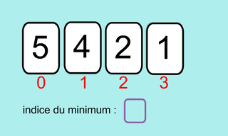

## <H2 STYLE="COLOR:BLUE;">**Le principe</h2>**

Le travail se fait essentiellement sur les indices.
On part de l'indice du premier élément, on considère que cet élément est l'élément minimum.
On parcourt les éléments suivants et si on repère un élément plus petit que notre minimum, on garde en mémoire l'indice de ce nouvel élément minimum.
Une fois le parcours fini, on échange l'élément de travail avec l'élément minimum qui a été trouvé.
On avance d'un élément et on recommence jusqu'à l'avant-dernier.

## <H2 STYLE="COLOR:BLUE;">**L’algorithme</h2>**



### <H2 STYLE="COLOR:BLUE;">**Script Python</h2>**

```python
def tri_selection(l):
    for i in range(0, len(l)):
        mini = i
        for j in range(i + 1, len(l)):
            if l[j] < l[mini]:
                mini = j
        if mini != i:
            l[i], l[mini] = l[mini], l[i]
    return l
```

### <H3 STYLE="COLOR:GREEN;">**Vérification</h3>**

```python
>>> a = [7, 5, 2, 8, 1, 4]
>>> tri_selection(a)
>>> print(a)
[1, 2, 4, 5, 7, 8]
```

???+ question"Tester ce qui est proposé"

    {{ IDE() }}

## <H2 STYLE="COLOR:BLUE;">**Complexité de l’algorithme</h2>**

### <H3 STYLE="COLOR:GREEN;">**Observation</h3>**

On va étudier une moyenne sur 5 valeurs de deux appels sur la fonction `tri_selection()`. On se place dans le pire des cas : une liste triée dans l'ordre décroissant.

Rajouter ce script au code précédent :

```python
import time

somme_des_durees = 0
for i in range(5):
    a = [k for k in range(1_0000 - 1)]
    start_time = time.time()
    tri_selection(a)
    somme_des_durees = somme_des_durees + time.time() - start_time
moyenne = somme_des_durees / 5
print("Temps d'exécution pour 1_000: %s secondes ---" % (moyenne))

somme_des_durees = 0
for i in range(5):
    b = [k for k in range(10_0000 - 1)]
    start_time = time.time()
    tri_selection(b)
    somme_des_durees = somme_des_durees + time.time() - start_time
moyenne = somme_des_durees / 5
print("Temps d'exécution pour 10_000: %s secondes ---" % (moyenne))
```
???+ question "recopier le script du tri par sélection et tester ce qui est proposé ci-dessus"

    {{ IDE() }}
    
- Temps d'exécution pour 1_000: 0.03949418067932129 secondes ---
- Temps d'exécution pour 10_000: 4.569394874572754 secondes ---

En comparant les temps de tri des listes a et b, que pouvez-vous supposer sur la complexité du tri par insertion ?
Une liste à trier 10 fois plus longue prend 100 fois plus de temps : l'algorithme semble de complexité quadratique.

### <H3 STYLE="COLOR:GREEN;">**Démonstration</h3>**

Dénombrons le nombre d'opérations dans le pire des cas pour une liste de taille `n`.

- Boucle `for` : elle s'exécute `n-1` fois.
- Deuxième boucle `for` imbriquée : elle exécute d'abord 1 opération puis 2 puis 3... jusqu'à `n-1`. Or

$ 1 + 2 + 3 + \cdots + (n-1) = \frac{n \times (n-1)}{2} $

Cela confirme que le tri par sélection est de complexité quadratique.

## <H2 STYLE="COLOR:BLUE;">**Preuve de l’algorithme</h2>**

### <H3 STYLE="COLOR:GREEN;">**Preuve de la terminaison</h3>**

Est-on sûr que notre algorithme va s'arrêter ?
À l'observation du programme constitué de deux boucles `for` imbriquées, il n'y a pas d'ambiguïté : on ne peut pas rentrer dans une boucle infinie. Le programme s'arrête forcément au bout d'un nombre fixe d'opérations. D'après nos calculs sur la complexité, ce nombre de tours de boucles est égal à

$\frac{n \times (n-1)}{2}$

Ceci prouve que l'algorithme se terminera.

### <H3 STYLE="COLOR:GREEN;">**Preuve de la correction</h3>**

Les preuves de correction sont des preuves théoriques. La preuve ici s'appuie sur le concept mathématique de récurrence. Principe du raisonnement par récurrence : une propriété `P(n)` est vraie si :

- `P(0)` (par exemple) est vraie
- Pour tout entier naturel `n`, si `P(n)` est vraie alors `P(n+1)` est vraie.

Ici la propriété serait : « Quand `k` varie entre 0 et `longueur(liste) -1`, la sous-liste de longueur `k` est triée dans l'ordre croissant. » On appelle cette propriété un invariant de boucle (sous-entendu : elle est vraie pour chaque boucle).

- Quand `k` vaut 0, on place le minimum de la liste en `l[0]`, la sous-liste `l[0]` est donc triée.
- Si la sous-liste de `k` éléments est triée, l'algorithme rajoute en dernière position de la liste le minimum de la sous-liste restante dont tous les éléments sont supérieurs au maximum de la sous-liste de `k` éléments. La sous-liste de `k+1` éléments est donc aussi triée.