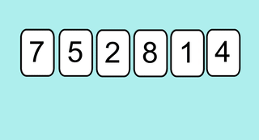

## <H2 style="color:blue;">📌 Le principe</H2>

Le travail se fait essentiellement sur les **indices**.  
On considère que le premier élément est déjà trié.

🔁 Pour chaque nouvel élément (à partir de l’indice 1), on le **compare aux éléments précédents** :  
- Tant qu’il est **plus petit**, on décale les éléments vers la droite.
- Puis, on **insère** cet élément à la bonne place.

Ce tri fonctionne un peu comme si tu voulais **classer tes cartes en main** dans l’ordre croissant !

---

## <H2 style="color:blue;">⚙️ L’algorithme</H2>



### <H3 style="color:green;">💻 Script Python</H3>

```python
def tri_insertion(l):
    for i in range(1, len(l)):
        j = i
        val = l[i]
        while j > 0 and val < l[j - 1]:
            l[j] = l[j - 1]
            j = j - 1
        l[j] = val
    return l
````

### <H3 style="color:green;">🧪 Vérification</H3>

```python
a = [7, 5, 2, 8, 1, 4]
tri_insertion(a)
print(a)
```

❓ Tester ce qui est proposé :

```
{{ IDE() }}
```

---

## <H2 style="color:blue;">📈 Complexité de l’algorithme</H2>

### <H3 style="color:green;">🔬 Observation expérimentale</H3>

Étudions la **durée moyenne** pour trier une liste de 100 puis de 1 000 éléments, dans le **pire des cas** (liste triée à l’envers).

Ajoute ce script :

```python
import time

somme_des_durees = 0
for i in range(5):
    a = [k for k in range(100 - 1)]
    start_time = time.time()
    tri_insertion(a)
    somme_des_durees += time.time() - start_time
moyenne = somme_des_durees / 5
print("Temps d'exécution pour 100 : %s secondes ---" % moyenne)

somme_des_durees = 0
for i in range(5):
    b = [k for k in range(1_000 - 1)]
    start_time = time.time()
    tri_insertion(b)
    somme_des_durees += time.time() - start_time
moyenne = somme_des_durees / 5
print("Temps d'exécution pour 1_000 : %s secondes ---" % moyenne)
```

❓ Recopier le script du tri par insertion et tester le code ci-dessus.
⚠️ Cela peut prendre un peu de temps !

```
{{ IDE() }}
```

📊 Résultats constatés :

* Pour 1 000 : \~0.058 s
* Pour 10 000 : \~5.96 s

💡 Une liste 10× plus longue prend 100× plus de temps → complexité **quadratique**.

---

### <H3 style="color:green;">📚 Démonstration</H3>

Dans le **pire des cas**, pour une liste de taille `n` :

* La boucle `for` s'exécute `n-1` fois.
* La boucle `while` s’exécute 1 + 2 + … + (n-1) fois :

$$
1 + 2 + 3 + \dots + (n-1) = \frac{n(n-1)}{2}
$$

➡️ Complexité : **𝑂(n²)**

---

### <H3 style="color:green;">⏱️ Résumé des complexités</H3>

* ✅ **Meilleur des cas** (liste déjà triée) : **complexité linéaire** → 𝑂(n)
  *(on ne rentre jamais dans la boucle `while`)*

* ❌ **Pire des cas** (liste triée à l’envers) : **complexité quadratique** → 𝑂(n²)

> 🧠 **Remarque :** le tri par insertion est plus efficace que le tri par sélection **si la liste est partiellement triée**.

---

## <H2 style="color:blue;">🔐 Preuve de l’algorithme</H2>

### <H3 style="color:green;">✔️ Preuve de terminaison</H3>

L’algorithme contient :

* une boucle `for` bien délimitée,
* une boucle `while` avec condition :

```python
while j > 0 and l[j - 1] > val:
```

📌 À chaque tour de boucle `while`, la variable `j` **diminue d’1**
➡️ Elle devient forcément nulle au bout d’un moment → **sortie garantie**

La variable `j` est un **variant de boucle** : elle garantit que la boucle ne tourne pas indéfiniment.

---

### <H3 style="color:green;">✅ Preuve de la correction</H3>

📘 On raisonne par **récurrence** :
Propriété `P(i)` : « La sous-liste `l[0:i]` est triée. »

* **Initialisation** : pour `i = 0`, `l[0]` est triée.
* **Hérédité** : si `l[0:i-1]` est triée, on insère `l[i]` à la bonne place → `l[0:i]` est triée.

➡️ La propriété est vraie pour tous les `i` entre 1 et `n-1`.

✅ C’est donc un **invariant de boucle** : à chaque itération, la liste partielle est bien triée.


