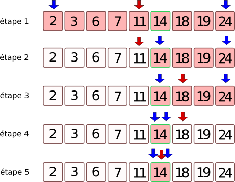
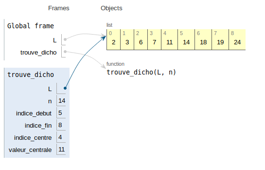

## **<H2 STYLE="COLOR:BLUE;">Le principe</H2>**

On travaille avec une liste triée.
on se place au milieu de la liste.
on regarde si on est inférieur ou supérieur à la valeur cherchée.
on ne garde que la bonne moitié de la liste qui nous intéresse et on recommence jusqu'à trouver la bonne valeur.

## **<H2 STYLE="COLOR:BLUE;">L’algorithme</H2>**

### **<H3 STYLE="COLOR:GREEN;">Illustration</H3>**



Recherchons la valeur 14 dans notre liste L

- **<H3 STYLE="COLOR:RED;">étape 1 :</H3>** toute la liste est à traiter. On se place sur l'élément central. Son indice est la partie entière de la moitié de la longueur de la liste. Ici il y a 9 éléments donc on se place sur le 4ème qui est 11.
- **<H3 STYLE="COLOR:RED;">étape 2 :</H3>** on compare 11 à la valeur cherchée (14). Il faut donc garder tout ce qui est supérieur à 11.
- **<H3 STYLE="COLOR:RED;">étape 3 :</H3>** on se place au milieu de la liste des valeurs qu'il reste à traiter. Ici il y a 4 valeurs donc il n'y a pas de valeur centrale. On va donc se positionner sur la 2ème valeur qui est 18.
- **<H3 STYLE="COLOR:RED;">étape 4 :</H3>** on compare la valeur 18 à la valeur cherchée : 14. Elle est supérieure donc on garde ce qui est à gauche. Il n'y a plus qu'une valeur.
- **<H3 STYLE="COLOR:RED;">étape 5 :</H3>** on se place sur la valeur 14 et on compare avec 14. La valeur est trouvée.


### **<H3 STYLE="COLOR:GREEN;">Script Python</H3>**

Nous allons travailler avec deux variables `indice_debut` et `indice_fin` qui vont délimiter la liste à étudier. Ces indices sont représentés en bleu sur la figure ci-dessous. La valeur de l'indice_central (représenté en rouge) sera égale à 

`(indice_debut + indice_fin) // 2`.

Le programme s'arrête lorsque la valeur cherchée a été trouvée ou lorsque `indice_fin` devient inférieur à `indice_debut`.

```python
def trouve_dicho(L, val):
    indice_debut = 0
    indice_fin = len(L) - 1
    while indice_debut <= indice_fin:
        indice_centre = (indice_debut + indice_fin) // 2  # on prend l'indice central
        if L[indice_centre] > val:  # si la valeur centrale est trop grande...
            indice_fin = indice_centre - 1
        elif L[indice_centre] < val:  # si la valeur centrale est trop petite...
            indice_debut = indice_centre + 1
        else:  # si la valeur centrale est la valeur cherchée...
            return indice_centre
    return None
```

### **<H3 STYLE="COLOR:GREEN;">Vérification</H3>**

```
>>> L = [2, 3, 6, 7, 11, 14, 18, 19, 24]
>>> print(trouve_dicho(L, 14))
5
>>> print(trouve_dicho(L, 2))
0
>>> print(trouve_dicho(L, 24))
8
>>> print(trouve_dicho(L, 1976))
None
```

???+ question "Tester ce qui est proposé"

    {{ IDE() }}
    
### **<H3 STYLE="COLOR:GREEN;">Visualisation</H3>**

Une visualisation de l'évolution des variables `indice_debut` et `indice_fin` est disponible sur le site pythontutor via [ce lien](http://pythontutor.com/visualize.html#code=L%20%3D%20%5B2,%203,%206,%207,%2011,%2014,%2018,%2019,%2024%5D%0A%0Adef%20trouve_dicho%28L,%20n%29%20%3A%0A%20%20%20%20indice_debut%20%3D%200%0A%20%20%20%20indice_fin%20%3D%20len%28L%29%20-%201%0A%20%20%20%20while%20indice_debut%20%3C%3D%20indice_fin%20%3A%0A%20%20%20%20%20%20%20%20indice_centre%20%3D%20%28indice_debut%20%2B%20indice_fin%29%20//%202%0A%20%20%20%20%20%20%20%20valeur_centrale%20%3D%20L%5Bindice_centre%5D%0A%20%20%20%20%20%20%20%20if%20valeur_centrale%20%3D%3D%20n%20%3A%0A%20%20%20%20%20%20%20%20%20%20%20%20return%20indice_centre%0A%20%20%20%20%20%20%20%20if%20valeur_centrale%20%3C%20n%20%3A%0A%20%20%20%20%20%20%20%20%20%20%20%20indice_debut%20%3D%20indice_centre%20%2B%201%0A%20%20%20%20%20%20%20%20else%20%3A%0A%20%20%20%20%20%20%20%20%20%20%20%20indice_fin%20%3D%20indice_centre%20-%201%0A%20%20%20%20return%20None%0A%0Aprint%28trouve_dicho%28L,14%29%29&cumulative=false&curInstr=0&heapPrimitives=nevernest&mode=display&origin=opt-frontend.js&py=3&rawInputLstJSON=%5B%5D&textReferences=false).



## **<H2 STYLE="COLOR:BLUE;">Terminaison de l’algorithme</H2>**

Est-on sûr que l'algorithme va se terminer ?


La boucle `while` qui est utilisée doit nous inciter à la prudence. Il y a en effet le risque de rentrer dans une boucle infinie.

Pourquoi n'est-ce pas le cas ?

Aide : observer la position des deux flèches bleues lors de l'exécution de l'algorithme.

La condition de la boucle `while` est `indice_debut <= indice_fin` qui pourrait aussi s'écrire `indice_fin >= indice_debut`. Au démarrage de la boucle on a :

- `indice_debut = 0`
- `indice_fin = len(L) - 1`

Ceci nous assure donc de bien rentrer dans la boucle. Ensuite, à chaque étape, les deux variables `indice_debut` et `indice_fin` vont se rapprocher jusqu'à ce que le programme rencontre un `return` ou bien jusqu'à ce que `indice_fin` devienne inférieur à `indice_debut`.
Ceci nous assure donc que le programme va bien se terminer.

### **<H3 STYLE="COLOR:MAGENTA;">Variant de boucle</H3>**

On dit que la valeur `indice_fin - indice_debut` représente le `variant de boucle` de cet algorithme. Ce variant est un nombre entier d'abord strictement positif puis qui va décroître jusqu'à la valeur 0.

## **<H2 STYLE="COLOR:BLUE;">Complexité de l’algorithme</H2>**

### **<H3 STYLE="COLOR:GREEN;">Observation</H3>**

Combien d'étapes (au maximum) sont-elles nécessaires pour arriver à la fin de l'algorithme ?
Imaginons que la liste initiale possède 8 valeurs. Après une étape, il ne reste que 4 valeurs à traiter. Puis 2 valeurs. Puis une seule valeur. Il y a donc 3 étapes avant de trouver la valeur cherchée.

**Exercice : Remplissez le tableau ci-dessous :**

| taille de la liste | 1 | 2 | 4 | 8 | 16 | 32 | 64 | 128 | 256 |
|--------------------|---|---|---|---|----|----|----|-----|-----|
| nombre d'étapes    | _ | _ | _ | 3 | _  | _  | _  | _   | _   |

Pouvez-vous deviner le nombre d'étapes nécessaires pour une liste de 4096 termes ?
Pour une liste de $2^n$ termes, quel est le nombre d'étapes ?

### **<H3 STYLE="COLOR:MAGENTA;">Conclusion</H3>**

C'est le nombre de puissances de 2 que contient le nombre `N` de termes de la liste qui est déterminant dans la complexité de l'algorithme. Ce nombre s'appelle le `logarithme de base 2` et se note $log_2 (N)$. On dit que l'algorithme de dichotomie a une `vitesse logarithmique`. On rencontrera parfois la notation $log_2 (N)$.

## **<H2 STYLE="COLOR:BLUE;">Expériences et comparaison des vitesses d’exécution</H2>**

### **<H3 STYLE="COLOR:GREEN;">Avec une liste contenant 100 000 valeurs</H3>**

Mesurons le temps nécessaire pour trouver l'indice de la dernière valeur de la liste (qui est 299474) avec la méthode de balayage (méthode 1 : on fait une boucle simple sur l’ensemble du tableau et on compare chaque valeur à celle recherchée):

```python
################## Recherche linéaire
def recherche_lineaire(tableau, valeur):
    for element in tableau:
        if element == valeur:
            return True
    return False

################## comparaison de vitesses d'exécution
# cette ligne de code permet de transformer le contenu du fichier input_centmille.txt
# en une liste L de 100 000 valeurs.
L1 = open("input_centmille.txt", 'r').read().split('\n')

# attention commande à taper dans la console si vous avez installé ipython
>>> %timeit recherche_lineaire(L, 299474)
4.43 ms ± 86.1 µs per loop (mean ± std. dev. of 7 runs 100 loops each)
```

Mesurons le temps nécessaire pour trouver l'indice de la dernière valeur de la liste (qui est 299474) avec la méthode par dichotomie (méthode 2) :

```python
# attention commande à taper dans la console si vous avez installé ipython
>>> %timeit trouve_dicho(L, 299474)
3.21 µs ± 19.6 ns per loop (mean ± std. dev. of 7 runs 100000 loops each)
```

### **<H3 STYLE="COLOR:GREEN;">Comparaison des deux méthodes</H3>**

L'algorithme dichotomique est bien plus rapide que l'algorithme de balayage (la différence d'ordre de grandeur est de $10^3$ qui correspond bien à l'ordre de grandeur de $\frac{n}{log(n)}$ lorsque n vaut $10^5$).

### **<H3 STYLE="COLOR:GREEN;">Avec une liste contenant 1 000 000 valeurs (soit 10 fois plus que la liste précédente)</H3>**

```python
# ce code permet de transformer le contenu du fichier million.txt en une liste L de 1 000 000 valeurs.
f = open("input_million.txt", 'r')
l = f.readlines()
L2 = []
for k in l:
    L2.append(int(k[:-1]))

# attention commande à taper dans la console si vous avez installé ipython
```

Mesurons le temps nécessaire pour trouver l'indice de la dernière valeur de la liste (qui est 2999306) avec la méthode de balayage (méthode 1) :

```python
# attention commande à taper dans la console si vous avez installé ipython
>>> %timeit recherche_lineaire(L, 299474)
46.9 ms ± 615 µs per loop (mean ± std. dev. of 7 runs 10 loops each)
```

Mesurons le temps nécessaire pour trouver l'indice de la dernière valeur de la liste (qui est 2999306) avec la méthode par dichotomie (méthode 2) :

```python
# attention commande à taper dans la console si vous avez installé ipython
>>> %timeit trouve_dicho(L, 299474)
3.04 µs ± 39.4 ns per loop (mean ± std. dev. of 7 runs 100000 loops each)
```

### **<H3 STYLE="COLOR:GREEN;">Comparaison des deux méthodes</H3>**

L'algorithme dichotomique est toujours bien plus rapide que l'algorithme de balayage (la différence d'ordre de grandeur est de $10^4$ qui correspond bien à l'ordre de grandeur de $\frac{n}{log(n)}$ lorsque n vaut $10^6$).

### **<H3 STYLE="COLOR:GREEN;">Influence de la taille de la liste sur la vitesse de chaque méthode :</H3>**

- **<H3 STYLE="COLOR:RED;">méthode 1 :</H3>** la recherche dans une liste 10 fois plus grande prend environ 10 fois plus de temps : la vitesse de l'algorithme est bien proportionnelle à la taille `n` de la liste. $\frac{10^6}{10^5}$ = 10
- **<H3 STYLE="COLOR:RED;">méthode 2 :</H3>** la recherche dans une liste 10 fois plus grande prend environ 12 fois plus de temps : la vitesse de l'algorithme est bien proportionnelle au `logarithme` de la taille `n` de la liste. $\frac{log(1000000)}{log(100000)}$ ≈ 12

### **<H3 STYLE="COLOR:MAGENTA;">Remarque :</H3>**

Il ne faut toutefois pas oublier que la méthode dichotomique, bien plus rapide, nécessite que la liste ait été auparavant triée. Ce qui rajoute du temps de calcul !

