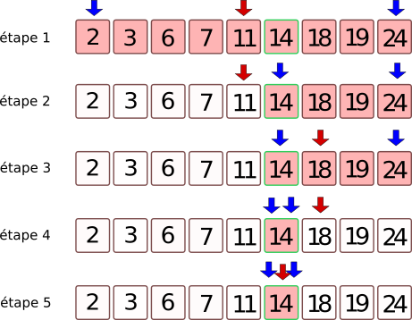

## <H2 style="color:blue;">🔍 Le principe</H2>

La recherche dichotomique fonctionne uniquement sur une **liste triée**.

1. 🔸 On se place au **milieu** de la liste.
2. 🔍 On compare la valeur centrale à la valeur recherchée.
3. 📉 Si la valeur cherchée est plus petite, on **ne garde que la moitié gauche**.
4. 📈 Si elle est plus grande, on **garde la moitié droite**.
5. 🔁 On recommence jusqu’à trouver la bonne valeur... ou jusqu’à ne plus rien avoir à chercher.

---

## <H2 style="color:blue;">⚙️ L’algorithme</H2>

### <H3 style="color:green;">🖼️ Illustration</H3>



📌 Recherche de la valeur **14** dans la liste `L` :

- **Étape 1** : on examine l’élément au milieu → ici `11`
- **Étape 2** : 14 > 11 → on garde la **moitié droite**
- **Étape 3** : au milieu de cette moitié → `18`
- **Étape 4** : 14 < 18 → on garde la **moitié gauche**
- **Étape 5** : il ne reste que `14` → c’est trouvé ✅

---

### <H3 style="color:green;">💻 Script Python</H3>

```python
def trouve_dicho(L, val):
    indice_debut = 0
    indice_fin = len(L) - 1
    while indice_debut <= indice_fin:
        indice_centre = (indice_debut + indice_fin) // 2
        if L[indice_centre] > val:
            indice_fin = indice_centre - 1
        elif L[indice_centre] < val:
            indice_debut = indice_centre + 1
        else:
            return indice_centre
    return None
```

---

### <H3 style="color:green;">✅ Vérification</H3>

```python
L = [2, 3, 6, 7, 11, 14, 18, 19, 24]
print(trouve_dicho(L, 14))   # ➜ 5
print(trouve_dicho(L, 2))    # ➜ 0
print(trouve_dicho(L, 24))   # ➜ 8
print(trouve_dicho(L, 1976)) # ➜ None
```

???+ question "❓Tester ce qui est proposé"

    {{ IDE() }}

---

### <H3 style="color:green;">🎯 Visualisation dynamique</H3>

Utilise ce lien interactif pour observer l’évolution des variables dans l’algorithme :
➡️ [Simulation PythonTutor](https://pythontutor.com/render.html#code=L%20%3D%20%5B2,%203,%206,%207,%2011,%2014,%2018,%2019,%2024%5D%0A%0Adef%20trouve_dicho%28L,%20n%29%20%3A%0A%20%20%20%20indice_debut%20%3D%200%0A%20%20%20%20indice_fin%20%3D%20len%28L%29%20-%201%0A%20%20%20%20while%20indice_debut%20%3C%3D%20indice_fin%20%3A%0A%20%20%20%20%20%20%20%20indice_centre%20%3D%20%28indice_debut%20%2B%20indice_fin%29%20//%202%0A%20%20%20%20%20%20%20%20valeur_centrale%20%3D%20L%5Bindice_centre%5D%0A%20%20%20%20%20%20%20%20if%20valeur_centrale%20%3D%3D%20n%20%3A%0A%20%20%20%20%20%20%20%20%20%20%20%20return%20indice_centre%0A%20%20%20%20%20%20%20%20if%20valeur_centrale%20%3C%20n%20%3A%0A%20%20%20%20%20%20%20%20%20%20%20%20indice_debut%20%3D%20indice_centre%20%2B%201%0A%20%20%20%20%20%20%20%20else%20%3A%0A%20%20%20%20%20%20%20%20%20%20%20%20indice_fin%20%3D%20indice_centre%20-%201%0A%20%20%20%20return%20None%0A%0Aprint%28trouve_dicho%28L,14%29%29&cumulative=false&heapPrimitives=nevernest&mode=edit&origin=opt-frontend.js&py=311&rawInputLstJSON=%5B%5D&textReferences=false)

---

## <H2 style="color:blue;">🧪 Terminaison de l’algorithme</H2>

🧠 La boucle `while` peut-elle boucler à l’infini ?
Non, car à chaque étape :

* soit on retourne le résultat,
* soit on **réduit la taille de l’intervalle** (`indice_debut` ou `indice_fin` bouge vers le centre),
* donc la condition `indice_debut <= indice_fin` finit toujours par devenir fausse.

🧩 On appelle `indice_fin - indice_debut` un **variant de boucle** : il diminue à chaque étape, garantissant que l'algorithme **s'arrête toujours**.

---

## <H2 style="color:blue;">📈 Complexité de l’algorithme</H2>

### <H3 style="color:green;">🔢 Nombre d’étapes</H3>


1. Taille du problème à chaque étape

* Supposons un tableau de `n` éléments.
* À chaque itération, on coupe le tableau en **deux**.
* Donc, la taille du sous-tableau devient :

  * après 1 étape : `n / 2`
  * après 2 étapes : `n / 4`
  * après 3 étapes : `n / 8`
  * etc.

Au bout de `k` étapes, on a un sous-tableau de taille `n / 2^k`.

On s’arrête quand le tableau est de taille 1, donc :

$$
\frac{n}{2^k} = 1
$$

On résout cette équation :

$$
n = 2^k \quad \Rightarrow \quad k = \log_2(n)
$$

Donc, **le nombre d’itérations** est **log₂(n)** dans le pire des cas.

2 Complexité en notation O

* Chaque étape fait **un test et une division du tableau**, soit une **opération constante O(1)**.
* Et on répète cela **log₂(n)** fois.
* Donc la complexité en **temps** est :

$$
\boxed{\mathcal{O}(\log_2 n)}
$$


| Taille de la liste | 1 | 2 | 4 | 8 | 16 | 32 | 64 | 128 |
| ------------------ | - | - | - | - | -- | -- | -- | --- |
| Étapes max.        | 0 | 1 | 2 | 3 | 4  | 5  | 6  | 7   |

📌 Donc :

* Complexité dans le **pire des cas** : **𝑂(log₂ N)**
* **Beaucoup plus rapide** qu’une recherche classique linéaire en 𝑂(N)

---

## <H2 style="color:blue;">⏱️ Comparaison des vitesses d’exécution</H2>

### <H3 style="color:green;">Avec une liste de 100 000 valeurs</H3>

📍 Recherche **par balayage** (méthode linéaire) :

```python
def recherche_lineaire(tableau, valeur):
    for element in tableau:
        if element == valeur:
            return True
    return False

>>> %timeit recherche_lineaire(L, 299474)
# Environ : 4.43 ms
```

📍 Recherche **dichotomique** :

```python
>>> %timeit trouve_dicho(L, 299474)
# Environ : 3.21 µs
```

---

### <H3 style="color:green;">Avec une liste de 1 000 000 valeurs</H3>

📍 Recherche **linéaire** :

```python
>>> %timeit recherche_lineaire(L2, 2999306)
# Environ : 46.9 ms
```

📍 Recherche **dichotomique** :

```python
>>> %timeit trouve_dicho(L2, 2999306)
# Environ : 3.04 µs
```

---

### <H3 style="color:green;">📊 Synthèse</H3>

| Méthode             | Complexité | Temps ↗ si liste ×10 |
| ------------------- | ---------- | -------------------- |
| Balayage (linéaire) | 𝑂(N)      | ×10                  |
| Dichotomique        | 𝑂(log₂ N) | ×\~1.2               |

✅ **La recherche dichotomique est ultra rapide**
⚠️ Mais elle nécessite que la **liste soit triée** avant !

---

### <H3 style="color:magenta;">🔁 Remarque</H3>

Si tu dois faire plusieurs recherches, mieux vaut **trier une fois la liste**, puis utiliser la **dichotomie**. Le gain de temps est **considérable** dès que `N` est grand.


Pour s'entrainer : 
- [CODEX: recherche dichotomique (booléen)](https://codex.forge.apps.education.fr/exercices/dichotomie/)
- [CODEX: recherche dichotomique (indice)](https://codex.forge.apps.education.fr/exercices/dichotomie_iteratif/)