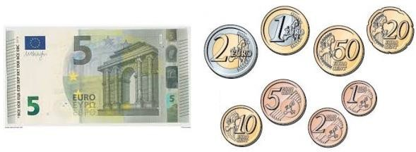

## **<H2 STYLE="COLOR:BLUE;">Le principe</H2>**

On veut réaliser une fonction `renduMonnaie(somme, pieces)` qui détermine les pièces à rendre dans un monnayeur.

Comment rendre la somme de 8€ ?




## **<H2 STYLE="COLOR:BLUE;">L’algorithme</H2>**

### **<H3 STYLE="COLOR:GREEN;">Algorithme pseudo code</H3>**

**Python**

```python
def renduMonnaie(somme, pieces):
    # Initialiser à zéro le dictionnaire choisies
    choisies = {p: 0 for p in pieces}
    for p in pieces:
        while somme >= p:
            somme -= p
            choisies[p] += 1
    return choisies
```

### **<H3 STYLE="COLOR:GREEN;">Résultat dans la console</H3>**

```python
# pièces en centimes d'euros
pieces = [500, 200, 100, 50, 20, 10, 5, 2, 1]
somme = 780
print('Les pièces choisies sont', renduMonnaie(somme, pieces))
```
???+ question "Tester ce qui est proposé"

    {{ IDE() }}


## **<H2 STYLE="COLOR:BLUE;">En utilisant une seule boucle pour :</H2>**

### **<H3 STYLE="COLOR:GREEN;">Algorithme pseudo code</H3>**

**Python**

```python
def renduMonnaie(somme, pieces):
    # Initialiser à zéro le dictionnaire choisies
    choisies = {p: 0 for p in pieces}
    for p in pieces:
        nb = somme // p
        choisies[p] = nb
        somme -= nb * p
    return choisies
```

### **<H3 STYLE="COLOR:MAGENTA;">Remarque :</H3>**

C'est un algorithme très simple et rapide et on appelle `canonique` un système de pièces pour lequel cet algorithme donne une solution optimale quelle que soit la valeur à rendre.

