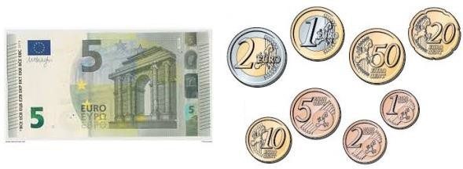

## <H2 style="color:blue;">💰 Le principe</H2>

On souhaite écrire une fonction `renduMonnaie(somme, pieces)` qui **détermine automatiquement quelles pièces** utiliser pour rendre une somme donnée.

🎯 Exemple :  
Comment rendre **780 centimes** (soit 7,80 €) avec les pièces disponibles ?



L'idée de l'algorithme glouton est simple :  
👉 On prend à chaque étape **la plus grosse pièce possible**, autant de fois que possible.

---

## <H2 style="color:blue;">⚙️ L’algorithme glouton</H2>

### <H3 style="color:green;">🔁 Version avec boucle et soustraction répétée</H3>

```python
def renduMonnaie(somme, pieces):
    # Initialiser le dictionnaire des pièces utilisées
    choisies = {p: 0 for p in pieces}
    for p in pieces:
        while somme >= p:
            somme -= p
            choisies[p] += 1
    return choisies
```

📌 Test dans la console :

```python
# Pièces disponibles (en centimes)
pieces = [500, 200, 100, 50, 20, 10, 5, 2, 1]
somme = 780

print("Les pièces choisies sont :", renduMonnaie(somme, pieces))
```

???+ question "❓Tester ce qui est proposé"

    {{ IDE() }}

---

## <H2 style="color:blue;">🔄 Version optimisée : une seule boucle</H2>

### <H3 style="color:green;">⏱️ Optimisation avec divisions entières</H3>

```python
def renduMonnaie(somme, pieces):
    # Initialiser le dictionnaire des pièces utilisées
    choisies = {p: 0 for p in pieces}
    for p in pieces:
        nb = somme // p      # combien de pièces de cette valeur ?
        choisies[p] = nb
        somme -= nb * p      # mettre à jour la somme restante
    return choisies
```

✅ Cette version est **plus rapide** : on évite les boucles `while` imbriquées.

---

### <H3 style="color:magenta;">💡 Remarque importante : système canonique</H3>

Un système de pièces est dit **canonique** si l’algorithme glouton donne **toujours** la **solution optimale**, c’est-à-dire avec **le plus petit nombre de pièces possible**.

🪙 Le système monétaire en euros est **canonique**.
Mais ce n’est pas toujours le cas ! Certains ensembles de pièces **non classiques** peuvent piéger l’algorithme glouton.

Pour s'entrainer par ordre de dificulté croissante : 
- [CODEX : rendu de monnaie](https://codex.forge.apps.education.fr/exercices/rendu_monnaie_3p/)
- [CODEX : Livraisons à Manhattan](https://codex.forge.apps.education.fr/exercices/manhattan/)
- [CODEX : Mises en boîtes](https://codex.forge.apps.education.fr/en_travaux/mise_en_boites/)
- [CODEX : Nombre minimal de quais](https://codex.forge.apps.education.fr/exercices/nombre_quais/)
- [CODEX : partition équilibrée](https://codex.forge.apps.education.fr/exercices/partition_equilibree_1/)
- [CODEX : Jouons au golf!](https://codex.forge.apps.education.fr/en_travaux/golf/)
- [CODEX : Numération Shadock](https://codex.forge.apps.education.fr/exercices/numeration_shadock/)