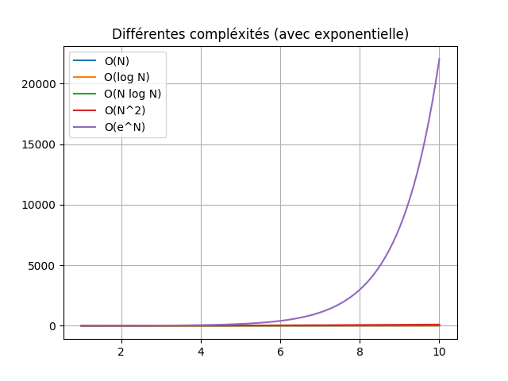
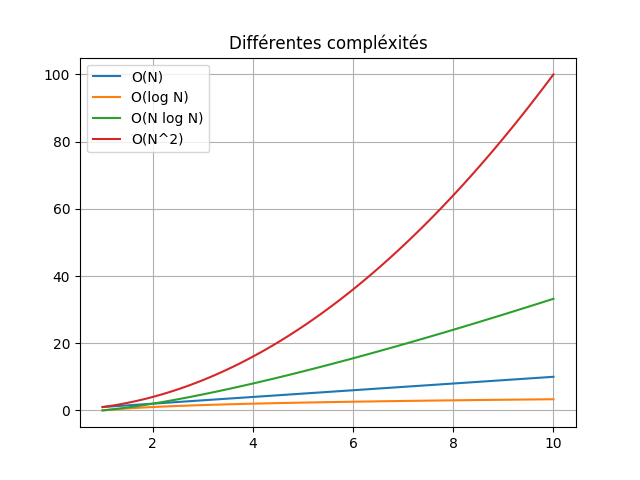
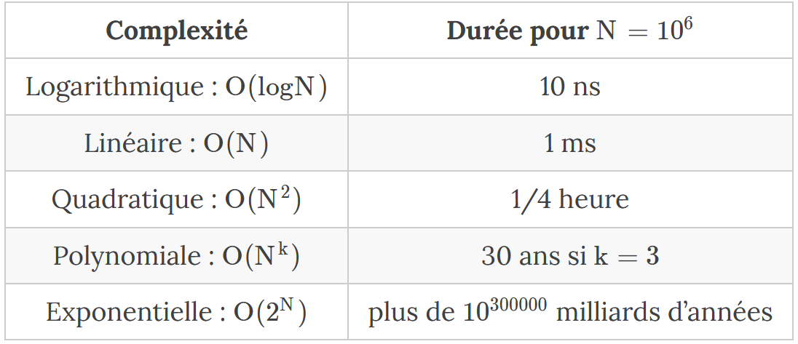

## **<H2 STYLE="COLOR:BLUE;">Algorithmique</H2>**

Un algorithme est une suite finie et non ambiguë d’opérations ou d’instructions à réaliser afin de résoudre un problème.

En informatique, pour qu’un algorithme puisse être implémenté, il est nécessaire de s’assurer que la « suite finie et non ambiguë d’opérations ou d’instructions à réaliser » s’effectue en une durée finie.

Lorsqu’on élabore ou étudie un algorithme, il est donc nécessaire de vérifier :

- **Sa finitude** : Il doit se terminer en un temps fini.
- **Sa correction** : Il doit (généralement) donner le bon résultat.
- **Sa performance** : Plusieurs algorithmes peuvent permettre de résoudre une même classe de problèmes. Ils ne nécessiteront cependant pas tous l’utilisation de la même quantité de mémoire ou le même nombre d’étapes de calcul, donc la même durée.

### **<H3 STYLE="COLOR:GREEN;">Remarques</H3>**

- Ce n’est pas toujours une mauvaise nouvelle si certains algorithmes ont besoin d’un « temps infini » pour résoudre un problème : certains choix en cryptographie reposent sur l’idée que « casser » la protection nécessite une durée de calcul trop grande pour le matériel dont on dispose aujourd’hui.
- Pour certains problèmes, on doit se contenter d’une solution approchée et pas d’une solution exacte.

La performance d’un algorithme porte sur deux aspects : **la durée du calcul** et la **quantité de mémoire** nécessaires à la résolution du problème. Malheureusement, ces deux points s’opposent. Il est souvent nécessaire d’occuper davantage de mémoire pour gagner en temps de calcul ou d’écrire plus d’instructions et donc faire plus de calculs pour aboutir à une gestion de la mémoire optimale.

Conformément au programme, on limite la performance algorithmique à la **complexité algorithmique**.

## **<H2 STYLE="COLOR:BLUE;">Notion de complexité algorithmique</H2>**

La **complexité algorithmique** donne des informations sur la durée du calcul nécessaire à la résolution du problème.

Les complexités des différents algorithmes varient beaucoup. On peut néanmoins regrouper les algorithmes en quelques grandes familles :

### **<H3 STYLE="COLOR:GREEN;">Complexité constante :</H3>**

Leur notation est de la forme $O(1)$. Ces algorithmes sont indépendants du nombre de données à traiter.

La complexité constante apparaît dans **la recherche par index dans un tableau**. La complexité constante est la plus « performante ».

### **<H3 STYLE="COLOR:GREEN;">Les algorithmes logarithmiques :</H3>**

Leur notation est de la forme $O(log N)$. Ces algorithmes sont très performants en temps de traitement. Le nombre de calculs dépend du logarithme du nombre de données à traiter.

La complexité logarithmique apparaît dans les problèmes dans lesquels l’ensemble des données peut être décomposé en deux parties égales qui sont elles-mêmes décomposées en 2 (**recherche par dichotomie**, **recherche dans un arbre binaire**, etc.). La complexité logarithmique est très « performante ».

### **<H3 STYLE="COLOR:GREEN;">Les algorithmes linéaires :</H3>**

Leur notation est de la forme $O(N)$. Ces algorithmes sont rapides. Le nombre de calculs dépend de manière linéaire du nombre de données initiales à traiter.

La complexité linéaire apparaît dans les problèmes dans lesquels on parcourt séquentiellement l’ensemble des données pour réaliser une opération (**recherche d’une valeur** par exemple). La complexité linéaire est considérée comme « efficace ».

### **<H3 STYLE="COLOR:GREEN;">Les algorithmes linéaires et logarithmiques (quasi-linéaire) :</H3>**

Leur notation est de la forme $O(N log N)$.

La complexité linéaire et logarithmique apparaît dans des problèmes dans lesquels on découpe répétitivement les données en deux parties que l’on parcourt séquentiellement ensuite (**tri Quicksort** par exemple). La complexité quasi-linéaire est considérée comme « assez efficace ».

### **<H3 STYLE="COLOR:GREEN;">Les algorithmes de type polynomiale :</H3>**

Leur notation est de la forme $O(N^k)$ où k est la puissance.

Une complexité quadratique apparaît par exemple lorsqu’on **parcourt un tableau à deux dimensions**, lorsqu’on effectue un tri par comparaison, etc. La complexité polynomiale est considérée comme « moyennement efficace ».

### **<H3 STYLE="COLOR:GREEN;">Les algorithmes exponentiels ou factoriels :</H3>**

Leur notation est de la forme $O(e^N)$ ou $O(N!)$. Ce sont les algorithmes les plus complexes.

Le nombre de calculs augmente de façon exponentielle ou factorielle en fonction du nombre de données à traiter. Un algorithme de complexité exponentielle traitera dans le pire des cas un ensemble de 10 données en effectuant 22026 calculs ; un ensemble de 100 données en effectuant $2.688⋅10^{43}$ calculs !!! On dit généralement que les problèmes produisant ce type d’algorithmes sont « **non calculables** ».

On rencontre les algorithmes de type exponentiels ou factoriels dans les problématiques liées à la programmation de fonctions humaines comme la vision, la reconnaissance des formes ou l’intelligence artificielle.







Ordres de grandeur des durées d’exécution d’un problème de taille $10^6$ sur un ordinateur à un milliard d’opérations par seconde (« Informatique pour tous en CPGE », éditions Eyrolles).

## **<H2 STYLE="COLOR:BLUE;">Terminaison d’un algorithme itératif : variant de boucle</H2>**

On appelle **variant** d’une boucle une fonction qui a pour variables les variables du problème, qui retourne une valeur entière positive et qui décroît à chacune des itérations de la boucle jusqu’à s’annuler ou prendre une valeur constante négative qui dépend de la condition d’arrêt de la boucle.

**La découverte d’un variant de boucle permet de conclure** que la boucle se termine puisqu’il n’existe aucune suite infinie strictement décroissante d’entiers naturels.

### **<H3 STYLE="COLOR:GREEN;">Exemple :</H3>**

**Fonction : plusPetitePuissance(n)**

**Entrée :** entier naturel n  
**Sortie :** entier naturel p dont la valeur est égale à la plus petite puissance de deux supérieure ou égale à n.

```texte
Début
    p ⟵ 1
    TantQue p < n Faire
        p ⟵ 2 * p
    FinTantQue
Fin
```

La fonction f d’expression `f(p) = n − p` est-elle un variant de boucle ?

- f(p) est un entier.

- Tant que p < n, f(p) > 0.

- f décroît sur l’ensemble des valeurs de p puisque  

  $f(p_{i+1}) − f(p) = n − p_{i+1} − n + p_i = p_i − p_{i+1} = p_i − 2 * p_i = −p_i < 0$

- Condition d’arrêt : $p_{max} >= n$ donc $f(p_{max}) <= 0$.

La fonction f est un variant de boucle et la boucle se termine donc bien.

## **<H2 STYLE="COLOR:BLUE;">Correction d’un algorithme itératif : invariant de boucle</H2>**

On appelle **invariant** d’une boucle une propriété qui, si elle est vraie avant l’exécution d’une itération, le demeure après l’exécution de l’itération. Un invariant de boucle doit être vrai avant de commencer la boucle et est alors garanti de rester correct après chaque itération de la boucle. En particulier, l’invariant sera toujours vrai à la fin de la boucle.

### **<H3 STYLE="COLOR:GREEN;">Exemple :</H3>**

**Fonction : calculPuissanceDeux(n)**

**Entrée :** entier naturel n  
**Sortie :** entier naturel p dont la valeur est égale à $2^n$

```texte
Début
    p ⟵ 1
    Pour k allant de 1 à n faire
        p ⟵ 2 * p
    FinPour
Fin
```

La propriété « À chaque tour de boucle p est une puissance de 2 » est un invariant de boucle. En effet :

- **Initialisation** : Avant d’entrer dans la boucle : $p = 1 = 2^0$.

- **Conservation** : On suppose l’invariant vérifié au tour i de la boucle : $p = 2^i$.

  Au tour i+1 : $p_{i+1} = p_i × 2 = 2^i × 2 = 2^{i+1}$.

- **Terminaison** : La boucle réalise n tours ; au dernier tour $p = 2^{n−1} × 2 = 2^n$.

La proposition est donc bien un invariant de boucle et on peut conclure que l’algorithme est correct.

