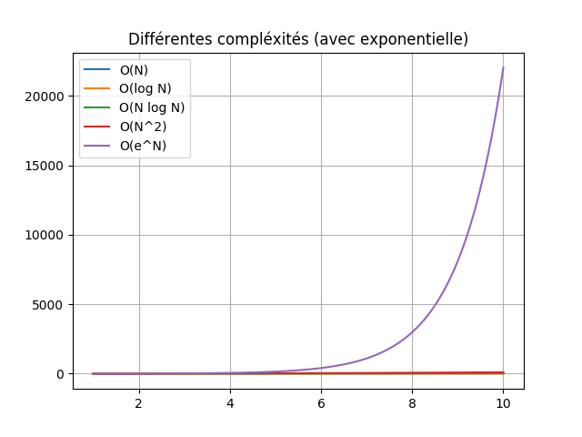
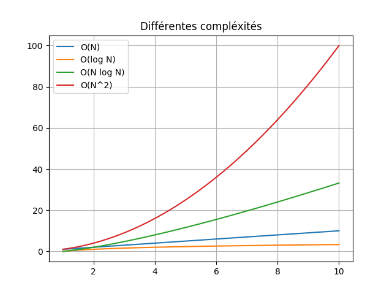
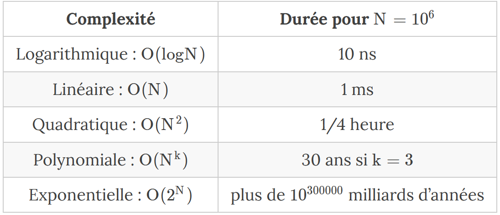

## <H2 style="color:blue;">📌 Qu’est-ce qu’un algorithme ?</H2>

Un **algorithme** est une suite **finie** et **non ambiguë** d’instructions permettant de résoudre un problème.

💻 En informatique, un bon algorithme doit :

- ✅ **Se terminer** (finitude)
- ✅ **Donner le bon résultat** (correction)
- ✅ **Être performant** (en temps et en mémoire)

---

## <H2 style="color:blue;">⚙️ Critères à vérifier</H2>

- 🔁 **Finitude** : il doit s’arrêter après un certain nombre d’étapes.
- 🎯 **Correction** : le résultat produit doit être juste.
- ⏱️ **Performance** : il faut évaluer **le temps de calcul** et **l’espace mémoire**.

⚠️ Souvent, **plus on veut aller vite**, plus on **consomme de mémoire**… et inversement !

🎯 En NSI, on se concentre surtout sur la **complexité algorithmique** (la durée estimée du calcul).

---

## <H2 style="color:blue;">📈 La complexité algorithmique</H2>

Elle mesure **l’évolution du temps d’exécution** en fonction du nombre d’éléments à traiter (`N`).

---

### <H3 style="color:green;">🔹 Complexité constante — O(1)</H3>

➡️ Le temps d’exécution **ne dépend pas** de la taille des données.

📌 Exemple : accéder à un élément d’une liste par son indice.  
🧠 Ultra performant.

---

### <H3 style="color:green;">🔹 Complexité logarithmique — O(log N)</H3>

➡️ Le nombre d’étapes augmente **lentement** quand `N` augmente.

📌 Exemple : **recherche dichotomique**, **parcours d’arbre binaire**  
⚡ Très rapide !

---

### <H3 style="color:green;">🔹 Complexité linéaire — O(N)</H3>

➡️ Le temps augmente **proportionnellement** à `N`.

📌 Exemple : parcourir une liste pour chercher une valeur.  
✅ Rapide mais pas optimal.

---

### <H3 style="color:green;">🔹 Complexité quasi-linéaire — O(N log N)</H3>

➡️ Combinaison d’un tri divisé + parcours séquentiel.

📌 Exemple : **tri rapide (quicksort)**  
👍 Très efficace.

---

### <H3 style="color:green;">🔹 Complexité polynomiale — O(N²), O(N³), …</H3>

➡️ Le temps explose si `N` devient grand.

📌 Exemple : **tri par sélection**, **double boucle imbriquée**  
🚫 Acceptable uniquement pour de petites tailles.

---

### <H3 style="color:green;">🔹 Complexité exponentielle / factorielle — O($2^N$), O(N!)</H3>

➡️ Le **temps double ou plus** à chaque ajout de données !

📌 Exemple : **voyageur de commerce**, **résolution naïve de Sudoku**, IA, etc.  
🛑 Non calculable pour N > 20

---





⏱️ **Ordres de grandeur** : même avec 1 milliard d’opérations par seconde, certains problèmes sont **intraitables** dès qu’ils dépassent 20 ou 30 éléments…

---

## <H2 style="color:blue;">🔁 Terminaison d’un algorithme : variant de boucle</H2>

Un **variant de boucle** est une **valeur entière** qui **diminue à chaque tour de boucle**.  
➡️ Cela permet de garantir que la boucle **va s’arrêter**.

---

### <H3 style="color:green;">Exemple – Plus petite puissance de 2</H3>

**Fonction :** plusPetitePuissance(n)  
**Objectif :** retourner la plus petite puissance de 2 ≥ n

```pseudo
Début
    p ← 1
    TantQue p < n faire
        p ← 2 × p
Fin
```

🔍 On pose `f(p) = n - p`

* f(p) est entier positif
* À chaque tour : `p` augmente donc `f(p)` diminue
* Quand `p ≥ n`, on sort

✅ f(p) est un variant de boucle → l’algorithme **se termine**.

---

## <H2 style="color:blue;">✅ Correction d’un algorithme : invariant de boucle</H2>

Un **invariant de boucle** est une propriété :

* vraie **avant** la boucle,
* **conservée** à chaque itération,
* donc vraie **à la fin**.

C’est ce qui permet de **garantir la justesse** d’un algorithme.

---

### <H3 style="color:green;">Exemple – Calcul de 2ⁿ</H3>

**Fonction :** calculPuissanceDeux(n)
**Objectif :** retourner $2^n$

```pseudo
Début
    p ← 1
    Pour k de 1 à n faire
        p ← 2 × p
Fin
```

🧠 Invariant : « p est une puissance de 2 »

* **Avant la boucle** : p = 1 = 2⁰
* **Si p = 2ᵏ**, alors `p ← 2 × p = 2ᵏ × 2 = 2ᵏ⁺¹`
* **À la fin** : on a fait n tours → p = 2ⁿ

✅ La propriété est conservée → l’algorithme est **correct**.

---

