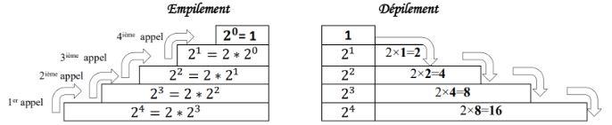
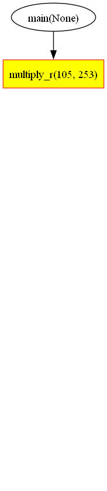

---
author: ELP
title: 02a Récursivité
---


**Table des matières**

[1.	Algorithmes récursifs](#$toc144385077)

[2.	Les dangers de la récursivité](#$toc144385085)

[3.	Exercices](#$toc144385086)

[4.	Projet (démarche d’investigation)](#$toc144385087)


**Compétences évaluables :**

- Écrire un programme récursif
- Analyser le fonctionnement d'un programme récursif


## **<H2 STYLE="COLOR:BLUE;">1. Algorithmes récursifs<a name="#$toc144385077"></a>**</H2>

### **<H3 STYLE="COLOR:GREEN;">1.1. Introduction**</H3>

**<H3 STYLE="COLOR:RED;">Activité n°1 :**</H3> Etudions ces deux algorithmes d’implémentation d’une fonction `decompte(n)`

#### Version itérative :

```python
def decompte_i(n):
    while n > 0:
        print(n)
        n -= 1
    print("fin")

print(decompte_i(5))
```

???+ question "Tester ce qui est proposé"

    {{ IDE() }}

#### Version récursive :

```python
def decompte_r(n):
    if n == 0:
        print("fin")
    else:
        print(n)
        decompte_r(n - 1)

print(decompte_r(5))
```

???+ question "Tester ce qui est proposé"

    {{ IDE() }}

**<H3 STYLE="COLOR:RED;">Activité n°2 :**</H3> Tester les deux fonctions sur 

- Python Tutor : version itérative

<iframe width="800" height="500" frameborder="0" src="https://pythontutor.com/iframe-embed.html#code=def%20decompte_i%28n%29%3A%0A%20%20%20%20while%20n%20%3E%200%3A%0A%20%20%20%20%20%20%20%20print%28n%29%0A%20%20%20%20%20%20%20%20n%20-%3D%201%0A%20%20%20%20print%28%22fin%22%29%0A%0Aprint%28decompte_i%285%29%29&codeDivHeight=400&codeDivWidth=350&cumulative=false&curInstr=0&heapPrimitives=nevernest&origin=opt-frontend.js&py=3&rawInputLstJSON=%5B%5D&textReferences=false"> </iframe>

- Python Tutor : version récursive

<iframe width="800" height="500" frameborder="0" src="https://pythontutor.com/iframe-embed.html#code=def%20decompte_r%28n%29%3A%0A%20%20%20%20if%20n%20%3D%3D%200%3A%0A%20%20%20%20%20%20%20%20print%28%22fin%22%29%0A%20%20%20%20else%3A%0A%20%20%20%20%20%20%20%20print%28n%29%0A%20%20%20%20%20%20%20%20decompte_r%28n%20-%201%29%0A%0Aprint%28decompte_r%285%29%29&codeDivHeight=400&codeDivWidth=350&cumulative=false&curInstr=0&heapPrimitives=nevernest&origin=opt-frontend.js&py=3&rawInputLstJSON=%5B%5D&textReferences=false"> </iframe>

Une fonction qui s’appelle elle-même est dite **récursive**.

La récursivité est une méthode de résolution de problèmes qui consiste à décomposer le problème **en sous-problèmes identiques de plus en plus petits** jusqu’à obtenir un problème suffisamment petit pour qu’il puisse être résolu de **manière triviale**.

### **<H3 STYLE="COLOR:green;">1.2. Comment écrire une fonction récursive ?**</H3>

Pour écrire une fonction récursive :

- **Un (ou plusieurs) cas de base :** Les valeurs d’entrées pour lesquelles on ne fait aucun appel récursif sont appelées les cas de base.
- **Appels récursifs (cas récursif) :** Appels de la méthode courante. Chaque suite d’appels récursifs doit essentiellement se terminer sur un cas de base.

```texte
def fonction(arguments):
    if condition d’arrêt:
        return cas de base
    else:
        return fonction(nouveaux arguments)
```

### **<H3 STYLE="COLOR:GREEN;">1.3. Application à la fonction puissance**</H3>

Le but est d’écrire une fonction $puissance(x, n)$ sans utiliser `**` de Python : On cherche à calculer l’opération de puissance n-ième d’un nombre `x` c’est-à-dire la multiplication répétée n fois de `x` avec lui-même : $x^n = x × ... × x$ n fois sans utiliser `**`.

**Cas de base :**
On sait que la puissance de `x` pour `n = 0` vaut 1. 

**Cas récursif :**
c’est-à-dire le passage des valeurs renvoyées par l'appel précédent à l'appel suivant. On sait : $x^n = x × ... × x (n fois)$  = $x × x^{n-1}$ (appel précédent).

**Remarque** : il est très important de supposer que les appels récursifs donnent les bons résultats => Faire confiance à la récursion.

**<H3 STYLE="COLOR:RED;">Activité n°3 :**</H3> Implémentation de la fonction en Python

```python
def puissance(x, n):
    if n == 0:
        return 1
    else:
        return x * puissance(x, n - 1)

print(puissance(2, 5))
```

???+ question "Tester ce qui est proposé"

    {{ IDE() }}

**Remarque :** Souvent on « oublie » de noter le `else` car si on ne fait pas le cas de base, le cas récursif doit se faire par défaut.

```python
def puissance(x, n):
    if n == 0:
        return 1
    return x * puissance(x, n - 1)

print(puissance(2, 4))
```

???+ question "Tester ce qui est proposé"

    {{ IDE() }}

**Correction**

- **Preuve de terminaison** :
À chaque appel, la valeur du paramètre (n) diminue strictement. L’appel récursif s’arrête dès que n sera égal à 0. L’algorithme s’arrête alors.

- **Correction partielle** :
À chaque boucle on peut écrire :

- $x × puissance(x, n-1)$
- Puis $x × x × puissance(x, n-2)$
- Puis $x × x × x × puissance(x, n-3)$
- Et ainsi de suite jusqu’à $n = 0$
- $x × ... × x$ (n fois) $× 1$

On obtient bien la fonction souhaitée.

**Remarque :** Le principe de programmation par récursivité est basé sur le fonctionnement de « l’empilement – dépilement » à l’aide d’une pile d’exécution stockant l’adresse mémoire de la prochaine instruction machine à exécuter et conservant une "trace" des valeurs des variables.

Dans le cas de puissance(2,4) on obtiendra :



La mise en œuvre des algorithmes récursifs nécessite le plus souvent une **pile d’exécution**. 

### **<H3 STYLE="COLOR:green;">1.4. Fonction récursive sans cas de base….**</H3>

**<H3 STYLE="COLOR:RED;">Activité n°4 :**</H3> Fonction récursive sans condition d’arrêt :

```
>>> def f(n):
...     return 1+f(n+1)
...
>>> f(0)

Traceback (most recent call last):
  File "<pyshell#4>", line 1, in <module>
    f(0)
  File "<pyshell#3>", line 2, in f
    return 1 + f(n+1)
  File "<pyshell#3>", line 2, in f
    return 1 + f(n+1)
  File "<pyshell#3>", line 2, in f
    return 1 + f(n+1)
  [Previous line repeated 1022 more times]
RecursionError: maximum recursion depth exceeded

```


Ici la fonction ne s’arrêtera jamais !!

L’interpréteur Python **limite** arbitrairement le nombre d’appels récursifs (la valeur par défaut est égale à 1000).

**Remarque :** Pour augmenter ce nombre :

```python
import sys
sys.setrecursionlimit(1500)
```

### **<H3 STYLE="COLOR:GREEN;">1.5. Application à la multiplication du paysan russe**</H3>

La méthode du paysan russe est un très vieil algorithme de **multiplication de deux nombres entiers.** Il s’agissait de la principale méthode de calcul en Europe avant l’introduction des chiffres arabes et les premiers ordinateurs l’ont utilisée avant que la multiplication ne soit directement intégrée dans le processeur sous forme de circuit électronique.


```
fonction multiply(x,y)
  p := 0
  tant que x > 0 
	si x est impair faire
		p := p + y 
	x := x // 2
	y := y * 2
  fin tant que
  return p
```
Calcul de 105 x 253 par la méthode du paysan russe, p = 0 (au départ)


|*x impair*|V|F|F|V|F|V|V|
| - | - | - | - | - | - | - | - |
|`       `p = p + y|253|||2277||10373|26565|
|x = x // 2|52|26|13|6|3|1|0|
|y = y \* 2|506|1012|2024|4048|8096|16192|32384|

105 x 253 = 26565


On ramène ainsi le problème du calcul du produit de *x* par *y* à un **sous-problème**. 

**<H3 STYLE="COLOR:RED;">Activité n°5 :**</H3> On peut implémenter la version itérative et la version récursive en Python ainsi :

#### Version itérative :

```python
def multiply_i(x, y):
    p = 0
    while x > 0:
        if x % 2 != 0:
            p += y
        x //= 2
        y *= 2
    return p

print(multiply_i(105, 253))
```

???+ question "Tester ce qui est proposé"

    {{ IDE() }}

#### Version récursive :

```python
def multiply_r(x, y):
    if x <= 0:  # cas de base
        return 0
    elif x % 2 == 0:
        return multiply_r(x // 2, y * 2)
    else:
        return multiply_r(x // 2, y * 2) + y

print(multiply_r(105, 253))
```

???+ question "Tester ce qui est proposé"

    {{ IDE() }}




### **<H3 STYLE="COLOR:green;">1.6. Application au calcul de factorielle**</H3>

**La factorielle : qu’est-ce que c’est ?**
La fonction factorielle indique le nombre de permutations dans un ensemble comportant n éléments. Par exemple, il existe $3! = 6$ façons d’arranger les 3 caractères ‘a’ ‘b’ ‘c’ : `‘abc’ ‘acb’ ‘bac’ ‘bca’ ‘cab’ et ‘cba’`.

$n! = n × (n-1) × ... × 2 × 1$ pour `n` entier > 0. 

Cas particulier : $0! = 1$.

**<H3 STYLE="COLOR:RED;">Activité n°6 :**</H3> Tester les deux implémentations suivantes :

#### Version itérative :

```python
def factorielle_i(n):
    result = 1
    while n > 0:
        result *= n
        n -= 1
    return result

print(factorielle_i(10))
```

???+ question "Tester ce qui est proposé"

    {{ IDE() }}

#### Version récursive :

```python
def factorielle_r(n):
    if n == 1 or n == 0:
        return 1
    return n * factorielle_r(n - 1)

print(factorielle_r(10))
```

???+ question "Tester ce qui est proposé"

    {{ IDE() }}

### **<H3 STYLE="COLOR:GREEN;">1.7. Application aux tours de Hanoï**</H3>

Le casse-tête des tours de Hanoï est un jeu de réflexion consistant à déplacer des disques de diamètres différents d'une tour de « départ » à une tour d'« arrivée » en passant par une tour « intermédiaire » en un minimum de coups tout en respectant les règles suivantes :

- On ne peut pas déplacer plus d'un disque à la fois.

- On ne peut placer un disque que sur un autre disque plus grand que lui ou sur un emplacement vide.

**Vidéo :** [Les tours de Hanoi](https://www.youtube.com/watch?v=U3nGNJTxYc4)

Pour résoudre le problème des tours de Hanoï, il faut raisonner récursivement. 

**<H3 STYLE="COLOR:RED;">Activité n°7 :**</H3> Implémentation en Python

```python
def hanoi(n, a="A", b="B", c="C"):
    if n == 0:  # cas de base
        return None
    hanoi(n - 1, a, c, b)  # de A vers B en passant par C
    print(f"Déplacer le disque {n} de la pique {a} vers la pique {c}.")
    hanoi(n - 1, b, a, c)  # de B vers C en passant par A

hanoi(4)
```

Pour mieux comprendre : [Les tours de Hanoï](http://accromath.uqam.ca/2016/02/les-tours-de-hanoi-et-la-base-trois/)

## **<H2 STYLE="COLOR:BLUE;">2. Les dangers de la récursivité<a name="#_toc144385085"></a>**</H2>

Utiliser une fonction récursive n’est pas toujours une bonne idée. Soit la suite de Fibonacci : 1 1 2 3 5 8 13 21 34…

Par définition :

- $F_0 = 0$
- $F_1 = 1$
- $F_n = F_{n-2} + F_{n-1}$ pour $n > 1$

On écrit deux fonctions (une récursive et une itérative) qui calculent le k-ième terme de cette suite puis on comparera les temps de calcul.

**<H3 STYLE="COLOR:RED;">Activité n°8 :**</H3> Implémenter les deux algorithmes suivants :

#### Version itérative :

```python
def fibo_it(n):
    fn_moins_2 = 0
    fn_moins_1 = 1
    i = 2
    if n == 0:
        return 0
    elif n == 1 or n == 2:
        return 1
    else:
        while i <= n:
            fn = fn_moins_2 + fn_moins_1
            fn_moins_2 = fn_moins_1
            fn_moins_1 = fn
            i += 1
        return fn
```

#### Version récursive :

```python
def fibo_recur(n):
    if n == 0:  # cas de base
        return 0
    elif n == 1 or n == 2:  # 2 autres cas
        return 1
    return fibo_recur(n - 1) + fibo_recur(n - 2)
```

```python
print(fibo_it(10))
print(fibo_recur(10))
```

**<H3 STYLE="COLOR:RED;">Activité n°9 :**</H3> On va comparer les temps de calcul pour chaque algorithme. Ajouter à la suite des deux algorithmes précédents :

```python
import time

for k in range(5):
    print((k + 1) * 10)
    a = time.perf_counter_ns()
    fibo_it((k + 1) * 10)
    b = time.perf_counter_ns()
    print("itératif :", b - a, "ns")
    a = time.perf_counter_ns()
    fibo_recur((k + 1) * 10)
    b = time.perf_counter_ns()
    print("récursif :", b - a, "ns")
```

**Table des résultats :**

| Fonction récursive (fib1) | Fonction itérative (fib2) |
|---------------------------|---------------------------|
| k   | Temps en ns         | Temps en ns               |
| --- | ------------------- | ------------------------- |
| 10  | 26 100              | 2 400                     |
| 20  | 2 359 600           | 3 100                     |
| 30  | 397 709 900         | 5 300                     |
| 40  | 42 835 094 000      | 6 900                     |
| 50  | 7 264 000 000       | 8 200                     |

Pourquoi une telle différence ?

Observons comment se passe le calcul récursif. Calculons `fib(5)` avec la méthode récursive :

```
fib(5)  -> fib(4) + fib(3)
        -> (fib(3) + fib(2)) + fib(3)
        -> ((fib(2) + fib(1)) + fib(2)) + fib(3)
        -> ((1 + fib(1)) + fib(2)) + fib(3)
        -> ((1 + 1) + fib(2)) + fib(3)
        -> (2 + fib(2)) + fib(3)
        -> (2 + 1) + fib(3)
        -> 3 + fib(3)
        -> 3 + (fib(2) + fib(1))
        -> 3 + (1 + fib(1))
        -> 3 + (1 + 1)
        -> 3 + 2
        -> 5
```

On peut aussi représenter les appels de fonction dans un arbre (arbre d’appels).

On voit que ce n’est pas efficace : par exemple `fib(3)` est appelé deux fois, ce qui est une perte de temps. De plus, on imagine bien que l’arbre va devenir très vite gigantesque avec un très grand nombre d’appels inutiles.

**"Marcher en itératif c’est mettre un pied devant l’autre et recommencer. Marcher en récursif c’est mettre un pied devant l’autre et marcher."**

## **<H2 STYLE="COLOR:BLUE;">3. Exercices<a name="#_toc144385086"></a>**</H2>

### **<H3 STYLE="COLOR:GREEN;">Exercice n°1 : La fonction somme**</H3>

Pour définir la somme des n premiers entiers, on a l’habitude d’écrire la formule suivante : $0 + 1 + 2 + ... + n$
Écrire une fonction $somme(n)$ en récursif.

**Aide :**
- Déterminer le(s) cas de base
- Déterminer le cas récursif

### **<H3 STYLE="COLOR:GREEN;">Exercice n°2 : Le palindrome**</H3>

On appelle palindrome un mot qui se lit dans les deux sens comme "selles" ou "radar".
La fonction ci-contre renvoie vrai si le mot passé en paramètre est un palindrome. Pour le mot "selles" composé de 6 lettres, on fait 3 comparaisons. Pour le mot "radar" composé de 5 lettres, on ne fait que 2 comparaisons (une unique lettre est forcément un palindrome).

En version récursive, l’idée est : "selles" est un palindrome si "s" = "s" et "elle" est un palindrome => cas récursif.
Écrire une version récursive de la fonction $est\_palindrome(mot)$.

**Aide :**

- Quel est les cas de base (cas d’arrêt) ?

    - Pour renvoyer True

    - Pour renvoyer False

- Déterminer le cas récursif

### **<H3 STYLE="COLOR:GREEN;">Exercice n°3 : Nombre d’adhérents**</H3>

Une association a remarqué que d’une année à l’autre :

- Elle perd 5% de ses adhérents

- Elle gagne 200 adhérents

En admettant que le nombre d’adhérents de cette association était égal à 2000 au 1er janvier 2020, écrire en Python une fonction récursive nommée $nombre(n)$ affichant le nombre théorique d’adhérents après n années.

**Aide :**

- Déterminer le cas de base

- Déterminer le nombre d’adhérents l’année suivante par rapport à l’année précédente

- Dans ce même programme, afficher le nombre théorique d’adhérents au cours des 20 prochaines années.

### **<H3 STYLE="COLOR:GREEN;">Exercice n°4 : La suite de Syracuse**</H3>

On appelle suite de Syracuse une suite d’entiers naturels définie de la manière suivante : On part d’un nombre entier plus grand que zéro. S’il est pair, on le divise par 2 ; s’il est impair, on le multiplie par 3 et on ajoute 1. En répétant l’opération, on obtient une suite d’entiers positifs dont chacun ne dépend que de son prédécesseur.

Par exemple, à partir de 14 on construit la suite des nombres : 14, 7, 22, 11, 34, 17, 52, 26, 13, 40, 20, 10, 5, 16, 8, 4, 2, 1, 4, 2, ...

C’est ce qu’on appelle la suite de Syracuse du nombre 14. Une fois le nombre 1 atteint, la suite des valeurs (1, 4, 2, 1, 4, 2, ...) se répète indéfiniment en un cycle de longueur 3 (appelé cycle trivial).

Elle est définie par :

- $x1 = a ∈ N*$

- $xn+1 = xn / 2$ si $xn$ est pair

- $3xn + 1$ si $xn$ est impair

Vérifier par le calcul que pour $a = 14$ et $n = 20$ la suite est des nombres : 14, 7, 22, 11, 34, 17, 52, 26, 13, 40, 20, 10, 5, 16, 8, 4, 2, 1, 4, 2.

Écrire en Python une fonction itérative $syracuse\_iter(a, n)$ : donnant la suite de Syracuse lorsqu’on entre en paramètre la valeur de $a$ et le rang $n$.

**Vérifier les tests suivants :**

```python
assert syracuse_iter(14, 1) == 14
assert syracuse_iter(14, 3) == 22
assert syracuse_iter(14, 20) == 2
```

Écrire une version récursive $syracuse_recur(a, n)$. 

**Vérifier les tests suivants :**

```python
assert syracuse_recur(14, 1) == 14
assert syracuse_recur(14, 3) == 22
assert syracuse_recur(14, 20) == 2
```

La conjecture de Syracuse (encore appelée conjecture de Collatz ou conjecture d’Ulam) est l’hypothèse mathématique selon laquelle la suite de Syracuse de n’importe quel entier strictement positif atteint 1.

Écrire la fonction $syracuse$ à un paramètre entier qui retourne la longueur de la suite de Syracuse de cet entier (le nombre de termes) pour obtenir 1.

```python
assert syracuse(14) == 18
assert syracuse(3) == 8
assert syracuse(2) == 2
```

### **<H3 STYLE="COLOR:GREEN;">Exercice n°5 : Le PGCD**</H3>

Calculer le PGCD de deux entiers `a` et `b` :

**Exemple :**

```python
pgcd(60, 32)
60 = 32 x 1 + 28
32 = 28 x 1 + 4
28 = 4 x 7 + 0
4 = 0 x 0 + 4
```

```python
pgcd(96, 36)
96 = 36 x 2 + 24
36 = 24 x 1 + 12
24 = 12 x 2 + 0
12 = 0 x 0 + 12
```

Écrire une fonction récursive $pgcd(a, b)$ qui renvoie le PGCD de deux entiers `a` et `b`.

**Exemple :**

```python
pgcd(96, 36) == 12
pgcd(60, 32) == 4
```

### **<H3 STYLE="COLOR:GREEN;">Exercice n°6 : Nombre de chiffres**</H3>

Écrire une fonction récursive $nombre\_de\_chiffres(n)$ qui prend un entier positif ou nul `n` en argument et renvoie son nombre de chiffres.

**Exemple :**

```python
nombre_de_chiffres(34126) == 5
```

### **<H3 STYLE="COLOR:GREEN;">Exercice n°7 : Appartient**</H3>

Écrire une fonction récursive $appartient(v, t, i)$ prenant en paramètres une valeur `v`, un tableau `t` et un entier `i` et renvoyant `True` si `v` apparaît dans `t` entre l’indice `i` (inclus) et `len(t)` (exclu) et `False` sinon.

**Exemple :**

```python
t = [1, 3, 5, 6, 7, 9, 10]
appartient(7, t, 5) == False
appartient(7, t, 3) == True
```

### **<H3 STYLE="COLOR:GREEN;">Exercice n°8 : Le triangle de Pascal**</H3>

Le triangle arithmétique de Pascal est le triangle dont la ligne d'indice `n` (n = 0, 1, 2, ...) donne les coefficients binomiaux $C(n, p)$ pour $p = 0, 1, 2, ... n$.

Les coefficients du triangle de Pascal sont les coefficients du développement de $(a + b)^n$.

**Exemple :**

La ligne 0 est : 1, soit le coefficient de $(a + b)^0 = 1$.

La ligne 1 est : 1 - 1, soit les coefficients de $(a + b)^1 = 1×a + 1×b$.

La ligne 2 est : 1 - 2 - 1, soit les coefficients de $(a + b)^2 = 1×a^2 + 2×ab + 1×b^2$.

La ligne 3 est : 1 - 3 - 3 - 1, soit les coefficients de $(a + b)^3 = 1×a^3 + 3×a^2b + 3×ab^2 + 1×b^3$.

La ligne 4 est : 1 - 4 - 6 - 4 - 1, soit les coefficients de $(a + b)^4 = 1×a^4 + 4×a^3b + 6×a^2b^2 + 4×ab^3 + 1×b^4$.

En analyse combinatoire, les nombres $C(n, p)$ correspondent au nombre de façons de tirer `p` objets parmi `n`.

**Exemple :**

La ligne 5 est : 1 - 5 - 10 - 10 - 5 - 1, donc :

- $C(5, 0) = 1$ : Il y a 1 seule façon de tirer 0 objet parmi 5.
- $C(5, 1) = 5$ : Il y a 5 façons de tirer 1 objet parmi 5.
- $C(5, 2) = 10$ : Il y a 10 façons de tirer 2 objets parmi 5.
- $C(5, 3) = 10$ : Il y a 10 façons de tirer 3 objets parmi 5.
- $C(5, 4) = 5$ : Il y a 5 façons de tirer 4 objets parmi 5.
- $C(5, 5) = 1$ : Il y a 1 seule façon de tirer 5 objets parmi 5.

Le triangle de Pascal est défini de manière récursive :

```markdown
C(n, p) = 1 si p = 0 ou n = p
C(n, p) = C(n - 1, p - 1) + C(n - 1, p) sinon.
```

Écrire une fonction récursive $C(n, p)$ qui renvoie la valeur de $C(n, p)$.

**Exemple :**

```python
C(10, 5) == 252
```

### **<H3 STYLE="COLOR:GREEN;">Exercice n°9 : Recherche dans une chaîne de caractères**</H3>

Écrire une fonction récursive nommée $est\_dans$ qui, à partir d’un caractère `e` et d’une chaîne de caractères `c`, détermine si ce caractère appartient à la chaîne.

Tester cette fonction.

**Remarque :** La fonction $est\_dans$ est un prédicat.

### **<H3 STYLE="COLOR:GREEN;">Exercice n°10 : Travail sur les listes**</H3>

Écrire une fonction nommée $longueur\_liste$ récursive qui, à partir d’une liste passée en argument, détermine sa longueur.

Écrire une fonction nommée $produit\_elements$ récursive qui, à partir d’une liste d’entiers passée en argument, calcule le produit de tous les nombres.

Écrire une fonction nommée $plus\_grand\_element$ récursive qui, à partir d’une liste d’entiers passée en argument, détermine quel est l’entier le plus grand.

Écrire une fonction nommée $plus\_petit\_element$ récursive qui, à partir d’une liste d’entiers passée en argument, détermine quel est l’entier le plus petit.

Écrire une fonction nommée $somme\_listes\_imbriquees$ récursive qui additionne tous les entiers des listes.

**Exemple de listes imbriquées :**

```python
l1 = [1, [2, [3, 4], 5], 6, [7, 8]]
l2 = [1, [2, [3, [4, [5]]]]]
```

**Remarque :** Cette question peut illustrer par exemple la recherche de l’occupation disque de tous les fichiers dans la structure arborescente d’un système de fichiers à partir d’un point de cette structure.

Écrire une fonction nommée $duplique$ récursive qui, à partir d’un élément `e` et d’un entier `n`, retourne une liste qui contient l’élément `e` un nombre de fois égal à `n`.

```python
assert duplique(5, 3) == [5, 5, 5]
```

Écrire une fonction nommée $extrait$ récursive qui, à partir d’une liste `l` et d’un entier `n`, retourne une liste constituée par les `n` premiers éléments de `l`.

```python
assert extrait([5, 4, 3, 2, 1], 3) == [5, 4, 3]
```

Écrire une fonction nommée $renverse$ récursive qui, à partir d’une liste, retourne une liste dans laquelle les éléments sont renversés (les derniers apparaissent en premier).

## **<H2 STYLE="COLOR:BLUE;">4. Projet (démarche d’investigation)<a name="#$toc144385087"></a>**</H2>

### **<H3 STYLE="COLOR:GREEN;">Projet 1 : Le flocon de Koch**</H3>

Le flocon de Koch est l’une des premières courbes fractales à avoir été décrite (bien avant l’invention du terme « fractal(e)»). Elle a été inventée en 1904 par le mathématicien suédois Helge von Koch.

**Méthode de construction :**

1. On commence par un segment de longueur $a$.
2. On coupe ce segment en 3 parties égales.
3. Le segment central est remplacé par un triangle équilatéral de côté $a/3$.
4. Chaque segment de longueur $a/3$ est lui-même découpé en trois parties égales (donc de longueur $a/9$).
5. On remplace la partie centrale par un triangle équilatéral de côté $a/9$.
6. Etc...

On décide à l’avance quand on doit s’arrêter.

**Analyser ce script et le faire fonctionner :**

```python
import turtle
turtle.forward(100)
turtle.left(120)
turtle.forward(100)
turtle.left(120)
turtle.forward(100)
```

**Une autre partie de script à analyser et à faire fonctionner :**

```python
import turtle as t

# déplace la tortue aux coordonnées
t.penup()
t.goto(-100, 0)
t.pendown()

# orientation initiale de la tête : vers la droite de l’écran
t.setheading(0)
t.hideturtle()  # on cache la tortue
t.speed(0)  # on accélère la tortue
t.color('blue')
t.pensize(3)
t.forward(100)
t.left(60)
t.forward(100)
t.right(120)
t.forward(100)
t.left(60)
t.forward(100)
```

**Compléter l’algorithme suivant :**

```markdown
fonction koch(longueur, n):
    Si n = 0 alors
        On trace le segment de longueur côté
    Sinon
        On appelle la fonction flocon avec les paramètres ???
        On tourne de ???
        ???
        ???
        ???
        ???
        ???
```

**Implémenter l’algorithme :**

```python
import turtle

def koch(longueur, n):
    if n == 0:
        # à compléter
    else:
        # à compléter

koch(200, 3)
```

**Cerise sur le gâteau :** Sauriez-vous faire afficher cette figure :

### **<H3 STYLE="COLOR:GREEN;">Projet 2 : Le triangle de Sierpinski**</H3>

Utiliser une fonction récursive pour réaliser les triangles de Sierpinski ci-dessous.

Selon la valeur du nombre du niveau, on aura une représentation plus ou moins « dentelée ».

**Aides :**

- Seuls les petits triangles sont coloriés => mauvaise idée de tout colorier puis de rajouter des triangles blancs.
- Pour passer d’un triangle de niveau supérieur vers un triangle inférieur, il faut diviser par 2.

La fonction à créer a pour prototypage : $sierpinski(n : int, L : int)$ où $n$ est le niveau souhaité (de 0 à l’infini) et $L$ la longueur d’un des côtés du grand triangle.

On pourra prendre $L = 600$ et se déplacer au départ en $(-300, -300)$ pour centrer le dessin si on choisit d’aller vers la gauche…

Pensez à $turtle.speed(0)$ au début et $turtle.done()$ à la fin.

Au-dessus du 6ème niveau, il faut augmenter $L$ pour pouvoir le voir.

### **<H3 STYLE="COLOR:GREEN;">Projet 3 : Le tapis de Sierpinski**</H3>

Utiliser une fonction récursive pour réaliser les triangles de Sierpinski ci-dessous. L’idée est d’arriver à un beau tapis de ce style (le dernier).

**Principe mathématique :**

1. On part donc d’un carré vide que l’on s’empresse de découper en 9 cases identiques puis on remplit le carré central : Étape 1.
2. Ensuite dans chaque carré vide, on fait la même chose que dans le carré initial : on le découpe en 9 cases identiques et on remplit le carré central : Étape 2.
3. On recommence avec les nouveaux carrés vides : Étape 3.
4. Et on fait cela à l’infini. Le résultat final donne le tapis de Sierpinski.

### **<H3 STYLE="COLOR:GREEN;">Projet 4 : Arbre de Pythagore**</H3>

Proposer une tortue Python récursive réalisant :

- Avec $p = 1$ : Pythagore 1
- Avec $p = 2$ : Pythagore 2
- Avec $p = 3$ : Pythagore 3
- Avec $p = 10$ : Pythagore 10

**Aide :**

On pourra utiliser $turtle.colormode(255)$ pour coder en RGB puis un $random.randint(0, 255)$ sur les trois couleurs RGB.

### **<H3 STYLE="COLOR:GREEN;">Projet 5 : Arbre de la forêt**</H3>

Long en exécution…

Par exemple, pour construire un arbre, on part d’un segment et on applique la transformation présentée ci-dessus à chaque segment de la construction (on refait la transformation $n$ fois pour obtenir un arbre d’ordre $n$).

**Base de la construction d'un arbre :**

Les portions dessinées en pointillées sont celles sur lesquelles on appliquera la transformation à l’ordre suivant (on les appelle les segments non-terminaux). Les portions dessinées en trait plein sont des segments qui ne seront pas transformés (on les appellera les segments terminaux).

Pour transformer un segment non-terminal de longueur $l$, on trace un segment terminal de longueur $l/3$ puis deux segments non-terminaux de longueur $2l/3$ à un angle $θ$ du premier segment.


