---
author: ELP
title: 02a Récursivité
---

**Table des matières**

[1. 📘 Algorithmes récursifs](#_page0_x40.00_y375.04)  
[2. ⚠️ Les dangers de la récursivité](#_page0_x40.00_y375.02)  
[3. 📝 Exercices](#_page0_x40.00_y375.03)  
[4. 🔍 Projet (démarche d’investigation)](#_page0_x40.00_y375.044)

---

🎯 **Compétences évaluables :**

- ✏️ Écrire un programme récursif  
- 🔎 Analyser le fonctionnement d'un programme récursif

---

## <H2 style="color:blue;">📘 1. Algorithmes récursifs<a name="_page0_x40.00_y375.04"></a></H2>

### <H3 style="color:green;">🧠 1.1. Introduction</H3>

???+ question "🎯 Activité n°1 : Étudier deux versions d’un algorithme `decompte(n)`"

    Compare les deux versions proposées : une itérative, une récursive.

    🔁 Version itérative
    ```python
    def decompte_i(n):
        while n > 0:
            print(n)
            n -= 1
        print("fin")

    print(decompte_i(5))
    ```
        
    ??? success "Python"
        {{ IDE() }}

    🔄 Version récursive
    ```python
    def decompte_r(n):
        if n == 0:
            print("fin")
        else:
            print(n)
            decompte_r(n - 1)

    print(decompte_r(5))
    ```
    ??? success "Python"
        {{ IDE() }}

---

???+ question "🧪 Activité n°2 : Visualiser les deux fonctions sur Python Tutor"

    Utilise les visualisations ci-dessous pour comparer les fonctionnements internes.

    ✅ **Itératif :**
    
    <iframe width="800" height="500" frameborder="0" src="https://pythontutor.com/iframe-embed.html#code=def%20decompte_i%28n%29%3A%0A%20%20%20%20while%20n%20%3E%200%3A%0A%20%20%20%20%20%20%20%20print%28n%29%0A%20%20%20%20%20%20%20%20n%20-%3D%201%0A%20%20%20%20print%28%22fin%22%29%0A%0Aprint%28decompte_i%285%29%29&codeDivHeight=400&codeDivWidth=350&cumulative=false&curInstr=0&heapPrimitives=nevernest&origin=opt-frontend.js&py=3&rawInputLstJSON=%5B%5D&textReferences=false"> </iframe>

    ✅ **Récursif :**

    <iframe width="800" height="500" frameborder="0" src="https://pythontutor.com/iframe-embed.html#code=def%20decompte_r%28n%29%3A%0A%20%20%20%20if%20n%20%3D%3D%200%3A%0A%20%20%20%20%20%20%20%20print%28%22fin%22%29%0A%20%20%20%20else%3A%0A%20%20%20%20%20%20%20%20print%28n%29%0A%20%20%20%20%20%20%20%20decompte_r%28n%20-%201%29%0A%0Aprint%28decompte_r%285%29%29&codeDivHeight=400&codeDivWidth=350&cumulative=false&curInstr=0&heapPrimitives=nevernest&origin=opt-frontend.js&py=3&rawInputLstJSON=%5B%5D&textReferences=false"> </iframe>

🧠 Une fonction qui s’appelle elle-même est dite **récursive**.

La récursivité est une méthode de résolution de problème qui **découpe un problème complexe en versions plus simples de lui-même**, jusqu’à arriver à un cas **facile à résoudre**.

---

### <H3 style="color:green;">🧩 1.2. Comment écrire une fonction récursive ?</H3>

Pour bien écrire une fonction récursive, il faut :

- 🟢 **Un ou plusieurs cas de base** : les situations où l’on **ne fait plus d’appel récursif**.
- 🔁 **Un appel récursif** qui **rapproche du cas de base**.

```python
def fonction(arguments):
    if condition d’arrêt:
        return cas de base
    else:
        return fonction(nouveaux arguments)
```

➡️ Chaque appel de la fonction **réduit le problème**, jusqu’à arriver à une situation qui **ne nécessite plus de récursion**.

---

### <H3 style="color:green;">📐 1.3. Application à la fonction puissance</H3>

Le but est d’écrire une fonction `puissance(x, n)` **sans utiliser `**`**.  
On cherche à calculer $x^n = x × x × … × x$ (n fois).

✅ **Cas de base :**  
La puissance de `x` pour `n = 0` vaut **1**.

🔁 **Cas récursif :**  
On utilise la relation :  
$x^n$ = $x \times x^{n-1}$  
C’est-à-dire, on **multiplie x par la puissance précédente**.

🧠 **Remarque pédagogique :**  
Il est très important de **faire confiance à la récursion** : on suppose que les appels récursifs donnent les bons résultats.

---

???+ question "🎯 Activité n°3 : Implémenter la fonction puissance"

    Implémente la fonction récursive suivante :

    ```python
    def puissance(x, n):
        if n == 0:
            return 1
        else:
            return x * puissance(x, n - 1)

    print(puissance(2, 5))
    ```
    ??? success "Python"
        {{ IDE() }}

---

📝 **Remarque de style :**  
On peut écrire une version **plus concise** en **oubliant** volontairement le `else`.

???+ question "🎯 Variante plus concise"

    Voici une version équivalente, souvent utilisée en pratique :

    ```python
    def puissance(x, n):
        if n == 0:
            return 1
        return x * puissance(x, n - 1)

    print(puissance(2, 4))
    ```
    ??? success "Python"
        {{ IDE() }}

---

### <H3 style="color:green;">🔎 Analyse de correction</H3>

✅ **Preuve de terminaison :**  
À chaque appel récursif, la valeur de `n` diminue strictement.  
L’appel s’arrête dès que `n == 0`.

✅ **Correction partielle :**  
Déroulé des appels :

- `x * puissance(x, n-1)`
- `x * x * puissance(x, n-2)`
- `x * x * x * puissance(x, n-3)`
- …
- jusqu’à obtenir `x * ... * x * 1` (n fois)

On obtient bien la valeur attendue de $x^n$.

---

📌 **Pile d’exécution**

La récursivité repose sur une **pile d’exécution** : chaque appel récursif empile l’état courant, et Python « dépile » ces états lors du retour.

🧠 Exemple : `puissance(2, 4)` produit un empilement visuel que l'on peut schématiser ainsi :

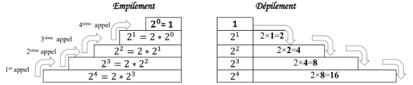

---

### <H3 style="color:green;">❌ 1.4. Fonction récursive sans cas de base</H3>

???+ question "🎯 Activité n°4 : Observer un appel récursif sans condition d’arrêt"

    Que se passe-t-il si une fonction récursive **n’a pas de condition d’arrêt** ?

    ```python
    def f(n):
        return 1 + f(n + 1)

    f(0)
    ```
    ??? success "Python"
        {{ IDE() }}

    Résultat :
    ```
    RecursionError: maximum recursion depth exceeded
    ```

    🧠 Python limite à environ **1000 appels récursifs** par défaut pour éviter les **boucles infinies**.

---

🛠️ **Augmenter la profondeur maximale (à éviter sans nécessité)** :

```python
import sys
sys.setrecursionlimit(1500)
```

⚠️ Attention : cela **augmente le risque de crash** si on dépasse la mémoire disponible.

---

### <H3 style="color:green;">⚙️ 1.5. Application à la multiplication du paysan russe</H3>

La méthode du **paysan russe** est un très vieil algorithme de **multiplication de deux entiers**.  
Elle a été utilisée avant l’introduction des chiffres arabes, et même dans les **premiers ordinateurs**, avant que la multiplication ne soit intégrée aux processeurs.

---

🧮 **Algorithme (pseudo-code)** :

```text
fonction multiply(x,y)
  p := 0
  tant que x > 0 
    si x est impair faire
        p := p + y 
    x := x // 2
    y := y * 2
  return p
```

---

📊 **Exemple : 105 × 253**

| x impair ?    | ✅   | ❌    | ❌    | ✅    | ❌    | ✅     | ✅     |
| ------------- | --- | ---- | ---- | ---- | ---- | ----- | ----- |
| p (si impair) | 253 |      |      | 2277 |      | 10373 | 26565 |
| x = x // 2    | 52  | 26   | 13   | 6    | 3    | 1     | 0     |
| y = y × 2     | 506 | 1012 | 2024 | 4048 | 8096 | 16192 | 32384 |

Résultat final : `105 × 253 = 26565`

---

On ramène ainsi le calcul de `x × y` à un **sous-problème équivalent plus simple**.

???+ question "🎯 Activité n°5 : Implémenter les deux versions"


    Voici les deux implémentations de la méthode du paysan russe :

    🔁 Version itérative
    ```python
    def multiply_i(x, y):
        p = 0
        while x > 0:
            if x % 2 != 0:
                p += y
            x //= 2
            y *= 2
        return p

    print(multiply_i(105, 253))
    ```

    ??? success "Python"
        {{ IDE() }}

    🔄 Version récursive
    ```python
    def multiply_r(x, y):
        if x <= 0:  # cas de base
            return 0
        elif x % 2 == 0:
            return multiply_r(x // 2, y * 2)
        else:
            return multiply_r(x // 2, y * 2) + y

    print(multiply_r(105, 253))
    ```

    ??? success "Python"
        {{ IDE() }}


🖼️ **Animation de l’algorithme :**

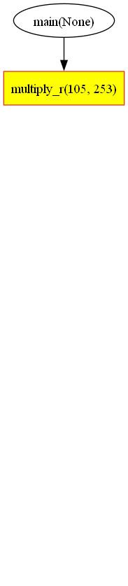

---

### <H3 style="color:green;">📏 1.6. Application au calcul de factorielle</H3>

🔢 **La factorielle, c’est quoi ?**
Elle correspond au **nombre de permutations possibles** d’un ensemble de `n` éléments.

Exemple : $3! = 6$ façons de réordonner ‘a’, ‘b’, ‘c’ :
`abc`, `acb`, `bac`, `bca`, `cab`, `cba`.

🧠 Définition mathématique :

$n!$ = $n × (n - 1) × ... × 2 × 1$

Et par convention : $0! = 1$

---

???+ question "🎯 Activité n°6 : Tester deux implémentations de la factorielle"


    Voici les deux versions du calcul de la factorielle :

    🔁 Version itérative
    ```python
    def factorielle_i(n):
        result = 1
        for i in range(1, n + 1):
            result *= i
        return result

    print(factorielle_i(10))
    ```

    ??? success "Python"
        {{ IDE() }}

    🔄 Version récursive
    ```python
    def factorielle_r(n):
        if n == 1 or n == 0:
            return 1
        return n * factorielle_r(n - 1)

    print(factorielle_r(10))
    ```

    ??? success "Python"
        {{ IDE() }}


🖼️ **Animation :**

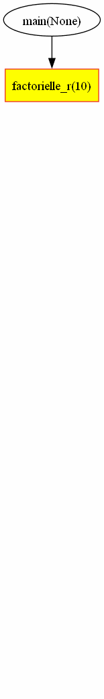

---

🎬 **Visualisation Python Tutor** :

<iframe width="800" height="500" frameborder="0" src="https://pythontutor.com/iframe-embed.html#code=def%20factorielle_r%28n%29%3A%0A%20%20%20%20if%20n%20%3D%3D%201%20or%20n%20%3D%3D%200%3A%0A%20%20%20%20%20%20%20%20return%201%0A%20%20%20%20return%20n%20*%20factorielle_r%28n%20-%201%29%0A%0Aprint%28factorielle_r%2810%29%29&codeDivHeight=400&codeDivWidth=350&cumulative=false&curInstr=40&heapPrimitives=nevernest&origin=opt-frontend.js&py=3&rawInputLstJSON=%5B%5D&textReferences=false"></iframe>

---

⚠️ **Remarque sur les performances** :
Un appel de fonction est plus **coûteux** qu’un simple test ou calcul.

➡️ Dans le cas de la **factorielle**, on privilégiera donc souvent la **version itérative**.

✅ Cependant, pour certains types de problèmes comme :

* les **arbres** (à venir)
* les **algorithmes de tri** (chapitre suivant)

➡️ la **version récursive** est **plus naturelle** et parfois même indispensable.

--- 

### <H3 style="color:green;">🗼 1.7. Application aux tours de Hanoï</H3>

Le **casse-tête des tours de Hanoï** est un jeu consistant à déplacer des disques de la tour **A (départ)** vers la tour **C (arrivée)** en passant par une tour **B (intermédiaire)** en respectant les règles suivantes :

- On ne déplace **qu’un seul disque à la fois**.
- On **ne peut poser un disque que sur un plus grand** ou sur un emplacement vide.

---

🎥 **Vidéo explicative** :  
[▶️ Les tours de Hanoi (via Digiview)](https://ladigitale.dev/digiview/#/v/66a4e65ddc246)

---

### 🧠 **Principe récursif**

Déplacer **n disques** de A vers C revient à :

1. Déplacer **(n-1)** disques de A vers B (via C)  
2. Déplacer le disque **n** de A vers C  
3. Déplacer **(n-1)** disques de B vers C (via A)

🧩 Chaque sous-problème **réplique la structure du problème initial**, avec une taille réduite.

---

📊 **Illustrations :**

- Situation initiale :

  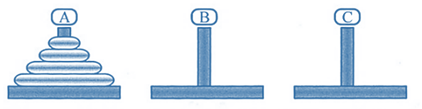

- Après avoir déplacé les (n-1) disques :

  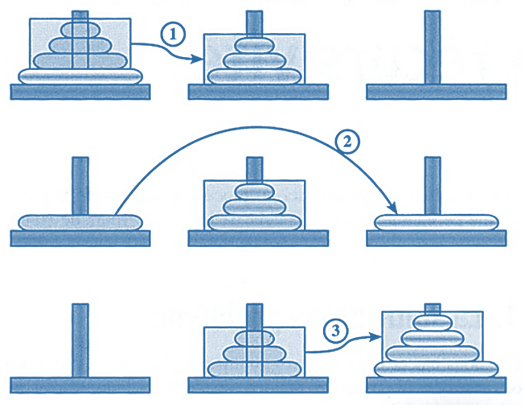

- Étape suivante, détaillée récursivement :

  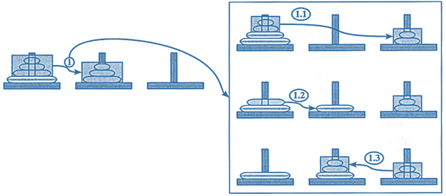

---

🧮 **Nombre de déplacements :**  
Avec 64 disques, il faudrait :  
$2^{64} - 1$ = $18 446 744 073 709 551 615 \text{ coups}$

Soit environ **584,5 milliards d’années** à raison d’un coup par seconde…  
👉 **43 fois l'âge de l'univers**.

---

???+ question "🎯 Activité n°7 : Implémenter l’algorithme en Python"

    ```python
    def hanoi(n, a="A", b="B", c="C"):
        if n == 0:  # cas de base
            return None
        hanoi(n - 1, a, c, b)  # de A vers B en passant par C
        print(f"Déplacer le disque {n} de la pique {a} vers la pique {c}.")
        hanoi(n - 1, b, a, c)  # de B vers C en passant par A

    print(hanoi(4))
    ```

    ??? success "Python"
        {{ IDE() }}

🔎 Pour aller plus loin :  
[📖 Tours de Hanoï et base 3 (Accromath)](http://accromath.uqam.ca/2016/02/les-tours-de-hanoi-et-la-base-trois/)

---

## <H2 style="color:blue;">⚠️ 2. Les dangers de la récursivité<a name="_page0_x40.00_y375.02"></a></H2>

Utiliser une fonction récursive **n’est pas toujours judicieux**.  
Exemple : la **suite de Fibonacci**.

🧮 Définition :

- $F_0 = 0$
- $F_1 = 1$
- $F_n = F_{n-1} + F_{n-2}$

---

???+ question "🎯 Activité n°8 : Implémenter les deux versions de Fibonacci"

    🔁 Version itérative
    ```python
    def fibo_i(n):
        a, b = 0, 1
        for i in range(n):
            a, b = b, a + b
        return a

    print(fibo_i(10))
    ```

    ??? success "Python"
        {{ IDE() }}

    🔄 Version récursive
    ```python
    def fibo_r(n):
        if n == 0:  # cas de base
            return 0
        elif n == 1 or n == 2:
            return 1
        return fibo_r(n - 1) + fibo_r(n - 2)

    print(fibo_r(10))
    ```

    ??? success "Python"
        {{ IDE() }}

---

???+ question "⏱️ Activité n°9 : Comparer les temps d'exécution"

    Ajoute ce code pour mesurer les performances :

    ```python
    import time

    for k in range(1, 5):
        print(k*10)
        a = time.perf_counter_ns()
        fibo_i(k*10)
        b = time.perf_counter_ns()
        print("itératif :", b-a, "ns")
        a = time.perf_counter_ns()
        fibo_r(k*10)
        b = time.perf_counter_ns()
        print("récursif :", b-a, "ns")
    ```

    ??? success "Python"
        {{ IDE() }}

---

📊 **Tableau des performances**

| k   | Récursif (ns)             | Itératif (ns) |
|-----|---------------------------|----------------|
| 10  | 26 100                    | 2 400          |
| 20  | 2 359 600                 | 3 100          |
| 30  | 397 709 900               | 5 300          |
| 40  | 42 835 094 000 = 42,8 s   | 6 900          |
| 50  | 7 264 000 000 000 = 7264 s| 8 200          |

---

🔍 **Pourquoi une telle différence ?**

Analysons `fib(5)` récursivement :

```text
fib(5)  -> fib(4) + fib(3)
        -> (fib(3) + fib(2)) + fib(3)
        -> ((fib(2) + fib(1)) + fib(2)) + fib(3)
        ...
        -> 5
```

📉 `fib(3)` est appelé **plusieurs fois inutilement**.
L’arbre d’appels devient vite **gigantesque**, avec des **milliers d'appels redondants**.

---

🎬 Animation :

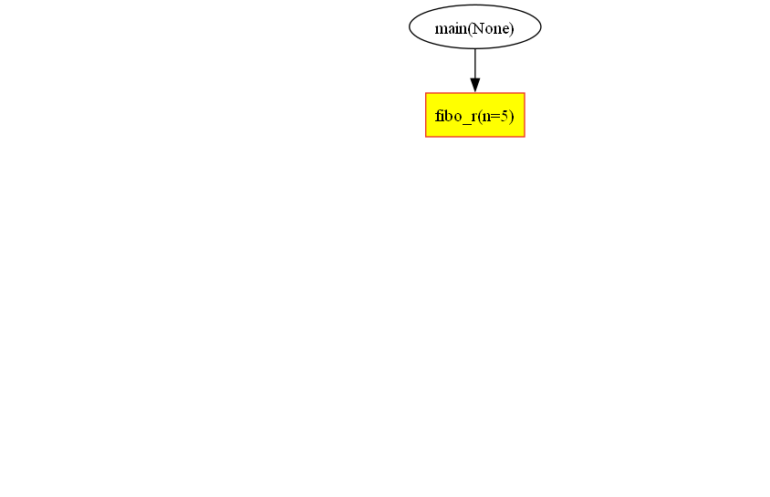

---

🧠 **Conclusion** :
La récursion **n’est pas toujours la meilleure option**.
Elle est **élégante mais coûteuse** si mal utilisée (exemple : Fibonacci).

🗣️ *"Marcher en itératif c’est mettre un pied devant l’autre et recommencer. Marcher en récursif c’est mettre un pied devant l’autre et marcher."*


## **<H2 STYLE="COLOR:BLUE;">3. Exercices<a name="_page0_x40.00_y375.03"></a>**</H2>

=> **CAPYTALE Le code vous sera donné par votre enseignant**

!!! abstract "**Exercice 1 : ★ La fonction somme**"

    Pour définir la somme des n premiers entiers, on a l’habitude d’écrire la formule suivante : $0 + 1 + 2 + ... + n$

    Écrire une fonction $somme(n)$ en récursif.

    **Aide :**

    - Déterminer le(s) cas de base

    - Déterminer le cas récursif

!!! abstract "**Exercice 2 : Le palindrome**"

    On appelle palindrome un mot qui se lit dans les deux sens comme "selles" ou "radar".

    La fonction ci-contre renvoie vrai si le mot passé en paramètre est un palindrome. Pour le mot "selles" composé de 6 lettres, on fait 3 comparaisons. Pour le mot "radar" composé de 5 lettres, on ne fait que 2 comparaisons (une unique lettre est forcément un palindrome).

    En version récursive, l’idée est : "selles" est un palindrome si "s" = "s" et "elle" est un palindrome => cas récursif.

    Écrire une version récursive de la fonction $est\_palindrome(mot)$.

    **Aide :**

    - Quel est les cas de base (cas d’arrêt) ?

        - Pour renvoyer True

        - Pour renvoyer False

    - Déterminer le cas récursif

!!! abstract "**Exercice 3 : Nombre d’adhérents**"

    Une association a remarqué que d’une année à l’autre :

    - Elle perd 5% de ses adhérents

    - Elle gagne 200 adhérents

    En admettant que le nombre d’adhérents de cette association était égal à 2000 au 1er janvier 2020, écrire en Python une fonction récursive nommée $nombre(n)$ affichant le nombre théorique d’adhérents après n années.

    **Aide :**

    - Déterminer le cas de base

    - Déterminer le nombre d’adhérents l’année suivante par rapport à l’année précédente

    - Dans ce même programme, afficher le nombre théorique d’adhérents au cours des 20 prochaines années.

!!! abstract "**Exercice 4 : La suite de Syracuse**"

    On appelle suite de Syracuse une suite d’entiers naturels définie de la manière suivante : On part d’un nombre entier plus grand que zéro. S’il est pair, on le divise par 2 ; s’il est impair, on le multiplie par 3 et on ajoute 1. En répétant l’opération, on obtient une suite d’entiers positifs dont chacun ne dépend que de son prédécesseur.

    Par exemple, à partir de 14 on construit la suite des nombres : 14, 7, 22, 11, 34, 17, 52, 26, 13, 40, 20, 10, 5, 16, 8, 4, 2, 1, 4, 2, ...

    C’est ce qu’on appelle la suite de Syracuse du nombre 14. Une fois le nombre 1 atteint, la suite des valeurs (1, 4, 2, 1, 4, 2, ...) se répète indéfiniment en un cycle de longueur 3 (appelé cycle trivial).

    Elle est définie par :

    - $x_1 = a ∈ N*$

    - $x_{n+1} = x_n / 2$ si $x_n$ est pair

    - $3x_n + 1$ si $x_n$ est impair

    1 Vérifier par le calcul que pour $a = 14$ et $n = 20$ la suite est des nombres : 14, 7, 22, 11, 34, 17, 52, 26, 13, 40, 20, 10, 5, 16, 8, 4, 2, 1, 4, 2.

    2 Écrire en Python une fonction itérative $syracuse\_iter(a, n)$ : donnant la suite de Syracuse lorsqu’on entre en paramètre la valeur de $a$ et le rang $n$.

    **Vérifier les tests suivants :**

    ```python
    assert syracuse_iter(14, 1) == 14
    assert syracuse_iter(14, 3) == 22
    assert syracuse_iter(14, 20) == 2
    ```

    3 Ecrire une version récursive $syracuse\_recur(a, n)$. 

    **Vérifier les tests suivants :**

    ```python
    assert syracuse_recur(14, 1) == 14
    assert syracuse_recur(14, 3) == 22
    assert syracuse_recur(14, 20) == 2
    ```

    4 La conjecture de Syracuse (encore appelée conjecture de Collatz ou conjecture d’Ulam) est l’hypothèse mathématique selon laquelle la suite de Syracuse de n’importe quel entier strictement positif atteint 1.

    Écrire la fonction $syracuse$ à un paramètre entier qui retourne la longueur de la suite de Syracuse de cet entier (le nombre de termes) pour obtenir 1.

    ```python
    assert syracuse(14) == 18
    assert syracuse(3) == 8
    assert syracuse(2) == 2
    ```

!!! abstract "**Exercice 5 : : Le PGCD**"

    Écrire une fonction récursive $pgcd(a, b)$ qui renvoie le PGCD de deux entiers `a` et `b`. 

    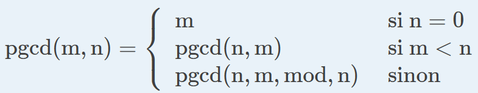

    **Exemple :**

    ```
    pgcd(60, 32)
    60 = 32 x 1 + 28
    32 = 28 x 1 + 4
    28 = 4 x 7 + 0
    4 = 0 x 0 + 4
    => 4
    ```

    ```
    pgcd(96, 36)
    96 = 36 x 2 + 24
    36 = 24 x 1 + 12
    24 = 12 x 2 + 0
    12 = 0 x 0 + 12
    => 12
    ```


    **Exemple :**

    ```python
    assert pgcd(96, 36) == 12
    assert pgcd(60, 32) == 4
    ```

!!! abstract "**Exercice 6 : Nombre de chiffres**"

    Écrire une fonction récursive $nombre\_de\_chiffres(n)$ qui prend un entier positif ou nul `n` en argument et renvoie son nombre de chiffres.

    **Exemple :**

    ```python
    assert nombre_de_chiffres(34126) == 5
    ```

!!! abstract "**Exercice 7 : Appartient**"

    Écrire une fonction récursive $appartient(v, t, i)$ prenant en paramètres une valeur `v`, un tableau `t` et un entier `i` et renvoyant `True` si `v` apparaît dans `t` entre l’indice `i` (inclus) et `len(t)` (exclu) et `False` sinon.

    **Exemple :**

    ```python
    t = [1, 3, 5, 6, 7, 9, 10]
    assert appartient(7, t, 5) == False
    assert appartient(7, t, 3) == True
    ```

!!! abstract "**Exercice 8 : Le triangle de Pascal**"

    Le triangle arithmétique de Pascal est le triangle dont la ligne d'indice `n` (n = 0, 1, 2, ...) donne les coefficients binomiaux $C(n, p)$ pour $p = 0, 1, 2, ... n$.

    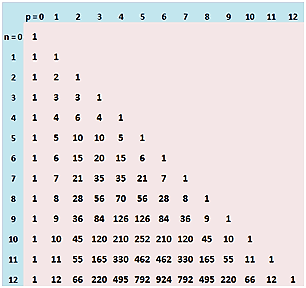

    **Coefficients du développement de $(a + b)^n$** : Les coefficients du triangle de Pascal sont les coefficients du développement de $(a + b)^n$.

    **Exemple :**

    - La ligne 0 est : 1, soit le coefficient de $(a + b)^0 = 1$.

    - La ligne 1 est : 1 - 1, soit les coefficients de $(a + b)^1 = 1×a + 1×b$.

    - La ligne 2 est : 1 - 2 - 1, soit les coefficients de $(a + b)^2 = 1×a^2 + 2×ab + 1×b^2$.

    - La ligne 3 est : 1 - 3 - 3 - 1, soit les coefficients de $(a + b)^3 = 1×a^3 + 3×a^2b + 3×ab^2 + 1×b^3$.

    - La ligne 4 est : 1 - 4 - 6 - 4 - 1, soit les coefficients de $(a + b)^4 = 1×a^4 + 4×a^3b + 6×a^2b^2 + 4×ab^3 + 1×b^4$.

    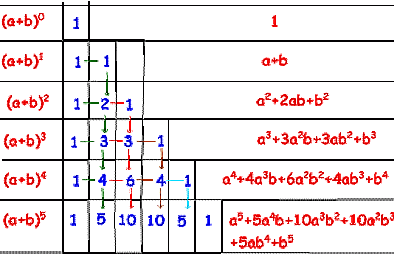

    **En analyse combinatoire**, les nombres $C(n, p)$ correspondent au nombre de façons de tirer `p` objets parmi `n`.

    **Exemple :**

    La ligne 5 est : 1 - 5 - 10 - 10 - 5 - 1, donc :

    - $C(5, 0) = 1$ : Il y a 1 seule façon de tirer 0 objet parmi 5.
    - $C(5, 1) = 5$ : Il y a 5 façons de tirer 1 objet parmi 5.
    - $C(5, 2) = 10$ : Il y a 10 façons de tirer 2 objets parmi 5.
    - $C(5, 3) = 10$ : Il y a 10 façons de tirer 3 objets parmi 5.
    - $C(5, 4) = 5$ : Il y a 5 façons de tirer 4 objets parmi 5.
    - $C(5, 5) = 1$ : Il y a 1 seule façon de tirer 5 objets parmi 5.

    **Le triangle de Pascal Suite de Fibonacci**

    Remarquer que ...

    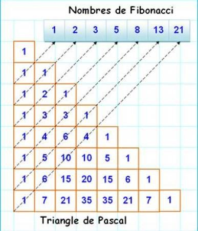

    Le triangle de Pascal (nommé ainsi en l’honneur au mathématicien Blaise Pascal) est une présentation des coefficients binomiaux sous la forme d’un triangle défini ainsi de manière récursive :

    ```
    C(n, p) = 1 si p = 0 ou n = p
    C(n, p) = C(n - 1, p - 1) + C(n - 1, p) sinon.
    ```

    Écrire une fonction récursive $C(n, p)$ qui renvoie la valeur de $C(n, p)$.

    **Exemple :**

    ```python
    assert C(10, 5) == 252
    ```

!!! abstract "**Exercice 9 : Recherche dans une chaîne de caractères**"

    Ecrire une fonction récursive nommée $est\_dans$ qui, à partir d’un caractère `e` et d’une chaîne de caractères `c`, détermine si ce caractère appartient à la chaîne.

    Tester cette fonction.

    **Remarque :** La fonction $est\_dans$ est un **prédicat**.

!!! abstract "**Exercice 10 : Travail sur les listes**"

    1 Écrire une fonction nommée $longueur\_liste$ récursive qui, à partir d’une liste passée en argument, détermine sa longueur.

    2 Écrire une fonction nommée $produit\_elements$ récursive qui, à partir d’une liste d’entiers passée en argument, calcule le produit de tous les nombres.

    3 Écrire une fonction nommée $plus\_grand\_element$ récursive qui, à partir d’une liste d’entiers passée en argument, détermine quel est l’entier le plus grand.

    4 Écrire une fonction nommée $plus\_petit\_element$ récursive qui, à partir d’une liste d’entiers passée en argument, détermine quel est l’entier le plus petit.

    5 Écrire une fonction nommée $somme\_listes\_imbriquees$ récursive qui additionne tous les entiers des listes.

    **Exemple de listes imbriquées :**

    ```python
    l1 = [1, [2, [3, 4], 5], 6, [7, 8]]
    l2 = [1, [2, [3, [4, [5]]]]]
    ```

    **Remarque :** Cette question peut illustrer par exemple la recherche de l’occupation disque de tous les fichiers dans la structure arborescente d’un système de fichiers à partir d’un point de cette structure.

    6 Écrire une fonction nommée $duplique$ récursive qui, à partir d’un élément `e` et d’un entier `n`, retourne une liste qui contient l’élément `e` un nombre de fois égal à `n`.

    ```python
    assert duplique(5, 3) == [5, 5, 5]
    ```

    7 Écrire une fonction nommée $extrait$ récursive qui, à partir d’une liste `l` et d’un entier `n`, retourne une liste constituée par les `n` premiers éléments de `l`.

    ```python
    assert extrait([5, 4, 3, 2, 1], 3) == [5, 4, 3]
    ```

    8 Écrire une fonction nommée $renverse$ récursive qui, à partir d’une liste, retourne une liste dans laquelle les éléments sont renversés (les derniers apparaissent en premier).

## **<H2 STYLE="COLOR:BLUE;">4. Projet (démarche d’investigation)<a name="_page0_x40.00_y375.044"></a></a>**</H2>

!!! abstract "**Projet 1 : Le flocon de Koch**"

    Le flocon de Koch est l’une des premières courbes fractales à avoir été décrite (bien avant l’invention du terme « fractal(e)»). Elle a été inventée en 1904 par le mathématicien suédois Helge von Koch.

    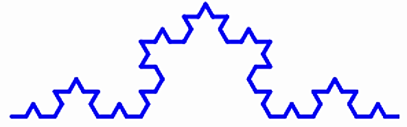

    **Méthode de construction :**

    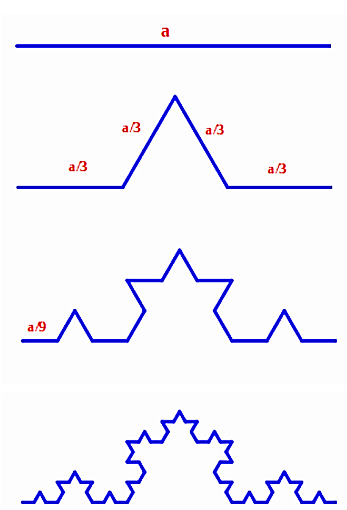

    1. On commence par un segment de longueur $a$.
    2. On coupe ce segment en 3 parties égales.
    3. Le segment central est remplacé par un triangle équilatéral de côté $a/3$.
    4. Chaque segment de longueur $a/3$ est lui-même découpé en trois parties égales (donc de longueur $a/9$).
    5. On remplace la partie centrale par un triangle équilatéral de côté $a/9$.
    6. Etc...


    On décide à l’avance quand on doit s’arrêter.

    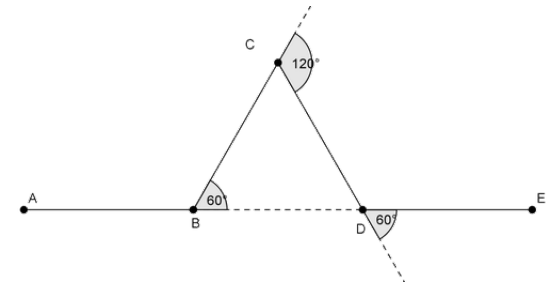

    1 Analyser ce script et le faire fonctionner

    ```python
    import turtle
    turtle.forward(100)
    turtle.left(120)
    turtle.forward(100)
    turtle.left(120)
    turtle.forward(100)
    turtle.done()
    ```

    2 Une autre partie de script à analyser et à faire fonctionner

    ```python
    import turtle as t
    # déplace la tortue aux coordonnées
    t.penup()
    t.goto(-100, 0)
    t.pendown()
    # orientation initiale de la tête :
    #vers la droite de l’écran
    t.setheading(0)
    t.hideturtle() # on cache la tortue
    t.speed(0) # on accélère la tortue
    t.color('blue')
    t.pensize(3)
    t.forward(100)
    t.left(60)
    t.forward(100)
    t.right(120)
    t.forward(100)
    t.left(60)
    t.forward(100)
    t.done()
    ```

    3 Compléter l’algorithme suivant :

    ```
    fonction koch(longueur,n): 
    Si n = 0 alors 
        On trace le segment de longueur cote 
    Sinon 
        On appelle la fonction flocon avec les paramètres ???
        On tourne de ???
        ???
        ???
        ???
        ???
        ???
    ```

    4 Implémenter l’algorithme

    ```python
    import turtle

    def koch(*longueur*, *n*):
        if *n* == 0:
            # à completer
        else:
            # à completer

    koch(200,3)
    turtle.done()
    ```

    5 Cerise sur le gateau : Sauriez vous faire afficher cette figure :

    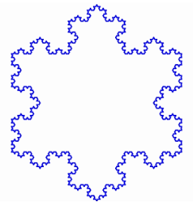

!!! abstract "**Projet 2 : Le triangle de Sierpinski**"

    Utiliser une fonction récursive pour réaliser les triangles de Sierpinski ci-dessous.

    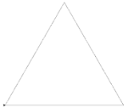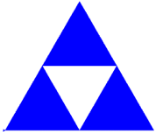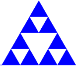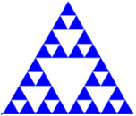

    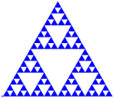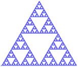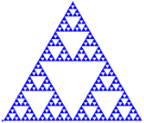


    Selon la valeur du nombre du niveau on aura une représentation plus ou moins « dentelée »

    **Aides** : 

    - seuls les petits triangles sont coloriés => mauvaise idée de tout coloriée puis de rajouter des triangles blancs

    - pour passer d’un triangle de niveau supérieur vers un triangle inférieur il faut diviser par 2

    - La fonction à créer a pour prototypage : sierpinski(n : int, L : int) où n est le niveau souhaité (de 0 à l’infini) et L la longueur d’un des côtés du grand triangle 

    - On **pourra** prendre L = 600 et se déplacer au départ en (-300, -300) pour center le dessin si on choisit d’aller vers la gauche…

    - Pensez à turtle.speed(0) au début et turtle.done() à la fin

    - Au-dessus du 6<sup>ème</sup> niveau il faut augmenter L pour pouvoir le voir

!!! abstract "**Projet 3 : Le tapis de Sierpinski**"

    Utiliser une fonction récursive pour réaliser les triangles de Sierpinski ci-dessous. L’idée est d’arrivée à un beau tapis de ce style (le dernier)

    [](Aspose.Words.5353fbcd-56c4-4f4a-a255-9e80942bae59.048.png)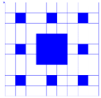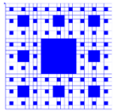!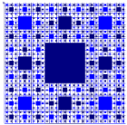


    **Le principe mathématique**

    On part donc d’un carré vide, que l’on s’empresse de découper en 9 cases identiques, puis on remplit le carré central:

    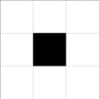

    **Étape 1** Ensuite, dans chaque carré vide, on fait la même chose que dans le carré initial : on le découpe en 9 cases identiques et on remplit le carré central:

    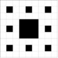

    **Étape 2**On recommence avec les nouveaux carrés vides:

    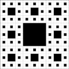

    Et on fait cela à l’infini. Le résultat final donne le *tapis de Sierpinsky*.


!!! abstract "**Projet 4 : Arbre de Pythagore**"

    Proposer une tortue python récursive réalisant :

    - Avec p = 1 :  pythagore 1 
    - Avec p = 2 :  pythagore 2 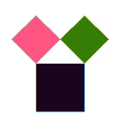
    - Avec p = 3 :  pythagore 3 
    - Avec p = 10 :  pythagore 10 

    Aide : 

    - On pourra utiliser turtle.colormode(255) => pour coder en rgb puis un random.randint(0,255) sur les trois couleur rgb 


!!! abstract "**Projet 5 : Arbre de la forêt**"

    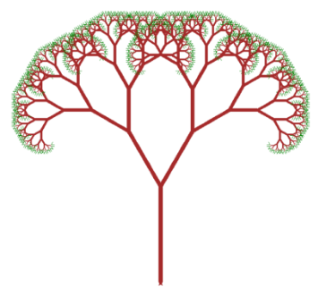

    Long en exécution…

    Par exemple, pour construire un arbre, on part d’un segment, et on applique la transformation présentée ci-dessus à chaque segment de la construction (on refait la transformation n fois pour obtenir un arbre d’ordre n) : 

    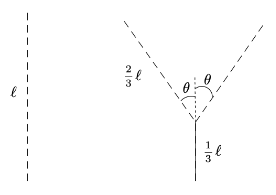

    Base de la construction d'un arbre. 

    Les portions dessinées en *pointillées sont celles sur lesquelles on appliquera la transformation à l’ordre suivant* (on les appelle les **segments non-terminaux**). Les portions dessinées en *trait plein sont des segments qui ne seront pas transformés* (on les appellera les **segments terminaux**).

    Pour transformer un segment non-terminal de longueur lll, on trace un segment terminal de longueur l/3, puis deux segments non-terminaux de longueur 2l/3 à un angle θ du premier segment.
