---
author: ELP
title: 02b Méthode diviser pour régner
---

**Table des matières**

1. [🧠 Introduction](#_toc144400464)  
2. [🔢 L’exponentiation](#_toc144400465)  
3. [🧩 Tri fusion (MergeSort)](#_toc144400469)  
4. [⏱️ Comparaison des performances](#_toc144400475)  
5. [🔍 Retour sur la recherche dichotomique](#_toc144400476)  
6. [📝 Exercices](#_toc144400477)  
7. [💡 Projet (démarche d’investigation)](#_toc144400478)

---

🎯 **Compétence évaluée :**  
- ✍️ Écrire un algorithme utilisant la méthode « Diviser pour régner »

---

La méthode **Diviser pour régner** (*divide and conquer*) repose sur 3 étapes :

- ✂️ **Diviser** : découper le problème en sous-problèmes  
- 👑 **Régner** : résoudre les sous-problèmes (souvent récursivement)  
- 🧵 **Combiner** : rassembler les résultats pour répondre au problème initial

🧠 **Remarque :**

- Si les sous-problèmes sont **indépendants** : 👉 on parle de **diviser pour régner**  
- S’ils sont **dépendants** : 👉 c’est de la **programmation dynamique**

---

## <H2 style="color:blue;">🧠 1. Introduction<a name="_toc144400464"></a></H2>

Le principe est de **transformer un problème difficile en un ou plusieurs problèmes plus simples**.

🪄 Par exemple : pour résoudre un problème A, on peut :

1. 🔁 Le transformer en problème B  
2. 🧠 Résoudre B  
3. 🔁 Revenir à une solution du problème A

---

### <H3 style="color:green;">📞 Exemple : Le téléphone en chaîne</H3>

L’équipe de volleyball (15 joueuses) reçoit une information urgente.  
Comment prévenir tout le monde rapidement ?

---

📌 **Solution 1**  
La capitaine appelle **toutes les autres** joueuses → 14 appels.

⏱️ Si chaque appel dure 5 minutes :  
**Durée totale t₁ = 14 × 5 = 70 min**  
📉 Complexité en **O(n)**

---

📌 **Solution 2**  
La capitaine appelle 2 joueuses → chacune appelle 2 autres → etc.

🎯 **Chaque appel divise le problème en deux**, puis **règle la moitié**.

🌳 Voici l’arbre des appels :

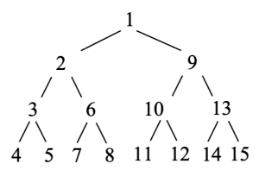

⏱️ **Temps t₂ ≈ log₂(n) × 5 min**  
📈 Complexité en **O(log n)**

---

✅ **Conclusion :**  
La solution 2 illustre la méthode **Diviser pour régner** :

- On découpe un grand problème en **plus petits**
- Chacun est **résolu plus vite**
- On obtient **globalement une solution plus rapide**

---

## <H2 style="color:blue;">🔢 2. L’exponentiation<a name="_toc144400465"></a></H2>

L’objectif est de **calculer aⁿ sans utiliser l’opérateur `**`**, comme le ferait un processeur.

🧠 Le but est de n’utiliser que : `+`, `-`, `*`.

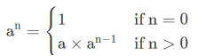

---

### <H3 style="color:green;">🔁 2.1. Programme itératif</H3>

???+ question "🎯 Activité n°1 : Étudier la version itérative"

    ```python
    def exp1(n : int ,a: float) -> float :
        valeur=1
        for i in range(n):
            valeur *= a
        return valeur

    print(exp1(5,49))
    ```

    ??? success "Python"
        {{ IDE() }}

🧮 **Complexité :**  
- La boucle tourne **n fois**  
- À chaque tour : 1 multiplication et 1 affectation  
👉 Complexité **O(n)**

---

### <H3 style="color:green;">🔄 2.2. Programme récursif</H3>

???+ question "🎯 Activité n°2 : Étudier la version récursive"

    ```python
    def exp2(n : int ,a: float) -> float :
        if n == 0:
            return 1
        else:
            return a * exp2(n-1,a)

    print(exp2(5,49))
    ```

    ??? success "Python"
        {{ IDE() }}

🧮 **Complexité :**  
Même raisonnement : **O(n)** (n appels récursifs)

---

### <H3 style="color:green;">⚡ 2.3. Exponentiation rapide</H3>

L’algorithme **divise le problème par 2 à chaque appel**, ce qui réduit **le nombre total d’appels récursifs**.

Exemple : `49⁵`

🪜 À chaque appel, on divise `n` par 2  
🧵 On combine les résultats avec :

- `y * y` si `n` est pair
- `a * y * y` si `n` est impair

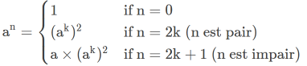

---

???+ question "🎯 Activité n°3 : Étudier la version Diviser pour régner"

    ```python
    def exp3(n : int ,a: float) -> float :
        if n == 0:
            return 1
        else:
            y = exp3(n//2, a)
            if n % 2 == 0:
                return y * y
            else:
                return a * y * y

    print(exp3(5,49))
    ```

    ??? success "Python"
        {{ IDE() }}

---

🧠 **Complexité :**  
Nombre d'appels récursifs = nombre de divisions successives de `n` par 2  
👉 Complexité **O(log n)**

🌳 Représentation en arbre :  
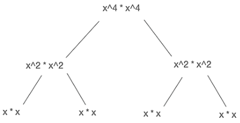

---

💬 **Remarque :**  
Cette méthode peut être appliquée à d'autres opérations comme :
- la **multiplication de matrices**
- la **composition de fonctions**

Mais attention au **coût unitaire** de chaque opération.

📊 **Comparaison des vitesses :**

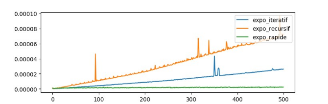


### <H3 style="color:green;">📏 3.2. Illustration graphique</H3>

Pour bien comprendre la méthode employée, le plus simple est de construire un **arbre binaire** dans lequel **chaque nœud est le résultat d’un appel récursif**.

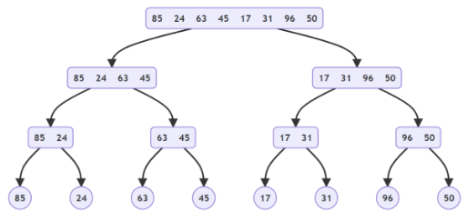

🧩 *Résultats des différents appels récursifs (partie Diviser)*

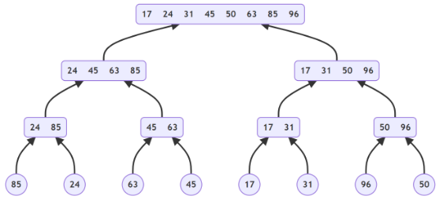

🧠 *Résultats progressifs après les étapes Régner et Fusionner.*

---

### 🏛️ **Légende des nœuds**

* Chaque nœud = un **appel récursif**
* □ **Pointillé** = appel **non encore effectué**
* ▣ **Bordure en gras** = appel **en cours**
* ■ **Vide** = partie **déjà traitée**
* ▭ **Semi-rempli** = appel **en attente**

---

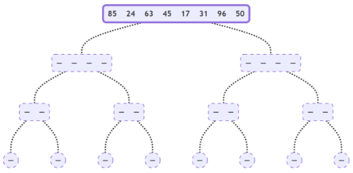
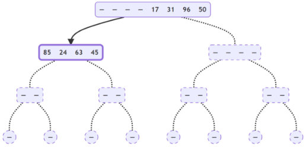
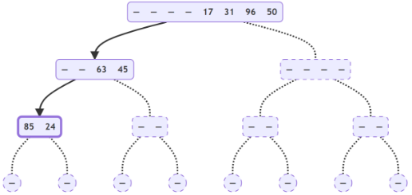
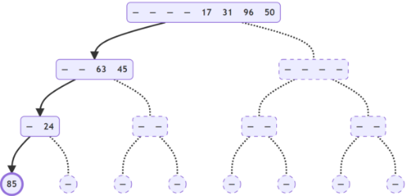
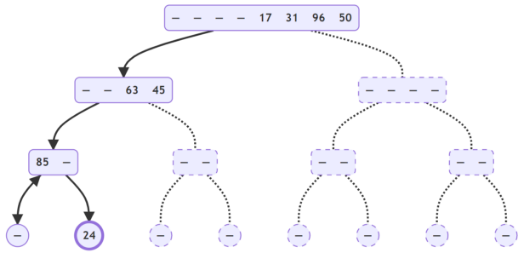
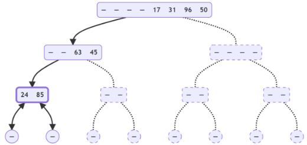
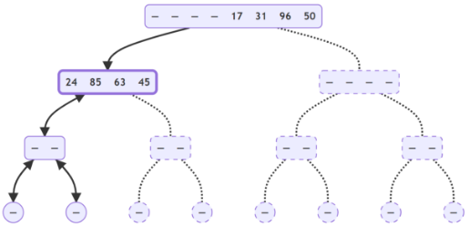
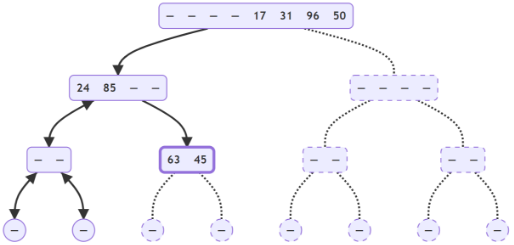
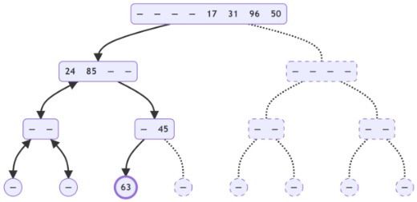
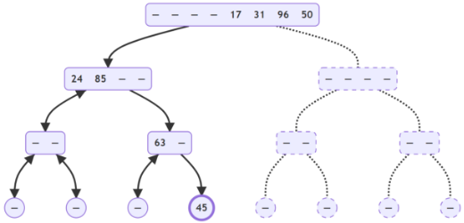
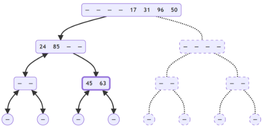
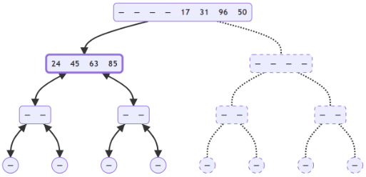
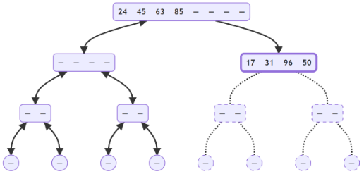

... et après quelques appels supplémentaires :

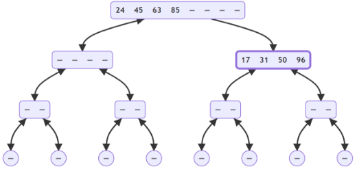
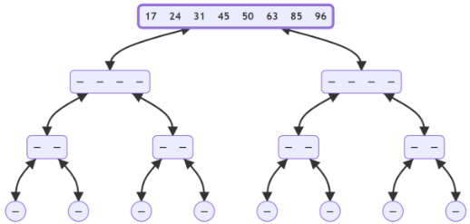

---

### <H3 style="color:green;">🎥 3.3. Illustration en vidéo</H3>

* Vidéo “danse” 🎤 : [Lien](https://ladigitale.dev/digiview/#/v/66a6a018f33ef)
* Vidéo explicative 📚 : [Lien](https://ladigitale.dev/digiview/#/v/66a6a06310c1c)
* Visualisation interactive 🔍 : [Lien](http://lwh.free.fr/pages/algo/tri/tri_fusion.html)
🐟 Tu as raison, j’ai fait mon poisson rouge 🐠. Voici la section **reformatée correctement avec les activités** en respectant le style `???+ question`, avec `??? success` pour le code, comme dans le reste de ton cours :

---

### 🧩 **3.2. Illustration graphique**

Pour bien comprendre la méthode employée, on construit un **arbre binaire** où chaque **nœud représente un appel récursif**.

📌 **Étape Diviser** :

*Résultats des différents appels récursifs*

📌 **Étapes Régner + Fusionner** :


---

🗂️ **Légende des nœuds** :

* 🔄 *Nœud avec bordure pointillée* : appel **non encore effectué**
* ▶️ *Nœud avec bordure en gras* : appel **en cours**
* ✅ *Nœud vide avec bordure* : **partie déjà traitée**
* ⏳ *Nœud en partie vide* : appel **en attente**

---

📈 **Évolution de l’exécution** :


...


---

### 🎥 **3.3. Illustration en vidéo**

* 💃 Animation visuelle : [Danse](https://ladigitale.dev/digiview/#/v/66a6a018f33ef)
* 📚 Explication complète : [Vidéo explicative](https://ladigitale.dev/digiview/#/v/66a6a06310c1c)
* 🔍 Visualisation interactive : [Simulateur](http://lwh.free.fr/pages/algo/tri/tri_fusion.html)

---

### 🧪 **3.4. Implémentation du tri fusion**

???+ question "🔧 Activité n°4 : Compléter le code selon Diviser / Régner / Combiner"


    ```python
    from typing import List

    def tri_fusion(S: List[int]) -> None:
        """
        Implémentation du tri fusion. La liste S est modifiée en place.
        """
        n = len(S)  # ... (0)
        if n < 2:
            return None  # ... (1)

        # Diviser
        milieu = n // 2
        S1 = S[:milieu]  # .... (3)
        S2 = S[milieu:]  # .... (4)

        # Régner
        tri_fusion(S1)  # ... (6)
        tri_fusion(S2)  # ... (7)

        # Combiner
        fusion(S1, S2, S)  # ... (9)
    ```

    ??? success "Python"
        {{ IDE() }}


---

???+ question "🔧 Activité n°5 : Expliquer en détail la fusion des deux listes triées"

    ```python
    from typing import List

    def fusion(S1: List[int], S2: List[int], S: List[int]) -> None:
        """
        Combine les éléments des deux listes S1 et S2 dans la liste S (en place).
        """
        i = 0
        j = 0

        while i < len(S1) and j < len(S2):
            if S1[i] < S2[j]:
                S[i + j] = S1[i]
                i += 1
            else:
                S[i + j] = S2[j]
                j += 1

        while i < len(S1):
            S[i + j] = S1[i]
            i += 1

        while j < len(S2):
            S[i + j] = S2[j]
            j += 1
    ```

    ??? success "Python"
        {{ IDE() }}

--- 


???+ question "🔧 Activité n°5 :**"

    Étudier le comportement du programme complet à l’aide de pythontutor.
    Construire la liste à l’aide de l’instruction :
    ```python
    from random import randint
    liste = [randint(1, 400) for i in range(5)]
    ```

    ??? success "Python"
        Tester l'algorithme de tri fusion qui est proposé avec la liste ci-dessus

        {{ IDE() }}


<iframe width="800" height="500" frameborder="0" src="https://pythontutor.com/iframe-embed.html#code=from%20random%20import%20randint%0Afrom%20typing%20import%20List%0A%0Adef%20fusion%28S1%3A%20List%5Bint%5D,%20S2%3A%20List%5Bint%5D,%20S%3A%20List%5Bint%5D%29%20-%3E%20None%3A%0A%20%20%20%20%22%22%22%0A%20%20%20%20Combine%20les%20%C3%A9l%C3%A9ments%20des%20deux%20listes%20S1%20et%20S2%20dans%20la%20liste%20S%20%28en%20place%29.%0A%20%20%20%20i%20est%20le%20nombre%20d'%C3%A9l%C3%A9ment%28s%29%20de%20S1%20copi%C3%A9%28s%29%20dans%20S1.%0A%20%20%20%20j%20est%20le%20nombre%20d'%C3%A9l%C3%A9ment%28s%29%20de%20S2%20copi%C3%A9%28s%29%20dans%20S2.%0A%20%20%20%20On%20doit%20donc%20avoir%20i%20%2B%20j%20%3C%3D%20len%28S%29.%0A%20%20%20%20%22%22%22%0A%20%20%20%20i%20%3D%200%0A%20%20%20%20j%20%3D%200%0A%0A%20%20%20%20while%20i%20%3C%20len%28S1%29%20and%20j%20%3C%20len%28S2%29%20%3A%0A%20%20%20%20%20%20%20%20if%20S1%5Bi%5D%20%3C%20S2%5Bj%5D%3A%0A%20%20%20%20%20%20%20%20%20%20%20%20S%5Bi%20%2B%20j%5D%20%3D%20S1%5Bi%5D%0A%20%20%20%20%20%20%20%20%20%20%20%20i%20%3D%20i%20%2B%201%0A%20%20%20%20%20%20%20%20else%3A%0A%20%20%20%20%20%20%20%20%20%20%20%20S%5Bi%20%2B%20j%5D%20%3D%20S2%5Bj%5D%0A%20%20%20%20%20%20%20%20%20%20%20%20j%20%3D%20j%20%2B%201%0A%20%20%20%20while%20i%20%3C%20len%28S1%29%3A%0A%20%20%20%20%20%20%20%20S%5Bi%20%2B%20j%5D%20%3D%20S1%5Bi%5D%0A%20%20%20%20%20%20%20%20i%20%3D%20i%20%2B%201%0A%20%20%20%20while%20j%20%3C%20len%28S2%29%3A%0A%20%20%20%20%20%20%20%20S%5Bi%20%2B%20j%5D%20%3D%20S2%5Bj%5D%0A%20%20%20%20%20%20%20%20j%20%3D%20j%20%2B%201%0A%0Adef%20tri_fusion%28S%3A%20List%5Bint%5D%29%20-%3E%20None%3A%0A%20%20%20%20%22%22%22%0A%20%20%20%20Impl%C3%A9mentation%20du%20tri%20fusion.%0A%20%20%20%20La%20liste%20S%20est%20modifi%C3%A9e%20en%20place.%0A%20%20%20%20%22%22%22%0A%20%20%20%20n%20%3D%20len%28S%29%20%20%23%20...%20%280%29%0A%0A%20%20%20%20if%20n%20%3C%202%3A%0A%20%20%20%20%20%20%20%20return%20None%20%20%23%20...%20%281%29%0A%0A%20%20%20%20%23%20Diviser,%20R%C3%A9gner,%20Combiner%20%3F%20...%20%282%29%0A%20%20%20%20milieu%20%3D%20n%20//%202%0A%20%20%20%20S1%20%3D%20S%5B%3Amilieu%5D%20%20%23%20....%20%283%29%0A%20%20%20%20S2%20%3D%20S%5Bmilieu%3A%5D%20%20%23%20....%20%284%29%0A%0A%20%20%20%20%23%20Diviser,%20R%C3%A9gner,%20Combiner%20%3F%20...%20%285%29%0A%20%20%20%20tri_fusion%28S1%29%20%20%23%20...%20%286%29%0A%20%20%20%20tri_fusion%28S2%29%20%20%23%20...%20%287%29%0A%20%20%20%20%0A%20%20%20%20fusion%28S1,%20S2,%20S%29%0A%0Afrom%20random%20import%20randint%0Aliste%20%3D%20%5Brandint%281,%20400%29%20for%20i%20in%20range%285%29%5D%0Aprint%28liste%29%0Atri_fusion%28liste%29%20%23on%20trie%20en%20place!!%0Aprint%28liste%29&codeDivHeight=400&codeDivWidth=350&cumulative=false&curInstr=0&heapPrimitives=nevernest&origin=opt-frontend.js&py=3&rawInputLstJSON=%5B%5D&textReferences=false"> </iframe>


**<H3 STYLE="COLOR:red;">Activité n° 7 :</H3>**
Quelle est la complexité de la fonction fusion ? Essayer d’évaluer la complexité de l’algorithme sans faire de calcul.

### <H3 STYLE="COLOR:GREEN;"> <a name="_toc144400474"></a>**3.5. Complexité</H3>**
Pour déterminer la formule de récurrence qui nous donnera la complexité de l’algorithme, étudions les trois étapes de cet algorithme

- **Diviser** : cette étape se réduit au calcul du milieu de l’intervalle [début, fin]
- **Régner** : l’algorithme résout récursivement deux sous-problèmes de tailles respectives *n/2.*
- **Combiner** : la complexité de cette étape est celle de l’algorithme de fusion qui est de Θn pour la construction d’un tableau solution de taille n.

Donc la complexité de l’algorithme du tri fusion pour trier un tableur de taille n est <b><i>O(n) =</i></b> O(n<b><i>.log<sub>2</sub>(n))</i></b>

## <H2 STYLE="COLOR:BLUE;"> <a name="_toc144400475"></a>**4. Comparaison des performances**</H2>

La complexité des tris par insertion et sélection est en O(n²), celle du tri par fusion est en **O(n.log(n))**

**<H3 STYLE="COLOR:red;">Activité n° 8 :** Comparaison des performances des différents tris**.</H3>

```python
import datetime
import random

def tri_insertion(tab):
    # à compléter

def tri_selection(tab):
    # à compléter
    
def tri_fusion(tab):
    # à compléter

n = 1000
t=[random.randint(1,1000) for i in range(n)]

# tri insertion
t1=t[:] #recopie
start = datetime.datetime.now()
t2=tri_insertion(t1)
end = datetime.datetime.now()
print("tri insertion : ",(end-start).total_seconds())


# tri selection
t1=t[:] #recopie
start = datetime.datetime.now()
t3=tri_selection(t1)
end = datetime.datetime.now()
print("tri selection : ",(end-start).total_seconds())


# tri fusion
t1=t[:] #recopie
start = datetime.datetime.now()
t4=tri_fusion(t1)
end = datetime.datetime.now()
print("tri fusion : ",(end-start).total_seconds())

```

???+ question "Tester ce qui est proposé"

    {{ IDE() }}

On devrait trouver environ
tri insertion :  0.051002
tri selection :  0.027
tri fusion :  0.002999

## <H2 STYLE="COLOR:BLUE;"> <a name="_toc144400476"></a>**5. Retour sur la recherche dichotomique**</H2>
Nous avons déjà rencontré la recherche dichotomique. On rappelle qu’il s’agit de déterminer si un entier val apparait dans une liste tab qui est triée par ordre croissant. Plus précisément on cherche à écrire une fonction qui :

- **prend en paramètres : val la valeur recherchée, table tableau trié par ordre croissant;**
- **renvoie i un indice où la valeur val apparait dans tab et None si la val n’est pas dans tab.**

Pour cela on utilisera la technique de la dichotomie. Il s’agira de délimiter une portion du tableau dans laquelle la valeur peut se trouver avec deux indices g et d. => Voir exercice n°1


## <H2 STYLE="COLOR:BLUE;"> <a name="_toc144400477"></a>**6. Exercices**</H2> 

=> **CAPYTALE Le code vous sera donné par votre enseignant**

**<H3 STYLE="COLOR:red;">Exercice n°1 : Recherche dichotomique</H3>**

Écrire une fonction recherche_dicho_r(tab,val) récursive en Python qui

- prend en paramètres une liste tab d’entiers triés par ordre croissant, un entier à rechercher val.

- renvoie i un indice où la valeur val apparait dans tab (ou True selon comment est codé l’algorithme) et False si la val n’est pas dans tab.  La valeur i est recherchée dans tab[g..d]

On peut passer les slices des listes de python ou utiliser des indices entrés avec une valeur par défaut


La méthode « Diviser pour régner » est le paradigme naturel de la récursivité.

La complexité d’un algorithme qui s’appuie sur le paradigme « Diviser pour régner » est parfois optimale (exponentiation rapide, recherche dichotomique, tri fusion, etc.) mais pas toujours (recherche du minimum et du maximum dans une liste, somme des éléments d’une liste, recherche dans une liste non triée, etc.).

L’efficacité d’un algorithme qui s’appuie sur le paradigme « Diviser pour régner » dépend de l’implémentation de la récursivité par le langage choisi.

**<H3 STYLE="COLOR:red;">Exercice n°2 : Sommes des n nombres d’un tableau</H3>** 

1 Écrire le code de fonction somme1 qui permet de déterminer la somme des n nombres (entiers) d’un tableau en récursif

2 Réfléchir à un algorithme utilisant le principe « Diviser pour régner » qui résout le même problème.

   Écrire le code de la fonction somme2 qui implémente cet algorithme.


**<H3 STYLE="COLOR:red;">Exercice n°3 : Recherche des plus grand et petit éléments dans un tableau</H3>** 

1. Générer une liste contenant un million de termes choisis aléatoirement entre un et mille milliards.
1. Utiliser les fonctions min et max fournies par le langage Python afin d’afficher les maximum et minimum dans la liste.
1. Écrire le code de la fonction maxmin1 qui, à partir d’un algorithme de « brute force », détermine les maximum et minimum dans la liste passée en argument. La spécification de la fonction est : maxmin1(tab: List[float]) -> Tuple[float, float]
1. Vérifier le bon fonctionnement de la fonction maxmin1 en affichant les maximum et minimum dans la liste, à la suite de ceux déterminés à l’aide des fonctions fournies par Python.
1. Quelle est la complexité de la fonction maxmin1 ?
1. Comparer l’efficacité de la fonction maxmin1 à celle des fonctions fournies par Python en mesurant les durées d’exécution à l’aide de la fonction time du module time.
1. Écrire et implémenter la fonction maxmin2 qui implémente le raisonnement «Diviser pour régner » pour résoudre ce problème.

   Dans un premier temps, écrire une fonction qui se contente de déterminer le maximum dans la liste passée en argument. Compléter ensuite le code de façon à ce que le maximum et le minimum soient retournés. La spécification de la fonction est : maxmin2(tab: List[float]) -> float

8 Vérifier le bon fonctionnement de la fonction à la suite des précédentes vérifications.

9 Modifier la fonction maxmin2 afin qu’elle retourne les maximum et minimum dans la liste. La spécification de la fonction est : maxmin2(tab: List[float]) -> Tuple[float, float]

   La complexité de cette fonction est en O(n).

10 Vérifier le bon fonctionnement de la fonction à la suite des précédentes vérifications.

11 La fonction maxmin2 est-elle, théoriquement, plus efficace que la fonction maxmin1 ? Dans la pratique ? Comment expliquer ce comportement ?


**<H3 STYLE="COLOR:red;">Exercice n°4 :</H3>** **Tri rapide**

Le Quicksort est une méthode de tri inventée par Sir Charles Antony Richard Hoare en 1961 et fondée sur la méthode de conception « diviser pour régner ». Il peut être implémenté sur un tableau ou sur des listes ; son utilisation la plus répandue concerne tout de même les tableaux. 

- **Diviser** : on partage le tableau en deux parties. Ce partage se fait autour d’une valeur du tableau choisie au hasard, c’est le pivot. Du coup, le pivot est à sa place ! il ne reste plus qu’à placer les autres !

- **Régner** : On trie les tableaux récursivement (on repartage donc) ou on ne fait rien si la taille est 1 (puisqu’un seul élément est forcément ordonné)

- **Combiner** : rien à faire

La méthode consiste à placer un élément du tableau (appelé **pivot**) à sa place définitive, en permutant tous les éléments de telle sorte que tous ceux qui lui sont inférieurs soient à sa gauche et que tous ceux qui lui sont supérieurs soient à sa droite. Cette opération s'appelle le **partitionnement.**

Pour chacun des sous-tableaux, on définit un **nouveau pivot** et on répète l'opération de partitionnement. Ce processus est répété **récursivement**, jusqu'à ce que l'ensemble des éléments soit trié.

La complexité moyenne est en O(nlogn) mais O(n²) dans le pire des cas.

Ecrire une fonction tri\_rapide\_gauche qui permet d’illustrer le schéma suivant :

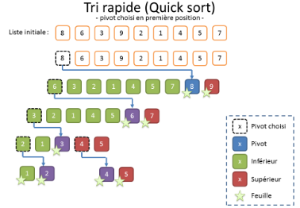


## <H2 STYLE="COLOR:BLUE;"> <a name="_toc144400478"></a>**7. Projet (démarche d’investigation)**</H2>
**<H3 STYLE="COLOR:red;">Projet 1 : Rotation d’une image numérique</H3>**

1. **Petits rappels de SNT**

Une image est un tableau de pixels.

Une image en 1024x720 se compose de 1024x720 pixels.

Chaque pixel a une couleur. La couleur est définie à partir de ses trois composantes : rouge, vert et bleu.

On définit un repère en prenant comme origine le coin en haut à gauche de l'image.

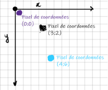

A l'aide la library PIL de Python nous allons manipuler des images 

Nous allons travailler sur cette image :


1.1. Tester et commenter le code ci-dessous :

```python
from PIL import Image
img=Image.open("image.png")
largeur, hauteur=im.size
img.show()
```

1.2. Donner les dimensions de l'image

1.3. Donner la couleur du pixel de coordonnées (100;100). (utiliser la methode getpixel())

Souvent, il faudra parcourir l’image pixel par pixel, sur toute la largeur et toute la hauteur. Cela est possible avec deux boucles imbriquées, à condition de connaitre ses dimensions largeur, hauteur:

```python
for x in range(largeur): # x varie de 0 à largeur - 1
    for y in range(hauteur): # y varie de 0 à hauteur - 1
      # traitement pixel (x,y)

img.save("nouveau_nom.jpg")
```

1.4. Remplacer la couleur des pixels se situant dans un carré de dimension 100 pixels au centre de la photo par la couleur en RGB (25,153,89). Utiliser la méthode putpixel((x,y),p)

1.5. Redimensionner l'image pour qu'elle soit deux fois plus petite. On pourra aller voir les fonctionnalités du module PIL.


2 **Rotation** 

**Rotation d'un quart de tour.** Un pixel de coordonnées (x;y) dans une image de taille n×n a pour coordonnées **avant** rotation d'un quart de tour en sens horaire (y;n−1−x)

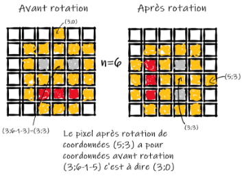

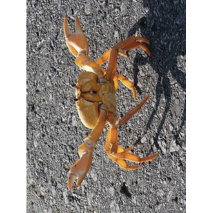

Ecrire la procédure rotation(image) qui reçoit pour paramètres une chaîne de caractères correspondant au nom de l'image carrée et un entier n correspondant à la taille de l'image et qui affiche l'image retournée de 90° dans le sens des aiguilles d'une montre. (Evidemment sans utiliser rotate() !)

Avant la boucle de parcours des pixels, ajouter :

```python
planPixels=Image.new("RGB",(largeur,hauteur))
```

<https://www.geeksforgeeks.org/python-pil-image-new-method/> 

On prendra l’image du crabe 


3 **Rotation récursive**

On cherche maintenant à effectuer cette transformation, SANS utiliser de nouvelle image planPixels comme précédemment. Ce sera une méthode dite en O(1) du point de vue de la complexité spatiale.

On utilisera l’image suivante (carrée) pour cette méthode : **woody.jpg**

3.1. Compléter la procédure echange\_pix suivante

```python
def echange_pix(image, x0, y0, x1, y1):
    """procedure qui echange les pixels d'une image entre une position 
    de depart start et d'arrivée end
    Params:
    ------
    image : objet de la classe Image
    x0,y0: int, int: coordonnées du pixel de depart
    x1,y1: int, int: coordonnées du pixel d'arrivée

    Example: echange du pixel (0,0) avec celui (120,120)
    --------
    >>> echange_pix(image,0,0,120,120)
    """
    start = image.getpixel((x0, y0))
    end = image.getpixel((x1, y1))
    # à compléter
```

3.2. Compléter la procédure echange\_quadrant suivante

Cette procédure permet d’échanger les pixels de 2 zones carrées de mêmes dimensions.

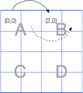

```python
def echange_quadrant(image, x0, y0, x1, y1, n):
    """procedure qui echange tous les pixels du bloc de pixels A
    avec ceux du bloc B, de même dimension n*n.
    L'image doit être carrée, de largeur et hauteur égaux à n
    A et B occupent une position quelconque parmi les 4 quarts de l'image
    Params:
    -------
    image : objet de la classe Image
    x0,y0: int, int: coordonnées du pixel du coin superieur gauche de A
    x1,y1: int, int: coordonnées du pixel du coin superieur gauche de B
    n : int : largeur ou hauteur de l'image, en nombre de pixels
    Example: echange du quart d'image en haut à gauche (A) avec celui 
    ------------ en haut à droite (B) sur une image de largeur 420


    >>> echange_quadrant(image,0,0,120,0,120)
    """
    for i in range(n):
        for j in range(n):
            echange_pix(image, # à compléter
```

3.3 On veut échanger les blocs A et D, qui font chacun 120\*120 pixels. Quelle instruction faut-il écrire, utilisant la procédure echange\_quadrant.

3.4 Même question pour échanger les blocs A et C.

**Diviser pour régner**

La méthode de "Diviser pour régner" en algorithmique se décompose en trois étapes :

- Diviser : on découpe l'image en images de taille 2x2
- Régner : on effectue la rotation de chaque image de taille 2x2
- Fusion : la fusion est réalisée en échangeant les quadrants lors des appels récursifs.

La procédure permet de faire tourner l’image d’un quart de tour par une méthode de type *diviser pour régner*.

Une fois la partie **divisée** exécutée (appels récursifs), lorsque les subdivisions de l’image sont constituées d’un seul pixel, les pixels sont déplacés (**règne**) à l’aide d’une rotation 

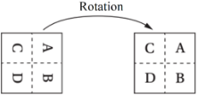

Puis de 3 permutations successives, selon le schéma suivant.

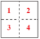On numérote les cases :


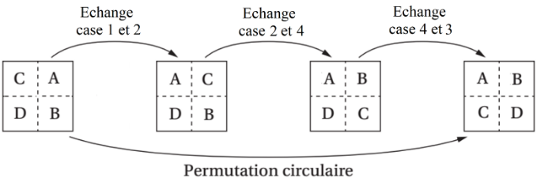


Ils sont alors recombinés pour reformer l’image, tout en suivant les mêmes permutations, mais avec des blocs de pixels plus gros (**fusion**).

3.5. Si on appelle m la dimension du carré, quelle est la procédure qui permet de réaliser l'échange ci-dessous ?

3.6. Compléter la procédure rotate, de telle sorte que la permutation circulaire se fasse :

```python
def rotate(image,x0,y0,n):
    """procedure recursive qui tourne d'un quart de tour un carré
    de l'image de dimension n.
    à chaque appel recursif, la taille de l'image est divisée par 2.
    Si l'image fait plus d'un seul pixel, la rotation se fait par
    permutation des (zones de) pixels A<=>B, B<=>D, D<=>C
    Params:
    -------
    image
    x0,y0: int, int: coordonnées du pixel du coin superieur gauche du carré
    n: dimension du carré
    Example:
    --------
    rotate(image,0,0,420)
    """
    if n>=2:
        m = n//2
        rotate(image,x0,y0,m)
        rotate(image,x0,y0+m,m)
        rotate(image,x0+m,y0,m)
        rotate(image,x0+m,y0+m,m)
	# à compléter
```**Activité

3.7. *Analysez la procédure :* A l’aide de l’image suivante, que vous découperez, montrer pas à pas ce qui est réalisé par la fonction rotate

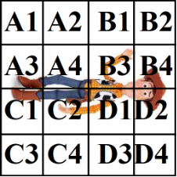

3.8. Ecrire la procédure quart\_tour(image) qui réalise la rotation de image de taille n d'un quart de tour.


