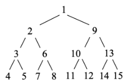
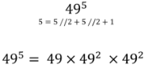
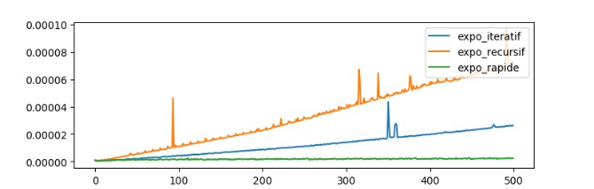
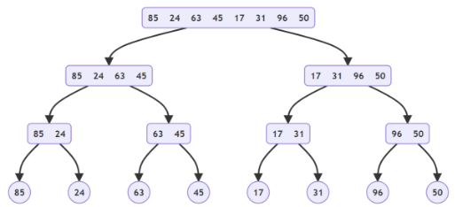
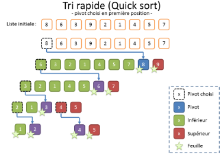
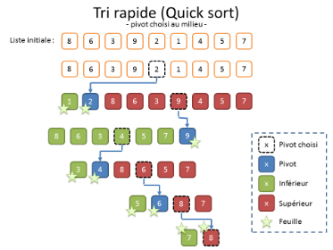
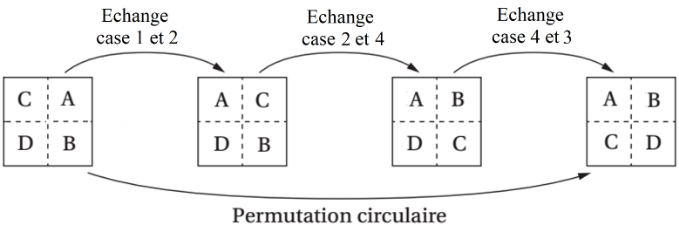

**Table des matières**

1. [**Introduction**](#_toc144400464)
2. [**L’exponentiation**](#_toc144400465)
3. [**Tri fusion (MergeSort**)](#_toc144400469)
4. [**Comparaison des performances**](#_toc144400475)
5. [**Retour sur la recherche dichotomique**](#_toc144400476)
6. [**Exercices**](#_toc144400477)
7. [**Projet (démarche d’investigation)**](#_toc144400478)

**Compétences évaluables :**

- Ecrire un algorithme utilisant la méthode « diviser pour régner »

La méthode diviser pour régner *divide and conquer* se décompose en 3 étapes.

- **Diviser** : découper le problème de départ en sous problèmes
- **Régner** : résoudre les sous problèmes soit directement soit récursivement si la division nous place dans le même problème de départ mais en plus petit
- **Combiner** : à partir des solutions trouvées au sous problème, former la réponse finale. Si la récursivité a été employée dans la résolution, elle le sera aussi ici

**Remarque**: 
- Si les sous-problèmes sont indépendants les uns des autres : « **Diviser pour régner** ».
- Si les sous-problèmes dépendent les uns des autres : « **Programmation dynamique** ».

## **1. Introduction**

L’idée de base est de trouver une **méthodologie** pour résoudre des problèmes. Par exemple : On veut résoudre le problème A. 

Si on sait : 

1\. transformer le problème A en un problème B; 

2\. résoudre le problème B; 

3\. transformer la solution du problème B en une solution du problème A, 

alors on sait résoudre le problème A.

***Exemple Le téléphone en chaine***

Les 15 joueuses d’une équipe de volleyball ont la liste des joueuses de l’équipe avec leur numéro de téléphone. La capitaine reçoît l’information que le prochain match a été́ déplacé́. Il faut prévenir toutes les autres joueuses.

**Solution 1** : la capitaine se charge d’**appeler toutes les autres joueuses**. Et si elle passe 5 minutes au téléphone avec chacune d’entre-elles…

**Question à propos de la solution 1** : En combien de temps (noté t1) l’ensemble de l’équipé est informé? En déduire la complexité́ de cette solution en fonction de n (taille de l’équipe)

**Solution 2** : Une solution plus efficace et plus confortable pour la capitaine est **qu’elle divise la liste de joueuses en deux moitiés**. Elle **appelle alors la première joueuse** de chacune des deux listes obtenues. Elle leur donne l’information de report de match et leur demande à leur tour de faire la même chose : **diviser en deux la demi-liste** à laquelle elles appartiennent, **appeler la première joueuse** de chacune des parties et ainsi de suite … jusqu’à ce qu’il n’y ait plus personne à prévenir.

Représentons l’arbre des appels pour la liste de 15 joueuses numérotées de 1 à 15.

**Question à propos de la solution 2**: Si on suppose qu’un appel téléphonique dure 5 min. En combien de temps (noté t2) l’ensemble de l’équipe est informé ? En déduire la complexité́ de cette solution en fonction de n (taille de l’équipe)

**Conclusion**: La solution 2 illustre bien la méthode **Diviser pour régner** puisqu’à chaque nouvel appel téléphonique, le nombre de joueuses contactées avec le même message va doubler. La durée nécessaire pour la résolution du problème initial (téléphoner à toutes les joueuses) est alors réduite de manière significative.

La méthode « diviser pour régner » va s’appliquer à des problèmes où la **notion de taille va apparaitre**.  La résolution en utilisant la méthode diviser pour régner

1\. Diviser pour faire apparaître les sous-problèmes à résoudre ; 

2\. Régner pour résoudre effectivement les sous-problèmes ; 

3\. Combiner pour obtenir une solution du problème initial.

## **2. L’exponentiation**
L’exponentiation consiste à trouver une méthode pour calculer a à la puissance n, **SANS utiliser l’opérateur *puissance*.** L’idée est de se rapprocher de l’algorithme utilisé par le processeur d’un ordinateur, qui n’utilise que les 3 opérateurs de base pour effectuer les calculs (+,-,\*).

1. ## **Programme itératif**

|
**Activité n° AUTONUM  \* Arabic :** Etudions l’algorithme d’exponentiation en version itérative

def exp1(*n* : int ,*a*: float) -> float : `    `*""" `    `programme qui donne a^n en sortie `    `"""* `    `valeur=1 `    `for i in range(n): `        `valeur\*=*a* `    `return valeur
|
| - |

**Complexité** :

La boucle for est exécutée n fois. Il y a, à chaque itération, une opération arithmétique qui est réalisée (multiplication par a), et une affectation (le résultat est affecté à *valeur*).

Il y a donc au total : **2n + 1** opérations.

La complexité est O(n).
1. ## **Programme récursif**

|
**Activité n° AUTONUM  \* Arabic :** Etudions l’algorithme d’exponentiation en version récursive

def exp2(*n* : int ,a: float) -> float : `    `*""" `    `programme qui donne a^n en sortie `    `"""* `    `if *n* == 0: `        `return 1 `    `else: `        `return *a*\* exp2(*n*-1,*a*)
|
| - |

**Complexité** :

La complexité est aussi O(n).
1. ## **Exponentiation rapide : application de la méthode Diviser pour régner**
Comme de nombreux algorithmes utilisant cette méthode, celui-ci fait des appels récursifs. Mais à la différence du précédent, **l’appel récursif se fait avec un paramètre que l’on divise par 2** (le paramètre n). C’est ce qui fait que le nombre d’appels récursifs est plus réduit. 

Par exemple 495

On retrouve l’étape 3 évoquée en introduction (la combinaison des sous problèmes) lorsque l’on réalise l’opération : return y\*y ou bien return x\*y\*y.

|
**Activité n° AUTONUM  \* Arabic :** Etudions l’algorithme d’exponentiation en version méthode Diviser pour régner

def exp3(*n* : int ,*a*: float) -> float : `    `*""" `    `programme qui donne a^n en sortie `    `"""* `    `if *n* == 0: `        `return 1 `    `else: `        `y = exp3(*n*//2,*a*) # on prend la valeur inférieure de n/2 `        `if *n*%2 == 0 : `            `return y\*y `        `else: `            `return a\*y\*y
|
| - |

**Complexité**

Prenons pour exemple n = 8 :

Dans la phase de descente : exp3(8,a) appelle exp3(4,a) appelle exp3(2,a) qui appelle exp3(1,a) puis exp3(0,a).

Dans la phase de remontée: Une seule opération est réalisée à chaque appel recursif : y\*y
C'est comme si l'on **dupliquait** le résultat de chaque multiplication (voir représentation en arbre plus bas)

- exp3(0,a) retourne 1
- exp3(1,a) retourne a \* 1 \* 1
- exp3(2,a) retourne a \* a
- exp3(4,a) retourne a2 \* a2
- exp3(8,a) retourne a4 \* a4

Le nombre d'opérations est le nombre de divisions par 2 qu'il faut faire pour réduire n à 0. Ce nombre est justement égal à :

log2(n)

représentation en arbre

**Remarque** : L’exponentiation rapide peut être utilisée pour des “multiplications” plus compliquées, comme la multiplication de matrices, la composition de fonctions,… Dans ces cas, il ne faut pas oublier de compter le coût de la multiplication dans les calculs, qui n’est pas toujours constant.

Comparaison des vitesses des différents algorithmes d’exponentiation

1. # **Tri fusion (MergeSort)**
   1. ## **Le principe**
Dans cette partie, nous allons essayer de comprendre les principes sur lesquels s’appuie ce tri. 

Le tri fusion s’appuie sur la méthode **Diviser pour régner** pour trier les n éléments d’une séquence S :

1. **Diviser :** Si la séquence S est composée de 0 ou un élément, retourner S immédiatement ; cette séquence est déjà triée. => **Cas de base**. 

   Si la séquence S est composée de plus de deux éléments, la **diviser en deux sous-séquences** S1**​ et** S2**​** contenant chacune environ la moitié des éléments de S ; 

- S1​ est formée des n2  premiers éléments de S
- S2**​**  contient les n2 derniers éléments de S.
1. **Régner :** **Trier récursivement** S1 **et** S2
1. **Combiner :** **Reformer la séquence** S en combinant, dans l’ordre, les éléments des séquences triées S1 et S2

**Remarques** :

- n2  est la notation mathématique pour l’opération en Python n // 2, c’est à dire *le plus grand entier inférieur au résultat de la division de* *n par 2*.
- n2  est la notation mathématique pour l’opération en Python n // 2 + 1, c’est à dire pour *le plus petit entier supérieur au résultat de la division de* *n par 2*.

**Exemple** : Pour n = 11

- n2 donne les 5 premiers éléments 
- n2 donne les 5+1 derniers éléments
  1. ## **Illustration graphique**
Pour bien comprendre la méthode employée, le plus simple est de construire un arbre binaire dans lequel chaque nœud est le résultat d’un appel récursif.

*Résultats des différents appels récursifs (Partie **Diviser**)*

*Résultats progressifs après les étapes **Régner** et **Fusionner**.*

***Légende***

- *Chaque nœud représente un appel récursif* ;
- **Nœud avec une bordure en pointilles :** *appels récursifs non encore effectués* ;
- **Nœud avec une bordure en gras :** *appel récursif en cours* ;
- **Nœud vide avec une bordure :** *partie déjà traitée* ;
- **Nœud en partie vide (contenant tout de même des valeurs) :** *appels récursifs en attente*.

![ref1]

![ref2]

![ref3]

![ref4]

![ref5]

![ref6]

![ref7]

![ref8]

![ref9]

![ref10]

![ref11]

![ref12]

![ref13]

… et après quelques appels supplémentaires…

![ref14]

1. ## **Illustration en vidéo**

|
Vidéo en dance : <https://youtu.be/XaqR3G_NVoo> 

Vidéo explicative : <https://youtu.be/OEmlVnH3aUg>
|
Visualisation du tri 

<http://lwh.free.fr/pages/algo/tri/tri_fusion.html>

|
| - | - |

1. ## ` `**Implémentation du tri fusion pour un tableau**

|
**Activité n° AUTONUM  \* Arabic :** Étudier le code suivant et remplacer les … pour chaque numéro.

from typing import List

def tri\_fusion(S: List[int]) -> None: `    `""" `    `Implémentation du tri fusion. La liste S est modifiée en place. `    `""" `    `n = len(S)  # ... (0) `    `if n < 2: `        `return None  # ... (1)  `    `# Diviser, Régner, Combiner ? ... (2) `    `milieu = n // 2 `    `S1 = S[:milieu]  # .... (3) `    `S2 = S[milieu:]  # .... (4)  `    `# Diviser, Régner, Combiner ? ... (5) `    `tri\_fusion(S1)  # ... (6) `    `tri\_fusion(S2)  # ... (7)  `    `# Diviser, Régner, Combiner ? ... (8) `    `fusion(S1, S2, S)  # ... (9)
|
| - |
|
**Activité n° AUTONUM  \* Arabic :** Étudier le code suivant et expliquer comment s’effectue la fusion.

def fusion(S1: List[int], S2: List[int], S: List[int]) -> None: `    `""" `    `Combine les éléments des deux listes S1 et S2 dans la liste S (en place). `    `i est le nombre d'élément(s) de S1 copié(s) dans S1.  `    `j est le nombre d'élément(s) de S2 copié(s) dans S2.  `    `On doit donc avoir i + j <= len(S). `    `""" `    `i = 0 `    `j = 0  `    `while i + j < len(S): `        `if j == len(S2) or (i < len(S1) and S1[i] < S2[j]): `            `S[i + j] = S1[i] `            `i = i + 1 `        `else: `            `S[i + j] = S2[j] `            `j = j + 1
|

|
**Activité n° AUTONUM  \* Arabic :** Étudier le comportement du programme complet à l’aide de pythontutor.

Construire la liste à l’aide de l’instruction :

liste **=** **[**randint**(1,** **400)** **for** i **in** range**(5)]**

Ne pas oublier d’importer random
|
| - |

|**Activité n° AUTONUM  \* Arabic :** Quelle est la complexité de la fonction fusion ? Essayer d’évaluer la complexité de l’algorithme sans faire de calcul.|
| - |

1. ## **Complexité**
Pour déterminer la formule de récurrence qui nous donnera la complexité de l’algorithme, étudions les trois étapes de cet algorithme

- **Diviser** : cette étape se réduit au calcul du milieu de l’intervalle [début, fin]
- **Régner** : l’algorithme résout récursivement deux sous-problèmes de tailles respectives *n/2.*
- **Combiner** : la complexité de cette étape est celle de l’algorithme de fusion qui est de Θn pour la construction d’un tableau solution de taille n.

Donc la complexité de l’algorithme du tri fusion pour trier un tableur de taille n est <b><i>O(n) =</i></b> O(n<b><i>.log2(n))</i></b>

1. # **Comparaison des performances**
La complexité des tris par insertion et sélection est en O(n²), celle du tri par fusion est en **O(n.log(n))**

|
**Activité n° AUTONUM  \* Arabic : Comparaison des performances des différents tris**. Créer un fichier contenant le script suivant dans le même dossier que les trois tris.

import datetime import random from tri\_insertion import tri\_insertion from tri\_selection import tri\_selection from tri\_fusion import tri\_fusion  n = 1000 t=[random.randint(1,1000) for i in range(n)]  # tri insertion t1=t[:] #recopie start = datetime.datetime.now() t2=tri\_insertion(t1) end = datetime.datetime.now() print("tri insertion : ",(end-start).total\_seconds())   # tri selection t1=t[:] #recopie start = datetime.datetime.now() t3=tri\_selection(t1) end = datetime.datetime.now() print("tri selection : ",(end-start).total\_seconds())   # tri fusion t1=t[:] #recopie start = datetime.datetime.now() t4=tri\_fusion(t1) end = datetime.datetime.now() print("tri fusion : ",(end-start).total\_seconds())
|
| - |

1. # **Retour sur la recherche dichotomique**
Nous avons déjà rencontré la recherche dichotomique. On rappelle qu’il s’agit de déterminer si un entier val apparait dans une liste tab qui est triée par ordre croissant. Plus précisément on cherche à écrire une fonction qui :

- prend en paramètres : val la valeur recherchée, table tableau trié par ordre croissant;
- renvoie i un indice où la valeur val apparait dans tab et None si la val n’est pas dans tab.

Pour cela on utilisera la technique de la dichotomie. Il s’agira de délimiter une portion du tableau dans laquelle la valeur peut se trouver avec deux indices g et d. On peut illustrer la situation à chaque étape :

**

|
**Activité n° AUTONUM  \* Arabic :** Écrire une fonction récursive en Python qui

- prend en paramètres une liste tab d’entiers triés par ordre croissant, un entier à rechercher val.

- renvoie i un indice où la valeur val apparait dans tab (ou True selon comment est codé l’algorithme) et False si la val n’est pas dans tab.  La valeur i est recherchée dans tab[g..d]

On peut passer les slices des listes de python ou utiliser des indices entrés avec une valeur par défaut
|
| - |

La méthode « Diviser pour régner » est le paradigme naturel de la récursivité.

La complexité d’un algorithme qui s’appuie sur le paradigme « Diviser pour régner » est parfois optimale (exponentiation rapide, recherche dichotomique, tri fusion, etc.) mais pas toujours (recherche du minimum et du maximum dans une liste, somme des éléments d’une liste, recherche dans une liste non triée, etc.).

L’efficacité d’un algorithme qui s’appuie sur le paradigme « Diviser pour régner » dépend de l’implémentation de la récursivité par le langage choisi.

1. # **Exercices** 
**Exercice n°1 : Connaitre le cours**

1. En quoi consiste la méthode diviser pour régner ?
1. Donner la séquence des appels de la fonction tri\_fusion vue dans la leçon lors de l’appel tri\_fusion([23,35,78,15,65,5,99]). La réponse peut être un arbre des appels.
1. Donner la séquence des appels de la fonction recherche basée sur la dichotomie vue dans la leçon lors de l’appel recherche\_dichotomique([1,3,15,16,23,35,38,40,42,45],42) puis lors de l’appel de recherche\_dichotomique([1,3,15,16,23,35,38,40,42,45],17)

**Exercice n°2 : Raisonner avec la méthode “diviser pour régner”**
|||
| :- | :- |
|||

1. Est-il possible de paver, avec une pièce comme ci-contre   un échiquier des dimensions suivantes : 
- 3n × 3n
- 4n × 4n
- 6n × 6n

Si oui, expliquez comment réaliser ce pavage

1. Trouver une méthode pour paver, avec des pièces comme dans la question précédente, un échiquier de taille 2n × 2n qui contient un trou (1 seul trou qui ne doit pas être couvert par une pièce)
1. Montrer comment la méthode diviser pour régner permet de résoudre le problème précédent

**Exercice n°3 : Dichotomie à l’envers**

Écrire une fonction recherche\_dichotomique\_envers récursive en Python basée sur le principe de dichotomie qui :

- prend en paramètres une liste tab d’entiers triés par ordre décroissants, un entier à rechercher val, des entiers g et d qui représentent les bornes de recherche dans la liste
- Renvoie i un indice où la valeur val apparait dans tab et None si la val n’est pas dans tab. La valeur i est recherchée dans tab[g..d]. Ajoutez quelques tests pour vérifier le bon fonctionnement de votre fonction

**Exercice n°4 : Tri rapide**

Le Quicksort est une méthode de tri inventée par Sir Charles Antony Richard Hoare en 1961 et fondée sur la méthode de conception « diviser pour régner ». Il peut être implémenté sur un tableau ou sur des listes ; son utilisation la plus répandue concerne tout de même les tableaux. 

- **Diviser** : on partage le tableau en deux parties. Ce partage se fait autour d’une valeur du tableau choisie au hasard, c’est le pivot. Du coup, le pivot est à sa place ! il ne reste plus qu’à placer les autres !
- **Régner** : On trie les tableaux récursivement (on repartage donc) ou on ne fait rien si la taille est 1 (puisqu’un seul élément est forcément ordonné)
- **Combiner** : rien à faire

La méthode consiste à placer un élément du tableau (appelé **pivot**) à sa place définitive, en permutant tous les éléments de telle sorte que tous ceux qui lui sont inférieurs soient à sa gauche et que tous ceux qui lui sont supérieurs soient à sa droite. Cette opération s'appelle le **partitionnement.**

Pour chacun des sous-tableaux, on définit un **nouveau pivot** et on répète l'opération de partitionnement. Ce processus est répété **récursivement**, jusqu'à ce que l'ensemble des éléments soit trié.

La complexité moyenne est en O(nlogn) mais O(n²) dans le pire des cas.

1. Ecrire une fonction tri\_rapide\_gauche qui permet d’illustrer le schéma suivant :

1. 💣 💣 Ecrire une fonction tri\_rapide\_milieu qui permet d’illustrer le schéma suivant :

**Aide :** il faut créer une fonction partition(T, indice\_gauche, indice\_droite, indice\_pivot) qui trie les éléments plus petit que le pivot vont à gauche et les élément plus grand que le pivot à droite. Concrètement, pour partitionner un sous-tableau :

- le pivot est placé à la fin (arbitrairement), en l'échangeant avec le dernier élément du sous-tableau ;
- tous les éléments inférieurs au pivot sont placés en début du sous-tableau ;
- le pivot est déplacé à la fin des éléments déplacés.
1. Ecrire une fonction tri\_rapide\_aléatoire qui permet d’illustrer le schéma suivant :

`	`**Aide** : utiliser la fonction partition précédente

**Exercice n°5 : Sommes des n nombres d’un tableau** 

1. Écrire le code de fonction somme1 qui permet de déterminer la somme des n nombres (entiers) d’un tableau en récursif
1. Réfléchir à un algorithme utilisant le principe « Diviser pour régner » qui résout le même problème.

   Écrire le code de la fonction somme2 qui implémente cet algorithme.

**Exercice n°6 : Recherche des plus grand et petit éléments dans un tableau** 

1. Générer une liste contenant un million de termes choisis aléatoirement entre un et mille milliards.
1. Utiliser les fonctions min et max fournies par le langage Python afin d’afficher les maximum et minimum dans la liste.
1. Écrire le code de la fonction maxmin1 qui, à partir d’un algorithme de « brute force », détermine les maximum et minimum dans la liste passée en argument. La spécification de la fonction est : maxmin1(tab: List[float]) -> Tuple[float, float]
1. Vérifier le bon fonctionnement de la fonction maxmin1 en affichant les maximum et minimum dans la liste, à la suite de ceux déterminés à l’aide des fonctions fournies par Python.
1. Quelle est la complexité de la fonction maxmin1 ?
1. Comparer l’efficacité de la fonction maxmin1 à celle des fonctions fournies par Python en mesurant les durées d’exécution à l’aide de la fonction time du module time.
1. Écrire et implémenter la fonction maxmin2 qui implémente le raisonnement «Diviser pour régner » pour résoudre ce problème.

   Dans un premier temps, écrire une fonction qui se contente de déterminer le maximum dans la liste passée en argument. Compléter ensuite le code de façon à ce que le maximum et le minimum soient retournés. La spécification de la fonction est : maxmin2(tab: List[float]) -> float

1. Vérifier le bon fonctionnement de la fonction à la suite des précédentes vérifications.
1. Modifier la fonction maxmin2 afin qu’elle retourne les maximum et minimum dans la liste. La spécification de la fonction est : maxmin2(tab: List[float]) -> Tuple[float, float]

   La complexité de cette fonction est en O(n).

1. Vérifier le bon fonctionnement de la fonction à la suite des précédentes vérifications.
1. La fonction maxmin2 est-elle, théoriquement, plus efficace que la fonction maxmin1 ? Dans la pratique ? Comment expliquer ce comportement ?

**Exercice n°7 :** **Problème de la sous-séquence de somme maximale**

Étant donné un tableau tab[1..n] d’entiers (positifs et négatifs), déterminer la valeur maximale du sous-tableau tab[g..h] donnant la plus grande somme de tous les sous-tableaux contigus de tab. Pour plus de commodité, la sous-séquence de somme maximale est 0 si tous les entiers sont négatifs.

Exemples

- Pour le tableau tab = [-2, -5, 6, -2, -3, 1, 5, -6], la sous séquence de somme maximale est [6, -2, -3, 1, 5] et sa somme est 7.
- Pour le tableau tab = [0, 1, 2, -2, 3, 2], la sous séquence de somme maximale est [1, 2, -2, 3, 2] et sa somme est 6.
- Pour le tableau tab = [1, -2, 3, 10, -4, 7, 2, -5], la sous séquence de somme maximale est [3, 10, -4, 7, 2] et sa somme est 18.

1. On envisage dans un premier temps un algorithme basé sur le paradigme « Brute force » : on évalue la somme de chaque sous-tableau (parmi les n(n+1)/2 sous-tableaux possibles) et à chaque évaluation on mémorise la somme maximale. Écrire le code de la fonction sous\_tab\_max dont la spécification est : sous\_tab\_max(tab: List[int]) -> int
1. Quelle est la complexité de cette fonction ?

Le tableau initial est scindé en deux parties de tailles à peu près égales (selon que n est pair ou impair) : la plus grande somme se trouve soit dans le sous-tableau B de droite, soit dans le sous-tableau A de gauche, soit à cheval sur les deux sous-parties. Dans ce dernier cas elle est constituée d’une plus grande somme de la partie gauche se terminant à la fin de la partie gauche (c.-à-d. en m), et d’une plus grande somme de la partie droite commençant au début de la partie droite (c’est à dire en m+1).

La procédure est récursive. Pour « sortir » des appels récursifs, il est nécessaire de ren- contrer un « couple de données-paramètres » (transmis à l’appel) dont la solution est triviale. C’est le cas si le tableau est composé d’au plus un élément.

1. Écrire le code de la fonction somme\_max dont la spécification est : 

   somme\_max(tab: List[int]) -> int

1. Écrire le code de la fonction max\_sous\_tab dont la spécification est :

   max\_sous\_tab(tab: List[float], milieu: int) -> float
1. # **Projet (démarche d’investigation)**
**Projet 1** : **Rotation d’une** **image numérique**

1. **Petits rappels de SNT**

Une image est un tableau de pixels.

Une image en 1024x720 se compose de 1024x720 pixels.

Chaque pixel a une couleur. La couleur est définie à partir de ses trois composantes : rouge, vert et bleu.

On définit un repère en prenant comme origine le coin en haut à gauche de l'image.

A l'aide la library PIL de Python nous allons manipuler des images 

Nous allons travailler sur cette image :

1. Tester et commenter le code ci-dessous :

from PIL import Image
img=Image.open("image.png")
largeur, hauteur=im.size
img.show()

1. Donner les dimensions de l'image
1. Donner la couleur du pixel de coordonnées (100;100). (utiliser la methode getpixel())

Souvent, il faudra parcourir l’image pixel par pixel, sur toute la largeur et toute la hauteur. Cela est possible avec deux boucles imbriquées, à condition de connaitre ses dimensions largeur, hauteur:

for x in range(largeur): # x varie de 0 à largeur - 1
`    `for y in range(hauteur): # y varie de 0 à hauteur - 1
`      `# traitement pixel (x,y)

img.save("nouveau\_nom.jpg")

1. Remplacer la couleur des pixels se situant dans un carré de dimension 100 pixels au centre de la photo par la couleur en RGB (25,153,89). Utiliser la méthode putpixel((x,y),p)
1. Redimensionner l'image pour qu'elle soit deux fois plus petite. On pourra aller voir les fonctionnalités du module PIL.

1. **Rotation** 

**Rotation d'un quart de tour.** Un pixel de coordonnées (x;y) dans une image de taille n×n a pour coordonnées **avant** rotation d'un quart de tour en sens horaire (y;n−1−x)

Ecrire la procédure rotation(image) qui reçoit pour paramètres une chaîne de caractères correspondant au nom de l'image carrée et un entier n correspondant à la taille de l'image et qui affiche l'image retournée de 90° dans le sens des aiguilles d'une montre. (Evidemment sans utiliser rotate() !)

Avant la boucle de parcours des pixels, ajouter :

planPixels=Image.new("RGB",(largeur,hauteur))

<https://www.geeksforgeeks.org/python-pil-image-new-method/> 

On prendra l’image du crabe 

1. **Rotation récursive**

On cherche maintenant à effectuer cette transformation, SANS utiliser de nouvelle image planPixels comme précédemment. Ce sera une méthode dite en O(1) du point de vue de la complexité spatiale.

On utilisera l’image suivante (carrée) pour cette méthode : **woody.jpg**

1. Compléter la procédure echange\_pix suivante

def echange\_pix(image, x0, y0, x1, y1):
`    `"""procedure qui echange les pixels d'une image entre une position 
`    `de depart start et d'arrivée end
`    `Params:
`    `
`    `image : objet de la classe Image
`    `x0,y0: int, int: coordonnées du pixel de depart
`    `x1,y1: int, int: coordonnées du pixel d'arrivée

`    `Example: echange du pixel (0,0) avec celui (120,120)
`    `
`    `>>> echange\_pix(image,0,0,120,120)
`    `"""
`    `start = image.getpixel((x0, y0))
`    `end = image.getpixel((x1, y1))
`    `# à compléter

1. Compléter la procédure echange\_quadrant suivante

Cette procédure permet d’échanger les pixels de 2 zones carrées de mêmes dimensions.

def echange\_quadrant(image, x0, y0, x1, y1, n):
`    `"""procedure qui echange tous les pixels du bloc de pixels A
`    `avec ceux du bloc B, de même dimension n\*n.
`    `L'image doit être carrée, de largeur et hauteur égaux à n
`    `A et B occupent une position quelconque parmi les 4 quarts de l'image
`    `Params:
`    `
`    `image : objet de la classe Image
`    `x0,y0: int, int: coordonnées du pixel du coin superieur gauche de A
`    `x1,y1: int, int: coordonnées du pixel du coin superieur gauche de B
`    `n : int : largeur ou hauteur de l'image, en nombre de pixels
`    `Example: echange du quart d'image en haut à gauche (A) avec celui 
`    ` en haut à droite (B) sur une image de largeur 420

`    `>>> echange\_quadrant(image,0,0,120,0,120)
`    `"""
`    `for i in range(n):
`        `for j in range(n):
`            `echange\_pix(image, # à compléter

1. On veut échanger les blocs A et D, qui font chacun 120\*120 pixels. Quelle instruction faut-il écrire, utilisant la procédure echange\_quadrant.
1. Même question pour échanger les blocs A et C.

**Diviser pour régner**

La méthode de "Diviser pour régner" en algorithmique se décompose en trois étapes :

- Diviser : on découpe l'image en images de taille 2x2
- Régner : on effectue la rotation de chaque image de taille 2x2
- Fusion : la fusion est réalisée en échangeant les quadrants lors des appels récursifs.

La procédure permet de faire tourner l’image d’un quart de tour par une méthode de type *diviser pour régner*.

Une fois la partie **divisée** exécutée (appels récursifs), lorsque les subdivisions de l’image sont constituées d’un seul pixel, les pixels sont déplacés (**règne**) à l’aide d’une rotation 

Puis de 3 permutations successives, selon le schéma suivant.

On numérote les cases :

trois permutations réalisées sur les subdivisions de l'image

Ils sont alors recombinés pour reformer l’image, tout en suivant les mêmes permutations, mais avec des blocs de pixels plus gros (**fusion**).

1. Si on appelle m la dimension du carré, quelle est la procédure qui permet de réaliser l'échange ci-dessous ?
1. Compléter la procédure rotate, de telle sorte que la permutation circulaire se fasse :

