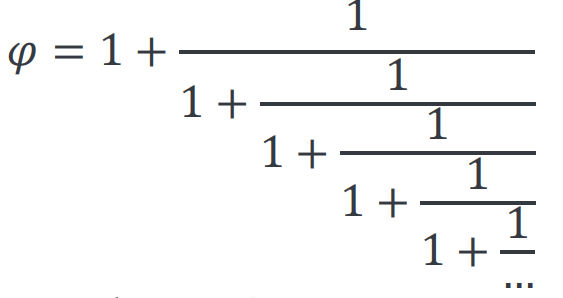

---
author: ELP
title: 02b Les bases de Python
---


**Table des matières** 

1. [**Définir une fonction**](#_page0_x40.00_y467.92)
2. [**Les conditions**](#_page1_x40.00_y240.92)
3. [**Les boucles**](#_page7_x40.00_y36.92)
4. [**Portée de variables : variables globales et locales**](#_page13_x40.00_y36.92)
5. [**La fonction lambda**](#_page13_x40.00_y581.92)
6. [**Fonctions avec des valeurs par défaut**](#_page14_x40.00_y36.92)
7. [**Exercices**](#_page15_x40.00_y36.92)
8. [**Problèmes**](#_page15_x40.00_y36.91)


## **1. Définir<a name="_page0_x40.00_y467.92"></a> une fonction** 

On utilise l’instruction def puis dans la définition de la fonction l’instruction return pour quitter l’appel. 


**Activité n° 1.**:   
```python
def mapremierefonction():  # cette fonction n'a pas de paramètre 
    """  
    Cette fonction renvoie 'Bonjour'  
    """ 
    return "Bonjour"       
```

Une fois la fonction définie, nous pouvons l’appeler : 

>>> mapremierefonction()  # ne pas oublier les parenthèses () 


L’accès à la documentation se fait avec la fonction pré-définie help() : 


>>> help(mapremierefonction) # affichage de la documentation


**Activité n° 2.**:   
```python 
def parite(nombre): 
    """ Affiche la parité d'un nombre entier """ 
    if nombre%2 != 0:   # L'opérateur % donne le reste d'une division 
        return str(nombre)+ ' est impair' 
    elif nombre%2 == 0: 
        return str(nombre)+ ' est pair'  
```
Une fois la fonction définie, nous pouvons l’appeler : 
>>> parite(13)
  
>>> parite(24)


## **2. Les<a name="_page1_x40.00_y240.92"></a> conditions  **

### **2.1. Les<a name="_page1_x40.00_y262.92"></a> structures conditionnelles**  
#### **2.1.1. L’instruction<a name="_page1_x40.00_y281.92"></a> simple if**


L’instruction if  (si en français) permet d’exécuter des instructions  seulement si une certaine condition est satisfaite.  

```
if expression:         # attention à la ponctuation   
    bloc d'instructions  # attention à l'indentation  
suite du programme  
```

Si l’expression est vraie (True) alors le bloc d’instructions est exécuté.  Si l’expression est fausse (False) on passe directement à la suite du  programme.  

**Activité n° 3.: Condition**    
 
Recopier le code suivant 
```python
def moyenne(note): 
    """ 
    cette fonction permet de savoir si on a la moyenne
    """ 
    if note >= 10: 
        # ce bloc est exécuté si note >= 10.0 est vraie
        return "J'ai la moyenne" 
```
Exécuter le programme  
>>> moyenne(16)

>>> moyenne(5)


**Activité n° 4. : Condition** 
 
Recopier le code suivant 
```python
def incremente_b(a): 
    """ 
    cette fonction incrémente la valeur de b sous conditions de la valeur de a 
    """ 
    b = 8 
    if a > 0: 
        b = b + 1 
        return a, b 
```
Exécuter le programme  
>>> incremente_b(5) 

>>> incremente_b(-3)

#### **2.1.2. L’instruction<a name="_page2_x40.00_y36.92"></a> else****

Une instruction else est toujours associée à une instruction if 

```
if expression: 
    bloc d'instructions 1   # attention à l'indentation 
else:   # else est au même niveau que if     
    bloc d'instructions 2   # attention à l'indentation 
suite du programme 
```

Si l’expression est vraie (True) alors le bloc d’instructions 1 est exécuté. 

Si l’expression est fausse (False) alors c’est le bloc d’instructions 2 qui est exécuté. 


**Activité n° 5. Condition** 

recopier et tester le code suivant
```python
def moyenne(note): 
    """ 
    cette fonction permet de savoir si on a la moyenne 
    """ 
    if note >= 10: 
        # ce bloc est exécuté si note >= 10.0 est vraie 
        return "J'ai la moyenne" 
    else: 
        return "C'est en dessous de la moyenne" 
```

Tester le script avec  
>>> moyenne(15) 

>>> moyenne(8.5) 

>>> moyenne(56) 


**Activité n° 6.** Pour traiter le cas des notes invalides (<0 ou >20), on peut imbriquer des instructions conditionnelles, recopier 
et tester le code suivant :
```python
def moyenne(note): 
    """ 
    cette fonction permet de savoir si on a la moyenne 
    """ 
    if note > 20.0 or note < 0.0: 
        # ce bloc est exécuté si l'expression (note > 20.0 or note < 0.0) est vraie 
        return "Note invalide !" 
    else: 
        # ce bloc est exécuté si l'expression (note > 20.0 or note < 0.0) est fausse 
        if note >= 10.0: 
            # ce bloc est exécuté si l'expression (note >= 10.0) est vraie 
            return "J'ai la moyenne" 
        else: 
            # ce bloc est exécuté si l'expression (note >= 10.0) est fausse 
            return "C'est en dessous de la moyenne"
``` 

Tester le script avec  
>>> moyenne(56) 

>>> moyenne(14.6) 

**Activité n° 7.** On ajoute encore un niveau d’imbrication pour traiter les cas particuliers 0 et 20 : 

```python
def moyenne(note): 
    """ 
    cette fonction permet de savoir si on a la moyenne 
    """ 
    if note > 20.0 or note < 0.0: 
    # ce bloc est exécuté si l'expression (note > 20.0 or note < 0.0) est vraie 
        return "Note invalide !" 
    else: 
        # ce bloc est exécuté si l'expression (note > 20.0 or note < 0.0) est fausse 
        if note >= 10.0:  # ce bloc est exécuté si l'expression (note >= 10.0) est vraie             
            if note == 20.0:# ce bloc est exécuté si l'expression (note == 20.0) est vraie                 
                return "C'est excellent !" 
            return "J'ai la moyenne" 
        else: 
            # ce bloc est exécuté si l'expression (note >= 10.0) est fausse 
            if note == 0.0: # ce bloc est exécuté si l'expression (note == 0.0) est vraie                 
                return "... lamentable !" 
            return "C'est en dessous de la moyenne"
```

Tester le script avec  
>>> moyenne(20) 

>>> moyenne(3) 

 On peut mettre qu’**UNE** instruction else par condition if et l’instruction else **n’est pas obligatoire** 

#### **2.1.3. L’instruction<a name="_page3_x40.00_y321.92"></a> elif**

Une instruction elif (contraction de else if) est toujours associée à une instruction if

```
if expression 1: 
    bloc d'instructions 1 
elif expression 2: 
    bloc d'instructions 2 
elif expression 3: 
    bloc d'instructions 3  # ici deux instructions elif, mais il n'y a pas de limitation 
else: 
    bloc d'instructions 4 
suite du programme 
```

- Si l’expression 1 est vraie alors le bloc d’instructions 1 est exécuté, et on passe à la suite du programme. Si l’expression 1 est fausse alors on teste l’expression 2 : 
- Si l’expression 2 est vraie on exécute le bloc d’instructions 2, et on passe à la suite du programme. Si l’expression 2 est fausse alors on teste l’expression 3, etc. 
- Le bloc d’instructions 4 est donc exécuté si toutes les expressions sont fausses (c’est le bloc “par défaut”). 

L’instruction elif évite souvent l’utilisation de conditions imbriquées (et souvent compliquées).

**Activité n° 8.**  
```python
def moyenne(note):
    """
    cette fonction permet de donner une appréciation sur la note
    """
    if note == 0.0:
        return "... lamentable !"
    elif note == 20.0:
        return "C'est excellent !"
    elif note < 10.0 and note > 0.0:
        return "C'est en dessous de la moyenne"
    elif note >= 10.0 and note < 20.0: # ou bien : elif 10.0 <= note < 20.0:
        return "J'ai la moyenne"
    else:
        return "Note invalide !"
```
Tester le avec différentes notes 

### **2.2. Les<a name="_page4_x40.00_y36.92"></a> prédicats et booléens** 

Les conditions qui se trouvent entre le if et les deux points sont appelés des prédicats. On peut tester directement ces prédicats dans l’interpréteur. 

#### **2.2.1. Les<a name="_page4_x40.00_y87.92"></a> booléens True et False :**

Tester dans  la console
>>> a = 0 

>>> a == 5

>>> a > -8 True 

>>> a != 10 True 

L’interpréteur renvoie True (« vrai ») ou False (« faux »). True et False sont les deux valeurs possibles d’un nouveau type : les booléen (bool). 

#### **2.2.2. Les<a name="_page4_x40.00_y255.92"></a> booléens And, Or et Not :**


**Activité n° 9.  avec** And**.**  

```python 
def bool_and(a): 
    """ 
    Utilisation du booléen and 
    """ 
    if a >= 2 and a <= 8: 
        return "a est dans l'intervalle." 
    else: 
        return "a n'est pas dans l'intervalle." 
```
Tester 
>>> bool_and(5) 

>>> bool_and(10) 


**Activité n° 10. avec** or  

```python
def bool_or(a): 
    """ 
    Utilisation du booléen or 
    """ 
    if a < 2 or a > 8: 
        return "a n'est pas dans l'intervalle." 
    else: 
        return "a est dans l'intervalle." 
```
Tester 
>>> bool_or(5) 

>>> bool_or(10)


**Activité n° 11. avec Not.**  

```python 
def bool_not(a): 
    """ 
    Utilisation du booléen not 
    """ 
    if not a == 5 : 
        return "a n'est pas égal à 5." 
    else: 
        return "a est égal à 5." 
```

Le prédicat not a==5 équivaut donc à a!=5. 
Tester 
>>> bool_not(5) 

>>> bool_not(10)

### **2.3. Exercices<a name="_page5_x40.00_y36.92"></a>** 


**Exercice 1** ★ Le numéro de sécurité sociale est constitué de 13 chiffres auquel s’ajoute la clé de contrôle (2 chiffres). La clé de contrôle est calculée par la formule : 97 - (numéro de sécurité sociale modulo 97) 

Ecrire un script qui contrôle la validité d’un numéro de sécurité sociale. On pourra utiliser la fonction int() 

pour convertir le type str en type int. Numéro de sécurité social valide : 1 89 11 26 108 268 91. Exemple : 
```
>>> secu(1891126108268, 91)
Votre numéro de sécurité sociale est valide.
>>> secu(2891126108268, 91)
Votre numéro de sécurité sociale est INVALIDE !
```


**Exercice 2.** ★ Ecrire une fonction mention(note) qui affichera la mention correspondante à la note obtenue.  Les mentions sont obtenues 

- Une mention "assez bien" si sa moyenne est égale ou supérieure à 12/20 et inférieure à 14/20. 
- Une mention "bien" si sa moyenne est au moins égale à 14/20 et inférieure à 16/20. 
- Une mention "très bien" s'il obtient une moyenne égale ou supérieure à 16/20. 

Si la note est supérieure ou égale à 10/20 et inférieure 12/20 le candidat obtient passable 

SI la note est inférieure à 10/20 le candidat n’a pas obtenu le bac 

Par exemple :
```
>>> mention(17)
'Très bien'
>>> mention(8)
'recalé'
```

`  `


**Exercice 3.** ★ Ecrire une fonction IMC(poids, taille) qui calcule l’indice de masse corporelle (IMC) d’un adulte et qui en donne l’interprétation (corpulence normale, surpoids…). 

Il se calcule simplement en divisant le poids (en kg) par le carré de la taille (m). Indice de masse corporelle (IMC) Interprétation (d'après l'OMS) 

moins de 18,5 Insuffisance pondérale (maigreur) 

18,5 à 24,9  Corpulence normale 

25 à 29,9  Surpoids 

30 à 39,9  Obésité  

plus de 40  Obésité morbide ou massive 

Exemple : 
```
>>> IMC(68.5, 1.70)
'IMC = 23.7: Interprétation : Corpulence normale'
```


**Exercice 4.** ★★: Ecrire une fonction annee\_bissextile(annee) qui indique qu’il s’agit d’une année bissextile. On rappelle qu’une année est bissextile si elle est multiple de 4 mais pas multiple de 100, ou si elle est multiple de 400. 

Exemple : 
```
>>> annee_bissextile(1900)
"L'année 1900 n'est pas bissextile"
>>> annee_bissextile(2000)
"L'année 2000 est bissextile"
```


**Exercice 5.** ★★ - Niveau première en mathématiques - Ecrire un script qui résout l'équation du second degré : ax² + bx + c = 0  

Pour revoir les formules à appliquer :[ https://www.maths-et-tiques.fr/telech/Secondegre2.pdf ](https://www.maths-et-tiques.fr/telech/Secondegre2.pdf)

Il faut importer la fonction racine  from math import sqrt Exemple : 
```
>>> racine(1, -3, 2)
Le discriminant vaut : 1
'Il y a deux solutions : 1.0 et 2.0'
>>> racine(2, 1.5, 4)
Le discriminant vaut : -29.75
"Il n'y a pas de solution"
>>> racine(1, -6, 9)
Le discriminant vaut : 0
'Il y a une solution : 3.0'
```


QCM :[ http://fabrice.sincere.free.fr/qcm/qcm.php?nom=qcm_python3x_2 ](http://fabrice.sincere.free.fr/qcm/qcm.php?nom=qcm_python3x_2)

## **3. Les<a name="_page7_x40.00_y36.92"></a> boucles** 
### **3.1. L’instruction<a name="_page7_x40.00_y58.92"></a> for…in**

L'instruction for travaille sur des séquences. Elle est en fait spécialisée dans le parcours d'une séquence de plusieurs données.

```
for élément in séquence :     
    bloc d'instructions 
suite du programme 
```

**Activité n° 12.**:  Avec une séquence de caractères : 
```python
def epeler(chaine): 
    """ 
    affiche chaque lettre de la chaine de caractère appelée chaine 
    """ 
    for elmt in chaine: 
        print(elmt) 
    return 'voilà!!' 
```
elmt s’appelle la variable d’itération 
Tester la fonction avec : 
>>>>  epeler('Bonjour') 

La variable lettre est initialisée avec le premier élément de la séquence ('B'). Le bloc d’instructions est alors exécuté. 
Puis la variable lettre est mise à jour avec le second élément de la séquence ('o') et le bloc d’instructions à nouveau 
exécuté… Le bloc d’instructions est exécuté une dernière fois lorsqu’on arrive au dernier élément de la séquence ('r'). 


**Activité n° 13.**:  Tester le script précédent sur[ http://pythontutor.com/ ](http://pythontutor.com/)  
 - 

**Activité n° 14.**:  avec les éléments d’une liste : 
Tester la fonction précédente avec  
>>>  epeler(['Pierre', 67.5, 18])  

### **3.2. L’instruction<a name="_page7_x40.00_y637.92"></a> for avec la fonction range()**


**Activité n° 15.**:  L’association avec la fonction range() est très utile pour créer des **séquences automatiques de nombres entiers :** 

```python
def compter(nombre): 
    """ 
    affiche les nombres de 1 à celui demandé comme un chrono 
    """ 
    for i in range(1,nombre+1): 
        print(i) 
    return 'voilà!!' 
```

>>>> compter(5)


**Activité n° 16.**:  Table de multiplication 
 - 
La création d’une table de multiplication paraît plus simple avec une boucle for qu’avec une boucle while :
```python 
def table_de_multiplication(nombre): 
    """ 
    affiche la table de multiplication du nombre demandé 
    """ 
    for i in range(0,11): 
    p   rint(i, 'x', nombre, '=', i\*nombre) 
    return 'voilà!!' 
```
>>> table_de_multiplication(9) 

### **3.3. L’instruction<a name="_page8_x40.00_y448.92"></a> while**

On utilise généralement la boucle while lorsqu’on souhaite répéter un nombre de fois une même instruction et **qu’on ne sait pas combien de fois cette instruction va être répétée**. 

On connait alors une **condition d’arrêt**, c’est-à-dire un test qui permet de savoir si l’instruction va être répétée ou non. 

Point de vocabulaire : dans l’exemple précédent, 50 sera appelé le **prédicat.** 

```
while expression:  # attention à la ponctuation     
    bloc d'instructions # attention à l'indentation 
suite du programme 
```

Si l’expression est vraie (True) le bloc d’instructions est exécuté, puis l’expression est à nouveau évaluée. Le cycle continue jusqu'à ce que l’expression soit fausse (False) : on passe alors à la suite du programme. 

**Activité n° 17.**:  un script qui compte de 1 à 4 

```python
def compteur():
    """
    affiche un compteur
    """
    compt = 1
    while compt < 5:
        # ce bloc est exécuté tant que la condition (compteur < 5) est vraie
        print(compt)
        compt += 1 # incrémentation du compteur, compteur = compteur + 1
    return "le compteur vaut à la fin de la boucle vaut : "+str(compt) 
```

>>> compteur()


**Activité n° 18.**:  Tester le script précédent sur[ http://pythontutor.com/ ](http://pythontutor.com/)  
 - 

Attention aux programmes qui cyclent (bouclent) : selon la condition de continuation on peut se retrouver sur une **boucle infinie.** Par exemple avec l’application précédente, avec une condition du type compteur > 0, condition qui sera toujours vrai, le programme exécute la boucle sans jamais s’arrêter.  


**Activité n° 19.**:  Affichage de l’heure courante 

```python
import time     # importation du module time 
quitter = 'n'   # initialisation 
while quitter != 'o': 
    # ce bloc est exécuté tant que la condition est vraie 
    # strftime() est une fonction du module time 
    print('Heure courante ', time.strftime('%H:%M:%S')) 
    quitter = input("Voulez-vous quitter le programme (o/n) ? ") 
print("A bientôt") 
```


### **3.4. L’instruction<a name="_page9_x40.00_y446.92"></a> break**

L’instruction break provoque une **sortie immédiate** d’une boucle while ou d’une boucle for. 

Dans l’exemple suivant, l’expression True est toujours … vraie : on a une boucle sans fin. L’instruction break est donc le seul moyen de sortir de la boucle. 


**Activité n° 20.**:  Affichage de l’heure courante 
 
```python
import time     # importation du module time 
while True: 
    print('Heure courante ', time.strftime('%H:%M:%S')) 
    time.sleep(1) # fait une pause de 1s entre chaque affichage 
    quitter = input('Voulez-vous quitter le programme (o/n) ? ') 
    if quitter == 'o': 
        break 
print("A bientôt") 
```

### **3.5. Astuce<a name="_page9_x40.00_y739.92"></a>**  

Si  vous  **connaissez  le  nombre  de  boucles  à  effectuer,  utiliser  une  boucle for**.  Autrement,  utiliser  une boucle while (notamment pour faire des boucles sans fin). 

### **3.6. Exercices<a name="_page10_x40.00_y36.92"></a>** 


**Exercice 5** ★ Ecrire une fonction moyenne(liste) qui calcule la moyenne d’une série de notes. On pourra utiliser une variable qui contient la somme intermédiaire des notes.
```
>>> moyenne([15, 11.5, 16])
14.17
```

**Exercice 6** ★ 

1.  Avec une boucle for, écrire une fonction nombre_de_z(chaine) qui compte le nombre de lettres z dans une chaîne de caractères. Par exemple : 
```
nombre_de_z('Zinedine Zidane') 
2
```

2.  Ecrire une fonction nombre_de_z2(chaine) qui fait la même chose, directement avec la 
méthode count() de la classe str. Pour obtenir de l’aide sur cette méthode : 
```
help(str.count)
```

**Exercice 7** ★ 

1.  Ecrire la fonction devinette(proposition) du jeu de devinette suivant : 

```
>>> 
Le jeu consiste à deviner un nombre entre 1 et 100 :
choisir un nombre>? 50
trop petit !
choisir un nombre>? 20
trop petit !
choisir un nombre>? 70
trop grand
choisir un nombre>? 66
Gagné 
en 3 coups !
```

2.  Quelle est la stratégie la plus efficace ? 
3.  Question bonus : Montrer que l’on peut deviner un nombre en 7 coups maximum. 
Bibliographie :[ La dichotomie ](http://fr.wikipedia.org/wiki/Dichotomie)
Remarques :  
-  l’algorithme de Dichotomie est au programme de première NSI. 
-  pour créer un nombre entier aléatoire entre 1 et 100 : 
```python
import random 
nombre = random.randint(1,100)
``` 

**Exercice 8** ★★ Code de César 
En cryptographie, le code de César est une technique de chiffrement élémentaire qui consiste à décaler une lettre de 3 rangs vers la droite : 

A → D 

B → E 

... 

Z → C 

1. Ecrire une fonction message_a_coder(message) qui permet de coder un message passé en argument.Par exemple : 

```
>>> message_a_coder('abcdefghijklmnopqrstuvwxyz')
'defghijklmnopqrstuvwxyzabc'
>>> message_a_coder('Lycee Jean Cassaigne classe de NSI')
'obfhh mhdq fdvvdljqh fodvvh gh qvl'
```


On pourra utiliser la chaîne 'abcdefghijklmnopqrstuvwxyz',  la méthode find() de la classe str et la méthode lower() qui permet de tout mettre en minuscule. Pour obtenir de l’aide sur cette méthode : 

```
>>> help(str.find)
>>> help(str.lower)
```


2. Ecrire la fonction message_a_decoder(message) qui permet le décodage. Par exemple : 

```
>> message_a_decoder('obfhh mhdq fdvvdljqh fodvvh gh qvl')
'lycee jean cassaigne classe de nsi'
```


**Exercice 9** ★ Geralt de Riv kiffe ses cheveux. 

Pour ne pas être dérangé dans ses aventures il décide de les couper chaque fois qu’ils font plus de 40 cm. Ce matin Geralt a coupé ses cheveux et ils mesurent 17 cm. Chaque jour la longueur de ses cheveux augmente d’un pour cent (leur longueur est multipliée par 1.01). 

Écrire un script qui affiche dans combien de jours Geralt devra couper ses cheveux. 

**Les exercices suivants nécessitent quelques (peu quand même) aptitudes en mathématiques…** 

**Exercice 10** ★★ Ecrire une méthode heron(U, n) qui donne la valeur de la suite pour un rang n (méthode de Héron) : La méthode de Héron permet d’approcher la valeur de la racine carrée d’un nombre. Nous allons l’appliquer pour déterminer la valeur approchée de la racine de 2. Elle est définie par la suite : 
|| 
||
|Donc cela signifie :| 
||
n étant le rang 0que l’on veut calculer1la suite   2 3

Par exemple : 
```
>>> heron(20,0)
20
>>> heron(20,1)
10.05
>>> heron(20,15)
1.414213562373095
```


Aide :  

- Utiliser seulement  n et U comme variable, 

**Exercice 11** ★★ Fraction continue infinie  

Le nombre d’or est un célèbre nombre irrationnel :[ Wikipédia.](https://fr.wikipedia.org/wiki/Nombre_d%27or)  
Il a été étudié par de nombreux mathématiciens au cours du temps.  
Il vaut $\phi$ =$\frac{1+√5}{2}$  et vaut approximativement 1,61803. On peut  estimer la valeur numérique de la fraction continue suivante :  




Cela signifie que pour le rang 3, on aura : 

- 1,   = 1 + 1 = 1 + 1~~ ,   = 1 + 1~~ ,   = 1 + 1~~ , 1 1+1 1+ 1 1+ 1

1 1+1 1+ 1

1 1+1 1

Ecrire une fonction nombre\_dor(n) qui détermine la valeur approchée du nombre d’or (seulement la valeur du rang). Par exemple : 

`       `


**Exercice 12** 

★ Ecrire une fonction premier(nombre) qui détermine si un nombre entier est premier ou pas. 

**Rappel :** un nombre **premier** est un entier naturel qui n’a que deux diviseurs : 1 et lui-même. Ex : 3 est premier mais 6 ne l’est pas car 2\*3=6. Par exemple : 

`  `


Aide : Le but est de regarder le reste de la division entre le nombre donné et nombre\_en\_cours qui prend à chaque boucle une valeur de 2 au nombre. Faire une boucle while avec deux conditions qui puissent l’arrêter : l’une sur l’incrémentation du nombre en cours et l’autre si le nombre\_en\_cours est diviseur du nombre 

Une fois toutes les valeurs testées si le nombre\_en\_cours est en fait égal au nombre donné il est donc nombre premier 

[QCM sur les boucles ](http://fabrice.sincere.free.fr/qcm/qcm.php?nom=qcm_python_loop)

Source :[ Fabrice Sincère ](http://fsincere.free.fr/isn/python/cours_python_ch3.php)-[ Contenu sous licence CC BY-NC-SA 3.0 ](http://creativecommons.org/licenses/by-nc-sa/3.0/fr/)

## **4. Portée<a name="_page13_x40.00_y36.92"></a> de variables : variables globales et locales** 

La **portée d’une variable** est l’endroit du programme où on peut accéder à la variable. 

### **4.1. Variables<a name="_page13_x40.00_y76.92"></a> locales** 


**Activité n° 21.**: Observons le script suivant : 
 -  :- 
a = 10     # variable globale au programme 

def mafonction(): 
a = 20 # variable locale à la fonction 
return a 


Nous avons deux variables différentes qui portent le même nom a 

Une variable a de valeur 20 est créée dans la fonction : c’est une **variable locale** à la fonction. **Elle est détruite dès que l’on sort de la fonction.** 

### **4.2. Variables<a name="_page13_x40.00_y329.92"></a> globales** 


**Activité n° 22.**: L’instruction global rend une variable globale : 
 -  :- 
a = 10     # variable globale 

def mafonction(): 
global a   # la variable est maintenant globale 
a = 20 
return a 


**Remarque** : il est préférable **d'éviter** l’utilisation de l’instruction global car c’est une source d’erreurs (on peut ainsi modifier le contenu d’une variable globale en croyant agir sur une variable locale).  

## **5. La<a name="_page13_x40.00_y581.92"></a> fonction lambda** 

Parfois **pour éviter d’avoir à coder une fonction surtout si elle est très courte,** on préfère utiliser une fonction que l’on appelle **lambda** 


**Activité n° 23.**: Au lieu de coder la fonction g(x)= 2x, on peut écrire 
 - 

g = lambda x: 2\*x 

<p>>>> g(3) 6 </p><p>>>> g(4) 8 </p>

Point de vocabulaire : En toute rigueur, on appelle fonctions les **fonctions** qui **retourne quelque chose (avec return**) et **procédure celle qui ne retourne rien**. 

## **6. Fonctions<a name="_page14_x40.00_y36.92"></a> avec des valeurs par défaut** 

Il est parfois utile de définir des fonctions avec **plusieurs paramètres** dont certains, parce que par exemple rarement modifiés, sont **optionnels et possèdent donc une valeur par défaut**. 


**Activité n° 24.**: 
 -  :- 
def vetement(couleur\_pull='rouge', couleur\_pantalon='bleu'): 
return 'Le pull est '+couleur\_pull+' et le pantalon est '+ couleur\_pantalon 


## **7. Exercices<a name="_page15_x40.00_y36.92"></a>** 

**Exercice 13** ☆ 

1. Ecrire une fonction carre() qui retourne le carré d’un nombre : 

`  `


2. Avec une boucle while et la fonction carre(), écrire un script qui affiche le carré des nombres entiers de 1 à 100 : 

`  `


**Exercice 14** ☆ 

1. Ecrire une fonction qui retourne l’aire de la surface d’un disque de rayon R. Exemple : 

`  `


2. Ajouter un paramètre qui précise l’unité de mesure : 

Aide on ne peut faire de l’affichage facilement qu’en concaténant les chaines de caractères… 

`   `


**Exercice 15** ★ 

1. Ecrire une fonction qui retourne la factorielle d’un nombre entier N. On rappelle que : factorielle de N est noté N! 

N!=1×2×…×(N−1)×N 

Par exemple : 3!=1×2×3=6 

1!=1 

Par convention, 0!=1 

Exemple : 

`  `


2. Comparez avec le résultat de la fonction[ factorial() ](http://docs.python.org/3/library/math.html)du module math. 

**Exercice 16** ★ 

1. A l’aide de la fonction randint() du module random, écrire une fonction qui retourne un mot de passe de longueur N (chiffres, lettres minuscules ou majuscules).  

[https://www.w3schools.com/python/ref_random_randint.asp ](https://www.w3schools.com/python/ref_random_randint.asp) 

On donne : chaine = '0123456789ABCDEFGHIJKLMNOPQRSTUVWXYZabcdefghijklmnopqrstuvwxyz'

`  `


2. Reprendre la question 1) avec la fonction choice() du module random. Pour obtenir de l’aide sur cette fonction : 

import random help(random.choice) 

3. Quel est le nombre de combinaisons possibles ? 
3. Quelle durée faut-il pour casser le mot de passe de longueur 10 avec un logiciel capable de générer 1 million de combinaisons par seconde ? Convertir la valeur trouvée dans une unité mieux adaptée. 

Lien utile :[ www.exhaustif.com/Generateur-de-mot-de-passe-en.html ](http://www.exhaustif.com/Generateur-de-mot-de-passe-en.html)

**Exercice 17** ★ Ecrire une fonction qui retourne une carte (au hasard) d’un jeu de Poker à 52 cartes. On utilisera la fonction choice() ou randint() du module random. On donne : 

ListeCarte = ['2s','2h','2d','2c','3s','3h','3d','3c','4s','4h','4d','4c','5s','5h','5d','5c', '6s','6h','6d','6c','7s','7h','7d','7c','8s','8h','8d','8c','9s','9h','9d','9c', 'Ts','Th','Td','Tc','Js','Jh','Jd','Jc','Qs','Qh','Qd','Qc','Ks','Kh','Kd','Kc','As','Ah','Ad','Ac'] 

\>>> tiragecarte() '9s' 

\>>> tiragecarte() '7c' 

**Exercice 18** ★★ 

1\.  Ecrire une fonction qui retourne une liste de N cartes **différentes** d’un jeu de Poker à 52 cartes. Noter qu’une fonction peut appeler une fonction : on peut donc réutiliser la fonction tiragecarte() de l’exercice précédent. Exemple : 

`  `


2\.  Simplifier le script avec la fonction shuffle()` `et sample()` `du module random. 
 -  -  -  -  -  -  - 

**Exercice 19** ★★ Ecrire une fonction qui retourne une grille de numéros du jeu  Euro Millions. On utilisera la fonction sample() du module random.  

\>>> euromillions()  

[43, 31, 35, 41, 39, 22, 14]  >>> euromillions()  

[38, 44, 5, 29, 31, 7, 14]  

**Exercice 20**   

1\.  ★ Ecrire une fonction qui retourne la valeur de la fonction  mathématique f(x)= 27x3 -27x2 -18x +8 :  

\>>> f(0), f(1), f(0.5), f(0.25), f(0.375)   (8, -10, -4.375, 2.234375, -1.123046875)  


2\. ★★ On se propose de chercher les zéros de cette fonction par la (Wikipédia)[ méthode de dichotomie.](https://fr.wikipedia.org/wiki/M%C3%A9thode_de_dichotomie) 
 -  - 
Ecrire le script correspondant. On recherche d’un zéro dans l’intervalle [a, b] avec une précision de 
1e-12

`  `


3\.  Chercher tous les zéros de cette fonction. 

Annexe  :  représentation  graphique  de  la  fonction f(x)= 27x3 -27x2 - 

18x  +8 (graphique  réalisé  avec  la  librairie[ matplotlib ](http://matplotlib.org/examples/pylab_examples/axes_props.html)de  Python)  

[QCM sur les fonctions ](http://fabrice.sincere.free.fr/qcm/qcm.php?nom=qcm_python_function) 

Source :[ Fabrice  ](http://fsincere.free.fr/isn/python/cours_python_ch4.php)

[Sincère ](http://fsincere.free.fr/isn/python/cours_python_ch4.php)-[ Contenu sous  licence CC BY-NC-SA 3.0 ](http://creativecommons.org/licenses/by-nc-sa/3.0/fr/) 
Première NSI   Chap 02: Les bases  Page 23/23 


## **8. Problème<a name="_page15_x40.00_y36.91"></a>** 
Le chifoumi