---
author: ELP
title: 03a Modèles relationnels
---

📚 **Table des matières**

-  [1. 🧩 Qu’est ce qu’une base de données ?](#_toc144547406)
-  [2. 🧱 Présentation du modèle relationnel](#_toc144547409)
-  [3. 🧠 Exercices](#_toc144547422)

🎯 **Compétences évaluables**

- ✅ Identifier les concepts définissant le modèle relationnel
- ✅ Savoir distinguer la structure d’une base de données de son contenu
- ✅ Repérer des anomalies dans le schéma d’une base de données

---

💬 **Introduction**

Les bases de données relationnelles sont essentielles dans l’informatique d’aujourd’hui.

🎞️ [Vidéo introductive](https://www.dailymotion.com/video/x71hy5c)

---

## <H2 STYLE="COLOR:BLUE;">🧩 **1. Qu’est ce qu’une base de données ?</H2>**

### <H3 STYLE="COLOR:GREEN;">**1.1. Notion de base de données</H3>**

🔢 Le traitement informatique implique la manipulation de **volumes importants de données**.

📂 Le format **CSV** permet un stockage simple, mais il devient **limité** en cas de données massives.

⚠️ **Limitations d’un fichier CSV** :
- 🐢 Accès aux données lent (besoin de scripts à chaque lecture/écriture)
- 🔐 Pas de sécurité intégrée
- 🔄 Aucun contrôle de concurrence entre utilisateurs

💡 **Solution : utiliser un SGBD (Système de Gestion de Bases de Données)**  

Un SGBD est un **logiciel spécialisé** permettant de manipuler des bases de données de façon sécurisée et performante.

---

### <H3 STYLE="COLOR:GREEN;">**1.2. Modèles de données</H3>**

🔧 Les **modèles de données** déterminent comment l'information est structurée dans la base.

📐 **Modèle relationnel** proposé par **E.F. Codd** en 1970 :

- Structure l'information sous forme de **relations**

- Une relation est un **ensemble d'attributs**

---

## <H2 STYLE="COLOR:BLUE;">🧱 **2. Présentation du modèle relationnel</H2>**

### <H3 STYLE="COLOR:GREEN;">**2.1. Qu’est-ce qu’une relation ?</H3>**

📘 Une **relation** représente un objet du monde réel caractérisé par plusieurs **attributs**.

📌 Exemple : un **employé** → nom, prénom, matricule, service, date d’embauche.

🧩 Vocabulaire associé :

- 🧬 **Tuple** = ligne = enregistrement = entrée

- 🔢 **Degré** = nombre de champs

- #️⃣ **Cardinalité** = nombre de lignes

- 📋 Les tuples sont **uniques** et **non ordonnés**

---

???+ question "📌 **Activité n°1 : Base de données formée par deux relations**"

    *Relation Film* et *Relation Séance*

    
    
    | **Titre**     | **Directeur**   | **Acteur**          |
    |---------------|-----------------|---------------------|
    | Casablanca    | M. Curtiz       | Humphrey Bogart     |
    | Casablanca    | M. Curtiz       | Peter Lore          |
    | Les 400 coups | F. Truffaut     | J.-P. Leaud         |
    | Star Wars     | G. Lucas        | Harrison Ford       |

    | **Titre**     | **Salle**       | **Heure**           |
    |---------------|-----------------|---------------------|
    | Casablanca    | Lucernaire      | 19:00               |
    | Casablanca    | Studio          | 20:00               |
    | Les 400 coups | Sel             | 20:30               |
    | Star Wars     | Sel             | 22:15               |
    


    **1.** Quelle est la cardinalité de la relation Film ?

    ??? success "Solution"
        La cardinalité est 4 (4 lignes dans la table Film).

    **2.** Quel est le degré de la relation Séance ?

    ??? success "Solution"
        Le degré est 3 (Titre, Salle, Heure).

    **3.** Quels sont les attributs de la relation Film ?

    ??? success "Solution"
        Titre, Directeur, Acteur.

    **4.** Indiquer un tuple de la relation Séance.

    ??? success "Solution"
        Par exemple : (Casablanca, Lucernaire, 19:00)
    

---

### <H3 STYLE="COLOR:GREEN;">**2.2. Qu’est-ce qu’une vue ?</H3>**

🔍 Une **vue** est le **résultat d’une requête** sur la base, que l’on peut utiliser comme une relation.

📌 Exemple :

???+ question "**Activité n°2**"


    **5.** Quelles sont les séances de l’acteur Humphrey Bogart ?

    ??? success "Solution"
        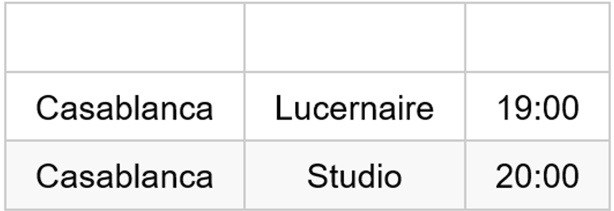{ width=25% }


---

### <H3 STYLE="COLOR:GREEN;">**2.3. Vocabulaire</H3>**


#### <H4 STYLE="COLOR:MAGENTA;">**2.3.1. Attributs</H4>**

🧱 Un **attribut** est une **colonne** de la table.
📌 Une table = entête (attributs) + corps (tuples)

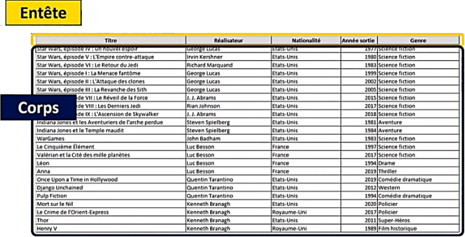{ width=50%; : .center }

---

#### <H4 STYLE="COLOR:MAGENTA;">**2.3.2. Domaine</H4>**

🔢 Le **domaine** d’un attribut est l’ensemble de ses valeurs admissibles.

📌 Exemples :

* année\_sortie → entiers > 1895
* titre → chaînes de caractères
* genre → catégories définies

---


#### <H4 STYLE="COLOR:MAGENTA;">**2.3.3. La clé primaire</H4>**

🔐 Une table **ne doit pas contenir deux t-uplets identiques**.
Pour garantir cette **unicité**, on définit une **clé primaire** (*primary key*).

> Une **clé primaire** est un attribut (colonne) ou une **combinaison d’attributs** dont les valeurs permettent d’identifier **de manière unique** chaque t-uplet de la relation.

🧠 **Exemples à retenir** :

* L’attribut `réalisateur` ne peut pas être une clé primaire : plusieurs films peuvent être réalisés par la même personne.
* L’attribut `titre` seul ne suffit pas non plus (cas des remakes).
* ✅ Il est donc courant d’ajouter un attribut **id** (ex : `id_film`) qui joue le rôle de **clé primaire auto-incrémentée**.

💡 *Bonnes pratiques* :

* Créer un attribut `id_xxx` (entier) en **auto-incrémentation** (`AUTO_INCREMENT`) pour assurer une identification simple et efficace.
* Cette stratégie optimise la gestion des données, facilite les relations entre tables, et limite les erreurs de doublon.

---

🧩 **Clé primaire composée**

Dans certains cas, une **paire d’attributs (ou plus)** peut ensemble **former la clé primaire**.

> On parle alors de **clé primaire composée** ou **clé primaire multicolonne**.

🔍 Exemple :

* Une table `Participation` contient les colonnes `id_étudiant` et `id_cours`.
* Un même étudiant peut suivre plusieurs cours, et un même cours peut accueillir plusieurs étudiants.
* ✅ La **combinaison** `(id_étudiant, id_cours)` est **unique** et peut donc servir de **clé primaire composée**.

🧠 **À retenir** :

* La **clé primaire** peut être :

  * soit un **attribut unique** (comme un `id`)
  * soit une **combinaison minimale d’attributs** assurant l’unicité de chaque ligne

⚠️ Dans ce cas, **aucun des attributs seuls** ne suffit à garantir cette unicité.

📌 On représentera cette clé composée par une **double soulignement** ou une **annotation spéciale** dans le schéma relationnel :

```
Participation(id_étudiant, id_cours, note)
PK : (id_étudiant, id_cours)
```


---

#### <H4 STYLE="COLOR:MAGENTA;">**2.3.4. Éviter les doublons</H4>**

🔁 Redondance = Risque d’erreurs → ❌
✅ Solution : séparer en plusieurs tables et lier par identifiants

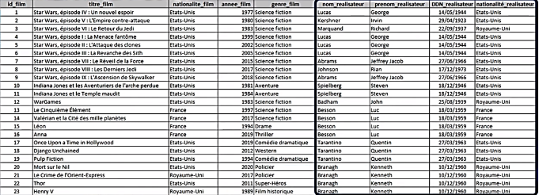

Il y a beaucoup d’informations **dupliquées**.

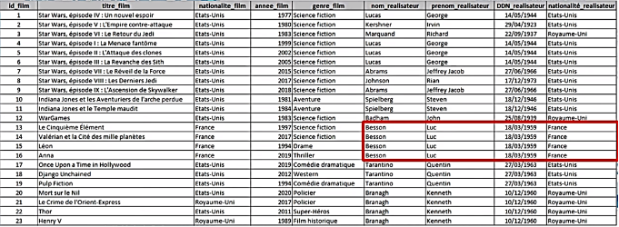

Dans une table, ces duplications sont à proscrire, car si l’on doit corriger une valeur, il faut apporter autant de fois la correction qu’il y a d’enregistrements.

Il faut donc utiliser deux tables au lieu d’une seule et créer un lien, (ou association), une relation, entre ces deux tables. 
Dans l’exemple, on créer une table film et on modifie l’attribut realisateur en id_realisateur avec un simple entier.

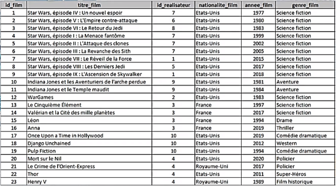

L’attribut id_realisateur de la relation film permet de créer un lien avec la relation realisateur 

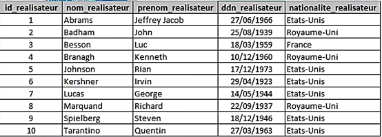

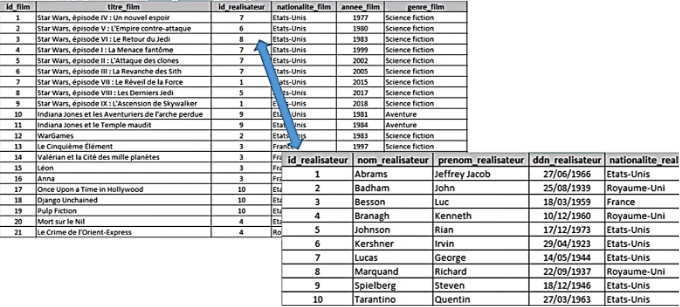
---

#### <H4 STYLE="COLOR:MAGENTA;">**2.3.5. Clé étrangère</H4>**

🔗 Une **clé étrangère** (foreign key ou FK) fait référence à une clé primaire d’une autre table.

💡 Recommandé pour les données récurrentes, à lier via des **jointures**

---

#### <H4 STYLE="COLOR:MAGENTA;">**2.3.6. Contraintes d’intégrité</H4>**

⚖️ Permettent d’assurer la cohérence des données :

1. ✅ **Contrainte de domaine** (type des données)
2. 🆔 **Clé primaire** unique et non nulle
3. 🔗 **Clé étrangère** cohérente et existante


**Contrainte de domaine** : le type de données de chaque attribut doit être respecté et vérifié.

**Contrainte de relation** : chaque enregistrement d’une relation doit pouvoir être identifié de manière unique par une clé primaire, qui doit être non nulle.

**Contrainte de référence** : lorsque des relations sont liées, il est indispensable que les trois règles suivantes soient respectées :

1. Une clé étrangère doit correspondre à la clé primaire de la relation à laquelle la table est liée.
2. Un enregistrement de la table primaire ne peut pas être supprimé s’il possède des enregistrements liés dans une autre table.
3. La valeur d’une clé primaire ne peut pas être modifiée dans la table primaire si des enregistrements y sont liés dans une autre table.


---

#### <H4 STYLE="COLOR:MAGENTA;">**2.3.7. Schéma relationnel</H4>**

📋 Représente :

* Tables
* Champs + types
* Liens (PK / FK)

Exemple:

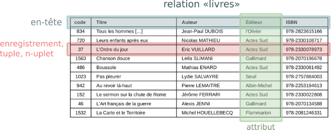

Schéma relationnel
livres(code : entier (clé primaire),titre : texte,auteur : texte,éditeur : texte,ISBN : texte)


---

#### <H4 STYLE="COLOR:MAGENTA;">**2.3.8. Diagramme relationnel</H4>**

📊 Représentation visuelle des relations

📎 Outils utiles :

* [dbdiagram.io](https://dbdiagram.io)
* [quickdatabasediagrams.com](https://www.quickdatabasediagrams.com)
* [looping-mcd.fr](https://www.looping-mcd.fr)
* [mocodo.wingi.net](http://mocodo.wingi.net)

---

#### <H4 STYLE="COLOR:MAGENTA;">**2.3.9. Anomalies à éviter</H4>**

❌ Anomalies classiques :

* 🔁 Redondance
* ✏️ Anomalie de mise à jour
* 🗑️ Anomalie de suppression
* ➕ Anomalie d’insertion

---

## <H2 STYLE="COLOR:BLUE;">**🧠 3. Exercices</H2>**

💡 **À faire dans CAPYTALE** — le code vous sera donné par votre enseignant.


!!! abstract "**Exercice 1**"

    Un laboratoire souhaite gérer les médicaments qu'il conçoit.

    - Un médicament est décrit par un nom, qui permet de l'identifier. En effet, il n'existe pas deux médicaments avec le même nom.
    - Un médicament comporte une description courte en français, ainsi qu'une description longue en latin.
    - On gère aussi le conditionnement du médicament, c'est-à-dire le nombre de pilules par boîte (qui est un nombre entier).

    À chaque médicament, on associe une liste de contre-indications, généralement plusieurs, parfois aucune.

    Une contre-indication comporte un code unique qui l'identifie, ainsi qu'une description.

    Une contre-indication est toujours associée à un et un seul médicament.

    **Exemple de données** : Voici deux exemples de données :

    Le **Chourix** a pour description courte "« Médicament contre la chute des choux »" et pour description longue "« Vivamus fermentum semper porta. Nunc diam velit, adipiscing ut tristique vitae, sagittis vel odio. Maecenas convallis ullamcorper ultricies. Curabitur ornare. »". Il est conditionné en boîte de 13.

    Ses contre-indications sont :

    - CI1 : Ne jamais prendre après minuit.
    - CI2 : Ne jamais mettre en contact avec de l'eau.

    Le **Tropas** a pour description courte "« Médicament contre les dysfonctionnements intellectuels »" et pour description longue "« Suspendisse lectus leo, consectetur in tempor sit amet, placerat quis neque. Etiam luctus porttitor lorem, sed suscipit est rutrum non. »". Il est conditionné en boîte de 42.

    Ses contre-indications sont :
    - CI3 : Garder à l'abri de la lumière du soleil.

    1. Donner la représentation sous forme de tables des relations 'MEDICAMENT' et 'CONTRE_INDICATION'
    2. Écrire le schéma relationnel permettant de représenter une base de données pour ce laboratoire.

!!! abstract "**Exercice 2**"

    On veut créer une base de données permettant de gérer les clients d'un site web proposant des articles à vendre.

    On utilisera 3 relations : CLIENTS, COMMANDES et ARTICLES.

    La table CLIENTS devra contenir les noms, prénoms, numéros de téléphone et l'adresse des clients.

    La table ARTICLES devra contenir les codes des articles, leurs noms, une description et le prix des articles.

    1. Que doit contenir la table COMMANDES ?
    2. Quel doit être la clé primaire de la relation CLIENTS ?
    3. Quel doit être la clé primaire de la relation ARTICLES ?

    Voici une représentation de la table COMMANDES :

    | *COMMANDES*   |             |            |           |
    |---------------|-------------|------------|-----------|
    | **numero**    | **id_client** | **id_article** | **quantite** |

    4 Quelles doivent être les clés étrangères de la table COMMANDES ?
    5 Donner la représentation sous forme de tables des relations CLIENTS, ARTICLES et COMMANDES en inventant au moins 3 clients, deux commandes et 4 articles.
    6 Réaliser un schéma pour représenter cette base de données relationnelle.

!!! abstract "**Exercice 3**"

    On propose un tableau qui donne les occurrences d'une relation joueur définie par le schéma : **Joueur**(IdJoueur, nomJoueur, pNomJoueur, dNaissanceJoueur)

    | **IdJoueur** | **nomJoueur** | **pNomJoueur** | **dNaissanceJoueur** |
    |--------------|---------------|----------------|----------------------|
    | 1            | Terez         | Pascual        | 124                  |
    | 1            | Gosse         | 452            |                      |
    | 4            | Terez         | Pascual        | 124                  |

    Repérez les anomalies dans ces occurrences.

!!! abstract "**Exercice 4**"

    Un fleuriste tient une base de données des clients et commandes passées sur son site internet. Les tables Bouquets, Clients et Commandes comportent ces informations :

    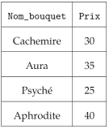

    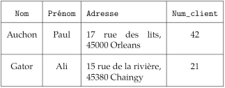

    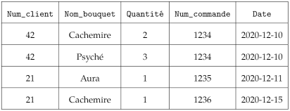

    - Une commande peut-elle comporter plusieurs bouquets ?
    - Quel est le schéma de la table Bouquets ? Celui de la table Clients ? Et celui de la table Commandes ?
    - La table Bouquets comporte-t-elle un attribut qui est une clé primaire ? Un attribut qui est une clé étrangère ?
    - Répondre aux mêmes questions pour la table Clients puis la table Commandes.

!!! abstract "**Exercice 5 : annuaire**"

    On souhaite modéliser un annuaire téléphonique simple dans lequel chaque personne (identifiée par son nom et son prénom) est associée à son numéro de téléphone.

    Proposer une modélisation relationnelle de cet annuaire.

!!! abstract "**Exercice 6 : vocabulaire**"

    Regrouper ensemble les termes synonymes : colonne, entité, domaine, attribut, ligne, schéma, base de données, type

