📚 **Table des matières**

-  [1. 🧩 Qu’est ce qu’une base de données ?](#_toc144547406)
-  [2. 🧱 Présentation du modèle relationnel](#_toc144547409)
-  [3. 🧠 Exercices](#_toc144547422)

🎯 **Compétences évaluables**

- ✅ Identifier les concepts définissant le modèle relationnel
- ✅ Savoir distinguer la structure d’une base de données de son contenu
- ✅ Repérer des anomalies dans le schéma d’une base de données

---

💬 **Introduction**

Les bases de données relationnelles sont partout : réseaux sociaux, sites marchands, dossiers médicaux, ENT… et même EcoleDirecte !

🎞️ [Vidéo introductive](https://www.dailymotion.com/video/x71hy5c)

---

## <H2 STYLE="COLOR:BLUE;">🧩 **1. Qu’est ce qu’une base de données ?</H2>**

### <H3 STYLE="COLOR:GREEN;">**1.1. Notion de base de données</H3>**

🔢 Le traitement informatique implique la manipulation de **volumes importants de données**.

📂 Le format **CSV** permet un stockage simple, mais il devient **limité** en cas de données massives.

⚠️ **Limitations d’un fichier CSV** :

- 🐢 Accès lent : pour trouver une information, il faut relire le fichier (souvent en entier) avec un script
- 🧹 Aucune vérification de cohérence : rien n'empêche d'écrire "abc" dans une colonne « âge »
- 🔐 Pas de gestion des droits d'accès (qui peut lire ? qui peut modifier ?)
- 🔄 Aucun contrôle des accès simultanés entre plusieurs utilisateurs

💡 **Solution : utiliser un SGBD (Système de Gestion de Bases de Données)**  

Un SGBD est un **logiciel spécialisé** permettant de manipuler des bases de données de façon sûre, cohérente et performante.

---

### <H3 STYLE="COLOR:GREEN;">**1.2. Modèles de données</H3>**

🔧 Les **modèles de données** déterminent comment l'information est structurée dans la base.

📐 **Modèle relationnel** proposé par **E.F. Codd** en 1970 :

- l'information est rangée dans des **relations** (que l'on représente par des tables) ;
- chaque relation est décrite par un **schéma** : son nom et la liste de ses attributs (les colonnes) ;
- le contenu de la relation est l'ensemble de ses **n-uplets** (les lignes).

!!! info "🏗️ Structure ≠ contenu"

    - La **structure** (le schéma) décrit **comment** les données sont organisées : noms des tables, attributs, domaines, clés. Elle change rarement.
    - Le **contenu** (on dit aussi *l'instance*) est l'ensemble des données présentes **à un instant donné**. Il change à chaque ajout, modification ou suppression.

Analogie : un formulaire vierge (structure) et la pile de formulaires remplis (contenu).

---

## <H2 STYLE="COLOR:BLUE;">🧱 **2. Présentation du modèle relationnel</H2>**

### <H3 STYLE="COLOR:GREEN;">**2.1. Qu’est-ce qu’une relation ?</H3>**

📘 Une **relation** regroupe des objets du monde réel de même nature (des employés, des films…). Chaque objet est décrit par les mêmes attributs.

📌 Exemple : la relation **Employé** → attributs nom, prénom, matricule, service, date d'embauche. Chaque ligne décrit **un** employé.


🧩 Vocabulaire associé :

| Terme du modèle relationnel | Synonymes courants |
|---|---|
| **Relation** | table |
| **Attribut** | colonne, champ |
| **n-uplet** (ou t-uplet) | ligne, enregistrement, entrée |
| **Degré** | nombre d'attributs |
| **Cardinalité** | nombre de n-uplets |

📋 Dans une relation, les n-uplets sont **tous distincts** (pas de doublon) et **non ordonnés** (l'ordre des lignes n'a aucune signification).
---

???+ question "📌 **Activité n°1 : Base de données formée par deux relations**"

    **Relation Film**

    | **Titre**     | **Réalisateur** | **Acteur**          |
    |---------------|-----------------|---------------------|
    | Casablanca    | M. Curtiz       | Humphrey Bogart     |
    | Casablanca    | M. Curtiz       | Peter Lorre         |
    | Les 400 coups | F. Truffaut     | J.-P. Léaud         |
    | Star Wars     | G. Lucas        | Harrison Ford       |

    **Relation Séance**

    | **Titre**     | **Salle**       | **Heure**           |
    |---------------|-----------------|---------------------|
    | Casablanca    | Lucernaire      | 19:00               |
    | Casablanca    | Studio          | 20:00               |
    | Les 400 coups | Sel             | 20:30               |
    | Star Wars     | Sel             | 22:15               |

    **1.** Quelle est la cardinalité de la relation Film ?

    ??? success "Solution"
        La cardinalité est 4 (4 n-uplets dans la relation Film).

    **2.** Quel est le degré de la relation Séance ?

    ??? success "Solution"
        Le degré est 3 (Titre, Salle, Heure).

    **3.** Quels sont les attributs de la relation Film ?

    ??? success "Solution"
        Titre, Réalisateur, Acteur.

    **4.** Indiquer un n-uplet de la relation Séance.

    ??? success "Solution"
        Par exemple : (Casablanca, Lucernaire, 19:00)

    **5.** L'attribut Titre permet-il, à lui seul, de distinguer chaque ligne de la relation Film ? Quelle combinaison d'attributs le permet ?

    ??? success "Solution"
        Non : « Casablanca » apparaît deux fois. Le couple (Titre, Acteur) permet de distinguer chaque ligne.

    **6.** Quelle information est répétée inutilement dans la relation Film ? Quel problème cela peut-il poser ?

    ??? success "Solution"
        Le réalisateur de *Casablanca* est écrit deux fois. Si l'on veut corriger « M. Curtiz » en « Michael Curtiz », il faut le faire sur **toutes** les lignes ; en oublier une rend la base incohérente. Nous reviendrons sur ce problème au §2.3.9.
    

---

### <H3 STYLE="COLOR:GREEN;">**2.2. Qu’est-ce qu’une vue ?</H3>**

🔍 Une **vue** est le **résultat d’une requête** sur la base, que l’on peut utiliser comme une relation.

📌 Exemple :

???+ question "**Activité n°2**"


    **7.** À l'aide des deux relations de l'activité 1, construire la relation donnant les séances où joue Humphrey Bogart.

    ??? success "Solution"
        On cherche dans Film les titres où joue Humphrey Bogart (*Casablanca*), puis les séances correspondantes dans Séance :

        | **Titre**  | **Salle**  | **Heure** |
        |------------|------------|-----------|
        | Casablanca | Lucernaire | 19:00     |
        | Casablanca | Studio     | 20:00     |

        Ce résultat est une nouvelle relation : c'est une **vue**. On apprendra à l'obtenir avec une requête SQL (jointure) dans le chapitre SQL.


---

### <H3 STYLE="COLOR:GREEN;">**2.3. Vocabulaire</H3>**


#### <H4 STYLE="COLOR:MAGENTA;">**2.3.1. Attributs</H4>**

🧱 Un **attribut** est une **colonne** de la table.
📌 Une table = entête (attributs) + corps (n-uplets)

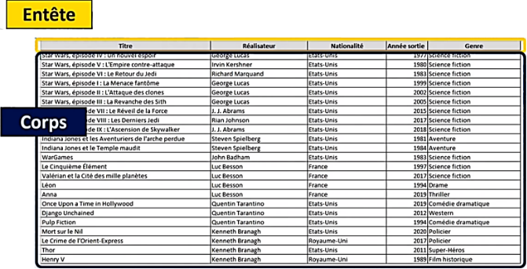{ width=50%; : .center }

---

#### <H4 STYLE="COLOR:MAGENTA;">**2.3.2. Domaine</H4>**

🔢 Le **domaine** d'un attribut est l'ensemble des valeurs qu'il peut prendre. En pratique, il correspond à un **type** (`INTEGER`, `REAL`, `TEXT`, `DATE`, `BOOLEAN`…) éventuellement complété par une condition.

📌 Exemples :

* annee_sortie → entiers ≥ 1895 (année des premières projections des frères Lumière)
* titre → chaînes de caractères
* genre → une valeur parmi une liste fixée (« drame », « comédie », « science-fiction »…)


---


#### <H4 STYLE="COLOR:MAGENTA;">**2.3.3. La clé primaire</H4>**

🔐 Une relation **ne doit pas contenir deux n-uplets identiques**.
Pour garantir cette **unicité**, on choisit une **clé primaire** (*primary key*, PK).

> Une **clé primaire** est un attribut, ou une **combinaison minimale d'attributs**, dont la valeur permet d'identifier **de manière unique** chaque n-uplet de la relation. Elle ne peut jamais être vide.

🧠 **Exemples à retenir** :

* L’attribut `réalisateur` ne peut pas être une clé primaire : plusieurs films peuvent être réalisés par la même personne.
* L’attribut `titre` seul ne suffit pas non plus (cas des remakes).
* ✅ Il est donc courant d’ajouter un attribut **identification** (ex : `id_film`) qui joue le rôle de **clé primaire auto-incrémentée**.

💡 *Bonnes pratiques* :

* Créer un attribut `id_xxx` entier, numéroté automatiquement (en SQLite : `INTEGER PRIMARY KEY` ; en MySQL : `AUTO_INCREMENT`).
* Cela simplifie l'identification et les liens entre tables.

⚠️ **Attention** : un identifiant automatique garantit que deux **lignes** sont distinctes, pas que deux **objets réels** le sont. Rien n'empêche d'enregistrer deux fois le même film sous `id_film = 7` et `id_film = 8` ! 

---

🧩 **Clé primaire composée**

Dans certains cas, c'est une **combinaison d'attributs** qui forme la clé primaire : on parle de **clé primaire composée**.

🔍 Exemple :

* Une table `Inscription` contient les colonnes `id_etudiant`, `id_cours` et `note`.
* Un même étudiant suit plusieurs cours, et un même cours accueille plusieurs étudiants : ni `id_etudiant` seul, ni `id_cours` seul ne sont uniques.
* ✅ La **combinaison** `(id_etudiant, id_cours)` est unique : c'est la **clé primaire composée**.

🧠 **À retenir** :

* La **clé primaire** peut être :

  * soit un **attribut unique** (comme un `id`)
  * soit une **combinaison minimale d’attributs** assurant l’unicité de chaque ligne

📌 **Notation** : dans un schéma relationnel, on **souligne chaque attribut** de la clé primaire :


```
Participation(id_étudiant, id_cours, note)
PK : (id_étudiant, id_cours)
```

!!! warning "Une clé se justifie par une règle du monde réel"

    Observer les données ne suffit pas pour affirmer qu'un attribut est une clé : une table de 10 lignes peut avoir des prénoms tous différents par hasard. Les données permettent seulement de **prouver qu'un attribut n'est pas une clé** (il suffit de trouver deux lignes avec la même valeur). Pour choisir une clé, on s'appuie sur une **règle** : « deux élèves ne peuvent pas avoir le même numéro INE ».


---

#### <H4 STYLE="COLOR:MAGENTA;">**2.3.4. Éviter les doublons</H4>**

🔁 Redondance = Risque d’erreurs → ❌
✅ Solution : séparer en plusieurs tables et lier par identifiants

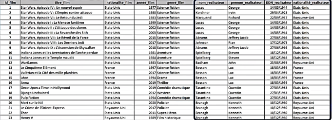

Il y a beaucoup d’informations **dupliquées**.

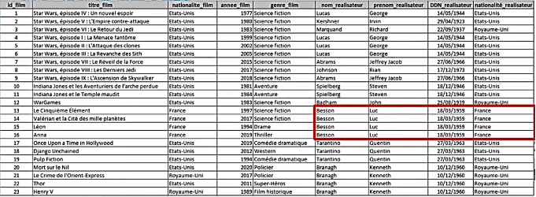

Dans une table, ces duplications sont à proscrire : si l'on doit corriger une valeur, il faut faire la correction autant de fois qu'il y a d'enregistrements concernés.

On utilise donc **deux tables** au lieu d'une seule, et on crée un **lien** entre elles. Dans l'exemple, on crée une table `realisateur` et, dans la table `film`, on remplace l'attribut `realisateur` par `id_realisateur` (un simple entier).

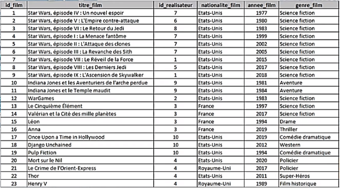

L'attribut `id_realisateur` de la table `film` fait référence à la table `realisateur` : c'est une **clé étrangère**

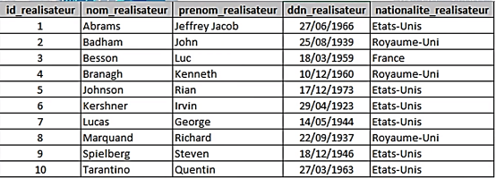

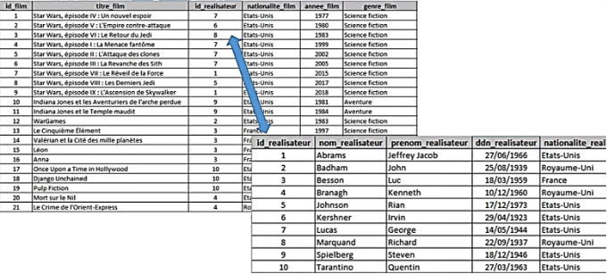

!!! warning "Piège de vocabulaire"

    Dans le modèle relationnel, le mot **relation** désigne une **table**, et non le lien entre deux tables. Le lien entre deux tables se fait par une **clé étrangère**.

---

#### <H4 STYLE="COLOR:MAGENTA;">**2.3.5. Clé étrangère</H4>**

🔗 Une **clé étrangère** (*foreign key*, FK) est un attribut d'une table dont les valeurs **font référence à la clé primaire d'une autre table**.

📌 Exemple :

realisateur(<u>id_realisateur</u>, nom, prenom)

film(<u>id_film</u>, titre, annee, #id_realisateur)

Ici `film.id_realisateur` est une clé étrangère qui fait référence à `realisateur.id_realisateur`.

📌 **Notation** : on fait précéder la clé étrangère d'un **#** (c'est la notation utilisée dans les sujets de bac).

💡 Grâce aux clés étrangères, chaque information n'est stockée **qu'une seule fois** ; on retrouve les informations liées à l'aide de **jointures** (chapitre SQL).

---

#### <H4 STYLE="COLOR:MAGENTA;">**2.3.6. Contraintes d’intégrité</H4>**

⚖️ Les **contraintes d'intégrité** sont des règles que le SGBD vérifie à chaque ajout, modification ou suppression. Elles garantissent la cohérence des données. Il en existe trois :


1. ✅ **Contrainte de domaine** : chaque valeur d'un attribut doit appartenir à son domaine (bon type, bonnes valeurs).
2. 🆔 **Contrainte de relation** (ou d'entité) : chaque n-uplet est identifié par sa clé primaire, qui doit être **unique** et **non vide**.
3. 🔗 **Contrainte de référence** : une clé étrangère doit toujours désigner un n-uplet **qui existe** dans la table référencée. En conséquence :
    - on ne peut pas **insérer** une ligne dont la clé étrangère ne correspond à aucune clé primaire existante ;
    - on ne peut pas **supprimer** une ligne si d'autres lignes y font référence ;
    - on ne peut pas **modifier** la clé primaire d'une ligne si d'autres lignes y font référence.

📌 Exemple avec la base `film` / `realisateur` : ajouter un film avec `id_realisateur = 99` alors qu'aucun réalisateur ne porte ce numéro est **refusé** par le SGBD.


---

#### <H4 STYLE="COLOR:MAGENTA;">**2.3.7. Schéma relationnel</H4>**

Le **schéma relationnel** d'une base décrit sa **structure** :

- les tables ;
- les attributs et leur domaine ;
- les clés primaires (soulignées) et les clés étrangères (précédées de #).

Exemple :

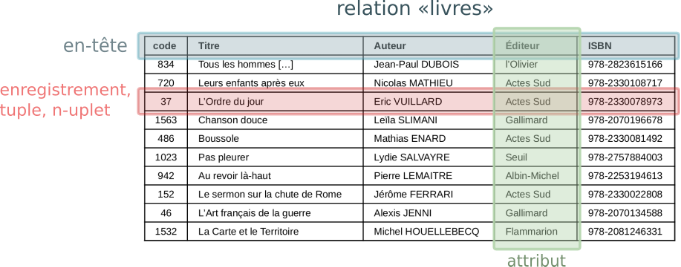

Schéma relationnel
livres(
    code : entier (clé primaire),
    titre : texte,
    auteur : texte,
    éditeur : texte,
    ISBN : texte
    )


---

#### <H4 STYLE="COLOR:MAGENTA;">**2.3.8. Diagramme relationnel</H4>**

📊 Le **diagramme relationnel** est une représentation graphique du schéma : une boîte par table, et une flèche de chaque clé étrangère vers la clé primaire qu'elle référence.

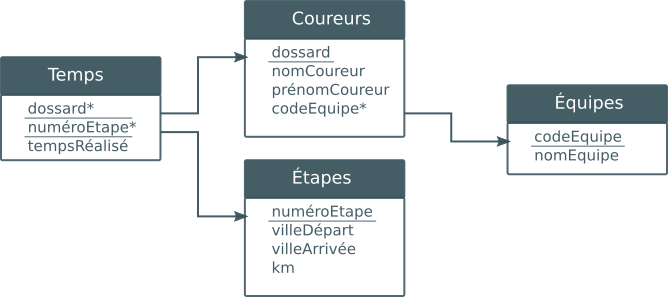

📎 Outils utiles :

* [dbdiagram.io](https://dbdiagram.io)
* [quickdatabasediagrams.com](https://www.quickdatabasediagrams.com)
* [looping-mcd.fr](https://www.looping-mcd.fr)
* [mocodo.wingi.net](http://mocodo.wingi.net)

---

#### <H4 STYLE="COLOR:MAGENTA;">**2.3.9. Anomalies à éviter</H4>**

❌ Une table mal conçue provoque des **anomalies**. La cause est presque toujours la **redondance** :

* ✏️ Anomalie de **mise à jour** : une modification doit être répétée sur plusieurs lignes
* ➕ Anomalie d'**insertion** : impossible d'ajouter une information sans en inventer une autre
* 🗑️ Anomalie de **suppression** : supprimer une ligne fait perdre une information qu'on voulait garder

Exemple :

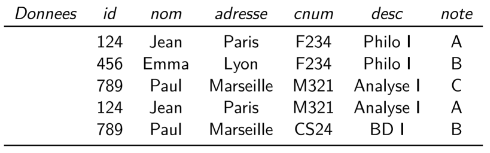

Quels sont les problèmes de cette modélisation ?

??? success "Solution"
    **1 Anomalies de redondance**

    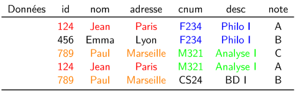
    
    * **Duplication d’informations sur les étudiants** :

    * L’étudiant **Jean** (id = 124, Paris) apparaît **deux fois**.
    * L’étudiant **Paul** (id = 789, Marseille) apparaît **deux fois**.
    * **Duplication d’informations sur les cours** :

    * Le cours **Philo I** (cnum = F234) est répété pour deux étudiants.
    * Le cours **Analyse I** (cnum = M321) est répété pour deux étudiants.

    **2 Anomalies de mise à jour**

    * Si l’adresse de **Jean** change, il faudra la mettre à jour **dans toutes les lignes** où il apparaît.
    → Risque d’incohérences si on oublie de modifier une des lignes.

    **3 Anomalies d’insertion**

    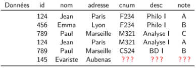

    * Impossible d’ajouter un **nouvel étudiant** sans qu’il ait suivi un cours (on ne peut pas insérer de ligne avec des attributs de cours vides).
    * Impossible d’ajouter un **nouveau cours** sans qu’un étudiant y soit inscrit.

    **4 Anomalies de suppression**

    * Si on supprime la ligne `(456, Emma, Lyon, F234, Philo I, B)`, et qu’Emma est la **dernière étudiante** inscrite à "Philo I", **l’information sur le cours "Philo I" sera perdue** (car elle n’est stockée que dans cette table).

!!! abstract "📌 À retenir absolument"

    - Une **relation** = une table ; un **attribut** = une colonne ; un **n-uplet** = une ligne.
    - **Degré** = nombre d'attributs ; **cardinalité** = nombre de n-uplets.
    - Le **schéma** décrit la structure ; le **contenu** est l'ensemble des n-uplets à un instant donné.
    - Le **domaine** d'un attribut est l'ensemble de ses valeurs possibles.
    - La **clé primaire** (soulignée) identifie chaque n-uplet de façon unique ; elle peut être composée de plusieurs attributs.
    - Une **clé étrangère** (notée #) fait référence à la clé primaire d'une autre table.
    - Trois **contraintes d'intégrité** : domaine, relation, référence.
    - La **redondance** provoque des anomalies de mise à jour, d'insertion et de suppression : on la supprime en **découpant** en plusieurs tables liées par des clés étrangères.


---

## <H2 STYLE="COLOR:BLUE;">**🧠 3. Exercices</H2>**

💡 **À faire dans CAPYTALE** — le code vous sera donné par votre enseignant.

Les exercices sont classés par difficulté : ★ (application directe), ★★ (raisonnement), ★★★ (modélisation).

!!! abstract "**Exercice 1 : vocabulaire** ★"

    Regrouper ensemble les termes synonymes. Attention : certains termes n'ont pas de synonyme dans la liste.

    colonne · table · n-uplet · domaine · attribut · ligne · relation · enregistrement · type · schéma · base de données

!!! abstract "**Exercice 1**"

    Un laboratoire souhaite gérer les médicaments qu'il conçoit.

    - Un médicament est décrit par un nom, qui permet de l'identifier. En effet, il n'existe pas deux médicaments avec le même nom.
    - Un médicament comporte une description courte en français, ainsi qu'une description longue en latin.
    - On gère aussi le conditionnement du médicament, c'est-à-dire le nombre de pilules par boîte (qui est un nombre entier).

    À chaque médicament, on associe une liste de contre-indications, généralement plusieurs, parfois aucune.

    Une contre-indication comporte un code unique qui l'identifie, ainsi qu'une description.

    Une contre-indication est toujours associée à un et un seul médicament.

    **Exemple de données** : Voici deux exemples de données :

    Le **Chourix** a pour description courte "« Médicament contre la chute des choux »" et pour description longue "« Vivamus fermentum semper porta. Nunc diam velit, adipiscing ut tristique vitae, sagittis vel odio. Maecenas convallis ullamcorper ultricies. Curabitur ornare. »". Il est conditionné en boîte de 13.

    Ses contre-indications sont :

    - CI1 : Ne jamais prendre après minuit.
    - CI2 : Ne jamais mettre en contact avec de l'eau.

    Le **Tropas** a pour description courte "« Médicament contre les dysfonctionnements intellectuels »" et pour description longue "« Suspendisse lectus leo, consectetur in tempor sit amet, placerat quis neque. Etiam luctus porttitor lorem, sed suscipit est rutrum non. »". Il est conditionné en boîte de 42.

    Ses contre-indications sont :
    - CI3 : Garder à l'abri de la lumière du soleil.

    1. Donner la représentation sous forme de tables des relations 'MEDICAMENT' et 'CONTRE_INDICATION'
    2. Écrire le schéma relationnel permettant de représenter une base de données pour ce laboratoire.

!!! abstract "**Exercice 2 : structure ou contenu ?** ★"

    On considère une base de données de bibliothèque. Pour chaque affirmation, indiquer si elle concerne la **structure** (le schéma) ou le **contenu** de la base.

    1. La table Livre possède les attributs id_livre, titre, annee et id_auteur.
    2. Le n-uplet (12, 'Germinal', 1885, 3) appartient à la table Livre.
    3. L'attribut annee est un entier.
    4. La table Livre contient 2 340 n-uplets.
    5. id_livre est la clé primaire de la table Livre.
    6. L'auteur numéro 3 s'appelle Émile Zola.
    7. id_auteur, dans la table Livre, fait référence à la clé primaire de la table Auteur.

!!! abstract "**Exercice 3 : repérer des anomalies** ★★"

    On propose un tableau qui donne les n-uplets d'une relation Joueur définie par le schéma : **Joueur**(<u>IdJoueur</u>, nomJoueur, pNomJoueur, dNaissanceJoueur)

    | **IdJoueur** | **nomJoueur** | **pNomJoueur** | **dNaissanceJoueur** |
    |--------------|---------------|----------------|----------------------|
    | 1            | Terez         | Pascual        | 124                  |
    | 1            | Gosse         | 452            |                      |
    | 4            | Terez         | Pascual        | 124                  |

    1. Repérer les anomalies dans ces n-uplets.
    2. Pour chacune, indiquer la contrainte d'intégrité qui n'est pas respectée (domaine, relation, référence), ou expliquer pourquoi aucune contrainte ne la détecte.

!!! abstract "**Exercice 4 : trouver la clé primaire** ★★"

    Le lycée enregistre l'occupation des salles dans la relation suivante :

    | **salle** | **jour** | **heure** | **prof** | **matiere** |
    |-----------|----------|-----------|----------|-------------|
    | B12       | lundi    | 8h        | Martin   | NSI         |
    | B12       | lundi    | 9h        | Martin   | NSI         |
    | C03       | lundi    | 8h        | Durand   | Maths       |
    | B12       | mardi    | 8h        | Durand   | Maths       |
    | C03       | mardi    | 8h        | Martin   | NSI         |

    1. Montrer, à l'aide des données, que ni `salle`, ni `(salle, jour)`, ni `(jour, heure)` ne peuvent être une clé primaire.
    2. Proposer une clé primaire et la justifier par une **règle du monde réel**.
    3. Existe-t-il une autre combinaison de trois attributs qui pourrait convenir ? Justifier.
    4. Les données du tableau suffisent-elles à **prouver** qu'un ensemble d'attributs est une clé ? Expliquer.

!!! abstract "**Exercice 5 : le fleuriste** ★★"

    Un fleuriste tient une base de données des clients et commandes passées sur son site internet. Les tables Bouquets, Clients et Commandes comportent ces informations :

    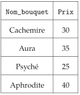

    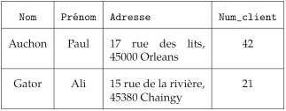

    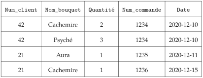

    1. Une commande peut-elle comporter plusieurs bouquets ? Justifier.
    2. Écrire le schéma relationnel des tables Bouquets, Clients et Commandes (clé primaire soulignée, clé étrangère précédée de #).
    3. Pour chacune des trois tables : comporte-t-elle une clé primaire ? une ou plusieurs clés étrangères ? Lesquelles ?

!!! abstract "**Exercice 6 : accepté ou refusé ?** ★★"

    On considère la base suivante :

    Realisateur(<u>id_real</u> : INTEGER, nom : TEXT, prenom : TEXT)

    Film(<u>id_film</u> : INTEGER, titre : TEXT, annee : INTEGER, #id_real : INTEGER)

    **Realisateur**

    | id_real | nom      | prenom   |
    |---------|----------|----------|
    | 1       | Truffaut | François |
    | 2       | Varda    | Agnès    |
    | 3       | Lucas    | George   |

    **Film**

    | id_film | titre          | annee | id_real |
    |---------|----------------|-------|---------|
    | 10      | Les 400 coups  | 1959  | 1       |
    | 11      | Cléo de 5 à 7  | 1962  | 2       |
    | 12      | Star Wars      | 1977  | 3       |

    Chaque opération ci-dessous est effectuée **à partir de la base initiale**. Dire si le SGBD l'accepte ou la refuse et, en cas de refus, citer la contrainte d'intégrité en cause.

    1. Ajouter dans Film : (13, 'Jules et Jim', 1962, 1)
    2. Ajouter dans Film : (11, 'Le Bonheur', 1965, 2)
    3. Ajouter dans Film : (14, 'THX 1138', 'mille neuf cent soixante et onze', 3)
    4. Ajouter dans Film : (15, 'Le Parrain', 1972, 4)
    5. Supprimer dans Realisateur le n-uplet d'id_real 2
    6. Supprimer dans Film le n-uplet d'id_film 12
    7. Proposer une suite d'opérations permettant d'enregistrer le film *Le Parrain* de Francis Ford Coppola.
    8. Proposer une suite d'opérations permettant de supprimer George Lucas de la base.

!!! abstract "**Exercice 7 : annuaire** ★★★"

    On souhaite modéliser un annuaire téléphonique simple dans lequel chaque personne, identifiée par son nom et son prénom, est associée à son numéro de téléphone.

    1. Proposer une relation Annuaire et sa clé primaire.
    2. Deux personnes s'appellent Marie Dupont. Quel problème cela pose-t-il ? Modifier le schéma pour le résoudre.
    3. Une personne possède un téléphone fixe et un portable. Peut-on l'enregistrer avec votre schéma ? Proposer un schéma en deux tables qui le permet.

!!! abstract "**Exercice 8 : le laboratoire** ★★★"

    Un laboratoire souhaite gérer les médicaments qu'il conçoit.

    - Un médicament est décrit par un nom, qui permet de l'identifier : il n'existe pas deux médicaments avec le même nom.
    - Un médicament comporte une description courte en français, ainsi qu'une description longue en latin.
    - On gère aussi le conditionnement du médicament, c'est-à-dire le nombre de pilules par boîte (un nombre entier).

    À chaque médicament, on associe une liste de contre-indications, généralement plusieurs, parfois aucune.

    Une contre-indication comporte un code unique qui l'identifie, ainsi qu'une description.

    Une contre-indication est toujours associée à un et un seul médicament.

    **Exemple de données** :

    Le **Chourix** a pour description courte « Médicament contre la chute des choux » et pour description longue « Vivamus fermentum semper porta. Nunc diam velit, adipiscing ut tristique vitae, sagittis vel odio. Maecenas convallis ullamcorper ultricies. Curabitur ornare. ». Il est conditionné en boîte de 13.

    Ses contre-indications sont :

    - CI1 : Ne jamais prendre après minuit.
    - CI2 : Ne jamais mettre en contact avec de l'eau.

    Le **Tropas** a pour description courte « Médicament contre les dysfonctionnements intellectuels » et pour description longue « Suspendisse lectus leo, consectetur in tempor sit amet, placerat quis neque. Etiam luctus porttitor lorem, sed suscipit est rutrum non. ». Il est conditionné en boîte de 42.

    Ses contre-indications sont :

    - CI3 : Garder à l'abri de la lumière du soleil.

    1. Écrire le schéma relationnel de la base (relations MEDICAMENT et CONTRE_INDICATION), avec les domaines, la clé primaire et la clé étrangère.
    2. Donner le contenu des deux tables avec les données de l'exemple.
    3. Le laboratoire décide qu'une même contre-indication (par exemple « Ne jamais prendre après minuit ») peut concerner **plusieurs** médicaments. Pourquoi le schéma précédent ne convient-il plus ? Proposer un nouveau schéma.

!!! abstract "**Exercice 9 : le site marchand** ★★★"

    On veut créer une base de données pour gérer les clients d'un site web qui vend des articles.

    - La table CLIENTS contient le nom, le prénom, le numéro de téléphone et l'adresse de chaque client.
    - La table ARTICLES contient le code, le nom, la description et le prix de chaque article.

    **1.** Quelle doit être la clé primaire de la table ARTICLES ?

    **2.** Aucun attribut de CLIENTS ne peut servir de clé primaire. Pourquoi ? Que faut-il ajouter ?

    **3.** Quelles informations une commande doit-elle contenir au minimum ?

    Une première version de la table COMMANDES est proposée :

    COMMANDES(numero, #id_client, #code_article, quantite)

    **4.** Quelles sont les clés étrangères de COMMANDES ? À quelles tables font-elles référence ?

    **5.** Le client n°1 passe la commande n°501 contenant 2 stylos (code S01) et 1 cahier (code C07). Écrire les n-uplets correspondants dans COMMANDES. L'attribut numero peut-il être la clé primaire ?

    **6.** Proposer un nouveau schéma en découpant COMMANDES en deux tables, COMMANDES et LIGNES_COMMANDE, et préciser leurs clés primaires.

    **7.** Donner le contenu des tables en inventant au moins 3 clients, 4 articles et 2 commandes, dont une contenant plusieurs articles.

    **8.** Réaliser le diagramme relationnel de la base (par exemple avec [dbdiagram.io](https://dbdiagram.io)).

    **9.** *Pour aller plus loin* : le prix d'un article augmente. Quel problème cela pose-t-il pour le montant des anciennes commandes ? Comment le résoudre ?
