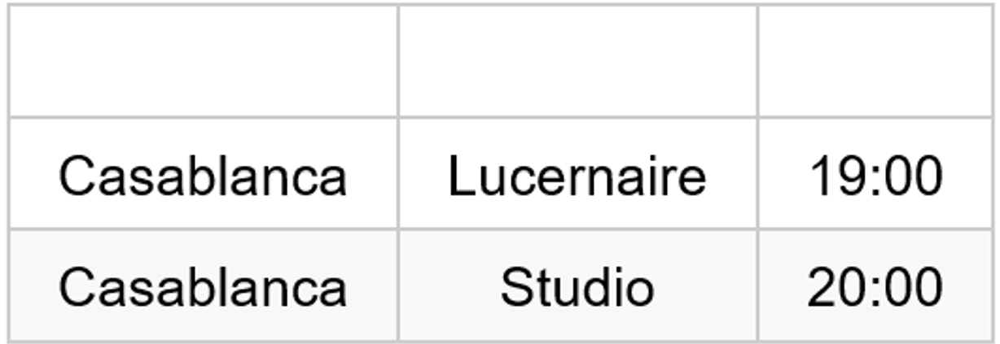
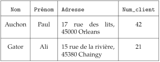

**Table des matières**

[1.	Qu’est ce qu’une base de données ?](#_toc144547406)

[2.	Présentation du modèle relationnel](#_toc144547409)

[3.	Exercices](#_toc144547422)

**Compétences évaluables :**

- Identifier les concepts définissant le modèle relationnel
- Savoir distinguer la structure d’une base de données de son contenu
- Repérer des anomalies dans le schéma d’une base de données

Les bases de données relationnelles sont essentielles dans l’informatique d’aujourd’hui.

Vidéo introductive : <https://www.dailymotion.com/video/x71hy5c> 

## <H2 STYLE="COLOR:BLUE;">**1. Qu’est ce qu’une base de données ?**</H2>
### <H3 STYLE="COLOR:GREEN;">**1.1. Notion de base de données**</H3>

Le développement du traitement informatique nécessite la **manipulation de données de plus en plus nombreuses**.

Il existe des données structurées au format **csv** que l’on lire à l’aide d’algorithme simple en python. Cette méthode de stockage de l’information peut s’avérer **pratique** dans certains cas précis mais atteint rapidement **ses limites** lorsque les **données sont très nombreuses**.

Une **base de données** stocke des informations en rapport avec une activité. Ces informations peuvent être de natures très hétérogènes.

L’utilisation d’un fichier de type csv pose de nombreux problèmes :

- **Lourdeur d’accès aux données :** En pratique, pour chaque accès aux données (lecture ou écriture), il faut écrire un programme.
- **Manque de sécurité :** Si tout programmeur peut accéder aux données, il est impossible d’assurer leur intégrité.
- **Pas de contrôle de concurrence :** Si plusieurs utilisateurs accèdent aux mêmes fichiers, en même temps, des problèmes de concurrence d’accès se posent : quelle modification sera retenue ? quelle valeur sera lue ?

Pour manipuler une base de données, on utilise donc généralement un logiciel spécialisé : un **SGBD (Système de Gestion de Bases de Données)**

On appelle **SGBD (Système de Gestion de Bases de Données)** un logiciel complexe, de haut niveau, qui permet de manipuler les informations stockées dans une base de données.

### <H3 STYLE="COLOR:GREEN;">**1.2. Modèles de données**</H3>
Les modèles de données correspondent à la manière de **structurer l’information** dans une base de données.

On étudiera le **modèle relationnel** : ce modèle a été proposé en 1970 par E. F. Codd.

Le modèle « relationnel » permet de modéliser les informations contenues dans les bases de données en utilisant des **relations**, c’est à dire un ensemble **d’attributs.**

## <H2 STYLE="COLOR:BLUE;">**2. Présentation du modèle relationnel**</H2>
### <H3 STYLE="COLOR:GREEN;">**2.1. Qu’est ce qu’une relation ?**</H3>
On appelle **relation** un objet de la vie réelle auquel on attache **un ensemble d’attributs.**

Par exemple, un employé possède un nom, un prénom, un matricule, travaille dans un service et a été embauché à une certaine date.

- Chaque instance d’une relation est appelée un **tuple** ou **t-uplets** ou **n-uplet** (en français).
- Les relations sont représentées sous la forme de **tables à deux dimensions**, et on confond les deux concepts. On confond de même ligne dans la table et tuple.
- Par définition, ***chaque tuple d’une relation est unique***.
- L’ordre des tuples dans la relation n’est pas significatif.
- Le nombre de champs de la relation s’appelle le **degré** de la relation tandis que le nombre de tuples dans la relation s’appelle la **cardinalité** de la relation.

**<H3 STYLE="COLOR:red;">Activité n°1</H3>**: Base de données formée par deux relations

| **Titre**     | **Directeur**   | **Acteur**          |
|---------------|-----------------|---------------------|
| Casablanca    | M. Curtiz       | Humphrey Bogart     |
| Casablanca    | M. Curtiz       | Peter Lore          |
| Les 400 coups | F. Truffaut     | J.-P. Leaud         |
| Star Wars     | G. Lucas        | Harrison Ford       |

*Relation Film*

| **Titre**     | **Salle**       | **Heure**           |
|---------------|-----------------|---------------------|
| Casablanca    | Lucernaire      | 19:00               |
| Casablanca    | Studio          | 20:00               |
| Les 400 coups | Sel             | 20:30               |
| Star Wars     | Sel             | 22:15               |

*Relation Séance*
???+ question "Activité"

    **1.** Quelle est la cardinalité de la relation Film ?

    ??? success "Solution"

        La cardinalité d’une relation est le nombre de tuples (ou de lignes) qu’elle renferme. Ici la cardinalité est égale à 4.

    **2.** Quel est le degré de la relation Séance ?

    ??? success "Solution"

        Le degré d’une relation est le nombre de champs qui la définissent. Ici, c’est 3.

    **3.** Quels sont les attributs (champs) de la relation Film ?

    ??? success "Solution"

        Les attributs de la relation Film sont : Titre, Directeur, Acteur.

    **4.** Indiquer un tuple de la relation Séance.

    ??? success "Solution"

        La cardinalité de la relation étant égale à 4, on a le choix entre 4 réponses. (Casablanca, Lucernaire, 19:00) fait partie de ces réponses possibles.

### <H3 STYLE="COLOR:GREEN;">**2.2. Qu’est ce qu’une vue ?**</H3>
Une **vue** est une relation, qui au lieu d’être stockée dans la base de données, est le résultat d’une requête.

Une vue peut ensuite être réutilisée exactement comme s’il s’agissait d’une relation stockée dans la base de données.

**<H3 STYLE="COLOR:red;">Activité n°2</H3>**: Base de données formée par deux relations

???+ question "Activité"

    **5.** Quelles sont les films, les salles et les horaires des séances dans lesquels on peut trouver l’acteur Humphrey Bogart ?

    ??? success "Solution"

        La réponse à cette requête est une vue :
        { width=25%}

### <H3 STYLE="COLOR:GREEN;">**2.3. Vocabulaire**</H3>
#### <H4 STYLE="COLOR:MAGENTA;">**2.3.1. Attributs**</H4>
La notion de **relation** est au cœur des bases de données relationnelles. Une relation, aussi appelée **table**, peut être vue comme un **tableau à deux dimensions** composé d’un nombre fini de données, d’un **entête** qui contient des **attributs** et d’un **corps** qui contient des **données**.

{ width=50%; : .center }

Le corps de la table est découpé en lignes appelées **t-uplets** (ou n-uplets) ou **tuple** ou **enregistrement** ou **entrée**. Chaque colonne correspond à un **attribut**.

{ width=50%; : .center }

Dans l’exemple, la relation film (ou table film) contient l’attribut titre qui est composé du nom des films présents dans la table.

#### <H4 STYLE="COLOR:MAGENTA;">**2.3.2. Le domaine d’un attribut**</H4> 
Pour chaque attribut d’une relation, il est nécessaire de définir un **domaine**. Le domaine d’un attribut donné correspond à un ensemble de données de **données admissibles.** 

Par exemple, le domaine de 

- l’attribut année sortie correspond à un ensemble d’entiers supérieurs à 1895 (1er film). 
- l’attribut titre correspond à l’ensemble des chaînes de caractères admissibles
- l’attribut genre correspond à l’ensemble des genres possibles. 

On voit bien ici que le domaine sera fini.

#### <H4 STYLE="COLOR:MAGENTA;">**2.3.3. La clé primaire**</H4> 
Une table ne peut pas contenir **deux t-uplets identiques**. Afin de respecter cette contrainte, on définit la notion de **clé primaire : primary key**. Une clé primaire est un attribut (colonne) ou une combinaison d’attributs dont la valeur permet d’identifier de **manière unique** un t-uplet de la relation. 

Par exemple, l’attribut réalisateur ne peut pas jouer le rôle de clé primaire, l’attribut titre ne peut pas jouer le rôle de clé primaire (il existe des remakes). 

Donc ici, on sera obligé d’ajouter un attribut id\_film qui sera un entier correspondant à la clé primaire de la table. À chaque fois qu’un film sera ajouté à la relation, son id sera automatiquement ajouté par incrémentation de l'id du film précédemment ajouté. 

Pour optimiser la structure d’une base de données : Utiliser une clé primaire de type numérique avec une auto-incrémentation (AUTO\_INCREMENT).

**Ajouter un attribut id** pour qu’il puisse jouer le rôle de clé primaire est une pratique courante qu’il faut généraliser aux futures activités sur les bases de données relationnelles. 

En toute rigueur, une clé primaire peut aussi être constituée de plusieurs attributs. Par exemple, le couple réalisateur-titre pourrait jouer le rôle de clé primaire.

#### <H4 STYLE="COLOR:MAGENTA;">**2.3.4. Comment s’affranchir des doublons de données ?**</H4>
Pour rajouter des informations supplémentaires aux réalisateurs comme leur prénom, leur date de naissance, leur nationalité,…

{ width=50%; : .center }

Il y a beaucoup **d’informations dupliquées.**

{ width=50%; : .center }

Dans une table, ces duplications sont **à proscrire**, car si l’on doit corriger une valeur, il faut apporter autant de fois la correction qu’il y a d’enregistrements.

Il faut donc utiliser **deux tables** au lieu d’une seule et créer un **lien** (ou association), une relation, entre ces deux tables.

Dans l’exemple, on crée une table film et on modifie l’attribut réalisateur en id\_réalisateur avec un simple entier.

{ width=50%; : .center }

L’attribut id\_réalisateur de la relation film permet de créer un **lien** avec la relation réalisateur.

{ width=50%; : .center }

{ width=50%; : .center }

#### <H4 STYLE="COLOR:MAGENTA;">**2.3.5. La clé étrangère**</H4>
L’introduction de cette mise en place de lien permet **d’éviter la redondance d’informations**.

L’id\_réalisateur est la **clé primaire** pour réalisateur et cette clé primaire va être utilisée dans la table film comme une valeur faisant référence à la table réalisateur.

Pour la table film, id\_réalisateur est appelée **clé étrangère.**

Une **clé étrangère (foreign key ou FK)** pour une table correspond à une clé primaire d’une autre table.

Pour optimiser la structure d’une base de données : Si une donnée est récurrente, il est préférable de la stocker dans une nouvelle table et **la lier avec une jointure** (clé étrangère).

Il y aurait un problème d’intégrité de la base de données si une valeur de l’attribut **id\_réalisateur** de la relation film ne correspondait à aucune valeur de la clé primaire de la relation **réalisateur**.

#### <H4 STYLE="COLOR:MAGENTA;">**2.3.6. Contraintes d’intégrité**</H4>
Voici une liste des contraintes que le SGBD (Système de Gestion de la Base de Donnée) doit vérifier. On les appelle des **contraintes d’intégrité**, elles permettent de garantir le bon fonctionnement de la base de données (suite à des modifications, suppressions...).

1. **Contrainte de domaine** : le type de donnée de chaque attribut doit être vérifié.
2. **Contrainte de relation** : chaque enregistrement d’une relation doit pouvoir être identifié par une **clé primaire unique** et non nulle.
3. **Contrainte de référence** : lorsque des relations sont liées, il est indispensable que trois règles soient vérifiées :
   - **Une clé étrangère** est forcément la clé primaire de la relation qui est liée à la table.
   - Un enregistrement de la table primaire ne peut être effacé s'il possède des enregistrements liés.
   - **La clé primaire** ne peut être changée dans la table primaire si cet enregistrement possède des enregistrements liés.

#### <H4 STYLE="COLOR:MAGENTA;">**2.3.7. Schéma relationnel**</H4>
Un schéma relationnel permet de présenter l’ensemble des relations d’une base de données. Il comporte les informations suivantes :

- Le nom des différentes **tables**
- Pour chaque table, la liste des **attributs**, les **champs** avec leur type et leurs **domaines** respectifs
- Les liens : **clés primaires** et **clés étrangères**

Exemple :

Le schéma d'une relation est le regroupement de tous les attributs et de leur domaine respectif. Ici notre schéma serait : ((Code, Entier), (Titre, Chaîne de caractères), (Auteur, Chaîne de caractères), (Éditeur, Chaîne de caractères), (ISBN, Entier)).

On peut également présenter les schémas sous forme de tableau : schéma pour la relation réalisateur

#### <H4 STYLE="COLOR:MAGENTA;">**2.3.8. Diagramme relationnel**</H4>
Fréquemment, on présentera l'ensemble des renseignements d'un modèle relationnel sous forme d'un diagramme qui synthétise la composition des différentes tables et les relations entre elles.

- <https://dbdiagram.io/> ou
- <https://www.quickdatabasediagrams.com/> (qui permet l’importation de base de données sql) ou
- <https://www.looping-mcd.fr/> (de l’université de Toulouse – à installer)
- <http://mocodo.wingi.net/> (en ligne)

#### <H4 STYLE="COLOR:MAGENTA;">**2.3.9. Les anomalies**</H4>
Exemple de base de données

Quels sont les problèmes de cette modélisation ?

**La redondance**

**Anomalie de modification/mise à jour**

Une modification sur une ligne peut nécessiter des modifications sur d’autres lignes.

Exemple : on souhaite modifier l’adresse de Paul : deux lignes sont impactées.

**Anomalie de suppression**

Certaines informations dépendent de l’existence d’autres informations.

Exemple : le cours CS24 dépend de l’inscription de Paul

**Anomalie d’insertion**

La possibilité d’enregistrer un tuple implique la connaissance de toutes les informations qui lui sont liées : problème de valeurs manquantes.

Exemple : soit 145, Evariste, Aubenas un nouvel étudiant. On ne peut l’insérer que si l’on connaît un de ses cours et sa note dans ce cours, à moins de permettre les valeurs nulles.

## <H2 STYLE="COLOR:BLUE;">**3. Exercices**</H2>

=> **CAPYTALE Le code vous sera donné par votre enseignant**

**<H3 STYLE="COLOR:red;">Exercice n°1 :</H3>**

Un laboratoire souhaite gérer les médicaments qu'il conçoit.

- Un médicament est décrit par un nom, qui permet de l'identifier. En effet, il n'existe pas deux médicaments avec le même nom.
- Un médicament comporte une description courte en français, ainsi qu'une description longue en latin.
- On gère aussi le conditionnement du médicament, c'est-à-dire le nombre de pilules par boîte (qui est un nombre entier).

À chaque médicament, on associe une liste de contre-indications, généralement plusieurs, parfois aucune.

Une contre-indication comporte un code unique qui l'identifie, ainsi qu'une description.

Une contre-indication est toujours associée à un et un seul médicament.

**Exemple de données** : Voici deux exemples de données :

Le **Chourix** a pour description courte "« Médicament contre la chute des choux »" et pour description longue "« Vivamus fermentum semper porta. Nunc diam velit, adipiscing ut tristique vitae, sagittis vel odio. Maecenas convallis ullamcorper ultricies. Curabitur ornare. »". Il est conditionné en boîte de 13.

Ses contre-indications sont :

- CI1 : Ne jamais prendre après minuit.
- CI2 : Ne jamais mettre en contact avec de l'eau.

Le **Tropas** a pour description courte "« Médicament contre les dysfonctionnements intellectuels »" et pour description longue "« Suspendisse lectus leo, consectetur in tempor sit amet, placerat quis neque. Etiam luctus porttitor lorem, sed suscipit est rutrum non. »". Il est conditionné en boîte de 42.

Ses contre-indications sont :
- CI3 : Garder à l'abri de la lumière du soleil.

1. Donner la représentation sous forme de tables des relations 'MEDICAMENT' et 'CONTRE_INDICATION'
2. Écrire le schéma relationnel permettant de représenter une base de données pour ce laboratoire.

**<H3 STYLE="COLOR:red;">Exercice n°2 :</H3>**

On veut créer une base de données permettant de gérer les clients d'un site web proposant des articles à vendre.

On utilisera 3 relations : CLIENTS, COMMANDES et ARTICLES.

La table CLIENTS devra contenir les noms, prénoms, numéros de téléphone et l'adresse des clients.

La table ARTICLES devra contenir les codes des articles, leurs noms, une description et le prix des articles.

1. Que doit contenir la table COMMANDES ?
2. Quel doit être la clé primaire de la relation CLIENTS ?
3. Quel doit être la clé primaire de la relation ARTICLES ?

Voici une représentation de la table COMMANDES :

| *COMMANDES*   |             |            |           |
|---------------|-------------|------------|-----------|
| **numero**    | **id_client** | **id_article** | **quantite** |

4 Quelles doivent être les clés étrangères de la table COMMANDES ?
5 Donner la représentation sous forme de tables des relations CLIENTS, ARTICLES et COMMANDES en inventant au moins 3 clients, deux commandes et 4 articles.
6 Réaliser un schéma pour représenter cette base de données relationnelle.

**<H3 STYLE="COLOR:red;">Exercice n°3 :</H3>**

On propose un tableau qui donne les occurrences d'une relation joueur définie par le schéma : **Joueur**(IdJoueur, nomJoueur, pNomJoueur, dNaissanceJoueur)

| **IdJoueur** | **nomJoueur** | **pNomJoueur** | **dNaissanceJoueur** |
|--------------|---------------|----------------|----------------------|
| 1            | Terez         | Pascual        | 124                  |
| 1            | Gosse         | 452            |                      |
| 4            | Terez         | Pascual        | 124                  |

Repérez les anomalies dans ces occurrences.

**<H3 STYLE="COLOR:red;">Exercice n°4 :</H3>**

Un fleuriste tient une base de données des clients et commandes passées sur son site internet. Les tables Bouquets, Clients et Commandes comportent ces informations :

- Une commande peut-elle comporter plusieurs bouquets ?
- Quel est le schéma de la table Bouquets ? Celui de la table Clients ? Et celui de la table Commandes ?
- La table Bouquets comporte-t-elle un attribut qui est une clé primaire ? Un attribut qui est une clé étrangère ?
- Répondre aux mêmes questions pour la table Clients puis la table Commandes.

**<H3 STYLE="COLOR:red;">Exercice n°5 :</H3> annuaire**

On souhaite modéliser un annuaire téléphonique simple dans lequel chaque personne (identifiée par son nom et son prénom) est associée à son numéro de téléphone.

Proposer une modélisation relationnelle de cet annuaire.

**<H3 STYLE="COLOR:red;">Exercice n°6 :</H3> vocabulaire**

Regrouper ensemble les termes synonymes : colonne, entité, domaine, attribut, ligne, schéma, base de données, type, column, row.

