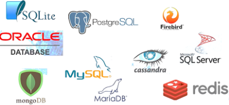
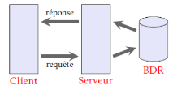
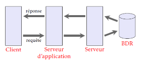
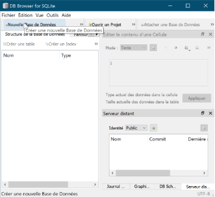
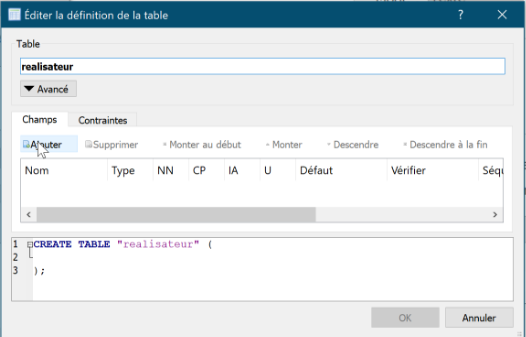
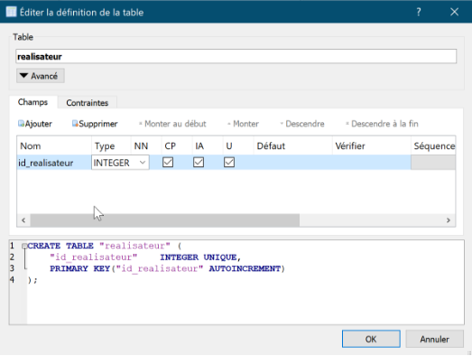
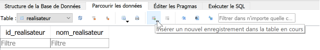

---
author: ELP  
title: 03b SGBD  
---

📚 **Table des matières**

-  [1.🧩 Les grands principes](#_toc144548611)
-  [2.🧱 Les principaux SGBD](#_toc144548612)
-  [3.🖥️ Architecture](#_toc144548615)
-  [4.🧪 Utilisation de DB Browser SQLite : création d’une base](#_toc144548616)

**Compétences évaluables :**

- Identifier les services rendus par un système de gestion de bases de données relationnelles : persistance des données, gestion des accès concurrents, efficacité de traitement des requêtes, sécurisation des accès

---

## <H2 STYLE="COLOR:BLUE;">🧩 **1. Les grands principes**</H2>

Les SGBD (**systèmes de gestion de bases de données**) permettent la **lecture**, l’**écriture**, la **modification** des informations, mais aussi la **gestion des autorisations d’accès** à une base de données. Ces opérations sont souvent désignées par l’acronyme **CRUD** : *Create*, *Read*, *Update*, *Delete*.

Les fichiers de bases de données étant stockés sur des **disques durs de serveurs**, ils peuvent être vulnérables aux **pannes**. C’est pourquoi les SGBD assurent aussi la **duplication** et la **maintenance** des différentes copies de la base.

Lorsque **plusieurs utilisateurs** accèdent simultanément aux données et tentent de les modifier en même temps, des conflits peuvent apparaître. On parle alors de **gestion des accès concurrents**, également prise en charge par les SGBD.

---

## <H2 STYLE="COLOR:BLUE;">🧱 **2. Les principaux SGBD**</H2>

### <H3 STYLE="COLOR:GREEN;">2.1. Introduction</H3>

Il existe différents types de **bases de données**, et donc plusieurs **systèmes de gestion** adaptés. Parmi les plus connus :

- **Libres et open source** : PostgreSQL, MySQL, MariaDB  
- **Gratuits mais propriétaires (code fermé)** : SQLite, Redis  
- **Payants et propriétaires** : Oracle, SQL Server, Sybase

{ width=50%; : .center }

Chaque SGBD a ses **caractéristiques propres**, ses **avantages** et **inconvénients** :  
- **Oracle** est très robuste et performant, adapté aux très grosses bases, mais coûteux.  
- **PostgreSQL**, gratuit, est souvent utilisé en entreprise pour des projets sérieux.

### <H3 STYLE="COLOR:GREEN;">2.2. SGBDR</H3>

Les **SGBD relationnels (SGBDR)** sont aujourd’hui les plus répandus. Ils utilisent tous le **langage SQL (Structured Query Language)** pour :

- Ajouter, modifier, supprimer des données
- Rechercher des informations selon des critères
- Exploiter les **relations entre les tables**

Ce modèle a été proposé en **1970 par Edgar F. Codd**, en s’appuyant sur la **théorie des ensembles**.

👉 **Tous les SGBDR utilisent SQL**, mais chaque système peut introduire **des variantes dans la syntaxe**.

---

## <H2 STYLE="COLOR:BLUE;">🖥️ **3. Architecture**</H2>

{ width=50%; : .center }

Sur un réseau, les échanges de données se font entre deux entités logicielles :

- Le **client**, qui envoie des requêtes
- Le **serveur**, qui traite ces requêtes

Ce modèle est appelé **architecture à deux niveaux (2-tier)**.

{ width=50%; : .center }

Dans une **architecture trois-tiers (3-tier)**, un **serveur applicatif** intermédiaire est ajouté :

1. Le **client** fait une demande
2. Le **serveur applicatif** traite la logique métier
3. Le **serveur de données** stocke et fournit les données

✅ **Avantages** de l’architecture trois-tiers :

- Meilleure **sécurité**
- Meilleure **modularité**
- Meilleure **répartition des charges**

---

## <H2 STYLE="COLOR:BLUE;">🧪 **4. Utilisation de DB Browser SQLite : création d’une base**</H2>

{ width=50%; : .center }

🎯 **Objectif** : créer une base de données nommée `Base_Film` dans `Documents/BD`

**Création de la table `realisateur`**

- `id_realisateur` : **entier**, **non nul**, **clé primaire**, **auto-incrémentée**, **unique**
- `nom_realisateur` : **texte**, **non nul**

{ width=50%; : .center }
{ width=50%; : .center }

**Création de la table `film`**

- `id_film` : entier, NN, CP, IA, U  
- `titre_film` : texte, NN  
- `annee_film` : entier, NN  
- `id_realisateur_film` : entier, NN → **clé étrangère** vers `realisateur(id_realisateur)`  
- `nationalite_film`, `genre_film` : texte (VARCHAR), NN

**Saisie de données**

{ width=50%; : .center }

1. Ajouter un réalisateur : `Lurnet`  
2. Ajouter un film :
   - Titre : **Le Crime de l’Orient-Express**
   - Année : **1974**
   - id\_realisateur\_film : **1**
   - Nationalité : **États-Unis**
   - Genre : **Policier**

📌 Pour chaque attribut d’une relation, on définit un **domaine**, c’est-à-dire un **ensemble de valeurs admissibles** (ex. : année > 1895, genre ∈ {drame, comédie, policier, ...}).

---

