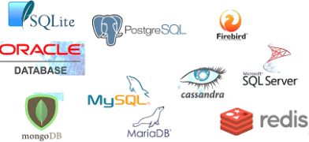
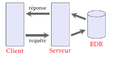
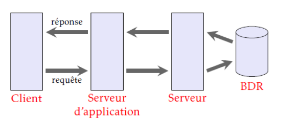

📚 **Table des matières**

-  [1. 🧩 Qu'est-ce qu'un SGBD ?](#principes)
-  [2. 🛡️ Les services rendus par un SGBD](#services)
-  [3. 🧱 Les principaux SGBD](#principaux)
-  [4. 🖥️ Architecture](#architecture)
-  [5. 🧠 Exercices](#exercices)

**Compétences évaluables :**

- ✅ Identifier les services rendus par un système de gestion de bases de données relationnelles : **persistance** des données, **gestion des accès concurrents**, **efficacité** de traitement des requêtes, **sécurisation** des accès.

---

## 🧩 1. Qu'est-ce qu'un SGBD ? { #principes }

Un **SGBD** (Système de Gestion de Bases de Données) est un **logiciel** qui se place entre les données et les programmes (ou les personnes) qui les utilisent. Personne ne lit ni n'écrit directement dans les fichiers de la base : **toutes les demandes passent par le SGBD**, qui les vérifie et les exécute.

Il permet d'effectuer les quatre opérations fondamentales, désignées par l'acronyme **CRUD** :

| Opération | Signification | Exemple sur EcoleDirecte |
|---|---|---|
| **C**reate | créer, ajouter | le professeur saisit une nouvelle note |
| **R**ead | lire, rechercher | l'élève consulte ses notes |
| **U**pdate | mettre à jour | le professeur corrige une note mal saisie |
| **D**elete | supprimer | un devoir annulé est effacé |

Mais un SGBD fait bien plus que lire et écrire : il rend **quatre services** essentiels, détaillés dans la partie 2.

!!! info "Pourquoi pas un simple fichier CSV ?"

    Avec un fichier CSV, c'est le programme qui doit tout gérer lui-même : relire le fichier, vérifier les données, empêcher deux personnes d'écrire en même temps, contrôler qui a le droit de lire… Le SGBD prend en charge tout cela **une fois pour toutes**, pour toutes les applications qui utilisent la base.

---

## 🛡️ 2. Les services rendus par un SGBD { #services }

### 2.1. La persistance des données

💾 Les données doivent **survivre** à la fermeture du programme, à l'extinction de l'ordinateur ou à une panne.

- Une variable Python disparaît quand le programme s'arrête : elle est en **mémoire vive** (RAM).
- Le SGBD enregistre les données sur un support **permanent** (disque dur, SSD) : elles sont **persistantes**.

Le SGBD protège aussi les données contre les **pannes** :

- il tient un **journal** de toutes les modifications : après une coupure de courant, il le relit pour remettre la base dans un état cohérent ;
- il permet les **sauvegardes** régulières et la **réplication** (copies de la base sur plusieurs serveurs, parfois dans plusieurs pays).

---

### 2.2. La gestion des accès concurrents

👥 Des milliers d'utilisateurs peuvent accéder **en même temps** à la même base. Si deux d'entre eux modifient la même donnée simultanément, le résultat peut devenir **incohérent**.

📌 Exemple : il reste **une seule place** pour un concert. Deux personnes la réservent au même moment.

| Instant | Client A | Client B | Places restantes (dans la base) |
|---|---|---|---|
| t1 | lit : 1 place restante | | 1 |
| t2 | | lit : 1 place restante | 1 |
| t3 | réserve → écrit 1 − 1 = 0 | | 0 |
| t4 | | réserve → écrit 1 − 1 = 0 | 0 |

❌ Les deux clients ont un billet pour **la même place**, et la base affiche 0 : la réservation de A a été « écrasée » par celle de B sans que personne ne s'en aperçoive.

✅ Le SGBD évite ce problème grâce à des **verrous** : pendant que A lit puis modifie le nombre de places, la donnée est **verrouillée** ; B doit attendre que A ait terminé, puis il lit 0 place et sa réservation est refusée.

🔁 Le SGBD regroupe aussi plusieurs opérations en une **transaction**, exécutée **en entier ou pas du tout**.

📌 Exemple : un virement de 100 € du compte de Léa vers celui d'Hugo, c'est deux opérations :

1. retirer 100 € du compte de Léa ;
2. ajouter 100 € au compte d'Hugo.

Si une panne survient entre les deux, 100 € disparaissent ! Dans une transaction, si la seconde opération échoue, le SGBD **annule** la première : la base revient à son état de départ.

### 2.3. L'efficacité du traitement des requêtes

⚡ Une base peut contenir des **millions** de lignes, et le SGBD doit pourtant répondre en quelques millisecondes.

- Sans précaution, pour trouver un élève dans une table d'un million de lignes, il faut les parcourir **une par une** : jusqu'à 1 000 000 de comparaisons (recherche séquentielle).
- Le SGBD peut construire un **index** sur une colonne : une structure triée, un peu comme l'index à la fin d'un livre. La recherche se fait alors à la manière d'une **recherche dichotomique** : une vingtaine de comparaisons suffisent pour un million de lignes (car 2²⁰ ≈ 1 000 000).
- Le SGBD dispose aussi d'un **optimiseur** : pour chaque requête, il choisit lui-même la façon la plus rapide de l'exécuter. L'utilisateur dit **ce qu'il veut**, pas **comment** le calculer.

💡 Un index accélère les recherches, mais il ralentit un peu les ajouts et modifications (il faut aussi mettre l'index à jour) et prend de la place. On n'en crée donc que sur les colonnes souvent utilisées dans les recherches.

### 2.4. La sécurisation des accès

🔐 Tout le monde ne doit pas pouvoir tout faire. Le SGBD gère :

- l'**authentification** : chaque utilisateur se connecte avec un identifiant et un mot de passe ;
- les **droits d'accès** (ou privilèges) : pour chaque utilisateur, le SGBD sait quelles tables il peut **lire**, **modifier**, **supprimer**.

📌 Exemple, dans un logiciel de vie scolaire :

| Utilisateur | Notes de ses élèves | Notes des autres classes | Structure de la base |
|---|---|---|---|
| Élève | lecture (les siennes uniquement) | aucun accès | aucun accès |
| Professeur | lecture + écriture | aucun accès | aucun accès |
| Administrateur | lecture + écriture | lecture + écriture | modification |

Dans les SGBD comme MySQL ou PostgreSQL, les droits se donnent avec des commandes SQL, par exemple `GRANT SELECT ON notes TO eleve;` (autoriser la lecture de la table `notes`).

Le SGBD participe aussi à la sécurité par les **sauvegardes** et, souvent, par le **chiffrement** des données stockées.

!!! abstract "📌 Les quatre services à connaître par cœur"

    | Service | En une phrase | Moyen utilisé |
    |---|---|---|
    | **Persistance** | les données survivent à l'arrêt du programme et aux pannes | stockage sur disque, journal, sauvegardes, réplication |
    | **Accès concurrents** | plusieurs utilisateurs en même temps sans incohérence | verrous, transactions |
    | **Efficacité** | réponses rapides même sur des millions de lignes | index, optimiseur de requêtes |
    | **Sécurisation** | chacun n'accède qu'à ce qu'il a le droit de voir ou modifier | authentification, droits d'accès, chiffrement |

    On y ajoute le maintien de la **cohérence** des données grâce aux **contraintes d'intégrité** vues au chapitre 03a (domaine, relation, référence).

---

## 🧱 3. Les principaux SGBDr { #principaux }

Les **SGBD relationnels** reposent sur le **modèle relationnel** proposé en **1970 par Edgar F. Codd** (chapitre 03a), qui s'appuie sur la **théorie des ensembles**. Ce sont aujourd'hui les plus répandus.

Ils utilisent tous le langage **SQL** (*Structured Query Language*), normalisé depuis 1987, pour :

- créer les tables ;
- ajouter, modifier, supprimer des données ;
- rechercher des informations selon des critères ;
- croiser les informations de plusieurs tables (jointures).

👉 Tous les SGBDR utilisent SQL, mais chacun introduit de **petites variantes** dans la syntaxe (par exemple `AUTO_INCREMENT` en MySQL, `INTEGER PRIMARY KEY` en SQLite).

| SGBDR | Licence | Remarques |
|---|---|---|
| **PostgreSQL** | libre et gratuit | très complet, très utilisé en entreprise |
| **MySQL** | libre (et version commerciale) | très répandu sur le Web, appartient à Oracle |
| **MariaDB** | libre et gratuit | issu de MySQL en 2009, compatible avec lui |
| **SQLite** | domaine public (libre et gratuit) | toute la base tient dans **un seul fichier**, sans serveur ; présent dans les smartphones, les navigateurs, Python… |
| **Oracle Database** | propriétaire, payant | très robuste, adapté aux très grosses bases, coûteux |
| **Microsoft SQL Server** | propriétaire, payant (version gratuite limitée) | très utilisé dans les entreprises équipées Microsoft |

{ width=50%; : .center }

---

## 🖥️ 4. Architecture { #architecture }

### 4.1. Architecture client-serveur (deux niveaux)

{ width=50%; : .center }

La plupart des SGBD fonctionnent selon le modèle **client-serveur** : deux logiciels communiquent sur un réseau.

- Le **client** (une application, un logiciel de gestion…) envoie des **requêtes** SQL.
- Le **serveur** de base de données (le SGBD) les exécute et renvoie les résultats.

Ce modèle est appelé **architecture à deux niveaux** (*2-tier*).

💡 **SQLite est une exception** : il n'y a pas de serveur. Le SGBD est une simple bibliothèque intégrée au programme, qui lit et écrit directement dans le fichier de la base. C'est pour cela qu'on peut l'utiliser dans Python sans rien installer, mais il est moins adapté à des milliers d'utilisateurs simultanés.

### 4.2. Architecture trois-tiers

{ width=50%; : .center }

Dans une **architecture trois-tiers** (*3-tier*), un **serveur d'application** est placé entre le client et la base :

1. le **client** (le navigateur web) fait une demande : « afficher mes notes » ;
2. le **serveur d'application** (le site web, écrit en PHP, Python…) applique la logique métier : il vérifie qui est connecté, puis construit la requête SQL ;
3. le **serveur de données** (le SGBD) exécute la requête et renvoie les données, que le serveur d'application met en forme pour le navigateur.

✅ **Avantages** de l'architecture trois-tiers :

- meilleure **sécurité** : le navigateur n'accède **jamais directement** à la base, seul le serveur d'application y est autorisé ;
- meilleure **modularité** : on peut changer l'interface sans toucher à la base, et inversement ;
- meilleure **répartition des charges** : chaque niveau peut être installé sur une ou plusieurs machines différentes.

⚠️ Le serveur d'application doit construire ses requêtes avec soin : s'il recopie tel quel ce que l'utilisateur a tapé dans un formulaire, un pirate peut glisser du code SQL dans sa saisie (**injection SQL**) et lire ou détruire des données.

---

!!! abstract "📌 À retenir absolument"

    - Un **SGBD** est le logiciel par lequel passent **toutes** les opérations sur la base (CRUD : créer, lire, mettre à jour, supprimer).
    - Il rend **quatre services** : **persistance**, **gestion des accès concurrents**, **efficacité** des requêtes, **sécurisation** des accès.
    - Accès concurrents : **verrous** et **transactions** (tout ou rien).
    - Efficacité : **index** (recherche rapide, comme une dichotomie) et **optimiseur**.
    - Sécurité : **authentification** et **droits d'accès** par utilisateur.
    - Les **SGBDR** reposent sur le modèle relationnel (Codd, 1970) et utilisent le langage **SQL**.
    - Architecture **client-serveur** (2 niveaux) ou **trois-tiers** (client, serveur d'application, serveur de données).

---

## 🧠 5. Exercices { #exercices }

!!! abstract "**Exercice 1 : quel service ?** ★"

    Pour chaque situation, indiquer le service rendu par le SGBD (persistance, accès concurrents, efficacité, sécurisation).

    1. Après une coupure de courant dans le lycée, toutes les notes saisies la veille sont toujours là.
    2. Un élève ne peut pas modifier ses propres notes.
    3. La recherche d'un livre parmi 3 millions de références prend moins d'un dixième de seconde.
    4. Deux professeurs modifient en même temps l'appréciation d'un même élève : aucune des deux saisies n'est perdue sans avertissement.
    5. Un parent ne voit que les notes de ses propres enfants.
    6. Les données d'un site marchand sont copiées chaque nuit sur un serveur situé dans un autre pays.

!!! abstract "**Exercice 2 : le dernier billet** ★★"

    Il reste 2 places pour un spectacle. Trois clients A, B et C réservent **chacun une place** presque en même temps. Chaque réservation lit le nombre de places restantes, vérifie qu'il est supérieur à 0, puis écrit ce nombre diminué de 1.

    1. Compléter un tableau chronologique (comme celui du §2.2) où les trois clients lisent la valeur **avant** que l'un d'eux n'écrive. Combien de billets sont vendus ? Que contient la base à la fin ?
    2. Reprendre le tableau lorsque le SGBD utilise un **verrou**. Quel client voit sa réservation refusée ?
    3. Quel service rendu par le SGBD cet exercice illustre-t-il ?

!!! abstract "**Exercice 3 : tout ou rien** ★★"

    Pour acheter un article sur un site marchand, trois opérations sont nécessaires :

    - (a) diminuer de 1 le stock de l'article ;
    - (b) enregistrer la commande du client ;
    - (c) débiter le compte du client.

    1. La panne survient juste après (a). Quelle incohérence observe-t-on si les opérations sont exécutées séparément ?
    2. Même question si la panne survient juste après (b).
    3. Expliquer comment une **transaction** résout le problème.

!!! abstract "**Exercice 4 : la puissance de l'index** ★★"

    La table `Eleve` d'une académie contient 400 000 élèves. On cherche un élève à partir de son numéro INE.

    1. Sans index, combien de comparaisons faut-il au pire ? Quel algorithme de Première cela rappelle-t-il ?
    2. Avec un index (qui permet une recherche semblable à la recherche dichotomique), combien de comparaisons faut-il au pire environ ? (Aide : 2¹⁰ = 1024.)
    3. Pourquoi ne crée-t-on pas un index sur **toutes** les colonnes de toutes les tables ?

!!! abstract "**Exercice 5 : les droits d'accès** ★★"

    Une médiathèque utilise une base avec trois tables : `Livre`, `Adherent` (nom, adresse, téléphone) et `Emprunt`. Trois types d'utilisateurs s'y connectent : les **adhérents** (depuis le site web), les **bibliothécaires** et l'**administrateur**.

    1. Proposer un tableau des droits (aucun accès, lecture, lecture + écriture) de chaque type d'utilisateur sur chaque table. Justifier deux de vos choix.
    2. Un adhérent peut-il voir la liste des emprunts des autres adhérents ? Pourquoi ?
    3. Quel service rendu par le SGBD cet exercice illustre-t-il ?

!!! abstract "**Exercice 6 : architecture** ★★"

    Un élève consulte son emploi du temps sur l'ENT depuis son téléphone.

    1. Identifier le client, le serveur d'application et le serveur de données.
    2. S'agit-il d'une architecture à deux niveaux ou trois-tiers ?
    3. Pourquoi serait-il dangereux que l'application du téléphone se connecte directement à la base de données ?

!!! abstract "**Exercice 7 : type bac** ★"

    1. Citer deux services rendus par un système de gestion de bases de données relationnelles.
    2. Pour chacun, donner un exemple concret de situation où il est indispensable.
