📚 **Table des matières**

- [1. 🧠 Introduction](#_toc173365561)
- [2. 🏗️ Création d’une base de données](#_toc173365560)
- [3. 🧩 Insertion de données](#_toc173365563)
- [4. 🔍 Interrogation de la base de données](#_toc173365566)
- [5. ✏️ Requête de mise à jour](#_toc173365577)
- [6. 🔗 Jointures de tables](#_toc173365583)
- [7. 📝 Exercices](#_toc173365587)
- [8. 🧪 Projet (démarche d’investigation)](#_toc173365588)

🎯 **Compétences évaluables**

- Identifier les composants d’une requête SQL.
- Construire des requêtes d’interrogation avec `SELECT`, `FROM`, `WHERE`, `JOIN`.
- Construire des requêtes de modification avec `INSERT`, `UPDATE`, `DELETE`.


---

##  <span style="color:blue"><a name="_toc173365561">🧠 </a>**1. Introduction**</span>

Pour manipuler des données dans une base relationnelle, on utilise le **langage SQL** (*Structured Query Language*), un langage universel adapté aux bases de données relationnelles.

SQL permet de :

* 🏗 **Créer**, modifier ou supprimer des tables (structure de la base) ;
* 🧩 **Insérer**, **mettre à jour** ou **supprimer** des enregistrements (appelés **t-uplets**) ;
* 🔍 **Interroger** la base avec des filtres et des conditions ;
* 📋 **Lister** les résultats selon des critères précis.

💡 Lorsque vous utilisez un logiciel graphique pour manipuler une base, celui-ci **génère automatiquement du code SQL** en arrière-plan. Vous pouvez observer ce code dans la console en bas de la fenêtre.

---

⚙️ **Exemples automatiques générés par le logiciel**

* Pour **créer une table** :
  

* Pour **insérer des données dans une table** :
  

* Pour **supprimer une table** :
  

* Pour **ajouter une colonne à une table existante** :
  

---

=> Capytale

## 🏗️ <span style="color:blue"><a name="_toc173365560"></a>**2. Création d’une base de données**</span>

### <span style="color:green"><a name="_toc173365561"></a>**2.1. Création**</span>


???+ question "🧱 Activité n° 1 : Création des différents champs"
    Voici le code SQL complet pour créer la table `realisateur` :

    ```sql
    CREATE TABLE "realisateur" (
        "id_realisateur"	INTEGER NOT NULL UNIQUE,
        "nom_realisateur"	VARCHAR(255) NOT NULL,
        "prenom_realisateur"	VARCHAR(255) NOT NULL,
        "date_naissance_realisateur"	date,
        "nationalite_realisateur" VARCHAR(255),
        PRIMARY KEY("id_realisateur" AUTOINCREMENT)
    );
    ```

    Exécute la requête  => vous ne voyez rien c'est normal

    Dans une nouvelle case code, vérifier que la table existe avec :

    ```sql
    SELECT *
    FROM realisateur
    ```
---

### <span style="color:green"><a name="_toc173365562"></a>**2.2. Suppression**</span>

???+ question "🧱 Activité n° 2 : Création de la table `film`"
    Créer une table simple avec deux champs :

    ```sql
    CREATE TABLE film (
        id_film INTEGER NOT NULL,
        titre_film VARCHAR(255) NOT NULL
    );
    ```

    Remarque : les **guillemets autour des noms de champs sont facultatifs**.

    Dans une nouvelle case de code vérifier que la table apparait avec :

    ```sql
    SELECT *
    FROM film
    ```
---

???+ question "🗑️ Activité n° 3 : Suppression de la table"
     
    Pour supprimer une table (ici, `film`), tape :

    ```sql
    DROP TABLE film ;
    ```

    🔎 Vérifie que la table a bien disparu en ajoutant dans une nouvelle case code

    ```sql
    SELECT *
    FROM film
    ```

---

???+ question "🎥 Activité n° 4 : Création de la vraie table `film`"
    Voici la version complète de la table avec une **clé étrangère** vers la table `realisateur` :


    ```sql
    CREATE TABLE film (
        id_film INTEGER NOT NULL,
        titre_film VARCHAR(255) NOT NULL,
        annee_film date,
        id_realisateur_film INTEGER NOT NULL,
        nationalite_film VARCHAR(255) NOT NULL,
        genre_film VARCHAR(255) NOT NULL,
        PRIMARY KEY (id_film AUTOINCREMENT),
        FOREIGN KEY (id_realisateur_film)
        REFERENCES realisateur (id_realisateur)
    );
    ```

    Dans une nouvelle case code, vérifier que la table apparait avec :

    ```sql
    SELECT *
    FROM film
    ```

    
---

## 🧩 <span style="color:blue"><a name="_toc173365563"></a>**3. Insertion de données**</span>

???+ question "🧾 Activité n° 5 : Insertion dans la table `realisateur`"

    On utilise la commande `INSERT INTO`, suivie du **nom de la table**, puis entre parenthèses la **liste des champs**.
    Ensuite, après le mot-clé `VALUES`, on indique les **valeurs correspondantes** à insérer :


    ```sql
    INSERT INTO realisateur
    (nom_realisateur, prenom_realisateur, date_naissance_realisateur, nationalite_realisateur)
    VALUES
    ('Abrams', 'Jeffrey Jacob', 1966-06-27, 'Etats-Unis'),
    ('Badham', 'John', 1939-08-25, 'Royaume-Uni'),
    ('Besson', 'Luc', 1959-03-18, 'France'),
    ('Branagh', 'Kenneth', 1960-12-10, 'Royaume-Uni'),
    ('Johnson', 'Rian', 1973-12-17, 'Etats-Unis'),
    ('Kershner', 'Irvin', 1923-04-29, 'Etats-Unis'),
    ('Lucas', 'George', 1944-05-14, 'Etats-Unis'),
    ('Marquand', 'Richard', 1937-09-22, 'Royaume-Uni'),
    ('Spielberg', 'Steven', 1946-12-18, 'Etats-Unis'),
    ('Tarantino', 'Quentin', 1963-03-27, 'Etats-Unis'),
    ('Lumet', 'Sydney', 1924-06-25, 'Etats-Unis')
    ;
    ```

    Dans une nouvelle case code, vérifier que la table apparait avec :

    ```sql
    SELECT *
    FROM realisateur
    ```
    

---

???+ question "🎞️ Activité n° 6 : Insertion dans la table `film`"

    On commence par tenter une insertion **incomplète** volontairement, sans renseigner la clé étrangère `id_realisateur_film` :

    ```sql
    INSERT INTO film
    (titre_film, nationalite_film, genre_film)
    VALUES
    ('StarWares', 'Etats-Unis', 'Science fiction');
    ```

    ⚠️ Cette requête échoue : la colonne `id_realisateur_film` est **NOT NULL**, elle doit donc obligatoirement être renseignée.

    Dans une nouvelle case code :
    
    On essaie alors une **insertion complète** :

    ```sql
    INSERT INTO film
    (titre_film, id_realisateur_film, nationalite_film, genre_film)
    VALUES
    ('StarWars', 44, 'Etats-Unis', 'Science fiction');
    ```

    ❌ Cette requête échoue également : le **réalisateur n°44 n’existe pas** dans la table `realisateur`, ce qui viole la **contrainte de clé étrangère** (`FOREIGN KEY`).


---

???+ question "🧾 Activité n° 7 : Insertion générale de la table film" 
    Ajouter une case code
    
    ```sql
    INSERT INTO film
    (titre_film, annee_film, id_realisateur_film, nationalite_film, genre_film)
    VALUES
    ('Star Wars, épisode IV : Un nouvel espoir', 1977, 7, 'Etats-Unis', 'Science fiction'),
    ('Star Wars, épisode V : L''Empire contre_attaque', 1980, 6, 'Etats-Unis', 'Science fiction'),
    ('Star Wars, épisode VI : Le retour du Jedi', 1983, 8, 'Etats-Unis', 'Science fiction'),
    ('Star Wars, épisode I : La menace fantôme', 1999, 7, 'Etats-Unis', 'Science fiction'),
    ('Star Wars, épisode II : L''attaque des clones', 2002, 7, 'Etats-Unis', 'Science fiction'),
    ('Star Wars, épisode III : La Revanche des Sith', 2005, 7, 'Etats-Unis', 'Science fiction'),
    ('Star Wars, épisode VII : Le Réveil de la Force', 2015, 1, 'Etats-Unis', 'Science fiction'),
    ('Star Wars, épisode VIII : Les Derniers Jedi', 2017, 5, 'Etats-Unis', 'Science fiction'),
    ('Star Wars, épisode IX : L''ascension de Skywalker', 2018, 1, 'Etats-Unis', 'Science fiction'),
    ('Indiana Jones et les Aventuriers de l''arche perdue', 1981, 9, 'Etats-Unis', 'Aventure'),
    ('Indiana Jones et le Temple maudit', 1984, 9, 'Etats-Unis', 'Aventure'),
    ('WarGames', 1983, 2, 'Etats-Unis', 'Science fiction'),
    ('Le Cinquième Elément', 1997, 3, 'France', 'Science fiction'),
    ('Valérian et la cité des mille planètes', 2017, 3, 'France', 'Science fiction'),
    ('Léon', 1994, 3, 'France', 'Drame'),
    ('Anna', 2019, 3, 'France', 'Thriller'),
    ('Once Upon a Time in Hollywood', 2019, 10, 'Etats-Unis', 'Comédie dramatique'),
    ('Django Unchained', 2012, 10, 'Etats-Unis', 'Western'),
    ('Pulp Fiction', 1994, 10, 'Etats-Unis', 'Policier'),
    ('Mort sur le Nil', 2020, 4, 'Etats-Unis', 'Policier'),
    ('Le Crime de l''Orient-Express', 2017, 4, 'Royaume-Uni', 'Policier'),
    ('Thor', 2011, 4, 'Etats-Unis', 'Super-Heros'),
    ('Henry V', 1989, 4, 'Royaume-Uni', 'Film historique'),
    ('Le Crime de l''Orient-Express', 1974, 11, 'Royaume-Uni', 'Policier'),
    ('American Graffiti', 1973, 7, 'Etats-Unis', 'Comédie')
    ;
    ```

    Dans une nouvelle case code vérifier que la table apparait avec :

    ```sql
    SELECT *
    FROM film
    ```

💡 Remarque : les apostrophes en SQL
Dans SQL, pour inclure une apostrophe à l'intérieur d'une chaîne de caractères, **on la double**.
Exemple :
`'L''Espoir Ultime'` → affiche correctement : `L'Espoir Ultime`

---


### 🗑️ <span style="color:green;"><a name="_toc173365565"></a>**3.2. Suppression**</span>

???+ question "🗑️ Activité n° 8 : Ajout et suppression d’une donnée"

    Exécute d’abord cette insertion dans la table `film` :


    ```sql
    INSERT INTO film
    (titre_film, annee_film, id_realisateur_film, nationalite_film, genre_film)
    VALUES
    ('Star Wars, épisode XXI : L''Espoir Ultime', 2040, 7, 'Etats-Unis', 'Science fiction')
    ```
    Dans une nouvelle case code, vérifier que la modification apparait avec :

    ```sql
    SELECT *
    FROM film
    ```
    Dans une nouvelle case code :
    Ensuite, supprime cet enregistrement (ici avec l’ID 26) :

    ```sql
    DELETE FROM film 
    WHERE id_film = 26 ;
    ```

    Dans une nouvelle case code, vérifier que la modification apparait avec :

    ```sql
    SELECT *
    FROM film
    ```

---

## 🎯 <span style="color:blue;"><a name="_toc173365566"></a>**4. Interrogation de la base de données**</span>

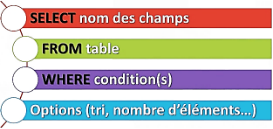{ width=50%; : .center }

🔎 Pour interroger la base de données et afficher des résultats selon certains critères, on utilise les mots-clés suivants :

* `SELECT` → pour choisir les champs à afficher
* `FROM` → pour indiquer de quelle table proviennent les données
* `WHERE` → pour filtrer les résultats selon une condition logique
* (optionnel) `ORDER BY`, `LIMIT` → pour trier ou restreindre l’affichage

---

### 🧾 <span style="color:green;"><a name="_toc173365567"></a>**4.1. Affichage simple**</span>

???+ question "🎬 Activité n° 9 : Affichage par numéro d'identifiant"
 

    Affiche le **titre**, l’**année** et la **nationalité** d’un film dont on connaît l’identifiant :


    ```sql
    SELECT titre_film, annee_film, nationalite_film
    FROM film
    WHERE id_film = 14;
    ```

    🧪 Le film n°14 s’affiche avec les champs demandés.


---

???+ question "🎬 Activité n° 10 : Affichage par intervalle d'identifiants"
    
    Affiche plusieurs films dont l’identifiant est **supérieur à 14** :


    ```sql
    SELECT id_film, titre_film, annee_film, nationalite_film
    FROM film
    WHERE id_film > 14;
    ```

    🧪 Tous les films avec un ID > 14 s’affichent.


---

???+ question "🎬 Activité n° 11 : Affichage par année"

    Affiche tous les films sortis en **2019**, avec leurs informations principales :


    ```sql
    SELECT id_film, titre_film, annee_film, nationalite_film
    FROM film
    WHERE annee_film = 2019;
    ```

    🧪 Vérifie que le ou les films de 2019 apparaissent correctement.


---

???+ question "🎬 Activité n° 12 : Affichage par intervalle d’années"
    Affiche les films sortis **entre 2010 et 2020** (exclus) :


    ```sql
    SELECT id_film, titre_film, annee_film, nationalite_film
    FROM film
    WHERE annee_film > 2010 AND annee_film < 2020;
    ```

    🧪 Seuls les films sortis entre 2011 et 2019 inclus doivent apparaître.


---


### 🧾 <span style="color:green;"> 🔼 **4.2. Affichage et tri ascendant** <a name="_toc173365568"></a></span>

???+ question "🔢 Activité n°13 : Tri par année croissante"
    Afficher les films sortis entre 2010 et 2020, triés par **année croissante** :


    ```sql
    SELECT id_film, titre_film, annee_film, nationalite_film
    FROM film
    WHERE annee_film > 2010 AND annee_film < 2020
    ORDER BY annee_film;
    ```

📝 On peut ajouter `ASC` pour expliciter le tri croissant (optionnel par défaut c'est ascendant).


???+ question "🧮 Activité n°14 : Tri croissant multi-critères"
    Même chose que précédemment, mais les films sont triés **par année**, puis **par ordre alphabétique de titre** :


    ```sql
    SELECT id_film, titre_film, annee_film, nationalite_film
    FROM film
    WHERE annee_film > 2010 AND annee_film < 2020
    ORDER BY annee_film, titre_film;
    ```

    ✅ Les films de même année seront ensuite classés par titre.


---

### 🧾 <span style="color:green;">🔍 **4.3. Affichage avec partie d’une chaîne de caractères** <a name="_toc173365569"></a>

???+ question "🔡 Activité n°15 : Titre exact"
    Afficher les films dont le **titre est exactement** "WarGames" :


    ```sql
    SELECT id_film, titre_film, annee_film, nationalite_film
    FROM film
    WHERE titre_film = 'WarGames';
    ```


???+ question "🔎 Activité n°16 : Partie de titre"
    Afficher les titres commençant par **Star Wars** :


    ```sql
    SELECT id_film, titre_film, annee_film, nationalite_film
    FROM film
    WHERE titre_film LIKE 'Star Wars%';
    ```

➕ Le symbole `%` permet de remplacer des caractères :  
- `LIKE 'Star Wars%'` → commence par  
- `LIKE '%War%'` → contient  
- `LIKE '%Wars'` → finit par  
On peut aussi trier avec `ORDER BY annee_film`.


---

### 🧾 <span style="color:green;"> ⚖️ **4.4. Affichage avec une condition OU une autre** <a name="_toc173365570"></a></span>

???+ question "🔀 Activité n°17 : OU logique"
    Afficher les films de 2017 **ou** de genre 'Science fiction' :


    ```sql
    SELECT id_film, titre_film, annee_film, nationalite_film
    FROM film
    WHERE annee_film = 2017 OR genre_film = 'Science fiction';
    ```


---

### 🧾 <span style="color:green;"> 📋 **4.5. Affichage avec critère dans une liste** <a name="_toc173365571"></a></span>

???+ question "📑 Activité n°18 : Genre dans une liste"
    Afficher les films de genre **'Science fiction'** ou **'Policier'** :


    ```sql
    SELECT id_film, titre_film, annee_film, nationalite_film
    FROM film
    WHERE genre_film IN ('Science fiction', 'Policier');
    ```


???+ question "🚫 Activité n°19 : Exclusion de genres"
    Exclure les films des genres **'Science fiction'** ou **'Policier'** :


    ```sql
    SELECT id_film, titre_film, annee_film, nationalite_film
    FROM film
    WHERE genre_film NOT IN ('Science fiction', 'Policier');
    ```


???+ question "⛔ Activité n°20 : Limiter les résultats"
    Même requête, mais limitée aux **5 premiers résultats** :


    ```sql
    SELECT id_film, titre_film, annee_film, nationalite_film
    FROM film
    WHERE genre_film NOT IN ('Science fiction', 'Policier') 
    LIMIT 5;
    ```


---

### 🧾 <span style="color:green;"> 🔽 **4.6. Affichage et tri descendant** <a name="_toc173365572"></a></span>

???+ question "📉 Activité n°21 : Tri par année décroissante"
    Trier les films (hors science fiction et policiers) par **année décroissante** :


    ```sql
    SELECT id_film, titre_film, annee_film, nationalite_film
    FROM film
    WHERE genre_film NOT IN ('Science fiction', 'Policier') 
    ORDER BY annee_film DESC;
    ```


---

### 🧾 <span style="color:green;"> 🔗 **4.7. Affichage avec concaténation** <a name="_toc173365573"></a></span>

???+ question "🔤 Activité n°22 : Concaténation prénom + nom"
    Afficher le **prénom + nom** de chaque réalisateur sur une seule ligne :


    ```sql
    SELECT prenom_realisateur || ' ' || nom_realisateur AS Prenom_Nom
    FROM realisateur;
    ```

🔧 Le mot-clé `AS` renomme la colonne pour l’affichage.


---

### 🧾 <span style="color:green;"> 🔀 **4.8. Affichage avec deux requêtes (UNION)** <a name="_toc173365574"></a></span>

???+ question "🧩 Activité n°23 : UNION de deux requêtes"
    Afficher la **nationalité** :
    \- des réalisateurs dont le **nom commence par L**
    \- des films dont le **titre commence par S**


    ```sql
    SELECT nationalite_realisateur AS nationalite
    FROM realisateur
    WHERE nom_realisateur LIKE 'L%'
    UNION
    SELECT nationalite_film AS nationalite
    FROM film
    WHERE titre_film LIKE 'S%';
    ```

⚠️ `UNION` supprime les doublons. Les deux sous-requêtes doivent retourner **le même nombre de colonnes** avec **types compatibles**.

L’intérêt de UNION est de réunir en un seul tableau des informations similaires, mais provenant de sources différentes :

Ici, tu veux lister les nationalités, qu’elles viennent :

- des réalisateurs dont le nom commence par "L",

- ou des films dont le titre commence par "S".

Au lieu de faire deux requêtes séparées et d’avoir deux résultats distincts, UNION te permet d’avoir un seul résultat global.


Imagine que tu as deux listes :

- Liste A (réalisateurs) : [Française, Américaine, Italienne]

- Liste B (films) : [Anglaise, Italienne, Française]

Si tu fais un UNION, tu obtiens :
Résultat final : [Française, Américaine, Italienne, Anglaise]
→ Les doublons (Française, Italienne) ont été supprimés.


---

### 🧾 <span style="color:green;"> 🔢 **4.9. Affichage et fonctions d’agrégation** <a name="_toc173365575"></a></span>

???+ question "🔢 Activité n°24 : Compter"
    Nombre total de réalisateurs :


    ```sql
    SELECT COUNT(id_realisateur)
    FROM realisateur;
    ```


???+ question "🔡 Activité n°25 : Compter avec condition"
    Nombre de réalisateurs dont le nom commence par **L** :


    ```sql
    SELECT COUNT(id_realisateur)
    FROM realisateur
    WHERE nom_realisateur LIKE 'L%';
    ```


???+ question "➕ Activité n°26 : Somme (à faire plus tard)"
    Exemple de syntaxe pour sommer :


    ```sql
    SELECT SUM(...)
    FROM realisateur;
    ```


???+ question "➗ Activité n°27 : Moyenne (à faire plus tard)"
    Exemple de syntaxe pour une moyenne :


    ```sql
    SELECT AVG(...)
    FROM realisateur;
    ```

👉 On peut aussi utiliser `MAX(...)` et `MIN(...)`.


---


### 🧾 <span style="color:green;"> 🗂️ **4.10. Afficher tous les champs** <a name="_toc173365576"></a></span>

???+ question "📜 Activité n°28 : Affichage complet de la table `film`"
    
    Exécute la requête suivante pour afficher **tous les champs** et toutes les lignes de la table `film` :


    ```sql
    SELECT *
    FROM film;
    ```


---

## <span style="color:blue;"> 🧩 **5. Requête de mise à jour** <a name="_toc173365577"></a></span>

### <span style="color:green;"> 🛠️ **5.1. Syntaxe d’une requête UPDATE** <a name="_toc173365578"></a></span>

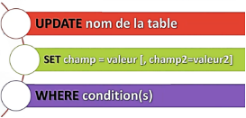{ width=30%; : .center }

Une requête de mise à jour s’écrit en trois parties :

* `UPDATE` : nom de la **table** à modifier
* `SET` : champ à modifier, suivi de la **nouvelle valeur**
* `WHERE` : condition pour **cibler précisément** les lignes à modifier (essentiel pour éviter d’écraser toute la table)

---

### <span style="color:green;">🧱 **5.2. Ajouter un attribut dans une table** <a name="_toc173365579"></a></span>

???+ question "➕ Activité n°29 : Ajouter une colonne"
    Ajouter un **nouvel attribut** `nbfilms_realisateur` (type entier) dans la table `realisateur` :


    ```sql
    ALTER TABLE realisateur
    ADD COLUMN nbfilms_realisateur INTEGER;
    ```

    🔍 Vérifie dans la structure de la table que la colonne est bien apparue. Elle est pour l’instant **remplie de valeurs NULL**.


---

### <span style="color:green;"> ✏️ **5.3. Modifier une donnée dans une table**</span>

???+ question "🖊️ Activité n°30 : Modifier une donnée"
    Modifier la **nationalité** du réalisateur `Lumet` :


    ```sql
    UPDATE realisateur
    SET nationalite_realisateur = 'Royaume-Uni'
    WHERE nom_realisateur = 'Lumet';
    ```

    🧪 Vérifie le changement.  
    👉 Puis restaure la nationalité d’origine avec :

    ```sql
    UPDATE realisateur
    SET nationalite_realisateur = 'Etats-Unis'
    WHERE nom_realisateur = 'Lumet';
    ```

    🧪 Vérifie le changement.

---


### <span style="color:green;">📥 **5.4. Remplir des données dans une nouvelle colonne**</span>

???+ question "🔢 Activité n°31 : Mise à jour de valeurs"


    Mettre à jour la colonne `nbfilms_realisateur` pour tous les réalisateurs **américains** :

    ```sql
    UPDATE realisateur
    SET nbfilms_realisateur = 1
    WHERE nationalite_realisateur = 'Etats-Unis';
    ```

    ✅ Vérifie que tous les réalisateurs américains ont maintenant **nbfilms = 1** dans la colonne ajoutée.


---


???+ question "🎯 Activité n°32 : Modifier plusieurs champs en même temps"


    Modifier le nombre de film et la nationalité du réalisateur. Exécuter :

    ```sql
    UPDATE realisateur
    SET nbfilms_realisateur = 2, nationalite_realisateur = 'USA'
    WHERE nationalite_realisateur = 'Etats-Unis';
    ```

    📌 Les réalisateurs qui avaient pour nationalité *Etats-Unis* ont eu le nombre de films modifié **et** la nationalité aussi.  
    ✅ Vérifier.


---

???+ question "🏗️ Activité n°33 : Création de table"


    Création de la table `nationalite` :

    ```sql
    CREATE TABLE nationalite (
    id_nationalite INTEGER NOT NULL,
    nom_nationalite VARCHAR(255) NOT NULL,
    PRIMARY KEY ("id_nationalite" AUTOINCREMENT)
    );
    ```


    ✅ Vérifie que la table est créée.


---

???+ question "👀 Activité n°34 : Affichage avec doublons"


    Afficher la nationalité des films :

    ```sql
    SELECT nationalite_film
    FROM film;
    ```

    ⚠️ Il y a **beaucoup de doublons** ! Il faut les éliminer.


---

???+ question "🧹 Activité n°35 : Affichage sans doublons"


    Afficher les différentes nationalités des films :

    ```sql
    SELECT DISTINCT nationalite_film
    FROM film;
    ```

    📌 `DISTINCT` permet de n’afficher que les **valeurs différentes**.


---

???+ question "📤 Activité n°36 : Insertion de données extraites"


    Exécuter la requête suivante :

    ```sql
    INSERT INTO nationalite
    (nom_nationalite)
    SELECT DISTINCT nationalite_film
    FROM film ;
    ```

    🔄 On met à jour la table `nationalite` avec les nationalités présentes dans la table `film`, afin de **supprimer les doublons**.  
    ✅ Vérifie qu’il y a bien **trois nationalités** dans la table `nationalite`.


---

???+ question "➕ Activité n°37 : Ajouter un attribut"


    Ajouter l’attribut `id_nationalite_film` à la table `film` :

    ```sql
    ALTER TABLE film
    ADD COLUMN id_nationalite_film INTEGER;
    ```

    ✅ Vérifie


---

???+ question "🔗 Activité n°38 : Lier une colonne avec une autre table"


    Exécuter :

    ```sql
    UPDATE film
    SET id_nationalite_film = (
    SELECT id_nationalite 
    FROM nationalite 
    WHERE film.nationalite_film = nationalite.nom_nationalite
    );
    ```

    🧠 On met à jour le champ `id_nationalite_film` de la table `film` avec les valeurs de la table `nationalite`.

    - Après le `SET id_nationalite_film`, on va chercher le `id_nationalite` depuis la table `nationalite`.
    - Le `SELECT` récupère ce champ **si** la condition `film.nationalite_film = nationalite.nom_nationalite` est vraie.

    ✅ Vérifie que le champ `id_nationalite_film` est bien rempli.

    on note `film.___`  pour dire que l’on va chercher le champ dans la table film. Cette nationalité dans la table film doit être égale à la nationalité dans la table nationalité d’où le `nationalite.____` 
---

???+ question "🗑️ Activité n°39 : Suppression d’un attribut devenu inutile"


    Supprimer l’attribut `nationalite_film` :

    ```sql
    ALTER TABLE film
    DROP COLUMN nationalite_film;
    ```

    ✅ La colonne `nationalite_film` est maintenant supprimée car elle est redondante avec la clé étrangère `id_nationalite_film`.


---


### <span style="color:green;"> 🔠 **5.5. Mise en majuscule d’un attribut**</span>

???+ question "🆙 Activité n°40 : Mise en majuscule d’un attribut"


    Modifier le nom du réalisateur en le passant en **majuscules** :

    ```sql
    UPDATE realisateur
    SET nom_realisateur = UPPER(nom_realisateur)
    WHERE nationalite_realisateur = 'USA';
    ```

    📌 `UPPER()` permet de convertir une chaîne en majuscules.  
    ✅ Vérifie que les noms des réalisateurs américains sont bien en majuscules.


---

???+ question "🔠 Activité n°41 : Mise en majuscule/minuscule d’un attribut"


    Modifier le nom du réalisateur pour avoir la **1ʳᵉ lettre en majuscule**, le reste en **minuscule** :

    ```sql
    UPDATE realisateur
    SET nom_realisateur = UPPER(SUBSTR(nom_realisateur, 1, 1)) || LOWER(SUBSTR(nom_realisateur, 2));
    ```

    📌 `SUBSTR()` permet d’extraire une sous-chaîne.  
    📌 `UPPER()` met la 1ère lettre en majuscule, `LOWER()` met le reste en minuscule.  
    ✅ Vérifie que tous les noms sont désormais bien formatés.


---

## <span style="color:blue;">🔗 6. Jointures de tables</span>

Les requêtes avec les jointures tiennent compte des **liens entre les tables**, via le **schéma relationnel**.

### <span style="color:green;"> 🔄 6.1. La syntaxe</span>

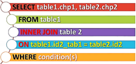{width=30%; : .center }

📌 Le mot-clé `JOIN` (ou `INNER JOIN`) permet de relier **deux tables** via une **clé étrangère** et une **clé primaire**.
📌 Le mot `INNER` est optionnel.

---

### <span style="color:green;"> 🧩 6.2. Les grands principes</span>

🧱 Schéma relationnel : **Modèle Physique de Données (MPD)**

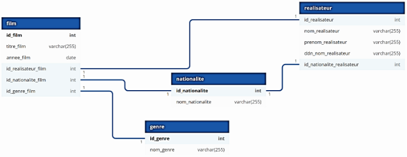{width=80%; : .center }


📌 La table `film` est liée à plusieurs autres tables (`realisateur`, `genre`, `nationalite`) par des **clés étrangères**.
📌 Pour **afficher des données de plusieurs tables**, il faut utiliser une **jointure** (`JOIN`).

---

???+ question "🛠️ Activité n°42 : Mise à jour de la base pour respecter le schéma relationnel"


    Met à jour les tables pour correspondre au **modèle relationnel**. Exécute ces requêtes dans l’ordre :

    ```sql
    /* Remettre la nationalité initiale à 'Etats-Unis' */
    UPDATE realisateur
    SET nbfilms_realisateur = 2, nationalite_realisateur = 'Etats-Unis'
    WHERE nationalite_realisateur = 'USA';

    /* Création de la table genre */
    CREATE TABLE genre (
    id_genre INTEGER NOT NULL,
    nom_genre VARCHAR(255) NOT NULL,
    PRIMARY KEY ("id_GENRE" AUTOINCREMENT));

    /* Insertion des genres distincts */
    INSERT INTO genre 
    (nom_genre)
    SELECT DISTINCT genre_film
    FROM film;

    /* Ajout colonne id_genre_film */
    ALTER TABLE film 
    ADD COLUMN id_genre_film INTEGER;

    /* Mise à jour id_genre_film */
    UPDATE film
    SET id_genre_film = (
    SELECT id_genre 
    FROM genre 
    WHERE film.genre_film = genre.nom_genre);

    /* Suppression de l’attribut texte genre_film */
    ALTER TABLE film
    DROP COLUMN genre_film;

    /* Ajout de l’attribut id_nationalite_realisateur */
    ALTER TABLE realisateur 
    ADD COLUMN id_nationalite_realisateur INTEGER;

    /* Mise à jour de la clé étrangère */
    UPDATE realisateur
    SET id_nationalite_realisateur = (
    SELECT id_nationalite 
    FROM nationalite 
    WHERE realisateur.nationalite_realisateur = nationalite.nom_nationalite);

    /* Suppression des anciens champs devenus redondants */
    ALTER TABLE realisateur
    DROP COLUMN nationalite_realisateur;

    ALTER TABLE realisateur
    DROP COLUMN nbfilms_realisateur;
    ```

    ✅ Vérifie :

    - que la table `film` contient maintenant `id_genre_film` et non plus `genre_film`,
    
    - que la table `realisateur` contient `id_nationalite_realisateur` et non plus `nationalite_realisateur`,
    
    - que la table `genre` est bien remplie avec les différents genres.


---


 


### <span style="color:green;">🔍 **6.3. Requêtes de sélection avec jointures**</span>

???+ question "🎥 Activité n°43 : Afficher le titre du film avec son genre (2 tables)"


    Exécuter :

    ```sql
    SELECT titre_film, nom_genre AS genre_film
    FROM film
    JOIN genre
    ON genre.id_genre = film.id_genre_film
    WHERE genre.nom_genre = 'Science fiction';
    ```

    📌 On récupère le titre du film (table `film`) et son genre (table `genre`) avec `JOIN`.  
    On renomme l'attribut nom_genre en genre_film sur la vue
    ✅ Vérifie que seuls les films de genre "Science fiction" sont affichés.


---

???+ question "🌍 Activité n°44 : Afficher le titre du film, son genre et sa nationalité (3 tables)"


    Exécuter :

    ```sql
    SELECT titre_film, nom_genre AS genre_film, nom_nationalite as nationalite_film 
    FROM film 
    JOIN genre ON genre.id_genre = film.id_genre_film 
    JOIN nationalite ON nationalite.id_nationalite = film.id_nationalite_film 
    WHERE genre.nom_genre = 'Science fiction'  
    ORDER BY nationalite_film; 
    ```

    📌 On ajoute la **nationalité du film** en reliant une 3ᵉ table.  
    ✅ Vérifie que chaque ligne comporte bien ces trois informations.


---

???+ question "🎬 Activité n°45 : Ajouter le réalisateur (4 tables)"


    Exécuter :

    ```sql
    SELECT titre_film, nom_genre AS genre_film, nom_nationalite as nationalite_film, nom_realisateur as realisateur_film 
    FROM film 
    JOIN genre ON genre.id_genre = film.id_genre_film 
    JOIN nationalite ON nationalite.id_nationalite = film.id_nationalite_film 
    JOIN realisateur ON realisateur.id_realisateur = film.id_realisateur_film 
    WHERE genre.nom_genre = 'Science fiction'  
    ORDER BY nationalite_film;
    ```

    📌 On relie maintenant 4 **tables différentes**.  
    ✅ Vérifie que l’affichage comprend le **film**, le **genre**, la **nationalité du film** et le **réalisateur**.


---

???+ question "🧾 Activité n°46 : Afficher le film, le genre, les deux nationalités, et le réalisateur (avec alias)"


    Exécuter :

    ```sql
    SELECT titre_film, nom_genre AS genre_film, nationalite.nom_nationalite as nationalite_film, nom_realisateur as realisateur_film, nat_real.nom_nationalite as natio_real  
    FROM film 
    JOIN genre ON genre.id_genre = film.id_genre_film 
    JOIN nationalite ON nationalite.id_nationalite = film.id_nationalite_film 
    JOIN realisateur ON realisateur.id_realisateur = film.id_realisateur_film 
    JOIN nationalite AS nat_real ON nat_real.id_nationalite = realisateur.id_nationalite_realisateur 
    WHERE genre.nom_genre = 'Science fiction'  
    ORDER BY nationalite_film;
    ```

    📌 On utilise un **alias** (`nat_real`) pour distinguer les deux usages de la table `nationalite`.  
    ✅ Vérifie que la **nationalité du film** et celle du **réalisateur** sont bien **différenciées**.


---

???+ question "🎯 Activité n°47 : Afficher seulement les films dont la nationalité ≠ à celle du réalisateur"


    Exécuter :

    ```sql
    SELECT titre_film, nom_genre AS genre_film, nationalite.nom_nationalite as nationalite_film, nom_realisateur as realisateur_film, nat_real.nom_nationalite as natio_real  
    FROM film 
    JOIN genre ON genre.id_genre = film.id_genre_film 
    JOIN nationalite ON nationalite.id_nationalite = film.id_nationalite_film 
    JOIN realisateur ON realisateur.id_realisateur = film.id_realisateur_film 
    JOIN nationalite AS nat_real ON nat_real.id_nationalite = realisateur.id_nationalite_realisateur 
    WHERE nat_real.id_nationalite <> nationalite.id_nationalite 
    ORDER BY nationalite_film; 
    ```

    📌 La condition `<>` permet de filtrer uniquement les films dont la **nationalité du réalisateur est différente** de celle du film.  
    ✅ Vérifie le nombre de résultats : **5 films** attendus.


---

???+ question "📑 Activité n°48 : Afficher le titre du film et le réalisateur avec deux conditions"


    Exécuter :

    ```sql
    SELECT titre_film, nom_realisateur
    FROM realisateur
    JOIN film ON film.id_realisateur_film = realisateur.id_realisateur
    WHERE nom_realisateur = 'Lucas' AND titre_film LIKE 'S%'
    ORDER BY nom_realisateur, prenom_realisateur;
    ```

    📌 On ajoute deux conditions :  
    - Le **réalisateur** doit être *Lucas*.  
    - Le **titre du film** doit commencer par *S*.  
    ✅ Vérifie que le tri s’effectue bien par **nom puis prénom**.


---

### <span style="color:green;">🔍 **6.4. Requêtes de sélection imbriquées**</span>


???+ question "🧠 Activité n°49 : Requête imbriquée simple"

    🔎 **Objectif :** Extraire le titre des films dont le réalisateur est de nationalité **française**, en utilisant une **requête imbriquée**.

    > 🔁 Deux étapes à faire :
    > - 1. Trouver les identifiants des réalisateurs de nationalité italienne.
    > - 2. Sélectionner les films réalisés par ces réalisateurs.

    **Comment faire ?**

    🧱 Étape 1 : Identifier les tables utiles

    * `film` : contient les titres et les `id_realisateur_film`
    * `realisateur` : contient les `id_nationalite_realisateur`
    * `nationalite` : contient les noms de nationalité

    🧩 Étape 2 : Formuler le raisonnement

    1. Trouver les ID des réalisateurs français :

    ```sql
    SELECT id_realisateur
    FROM realisateur
    WHERE id_nationalite_realisateur = (
        SELECT id_nationalite
        FROM nationalite
        WHERE nom_nationalite = 'France'
    )
    ```

    2. Trouver les titres des films réalisés par ces réalisateurs :

    ```sql
    SELECT titre_film
    FROM film
    WHERE id_realisateur_film IN (
        ... sous-requête précédente ...
    )
    ```

    ❓ **Écrivez la requête SQL correspondante.**

    ??? success "📤 Solution"

        ```sql
        SELECT titre_film
        FROM film
        WHERE id_realisateur_film IN (
            SELECT id_realisateur
            FROM realisateur
            WHERE id_nationalite_realisateur IN (
                SELECT id_nationalite
                FROM nationalite
                WHERE nom_nationalite = 'France'
            )
        );
        ```

        ✅ Vérifie


---


???+ question "🧠 Activité n°50 : Requête imbriquée avec double jointure implicite"

    🔎 **Objectif :** Trouver les **réalisateurs** (nom + prénom) qui ont réalisé **au moins un film** du **même genre** qu’un film intitulé **"Pulp Fiction"**.

    > 💡 On cherche tous les réalisateurs ayant au moins un film **dans le même genre** que celui d’"Pulp Fiction", sans nécessairement avoir réalisé ce film.

    🧠 **Comment faire ?**


    🧱 Étape 1 : Identifier les tables utiles

    * `film` : contient les titres, genres (`id_genre_film`) et réalisateurs (`id_realisateur_film`)
    * `realisateur` : contient les noms et prénoms des réalisateurs
    * `genre` : pour savoir à quoi correspond un `id_genre`

    Mais ici, comme on ne veut **que récupérer des `id_genre_film` et `id_realisateur_film`**, on peut tout faire **à partir de la table `film`**, puis utiliser `realisateur` pour les noms.


    🧩 Étape 2 : Décomposer le raisonnement

    1. Trouver le genre du film **"Pulp Fiction"** 

    2. Trouver les films qui ont ce **même genre** 

    3. Trouver les **noms des réalisateurs** qui ont ces **ID** 

    🪄 Astuce

    🧩 On peut voir la requête comme un **puzzle de conditions** imbriquées :

    * On part du **critère le plus spécifique** (le genre d’un film donné),
    * Puis on **remonte** pour lister les films qui y correspondent,
    * Et enfin on **récupère les auteurs** (réalisateurs) de ces films.


    ❓ **Écrivez une requête SQL avec une requête imbriquée dans la clause `WHERE`.**

    ??? success "📤 Solution"

    ```sql
    SELECT nom_realisateur, prenom_realisateur
    FROM realisateur
    WHERE id_realisateur IN (
        SELECT id_realisateur_film
        FROM film
        WHERE id_genre_film = (
            SELECT id_genre_film
            FROM film
            WHERE titre_film = 'Inception'
        )
    );
    ```

---


## <H2 STYLE="COLOR:BLUE;"><a name="_toc173365587">📝 </a>**7. Exercices**</H2>

=> **CAPYTALE Le code vous sera donné par votre enseignant**

!!! abstract "**Exercice 1 : Copains de classe**"


    On veut créer une petite base de données permettant de garder le contact avec nos copains de classe. On supposera qu'ils sont tous domiciliés en France, qu'ils n'ont qu'un numéro de téléphone, mais éventuellement plusieurs adresses. On veut stocker les renseignements suivants : nom, prénom, sexe, date de naissance, numéro de téléphone, rue, numéro postal, ville, département et région.

    - copains(id, nom, prenom, sexe, date\_naissance, no\_tel)
    - habite(#id\_copain, #no\_postal)
    - ville(no\_postal, nom\_ville, département, rue, région)

    cela signifie:

    **Table `copains`**

    ```sql
    copains(id, nom, prenom, sexe, date_naissance, no_tel)
    ```

    * **Clé primaire (PK)** : `id`

    ---

    **Table `habite`**

    ```sql
    habite(#id_copain, #no_postal)
    ```

    * **Clé primaire (PK)** : **(id\_copain, no\_postal)** (clé primaire composée, car un copain peut habiter plusieurs adresses).
    * **Clés étrangères (FK)** :

        * `id_copain` → `copains(id)`
        * `no_postal` → `ville(no_postal)`

    ---

    **Table `ville`**

    ```sql
    ville(no_postal, nom_ville, département, rue, région)
    ```

    * **Clé primaire (PK)** : `no_postal`


    1. Créer la base de données et les tables décrites ci-dessus.
    


    Entrer dans la base de données les informations ci-dessous :

    |**Nom**|**Prénom**|**sexe**|**Date naissance**|**téléphone**|**rue**|**dept**|**ville**|**région**|
    | - | - | - | - | - | - | - | - | - |
    |Ochon|Paul|H|1995-08-08|0324661155|Place des Peupliers 3|13210|Porrentruy|PACA|
    |Ochon|Eric|H|1995-08-09|0324661155|Place des Peupliers 3|13210|Porrentruy|PACA|
    |Gross|Jean|H|1995-03-24|0324668341|La condemène 78|04110|Courgenay|PACA|
    |Fonfec|Sophie|F|1994-12-14|0324711230|Rue du Général-Comman 26|04110|Courgenay|PACA|
    |Camé|Léon|H|1995-01-02|0273956619|Rue de la Scierie 1|12120|Savièse|MIDI-PY|
    |Darc|Jeanne|F|1995-01-31|0273224614|Rue de Condémines 22|81500|Sion|MIDI-PY|
    |Sapin|Noëlle|F|1996-03-14|0219635678|Promenade des Pêcheurs 6|38400|Montreux|RHONE-ALPES|
    |Fonfec|Sophie|F|1992-12-14|0324123456|Av. Alsace Lorraine 20|38000|Grenoble|RHONE-ALPES|
    |Sud|Paul|F|1995-01-18|0324666391|Vieille Rue 2|05110|Tallard|PACA|
    |Maillard|Colin|H|1994-12-31|0324669912|Route de Varandin 9|05110|Lettret|PACA|
    |Nord|Paul|H|1996-01-21|0324661762|Route de Montancy 332|32200|Villars-sur-Fontenais|MIDI-PY|

    **Astuce** : Le no\_postal est un id. Les numéros de télephone sont des varchars 

    **Aide** : on se mettra en auto-incrément sur les clés primaires et les dates de naissance sont entre guillemets. ATTENTION pas de doublons dans la table !

    2. Avec des commandes SQL faire les requêtes suivantes :

    - les noms de famille de tous les Paul ;
    - le numéro de téléphone de Sophie Fonfec ;
    - les noms et prénoms de tous ceux nés avant 1995 ;
    - les noms et prénoms de tous ceux qui sont nés en janvier 1995 ;
    - les noms et prénoms de tous ceux qui habitent Porrentruy ;
    - le nombre de non-midi pyrénéens ;
    - les noms et prénoms de toutes les Rhone-Alpins.

## <H2 STYLE="COLOR:BLUE;"><a name="_toc173365588">🧪 </a>**8. Projet (démarche d’investigation)**</H2>

=> **CAPYTALE Le code vous sera donné par votre enseignant**


!!! abstract "**Projet 1 : Le coin du cinéphile**"

    Vous allez interroger une base de données relationnelles dont le schéma est le suivant :


    1. **Table `individu`**

    ```sql
    individu(*Num_Ind, Nom, Prenom)
    ```

    * **Clé primaire (PK)** : `Num_Ind`

    ---

    2 **Table `jouer`**

    ```sql
    jouer(#Num_Ind, #Num_Film, Role)
    ```

    * **Clé primaire (PK)** : **(Num\_Ind, Num\_Film)** (clé composée car un individu peut jouer dans plusieurs films et un film peut avoir plusieurs acteurs).
    * **Clés étrangères (FK)** :

        * `Num_Ind` → `individu(Num_Ind)`
        * `Num_Film` → `film(Num_Film)`

    ---

    3 **Table `film`**

    ```sql
    film(*Num_Film, #Num_Ind, Titre, Genre, Annee)
    ```

    * **Clé primaire (PK)** : `Num_Film`
    * **Clé étrangère (FK)** :

        * `Num_Ind` → `individu(Num_Ind)` (probablement le réalisateur du film).

    ---

    4 **Table `projection`**

    ```sql
    projection(#Num_Cine, #Num_Film, Dates)
    ```

    * **Clé primaire (PK)** : **(Num\_Cine, Num\_Film, Dates)** (un même film peut être projeté plusieurs fois dans un cinéma à différentes dates).
    * **Clés étrangères (FK)** :

        * `Num_Cine` → `cinema(Num_Cine)`
        * `Num_Film` → `film(Num_Film)`

    ---

    5 **Table `cinema`**

    ```sql
    cinema(*Num_Cine, Nom, Adresse)
    ```

    * **Clé primaire (PK)** : `Num_Cine`


    ---


    Et voici le contenu de la base :

    |**film**|**genre**|**cinéma**|**projection**|**réalisateur**|
    | - | - | - | - | - |
    |Alamo|Western|Espace Ciné|2002-08-01|Wayne|
    |Alamo|Western|Espace Ciné|1960-11-09|Wayne|
    |Alamo|Western|Gaumont Wilson|1990-12-02|Wayne|
    |Alamo|Western|Le Renoir|1980-07-05|Wayne|
    |Breaking the waves|Drame|Le Fontenelle|1996-09-02|von Trier|
    |Breaking the waves|Drame|Le Fontenelle|1996-12-02|von Trier|
    |Breaking the waves|Drame|Le Renoir|1996-08-02|von Trier|
    |Crash|Drame|Le Renoir|1996-05-07|Cronenberg|
    |Dangereusement vôtre|Espionnage|Le Fontenelle|1985-08-19|Glen|
    |Dangereusement vôtre|Espionnage|Le Fontenelle|1985-05-09|Glen|
    |Dogville|Drame|Le Fontenelle|2002-05-02|von Trier|
    |Dogville|Drame|Le Fontenelle|2002-05-03|von Trier|
    |Dogville|Drame|Le Fontenelle|2002-05-01|von Trier|
    |Faux-Semblants|Epouvante|Le Fontenelle|1990-09-25|Cronenberg|
    |Faux-Semblants|Epouvante|Le Renoir|1988-03-12|Cronenberg|
    |Pulp Fiction|Policier|Espace Ciné|1994-04-08|Tarantino|
    |Pulp Fiction|Policier|Espace Ciné|1994-11-06|Tarantino|
    |Pulp Fiction|Policier|Gaumont Wilson|1994-11-05|Tarantino|

    Base cinema :
    ```sql
    (1, 'Le Renoir', '13100 Aix-en-Provence'),
    (2, 'Le Fontenelle', '78160 Marly-Le-Roi'),
    (3, 'Gaumont Wilson', '31000 Toulouse'),
    (4, 'Espace Ciné', '93800 Epinay-sur-Seine');
    ```

    Base Individu :
    ```sql
    (1, 'Kidman', 'Nicole'),
    (2, 'Bettany', 'Paul'),
    (3, 'Watson', 'Emily'),
    (4, 'Skarsgard', 'Stellan'),
    (5, 'Travolta', 'John'),
    (6, 'L.Jackson', 'Samuel'),
    (7, 'Willis', 'Bruce'),
    (8, 'Irons', 'Jeremy'),
    (9, 'Spader', 'James'),
    (10, 'Hunter', 'Holly'),
    (11, 'Arquette', 'Rosanna'),
    (12, 'Wayne', 'John'),
    (13, 'von Trier', 'Lars'),
    (14, 'Tarantino', 'Quentin'),
    (15, 'Cronenberg', 'David'),
    (16, 'Mazursky', 'Paul'),
    (17, 'Jones', 'Grace'),
    (18, 'Glen', 'John');
    ```

    Base film
    ```sql
    (1, 15, 'Crash', 'Drame', 1996),
    (2, 15, 'Faux-Semblants', 'Epouvante', 1988),
    (3, 14, 'Pulp Fiction', 'Policier', 1994),
    (4, 13, 'Breaking the waves', 'Drame', 1996),
    (5, 13, 'Dogville', 'Drame', 2002),
    (6, 12, 'Alamo', 'Western', 1960),
    (7, 18, 'Dangereusement vôtre', 'Espionnage', 1985);
    ```

    Base jouer
    ```sql
    (1, 5, 'Grace'),
    (2, 5, 'Tom Edison'),
    (3, 4, 'Bess'),
    (4, 4, 'Jan'),
    (5, 3, 'Vincent Vega'),
    (6, 3, 'Jules Winnfield'),
    (7, 3, 'Butch Coolidge'),
    (8, 2, 'Beverly & Elliot Mantle'),
    (9, 1, 'James Ballard'),
    (10, 1, 'Helen Remington'),
    (11, 1, 'Gabrielle'),
    (4, 5, 'Chuck'),
    (16, 7, 'May Day'),
    (12, 7, 'agent007');
    ```

    Base projection
    ```sql
    (1, 1, '1996-05-07'),
    (1, 2, '1988-03-12'),
    (1, 4, '1996-08-02'),
    (1, 6, '1980-07-05'),
    (2, 2, '1990-09-25'),
    (2, 4, '1996-09-02'),
    (2, 4, '1996-12-02'),
    (2, 5, '2002-05-01'),
    (2, 5, '2002-05-02'),
    (2, 5, '2002-05-03'),
    (2, 7, '1985-05-09'),
    (2, 7, '1985-08-19'),
    (3, 3, '1994-11-05'),
    (3, 6, '1990-12-02'),
    (4, 3, '1994-04-08'),
    (4, 3, '1994-11-06'),
    (4, 6, '1960-11-09'),
    (4, 6, '2002-08-01');
    ```

    Avec des commandes SQL faire les requêtes suivantes :

    1. reconstituez la base de données

        Faire apparaitre le tableau ci-dessus

    2. Quels sont les titres des films dont le genre est Drame ?
    3. Quels films sont projetés au cinéma Le Fontenelle ?
    4. Quels sont les noms et prénoms des réalisateurs ?

    **Aide** : ils se trouvent dans la base individu mais ils ont réalisé des films : dans la base film

    5 Quels sont les noms et prénoms des acteurs ?

    **Aide** : ils se trouvent dans la base individu mais ils sont dans la base jouer

    6 Quels sont les noms et prénoms des acteurs qui sont également réalisateurs ?
    7 Quels films (titres) ont été projetés en 2002 ?
    8 Donnez le titre des films réalisés par von Trier.
    9 Quels sont les réalisateurs qui ont réalisé des films d’épouvante et des films dramatiques ?
    10 Quels sont les titres des films où Nicole Kidman a joué un rôle et qui ont été projetés au cinéma Le Fontenelle ?

    **Aide** : le #Num\_Ind de la base film correspond aux réalisateurs, les conditions doivent être mises dans une seule ligne

    11 Quels sont les individus qui n’ont pas joué dans des films dramatiques ?
    12 Quels sont les noms et prénoms des individus dont le prénom est à la fois celui d’un acteur et celui d’un réalisateur sans qu’il s’agisse de la même personne ?

    **Aide** : utiliser AS ; différent : <>

    13 Quels acteurs a-t-on pu voir au cinéma Le Fontenelle depuis l’an 2000 ?
    14 Quels sont les films qui ont encore été à l’affiche 5 années après leur sortie ?

!!! abstract "**Projet 2 : La société canine Botoutou**"

    La société canine BOTOUTOU répertorie les chiens de race et leurs classements aux divers concours auxquels ils ont participé. Il y a une dizaine de concours chaque année auxquels participent plusieurs centaines de chiens. La société gère ainsi plusieurs milliers de chiens d’une centaine de races différentes. Les adhérents de BOTOUTOU sont les propriétaires des chiens répertoriés. Au début de chaque année, la société envoie à ces adhérents les documents suivants :

    1. Répertoire des **chiens** avec leurs **nom**, **âge**, **sexe** et **race**.
    2. Liste des différentes **races** représentées dans la société avec un **libellé** et un court **descriptif** pour chacune d’elles.
    3. Annuaire des **propriétaires** avec leurs **nom**, **adresse**, le **nom** de leurs chiens (une personne peut posséder un ou plusieurs chiens), ainsi que la **date** depuis laquelle ils les ont en leur possession (on ne considère que le dernier propriétaire d’un chien).
    4. Liste des **concours** de l’année écoulée avec la **ville d’accueil**, la **date**, le **nombre de chiens primés** et le **nombre total de candidats** (tous **n’étant pas forcément répertoriés** chez BOTOUTOU).
    5. Palmarès de chaque chien comportant la liste des concours auxquels il a **participé**, le **classement** obtenu et son **âge** au moment du concours ; le palmarès d’un chien **n’est envoyé qu’au propriétaire** du chien en question.

    **Modèle conceptuel de données (MCD)**

    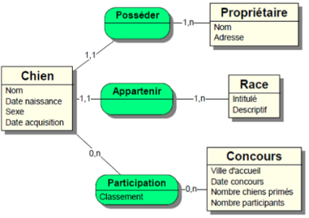

    1,n : 

    - 1 propriétaire peut avoir n chiens
    - 1 race peut avoir n chiens

    **Modèle logique de données (MLD)**

    - PROPRIO = (idProprio, Nom, Adresse)
    - RACE = (idRace, intitule, description)
    - CONCOURS = (idConcours, ville, dates, nbPrimes, nbParticipants)
    - CHIEN = (idChien, #idProprio, #idRace, nom, date naissance, sexe, date acquis)
    - PARTICIPATION = (#idChien, #idConcours, classement)

    1 Donner le MPD (modèle physique de données)  

    **Aide** : vous pouvez vous aider de <https://dbdiagram.io/>  

    2 Créez la base de données et les tables décrites ci-dessus.

    **Aide** : si vous créez la base de données à partir de l’import de ce qui a été fait sur <https://dbdiagram.io/>, la création de clés étrangères de fonctionne pas sur sqlite avec la même syntaxe que dans mysql. Il faudra donc créer les clés étrangères en modifiant chacune des tables dans l’onglet structure de la base de données. 

    Les tables contiennent les données suivantes :

    - Base RACE :
    ```sql
    INSERT INTO `RACE` VALUES
    (1,"labrador", "blablabla"),
    (2,"carlin", "blablabla"),
    (3,"husky", "blablabla"),
    (4,"beagle", "blablabla"),
    (5,"bulldog", "blablabla");
    ```

    Base PROPRIO :
    ```sql
    INSERT INTO `PROPRIO` VALUES
    (1,"Nathan Barber", 'Place des Peupliers 3'),
    (2,"Scott Villarreal",'La condemène 78'),
    (3,"John Harris",'Rue du Général-Comman 26'),
    (4,"Oscar Paul",'Rue de la Scierie 1'),
    (5,"Merritt Garcia",'Rue de Condémines 22'),
    (6,"Marshall Mccoy",'Promenade des Pêcheurs 6'),
    (7,"Marsden Todd",'Av. Alsace Lorraine 20'),
    (8,"Alfonso Fuentes",'Vieille Rue 2'),
    (9,"Fritz Dennis",'Route de Varandin 9'),
    (10,"Tucker Patton", 'Route de Montancy 332');
    ```

    Base CHIEN :
    ```sql
    INSERT INTO `chiens` VALUES
    (1,1,3,"Brianna","2019-01-30","F","2019-06-26"),
    (2,3,1,"Hoyt","2019-02-12","M","2019-07-11"),
    (3,2,3,"Wendy","2019-02-17","F","2019-07-13"),
    (4,4,2,"Kelsie","2019-03-12","F","2019-07-13"),
    (5,4,4,"Jonas","2019-04-23","M","2019-08-10"),
    (6,10,2,"Yuri","2019-05-22","M","2019-08-18"),
    (7,5,1,"Indigo","2019-06-16","M","2019-08-19"),
    (8,8,5,"Kimberley","2019-06-16","F","2019-08-28"),
    (9,7,3,"Avye","2019-06-16","F","2017-01-30"),
    (10,1,5,"Bianca","2019-06-26","F","2018-01-30");
    ```

    Base Concours :
    ```sql
    INSERT INTO `concours` VALUES
    (1,"Paris","2019-01-30",20,3),
    (2,"Brest","2019-02-12",32,5),
    (3,"Le Mans","2019-02-17",19,2),
    (4,"Poitiers","2019-03-12",55,6),
    (5,"Paris","2019-04-23",88,5),
    (6,"Grenoble","2019-05-22",28,2),
    (7,"Lyon","2019-06-16",44,5),
    (8,"Nantes","2019-06-16",39,4);
    ```

    Base PARTICIPATION :
    ```sql


    INSERT INTO `inscriptions` VALUES
    (1,1, 0),(1,2, 2),(1,4, 0),(1,5, 1),(2,1, 3),(2,3, 1),(2,5, 2),(3,1, 0),(3,6, 3),(3,2, 0),(3,8, 2),
    (3,7, 0),(4,7, 0),(4,8, 2),(4,6, 0),(4,5, 3),(8,3, 0),(6,1, 0),(6,3, 0),(6,4, 3),(6,6, 0),(6,8, 2),
    (10,2, 2),(10,4, 3);
    ```

    Contenu la base de données :

    |**propriétaire**|**nom**|**race**|**sexe**|**naissance**|
    | - | - | - | :-: | - |
    |Alfonso Fuentes|Kimberley|bulldog|F|2019-06-16|
    |John Harris|Hoyt|labrador|M|2019-02-12|
    |Marsden Todd|Avye|husky|F|2019-06-16|
    |Merritt Garcia|Indigo|labrador|M|2019-06-16|
    |Nathan Barber|Bianca|bulldog|F|2019-06-26|
    |Nathan Barber|Brianna|husky|F|2019-01-30|
    |Oscar Paul|Jonas|beagle|M|2019-04-23|
    |Oscar Paul|Kelsie|carlin|F|2019-03-12|
    |Scott Villarreal|Wendy|husky|F|2019-02-17|
    |Tucker Patton|Yuri|carlin|M|2019-05-22|

    Avec des commandes SQL :

    3 Reconstituer la base de données (faire apparaitre le tableau ci-dessus)
    4 Rechercher les nombres de chiens 

    Pour aller plus loin on peut trouver le nombre de chien par race en rajoutant la commande : group by CHIEN.idRace en ayant fait une jointure avec la table RACE.

    5 Rechercher les nombres de femelles 

    De même on peut le regrouper par race.

    6 Rechercher les chiens mâles âgés de plus de 1 an ; nous considérons que nous sommes le 15 septembre 2020.
    7 Rechercher les propriétaires des chiens de race husky.
    8 Rechercher les propriétaires et le nom des chiens qui ont été primés à un concours (classement différent de zéro).
    9 Rechercher les propriétaires et le nom des chiens qui ont terminés 1er à un concours.
    10 Rechercher les chiens qui n’ont jamais participé à un concours (utiliser not in).

!!! abstract "**Projet 3 : Le cycle de colloques**"

    On désire informatiser l'organisation d'un cycle de colloques universitaires.

    - Les différents **colloques** se déroulent dans des universités différentes à des dates différentes et sont organisés par une personne différente à chaque fois. Chaque **colloque** a un **nom spécifique** et est constitué d'un ensemble d'**exposés**. L'université dans laquelle il a lieu et la date sont aussi fixées.
    - Chaque **exposé** est identifié par un **titre**. Il est accompagné d'un **résumé**. Le même exposé peut être présenté dans plusieurs colloques.
    - Un **exposé** est présenté par un seul **conférencier** dans un **colloque**. Par contre, un **conférencier** peut faire plusieurs **exposés**. Un **conférencier** peut aussi être un **organisateur** de colloque.
    - On souhaite garder la trace des participants à ces colloques (qui peuvent aussi être conférenciers et/ou organisateurs). Chaque **participant** est identifié par un numéro et décrit par son **nom**, son **prénom** et son **email**.

    La liste des conférences est indiquée ci-dessous :

    |**Titre du colloque**|**date**|**université**|**Titre de l’exposé**|**speaker**|
    | - | - | - | - | - |
    |La génomique, 15 ans après le séquençage|2017-11-06|Université de Lausanne|Les extrémophiles|Ochon|
    |La génomique, 15 ans après le séquençage|2017-11-06|Université de Lausanne|Les labos P4|Fonfec|
    |Les végétaux revisités|2019-03-20|Université Paris-Dauphine|La vie sous les océans|Ochon|
    |Les végétaux revisités|2019-03-20|Université Paris-Dauphine|Les êtres symbiotiques|Darc|
    |Microbes et interactions|2018-12-05|Université Joseph Fourier|Ebola forever|Ochon|
    |Microbes et interactions|2018-12-05|Université Joseph Fourier|Vie et mort d'un virus|Chaud|
    |Nourrir l'Humanité|2018-06-11|ESPCI|Champignons et microbes|Camé|
    |Nourrir l'Humanité|2018-06-11|ESPCI|La vie sur Mars|Sud|
    |SVT : former le citoyen du XXIème siècle|2019-01-31|Université Marie Curie|Le microbe rampant|Chaud|
    |SVT : former le citoyen du XXIème siècle|2019-01-31|Université Marie Curie|Les formes de vie évoluées|Gross|

    Base participant :
    ```sql
    INSERT INTO `participant` VALUES
    (NULL, 'Ochon', 'Paul', "dictum@ornareFuscemollis.ca"),
    (NULL, 'Chaud', 'Arti', "Curabitur.egestas.nunc@luctusetultrices.ca"),
    (NULL, 'Gross', 'Jean', "blandit.Nam@ipsumCurabiturconsequat.com"),
    (NULL, 'Fonfec', 'Sophie', "lorem@posuere.net"),
    (NULL, 'Camé', 'Léon', "odio@ligula.co.uk"),
    (NULL, 'Darc', 'Jeanne', "nec.enim.Nunc@tellusAenean.com"),
    (NULL, 'Sapin', 'Noëlle', "dui.Fusce.diam@Fuscefermentumfermentum.org"),
    (NULL, 'Sud', 'Paul', "nunc.nulla.vulputate@ideratEtiam.com"),
    (NULL, 'Maillard', 'Colin', "feugiat.metus@quis.net"),
    (NULL, 'Nord', 'Paul', "non.leo.Vivamus@tortor.co.uk");
    ```

    Base colloques :
    ```sql
    INSERT INTO `colloques` VALUES
    (NULL, 2, "SVT : former le citoyen du XXIème siècle", "Université Marie Curie", "2019-01-31"),
    (NULL, 1, "Microbes et interactions", "Université Joseph Fourier", "2018-12-05"),
    (NULL, 2, "La génomique, 15 ans après le séquençage du génome", "Université de Lausanne", "2017-11-06"),
    (NULL, 5, "Les végétaux revisités", "Université Paris-Dauphine", "2019-03-20"),
    (NULL, 2, "Nourrir l'Humanité", "ESPCI", "2018-06-11");
    ```

    Base exposes :
    ```sql
    INSERT INTO `exposes` VALUES
    (NULL, 2, "Le microbe rampant", "blablabla..."),
    (NULL, 3, "Les formes de vie évoluées", "blablabla..."),
    (NULL, 2, "Vie et mort d'un virus", "blablabla..."),
    (NULL, 1, "Ebola forever", "blablabla..."),
    (NULL, 4, "Les labos P4", "blablabla..."),
    (NULL, 1, "Les extrèmophiles", "blablabla..."),
    (NULL, 1, "La vie sous les océans", "blablabla..."),
    (NULL, 6, "Les êtres symbiotiques", "blablabla..."),
    (NULL, 5, "Champignons et microbes", "blablabla..."),
    (NULL, 8, "La vie sur Mars", "blablabla...");
    ```

    Base organisations (lien entre colloque et participant)
    ```sql
    INSERT INTO `organisations` VALUES
    (1, 2),
    (2, 1),
    (3, 2),
    (4, 5),
    (5, 2);
    ```

    Base inscriptions (lien entre participant et exposes)
    ```sql
    INSERT INTO `inscriptions` VALUES
    (1, 1),(10, 2),(2, 7),(8, 10),(5, 3),(6, 8),(9, 4),(1, 2),(7, 10),(6, 4),(4, 9),(10, 5),(3, 6),(2, 3),
    (7, 1),(5, 4),(9, 7),(10, 10),(6, 9),(7, 8),(1, 4),(4, 6),(9, 5),(10, 3),(7, 9),(1, 5),(8, 5),(6, 10),
    (9, 2);
    ```

    Base presentations (lien entre exposes et colloques)
    ```sql
    INSERT INTO `presentations` VALUES
    (1, 1),(2, 1),(3, 2),(4, 2),(5, 3),(6, 3),(7, 4),(8, 4),(9, 5),(10, 5);
    ```

    1 Donner le MPD (modèle physique de données)  

    **Aide** : vous pouvez vous aider de <https://dbdiagram.io/>  

    Avec des commandes SQL :

    2 Reconstituer la base de données

       Faire apparaitre le tableau ci-dessus
       
    3 Qui (nom et prénom) organise le colloque Nourrir l'Humanité ?
    4 Quels sont les titres des exposés du colloque Nourrir l'Humanité ?
    5 Combien d'exposés sont présentés par Jeanne Darc ?
    6 Combien de personnes sont inscrites au(x) colloque(s) de l'Université Joseph Fourier ?
    7 Qui est à la fois organisateur et speaker ?

!!! abstract "**Projet 4 : PHP et SQL**"


    **Étape 1 :** Installer un serveur en local et portable 

    Nous utiliserons : UwAmp  pour ce TP

    - Le télécharger [ici ](https://www.uwamp.com/fr/?page=download).
    - Le décompresser sur une clé USB (ou dans vos documents de votre session)
    - Le lancer


    { width=80%; : .center }


    { width=80%; : .center }


    **Étape 2 : Création d’une base de données**

    Ouvrir SQLite et créer une base dont le nom est **MaBase et enregistrer la dans le dossier** www  de UwAmp

    On entre dans le vif du sujet : Supposons que je sois un collectionneur de BD et que je souhaite les répertorier dans une base de données (ce n’est qu’un exemple, on peut imaginer une inscription à un site ou la mise en ligne d’objets à vendre..)

    Comment répertorier ces BD : Le genre, l’auteur, l’année de publication, le nombre de tome, le titre, un commentaire.. 

    Donc nous allons créer cette table avec 7 colonnes, dans cette base de données le premier champ id nous servira à identifier de façon unique un enregistrement (il sera auto-incrémenté).

    **Faites le : En donnant à la table le nom BD et exécuter**

    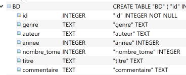{ width=80%; : .center }

    **Ajouter**

    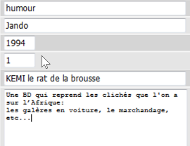{ width=50%; : .center }


    **Réaliser quelques autres enregistrements1**

    C’est déjà pas mal, mais ce serait mieux si on pouvait faire la même chose à partir d’un formulaire** 


    **Étape 3 : Mise en place de l’espace de travail**

    Il faut télécharger le dossier PHP - BDD.zip (dans le dossier Ressources) et le décompresser dans le dossier www  de UwAmp

    Il contient : 3 fichiers

    { width=80%; : .center }

    **Ouvrez ce dossier avec VisualStudio**

    **Le fichier fonctions.php** (il n’y a rien à modifier dans ce script sauf si votre base a un autre nom…)

    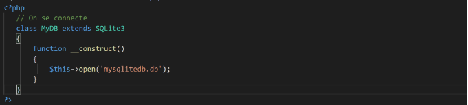{ width=80%; : .center }

    Contient le script de connexion à la base ``MaBase``


    **Le fichier form.php**

    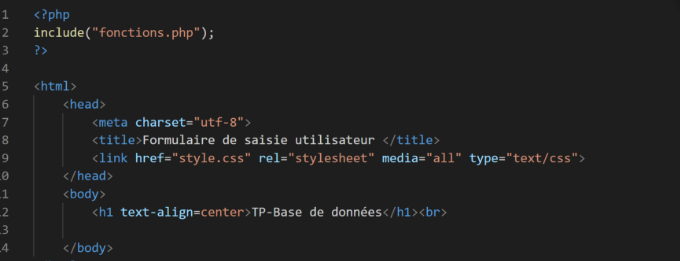{ width=80%; : .center }

    Pour l’instant c’est une page web classique, avec au début l’inclusion du fichier fonctions.php qui permet de se connecter à la base

    **Le fichier style.css**

    { width=30%; : .center }

    Une feuille de style classique

    - Cliquez droit sur l’icône de UwWamp et cliquez sur Navigateur www
    - Dans Virtual Host, cliquez sur le dossier PHP - BDD


    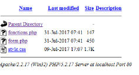{ width=40%; : .center }

    Si maintenant vous cliquez sur form.php vous verrez s’afficher une page web (très basique)

    **Étape 4 : Nous allons maintenant fabriquer un formulaire qui permettra via une requête d’alimenter notre base avec de nouveaux enregistrements.** 

    Complétez le fichier form.php comme suit (avec VisualStudio) 

    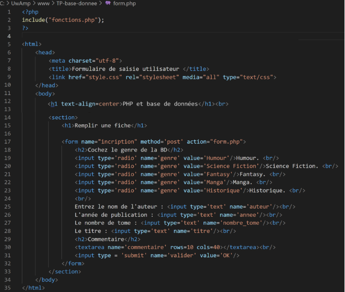{ width=80%; : .center }

    Vérifiez que le formulaire s’affiche bien :


    { width=80%; : .center }

    Nous allons écrire le script php qui permet d’enregistrer la fiche dans la base de données. 

    Compléter la suite **du fichier form.php** comme suit

    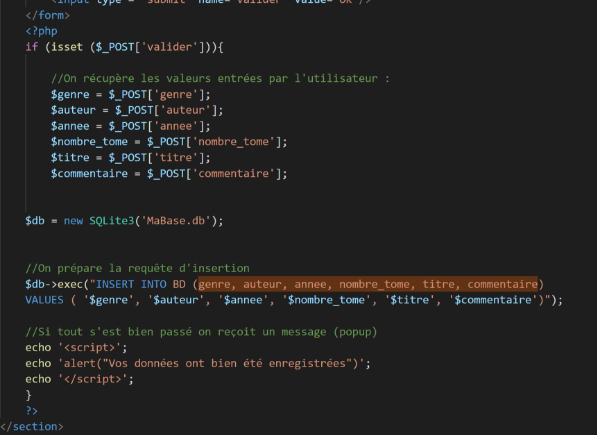{ width=80%; : .center }

    Quelques remarques :

    - En php, une ligne de commentaire se signale avec un double slash (comme en java)
    - Ce script n’est lancé que si l’on a cliqué sur le bouton ‘OK’ ( if(…))
    - Attention à la syntaxe 

    Pour cette requête il faut bien respecter l’ordre des champs de votre base de données.

    - Les champs sont séparés par des virgules
    - '$nom\_de\_la\_variable.' la variable est donc entre quotes.
    - Réalisez plusieurs enregistrements, et vérifiez dans SQLite qu’ils y sont bien…

    **Étape 5 :** Nous allons faire afficher le contenu de la table BD dans une page web

    Dans Visualstudio dans le dossier PHP - BDD, créer un nouveau fichier sous le **nom de infos.php**


    Copiez coller ce qu’il faut depuis form.php pour obtenir :

    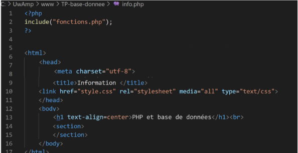{ width=80%; : .center }

    Voilà dans le script à insérer au bon endroit :

    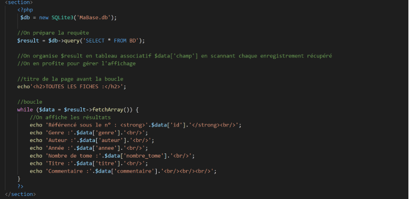{ width=80%; : .center }

    Lancez la page infos.php depuis Navigateur www, vos enregistrements apparaissent…

    **Étape 6 :** Nous allons faire afficher tout ce qui concerne un auteur…

    Créer un nouveau fichier sous le nom de selection.php Copiez et Collez le code ci-dessous **dans selection.php**
    ```html
    <?php include("fonctions.php");
    ?>
    <html>
        <head>
            <meta charset="utf-8">
            <title>Informations </title>
            <link href="style.css" rel="stylesheet" media="all" type="text/css">
        </head>
        <body>
            <h1 text-align=center>PHP et base de données</h1><br>
            <section>
                <?php
                $db = new SQLite3('MaBase.db');
        
                // On prépare la requête qui va mettre dans un tableau tout ce qui concerne l’auteur Jando
                $req = $db->query('SELECT * FROM BD WHERE auteur="Jando"');

                //on organise $req en tableau associatif $data['champ']
                //en scannant chaque enregistrement récupéré
                //on en profite pour gérer l'affichage
                //titre de la section avant la boucle echo'<h2>Fiche de : Jando </h2>';

                //boucle
                while ($data = $req->fetchArray()) {
                // on affiche les résultats
                echo 'Titre :<strong>'.$data['titre'].'</strong><br/>';
                echo 'Référencé sous le n° : <strong>'.$data['id'].'</strong><br/>'; 
                echo 'Genre :'.$data['genre'].'<br/>';
                echo 'Année :'.$data['annee'].'<br/>';
                echo 'Nombre de tome :'.$data['nombre_tome'].'<br/>';
                echo 'Commentaire :'.$data['commentaire'].'<br/><br/><br/>';
                }

                ?>
            </section>
        </body>
    </html>
    ```


    **Étape 7 :** Dans une nouvelle page nous allons faire afficher des 

    enregistrements suivant des critères


    Créer un nouveau fichier sous le **nom recherche.php** et copiez-collez 

    ce qu’il faut pour…


    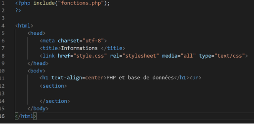{ width=80%; : .center }

    |Faites la même chose pour un autre auteur. Si il y a plusieurs entrées pour le même auteur, il faut bien entendu que son nom soit écrit de la même manière, pour que les titres apparaissent…|
    ||
    |Faites des essais en enregistrant plusieurs titres d’un même auteur.|


    Je vous donne le code à copier et coller entre les balises <section> ..</section>

    ```html
    <h2>Choisissez le champ qui vous intéresse et entrez manuellement un critère</h2>
    <h4>Une absence de critères vous montre toutes les données du champ</h4>

    <!--
    Commentaires HTML
    On construit une liste déroulante ( un select et plusieurs options)
    Chaque option sera remplie par une donnée SQL récupérée par notre requête PHP
    -->

    <form method="post" action="recherche.php">
    <select name="champ">

    <?php

    //On se connecte à la base
    $db = new SQLite3('MaBase.db');

    //On lance la requête SQL qui récupère les noms des colonnes (champs)
    $res = $db->query("PRAGMA table_info(BD)");

    //On scanne le résultat et on construit chaque option avec while
    while ($row = $res->fetchArray(SQLITE3_NUM)) {
        echo '<option value ='.$row[1].'>'.$row[1].'</option>' ;
    }

    //On ferme le select
    ?>
    </select>
    Entrez votre critère de sélection sur ce champ : 
    <input type="text" name="critere"/>
    <input type="submit" name="Valider" value="OK"/>
    </form>

    <!--
    On ferme le formulaire
    -->

    <?php
    //On traite le formulaire 
    if(isset($_POST['Valider'])){
        $champ=$_POST['champ'];
        $critere=$_POST['critere'];

        // On prépare la requête
        //requête différente selon qu'on veut tout le champ
        //ou un champ avec une condition 
        if(($critere=='')||($critere==NULL)){
            $sql = $db->query("SELECT * FROM BD");
        }
        else{
            $sql = $db->query("SELECT * FROM BD WHERE $champ = '$critere'");
            
        }
        
        //Affichage du résultat 
        echo'<h2>Résultat</h2>';
        

        while ($data = $sql->fetchArray()) {
        // on affiche les résultats
        echo 'Titre :<strong>'.$data['titre'].'</strong><br/>';
        echo 'Référencé sous le n° : <strong>'.$data['id'].'</strong><br/>'; 
        echo 'Genre :'.$data['genre'].'<br/>';
        echo 'Année :'.$data['annee'].'<br/>';
        echo 'Nombre de tome :'.$data['nombre_tome'].'<br/>';
        echo 'Commentaire :'.$data['commentaire'].'<br/><br/><br/>';
        }
    } 

    $db->close();
    ?>
    ```

    Testez cette page…

    **Étape 8 :** Il ne reste plus qu’à construire une page index. html qui appelle ces différentes pages en php…

    Ce que je vous laisse faire

    **Conclusion :** Ce TP n’est qu’une approche de ce que l’on peut réaliser en Php avec une base de données.

    Il existe sur internet beaucoup de tutoriel sur ce sujet plus ou moins abordable suivant vos connaissances (ce TP vous donne déjà une première approche) .

    Je me suis moi-même inspiré des tutoriels sur : **https://php.developpez.com/cours/**


