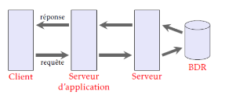

**Table des matières**

[1.	Les grands principes	](#_toc144548611)

[2.	Les principaux SGBD	](#_toc144548612)

[3.	Architecture	](#_toc144548615)

[4.	Utilisation de DB Browser SQLite : création d’une base	](#_toc144548616)

**Compétences évaluables :**

- Identifier les services rendus par un système de gestion de bases de données relationnelles : persistance des données, gestion des accès concurrents, efficacité de traitement des requêtes, sécurisation des accès

## <H2 STYLE="COLOR:BLUE;">**1. Les grands principes**</H2>
Les SGBD (**système de gestion de base de données** ) permettent la **lecture**, **l’écriture** ou la **modification** des informations mais aussi de **gérer les autorisations d’accès** à une base de données. Ce groupe de quatre opérations étant souvent appelé "CRUD", pour Create, Read, Update, Delete.

Les fichiers de bases de données sont stockés dans des disques durs de serveurs qui peuvent subir des pannes. Elles sont donc dupliquées et ce sont aussi les SGBD qui assurent la **maintenance des différentes copies** de la base de données.

Plusieurs personnes peuvent avoir besoin d’accéder aux informations contenues dans une base de données en même temps cela peut parfois poser un problème surtout si les deux utilisateurs désirent modifiés la même donnée au même moment : on parle alors d’**accès concurrents**. Ces problèmes d’accès concurrents sont aussi gérés par les SGBD.

## <H2 STYLE="COLOR:BLUE;">**2. Les principaux SGBD**</H2>
### <H3 STYLE="COLOR:GREEN;">**2.1. Introduction**</H3>
Comme il existe différents types de bases de données, il existe **différents types de systèmes de gestion de bases de données**. 

Parmi les plus connus, on peut citer Oracle, Postgressql, Mysql, MariaDB, Cassandra, SQL Server, Firebird,…

{ width=50%; : .center }

Il existe des **sgbd libre** comme PostgreSQL, MySQL ou MariaDB. Les gratuites mais avec un code fermé et une **licence propriétaire** sont SQLite ou Redis. Les payantes et propriétaires sont Oracle, SQL Server, SyBase.

Toutes les sgbd ont leurs caractéristiques, leurs **avantages** et leurs **inconvénients**. Par exemple Oracle bien que payant peut gérer d’énormes bases de données. PostgreSQL, gratuit, permet de gérer des bases de données assez importantes avec une qualité professionnelle. 

### <H3 STYLE="COLOR:GREEN;">**2.2. SGBDR**</H3>
Les **sgbd relationnels** ou SGBDR sont de loin le type de système le plus couramment utilisé dans le monde lorsqu’on parle de base de données.

Pour interagir avec un SGBDR on utilise un **langage appelé SQL** (**structured query language**). Ce langage permet **d’ajouter**, **modifier** ou **supprimer** des données mais aussi **d’interroger** la base de données selon certains critères et faire des recoupements d’informations en suivant les relations entre les tables.

Elles ont été mises au point en 1970 par **Edgar Codd** basé sur la théorie des ensembles. **Tous les SGBDR utilise le langage SQL**. Bien que le langage soit normalisé, presque tous les SGBD **ont des syntaxes légèrement différentes**.

## <H2 STYLE="COLOR:BLUE;">**3. Architecture**</H2>

{ width=50%; : .center }

Sur un réseau informatique, des informations sont en permanence échangées entre deux machines, un logiciel assurant le traitement des informations sur chacune d'entre elles.

On distingue le **logiciel client** installé sur la machine qui **envoie des requêtes** et le **logiciel serveur** installé sur la machine qui **traite les requêtes**.

Ce mode de communication est appelé **architecture à deux niveaux**. C'est l'une des architectures client-serveur possibles.

{ width=50%; : .center }

**L'architecture trois-tiers** est une architecture client-serveur qui ajoute un **niveau supplémentaire** dans l'environnement précédemment décrit.

Un serveur de données **transmet les informations à un serveur d'application** qui, à son tour, transmet les informations traitées vers un client.

Ce modèle d'architecture présente plusieurs avantages :

- meilleure prise en compte de **l'hétérogénéité des plates-formes** ;
- amélioration de la **sécurité des données** en supprimant le lien entre le client et les données ;
- meilleure **répartition des tâches** entre les différentes couches logicielles.

## <H2 STYLE="COLOR:BLUE;">**4. Utilisation de DB Browser SQLite : création d’une base**</H2>
{ width=50%; : .center }

Créer une nouvelle base de données appelée Base\_Film  dans Documents\BD

La première table sera realisateur

{ width=50%; : .center }

Ajouter les champs : 

- id\_realisateur de type entier, non nul (NN), ce sera une clé primaire (CP), incrémentation automatique (IA), unique (U)

{ width=50%; : .center }

- nom\_realisateur en TEXT , NN 

Créer une deuxième table film

- id\_film de type entier, NN, CP, IA, U
- titre\_film de type TEXT , NN
- annee\_film de type entier, NN
- id\_realisateur\_film de type entier, NN, c’est une clé étrangère de la relation realisateur et il correspond à id\_realisateur
- nationalite\_film et genre\_film de type varchar , NN

Cliquer sur l’onglet parcourir les données pour voir le contenu des tables une fois remplies avec l’icône nouvel enregistrement

{ width=50%; : .center }

On va enregistrer en 1 Lurnet dans la table realisateur

On va enregistrer dans la table film:

- Le Crime de l’Orient-Express’
- Sortie en 1974
- Id\_realisateur\_film : 1
- Nationalite\_film : Etats-Unis
- Genre\_film : policier 

Pour chaque attribut d’une relation, il est nécessaire de définir un **domaine**. Le domaine d’un attribut donné correspond à un ensemble de données finie ou infinies de **données admissibles.** 
