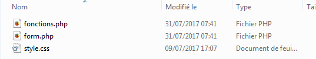
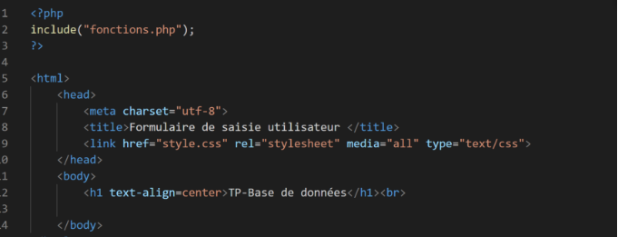

**Table des matières**

[1.	Introduction](#_toc173365561)

[2.	Création d’une base de données](#_toc173365560)

[3.	Insertion de données](#_toc173365563)

[4.	Interrogation de la base de données	](#_toc173365566)

[5.	Requête de mise à jour	](#_toc173365577)

[6.	Jointures de tables	](#_toc173365583)

[7.	Exercices	](#_toc173365587)

[8.	Projet (démarche d’investigation)	](#_toc173365588)


**Compétences évaluables :**

- Identifier les composants d’une requête
- Construire des requêtes d’interrogation à l’aide des clauses du langages SQL : SELECT, FROM, WHERE, JOIN.
- Construire des requêtes d’insertion et de mise à jour à l’aide de : UPDATE, INSERT, DELETE.


## <a name="_toc173365561"></a>**1. Introduction**

Pour réaliser des requêtes il faut apprendre le **SQL (Structured Query Language)**. SQL est propre aux bases de données relationnelle. Les autres types de bases de données utilisent d’autres langages pour effectuer des requêtes.

Le langage SQL permet de gérer la **création**, la **destruction**, la **modification** de structure d’une relation, **d’insérer**, de **supprimer**, de **modifier** les t-uplets contenus dans une table, **d’interroger** la base, de **lister** les t-uplets en fonction de critère conditionnelle.


Dans le logiciel utiliser précédemment, lorsqu’on crée une base de données on voit que le logiciel code en bas de la fenêtre une inscription correspondant en fait à la même information en langage SQL. 

- Pour **créer une table** 

- Pour **insérer des données dans une table** 

- Pour **supprimer une table** 

- Pour **modifier des colonnes pour en ajouter** 


## <a name="_toc173365560"></a>**2. Création d’une base de données**
### <a name="_toc173365561"></a>**2.1. Création**
**Activité n° 1 : Création de la base** Créer la base de données film.db que l’on enregistre dans votre dossier DOCUMENTS


Dans l’onglet exécuter le SQL :

{ width=50%; : .center }

On peut alors taper le code.

**Activité n° 2 : Création d’une table** 
```sql
CREATE TABLE realisateur
```

On met la liste des champs en langage SQL entre parenthèses et on met **un point-virgule** à la fin pour pouvoir enchainer les requêtes éventuellement.

**Activité n° 3 : Création des différents champs**
```sql
CREATE TABLE "realisateur" (
"id_realisateur"	INT NOT NULL UNIQUE,
"nom_realisateur"	VARCHAR(255) NOT NULL,
"prenom_realisateur"	VARCHAR(255) NOT NULL,
"date_naissance_realisateur"	date,
"nationalite_realisateur" VARCHAR(255),
PRIMARY KEY("id_realisateur" AUTOINCREMENT)
);
```
{ width=30%; : .center }

On peut exécuter la requête avec l’icône exécuter

{ width=50%; : .center }

Vérifier que la table a bien été créée dans l’onglet structure de la base de données
 


### <a name="_toc173365562"></a>**2.2. Suppression**

**Activité n° 4 : Création de table :** Création de la table film
```sql
CREATE TABLE film (
id_film INT NOT NULL,
titre_film VARCHAR(255) NOT NULL
);
```

{ width=30%; : .center }

On note que les **guillemets sont optionnels**. Vérifier que la table a bien été créée.
 

**Activité n° 5 : Supprimer une table.** Pour supprimer cette table, dans une nouvelle fenêtre SQL, on lance la requête :
```sql
DROP TABLE film ;
```
Vérifier que la table film a bien disparu.
 

**Activité n° 6 : Création de table :** Création de la véritable table film
```sql
CREATE TABLE film
(
id_film INT NOT NULL,
titre_film VARCHAR(255) NOT NULL,
annee_film date,
id_realisateur_film INT NOT NULL,
nationalite_film VARCHAR(255) NOT NULL,
genre_film VARCHAR(255) NOT NULL,
PRIMARY KEY (id_film AUTOINCREMENT),
FOREIGN KEY (id_realisateur_film)
REFERENCES realisateur (id_realisateur)
);
```
{ width=30%; : .center } 

## <a name="_toc173365563"></a>**3. Insertion de données**
### <a name="_toc173365564"></a>**3.1. Insertion**

{ width=50%; : .center }

Pour interroger la base de données pour récupérer des informations correspondant à des critères prédéfinis 

- il faut utiliser le mot clé **SELECT** en précisant le nom prdes champs que l’on souhaite affiché,
- il faut préciser sur quelle table on va faire cette interrogation avec le mot clé **FROM**, 
- puis préciser les conditions avec lesquelles nous souhaitons récupérer ses champs ce sont des conditions booléennes, 
- enfin il existe quelques options pour trier ces données ou afficher un nombre de conditions prédéterminées

Cliquer sur ouvrir un onglet


**Activité n° 7 : Insertion de données** On utilise le mot clé INSERT INTO le nom de la table, puis entre parenthèses le nom des champs. On note ensuite les valeurs entre parenthèses après le mot clé VALUES.
```sql
INSERT INTO realisateur
(nom_realisateur, prenom_realisateur, date_naissance_realisateur, nationalite_realisateur)
VALUES
('Abrams', 'Jeffrey Jacob', 1966-06-27, 'Etats-Unis'),
('Badham', 'John', 1939-08-25, 'Royaume-Uni'),
('Besson', 'Luc', 1959-03-18, 'France'),
('Branagh', 'Kenneth', 1960-12-10, 'Royaume-Uni'),
('Johnson', 'Rian', 1973-12-17, 'Etats-Unis'),
('Kershner', 'Irvin', 1923-04-29, 'Etats-Unis'),
('Lucas', 'George', 1944-05-14, 'Etats-Unis'),
('Marquand', 'Richard', 1937-09-22, 'Royaume-Uni'),
('Spielberg', 'Steven', 1946-12-18, 'Etats-Unis'),
('Tarantino', 'Quentin', 1963-03-27, 'Etats-Unis'),
('Lumet', 'Sydney', 1924-06-25, 'Etats-Unis')
;
```

Exécuter la requête et vérifier dans parcourir les données que l’enregistrement c’est bien fait


 
  

**Activité n° 8 : Insertion de données :** Insertion dans la table film, on écrit la requête suivante et on l’exécute :
```sql
INSERT INTO film
(titre_film, nationalite_film, genre_film)
VALUES
('StarWares', 'Etats-Unis', 'Science fiction');
```


La requête échoue car id\_realisateur\_film ne peut pas être nul. Donc on complète et on exécute :
```sql
INSERT INTO film
(titre_film, id_realisateur_film, nationalite_film, genre_film)
VALUES
('StarWars',44, 'Etats-Unis', 'Science fiction');
```

La requête échoue de nouveau maintenant c’est la clé étrangère id\_realisateur qui n’a pas été trouvé dans la table réalisateur. En effet, id\_realisateur 44 n’existe pas dans cette table
 

**Activité n° 9 : Insertion de données :** Insertion générale de la table film, insérer et exécuter :
```sql
INSERT INTO film
(titre_film, annee_film, id_realisateur_film, nationalite_film, genre_film)
VALUES
('Star Wars, épisode IV : Un nouvel espoir', 1977, 7, 'Etats-Unis', 'Science fiction'),
('Star Wars, épisode V : L''Empire contre_attaque', 1980, 6, 'Etats-Unis', 'Science fiction'),
('Star Wars, épisode VI : Le retour du Jedi', 1983, 8, 'Etats-Unis', 'Science fiction'),
('Star Wars, épisode I : La menace fantôme', 1999, 7, 'Etats-Unis', 'Science fiction'),
('Star Wars, épisode II : L''attaque des clones', 2002, 7, 'Etats-Unis', 'Science fiction'),
('Star Wars, épisode III : La Revanche des Sith', 2005, 7, 'Etats-Unis', 'Science fiction'),
('Star Wars, épisode VII : Le Réveil de la Force', 2015, 1, 'Etats-Unis', 'Science fiction'),
('Star Wars, épisode VIII : Les Derniers Jedi', 2017, 5, 'Etats-Unis', 'Science fiction'),
('Star Wars, épisode IX : L''ascension de Skywalker', 2018, 1, 'Etats-Unis', 'Science fiction'),
('Indiana Jones et les Aventuriers de l''arche perdue', 1981, 9, 'Etats-Unis', 'Aventure'),
('Indiana Jones et le Temple maudit', 1984, 9, 'Etats-Unis', 'Aventure'),
('WarGames', 1983, 2, 'Etats-Unis', 'Science fiction'),
('Le Cinquième Elément', 1997, 3, 'France', 'Science fiction'),
('Valérian et la cité des mille planètes', 2017, 3, 'France', 'Science fiction'),
('Léon', 1994, 3, 'France', 'Drame'),
('Anna', 2019, 3, 'France', 'Thriller'),
('Once Upon a Time in Hollywood', 2019, 10, 'Etats-Unis', 'Comédie dramatique'),
('Django Unchained', 2012, 10, 'Etats-Unis', 'Western'),
('Pulp Fiction', 1994, 10, 'Etats-Unis', 'Policier'),
('Mort sur le Nil', 2020, 4, 'Etats-Unis', 'Policier'),
('Le Crime de l''Orient-Express', 2017, 4, 'Royaume-Uni', 'Policier'),
('Thor', 2011, 4, 'Etats-Unis', 'Super-Heros'),
('Henry V', 1989, 4, 'Royaume-Uni', 'Film historique'),
('Le Crime de l''Orient-Express', 1974, 11, 'Royaume-Uni', 'Policier'),
('American Graffiti', 1973, 7, 'Etats-Unis', 'Comédie')
;
```
 

**Remarque** : La double quote pour les apostrophes

**Activité n° 10 :** Enregistrer dans vos DOCUMENTS 


 
### <a name="_toc173365565"></a>**3.2. Suppression**

**Activité n° 11 : Ajout et suppression d’une donnée** : Exécuter la requête suivante
```sql
INSERT INTO film
(titre_film, annee_film, id_realisateur_film, nationalite_film, genre_film)
VALUES
('Star Wars, épisode XXI : L''Espoir Ultime', 2040, 7, 'Etats-Unis', 'Science fiction')
```

Pour supprimer cet enregistrement qui sera au numéro 26 on va préciser la condition avec le mot-clé WHERE :
```sql
DELETE FROM film 
WHERE id_film  = 26 ;
```
Vérifier ensuite que le film a bien été supprimé
 
## <a name="_toc173365566"></a>**4. Interrogation de la base de données**
### <a name="_toc173365567"></a>**4.1. Affichage simple**

**Activité n° 12 : Affichage par numéro :** Faire afficher le titre, l’année et la nationalité d’un film en particulier connaissant son id :** Exécuter 
```sql
SELECT titre_film, annee_film, nationalite_film
FROM film
WHERE id_film = 14;
```
On voit qu’il s’affiche le film 14 avec les champs demandés
 

**Activité n° 13 : Affichage par intervalle de nombres:** Faire afficher l’id, le titre, l’année et la nationalité de plusieurs films en particulier **:** Exécuter 
```sql
SELECT id_film, titre_film, annee_film, nationalite_film
FROM film
WHERE id_film > 14;
```
On voit qu’il s’affiche les films dont l’id est supérieur 14 avec les champs demandés
 

**Activité n° 14 : Affichage par numéro :**  Faire afficher l’id, le titre, l’année et la nationalité d’un film en particulier connaissant son année **:** Exécuter 
```sql
SELECT id_film, titre_film, annee_film, nationalite_film
FROM film
WHERE annee_film = 2019;
```
On voit qu’il s’affiche le film sorti en 2019 avec les champs demandés
 

**Activité n° 15 : Affichage par intervalle de nombres :**  Faire afficher l’id, le titre, l’année et la nationalité de films avec des intervalles d’années :** Exécuter 
```sql
SELECT id_film, titre_film, annee_film, nationalite_film
FROM film
WHERE annee_film > 2010 AND annee_film < 2020;
```
On voit qu’il s’affiche les films sortis entre 2010 et 2020 avec les champs demandés
 
### <a name="_toc173365568"></a>**4.2. Affichage et tri ascendant**

 **Activité n° AUTONUM  \* Arabic : Affichage par intervalle de nombres trié avec un critère :**  Faire afficher l’id, le titre, l’année et la nationalité de films avec des intervalles d’années et triés par année : Exécuter SELECT id\_film, titre\_film, annee\_film, nationalite\_filmFROM filmWHERE annee\_film > 2010 AND annee\_film < 2020ORDER BY annee\_film;On voit qu’il s’affiche les films sortis entre 2010 et 2020 avec les champs demandés triés par année croissante.On peut rajouter si nécessaire ASC.
 
  
 **Activité n° AUTONUM  \* Arabic : Affichage par intervalle de nombres trié avec plusieurs critères :**  Faire afficher l’id, le titre, l’année et la nationalité de films avec des intervalles d’années et triés par année PUIS par ordre alphabétique de titre :** Exécuter SELECT id\_film, titre\_film, annee\_film, nationalite\_filmFROM filmWHERE annee\_film > 2010 AND annee\_film < 2020ORDER BY annee\_film, titre\_film;On voit qu’il s’affiche les films sortis entre 2010 et 2020 avec les champs demandés triés par année croissante. Pour les films de 2017, ils sont ensuite triés par ordre alphabétique de titre.
### <a name="_toc173365569"></a>**3.3. Affichage avec partie d’une chaine de caractère**

 **Activité n° AUTONUM  \* Arabic : Affichage par chaine de caractères :**  Faire afficher l’id, le titre, l’année et la nationalité de films avec un titre en particulier :** Exécuter SELECT id\_film, titre\_film, annee\_film, nationalite\_filmFROM filmWHERE titre\_film = 'WarGames';On voit qu’il s’affiche le film wargames. Par contre, il faut indiquer le titre exact.
 

 **Activité n° AUTONUM  \* Arabic : Affichage par morceau de chaine de caractères :**  Faire afficher l’id, le titre, l’année et la nationalité de films avec un titre comportant des mots en particulier :** Exécuter SELECT id\_film, titre\_film, annee\_film, nationalite\_filmFROM filmWHERE titre\_film LIKE 'Star Wars%';On voit qu’il s’affiche tous les films Star Wars. Le % permet d’indiquer où se trouve les caractères manquants. Ici on cherche tous les titres commençant exactement par Star Wars. On aurait pu noter %War% on aurait eu tous les films ayant dans leur nom les lettre War, donc les Star Wars et WarGames.On peut les triés par année de sortie en rajoutant ORDER BY annee\_film
 

### <a name="_toc173365570"></a>**3.4. Affichage avec une condition OU une autre**

 **Activité n° AUTONUM  \* Arabic : Affichage par deux conditions :**  Faire afficher l’id, le titre, l’année et la nationalité de films avec une année en particulier OU un genre :** Exécuter SELECT id\_film, titre\_film, annee\_film, nationalite\_filmFROM filmWHERE annee\_film = 2017 OR genre\_film = 'Science fiction';On voit qu’il s’affiche le film wargames. Par contre, il faut indiquer le titre exact. On peut évidement trier par exemple par id\_realisateur.
 

### <a name="_toc173365571"></a>**3.5. Affichage avec critère dans une liste**

 **Activité n° AUTONUM  \* Arabic : Affichage par plusieurs conditions :**  Faire afficher l’id, le titre, l’année et la nationalité de films avec plusieurs genres différents :** Exécuter SELECT id\_film, titre\_film, annee\_film, nationalite\_filmFROM filmWHERE genre\_film IN ('Science fiction', 'Policier');On voit qu’il s’affiche l’ensemble des films de science-fiction et les policiers
 

 **Activité n° AUTONUM  \* Arabic : Affichage sans plusieurs conditions :**  Faire afficher l’id, le titre, l’année et la nationalité de films SANS plusieurs genres différents :** Exécuter SELECT id\_film, titre\_film, annee\_film, nationalite\_filmFROM filmWHERE genre\_film NOT IN ('Science fiction', 'Policier');On voit qu’il s’affiche l’ensemble des films sauf ceux de science-fiction et les policiers
 

 **Activité n° AUTONUM  \* Arabic : Affichage sans plusieurs conditions avec un limite en nombre de sorties :**  Si le nombre de ligne est très important pour ne pas surcharger la mémoire de l’ordinateur : ExecuterSELECT id\_film, titre\_film, annee\_film, nationalite\_filmFROM filmWHERE genre\_film NOT IN ('Science fiction', 'Policier') LIMIT 5;On voit qu’il s’affiche la même liste que la précédente mais seulement les 5 premiers
 
### <a name="_toc173365572"></a>**3.6. Affichage et tri descendant**

 **Activité n° AUTONUM  \* Arabic : Affichage sans plusieurs conditions trié descendant :**  Pour trier la liste précédente par année de la plus proche à la plus lointaine : ExécuterSELECT id\_film, titre\_film, annee\_film, nationalite\_filmFROM filmWHERE genre\_film NOT IN ('Science fiction', 'Policier') ORDER BY annee\_film DESC;On voit qu’il s’affiche la liste de tous les films sauf ceux de science fichier et les policiers mais cette fois ci ils sont classés par année décroissante
 
### <a name="_toc173365573"></a>**3.7. Affichage avec concaténation de deux chaines de caractères**

 **Activité n° AUTONUM  \* Arabic : Affichage avec concaténation et nommage d’attribut:**  Afficher le prénom et le nom des réalisateur : Exécuter<a name="_hlk52903251"></a>SELECT prenom\_realisateur    ' '    nom\_realisateur AS Prenom\_NomFROM realisateur;On utilise les tubes :   . Le mot clé AS permet de donner un nom à la chaine concaténée : Prenom\_NomOn obtient tous les réalisateurs avec leur prénom et leur nom mais dans la même colonne 
 
### <a name="_toc173365574"></a>**3.8. Affichage avec deux requêtes**

 **Activité n° AUTONUM  \* Arabic : Affichage de morceau de chaine de caractères sur deux tables :**  Afficher la nationalité du réalisateur dont le nom commence par L ET la nationalité du (des) film commence par S : Exécuter<a name="_hlk52903623"></a>SELECT nationalite\_realisateur AS nationaliteFROM realisateurWHERE nom\_realisateur LIKE 'L%'UNIONSELECT nationalite\_film AS nationalite\_filmFROM filmWHERE titre\_film LIKE 'S%';Il s’agit de Lucas George qui est des états unis et les Star Wars sont des Etats-Unis d’où une seule ligne. Si on avec choisit les noms des réalisateurs qui commence par B on aurait eu en plus France et Royaume-Uni.
 

### <a name="_toc173365575"></a>**3.9. Affichage et comptage**

 **Activité n° AUTONUM  \* Arabic : Afficher et compter :**  Compter le nombre de réalisateurs : Exécuter<a name="_hlk52903830"></a>SELECT COUNT(id\_realisateur)FROM realisateur;Il y a bien 11 réalisateurs dans la table.
 

 [](Aspose.Words.898009d5-087d-4c87-b057-f20703a0b830.016.png)**Activité n° AUTONUM  \* Arabic : Afficher et compter :**  Compter le nombre de réalisateurs dont le nom commence par la lettre L : ExécuterSELECT COUNT(id\_realisateur)FROM realisateurWHERE nom\_realisateur LIKE ‘L%’ ;Il y en a 2 : Lumet et Lucas.
 

 **Activité n° AUTONUM  \* Arabic : Afficher, sommer :  Supposons que l’on ait une colonne** avec le nombre de films de chaque réalisateur avec un attribut …) si on veut faire la somme : SELECT SUM(….)FROM realisateur;On peut évidemment rajouter une condition avec le mot clé WHERE.
 
 **Activité n° AUTONUM  \* Arabic : Afficher, moyenne :**  De la même manière on peut vouloir faire la moyenne SELECT AVG(…)FROM realisateur;On peut aussi chercher le maximum ou le minimum avec les fonctions MAX et MIN.
### <a name="_toc173365576"></a>**3.10. Afficher tous les champs**

 **Activité n° AUTONUM  \* Arabic : Afficher tous les champs :**  Exécuter :SELECT \*FROM film;
 
## <a name="_toc173365577"></a>**4. Requête de mise à jour**
### <a name="_toc173365578"></a>**4.1. La syntaxe de la requête de mise à jour**
UPDATE avec le nom de la table sur lequel sera fait la mise à jour

SET pour préciser le ou les champs avec leur valeur

WHERE pour les conditions
### <a name="_toc173365579"></a>**4.2. Requête pour ajouter un attribut** 

 **Activité n° AUTONUM  \* Arabic : Ajouter un attribut à une table existante :**  Ajouter l’attribut nbfilms\_realisateur à la table realisateur. Exécuter<a name="_hlk52904091"></a>ALTER TABLE realisateurADD COLUMN nbfilms\_realisateur INTEGER;ALTER TABLE permet d’indiquer avec quelle table on va travailler.ADD COLUMN pour ajouter une colonneVérifier dans la table realisateur qu’il y a une colonne de plus. Par contre, la colonne est complètement nulle 
 

 **Activité n° AUTONUM  \* Arabic : Modifier une donnée d’une table :**  Transformer le nom de la nationalité de Lumet en Royaume-Uni. Exécuter<a name="_hlk52904175"></a>UPDATE realisateurSET nationalite\_realisateur = 'Royaume-Uni'WHERE nom\_realisateur = 'Lumet';UPDATE pour dire sur quelle table la mise à jour sera faiteSET permet de donner le champ et la valeur que l’on veut attribuer.Vérifier que la nationalité de Lumet a bien été modifié.On remodifie la nationalité :UPDATE realisateurSET nationalite\_realisateur = 'Etats-Unis'WHERE nom\_realisateur = 'Lumet';
 

 **Activité n° AUTONUM  \* Arabic : Ajouter des données d’une table :**  Ajouter le nombre de films à chaque réalisateur. ExécuterUPDATE realisateurSET nbfilms\_realisateur = 1WHERE nationalite\_realisateur = 'Etats-Unis';Tous les réalisateurs dont la nationalité est Etats-Unis ont un nombre de films égal à 1. Vérifier.
 
### <a name="_toc173365580"></a>**4.3. Requête de modification**

 **Activité n° AUTONUM  \* Arabic : Modifier plusieurs champs en même temps :**  Modifier le nombre de film et la nationalité du réalisateur. ExécuterUPDATE realisateurSET nbfilms\_realisateur = 2, nationalite\_realisateur = 'USA'WHERE nationalite\_realisateur = 'Etats-Unis';Les réalisateurs qui avaient pour nationalité Etats-Unis ont eu le nombre de films modifié et la nationalité aussi.Vérifier.
 

 ![ref1]**Activité n° AUTONUM  \* Arabic : Création de table :** Création de la table nationalitéCREATE TABLE nationalite (id\_nationalite INT NOT NULL,nom\_nationalite VARCHAR(255) NOT NUL,PRIMARY KEY ("id\_nationalite" AUTOINCREMENT));Vérifier que la table est créée.
 
### <a name="_toc173365581"></a>**4.4. Mise en place d’un id**

 **Activité n° AUTONUM  \* Arabic : Afficher :**  Afficher la nationalité des films : ExécuterSELECT nationalite\_filmFROM film;Il y a beaucoup de doublons !! Il faut les éliminer
 

 **Activité n° AUTONUM  \* Arabic : Afficher seulement ceux qui sont différents :**  Afficher les différentes nationalités des films : <a name="_hlk52904421"></a>SELECT DISTINCT nationalite\_filmFROM film;DISTINCT permet de n’afficher que les valeurs différentes. 
 

 **Activité n° AUTONUM  \* Arabic : Insertion de données extraites d’une table dans une autre** : Exécuter la requête suivante<a name="_hlk52904500"></a>INSERT INTO nationalite(nom\_nationalite)SELECT DISTINCT nationalite\_filmFROM film ;On met à jour la table nationalite avec les nationalités de la table film afin de pourvoir éliminer les doublons de la table film. Vérifier qu’il y a bien les trois nationalités dans la table nationalite.
 

 **Activité n° AUTONUM  \* Arabic : Ajouter un attribut à une table existante :**  Ajouter l’attribut id\_nationalite\_film à la table film. ALTER TABLE filmADD COLUMN id\_nationalite\_film INTEGER;
 


 **Activité n° AUTONUM  \* Arabic : Alimenter un attribut d’une table grace à une autre :**  Ajouter l’attribut id\_nationalite\_film à la table film. Exécuter<a name="_hlk52904639"></a>UPDATE filmSET id\_nationalite\_film = (SELECT id\_nationalite FROM nationalite WHERE film.nationalite\_film = nationalite.nom\_nationalite);On met à jour le champ id\_nationalite\_film de la table film avec la table nationalite. Après le SET id\_nationalite\_film il faut ensuite aller chercher le id\_nationalite de la table nationaliteLe SELECT permet d’aller chercher le id\_nationalite dans la table nationalite pour le mettre dans la table film. La condition sera de telle sorte que le nom de la nationalité correspond à la nationalité du film. Pour cela, on note film.\_\_\_  pour dire que l’on va chercher le champ dans la table film. Cette nationalité dans la table film doit être égale à la nationalité dans la table nationalité d’où le nationalite.\_\_\_\_Vérifier que l’id\_nationalite\_film de la table film est bien rempli.
 

 **Activité n° AUTONUM  \* Arabic : Supprimer un attribut :**  Il suffit à présent de supprimer l’attribut en trop. <a name="_hlk52904766"></a>ALTER TABLE filmDROP COLUMN nationalite\_film;
 
### <a name="_toc173365582"></a>**4.5. Mise en majuscule d’un attribut**

 **Activité n° AUTONUM  \* Arabic : Mise en majuscule d’un attribut :**  Modifier le nom du réalisateur en le passant en majuscule. <a name="_hlk52904885"></a>UPDATE realisateurSET nom\_realisateur = UPPER(nom\_realisateur)WHERE nationalite\_realisateur = 'USA';UPPER permet de mettre en majuscule le nom du champ. Donc on prend le nom\_realisateur on le met en majuscule et on le réaffecte à nom\_realisateur. On rajoute une condition sur la nationalité.On peut aussi seulement afficher un attribut en le mettant en majuscule, on écrira alors SELECT UPPER(champ) FROM nom\_table
 

 **Activité n° AUTONUM  \* Arabic : Mise en majuscule/minuscule d’un attribut :**  Modifier le nom du réalisateur en le passant première lettre en majuscule et le reste en minuscule. ExécuterUPDATE realisateurSET nom\_realisateur = UPPER(SUBSTR(nom\_realisateur, 1, 1))    LOWER(SUBSTR(nom\_realisateur,2));SUBSTR prend une partie de chaine. On prend le champ sur lequel on veut prendre une partie de chaine de caractère donc ici nom\_realisateur ; puis une virgule et le premier caractère concerné, le nombre de caractères concernés à partir du premier.Puis la concaténation des chaines avec les deux tubes permettra de passer le reste de la chaine en minuscule avec le mot clé LOWER et de nouveau SUBSTR pour prendre qu’une partie de la chaine de caractère c’est-à-dire à partir du deuxième caractère. Vérifier
 
## <a name="_toc173365583"></a>**5. Jointures de tables**
Les requêtes avec les jointures tiennent compte des liens qui unissent les tables via le schéma relationnel.
### <a name="_toc173365584"></a>**5.1. La syntaxe**
(INNER) JOIN va préciser les tables que l’on veut relier entre elles. Pour relier une table il faut préciser à partir de quel champ on va utiliser le lien : il s’agit essentiellement des clés primaires et des clés étrangères qui va faire le lien entre la table de départ et la table fille qui contient la clé étrangère.

(INNER) **n’est pas obligatoire**

### <a name="_toc173365585"></a>**5.2. Les grands principes**
Schéma relationnel : **Modèle physique de données (MPD)**


La table film est relié à trois autres tables via des clés étrangères. Lors d’une requête, on veut parfois afficher le nom du film et le nom du réalisateur ou le genre du film : il faut donc afficher des informations issues de une, deux, trois ou plusieurs tables qui sont liées entre elles. Il faut effectuer une jointure et préciser à l’aide des mots clés INNER JOIN ou JOIN à quelle table la table film doit être reliée.

 **Activité n° AUTONUM  \* Arabic : Mise à jour de la table pour correspondre au schéma relationnel :** On va créer la nouvelle table genre et la clé id\_genre\_film de la table film et la clé id\_nationalite\_realisateur de la table realisateur/\* modification de la table realisateur de nouveau \*/UPDATE realisateurSET nbfilms\_realisateur = 2, nationalite\_realisateur = 'Etats-Unis'WHERE nationalite\_realisateur = 'USA';![ref1]/\* création de la nouvelle table \*/CREATE TABLE genre (id\_genre INT NOT NULL,nom\_genre VARCHAR(255) NOT NULL,PRIMARY KEY ("id\_GENRE" AUTOINCREMENT));/\* insertion des différents genres dans la table genre \*/INSERT INTO genre (nom\_genre)SELECT DISTINCT genre\_filmFROM film;/\* Ajout de l'attribut id\_genre\_film à film \*/ALTER TABLE film ADD COLUMN id\_genre\_film INT;/\* compléter l'attribut id\_genre\_film avec les id de la table genre \*/UPDATE filmSET id\_genre\_film = (SELECT id\_genre FROM genre WHERE film.genre\_film = genre.nom\_genre);/\* 'effacer' l'attribut genre\_film de la table film \*/ALTER TABLE filmDROP COLUMN genre\_film; /\* Ajout de l'attribut id\_nationalite\_realisateur à realisateur \*/ALTER TABLE realisateur ADD COLUMN id\_nationalite\_realisateur INT;/\* compléter l'attribut id\_nationalite\_realisateur avec les id de la table nationalite \*/UPDATE realisateurSET id\_nationalite\_realisateur = (SELECT id\_nationalite FROM nationalite WHERE realisateur.nationalite\_realisateur = nationalite.nom\_nationalite);/\* 'effacer' l'attribut nationalite\_realisateur de la table realisateur \*/ALTER TABLE realisateurDROP COLUMN nationalite\_realisateur;/\* 'effacer' l'attribut nbfilms\_realisateur de la table realisateur \*/ALTER TABLE realisateurDROP COLUMN nbfilms\_realisateur;Vérifier qu’il y a bien trois clés étrangères dans la clé film : id\_realisateur\_film, id\_nationalite\_film et id\_genre\_film. Vérifier que la table genre est bien remplie.
 
### <a name="_toc173365586"></a>**5.3. Requêtes de sélection avec jointures**

 **Activité n° AUTONUM  \* Arabic : Faire afficher le titre du film avec son genre provenant de deux tables :**  ExécuterSELECT titre\_film, nom\_genre AS genre\_filmFROM filmJOIN genreON genre.id\_genre = film.id\_genre\_filmWHERE genre.nom\_genre = 'Science fiction';On sélectionne le titre du film qui provient de la table film et nom\_genre de la table genre mais que l’on renomme en genre\_film. Le nom\_genre provient de la table genre mais il est lié à la table film donc on va préciser le lien avec JOIN … ON… où on indique que la clé id\_genre de la table genre correspond à id\_genre\_film de la table film.La condition de cette requête est que le nom\_genre de la table genre correspond au film de science fictionOn obtient bien le nom des films avec leur genre qui proviennent de deux tables différentes.On peut évidemment trié l’affichage avec ORDER BY …
 

 **Activité n° AUTONUM  \* Arabic : Faire afficher le titre du film avec son genre et la nationalité du film provenant de trois tables :**SELECT titre\_film, nom\_genre AS genre\_film, nom\_nationalite as nationalite\_filmFROM filmJOIN genreON genre.id\_genre = film.id\_genre\_filmJOIN nationaliteON nationalite.id\_nationalite = film.id\_nationalite\_filmWHERE genre.nom\_genre = 'Science fiction' ORDER BY nationalite\_film;On rajoute la nationalité du film qui provient de la table nationalité et que l’on renomme. Il faut ajouter un nouveau lien.
 

 **Activité n° AUTONUM  \* Arabic : Faire afficher le titre du film avec son genre, la nationalité du film et le réalisateur provenant de quatre tables :** ExécuterSELECT titre\_film, nom\_genre AS genre\_film, nom\_nationalite as nationalite\_film, nom\_realisateur as realisateur\_filmFROM filmJOIN genreON genre.id\_genre = film.id\_genre\_filmJOIN nationaliteON nationalite.id\_nationalite = film.id\_nationalite\_filmJOIN realisateurON realisateur.id\_realisateur = film.id\_realisateur\_filmWHERE genre.nom\_genre = 'Science fiction' ORDER BY nationalite\_film;On rajoute le réalisateur qui provient de la table realisateur et que l’on renomme. Il faut ajouter un nouveau lien.
 

 **Activité n° AUTONUM  \* Arabic : Faire afficher le titre du film avec son genre, la nationalité du film, le réalisateur et sa nationalité provenant de quatre tables en utilisant un alias :** ExécuterSELECT titre\_film, nom\_genre AS genre\_film, nationalite.nom\_nationalite as nationalite\_film, nom\_realisateur as realisateur\_film, nat\_real.nom\_nationalite as natio\_real FROM filmJOIN genreON genre.id\_genre = film.id\_genre\_filmJOIN nationaliteON nationalite.id\_nationalite = film.id\_nationalite\_filmJOIN realisateurON realisateur.id\_realisateur = film.id\_realisateur\_filmJOIN nationalite AS nat\_realON nat\_real.id\_nationalite = realisateur.id\_nationalite\_realisateurWHERE genre.nom\_genre = 'Science fiction' ORDER BY nationalite\_film;On rajoute la nationalité du réalisateur qui provient de la table realisateur et que l’on renomme. Il faut ajouter un nouveau lien, mais comme on va noter JOIN nationalite une nouvelle fois, pour pouvoir éviter de confondre les tables on la renomme en nat\_real puis on utilise se nom comme s’il était un **alias** de la table nationalite.Pour afficher la nationalité du réalisateur dans le retour de requête, à partir de la table nat\_real en précisant point nom du réalisateur il faut aussi préciser que le nom de la nationalité précédemment utilisé provient de la table nationalité seul qui correspond-elle à la nationalité du film. Il faut que la base comprenne ce qu’on veut afficher.Vérifier que les attributs nationalite\_film et natio\_real sont bien différents.
 
  
 **Activité n° AUTONUM  \* Arabic : Faire afficher le titre du film avec son genre, la nationalité du film, le réalisateur et sa nationalité provenant de quatre tables en utilisant un alias : Modification pour afficher les films qui ont des nationalités différentes de ceux de leur réalisateur** ExécuterSELECT titre\_film, nom\_genre AS genre\_film, nationalite.nom\_nationalite as nationalite\_film, nom\_realisateur as realisateur\_film, nat\_real.nom\_nationalite as natio\_real FROM filmINNER JOIN genreON genre.id\_genre = film.id\_genre\_filmJOIN nationaliteON nationalite.id\_nationalite = film.id\_nationalite\_filmJOIN realisateurON realisateur.id\_realisateur = film.id\_realisateur\_filmJOIN nationalite AS nat\_realON nat\_real.id\_nationalite = realisateur.id\_nationalite\_realisateurWHERE nat\_real.id\_nationalite <> nationalite.id\_nationaliteORDER BY nationalite\_film;La condition se fait entre id\_nationalite de la table nat\_real et le id\_nationalite de la table nationalite.On obtient 5 films.

 **Activité n° AUTONUM  \* Arabic : Faire afficher le titre du film et le réalisateur avec deux conditions :** ExécuterSELECT titre\_film, nom\_realisateurFROM realisateurJOIN filmON film.id\_realisateur\_film = realisateur.id\_realisateurWHERE nom\_realisateur = 'Lucas' AND titre\_film LIKE 'S%'ORDER BY nom\_realisateur, prenom\_realisateur;On rajoute la condition sur le nom du réalisateur et sur le titre : il doit commencer par S
 


## <a name="_toc173365587"></a>**6. Exercices** 
**Exercice n°01 : Copains de classe**

On veut créer une petite base de données permettant de garder le contact avec nos copains de classe. On supposera qu'ils sont tous domiciliés en France, qu'ils n'ont qu'un numéro de téléphone, mais éventuellement plusieurs adresses. On veut stocker les renseignements suivants : nom, prénom, sexe, date de naissance, numéro de téléphone, rue, numéro postal, ville, département et région

- copains(id, nom, prenom, sexe, date\_naissance, no\_tel)
- habite(#id\_copain, #no\_postal)
- ville(no\_postal, nom\_ville, département, rue, région)
1. Créer la base de données database.db et les tables décrites ci-dessus (# étant pour les clés étrangères).

Entrer dans la base de données les informations ci-dessous :

|**Nom**|**Prénom**|**sexe**|**Date naissance**|**téléphone**|**rue**|**dept**|**ville**|**région**|
| - | - | - | - | - | - | - | - | - |
|Ochon|Paul|H|1995-08-08|0324661155|Place des Peupliers 3|13210|Porrentruy|PACA|
|Ochon|Eric|H|1995-08-09|0324661155|Place des Peupliers 3|13210|Porrentruy|PACA|
|Gross|Jean|H|1995-03-24|0324668341|La condemène 78|04110|Courgenay|PACA|
|Fonfec|Sophie|F|1994-12-14|0324711230|Rue du Général-Comman 26|04110|Courgenay|PACA|
|Camé|Léon|H|1995-01-02|0273956619|Rue de la Scierie 1|12120|Savièse|MIDI-PY|
|Darc|Jeanne|F|1995-01-31|0273224614|Rue de Condémines 22|81500|Sion|MIDI-PY|
|Sapin|Noëlle|F|1996-03-14|0219635678|Promenade des Pêcheurs 6|38400|Montreux|RHONE-ALPES|
|Fonfec|Sophie|F|1992-12-14|0324123456|Av. Alsace Lorraine 20|38000|Grenoble|RHONE-ALPES|
|Sud|Paul|F|1995-01-18|0324666391|Vieille Rue 2|05110|Tallard|PACA|
|Maillard|Colin|H|1994-12-31|0324669912|Route de Varandin 9|05110|Lettret|PACA|
|Nord|Paul|H|1996-01-21|0324661762|Route de Montancy 332|32200|Villars-sur-Fontenais|MIDI-PY|


**Astuce** : utiliser un tableur pour travailler sur les colonnes.  Le no\_postal est un id. 

**Aide** : on se mettra en auto-incrément sur les clés primaires et les dates de naissance sont entre guillemets. ATTENTION pas de doublons dans la table !!

Avec des commandes SQL faire les requêtes suivantes :

les noms de famille de tous les Paul ;

le numéro de téléphone de Sophie Fonfec ;

les noms et prénoms de tous ceux nés avant 1995 ;

les noms et prénoms de tous ceux qui sont nés en janvier 1995 ;

les noms et prénoms de tous ceux qui habitent Porrentruy ;

le nombre de non-midi pyrénéens ;

les noms et prénoms de toutes les Rhone-Alpins.


1. # <a name="_toc173365588"></a>**Projet (démarche d’investigation)**
**Exercice n°01 : Le coin du cinéphile**

Vous allez interroger une base de données relationnelles dont le schéma est le suivant :

- individu(Num\_Ind, Nom, Prenom)
- jouer(#Num\_Ind, #Num\_Film, Role)
- film(Num\_Film, #Num\_Ind, Titre, Genre, Annee)
- projection(#Num\_Cine, #Num\_Film, Dates)
- cinema(Num\_Cine, Nom, Adresse)

Et voici le contenu de la base :

|**film**|**genre**|**cinéma**|**projection**|**réalisateur**|
| - | - | - | - | - |
|Alamo|Western|Espace Ciné|2002-08-01|Wayne|
|Alamo|Western|Espace Ciné|1960-11-09|Wayne|
|Alamo|Western|Gaumont Wilson|1990-12-02|Wayne|
|Alamo|Western|Le Renoir|1980-07-05|Wayne|
|Breaking the waves|Drame|Le Fontenelle|1996-09-02|von Trier|
|Breaking the waves|Drame|Le Fontenelle|1996-12-02|von Trier|
|Breaking the waves|Drame|Le Renoir|1996-08-02|von Trier|
|Crash|Drame|Le Renoir|1996-05-07|Cronenberg|
|Dangereusement vôtre|Espionnage|Le Fontenelle|1985-08-19|Glen|
|Dangereusement vôtre|Espionnage|Le Fontenelle|1985-05-09|Glen|
|Dogville|Drame|Le Fontenelle|2002-05-02|von Trier|
|Dogville|Drame|Le Fontenelle|2002-05-03|von Trier|
|Dogville|Drame|Le Fontenelle|2002-05-01|von Trier|
|Faux-Semblants|Epouvante|Le Fontenelle|1990-09-25|Cronenberg|
|Faux-Semblants|Epouvante|Le Renoir|1988-03-12|Cronenberg|
|Pulp Fiction|Policier|Espace Ciné|1994-04-08|Tarantino|
|Pulp Fiction|Policier|Espace Ciné|1994-11-06|Tarantino|
|Pulp Fiction|Policier|Gaumont Wilson|1994-11-05|Tarantino|


Base cinema :

(1, 'Le Renoir', '13100 Aix-en-Provence'),

(2, 'Le Fontenelle', '78160 Marly-Le-Roi'),

(3, 'Gaumont Wilson', '31000 Toulouse'),

(4, 'Espace Ciné', '93800 Epinay-sur-Seine');

Base Individu :

(1, 'Kidman', 'Nicole'),

(2, 'Bettany', 'Paul'),

(3, 'Watson', 'Emily'),

(4, 'Skarsgard', 'Stellan'),

(5, 'Travolta', 'John'),

(6, 'L.Jackson', 'Samuel'),

(7, 'Willis', 'Bruce'),

(8, 'Irons', 'Jeremy'),

(9, 'Spader', 'James'),

(10, 'Hunter', 'Holly'),

(11, 'Arquette', 'Rosanna'),

(12, 'Wayne', 'John'),

(13, 'von Trier', 'Lars'),

(14, 'Tarantino', 'Quentin'),

(15, 'Cronenberg', 'David'),

(16, 'Mazursky', 'Paul'),

(17, 'Jones', 'Grace'),

(18, 'Glen', 'John');

Base film

(1, 15, 'Crash', 'Drame', 1996),

(2, 15, 'Faux-Semblants', 'Epouvante', 1988),

(3, 14, 'Pulp Fiction', 'Policier', 1994),

(4, 13, 'Breaking the waves', 'Drame', 1996),

(5, 13, 'Dogville', 'Drame', 2002),

(6, 12, 'Alamo', 'Western', 1960),

(7, 18, 'Dangereusement vôtre', 'Espionnage', 1985);

Base jouer

(1, 5, 'Grace'),

(2, 5, 'Tom Edison'),

(3, 4, 'Bess'),

(4, 4, 'Jan'),

(5, 3, 'Vincent Vega'),

(6, 3, 'Jules Winnfield'),

(7, 3, 'Butch Coolidge'),

(8, 2, 'Beverly & Elliot Mantle'),

(9, 1, 'James Ballard'),

(10, 1, 'Helen Remington'),

(11, 1, 'Gabrielle'),

(4, 5, 'Chuck'),

(16, 7, 'May Day'),

(12, 7, 'agent007');

Base projection

(1, 1, '1996-05-07'),

(1, 2, '1988-03-12'),

(1, 4, '1996-08-02'),

(1, 6, '1980-07-05'),

(2, 2, '1990-09-25'),

(2, 4, '1996-09-02'),

(2, 4, '1996-12-02'),

(2, 5, '2002-05-01'),

(2, 5, '2002-05-02'),

(2, 5, '2002-05-03'),

(2, 7, '1985-05-09'),

(2, 7, '1985-08-19'),

(3, 3, '1994-11-05'),

(3, 6, '1990-12-02'),

(4, 3, '1994-04-08'),

(4, 3, '1994-11-06'),

(4, 6, '1960-11-09'),

(4, 6, '2002-08-01');

Avec des commandes SQL faire les requêtes suivantes :

1. reconstituez la base de données (faire apparaitre le tableau ci-dessus) ci-dessus que l’on appellera database.sql.
1. Quels sont les titres des films dont le genre est Drame ?
1. Quels films sont projetés au cinéma Le Fontenelle ?
1. Quels sont les noms et prénoms des réalisateurs ?

**Aide** : ils se trouvent dans la base individu mais ils ont réalisé des films : dans la base film

1. Quels sont les noms et prénoms des acteurs ?

**Aide** : ils se trouvent dans la base individu mais ils sont dans la base jouer

1. Quels sont les noms et prénoms des acteurs qui sont également réalisateurs ?
1. Quels films (titres) ont été projetés en 2002 ?
1. Donnez le titre des films réalisés par von Trier.
1. Quels sont les réalisateurs qui ont réalisé des films d’épouvante et des films dramatiques ?
1. Quels sont les titres des films où Nicole Kidman a joué un rôle et qui ont été projetés au cinéma Le Fontenelle ?

**Aide** : le #Num\_Ind de la base film correspond aux réalisateurs, les conditions doivent être mise dans une seule ligne

1. Quels sont les individus qui n’ont pas joué dans des films dramatiques ?
1. Quels sont les noms et prénoms des individus dont le prénom est à la fois celui d’un acteur et celui d’un réalisateur sans qu’il s’agisse de la même personne ?

**Aide** : utiliser AS ; différent : <>

1. Quels acteurs a-t-on pu voir au cinéma Le Fontenelle depuis l’an 2000 ?
1. Quels sont les films qui ont encore été à l’affiche 5 années après leur sortie ?

**Exercice n° 02 : La société canine Botoutou**

La société canine BOTOUTOU répertorie les chiens de race et leurs classements aux divers concours auxquels ils ont participé. Il y a une dizaine de concours chaque année auxquels participent plusieurs centaines de chiens. La société gère ainsi plusieurs milliers de chiens d’une centaine de races différentes. Les adhérents de BOTOUTOU sont les propriétaires des chiens répertoriés. Au début de chaque année, la société envoie à ces adhérents les documents suivants :

1. Répertoire des **chiens** avec leurs **nom**, **âge**, **sexe** et **race**.
1. Liste des différentes **races** représentées dans la société avec un **libellé** et un court **descriptif** pour chacune d’elles.
1. Annuaire des **propriétaires** avec leurs **nom**, **adresse**, le **nom** de leurs chiens (une personne peut posséder un ou plusieurs chiens), ainsi que la **date** depuis laquelle ils les ont en leur possession (on ne considère que le dernier propriétaire d’un chien).
1. Liste des **concours** de l’année écoulée avec la **ville d’accueil**, la **date**, le **nombre de chiens primés** et le **nombre total de candidats** (tous **n’étant pas forcément répertoriés** chez BOTOUTOU).
1. Palmarès de chaque chien comportant la liste des concours auxquels il a **participé**, le **classement** obtenu et son **âge** au moment du concours ; le palmarès d’un chien **n’est envoyé qu’au propriétaire** du chien en question.


**Modèle conceptuel de données (MCD)**

1,n : 

- 1 propriétaire peut avoir n chiens
- 1 race peut avoir n chiens


**Modèle logique de données (MLD)**

- PROPRIO = {idProprio, Nom, Adresse}
- RACE = {idRace, intitule, description}
- CONCOURS = {idConcours, ville, dates, nbPrimes, nbParticipants}
- CHIEN = {idChien, #idProprio, #idRace, nom, date naissance, sexe, date acquis}
- PARTICIPATION = {#idChien, #idConcours, classement}
1. Donner le MPD (modèle physique de données)  

**Aide** : vous pouvez vous aider de <https://dbdiagram.io/>  

1. Créez la base de données database.db et les tables décrites ci-dessus.

**Aide** : si vous créer la base de données à partir de l’import de ce qui a été fait sur <https://dbdiagram.io/>  , la création de clés étrangères de fonctionne pas sur sqlite avec la même syntaxe que dans mysql. Il faudra donc créer les clés étrangères en modifiant chacune des tables dans l’onglet structure de la base de données. 

Les tables contiennent les données suivantes :

- Base RACE :

INSERT INTO `RACE` VALUES

(1,"labrador", "blablabla"),

(2,"carlin", "blablabla"),

(3,"husky", "blablabla"),

(4,"beagle", "blablabla"),

(5,"bulldog", "blablabla");

Base PROPRIO :

INSERT INTO `PROPRIO` VALUES

(1,"Nathan Barber", 'Place des Peupliers 3'),

(2,"Scott Villarreal",'La condemène 78'),

(3,"John Harris",'Rue du Général-Comman 26'),

(4,"Oscar Paul",'Rue de la Scierie 1'),

(5,"Merritt Garcia",'Rue de Condémines 22'),

(6,"Marshall Mccoy",'Promenade des Pêcheurs 6'),

(7,"Marsden Todd",'Av. Alsace Lorraine 20'),

(8,"Alfonso Fuentes",'Vieille Rue 2'),

(9,"Fritz Dennis",'Route de Varandin 9'),

(10,"Tucker Patton", 'Route de Montancy 332');

Base CHIEN :

INSERT INTO `chiens` VALUES

(1,1,3,"Brianna","2019-01-30","F","2019-06-26"),

(2,3,1,"Hoyt","2019-02-12","M","2019-07-11"),

(3,2,3,"Wendy","2019-02-17","F","2019-07-13"),

(4,4,2,"Kelsie","2019-03-12","F","2019-07-13"),

(5,4,4,"Jonas","2019-04-23","M","2019-08-10"),

(6,10,2,"Yuri","2019-05-22","M","2019-08-18"),

(7,5,1,"Indigo","2019-06-16","M","2019-08-19"),

(8,8,5,"Kimberley","2019-06-16","F","2019-08-28"),

(9,7,3,"Avye","2019-06-16","F","2017-01-30"),

(10,1,5,"Bianca","2019-06-26","F","2018-01-30");

Base Concours :

INSERT INTO `concours` VALUES

(1,"Paris","2019-01-30",20,3),

(2,"Brest","2019-02-12",32,5),

(3,"Le Mans","2019-02-17",19,2),

(4,"Poitiers","2019-03-12",55,6),

(5,"Paris","2019-04-23",88,5),

(6,"Grenoble","2019-05-22",28,2),

(7,"Lyon","2019-06-16",44,5),

(8,"Nantes","2019-06-16",39,4);

Base PARTICIPATION :

INSERT INTO `inscriptions` VALUES

(1,1, 0),(1,2, 2),(1,4, 0),(1,5, 1),(2,1, 3),(2,3, 1),(2,5, 2),(3,1, 0),(3,6, 3),(3,2, 0),(3,8, 2),

(3,7, 0),(4,7, 0),(4,8, 2),(4,6, 0),(4,5, 3),(8,3, 0),(6,1, 0),(6,3, 0),(6,4, 3),(6,6, 0),(6,8, 2),

(10,2, 2),(10,4, 3);

Contenu la base de données :

|**propriétaire**|**nom**|**race**|**sexe**|**naissance**|
| - | - | - | :-: | - |
|Alfonso Fuentes|Kimberley|bulldog|F|2019-06-16|
|John Harris|Hoyt|labrador|M|2019-02-12|
|Marsden Todd|Avye|husky|F|2019-06-16|
|Merritt Garcia|Indigo|labrador|M|2019-06-16|
|Nathan Barber|Bianca|bulldog|F|2019-06-26|
|Nathan Barber|Brianna|husky|F|2019-01-30|
|Oscar Paul|Jonas|beagle|M|2019-04-23|
|Oscar Paul|Kelsie|carlin|F|2019-03-12|
|Scott Villarreal|Wendy|husky|F|2019-02-17|
|Tucker Patton|Yuri|carlin|M|2019-05-22|


Avec des commandes SQL :

1. Reconstituer la base de données (faire apparaitre le tableau ci-dessus)
1. Rechercher les nombres de chiens 

Pour aller plus loin on peut trouver le nombre de chien par race en rajoutant la commande : group by CHIEN.idRace en ayant fait une jointure avec la table RACE

1. Rechercher les nombres de femelles 

De même on peut le regrouper par race

1. Rechercher les chiens mâles âgés de plus de 1 an ; nous considérons que nous sommes le 15 septembre 2020
1. Rechercher les propriétaires des chiens de race husky
1. Rechercher les propriétaires et le nom des chiens qui ont été primés à un concours (classement différent de zéro)
1. Rechercher les propriétaires et le nom des chiens qui ont terminés 1er à un concours
1. Rechercher les chiens qui n’ont jamais participé à un concours (utiliser not in)

**Exercice n°03 : Le cycle de colloques** 

On désire informatiser l'organisation d'un cycle de colloques universitaires.

- Les différents **colloques** se déroulent dans des universités différentes à des dates différentes et sont organisées par une personne différente à chaque fois. Chaque **colloque** a un **nom spécifique** et est constitué d'un ensemble d'**exposés**. L'université dans laquelle il a lieu et la date sont aussi fixées.
- Chaque **exposé** est identifié par un **titre**. Il est accompagné d'un **résumé**. Le même exposé peut être présenté dans plusieurs colloques.
- Un **exposé** est présenté par un seul **conférencier** dans un **colloque**. Par contre, un **conférencier** peut faire plusieurs **exposés**. Un **conférencier** peut aussi être un **organisateur** de colloque.
- On souhaite garder la trace des participants à ces colloques (qui peuvent aussi être conférencier et/ou organisateur). Chaque **participant** est identifié par un numéro et décrit par son **nom**, son **prénom** et son **email**.

La liste des conférences est indiquée ci-dessous :

|**Titre du colloque**|**date**|**université**|**Titre de l’exposé**|**speaker**|
| - | - | - | - | - |
|La génomique, 15 ans après le séquençage|2017-11-06|Université de Lausanne|Les extrémophiles|Ochon|
|La génomique, 15 ans après le séquençage|2017-11-06|Université de Lausanne|Les labos P4|Fonfec|
|Les végétaux revisités|2019-03-20|Université Paris-Dauphine|La vie sous les océans|Ochon|
|Les végétaux revisités|2019-03-20|Université Paris-Dauphine|Les êtres symbiotiques|Darc|
|Microbes et interactions|2018-12-05|Université Joseph Fourier|Ebola forever|Ochon|
|Microbes et interactions|2018-12-05|Université Joseph Fourier|Vie et mort d'un virus|Chaud|
|Nourrir l'Humanité|2018-06-11|ESPCI|Champignons et microbes|Camé|
|Nourrir l'Humanité|2018-06-11|ESPCI|La vie sur Mars|Sud|
|SVT : former le citoyen du XXIème siècle|2019-01-31|Université Marie Curie|Le microbe rampant|Chaud|
|SVT : former le citoyen du XXIème siècle|2019-01-31|Université Marie Curie|Les formes de vie évoluées|Gross|


Base participant :

INSERT INTO `participant` VALUES

(NULL, 'Ochon', 'Paul', "dictum@ornareFuscemollis.ca"),

(NULL, 'Chaud', 'Arti', "Curabitur.egestas.nunc@luctusetultrices.ca"),

(NULL, 'Gross', 'Jean', "blandit.Nam@ipsumCurabiturconsequat.com"),

(NULL, 'Fonfec', 'Sophie', "lorem@posuere.net"),

(NULL, 'Camé', 'Léon', "odio@ligula.co.uk"),

(NULL, 'Darc', 'Jeanne', "nec.enim.Nunc@tellusAenean.com"),

(NULL, 'Sapin', 'Noëlle', "dui.Fusce.diam@Fuscefermentumfermentum.org"),

(NULL, 'Sud', 'Paul', "nunc.nulla.vulputate@ideratEtiam.com"),

(NULL, 'Maillard', 'Colin', "feugiat.metus@quis.net"),

(NULL, 'Nord', 'Paul', "non.leo.Vivamus@tortor.co.uk");

Base colloques :

INSERT INTO `colloques` VALUES

(NULL, 2, "SVT : former le citoyen du XXIème siècle", "Université Marie Curie", "2019\_01-31"),

(NULL, 1, "Microbes et interactions", "Université Joseph Fourier", "2018-12-05"),

(NULL, 2, "La génomique, 15 ans après le séquençage du génome", "Université de Lausanne", "2017-11-06"),

(NULL, 5, "Les végétaux revisités", "Université Paris-Dauphine", "2019-03-20"),

(NULL, 2, "Nourrir l'Humanité", "ESPCI", "2018-06-11");

Base exposes :

INSERT INTO `exposes` VALUES

(NULL, 2, "Le microbe rampant", "blablabla..."),

(NULL, 3, "Les formes de vie évoluées", "blablabla..."),

(NULL, 2, "Vie et mort d'un virus", "blablabla..."),

(NULL, 1, "Ebola forever", "blablabla..."),

(NULL, 4, "Les labos P4", "blablabla..."),

(NULL, 1, "Les extrèmophiles", "blablabla..."),

(NULL, 1, "La vie sous les océans", "blablabla..."),

(NULL, 6, "Les êtres symbiotiques", "blablabla..."),

(NULL, 5, "Champignons et microbes", "blablabla..."),

(NULL, 8, "La vie sur Mars", "blablabla...");

Base organisations (lien entre colloque et participant)

INSERT INTO `organisations` VALUES

(1, 2),

(2, 1),

(3, 2),

(4, 5),

(5, 2);

Base inscriptions (lien entre participant et exposes)

INSERT INTO `inscriptions` VALUES

(1, 1),(10, 2),(2, 7),(8, 10),(5, 3),(6, 8),(9, 4),(1, 2),(7, 10),(6, 4),(4, 9),(10, 5),(3, 6),(2, 3),

(7, 1),(5, 4),(9, 7),(10, 10),(6, 9),(7, 8),(1, 4),(4, 6),(9, 5),(10, 3),(7, 9),(1, 5),(8, 5),(6, 10),

(9, 2);

Base presentations (lien entre exposes et colloques)

INSERT INTO `presentations` VALUES

(1, 1),(2, 1),(3, 2),(4, 2),(5, 3),(6, 3),(7, 4),(8, 4),(9, 5),(10, 5);

1. Donner le MPD (modèle physique de données)  

**Aide** : vous pouvez vous aider de <https://dbdiagram.io/>  

Avec des commandes SQL :

1. Reconstituer la base de données database.db (faire apparaitre le tableau ci-dessus)
1. Qui (nom et prénom) organise le colloque Nourrir l'Humanité ?
1. Quels sont les titres des exposés du colloque Nourrir l'Humanité ?
1. Combien d'exposés sont présentés par Jeanne Darc ?
1. Combien de personnes sont inscrites au(x) colloque(s) de l'Université Joseph Fourier ?
1. Qui est à la fois organisateur et speaker ?


**Exercice n°04 : PHP et SQL**

**Étape 1 :** Installer un serveur en local et portable 

Nous utiliserons : UwAmp\_2.0  pour ce TP

- Le télécharger [ici ](https://www.uwamp.com/fr/?page=download)ou bien [là ](https://drive.google.com/file/d/1k3eTVx6RV2a_zejtqTUT-cXLwmB2UZkc/view?usp=sharing).
- Le décompresser sur une clé USB (ou dans vos documents de votre session)
- Le lancer


![ref2]


**Étape 2 : Création d’une base de données**

Ouvrir SQLite et créer une base dont le nom est **MaBase et enregistrer la dans le dossier** www  de UwAmp

On entre dans le vif du sujet : Supposons que je sois un collectionneur de BD et que je souhaite les répertorier dans une base de données (ce n’est qu’un exemple, on peut imaginer une inscription à un site ou la mise en ligne d’objets à vendre..)

Comment répertorier ces BD : Le genre, l’auteur, l’année de publication, le nombre de tome, le titre, un commentaire.. 

Donc nous allons créer cette table avec 7 colonnes, dans cette base de données le premier champ id nous servira à identifier de façon unique un enregistrement (il sera auto-incrémenté).

**Faites le : En donnant à la table le nom BD et exécuter**


**Ajouter**


**Réaliser quelques autres enregistrements1**

C’est déjà pas mal, mais ce serait mieux si on pouvait faire la même chose à partir d’un formulaire** 


**Étape 3 : Mise en place de l’espace de travail**

Il faut télécharger le dossier PHP - BDD.zip (dans le dossier Ressources) et le décompresser dans le dossier www  de UwAmp

Il contient : 3 fichiers



**Ouvrez ce dossier avec VisualStudio**

**Le fichier fonctions.php** (il n’y a rien à modifier dans ce script sauf si votre base a un autre nom…)

![ref3]![ref4]

Contient le script de connexion à la base ``MaBase``


![ref3]![ref4]**Le fichier form.php**



Pour l’instant c’est une page web classique, avec au début l’inclusion du fichier fonctions.php qui permet de se connecter à la base

**Le fichier style.css**

Une feuille de style classique

- ![ref5]Cliquez droit sur l’icône de UwWamp et cliquez sur Navigateur www
- Dans Virtual Host, cliquez sur le dossier PHP - BDD


  

  Si maintenant vous cliquez sur form.php vous verrez s’afficher une page web (très basique)


  **Étape 4 : Nous allons maintenant fabriquer un formulaire qui permettra via une requête d’alimenter notre base avec de nouveaux enregistrements.** 

  Complétez le fichier form.php comme suit (avec VisualStudio) 

  Vérifiez que le formulaire s’affiche bien :


Nous allons écrire le script php qui permet d’enregistrer la fiche dans la base de données. 

Compléter la suite **du fichier form.php** comme suit


Quelques remarques :

- En php, une ligne de commentaire se signale avec un double slash (comme en java)
- Ce script n’est lancé que si l’on a cliqué sur le bouton ‘OK’ ( if(…))
- Attention à la syntaxe 

Pour cette requête il faut bien respecter l’ordre des champs de votre base de données.

- Les champs sont séparés par des virgules
- '$nom\_de\_la\_variable.' la variable est donc entre quotes.
- Réalisez plusieurs enregistrements, et vérifiez dans SQLite qu’ils y sont bien…

**Étape 5 :** Nous allons faire afficher le contenu de la table BD dans une page web

Dans Visualstudio dans le dossier PHP - BDD, créer un nouveau fichier sous le **nom de infos.php**


Copiez coller ce qu’il faut depuis form.php pour obtenir :


Voilà dans le script à insérer au bon endroit :


Lancez la page infos.php depuis Navigateur www, vos enregistrements apparaissent…

**Étape 6 :** Nous allons faire afficher tout ce qui concerne un auteur…

Créer un nouveau fichier sous le nom de selection.php Copiez et Collez le code ci-dessous **dans selection.php**

<?php include("fonctions.php");

?>

<html>

`    `<head>

`        `<meta charset="utf-8">

`        `<title>Informations </title>

`        `<link href="style.css" rel="stylesheet" media="all" type="text/css">

`    `</head>

`    `<body>

`        `<h1 text-align=center>PHP et base de données</h1><br>

`        `<section>

`            `<?php

`            `$db = new SQLite3('MaBase.db');


`            `// On prépare la requête qui va mettre dans un tableau tout ce qui concerne l’auteur Jando

`            `$req = $db->query('SELECT \* FROM BD WHERE auteur="Jando"');

`            `//on organise $req en tableau associatif $data['champ']

`            `//en scannant chaque enregistrement récupéré

`            `//on en profite pour gérer l'affichage

`            `//titre de la section avant la boucle echo'<h2>Fiche de : Jando </h2>';

`            `//boucle

`            `while ($data = $req->fetchArray()) {

`            `// on affiche les résultats

`            `echo 'Titre :<strong>'.$data['titre'].'</strong><br/>';

`            `echo 'Référencé sous le n° : <strong>'.$data['id'].'</strong><br/>'; 

`            `echo 'Genre :'.$data['genre'].'<br/>';

`            `echo 'Année :'.$data['annee'].'<br/>';

`            `echo 'Nombre de tome :'.$data['nombre\_tome'].'<br/>';

`            `echo 'Commentaire :'.$data['commentaire'].'<br/><br/><br/>';

`            `}

`            `?>

`        `</section>

`    `</body>

</html>


**Étape 7 :** Dans une nouvelle page nous allons faire afficher des 

enregistrements suivant des critères


Créer un nouveau fichier sous le **nom recherche.php** et copiez-collez 

ce qu’il faut pour…


Je vous donne le code à copier et coller entre les balises <section> ..</section>

<h2>Choisissez le champ qui vous intéresse et entrez manuellement un critère</h2>

<h4>Une absence de critères vous montre toutes les données du champ</h4>

<!--

Commentaires HTML

On construit une liste déroulante ( un select et plusieurs options)

Chaque option sera remplie par une donnée SQL récupérée par notre requête PHP

-->

<form method="post" action="recherche.php">

<select name="champ">

<?php

//On se connecte à la base

$db = new SQLite3('MaBase.db');

//On lance la requête SQL qui récupère les noms des colonnes (champs)

$res = $db->query("PRAGMA table\_info(BD)");

//On scanne le résultat et on construit chaque option avec while

while ($row = $res->fetchArray(SQLITE3\_NUM)) {

`    `echo '<option value ='.$row[1].'>'.$row[1].'</option>' ;

}

//On ferme le select

?>

</select>

Entrez votre critère de sélection sur ce champ : 

<input type="text" name="critere"/>

<input type="submit" name="Valider" value="OK"/>

</form>

<!--

On ferme le formulaire

-->

<?php

//On traite le formulaire 

if(isset($\_POST['Valider'])){

`    `$champ=$\_POST['champ'];

`    `$critere=$\_POST['critere'];

`    `// On prépare la requête

`    `//requête différente selon qu'on veut tout le champ

`    `//ou un champ avec une condition 

`    `if(($critere=='')  ($critere==NULL)){

`        `$sql = $db->query("SELECT \* FROM BD");

`    `}

`    `else{

`        `$sql = $db->query("SELECT \* FROM BD WHERE $champ = '$critere'");


`    `}


`    `//Affichage du résultat 

`    `echo'<h2>Résultat</h2>';


`    `while ($data = $sql->fetchArray()) {

`    `// on affiche les résultats

`    `echo 'Titre :<strong>'.$data['titre'].'</strong><br/>';

`    `echo 'Référencé sous le n° : <strong>'.$data['id'].'</strong><br/>'; 

`    `echo 'Genre :'.$data['genre'].'<br/>';

`    `echo 'Année :'.$data['annee'].'<br/>';

`    `echo 'Nombre de tome :'.$data['nombre\_tome'].'<br/>';

`    `echo 'Commentaire :'.$data['commentaire'].'<br/><br/><br/>';

`    `}

} 

$db->close();

?>

Testez cette page…

**Étape 8 :** Il ne reste plus qu’à construire une page index. html qui appelle ces différentes pages en php…

Ce que je vous laisse faire

**Conclusion :** Ce TP n’est qu’une approche de ce que l’on peut réaliser en Php avec une base de données.

Il existe sur internet beaucoup de tutoriel sur ce sujet plus ou moins abordable suivant vos connaissances (ce TP vous donne déjà une première approche) .

Je me suis moi-même inspiré des tutoriels sur : **https://php.developpez.com/cours/**

**Un projet possible de fin d’année :** Modifier ce travail en créant plusieurs tables pour pouvoir utiliser des jointures…


[ref1]: Aspose.Words.898009d5-087d-4c87-b057-f20703a0b830.007.png
[ref2]: Aspose.Words.898009d5-087d-4c87-b057-f20703a0b830.026.png
[ref3]: Aspose.Words.898009d5-087d-4c87-b057-f20703a0b830.031.png
[ref4]: Aspose.Words.898009d5-087d-4c87-b057-f20703a0b830.032.png
[ref5]: Aspose.Words.898009d5-087d-4c87-b057-f20703a0b830.036.png
