---
author: ELP
title: 04 La P.O.O.
---


**Table des matières**

[1.	Introduction](#_toc88030949)

[2.	Définitions](#_toc88030950)

[3.	Les trois fondamentaux](#_toc88030960)

[4.	Décorateurs (pour aller plus loin)](#_toc88030972)

[5.	Exercices](#_toc88030973)

[6.	Projet (démarche d’investigation)](#_toc88030974)

**Compétences évaluables :**

- Ecrire la définition d’une classe
- Accéder aux attributs et méthodes d’une classe


## <H2 STYLE="COLOR:BLUE;"> <a name="_toc88030949"></a>**1. Introduction**</H2>
La programmation orientée objet repose, comme son nom l'indique, sur le concept **d'objet**.

Chaque objet se décrit par un ensemble **d’attributs** (caractéristiques de l’objet) et un ensemble de **méthodes** portant sur des attributs (fonctionnalité de l’objet).

L’un des objectifs principaux de la notion d’objet est d’organiser des programmes complexes grâce aux notions :

- **l'encapsulation** des attributs empêche toute modification externe accidentelle (l’utilisateur va utiliser l’objet sans savoir ce qu’il contient. Par exemple, un conducteur de voiture). Le principe de l’encapsulation est **de regrouper dans le même objet**, les **données (attributs**) et les **traitements (méthodes**) qui lui sont spécifiques. Ainsi un objet est défini par ses attributs et ses méthodes.
- **l’abstraction** : L’intérêt de la POO est qu’elle permet de créer des objets possédant un certain degré d’abstraction. Ce processus d’abstraction consiste à identifier des caractéristiques et des mécanismes communs pour un ensemble d’éléments.
```
* Attributs : Ce sont les données de l’objets, ses caractéristiques.
* Méthodes : Ce sont les comportements de l’objet.
```
- **l'héritage** qui permet la ré utilisabilité du code, une classe Fille hérite d’une classe Mère (ex : classe Mère : animal, classe Fille : Panda)
```
* La super-classe (classe mère) déclare des méthodes et des attributs communs.
* La sous-classe hérite des attributs, des méthodes et du type de la super-classe et peut les redéfinir (cf. polymorphisme).
```
- **le polymorphisme** : c’est la faculté pour une méthode portant le **même nom** mais appartenant à des classes distinctes héritées d’effectuer un **travail différent.** Cette propriété est acquise par la technique de la surcharge.

En terminal seules les deux premières notions sont au programme de NSI

## <H2 STYLE="COLOR:BLUE;"> <a name="_toc88030950"></a>**2. Définitions**</H2>
### <H3 STYLE="COLOR:GREEN;"> <a name="_toc88030951"></a>**2.1. Classe**</H3> 
Exemple :
```python
class Personne:

   """

   Classe des personnes

   """

   pass
```

- Un nom de classe commence toujours (c’est une convention) par une **lettre capitale** ;

- pass est l’instruction Python qui indique de ne rien faire.

Quelles actions a déclenché le code précédent ?

- Création d’un objet Classe Personne ;

- Création d’une variable Personne dans l’espace de nom global. Cette variable référence l’objet Classe Personne

La classe est une espèce de moule, à partir de ce moule nous allons créer des **objets** (plus exactement nous parlerons **d'instances**).

### <H3 STYLE="COLOR:GREEN;"> <a name="_toc88030952"></a>**2.2. Objet ou instance**</H3>
Exemple :
```python
Julien = Personne() # c'est la personne numéro 1

Mathilde = Personne() # c'est la personne numéro 2
```

Quelles actions a déclenché le code précédent ?

- Création d’un **objet (ou instance)** de la classe Personne ;

- Création d’une variable Julien ou Mathilde dans l’espace de nom global. Chaque variable référence l’objet.

Julien et Mathilde sont des objets (des instances) de la classe Personne.

Afin d’en découvrir davantage sur Julien, taper et exécuter l’instruction suivante :
```python
print(Julien)
```
On obtient
```txt
<__main__.Personne object at 0x0000021C7CE97A10>
```
Julien appartient à l’espace de nom global et référence un objet de type Personne situé à l’adresse 0x0000021C7CE97A10.

### <H3 STYLE="COLOR:GREEN;"> <a name="_toc88030953"></a>**2.3. Les méthodes**</H3>
#### <H4 STYLE="COLOR:MAGENTA;"> <a name="_toc88030954"></a>**2.3.1. Définition**</H4>

Une méthode est une « **fonction** » définie dans une classe. Elle est **locale** à la classe. Elle correspond à une **action** agissant sur l'objet.

Par exemple : manger, marcher, parler, dormir sont des méthodes de la classe Personne. Tous les objets d’une même classe partagent les mêmes méthodes.

#### <H4 STYLE="COLOR:MAGENTA;"> <a name="_toc88030955"></a>**2.3.2. Les constructeurs ou initialiseur**</H4>
Parmi les différents types de méthode, il existe un type particulier : les **constructeurs** ou **initialiseur**.

Les constructeurs sont des **méthodes** qui construisent l'objet désigné par la classe au moment **d’instanciation** de la classe, c’est-à-dire ils permettent d’initialiser l’objet : ses attributs sont automatiquement créés, des valeurs par défaut peuvent même leur être affectées. Un constructeur porte le nom ```__init__```.

**<H3 STYLE="COLOR:red;">Activité n° 1 : Classe et constructeur**</H3>
```python
class Personne:
   """Classe définissant une personne caractérisée par :
   - son nom
   - son prénom
   - son âge"""

   def __init__(self, nom : str, prenom : str):   # le constructeur
      """ Pour l'instant, on ne va définir que 3 attributs """
      # Dans le constructeur, on crée des variables self.nom, self.prenom et self.age que 
      l’on initialise avec les paramètres passés au constructeur lors de l’instanciation.
      self.nom   = nom
      self.prenom    = prenom
      self.age   = 33

gollum = Personne('Dupont', 'Jean')
print("Je suis {0} {1}, j'ai {2} ans." . format(gollum.prenom, gollum.nom, gollum.age))
```

```txt
Je suis Jean Dupont, j'ai 33 ans.
```

Lors de la création de l’instance gollum, Python va automatiquement remplacer self par gollum et ainsi créer trois attributs :

- gollum.nom qui aura pour valeur le nom passé en paramètre (Dupont), 
- gollum.prenom qui aura pour valeur le prénom passé en paramètre (Jean),
- gollum.age qui aura pour valeur de départ la valeur donnée à self.age.

La définition du constructeur consiste en une définition « classique » d'une fonction. Elle a pour nom ```__init__```. En Python, **tous les constructeurs s'appellent ainsi**. Les noms de méthodes entourés de part et d'autre de deux signes soulignés (```__nommethode__```) sont des **méthodes spéciales**. Dans la définition de méthode, on passe un premier paramètre nommé **self**.

**self** (c’est une convention) correspond simplement à l’objet sur lequel on applique la méthode (il représente l’objet en train de se créer).

Un **attribut** est une variable de classe propre à l’objet et sert à le caractériser.

Exemple : nom, prénom, age.

#### <H4 STYLE="COLOR:MAGENTA;"> <a name="_toc88030956"></a>**2.3.3. Les destructeurs**</H4>

Le **destructeur** d'une classe est une méthode spéciale lancée lors de la destruction d'un objet afin de récupérer les ressources (principalement la mémoire vive) réservée dynamiquement lors de l'instanciation de l'objet. Un constructeur porte le nom ```__del__```.

Le destructeur est appelé implicitement à la sortie du programme, ou explicitement à travers l’instruction del.

**<H3 STYLE="COLOR:red;">Activité n° 2 : Classe et destructeur**</H3>
```python
class Personne:
   """Classe définissant une personne caractérisée par :
   - son nom
   - son prénom
   - son âge"""

   def __init__(self, nom : str, prenom : str):   # le constructeur
      self.nom   = nom
      self.prenom    = prenom
      self.age   = 33
      print("Voici {0} {1}" . format(self.prenom, self.nom))

   def __del__(self): # le destructeur
      print("décédé(e) à {0} ans". format(self.age))

moi = Personne('Dupont', 'Jean')
del moi
```

```txt
Voici Jean Dupont
décédé(e) à 33 ans
```

#### <H4 STYLE="COLOR:MAGENTA;"> <a name="_toc88030957"></a>**2.3.4. Les autres méthodes**</H4>

Créer une **méthode d'instance**, revient à **créer une fonction** ayant comme premier paramètre le mot clef self.

**<H3 STYLE="COLOR:red;">Activité n° 3 : Classe et méthode**</H3>
```python
class Personne:
   """Classe définissant une personne caractérisée par :
   - son nom
   - son prénom
   - son âge
   - son lieu de résidence"""
   def __init__(self, nom : str, prenom : str):   # le constructeur
      """ on ajoute un attribut lieu de résidence... """
      self.nom      = nom
      self.prenom       = prenom
      self.age      = 33
      self.residence = "Paris"

   def ma_residence(self):
      """ ...et la méthode associée au lieu de résidence """
      return "J'habite {0}." . format(self.residence)

qui = Personne('Dupont', 'Jean')
print("Je suis {0} {1}, j'ai {2} ans." . format(qui.prenom, qui.nom, qui.age))
print(qui.ma_residence())
```

```txt
Je suis Jean Dupont, j'ai 33 ans.
J'habite Paris.
```

Pour appeler une méthode de l’instance Personne, il suffit donc d’écrire instance.méthode().

#### <H4 STYLE="COLOR:MAGENTA;"> <a name="_toc88030958"></a>**2.3.5. Les méthodes pour représenter un objet**</H4>

**<H3 STYLE="COLOR:red;">Activité n° 4 : Surcharge de méthode :**</H3> 
La méthode spéciale ```__repr__``` retourne la chaine de caractère qu’il faut afficher lorsque l’on tape directement le nom de l’objet
```python
class Personne:
    """Classe représentant une personne"""
    def __init__(self, nom : str, prenom : str):
        self.__nom    = nom
        self.__prenom = prenom

    def __repr__(self):
        return self.__nom + " " + self.__prenom
```
```txt
Je suis Jean Dupont, j'ai 33 ans.
J'habite Paris.
```
**<H3 STYLE="COLOR:red;">Activité n° 5 : Surcharge de méthode :**</H3> 
La méthode spéciale ```__str__``` retourne la chaine de caractère qu’il faut afficher lorsque l’on appelle la fonction print sur l’objet
```python
class Personne:
    """Classe représentant une personne"""
    def __init__(self, nom : str, prenom : str):
        self.__nom    = nom
        self.__prenom = prenom

    def __str__(self):
        return self.__prenom + " " + self.__nom
toi = Personne('Durant', 'Jean')
print(toi)
```
```txt
Jean Durant
```

### <H3 STYLE="COLOR:GREEN;"> <a name="_toc88030959"></a>**2.4. Attributs de classe**</H3>
Jusqu’à présent, les attributs sont contenus dans l’objet. Ils sont propres à l’objet : si on crée plusieurs objets, les attributs nom, prénom,… de chacun ne seront pas forcément identiques d’un objet à l’autre. Mais on peut aussi définir des **attributs dans la classe**.

**<H3 STYLE="COLOR:red;">Activité n° 6 : Classe et attributs de classe**</H3>
```python
class Personne:
   """Classe définissant une personne caractérisée par :
   - son nom
   - son prénom"""
   population = 0

   def __init__(self, nom : str, prenom : str):
      self.nom   = nom
      self.prenom    = prenom
      Personne.population += 1

moi = Personne('Dupont', 'Jean')
toi = Personne('Durant', 'Jean')
print(Personne.population)
```
```txt
2
```

On définit l’attribut de classe directement dans le corps de la classe **avant** la définition du constructeur. Lorsqu’on veut l’appeler dans le constructeur, on **préfixe le nom de l’attribut de classe** par le **nom de la classe :** Personne.population.

Et on y accède également en dehors de la classe.

A chaque fois que l’on crée un objet de type Personne, l’attribut de classe population s’incrémente de 1. Cela peut être utile d’avoir des attributs de classe, quand tous nos objets doivent avoir **certaines données identiques.**

## <H2 STYLE="COLOR:BLUE;"> <a name="_toc88030960"></a>**3. Les trois fondamentaux**</H2>

La POO est dirigée par trois fondamentaux qu'il convient de toujours garder à l'esprit : **encapsulation**, **héritage** et **polymorphisme**. Les deux derniers sont hors programmes.

### <H3 STYLE="COLOR:GREEN;"> <a name="_toc88030961"></a>**3.1. Encapsulation**</H3>
L’encapsulation introduit une nouvelle manière de gérer les données. On cherche aussi à **masquer** aux yeux d’un programmeur extérieur tous les rouages d’un objet et donc l’ensemble des procédures et fonctions destinées à la **gestion interne de l’objet**, auxquelles le programmeur final n’aura pas à avoir accès.

L’encapsulation permet donc de **masquer un certain nombre d’attributs et méthodes** tout en laissant visibles d’autres attributs et méthodes.

On va définir des méthodes appelées des **accesseurs** et **mutateurs** (ou getter et setter en anglais). Les accesseurs donnent accès à l’attribut. Les mutateurs permettent de le modifier.

- Pour accéder à un attribut, au lieu d’écrire ```mon_objet.mon_attribut```, il faut écrire ```mon_objet.get_mon_attribut()```. 
- Pour modifier l’attribut ce sera ```mon_objet.set_mon_attribut(valeur)``` et non pas ```mon_objet.mon_attribut = valeur```.

{: .center }

#### <H4 STYLE="COLOR:MAGENTA;"> <a name="_toc88030962"></a>**3.1.1. Attributs et méthode publics**</H4>
Comme leur nom l'indique, les attributs et méthodes dits publics sont **accessibles** depuis tous les descendants et dans tous les modules. On peut considérer que les éléments publics n'ont pas de restriction particulière.

**<H3 STYLE="COLOR:red;">Activité n° 7 : attributs publics**</H3>
```python
class Personne:
   """Classe définissant une personne caractérisée par :
   - son nom
   - son prénom
   - son âge"""

   def __init__(self, nom : str, prenom : str, age=33):
      self.nom   = nom
      self.prenom    = prenom
      self.age   = age

### Programme principal ###
qui = Personne('Dupont', 'Jean')

print(qui.nom)       # donne le nom
qui.nom = 'Durant'    # modifie l'attribut => INTERDIT
print(qui.nom)          # donne le nouveau nom
```

```txt
Dupont
Durant
```

Un **attribut** ne devrait être **public** que si sa modification n'entraîne **pas de changement dans le comportement de l'objet.** Dans le cas contraire, il faut **passer par une méthode**.

Modifier un attribut "manuellement" et ensuite appeler une méthode pour informer de cette modification est une **violation du principe d'encapsulation.**

#### <H4 STYLE="COLOR:MAGENTA;"> <a name="_toc88030963"></a>**3.1.2. Attributs et méthodes privés**</H4>

Python permet (plus ou moins) de protéger les attributs en leur donnant un nom qui commence par le double souligné **```__```** C’est une convention !!

Lorsqu’on crée un attribut (ou une méthode) dont le nom commence par ```__``` il n’est plus accessible directement. L’utilisateur ne pourra pas lire ni modifier directement les variables internes : il doit utiliser une méthode créée par les codeurs !! Ce sont les getter (accesseur) et setter (mutateur) .

Très souvent, les **accesseurs** en **lecture** verront leur nom commencer par get quand leurs homologues, les **mutateurs**, en **écriture** verront le leur commencer par set. Ainsi si on veut créer une méthode qui renvoie le nom, on pourrait la nommer ```get_name```.

**<H3 STYLE="COLOR:red;">Activité n° 8 : attributs privés et accesseur**</H3>
```python
class Personne:
    """Classe définissant une personne caractérisée par :
    - son nom
    - son prénom
    - son âge"""

    def __init__(self, nom : str, prenom : str, age=33):
        self.__nom   = nom        #attribut privé
        self.prenom    = prenom
        self.age   = age
    def get_name(self):
        return self.__nom

### Programme principal ###
qui = Personne('Dupont', 'Jean')

print(qui.get_name())     # donne le nom
print(qui.__nom)         # lève l’exception AttibuteError car l’attribut n’est plus accessible !!
qui.__nom = 'Durant'      # ne modifie pas l’attribut
print(qui.get_name())
```
On met en commentaire la ligne levant l’exception
```python
class Personne:
    """Classe définissant une personne caractérisée par :
    - son nom
    - son prénom
    - son âge"""

    def __init__(self, nom : str, prenom : str, age=33):
        self.__nom   = nom        #attribut privé
        self.prenom    = prenom
        self.age   = age
    def get_name(self):
        return self.__nom

### Programme principal ###
qui = Personne('Dupont', 'Jean')

print(qui.get_name())     # donne le nom
# print(qui.__nom)       # lève l’exception AttibuteError
qui.__nom = 'Durant'      # ne modifie pas l’attribut
print(qui.get_name())
```
```txt
Dupont
Dupont
```

**<H3 STYLE="COLOR:red;">Activité n° 9 : attributs privés et mutateur**</H3>
```python
class Personne:
    """Classe définissant une personne caractérisée par :
    - son nom
    - son prénom
    - son âge"""

    def __init__(self, nom : str, prenom : str, age=33):
        self.__nom   = nom        #attribut privé
        self.prenom    = prenom
        self.age   = age

    def get_name(self):
        return self.__nom

    def set_name(self, nom : str):
        nom = str(nom)        # il faut que le nom fourni soit un string
        self.__nom = nom

### Programme principal ###
qui = Personne('Dupont', 'Jean')

print(qui.get_name())
qui.set_name('Durant')     # modifie le nom
print(qui.get_name())
```

```txt
Dupont
Durant
```

Le mutateur récupère l’argument fournit dans le paramètre (nom) et place la chaine dans ```self.__nom```.

#### <H4 STYLE="COLOR:MAGENTA;"> <a name="_toc88030964"></a>**3.1.3. (Hors programme) Propriétés**</H4>

Les propriétés sont un moyen transparent de **manipuler des attributs d’objet**. Elles permettent de dire à Python : « Quand un utilisateur souhaite modifier cet attribut, fais cela ». De cette façon, on peut rendre certains attributs tout à fait **inaccessibles depuis l’extérieur de la classe**, ou dire qu’un attribut ne **sera visible qu’en lecture et non modifiable**. Ou encore, on peut faire en sorte que, si on modifie un attribut, Python recalcule la valeur d’un autre attribut de l’objet.

Pour l’utilisateur, c’est absolument transparent : il croit avoir, dans tous les cas, un accès direct à l’attribut. C’est **dans la définition de la classe** que l’on précise que tel ou tel attribut doit être accessible ou modifiable grâce à certaines propriétés.

Un constructeur porte le nom property. Elle attend quatre paramètres, tous optionnels :

- La méthode donnant accès à l’attribut ;
- La méthode modifiant l’attribut ;
- La méthode appelée quand on souhaite supprimer l’attribut ;
- La méthode appelée quand on demande de l’aide sur l’attribut.

En pratique, on utilise surtout les deux premiers paramètres : ceux définissant les méthodes d’accès et de modification, autrement dit les **accesseur** et **mutateur** d’objet.

**<H3 STYLE="COLOR:red;">(Hors programme) Activité n° 10 : Encapsulation de l’attribut**</H3>
```python
class Personne:
    """Classe définissant une personne caractérisée par :
    - son nom
    - son prénom
    - son âge"""

    def __init__(self, nom : str, prenom : str, age=33):
        self.__nom   = nom        #attribut privé
        self.prenom    = prenom
        self.age   = age

    def __get_name(self): # méthode donnant accès à l'attribut ne pas oublier les underscores devant
        return self.__nom

    def __set_name(self, nom : str): # méthode modifiant l'attribut
        self.__nom = nom

    nom = property(__get_name, __set_name) # l'attribut nom est accessible et modifiable

### Programme principal ###
qui = Personne('Dupont', 'Jean')

# pour l'utilisateur l'attribut nom parait public
print(qui.nom)    # donne le nom
qui.nom = 'Durant'
print(qui.nom)
```

```txt
Dupont
Durant
```

**<H3 STYLE="COLOR:red;">(Hors programme) Activité n° 11 : Encapsulation de l’attribut**</H3>
contrôle de l’accès à l’attribut
```python
class Personne:
    """ Classe représentant une personne """
    def __init__(self, nom : str, prenom : str, age=33):
        self.nom    = nom
        self.prenom = prenom
        self.__age    = age

    def __get_age(self):
        return self.__age

    def __set_age(self, age : int):
        if age > 18:
            self.__age = age

    age = property(__get_age, __set_age)

### Programme principal ###
qui = Personne('Dupont', 'Jean')
print(qui.age)
qui.age = 10      # ne modifie pas l’attribut
print(qui.age)
```

```txt
33
33
```

La **méthode spéciale** ```__getattr__``` permet de définir une méthode d’accès aux attributs plus large que celle que Python propose par défaut. En fait, cette méthode est appelée quand on tape objet.attribut (non pas pour modifier l’attribut mais simplement pour y accéder). Python recherche l’attribut et, s’il ne le trouve pas dans l’objet et si une méthode ```__getattr__``` existe, il va l’appeler en lui passant en paramètre le nom de l’attribut recherché, sous la forme d’une **chaine de caractères**.

```__getattr__``` est utilisé uniquement si l'attribut auquel on tente d'avoir accès n'existe pas dans l'objet.

**<H3 STYLE="COLOR:red;">(Hors programme)Activité n° 12 : méthode spéciale ```__getattr__```**</H3>
```python
class Personne:
    """ Classe représentant une personne """
    def __init__(self, nom : str, prenom : str, age=33):
        self.__nom    = nom
        self.__prenom = prenom
        self.__age    = age
    def __get_age(self):
        return self.__age
    def __set_age(self, age : int):
        if age > 17:
            self.__age = age

    age = property(__get_age, __set_age)

### Programme principal ###
qui = Personne('Dupont', 'Jean')
print(qui.age)
qui.age = 10      # ne modifie pas l’attribut car < 17
print(qui.age)
print(qui.nom)   # lever d’exception car nom est un attribut privé (n’existe pas)
```

Lever d'exception

```python
class Personne:
    """ Classe représentant une personne """
    def __init__(self, nom : str, prenom : str, age=33):
        self.__nom    = nom
        self.__prenom = prenom
        self.__age    = age
    def __getattr__(self, name : str):
        return 'Attribut introuvable'
    def __get_age(self):
        return self.__age
    def __set_age(self, age : int):
        if age > 17:
            self.__age = age

    age = property(__get_age, __set_age)

### Programme principal ###
qui = Personne('Dupont', 'Jean')
print(qui.age)
qui.age = 10      # ne modifie pas l’attribut car < 17
print(qui.age)
print(qui.nom)
print(qui.tartempion)
```

```txt
33
33
Attribut introuvable
Attribut introuvable
```

**<H3 STYLE="COLOR:red;">(Hors programme)Activité n° 13 : Ce qu’il ne faut pas faire !!**</H3>
```python
class Personne:
    """ Classe représentant une personne """
    def __init__(self, nom : str, prenom : str, age=33):
        self.__nom    = nom
        self.__prenom = prenom
        self.__age    = age
    def __get_age(self):
        return self.__age
    def __set_age(self, age : int):
        if age > 17:
            self.__age = age

    age = property(__get_age, __set_age)

### Programme principal ###
qui = Personne('Dupont', 'Jean')
print(qui.age)
qui.__name, qui.__age = 'Albert', 18      # à proscrire !! c'est INTERDIT en terminale il faut utiliser une méthode pour cela !!
print(qui.__name, qui.__age)
print(qui.age)    # résultat très étonnant...
```

```txt
33
Albert 18
33
```

### <H3 STYLE="COLOR:GREEN;"> <a name="_toc88030965"></a>**3.2. (Hors programme) Héritage**</H3>

L’héritage est l’un des fondements de la programmation objet qui permet une **réutilisation** d’éléments déjà programmés dans un cadre général. L’héritage est une fonctionnalité objet qui permet de déclarer que telle classe sera elle-même modelée sur une autre classe, qu’on appelle la classe parente, ou la classe **mère**. 

Si une classe B hérite de la classe A, les objets créés sur le modèle de la classe B auront accès aux méthodes et attributs de la classe A. On dit que la classe B est la **fille** de la classe A qui est le **parent** (ou la superclasse).

#### <H4 STYLE="COLOR:MAGENTA;"> <a name="_toc88030966"></a>**3.2.1. (Hors programme) Héritage simple**</H4>

**<H3 STYLE="COLOR:red;">(Hors programme) Activité n° 14  Héritage simple:**</H3> 
On définit une première classe Personne et une seconde classe AgentSpecial qui hérite de Personne.
```python
class Personne:
    """Classe représentant une personne"""
    def __init__(self, nom : str, prenom : str):
        self.__nom    = nom
        self.__prenom = prenom
    def get_identity(self):
        return self.__prenom + " " + self.__nom

class AgentSpecial(Personne):
    """Classe définissant un agent spécial.
    Elle hérite de la classe Personne"""
    def __init__(self, nom : str, prenom : str, matricule : str):
        """Un agent se définit par son nom et son matricule"""
        Personne.__init__(self, nom, prenom)   # appel explicite au constructeur
        self.__matricule = matricule
    def get_matricule(self):
        return self.__matricule

### Programme principal ###
qui = AgentSpecial('Dupont', 'Jean', '007')
print("{0} : {1}".format(qui.get_identity(), qui.get_matricule()))
```

```txt 
Jean Dupont : 007
```

On n’a pas besoin de redéfinir les attribut nom et prenom de la classe AgentSpecial puisqu’elle hérite de Personne.

#### <H4 STYLE="COLOR:MAGENTA;"> <a name="_toc88030967"></a>**3.2.2. (Hors programme) Héritage multiple**</H4>

Python inclut un mécanisme permettant l’héritage multiple. L’idée est en substance très simple : au lieu d’hériter d’une seule classe, on peut hériter de plusieurs. Assez souvent, on utilisera l’héritage multiple pour des classes qui ont besoin de certaines fonctionnalités définies dans une classe mère.

On précise plusieurs classes mères séparée par des virgules :
```txt
class SuperHero(Personne, Pouvoirs):
```

#### <H4 STYLE="COLOR:MAGENTA;"> <a name="_toc88030968"></a>**3.2.3. (Hors programme) Ordre de recherche de méthodes**</H4>

La recherche des méthodes se fait dans l’ordre de la définition de la classe. Dans l’exemple ci-dessus, si on appelle une méthode d’un objet issu de SuperHero, on va d’abord chercher dans la classe SuperHero. Si la méthode n’est pas trouvée, on cherche dans toutes les classes mère de la classe Personne. Si on ne trouve pas la méthode, on la recherche dans Pouvoirs et ses classes mères successivement.

L’ordre de définition des classes mères est important.

### <H3 STYLE="COLOR:GREEN;"> <a name="_toc88030969"></a>**3.3. (Hors programme) Polymorphisme**</H3>

Un objet va hériter des attributs et méthodes de ces ancêtres. Mais un objet garde toujours la capacité de pouvoir redéfinir une méthode afin de la réécrire ou de la compléter.

Le polymorphisme permet à un objet de modifier son comportement propre et celui de ses descendants.

#### <H4 STYLE="COLOR:MAGENTA;"> <a name="_toc88030970"></a>**3.3.1. (Hors programme) Polymorphisme statique : surcharge de méthodes**</H4>

Lorsqu’on surcharge une méthode, le but n’est pas d’écraser l’ancienne, mais de la compléter de façon à apporter de nouvelles fonctionnalités.

De fait, il n’est pas nécessaire pour un objet de réécrire une méthode ou un constructeur si ceux de son ancêtre suffisent.

**<H3 STYLE="COLOR:red;">(Hors programme) Activité n° 15 surcharge de méthodes :**</H3> 
On ajoute ```get_identity``` aux deux classes.
```python
class Personne:
    """Classe représentant une personne"""
    def __init__(self, nom : str, prenom : str):
        self.__nom    = nom
        self.__prenom = prenom

    def get_identity(self):
        return self.__prenom + " " + self.__nom

class AgentSpecial(Personne):
    """Classe définissant un agent spécial.
    Elle hérite de la classe Personne"""
    def __init__(self, nom : str, prenom : str, matricule : str):
        """Un agent se définit par son nom et son matricule"""
        Personne.__init__(self, nom, prenom)   # appel explicite au constructeur pour nom et prénom
        self.__matricule = matricule            # on ajoute l'attribut matricule

    def get_identity(self):                     # pour accéder au matricule
        return self.__matricule

### Programme principal ###
moi = AgentSpecial('Dupont', 'Jean', '007')
print("identité : {0}".format(moi.get_identity()))

toi = Personne('Durant', 'Jean')
print("identité : {0}".format(toi.get_identity()))
```

```txt
identité : 007
identité : Jean Durant
```

#### <H4 STYLE="COLOR:MAGENTA;"> <a name="_toc88030971"></a>**3.3.2. (Hors programme) Polymorphisme statique : surcharge d’opérateurs**</H4>

La surcharge d’opérateur permet d’avoir une signification spécifique quand ils sont appliqués à des types spécifiques. Surcharger les opérateurs standards permet de tirer parti de l’intuition des utilisateurs de la classe.

Pour surcharger l’addition, la méthode spéciale à redéfinir est \_\_add\_\_. Elle prend en paramètre l’objet que l’on souhaite ajouter. Il existe d’autres méthodes :

- \_\_sub\_\_ : surcharge de l'opérateur –
- \_\_mul\_\_ : surcharge de l'opérateur \*
- \_\_truediv\_\_ : surcharge de l'opérateur /
- \_\_floordiv\_\_ : surcharge de l'opérateur // (division entière)
- \_\_mod\_\_ : surcharge de l'opérateur % (modulo)
- \_\_pow\_\_ : surcharge de l'opérateur \*\* (puissance)

à consulter sur [le site web de Python](https://www.python.org/).

Méthode de comparaison qui prend en paramètre l’objet à comparer à self et renvoie un booléen.

- \_\_eq\_\_ : surcharge l’opérateur ==
- \_\_ne\_\_ : surcharge l’opérateur !=
- \_\_gt\_\_ : surcharge l’opérateur >
- \_\_ge\_\_ : surcharge l’opérateur =>=
- \_\_lt\_\_ : surcharge l’opérateur <
- \_\_le\_\_ : surcharge l’opérateur <=

Exemple de comparaison de durée :
```python
class Duree:
    """Classe contenant des durées sous la forme d'un nombre de minutes
    et de secondes"""
    def __init__(self, duree = 0.0):
        min, sec = str(duree).split('.')
        self.__min, self.__sec = int(min), int(sec)

    def __str__(self):
        return "{0:02}:{1:02}".format(self.__min, self.__sec)

    def __add__(self, duree : float):
        """L'objet à ajouter est un entier, le nombre de secondes"""
        nouvelle_duree = Duree()
        min, sec = str(duree).split('.')
        nouvelle_duree.__min  = self.__min + int(min)
        nouvelle_duree.__sec  = self.__sec + int(sec)
        if nouvelle_duree.__sec >= 60:
            nouvelle_duree.__min += nouvelle_duree.__sec // 60
            nouvelle_duree.__sec  = nouvelle_duree.__sec % 60
        return nouvelle_duree

    def __eq__(self, autre_duree):
        """Test si self et autre_duree sont égales"""
        return self.__sec == autre_duree.__sec and self.__min == autre_duree.__min

    def __gt__(self, autre_duree):
        """Test si self > autre_duree"""
        nb_sec1 = self.__sec + self.__min * 60
        nb_sec2 = autre_duree.__sec + autre_duree.__min * 60
        return nb_sec1 > nb_sec2

d1 = Duree(12.8)
print(d1)
d2 = d1 + .54  # ajoute 54 secondes
print(d2)
print(d1 == d2)
print(d2 > d1)
```

## <H2 STYLE="COLOR:BLUE;"> <a name="_toc88030972"></a>**4. (Hors programme) Décorateurs**</H2>
Les décorateurs sont des fonctions de Python dont le rôle est de **modifier le comportement** par défaut d’autres fonctions ou classes. Une fonction modifiée par un décorateur ne s’exécutera pas elle-même mais appellera le décorateur. C’est au décorateur de décider s’il veut exécuter la fonction et dans quelles conditions.

La syntaxe et la suivante :
```txt
@nom_du_decorateur

def ma_fonction(...)
```
Le décorateur s’exécute

 au moment de la définition et non lors de l’appel. Il prend en paramètre une fonction (celle qu’il modifie) et renvoie une fonction (qui peut être la même).
```txt
def fonction():
   pass
```

Le code précédent a le même comportement que le code suivant:
```txt
def fonction():
   pass

fonction = decorateur(fonction)
```

**<H3 STYLE="COLOR:red;">(Hors programme) Activité n° 16 décorateur debug avec les fonctions :**</H3> 
```python 
def debug(fonction : callable):
    print("appel de la fonction {0}".format(fonction))
    return fonction

@debug
def factoriel(n : int) -> int:
    """ calcul de n! """
    if n < 2:
        return 1
    return n * factoriel(n-1)

print(factoriel(4))
```

```txt
appel de la fonction <function factoriel at 0x000001CF559CD040>
24
```

On peut ainsi poursuivre le débogage et tracer les appels récursifs de la fonction factoriel()

**<H3 STYLE="COLOR:red;">(Hors programme) Activité n° 17 décorateur debug avec les fonctions :**</H3> 
plus en détail
```python
def debug(fonction : callable):
    print("appel de la fonction {0}".format(fonction))

    def pile_appels(n : int):
        print("appel de la fonction", n)
        return fonction(n)
    return pile_appels

@debug
def factoriel(n : int) -> int:
    """ calcul de n! """
    if n < 2:
        return 1
    return n * factoriel(n-1)

print(factoriel(4))
```

```txt
appel de la fonction <function factoriel at 0x00000268913B14C0>
appel de la fonction 4
appel de la fonction 3
appel de la fonction 2
appel de la fonction 1
24
```

Il est important de noter que les décorateurs peuvent s’utiliser avec des méthodes de classes.

**<H3 STYLE="COLOR:red;">(Hors programme) Activité n° 18 décorateur debug avec la POO :**</H3>
Il faut obligatoirement définir la méthode \_\_call\_\_() pour pouvoir rendre cette instance callable.
```python
class Debug:
    def __init__(self, fonction):
        self.call = 0
        self.fonction = fonction
    def __call__(self, *args, **kwargs):
        self.call +=1
        print("appel de la fonction {0}".format(self.call))
        return self.fonction(*args, **kwargs)

@Debug
def factoriel(n : int) -> int:
    """ calcul de n! """
    if n < 2:
        return 1
    return n * factoriel(n-1)

print(factoriel(4))
```

```txt
appel de la fonction 1
appel de la fonction 2
appel de la fonction 3
appel de la fonction 4
24
```


## <H2 STYLE="COLOR:BLUE;"> <a name="_toc88030973"></a>**5. Exercices**</H2>
**<H3 STYLE="COLOR:red;">Exercice n°1 :**</H3> On considère une classe **Personnage** représentant un personnage de Jeu. Le plateau de jeu est représenté par un repère **orthonormé à trois axes**. La position du joueur dans le plateau est repérée par **ses attributs x, y, z**.

1 Écrire un constructeur initialisant les mesures.

2 Écrire les méthodes **avance, droite** et **saute** permettant respectivement de faire avancer, aller à droite et sauter le personnage, c’est-à-dire d’augmenter de 1 respectivement x, y et z.

3 Implémenter une autre méthode **coord** renvoyant les coordonnées sous forme d’un triplet.

4 Essayer avec : Laura = Personnage(0, 0, 0)

**<H3 STYLE="COLOR:red;">Exercice n°2 :**</H3> Voici un programme en Python :
```python
import random 
class Piece : 
    def alea(self) : 
        return random.randint(0,1) 
    def moyenne(self, n): 
        tirage = [] 
        for i in range(n): 
            tirage.append(self.alea()) 
        return sum(tirage) / n 
p = Piece() 
print(p.moyenne(100)) 
```

Expliquer en détail ce qu’il permet d’afficher.

**<H3 STYLE="COLOR:red;">Exercice n°3 :**</H3> On considère une classe **Carre** admettant la mesure des côtés d’un carré en attribut.

1 Écrire un constructeur initialisant les mesures.

2 Écrire les méthodes :

   - **perimetre**, permettant de retourner le périmètre du carré.

   - **aire** permettant de retourner son aire.

3 Créer des exemples.

**<H3 STYLE="COLOR:red;">Exercice n°4 :**</H3> 
Définir une classe **Fraction** pour représenter un nombre rationnel.

Cette classe possède deux **attributs num** et **denom**, qui sont des entiers et désignent respectivement le numérateur et le dénominateur.

De plus, on demande que le dénominateur soit particulièrement un entier strictement positif.

1 Écrire un constructeur de cette classe.

   Le constructeur doit lever une **ValueError** si le dénominateur fourni n’est pas strictement positif.

   Pour cela, on utilise : raise : <https://www.w3schools.com/python/ref_keyword_raise.asp#:~:text=The%20raise%20keyword%20is%20used,to%20print%20to%20the%20user>.

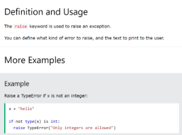{: .center }

2 Ajouter une méthode **\_\_str\_\_** qui renvoie une chaîne de caractère de la forme "12 / 13", ou simplement de la forme "12" lorsque le dénominateur vaut 1. ( \_\_str\_\_(self) est une méthode de Python : renvoie une chaîne de caractères)

3 Ajouter des méthodes **\_\_eq\_\_** et **\_\_lt\_\_** qui reçoivent une deuxième fraction en argument et renvoient True si la première fraction représente respectivement un nombre égal ou un nombre strictement inférieur à la fraction. 

   ( \_\_lt\_\_(self, other) est une méthode de Python : Pour self = t, elle renvoie True si t est strictement plus petit que other ) ( \_\_eq\_\_(self, other) est une méthode de Python : Pour self = t, elle renvoie True si t est égal à other )

4 Ajouter des méthodes **\_\_add\_\_** et **\_\_mul\_\_** qui reçoivent une deuxième fraction en argument et renvoient une nouvelle fraction représentant respectivement la somme et le produit des deux fractions.

5 Tester ces opérations.

6 **Question bonus** : S’assurer que les fractions sont toujours sous forme réduite.

**<H3 STYLE="COLOR:red;">Exercice n°5 : La classe « Complexe »**</H3>

En mathématiques, dans un plan rapporté à un repère orthonormé ( O;u,v), tout point M de coordonnées (x; y) peut être représenté par ce que l'on nomme un nombre complexe, qui peut s'écrire sous la forme:

*z=x+iy*.

On dit que x est la partie réelle de z et y, sa partie imaginaire.

En posant z = x + iy et z' = x' + iy, on définit alors les opérations suivantes :

- z + z' = (x + x') + i(y + y')
- z - z' = (x - x') + i(y - y')
- z × z' = (xx' - yy') + i(xy' + x'y)

De plus, on dit que z = z' si x = x' et y = y'. Écrire en Python une classe complexe :

- qui définit un nombre complexe (le constructeur devra initialiser un tuple de deux nombres : la partie réelle et la partie imaginaire);
- ayant une méthode permettant d'afficher le nombre complexe sous forme d'un tuple de deux éléments;
- permettant d'ajouter, soustraire, multiplier et comparer (en termes d'égalité) deux nombres complexes;
- permettant de donner la distance de l'origine du repère au point représenté par le nombre complexe (on appelle cette distance le module, qui est égal à $\sqrt{x^2+y^2}$).

**Aide :** Les méthodes à mettre sont des méthodes spéciales qui existent déjà (dans l'ordre de l'exercice) :

- \_\_add\_\_
- \_\_sub\_\_
- \_\_mul\_\_
- \_\_eq\_\_

De ce fait on aura :
```python
def __add__(self, other):
    return Complexe(self.x + other.x, self.y + other.y)
```

où other représente l’autre objet.

Tester cette classe avec les nombres : *z=3 + 5i* et *z’=7 + i*.

Ce qui donne si on appelle afficher\_tuple() la méthode permettant d’afficher le tuple :
```txt
>>> z = Complexe(-3,5)
>>> zprime = Complexe(7,1)
>>> z.afficher_tuple()
Out[3]: (-3, 5)
>>> (z+zprime).afficher_tuple()
Out[4]: (4, 6)
```
Etc…

**<H3 STYLE="COLOR:red;">Exercice n°6 : La classe « Temps »**</H3>

En Python, écrire une classe Temps qui permet de définir un horaire au format hh : mm : ss et qui admet les méthodes suivantes :

- affiche, qui affiche l'horaire au format « 12 h 37 min 45 s »;
- \_\_add\_\_ , qui ajoute deux horaires de la classe Temps;
- \_\_sub\_\_ , qui calcule la différence entre deux horaires de la classe Temps.


**<H3 STYLE="COLOR:red;">Exercice n°7 : La classe Intervalle**</H3>

Définir une classe Intervalle représentant des intervalles de nombres. Cette classe possède deux attributs a et b représentant respectivement l’extrémité inférieure et l'extrémité supérieure de l’intervalle.

Les deux extrémités sont considérées comme incluses dans l'intervalle.

Tout intervalle avec b < a représente l'intervalle vide.

- Écrire le constructeur de la classe Intervalle et une méthode est\_vide renvoyant True si l’objet représente l’intervalle vide et False sinon.
- Ajouter des méthodes \_\_len\_\_ renvoyant la longueur de l'intervalle (l'intervalle vide à une longueur 0) et \_\_contains\_\_ testant l’appartenance à l'intervalle.
- Ajouter une méthode \_\_eq\_\_ permettant de tester l'égalité de deux intervalles avec == et une méthode \_\_le\_\_  permettant de tester l'inclusion d’un intervalle dans un autre avec <=.

Attention : toutes les représentations de l'intervalle vide doivent être considérées égales, et incluses dans tout intervalle.

- Ajouter des méthodes intersection et union calculant respectivement l'intersection de deux intervalles et le plus petit intervalle contenant l’union de deux intervalles (l'intersection est bien toujours un intervalle, alors que l’union ne l’est pas forcément). Ces deux fonctions doivent renvoyer un nouvel intervalle sans modifier leurs paramètres.

**<H3 STYLE="COLOR:red;">Exercice n°8 : La classe Date**</H3>

Définir une classe Date pour représenter une date, avec trois attributs jour, mois et annee.

Écrire son constructeur.

- Ajouter une méthode \_\_str\_\_ qui renvoie une chaîne de caractères de la forme "8 mai 1945". On pourra se servir d’un attribut de classe qui est un tableau donnant les noms des douze mois de l’année.

Tester en construisant des objets de la classe Date puis en les affichant avec print.

- Ajouter une méthode \_\_lt\_\_ qui permet de déterminer si une date d1 est antérieure à une date d2 en écrivant d1 < d2. La tester.

**<H3 STYLE="COLOR:red;">Exercice n°9 : La classe Tableau**</H3>

Dans certains langages de programmation, comme Pascal ou Ada, les tableaux ne sont pas nécessairement indexés à partir de 0. C’est le programmeur qui choisit sa plage d’indices.

Par exemple, on peut déclarer un tableau dont les indices vont de -10 à 9 si on le souhaite.

Dans cet exercice, on se propose de construire une classe Tableau pour réaliser de tels tableaux.

Un objet de cette classe aura deux attributs, un attribut premier qui est la valeur de premier indice et un attribut contenu qui est un tableau Python contenant les éléments. Ce dernier est un vrai tableau Python, indexé à partir de 0.

- Écrire un constructeur \_\_init\_\_(self, tmin, tmax, v) où tmin est le premier indice, tmax le dernier indice et v la valeur utilisée pour initialiser toutes les cases du tableau.

Ainsi, on peut écrire   t = Tableau(-10, 9, 42) 

Pour construire un tableau de vingt cases, indexées de -10 à 9 et toutes initialisées avec la valeur 42.

- Écrire une méthode \_\_len\_\_(self) qui renvoie la taille du tableau.
- Écrire une méthode \_\_getitem\_\_(self, i) qui renvoie l'élément du tableau self d'indice i. De même, écrire une méthode \_\_setitem\_\_(self, i, v) qui modifie l’élément du tableau self d'indice i pour lui donner la valeur v.

Ces deux méthodes doivent vérifier que l’indice i est bien valide et, dans le cas contraire, lever l'exception IndexError avec la valeur de i en argument (c’est-à-dire raise IndexError(i)).

- Enfin, écrire une méthode \_\_str\_\_(self) qui renvoie une chaîne de caractères décrivant le contenu du tableau.

## <H2 STYLE="COLOR:BLUE;"> <a name="_toc88030974"></a>**6. Projet (démarche d’investigation)**</H2>
**<H3 STYLE="COLOR:red;">Exercice n°1 : Jeu de cartes**</H3>


Pour construire un jeu de cartes, on va commencer par construire une classe Carte :

1 sur Thonny : Créer un fichier python carte.py.

2 Écrire une classe Carte à partir du diagramme de classe ci-contre.

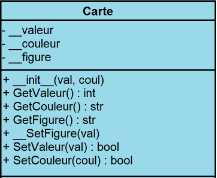{: .center }

{: .center }

**Aide** :

- le corps des méthodes ne sera pas développé immédiatement ; on utilisera l’instruction Python pass en attendant.

- Carte définit une carte caractérisée par:
```
  * sa valeur,
  * sa couleur,
  * sa figure.
```

3 Compléter le constructeur de classe avec les attributs en haut.

   **Aide** : l’attribut \_\_figure permet de donner la figure correspondant à la valeur, 11 -> valet,  12 -> dame, 13 -> roi. Si la valeur est différente de 11, de 12 ou de 13, alors ce n’est pas une figure.

4 Tester la classe en instanciant la classe comme suit, dans la console :
```python
ma_carte = Carte(11, "Trèfle")
print(ma_carte)
print(ma_carte.__doc__)    
print(ma_carte.__init__.__doc__)
```

On supposera que les valeurs du jeu de 32 cartes vont de 7 à 14 (pour l’as) et que pour un jeu de 54 cartes de 2 à 14 (pour l’as).

5 Compléter les trois accesseurs (ou getter) pour retourner (obtenir) la valeur, la couleur et la figure d’une carte. On accède ainsi de manière publique aux trois attributs privés.

6 Compléter les trois mutateurs (ou setter) pour modifier la valeur d’un attribut. On veut rendre publique la modification de la valeur et de la couleur. Par contre, on souhaite garder la main sur la façon d’attribuer une figure à notre carte pour des questions de cohérence. On ne veut pas laisser la liberté à l’utilisateur de créer une carte incohérente entre sa valeur et sa figure, par exemple un roi de valeur 4. Donc le mutateur correspondant à l’attribut figure sera en accès privé.

- \_\_SetFigure : changer la figure en fonction de la nouvelle valeur.
- SetValeur : retourne vrai si la valeur de la carte a été changée par val et faux sinon ; la valeur de la carte doit être comprise entre 2 et 14.
- SetCouleur : retourne vrai si la couleur de la carte a été changée par coul et faux sinon ; la couleur de la carte doit être : Trèfle, Pique, Carreau, Cœur.

7 Tester la classe comme suit :

```python
ma_carte = Carte(11, "Trèfle")
print(ma_carte.GetFigure())
if ma_carte.SetValeur(13):
    print(ma_carte.GetFigure())
```

On va construire la classe JeuDeCartes.

8 Sur Python : Créer un fichier python jeudecartes.py.

9 Écrire une classe JeuDeCartes à partir du diagramme de classe ci-contre.

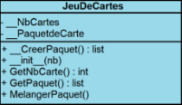{: .center }

**Aide** :

- le corps des méthodes ne sera pas développé immédiatement ; on utilisera l’instruction Python pass en attendant.
- Importer le module carte.
- JeuDeCartes définit un jeu de cartes caractérisé par son nombre de cartes et son paquet de cartes.

10 Compléter le constructeur de classe avec les attributs en haut.

**Aide** : \_\_PaquetdeCarte sera un attribut qui appellera

 la méthode \_\_CreerPaquet().

11 La méthode \_\_CreerPaquet crée le paquet de cartes classé par valeur et couleur donc non mélangé. Si le nombre de cartes est 32, le jeu commence à la carte 7, sinon au 2. Compléter la méthode.

12 Compléter les deux accesseurs (getter).

- GetNbCarte retourne le nombre de cartes du jeu de cartes.
- GetPaquet retourne le paquet de cartes.

13 Compléter la méthode MelangerPaquet en utilisant la méthode shuffle du module random : <https://www.w3schools.com/python/ref_random_shuffle.asp>.

14 Tester le jeu de cartes (de 32 cartes).
```python
mon_jeu = JeuDeCartes(32)
lepaquet = mon_jeu.GetPaquet()
for i in range(len(lepaquet)):
    print(lepaquet[i].GetValeur(), lepaquet[i].GetCouleur(), lepaquet[i].GetFigure())
```

Puis :
```python
mon_jeu.MelangerPaquet()
for i in range(len(lepaquet)):
    print(lepaquet[i].GetValeur(), lepaquet[i].GetCouleur(), lepaquet[i].GetFigure())
```


**<H3 STYLE="COLOR:red;">Exercice n°2 : Filtres d’image**</h3>

Ce TP utilise la bibliothèque Pillow.

Nous allons travailler à partir de deux photos mises à disposition par Hans Stieglitz sur les Wikimedia commons, et soumise à la licence CC-BY-SA 3.0 :

- [tigre.jpg](https://upload.wikimedia.org/wikipedia/commons/4/41/Tiger-2.jpg)

- tigrenb.png dans le dossier ressources

1 Sur Thonny : Mettre les deux fichiers dans un dossier images

**Codage des couleurs**

Il existe plusieurs façons de coder les couleurs d’une image. Nous en présentons ici deux : le système RVB et le système CMJN. Le système CMJN est utilisé pour l'impression, tandis que le système RVB est utilisé pour la lumière (écran, projecteurs, ...).

**Le système RVB :**

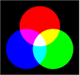{: .center }

Il existe plusieurs façons de décrire les couleurs en informatique. Nous présentons ici une des plus utilisées : le codage RVB, qui est utilisé notamment dans les formats d'image JPEG et TIFF. Rouge vert bleu, abrégé RVB (ou RGB de l'anglais red, green, blue), est un format de codage des couleurs. Ces trois couleurs sont les couleurs primaires en synthèse additive. Elles correspondent en fait à peu près aux trois longueurs d'ondes auxquelles répondent les trois types de cônes de l'œil humain (voir trichromie). L'addition des trois donne du blanc pour l'œil humain. Elles sont utilisées en éclairage afin d'obtenir toutes les couleurs visibles par l'homme. Elles sont aujourd'hui utilisées en vidéo, pour l'affichage sur les écrans, et dans les logiciels d'imagerie.

C'est sur ce principe que fonctionnent les téléviseurs couleur. Si vous regardez un écran de télévision couleur avec une loupe, vous allez voir apparaître des groupes de trois points lumineux : un rouge, un vert et un bleu. La combinaison de ces trois points donne un point lumineux (un pixel) d'une certaine couleur.


Le système RVB est une des façons de décrire une couleur en informatique. Ainsi le triplet {255, 255, 255} donnera du blanc, {255, 0, 0} un rouge pur, {100, 100, 100} un gris, etc. Le premier nombre donne la composante rouge, le deuxième la composante verte et le dernier la composante bleue.

**Le cube des couleurs :**

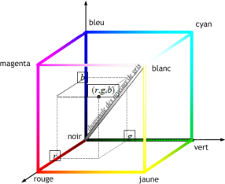{: .center }

On peut représenter chacune de ces couleurs comme un point d'un cube de l'espace de dimension trois en considérant un repère orthonormé dont les trois axes r, g, b représentent les intensités de rouge, de vert et de bleu. L'origine représente ainsi le noir (r=g=b=0) et le point opposé (r=g=b=255) le blanc. Les trois sommets (255,0,0), (0,255,0) et (0,0,255) représentent les trois couleurs de base (rouge, vert, bleu) et les trois sommets opposés, (0,255,255), (255,0,255) et (255,255,0), le cyan, le magenta et le jaune. La grande diagonale de ce cube joignant le noir et le blanc est l'axe achromatique, i.e. l'axe des niveaux de gris.

**Le système CMJN :**

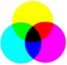{: .center }

La quadrichromie ou CMJN (cyan, magenta, jaune, noir ; en anglais CMYK, cyan, magenta, yellow, key) est un procédé d'imprimerie permettant de reproduire un large spectre colorimétrique à partir des trois teintes de base (le cyan, le magenta et le jaune ou yellow en anglais) auxquelles on ajoute le noir (key en anglais). L'absence de ces trois composantes donne du blanc tandis que la somme des trois donne du noir. Toutefois, le noir obtenu par l'ajout des trois couleurs Cyan, Magenta et Jaune n'étant que partiellement noir en pratique (et coûtant cher), les imprimeurs rajoutent une composante d'encre noire.

**Formats d’images**

On désigne sous le terme d'image numérique toute image acquise, créée, traitée ou stockée sous forme binaire (suite de 0 et de 1).

**Images matricielles (ou images bitmap)**

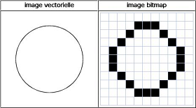{: .center }

Elles sont composées, comme leur nom l'indique, d'une matrice (tableau) de points colorés. Dans le cas des images à deux dimensions (le plus courant), les points sont appelés pixels. Ce type d'image s'adapte bien à l'affichage sur écran informatique ; il est en revanche peu adapté pour l'impression, car la résolution des écrans informatiques, généralement de 72 à 96 ppp (« points par pouce », en anglais dots per inch ou dpi) est bien inférieure à celle atteinte par les imprimantes, au moins 600 ppp aujourd'hui. L'image imprimée, si elle n'a pas une haute résolution, sera donc plus ou moins floue ou laissera apparaître des pixels carrés visibles.

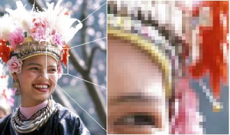{: .center }

Les formats d'images matricielles les plus courants sont jpeg, gif, png, tiff, bmp.

**Définition et résolution**

La définition d'une image matricielle est donnée par le nombre de points la composant. En image numérique, cela correspond au nombre de pixels qui composent l'image en hauteur (axe vertical) et en largeur (axe horizontal) : 200 pixels x 450 pixels par exemple.

La résolution d'une image matricielle est donnée par un nombre de pixels par unité de longueur (classiquement en ppp). Ce paramètre est défini lors de la numérisation (passage de l'image sous forme binaire), et dépend principalement des caractéristiques du matériel utilisé lors de la numérisation. Plus le nombre de pixels par unité de longueur de la structure à numériser est élevé, plus la quantité d'information qui décrit cette structure est importante et plus la résolution est élevée. La résolution d'une image numérique définit donc le degré de détail de l'image. Ainsi, plus la résolution est élevée, meilleure est la restitution. Cependant, pour une même dimension d'image, plus la résolution est élevée, plus le nombre de pixels composant l'image est grand. Le nombre de pixels est proportionnel au carré de la résolution, étant donné le caractère bidimensionnel de l'image : si la résolution est multipliée par deux, le nombre de pixels est multiplié par quatre. Augmenter la résolution peut entraîner des temps de visualisation et d'impression plus longs, et conduire à une taille trop importante du fichier contenant l'image et à de la place excessive occupée en mémoire.

**Filtres d’image**

Cette partie du TP concerne l’algorithmique de l’image. Plus précisément, on manipulera des images matricielles, c’est-à-dire représentées par des tableaux de pixels.

On utilise Pillow pour s’affranchir de la question des formats de fichiers.

**Ouverture et enregistrement de fichiers d’image avec Pillow**

Le bout de code suivant convertit le fichier tigre.jpg (au format JPEG) en tigre.png (au format PNG) :
```python
import PIL.Image as Image
img = Image.open(r'tigre.jpg')
img.save(r'tigre.png')
```

**Informations sur une image**

2 Sur Thonny, créer un fichier Python filtre.py 

Essayer :
```python
import PIL.Image as Image
img = Image.open(r'tigre.jpg')
```
Déterminer la taille de l’image.

**Représentation d’une image en mémoire**

3 Si img est une image chargée avec PIL.Image.open, on accède à ses pixels via la méthode img.load() qui renvoie un tableau indexé par des couples d’entiers (et non pas une matrice au sens python du terme). Rajouter :

```python
pixels = img.load()
print(pixels[0,0])
```
on obtient la valeur du pixel en haut à gauche de l’image.

4 Afficher tous les pixels de l’image en couleurs.

**Aide** : Faire une boucle sur la taille de l’image

5 Afficher tous les pixels de l’image en noir et blanc. Conclure.

**Modifier une image**

6 Pour modifier un pixel, on change sa valeur dans le tableau des pixels :
```python
pixels[0,0] = 0
img.save(r'tigre_mod.png')
```
Est-ce que ça fonctionne avec l’image en noir et blanc ? Avec celle en couleurs ? Conclure.

**Aide** : utiliser paint.net qui permet de zoomer facilement

**Premiers filtres**

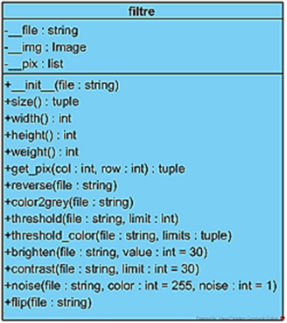

Vous êtes parés pour écrire votre premier filtre. 

7 sur Thonny : Créer un fichier python premier\_filtre.py.

8 Écrire une classe filtre à partir du diagramme de classe ci-contre.

   **Aide** : le corps des méthodes ne sera pas développé immédiatement ; on utilisera l’instruction Python pass en attendant.

9 Compléter le constructeur de classe avec les attributs en haut.

**Aide** :

- \_\_img permet l’ouverture de l’image
- \_\_pix permet d’accéder à un pixel de l’image que l’on a ouvert avec \_\_img

10 Compléter les méthodes suivantes :

- size()

retourne la taille en pixels d'une image sous forme de tuple largeur, hauteur

**Aide** : appliquer la méthode size sur \_\_img

- width()

  retourne la largeur d'une image en pixels

**Aide** : sélectionner le premier élément du tuple donné par la méthode size()

- height()

  retourne la hauteur d'une image en pixels

**Aide** : sélectionner le deuxième élément du tuple donné par la méthode size()

- weight()

  retourne le poids d'une image en pixels

**Aide** : multiplier largeur donnée par la méthode width() avec la hauteur donnée par la méthode height().

- get\_pix(x, y)

  retourne la valeur du pixel de coordonnées (x,y), ou None si erreur

**Aide** : la valeur de col et la valeur de row sont données en entrée. Si ces deux valeurs sont comprises entre la valeur 0 et la largeur obtenue avec la méthode width() et entre la valeur 0 et la hauteur obtenue avec la méthode height(), on retourne avec la méthode \_\_pix du constructeur l’objet. 

Cela donnera self.\_\_pix[col, row] qui permet d’accéder à la valeur du pixel.

11 Tester chaque méthode avec filtre.png. On choisira le pixel (0, 0) pour obtenir sa couleur.

Retoucher une image revient à modifier les valeurs de certains pixels. On peut le faire localement (à un endroit bien précis de l'image) ou globalement. Dans ce dernier cas, on utilise un outil appelé « courbe tonale », qui ressemble au dessin ci-contre.

Sur l'abscisse, on lit les valeurs originales des pixels et sur l'ordonnée les valeurs après modifications. Sur le graphique ci-contre, tous les pixels de valeurs 100 prendront la valeur 200. Ils vont donc s'éclaircir. La diagonale grise est la courbe où il n'y a aucune modification.

En fait, il y a trois courbes tonales : une pour le rouge, une pour le vert et une pour le bleu. On les modifie souvent simultanément de la même façon, mais on peut aussi les modifier séparément.

**Négatif**


12 Écrire une méthode reverse() qui remplace tous les pixels de l’image par leur valeur en négatif. Obtenir le négatif d'une image est très simple : toutes les composantes x de tous les pixels de l'image sont remplacées par 255 – x.

**Aide** : 

- Pour chaque pixel, utiliser la méthode get\_pix sur l’objet lui-même pour récupérer la valeur du rouge, du vert et du bleu. Les couleurs sont obtenues dans cet ordre.

- Convertir chaque couleur en négatif et stocker (remplacer) les valeurs dans le pixel

- Sauver l’image avec la méthode save(file) à appliquer sur la méthode ouvrant l’image…

13 Tester la méthode avec filtre.png. Sauvegarder l’image sous filtre\_negatif.png. 

**Rouge**


Chaque pixel de l'image est une combinaison de rouge, de vert et de bleu. En assignant la valeur 0 aux composantes verte et bleue, on obtient une image à dominante rouge.

14 Écrire une méthode red() qui réalise cette opération.

15 Tester la méthode avec filtre.png. Sauvegarder l’image sous filtre\_rouge.png.  

**Niveaux de gris**


Dans une image en niveaux de gris, chaque pixel est noir, blanc, ou a un niveau de gris entre les deux. Cela signifie que les trois composantes ont la même valeur.

L'œil est plus sensible à certaines couleurs qu'à d'autres. Le vert (pur), par exemple, paraît plus clair que le bleu (pur). Pour tenir compte de cette sensibilité dans la transformation d'une image couleur en une image en niveaux de gris, on ne prend généralement **pas la** **moyenne arithmétique** des intensités de couleurs fondamentales, mais une moyenne pondérée. **Pour simplifier** les choses, nous prendrons ici **la moyenne « classique ».**

16 Écrire une méthode color2grey() qui transforme une image en couleurs vers une image en niveaux de gris. On souhaite ne pas écrire trois fois la même valeur à chaque couleur de chaque pixel. De ce fait, on sauvegardera l’image en filtre\_gris.png. 

**Aide** :

- L’intensité de chaque couleur de pixel doit être un entier

- Pour créer la nouvelle image, on utilise Image.new en niveaux de gris (mode "L"). Voir help(Image.new) dans l’interpréteur.

- Il faut donc enregistrer dans une variable Image.new("L", self.size()) puis, ouvrir cette variable (c’est l’ouverture d’une image) et l’affecter à une variable que l’on appellera pix pour rester proche du code écrit précédemment (self.\_\_pix). L’attribution de la nouvelle couleur ne prend donc plus qu’un argument et non 3.

17 Tester la méthode avec filtre.png. Sauvegarder l’image sous filtre\_gris.png.  

**Seuillage**


Le seuillage d'image est la méthode la plus simple de segmentation d'image.

À partir d'une image en niveau de gris, le seuillage d'image peut être utilisé pour créer une image comportant uniquement deux valeurs, noir ou blanc (monochrome). On remplace un à un les pixels d'une image par rapport à une valeur seuil fixée (par exemple 50). Ainsi, si un pixel à une valeur supérieure au seuil, il prendra la valeur 255 (blanc), et si sa valeur est inférieure, il prendra la valeur 0 (noir).


Avec une image en couleur, on fera de même avec les trois composantes rouge, vert et bleu. Il y aura ainsi huit couleurs possibles pour chaque pixel : blanc, noir, rouge, vert, bleu, magenta, jaune et cyan.

18 Écrire la méthode threshold() qui réalisent un seuillage pour un seuil donné en paramètre.

   **Aide** : Pour le seuillage noir et blanc, on part de l’image en négatif donc il n’y a qu’une valeur pour chaque pixel.

19 Tester avec filtre\_gris.png et une valeur limite à 100. Sauvegarder l’image sous filtre\_seuillageNB.png.

20 Ecrire la méthode et threshold\_color() qui réalise un seuillage pour un seuil donné en paramètre

   **Aide** : traiter chaque couleur au niveau de la limite qui sera un tuple composé d’une valeur pour chaque couleur. Pour simplifier l’écriture on peut écrire l’instruction sur la même ligne que la condition (après les deux points) 

21 Tester la méthode avec filtre.png et des valeurs limites (100,100,100). Sauvegarder l’image sous filtre\_seuillageColor.png.  

**Luminosité**

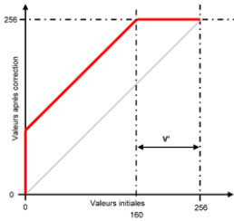

Pour augmenter la luminosité, il suffit d'ajouter une valeur fixe à tous les niveaux.
Pour une valeur de + 96, tous les points de l'espace V' seront blancs.

- Première conséquence : les points les plus noirs auront une valeur égale à 96 et il n'existera plus aucun point entre 0 et 96.

- Deuxième conséquence : les points ayant une valeur supérieure à 160 deviendront des points parfaitement blancs, puisque la valeur maximale possible est 255. Il y a donc perte d'informations.


Pour éviter ces pertes d'informations, il faut que la courbe tonale rejoigne les axes tangentiellement, comme dans l'exemple ci-contre. Ainsi, aucun point de débordera des valeurs limites minimale (0) ou maximale (255). Il sera en particulier possible de revenir en arrière.

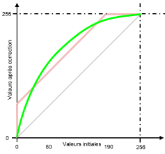

Pour diminuer la luminosité il faudra au contraire soustraire une valeur fixe à tous les niveaux.
Pour une valeur de -100, tous les points de l'espace V" seront noirs.

- Première conséquence : les points les plus blancs auront une valeur égale à 156 et il n'existera plus aucun point entre 156 et 255.

- Deuxième conséquence : les points ayant une valeur comprise entre 0 et 100 deviendront noirs, puisque la valeur minimale est 0. Il y aura donc là aussi perte d'informations.

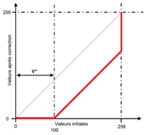

22 Écrire une méthode brighten() qui réalisent un éclaircissement de l’image pour une valeur donnée en paramètre.

**Aide** : traiter chaque couleur de chaque pixel indifféremment des autres et utiliser les fonctions min() et max().

23 Tester la méthode avec filtre.png et la valeur 20. Sauvegarder l’image sous filtre\_luminositeP20.png.  Recommencer avec filtre.png et la valeur -50. Sauvegarder l’image sous filtre\_luminositeM50.png.  


**Contraste**

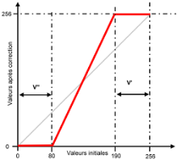

Pour rendre une image plus contrastée, il faut assombrir les points foncés et éclaircir les points clairs, par exemple comme dans la figure ci-contre.Les points de l'espace V" seront noirs et ceux de l'espace V' blancs. 

Pour les mêmes raisons que précédemment, cette manière de faire va causer des pertes d'informations. Aussi faut-il adoucir la courbe. 


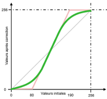

24 Écrire une méthode contrast() qui effectue un contraste de l’image en fonction d’une valeur donnée en paramètre.

**Aide** : Exemple de calcul de contraste :

- Si la valeur est plus petite que 30, assignez la valeur 0.

- Si la valeur est plus grande que 225, assignez la valeur 255.

- Les valeurs c comprises entre 30 et 225 seront recalculées avec la formule : int(round((255.0 / 195.0) \* (c - 30) + 0.5))

25 Tester la méthode avec filtre.png et la valeur 30. Sauvegarder l’image sous filtre\_contraste30.png.  


**Bruit**


Le « bruit » consiste à remplacer **aléatoirement** un certain nombre de pixels par des pixels blancs.

26 Écrire une méthode noise() qui prend en paramètres la couleur du bruit en niveau de gris (valeur de 0 à 255) et un plafond d’apparition (0 à 10) appelé noise. 

   **Aide** : le choix aléatoire du pixel qui sera affecté par du bruit en dessous de la valeur noise fixée.

27 Tester la méthode avec filtre.png, 255 et la valeur 4. Sauvegarder l’image sous filtre\_bruit.png.  

**Symétrie axiale d'axe horizontal**

La symétrie axiale horizontale consiste à échanger les pixels du haut de l’image avec ceux du bas. Ainsi, chaque pixel de la rangée 0 sera échangé avec celui en dessous de lui à la rangée filtre.height() - 1 ; ceux de la rangée 1 avec ceux de la rangée filtre.height() - 2, etc.

28 Ecrire une méthode flip() qui fait la symétrie axiale.

29 Tester la méthode avec filtre.png. Sauvegarder l’image sous filtre\_sym\_axiale.png.

**<H3 STYLE="COLOR:red;">Exercice n°3 : Blackjack**</h3>

**Règle du jeu :** d’après Wikipédia :Le blackjack est un jeu de carte. La partie oppose tous les joueurs contre le croupier (pour simplifier, il n'y aura ici qu'un seul joueur). Le but est de faire **plus de points** que le croupier **sans dépasser 21**. Dès qu'un joueur fait plus que 21, on dit qu'il « **saute** » et il perd sa mise initiale. La valeur des cartes est établie comme suit : 

- de 2 à 10 → valeur nominale de la carte

- une figure → 10 points

- un as → 1 ou 11 (au choix) 

Un blackjack est composé d'un as et d'une « bûche » (carte ayant pour valeur 10, donc 10, valet, dame ou roi). Cependant, si le joueur atteint **le point 21 en 3 cartes ou plus** on compte **le point 21** et non pas blackjack. 

Au début de la partie le croupier distribue **une carte face visible** à chaque joueur et tire une carte face visible également pour lui. Il tire ensuite pour chacun des joueurs une seconde carte face visible et tire une seconde carte face cachée pour lui au blackjack américain. Au blackjack européen, le croupier tire sa seconde carte après le tour de jeu des joueurs. 

Puis il demande au premier joueur de la table (joueur situé à sa gauche) l'option qu'il désire choisir. Si le joueur veut une carte, il doit l'annoncer en disant « Carte ! ». Le joueur peut demander autant de cartes qu'il le souhaite pour approcher **21 sans dépasser**. Si après le tirage d'une carte, il a dépassé 21, il perd sa mise et le croupier passe au joueur suivant. S'il décide de s'arrêter, en disant « Je reste », le croupier passe également au joueur suivant. 

Le croupier répète cette opération jusqu'à ce que tous les joueurs soient servis. 

Ensuite, il joue pour lui selon une règle simple et codifiée « la banque tire à 16, reste à 17 ». Ainsi, le croupier tire des cartes jusqu'à atteindre un nombre compris entre 17 et 21 que l'on appelle un point. S'il fait plus de 21, tous les joueurs restants gagnent mais s'il fait son point, seuls gagnent ceux ayant un point supérieur au sien (sans avoir sauté). Dans cette situation, le joueur remporte l'équivalent de sa mise. En cas d'égalité le joueur garde sa mise mais n'empoche rien en plus. À noter que le blackjack (une « bûche » et un as en deux cartes) est plus fort que 21 fait en ayant tiré plus de deux cartes.

**Définition des trois classes**

- Card : correspond à la carte à jouer. Chaque carte appartient à une couleur (coeur ♥, carreau ♦, piques ♠ ou trèfle ♣) et vaut une certaine valeur

- Deck : correspond à la pile de cartes. La pile diminue au fur et à mesure que les cartes sont tirées. La pile contient 52 cartes au départ

- Hand : correspond aux cartes attribuées à chaque joueur. Une main est ce qui définit le score de chaque joueur et donc qui gagne

Et une classe Game pour la boucle de jeu

1 Sur Thonny : Créer un fichier python blackjack.py

2 Faire une importation du module random

**La classe Card :**

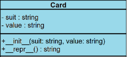

3 Ecrire la classe Card à partir des diagrammes de classes ci-contre, les attributs sont en haut :

**Aide** : 

- Chaque carte contiendra une couleur (suit) et une valeur (value)

- La fonction \_\_repr\_\_() renverra la valeur (roi, reine, valet,…) et la couleur. On obtiendra ainsi la combinaison par exemple : roi de trèfle. Pour se faire utiliser la méthode join() (<https://www.w3schools.com/python/ref_string_join.asp>) avec un tuple constitué de la couleur et le la valeur.

**La classe Deck :**

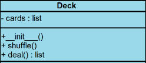

Cette classe doit contenir les 52 cartes et doit être capable de les mélanger. Il faut également que la pile diminue au fur et à mesure que les cartes seront retirées.

4 Ecrire la classe Deck à partir des diagrammes de classes ci-contre, l’attribut est en haut :

**Aide** :

- Lors de la création d’une instance de Deck, il faut disposer d’une collection de toutes les cartes possibles. Pour cela il faut utiliser une compréhension de liste contenant des listes de chaque couleur et valeur. Il faut transmettre chaque combinaison à l’initialisation de la classe Card pour créer les 52 instances card uniques, comme suit : Card(suit, value). On s’aidera de la liste des couleurs ["Pique ♠", "Trèfle ♣", "Coeur ♥", "Carreau ♦"] et la liste de valeur ["As", "2", "3", "4", "5", "6", "7", "8", "9", "10", "Valet", "Reine", "Roi"]

- Implémentez une méthode \_\_str\_\_ : vous devriez obtenir quelque chose comme ceci :
```txt
>>> piles_cartes = Deck()
>>> print(piles\_cartes)
[As de Pique ♠, 2 de Pique ♠, 3 de Pique ♠, 4 de Pique ♠, 5 de Pique ♠, 6 de Pique ♠, 7 de Pique ♠, 8 de Pique ♠, 9 de Pique ♠, 10 de Pique ♠, Valet de Pique ♠, Reine de Pique ♠, Roi de Pique ♠, As de Trèfle ♣, 2 de Trèfle ♣, 3 de Trèfle ♣, 4 de Trèfle ♣, 5 de Trèfle ♣, 6 de Trèfle ♣, 7 de Trèfle ♣, 8 de Trèfle ♣, 9 de Trèfle ♣, 10 de Trèfle ♣, Valet de Trèfle ♣, Reine de Trèfle ♣, Roi de Trèfle ♣, As de Coeur ♥, 2 de Coeur ♥, 3 de Coeur ♥, 4 de Coeur ♥, 5 de Coeur ♥, 6 de Coeur ♥, 7 de Coeur ♥, 8 de Coeur ♥, 9 de Coeur ♥, 10 de Coeur ♥, Valet de Coeur ♥, Reine de Coeur ♥, Roi de Coeur ♥, As de Carreau ♦, 2 de Carreau ♦, 3 de Carreau ♦, 4 de Carreau ♦, 5 de Carreau ♦, 6 de Carreau ♦, 7 de Carreau ♦, 8 de Carreau ♦, 9 de Carreau ♦, 10 de Carreau ♦, Valet de Carreau ♦, Reine de Carreau ♦, Roi de Carreau ♦]
```

- La méthode shuffle : <https://www.w3schools.com/python/ref_random_shuffle.asp>. On ne peut mélanger les cartes que si la pile en contient plus d’une carte.
```txt
# à ajouter
>>> pile_cartes.shuffle()
>>> print(pile_cartes)
[9 de Coeur ♥, 6 de Pique ♠, 9 de Pique ♠, 10 de Trèfle ♣, 4 de Coeur ♥, 7 de Trèfle ♣, Valet de Pique ♠, As de Pique ♠, 7 de Pique ♠, 4 de Carreau ♦, 10 de Carreau ♦, 2 de Coeur ♥, Valet de Carreau ♦, 10 de Coeur ♥, 4 de Trèfle ♣, Reine de Trèfle ♣, Valet de Coeur ♥, As de Coeur ♥, 5 de Pique ♠, 6 de Coeur ♥, 10 de Pique ♠, 3 de Trèfle ♣, 7 de Carreau ♦, 3 de Coeur ♥, Roi de Coeur ♥, Roi de Pique ♠, 5 de Trèfle ♣, Reine de Carreau ♦, 3 de Pique ♠, 2 de Carreau ♦, 5 de Carreau ♦, 8 de Trèfle ♣, Reine de Coeur ♥, Reine de Pique ♠, 8 de Coeur ♥, Roi de Carreau ♦, Valet de Trèfle ♣, 5 de Coeur ♥, 8 de Pique ♠, 9 de Trèfle ♣, 3 de Carreau ♦, As de Carreau ♦, 2 de Pique ♠, Roi de Trèfle ♣, 4 de Pique ♠, As de Trèfle ♣, 2 de Trèfle ♣, 9 de Carreau ♦, 6 de Carreau ♦, 6 de Trèfle ♣, 7 de Coeur ♥, 8 de Carreau ♦]
```

- La méthode deal permet de retirer du jeu la carte du dessus. Pour cela on utilisera la méthode pop() : <https://www.w3schools.com/python/ref_list_pop.asp>. Elle retournera la pile de carte sans la carte du dessus.
```txt
# à ajouter
>>> pile_cartes.deal()
9 de Coeur ♥
```

**La classe Hand** :

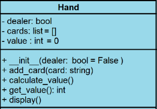

Cette classe contient des cartes. Il vaut également attribuer une valeur par les règles du jeu en fonction des cartes qu’il contient.

La main du croupier ne doit afficher qu’une seule carte, il faudra également suivre cette règle.

5 Ecrire la classe Hand à partir des diagrammes de classes ci-contre :

   **Aide** : le corps des méthodes ne sera pas développé immédiatement ; on utilisera l’instruction Python pass en attendant.

6 Compléter le constructeur de classe avec les attributs en haut.

**Aide** : l’attribut cards est une liste vide et l’attribut value commence à 0.

7 La méthode add\_card permet d’ajouter simplement l’instance card à la liste cards

**Aide** : 

- on utilisera la méthode append

- Implémentez une méthode \_\_str\_\_ : vous devriez obtenir quelque chose comme ceci :
```txt
# à ajouter
>>> pile_cartes.shuffle()
>>> carte_tiree = pile_cartes.deal()
>>> print(carte_tiree)
6 de Carreau ♦
>>> ma_main = Hand()
>>> ma_main.add_card(carte_tiree)
>>> print(ma_main)
[6 de Carreau ♦]
```

8 La méthode calculate\_value permet de calculer la valeur de cards. La valeur value est initialisée à 0 et on suppose que le joueur n’a pas d’as (puisque c’est un cas particulier) : has\_ace = False. Il s’agit de parcourir les instances card de cards et d’ajouter leur valeur sous forme de nombre (entier) au total du joueur en utilisant les règles suivantes :

- Si la valeur de la carte est numérique, on ajoute sa valeur à la valeur de cette main (self.value)

**Aide** : on pourra utiliser la méthode isnumeric()

- Si ce n’est pas numérique, il faut vérifier si la carte est un as. Si c’est le cas, nous ajoutons 11 à la valeur de la main et définissons le drapeau has\_ace = True.

- Si ce n’est pas un as, on ajoute simplement 10 à la valeur de la main.

Une fois que cela est fait, on vérifie s’il y avait un as. Si c’est le cas, l’as ayant pour valeur 0 ou 11 au choix, il faut vérifier aussi que le total est supérieur à 21. Si c’est le cas il faut soustraire 10 pour que l’as ne vaille que 1.

9 La méthode get\_value permet de récupérer la valeur value et de la retourner.

Vous devriez obtenir quelque chose comme ceci :
```txt
# à ajouter
>>> ma_main.add_card(pile_cartes.deal())
>>> print("ma main : ", ma_main)
ma main :  [Valet de Carreau ♦, 5 de Pique ♠]
>>> ma_main.get_value()
15
>>> ma_main.add_card(pile_cartes.deal())
>>> print("ma main : ", ma_main)
ma main :  [Valet de Carreau ♦, 5 de Pique ♠, 7 de Coeur ♥]
>>> ma_main.get_value()
22
```

10 La méthode display permet d’afficher les cartes de chaque main ainsi que la valeur de la main. La première carte du croupier (dealer) est face cachée : il faut imprimer « caché » à la place.
```txt
# à ajouter
>>> ma_main.display()
Valet de Carreau ♦
5 de Pique ♠
7 de Coeur ♥
Valeur : 22
>>> main_dealer = Hand(True)
>>> main_dealer.add_card(pile_cartes.deal())
>>> main_dealer.add_card(pile_cartes.deal())
>>> main_dealer.display()
caché
8 de Trèfle ♣
```

**La classe Game :**

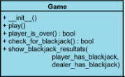

11 Ecrire la classe Game à partir des diagrammes de classes ci-contre :

   **Aide** : le corps des méthodes ne sera pas développé immédiatement ; on utilisera l’instruction Python pass en attendant.

12 Le constructeur sera laissé avec pass

13 ★ ★ ★ ★ ★ La méthode play (1ere partie)

**Aide** : 

- Il faudra prévoir un booléen pour savoir si le joueur joue encore ou non au jeu.

- Tant que le joueur continue à jouer il faut récupérer la pile de cartes, la mélanger, donner une main au joueur, donner une main au croupier (ne pas oublier de passer dealer à True) 

- Il faut ensuite ajouter deux cartes à la main du joueur (player\_Hand) et à la main du croupier (dealer\_Hand) avec la méthode add\_card

- Il faut faire afficher les cartes de la main du joueur et la main du croupier avec la méthode display.

Cela marque la fin du code qui doit s’exécuter au début de chaque nouveau jeu

On entre dans une boucle qui fonctionnera jusqu’à ce qu’un gagnant soit décidé. Il faut le contrôler avec un nouveau booléen (game\_over), par exemple while not game\_over.

Dans la boucle, il faut vérifier le blackjack du joueur et du croupier, avec la méthode check\_for\_blackjack()
```txt
# la méthode play() complète
>>> game = Game()
>>> game.play()
Main du joueur :
Roi de Coeur ♥
6 de Pique ♠
Valeur : 16
Main du croupier :
caché
4 de Trèfle ♣
Choisir : [Carte / Rester] 
\>? c
Roi de Coeur ♥
6 de Pique ♠
Reine de Trèfle ♣
Valeur : 26
Le joueur perd!
Une autre partie ? [O/N]
\>? o
Main du joueur :
4 de Carreau ♦
Valet de Coeur ♥
Valeur : 14
Main du croupier :
caché
10 de Coeur ♥
Choisir : [Carte / Rester]
\>? r
Résultat final
Main du joueur: 14
Main du croupier: 13
Le joueur gagne!
Une autre partie ? [O/N]
```

14 La méthode player\_is\_over permet de tester si la main du joueur est supérieure à 21. Cette méthode vérifie si la valeur de la main du joueur est terminée et renvoie les informations sous la forme d’un booléen

**Aide** : Le score sera obtenue avec la méthode get\_value()

15 La méthode check\_for\_blackjack permet de vérifier s’il y a blackjack. Si l’un des joueurs a reçu un as et une carte illustrée, sa main sera de 21, donc il gagne automatiquement. Il faut garder une trace de quel joueur peut avoir un blackjack, donc on gardera un booléen pour le joueur (player) et le croupier (dealer). Si l’un des booléens est True alors il y a un gagnant.

16 La méthode play (2<sup>ème</sup> partie)

Revenir à la boucle while not game\_over, il faut à présent vérifier le cas où le joueur ou le croupier a fait blackjack (méthode précédente). Si l’un des booléens est True alors il y a un gagnant et continue permettra de sortir de la boucle jeu. On appellera la méthode show\_blackjack\_results qui prend deux arguments.

17 La méthode show\_blackjack\_results permet l’affichage du ou des gagnant(s) qui a(ont) fait blackjack.

18 La méthode play (3<sup>ème</sup> partie)

Si aucun des joueurs n’avait de blackjack, la boucle de jeu se poursuivra

Le joueur peut maintenant faire un choix : ajouter ou non plus de cartes à sa main ou soumettre sa main actuelle. 

Dans la boucle while, Il faut donc demander au joueur ce qu’il veut faire : carte / rester. Astuce : utiliser la méthode lower() pour toutes les combinaisons majuscules/minuscules.

19 Si le joueur ne répond pas la bonne lettre, il faut continuer simplement à demander à nouveau.

20 Si le joueur choisit carte, il faut ajouter une carte supplémentaire à sa main. Cela se fait de la même manière qu’auparavant avec les méthodes deal() et add\_card().

21 Dans la condition précédente, si la main du joueur a une valeur supérieure à 21 il a perdu donc la boucle du jeu doit se rompre et le croupier gagne

22 Si à présent le joueur choisit de rester avec sa main, il faut comparer son score avec celui du croupier. Il faut afficher la valeur de la main du joueur et du croupier, comparer les valeurs de chaque main et afficher qui gagne. Si les deux mains ont même valeur alors il y a match nul.

23 On peut ajouter une petite boucle pour que le joueur est le choix de rejouer ou non. Astuce utiliser les booléens de la méthode play et game\_over

24 Pour lancer le jeu il faut créer une instance de la classe Game et on appelle la méthode play. 

   **Aide** : mettre les lignes de code précédentes dans if \_\_name\_\_ == "\_\_main\_\_": qui ne lancera le jeu que dans le cas où on utilise le fichier blackjack et non un import depuis un autre fichier.


**<H3 STYLE="COLOR:red;">Exercice n°4 : Banque**</h3>

L’objectif est de simuler (sommairement bien sûr) le fonctionnement d’une banque. Le programme doit permettre :

- La création d’une banque ;

- La création de comptes bancaires ;

- La création de personnes propriétaires de ces comptes bancaires.

1 Dans un module nommé personne, créer la classe Personne  et les méthodes :
```python
class Personne():
    """
    Modélisation d'une personne.

    Attributs
    ---------
    - nom : str
        Renseigné à la création de l'objet
    - Prenom : str
        Renseigné à la création de l'objet
    - email : str
        Email. Initialisé à ""
    - telephone : str
        Numéro de téléphone. Initialisé à ""
    - date_naissance : str
        Chaîne de caractères au format jour/mois/année (4 chiffres). Initialisé à ""
    - jour_naissance : int
        Déterminé à partir de la date de naissance. Initialisée à -1
    - mois_naissance : int
        Déterminé à partir de la date de naissance. Initialisée à -1
    - annee_naissance : int
        Déterminé à partir de la date de naissance. Initialisée à -1
    """

    def __init__(self, nom: str, prenom: str) -> None:
        """
        Initialisation des attributs.
        """
        pass

    def modifier_nom(self, nom: str) -> None:
        """
        Permet de modifier le nom de la personne.
        """
        pass

    def obtenir_nom(self) -> str:
        """
        Retourne le nom de la personne.
        """
        pass

    def modifier_prenom(self, prenom: str) -> None:
        """
        Permet de modifier le prénom de la personne.
        """
        pass

    def obtenir_prenom(self) -> str:
        """
        Retourne le prénom de la personne.
        """
        pass

    def obtenir_email(self) -> str:
        """
        Retourne l'email de la personne.
        """
        pass

    def renseigner_email(self, email: str) -> None:
        """
        Renseigne l'attribut email de la personne.
        """
        pass

    def obtenir_telephone(self) -> str:
        """
        Retourne le numéro de téléphone de la personne.
        """
        pass

    def renseigner_telephone(self, telephone: str) -> None:
        """
        Renseigne l'attribut telephone de la personne.
        """
        pass

    def renseigner_date_naissance(self, date: str) -> None:
        """
        Récupère la date de naissance sous la forme jour/mois/année.
        Renseigne l'attribut date_naissance et, après un traitement, les attributs
        jour_naissance, mois_naissance, annee_naissance.

        Lève une exception de type ValueError si l'année ne possède pas le bon format.
        """
        pass

    def obtenir_date_naissance(self) -> str:
        """
        Retourne la date de naissance.
        """
        pass

    def obtenir_age(self, annee_en_cours: int) -> int:
        """
        Retourne l'age de la personne à partir de l'année en cours.

        Lève une exception de type Exception si la date de naissance n'a pas été renseignée au préalable.
        """
        pass

    def infos(self) -> str:
        """
        Retourne toutes les informations relatives à la personne.
        """
        chaine = """
        Prénom : {}
        Nom : {}
        Date de naissance : {}
        Email : {}
        Téléphone : {}
        """.format(self.obtenir_prenom(), self.obtenir_nom(),
                   self.obtenir_date_naissance(), self.obtenir_email(),
                   self.obtenir_telephone())

        return chaine
```

Tester la classe en instanciant au moins un objet de type Personne et en utilisant toutes les méthodes.

2 Dans un module nommé compte\_bancaire créer la classe Compte\_bancaire et les méthodes :

Ne pas oublier d’importer la classe Personne du module personne au début du fichier.
```python
class Compte_bancaire():
    """
    Définition d'un compte bancaire.

    Attributs
    ---------
    - proprietaire : Personne
        Personne propriétaire du compte. Initialisé à la création de l'objet.
    - identifiant : int
        Identifiant unique du compte. Initialisé à la création de l'objet par un calcul réalisé par une méthode statique.
    - solde : float
        Solde du compte. Initialisé à la création de l'objet.
    """

    def __init__(self, proprietaire: Personne, montant_initial: float) -> None:
        """
        Initialisation des attributs.
        """
        pass

    @staticmethod
    def determine_id(proprietaire: Personne) -> int:
        """
        Détermine l'identifiant du compte aléatoirement à partir du
        nom et du prénom du propriétaire.

        Méthode statique
        """
        pass

    def obtenir_solde(self) -> float:
        """
        Retourne le solde du compte.
        """
        pass

    def depot(self, montant: float) -> None:
        """
        Ajoute montant au solde
        """
        pass

    def retrait(self, montant: float) -> None:
        """
        Retire le montant montant du solde à la condition qu'il y ait suffisamment d'argent.
        Une exception de type ValueError est levée si le montant est trop important
        """
        pass

    def infos(self) -> str:
        """
        Informations sur le compte.
        """
        chaine = """
        Compte numéro : {}
        Solde : {}
        """.format(self.identifiant, self.solde)

        chaine = chaine + self.proprietaire.infos()

        return chaine
```


Tester la classe en instanciant au moins un objet de type Compte\_bancaire et en utilisant toutes les méthodes.

3 Dans un module nommé banque, créer la classe Banque et les méthodes : 

Ne pas oublier d’importer la classe Personne du module personne au début du fichier.

Ne pas oublier d’importer la classe Compte\_bancaire du module compte\_bancaire au début du fichier.
```python
class Banque():
    """
    Modélisation d'une banque.

    Attributs
    ---------
    - nom : str
        Nom de la banque. Initialisé lors de la création de l'objet.
    - comptes : Liste[Compte_bancaire]
        Liste des comptes bancaires au sein de la banque.
    """

    def __init__(self, nom: str) -> None:
        """
        Initialisation de l'objet
        """
        pass

    def creation_compte(self) -> None:
        """
        Prend en charge l'ouverture d'un compte au sein de la banque.
        """
        print("Procédure de création du compte :")
        print("---------------------------------")

        nom = input("Nom du propriétaire du compte : ")
        prenom = input("Prenom du propriétaire du compte : ")
        montant_initial = float(input("Montant du dépôt initial : "))

        p = Personne(nom, prenom)
        c = Compte_bancaire(p, montant_initial)

        self.comptes.append(c)

    def infos(self) -> str:
        """
        Informations sur la banque
        """
        chaine = """
        -----------
        """

        for compte in self.comptes:
            chaine = chaine + compte.infos()
            chaine = """
            -----------

            """

        return chaine
```

4 Dans le fichier nommé main, instancier un objet de type Banque et créer quelques comptes bancaires.

**<H3 STYLE="COLOR:red;">Exercice n°5 : Jeu de la vie**</h3>

Le but de ce sujet est de réaliser en Python une implémentation du jeu de la vie en utilisant la programmation objet.

Un **automate cellulaire** consiste en une grille régulière de « cellules » contenant chacune un « état » choisi parmi un ensemble fini et qui peut évoluer au cours du temps. L’état d’une cellule au temps t+1t+1t+1 est fonction de l’état au temps ttt d’un nombre fini de cellules appelé son « voisinage ». À chaque nouvelle unité de temps, les mêmes règles sont appliquées simultanément à toutes les cellules de la grille, produisant une nouvelle « génération » de cellules dépendant entièrement de la génération précédente.

Le **jeu de la vie** a été inventé par le mathématicien britannique John H. Conway (1937-2020). C’est un exemple de ce qu’on appelle un automate cellulaire bidimensionnel. Il se déroule sur un tableau rectangulaire (L×H) de cellules. Une cellule est représentée par ses coordonnées x et y qui vérifient 0⩽x<L  et 0⩽y<H.

Une cellule peut être dans deux états : **vivante** ou **morte**. La dynamique du jeu s’exprime par les règles de transition suivantes :

- *une cellule vivante reste vivante à la génération suivante si elle est entourée de 2 ou 3 voisines vivantes et meurt sinon* ;
- *une cellule morte devient vivante à la génération suivante si elle possède exactement 3 voisines vivantes*.

La notion de « voisinage » dans le jeu de la vie est celle des 8 cases qui peuvent entourer une case donnée (on parle de voisinage de Moore).

Pour implémenter la simulation, on va tout d’abord rechercher une modélisation objet du problème, puis procéder à son implémentation.

1 Quelles classes peut-on envisager au premier abord pour implémenter ce problème ?

**Réponse** Les classes Grille et Cellule viennent facilement à l’esprit, on peut penser à une classe Etat représentant l’état d’une cellule si l’on veut pousser la modélisation un peu plus loin.


2 Quelles méthodes pourrait-on imaginer pour chaque classe ?

**Réponse** Nous retrouverons ces méthodes dans l’implémentation, mais il faut au moins songer ici aux méthodes qui permettent de récupérer l’état interne des attributs et de les modifier. Il faut aussi penser à la représentation du voisinage d’une cellule et aux méthodes permettant de le modifier ou de le récupérer.


3 Dans quelle classe pouvons-nous représenter simplement la notion de voisinage d’une cellule ? Et le calculer ?

**Réponse** Il peut être commode qu’une Cellule connaisse ses voisins, mais une Grille est plus à même de calculer les voisinages. On peut donc définir une méthode de calcul de voisinage dans la Grille et des méthodes pour affecter ou lire la liste des voisins dans la Cellule, ce qui lui permettra de calculer son état futur selon les règles du jeu de la vie.

4 Une cellule est au bord si x=0, x=L−1, y=0 ou y=H−1. Combien de voisins possède une cellule qui n’est pas au bord ? Combien de voisins possède une cellule qui est au bord ?

**Réponse** Une cellule qui n’est pas au bord possède 8 voisins. Une cellule qui est en bordure en possède 3 dans les angles ou 5 ailleurs sur les bords.


5 Que pourrions-nous aussi considérer comme voisin de droite de la case en haut et à droite de la grille ? Et comme voisin du haut ?

**Réponse** Nous pourrions considérer que le voisin de la cellule en haut et à droite de la grille est la cellule en haut et à gauche. De même le voisin du haut de la case en haut à droite pourrait être la cellule en bas à droite de la grille (grille torique).

**Implémentation du jeu**

**Chaque classe sera définie dans un fichier différent**

**La classe Cellule**

1 Implémenter tout d’abord une classe Cellule avec comme attributs :

- un booléen actuel initialisé à False ;

- un booléen futur initialisé à False ;

- une liste voisins initialisée à None.

**Remarque.** La valeur False signifie que la cellule est morte et True qu’elle est vivante.

2 Ajouter les méthodes suivantes :

- est\_vivant qui renvoie l’état actuel (vrai ou faux) ;

- set\_voisins qui permet d’affecter comme voisins la liste passée en paramètre ;

-  get\_voisins qui renvoie la liste des voisins de la cellule ;

- naitre qui met l’état futur de la cellule à True ;

- mourir qui permet l’opération inverse ;

- basculer qui fait passer l’état futur de la cellule dans l’état actuel.

3 Ajouter à la classe Cellule une méthode \_\_str\_\_ qui retourne le caractère "X" si la cellule est vivante et un tiret "-" sinon.
   Expliquer brièvement l’utilité d’une telle méthode \_\_str\_\_ en Python.
4 Ajouter une méthode calcule\_etat\_futur dans la classe Cellule qui permet d’implémenter les règles d’évolution du jeu de la vie en préparant l’état futur à sa nouvelle valeur.

**La classe Grille**

5 Créer la classe Grille et y définir les attributs suivants : 

- largeur (passé en argument) ;

- hauteur (passé en argument) ;

- matrix : un tableau de cellules à 2 dimensions implémenté en Python par une liste de listes.

**Remarque :** Définir la méthode set\_matrix pour construire le tableau. **Remarque :** Une nouvelle Cellule sera créée par l’appel Cellule().

6 Ajouter les méthodes :

- dans\_grille qui indique si un point de coordonnées iii et jjj est bien dans la grille ;

- set\_cell\_xy qui permet d’affecter une nouvelle cellule à la case (i,j)(i,j)(i,j) de la grille, si (i,j)(i,j)(i,j) est bien dans la grille ;

- get\_cell\_xy qui permet de récupérer la cellule située dans la case (i,j)(i,j)(i,j) de la grille, si (i,j)(i,j)(i,j) est bien dans la grille ;

- get\_largeur qui permet de récupérer la largeur de la grille ;

- get\_hauteur qui permet de récupérer la hauteur de la grille ;

- est\_voisin une *méthode statique* qui vérifie si les cases (i,j)(i,j)(i,j) et (x,y)(x,y)(x,y) sont voisines dans la grille.

7 Ajouter une méthode get\_voisins qui renvoie la liste des voisins d’une cellule.
8 Fournir une méthode set\_voisins qui affecte à chaque cellule de la grille la liste de ses voisins.
9 Donner une méthode \_\_str\_\_ qui permet d’afficher la grille sur un terminal.
10 On veut remplir aléatoirement la Grille avec un certain taux de Cellule vivantes. Définir une méthode remplir\_alea avec le taux (en pourcentage) en argument.

**Le jeu**

11 Définir une méthode jeu permettant de passer en revue toutes les Cellules de la Grille, de calculer leur état futur, puis une méthode actualise qui bascule toutes les cellules de la Grille dans leur état futur.
12 Dans le fichier principal, entrer le code suivant afin de lancer le jeu :
```python
from grille import Grille
import time


def effacer_ecran():
    print("\u001B[H\u001B[J")


def main():
    plateau = Grille(20, 30)
    plateau.remplir_alea(55)
    plateau.set_voisins()
    while True:
        effacer_ecran()
        print(plateau)
        print("\n")
        time.sleep(0.5)
        plateau.jeu()
        plateau.actualise()


main()
```


**spécifications**

**Classe Cellule**
```python
def __init__(self: Cellule) -> None:
    """
    Initialisation des attributs.
    """
    pass

def est_vivant(self: Cellule) -> bool:
    """
    Retourne l'état actuel de la cellule.
    """
    pass

def set_voisins(self: Cellule, voisins: List[Cellule]) -> None:
    """
    Affecte comme voisins la liste passée en paramètre.
    """
    pass

def get_voisins(self: Cellule) -> List[Cellule]:
    """
    Renvoie la liste des voisins de la cellule
    """
    pass

def naitre(self: Cellule) -> None:
    """
    Met l’état futur de la cellule à `True`
    """
    pass

def mourir(self: Cellule) -> None:
    """
    Met l’état futur de la cellule à `False`
    """
    pass

def basculer(self: Cellule) -> None:
    """
    Fait passer l’état futur de la cellule dans l’état actuel
    """
    pass

def __str__(self: Cellule) -> str:
    """
    Représentation de l'objet sous forme d'une chaîne de caractères
    """
    pass

def calcule_etat_futur(self: Cellule) -> None:
    """
    Implémente les règles d’évolution du jeu de la vie en préparant l’état futur à sa nouvelle valeur
    """
    pass
```


**Classe Grille**
```python
def __init__(self: Grille, largeur: int, hauteur: int) -> None:
    """
    Initialisations des attributs
    """
    pass

def set_matrix(self: Grille) -> List[List[Cellule]]:
    """
    Construction de la grille de cellules
    """
    pass

def dans_grille(self: Grille, i: int, j: int) -> bool:
    """
    Vérifie que le point de coordonnées (i,j) est dans la grille
    """
    pass

def set_cell_xy(self: Grille, i: int, j: int, cellule: Cellule) -> None:
    """
    Affecte une nouvelle cellule à la case (i,j) de la grille
    """
    pass

def get_cell_xy(self: Grille, i: int, j: int) -> Cellule:
    """
    Récupère la cellule située dans la case (i,j) de la grille
    """
    pass

def get_largeur(self: Grille) -> int:
    """
    Récupère la largeur de la grille
    """
    pass

def get_hauteur(self: Grille) -> int:
    """
    Récupère la hauteur de la grille
    """
    pass

@staticmethod
def est_voisin(i: int, j: int, x: int, y: int) -> bool:
    """
    Vérifie si les cases (i,j) et (x,y) sont voisines dans la grille
    """
    pass

def get_voisins(self: Grille, x: int, y: int) -> List[Cellule]:
    """
    Renvoie la liste des voisins d’une cellule
    """
    pass

def set_voisins(self: Grille):
    """
    Affecte à chaque cellule de la grille la liste de ses voisins
    """
    pass

def __str__(self: Grille) -> str:
    """
    Représentation de l'objet
    """
    pass

def remplir_alea(self, taux: int) -> None:
    """
    Remplir aléatoirement la Grille avec un certain taux de Cellules vivantes
    """
    pass

def jeu(self: Grille) -> None:
    """
    Passe en revue toutes les Cellules de la Grille, calcule leur état futur
    """
    pass

def actualise(self: Grille) -> None:
    """
    Bascule toutes les cellules de la Grille dans leur état futur
    """
    pass

```
