---
author: ELP
title: 05a Interface et implémentation
---

📚 **Table des matières**

[1.	🧩 Rappels : modules, fonctions](#_toc145779687)  
[2.	🛠️ Interface d’une structure de données abstraites](#_toc145779688)  
[3.	📌 Implémentation](#_toc145779693)

🎯 **Compétences évaluables :**

- Spécifier une structure de données par son interface.  
- Distinguer interface et implémentation.  
- Écrire plusieurs implémentations d’une même structure de données.

---

 Python possède dans la bibliothèque standard un grand nombre de structures de données, programmées de manière efficace.

## <H2 STYLE="COLOR:BLUE;">🧩 <a name="_toc145779687"></a>**1. Rappels : modules, fonctions**</H2>

Pour chaque **module**, on distingue :

- Sa **réalisation** (ou **implémentation**) : c’est le code lui-même  
- Son **interface** (**API**) : c’est l’énumération des fonctions définies dans le module qui sont utilisées depuis d’autres modules/programmes, les **clients**.  
- L’interface doit présenter une **documentation** dans laquelle tout ce que doit savoir le client doit être indiqué  
- L’objectif de l’interface est que le **client n’ait pas à consulter l’implémentation pour utiliser les fonctions**  

Pour chaque **fonction** du module, la spécification doit indiquer :

- ✅ Son **nom**  
- ✅ La liste de ses **paramètres** accompagnés de leur type  
- ✅ Le **type** de la valeur retournée  
- ✅ La **documentation** de la fonction  

---

## <H2 STYLE="COLOR:BLUE;">🛠️ <a name="_toc145779688"></a>**2. Interface d’une structure de données abstraites**</H2>

Une structure de données abstraites ou type abstrait est **une spécification mathématique d’un ensemble de données et de l’ensemble des opérateurs associées.**

On qualifie d’**abstrait** ce type de données car il correspond à un **cahier des charges** qu’une structure de données doit ensuite implémenter.

📌 Nous allons aborder deux structures de données abstraites : **la pile** et **la file**.  
📌 La structure du **tableau** est une structure de données **non abstraite**.

L’étude des structures de données abstraites permet de **choisir des structures qui simplifient la compréhension des algorithmes**, mais surtout qui permettent **d’optimiser en coût de nombreux algorithmes**.

---

### <H3 STYLE="COLOR:GREEN;"> <a name="_toc145779689"></a>**2.1. Un premier exemple : la pile**</H3>

🧩 **Qu’est-ce que c’est une structure de données pile ?**

**Définition :** Une pile est :

- Soit **vide**  
- Soit **une cellule à deux champs**, un champ contenant un **élément**, et un champ contenant **une autre pile**

On dit que cette structure de données est de type **LIFO** : *Last In First Out*

🧠 On pourra représenter une pile de la manière suivante :

```
P = (hautDeLaPile, resteDeLaPile)
```

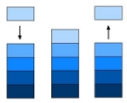{width=25%; : .center }

---

🛠️ **Propriété 1 : Créer une pile vide :**

La structure pile dispose d’un **opérateur pour créer une pile P vide**. On notera dans ce cours :

```
P = vide()
```

---

❓ **Propriété 2 : La fonction estVide()** :

À toute pile `P`, on peut appliquer un **opérateur booléen** :

* `estVide(P) = Vraie` si `P` est vide
* `estVide(P) = Faux` si `P` n’est pas vide

---

🧬 Si cette pile **n’est pas vide**, elle se compose de deux champs :

* Un premier contenant un **élément de type élémentaire** (booléen, entier, flottant)
* Un second de **type pile**

Cette définition est donc **récursive** : une pile est définie à partir d’une pile.

---

🧠 Nous savons ce qu’est une pile vide.
C’est une pile dont l’application de l’opérateur `estVide` renvoie **vraie**.

Une pile à un **élément** est composée, dans le haut de sa pile, par l’élément et d’une pile vide.
Nous avons ainsi compris ce qu’est une pile à un élément :

```
(a, vide())
```

Une pile à **deux éléments** peut être représentée ainsi :

```
(hautDeLaPile, secondElementDeLaPile, vide())
```

---

👾 **Exemple** : on aimerait ranger un groupe d'individus dans un objet de type pile :

**Anakin ; Boba Fett ; Dark Vador ; Han Solo ; Yoda**

Une représentation de ces données en pile serait : 

```
P = (Anakin, (Boba Fett, (Dark Vador, (Han Solo, (Yoda, vide())))))
```

📌 Le **haut de la pile** est `Anakin`
📌 Le **reste de la pile** est :

```
(Boba Fett, (Dark Vador, (Han Solo, (Yoda, vide()))))
```

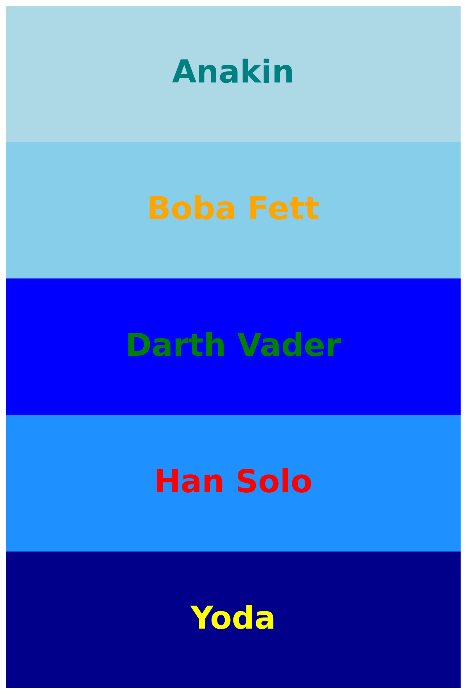{width=25%; : .center }

---


**=> CAPYTALE Le code vous sera donné par votre enseignant**


### <H3 STYLE="COLOR:GREEN;"> <a name="_toc145779690"></a>**2.2. Manipulation de la pile**</H3>

---

???+ question "📌 **Activité n°1 : Représentations en pile**"

	1. Donner une représentation en pile de cet ensemble de couleurs : rouge, bleu, vert.  
	On nommera cette pile `Pcouleur`.

	2. Donner une représentation en pile de cet ensemble de nombres : 12, 5, 3, 6, 1.  
	On nommera cette pile `Pentier`.

	3. Comment manipuler un objet de ce type ?

    ??? success "📤 Solution :"

		```
		Pcouleur = (rouge, (bleu, (vert, vide())))
		Pentier  = (12, (5, (3, (6, (1, vide())))))
		avec une structure linéaire comme les tableaux ou les tuples
		```

👉 Pour manipuler un objet de ce type, on utilise des opérateurs spécifiques tels que `empiler()` et `depiler()`.

---

🎯 **Propriété 3 : Empiler un élément en haut de la pile**

Soit *P* une pile, la pile obtenue en empilant un élément *a* en haut de *P* est la pile *(a, P)*.
On notera cet opérateur : `empiler(a, P)`

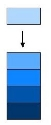{width=25%; : .center }

---

**Exemple** :
Soit :

```
P = (Anakin, (Boba Fett, (Dark Vador, (Han Solo, (Yoda, vide())))))
```

La commande :

```
empiler(Luke, P)
```

produit la pile :


```
(Luke, (Anakin, (Boba Fett, (Dark Vador, (Han Solo, (Yoda, vide()))))))
```


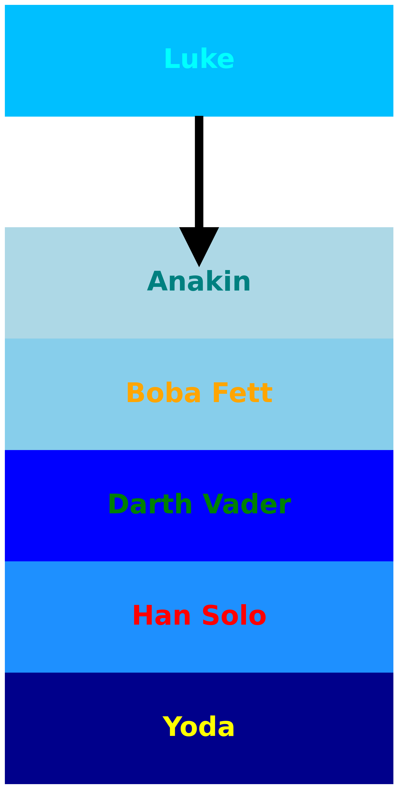{width=25%; : .center }

---

???+ question "📌 **Activité n°2 : Ajouter un élément à une pile**"

	Reprendre l’activité précédente et ajouter le violet à `Pcouleur`.

    ??? success "📤 Solution :"

		```
		Pcouleur = (violet, (rouge, (bleu, (vert, vide()))))
		```

---

🎯 **Propriété 4 : Dépiler le haut de la pile**

Soient deux piles `P1` et `P2`, et un élément `a` en haut de la pile `P1`.
La pile obtenue en dépilant l’élément `a` de `P1` est la pile `P2`.

On notera cet opérateur : `depiler(P1)`
Elle transforme la pile initiale et **renvoie l’élément dépilé**.

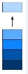{width=25%; : .center }

---

**Exemple** :
Soit :

```
P = (Anakin, (Boba Fett, (Dark Vador, (Han Solo, (Yoda, vide())))))
```

La commande :

```
depiler(P)
```

transforme la pile en :

```
(Boba Fett, (Dark Vador, (Han Solo, (Yoda, vide()))))
```

et **renvoie** :


```
Anakin
```

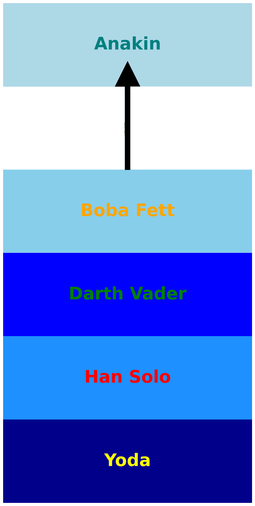{width=25%; : .center }

---

???+ question "📌 **Activité n°3 : Retirer le premier élément**"

	Reprendre l’activité 1 et retirer la première couleur de `Pcouleur`.

    ??? success "📤 Solution :"

		Avant :

		```
		Pcouleur = (rouge, (bleu, (vert, vide())))
		```

		Après :

		```
		(bleu, (vert, vide()))
		```

		Élément dépilé :

		```
		rouge
		```

---


### <H3 STYLE="COLOR:GREEN;"> <a name="_toc145779690"></a>📦 **2.3. Interface d’une structure de données : définition**</H3>

🧠 **Définition :**
L’**interface d’une structure de données abstraite** est l’ensemble des opérateurs nécessaires à la manipulation de cette structure.

---

### <H3 STYLE="COLOR:GREEN;"> <a name="_toc145779691"></a>🔧 **2.4. Interface de la pile**</H3>

📌 **Exemple :**
L’interface minimale de la structure pile est constituée des opérateurs suivants :

* `vide()`
* `estVide(P)`
* `empiler(a, P)`
* `depiler(P)`

L’objectif est de fournir une interface la plus réduite possible tout en étant complète pour manipuler cette structure.

---

???+ question "📝 **Activité n°4 :**"

	Écrire un script en pseudo-code qui permet de connaître le **nombre d’éléments dans une pile P**.
	🧠 On doit garder la pile P **intacte à la fin**.

    ??? success "📤 Solution :"

		```
		fonction compter_elements(P):
			temp = vide()
			compteur = 0
			tant que non estVide(P):
				elt = depiler(P)
				empiler(elt, temp)
				compteur = compteur + 1
			tant que non estVide(temp):
				elt = depiler(temp)
				empiler(elt, P)
			retourner compteur
		```

---

???+ question "📝 **Activité n°5 :**"

	Écrire un script en pseudo-code qui permet de **supprimer le deuxième élément** de la pile P.

    ??? success "📤 Solution :"

		```pseudo
		fonction supprimer_deuxieme(P):
			if estVide(P):
				retourner
			elt1 = depiler(P)
			if estVide(P):
				empiler(elt1, P)
				retourner
			elt2 = depiler(P)    # deuxième élément, à supprimer
			empiler(elt1, P)
		```

---

### <H3 STYLE="COLOR:GREEN;"> <a name="_toc145779692"></a>📨 **2.5. L’interface de la file**</H3>

🧠 **Définition :**
Une **file** est une structure :

* soit vide,
* soit constituée de trois champs : une **tête**, une **queue**, et un **troisième champ contenant une file**.

Elle fonctionne selon le principe **FIFO** (First In, First Out).

📌 Représentation :
`F = (tête, queue, reste_de_file)`

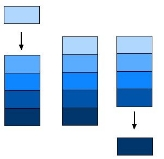{width=25%; : .center }

---

📌 **Exemple :**

On aimerait ranger un groupe d’individu dans un objet de type file

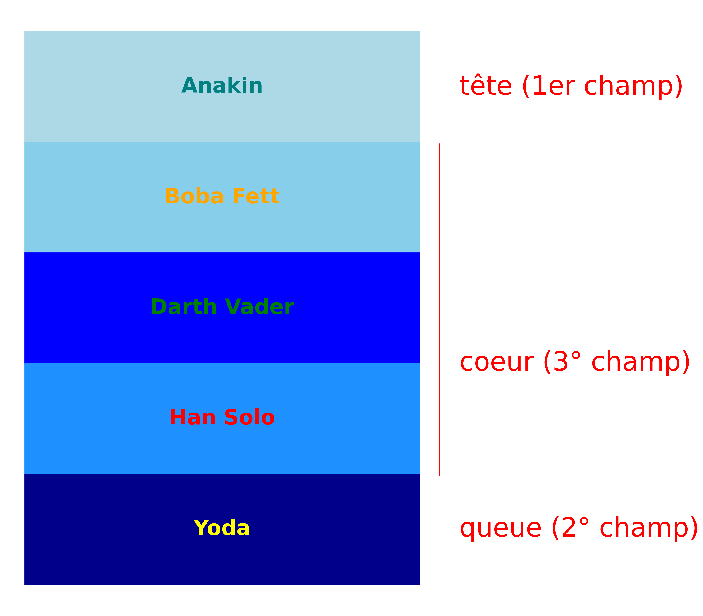{width=25%; : .center }

Anakin, Boba Fett, Dark Vador, Han Solo, Yoda

Une représentation de la file correspondante est 

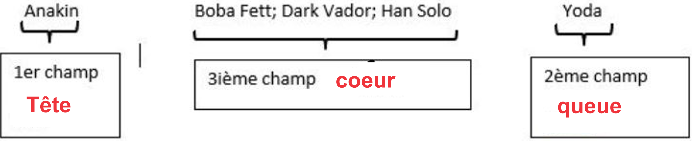{width=50%; : .center }

Une File à un élément a pour :

- tête : vide
- queue : le seul élément
- troisième champ : vide

Une File à deux éléments a pour :

- tête : un élément
- queue : un élément
- troisième champ : vide

---

🧩 **Propriété 5 : Définir une file vide**

`F = vide()`
Une file est vide si sa **queue** est vide.

---

🧩 **Propriété 6 : Définir `enfiler(a, F)`**

Opérateur récursif :

* tête : celle de F
* queue : `a`
* troisième champ : `enfiler(troisième champ de F, queue de F)`


✅ Exemple :

En reprenant l’exemple précédent où

```F=(Anakin,Yoda,(BobaFett,DarkVador,HanSolo)))```

```enfiler(Luke,F) ```

est la file :

```F=(Anakin,Luke,(BobaFett,DarkVador,HanSolo,Yoda)))```

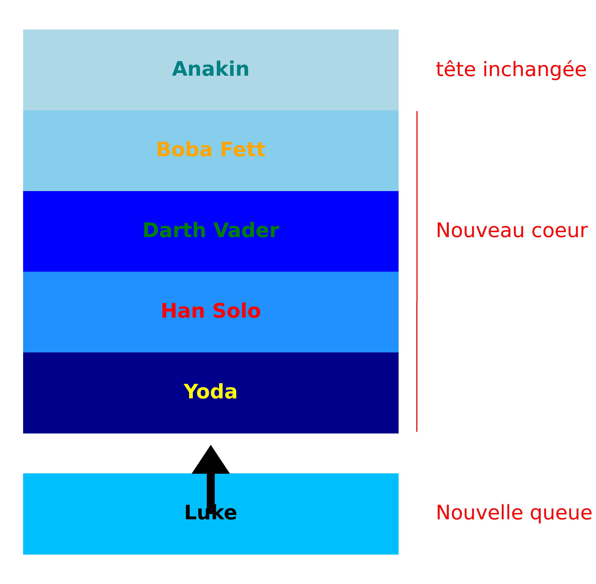{width=25%; : .center }

---

🧩 **Propriété 7 : Définir `defiler(F)`**

Opérateur récursif :

* nouvelle tête : tête du troisième champ
* queue : même que F
* troisième champ : `defiler(troisième champ de F)`

La fonction **transforme F** et **renvoie la tête** de F.

✅ Exemple :

En reprenant l’exemple précédent 

```F=(Anakin,Yoda,(BobaFett,DarkVador,HanSolo))) ```


La commande de ```defiler(F)``` transforme la file *F* en :

```BobaFett,Yoda,(DarkVador,HanSolo)))```

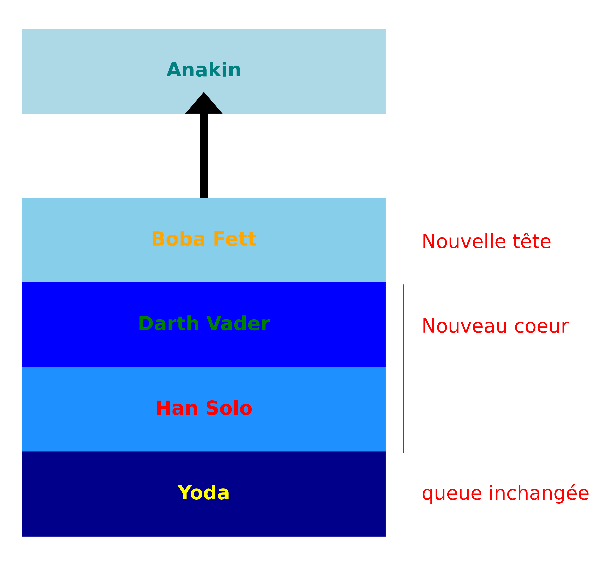{width=25%; : .center }

---

🧩 **Propriété 8 : Interface d’une file**

* `vide()`
* `estVide(F)`
* `enfiler(a, F)`
* `defiler(F)`

---

???+ question "📝 **Activité n°6 :**"

	Écrire un script en pseudo-code qui permet de **connaître le nombre d’éléments dans une file F**, sans la modifier.

    ??? success "📤 Solution :"

		```pseudo
		fonction compter_elements(F):
			temp = vide()
			compteur = 0
			tant que non estVide(F):
				elt = defiler(F)
				enfiler(elt, temp)
				compteur = compteur + 1
			tant que non estVide(temp):
				elt = defiler(temp)
				enfiler(elt, F)
			retourner compteur
		```

---

???+ question "📝 **Activité n°7 :**"

	Écrire un script en pseudo-code qui permet de **supprimer le premier élément du troisième champ** de la file F.

    ??? success "📤 Solution :"

		```pseudo
		fonction supprimer_premier_du_troisieme(F):
			si estVide(F):
				retourner
			troisieme = F.troisieme_champ
			if estVide(troisieme):
				retourner
			defiler(troisieme)
		```

---


## <H2 STYLE="COLOR:BLUE;">📌 <a name="_toc145779693"></a>**3. Implémentation** </H2>

**Définition : Implémentation**

Implémenter une structure de données à travers une structure existante c’est **écrire les éléments de l’interface** à l’aide d**es outils proposées** par la structure de données existante.


### <H3 STYLE="COLOR:GREEN;"> <a name="_toc145779694"></a>🧮 **3.1. Tableau**</H3>

📘 **Définition : Tableau**

Un **tableau** est une **structure de données** à **taille fixe** dans laquelle **chaque case est indexée**.

On peut **accéder à une case** en connaissant son **index**.

---

🧠 **Propriété 9 : Accès à une valeur d’un tableau**

Pour accéder à une valeur d’indice `i` dans un tableau `T`, on écrit :

```
T[i]
```

Il est aussi possible de **réaffecter** une valeur du tableau par une autre à partir de son index :

```
T[i] = nouvelle_valeur
```

---

🔎 **Exemple**

Ce tableau a une **longueur maximale de 7**.

`T[1] = 15`

`T[5]` est vide.

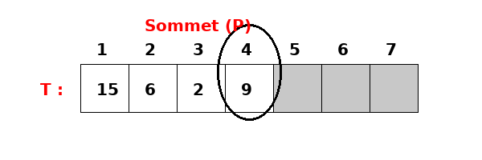{width=50%; : .center }

---

### <H3 STYLE="COLOR:GREEN;"> <a name="_toc145779695"></a>📚 **3.2. Implémentation des piles avec des tableaux**</H3>

On considère une pile `P`.

📌 **Donnée :**
On dispose d’un tableau `T` avec `n` emplacements.

On peut implémenter une pile `P` contenant **au plus `n` éléments** avec le tableau `T`.

🔹 Le tableau possède un **attribut `sommet(P)`** qui **indexe l’élément le plus récemment empilé**.

📦 La pile contient donc les éléments compris entre :

```
T[1] (base) et T[sommet(P)] (sommet)
```

👉 La **donnée de la pile** = contenu de `T` + valeur de `sommet(P)`.

---

🔎 **Exemple :**
Pile `(9,(2,(6,(15,vide()))))`
⇒ `sommet(P) = 4`
{width=50%; : .center }

⚠️ **Remarque :** `sommet(P)` est un **index** du tableau, **pas une valeur de la pile**.

---

🔧 **Propriété 10 :** Implémentation de `estVide(P)`

```
estVide(P):
    si sommet(P) == 0:        # le tableau est vide
        retourner VRAI
    sinon:
        retourner FAUX
```

---

🔧 **Propriété 11 :** Implémentation de `empiler(a, P)`

```
empiler(a, P):
    si sommet(P) == n:        # le tableau est plein
        afficher "espace insuffisant"
    sinon:
        sommet(P) := sommet(P) + 1
        T[sommet(P)] := a
```

---

🔎 **Exemple :**
Appels successifs :

```
empiler(17, P)
empiler(3, P)
```

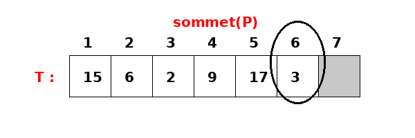{width=50%; : .center }

---

🔧 **Propriété 12 :** Implémentation de `depiler(P)`

```
depiler(P):
    si sommet(P) == 0:
        afficher "pile vide"
    sinon:
        sommet(P) := sommet(P) - 1
        retourner T[sommet(P) + 1]
```

📝 **Observation :**

* `empiler()` ne renvoie rien (procédure)
* `depiler()` renvoie un élément (fonction)

---

🔎 **Exemple :**
Si on lance depiler(P) on obtient :

Observer que T[6] a encore un sens pour le tableau mais plus pour la pile.

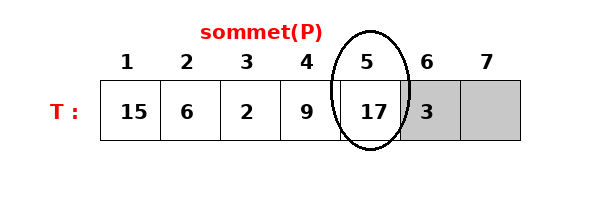{width=50%; : .center }


---


???+ question "📝 **Activité n°8 :**"

	On considère la pile dont la représentation en tableau est :

	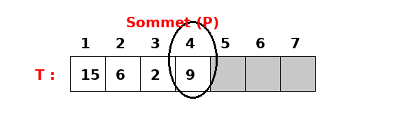{width=50%; : .center }

	🧪 **Pour chaque question, on repartira du tableau de départ.**

	1. Qu'obtient-on si on lance successivement :
	`depiler(P), depiler(P), depiler(P), depiler(P)`

	2. Qu'obtient-on si on lance successivement :
	`depiler(P), depiler(P), depiler(P), depiler(P), depiler(P)`

	3. Qu'obtient-on si on lance successivement :
	`empiler(3, P), empiler(5, P), depiler(P)`

---

### <H3 STYLE="COLOR:GREEN;"> <a name="_toc145779696"></a>🔁 **3.3. Implémentation des files avec des tableaux**</H3>

🧰 On dispose d’un **tableau** `T` avec `n` emplacements.

Il est possible d’implémenter une **file `F`** contenant au plus `n` éléments à l’aide de ce tableau.

---

📌 Le tableau contient deux attributs :

* `tete(F)` : index de l’élément en **tête** de la file
* `queue(F)` : index de l’**emplacement où insérer** le prochain élément (cet emplacement est vide au sens de la file)

📐 La file est formée des éléments entre :

```
T[tete(F)] ... T[queue(F) - 1]
```

🌀 Le tableau est vu comme **circulaire** : `T[n+1]` est relié à `T[1]`.

---

📘 **Définition :**
La **donnée de la file** = le contenu du tableau `T` + la valeur de `tete(F)` et `queue(F)`.

---

🔎 **Exemple :**

Une représentation de l’implémentation avec un tableau T de la file F = (15, 4, (6, 9, 8)) est :

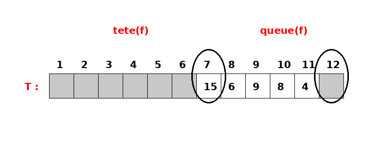{width=50%; : .center }


---

🧠 **Propriété 13 : Cas particuliers**

* Si `tete(F) == queue(F)` → la file est **vide**
* Si `tete(F) == queue(F) + 1` → la file est **pleine**

💡 Pourquoi ?

* `queue(F)` est toujours **vide au sens de la file**
* Donc si `tete(F) == queue(F)`, il n’y a plus rien à lire
* Si `tete(F) == queue(F) + 1`, on ne peut plus insérer sans écraser

---

🔧 **Propriété 14 : Implémentation de la fonction** `estVide(F)`

```
estVide(F):
    si queue(F) == tete(F):
        retourner VRAI
    sinon:
        retourner FAUX
```

---

🔧 **Propriété 15 : Implémentation de la fonction** `enfiler(a, F)`

```
enfiler(a, F):
    T[queue(F)] := a
    si queue(F) == n:
        queue(F) := 1
    sinon:
        queue(F) += 1
```

---

🔎 **Exemple :**

on dispose d’une file dont la représentation de l’implémentation en tableau est :

{width=50%; : .center }


Si on lance ```enfiler(17,F)``` puis ```enfiler(3,F)``` et enfin ```enfiler(5,F)```, on obtient cette représentation :
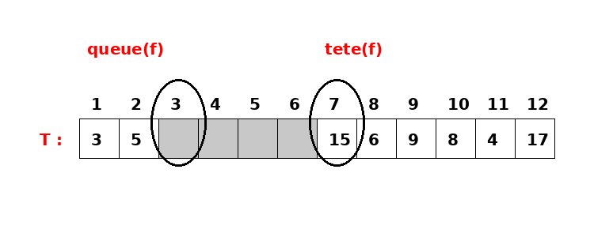{width=50%; : .center }


---

🔧 **Propriété 16 : Implémentation de la fonction** `defiler(F)`

```
defiler(F):
    x := T[tete(F)]
    si tete(F) == n:
        tete(F) := 1
    sinon:
        tete(F) += 1
    retourner x
```

---

🔎 **Exemple :**

On dispose de la file de l'exemple précédent :

{width=50%; : .center }


Si on lance ```defiler(F)```, on obtient :

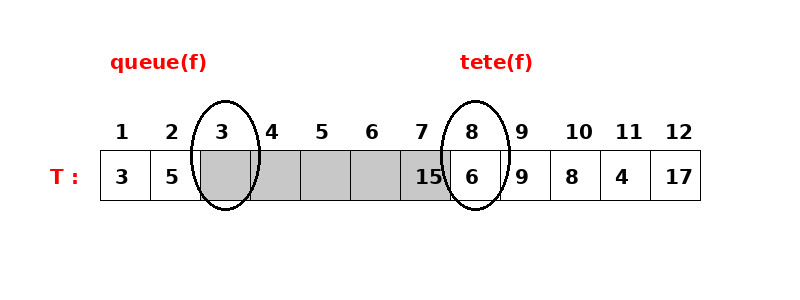{width=50%; : .center }

📌 **Remarque :** `T[7]` existe toujours dans le tableau, mais **n’a plus de signification dans la file**.

---

???+ question "📝 **Activité n°9 :**"

	On considère la file représentée comme suit :

	{width=50%; : .center }

	1 Qu'obtient-on si on lance successivement :

	```
	defiler(F), defiler(F), defiler(F), defiler(F)
	```

	2 Qu'obtient-on si on lance successivement :

	```
	defiler(F), defiler(F), defiler(F), defiler(F), defiler(F)
	```

	3 Qu'obtient-on si on lance successivement :

	```
	enfiler(3,F), enfiler(5,F), defiler(F)
	```

---

