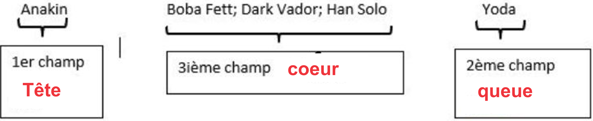

**Table des matières** 

[1.	Rappels : modules, fonctions	](#_toc145779687)

[2.	Interface d’une structure de données abstraites	](#_toc145779688)

[3.	Implémentation	](#_toc145779693)


**Compétences évaluables :**

- Spécifier une structure de données par son interface.
- Distinguer interface et implémentation.
- Écrire plusieurs implémentations d’une même structure de données.


Python possède dans la bibliothèque standard un grand nombre de structures de données, programmées de manière efficace.

## <a name="_toc145779687"></a>**1. Rappels : modules, fonctions**
Pour chaque **module**, on distingue :

- Sa **réalisation** (ou **implémentation**) : c’est le code lui-même 
- Son **interface** (**API**) : c’est l’énumération des fonctions définies dans le module qui sont utilisées depuis d’autres modules/programmes, les **clients**.
- L’interface doit présenter une **documentation** dans laquelle tout ce que doit savoir le client doit être indiqué
- L’objectif de l’interface est que le **client n’ait pas à consulter l’implémentation pour utiliser les fonctions** 

Pout chaque **fonction** du module, la spécification doit indiquer :

- Son **nom**
- La liste de ses **paramètres** accompagnés de leur type
- Le **type** de la valeur retournée
- La **documentation** de la fonction

## <a name="_toc145779688"></a>**2. Interface d’une structure de données abstraites**
Une structure de données abstraites ou type abstrait est **une spécification mathématique d’un ensemble de données et de l’ensemble des opérateurs associées.**

On qualifie d’abstrait ce type de données car il correspond à un cahier des charges qu’une structure de données doit ensuite implémenter.


Nous allons aborder deux structures de données abstraites : la pile et la file.

La structure du tableau est une structure de données **non abstraites.** 

L’étude des structures de données abstraites permettent de choisir des structures qui simplifient la compréhension des algorithmes mais surtout qui permettent **d’optimiser en coût de nombreux algorithmes**.
### <a name="_toc145779689"></a>**2.1. Un premier exemple : la pile**
- Qu’est ce que c’est une structure de données **pile ?**

**Définition :** Une pile est :

- Soit vide
- Soit une cellule à deux champs, un champ contenant un élément, et un champ contenant une autre pile

On dit que cette structure de donnée est de type LIFO : Last In First Out

On pourra représenter une pile de la manière suivante :

P = (hautDeLaPile, resteDeLaPile)

{width=25%; : .center }


Pour pouvoir travailler avec des données structurées en pile, il faut déjà pouvoir créer une pile vide. Nous devons nous doter d’une notation synthétique et compréhensible. Pour créer une pile P vide on écrira :

P = vide()

**Propriété 1 : Créer une Pile vide :**

La structure pile dispose d’un opérateur pour créer une pile P vide. On notera dans ce cours 
```P = vide()```


Pour appliquer la définition à un objet P, nous devons savoir si P est vide ou non. Il faut donc se doter d’un opérateur estVide qui a un objet de type pile P renvoie un booleen : Vraie si la P est vide et Faux sinon.

**Propriété 2 : La fonction estVide()** : 

A toute pile P :

- ```estVide(P) = Vraie``` si P est vide
- ```estVide(P) = Faux``` si P n’est pas vide


Si cette pile n’est pas vide, elle se compose de deux champs : un premier contenant un élément de type élémentaire (booléen, entier, flottant) et un second de type pile.

Cette définition est donc **récursive** : une pile est définie à partir d’une pile.

Nous savons ce qu’est une pile vide. C’est une pile dont l’application de l’opérateur estVide renvoie vraie.

Une pile à un élément est composée dans le haut de sa pile par l’élément et d’une pile vide. Nous avons ainsi compris ce qu’est une pile à un élément : (a, vide())

Une pile à deux éléments peut être représentées ainsi : (hautDeLaPile, secondElementDeLaPile, vide())

**Exemple** : on aimerait ranger un groupe d'individus dans un objet de type pile :

Anakin ; Boba Fett ; Dark Vador ; Han Solo ; Yoda

Une représentation de ces données en pile serait : 

```P=(Anakin,(Boba Fett,(Dark Vador,(Han Solo,(Yoda,vide())))))```

Le haut de la pile est Anakin et le reste est 

```(BobaFett,(DarkVador,(HanSolo,(Yoda,vide()))))```

{width=25%; : .center }


**Activité n° 1 :**
1. Donner une représentation en pile de cet ensemble de couleurs : rouge, bleu, vert. On nommera cette pile ```Pcouleur```
2. Donner une représentation en pile de cet ensemble de nombres : 12, 5, 3, 6, 1. On nommera cette pile ```Pentier```.

- Comment manipuler un objet de ce type ?

**Propriété 3 : Empiler un élément en haut de la pile :**

Soit *P* une pile, la pile obtenue en empilant un élément *a* en haut de *P* est la pile (*a, P*).

On notera cet opérateur ```empiler(a, P)```

{width=25%; : .center }


**Exemple** : En reprenant l’exemple précédent où

{width=25%; : .center }

```P=(Anakin,(Boba Fett,(Dark Vador,(Han Solo,(Yoda,vide())))))```

la commande ```empiler(Luke, P)``` transforme  la pile *P* en : 

```(Luke, (Anakin,(Boba Fett,(Dark Vador,(Han Solo,(Yoda,vide()))))))```


**Activité n° 2 :** Reprendre l’activité précédente et ajouter le violet à ```Pcouleur```


**Propriété 4 : Dépiler le haut de la pile :**

Soit *P1, P2* deux pile et *a* en haut de la pile *P1,* la pile obtenue en dépilant l’élément *a* de la pile *P1* est la pile *P2*.

On notera cet opérateur ```depiler(P1)```, elle transforme la pile initiale et renvoie l’élément dépiler.

{width=25%; : .center }


**Exemple :** En reprenant l’exemple précédent où

{width=25%; : .center }

```P=(Anakin,(Boba Fett,(Dark Vador,(Han Solo,(Yoda,vide())))))```

la commande ```depiler(P)``` transforme  la pile *P* en : 

```(Boba Fett,(Dark Vador,(Han Solo,(Yoda,vide()))))``` et renvoie Anakin.


**Activité n° 3 :** Reprendre l’activité 1 et retirer la première couleur


### <a name="_toc145779690"></a>**2.2. Interface d’une structure de données : définition**

**Définition : Interface d’une structure de données abstraite :**

L’**interface d’une structure de données abstraite** est l’ensemble des opérateurs nécessaires à la manipulation de cette structure.


### <a name="_toc145779691"></a>**2.3. Interface de la pile**
**Exemple :**  L’interface de la structure pile est l’ensemble des opérateurs vu précédemment :

- ```vide()```
- ```estVide(P)```
- ```empiler(a, P)```
- ```depiler(P)```

On peut ajouter d’autres éléments à l’interface mais l’objectif et d’avoir une interface minimale qui permet de manipuler cette structure.

**Activité n° 4 :** 
Ecrire un script en pseudo code qui permet de connaitre le nombre d’élément dans une pile P. On garde la pile P intacte à la fin.


**Activité n° 5 :** 
Ecrire un script en pseudo code qui permet de supprimer le premier élément du reste d’une pile P (c’est-à-dire le deuxième élement de la pile)

### <a name="_toc145779692"></a>**2.4. L’interface de la file**

**Définition :** Une file est :

- Soit vide
- Soit une cellule à trois champs, un champ tête, un champ queue et un champ contenant une file

Une structure de File fonctionne sur le principe premier entré – premier sorti de type FIFO : First In First Out

On pourra représenter une file de la manière suivante :

```F = (teteDeLaFile, queueDeFile, coeurDeFile)```

{width=25%; : .center }


**Exemple :** On aimerait ranger un groupe d’individu dans un objet de type file

{width=25%; : .center }

Anakin, Boba Fett, Dark Vador, Han Solo, Yoda

Une représentation de la file correspondante est 

{width=25%; : .center }

Une File à un élément a pour :

- tête : vide
- queue : le seul élément
- troisième champ : vide

Une File à deux éléments a pour :

- tête : un élément
- queue : un élément
- troisième champ : vide

**Propriété 5 : Définir une file vide :**

Une file est vide si sa queue est vide.

Pour affecter à une variable *F* une file vide, on notera ```F = vide()```


**Propriété 6 : Définir enfiler(a, F) :**

La nouvelle file obtenue à l’enfilement de *a* sur *F* est la file :

- De tête celle de *F,*
- De queue *a*,
- Et de troisième champ enfiler(troisième champ de *F*, queue de *F*)

Cet opérateur est récursif.


{width=25%; : .center }


**Exemple :**  En reprenant l’exemple précédent où

```F=(Anakin,Yoda,(BobaFett,DarkVador,HanSolo)))```

```enfiler(Luke,F) ```

est la file :

```F=(Anakin,Luke,(BobaFett,DarkVador,HanSolo,Yoda)))```


**Propriété 7 : Définir defiler(F) :**

La nouvelle file obtenue par défilement de *F* est la file :

- De tête, la tête du troisième champ de *F,*
- De queue celle de *F*,
- Et de troisième champ defiler(du troisième champ de *F*)

Cet opérateur est récursif.

Cet opérateur transforme *F* et renvoie la tête de *F.*


**Exemple :**  En reprenant l’exemple précédent où 

{width=25%; : .center }

```F=(Anakin,Yoda,(BobaFett,DarkVador,HanSolo))) ```

La commande de ```defiler(F)``` transforme la file *F* en :

```BobaFett,Yoda,(DarkVador,HanSolo)))```


**Propriété 8 : Interface d’une file :**

L’interface de la structure de file est composée de :

- ```vide()```
- ```estVide(F)```
- ```enfiler(a, F)```
- ```defiler(F)```


**Activité n° 6 :** 
Ecrire un script en pseudo code qui permet de connaitre le nombre d’élément dans une file F. On garde la file F intacte à la fin.

**Activité n° 7 :** 
Ecrire un script en pseudo code qui permet de supprimer le premier élément du troisième champ

## <a name="_toc145779693"></a>**3. Implémentation** 

**Définition : Implémentation**

Implémenter une structure de données à travers une structure existante c’est écrire les éléments de l’interface à l’aide des outils proposées par la structure de données existante.

### <a name="_toc145779694"></a>**3.1. Tableau**
**Définition : Tableau**

Un tableau est une structure de données avec une taille fixe où chacune des cases est indexée. On peut accéder à une case connaissant son index.


**Propriété 9 : Accès à une valeur d’un tableau**

Pour accéder à une valeur indexé *i* dans un tableau T. On écrira T[i]. 

On peut réaffecter une valeur du tableau par une autre à partir de son index.


**Exemple :** 

Ce tableau a une longueur maximale de 7.

T[1] = 15.

T[5] est vide.

{width=25%; : .center }

### <a name="_toc145779695"></a>**3.2. Implémentation des piles avec des tableaux**
Soit *P* une pile.

On dispose d’un tableau nommé *T* avec *n* emplacements.

Il est possible d’implémenter la pile *P* d’au plus *n* éléments avec le tableau *T*. 

Le tableau possède un attribut *sommet(P)* qui indexe l’élément le plus récemment inséré. La pile est constituée des éléments *T*[1..*sommet(P)*], tous ceux compris entre *T[1]*, l’élément situé à la base de la pile, et *T[sommet(P)],* l’élément situé au sommet.

La donnée de la pile se constitue donc de la donnée de *T* et de la valeur de *sommet(P)*


**Exemple :** On considère la pile (9,(2,(6,(15,*vide()*)))). Son implémentation se compose de la donnée du tableau T : 

et de *sommet(P)* = 4

{width=25%; : .center }

**Attention :**  *sommet(P)* est un index du tableau, pas un élément de la pile.

**Propriété 10 : Implémentation de la fonction estVide(P) :**
```
estVide(paramètre : P)
si sommet(P) = 0	// signifie que le tableau est vide
 		alors retourner VRAI
 	sinon retourner FAUX
```


**Propriété 11 : Implémentation de la fonction empiler(a, P) :**
```
empiler(paramètres : a,P)
si sommet(P) = n	// signifie que le tableau est complet
 		alors afficher "espace insuffisant"
 	sinon 
 		sommet(P) := sommet(P)+1
 		T[sommet(P)] := a
```


**Exemple :** Si on lance ```empiler(17,P)``` puis ```empiler(3,P)``` on obtient alors cette représentation :

{width=25%; : .center }

**Propriété 12 : Implémentation de la fonction depiler(P) :**
```
depiler(paramètre : P)
si sommet(P) = 0	
 		alors afficher "pile vide"
 	sinon 
 		sommet(P) := sommet(P)-1
 		retourner T[sommet(P)+1]
```


On observe que la procédure empiler ne renvoie rien alors que la fonction dépiler renvoie un élément de la pile.


**Exemple :**  Si on lance depiler(P) on obtient :

Observer que T[6] a encore un sens pour le tableau mais plus pour la pile.

{width=25%; : .center }

{width=25%; : .center }


|<p>**Activité n° AUTONUM  \* Arabic :** On considère la pile dont la représentation en tableau est :</p><p></p><p>Pour chaque question, on repartira du tableau de départ.</p><p>1. Qu'obtient-on si on lance successivement depiler(P), depiler(P), depiler(P) et depiler(P).</p><p>2. Qu'obtient-on si on lance successivement depiler(P), depiler(P), depiler(P), depiler(P) et depiler(P).</p><p>3. Qu'obtient-on si on lance successivement empiler(3,P), empiler(5,P) et depiler(P)</p>|
| - |

1. ## <a name="_toc145779696"></a>**Implémentation des files avec des tableaux**
On dispose d’un tableau nommé *T* avec *n* emplacements.

Il est possible d’implémenter d’une file *F* d’au plus *n* éléments avec le tableau *T*.

Le tableau possède un attribut *tete(F)* qui indexe l’élément de tête et un attribut *queue(F)* qui indexe l’emplacement où un nouvel élément sera inséré. *T[queue(F)]* est vide au sens de la file.

La file est constituée des éléments *T[tete(F)… queue(F) – 1]*

Avec cette implémentation *T[n+1]* doit pointer vers *T[1]* au sens de la file. Une façon de visualiser cette implémentation est un tableau circulaire où le début du tableau et la fin du tableau seraient reliés.

Les élément de la file se trouvent aux emplacements *tete(F), tete(F) + 1, … , queue(F) – 1*, après quoi l’on « boucle » : l’emplacement 1 suit immédiatement l’emplacement *n* dans un ordre circulaire.

Dans cette implémentation la queue est vide.

**Définition :** La donnée de la file se constitue de la donnée d’un tableau T, de la valeur de *tete(F)* et de *queue(F).*


**Exemple :** Une représentation de l’implémentation avec un tableau T de la file F = (15, 4, (6, 9, 8)) est :


**Propriété 13** : 

- Quand *tete(F) = queue(F)*, la file est vide
- Quand *tete(F) = queue(F)* + 1, la file est pleine


En effet, *queue(F)* est vide au sens de la file. Si *tete(F) = queue(F)* alors la tête est vide, c’est que la file est vide.

L’emplacement *queue(F)* doit toujours être vide au sens de la file. Si *tete(F) = queue(F)* + 1, le prochain enfilage sera que *tete(F) = queue(F).*

**Propriété 14** : **Implémentation de la fonction** estVide(F) **:**

estVide(F)

si queue(F) = tete(F)

alors retourner VRAI

sinon retourner FAUX


**Propriété 15** : **Implémentation de la fonction** enfiler(a,F) **:**

enfiler(a,F)

T(queue(F)) := a

si queue(F) = n

alors queue(F) := 1

sinon queue(F) += 1


**Exemple** : on dispose d’une file dont la représentation de l’implémentation en tableau est :


![ref1]


Si on lance enfiler(17,F) puis enfiler(3,F) et enfin enfiler(5,F), on obtient cette représentation :

**Propriété 16** : **Implémentation de la fonction** defiler(F) **:**

enfiler(F)

x := T[tete(F)]

si tete(F) = n

alors tete(F) := 1

sinon tete(F) += 1

retourner x


![ref2]

**Exemple** : On dispose de la file de l'exemple précédent :


Si on lance defiler(F), on obtient :


Observer que T[7] a encore un sens pour le tableau mais plus pour la file.

|<p>**Activité n° AUTONUM  \* Arabic :** On considère la file dont la représentation de l'implémentation en tableau est :</p><p></p><p></p><p>1. Qu'obtient-on si on lance successivement defiler(F), defiler(F), defiler(F) et defiler(F).</p><p>2. Qu'obtient-on si on lance successivement defiler(F), defiler(F), defiler(F), defiler(F) et defiler(F).</p><p>3. Qu'obtient-on si on lance successivement enfiler(3,F), enfiler(5,F) et defiler(F)</p>|
| - |


[ref1]: Aspose.Words.3c63adcb-aa48-41d0-9e8b-3e87a97d9672.041.png
[ref2]: Aspose.Words.3c63adcb-aa48-41d0-9e8b-3e87a97d9672.043.png
