---
author: ELP
title: 05b Liste - Pile - File - Dictionnaire
---

**Table des matières**

[1.	Principaux types abstraits fournis avec le langage Python](#_toc151667915)

[2.	Les tableaux](#_toc151667919)

[3.	Les listes (chainées)](#_toc151667920)

[4.	Les piles](#_toc151667926)

[5.	Les files](#_toc151667931)

[6.	Les dictionnaires](#_toc151667938)

[7.	Exercices](#_toc151667945)

[8.	Projets](#_toc151667946)


**Compétences évaluables :**

- Distinguer des structures par le jeu des méthodes qui les caractérisent.
- Choisir une structure de données adaptée à la situation à modéliser.
- Distinguer la recherche d’une valeur dans une liste et dans un dictionnaire.


## <a name="_toc151667915"></a>**1. Principaux types abstraits fournis avec le langage Python**
### <a name="_toc151667916"></a>**1.1. Liste :** list
Le type **list** de Python est implémenté à l’aide **de tableaux dynamiques**. 

Les **listes** (attention : C’est différent des listes en Python, qui sont des tableaux dynamiques (array dans d’autres langages)), les piles (stack en anglais) et les files (queue en anglais) sont des **structures abstraites de données** fondamentales en informatique. 

Elles diffèrent par les conditions d’ajout et d’accès aux éléments qui les constituent


### <a name="_toc151667917"></a>**1.2. Tableau associatif :** dict
Le type dict de Python est une implémentation du type abstrait **tableau associatif**. L’implémentation correspond à une **table de hachage**, ce qui signifie que la valeur est stockée dans un tableau et que **la position dans ce tableau dépend du résultat d’une fonction de hachage appliquée à la clé**. 

En **un temps indépendant du nombre de valeurs stockées** dans le dictionnaire, Python peut retrouver la valeur associée à n’importe quelle clé : pour cela il **calcule un indice à partir de la valeur de la clé** (qui doit donc être hachable, c’est-à-dire non mutable) et récupère la valeur stockée à cet indice dans un tableau.

Une caractéristique essentielle des dictionnaires est que la **récupération d’une valeur associée à une clé** se fait en un **temps constant**, indépendant de la taille du dictionnaire. 

De même, savoir **si une clé fait partie du dictionnaire** prend un **temps constant** (alors que vérifier si un élément est dans une liste prend un temps proportionnel à la taille de la liste).

L’étude plus précise des dictionnaires est en fin de chapitre
### <a name="_toc151667918"></a>**1.3. Ensemble :** set
Un ensemble Python (**set**) est équivalent à **un dictionnaire ne contenant que des clés**. Par construction, chaque élément est donc **unique**. De plus, avec le type set on dispose déjà des opérations ensemblistes habituelles, implémentées de manière très efficace : union, intersection, différence, etc.

Par exemple :

myset = {"apple", "banana", "cherry"}
## <a name="_toc151667919"></a>**2. Les tableaux**
Un **tableau** est une structure de données dans laquelle les éléments, de **même type**, occupent des **positions contiguës** en mémoire.

Le **nombre d’éléments** qu’un tableau peut contenir est déterminé à la **création du tableau.**


|**Type Python**|**Type abstrait**|**Opération**|**Exemple**|**Complexité**|
| :-: | :-: | :-: | :-: | :-: |
|N’existe pas|Tableau|Accès à un élément|<h3>**tab[i]**</h3>|O(1)|
|||Modification d’un élément|<h3>**tab[i] = x**</h3>|O(1)|
|||Effacement d’un élément|<h3>**retire(tab, i)**</h3>|O(n)|
|||Insertion d’un élément|<h3>**insere(tab, x, i)**</h3>|O(n)|
|||Recherche d’un élément|<h3>**est\_dans(tab, x)**</h3>|O(n)|

Pourquoi l’insertion d’un élément dans un tableau est en O(N) ?

Dans cette partie, on imagine que le tableau a cette allure :

|**1**|**1**|**2**|**3**|**4**|**5**|**vide**|**vide**|**vide**|
| :-: | :-: | :-: | :-: | :-: | :-: | :-: | :-: | :-: |

Si on introduit, en position 1, la valeur 7. Le tableau est alors :

|**7**|**1**|**1**|**2**|**3**|**4**|**5**|**vide**|**vide**|
| :-: | :-: | :-: | :-: | :-: | :-: | :-: | :-: | :-: |


## <a name="_toc151667920"></a>**3. Les listes (chainées)**
Les **listes chaînées** constituent une structure de données :

- de ***longueur modifiable*** ;
- ***plus efficace que les tableaux** lorsqu’il s’agit d’ajouter ou de retirer un élément* (il n’est pas nécessaire de faire de la place en déplaçant les éléments) ;
- qui servira de **brique** à l’élaboration **d’autres structures** de données.


### <a name="_toc151667921"></a>**3.1. Obtenir une définition** 
Lorsque l'implémentation de la liste fait apparaître une chaîne de valeurs, chacune pointant vers la suivante, on dit que la liste est une liste **chaînée**.

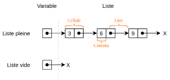{width=60%; : .center }

Une **liste chaînée** permet de représenter une liste ; *chaque élément de cette liste est une **cellule*** contenant :

- la **valeur** de l’élément à stocker ;
- l’**adresse mémoire de la cellule** représentant l’élément suivant.


Une liste chaînée est :

- *soit **la liste vide*** (objet None) ;
- *soit constituée de son premier élément* (objet de type Cellule) et *du reste des éléments qui forment aussi une liste*. Une liste chaînée est donc une **structure récursive**.


### <a name="_toc151667922"></a>**3.2. Primitive sur les listes**
Voici les **opérations minimales** (appelées aussi **primitives**) qui permettent de définir la structure et de lui donner les méthodes attendues :

- Le **constructeur :** produit soit une liste vide ou une liste** à partir d’un couple tête (élément) et reste (liste)
- Les **sélecteurs** qui permettent d’accéder à la tête de la liste ou au reste. Par exemple, ajouter un élément en tête de liste.
- Le **prédicat** qui teste la vacuité d’une liste (le fait qu’elle soit vide). Il renvoie un booléen

|Créer une liste L vide|L = vide()|
| - | - |
|Tester si une liste L est vide|estVide(L)|
|Ajouter un élément *x* en tête de la liste L|ajouteEnTete(x,L)|
|Supprimer la tête *x* d’une liste L et renvoyer cette tête *x*|supprEnTete(L)|
|Créer une nouvelle liste L1 à partir d’un élément *x* et d’une liste existante L|L1 = cons(x, L)|


**Le constructeur**, historiquement appelé cons, qui permet d’obtenir une nouvelle liste à partir d’une liste et d’un élément (L1 = cons(x, L)). 

Il est possible « d’enchaîner » les cons et d’obtenir ce genre de structure : cons(x, cons(y, cons(z, L)))

**Exemple :** Voici une série d'instructions (les instructions ci-dessous s'enchaînent).

- L=vide() => on a créé une liste vide 
- estVide(L) => renvoie vrai 
- ajoutEnTete (3,L) => La liste L contient maintenant l'élément 3 
- estVide(L) => renvoie faux 
- ajoutEnTete(5,L) => la tête de la liste L correspond à 5, la queue contient l'élément 3 
- ajoutEnTete(8,L) => la tête de la liste L correspond à 8, la queue contient les éléments 3 et 5 
- t = supprEnTete(L) => la variable t vaut 8, la tête de L correspond à 5 et la queue contient l'élément 3 
- L1 = vide() 
- L2 = cons(8, cons(5, cons(3, L1))) => La tête de L2 correspond à 8 et la queue contient les éléments 3 et 5

**=> CAPYTALE Le code vous sera donné par votre enseignant**

**Activité n° 1 :**  Voici une série d'instructions (les instructions ci-dessous s'enchaînent), expliquez ce qui se passe à chacune des étapes : 
```
L = vide() 
ajoutEnTete(10,L) 
ajoutEnTete(9,L) 
ajoutEnTete(7,L) 
L1 = vide() 
L2 = cons(5, cons(4, cons(3, cons (2, cons(1, cons(0,L1))))))
```


### <a name="_toc151667923"></a>**3.3. ❤️1<sup>ère</sup> implémentation de la structure liste (chainée) avec des tuples❤️**
Les tuples sont déclarés en utilisant **les parenthèses**.

On peut les lire à l'aide des boucles for.

Les tuples sont **non-mutables** : on ne peut pas modifier leurs contenus après création.


**Sur Thonny : Toutes les fonctions de cette implémentation doivent être  dans le même fichier python appelé liste\_tuples.py**

#### **3.3.1. Implémentation simple avec les tuples**

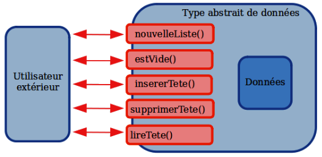{width=50%; : .center }

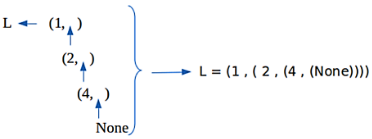{width=60%; : .center }

En utilisant des tuples pour implémenter la structure de liste.

**Activité n° 2 :**  **structure liste avec des tuples fonction** ```nouvelleListe()``` **et** ```estVide()``` : Voici une première implémentation de la structure liste avec des tuples
```python
'''Implémentation de type abstrait Liste en utilisant des tuples (tete, queue)'''

def nouvelleListe():
    '''Renvoie une liste vide'''
    pass

# prédicat
def estVide(L):
    '''Renvoie True si la liste est vide'''
    pass
```

Vérifier le bon fonctionnement de cette implémentation en exécutant ces instructions :
```
>>> a = ()
>>> estVide(a)
???
 
>>> b = None
>>> estVide(b)
???
 
>>> c = "C"
>>> estVide(c)
???
 
>>> d = nouvelleListe()
>>> estVide(d)
???
```
Quelle est la seule proposition qui respecte l'interface imposée par le créateur de cette implémentation ?

**Activité n° 3 :**  **structure liste avec des tuples fonction** ```insererTete``` : Créer maintenant la fonction d'interface suivante : 

```insererTete(x:Elt, L:Liste) -> Liste``` : on **renvoie** une nouvelle liste où la tête est maintenant l'élément x et la queue la liste précédente L.

**AIDE** : il suffit de renvoyer un nouveau tuple dont la tête est notre x et la queue l'ancien tuple !

Voici un exemple d'utilisation :	
```python
# constructeur
def insererTete(x,L) :
    '''Renvoie une nouvelle liste où x est la tête et liste la queue'''
    pass
```
```
>>> a = nouvelleListe()
>>> a = insererTete(5, a)
>>> a
(5, ())
 
>>> a = insererTete(2, a)
>>> a
(2, (5, ()))
```

**Activité n° 4 :**  **structure liste avec des tuples fonction** ```supprimerTete``` : Dernière fonction d'interface, supprimer la tête :

```supprimerTete(L:Liste) -> Liste``` : on **renvoie** une nouvelle liste où la tête est maintenant le deuxième élément (la tête de la queue précédente !). Techniquement, cela revient bien à supprimer l'ancienne tête si on enregistre cette nouvelle version dans une variable. Notez bien qu'on aurait pu nommer cette fonction ```recupererQueue``` puisque c'est ce qu'elle fait.

**Précondition** : L est une liste (ici () ou (tete,queue)), queue étant une liste.

Imaginons la liste suivante :

**5** → **8** → **2** → **3**

Votre fonction doit renvoyer ceci :

**8** → **2** → **3**

**AIDE** : la tête est l'index 0 de la liste et la queue est son index 1.

**AIDE 2** : pensez à gérer

- le cas particulier de la liste vide () : pas de nouvelle tête puisque pas de queue. Il faudra renvoyer une liste vide.

- le cas général où la queue dans votre liste est une liste non vide.

Voici un exemple d'utilisation pour chacun des cas précédents :
```python
def supprimerTete(L):
    '''Renvoie une nouvelle liste où on a supprimé la tête de l'ancienne '''
    pass
```
```
>>> a = nouvelleListe()
>>> b = supprimerTete(a)
>>> b
()

>>> a = insererTete(5, nouvelleListe())
>>> b = supprimerTete(a)
>>> b
()

>>> a
(20, (15, (5, ())))
 
>>> b = supprimerTete(a)
>>> b
(15, (5, ()))
 
>>> c = supprimerTete(b)
>>> c
(5, ())
```

**Activité n° 5 :**  **structure liste avec des tuples fonction** ```lireTete``` : Réaliser la fonction d'interface permettant de lire la tête :

```lireTete(L:Liste) -> Elt``` : on renvoie la tête de la liste L.

**Précondition** : L est une liste (ici () ou (tete,queue)), queue étant une liste.

Attention, on ne modifie pas la liste ! 

Attention : pensez à vérifier que la liste n'est pas vide avant de chercher à lire l'index 0 (la tête).

Exemple d'utilisation
```python
def lireTete(L):
    '''Renvoie la tête de la liste, sans toucher à la liste elle-même'''
    pass
```
```
>>> a = insererTete(5, nouvelleListe() )
>>> a = insererTete(15, a)
>>> lireTete(a)
15
 
>>> b = nouvelleListe()
>>> lireTete(b)
>>> 
```

**Activité n° 6 :**  **structure liste avec des tuples fonction** ```afficherListe```: Il nous manque encore une chose qui pourrait être pratique mais qui ne fait pas partie de l'interface obligatoire : de quoi représenter la liste sans montrer son implémentation mémoire réelle.

Nous aimerions afficher (20, 15, 5) plutôt que (20, (15, (5, ()))). On lit, puis on supprime chaque valeur de la tête que l’on ajoute à une liste vide. On renvoie un string
```python
def afficherListe(L):
    '''Renvoie une représentation de la Liste sous forme d'une séquence commençant par la tête    '''
    reponse = []
    # à compléter
    return str(tuple(reponse))
```
Elle renvoie un string représentant le contenu interne de la Liste **de façon totalement arbitraire** : le contenu affiché n'a rien à voir avec le contenu réel (des tuples dans des tuples).

Utiliser les instructions suivantes :
```
>>> a = insererTete(20, (15, (5, nouvelleListe())))
>>> afficherListe(a)
'(20, 15, 5)'
```
**Question** : Un utilisateur peut-il avoir une idée de l'implémentation interne de notre Liste en utilisant nos fonctions d'interface ?


#### **3.3.2. Implémentation plus souple avec les tuples** 
Nous voudrions par exemple parvenir à lire n'importe quelle valeur de notre liste, pas seulement la tête.

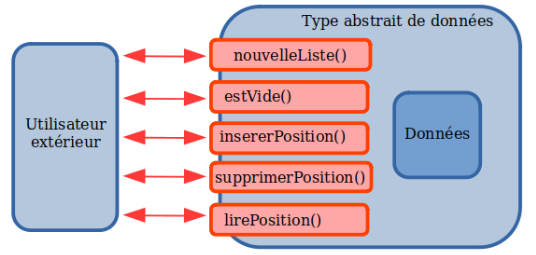{width=50%; : .center }

L'avantage de notre implémentation par rapport au type abstrait : on colle au plus près à la structure (tête, queue).

Voyons maintenant les désavantages.

**Activité n° 7 :**  **structure liste avec des tuples fonction** ```lireElement``` : Créer la fonction d'interface lireElement en utilisant les fonctions d'interface que nous avons déjà créé : il faudra utiliser supprimerTete jusqu'à arriver à la bonne.

Combien de fois doit-on utiliser supprimerTete pour atteindre l'élément d'index **position** ?

Que doit-on faire une fois qu'on a récupéré la bonne liste ?
```lireElement(L:Liste, position:int) -> Elt``` : on **renvoie** l'élément stocké en position **position**.
```
listeA = (12, 15, 18, 4)
reponse = lireElement(listeA, 1)
```
reponse contient alors 15.

**Précondition** : L est une liste et **position** un index valide.

Exemple d'utilisation :
```python
def lireElement(L, position):
    '''Renvoie une représentation de la Liste sous forme d'une séquence commençant par la tête'''
    pass
```
```
>>> a = insererTete(20, (15, (5, nouvelleListe())))
>>> lireElement(a, 1)
15
 
>>> lireElement(a, 0)
20
 
>>> lireElement(a, 2)
5
```
Le pire des cas pour la lecture est ici le fait de vouloir lire la dernière valeur de la liste.
**Question** : Que vaut le coût de la lecture d'éléments pour notre implémentation :

A : Elle est logarithmique

B : Elle est linéaire

C : Elle est quadratique

D : Elle est exponentielle

**Activité n° 8 :**  **structure liste avec des tuples fonction** ```insererElement``` **:**Observer la fonction insererElement.

```insererElement(x:Elt, L:Liste, position:int) -> Liste``` : on **renvoie** une nouvelle liste où l'élément fourni x est maintenant l'élément de la liste situé en position **position**. On prendra ici un système de position lié à un index commençant à 0.
```
listeA = (12, 15, 18, 4)
listeB = inserer(5, listeA, 2)
```
**listeB** contient alors (12, 15, **5**, 18, 4).
```python
def insererElement(x, L, position):
    '''Renvoie une représentation de la Liste sous forme d'une séquence commençant par la tête '''
    pass 
```

Exemple d'utilisation :
```
>>> a = insererTete(20, (15, (5, nouvelleListe())))
>>> afficherListe(a)
'(20, 15, 5)'
 
>>> a = insererElement(12, a, 1)
>>> afficherListe(a)
'(20, 12, 15, 5)'
 
>>> a = insererElement(20, a, 2)
>>> afficherListe(a)
'(20, 12, 20, 15, 5)'
```
**Question** : Que vaut le coût de l'insertion dans le pire des cas pour notre implémentation (lorsque l'élément à rajouter est à placer en fin de liste) :

A : Elle est logarithmique

B : Elle est linéaire

C : Elle est quadratique

D : Elle est exponentielle

Coût de l'implémentation en tuple (tête, queue) : On notera donc que dans le pire des cas :

- La **lecture** est à **coût linéaire** (**Θ(n)**)
- **L'insertion** et la **suppression** est à **coût linéaire** (**Θ(n)**)


Un coût (dans le pire des cas) linéaire en lecture et en insertion. Pas terrible. Regardons si on peut faire mieux.


### <a name="_toc151667924"></a>**3.4. ❤️2<sup>ème</sup> implémentation de la structure liste (chainée) avec les lists de Python❤️**
Si le type natif list se nomme ainsi, c'est bien qu'il permet l'implémentation de Liste. Par contre, en interne, il s'agit d'une tableau dynamique qui possède plus de fonctions d'interface que celle du type abstrait **TABLEAU DYNAMIQUE**. La structure de données nommée list est donc un savant mélange de fonctionnalités des tableaux et des listes.

**sur Thonny : Toutes les fonctions de cette implémentation doivent être  dans le même fichier python appelé liste\_list.py**

**Activité n° 9 :**  **structure liste avec des lists fonction** ```nouvelleListe```**,** ```estVide``` **et** ```lireElement``` **:** Ces fonctions restent les mêmes en utilisant les lists plustot que les tableaux :
```python
'''Implémentation 3 de type abstrait Liste en utilisant le type natif liste de Python

Liste désigne la structure de données que nous utilisons pour gérer les listes.
Elt désigne la structure de données pouvant être un élément de nos listes.

Description rapide de l'interface :
-----------------------------------

1 ::: nouvelleListe() -> Liste
2 ::: estVide(liste:Liste) -> bool
3 ::: lireElement(liste:Liste, index:int) -> Elt 
4 ::: insererElement(x:Elt, liste:Liste, position:int) -> Liste
5 ::: supprimerPosition(liste:Liste, position:int)  -> Liste
6 ::: afficherListe(liste:Liste) -> str
'''

def nouvelleListe():
    '''Renvoie une liste vide '''
    pass

def estVide(L):
    '''Renvoie True si la liste est vide '''
    pass

def lireElement(L, index=-1):
    '''Renvoie la valeur stockée à l'index voulu '''
    pass
```


**Activité n° 10 :**  **structure liste avec des lists fonction** ```insererElement```**:** On connait déja la méthode append qui permet de rajouter un nouvel élément à la fin de nos objets de type natif list-Python.

Attention, append modifie la variable sur laquelle on agit MAIS elle ne renvoie rien : il faudra donc l'utiliser sur une copie du tableau et renvoyer cette copie ensuite. 

La fonction devra toujours renvoyer la copie modifiée.
```python
def insererElement(x, L, position):
    '''Renvoie une Liste en insérant x à la position position. '''
    pass
```


**Remarque** il existe également une méthode nommée insert qui permet de faire la même chose en choisissant la position de l'insertion.

**Erreur courante :** Ne faites donc jamais ceci : insert étant une fonction-procédure, comme append, vous allez renvoyer ... None.
```python
reponse = [element for element in L]
return reponse.insert(position, x)
```

**Activité n° 11 :**  **structure liste avec des lists fonction** ```pop```**:** De la même façon, il existe une méthode nommée pop qui permet d'extraire un élément (la méthode renvoie l'élément) et modifie le tableau en place.

On peut donc l'utiliser pour juste modifier le tableau, sans mémoriser la valeur extraite.
```python
def supprimerPosition(L, position):
    '''Renvoie une nouvelle liste où on a supprimé l'élément situé à la position fournie'''
    pass
```


**Erreur courante :** Il ne faut pas faire ceci :
```python 
reponse = [element for element in L]
return reponse.pop(position)
```
Avec ce code, vous allez renvoyer l'élément supprimé et pas le nouveau tableau

**Activité n° 12 :**  **structure liste avec des lists fonction** ```afficherListe``` **:**  on rajoute la fonction d’affichage globale de la liste. C’est une fonction optionnel pour notre interface :
```python
def afficherListe(L):
    '''Renvoie une représentation de la Liste sous forme d'une séquence commençant par la tête'''
    return str(tuple(L))
```

On va obtenir le même effet pour l'utilisateur, si ce n'est que le code utilise les fonctionnalités de Python et que nous ne connaissons pas les coûts de ces fonctions.


### <a name="_toc151667925"></a>**3.5. ❤️ 3<sup>ème</sup> implémentation de la structure liste (chainée) avec POO ❤️**
Une liste chaînée est une liste composée **de cellules ou de mailles**, comme une chaîne en métal. Chaque maillon (ou cellule) est associé à au moins deux informations :

- Le **contenu** de la cellule
- **L'adresse** ou l'identifiant de la prochaine cellule

Et **c'est tout.**

Du coup, la représentation de la liste donnerait cette fois quelque chose comme ceci :

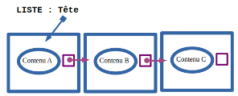{width=50%; : .center }

Les maillons (ou cellules) sont placés les uns derrière les autres, mais rien ne nous y oblige.

Pour insérer un nouvel élément, il suffit de **rediriger la lecture vers le nouvel élément et de créer un lien entre notre nouvel élément et le suivant** dans la liste. 

**Exemple** ci-dessous : 

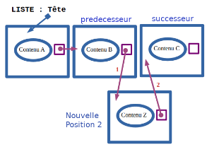{width=50%; : .center }

Du coup, il n'y a toujours **que 2 étapes pour insérer un nouvel élément**, quel que soit la longueur de la liste. On doit donc obtenir sur nos implémentations futures, un coût d'insertion constant.

Pour une grosse liste :

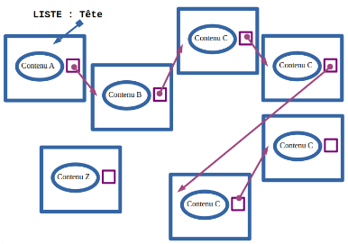{width=50%; : .center }

Le changement de tête ne nécessite que **deux opérations** avec une liste chaînée (alors qu'avec un tableau, il fallait déplacer toutes les cases avant de placer l'index 0) :

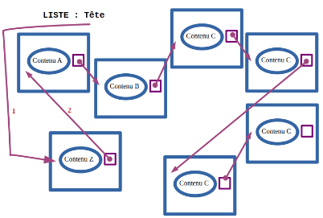{width=50%; : .center }

Le **désavantage** lors de l'implémentation va être la **lecture** : pour lire le contenu de la 5e cellule, il faut passer par la lecture des précédentes : on commence par aller à la tête qui va nous dire où aller ensuite, etc...

L'avantage du tableau par contre, c'est qu'on trouve très rapidement le contenu associé à un index. Là, c'est à coût constant.

**Sur Thonny Toutes les fonctions de cette implémentation doivent être  dans le même fichier python appelé liste\_POO.py**

Une liste chainée sera donc composée d’une Cellule (Node) constituée d’une tête contenant la valeur (Value) et d’une queue (Next) qui servira de pointeur vers la Cellule suivante.
#### **3.5.1. Création de la Cellule Node**

**Activité 13 :**  **structure liste avec de la POO, Création de la classe Cellule :** Chaque Cellule est constituée d’une **tete** et d’un **pointeur**. Il faut donc **initialiser l’attribut value et l’attribut next**. 

Créer une classe Node qui peut recevoir deux paramètres lors de l'appel du constructeur : un paramètre value et un paramètre next. Les deux valeurs transmises devront être stockées dans deux attributs nommés v et n.
```python
class Node:
    '''Classe permettant de créer des cellules-maillons basiques'''
    def __init__(self, value, next=None):
        assert isinstance(next, Node) or next == None
        pass
```

Tester le constructeur avec quelques créations :
```
>>> c1 = Node(5, None)
>>> c2 = Node(15, c1)
>>> c3 = Node(25, c2)
>>> c4 = Node(35, c3)
```

**Activité n° 14 :**  **structure liste avec de la POO, Création de la classe Cellule :** Représenter sur feuille la structure séquentielle linéaire (schéma des cellules) créée par les instructions précédentes.

Notre cellule possède encore un léger problème : on pourrait lui transmettre n'importe quoi sur le paramètre next, pas nécessairement quelque chose de compatible avec l'attribut n qui doit contenir un objet Node ou None. On pourrait donc **imposer** en programmation défensive que ce paramètre soit bien l'instance d'une cellule ou None. Ce sont en effet les deux possibilités.

**Activité n° 15 :**  **structure liste avec de la POO, Création de la classe Cellule :** tester les instructions suivantes
```
>>> a = Node('Marie-Antoinette', None)
>>> b = Node('Louis XVI', a)
>>> c = Node('Louis XV', 'Louis XVI')
```


**Attention** : **n n'est pas la queue mais un élément de la queue**. Ce qu'on nomme queue est bien l'ensemble des valeurs derrière la tête, pas juste la première.

Pour pouvoir lire la séquence de cellules, on va créer une méthode returnFinalNode récursive qui aura la charge d'afficher progressivement les valeurs des cellules et de renvoyer au final la référence de la dernière cellule de la séquence, celle qui ne possède pas d'attribut n.

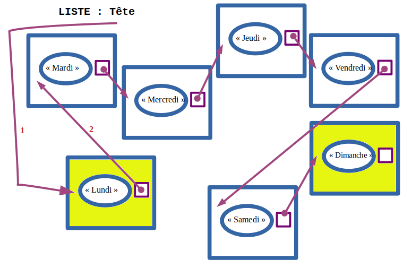{width=50%; : .center }

Si on part ici de la tête qui contient le string "Lundi", on devrait lire la séquence des jours et renvoyer la référence de la dernière cellule, celle qui contient "Dimanche".

**Activité n° 16 :**  **structure liste avec de la POO, Création de la classe Cellule méthode returnFinalNode**
**Prototype :** ```returnFinalNode(cellule:Cellule) -> Cellule``` :

C'est une méthode **récursive**. Le principe est le suivant :

- Si l'attribut n de cette cellule est vide : renvoyer node (la Cellule en cours d'étude). En effet, s'il n'y a pas de suite, c'est bien que node est la dernière.

- Sinon : renvoyer returnFinalNode(node.n)

**Questions**

1. Quelle est la condition d'arrêt ?

2. Quel est le cas de base ?

3. Comment parvient-on à avancer dans les Cellules ? Que fait l'appel récursif ?<

Mettre à jour la classe Node que vous avez créé avec le code suivant et compléter la méthode ```returnFinalNode```
```python
class Node:
    '''Classe permettant de créer des cellules-maillons basiques'''
    def __init__(self, value, next=None):
        # ce qui a été fait précédemment

    def returnFinalNode(self):
        pass

# Programme principal
if __name__ == '__main__':
    di = Node("Dimanche")
    sa = Node("Samedi", di)
    ve = Node("Vendredi", sa)
    je = Node("Jeudi", ve)
    me = Node("Mercredi", je)
    ma = Node("Mardi", me)
    lu = Node("Lundi", ma)
```


**Activité n° 17 :**  **structure liste avec de la POO, Création de la classe Cellule méthode** \_\_str\_\_: On peut ajouter une méthode pour l’affichage de la Cellule (Node)
```python
    def __str__(self): # on peut mettre __repr__ à la place pour éviter de taper print
        if self.v:
            return str(self.v) + "-" + str(self.n)
        else:
            return str(self.v)
```


Tester l’affichage avec 
```
>>> print(lu) # avec ou non print selon si __str__ ou __repr__
>>> print(je)
>>> print(je.returnFinalNode())
>>> print(ma.returnFinalNode())
```


#### **3.5.2. Création de la Liste Chainée Liste**

**Activité n° 18 :**  **structure liste avec de la POO, Création de la classe Liste chainée :** La première Cellule constitue l**’entête** (head). Initialement son **pointeur sera de type None**.

Puis son pointeur sera **chainé à la deuxième Cellule** et ainsi de suite jusqu’à la dernière qui aura un **pointeur de type None** qui constituera la fin de la liste.

**Code à compléter :** Mettre à jour et  compléter le constructeur
```python
class Node:
    '''Classe permettant de créer des cellules-maillons basiques'''
    def __init__(self, value, next=None):
        # ce qui a été fait précédemment

    def returnFinalNode(self):
        # ce qui a été fait précédemment

    def __str__(self): # on peut mettre __repr__ à la place pour éviter de taper print
        if self.v:
            return str(self.v) + "-" + str(self.n)
        else:
            return str(self.v)

class Liste:
    '''Classe implémenter une Liste sous forme Liste chaînée '''
    def __init__(self, head = None):
        assert type(head) == Node or head == None
        pass

# Programme principal
if __name__ == '__main__':
    di = Node("Dimanche")
    sa = Node("Samedi", di)
    ve = Node("Vendredi", sa)
    je = Node("Jeudi", ve)
    me = Node("Mercredi", je)
    ma = Node("Mardi", me)
    lu = Node("Lundi", ma)
    list1 = Liste(lu)
```


**Questions :**

1. Comment obtenir dans la console le contenu de la tête en utilisant l'objet list1 ?

2. Comment obtenir le contenu de l'élément suivant en utilisant l'objet list1 ?

3. Comment obtenir le contenu de l'élément encore derrière en utilisant l'objet list1 ?

Le constructeur de la classe Liste utilise type plutôt que isinstance (classe Node) pour vérifier que l'objet reçu est bien une instance. C'est juste pour vous montrer qu'on peut tester cela de deux façons

#### **3.5.3. Création de l’interface : Liste « souple », version mutable**

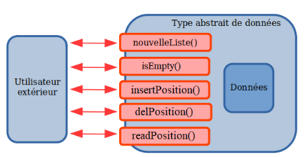{width=50%; : .center }

1. ```nouvelleList() -> Liste``` : on crée une nouvelle liste vide. Cette méthode correspond au constructeur de classe Liste

1. ```isEmpty(L:Liste) -> bool``` : renvoie un booléen qui vaut True si la liste L transmise est une liste vide.
```
listeA = Liste()
isEmpty(listeA) va donc renvoyer l'équivalent de True.
```
1. ```insertPosition(x:Elt, L:Liste, position:int) -> None``` : on **modifie sur place** la liste : l'élément fourni x est maintenant l'élément de la liste situé en position position. On prendra ici un système de position lié à un index commençant à 0.
```
listeA peut être représentée par (12, 15, 18, 4)

insertPosition(5, listeA, 2)
listeA peut alors être représentée par (12, 15, 5, 18, 4).
```
1. ```delPosition(L:Liste, position:int) -> None``` : on **modifie sur place** la liste : l'élément en position position est supprimé, rendant la liste moins longue.
```
listeA peut être représentée par (12, 15, 18, 4)

delPosition(listeA, 1)
listeA peut alors être représentée par (12, 18, 4).
```
1. ```readPosition(L:Liste, position:int) -> Elt``` : on **renvoie** l'élément stocké en position position
```
listeA peut être représentée par (12, 15, 18, 4)

reponse = readPosition(listeA, 1)
reponse peut alors être représentée par 15.
```

**Activité n° 19 :**  **structure liste avec de la POO, Création de la structure méthode** ```isEmpty``` : Créer la méthode d'interface ```isEmpty```. Votre méthode devra bien entendu travailler avec la classe Liste. On ira lire directement son attribut head, sans respect aucun pour l'encapsulation de l'objet. Ajouter la méthode à la classe Liste :
```python 
def isEmpty(self):
   pass
```
Tester
```
>>> list1.isEmpty()
False
>>> list2 = Liste()
>>> list2.isEmpty()
True
```


**Activité n° 20 :**  **structure liste avec de la POO, Création de la structure méthode** ```insertHead```: Créer une méthode d’interface ```insertHead```. La solution est : 

- de mémoriser l’ancienne entête dans variable temporaire temporary, 

- Créer une instance de Node dont la valeur stockée est newData et qui pointe en sortie vers l’ancienne tête

- Modifier l’attribut head de la Liste pour qu’il corresponde bien à la nouvelle instance de Node

Ajouter la méthode à la classe Liste :
```python
def insertHead(self, newData): 
    pass
```
Tester :
```
>>> list1.insertHead('sunday')
>>> list1.insertHead('saturday')
>>> list1.head.v
'saturday'
>>> list1.head.n.v
'sunday'
>>> list1.head.n.n.v
'Lundi'
>>> list1.head.n.n.n.v
'Mardi'
```


Pour réaliser la méthode insertPosition :

Par exemple, pour insérer une Cellule en position 2, il faudra :

- Mémoriser l'adresse nommée **predecesseur** de l'élément en position 1 (celle de contenu B ici)

- Mémoriser l'adresse nommée **successeur** de l'élément en position 2 actuellement (celle de contenu C ici).

- Créer une nouvelle cellule **nouvelle** (celle de contenu Z ici) et la faire pointer vers **successeur**.

- Faire pointer **predecesseur** sur notre **nouvelle** cellule.

Avant d'insérer la nouvelle Cellule en position2, il faut mémoriser les identifiants des cellules contenant B (**predecesseur**, "index" 1) et C (**successeur**, "index" 2).

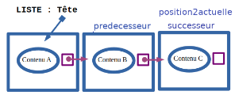{width=50%; : .center }


Après modification,

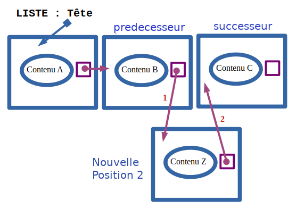{width=50%; : .center }

Quelques précisions :

- Pour insérer en position 1 : **predecesseur** est l'élément en position 0, soit ... la tête de la liste.

- Pour insérer en position 2 : **predecesseur** sera l'élément en position 1. Il faut donc faire un bond en avant depuis la tête.

- Pour insérer en position 3 : **predecesseur** sera l'élément en position 2. Il faut donc faire un bond en avant depuis la tête.

- Si je veux insérer en position **position** : **predecesseur** sera la Cellule en position **position** - 1. Il faut donc faire un bond en avant depuis la tête.

**Activité 21 :**  **structure liste avec de la POO, Création de la structure méthode** ```insertPosition```: Voici une méthode d'interface ```insertPosition```.

```insertPosition(self, newData:Elt, position:int) -> None``` : on modifie sur place la liste : l'élément fourni newData est maintenant l'élément de la liste situé en position position. On prendra ici un système de position lié à un index commençant à 0.

Lorsqu'on veut insérer ailleurs qu'à la tête, cette méthode va

1. partir de la tête, effectuer position -1 saut vers la cellule suivante, et mémoriser l'identifiant de cette cellule dans **predecesseur**

2. mémoriser dans **successeur** la référence de la cellule actuellement à la suite de **predecesseur**.

3. créer la **nouvelle Cellule**, et la faire pointer vers **successeur**

4. modifier **predecesseur** pour qu'elle pointe vers **nouvelle**.

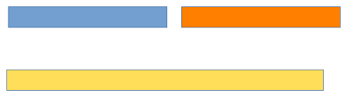{width=60%; : .center }


Ajouter la méthode suivante à la classe Liste
```python
def insertPosition(self, newData, position):
    pass
```

**Question** : analyser le code pour parvenir à identifier les lignes où sont effectuées précisément les actions 1 à 4 précédentes.

Tester
```
>>> list1.insertPosition('Tuesday', 1)
>>> list1.head.v
'Lundi'
>>> list1.head.n.v
'Tuesday'
>>> list1.head.n.n.v
'Mardi'
```


**Activité n° 22 :**  **structure liste avec de la POO, Création de la structure :** L'insertion pure ne concerne que les lignes suivantes
```python
        # nextNode = previousNode.n  # on mémorise la cellule qu'il faudra "déplacer"
        # newNode = Node(newData, nextNode)
        # previousNode.n = newNode
        # qui se résume par
        self.head = Node(newData, self.head)
```
Ici le coût est bien constant. Par contre, que peut-on dire du coût de la recherche de la Cellule **predecesseur** dans le pire des cas ?
```python
        previousNode = self.head
        for etape in range(1,position): #On avance jusqu’à(position-1) pour trouver previous
            previousNode = previousNode.n
```
Au total, que peut-on alors dire du coût de l'insertion ?


C'est un peu décevant du coup...

On retrouve une **insertion à coût constant**

En réalité, la grande force des listes ne vient pas de l'insertion d'une Cellule individuelle (souvent on ne connait pas sa référence) mais de **l'insertion d'une liste à la suite d'une autre liste**. On parlera de **concaténation de listes**, comme avec les strings.

Imaginons qu'on dispose des deux listes. L'une de 20 000 éléments et l'autre de 20 000 éléments également. Si on désire insérer la deuxième liste après la première liste, cela risque d'être compliqué avec des tableaux :

D'abord, il faut réserver une nouvelle place mémoire de 40 000 places :

{width=60%; : .center }

Ensuite, il faut déplacer un par un les 20 000 éléments du premier tableau.

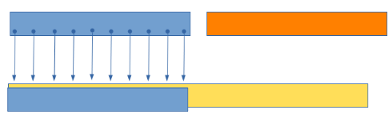{width=60%; : .center }

Puis on déplace les 20 000 éléments du deuxième tableau.

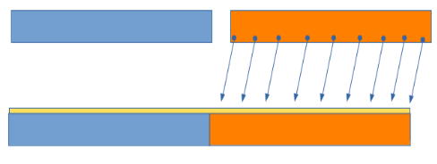{width=60%; : .center }

Il suffit alors de connaître **la dernière Cellule de la première liste** (au pire, 20 000 lectures, c'est toujours mieux que 40 000 déplacements avec les tableaux) et **de la faire pointer vers la tête de la deuxième ligne**.

On pourra donc écrire des choses comme cela : lst1 + lst2. Cela veut juste dire de faire pointer la Cellule de fin de la première liste vers la tête de la deuxième liste.

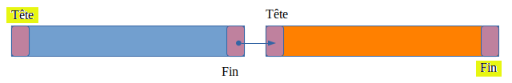{width=60%; : .center }

En conclusion, le type abstrait LISTE peut s'implémenter de plusieurs façons différentes.

Les deux grandes implémentations sont sous forme d'une **structure de données tableaux** (accès lecture à coût constant) et sous forme de **listes chaînées** (insertion parfois à coût constant et facilité de "déplacement" de grands blocs de données).

En fonction de besoin de votre algorithme, on prendra donc l'un ou l'autre.


**Activité n° 23 :**  **structure liste avec de la POO, Création de la structure FONCTION** ```afficherListe``` et ```recupererValeur``` : en utilisant l'interface, l'utilisateur peut-il se douter que les données sont stockées sous forme d'une liste chaînée composée d'objets ?

Ajouter les 2 fonctions :
```python
def afficherListe(L):
    tableau = recupererValeur(L.head)
    return str(tuple(tableau))

def recupererValeur(cellule):
    if cellule.n == None:
        return [cellule.v]
    else:
        return [cellule.v] + recupererValeur(cellule.n)

# Programme principal
if __name__ == '__main__':
    di = Node("Dimanche")
    sa = Node("Samedi", di)
    ve = Node("Vendredi", sa)
    je = Node("Jeudi", ve)
    me = Node("Mercredi", je)
    ma = Node("Mardi", me)
    lu = Node("Lundi", ma)
    list1 = Liste(lu)
    print(afficherListe(list1))
```


**Activité n° 24 :**  **structure liste avec de la POO, Création de la structure méthode** ```delPosition``` : Compléter la méthode.
```python
def delPosition(self, position):
    pass
```
Tester
```
>>> afficherListe(list1)
"('Mardi', 'Mercredi', 'Jeudi', 'Vendredi', 'Samedi', 'Dimanche')"
>>> list1.delPosition(3)
>>> afficherListe(list1)
"('Mardi', 'Mercredi', 'Jeudi', 'Samedi', 'Dimanche')" 
```


**Activité n° 25 :**  **structure liste avec de la POO, Création de la structure autres méthodes** : Réaliser maintenant la méthode d'interface de lecture des valeurs. Voici le prototype.

```readPosition(self:Liste, position:int) -> Elt``` : on renvoie l'élément stocké en position position.
```python
def readPosition(self, position):
    pass
```
Tester
```
>>> list1.readPosition(2)
'Jeudi'
```


## <a name="_toc151667926"></a>**4. Les piles**
### <a name="_toc151667927"></a>**4.1. Généralités**
En informatique, une **pile** (en anglais **stack**) est une structure de données fondée sur le principe « dernier arrivé, premier sorti » (ou **LIFO pour Last In, First Out**), ce qui veut dire que les derniers éléments ajoutés à la pile seront les premiers à être récupérés.


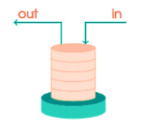{ : .center }


Le fonctionnement est donc celui d’une pile d’assiettes : on ajoute des assiettes sur la pile, et on les récupère dans l’ordre inverse, en commençant par la dernière ajoutée.

Voici quelques exemples d’usage courant d’une pile: 

- Dans un navigateur web, une pile sert à mémoriser les **pages Web visitées**. L’adresse de chaque nouvelle page visitée est empilée et l’utilisateur dépile l’adresse de la page précédente en cliquant le bouton «Afficher la page précédente».
- L’évaluation des **expressions mathématiques** en notation post-fixée (ou polonaise inverse) utilise une pile. 
- La fonction « Annuler la frappe » (en anglais «Undo») d’un traitement de texte mémorise les modifications apportées au texte dans une pile. 

Pour implémenter une structure de pile, on a besoin d’un nombre réduit d’opérations de bases. Les trois primitives de bases  :

Une pile est une structure de donnée munie des fonctions primitives suivantes :

- **pileVide()** : renvoie une pile vide
- **estVide(pile)** : renvoie un booléen indiquant si la pile est vide
- **empiler(pile, element)** : rajoute un élément à la pile (**push** en anglais)
- **depiler(pile)** : enlève un élément à la pile et le renvoie (**pop**)

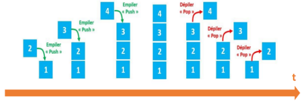{width=60%; : .center }


**Exemple :**

Soit une pile P composée des éléments suivants : 12, 14, 8, 7, 19 et 22 (le sommet de la pile est 22) **Pour chaque exemple ci-dessous on repart de la pile d'origine :** 

- **pop(P)** renvoie 22 et la pile P est maintenant composée des éléments suivants : 12, 14, 8, 7 et 19 (le sommet de la pile est 19) 
- **push(P,42)** la pile P est maintenant composée des éléments suivants : 12, 14, 8, 7, 19, 22 et 42 
- **sommet(P)** renvoie 22, la pile P n'est pas modifiée 
- si on applique pop(P) 6 fois de suite, **pile\_vide(P)** renvoie vrai 
- Après avoir appliqué pop(P) une fois, **taille(P)** renvoie 5

**Remarque** : Pour lire le sommet de la pile sans modifier la pile, on doit le dépiler et le rempiler.

### <a name="_toc151667928"></a>**4.2. ❤️1<sup>ère</sup> implémentation de la structure pile avec les listes de Python❤️**
**Sur Thonny : Toutes les fonctions de cette implémentation doivent être  dans le même fichier python appelé pile\_list.py**

Nous utiliserons une simple liste pour représenter la pile. Il se trouve que les méthodes append et pop sur les listes jouent déjà le rôle de **push (empile)** et **pop (depile)** sur les piles.


**Activité n° 26 : Structure pile avec les listes :** Compléter la **structure de base** suivante :

**Remarque** : La fonction empiler ne renvoie rien.
```python
'''Implémentation de type abstrait Pile en utilisant les listes de Python'''

def pileVide() :
    pass

def estVide(pile) :
    pass

def empiler(pile, element) :
    pass

def depiler(pile)
    pass

# Programme principal
if __name__ == '__main__':
    ma_pile = pileVide()
    assert estVide(ma_pile) == True
    empiler(ma_pile, 'Lundi')
    empiler(ma_pile, 'Mardi')
    empiler(ma_pile, 'Mercredi')
    assert estVide(ma_pile) == False
    assert depiler(ma_pile) == 'Mercredi'
    assert depiler(ma_pile) == 'Mardi'
    assert depiler(ma_pile) == 'Lundi'
    assert depiler(ma_pile) == 'Pile vide'
```

**Activité n° 27 : Structure pile avec les listes :** On va rajouter à la structure de base précédente deux fonctions : ```taille``` et ```sommet``` qui permettent respectivement de retourner la taille de la pile (sans utiliser la fonction de python len !!) et le sommet de la pile (sans utiliser les indices !!). On ne pourra utiliser seulement les fonctions primitives précédentes et en devra récupérer la pile originelle telle qu’elle était.

On pourra s’aider d’une  pile auxiliaire.
```python
def taille(pile):
    pass
def sommet(pile):
    pass

# Programme principal
if __name__ == '__main__':
    ma_pile = pileVide()
    empiler(ma_pile, 'Lundi')
    empiler(ma_pile, 'Mardi')
    empiler(ma_pile, 'Mercredi')
    assert taille(ma_pile) == 3
    assert sommet(ma_pile) == 'Mercredi'
```


### <a name="_toc151667929"></a>**4.3. ❤️2<sup>ème</sup> implémentation de la structure pile avec la POO et les lists de Python❤️**
**Sur Thonny : Toutes les fonctions de cette implémentation doivent être  dans le même fichier python appelé pile\_POO\_list.py**

**Activité n° 28 : Structure pile avec la POO et les lists de Python :** Créer une classe Pile qui construit une liste vide, puis compléter les autres méthodes de la classe  :
```python
'''Implémentation 3 de type abstrait Liste en utilisant la POO et les listes de Python'''

class Pile:
    '''Classe permettant de créer des piles'''
    def __init__(self):
        pass

    def estVide(self) :
        pass

    def empiler(self, element) :
        pass

    def depiler(self):
        pass

if __name__ == '__main__':
    p = Pile()
    for i in range(4):
        p.empiler(2 * i)
```
Tester :
```
>>> p.estVide() 
>>> p.depiler()
>>> p.depiler()
>>> p.depiler()
>>> p.depiler()
>>> p.depiler()
```

**Activité n° 29 : Structure pile avec la POO et les lists de Python:** On va rajouter à la structure de base précédente deux méthodes de la classe Pile : ```taille``` et ```sommet``` qui permettent respectivement de retourner la taille de la pile (sans utiliser la fonction de python len !!) et le sommet de la pile (sans utiliser les indices !!). On ne pourra utiliser seulement les fonctions primitives précédentes et en devra récupérer la pile originelle telle qu’elle était.

On pourra s’aider d’une  pile auxiliaire.
```python
    def taille(self):
        pass

    def sommet(self):
        pass 

if __name__ == '__main__':
    p = Pile()
    for i in range(4):
        p.empiler(2 * i)
```
Tester
```
>>> p.taille()
>>> p.sommet()
```

Ici, **tous les coûts d’exécution sont unitaires.**

**Activité n° 30 : Structure pile avec la POO et les lists de Python:** On va rajouter à la structure une méthode de la classe Pile : afficher qui permet d’afficher (retourner) la pile sous forme de liste .
```python
    def afficher(self):
        pass
```
Tester :
```
>>> p.afficher()
[0, 2, 4, 6, 8]
```

### <a name="_toc151667930"></a>**4.4. ❤️3<sup>ème</sup> implémentation de la structure pile avec la POO et les listes chainée❤️**
La version à une classe est plus simple, elle peut être suffisante, mais les puristes préfèrent la version à deux classes qui colle davantage au modèle théorique proche des listes dans lequel une pile est soit une cellule, soit une pile vide.

**Activité n° 31 : Structure pile avec la POO et les listes chainée version 1 classe :** Créer une classe Pile qui peut recevoir deux paramètres lors de l'appel du constructeur : un paramètre value et un paramètre next. Les deux valeurs transmises devront être stockées dans deux attributs nommés v et n.

**Sur Thonny : Toutes les fonctions de cette implémentation doivent être  dans le même fichier python appelé pile\_POO\_v1.py**

Et compléter la structure suivante :
```python
'''Implémentation 3 de type abstrait Liste en utilisant la POO et les listes chainées version 1 classe'''

class Pile:
    def __init__(self, value=None, next=None):
        pass

    def estVide(self) :
        pass

    def empiler(self, element) :
        pass

    def depiler(self):
        pass
```

Que faut il écrire dans la console pour :

1. Créer une pile p ?

2. Tester si p est vide ?

3. Empiler dans p : Lundi, Mardi, Mercredi

4. Tester si p est vide ?

5. Dépiler toute la pile p

**Remarque** on pourra afficher les piles construites en ajoutant la méthode \_\_str\_\_
```python
    def __str__(self): # on peut mettre __repr__ à la place pour éviter de taper print
        pass
```
Ajouter les deux méthodes ```taille``` et ```sommet```
```python
    def taille(self) :
        pass

    def sommet(self) :
        pass

if __name__ == '__main__':
    p = Pile()
    p.empiler('Lundi')
    p.empiler('Mardi')
    p.empiler('Mercredi')
    print(p.taille())
    print(p.sommet())
```

**Activité n° 32 : Structure pile avec la POO et les listes chainée version 2 classes :** Créer une classe Node qui peut recevoir deux paramètres lors de l'appel du constructeur : un paramètre ```value``` et un paramètre ```next```. Les deux valeurs transmises devront être stockées dans deux attributs nommés ```v``` et ```n```.

**Sur Thonny : Toutes les fonctions de cette implémentation doivent être  dans le même fichier python appelé pile\_POO\_v2.py**

Et compléter la structure suivante :
```python
'''Implémentation 3 de type abstrait Liste en utilisant la POO et les listes chainées version 2 classes'''

class Node:
    def __init__(self, value=None, next=None):
        pass

class Pile:
    def __init__(self, c=None):
        pass

    def estVide(self) :
        pass

    def empiler(self, element) :
        pass

    def depiler(self):
        pass
```
Que faut-il écrire dans la console pour :

1. Créer une pile p ?

2. Tester si p est vide ?

3. Empiler dans p : Lundi, Mardi, Mercredi

4. Tester si p est vide ?<

5. Dépiler toute la pile p

**Remarque** On pourra afficher les piles construites avec les fonctions ```afficherListe``` et ```recupererValeur```  des Listes chainées
```python
def afficherListe(L):
    tableau = recupererValeur(L.cellule)
    return str(tuple(tableau))

def recupererValeur(cellule):
    if cellule.n == None:
        return [cellule.v]
    else:
        return [cellule.v] + recupererValeur(cellule.n)
```

**Activité n° 33 : Structure pile avec la POO et les listes chainée version 2 classes :** rajouter aux structures précédentes deux fonctions ```taille``` et ```sommet``` qui permettent le retourner la taille et de retourner le sommet de la pile 
```python
    def taille(self) :
        pass

    def sommet(self) :
        pass

if __name__ == '__main__':
    p = Pile()
    p.empiler('Lundi')
    p.empiler('Mardi')
    p.empiler('Mercredi')
    print(p.taille())
    print(p.sommet())
```

- **Pour plus de fonctions…. => EXERCICE**

**[vidéo le crépier psychorigide](https://ladigitale.dev/digiview/#/v/66b7280a8b3b5)**


## <a name="_toc151667931"></a>**5. Les files**
### <a name="_toc151667932"></a>**5.1. Généralités**
En informatique, une **file** (queue en anglais) est une structure de données basée sur le principe « Premier entré, premier sorti », en anglais **FIFO (First In, First Out)**, ce qui veut dire que les premiers éléments ajoutés à la file seront les premiers à être récupérés.


{width=30%; : .center }

Voici quelques exemples d’usage courant d’une file :

- En général, on utilise des **files pour mémoriser temporairement** des transactions qui doivent attendre pour être traitées
- Les **serveurs d’impression**, qui doivent traiter les requêtes dans l’ordre dans lequel elles arrivent, et les insèrent dans une file d’attente (ou une queue).
- Certains **moteurs multitâches**, dans un système d’exploitation, qui doivent accorder du temps machine à chaque tache, sans en privilégier aucune.
- Gestion des clients arrivant dans un magasin, gestion des stock
- …

Les primitives communément utilisées pour manipuler des files :

- **créer une file vide**
- **enfiler** : ajoute un élément dans la file (en anglais : « **enqueue** »)
- **défiler** : renvoie le prochaine élément de la file, et le retire de la file (en anglais : « **dequeue** »)
- **estVide** : renvoie True si la file est vide, False sinon

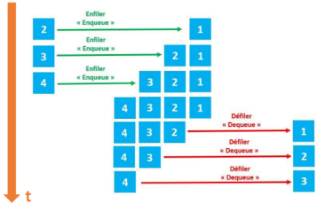{width=60%; : .center }


**Exemple :** Exemples : Soit une file F composée des éléments suivants : 12, 14, 8, 7, 19 et 22 (le premier élément rentré dans la file est 22 ; le dernier élément rentré dans la file est 12). Pour chaque exemple ci-dessous on repart de la file d'origine : 

- **enfiler(F,42)** la file F est maintenant composée des éléments suivants : 42, 12, 14, 8, 7, 19 et 22 (le premier élément rentré dans la file est 22 ; le dernier élément rentré dans la file est 42) 
- **defiler(F)** la file F est maintenant composée des éléments suivants : 12, 14, 8, 7, et 19 (le premier élément rentré dans la file est 19 ; le dernier élément rentré dans la file est 12) 
- si on applique **defiler(F) 6 fois de suite,** estVide(F) **renvoie vrai** 

### <a name="_toc151667933"></a>**5.2. ❤️1<sup>ère</sup> implémentation de la structure file avec les listes de Python❤️**

**Sur Thonny : Toutes les fonctions de cette implémentation doivent être  dans le même fichier python appelé file\_list.py**

On peut utiliser une implémentation similaire à celle des piles, mais si ```defiler``` renvoie l’élément de tête, ```enfiler``` doit placer le nouvel élément à la queue de la file. Pour cela, on doit remonter toute la file. L’opération ```enfiler``` est alors en **temps linéaire**.

Nous utiliserons une simple liste pour représenter la pile. Là encore nous utiliserons append(x) et pop(0) pour réaliser les méthode enfiler et defiler.

**Activité n° 34 : Structure file avec les listes :** Compléter la **structure de base** suivante :

**Remarque** : La fonction enfiler ne renvoie rien.
```python
'''Implémentation de type abstrait File en utilisant les listes de Python'''

def fileVide() :
    pass

def estVide(file) :
    pass

def enfiler(file, element) :
    pass

def defiler(file)
    pass

# Programme principal
if __name__ == '__main__':
    ma_file = fileVide()
    assert estVide(ma_file) == True
    enfiler(ma_file, 'Lundi')
    enfiler(ma_file, 'Mardi')
    enfiler(ma_file, 'Mercredi')
    assert estVide(ma_file) == False
    assert defiler(ma_file) == 'Lundi'
    assert defiler(ma_file) == 'Mardi'
    assert defiler(ma_file) == 'Mercredi'
    assert defiler(ma_file) == 'File vide'
```


**Activité n° 35 : Structure file avec les listes :** On va rajouter à la structure de base précédente deux fonctions : ```taille``` et ```sommet``` qui permettent respectivement de retourner la taille de la file (sans utiliser la fonction de python len !!) et le sommet de la file (sans utiliser les indices !!). On ne pourra utiliser seulement les fonctions primitives précédentes et en devra récupérer la file originelle telle qu’elle était.
```python
def taille(file):
    pass
def sommet(file):
    pass

# Programme principal
if __name__ == '__main__':
    ma_file = fileVide()
   
    enfiler(ma_file, 'Lundi')
    enfiler(ma_file, 'Mardi')
    enfiler(ma_file, 'Mercredi')
    assert taille(ma_file) == 3
    assert sommet(ma_file) == 'Lundi'
```

### <a name="_toc151667934"></a>**5.3. ❤️2<sup>ème</sup> implémentation de la structure file avec la POO et les lists de Python❤️**

**Sur Thonny : Toutes les fonctions de cette implémentation doivent être  dans le même fichier python appelé file\_POO\_list.py**

**Activité n° 36 : Structure File avec la POO et les lists de Python :** Créer une classe File qui construit une liste vide, puis compléter les autres méthodes de la classe  :
```python
'''Implémentation 3 de type abstrait Liste en utilisant la POO et les listes de Python'''

class File:
    '''Classe permettant de créer des files'''
    def __init__(self):
        pass

    def estVide(self) :
        pass

    def enfiler(self, element) :
        pass

    def defiler(self):
        pass

# Programme principal
if __name__ == '__main__':
    ma_file = File()
    assert ma_file.estVide() == True
    ma_file.enfiler('Lundi')
    ma_file.enfiler('Mardi')
    ma_file.enfiler('Mercredi')
    assert ma_file.estVide() == False
    assert ma_file.defiler() == 'Lundi'
    assert ma_file.defiler() == 'Mardi'
    assert ma_file.defiler() == 'Mercredi'
    assert ma_file.defiler() == 'File vide'
```


**Activité n° 37 : Structure file avec la POO et les lists de Python:** On va rajouter à la structure de base précédente deux méthodes de la classe File : ```taille``` et ```sommet``` qui permettent respectivement de retourner la taille de la pile (sans utiliser la fonction de python len !!) et le sommet de la pile (sans utiliser les indices !!). On ne pourra utiliser seulement les fonctions primitives précédentes et en devra récupérer la pile originelle telle qu’elle était.

On pourra s’aider d’une file auxiliaire.
```python
    def taille(self) :
        pass

    def sommet(self):
        pass
# Programme principal
if __name__ == '__main__':
    ma_file = File()
    ma_file.enfiler('Lundi')
    ma_file.enfiler('Mardi')
    ma_file.enfiler('Mercredi')
    assert ma_file.taille() == 3
    assert ma_file.sommet() == 'Lundi'
```

Ici, **tous les coûts d’exécution sont unitaires.**

**Activité n° 38 : Structure pile avec la POO et les lists de Python:** On va rajouter à la structure une méthode de la classe Pile : afficher qui permet d’afficher (retourner) la pile sous forme de liste .
```python
    def afficher(self) :
        pass
```
Rajouter au programme principal :
```python
    assert ma_file.afficher() == ['Mardi', 'Mercredi', 'Lundi']
```


Cette implémentation est très **peu efficace** 

### <a name="_toc151667935"></a>**5.4. ❤️3<sup>ème</sup> implémentation de la structure file avec la POO et une liste chainée❤️**

**Sur Thonny : Toutes les fonctions de cette implémentation doivent être  dans le même fichier python appelé file\_POO.py**


**Activité n° 39 : Structure pile avec la POO et les listes chainées :** Tester cette implémentation **sur python tutor**
```python
Activité n°1.: Structure pile avec la POO et les listes chainées : Tester cette implémentation sur python tutor

'''Implémentation de type abstrait File avec la POO 
et les listes chainées et deux classes'''

class Node:
    def __init__(self, value = None, next = None):
        self.v = value
        self.n = next

class File:
    def __init__(self, c=None):
        self.cellule = c

    def estVide(self):
        return self.cellule is None

    def enfiler(self, element):
        if self.estVide():
            self.cellule = Node(element)
        else:
            tmp = self.cellule
            while tmp.n != None :
                tmp = tmp.n
            tmp.n = Node(element)

    def defiler(self):
        try:
            val = self.cellule.v
            self.cellule = self.cellule.n
            return val
        except:
            return 'File vide'


# Programme principal
if __name__ == '__main__':
    ma_file = File()
    assert ma_file.estVide() == True
    ma_file.enfiler('Lundi')
    ma_file.enfiler('Mardi')
    ma_file.enfiler('Mercredi')
    assert ma_file.estVide() == False
    assert ma_file.defiler() == 'Lundi'
    assert ma_file.defiler() == 'Mardi'
    assert ma_file.defiler() == 'Mercredi'
    assert ma_file.defiler() == 'File vide'
```


### <a name="_toc151667936"></a>**5.5. Autre implémentation des files avec les bibliothèques de Python**
**Activité n°40.: Utilisation de deque pour Implémenter une Pile : Tester cette implémentation**
```python
from collections import deque

# Création de la pile
pile = deque()

# Empiler des éléments
pile.append(10)
pile.append(20)
pile.append(30)

# Afficher la pile
print("Pile après empilage:", pile)

# Dépiler un élément
element = pile.pop()
print("Élément dépilé:", element)

# Regarder l'élément au sommet sans le dépiler
sommet = pile[-1]
print("Élément au sommet:", sommet)

# Vérifier si la pile est vide
est_vide = len(pile) == 0
print("La pile est vide ?", est_vide)
```
**Activité n°41.: Utilisation de deque pour Implémenter une File : Tester cette implémentation**
```python
from collections import deque

# Création de la file
file = deque()

# Enfiler des éléments
file.append(10)
file.append(20)
file.append(30)

# Afficher la file
print("File après enfilage:", file)

# Défiler un élément
element = file.popleft()
print("Élément défilé:", element)

# Regarder l'élément au début sans le défiler
debut = file[0]
print("Élément au début:", debut)

# Vérifier si la file est vide
est_vide = len(file) == 0
print("La file est vide ?", est_vide)
```
Les piles et les files sont des structures de données fondamentales qui peuvent être implémentées de manière efficace en Python à l'aide de listes ou de la classe deque de la bibliothèque collections. L'utilisation de deque est souvent préférée pour des raisons de performance, notamment pour les files.


### <a name="_toc151667937"></a>**5.6. Piles vs Files :**

|**Pile**|**File**|
| :-: | :-: |
|Les objets sont insérés et supprimés à 1 seule extrémité|Les objets sont insérés et retirés aux 2 extrémités.|
|Dans les piles, un seul pointeur est utilisé. Il pointe vers le haut de la pile. |Dans les files, deux pointeurs différents sont utilisés pour les extrémités; le tète et la fin.|
|Dans les piles, le dernier objet inséré est le premier à sortir. |Dans les files, l’objet inséré en premier est le premier qui sera supprimé. |
|Les piles suivent l’ordre Last In First Out (LIFO) |Les files suivent l’ordre First In First Out (FIFO)|
|Les opérations de pile s’appellent « Empiler » et « Dépiler ». |Les opérations de file sont appelées « Enfiler » et « Défiler ».|
|Les piles sont visualisées sous forme de collections verticales. |Les files sont visualisées sous forme de collections horizontales.|


## <a name="_toc151667938"></a>**6. Les dictionnaires**
### <a name="_toc60173193"></a><a name="_toc151667939"></a>**6.1. Définition**
Les dictionnaires ont déjà été étudiés en classe de première. 

Pour rappel, ce type de données, aussi appelé **tableau associatif**, permet de stocker des **valeurs** et d'y accéder au moyen d'une **clé**, contrairement au tableau qui permet d'accéder à une donnée au moyen d'un indice.


**Exemple** : un dictionnaire (le livre) de langues

On suppose que toutes les clés sont distinctes et dans la suite on va se concentrer sur les clés et non pas sur les données associées.
### <a name="_toc60173194"></a><a name="_toc151667940"></a>**6.2. Les opérations de bases dans un dictionnaire**
Les opérations classiques que l'on peut effectuer sur un dictionnaire sont :

- **Ajouter** une nouvelle entrée au dictionnaire en créant une nouvelle clé
- **Modifier** la valeur associée à une clé existante
- **Supprimer** une entrée dans un dictionnaire (méthode .pop())
- **Rechercher** la présence d'une clé dans un dictionnaire


**Attention** : Le dictionnaire de Python permet d’avoir ce comportement mais est une version spécifique à Python de cette donnée plus générale. Ce qui nous intéresse ici c’est d’avoir une structure de données que l’on va interroger et que l’on peut modifier. Le but est de trouver des méthodes pour faire cela efficacement.
### <a name="_toc60173197"></a><a name="_toc151667941"></a>**6.3. Les clés**
Une clé peut être d'un autre type que chaîne de caractère, du moment que c'est un **objet non mutable**, c'est à dire qui ne peut pas être modifié. Une clé ne **peut pas être une liste** par exemple car une liste est un objet mutable que l'on peut modifier, par exemple au travers de la méthode .append().

Regardons ce qui se passe si on essaye de définir une clé de type **list** pour un dictionnaire :
```
>>> dico[[2,1]] = "..."
---------------------------------------------------------------------------
TypeError                                 Traceback (most recent call last)
<ipython-input-4-d463baccae6e> in <module>()
----> 1 dico[[2,1]]
TypeError: unhashable type: 'list'
```
Le type **list** n'est pas pas *hashable*. Mais qu'est-ce que le hachage ?
### <a name="_toc151667942"></a>**6.4. Hachage**
La notion de *Hachage* est omiprésente en informatique et est au coeur du fonctionnement des dictionnaires. Le hachage est un mécanisme permettant de transformer la clé en un nombre unique permettant l'accès à la donnée, un peu à la manière d'un indice dans un tableau.
#### **6.4.1. Définition d’une fonction de hachage**
Une fonction de hachage est une fonction qui va calculer une empreinte unique à partir de la donnée fournie en entrée. Elle doit respecter les règles suivantes :

- La longueur de l'empreinte (valeur retournée par la fonction de hachage) doit être toujours la même, indépendamment de la donnée fournie en entrée.
- Connaissant l'empreinte, il ne doit pas être possible de reconstituer la donnée d'origine
- des données différentes doivent donner *dans la mesure du possible* des empreintes différentes.
- des données identiques doivent donner des empreintes identiques.

#### **6.4.2. Quelques utilisations du hachage**
L'utilisation la plus courante est le stockage des mots de passe dans un système informatique un peu sécurisé. En effet, lorsqu'on crée un compte sur un service en ligne, le mot de passe ne **doit pas être stocké en clair**, une empreinte est générée afin que si le service est piraté et que les comptes sont dérobés, il ne soit pas possible de reconstituer le mot de passe à partir de l'empreinte. Voici un exemple de fonctionnement d'une fonction de hachage.

Nous utiliserons le hachage accessible sous *Python* au travers de la fonction hash() :
```
>>> hash("Aldébaran")
7932194494807972993
>>> hash("Aldebaran")
-2778791670536604289
>>> hash("Andjekel Aldébaran")
-8861304277632426640
```

On constate bien sur cet exemple que :

- toutes les empreintes ont la même longueur
- un petit changement dans la valeur d'entrée fournit une empreinte totalement différentes

Une autre utilisation du hachage est la détection de la modification d'un fichier.

Ainsi la fonction de hachage peut mettre en évidence des différences qui seraient invisibles à l'oeil nu.

#### **6.4.3. Table de Hachage**
Regardez la vidéo ci-dessous sur les tables de hachage.

Tables de hash : <https://ladigitale.dev/digiview/#/v/66bcbaf4e545d>

Ce qui est important à retenir c'est que la recherche dans une table de hachage **est indépendante du nombre d'éléments dans cette table.**

Dans un tableau ou une liste chaînée au contraire, la recherche d'un élément prend un temps **proportionnel** au nombre d'éléments dans la structure.

Dans un dictionnaire, les clés sont stockées dans une table de hachage, ce qui explique le fait que le dictionnaire est optimisé pour la recherche sur les clés.
### <a name="_toc151667943"></a>**6.5. Rappel : Utilisation des dictionnaires en Python**
Vous pouvez à présent regarder la vidéo suivante afin de vous reviser la manipulation des dictionnaires en python.

Les dictionnaires : <https://ladigitale.dev/digiview/#/v/66bcbd45219a3> 

**Activité n° 42 : Itérer sur les éléments d’un dictionnaire :** </p><p>Au zoo de Beauval, il y a 5 éléphants d’Asie, 17 écureuils d’Asie, 2 pandas d’Asie, etc. On représente cet inventaire à l’aide d’un dictionnaire, de façon suivante :
```python
if __name__ == "__main__":
    zoo_Beauval = {
        'éléphant': ('Asie', 5),
        'écureuil': ('Asie', 17),
        'panda': ('Asie', 2),
        'hippopotame': ('Afrique', 7),
        'girafe': ('Afrique', 4),
        'lion': ('Afrique', 17)
    }
```
On représente de la même façon le zoo de La Flèche :
```python
    zoo_LaFleche = {
        'ours': ('Europe', 4),
        'tigre': ('Asie', 7),
        'girafe': ('Afrique', 11),
        'hippopotame': ('Afrique', 3)
    }
```
On souhaite se doter d’une fonction **plus\_grand\_nombre()** qui prend un zoo en paramètre et qui renvoie le nom de l’animal le plus représenté dans ce zoo.

Par exemple
```python
assert plus_grand_nombre(zoo_LaFleche) == 'girafe'
assert plus_grand_nombre(zoo_Beauval) == 'écureuil'
```

1. Quel type de boucle peut-on envisager pour le code de cette fonction ?
```python
for cle in dico.keys()
for valeur in dico.values()
for (cle, valeur) in dico.items()
Aucune boucle.
```
2. Écrire le corps de cette fonction.

On souhaite se doter d’une fonction **nombre\_total** qui prend un zoo en paramètre ainsi que le nom d’un continent, et qui renvoie le nombre d’animaux originaires de ce continent dans le zoo. 

Par exemple :
```python
assert nombre_total(zoo_LaFleche, 'Afrique') == 14
assert nombre_total(zoo_Beauval, 'Asie') == 24
```
3. Quel type de boucle peut-on envisager pour le code de cette fonction ?
```python
for cle in dico.keys()
for valeur in dico.values()
for (cle,valeur) in dico.items()
Aucune boucle.
```
4. Écrire le code de cette fonction.

On souhaite se doter d’une fonction nombre qui prend un zoo en paramètre ainsi que le nom d’un animal, et qui renvoie le nombre de représentants de cet animal dans le zoo. 

Par exemple :
```python
assert nombre(zoo_LaFleche, 'panda') == 0
assert nombre(zoo_Beauval, 'panda') == 2
```
5. Quel type de boucle peut-on envisager pour le code de cette fonction ?
```python
for cle in dico.keys()
for valeur in dico.values()
for (cle,valeur) in dico.items()
Aucune boucle.
```
6. Écrire le code de cette fonction.


Le temps de recherche dans le dictionnaire est **pratiquement indépendant du nombre d'entrées** dans un dictionnaire (en multipliant le nombre de contacts par 100, le temps est resté pratiquement identique alors que dans le cas de la recherche dans un tableau, celui-ci est proportionnel à la longueur du tableau).

Le dictionnaire est donc une **structure de données optimisée** pour la recherche sur les clés.


### <a name="_toc151667944"></a>**6.6. La complexité**

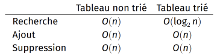{width=50%; : .center }

Dans les deux cas ce n’est pas très efficace : on voudrait une **complexité logarithmique de toutes ces opérations**. On peut faire cela en utilisant des structures de données : **les arbres binaires**

## <a name="_toc151667945"></a>**7. Exercices** 

**=> CAPYTALE Le code vous sera donné par votre enseignant**

**Exercice n°1: Implémentation d’une file avec deux piles avec les listes chainées**

Comment créer une file avec 2 piles ?

L'idée est la suivante : on crée une pile d'entrée et une pile de sortie.

- quand on veut enfiler, on empile sur la pile d'entrée.
- quand on veut défiler, on dépile sur la pile de sortie.
- si celle-ci est vide, on dépile entièrement la pile d'entrée dans la pile de sortie.

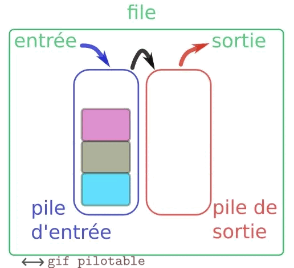{width=50%; : .center }


```python
# il est impératif de comprendre qu'on peut choisir l'implémentation
# de la classe Pile qu'on préfère parmi les deux traitées plus haut.
# Comme elles ont la MÊME INTERFACE et qu'on ne va se servir que
# de cette interface, leur mécanisme interne n'a aucune influence
# sur le code de la classe File que nous ferons ensuite.

# Par exemple, on choisit celle avec la liste chaînée :

class Cellule :
    def __init__(self, contenu, suivante):
        pass

class Pile:
    def __init__(self):
        pass

    def est_vide(self):
        pass

    def empile(self, x):
        pass

    def depile(self):
        pass

    def __str__(self):
        s = "|"
        c = self.data
        while c != None :
            s += str(c.contenu)+"|"
            c = c.suivante
        return s

# -------------------------------------------------------    
# Implémentation d'une file à l'aide de deux piles 

class File:
    def __init__(self):
        self.entree = Pile()
        self.sortie = Pile()

    def est_vide(self):
        pass

    def enfile(self,x):
        pass

    def defile(self):
        pass
```


**Exercice n°2 : Structure de données** 

Quelle structure de données choisir pour chacune de ces tâches ? 

1. Représenter un répertoire téléphonique.
1. Stocker l'historique des actions effectuées dans un logiciel et disposer d'une commande Annuler (ou Undo).
1. Envoyer des fichiers au serveur d'impression

**Exercice n°3 : La calculatrice HP**

La Notation Polonaise Inversée (NPI) permet d'écrire des opérations arithmétiques, sans utiliser de parenthèses. Ici, nous nous limiterons à des nombres entiers naturels et aux opérations+, -, \* et/ sur eux. Dans cette notation, les opérateurs sont écrits après les opérandes (nombres entiers naturels). Par exemple l'expression classique : 

13\*(3+2)

Donne en NPI 

3 2 +13 \*

On écrit et on exécute les opérations dans le sens des priorités vues en cours de mathématiques. Dans cette notation, on réalise

- L'addition entre 3 et 2 ( 3 2 + )
- La multiplication entre le précédent résultat et 13 ( 13 \*)
- On a ainsi le résultat.


1 Donner la File correspondante à la saisie NPI de l'exemple. Faire de même avec la Pile.
2 Quelle est la structure adaptée à la résolution de l'expression ?

Note : On remarquera qu'on doit toujours avoir 2 opérandes pour un opérateur. li faut stocker le résultat intermédiaire dans la structure pour effectuer la suite des calculs.

3 En utilisant les opérations du type abstrait Pile, proposer une fonction permettant d'afficher le résultat d'une expression en NPI.

Note : On supposera également que la syntaxe en NPI est correcte.

**Exercice n°4 : Types abstraits**

1\. Quelle opération ne fait pas partie de l'interface d'une pile ?

1. ajouter un élément à la pile 
1. retirer l'élément le plus récent de la pile 
1. retirer l'élément le plus ancien de la pile 

2\. Quelle opération ne fait pas partie de l'interface d'une file?

1. ajouter un élément à la file 
1. retirer l'élément le plus récent de la file 
1. retirer l'élément le plus ancien de la file 

3\. L'opération dequeue d'une file s'exécute en un temps qui est proportionnel au nombre de valeurs stockées dans la file.

1. Faux 
1. Vrai

4\. Un tableau associatif permet de créer une association clé -> valeur.

Pour stocker des numéros de téléphone à l'aide d'un tableau associatif, quelle solution semble préférable, dans la mesure où il peut y avoir des homonymes?

1. La clé est le numéro de téléphone, et la valeur est le nom correspondant 
1. La clé est le nom et la valeur est le numéro de téléphone correspondant 
1. La clé est le nom et la valeur la collection des numéros de téléphone correspondants 
1. La clé est un simple numéro unique et la valeur le couple nom/téléphone

**Exercice n°5 : Type list en Python**

1\. Le type list utilisé dans Python correspond le mieux :

1. au type abstrait liste chaînée 
1. au type abstrait file 
1. au type abstrait tableau 

2\. La récupération d'un élément d'un objet Python de type list, connaissant son indice :

1. nécessite un temps proportionnel au nombre d'éléments de la liste 
1. s'effectue en temps constant 
1. est impossible 

3\. Sur un objet de type list Python, quelles opérations sont faites en un temps indépendant de la longueur de la liste?

1. supprimer le premier élément 
1. supprimer le dernier élément
1. ajouter un élément au début (en position 0)
1. ajouter un élément à la fin

**Exercice n°6 : Structures de donnés Python**

1\. Pour implémenter une pile avec Python, on peut se servir d'un type de données disponible dans le langage :

1. le type list 
1. le type dict 
1. le type set 
1. le type tuple 

2\. Accéder à une valeur dans un dictionnaire à partir de la clé à laquelle la valeur est associée est réalisé :

1. en un temps proportionnel à la taille du dictionnaire 
1. en un temps constant 


**Exercice n°7 : Pile classique**

Nous allons réaliser une classe Pile en utilisant une liste Python. Voici le contructeur de la classe

```python
class Pile:
   """Structure  de  pile"""
   def init (self): 
      self.contenu = []
```


1 Implémentez la méthode est\_vide(self) qui retourne True si la Pile est vide et False sinon.

2 Implémentez la méthode empiler(self,v) qui ajoute la valeur v au sommet de la pile (et donc en fin de la liste)

3 Implémentez la méthode depiler(self) qui :

   1. lève une exception *IndexError* si la liste est vide ;
   1. sinon, retire l’élément au sommet de la pile et le retourne.

4 **Bonus :** Vous pouvez implémenter la méthode spéciale str (self)

**Exercice n°8 : File en deux piles**

Supposons que nous ayons deux piles et aucune autre variable temporaire. Est-il possible de "construire" une structure de données en file d’attente en utilisant uniquement les deux piles ? Nous supposerons que nous avons implémenté  les  méthodes  est\_vide,  empiler  et depiler.

1 Imaginer comment réaliser une file à l’aide de deux piles nommées entree et sortie.
2 En utilisant la classe Pile de l’exercice précédent, réaliser la classe File avec les méthodes :
   - ```est_vide(self)``` qui renvoie True si la file est vide ;
   - ```ajouter(self,v)``` qui stocke la valeur v dans la file ;
   - ```retirer(self)``` qui retire et retourne la valeur du début de file (la première en attente). Cette méthode  soulève une exception IndexError si on l’applique sur une file vide.


**Exercice n°9 : pile ou file et parenthèse**

On dit qu’une chaîne de caractères comprenant, entre autre choses, des parenthèses ( et ) est bien parenthésée lorsque chaque parenthèse ouvrante est associée à une unique parenthèse fermante, et réciproquement.

Ecrire une fonction prenant en paramètres :

- une chaîne de caractères bien parenthésée ;
- l’indice d’une parenthèse fermante.

et qui retourne l’indice de la parenthèse ouvrante associée.

**Exercice n°10 : file et copie**

Vous allez améliorer la classe file en lui ajoutant quelques fonctionnalités. Vous pouvez utiliser, comme base de travail, l’implémentation des files avec les doubles piles ou celle avec les listes chaînées  

1. Ajouter la méthode spéciale len (self) qui renvoie la longueur d’une file.
1. Ecrire une fonction copie\_file(f) recevant une file (f) comme argument et renvoyant une copie f2 de f. Attention, la file f doit (bien sûr) être conservée !


**Exercice n°11 : Le problème de Josephus**

Josephus Flavius était un célèbre historien du premier siècle. Durant une guerre il fut pris au piège dans une cave avec son groupe de 40 soldats, entouré par les troupes ennemies. La légende raconte que le groupe encerclé préféra se suicider plutôt que d'être capturé. Ainsi Josephus et ses soldats formèrent un cercle et décidèrent de se tuer mutuellement et successivement, de manière à ce qu'une personne tue la troisième personne sur sa gauche, que la personne à droite du mort tue à son tour la troisième personne sur sa gauche, ainsi de suite jusqu'à ce qu'il ne reste qu'un seul survivant. Restant seul, ce dernier est censé se suicider lui-même. Josephus, qui ne souhaitait pas mourir, trouva rapidement la place sûre, c'est-à-dire la place de la dernière personne debout, sans que quiconque ne reste pour le tuer. Ainsi il resta en vie et put par la suite raconter cette légende. Trouver cette place sûre est maintenant appelé le problème de Josephus.

Durant cet exercice nous implémenterons un programme qui simulera une version généralisée du problème de Josephus de la manière suivante : étant donnés n soldats, placés en cercle aux positions [0 ; n-1] avec 0 comme position de départ, il faut retirer chaque m-ième soldat jusqu'à ce que tous les soldats (même Josephus pour simplifier les choses) soient retirés.

Dans l'exemple ci-dessous, nous commençons avec 8 soldats, et nous tuons à chaque tour le troisième soldat sur la gauche (remarquez que lorsqu'il reste au plus trois personnes vivantes, le soldat tuant se compte lui-même dans cette distance de trois soldats):

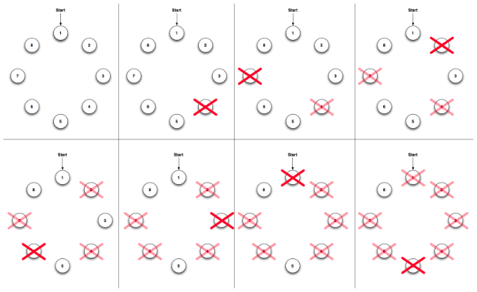{width=80%; : .center }

Le programme que vous devez développer devra prendre comme entrées les nombres n et m, respectivement le nombre de soldats et la distance (dans l'exemple nous avons n=8 et m=3), et produire comme sortie l'ordre dans lequel les soldats seront tués, le dernier "tué" étant finalement le survivant :

4 7 2 6 3 1 5 8 The surviving soldier is 8

c'est-à-dire que le soldat à la position 4 est le premier à être tué, et 8 est la place sûre recherchée par Josephus.

La fonction josephus qui fait appel à la TAD file est donnée ci-dessous
```python
def josephus(liste, module):
    f = File()
    for personne in liste :
        f.enfiler(personne)
    while not(f.estVide()):
        p = f.enfiler()
    return p
```


Implémenter la file avec une liste chainée pour que la fonction josephus([1, 2, 3, 4, 5, 6, 7, 8], 3) renvoie 8

Pour simplifier on peut d’abord sortir : 3 6 1 5 2 8 4 7 the last one is 7

**Exercice n°12 : Le jeu de cartes : bataille** 

Compléter le programme ci-dessous du jeu de la bataille. Sur **Thonny** : On l’appelera bataille.py

Vous aurez à  gérer d'une part la valeur des cartes et d'autre part les cas d'égalités.

**Indice** : il faut créer une file égalité.

Le programme partiel du jeu de bataille :

**Créer et importer une File**

```python
import random

paquet_alice = File()
paquet_basile = File()

# crée le jeu de 52 cartes
cartes = [i for i in range(0, 52)]
# melange les cartes
random.shuffle(cartes)
# distribue les cartes aux 2 joueurs
for i in range(len(cartes) // 2):
    paquet_alice.enfiler(cartes.pop())
    paquet_basile.enfiler(cartes.pop())


# Gestion d'un tour de jeu
def tour():
    global en_cours
    if paquet_alice.estVide():
        print("Alice perd")
        en_cours = False
    elif paquet_basile.estVide():
        print("Basile perd")
        en_cours = False
    else:
        tirer()


# Si la partie n'est pas terminée, tirage d'une carte
def tirer():
    a = paquet_alice.defiler()
    b = paquet_basile.defiler()

    valeura = a % 13
    valeurb = b % 13
    print("Alice", valeura, valeurb, "Basile")
    # le programme ne gere pas l'égalité
    if valeura > valeurb:
        paquet_alice.enfiler(a)
        paquet_alice.enfiler(b)
    elif valeura < valeurb:
        paquet_basile.enfiler(b)
        paquet_basile.enfiler(a)


# démarrage du jeu
en_cours = True
nb_tours = 0
while en_cours:  # not paquet_alice.est_vide() and not paquet_basile.est_vide()  :
    tour()
    nb_tours += 1
print("Partie en ", nb_tours, " tours")
```

Ne pas oublier de mettre le bon fichier file au même endroit que celui-ci

Une fois terminé les modifications, vous transformerez le programme bataille en classe Bataille avec toutes les fonctions encapsulé dans cette-ci.

## <a name="_toc151667946"></a>**8. Projets**
**Exercice n°01 : Pile et contrôle du parenthésage d’une expression**

**=> CAPYTALE Le code vous sera donné par votre enseignant**

Il s’agit d’écrire une fonction qui contrôle si une expression mathématique, donnée sous forme d’une chaine de caractères, est bien parenthésée, c’est-à-dire s’il y a autant de parenthèses ouvrantes que de fermantes, et qu’elles sont bien placées. Par exemple :

- (()) est bien parenthésée
- ())( ne l’est pas

L’algorithme :

On crée une pile

On parcourt l’expression de gauche à droite

A chaque fois que l’on rencontre une parenthèse ouvrante "( " on l’empile.

Si on rencontre une parenthèse fermante " ) " et que la pile n’est pas vide on dépile (sinon on retourne faux). 

A la fin la pile doit être vide…

Ecrire une fonction verification(expression) qui prend en paramètre une chaine de caractère qui retourne OK si l’expression est bien parenthésée et NON sinon

**Exercice n°02 : implémentation d’une liste chainée**

**=> CAPYTALE Le code vous sera donné par votre enseignant**

A partir de ce qui a été vu sur les liste chainée, implémenter :

1. La méthode lenListe(self) qui retourne la longueur de la liste
1. La méthode get\_node\_index(self, i) qui permet de retourner la cellule d’indice i. Déterminer son ordre de complexité
1. La méthode insert\_next(self, i, x) qui ajoute une cellule contenant la valeur x après la cellule d’indice i. Déterminer sa complexité
1. La méthode delete\_head(self) qui supprime la première cellule de la liste. Déterminer sa complexité
1. la méthode delete\_next(self, x) qui supprime la cellule située après la cellule de valeur x et le renvoie

**Exercice n°03 : Pile et palindromes**

**=> CAPYTALE Le code vous sera donné par votre enseignant**

Un palindrome est un mot qui se lit de la même façon de gauche à droite et de droite à gauche. Par exemple, abababa et un palindrome, ainsi que kayac et coloc.

Les piles sont des structures très utiles pour détecter les palindromes : on peut lire le mot jusqu’à sa moitié, et empiler les lettres qu’on lit, puis arrivé à la moitié on lit les lettres tout en dépilant et en regardant si le résultat du dépilage correspond à la lettre lue. Si ce n’est pas le cas, le mot en entrée n’est pas un palindrome.

S’il y a toujours égalité, c’est un palindrome.

Il faut faire attention à distinguer les mots de longueur paire et impaire. Si le mot est pair, de longueur 2n, on lit n lettres en empilant, puis n lettres en dépilant. Si le mot est impair, de longueur 2n+1, on lit n lettres en empilant, on lit la lettre du milieu sans rien faire, puis on lit n lettres en dépilant.

1 sur **Thonny** : Créer un fichier python pile.py

2 Créer une classe Pile avec Un constructeur \_\_init\_\_() initialisant l’attribut **privé** que l’on appellera container à [] (liste vide Python)

3 Implémenter la méthode publique get\_container dont le prototype est : get\_container(self) -> list et qui renvoie le contenu de la pile.

4 Implémenter la méthode publique size() dont le prototypage est le suivant : size(self) -> int et qui renvoie la taille de la liste

5 Implémenter la méthode publique is\_empty() qui renvoie True si la pile stockée dans le container est vide et False sinon. Le prototype est : is\_empty(self) -> bool

6 Implémenter la méthode publique push(item) qui ajoute à la fin de la liste. On empile !!

7 Implémenter la méthode publique pop() qui :

- Retourne None si la pile est vide.
- Retourne et enlève l’élément au sommet de la pile, si la pile n’est pas vide.

8 Valider les tests unitaires (avec des assert) suivants à partir d’une pile p qui contient les éléments respectivement empilés 1 et 2 :

- p.is\_empty() == False
- p.get\_container() == [1,2]
- p.pop() == 2

9 Sur **Thonny** : Créer un fichier python palindrome.py

10 Implémenter à l’aide d’une pile une fonction palindrome() qui prend en entrée un mot et renvoie True si c’est un palindrome et False sinon. On donne le prototype de la fonction palindrome(word : str) -> bool.

11 Tester votre programme avec les tests suivants :

- palindrome("kayak")
- palindrome("trust")

**Exercice n°04 : File et ordonnancement**

**=> CAPYTALE Le code vous sera donné par votre enseignant**

L’ordonnancement consiste, pour le système d’exploitation, à optimiser l’utilisation du processeur en lui affectant tour à tour différentes tâches à exécuter. On appelle processus un programme en cours d’exécution. Il peut y en avoir des centaines à la fois sur une machine, alors qu’il n’y a que quelques processeurs (souvent 4).

L’ordonnanceur va répartir le temps de calcul entre les programmes, afin que tous puissent avancer dans leur exécution de manière satisfaisante, et que les programmes qui n’ont pas besoin de temps processeur à un certain moment (par exemple parce qu’ils attendent une réponse de l’utilisateur avant de continuer) ne gaspillent pas de temps de calcul.

La plupart des ordonnanceurs modernes utilisent des files pour garder en mémoire de façon optimale les programmes à exécuter. En effet, tout comme la pile était une structure naturelle pour gérer les palindromes à l’exercice précédent, la file est parfaitement adaptée à l’ordonnancement : les programmes qui demandent du temps de calcul sont insérés en bout de file, et ceux qui seront défilés pour obtenir effectivement du temps processeur sont ceux qui attendent depuis le plus longtemps.

1 Sur **Thonny** : Créer un fichier python file.py

2 Créer une classe File avec Un constructeur \_\_init\_\_() initialisant l’attribut **privé** que l’on appellera container à [] (liste vide Python)

3 Implémenter la méthode publique get\_container dont le prototype est : get\_container(self) -> list et qui renvoie le contenu de la file.

4 Implémenter la méthode publique size() dont le prototypage est le suivant : size(self) -> int et qui renvoie la taille de la liste

5 Implémenter la méthode publique is\_empty() qui renvoie True si la file stockée dans le container est vide et False sinon. Le prototype est : is\_empty(self) -> bool

6 Implémenter la méthode publique queue(item) qui ajoute à la fin de la liste. On enfile !!

7 Implémenter la méthode publique enqueue() qui :

- Retourne None si la file est vide.
- Retourne et enlève l’élément au début de la file, si la file n’est pas vide.

8 Valider les tests unitaires (avec des assert) suivants à partir d’une file f qui contient les éléments respectivement enfilés 1 et 2 :

- f.is\_empty() == False
- f.get\_container() == [1, 2]
- f.enqueue() == 1

9 Sur **Thonny** : Créer un fichier python scheduler.py

10 Créer une classe Activite pour modéliser des activités avec Un constructeur \_\_init\_\_() initialisant ayant trois attributs privés : name, time et priority. Le prototype est le suivant : \_\_init\_\_(self, name : str, time : int, priority : int)

11 Un accesseur (getter) get\_time() qui renvoie la valeur de l’attribut time.

12 Un accesseur (getter) get\_priority() qui renvoie la valeur de l’attribut priority.

13 Une méthode publique execute() qui décrémente l’attribut time d’une valeur passée en paramètre appelée time à la méthode et qui renvoie un booléen indiquant si time est nul (True) ou non (False).

**Aide** : time ne peut en aucun cas être < 0.

14 Une méthode spéciale \_\_repr\_\_(self) renvoyant une chaîne représentant l’activité selon le format : ```<nom activité>: <temps>s [<priorité>]```. 

**Aide** : on utilisera la méthode format() <https://python.sdv.univ-paris-diderot.fr/03_affichage/>

15 Créer une classe Ordonnanceur sur le patron suivant :
```python
import file as fl

class Ordonnanceur:
	def __init__(self, quota=0):
		self.__file  = fl.File()
        self.__quota = int(quota)

	def set_quota(self, quota : int) -> int:
		# à compléter

	def add_activity(self, activity : object):
		# à compléter

	def step(self):
		# à compléter

	def run(self):
		# à compléter
```

16 Compléter la méthode add\_activity() qui ajoute une activité passée en paramètre à la file de processus de l’ordonnanceur.

17 Compléter le mutateur (setter) set\_quota()

18 **★★** Modifier la méthode step() qui effectue un “tour” d’ordonnancement comme suit :

- si la file est vide, on ne fait rien : on attend.
- s’il y a au moins une activité dans la file, on exécute l’activité en affichant son nom et sa durée. Puis, on décrémente son temps d’une unité et si son quota arrive à 0, on enfile l’activité.

19 **★★** Modifier la méthode run() qui itère step jusqu’à obtenir une file de processus vides.

20 **★★** Créer une liste de 10 activités de durée et de priorité aléatoires (durée entre 1 et 10 et priorité entre 0 et 2).

21 **★★** A l’aide d’une boucle, mettre toutes les activités dans la file de l’ordonnanceur puis exécuter l’ordonnanceur.


**Exercice n°05 : Implémentation du type abstrait tableau dynamique en Python**

**=> CAPYTALE Le code vous sera donné par votre enseignant**

**Interface du type abstrait Tableau\_dynamique**

L’interface de la classe est la suivante :
```python
Help on class TableauDynamique in module __main__:

class TableauDynamique(builtins.object)
 |  TableauDynamique() -> 'None'
 |  
 |  Classe implémentant le type « tableau dynamqie »,
 |  version très simplifiée du type « liste » de Python.
 |  
 |  Methods defined here:
 |  
 |  __getitem__(self: 'TableauDynamique', i: 'int') -> 'object'
 |      Retourne l'élément d'indice i.
 |  
 |  __init__(self: 'TableauDynamique') -> 'None'
 |      Création d'un tableau vide à l'initialisation.
 |  
 |  __len__(self: 'TableauDynamique') -> 'int'
 |      Retourne le nombre d'éléments dans le tableau.
 |  
 |  append(self: 'TableauDynamique', obj: 'object') -> 'None'
 |      Ajoute l'élément obj en dernière position dans le tableau.
```


**Implémentation**

1 Créer la classe **TableauDynamique**.

2 Dans la méthode **\_\_init\_\_**, initialiser trois attributs privés **\_nbre**, **\_capacite** et **\_tab** tels que **\_nbre** donne le nombre d’éléments dans le tableau (initialement égal à 0), **\_capacite** donne le nombre maximal possible d’éléments dans le tableau (initialement égal à 1) et **\_tab** référence un tableau créé à l’aide de la fonction **py\_object** du module **ctypes**.

**Remarque :** le code de création du tableau est le suivant :
```python
def _construit_tableau(self: TableauDynamique, capacite: int):
    """
    Construction d'un tableau de capacité donnée.
    """
    return (capacite * ctypes.py_object)()
```

3 Définir la méthode **\_\_len\_\_** dont la spécification est :
```python
def __len__(self: TableauDynamique) -> int:
    """
    Retourne le nombre d'éléments dans le tableau.
    """
```

4 Définir la méthode **\_\_getitem\_\_** dont la spécification est :
```python
def __getitem__(self: TableauDynamique, i: int) -> object:
    """
    Retourne l'élément d'indice i.

    Une exception est levée si l'indice n'appartient
    pas au bon intervalle.
    """
```

5 Définir la méthode privée **\_augmente\_taille** dont la spécification est :
```python
def _augmente_taille(self: TableauDynamique, capacite: int) -> None:
    """
    Crée un nouveau tableau de dimension capacite puis copie tous les
    éléments de l'ancien tableau dans ce dernier.
    Fait en sorte que le nouveau tableau soit le tableau désormais
    utilisé.
    Met à jour l'attribut capacite.
    """
```

6 Définir la méthode **append** dont la spécification est :
```python
def append(self: TableauDynamique, obj: object) -> None:
    """
    Ajoute l'élément obj en dernière position dans le tableau.
    """
```

**Remarque :** La méthode **append** doit appeler la méthode **\_augmente\_taille**.

7 Définir la méthode **\_\_repr\_\_** dont la spécification est :
```python
def __repr__(self: TableauDynamique) -> str:
    """
    Retourne la chaîne de caractères représentant le tableau.
    """
```


8 Tester le bon fonctionnement de la classe.

