---
author: ELP
title: 05b Liste - Pile - File - Dictionnaire
---

📚 **Table des matières**

[1.	🧱 Principaux types abstraits fournis avec le langage Python](#_toc151667915)  
[2.	🧩 Les tableaux](#_toc151667919)  
[3.	🔗 Les listes (chainées)](#_toc151667920)  
[4.	Les piles](#_toc151667926)  
[5.	Les files](#_toc151667931)  
[6.	Les dictionnaires](#_toc151667938)  
[7.	Exercices](#_toc151667945)  
[8.	Projets](#_toc151667946)  

🎯 **Compétences évaluables :**

- ✅ Distinguer des structures par le jeu des méthodes qui les caractérisent.

- ✅ Choisir une structure de données adaptée à la situation à modéliser.

- ✅ Distinguer la recherche d’une valeur dans une liste et dans un dictionnaire.

---

## <H2 STYLE="COLOR:BLUE;">🧱 <a name="_toc151667915"></a>**1. Principaux types abstraits fournis avec le langage Python**</H2>

### <H3 STYLE="COLOR:GREEN;"> <a name="_toc151667916"></a>🧱 **1.1. Liste (`list`)**</H3>

Le type **`list`** de Python repose sur une implémentation par **tableaux dynamiques**.

> ⚠️ **Attention** : Les *listes en Python* ne sont pas des *listes chaînées*, mais bien des **tableaux dynamiques** (équivalents à `array` dans d'autres langages).

Les **listes**, **piles** (`stack`) et **files** (`queue`) sont des **structures de données abstraites** fondamentales.  
Elles diffèrent principalement par **les règles d’ajout et d’accès aux éléments** qu’elles imposent.

---

### <H3 STYLE="COLOR:GREEN;"> <a name="_toc151667917"></a>🧩 **1.2. Tableau associatif (`dict`)**</H3>

Le type **`dict`** est l'implémentation Python du type abstrait **tableau associatif**.

- Il repose sur une **table de hachage**.
- Chaque **clé** est transformée par une **fonction de hachage** en un **indice** du tableau, utilisé pour stocker ou retrouver la valeur.

> ✅ L’accès à une valeur par clé se fait en **temps constant** (_O(1)_), **indépendamment du nombre de valeurs stockées**.

Ainsi :

- 🔍 Rechercher une valeur associée à une **clé** est très rapide ;

- ❓ Savoir si une **clé** est présente est également en **temps constant** ;

- 🔁 Contrairement aux listes, où la recherche est proportionnelle à la taille (O(n)).

📌 L’étude détaillée des dictionnaires est abordée plus loin dans ce chapitre.

---

### <H3 STYLE="COLOR:GREEN;"> <a name="_toc151667918"></a>🧮 **1.3. Ensemble (`set`)**</H3>

Un **`set`** Python est similaire à un **dictionnaire** ne contenant que des **clés**.

- 📌 Tous les éléments sont **uniques** ;
- 🧰 Les opérations classiques sur les ensembles (union, intersection, différence, etc.) sont **nativement disponibles** et **optimisées**.

Exemple :
```python
myset = {"apple", "banana", "cherry"}
```

---

## <H2 STYLE="COLOR:BLUE;">🧩 <a name="_toc151667919"></a>**2. Les tableaux**</H2>

Un **tableau** est une **structure de données** dont :

* tous les éléments sont du **même type** ;
* les éléments sont stockés à des **adresses contiguës** en mémoire ;
* la **taille est fixée à la création**.

📊 **Résumé des opérations sur un tableau abstrait :**

| **Type Python** | **Type abstrait** |       **Opération**       |     **Exemple**     | **Complexité** |
| :-------------: | :---------------: | :-----------------------: | :-----------------: | :------------: |
|   N’existe pas  |      Tableau      |     Accès à un élément    |       `tab[i]`      |      O(1)      |
|                 |                   | Modification d’un élément |     `tab[i] = x`    |      O(1)      |
|                 |                   |  Effacement d’un élément  |   `retire(tab, i)`  |      O(n)      |
|                 |                   |   Insertion d’un élément  | `insere(tab, x, i)` |      O(n)      |
|                 |                   |   Recherche d’un élément  |  `est_dans(tab, x)` |      O(n)      |

🔎 **Pourquoi l’insertion est-elle en O(n) ?**

Prenons un tableau initial :

|  1  |  1  |  2  |  3  |  4  |  5  | vide | vide | vide |
| :-: | :-: | :-: | :-: | :-: | :-: | :--: | :--: | :--: |

Si l'on insère la valeur **7 en position 1**, il faut **décaler tous les éléments** vers la droite :

|  7  |  1  |  1  |  2  |  3  |  4  |  5  | vide | vide |
| :-: | :-: | :-: | :-: | :-: | :-: | :-: | :--: | :--: |

Ainsi, plus le tableau est rempli, plus **l'opération devient coûteuse**.

---

## <H2 STYLE="COLOR:BLUE;"> <a name="_toc151667920"></a>**3. Les listes (chaînées)**</H2>

Les **listes chaînées** sont une **structure de données** :

* 🔁 **à longueur variable** ;
* ⚡ **plus efficaces que les tableaux** pour l'ajout ou la suppression d’éléments ;
* 🧱 Utiles pour construire d'autres structures complexes.

---

### <H3 STYLE="COLOR:GREEN;"> <a name="_toc151667921"></a>🔗 **3.1. Obtenir une définition**</H3>

Lorsque les éléments sont reliés **les uns aux autres**, on parle de **liste chaînée**.

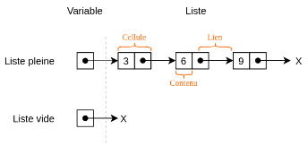{width=60%; : .center }

Chaque élément, ou **cellule**, contient :

* 📦 la **valeur** stockée ;
* 📍 l’**adresse** de l’élément suivant.

Une liste chaînée est :

* soit **vide** (`None`) ;
* soit constituée d’une **cellule** (élément) suivie du **reste de la liste**, ce qui en fait une **structure récursive**.

---


### <H3 STYLE="COLOR:GREEN;"> <a name="_toc151667922"></a>**3.2. Primitives sur les listes**</H3>

Voici les **opérations minimales** (appelées aussi **primitives**) qui permettent de définir la structure et de lui donner les méthodes attendues :

* Le **constructeur :** produit soit une liste vide ou une liste **à partir d’un couple tête (élément) et reste (liste)**
* Les **sélecteurs** qui permettent d’accéder à la tête de la liste ou au reste. Par exemple, ajouter un élément en tête de liste.
* Le **prédicat** qui teste la vacuité d’une liste (le fait qu’elle soit vide). Il renvoie un booléen.

| 🧱 Opération                                                                     | 💡 Instruction      |
| -------------------------------------------------------------------------------- | ------------------- |
| Créer une liste L vide                                                           | `L = vide()`        |
| Tester si une liste L est vide                                                   | `estVide(L)`        |
| Ajouter un élément *x* en tête de la liste L                                     | `ajouteEnTete(x,L)` |
| Supprimer la tête *x* d’une liste L et renvoyer cette tête *x*                   | `supprEnTete(L)`    |
| Créer une nouvelle liste L1 à partir d’un élément *x* et d’une liste existante L | `L1 = cons(x, L)`   |

🛠️ **Le constructeur**, historiquement appelé `cons`, permet d’obtenir une nouvelle liste à partir d’une liste et d’un élément (`L1 = cons(x, L)`).

Il est possible « d’enchaîner » les `cons` et d’obtenir ce genre de structure :

```python
cons(x, cons(y, cons(z, L)))
```

---

📌 **Exemple :** Voici une série d'instructions (les instructions ci-dessous s'enchaînent) :

* `L=vide()` ⇒ on a créé une liste vide
* `estVide(L)` ⇒ renvoie `vrai`
* `ajoutEnTete(3,L)` ⇒ La liste L contient maintenant l'élément `3`
* `estVide(L)` ⇒ renvoie `faux`
* `ajoutEnTete(5,L)` ⇒ la tête de L = `5`, la queue contient `3`
* `ajoutEnTete(8,L)` ⇒ la tête de L = `8`, la queue contient `5` et `3`
* `t = supprEnTete(L)` ⇒ `t = 8`, L devient \[5, 3]
* `L1 = vide()`
* `L2 = cons(8, cons(5, cons(3, L1)))` ⇒ L2 = \[8, 5, 3]

---

!!! info "🧠 Capytale : Structure liste (chaînée) avec des tuples"


???+ question "📝 **Activité n°1 :**"
    Voici une série d'instructions (les instructions ci-dessous s'enchaînent), expliquez ce qui se passe à chacune des étapes :

    ```
    L = vide() 
    ajoutEnTete(10, L) 
    ajoutEnTete(9, L) 
    ajoutEnTete(7, L) 
    L1 = vide() 
    L2 = cons(5, cons(4, cons(3, cons(2, cons(1, cons(0, L1))))))
    ```

    ??? success "📤 Solution :"

        ```python
        L = vide()
        ```

        👉 Création d’une **liste vide**.

        ```python
        ajoutEnTete(10,L)
        ```

        👉 La **valeur 10** est ajoutée en tête de la liste `L`, donc `L = [10]`.

        ```python
        ajoutEnTete(9,L)
        ```

        👉 La valeur 9 est ajoutée en tête, donc `L = [9, 10]`.

        ```python
        ajoutEnTete(7,L)
        ```

        👉 La valeur 7 est ajoutée en tête, donc `L = [7, 9, 10]`.

        ```python
        L1 = vide()
        ```

        👉 Création d’une **seconde liste vide**, nommée `L1`.

        ```python
        L2 = cons(5, cons(4, cons(3, cons(2, cons(1, cons(0,L1))))))
        ```

        👉 Construction récursive de la liste `L2` :
        `L2 = [5, 4, 3, 2, 1, 0]`
        (*chaque `cons(x, liste)` ajoute `x` en tête de la nouvelle liste*)


---

### <H3 STYLE="COLOR:GREEN;"> <a name="_toc151667923"></a>**3.3. ❤️1<sup>ère</sup> implémentation de la structure liste (chaînée) avec des tuples❤️**</H3>

Les **tuples** sont déclarés en utilisant **les parenthèses**.
Ils peuvent être parcourus via des **boucles `for`**.

⚠️ Les tuples sont **non-mutables** : on **ne peut pas modifier leur contenu après leur création**.

---

#### <H4 STYLE="COLOR:MAGENTA;"> **3.3.1. Implémentation simple avec les tuples**</H4>

📊 Schéma : principe de l'interface entre l'utilisateur et les données
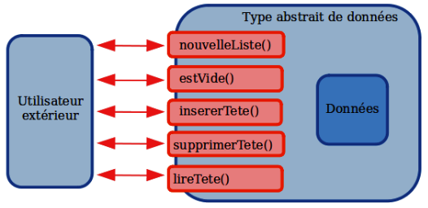{width=50%; : .center }

📌 Structure avec tuples – représentation mémoire :
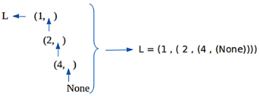{width=60%; : .center }

---

???+ question "🧪 **Activité n°2 : structure liste avec des tuples – fonctions `nouvelleListe()` et `estVide()`**"

    Voici une première implémentation de la structure liste avec des tuples :

    ```python
    '''Implémentation de type abstrait Liste en utilisant des tuples (tête, queue)'''

    def nouvelleListe():
        '''Renvoie une liste vide'''
        pass

    # prédicat
    def estVide(L):
        '''Renvoie True si la liste est vide'''
        pass
    ```

    Vérifie leur bon fonctionnement avec les instructions suivantes :

    ```python
    >>> a = ()
    >>> estVide(a)
    ???

    >>> b = None
    >>> estVide(b)
    ???

    >>> c = "C"
    >>> estVide(c)
    ???

    >>> d = nouvelleListe()
    >>> estVide(d)
    ???
    ```

    ??? success "📤 Solution :"

        Rappel du contrat : la fonction `nouvelleListe()` doit renvoyer une **liste vide** compatible avec le prédicat `estVide()`.

        Voici les tests :

        ```python
        >>> a = ()
        >>> estVide(a)
        ✅ True  # Le tuple vide est interprété comme une liste vide ici
        ```

        ```python
        >>> b = None
        >>> estVide(b)
        ❌ False  # `None` n’est pas compatible avec l’implémentation par tuple
        ```

        ```python
        >>> c = "C"
        >>> estVide(c)
        ❌ False  # une chaîne de caractères n’est pas une liste chaînée
        ```

        ```python
        >>> d = nouvelleListe()
        >>> estVide(d)
        ✅ True  # nouvelleListe doit renvoyer un tuple vide (), donc résultat True
        ```

    ❓ **Question finale :**

    Quelle est **la seule proposition** qui respecte **l’interface imposée par le créateur** de cette implémentation ?

    ??? success "📤 Solution :"

        📌 La **seule structure** respectant **l’interface imposée** est :

        ```python
        a = ()  # ou d = nouvelleListe()
        ```

        💡 Il faut que `nouvelleListe()` retourne le tuple vide `()` pour que `estVide()` fonctionne correctement.

---


???+ question "🧪 Activité n° 3 : `insererTete`"

    📌 **Objectif** : Créer la fonction d'interface suivante :

    ```
    insererTete(x:Elt, L:Liste) → Liste
    ```

    🔧 Elle **renvoie** une nouvelle liste dont la **tête** est l’élément `x`, et la **queue** est la liste précédente `L`.

    💬 **Astuce** : Il suffit de créer un **nouveau tuple** dont la tête est `x`, et la queue est `L`.

    🎯 **Exemple d'utilisation** :

    ```python
    # constructeur
    def insererTete(x,L) :
        '''Renvoie une nouvelle liste où x est la tête et liste la queue'''
        pass
    ```

    ```
    >>> a = nouvelleListe()
    >>> a = insererTete(5, a)
    >>> a
    (5, ())

    >>> a = insererTete(2, a)
    >>> a
    (2, (5, ()))
    ```

    ??? success "📤 Solution :"

        ```python
        def insererTete(x, L):
            '''Renvoie une nouvelle liste dont la tête est x et la queue est L'''
            return (x, L)
        ```

---

???+ question "🧪 Activité n° 4 : `supprimerTete`"

    📌 **Objectif** : Créer une fonction d’interface pour **supprimer la tête** d’une liste.

    ```
    supprimerTete(L:Liste) → Liste
    ```

    📎 Elle **renvoie** une nouvelle liste dont la tête est l’élément **suivant** (celui de la queue précédente).

    🧠 Cela revient à "récupérer la queue". On aurait d'ailleurs pu l'appeler `recupererQueue`.

    ⚠️ **Précondition** : `L` est une liste bien formée (vide `()` ou `(tête, queue)`).

    🧪 Exemple visuel :

    ```
    Liste initiale : 5 → 8 → 2 → 3
    Résultat      : 8 → 2 → 3
    ```

    💬 **Astuce** :

    * La **tête** est en `L[0]`
    * La **queue** est en `L[1]`

    👀 Pense à gérer deux cas :

    * 🔸 **Liste vide** → on renvoie `()`
    * 🔹 **Liste non vide** → on renvoie `L[1]`

    🎯 **Exemples d’utilisation** :

    ```python
    def supprimerTete(L):
        '''Renvoie une nouvelle liste où on a supprimé la tête de l'ancienne '''
        pass
    ```

    ```
    >>> a = nouvelleListe()
    >>> b = supprimerTete(a)
    >>> b
    ()

    >>> a = insererTete(5, nouvelleListe())
    >>> b = supprimerTete(a)
    >>> b
    ()

    >>> a = (20, (15, (5, ())))
    >>> b = supprimerTete(a)
    >>> b
    (15, (5, ()))

    >>> c = supprimerTete(b)
    >>> c
    (5, ())
    ```

    ??? success "📤 Solution :"

        ```python
        def supprimerTete(L):
            '''Renvoie la queue de la liste (supprime la tête)'''
            if estVide(L):
                return ()
            else:
                return L[1]
        ```

---

???+ question "🧪 Activité n° 5 : `lireTete`"

    📌 **Objectif** : Créer la fonction permettant de **lire la tête** d’une liste sans la modifier.

    ```
    lireTete(L:Liste) → Elt
    ```

    ⚠️ **Précondition** : `L` est bien une liste (vide ou `(tête, queue)`).

    📎 **Attention** :

    * On **ne modifie pas** la structure.
    * Il faut vérifier que la liste **n’est pas vide** avant d’accéder à `L[0]`.

    🎯 **Exemple d'utilisation** :

    ```python
    def lireTete(L):
        '''Renvoie la tête de la liste, sans toucher à la liste elle-même'''
        pass
    ```

    ```
    >>> a = insererTete(5, nouvelleListe())
    >>> a = insererTete(15, a)
    >>> lireTete(a)
    15

    >>> b = nouvelleListe()
    >>> lireTete(b)
    None
    ```

    ??? success "📤 Solution :"


        ```python
        def lireTete(L):
            '''Renvoie l’élément en tête de la liste (sans modification)'''
            if estVide(L):
                return None  # ou lever une exception si on préfère
            else:
                return L[0]
        ```

---


???+ question "🎯 Activité n° 6 : structure liste avec des tuples – fonction `afficherListe`"

    Il nous manque encore une fonctionnalité pratique (mais non obligatoire dans l’interface) : **une représentation lisible** de notre liste sans en montrer l’implémentation réelle.

    Nous aimerions obtenir une représentation comme :
    👉 **`(20, 15, 5)`**
    plutôt que :
    👉 **`(20, (15, (5, ())))`**

    🧪 **Principe** : lire la tête, la supprimer, ajouter la valeur lue à une liste temporaire, puis transformer cette liste en `tuple` pour l'affichage. On renverra un `string`.

    ```python
    def afficherListe(L):
        '''Renvoie une représentation de la Liste sous forme d'une séquence commençant par la tête'''
        reponse = []
        # à compléter
        return str(tuple(reponse))
    ```

    📌 **Instructions d'utilisation** :

    ```python
    >>> a = insererTete(20, (15, (5, nouvelleListe())))
    >>> afficherListe(a)
    '(20, 15, 5)'
    ```

    ❓**Question** : Un utilisateur peut-il déduire l’implémentation interne de la liste en utilisant seulement les fonctions d’interface ?

    ??? success "📤 Solution :"

        ```python
        def afficherListe(L):
            '''Renvoie une représentation de la Liste sous forme d'une séquence commençant par la tête'''
            reponse = []
            while not estVide(L):
                reponse.append(lireTete(L))
                L = supprimerTete(L)
            return str(tuple(reponse))
        ```

        📌 **Réponse à la question** :
        Non. Grâce à notre interface, l’utilisateur manipule la structure abstraite sans jamais avoir à connaître sa représentation interne (des tuples emboîtés).

---

### 🧱 <H4 STYLE="COLOR:MAGENTA;">3.3.2. Implémentation plus souple avec les tuples</H4>

Nous aimerions maintenant accéder à **n'importe quelle valeur** de la liste, et non plus seulement la tête.

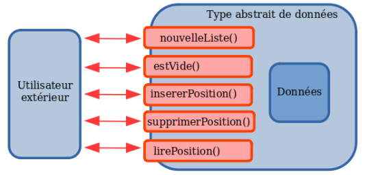{width=50%; : .center }

✅ **Avantage** : cette implémentation suit fidèlement la logique (tête, queue)
⚠️ **Inconvénient** : certaines opérations deviennent plus coûteuses.

---

???+ question "🧪 Activité n° 7 : fonction `lireElement`"

    Créer la fonction `lireElement` en **réutilisant les fonctions précédentes**.
    On devra **supprimer la tête autant de fois que nécessaire** jusqu'à atteindre la position visée, puis la lire.

    📌 Syntaxe attendue :

    ```python
    lireElement(L:Liste, position:int) -> Elt
    ```

    ```python
    listeA = (12, 15, 18, 4)
    reponse = lireElement(listeA, 1)
    ```

    ✅ `reponse` vaut 15.

    ```python
    def lireElement(L, position):
        '''Renvoie l'élément en position `position` dans la Liste'''
        pass
    ```

    Exemples :

    ```python
    >>> a = insererTete(20, (15, (5, nouvelleListe())))
    >>> lireElement(a, 1)
    15
    >>> lireElement(a, 0)
    20
    >>> lireElement(a, 2)
    5
    ```

    ❓**Question** : quel est le **coût** de cette opération ?

    A : logarithmique

    B : linéaire

    C : quadratique

    D : exponentielle

    ??? success "📤 Solution :"

        ```python
        def lireElement(L, position):
            '''Renvoie l'élément à la position donnée dans la Liste'''
            for _ in range(position):
                L = supprimerTete(L)
            return lireTete(L)
        ```

        ✅ Réponse à la question : **B : linéaire**, car on parcourt la liste séquentiellement jusqu’à l’élément recherché.

    ---

???+ question "🧪 Activité n° 8 : fonction `insererElement`"

    Créer la fonction suivante :

    ```python
    insererElement(x:Elt, L:Liste, position:int) -> Liste
    ```

    🎯 Objectif : renvoyer une nouvelle liste dans laquelle l'élément `x` est inséré **à la position spécifiée**, en suivant un index débutant à 0.

    ```python
    listeA = (12, 15, 18, 4)
    listeB = insererElement(5, listeA, 2)
    ```

    ✅ `listeB` = (12, 15, **5**, 18, 4)

    ```python
    def insererElement(x, L, position):
        '''Renvoie une nouvelle liste avec x inséré à la position donnée'''
        pass
    ```

    Exemples :

    ```python
    >>> a = insererTete(20, (15, (5, nouvelleListe())))
    >>> afficherListe(a)
    '(20, 15, 5)'

    >>> a = insererElement(12, a, 1)
    >>> afficherListe(a)
    '(20, 12, 15, 5)'

    >>> a = insererElement(20, a, 2)
    >>> afficherListe(a)
    '(20, 12, 20, 15, 5)'
    ```

    ❓**Question** : Quel est le **coût** dans le pire des cas (insertion en fin de liste) ?

    A : logarithmique

    B : linéaire

    C : quadratique

    D : exponentielle

    ??? success "📤 Solution :"

        ```python
        def insererElement(x, L, position):
            '''Insère l’élément x à la position donnée dans la Liste'''
            if position == 0:
                return insererTete(x, L)
            else:
                return insererTete(lireTete(L), insererElement(x, supprimerTete(L), position - 1))
        ```

        ✅ Réponse à la question : **B : linéaire**, car on doit reconstruire toute la liste jusqu’à la position d’insertion.

📌 **Résumé des coûts** :

| Opération   | Coût (Θ) |
| ----------- | -------- |
| Lecture     | Θ(n)     |
| Insertion   | Θ(n)     |
| Suppression | Θ(n)     |

---


!!! question "Capytale : Structure liste (chainée) avec les lists de Python"


### <H3 STYLE="COLOR:GREEN;"> <a name="_toc151667924"></a>**3.4. ❤️2<sup>ème</sup> implémentation de la structure liste (chaînée) avec les `lists` de Python❤️**</H3>

🧠 Si le type natif `list` se nomme ainsi, c'est bien qu'il permet l'**implémentation de Liste**.
⚙️ En interne, il s'agit d’un **tableau dynamique** qui possède plus de fonctions d'interface que le type abstrait **TABLEAU DYNAMIQUE**.
🔁 La structure de données `list` est donc un **savoureux mélange de fonctionnalités** issues des **tableaux** et des **listes**.

---

???+ question "🧪 Activité n° 9 : structure liste avec des `lists` – fonctions `nouvelleListe`, `estVide`, `lireElement`"

    Ces fonctions restent les mêmes, même si on utilise les `lists` de Python plutôt que des tableaux :

    ```python
    '''Implémentation 3 de type abstrait Liste en utilisant le type natif liste de Python

    Liste désigne la structure de données que nous utilisons pour gérer les listes.
    Elt désigne la structure de données pouvant être un élément de nos listes.

    Description rapide de l'interface :
    -----------------------------------

    1 ::: nouvelleListe() -> Liste
    2 ::: estVide(liste:Liste) -> bool
    3 ::: lireElement(liste:Liste, index:int) -> Elt 
    4 ::: insererElement(x:Elt, liste:Liste, position:int) -> Liste
    5 ::: supprimerPosition(liste:Liste, position:int)  -> Liste
    6 ::: afficherListe(liste:Liste) -> str
    '''

    def nouvelleListe():
        '''Renvoie une liste vide '''
        pass

    def estVide(L):
        '''Renvoie True si la liste est vide '''
        pass

    def lireElement(L, index=-1):
        '''Renvoie la valeur stockée à l'index voulu '''
        pass
    ```

    ??? success "📘 Solution :"

        ```python
        def nouvelleListe():
            return []

        def estVide(L):
            return len(L) == 0

        def lireElement(L, index=-1):
            return L[index]
        ```

---

???+ question "🧪 Activité n° 10 : structure liste avec des `lists` – fonction `insererElement`"

    On connaît déjà la méthode `append`, mais ici **on l’évite**, car elle **modifie la liste en place**.
    La fonction devra toujours **renvoyer une copie modifiée**.

    💡 Astuce : s'aider des fonctions `supprimerTete(L)` et `ajouterTete(x,L)`.

    ```python
    def insererElement(x, L, position):
        '''Renvoie une Liste en insérant x à la position position. '''
        pass

    L = nouvelleListe()
    L = ajouterTete(2, L)
    L = ajouterTete(3, L)
    L = ajouterTete(1, L)
    print(L)
    L = insererElement(25, L, 1)
    print(L)
    ```

    ⚠️ **Erreur courante à ne pas faire :**

    ```python
    reponse = [element for element in L]
    return reponse.insert(position, x)
    ```

    ❌ `insert()` est une **fonction-procédure** : elle retourne `None` !

    ??? success "📘 Solution :"

        ```python
        def insererElement(x, L, position):
            copie = L[:]
            copie.insert(position, x)
            return copie
        
        L = nouvelleListe()
        L = ajouterTete(2, L)
        L = ajouterTete(3, L)
        L = ajouterTete(1, L)
        print(L)
        L = insererElement(25, L, 1)
        print(L)
        ```

---

???+ question "🧪 Activité n° 11 : structure liste avec des `lists` – fonction `supprimerPosition`"

    Comme pour `append`, la méthode `pop()` modifie la liste en place. On s'en sert uniquement pour ses effets de bord.

    ```python
    def supprimerPosition(L, position):
        '''Renvoie une nouvelle liste où on a supprimé l'élément situé à la position fournie'''
        pass

    L = supprimerPosition(L, 2)
    print(L)
    ```

    ⚠️ **À ne pas faire :**

    ```python
    reponse = [element for element in L]
    return reponse.pop(position)
    ```

    ❌ Cela retourne l'élément supprimé, **pas la nouvelle liste**.

    ??? success "📘 Solution :"

        ```python
        def supprimerPosition(L, position):
            copie = L[:]
            copie.pop(position)
            return copie
        L = supprimerPosition(L, 2)
        print(L)
        ```

---

???+ question "🧪 Activité n° 12 : structure liste avec des `lists` – fonction `afficherListe`"

    On ajoute ici une fonction **d’affichage globale** pour respecter l’interface du type abstrait Liste :

    ```python
    def afficherListe(L):
        '''Renvoie une représentation de la Liste sous forme d'une séquence commençant par la tête'''
        return str(tuple(L))

    print(afficherListe(L))
    ```

    📎 On affiche la structure comme une **séquence immuable**, ce qui est plus lisible que la syntaxe brute d’une `list`.


---


!!! info "Capytale : Structure liste (chainée) avec POO"


### <H3 STYLE="COLOR:GREEN;"> <a name="_toc151667925"></a>**3.5. ❤️ 3<sup>ème</sup> implémentation de la structure liste (chaînée) avec POO ❤️**</H3>

🧠 Une **liste chaînée** est une structure composée de **cellules** ou **maillons**, comme une chaîne métallique.
Chaque cellule contient deux éléments essentiels :

* 📦 Le **contenu** de la cellule
* 🔗 **L’adresse** ou **référence** vers la cellule suivante

👉 Et **rien d’autre** !

---

🔍 **Représentation visuelle**

Voici la représentation typique d’une liste chaînée :

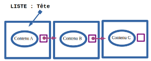{width=50%; : .center }

🧩 Les cellules sont alignées logiquement, mais pas forcément physiquement en mémoire. Ce sont les **références** qui relient les cellules entre elles.

---

➕ **Insertion d’un nouvel élément**

Insérer un élément consiste simplement à :

1. Créer un lien de l’élément précédent vers le **nouvel élément**
2. Lier ce **nouvel élément** à l’ancien suivant

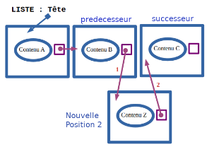{width=50%; : .center }

✅ Cela ne nécessite **que 2 opérations**, peu importe la taille de la liste. On parle donc d’un **coût d’insertion constant**.

---

🏗️ **Cas d'une grosse liste**

Même dans une grande liste, l’insertion reste rapide :

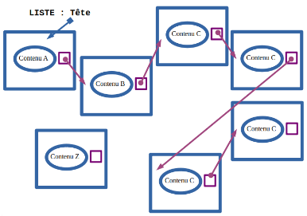{width=50%; : .center }

---

🔄 **Changement de tête**

Remplacer la tête dans une liste chaînée est également très efficace :

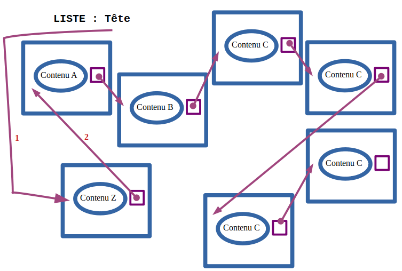{width=50%; : .center }

⛔ En comparaison, un **tableau** impose de **décaler** tous les éléments pour insérer en tête.

---

❌ **Inconvénient : la lecture**

📉 Lire un élément en milieu de liste est plus coûteux :
Il faut suivre les références une à une jusqu’à la cellule voulue.

✔️ En revanche, avec un **tableau**, l’accès à l’élément à l’indice `i` est **direct**, donc plus rapide.

---

⚙️ **Structure d’une cellule (ou maillon)**

Chaque cellule de la liste chaînée est représentée par une **classe `Node`**, constituée de deux attributs :

* `v` : la **valeur** (tête)
* `n` : la **référence** vers la **cellule suivante** (queue)

---

#### <H4 STYLE="COLOR:MAGENTA;"> **3.5.1. Création de la cellule `Node`**</H4>

???+ question "📝 **Activité 13 : Création de la classe Cellule (`Node`)**"

    Chaque cellule est constituée d’une **tête** et d’un **pointeur**.
    Crée une classe `Node` avec un constructeur qui accepte deux paramètres (`value`, `next`) et les stocke dans les attributs `v` et `n`.

    ```python
    class Node:
        '''Classe permettant de créer des cellules-maillons basiques'''
        def __init__(self, value, next=None):
            pass
    ```

    Teste ensuite les créations suivantes :

    ```python
    >>> c1 = Node(5, None)
    >>> c2 = Node(15, c1)
    >>> c3 = Node(25, c2)
    >>> c4 = Node(35, c3)
    ```

    ??? success "📤 Solution :"

        ```python
        class Node:
            '''Classe permettant de créer des cellules-maillons basiques'''
            def __init__(self, value, next=None):
                self.v = value
                self.n = next
        ```

        🧪 Avec ces instructions :

        ```python
        >>> c1 = Node(5, None)
        >>> c2 = Node(15, c1)
        >>> c3 = Node(25, c2)
        >>> c4 = Node(35, c3)
        ```

        On crée une chaîne de cellules :

        ```
        [35 | ●] → [25 | ●] → [15 | ●] → [5 | ∅]
        ```

---


???+ question "📝 **Activité n°14 : Représentation de la structure chaînée**"

    Représenter sur **feuille** la **structure séquentielle linéaire** (schéma des cellules) créée par les instructions précédentes.

---

???+ question "📝 **Activité n°14bis : Programmation défensive**"

    Notre cellule possède encore un léger problème :
    On pourrait lui transmettre **n’importe quoi** dans `next`, pas obligatoirement un objet `Node` ou `None`.

    ➡️ On va donc **protéger** notre code en imposant que `next` soit bien une instance de `Node` ou `None`.

    🧩 Compléter ce constructeur avec une assertion :

    ```python
    class Node:
        '''Classe permettant de créer des cellules-maillons basiques'''
        def __init__(self, value, next=None):
            assert isinstance(next, ...) or next == ...
            # ce que vous avez écrit précédemment 
    ```

    ??? success "📤 Solution :"

        ```python
        class Node:
            '''Classe permettant de créer des cellules-maillons basiques'''
            def __init__(self, value, next=None):
                assert isinstance(next, Node) or next == None
                self.v = value
                self.n = next
        ```

---

???+ question "🧪 **Activité n°15 : Tester les contraintes**"

    Tester les instructions suivantes :

    ```python
    >>> a = Node('Marie-Antoinette', None)
    >>> b = Node('Louis XVI', a)
    >>> c = Node('Louis XV', 'Louis XVI')
    ```

    **Question : Quel est le problème ?**

    ??? success "📤 Solution :"

        💥 Erreur sur la dernière ligne :
        `'Louis XVI'` est une **chaîne de caractères**, pas une **instance de Node**.

        Grâce à l’assertion, le constructeur **refuse** cette valeur inappropriée, ce qui évite des comportements imprévisibles.

---

📌 **Attention terminologique :**

L’attribut `n` n’est **pas** la queue complète !
C’est **le premier maillon** de la queue. Toute la suite est encore à parcourir.

---

🔁 **Lecture de la liste avec une méthode récursive**

On va créer une méthode `returnFinalValue` qui :

1. Affiche les valeurs des cellules une par une
2. Renvoie la valeur de la **dernière cellule** (celle qui n’a pas de `next`)

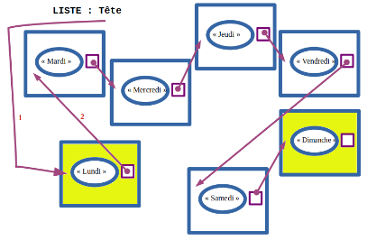{width=50%; : .center }

---

???+ question "🧠 **Activité n°16 : Création de la méthode `returnFinalValue`**"

    **Prototype :**

    ```python
    returnFinalValue(self) -> valeur
    ```

    C’est une méthode **récursive**.
    Elle suit le principe suivant :

    * Si `self.n` est `None`, c’est la dernière cellule → on retourne `self.v`
    * Sinon, on appelle `returnFinalValue()` sur la cellule suivante

    **Questions associées :**

    1. Quelle est la condition d’arrêt ?
    2. Quel est le cas de base ?
    3. Comment la fonction progresse-t-elle dans la liste ?

    Voici le squelette à compléter :

    ```python
    class Node:
        '''Classe permettant de créer des cellules-maillons basiques'''
        def __init__(self, value, next=None):
            # ce qui a été fait précédemment

        def returnFinalValue(self):
            pass


    di = Node("Dimanche")
    sa = Node("Samedi", di)
    ve = Node("Vendredi", sa)
    je = Node("Jeudi", ve)
    me = Node("Mercredi", je)
    ma = Node("Mardi", me)
    lu = Node("Lundi", ma)
    ```

    Tester :

    * `lu.returnFinalValue()`
    * `je.returnFinalValue()`

    ??? success "📤 Solution :"

        ```python
        class Node:
            def __init__(self, value, next=None):
                assert isinstance(next, Node) or next == None
                self.v = value
                self.n = next

            def returnFinalValue(self):
                if self.n is None:
                    return self.v
                else:
                    return self.n.returnFinalValue()
        ```

🖨️ **Affichage de la liste entière**

???+ question "📺 **Activité n°17 : méthode `__str__` pour l’affichage**"

    Tester l'affichage de :

    ```python
    print(lu)
    print(je)
    ```

    **Observation :**
    On voit des objets `Node` comme `<__main__.Node object at ...>`.
    C’est peu lisible.

    ➡️ On va donc écrire une méthode `__str__` qui affiche toutes les valeurs liées.

    Format attendu :

    ```
    >>> print(lu)
    Lundi-Mardi-Mercredi-Jeudi-Vendredi-Samedi-Dimanche
    >>> print(je)
    Jeudi-Vendredi-Samedi-Dimanche
    ```

    💡 Remarque : il **ne faut pas afficher `None` à la fin**.

    Compléter ce squelette :

    ```python
    class Node:
        def __init__(self, value, next=None):
            # ce qui a été fait précédemment

        def returnFinalValue(self):
            # ce qui a été fait précédemment

        def __str__(self):
            pass


    di = Node("Dimanche")
    sa = Node("Samedi", di)
    ve = Node("Vendredi", sa)
    je = Node("Jeudi", ve)
    me = Node("Mercredi", je)
    ma = Node("Mardi", me)
    lu = Node("Lundi", ma)

    print(lu)
    print(je)
    ```

    ??? success "📤 Solution :"

        ```python
        def __str__(self):
            if self.n is None:
                return self.v
            else:
                return self.v + "-" + str(self.n)
        ```

        ✅ On obtient une chaîne lisible représentant **toute la séquence** de maillons depuis le nœud initial.

---


#### <H4 STYLE="COLOR:MAGENTA;">🧱 **3.5.2. Création de la Liste Chaînée `Liste`**</H4>

???+ question "🔧 **Activité n°18 : Création de la classe Liste**"

    Créer une **classe Liste** qui représentera la liste chaînée complète. Elle contient :

    * Un seul attribut `head` représentant la **tête de la liste** (un objet `Node`)
    * Ce `head` est `None` si la liste est vide

    💬 Initialement, la liste est vide, donc `head = None`. Ensuite, chaque cellule pointe vers la suivante jusqu’à la dernière dont le `next` est `None`.

    ```python
    class Liste:
        '''Classe pour implémenter une Liste sous forme de liste chaînée'''
        def __init__(self, head=None):
            assert type(head) == Node or head is None
            self.head = head
    ```

    Exemple de création :

    ```python
    di = Node("Dimanche")
    sa = Node("Samedi", di)
    ve = Node("Vendredi", sa)
    je = Node("Jeudi", ve)
    me = Node("Mercredi", je)
    ma = Node("Mardi", me)
    lu = Node("Lundi", ma)
    list1 = Liste(lu)
    ```

    ??? success "❇️ Solution :"

        ```python
        class Liste:
            '''Classe pour implémenter une Liste sous forme de liste chaînée'''
            def __init__(self, head=None):
                assert type(head) == Node or head is None
                self.head = head
        ```

    🔍 **Questions de compréhension** :

    1. Comment obtenir dans la console le contenu de la tête en utilisant `list1` ?
    

    2. Comment obtenir le contenu de l’élément suivant ?
    

    3. Et encore derrière ?
   

   ??? success "❇️ Solution :"

        → `list1.head.v`

        → `list1.head.n.v`

        → `list1.head.n.n.v`

🧠 Le constructeur utilise `type()` au lieu de `isinstance()` pour montrer qu’il existe deux façons de vérifier le type d’un objet.

---

#### <H4 STYLE="COLOR:MAGENTA;">🔁 **3.5.3. Création d'une interface mutable**</H4>

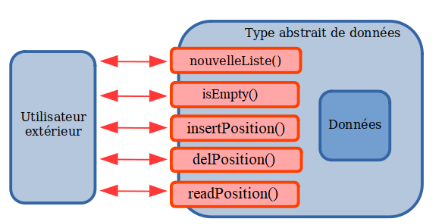{width=50%; : .center }

Voici les **méthodes prévues** dans notre interface :

| Méthode                | Description                              |
| ---------------------- | ---------------------------------------- |
| `__init__()`           | Crée une liste vide                      |
| `isEmpty()`            | Retourne `True` si la liste est vide     |
| `insertPosition(x, p)` | Insère un élément `x` à la position `p`  |
| `delPosition(p)`       | Supprime l’élément en position `p`       |
| `readPosition(p)`      | Retourne l’élément situé en position `p` |

---

???+ question "📥 **Activité n°19 : Méthode `isEmpty`**"

    Créer une méthode d’interface `isEmpty()` qui retourne `True` si la liste est vide, `False` sinon.

    💡 Elle teste si `head == None`.

    🧪 À tester :

    ```python
    >>> list1.isEmpty()
    False
    >>> list2 = Liste()
    >>> list2.isEmpty()
    True
    ```

    ??? success "❇️ Solution :"

        ```python
        class Liste:
            def __init__(self, head=None):
                assert type(head) == Node or head is None
                self.head = head

            def isEmpty(self):
                return self.head is None
        ```

---


???+ question "📥 Activité n° 20 :structure liste avec de la POO, Création de la structure méthode `insertHead` :"

    🧠 Créer une méthode d’interface `insertHead`. La solution est :

    * de mémoriser l’ancienne entête dans une variable temporaire `temporary`,
    * de créer une instance de `Node` dont la valeur stockée est `newData` et qui pointe en sortie vers l’ancienne tête,
    * de modifier l’attribut `head` de la Liste pour qu’il corresponde bien à la nouvelle instance de `Node`.


    📎 Ajouter la méthode à la classe `Liste` :

    ```python
    def insertHead(self, newData): 
        pass
    ```


    🧪 Tester :

    ```python
    >>> list1.insertHead('sunday')
    >>> list1.insertHead('saturday')
    >>> list1.head.v
    'saturday'
    >>> list1.head.n.v
    'sunday'
    >>> list1.head.n.n.v
    'Lundi'
    >>> list1.head.n.n.n.v
    'Mardi'
    ```

    ??? success "❇️ Solution :"

        ```python
        def insertHead(self, newData):
            temporary = self.head
            self.head = Node(newData, temporary)
        ```

---

📘 **Pour réaliser la méthode `insertPosition`** :

Par exemple, pour insérer une Cellule en position 2, il faudra :

* Mémoriser l'adresse nommée **predecesseur** de l'élément en position 1 (celle de contenu B ici),
* Mémoriser l'adresse nommée **successeur** de l'élément en position 2 actuellement (celle de contenu C ici),
* Créer une nouvelle cellule **nouvelle** (celle de contenu Z ici) et la faire pointer vers **successeur**,
* Faire pointer **predecesseur** sur notre **nouvelle** cellule.

Avant d'insérer la nouvelle Cellule en position 2, il faut mémoriser les identifiants des cellules contenant B (**predecesseur**, "index" 1) et C (**successeur**, "index" 2).

📷 **Illustration avant modification :**

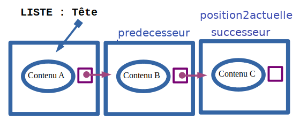{width=50%; : .center }

📷 **Illustration après modification :**

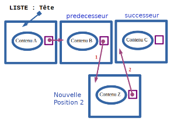{width=50%; : .center }

---

📌 **Quelques précisions :**

* Pour insérer en position 1 : **predecesseur** est l'élément en position 0, soit... la tête de la liste.
* Pour insérer en position 2 : **predecesseur** sera l'élément en position 1. Il faut donc faire un bond en avant depuis la tête.
* Pour insérer en position 3 : **predecesseur** sera l'élément en position 2. Il faut donc faire un bond en avant depuis la tête.
* Si je veux insérer en position **position** : **predecesseur** sera la Cellule en position **position - 1**. Il faut donc faire un bond en avant depuis la tête.

---

???+ question "📥 Activité 21 :structure liste avec de la POO, Création de la structure méthode `insertPosition` :"

    Voici une méthode d'interface `insertPosition` :

    ```python
    insertPosition(self, newData:Elt, position:int) -> None
    ```

    ➡️ Elle modifie sur place la liste : l'élément fourni `newData` est maintenant l'élément de la liste situé en position `position`.

    On prendra ici un système de position lié à un **index commençant à 0**.


    🧠 Lorsqu'on veut insérer ailleurs qu'à la tête, cette méthode va :

    1. partir de la tête, effectuer `position - 1` sauts vers la cellule suivante, et mémoriser l'identifiant de cette cellule dans **predecesseur** ;
    2. mémoriser dans **successeur** la référence de la cellule actuellement à la suite de **predecesseur** ;
    3. créer la **nouvelle Cellule**, et la faire pointer vers **successeur** ;
    4. modifier **predecesseur** pour qu'elle pointe vers **nouvelle**.

    📷 Illustration :

    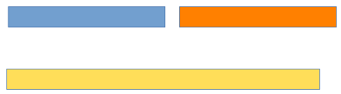{width=60%; : .center }


    📎 Ajouter la méthode suivante à la classe `Liste` :

    ```python
    def insertPosition(self, newData, position):
        pass
    ```


    ❓ **Question** :
    Analyser le code pour parvenir à identifier les lignes où sont effectuées précisément les actions **1 à 4** précédentes.


    🧪 Tester :

    ```python
    >>> list1.insertPosition('Tuesday', 1)
    >>> list1.head.v
    'Lundi'
    >>> list1.head.n.v
    'Tuesday'
    >>> list1.head.n.n.v
    'Mardi'
    ```

    ??? success "❇️ Solution :"

        ```python
        def insertPosition(self, newData, position):
            predecesseur = self.head
            for i in range(position - 1):
                predecesseur = predecesseur.n
            successeur = predecesseur.n
            nouvelle = Node(newData, successeur)
            predecesseur.n = nouvelle
        ```

---


    **<H3 STYLE="COLOR:red;">Activité n° 22 :**  **structure liste avec de la POO, Création de la structure**</H3> L'insertion pure ne concerne que les lignes suivantes
    ```python
            # nextNode = previousNode.n  # on mémorise la cellule qu'il faudra "déplacer"
            # newNode = Node(newData, nextNode)
            # previousNode.n = newNode
            # qui se résume par
            self.head = Node(newData, self.head)
    ```
    Ici le coût est bien constant. Par contre, que peut-on dire du coût de la recherche de la Cellule **predecesseur** dans le pire des cas ?
    ```python
            previousNode = self.head
            for etape in range(1,position): #On avance jusqu’à(position-1) pour trouver previous
                previousNode = previousNode.n
    ```
    Au total, que peut-on alors dire du coût de l'insertion ?


    C'est un peu décevant du coup...

    On retrouve une **insertion à coût constant**

    En réalité, la grande force des listes ne vient pas de l'insertion d'une Cellule individuelle (souvent on ne connait pas sa référence) mais de **l'insertion d'une liste à la suite d'une autre liste**. On parlera de **concaténation de listes**, comme avec les strings.

    Imaginons qu'on dispose des deux listes. L'une de 20 000 éléments et l'autre de 20 000 éléments également. Si on désire insérer la deuxième liste après la première liste, cela risque d'être compliqué avec des tableaux :

    D'abord, il faut réserver une nouvelle place mémoire de 40 000 places :

    {width=60%; : .center }

    Ensuite, il faut déplacer un par un les 20 000 éléments du premier tableau.

    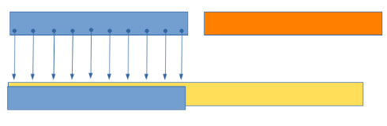{width=60%; : .center }

    Puis on déplace les 20 000 éléments du deuxième tableau.

    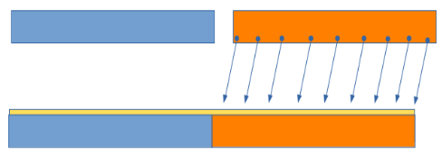{width=60%; : .center }

    Il suffit alors de connaître **la dernière Cellule de la première liste** (au pire, 20 000 lectures, c'est toujours mieux que 40 000 déplacements avec les tableaux) et **de la faire pointer vers la tête de la deuxième ligne**.

    On pourra donc écrire des choses comme cela : lst1 + lst2. Cela veut juste dire de faire pointer la Cellule de fin de la première liste vers la tête de la deuxième liste.

    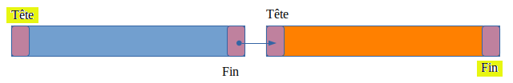{width=60%; : .center }

    En conclusion, le type abstrait LISTE peut s'implémenter de plusieurs façons différentes.

    Les deux grandes implémentations sont sous forme d'une **structure de données tableaux** (accès lecture à coût constant) et sous forme de **listes chaînées** (insertion parfois à coût constant et facilité de "déplacement" de grands blocs de données).

    En fonction de besoin de votre algorithme, on prendra donc l'un ou l'autre.

    **<H3 STYLE="COLOR:red;">Activité n° 23 :**  **structure liste avec de la POO, Création de la structure FONCTION** ```afficherListe``` et ```recupererValeur``` :</H3> en utilisant l'interface, l'utilisateur peut-il se douter que les données sont stockées sous forme d'une liste chaînée composée d'objets ? Ajouter les 2 fonctions :
    ```python
    def afficherListe(L):
        tableau = recupererValeur(L.head)
        return str(tuple(tableau))

    def recupererValeur(cellule):
        if cellule.n == None:
            return [cellule.v]
        else:
            return [cellule.v] + recupererValeur(cellule.n)

    # Programme principal
    di = Node("Dimanche")
    sa = Node("Samedi", di)
    ve = Node("Vendredi", sa)
    je = Node("Jeudi", ve)
    me = Node("Mercredi", je)
    ma = Node("Mardi", me)
    lu = Node("Lundi", ma)
    list1 = Liste(lu)
    print(afficherListe(list1))
    ```

    **<H3 STYLE="COLOR:red;">Activité n° 24 :**  **structure liste avec de la POO, Création de la structure méthode** ```delPosition``` :</H3> Compléter la méthode.
    ```python
    def delPosition(self, position):
        pass
    ```
    Tester
    ```
    >>> afficherListe(list1)
    "('Lundi', 'Mardi', 'Mercredi', 'Jeudi', 'Vendredi', 'Samedi', 'Dimanche')"
    >>> list1.delPosition(3)
    >>> afficherListe(list1)
    "('Lundi', 'Mardi', 'Mercredi', 'Vendredi', 'Samedi', 'Dimanche')" 
    ```

    **<H3 STYLE="COLOR:red;">Activité n° 25 :**  **structure liste avec de la POO, Création de la structure autres méthodes** :</H3> Réaliser maintenant la méthode d'interface de lecture des valeurs. Voici le prototype.

    ```readPosition(self:Liste, position:int) -> Elt``` : on renvoie l'élément stocké en position position.
    ```python
    def readPosition(self, position):
        pass
    ```
    Tester
    ```
    >>> list1.readPosition(2)
    'Mercredi'
    ```


## <H2 STYLE="COLOR:BLUE;"> <a name="_toc151667926"></a>**4. Les piles**</H2>

### <H3 STYLE="COLOR:GREEN;"> <a name="_toc151667927"></a>**4.1. Généralités**</H3>

En informatique, une **pile** (en anglais **stack**) est une structure de données fondée sur le principe « dernier arrivé, premier sorti » (ou **LIFO pour Last In, First Out**), ce qui veut dire que les derniers éléments ajoutés à la pile seront les premiers à être récupérés.

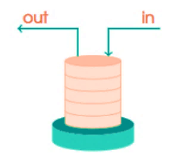{ : .center }

Le fonctionnement est donc celui d’une pile d’assiettes : on ajoute des assiettes sur la pile, et on les récupère dans l’ordre inverse, en commençant par la dernière ajoutée.

Voici quelques exemples d’usage courant d’une pile: 

- Dans un navigateur web, une pile sert à mémoriser les **pages Web visitées**. L’adresse de chaque nouvelle page visitée est empilée et l’utilisateur dépile l’adresse de la page précédente en cliquant le bouton «Afficher la page précédente».
- L’évaluation des **expressions mathématiques** en notation post-fixée (ou polonaise inverse) utilise une pile. 
- La fonction « Annuler la frappe » (en anglais «Undo») d’un traitement de texte mémorise les modifications apportées au texte dans une pile. 

Pour implémenter une structure de pile, on a besoin d’un nombre réduit d’opérations de bases. Les trois primitives de bases  :

Une pile est une structure de donnée munie des fonctions primitives suivantes :

- **pileVide()** : renvoie une pile vide
- **estVide(pile)** : renvoie un booléen indiquant si la pile est vide
- **empiler(pile, element)** : rajoute un élément à la pile (**push** en anglais)
- **depiler(pile)** : enlève un élément à la pile et le renvoie (**pop**)

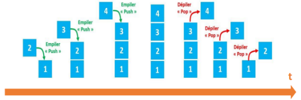{width=60%; : .center }

**Exemple :**

Soit une pile P composée des éléments suivants : 12, 14, 8, 7, 19 et 22 (le sommet de la pile est 22) **Pour chaque exemple ci-dessous on repart de la pile d'origine :** 

- **pop(P)** renvoie 22 et la pile P est maintenant composée des éléments suivants : 12, 14, 8, 7 et 19 (le sommet de la pile est 19) 
- **push(P,42)** la pile P est maintenant composée des éléments suivants : 12, 14, 8, 7, 19, 22 et 42 
- **sommet(P)** renvoie 22, la pile P n'est pas modifiée 
- si on applique pop(P) 6 fois de suite, **pile\_vide(P)** renvoie vrai 
- Après avoir appliqué pop(P) une fois, **taille(P)** renvoie 5

**Remarque** : Pour lire le sommet de la pile sans modifier la pile, on doit le dépiler et le rempiler.

!!! question "Capytale : Structure pile avec les listes de Python"

    ### <H3 STYLE="COLOR:GREEN;"> <a name="_toc151667928"></a>**4.2. ❤️1<sup>ère</sup> implémentation de la structure pile avec les listes de Python❤️**</H3>

    
    Nous utiliserons une simple liste pour représenter la pile. Il se trouve que les méthodes append et pop sur les listes jouent déjà le rôle de **push (empile)** et **pop (depile)** sur les piles.


    **<H3 STYLE="COLOR:red;">Activité n° 26 : Structure pile avec les listes :**</H3> Compléter la **structure de base** suivante :

    **Remarque** : La fonction empiler ne renvoie rien.

    **Attention**

    **pile += [element] (opérateur d'addition avec affectation):**

    - C'est une opération sur place pour les objets mutables comme les listes.

    - Cela modifie directement la liste originale référencée par pile.

    - L'objet reste le même en mémoire.

    **pile = pile + [element] (concaténation suivie d'affectation):**

    - C'est une opération de création d'un nouvel objet.

    - L'expression pile + [element] crée une nouvelle liste en concaténant pile et [element].

    - L'affectation pile = ... fait alors pointer le nom pile vers ce nouvel objet. Mais si la variable pile est passée à la fonction par référence (comme c'est souvent le cas avec les objets mutables en Python), cela coupe le lien avec l'objet original.

    ```python
    '''Implémentation de type abstrait Pile en utilisant les listes de Python'''

    def pileVide() :
        pass

    def estVide(pile) :
        pass

    def empiler(pile, element) :
        # 1ère façon 
        #pile.append(element) 
        # 2ème façon
        pass

    def depiler(pile) :
        if not estVide(pile):
            # 1ère façon 
            # return pile.pop()
            # 2ème façon
            
        pass

    # Programme principal
    if __name__ == '__main__':
        ma_pile = pileVide()
        assert estVide(ma_pile) == True
        empiler(ma_pile, 'Lundi')
        empiler(ma_pile, 'Mardi')
        empiler(ma_pile, 'Mercredi')
        assert estVide(ma_pile) == False
        assert depiler(ma_pile) == 'Mercredi'
        assert depiler(ma_pile) == 'Mardi'
        assert depiler(ma_pile) == 'Lundi'
        assert depiler(ma_pile) == 'Pile vide'
    ```

    **<H3 STYLE="COLOR:red;">Activité n° 27 : Structure pile avec les listes :**</H3> On va rajouter à la structure de base précédente deux fonctions : ```taille``` et ```sommet``` qui permettent respectivement de retourner la taille de la pile (sans utiliser la fonction de python len !!) et le sommet de la pile (sans utiliser les indices !!). On ne pourra utiliser seulement les fonctions primitives précédentes et en devra récupérer la pile originelle telle qu’elle était.

    On pourra s’aider d’une  pile auxiliaire.
    ```python
    def taille(pile):
        pass
    def sommet(pile):
        pass

    # Programme principal
    if __name__ == '__main__':
        ma_pile = pileVide()
        empiler(ma_pile, 'Lundi')
        empiler(ma_pile, 'Mardi')
        empiler(ma_pile, 'Mercredi')
        assert taille(ma_pile) == 3
        assert sommet(ma_pile) == 'Mercredi'
    ```

!!! info "Capytale : Structure pile avec la POO et les lists de Python :"

    ### <H3 STYLE="COLOR:GREEN;"> <a name="_toc151667929"></a>**4.3. ❤️2<sup>ème</sup> implémentation de la structure pile avec la POO et les lists de Python❤️**</H3>

    
    **<H3 STYLE="COLOR:red;">Activité n° 28 : Structure pile avec la POO et les lists de Python :**</H3> 


    Créer une classe Pile qui construit une liste vide, puis compléter les autres méthodes de la classe  :

    ```python
    '''Implémentation 3 de type abstrait Liste en utilisant la POO et les listes de Python'''

    class Pile:
        '''Classe permettant de créer des piles'''
        def __init__(self):
            pass

        def estVide(self) :
            pass

        def empiler(self, element) :
            # 1ère version
            # self.pile.append(element)
            # 2ème version
            pass

        def depiler(self):
            
            # 1ère version
            # return self.pile.pop() # ou self.pile.pop(-1)
            # 2ème version
            pass

    if __name__ == '__main__':
        p = Pile()
        for i in range(4):
            p.empiler(2 * i)
    ```
    Tester :
    ```
    >>> p.estVide() 
    >>> p.depiler()
    >>> p.depiler()
    >>> p.depiler()
    >>> p.depiler()
    >>> p.depiler()
    ```

    **<H3 STYLE="COLOR:red;">Activité n° 29 : Structure pile avec la POO et les lists de Python:**</H3> On va rajouter à la structure de base précédente deux méthodes de la classe Pile : ```taille``` et ```sommet``` qui permettent respectivement de retourner la taille de la pile (**sans utiliser la fonction de python len !!**) et le sommet de la pile (**sans utiliser les indices !!**). On ne pourra utiliser seulement les fonctions primitives précédentes et en devra récupérer la pile originelle telle qu’elle était.

    On pourra s’aider d’une  pile auxiliaire.
    ```python
        def taille(self):
            pass

        def sommet(self):
            pass 

    if __name__ == '__main__':
        p = Pile()
        for i in range(4):
            p.empiler(2 * i)
    ```
    Tester
    ```
    >>> p.taille()
    >>> p.sommet()
    ```

    Ici, **tous les coûts d’exécution sont unitaires.**

    **<H3 STYLE="COLOR:red;">Activité n° 30 : Structure pile avec la POO et les lists de Python:**</H3> On va rajouter à la structure une méthode de la classe Pile : afficher qui permet d’afficher (retourner) la pile sous forme de liste .

    ```python
        def afficher(self):
            pass
    ```
    Tester :
    ```
    >>> p.afficher()
    [0, 2, 4, 6, 8]
    ```

!!! question "Capytale : Structure pile avec la POO et les listes chainée"

    ### <H3 STYLE="COLOR:GREEN;"> <a name="_toc151667930"></a>**4.4. ❤️3<sup>ème</sup> implémentation de la structure pile avec la POO et les listes chainée❤️**</H3>

 
    La version à une classe est plus simple, elle peut être suffisante, mais les puristes préfèrent la version à deux classes qui colle davantage au modèle théorique proche des listes dans lequel une pile est soit une cellule, soit une pile vide.

    **<H3 STYLE="COLOR:red;">Activité n° 31 : Structure pile avec la POO et les listes chainée version 1 classe :**</H3> Créer une classe Pile qui peut recevoir deux paramètres lors de l'appel du constructeur : un paramètre value et un paramètre next. Les deux valeurs transmises devront être stockées dans deux attributs nommés v et n.

    **Sur Thonny : Toutes les fonctions de cette implémentation doivent être  dans le même fichier python appelé pile\_POO\_v1.py**

    Et compléter la structure suivante :
    ```python
    '''Implémentation 3 de type abstrait Liste en utilisant la POO et les listes chainées version 1 classe'''

    class Pile:
        def __init__(self, value=None, next=None):
            pass

        def estVide(self) :
            pass

        def empiler(self, element) :
            pass

        def depiler(self):
            pass
    ```

    Que faut il écrire dans la console pour :

    1. Créer une pile p ?

    2. Tester si p est vide ?

    3. Empiler dans p : Lundi, Mardi, Mercredi

    4. Tester si p est vide ?

    5. Dépiler toute la pile p

    **Remarque** on pourra afficher les piles construites en ajoutant la méthode \_\_str\_\_
    ```python
        def __str__(self): # on peut mettre __repr__ à la place pour éviter de taper print
            pass
    ```
    Ajouter les deux méthodes ```taille``` et ```sommet```
    ```python
        def taille(self) :
            pass

        def sommet(self) :
            pass

    if __name__ == '__main__':
        p = Pile()
        p.empiler('Lundi')
        p.empiler('Mardi')
        p.empiler('Mercredi')
        print(p.taille())
        print(p.sommet())
    ```

    **<H3 STYLE="COLOR:red;">Activité n° 32 : Structure pile avec la POO et les listes chainée version 2 classes :**</H3> Créer une classe Node qui peut recevoir deux paramètres lors de l'appel du constructeur : un paramètre ```value``` et un paramètre ```next```. Les deux valeurs transmises devront être stockées dans deux attributs nommés ```v``` et ```n```.


    Et compléter la structure suivante :
    ```python
    '''Implémentation 3 de type abstrait Liste en utilisant la POO et les listes chainées version 2 classes'''

    class Node:
        def __init__(self, value=None, next=None):
            pass

    class Pile:
        def __init__(self, c=None):
            pass

        def estVide(self) :
            pass

        def empiler(self, element) :
            pass

        def depiler(self):
            pass
    ```
    Que faut-il écrire dans la console pour :

    1. Créer une pile p ?

    2. Tester si p est vide ?

    3. Empiler dans p : Lundi, Mardi, Mercredi

    4. Tester si p est vide ?<

    5. Dépiler toute la pile p

    **Remarque** On pourra afficher les piles construites avec les fonctions ```afficherListe``` et ```recupererValeur```  des Listes chainées
    ```python
    def afficherListe(L):
        tableau = recupererValeur(L.cellule)
        return str(tuple(tableau))

    def recupererValeur(cellule):
        if cellule.n == None:
            return [cellule.v]
        else:
            return [cellule.v] + recupererValeur(cellule.n)
    ```

    **<H3 STYLE="COLOR:red;">Activité n° 33 : Structure pile avec la POO et les listes chainée version 2 classes :**</H3> rajouter aux structures précédentes deux méthodes ```taille``` et ```sommet``` qui permettent le retourner la taille et de retourner le sommet de la pile

    ```python
        def taille(self) :
            pass

        def sommet(self) :
            pass

    if __name__ == '__main__':
        p = Pile()
        p.empiler('Lundi')
        p.empiler('Mardi')
        p.empiler('Mercredi')
        print(p.taille())
        print(p.sommet())
    ```
    **<H3 STYLE="COLOR:red;">Activité  : Structure pile avec la POO et les listes chainée version 2 classes :**</H3> rajouter aux structures précédentes deux fonctions ```taille2``` et ```sommet2``` qui permettent le retourner la taille et de retourner le sommet de la pile

   
    **[vidéo le crépier psychorigide](https://ladigitale.dev/digiview/#/v/66b7280a8b3b5)**

## <H2 STYLE="COLOR:BLUE;"> <a name="_toc151667931"></a>**5. Les files**</H2>

### <H3 STYLE="COLOR:GREEN;"> <a name="_toc151667932"></a>**5.1. Généralités**

En informatique, une **file** (queue en anglais) est une structure de données basée sur le principe « Premier entré, premier sorti », en anglais **FIFO (First In, First Out)**, ce qui veut dire que les premiers éléments ajoutés à la file seront les premiers à être récupérés.

{width=30%; : .center }

Voici quelques exemples d’usage courant d’une file :

- En général, on utilise des **files pour mémoriser temporairement** des transactions qui doivent attendre pour être traitées
- Les **serveurs d’impression**, qui doivent traiter les requêtes dans l’ordre dans lequel elles arrivent, et les insèrent dans une file d’attente (ou une queue).
- Certains **moteurs multitâches**, dans un système d’exploitation, qui doivent accorder du temps machine à chaque tache, sans en privilégier aucune.
- Gestion des clients arrivant dans un magasin, gestion des stock
- …

Les primitives communément utilisées pour manipuler des files :

- **créer une file vide**
- **enfiler** : ajoute un élément dans la file (en anglais : « **enqueue** »)
- **défiler** : renvoie le prochaine élément de la file, et le retire de la file (en anglais : « **dequeue** »)
- **estVide** : renvoie True si la file est vide, False sinon

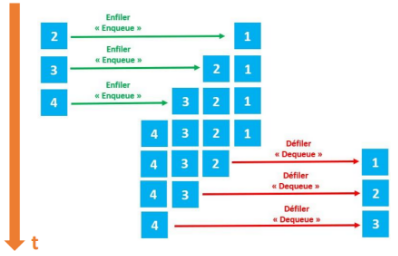{width=60%; : .center }

**Exemple :** Exemples : Soit une file F composée des éléments suivants : 12, 14, 8, 7, 19 et 22 (le premier élément rentré dans la file est 22 ; le dernier élément rentré dans la file est 12). Pour chaque exemple ci-dessous on repart de la file d'origine : 

- **enfiler(F,42)** la file F est maintenant composée des éléments suivants : 42, 12, 14, 8, 7, 19 et 22 (le premier élément rentré dans la file est 22 ; le dernier élément rentré dans la file est 42) 
- **defiler(F)** la file F est maintenant composée des éléments suivants : 12, 14, 8, 7, et 19 (le premier élément rentré dans la file est 19 ; le dernier élément rentré dans la file est 12) 
- si on applique **defiler(F) 6 fois de suite,** estVide(F) **renvoie vrai** 

!!! info "Capytale : Structure file avec les listes de Python"

    ### <H3 STYLE="COLOR:GREEN;"> <a name="_toc151667933"></a>**5.2. ❤️1<sup>ère</sup> implémentation de la structure file avec les listes de Python❤️**

    On peut utiliser une implémentation similaire à celle des piles, mais si ```defiler``` renvoie l’élément de tête, ```enfiler``` doit placer le nouvel élément à la queue de la file. Pour cela, on doit remonter toute la file. L’opération ```enfiler``` est alors en **temps linéaire**.

    Nous utiliserons une simple liste pour représenter la pile. 

    **<H3 STYLE="COLOR:red;">Activité n° 34 : Structure file avec les listes :**</H3> Compléter la **structure de base** suivante :

    **Remarque** : La fonction enfiler ne renvoie rien.

    **Attention**

    **file += [element] (opérateur d'addition avec affectation):**

    - C'est une opération sur place pour les objets mutables comme les listes.

    - Cela modifie directement la liste originale référencée par file.

    - L'objet reste le même en mémoire.

    **file = file + [element] (concaténation suivie d'affectation):**

    - C'est une opération de création d'un nouvel objet.

    - L'expression file + [element] crée une nouvelle liste en concaténant file et [element].

    - L'affectation file = ... fait alors pointer le nom pile vers ce nouvel objet. Mais si la variable pile est passée à la fonction par référence (comme c'est souvent le cas avec les objets mutables en Python), cela coupe le lien avec l'objet original.

    De la même manière

    **file = file[1:]** crée une nouvelle liste et réaffecte la variable file localement dans la fonction. Cela ne modifie pas l'objet d'origine si vous utilisez la liste en dehors de la fonction (par exemple, une liste passée en argument). Pour corriger cela, vous devez modifier la liste en place.

    ```python
    '''Implémentation de type abstrait File en utilisant les listes de Python'''

    def fileVide() :
        pass

    def estVide(file) :
        pass

    def enfiler(file, element) :
        # 1ère façon 
        #file.append(element) 

        # 2ème façon
        pass

    def defiler(file) :
        if not estVide(file):
            # 1ère façon 
            # return file.pop(0)
            
            # 2ème façon
            
        pass


    # Programme principal
    if __name__ == '__main__':
        ma_file = fileVide()
        assert estVide(ma_file) == True
        enfiler(ma_file, 'Lundi')
        enfiler(ma_file, 'Mardi')
        enfiler(ma_file, 'Mercredi')
        assert estVide(ma_file) == False
        assert defiler(ma_file) == 'Lundi'
        assert defiler(ma_file) == 'Mardi'
        assert defiler(ma_file) == 'Mercredi'
        assert defiler(ma_file) == 'File vide'
    ```

    **<H3 STYLE="COLOR:red;">Activité n° 35 : Structure file avec les listes :**</H3> On va rajouter à la structure de base précédente deux fonctions : ```taille``` et ```sommet``` qui permettent respectivement de retourner la taille de la file (**sans utiliser la fonction de python len !!**) et le sommet de la file (**sans utiliser les indices !!**). On ne pourra utiliser seulement les fonctions primitives précédentes et en devra récupérer la file originelle telle qu’elle était.

    ```python
    def taille(file):
        pass
    def sommet(file):
        pass

    # Programme principal
    if __name__ == '__main__':
        ma_file = fileVide()
    
        enfiler(ma_file, 'Lundi')
        enfiler(ma_file, 'Mardi')
        enfiler(ma_file, 'Mercredi')
        assert taille(ma_file) == 3
        assert sommet(ma_file) == 'Lundi'
    ```
!!! question "Capytale : Structure file avec la POO et les lists de Python"

    ### <H3 STYLE="COLOR:GREEN;"> <a name="_toc151667934"></a>**5.3. ❤️2<sup>ème</sup> implémentation de la structure file avec la POO et les lists de Python❤️**</H3>

    **<H3 STYLE="COLOR:red;">Activité n° 36 : Structure File avec la POO et les lists de Python :**</H3> Créer une classe File qui construit une liste vide, puis compléter les autres méthodes de la classe  :

    **Remarque** : La fonction enfiler ne renvoie rien.

    **Attention**

    **file += [element] (opérateur d'addition avec affectation):**

    - C'est une opération sur place pour les objets mutables comme les listes.

    - Cela modifie directement la liste originale référencée par file.

    - L'objet reste le même en mémoire.

    **file = file + [element] (concaténation suivie d'affectation):**

    - C'est une opération de création d'un nouvel objet.

    - L'expression file + [element] crée une nouvelle liste en concaténant file et [element].

    - L'affectation file = ... fait alors pointer le nom pile vers ce nouvel objet. Mais si la variable pile est passée à la fonction par référence (comme c'est souvent le cas avec les objets mutables en Python), cela coupe le lien avec l'objet original.

    De la même manière

    **file = file[1:]** crée une nouvelle liste et réaffecte la variable file localement dans la fonction. Cela ne modifie pas l'objet d'origine si vous utilisez la liste en dehors de la fonction (par exemple, une liste passée en argument). Pour corriger cela, vous devez modifier la liste en place.

    ```python
    '''Implémentation 3 de type abstrait Liste en utilisant la POO et les listes de Python'''

    class File:
        '''Classe permettant de créer des files'''
        def __init__(self):
            pass

        def estVide(self) :
            pass

        def enfiler(self, element) :
            # 1ère façon
            # self.file.append(element)
            
            # 2ème façon
            pass

        def defiler(self):
            if not self.estVide():
                # 1ère façon 
                # return self. file.pop(0)
            
                # 2ème façon 
                pass

    # Programme principal
    if __name__ == '__main__':
        ma_file = File()
        assert ma_file.estVide() == True
        ma_file.enfiler('Lundi')
        ma_file.enfiler('Mardi')
        ma_file.enfiler('Mercredi')
        assert ma_file.estVide() == False
        assert ma_file.defiler() == 'Lundi'
        assert ma_file.defiler() == 'Mardi'
        assert ma_file.defiler() == 'Mercredi'
        assert ma_file.defiler() == 'File vide'
    ```

    **<H3 STYLE="COLOR:red;">Activité n° 37 : Structure file avec la POO et les lists de Python:**</H3> On va rajouter à la structure de base précédente deux méthodes de la classe File : ```taille``` et ```sommet``` qui permettent respectivement de retourner la taille de la file (**sans utiliser la fonction de python len !!**) et le sommet de la file (**sans utiliser les indices !!**). On ne pourra utiliser seulement les fonctions primitives précédentes et en devra récupérer la file originelle telle qu’elle était.
    
    On pourra s’aider d’une file auxiliaire.
    ```python
        def taille(self) :
            pass

        def sommet(self):
            pass
    # Programme principal
    if __name__ == '__main__':
        ma_file = File()
        ma_file.enfiler('Lundi')
        ma_file.enfiler('Mardi')
        ma_file.enfiler('Mercredi')
        assert ma_file.taille() == 3
        assert ma_file.sommet() == 'Lundi'
    ```

    Ici, **tous les coûts d’exécution sont unitaires.**

    **<H3 STYLE="COLOR:red;">Activité n° 38 : Structure pile avec la POO et les lists de Python:**</H3> On va rajouter à la structure une méthode de la classe File : afficher qui permet d’afficher (retourner) la file sous forme de liste .

    ```python
        def afficher(self) :
            pass
    ```
    Rajouter au programme principal :
    ```python
        assert ma_file.afficher() == ['Mardi', 'Mercredi', 'Lundi']
    ```

    Cette implémentation est très **peu efficace** 

    **<H3 STYLE="COLOR:red;">Activité  : Structure file avec la POO et les lists de Python:**</H3> On va rajouter à la structure de base précédente deux fonctions : ```taille2``` et ```sommet2``` qui permettent respectivement de retourner la taille de la file (**sans utiliser la fonction de python len !!**) et le sommet de la file (**sans utiliser les indices !!**). On ne pourra utiliser seulement les fonctions primitives précédentes et en devra récupérer la file originelle telle qu’elle était.
    
    On pourra s’aider d’une file auxiliaire.

!!! info "Capytale : structure file avec la POO et une liste chainée"

    ### <H3 STYLE="COLOR:GREEN;"> <a name="_toc151667935"></a>**5.4. ❤️3<sup>ème</sup> implémentation de la structure file avec la POO et une liste chainée❤️**</H3>


    **<H3 STYLE="COLOR:red;">Activité n° 39 : Structure pile avec la POO et les listes chainées :**</H3> COmpléter le constructeur de Node

    ```python
    '''Implémentation de type abstrait File avec la POO et les listes chainées et deux classes'''

    class Node:
        def __init__(self, value = None, next = None):
            pass
    ```

    Compléter le constructeur de la class File

    **attention** pour améliorer l'implémentation il nous faudra un attribut queue 

    ```python
    class Node:
        def __init__(self, value = None, next = None):
            pass

    class File:
        def __init__(self, c=None):
            pass
            self.head = ...
    ```
    Tester
    ```python
    f = File()
    ```
    Completer les 3 méthodes : 

    - estVide(), 

    - enfiler() et defiler() sera la version enfiler par la tête et défiler par la queue : version un peu plus compliquée!!

    - enfiler2() et defiler2() sera la version enfiler par la queue et défiler par la tete : version plus simple!!

    Tester
    
    ```python
    f = File()
    assert f.estVide() == True
    f.enfiler('Lundi')
    f.enfiler('Mardi')
    f.enfiler('Mercredi')
    assert f.estVide() == False
    assert f.defiler() == 'Lundi'
    assert f.defiler() == 'Mardi'
    assert f.defiler() == 'Mercredi'
    assert f.defiler() == 'File vide'
    f.enfiler2('Lundi')
    f.enfiler2('Mardi')
    f.enfiler2('Mercredi')
    assert f.defiler2() == 'Lundi'
    assert f.defiler2() == 'Mardi'
    assert f.defiler2() == 'Mercredi'
    assert f.defiler2() == 'File vide'
    ```
    Compléter la méthode \_\_str\_\_.Attention c'est un peu plus compliqué. De façon générale on peut utiliser une list pour enregistrer les valeurs que l'on va lire sur la file afin de les présenter : on mettra le sommet de la file à gauche (le premier à sortir) et la queue de la file à droite (par où on enfile)

    ```python
    class Node:
        def __init__(self, value = None, next = None):
            pass

    class File:
        def __init__(self, c=None):
            pass
            self.head = ...

        def estVide(self):
            pass

        def enfiler(self, element):
            ### version enfiler par la tête et défiler par la queue
            pass

        def defiler(self):
            ### version enfiler par la tête et défiler par la queue
            pass
        
        def enfiler2(self, element):
            ### version enfiler par la queue et défiler par la tete
            pass

        def defiler2(self):
            ### version enfiler par la queue et défiler par la tete
            pass
        
        def __str__(self):
            ### version enfiler par la queue et défiler par la tete
            pass
    
    f = File()
    assert f.estVide() == True
    f.enfiler2('Lundi')
    f.enfiler2('Mardi')
    f.enfiler2('Mercredi')
    
    ```
    Compléter les 2 méthodes suivante : taille() et sommet(). On utilisera enfiler2() et defiler2() qui sera la version enfiler par la queue et défiler par la tete


    ```python
    class Node:
        def __init__(self, value = None, next = None):
            pass

    class File:
        def __init__(self, c=None):
            pass
            self.head = ...

        def estVide(self):
            pass

        def enfiler(self, element):
            ### version enfiler par la tête et défiler par la queue
            pass

        def defiler(self):
            ### version enfiler par la tête et défiler par la queue
            pass
        
        def enfiler2(self, element):
            ### version enfiler par la queue et défiler par la tete
            pass

        def defiler2(self):
            ### version enfiler par la queue et défiler par la tete
            pass
        
        def __str__(self):
            ### version enfiler par la queue et défiler par la tete
            pass

        def taille(self):
            pass
        
        def sommet(self):
            pass

    f = File()
    assert f.estVide() == True
    f.enfiler2('Lundi')
    f.enfiler2('Mardi')
    f.enfiler2('Mercredi')
    ```

    Tester

    Ajouter deux fonctions taille(file) sommet(file). On utilisera enfiler2() et defiler2() qui sera la version enfiler par la queue et défiler par la tete

    Tester

    Ajouter une fonction afficherFile(file)

    Tester

    La file implémentée de la sorte n'est **pas très efficace** car il faut entièrement la la parcourir pour enfiler un élément!!
    On va améliorer l'efficacité avec **2 pointeurs** : l'un vers la **tête** et l'autre vers la **queue**!

    Compléter la structure

    ```python
    class Node:
        def __init__(self, value=None, next=None):
            # Initialisation d'un nœud avec une valeur et un pointeur vers le nœud suivant
            pass


    class File:
        def __init__(self, c=None):
            # Initialisation de la file avec une tête et une queue
            self.head = c...    # Pointeur vers le premier élément de la file
            self.queue = ...   # Pointeur vers le dernier élément de la file

        def estVide(self):
            # Vérifie si la file est vide
            pass

        def enfiler(self, element):
            ### version enfiler par la tête et défiler par la queue
            """Ajoute un élément au début de la file."""
            ...           # Création d'un nouveau nœud avec la valeur donnée
            if ...        # Si la file est vide
                ...       # Le nœud devient à la fois la tête et la queue
            else:
                ...       # Le nouveau nœud pointe vers l'ancien premier nœud
                ...       # Mise à jour de la tête avec le nouveau nœud

        def defiler(self):
            ### version enfiler par la tête et défiler par la queue
            """Retire un élément à la fin de la file."""
            if self.estVide():         # Si la file est vide
                ...       # Retourne un message d'erreur
            
            if ...        # Cas d'un seul élément dans la file
                ...       # Sauvegarde la valeur de l'unique nœud
                ...       # Vide la tête
                ...       # Vide la queue
                ...       # Retourne la valeur supprimée
            
            ...           # Départ au premier nœud
            while ...       # Parcours jusqu'à l'avant-dernier nœud
                ...       

            ...           # Sauvegarde la valeur du dernier nœud
            ...           # Supprime la référence au dernier nœud
            ...           # Met à jour la queue
            ...           # Retourne la valeur supprimée

        def enfiler2(self, element):
            ### version enfiler par la queue et défiler par la tete
            """Ajoute un élément à la fin de la file."""
            ...          # Création d'un nouveau nœud
            if ...       # Si la file est vide
                ...      # Le nœud devient la tête et la queue
            else:
                ...       # L'ancien dernier nœud pointe vers le nouveau
                ...       # Mise à jour de la queue avec le nouveau nœud

        def defiler2(self):
            ### version enfiler par la queue et défiler par la tete
            """Retire un élément au début de la file."""
            if ...       # Si la file n'est pas vide
                ...       # Sauvegarde la valeur de la tête
                ...       # Passe au nœud suivant
                if ...        # Si la file devient vide
                    ...       # Vide aussi la queue
                ...         # Retourne la valeur supprimée
            else:
                raise IndexError("File vide")  # Erreur si la file est vide

        def __str__(self):
            """Affiche les éléments de la file sous forme d'une chaîne."""
            ### version enfiler par la queue et défiler par la tete
            if self.head is None:          # Si la file est vide
                return "[]"                # Retourne une chaîne vide
            else:
                ...       # Liste pour stocker les éléments
                ...       # Départ au premier nœud
                while ...        # Parcours de la file
                    ...       # Ajoute la valeur à la liste
                    ...       # Passe au nœud suivant
                return ...      # Retourne les éléments sous forme de liste


    f=File()
    assert f.estVide() == True
    f.enfiler('Lundi')
    f.enfiler('Mardi')
    f.enfiler('Mercredi')
    assert f.estVide() == False
    assert f.defiler() == 'Lundi'
    assert f.defiler() == 'Mardi'
    assert f.defiler() == 'Mercredi'
    assert f.defiler() == 'File vide'
    f.enfiler2('Lundi')
    f.enfiler2('Mardi')
    f.enfiler2('Mercredi')
    print(f)
    assert f.defiler2() == 'Lundi'
    assert f.defiler2() == 'Mardi'
    assert f.defiler2() == 'Mercredi'
    ```

!!! question "Capytale : Utilisation de deque"

    ### <H3 STYLE="COLOR:GREEN;"> <a name="_toc151667936"></a>**5.5. Autre implémentation des files avec les bibliothèques de Python**</H3>


    **<H3 STYLE="COLOR:red;">Activité n°40.: Utilisation de deque pour Implémenter une Pile :</H3> 

    empiler -> .append()

    depiler -> .pop()

    ```python
    from collections import deque

    # Création de la pile
    pile = deque()

    ##########################################################
    # Vérifier si la pile est vide


    print("La pile est vide ?", est_vide(pile))

    ##########################################################
    # Empiler des éléments 10, 20 puis 30 
    #à compléter


    print("Pile après empilage:", pile)

    ##########################################################
    # Dépiler un élément
    # à compléter


    print("Élément dépilé:", element)

    #########################################################
    # Regarder l'élément au sommet sans le dépiler
    # à compléter


    print("Élément au sommet:", sommet)

    #########################################################
    # Déterminer la taille de la pile 
    # à compléter


    print("La taille de la pile:", taille)
    ```

    **<H3 STYLE="COLOR:red;">Activité n°41.: Utilisation de deque pour Implémenter une File :</H3> 

    enfiler() -> .append()

    défiler() -> .popleft()

    ```python
    from collections import deque

    # Création de la file
    file = deque()

    ##########################################################
    # Vérifier si la file est vide


    print("La file est vide ?", est_vide(file))

    ##########################################################
    # Enfiler des éléments 10, 20 puis 30 
    #à compléter


    print("file après enfilage:", file)

    ##########################################################
    # Défiler un élément
    # à compléter


    print("Élément défilé:", element)

    #########################################################
    # Regarder l'élément au sommet sans le défiler
    # à compléter


    print("Élément au sommet:", sommet)

    #########################################################
    # Déterminer la taille de la file 
    # à compléter


    print("La taille de la file:", taille)
    ```

    Les piles et les files sont des structures de données fondamentales qui peuvent être implémentées de manière efficace en Python à l'aide de listes ou de la classe deque de la bibliothèque collections. 

    L'utilisation de **deque** est souvent préférée pour des raisons de performance, notamment pour les **files**.

### <H3 STYLE="COLOR:GREEN;"> <a name="_toc151667937"></a>**5.6. Piles vs Files :**</H3>

|**Pile**|**File**|
| :-: | :-: |
|Les objets sont insérés et supprimés à 1 seule extrémité|Les objets sont insérés et retirés aux 2 extrémités.|
|Dans les piles, un seul pointeur est utilisé. Il pointe vers le haut de la pile. |Dans les files, deux pointeurs différents sont utilisés pour les extrémités; le tète et la fin.|
|Dans les piles, le dernier objet inséré est le premier à sortir. |Dans les files, l’objet inséré en premier est le premier qui sera supprimé. |
|Les piles suivent l’ordre Last In First Out (LIFO) |Les files suivent l’ordre First In First Out (FIFO)|
|Les opérations de pile s’appellent « Empiler » et « Dépiler ». |Les opérations de file sont appelées « Enfiler » et « Défiler ».|
|Les piles sont visualisées sous forme de collections verticales. |Les files sont visualisées sous forme de collections horizontales.|

## <H2 STYLE="COLOR:BLUE;"> <a name="_toc151667938"></a>**6. Les dictionnaires**</H2>

### <H3 STYLE="COLOR:GREEN;"> <a name="_toc60173193"></a><a name="_toc151667939"></a>**6.1. Définition**</H3>

Les dictionnaires ont déjà été étudiés en classe de première. 

Pour rappel, ce type de données, aussi appelé **tableau associatif**, permet de stocker des **valeurs** et d'y accéder au moyen d'une **clé**, contrairement au tableau qui permet d'accéder à une donnée au moyen d'un indice.

**Exemple** : un dictionnaire (le livre) de langues

On suppose que toutes les clés sont distinctes et dans la suite on va se concentrer sur les clés et non pas sur les données associées.

### <H3 STYLE="COLOR:GREEN;"> <a name="_toc60173194"></a><a name="_toc151667940"></a>**6.2. Les opérations de bases dans un dictionnaire**</H3>

Les opérations classiques que l'on peut effectuer sur un dictionnaire sont :

- **Ajouter** une nouvelle entrée au dictionnaire en créant une nouvelle clé
- **Modifier** la valeur associée à une clé existante
- **Supprimer** une entrée dans un dictionnaire (méthode .pop())
- **Rechercher** la présence d'une clé dans un dictionnaire

**Attention** : Le dictionnaire de Python permet d’avoir ce comportement mais est une version spécifique à Python de cette donnée plus générale. Ce qui nous intéresse ici c’est d’avoir une structure de données que l’on va interroger et que l’on peut modifier. Le but est de trouver des méthodes pour faire cela efficacement.

### <H3 STYLE="COLOR:GREEN;"> <a name="_toc60173197"></a><a name="_toc151667941"></a>**6.3. Les clés**</H3>

Une clé peut être d'un autre type que chaîne de caractère, du moment que c'est un **objet non mutable**, c'est à dire qui ne peut pas être modifié. Une clé ne **peut pas être une liste** par exemple car une liste est un objet mutable que l'on peut modifier, par exemple au travers de la méthode .append().

Regardons ce qui se passe si on essaye de définir une clé de type **list** pour un dictionnaire :
```
>>> dico[[2,1]] = "..."
---------------------------------------------------------------------------
TypeError                                 Traceback (most recent call last)
<ipython-input-4-d463baccae6e> in <module>()
----> 1 dico[[2,1]]
TypeError: unhashable type: 'list'
```
Le type **list** n'est pas pas *hashable*. Mais qu'est-ce que le hachage ?

### <H3 STYLE="COLOR:GREEN;"> <a name="_toc151667942"></a>**6.4. Hachage**</H3>

La notion de *Hachage* est omiprésente en informatique et est au coeur du fonctionnement des dictionnaires. Le hachage est un mécanisme permettant de transformer la clé en un nombre unique permettant l'accès à la donnée, un peu à la manière d'un indice dans un tableau.

#### <H4 STYLE="COLOR:MAGENTA;"> **6.4.1. Définition d’une fonction de hachage**</H4>


⚓︎  
Une fonction de hachage calcule une empreinte unique à partir de la donnée fournie en entrée. Elle doit respecter les propriétés suivantes :  

1. **Longueur constante** :  
   La longueur de l'empreinte (valeur retournée) doit être fixe, quel que soit le volume ou le contenu des données en entrée.  

2. **Irréversibilité** :  
   Il doit être impossible de retrouver la donnée d'origine à partir de l'empreinte, ce qui garantit une sécurité cryptographique.  

3. **Unicité (dans la mesure du possible)** :  
   Des données différentes doivent produire des empreintes différentes. Cependant, des collisions (deux données différentes produisant la même empreinte) peuvent exister mais doivent être minimisées.  

4. **Déterminisme** :  
   Des données identiques doivent produire des empreintes identiques à chaque calcul.  

**Remarque importante** : La fonction `hash()` de Python ne garantit pas les mêmes empreintes d'une session à l'autre, car elle intègre un "salt" pour renforcer la sécurité. Pour des besoins reproductibles, on utilise des bibliothèques comme `hashlib`.  


#### <H4 STYLE="COLOR:MAGENTA;"> **6.4.2. Quelques utilisations du hachage**</H4>
⚓︎  

#### **Stockage sécurisé des mots de passe**  
Lorsqu'un utilisateur crée un compte, son mot de passe ne doit jamais être stocké en clair pour des raisons de sécurité. Le mot de passe est transformé en empreinte (par exemple, via une fonction comme SHA-256) avant d'être enregistré. Si la base de données est compromise, il est presque impossible de retrouver le mot de passe original.  

Exemple Python avec `hashlib` pour une empreinte SHA-256 :  

```python
import hashlib

password = "monMotDePasse"
hash_object = hashlib.sha256(password.encode())
hashed_password = hash_object.hexdigest()
print(hashed_password)  # Empreinte unique
```

???+ question "Tester ce qui est proposé"

    {{ IDE() }}


#### **Détection des modifications dans un fichier**  
En calculant l'empreinte d'un fichier à un moment donné, on peut détecter si ce fichier a été modifié ultérieurement. C'est une méthode utilisée par les systèmes de contrôle de versions ou les logiciels de vérification d'intégrité (ex : `md5sum`, `sha256sum`).  

Exemple d'utilisation avec Python :  
```python
import hashlib

def hash_file(filename):
    hasher = hashlib.sha256()
    with open(filename, 'rb') as f:
        while chunk := f.read(8192):  # Lecture par blocs
            hasher.update(chunk)
    return hasher.hexdigest()

print(hash_file("monFichier.txt"))
```


#### **Autres usages courants** :  
- **Indexation et recherche rapide** (dans les bases de données ou dictionnaires).  
- **Cryptographie** : Les fonctions de hachage jouent un rôle clé dans les signatures numériques et la blockchain.  
- **Vérification des téléchargements** : Les empreintes permettent de s'assurer qu'un fichier n'a pas été altéré pendant son transfert.  

---

#### <H4 STYLE="COLOR:MAGENTA;"> **6.4.3. Table de hachage** </H4>
⚓︎  

Une table de hachage est une structure de données clé-valeur qui permet un accès rapide aux éléments.  

##### **Principe** :  
Chaque clé est transformée en un indice via une fonction de hachage, permettant d'accéder directement à la valeur correspondante.  

**Exemple simplifié de fonctionnement en Python** :  
```python
dictionnaire = {"nom": "Alice", "âge": 30}
print(dictionnaire["nom"])  # Recherche rapide grâce à une table de hachage
```
???+ question "Tester ce qui est proposé"

    {{ IDE() }}


##### **Caractéristiques** :  
1. **Complexité en temps constant** :  
   L'accès à un élément dans une table de hachage est en moyenne constant, \( O(1) \), indépendamment de la taille de la table.  

2. **Gestion des collisions** :  
   Lorsque deux clés différentes produisent le même indice (collision), des techniques comme le chaînage ou l'adressage ouvert sont utilisées pour résoudre le conflit.  

##### **Comparaison avec d'autres structures** :  
- Dans un tableau ou une liste chaînée, la recherche est proportionnelle au nombre d'éléments (\( O(n) \)).  
- Une table de hachage est donc beaucoup plus rapide pour la recherche sur des clés.  

Regardez la vidéo ci-dessous sur les tables de hachage.

Tables de hash : <https://ladigitale.dev/digiview/#/v/66bcbaf4e545d>

##### **Les limites des fonctions de hachage :**  
   - Elles ne garantissent pas l'absence totale de collisions.  
   - Leur efficacité dépend de la qualité de la fonction de hachage choisie.  


##### **Exemples de fonctions de hachage populaires :**  

- MD5 (désormais considéré comme obsolète en cryptographie). 

- SHA-1 (déprécié pour des raisons de sécurité).  

**Longueur de l'empreinte** : SHA-1 produit une empreinte de 160 bits (40 caractères hexadécimaux).  

**Pourquoi elle est dépréciée ?**  
  SHA-1 n'est plus considéré comme sécurisé, car des chercheurs ont trouvé des moyens de générer des **collisions** (deux données différentes produisant la même empreinte) en un temps raisonnable avec des ressources informatiques modernes. Cela rend SHA-1 inadapté pour des usages sensibles comme la cryptographie ou la vérification d'intégrité.  

**Exemple** :  
```python
import hashlib

data = "Message important"
hash_object = hashlib.sha1(data.encode())
sha1_hash = hash_object.hexdigest()
print(sha1_hash)  # Exemple d'empreinte : a5e64f98b819a40e05d15ec2cbd7d25544f6f435
```
???+ question "Tester ce qui est proposé"

    {{ IDE() }}


- SHA-256 (très courant et plus sécurisé)

**Longueur de l'empreinte** : SHA-256 produit une empreinte de 256 bits (64 caractères hexadécimaux).  

**Pourquoi est-il utilisé ?**  
  SHA-256 est beaucoup plus robuste que SHA-1, car il est conçu pour éviter les collisions et les attaques par force brute. Il est largement utilisé dans des domaines sensibles comme la sécurité informatique, la blockchain, et les signatures numériques.  

**Exemple** :  
```python
import hashlib

data = "Message important"
hash_object = hashlib.sha256(data.encode())
sha256_hash = hash_object.hexdigest()
print(sha256_hash)  # Exemple d'empreinte : 9e31b9c8c694b1616dfd28481f54741a421d2481a18c62e531b34a79b36520b4
```

???+ question "Tester ce qui est proposé"

    {{ IDE() }}


##### **Applications simples :**

1 **Vérification d'intégrité des fichiers :**

   - Avant de télécharger un fichier (par exemple un logiciel), on vous fournit une empreinte (souvent en SHA-256). 

   - Après le téléchargement, vous calculez l'empreinte de votre fichier et vérifiez qu'elle correspond à celle fournie. 

   - **But** : S'assurer que le fichier n'a pas été modifié ou corrompu pendant le transfert.

   **Exemple pratique :**  

   Vous téléchargez un fichier "important.iso" et l'empreinte fournie par le site est :  
   `d2a6c7b04f09d856a0e6b7a4c5d4c8c9d9e8f7e2e67f6c98d8c7e4b5c4d3b2a1`  
   Vous calculez ensuite :  
   ```python
   hash_file = hashlib.sha256(open("important.iso", "rb").read()).hexdigest()
   print(hash_file)
   ```  
   Si les deux empreintes sont identiques, le fichier est fiable.

---

2 **Stockage sécurisé des mots de passe :**

   - Quand un utilisateur crée un compte, son mot de passe n'est jamais stocké directement. Au lieu de cela, une empreinte est générée avec SHA-256 (ou une version améliorée comme PBKDF2).  

   - Quand l'utilisateur se connecte, son mot de passe saisi est haché et comparé à l'empreinte stockée. Si elles correspondent, l'accès est accordé.  

   **Pourquoi ne pas stocker les mots de passe en clair ?**  
   
   Si une base de données est piratée, les mots de passe sont protégés, car il est pratiquement impossible de retrouver l'original à partir de l'empreinte.  

   **Exemple simple :**  
   ```python
   def store_password(password):
       hash_object = hashlib.sha256(password.encode())
       return hash_object.hexdigest()

   stored_hash = store_password("motDePasse123")
   print(stored_hash)
   # Empreinte stockée : d2d2d2c7e9d3f4d4c8e7c7e5a6d3e4b8d7c9f6a4b6e4c8e2
   ```

???+ question "Tester ce qui est proposé"

    {{ IDE() }}

!!! info "Capytale : Utilisation des dictionnaires"

    ### <H3 STYLE="COLOR:GREEN;"> <a name="_toc151667943"></a>**6.5. Rappel : Utilisation des dictionnaires en Python**</H3>


    Dans un dictionnaire, les clés sont stockées dans une table de hachage, ce qui explique le fait que le dictionnaire est optimisé pour la recherche sur les clés.

    Vous pouvez à présent regarder la vidéo suivante afin de vous reviser la manipulation des dictionnaires en python.

    Les dictionnaires : <https://ladigitale.dev/digiview/#/v/66bcbd45219a3> 


    **<H3 STYLE="COLOR:red;">Activité n° 42 : Itérer sur les éléments d’un dictionnaire :**</H3> 
    Au zoo de Beauval, il y a 5 éléphants d’Asie, 17 écureuils d’Asie, 2 pandas d’Asie, etc. On représente cet inventaire à l’aide d’un dictionnaire, de façon suivante :

    ```python
    if __name__ == "__main__":
        zoo_Beauval = {
            'éléphant': ('Asie', 5),
            'écureuil': ('Asie', 17),
            'panda': ('Asie', 2),
            'hippopotame': ('Afrique', 7),
            'girafe': ('Afrique', 4),
            'lion': ('Afrique', 17)
        }
    ```

    On représente de la même façon le zoo de La Flèche :

    ```python
        zoo_LaFleche = {
            'ours': ('Europe', 4),
            'tigre': ('Asie', 7),
            'girafe': ('Afrique', 11),
            'hippopotame': ('Afrique', 3)
        }
    ```

    On souhaite se doter d’une fonction **plus\_grand\_nombre()** qui prend un zoo en paramètre et qui renvoie le nom de l’animal le plus représenté dans ce zoo.

    Par exemple
    ```python
    assert plus_grand_nombre(zoo_LaFleche) == 'girafe'
    assert plus_grand_nombre(zoo_Beauval) == 'écureuil'
    ```

    1 Quel type de boucle peut-on envisager pour le code de cette fonction ?
    ```python
    for cle in dico.keys()
    for valeur in dico.values()
    for (cle, valeur) in dico.items()
    Aucune boucle.
    ```
    2 Écrire le corps de cette fonction.

    On souhaite se doter d’une fonction **nombre\_total** qui prend un zoo en paramètre ainsi que le nom d’un continent, et qui renvoie le nombre d’animaux originaires de ce continent dans le zoo. 

    Par exemple :
    ```python
    assert nombre_total(zoo_LaFleche, 'Afrique') == 14
    assert nombre_total(zoo_Beauval, 'Asie') == 24
    ```

    3 Quel type de boucle peut-on envisager pour le code de cette fonction ?
    ```python
    for cle in dico.keys()
    for valeur in dico.values()
    for (cle,valeur) in dico.items()
    Aucune boucle.
    ```
    4 Écrire le code de cette fonction.

    On souhaite se doter d’une fonction **nombre** qui prend un zoo en paramètre ainsi que le nom d’un animal, et qui renvoie le nombre de représentants de cet animal dans le zoo. 

    Par exemple :
    ```python
    assert nombre(zoo_LaFleche, 'panda') == 0
    assert nombre(zoo_Beauval, 'panda') == 2
    ```

    5 Quel type de boucle peut-on envisager pour le code de cette fonction ?
    ```python
    for cle in dico.keys()
    for valeur in dico.values()
    for (cle,valeur) in dico.items()
    Aucune boucle.
    ```
    6 Écrire le code de cette fonction.

    Le temps de recherche dans le dictionnaire est **pratiquement indépendant du nombre d'entrées** dans un dictionnaire (en multipliant le nombre de contacts par 100, le temps est resté pratiquement identique alors que dans le cas de la recherche dans un tableau, celui-ci est proportionnel à la longueur du tableau).

    Le dictionnaire est donc une **structure de données optimisée** pour la recherche sur les clés.

### <H3 STYLE="COLOR:GREEN;"> <a name="_toc151667944"></a>**6.6. La complexité**</H3>

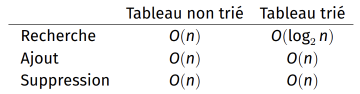{width=50%; : .center }

Dans les deux cas ce n’est pas très efficace : on voudrait une **complexité logarithmique de toutes ces opérations**. On peut faire cela en utilisant des structures de données : **les arbres binaires**

## <H2 STYLE="COLOR:BLUE;"> <a name="_toc151667945"></a>**7. Exercices**</H2>

**=> CAPYTALE Le code vous sera donné par votre enseignant**

**<H3 STYLE="COLOR:red;">Exercice n°1: Implémentation d’une file avec deux piles avec les listes chainées**</H3>

Comment créer une file avec 2 piles ?

L'idée est la suivante : on crée une pile d'entrée et une pile de sortie.

- quand on veut enfiler, on empile sur la pile d'entrée.
- quand on veut défiler, on dépile sur la pile de sortie.
- si celle-ci est vide, on dépile entièrement la pile d'entrée dans la pile de sortie.

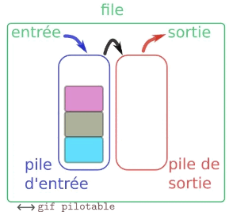{width=50%; : .center }

```python
# il est impératif de comprendre qu'on peut choisir l'implémentation
# de la classe Pile qu'on préfère parmi les deux traitées plus haut.
# Comme elles ont la MÊME INTERFACE et qu'on ne va se servir que
# de cette interface, leur mécanisme interne n'a aucune influence
# sur le code de la classe File que nous ferons ensuite.

# Par exemple, on choisit celle avec la liste chaînée :

class Cellule :
    def __init__(self, contenu, suivante):
        pass

class Pile:
    def __init__(self):
        pass

    def est_vide(self):
        pass

    def empile(self, x):
        pass

    def depile(self):
        pass

    def __str__(self):
        s = ""
        c = self.data
        while c is not None:
            s += str(c.contenu)  # Ajouter la valeur de la cellule
            if c.suivante is not None:  # Ajouter un séparateur si ce n'est pas le dernier élément
                s += " -> "
            c = c.suivante
        return s if s else ""  # Retourner un message "" si la pile est vide

p = Pile()
print( p.est_vide())  # True

# Empiler des éléments
p.empile(10)
p.empile(20)
p.empile(30)

print(p)  # |30|20|10|
print(p.est_vide())  # False

# Dépiler des éléments
print(p.depile())  # 30
print(p)  # |20|10|
print(p.depile())  # 20
print(p)  # |10|

# Tester défilement jusqu'à vide
print(p.depile())  # 10
print(p.est_vide())  # True

# -------------------------------------------------------    
# Implémentation d'une file à l'aide de deux piles 

class File:
    def __init__(self):
        self.entree = Pile()
        self.sortie = Pile()

    def est_vide(self):
        pass

    def enfile(self,x):
        pass

    def defile(self):
        pass
    
    def __str__(self):
        return str(self.entree) + " " + str(self.sortie)
    

f = File()
print(f.est_vide())  # True

# Ajouter des éléments dans la file
f.enfile("Lundi")
f.enfile("Mardi")
f.enfile("Mercredi")
print(f)

# Défilage d'éléments
print(f.defile())  # Lundi
print(f)

print(f.defile())  # Mardi
print(f)

# Ajouter un nouvel élément
f.enfile("Jeudi")
print(f)

# Défilage jusqu'à vide
print(f.defile())  # Mercredi
print(f.defile())  # Jeudi
print(f.est_vide())  # True
```

**<H3 STYLE="COLOR:red;">Exercice n°2 : Structure de données**</H3> 

Quelle structure de données choisir pour chacune de ces tâches ? 

1. Représenter un répertoire téléphonique.
1. Stocker l'historique des actions effectuées dans un logiciel et disposer d'une commande Annuler (ou Undo).
1. Envoyer des fichiers au serveur d'impression

**<H3 STYLE="COLOR:red;">Exercice n°3 : La calculatrice HP**</H3>

La Notation Polonaise Inversée (NPI) permet d'écrire des opérations arithmétiques, sans utiliser de parenthèses. Ici, nous nous limiterons à des nombres entiers naturels et aux opérations+, -, \* et/ sur eux. Dans cette notation, les opérateurs sont écrits après les opérandes (nombres entiers naturels). Par exemple l'expression classique : 

13\*(3+2)

Donne en NPI 

3 2 +13 \*

On écrit et on exécute les opérations dans le sens des priorités vues en cours de mathématiques. Dans cette notation, on réalise

- L'addition entre 3 et 2 ( 3 2 + )
- La multiplication entre le précédent résultat et 13 ( 13 \*)
- On a ainsi le résultat.

1 Donner la File correspondante à la saisie NPI de l'exemple. Faire de même avec la Pile.
2 Quelle est la structure adaptée à la résolution de l'expression ?

Note : On remarquera qu'on doit toujours avoir 2 opérandes pour un opér

ateur. li faut stocker le résultat intermédiaire dans la structure pour effectuer la suite des calculs.

3 En utilisant les opérations du type abstrait Pile, proposer une fonction permettant d'afficher le résultat d'une expression en NPI.

Note : On supposera également que la syntaxe en NPI est correcte.

```python
def evaluer_npi(pile):
    # Pile pour stocker les opérandes
    p = []

    pass


    return p.pop()


pile = [3, 2, "+", 13, "*"]
assert evaluer_npi(pile) == 65

pile = [4, 5, "+", 2, "*"]
assert evaluer_npi(pile) == 18

pile = [10, 2, "/"]
assert evaluer_npi(pile) == 5

pile = [15, 7, "-", 1, "+"]
assert evaluer_npi(pile) == 9

pile = [15, 7, 1, 1, "+", "-", "/", 3, "*", 2, 1, 1, "+", "+", "-"]
assert evaluer_npi(pile) == 5

pile = [10, 0, "/"]
try:
    evaluer_npi(pile)
except AssertionError as e:
    assert str(e) == "Division par zéro impossible."

```

**<H3 STYLE="COLOR:red;">Exercice n°4 : Types abstraits**</H3>

1\. Quelle opération ne fait pas partie de l'interface d'une pile ?

1. ajouter un élément à la pile 
1. retirer l'élément le plus récent de la pile 
1. retirer l'élément le plus ancien de la pile 

2\. Quelle opération ne fait pas partie de l'interface d'une file?

1. ajouter un élément à la file 
1. retirer l'élément le plus récent de la file 
1. retirer l'élément le plus ancien de la file 

3\. L'opération dequeue d'une file s'exécute en un temps qui est proportionnel au nombre de valeurs stockées dans la file.

1. Faux 
1. Vrai

4\. Un tableau associatif permet de créer une association clé -> valeur.

Pour stocker des numéros de téléphone à l'aide d'un tableau associatif, quelle solution semble préférable, dans la mesure où il peut y avoir des homonymes?

1. La clé est le numéro de téléphone, et la valeur est le nom correspondant 
1. La clé est le nom et la valeur est le numéro de téléphone correspondant 
1. La clé est le nom et la valeur la collection des numéros de téléphone correspondants 
1. La clé est un simple numéro unique et la valeur le couple nom/téléphone

**<H3 STYLE="COLOR:red;">Exercice n°5 : Type list en Python**</H3>

1\. Le type list utilisé dans Python correspond le mieux :

1. au type abstrait liste chaînée 
1. au type abstrait file 
1. au type abstrait tableau 

2\. La récupération d'un élément d'un objet Python de type list, connaissant son indice :

1. nécessite un temps proportionnel au nombre d'éléments de la liste 
1. s'effectue en temps constant 
1. est impossible 

3\. Sur un objet de type list Python, quelles opérations sont faites en un temps indépendant de la longueur de la liste?

1. supprimer le premier élément 
1. supprimer le dernier élément
1. ajouter un élément au début (en position 0)
1. ajouter un élément à la fin

**<H3 STYLE="COLOR:red;">Exercice n°6 : Structures de donnés Python**</H3>

1\. Pour implémenter une pile avec Python, on peut se servir d'un type de données disponible dans le langage :

1. le type list 
1. le type dict 
1. le type set 
1. le type tuple 

2\. Accéder à une valeur dans un dictionnaire à partir de la clé à laquelle la valeur est associée est réalisé :

1. en un temps proportionnel à la taille du dictionnaire 
1. en un temps constant 

**<H3 STYLE="COLOR:red;">Exercice n°7 : Pile classique**</H3>

Nous allons réaliser une classe Pile en utilisant une liste Python. Voici le contructeur de la classe

```python
class Pile:
    """Structure  de  pile"""
    def init (self): 
        self.contenu = []
        
    # à compléter   
        
    def __str__(self):
        return " -> ".join(map(str, reversed(self.contenu)))

# Création d'une instance de la pile
p = Pile()

# Vérifier si la pile est vide
print(p.est_vide())  # True

# Empiler des éléments
p.empiler(10)
p.empiler(20)
p.empiler(30)
print(p)  # 30 -> 20 -> 10

# Dépiler des éléments
print(p.depiler())  # 30
print(p)  # 20 -> 10

# Empiler un nouvel élément
p.empiler(40)
print(p)  # 40 -> 20 -> 10

# Dépiler jusqu'à vider la pile
print(p.depiler())  # 40
print(p.depiler())  # 20
print(p.depiler())  # 10
print(p.est_vide())  # True

# Tentative de dépiler une pile vide
try:
    p.depiler()
except IndexError as e:
    print("Erreur :", e)  # La pile est vide
                
    
```

1 Implémentez la méthode est\_vide(self) qui retourne True si la Pile est vide et False sinon.

2 Implémentez la méthode empiler(self,v) qui ajoute la valeur v au sommet de la pile (et donc en fin de la liste)

3 Implémentez la méthode depiler(self) qui :

   1. lève une exception *IndexError* si la liste est vide ;
   1. sinon, retire l’élément au sommet de la pile et le retourne.

4 **Bonus :** Vous pouvez implémenter la méthode spéciale str (self)

!!! info
    ```python
        def __str__(self):
            return "Pile : " + " -> ".join(map(str, reversed(self.contenu)))
    ```  

    **1. reversed(self.contenu) :**

    reversed() est une fonction Python qui retourne un itérateur avec les éléments de la liste dans l'ordre inverse.

    Cela est nécessaire car dans une pile (LIFO), le dernier élément ajouté est en haut, donc on souhaite afficher les éléments du sommet vers la base.

    **2. map(str, reversed(self.contenu)) :**

    map est une fonction Python qui applique une fonction à chaque élément d'une collection (liste, itérateur, etc.).
    Ici, map(str, ...) convertit chaque élément retourné par reversed(self.contenu) en chaîne de caractères (str).

    Pourquoi utiliser map ? Cela évite de devoir écrire une boucle pour convertir chaque élément en chaîne de caractères.

    **3. " -> ".join(...) :**

    join est une méthode des chaînes de caractères en Python.

    Elle prend une liste de chaînes en entrée et concatène tous les éléments en insérant la chaîne spécifiée (ici " -> ") entre eux.
!!!

**<H3 STYLE="COLOR:red;">Exercice n°8 :** </H3> annulé


**<H3 STYLE="COLOR:red;">Exercice n°9 : pile ou file et parenthèse**</H3>

On dit qu’une chaîne de caractères comprenant, entre autre choses, des parenthèses ( et ) est bien parenthésée lorsque chaque parenthèse ouvrante est associée à une unique parenthèse fermante, et réciproquement.

Ecrire une fonction prenant en paramètres :

- une chaîne de caractères bien parenthésée ;
- l’indice d’une parenthèse fermante.

et qui retourne l’indice de la parenthèse ouvrante associée.

```python
def trouver_parenthese_ouvrante(chaine, indice_fermante):
    pile = ...  # Pile pour stocker les indices des parenthèses ouvrantes
    pass

assert trouver_parenthese_ouvrante("(a + b)", 6) == 0  
assert trouver_parenthese_ouvrante("((a + b) * c)", 7) == 1  
assert trouver_parenthese_ouvrante("a + (b + (c + d))", 15) == 9 
assert trouver_parenthese_ouvrante("(a + (b + (c)))", 13) == 5 
```

**<H3 STYLE="COLOR:red;">Exercice n°10 : file et copie**</H3>

Vous allez améliorer la classe file en lui ajoutant quelques fonctionnalités. Vous pouvez utiliser, comme base de travail, l’implémentation des files avec les doubles piles ou celle avec les listes chaînées  

1. Ajouter la méthode spéciale \_\_len\_\_ (self) qui renvoie la longueur d’une file.

```python
class Cellule :
    def __init__(self, contenu, suivante):
        pass

class Pile:
    def __init__(self):
        pass

    def est_vide(self):
        pass

    def empile(self, x):
        pass

    def depile(self):
        pass

    def __str__(self):
        s = ""
        c = self.data
        while c is not None:
            s += str(c.contenu)  # Ajouter la valeur de la cellule
            if c.suivante is not None:  # Ajouter un séparateur si ce n'est pas le dernier élément
                s += " -> "
            c = c.suivante
        return s if s else ""  # Retourner un message "" si la pile est vide

class File:
    def __init__(self):
        self.entree = Pile()
        self.sortie = Pile()

    def est_vide(self):
        pass

    def enfile(self,x):
        pass

    def defile(self):
        pass
    
    def __str__(self):
        return str(self.entree) + " " + str(self.sortie)

        
    def __len__(self):
        pass
     

f = File()
f.enfile("Lundi")
f.enfile("Mardi")
f.enfile("Mercredi")
f.enfile("Jeudi")
print(len(f))
f.defile()
len(f)
```
2 Ecrire une fonction copie\_file(f) recevant une file (f) comme argument et renvoyant une copie f2 de f. Attention, la file f doit (bien sûr) être conservée !

Tester avec avec f
et la copie_file de f

**<H3 STYLE="COLOR:red;">Exercice n°11 : Le problème de Josephus**</H3>

Josephus Flavius était un célèbre historien du premier siècle. Durant une guerre il fut pris au piège dans une cave avec son groupe de 40 soldats, entouré par les troupes ennemies. La légende raconte que le groupe encerclé préféra se suicider plutôt que d'être capturé. Ainsi Josephus et ses soldats formèrent un cercle et décidèrent de se tuer mutuellement et successivement, de manière à ce qu'une personne tue la troisième personne sur sa gauche, que la personne à droite du mort tue à son tour la troisième personne sur sa gauche, ainsi de suite jusqu'à ce qu'il ne reste qu'un seul survivant. Restant seul, ce dernier est censé se suicider lui-même. Josephus, qui ne souhaitait pas mourir, trouva rapidement la place sûre, c'est-à-dire la place de la dernière personne debout, sans que quiconque ne reste pour le tuer. Ainsi il resta en vie et put par la suite raconter cette légende. Trouver cette place sûre est maintenant appelé le problème de Josephus.

Durant cet exercice nous implémenterons un programme qui simulera une version généralisée du problème de Josephus de la manière suivante : étant donnés n soldats, placés en cercle aux positions [0 ; n-1] avec 0 comme position de départ, il faut retirer chaque m-ième soldat jusqu'à ce que tous les soldats (même Josephus pour simplifier les choses) soient retirés.

Dans l'exemple ci-dessous, nous commençons avec 8 soldats, et nous tuons à chaque tour le troisième soldat sur la gauche (remarquez que lorsqu'il reste au plus trois personnes vivantes, le soldat tuant se compte lui-même dans cette distance de trois soldats):

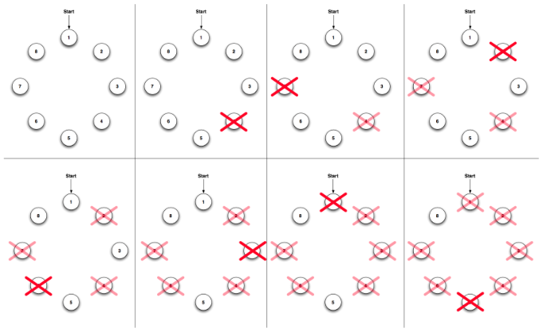{width=80%; : .center }

Le programme que vous devez développer devra prendre comme entrées les nombres n et m, respectivement le nombre de soldats et la distance (dans l'exemple nous avons n=8 et m=3), et produire comme sortie l'ordre dans lequel les soldats seront tués, le dernier "tué" étant finalement le survivant :

4 7 2 6 3 1 5 8 The surviving soldier is 8

c'est-à-dire que le soldat à la position 4 est le premier à être tué, et 8 est la place sûre recherchée par Josephus.

La fonction josephus qui fait appel à la TAD file est donnée ci-dessous

!!! info
Le TAD signifie Type Abstrait de Données (Abstract Data Type en anglais). C'est un concept théorique en informatique qui définit une structure de données uniquement par les opérations qu'elle propose, indépendamment de son implémentation concrète.
!!!

Pour le problème de Josephus, nous ajoutons les éléments suivants :

1. Initialisation :

Les personnes sont placées dans la file dans l'ordre initial.

2 Rotation circulaire :

On utilise les opérations defile et enfile pour faire circuler les personnes dans le cercle.

3 Élimination :

Après avoir déplacé les m−1 premières personnes en fin de file, on utilise defile pour éliminer la m-ième personne.

4 Répétition :

On continue le processus jusqu'à ce qu'il reste un seul élément dans la file.


Implémenter la file avec une liste chainée pour que la fonction josephus([1, 2, 3, 4, 5, 6, 7, 8], 3) 


Pour simplifier on peut d’abord sortir : 4 7 2 6 3 1 5 8 the last one is 8

```python
class Node:
    def __init__(self, value = None, next = None):
        self.v = ...
        self.n = ...

class File:
    def __init__(self, c=None):
        self.head = ...

    def estVide(self):
        pass
    
    def enfile(self, element):
        ### version enfiler par la queue et défiler par la tete
        if self.estVide():
            self.head = Node(element)
        else:
            ...
    
    def defile(self):
        ### version enfiler par la queue et défiler par la tete
        if not self.estVide():
            ...
        else:
            raise IndexError("File vide")

    
    def __str__(self):  # on peut mettre __repr__ à la place pour éviter de taper print
        if self.head is None:
            raise IndexError("File vide")
        else:
            result = str(self.head.v)
            next_node = self.head.n
            while next_node is not None:
                result += " - " + str(next_node.v)
                next_node = next_node.n
            return result
    
            
    def __len__(self):
        pass
```
Implémenter la fonction josephus(liste, m)

```python
def josephus(liste, m):
    f = File()

    # Initialisation : enfiler toutes les personnes
    ...
    
    # on part du numéro 1 qu'en va renfiler 

    # Élimination des personnes
    while len(f) > 1:
        # Faire circuler les m-1 premières personnes
        ...    
            # On défiler et renfile 
            ...
        # Éliminer la m-ième personne
        elimine = ...
        print(f"Personne éliminée : {elimine}")

    # Retourner le dernier survivant
    survivant = ...
    print(f"Le survivant est : {survivant}")
    return survivant

# Exemple : 8 personnes et élimination toutes les 3 positions
liste_personnes = [1, 2, 3, 4, 5, 6, 7, 8]
m = 3

# Appel de la fonction josephus
dernier_survivant = josephus(liste_personnes, m)
print(dernier_survivant)

```

**<H3 STYLE="COLOR:red;">Exercice n°12 : Le jeu de cartes : bataille**</H3>

Compléter le programme ci-dessous du jeu de la bataille. Sur **Thonny** : On l’appelera bataille.py

Vous aurez à  gérer d'une part la valeur des cartes et d'autre part les cas d'égalités.

**Indice** : il faut créer une file égalité.

Le programme partiel du jeu de bataille :

**Créer et importer une File**

```python
class Node:
    def __init__(self, value = None, next = None):
        self.v = ...
        self.n = ...

class File:
    def __init__(self, c=None):
        self.head = ...

    def estVide(self):
        pass
    
    def enfiler(self, element):
        ### version enfiler par la queue et défiler par la tete
        if self.estVide():
            self.head = Node(element)
        else:
            ...
    
    def defiler(self):
        ### version enfiler par la queue et défiler par la tete
        if not self.estVide():
            ...
        else:
            raise IndexError("File vide")

    
    def __str__(self):  # on peut mettre __repr__ à la place pour éviter de taper print
        if self.head is None:
            raise IndexError("File vide")
        else:
            result = str(self.head.v)
            next_node = self.head.n
            while next_node is not None:
                result += " - " + str(next_node.v)
                next_node = next_node.n
            return result
    
            
    def __len__(self):
        pass
```

```python
import random

paquet_alice = File()
paquet_basile = File()
...  # Initialisation de la file pour les égalités

# crée le jeu de 52 cartes
cartes = [i for i in range(0, 52)]
# melange les cartes
random.shuffle(cartes)
# distribue les cartes aux 2 joueurs
for i in range(len(cartes) // 2):
    paquet_alice.enfiler(cartes.pop())
    paquet_basile.enfiler(cartes.pop())


# Gestion d'un tour de jeu
def tour():
    global en_cours
    if paquet_alice.estVide():
        print("Alice perd")
        en_cours = False
    elif paquet_basile.estVide():
        print("Basile perd")
        en_cours = False
    else:
        tirer()


# Si la partie n'est pas terminée, tirage d'une carte
def tirer():
    a = paquet_alice.defiler()
    b = paquet_basile.defiler()

    valeura = a % 13
    valeurb = b % 13
    print("Alice", valeura, valeurb, "Basile")
    # le programme ne gere pas l'égalité
    if valeura > valeurb:
        paquet_alice.enfiler(a)
        paquet_alice.enfiler(b)
    elif valeura < valeurb:
        paquet_basile.enfiler(b)
        paquet_basile.enfiler(a)
    else: 
        ...


# démarrage du jeu
en_cours = True
nb_tours = 0
while en_cours:  # not paquet_alice.est_vide() and not paquet_basile.est_vide()  :
    tour()
    nb_tours += 1
print("Partie en ", nb_tours, " tours")
```


Une fois terminé les modifications, vous transformerez le programme bataille en classe Bataille avec toutes les fonctions encapsulées dans celle-ci.

```python
import random


class Bataille:
    def __init__(self, paquet_alice, paquet_basile):
        self.paquet_alice = paquet_alice
        self.paquet_basile = paquet_basile
        self.egalite = File()
        self.en_cours = True
    
    def tour(self):
        pass
    
    def tirer(self):
        pass
        
# Initialisation des paquets
paquet_alice = File()
paquet_basile = File()

# Création et mélange du jeu de 52 cartes
cartes = [i for i in range(0, 52)]
random.shuffle(cartes)

# Distribution des cartes aux 2 joueurs
for i in range(len(cartes) // 2):
    paquet_alice.enfiler(cartes.pop())
    paquet_basile.enfiler(cartes.pop())

# Démarrage du jeu
en_cours = True
nb_tours = 0
jeu = Bataille(paquet_alice, paquet_basile)

while jeu.en_cours:
    jeu.tour()
    nb_tours += 1

print(f"Partie terminée en {nb_tours} tours.")
```

## <H2 STYLE="COLOR:BLUE;"> <a name="_toc151667946"></a>**8. Projets**</H2>

**<H3 STYLE="COLOR:red;">Exercice n°01 : Pile et contrôle du parenthésage d’une expression**</H3>

**=> CAPYTALE Le code vous sera donné par votre enseignant**

Il s’agit d’écrire une fonction qui contrôle si une expression mathématique, donnée sous forme d’une chaine de caractères, est bien parenthésée, c’est-à-dire s’il y a autant de parenthèses ouvrantes que de fermantes, et qu’elles sont bien placées. Par exemple :

- (()) est bien parenthésée
- ())( ne l’est pas

L’algorithme :

On crée une pile

On parcourt l’expression de gauche à droite

A chaque fois que l’on rencontre une parenthèse ouvrante "( " on l’empile.

Si on rencontre une parenthèse fermante " ) " et que la pile n’est pas vide on dépile (sinon on retourne faux). 

A la fin la pile doit être vide…

Ecrire une fonction verification(expression) qui prend en paramètre une chaine de caractère qui retourne OK si l’expression est bien parenthésée et NON sinon.

assert verification("(())") == "OK"
assert verification("())(") == "NON"

**<H3 STYLE="COLOR:red;">Exercice n°02 : implémentation d’une liste chainée**</H3>

**=> CAPYTALE Le code vous sera donné par votre enseignant**

A partir de ce qui a été vu sur les listes chaînées, implémenter :

1. La méthode lenListe(self) qui retourne la longueur de la liste
1. La méthode insert\_next(self, i, x) qui ajoute une cellule contenant la valeur x après la cellule d’indice i. Déterminer sa complexité
1. La méthode get\_node\_index(self, i) qui permet de retourner la cellule d’indice i. Déterminer son ordre de complexité
1. La méthode delete\_head(self) qui supprime la première cellule de la liste et la renvoie. Déterminer sa complexité
1. la méthode delete\_next(self, x) qui supprime la cellule située après la cellule de valeur x et le renvoie

```python


lst = Liste()
assert lst.isEmpty() == True
assert lst.lenListe() == 0

lst.insert_next(0, 10)  # liste : [10]
assert lst.lenListe() == 1

lst.insert_next(1, 20)  # liste : [10, 20]
assert lst.lenListe() == 2

lst.insert_next(2, 30)  # liste : [10, 20, 30]
assert lst.lenListe() == 3
 
assert lst.get_node_index(0).v == 10
assert lst.get_node_index(1).v == 20
assert lst.get_node_index(2).v == 30

lst.insert_next(1, 25)  # liste : [10, 20, 25, 30]
assert lst.lenListe() == 4

assert lst.get_node_index(2).v == 25

val = lst.delete_head() 
# liste : [20, 25, 30]
assert val == 10
assert lst.lenListe() == 3
assert lst.get_node_index(0).v == 20


# liste actuelle : [20, 25, 30]
val_del = lst.delete_next(20)

# liste : [20, 30]
assert val_del == 25
assert lst.lenListe() == 2
assert lst.get_node_index(1).v == 30
```

**<H3 STYLE="COLOR:red;">Exercice n°03 : Pile et palindromes**</H3>

**=> CAPYTALE Le code vous sera donné par votre enseignant**

Un palindrome est un mot qui se lit de la même façon de gauche à droite et de droite à gauche. Par exemple, abababa et un palindrome, ainsi que kayak et coloc.

Les piles sont des structures très utiles pour détecter les palindromes : on peut lire le mot jusqu’à sa moitié, et empiler les lettres qu’on lit, puis arrivé à la moitié on lit les lettres tout en dépilant et en regardant si le résultat du dépilage correspond à la lettre lue. Si ce n’est pas le cas, le mot en entrée n’est pas un palindrome.

S’il y a toujours égalité, c’est un palindrome.

Il faut faire attention à distinguer les mots de longueur paire et impaire. Si le mot est pair, de longueur 2n, on lit n lettres en empilant, puis n lettres en dépilant. Si le mot est impair, de longueur 2n+1, on lit n lettres en empilant, on lit la lettre du milieu sans rien faire, puis on lit n lettres en dépilant.

1 sur **Thonny** : Créer un fichier python pile.py

2 Créer une classe Pile avec Un constructeur \_\_init\_\_() initialisant l’attribut **privé** que l’on appellera container à [] (liste vide Python)

3 Implémenter la méthode publique get\_container dont le prototype est : get\_container(self) -> list et qui renvoie le contenu de la pile.

4 Implémenter la méthode publique size() dont le prototypage est le suivant : size(self) -> int et qui renvoie la taille de la liste

5 Implémenter la méthode publique is\_empty() qui renvoie True si la pile stockée dans le container est vide et False sinon. Le prototype est : is\_empty(self) -> bool

6 Implémenter la méthode publique push(item) qui ajoute à la fin de la liste. On empile !!

7 Implémenter la méthode publique pop() qui :

- Retourne None si la pile est vide.
- Retourne et enlève l’élément au sommet de la pile, si la pile n’est pas vide.

8 Valider les tests unitaires (avec des assert) suivants à partir d’une pile p qui contient les éléments respectivement empilés 1 et 2 :

- p.is\_empty() == False
- p.get\_container() == [1,2]
- p.pop() == 2

9 Sur **Thonny** : Créer un fichier python palindrome.py

10 Implémenter à l’aide d’une pile une fonction palindrome() qui prend en entrée un mot et renvoie True si c’est un palindrome et False sinon. On donne le prototype de la fonction palindrome(word : str) -> bool.

11 Tester votre programme avec les tests suivants :

- palindrome("kayak")
- palindrome("trust")

**<H3 STYLE="COLOR:red;">Exercice n°04 : File et ordonnancement**</H3>

**=> CAPYTALE Le code vous sera donné par votre enseignant**

L’ordonnancement consiste, pour le système d’exploitation, à optimiser l’utilisation du processeur en lui affectant tour à tour différentes tâches à exécuter. On appelle processus un programme en cours d’exécution. Il peut y en avoir des centaines à la fois sur une machine, alors qu’il n’y a que quelques processeurs (souvent 4).

L’ordonnanceur va répartir le temps de calcul entre les programmes, afin que tous puissent avancer dans leur exécution de manière satisfaisante, et que les programmes qui n’ont pas besoin de temps processeur à un certain moment (par exemple parce qu’ils attendent une réponse de l’utilisateur avant de continuer) ne gaspillent pas de temps de calcul.

La plupart des ordonnanceurs modernes utilisent des files pour garder en mémoire de façon optimale les programmes à exécuter. En effet, tout comme la pile était une structure naturelle pour gérer les palindromes à l’exercice précédent, la file est parfaitement adaptée à l’ordonnancement : les programmes qui demandent du temps de calcul sont insérés en bout de file, et ceux qui seront défilés pour obtenir effectivement du temps processeur sont ceux qui attendent depuis le plus longtemps.

1 Sur **Thonny** : Créer un fichier python file.py

2 Créer une classe File avec Un constructeur \_\_init\_\_() initialisant l’attribut **privé** que l’on appellera container à [] (liste vide Python)

3 Implémenter la méthode publique get\_container dont le prototype est : get\_container(self) -> list et qui renvoie le contenu de la file.

4 Implémenter la méthode publique size() dont le prototypage est le suivant : size(self) -> int et qui ren

voie la taille de la liste

5 Implémenter la méthode publique is\_empty() qui renvoie True si la file stockée dans le container est vide et False sinon. Le prototype est : is\_empty(self) -> bool

6 Implémenter la méthode publique queue(item) qui ajoute à la fin de la liste. On enfile !!

7 Implémenter la méthode publique enqueue() qui :

- Retourne None si la file est vide.
- Retourne et enlève l’élément au début de la file, si la file n’est pas vide.

8 Valider les tests unitaires (avec des assert) suivants à partir d’une file f qui contient les éléments respectivement enfilés 1 et 2 :

- f.is\_empty() == False
- f.get\_container() == [1, 2]
- f.enqueue() == 1

9 Sur **Thonny** : Créer un fichier python scheduler.py

10 Créer une classe Activite pour modéliser des activités avec Un constructeur \_\_init\_\_() initialisant ayant trois attributs privés : name, time et priority. Le prototype est le suivant : \_\_init\_\_(self, name : str, time : int, priority : int)

11 Un accesseur (getter) get\_time() qui renvoie la valeur de l’attribut time.

12 Un accesseur (getter) get\_priority() qui renvoie la valeur de l’attribut priority.

13 Une méthode publique execute() qui décrémente l’attribut time d’une valeur passée en paramètre appelée time à la méthode et qui renvoie un booléen indiquant si time est nul (True) ou non (False).

**Aide** : time ne peut en aucun cas être < 0.

14 Une méthode spéciale \_\_repr\_\_(self) renvoyant une chaîne représentant l’activité selon le format : ```<nom activité>: <temps>s [<priorité>]```. 

**Aide** : on utilisera la méthode format() <https://python.sdv.univ-paris-diderot.fr/03_affichage/>

15 Créer une classe Ordonnanceur sur le patron suivant :
```python
import file as fl

class Ordonnanceur:
	def __init__(self, quota=0):
		self.__file  = fl.File()
        self.__quota = int(quota)

	def set_quota(self, quota : int) -> int:
		# à compléter

	def add_activity(self, activity : object):
		# à compléter

	def step(self):
		# à compléter

	def run(self):
		# à compléter
```

16 Compléter la méthode add\_activity() qui ajoute une activité passée en paramètre à la file de processus de l’ordonnanceur.

17 Compléter le mutateur (setter) set\_quota()

18 **★★** Modifier la méthode step() qui effectue un “tour” d’ordonnancement comme suit :

- si la file est vide, on ne fait rien : on attend.
- s’il y a au moins une activité dans la file, on exécute l’activité en affichant son nom et sa durée. Puis, on décrémente son temps d’une unité et si son quota arrive à 0, on enfile l’activité.

19 **★★** Modifier la méthode run() qui itère step jusqu’à obtenir une file de processus vides.

20 **★★** Créer une liste de 10 activités de durée et de priorité aléatoires (durée entre 1 et 10 et priorité entre 0 et 2).

21 **★★** A l’aide d’une boucle, mettre toutes les activités dans la file de l’ordonnanceur puis exécuter l’ordonnanceur.

**<H3 STYLE="COLOR:red;">Exercice n°05 : Implémentation du type abstrait tableau dynamique en Python**</H3>

**=> CAPYTALE Le code vous sera donné par votre enseignant**

**Interface du type abstrait Tableau\_dynamique**

L’interface de la classe est la suivante :
```python
Help on class TableauDynamique in module __main__:

class TableauDynamique(builtins.object)
 |  TableauDynamique() -> 'None'
 |  
 |  Classe implémentant le type « tableau dynamqie »,
 |  version très simplifiée du type « liste » de Python.
 |  
 |  Methods defined here:
 |  
 |  __getitem__(self: 'TableauDynamique', i: 'int') -> 'object'
 |      Retourne l'élément d'indice i.
 |  
 |  __init__(self: 'TableauDynamique') -> 'None'
 |      Création d'un tableau vide à l'initialisation.
 |  
 |  __len__(self: 'TableauDynamique') -> 'int'
 |      Retourne le nombre d'éléments dans le tableau.
 |  
 |  append(self: 'TableauDynamique', obj: 'object') -> 'None'
 |      Ajoute l'élément obj en dernière position dans le tableau.
```

**Implémentation**

1 Créer la classe **TableauDynamique**.

2 Dans la méthode **\_\_init\_\_**, initialiser trois attributs privés **\_nbre**, **\_capacite** et **\_tab** tels que **\_nbre** donne le nombre d’éléments dans le tableau (initialement égal à 0), **\_capacite** donne le nombre maximal possible d’éléments dans le tableau (initialement égal à 1) et **\_tab** référence un tableau créé à l’aide de la fonction **py\_object** du module **ctypes**.

**Remarque :** le code de création du tableau est le suivant :
```python
def _construit_tableau(self: TableauDynamique, capacite: int):
    """
    Construction d'un tableau de capacité donnée.
    """
    return (capacite * ctypes.py_object)()
```

3 Définir la méthode **\_\_len\_\_** dont la spécification est :
```python
def __len__(self: TableauDynamique) -> int:
    """
    Retourne le nombre d'éléments dans le tableau.
    """
```

4 Définir la méthode **\_\_getitem\_\_** dont la spécification est :
```python
def __getitem__(self: TableauDynamique, i: int) -> object:
    """
    Retourne l'élément d'indice i.

    Une exception est levée si l'indice n'appartient
    pas au bon intervalle.
    """
```

5 Définir la méthode privée **\_augmente\_taille** dont la spécification est :
```python
def _augmente_taille(self: TableauDynamique, capacite: int) -> None:
    """
    Crée un nouveau tableau de dimension capacite puis copie tous les
    éléments de l'ancien tableau dans ce dernier.
    Fait en sorte que le nouveau tableau soit le tableau désormais
    utilisé.
    Met à jour l'attribut capacite.
    """
```

6 Définir la méthode **append** dont la spécification est :
```python
def append(self: TableauDynamique, obj: object) -> None:
    """
    Ajoute l'élément obj en dernière position dans le tableau.
    """
```

**Remarque :** La méthode **append** doit appeler la méthode **\_augmente\_taille**.

7 Définir la méthode **\_\_repr\_\_** dont la spécification est :
```python
def __repr__(self: TableauDynamique) -> str:
    """
    Retourne la chaîne de caractères représentant le tableau.
    """
```

8 Tester le bon fonctionnement de la classe.
