---
author: ELP
title: 06a Les arbres
---

**Table des matières**

[1.	🌳 Terminologie](#_toc149141385)

[2.	Notions générales sur les arbres](#_toc149141388)

[3.	Les arbres binaires](#_toc149141389)

[4.	Le parcours en profondeur des arbres binaires](#_toc149141398)

[5.	Parcours en largeur d’un arbre binaire](#_toc149141406)

[6.	Une application de l’arbre binaire : notation polonaise inversée](#_toc149141407)

[7.	Exercices](#_toc149141408)

[8.	Projets](#_toc149141409)

**Compétences évaluables :**

- Identifier des situations nécessitant une structure de données arborescente.
- Evaluer quelques mesures des arbres binaires (taille, encadrement de la hauteur, etc.)
- Calculer la taille et la hauteur d’un arbre
- Parcourir un arbre de différentes façons (ordres infixe, préfixe, suffixe ; ordre en largeur d’abord)


## <H2 STYLE="COLOR:BLUE;"> <a name="_toc149141385"></a>**1. 🌳 Terminologie**</H2>

### <H3 STYLE="COLOR:GREEN;"> <a name="_toc149141386"></a>**1.1. 📚 Vocabulaire**</H3>

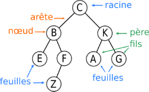{width=30%; .center}

Un **arbre** est une **structure hiérarchique** composée de **nœuds**, utilisée pour représenter des données organisées selon des relations de parenté.

📌 En langage plus mathématique : un arbre est un **graphe non orienté, connexe, sans cycle**, dans lequel un **nœud racine** sert de point de départ.

🧠 À retenir :

* Chaque **nœud** (ou sommet) a **au plus un père** (sauf la racine qui n’en a pas).
* Un nœud peut avoir **0 ou plusieurs fils**.
* Un **nœud sans fils** est une **feuille**.
* Un nœud avec au moins un fils est un **nœud interne**.
* Chaque nœud est souvent associé à une **étiquette**.

---

### <H3 STYLE="COLOR:GREEN;"> <a name="_toc149141387"></a>**1.2. 🌲 Exemples d’arbres**</H3>

👪 **Arbre généalogique** :
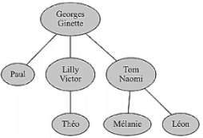{width=30%; .center}

📝 **Arbre syntaxique** (analyse grammaticale) :
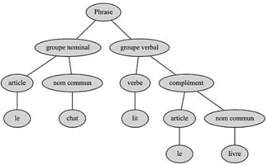{width=30%; .center}

🧮 **Arbre d'expression mathématique** :
Exemple pour l'expression `(y/2 - t) × (75 + z)` :
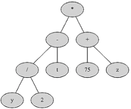{width=30%; .center}

???+ question "🎯 Activité n° 1 : Représenter l’expression 3 + 73 - 13"

    ??? success "✔️ Solution"

        ```
            -
        /   \
        +    13
        / \
        3   73
        ```

🌐 **DOM (Document Object Model)** pour représenter une page HTML :
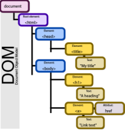{width=40%; .center}

💾 **Arborescence des fichiers** dans un système UNIX :
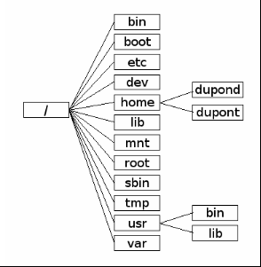{width=40%; .center}

---

## <H2 STYLE="COLOR:BLUE;"> <a name="_toc149141388"></a>**2. 📏 Notions générales sur les arbres**</H2>

🧮 Définitions importantes :

* La **taille** d’un arbre = nombre total de **nœuds**
* La **profondeur** d’un nœud = distance (en nombre d’arêtes) de ce nœud à la **racine**
* La **hauteur** d’un arbre = profondeur maximale parmi tous ses nœuds

🎯 **Convention dans ce cours** :

* Arbre vide → **hauteur = 0**
* Arbre réduit à la racine seule → **hauteur = 1**

📌 Attention : certains livres définissent l’arbre vide avec une hauteur **-1** (on s’y adaptera selon le contexte).

🔍 Exemple d’analyse :

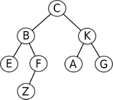{width=30%; .center}

* Taille = 8
* Profondeur de **G** = 3 (G → K → C)
* Profondeur de **Z** = 4 (Z → F → B → C)
* Hauteur de l’arbre = 4

---

## <H2 STYLE="COLOR:BLUE;"> <a name="_toc149141389"></a>**3. 🌿 Les arbres binaires**</H2>

### <H3 STYLE="COLOR:GREEN;"> <a name="_toc149141390"></a>**3.1. 🧩 Définition**</H3>

🔄 L’arbre de l’expression `a × b + c - d + e` est un **arbre binaire** :

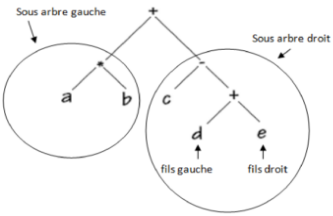{width=30%; .center}

🧠 **Définition récursive** d’un arbre binaire :

* Soit un **arbre vide**
* Soit une **racine** et exactement **deux sous-arbres** : un **gauche** et un **droit**

📌 Un **nœud** peut donc avoir **0, 1 ou 2 fils**

🪄 Pour ne pas oublier un fils, on **représente l’arbre vide** avec un petit symbole, comme ci-dessous :

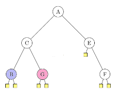
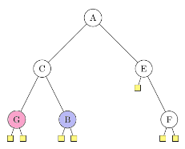

---

📘 **À bien maîtriser : le vocabulaire précis**

* Un **nœud** possède :

  * un **fils gauche**
  * un **fils droit**

* Un **arbre binaire** est constitué :

  * d’un **sous-arbre gauche**
  * d’un **sous-arbre droit**

🧩 Donc :

* Le **fils gauche** est la **racine du sous-arbre gauche**
* Le **fils droit** est la **racine du sous-arbre droit**


???+ question "🎯 Activité n°2 : Identifier des sous-arbres"

    Entourer en **rouge** le sous-arbre gauche, en **bleu** le sous-arbre droit, et en **vert** le sous-arbre droit du sous-arbre gauche dans l’arbre suivant :
    
    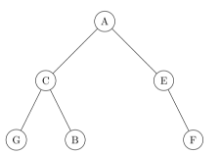{width=30%; .center}

    ??? success "✔️ Solution"

        > 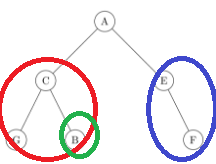{width=30%; .center}
        >
        > * 🔴 Le **sous-arbre gauche** est tout le bloc de gauche à partir du premier embranchement.
        > * 🔵 Le **sous-arbre droit** est tout le bloc de droite.
        > * 🟢 Le **sous-arbre droit du sous-arbre gauche** est celui qui descend à droite depuis le fils gauche de la racine.

---

???+ question "🔢 Activité n°3 : Arbres binaires et indexation dans un tableau"

    > Quelle propriété ont les indices des fils gauches et droits dans un **tableau représentant un arbre binaire** ?

    ??? success "🧠 Solution"

        > ✅ Si l’indexation commence à **1** :
        >
        > * Fils gauche = `2 * i`
        > * Fils droit = `2 * i + 1`
        >
        > ✅ Si l’indexation commence à **0** :
        >
        > * Fils gauche = `2 * i + 1`
        > * Fils droit = `2 * i + 2`
        >
        > 🧪 Exemple avec une indexation à partir de 1 :
        >
        > * Pour le nœud à l’indice `3` → fils gauche à `6`, fils droit à `7`

---

???+ question "🧮 Activité n°4 : Arbre à partir d’un tableau"

    Voici un tableau représentant un arbre binaire :
    
    ```python
    ['*', '-', 5, 2, 6, None, None, None, None, None, None, None, None, None, None]
    ```
    
    🔧 Le dessiner et interpréter ce qu’il représente.

    ??? success "✏️ Solution"

        > **Représentation de l’arbre :**
        >
        > ```
        >     *
        >    / \
        >   -   5
        >  / \
        > 2   6
        > ```
        >
        > **Interprétation :**
        > Cet arbre représente une **expression mathématique**.
        >
        > * La racine `*` indique une multiplication.
        > * Le sous-arbre gauche est une soustraction `2 - 6`.
        > * Le sous-arbre droit est la constante `5`.
        >   👉 L’expression est donc : **(2 − 6) × 5**

---

### <H3 STYLE="COLOR:GREEN;"><a name="_toc149141391"></a>**3.2. 🧪 Type Abstrait de Donnée (TAD) pour un arbre binaire**</H3>

📘 Voici les **fonctions de l’interface minimale** pour manipuler un **arbre binaire immutable** (modifiable uniquement par création d’un nouvel arbre) :

| Fonction                             | Description                                                                                     |
| ------------------------------------ | ----------------------------------------------------------------------------------------------- |
| `nvNd(x: Elt) -> Noeud`              | Crée un **nœud** contenant une valeur `x`                                                       |
| `contenu(noeud: Noeud) -> Elt`       | Renvoie la **valeur** contenue dans un nœud                                                     |
| `nvAv() -> Arbre`                    | Crée un **arbre vide**                                                                          |
| `nvAB(noeud, g, d) -> Arbre`         | Crée un **arbre** dont la racine est `noeud`, avec `g` et `d` comme sous-arbres gauche et droit |
| `estArbreVide(arbre: Arbre) -> bool` | Renvoie `True` si l’arbre est vide                                                              |
| `racine(arbre: Arbre) -> Noeud`      | Donne la **racine** de l’arbre                                                                  |
| `gauche(arbre: Arbre) -> Arbre`      | Renvoie le **sous-arbre gauche**                                                                |
| `droite(arbre: Arbre) -> Arbre`      | Renvoie le **sous-arbre droit**                                                                 |

---

???+ question "🌲 Activité n°5 : Créer un arbre avec le TAD"

    Créer l’arbre ci-dessous à l’aide des fonctions d’interface du TAD :

    {width=30%; .center}

    📝 Le contenu de chaque nœud est une chaîne : `"A"`, `"B"`, etc.

    ??? success "🛠️ Solution"

        ```python
        # Étape 1 : Création des nœuds
        noeud_A = nvNd("A")
        noeud_C = nvNd("C")
        noeud_E = nvNd("E")
        noeud_G = nvNd("G")
        noeud_B = nvNd("B")
        noeud_F = nvNd("F")

        # Étape 2 : Sous-arbre gauche (C avec fils G et B)
        sous_arbre_gauche_C = nvAB(noeud_C, nvAB(noeud_G, nvAv(), nvAv()), nvAB(noeud_B, nvAv(), nvAv()))

        # Étape 3 : Sous-arbre droit (E avec un seul fils droit F)
        sous_arbre_droit_E = nvAB(noeud_E, nvAv(), nvAB(noeud_F, nvAv(), nvAv()))

        # Étape 4 : Arbre final avec racine A
        arbre_complet = nvAB(noeud_A, sous_arbre_gauche_C, sous_arbre_droit_E)
        ```

---


### <H3 STYLE="COLOR:GREEN;"> <a name="_toc149141392"></a>**3.3. Caractéristiques d’un arbre binaire**</H3>

❤️ À retenir :

* La **taille** d’un arbre est le **nombre total de nœuds** (on **n’inclut pas** les arbres-vides).
* La **profondeur** d’un nœud est le **nombre de nœuds entre ce nœud et la racine**.
* La **hauteur** d’un arbre est la **profondeur maximale** parmi tous ses nœuds.

---

???+ question "🌳 Activité n°6 : Calcul de la taille d’un arbre"

    🧮 Déterminer la **taille** de l’arbre ci-dessous :
    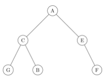{width=30%; .center}

    ??? success "✅ Solution"

        > ✅ L’arbre contient les nœuds A, C, E, G, B et F.
        > 👉 **Taille de l’arbre = 6**

---

🎓 **Convention pour la profondeur :**

Deux conventions sont admises (elles seront **indiquées au BAC**) :

* 📏 **Convention 1 :** La racine est de profondeur **1**
  {width=30%; .center}

* 🧱 **Convention 2 :** La racine est de profondeur **0**
  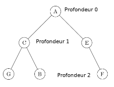{width=30%; .center}

❤️ Quelle que soit la convention :

* La **profondeur d’un fils** = profondeur du père + 1
* Deux nœuds avec la même profondeur sont à **même distance** de la racine

---

???+ question "🧠 Activité n°7 : Taille, hauteur, arêtes, profondeur"

    Fournir la taille, la hauteur, le nombre d’arêtes de cet arbre, et la profondeur du nœud **C** :
    
    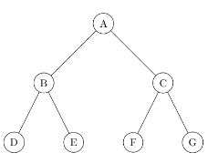{width=30%; .center}

    ??? success "📌 Solution"

        > 1. 🌳 **Taille** : 7 nœuds (A, B, C, D, E, F, G)
        > 2. 📏 **Hauteur** : la racine est au niveau 0 ; les feuilles (D, E, F, G) sont au niveau 2 → **Hauteur = 2**
        > 3. 🧩 **Nombre d’arêtes** = 7 – 1 = **6**
        > 4. 🧮 **Profondeur du nœud C** = **1**
        >
        > 🧠 Cet arbre est **complet** car tous les niveaux sont remplis jusqu'à la hauteur maximale, et toutes les feuilles sont au **même niveau**.

---

???+ question "🪢 Activité n°8 : Arbre filiforme"

    Même exercice :
    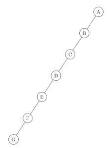{width=30%; .center}

    ??? success "📌 Solution"

        > 1. 🌳 **Taille** : 7 nœuds
        > 2. 📏 **Hauteur** : le dernier nœud G est au niveau 6 → **Hauteur = 6**
        > 3. 🧩 **Nombre d’arêtes** = 6
        > 4. 🧮 **Profondeur du nœud C** = 2
        >
        > ⚠️ Cet arbre est **filiforme** (ou **dégénéré**) car il se comporte comme une **liste chaînée** : un seul chemin.

---

???+ question "🧩 Activité n°9 : Arbre déséquilibré"


    Une dernière analyse :

    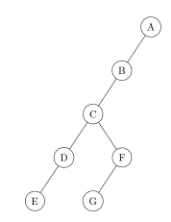{width=30%; .center}

    ??? success "📌 Solution"

        > 1. 🌳 **Taille** : 7 nœuds
        > 2. 📏 **Hauteur** : les nœuds E et G sont à la profondeur **4** → **Hauteur = 4**
        > 3. 🧩 **Nombre d’arêtes** = 6
        > 4. 🧮 **Profondeur du nœud C** = 2
        >
        > Cet arbre est **déséquilibré**, avec une profondeur irrégulière. Il n’est ni complet, ni filiforme.


---

🌳 **Hauteur et taille d’un arbre binaire complet (convention : racine à profondeur 0)**

Un **arbre binaire complet** est un arbre dans lequel **tous les niveaux sont complètement remplis**. Cela signifie que chaque **nœud interne a deux enfants**, et que **le dernier niveau est plein**.

On suppose ici que **la profondeur de la racine est 0**.

---

🧩 Exemple 1 : Arbre de hauteur 1

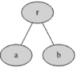{width=20%; .center}

| Niveau | Nombre de nœuds |
| ------ | --------------- |
| 0      | 1 = 2⁰          |
| 1      | 2 = 2¹          |

🧮 **Taille totale** : 1 + 2 = **3 nœuds**

---

🧩 Exemple 2 : Arbre de hauteur 2

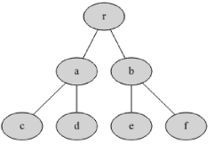{width=30%; .center}

| Niveau | Nombre de nœuds |
| ------ | --------------- |
| 0      | 1 = 2⁰          |
| 1      | 2 = 2¹          |
| 2      | 4 = 2²          |

🧮 **Taille totale** : 1 + 2 + 4 = **7 nœuds**

---

🧩 Exemple 3 : Arbre de hauteur 3

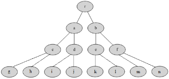{width=40%; .center}

Cet arbre est **complet** : tous les nœuds internes ont **deux enfants**.

| Niveau | Nombre de nœuds |
| ------ | --------------- |
| 0      | 1 = 2⁰          |
| 1      | 2 = 2¹          |
| 2      | 4 = 2²          |
| 3      | 8 = 2³          |

🧮 **Taille totale** : 1 + 2 + 4 + 8 = **15 nœuds**

---

📏 **Formule générale** : Taille d’un arbre binaire complet

Si un arbre a une hauteur **h** (avec racine à profondeur 0), alors :

$\text{Taille}$ = $2^{h+1} - 1$

* Pour h = 3 :  $2^{4} - 1$ = $16 - 1 = 15$
* Pour h = 4 :  $2^{5} - 1$ = $32 - 1 = 31$

---

🧠 **Pourquoi la formule fonctionne ?**

Chaque niveau $i$ (de 0 à $h$) contient $2^i$ nœuds.

Donc la taille totale est la **somme géométrique** :

$n = 2^0 + 2^1 + 2^2 + \dots + 2^h = 2^{h+1} - 1$

C’est une propriété classique des puissances de 2.

---

🧮 **Astuce Python pour vérifier** :

```python
import math
n = 15
hauteur = int(math.log2(n + 1)) - 1  # pour convention racine à profondeur 0
print("Hauteur estimée :", hauteur)  # Résultat : 3
```
??? success "Python"
    {{ IDE() }}

???+ question "Activité n° 10 : Arbres binaires et vocabulaire :"

    |Calculer la taille d'un Arbre Complet dont on vous donne la hauteur:|
    |-|
    |**Si on considère une profondeur de 1 pour la racine :**|
    |- Hauteur h = 1 : Taille n = 1|
    |- Hauteur h = 2 : Taille : n = 1 + 2 = 3|
    |- Hauteur h = 3 : La taille : n = 1 + 2 + ...|
    |- Hauteur h = 4 : La taille : n =|
    |- Hauteur h = 5 : La taille: n =|
    |Quelle fonction mathématique permettrait de trouver la hauteur h connaissant la taille n de l'arbre complet ?|
    ||
    |**Si on considère une profondeur de 0 pour la racine :**|
    |- Hauteur h = 0 : Taille n = 1|
    |- Hauteur h = 1 : Taille : n = 1 + 2 = 3|
    |- Hauteur h = 2 : La taille : n = 1 + 2 + ...|
    |- Hauteur h = 3 : La taille : n =|
    |- Hauteur h = 4 : La taille: n =|
    |Quelle fonction mathématique permettrait de trouver la hauteur h connaissant la taille n de l'arbre complet ?|


    ??? success "Solution"

        #### 1. Profondeur de 1 pour la racine
        Si on considère que la racine est à une profondeur de 1, alors la taille `n` d'un arbre binaire complet de hauteur `h` peut être calculée de la manière suivante :

        - **Hauteur h = 1 :** Taille `n = 1`
        - **Hauteur h = 2 :** Taille `n = 1 + 2 = 3`
        - **Hauteur h = 3 :** Taille `n = 1 + 2 + 4 = 7`
        - **Hauteur h = 4 :** Taille `n = 1 + 2 + 4 + 8 = 15`
        - **Hauteur h = 5 :** Taille `n = 1 + 2 + 4 + 8 + 16 = 31`

        **Formule générale :**  
        Pour une hauteur `h`, la taille d'un arbre binaire complet est donnée par la somme des puissances de 2 :
        $n = 2^0 + 2^1 + 2^2 + \dots + 2^{h-1} = 2^h - 1$

        **Pour trouver la hauteur `h` connaissant la taille `n` :**  
        On peut inverser la formule pour obtenir :
        $h = \log_2(n + 1)$

        #### 2. Profondeur de 0 pour la racine

        Si on considère que la racine est à une profondeur de 0, alors la taille `n` d'un arbre binaire complet de hauteur `h` peut être calculée de la manière suivante :

        - **Hauteur h = 0 :** Taille `n = 1`
        - **Hauteur h = 1 :** Taille `n = 1 + 2 = 3`
        - **Hauteur h = 2 :** Taille `n = 1 + 2 + 4 = 7`
        - **Hauteur h = 3 :** Taille `n = 1 + 2 + 4 + 8 = 15`
        - **Hauteur h = 4 :** Taille `n = 1 + 2 + 4 + 8 + 16 = 31`

        **Formule générale :**  
        Pour une hauteur `h`, la taille d'un arbre binaire complet est donnée par :
        $n = 2^0 + 2^1 + 2^2 + \dots + 2^h = 2^{h+1} - 1$

        **Pour trouver la hauteur `h` connaissant la taille `n` :**  
        On peut inverser la formule pour obtenir :
        $h = \log_2(n + 1) - 1$


---

**Encadrements de la hauteur d'un Arbre Binaire**
🌲 Les deux cas extrêmes étant :

* Arbre binaire **filiforme**
* Arbre binaire **complet**

On en déduit que pour un arbre binaire quelconque, situé entre ces deux cas particuliers extrêmes, on peut encadrer la **hauteur** de l'arbre binaire quelconque à l'aide de la formule suivante :

🧮 **Encadrement avec une profondeur 1 pour la racine** :

⌈<b>log<sub>2</sub>(n+1)</b>⌉ <b>≤ h ≤ n</b>

*Remarque : les signes ⌈ ⌉ indiquent simplement un arrondi à l'entier supérieur.*

🧮 **Encadrement avec une profondeur 0 pour la racine** :

⌊<b>log<sub>2</sub>(n)</b>⌋ <b>≤ h ≤ n - 1</b>

*Les signes ⌊ ⌋ signifient d'arrondir à l'inférieur.*

📌 **Exemple** : un arbre binaire complet de 15 nœuds possède une hauteur de 4 si la racine a une profondeur de 1.

Si on tape ceci dans Python :

```python
>>> import math
>>> math.log2(15+1)
4.0
>>> math.log2(16+1)
4.087462841250339
```


??? success "❇️ Python :"

    {{ IDE() }}


On voit alors qu'un arbre de 15 nœuds a une hauteur comprise dans [4; 15].

Par contre, avec 16 nœuds, on obtient une hauteur comprise dans [5; 16].

✅ C'est normal : avec 15 nœuds, l'arbre serait complet dans le meilleur des cas. Si on en rajoute un, il faut nécessairement rajouter un étage…


---

### <H3 STYLE="COLOR:GREEN;"> <a name="_toc149141393"></a>**3.4. Implémentation simple à partir de liste**</H3>

💡 De manière plus surprenante, il existe une méthode pour implémenter un **arbre binaire** (structure hiérarchique) avec une **liste** (structure linéaire). Ceci peut se faire par le biais d'une astuce sur les indices :

🧩 **Les fils du nœud d'indice `i` sont placés aux indices `2i+1` et `2i+2`.**

Cette méthode est connue sous le nom de **« méthode d'Eytzinger »**, et utilisée notamment en généalogie pour numéroter facilement les individus d’un arbre généalogique.

📌 **Exemple :**

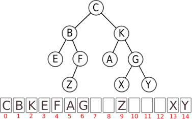{width=40%; : .center }

🧠 Pour comprendre facilement la numérotation, il suffit de s'imaginer l’arbre **complet** (en rajoutant les fils vides) et de faire une numérotation **en largeur**, niveau par niveau :

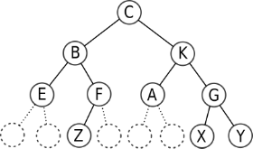{width=40%; : .center }


???+ question "Activité n° 11 : Arbres binaires et liste :"

    Si on note Δ le sous-arbre vide, dessiner l'arbre représenté par la liste :
    a = [3, 4, Δ, 7, 5]

    ??? success "Solution"

        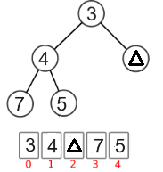{width=30%; : .center }


---

### <H3 STYLE="COLOR:GREEN;"> <a name="_toc149141394"></a>**3.5. ❤️1<sup>ère</sup> implémentation de la structure ARBRE BINAIRE sous forme de tuple❤️**</H3>


📎 **CAPYTALE** : Le code vous sera donné par votre enseignant (arbre_binaire_tuple).

???+ question "🧩 Activité n° 12 : Arbres binaires et les fonctions"


    Implémenter cette structure de base :

    ```python
    def arbreVide():
        pass

    def noeud(e, g=None, d=None):
        # retourne la valeur du noeud, son fils gauche et son fils droit s'ils existent
        pass

    def etiquette(arbre):
        # retourne la valeur de la racine
        pass

    def gauche(arbre):
        # retourne le sous arbre gauche
        pass

    def droit(arbre):
        # retourne le sous arbre droit
        pass

    def estVide(arbre):
        pass
    ```

    ??? success "❇️ Solution :"

        ```python
        def arbreVide():
            return None

        def noeud(e, g=None, d=None):
            return (e, g, d)

        def etiquette(arbre):
            return arbre[0]

        def gauche(arbre):
            return arbre[1]

        def droit(arbre):
            return arbre[2]

        def estVide(arbre):
            return arbre is None
        ```


???+ question "🌳 Activité n° 13 : Construire un arbre avec les fonctions"

    Soit l'arbre suivant :

    {width=25%; : .center }

    Construire cet arbre avec l’implémentation précédente.

    ??? success "❇️ Solution :"

        ```python
        arbre = noeud("A",
                    noeud("B", noeud("D"), noeud("E")),
                    noeud("C", None, noeud("F")))
        ```


???+ question "🧠 Activité n° 14 : Fonction hauteur"

    Implémenter l’algorithme de la fonction `hauteur` et tester-la sur l’arbre précédent.

    Voici l’algorithme (convention 1 pour la racine) :
    ```
    HAUTEUR(T) :
    si T est vide :
        renvoyer 0
    sinon :
        renvoyer 1 + max(HAUTEUR(gauche), HAUTEUR(droit))
    ```

    ??? success "❇️ Solution :"

        ```python
        def hauteur(arbre):
            if estVide(arbre):
                return 0
            else:
                return 1 + max(hauteur(gauche(arbre)), hauteur(droit(arbre)))

        # Test :
        print(hauteur(arbre))  # Doit renvoyer 3
        ```


???+ question "📏 Activité n° 15 : Fonction taille"


    Implémenter la fonction `taille` et tester-la.

    ```
    TAILLE(T) :
    si T = NIL :
        renvoyer 0
    sinon :
        renvoyer 1 + TAILLE(gauche) + TAILLE(droit)
    ```

    ??? success "❇️ Solution :"

        ```python
        def taille(arbre):
            if estVide(arbre):
                return 0
            else:
                return 1 + taille(gauche(arbre)) + taille(droit(arbre))

        # Test :
        print(taille(arbre))  # Doit renvoyer 6
        ```


---

### <H3 STYLE="COLOR:GREEN;"> <a name="_toc149141395"></a>**3.6. ❤️2<sup>ème</sup> implémentation de la structure ARBRE BINAIRE avec la POO et une classe❤️**</H3>


📎 **CAPYTALE** : Le code vous sera donné par votre enseignant (arbre_binaire_POO_v1).

???+ question "🔧 Activité n° 16 : Arbres binaires et POO – Méthode de Huffman simplifiée"


    Implémenter la structure ARBRE avec une seule classe :

    ```python
    class Noeud:
        def __init__(self, valeur = None, g = None, d = None):
            pass

        def estVide(self):
            pass
    ```

    ❓ **Question** : expliquer le rôle de chaque méthode de la classe `Noeud`.

    ??? success "❇️ Solution :"

        ```python
        class Noeud:
            def __init__(self, valeur=None, g=None, d=None):
                self.valeur = valeur
                self.g = g
                self.d = d

            def estVide(self):
                return self.valeur is None
        ```

        - `__init__` initialise un nœud avec une valeur et deux sous-arbres gauche (g) et droit (d).  
        - `estVide` permet de tester si le nœud est vide, c’est-à-dire si sa valeur est `None`.


???+ question "🌲 Activité n° 17 : Construire un arbre avec la classe Noeud"


    Soit l'arbre suivant :

    {width=30%; : .center }

    Compléter les commandes :

    ```python
    E = Noeud('E')
    D = Noeud('D')
    ???
    arbre = Noeud('A', B, C)
    ```

    On implantera aussi l’arbre T :

    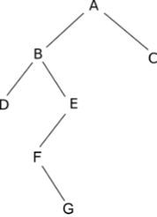{width=30%; : .center }

    ```python
    T = Noeud('A')
    T.g = Noeud('B') 
    ???
    ```

    ??? success "❇️ Solution :"

        ```python
        # Arbre 1
        E = Noeud('E')
        D = Noeud('D')
        B = Noeud('B', D, E)

        F = Noeud('F')
        C = Noeud('C', None, F)

        arbre = Noeud('A', B, C)

        # Arbre T
        T = Noeud('A')
        T.g = Noeud('B')
        T.d = Noeud('C')
        ```


---


???+ question "🌲 Activité n° 18 : Arbres binaires et POO"

    🌳 Il est possible d'afficher un arbre binaire dans la console Python, pour cela, nous allons utiliser **la fonction** `affiche` :

    ```python
    def affiche(arbre):
    if arbre != None:
        return (arbre.valeur,affiche(arbre.g),affiche(arbre.d))
    ```

    Cette fonction renvoie une série de tuples de la forme (valeur,arbre\_gauche, arbre\_droite), comme "arbre\_gauche" et "arbre\_droite" seront eux-mêmes affichés sous forme de tuples, on aura donc un affichage qui ressemblera à :

    (valeur,(valeur\_gauche,arbre\_gauche\_gauche,arbre\_gauche\_droite),(valeur\_droite,arbre\_droite\_gauche,arbre\_droite\_droite)),

    mais comme "arbre\_gauche\_gauche" sera lui-même représenté par un tuple...

    Ajouter :

    ```python
    print(affiche(arbre))
    print(affiche(T))
    ```

    **Remarque** : en implémentant la méthode affiche cela donnerait :

    ```python
    def affiche2(self):
        if self.g and self.d:
            return self.valeur, self.g.affiche2(), self.d.affiche2()
        elif self.g:
            return self.valeur,self.g.affiche2(),None
        elif self.d:
            return self.valeur,None, self.d.affiche2()
        else:
            return self.valeur, None, None
    ```

    Ajouter :

    ```python
    print(arbre.affiche2())
    print(T.affiche2())
    ```

    ??? success "❇️ Solution :"

        ```python
        # affichage fonctionnelle en tuple imbriqué
        print(affiche(arbre))
        print(affiche(T))

        # méthode dans la classe
        print(arbre.affiche2())
        print(T.affiche2())
        ```

---

???+ question "🌲 Activité n° 19 : Arbres binaires et POO : fonction `hauteur`"

    Implémenter l’algorithme de la **fonction** `hauteur` et tester l’arbre précédent.

    Voici l’algorithme correspondant à la fonction hauteur : (convention 1 pour la racine)

    ```
    HAUTEUR(T) :
    si T est vide :
        renvoyer 0
    sinon :
        renvoyer 1 + max(HAUTEUR(T du sous-arbre gauche), HAUTEUR(T du sous-arbre droit))
    fin si	
    ```

    La fonction max renvoie la plus grande valeur des 2 valeurs passées en paramètre (exemple : max(5,6) renvoie 6).

    ??? success "❇️ Solution :"

        ```python
        def hauteur(T):
            if T is None:
                return 0
            else:
                return 1 + max(hauteur(T.g), hauteur(T.d))
        ```

---

???+ question "🌲 Activité n° 20 : Arbres binaires et POO : méthode `hauteur2`"

    Implémenter l’algorithme de la **méthode** `hauteur2` et tester l’arbre précédent.

    Tester avec l’arbre T qui devrait avoir une hauteur de 5.

    ??? success "❇️ Solution :"

        ```python
        def hauteur2(self):
            if self.g is None and self.d is None:
                return 1
            elif self.g is None:
                return 1 + self.d.hauteur2()
            elif self.d is None:
                return 1 + self.g.hauteur2()
            else:
                return 1 + max(self.g.hauteur2(), self.d.hauteur2())
        ```

---

???+ question "🌲 Activité n° 21 : Arbres binaires et POO : fonction `taille`"

    Implémenter l’algorithme de la **fonction** `taille` et tester l’arbre précédent.

    Voici l’algorithme correspondant à la fonction taille :

    ```
    TAILLE(T) :
    si T est vide:
        renvoyer 0
    sinon :
        renvoyer 1 + TAILLE(T du sous-arbre gauche)+TAILLE(T du sous-arbre droit)
    fin si
    ```

    ??? success "❇️ Solution :"

        ```python
        def taille(T):
            if T is None:
                return 0
            else:
                return 1 + taille(T.g) + taille(T.d)
        ```

---

???+ question "🌲 Activité n° 22 : Arbres binaires et POO : méthode `taille2`

    Implémenter l’algorithme de la **méthode** `taille2` et tester l’arbre précédent.

    ??? success "❇️ Solution :"

        ```python
        def taille2(self):
            if self.g is None and self.d is None:
                return 1
            elif self.g is None:
                return 1 + self.d.taille2()
            elif self.d is None:
                return 1 + self.g.taille2()
            else:
                return 1 + self.g.taille2() + self.d.taille2()
        ```

---

### <H3 STYLE="COLOR:green;">❤️ 3<sup>ème</sup> implémentation de la structure ARBRE BINAIRE avec la POO avec 2 classes ❤️</H3>


📎 **CAPYTALE : Le code vous sera donné par votre enseignant (arbre_binaire_POO_v2)**

---

???+ question "🌲 Activité n° 23 : Arbres binaires et POO : Méthode de Huffman simplifiée"

    Implémenter la structure ARBRE avec deux classes :

    ```python
    class Noeud:
        def __init__(self, valeur , g = None, d = None):
            """
            Initialise un nœud de l'arbre binaire.
            valeur : contient la donnée du nœud
            g : référence au sous-arbre gauche
            d : référence au sous-arbre droit
            """
            pass

    class Arbre:
        def __init__(self, noeud=None):
            """
            Initialise un arbre binaire avec un nœud racine.
            """
            pass

        def estVide(self):
            """
            Vérifie si l'arbre est vide.
            """
            pass

        def get_valeur(self):
            """
            Retourne la valeur du nœud racine de l'arbre.
            """
            pass

        def get_gauche(self):
            """
            Retourne le sous-arbre gauche.
            """
            pass

        def get_droit(self):
            """
            Retourne le sous-arbre droit.
            """
            pass
    ```

    🧠 On peut noter que pour faire l’appel d’un attribut d’une autre classe, par exemple `valeur`, il faut remonter au constructeur de la classe Arbre. Ainsi on notera `self.noeud.valeur` dans la classe Arbre.

    ??? success "❇️ Solution :"

        ```python
        class Noeud:
            def __init__(self, valeur , g = None, d = None):
                self.valeur = valeur
                self.g = g
                self.d = d

        class Arbre:
            def __init__(self, noeud=None):
                self.noeud = noeud

            def estVide(self):
                return self.noeud is None

            def get_valeur(self):
                return self.noeud.valeur

            def get_gauche(self):
                return self.noeud.g

            def get_droit(self):
                return self.noeud.d
        ```

---


**<H3 STYLE="COLOR:red;">Activité n° 24 :**  **Arbres binaires et POO :</H3>** Soit l'arbre binaire suivant :

{width=30%; : .center }

On veut construire cet arbre à l'aide de la classe Arbre. Le problème est que les attributs g et d ne font plus partie de cette classe et on ne peut plus y accéder. Il faut donc rajouter une méthode qui sera un mutateur (setter).

{width=30%; : .center }

Implanter les deux arbres : le premier que l'on appelera arbre et le deuxième sera noté T

On note que les **constructeurs de la classe Nœud sont protégés** et que pour pouvoir y accéder on utilise un setter.

**<H3 STYLE="COLOR:red;">Activité n° 25 :**  **Arbres binaires et POO :</H3>** Il est possible d'afficher un arbre binaire dans la console Python, pour cela, nous allons utiliser deux méthodes.

Ajouter la **méthode** suivante à la classe Nœud :
```python
def __repr__(self):
    # return self.valeur + str(self.g) +str(self.d) # mais il y aura beaucoup de None
    return self.valeur+str(self.g).replace('None','.')+str(self.d).replace('None','.')
```

Ajouter la **méthode** suivante à la classe Arbre : 
```python
def __str__(self): # ou __repr__ pour éviter le print...
    return str(self.noeud)
```

Tester sur les arbres binaires précédents.

**<H3 STYLE="COLOR:red;">Activité n° 26 :**  **Arbres binaires et POO fonction hauteur :</H3>** Implémenter l’algorithme de la **fonction** hauteur 

Voici l’algorithme correspondant à la fonction hauteur : (convention 1 pour la racine)
```
HAUTEUR(T) :
  si T est vide :
    renvoyer 0
  sinon :
    renvoyer 1 + max(HAUTEUR(T du sous-arbre gauche), HAUTEUR(T du sous-arbre droit))
  fin si
```
			

La fonction max renvoie la plus grande valeur des 2 valeurs passées en paramètre (exemple : max(5,6) renvoie 6).


Tester avec les 2 arbres précédents

**<H3 STYLE="COLOR:red;">Activité n° 27 :**  **Arbres binaires et POO méthode hauteur :</H3>** Implémenter l’algorithme de la **méthode** hauteur2 

Tester avec les 2 arbres précédents

**<H3 STYLE="COLOR:red;">Activité n° 28 :**  **Arbres binaires et POO fonction taille :</H3>** Implémenter l’algorithme de la **fonction** taille 

Voici l’algorithme correspondant à la fonction taille : 
```
TAILLE(T) :
  si T est vide:
    renvoyer 0
  sinon :
    renvoyer 1 + TAILLE(T.gauche)+TAILLE(T.droit)
  fin si
```


Tester avec les 2 arbres précédents

**<H4 STYLE="COLOR:red;">Activité n° 29 :**  **Arbres binaires et POO méthode taille :</H3>** Implémenter l’algorithme de la **méthode** taille2 

Tester avec les 2 arbres précédents

### <H3 STYLE="COLOR:GREEN;"> <a name="_toc149141397"></a>**3.8. Un autre code de représentation**</H3>

Sur Thonny : Créer un fichier python  **arbre\_binaire\_dictionnaire.py**.

=> **CAPYTALE Le code vous sera donné par votre enseignant**

On change de structure de représentation d'un arbre. On va utiliser un dictionnaire.

On codera par exemple comme suit :
```python
A = { 'r' : ['a','b'], 'a' : ['c','d'], 'b' : ['e','f'],\
	 'c' : ['','h'], 'd' : ['i', 'j'], 'e' : ['k',''], 'f' : ['',''], \
  'h' : ['',''], 'i': ['',''], 'j' : ['m',''], 'k' : ['',''], 'm' : ['','']}
```

l'arbre déjà utilisé :

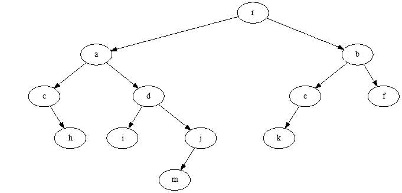{width=60%; : .center }

**<H4 STYLE="COLOR:red;">Activité n° 29bis :**  **Arbres binaires avec un dictionnaire :</H3>** Implémenter l’algorithme de la **fonction** hauteur et de la **fonction** taille

## <H2 STYLE="COLOR:BLUE;"> <a name="_toc149141398"></a>**4. Le parcours en profondeur des arbres binaires**</H2>

### <H3 STYLE="COLOR:GREEN;"> <a name="_toc149141399"></a>**4.1. Les algorithmes**</H3>

#### <H4 STYLE="COLOR:MAGENTA;"> <a name="_toc149141400"></a>**4.1.1. Le parcours préfixe**</H4>

**Ordre préfixe**

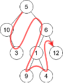

1. **Visite du nœud**

2. Parcours branche gauche

3. Parcours branche droite 


#### <H4 STYLE="COLOR:MAGENTA;"> <a name="_toc149141401"></a>**4.1.2. Le parcours infixe**</H4>

**Ordre infixe**

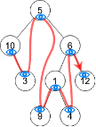

1. Parcours branche gauche 

2. **Visite du nœud**

3. Parcours branche droite 

#### <H4 STYLE="COLOR:MAGENTA;"> <a name="_toc149141402"></a>**4.1.3. Le parcours suffixe ou postfixe**</H4>

**Ordre suffixe**

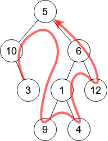

1. Parcours branche gauche

2. Parcours branche droite 

3. **Visite du nœud**


???+ question "Activité n° 30 :Arbre binaire et parcours en profondeur"

    Donner les trois parcours des sommets de l’arbre.
    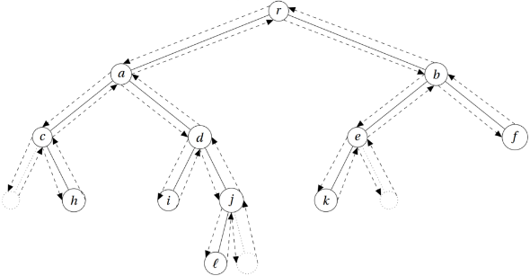{width=80%; : .center }

    ??? success "Solution"

        1. Parcours en préfixe (préordre)
        Ordre de visite : r, a, c, h, d, i, j, l, b, e, k, f
        2. Parcours en infixe (in-ordre)
        Ordre de visite : h, c, a, i, d, l, j, r, k, e, b, f
        3. Parcours en suffixe (postordre)
        Ordre de visite : h, c, i, l, j, d, a, k, e, f, b, r

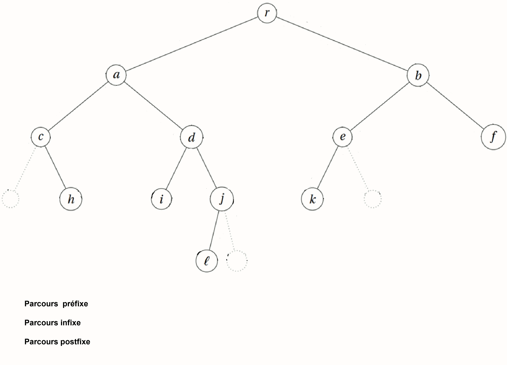

???+ question "Activité n° 31 :Arbre binaire et parcours en profondeur"

    Voici 3 algorithmes récursifs, dire pour chacun d’entre eux à quel parcours il correspond.
    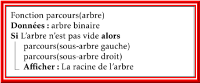{: .center }
    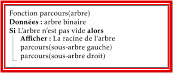{: .center }
    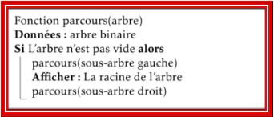{: .center }

    ??? success "Solution"

        Premier algorithme : Parcours en suffixe (postordre)

        Deuxième algorithme : Parcours en préfixe (préordre)

        Troisième algorithme : Parcours en infixe (in-ordre)

### <H3 STYLE="COLOR:GREEN;"> <a name="_toc149141403"></a>**4.2. Implémentation des parcours en profondeur avec les tuples**</H3>

**<H3 STYLE="COLOR:red;">Activité n° 32 : Arbre binaire et parcours en profondeur :**</H3>

Sur Thonny : Créer un fichier python  **arbre\_binaire\_tuple\_parcours.py**.

=> **CAPYTALE Le code vous sera donné par votre enseignant**

Ajouter le programme principal suivant :
```python
def noeud(e, g=None, d=None):
    return e, g, d

def parcours_infixe(T):
    pass

if __name__ == '__main__':
    ######début de la construction de l'arbre binaire###########
    h = noeud('h')
    c = noeud('c', None, h)
    l = noeud('l')
    i = noeud('i')
    j = noeud('j', l)
    d = noeud('d', i, j)
    a = noeud('a', c, d)
    k = noeud('k')
    e = noeud('e', k)
    f = noeud('f')
    b = noeud('b', e, f)
    arbre = noeud('r', a, b)
    ######fin de la construction de l'arbre binaire###########
```
Implémenter le parcours infixe parcours_infixe2(arbre) sous forme de fonction de telle sorte que l’on obtienne :
```
>>> parcours_infixe2(arbre)
['c', 'h', 'a', 'i', 'd', 'l', 'j', 'r', 'k', 'e', 'b', 'f']
```
**Implémenter les autres parcours en profondeur**.

### <H3 STYLE="COLOR:GREEN;"> <a name="_toc149141404"></a>**4.3. Implémentation des parcours en profondeur par les méthodes**</H3>

**<H3 STYLE="COLOR:red;">Activité n° 33 : Arbre binaire et parcours en profondeur :**</H3>

Sur Thonny : Créer un fichier python **arbre\_binaire\_POO\_v1\_parcours.py**.

=> **CAPYTALE Le code vous sera donné par votre enseignant**

Ajouter le programme principal suivant :
```python
class Noeud:
    def __init__(self, valeur = None, g = None, d = None):
        self.valeur = valeur
        self.g = g
        self.d= d

    def estVide(self):
        return self.valeur is None
    
    def parcours_infixe(self):
        pass

if __name__ == '__main__':
    ######début de la construction de l'arbre binaire###########
    h = Noeud('h')
    c = Noeud('c', None, h)
    l = Noeud('l')
    i = Noeud('i')
    j = Noeud('j', l)
    d = Noeud('d', i, j)
    a = Noeud('a', c, d)
    k = Noeud('k')
    e = Noeud('e', k)
    f = Noeud('f')
    b = Noeud('b', e, f)
    arbre = Noeud('r', a, b)
    ######fin de la construction de l'arbre binaire###########
```

Implémenter le parcours infixe sous forme de méthode, puis les autres parcours.

Vérifier que l’on obtient bien les parcours de l’activité précédente.

### <H3 STYLE="COLOR:GREEN;"> <a name="_toc149141405"></a>**4.4. Implémentation des parcours en profondeur par une fonction**</H3>

**<H3 STYLE="COLOR:red;">Activité n° 34 : Arbre binaire et parcours en profondeur :**</H3>

Sur Thonny : Créer un fichier python dans le même dossier que arbre\_binaire\_POO et le nommer **arbre\_binaire\_POO\_v2\_parcours.py**.

=> **CAPYTALE Le code vous sera donné par votre enseignant**


Ajouter le programme principal suivant :
```python
class Noeud:
    def __init__(self, valeur, g=None, d=None):
        self.valeur = valeur  # Stocke la valeur du nœud
        self.g = g       # Stocke le sous-arbre gauche
        self.d = d        # Stocke le sous-arbre droit


class Arbre:
    def __init__(self, noeud=None):
        self.noeud = noeud  # Stocke le nœud racine de l'arbre

    def estVide(self):
        return self.noeud is None

    def get_valeur(self):
        if self.noeud:
            return self.noeud.valeur


    def get_gauche(self):
        if self.noeud:
            return Arbre(self.noeud.g)

    def get_droit(self):
        if self.noeud:
            return Arbre(self.noeud.d)
if __name__ == '__main__':
    ######début de la construction de l'arbre binaire###########
    h = Noeud('h')
    c = Noeud('c', None, h)
    l = Noeud('l')
    i = Noeud('i')
    j = Noeud('j', l)
    d = Noeud('d', i, j)
    a = Noeud('a', c, d)
    k = Noeud('k')
    e = Noeud('e', k)
    f = Noeud('f')
    b = Noeud('b', e, f)
    r = Noeud('r', a, b)
    arbre = Arbre(r)
    ######fin de la construction de l'arbre binaire###########
```

Implémenter les **3 fonctions** qui permettent de parcourir l'arbre précédent **en profondeur**


Vérifier que l’on obtient bien les parcours de l’activité précédente.

Implémenter les 3 **Méthodes** par exemple parcours_infixe2() qui permettent de parcourir l'arbre précédent **en profondeur**

Vérifier que l’on obtient bien les parcours

## <H2 STYLE="COLOR:BLUE;"> <a name="_toc149141406"></a>**5. Parcours en largeur d’un arbre binaire**</H2>

Le parcours d’un arbre en largeur consiste à partir de la racine, on visite ensuite son fils gauche puis son fils droit, puis le fils gauche du fils gauche etc… Comme le montre le schéma ci-dessous :

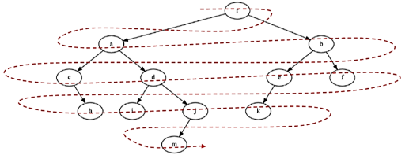{width=80%; : .center }

L’idée est la suivante : On utilise une File.

- On met l’arbre dans la file.

- Puis tant que la file n’est pas vide :

  - On défile la file.

  - On récupère la racine.

  - On enfile **son fils gauche** s’il existe.

  - On enfile **son fils droit** s’il existe.

Voici **l’algorithme parcours en largeur**.

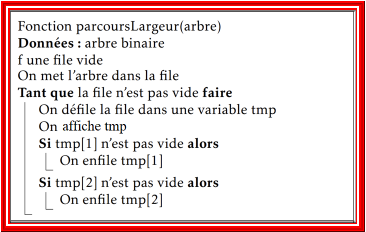{: .center }

**Remarque** : au lieu d’afficher tmp on peut l’ajouter à une liste vide et retourner la liste à la fin du script.

**<H3 STYLE="COLOR:red;">Activité n° 35 : Arbre binaire et parcours en largeur :</H3>** Utiliser l’algorithme précédent pour vérifier que l’on obtient bien rabcdefhijkm.

**<H3 STYLE="COLOR:red;">Activité n° 36 : Arbre binaire et parcours en largeur :**</H3>

Ajouter (sur Thonny : dans le fichier **arbre\_binaire\_tuple\_parcours.py**,), l’implémentation de ce parcours sous **forme de fonction.**

On implémentera la file avec 
```python
from collections import deque

def file_vide():
    pass

def enfiler(file, element):
    pass

def est_vide(file):
    pass

def defiler(file):
    pass
```

Vérifier que l’on obtient bien le résultat escompté.

**<H3 STYLE="COLOR:red;">Activité n° 37 : Arbre binaire et parcours en largeur :**</H3>

Ajouter (sur Thonny dans le fichier **arbre\_binaire\_POO\_v1\_parcours.py**,), l’implémentation de ce parcours sous **forme de fonction**.

On implémentera la file avec 
```python
from collections import deque

def file_vide():
    pass

def enfiler(file, element):
    pass

def est_vide(file):
    pass

def defiler(file):
    pass
```

Vérifier que l’on obtient bien le résultat escompté.

**<H3 STYLE="COLOR:red;">Activité n° 38 : Arbre binaire et parcours en largeur :**</H3>

Ajouter (sur Thonny dans le fichier **arbre\_binaire\_POO\_v2\_parcours.py**), l’implémentation de ce parcours sous **forme de fonction.**

On implémentera la file avec 
```python
from collections import deque

def file_vide():
    pass

def enfiler(file, element):
    pass

def est_vide(file):
    pass

def defiler(file):
    pass
```

Vérifier que l’on obtient bien le résultat escompté.

## <H2 STYLE="COLOR:BLUE;"> <a name="_toc149141407"></a>**6. Une application de l’arbre binaire : notation polonaise inversée**</H2>

L’usage d’une pile est naturel lors de l’évaluation post-fixée d’une expression algébrique. Le principe est le suivant : une expression algébrique, par exemple (1 + 2) × ( 3−4/( 5²)) peut être représentée avec un arbre dont les **nœuds sont les opérations** et **les feuilles les nombres**. 

Ici, il s’agit d’un produit entre une somme et la différence entre un nombre et le quotient d’un nombre avec le carré d’un nombre. Cela donne l’arbre :

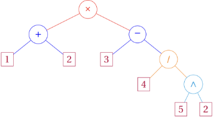{width=60%; : .center }

Le principe du parcours postfixe (ou suffixe) d’un arbre consiste à lire d’abord le sous-arbre (appelé fils) gauche, puis le fils droit, puis effectuer l’opération (qui se trouve au nœud).

Ici, cela donne : 

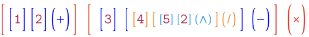{width=40%; : .center }

L’idée est donc, pour évaluer cette expression, d’utiliser

 un tableau.

[1, 2, ’+’, 3, 4, 5, 2, ’\*\*’, ’/’, ’-’, ’\*’]

correspondant à ce parcours de l’arbre.

Un avantage de cette écriture de l’expression est **l’affranchissement complet de parenthésage**.

Traditionnellement, les calculatrices HP utilis(ai ?)ent cette notation appelée RPN (pour Reverse Polish Notation) à l’origine parce que les machines n’étaient pas assez puissantes pour gérer les parenthésages mais qui s’avère très pratique à l’usage.

La calculatrice affiche (et gère) en permanence une pile (le sommet est affiché en bas de l’écran), et pour calculer l’expression précédente,

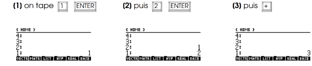{width=80%; : .center }

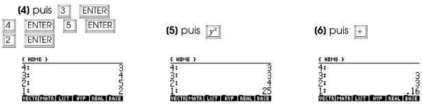{width=80%; : .center }

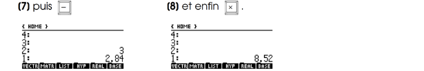{width=80%; : .center }

Comme les calculatrices HP, nous allons utiliser une pile pour faire les calculs correspondant à la notation polonaise inversée à partir d’entrées stockées initialement dans un tableau.

**<H3 STYLE="COLOR:red;">Activité n° 39 : Implémentation de la RPN en Python**</H3>

Voici une implémentation possible de la RPN en python :
```python
def opere_bin(op, a, b):
    """renvoie le résultat de l'opérateur binaire op entre a et b"""
    if op == '+': return a + b
    if op == '-': return a - b
    if op == '*': return a * b
    if op == '/': return a / b
    if op == '**': return a ** b

def evalue_rpn(expr):
    """évaluation postfixe de l'expression expr sous forme d'un tableau"""
    pile = []
    operateurs = ['+', '-', '*', '/', '**']
    for elem in expr:
        if elem not in operateurs:
            pile.append(elem)
        else:
            assert pile != [], "expression mal formée"
            b = pile.pop()
            assert pile != [], "expression mal formée"
            a = pile.pop()
            pile.append( opere_bin(elem, a, b) )
    resultat = pile.pop()
    assert pile == [], "expression mal formée"
    return resultat
```

Tester l’implémentation précédente avec [1, 2, '+', 3, 4, 5, 2, '\*\*', '/', '-', '\*'].

???+ question "Tester ce qui est proposé"

    {{ IDE() }}

## <H2 STYLE="COLOR:BLUE;"> <a name="_toc149141408"></a>**7. Exercices**</H2>


**<H3 STYLE="COLOR:red;">Exercice n°1 : <a name="_hlk52886978"></a>Ordre préfixe**</H3>

On considère l’arbre suivant :

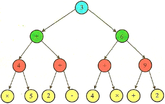{width=40%; : .center }

On parcourt cet arbre en profondeur avec un ordre préfixe.

1. Quel est le résultat de l'opération obtenue si l'on tient compte des priorités opératoires, c'est-à-dire du fait que la multiplication et la division sont prioritaires sur l'addition et la soustraction? 

1. Implémenter cet arbre avec la méthode de Huffman (avec les deux classe) créer une méthode qui permette d’afficher l’arbre et retrouver le résultat de la question précédente à l'aide d’une méthode qui parcourt l’arbre en profondeur (avec ordre préfixe). La méthode aura pour prototype : parcoursprofondeur(self, file = [] ) -> list.

   Et l’**algorithme du parcours en profondeur est** : 

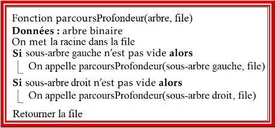{: .center }

**<H3 STYLE="COLOR:red;">Exercice n°2 : autre définition de hauteur**</H3>

On considère **l’arbre binaire complet** suivant :

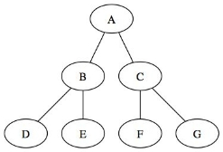{: .center }

Dans cet exercice, on utilisera la convention suivante : la hauteur d’un arbre binaire ne comportant qu’un nœud est 1.

Quel serait le tableau (liste de Python) associé à cet arbre et quelle en serait sa hauteur ?

**Attention** : pas tableau de tableaux… !!

**<H3 STYLE="COLOR:red;">Exercice n°3 : Dessiner des arbres**</H3>

Dessinez chacun des arbres ci-dessous. Donner pour chaque arbre, sa taille, sa hauteur et son nombre de feuilles. Δ représente l’arbre vide. On rappelle que la hauteur d’un arbre est définie comme la profondeur maximale des nœuds de l’arbre.

a.	(1, ∆, ∆)

b.	(2, (4, Δ, (1, (5, Δ, (3, Δ, (2, Δ, Δ))), Δ)), Δ)

c.	(3, (6, Δ, (2, Δ, Δ)), (1, (5, Δ, Δ), (4, Δ, Δ)))

d.	(4, (3, (6, ∆, ∆), (1, ∆, ∆)), (5, (7, ∆, ∆), (2, ∆, ∆)))

**<H3 STYLE="COLOR:red;">Exercice n°4 : méthode d’Eytzinger**</H3>

La méthode d’Eytzinger consiste à stocker un arbre dans une liste unique dans laquelle le fils gauche d’un nœud i est rangé dans la case 2i+1 et son fils droit dans la case 2i+2.

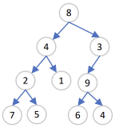{: .center }

1\.	Représenter l’arbre défini par la liste [5, 2, 6, 1, 4, Δ, 7].

2\.	Quelle liste représente cet arbre ?

**<H3 STYLE="COLOR:red;">Exercice n°5 : encadrements**</H3>

1\.	La hauteur d’un arbre binaire est égale à 4.

a.	Encadrer son nombre de feuilles.

b.	Encadrer sa taille.

2\.	Mêmes questions avec un arbre de hauteur h.

3\.	Quelle peut être la hauteur d’un arbre binaire de taille 10 ? de taille 100 ? de taille t ?

**<H3 STYLE="COLOR:red;">Exercice n°6 : parcours**</H3>

On affiche les sommets de l’arbre de l’exercice 5 en suivant un parcours en profondeur. Dans quel ordre vont-ils s’afficher :

a.	Avec un parcours infixe ?

b.	Avec un parcours préfixe ?

c.	Avec un parcours suffixe ?

**<H3 STYLE="COLOR:red;">Exercice n°7 : parcours infixe**</H3>

Construire cinq arbres différents de taille 3, dont les nœuds contiennent les valeurs a, b, c pour lesquels le parcours infixe affiche à chaque fois a – b – c dans cet ordre.

**<H3 STYLE="COLOR:red;">Exercice n°8 : compléter des arbres**</H3>

1. Recopier et compléter l’arbre ci-dessous pour que son parcours suffixe affiche dans l’ordre les lettres 

   I N G E N I E U R.

   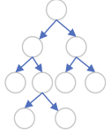

1. Construire de même un arbre dont le parcours infixe affiche G A U F F R E.
1. Construire un arbre dont le parcours préfixe affiche É P E R V I E R.

**<H3 STYLE="COLOR:red;">Exercice n°9 : le compte est bon**</H3>

On utilise des arbres pour représenter des expressions arithmétiques, par exemple pour programmer un solveur du jeu « le compte est bon ».

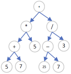{: .center }

Donner l’affichage produit par chacun des trois parcours en profondeur.

Quel parcours renvoie un affichage de l’expression sous sa forme habituelle, en rajoutant si besoin des parenthèses ?  

Les deux autres affichages correspondent à la notation polonaise et à la notation polonaise inversée. Ces notations permettent de représenter des expressions arithmétiques sans parenthèses.

## <H2 STYLE="COLOR:BLUE;"> <a name="_toc149141409"></a>**8. Projets**</H2>

**<H3 STYLE="COLOR:red;">Exercice n°1 : arbre binaire :**</H3>

=> **CAPYTALE Le code vous sera donné par votre enseignant**

Commençons par étudier les arbres binaires, en utilisant une définition récursive : un arbre binaire est

- soit un arbre vide (que l’on codera par None en Python)
- soit un nœud ayant une étiquette, et deux arbres qu’on appelle enfant gauche et enfant droit.

On choisit d’implémenter de tels arbres binaires à l’aide de la classe suivante, où on utilise des valeurs par défaut dans le constructeur pour les deux enfants :

```python
class BinaryTree:
    def __init__(self, label : str, left_child=None, right_child=None):
        self.__label = str(label)
        self.__left  = left_child		# None ou un arbre de la classe BinaryTree
        self.__right = right_child	# None ou un arbre de la classe BinaryTree
```

1\. Sur Thonny : Créer un fichier Python binaryTree.py.

2\. Utiliser cette classe pour stocker les arbres t1, t2 et t3 suivants :

|t1|t2|t3|
| :-: | :-: | :-: |
|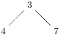|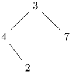|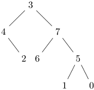|

3\. Ajouter une méthode publique is\_leaf() testant si l’arbre est une feuille dont le prototype est is\_leaf(self) -> bool.

4\. La question du parcours de l’ensemble des nœuds d’un arbre est cruciale, en particulier pour l’affichage. Rajouter la méthode \_\_repr\_\_ d’affichage de l’ensemble des informations stockées dans l’arbre qui associe par exemple à l’arbre t3 ci-dessus la chaîne : <3,<4,<>,<2>>,<7,<6>,<5,<1>,<0>>>>.
```python
def is_leaf(self):
    """ fonction testant si l'arbre est une feuille"""
    return not self.__left and not self.__right

def __repr__(self):
    if self.is_leaf():
        return "<" + str(self.__label) + ">"

    left  = "<>" if self.__left is None else self.__left.__repr__()
    right = "<>" if self.__right is None else self.__right.__repr__()
    return "<{0},{1},{2}>".format(self.__label, left, right)
```

Tester la méthode précédente avec l’arbre t3.

5\. Valider les tests unitaires suivants, pour les arbres t1 et t3 donnés respectivement ci-dessus :
```python
str(t1) == "<3,<4>,<7>>"
str(t3) == "<3,<4,<>,<2>>,<7,<6>,<5,<1>,<0>>>>"
```
6\. Ajouter une méthode publique height() renvoyant la hauteur de l’arbre.

7\. Valider les tests unitaires suivants, pour les arbres t1, t2 et t3 donnés respectivement ci-dessus.
```python
t1.height() == 1
t2.height() == 2
t3.height() == 3
```
8\. Ajouter une méthode publique prefix\_traversal() qui renvoie un parcours en profondeur préfixé de l’arbre.

9\. Valider le test unitaire suivant, pour l’arbre t3.
```python
t3.prefix_traversal()  == ['3', '4', '2', '7', '6', '5', '1', '0']
```
10\. Ajouter une méthode publique infix\_traversal() qui renvoie un parcours en profondeur infixé de l’arbre.

11\. Valider le test unitaire suivant, pour l’arbre t3.
```python
t3.infix_traversal()   == ['4', '2', '3', '6', '7', '1', '5', '0']
```
12\. Ajouter une méthode publique postfix\_traversal() qui renvoie un parcours en profondeur postfixé de l’arbre.

13\. Valider le test unitaire suivant, pour l’arbre t3.
```python
t3.postfix_traversal() == ['2', '4', '6', '1', '0', '5', '7', '3']
```
14\. Ajouter méthode publique width\_traversal() qui renvoie un parcours en largeur de l’arbre.

15\. Valider le test unitaire suivant, pour l’arbre t3.
```python
t3.width_traversal()   == ['3', '4', '7', '2', '6', '5', '1', '0']
```

**<H3 STYLE="COLOR:red;">Exercice n°2 : Notation RPN :**</H3>

=> **CAPYTALE Le code vous sera donné par votre enseignant**

Le parcours en profondeur infixe permet de modéliser des expressions arithmétiques au prix de l’absence de parenthèses (voir cours).

On peut cependant se passer de parenthèses en changeant l’ordre d’apparition des éléments de l’expression arithmétique. On parle alors de notation polonaise inversée, qui correspond en fait à un parcours postfixe (ou suffixe) de l’arbre binaire : on imprime l’étiquette du nœud après avoir imprimé l’enfant gauche puis l’enfant droit.

1\. Sur Thonny : Créer un fichier Python rpn.py.

2\. Sur Thonny : On importera le fichier binaryTree de l’exercice précédent.

Aide si le fichier est sur le bureau: 
```python
import sys
sys.path.append("C:\\Documents and Settings\\Administrateur\\Bureau")
from mon_module_qui_est_sur_le_bureau import * 
# ou import mon_module_qui_est_sur_le_bureau
```

ou on recopiera le code du fichier de l'exercice précédent.

3\. Créer une classe RPN avec :

- un constructeur \_\_init\_\_() initialisant **l’attribut privé pile** qui est initialisée avec la chaîne du parcours **postfixe de l’arbre binaire passée en paramètre** au constructeur. Le prototype de la méthode est \_\_init\_\_(self, expression : object).

- une méthode spéciale \_\_repr\_\_() qui affiche les étiquettes séparées par des espaces pour améliorer la lisibilité : par exemple, l’expression arithmétique (5+4)×(3−(2+1)) s’affichera sous la forme “5 4 + 3 2 1 + - ×”.

  **Astuce** : on pourra utiliser la méthode strip().

Voici l’arbre qui permet d’implémenter l’expression arithmétique : (5+4)×(3−(2+1)).

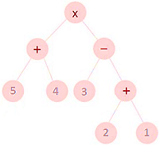{: .center }

4\. Créer l’arbre qui implémentera l’expression arithmétique (5+4)×(3−(2+1)).

5\. Vérifier que l’on obtient bien ['5', '4', '+', '3', '2', '1', '+', '-', 'x'].

Les calculatrices Hewlett-Packard proposaient à leurs utilisateurs d’entrer les expressions arithmétiques à calculer à l’aide de la notation polonaise inversée.
