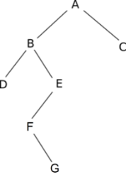

**Table des matières**

[1.	Terminologie](#_toc149141385)

[2.	Notions générales sur les arbres](#_toc149141388)

[3.	Les arbres binaires](#_toc149141389)

[4.	Le parcours en profondeur des arbres binaires](#_toc149141398)

[5.	Parcours en largeur d’un arbre binaire](#_toc149141406)

[6.	Une application de l’arbre binaire : notation polonaise inversée](#_toc149141407)

[7.	Exercices](#_toc149141408)

[8.	Projets](#_toc149141409)

**Compétences évaluables :**

- Identifier des situations nécessitant une structure de données arborescente.
- Evaluer quelques mesures des arbres binaires (taille, encadrement de la hauteur, etc.)
- Calculer la taille et la hauteur d’un arbre
- Parcourir un arbre de différentes façons (ordres infixe, préfixe, suffixe ; ordre en largeur d’abord)


## <a name="_toc149141385"></a>**1. Terminologie**
### <a name="_toc149141386"></a>**1.1. Vocabulaire**

{width=30%; : .center }

Un arbre est une **structure hiérarchique de données**, composée de **nœuds**. Si on adopte le vocabulaire des graphes que l’on verra plus tard, un arbre est un **graphe non orienté, connexe, sans cycle**, et dans lequel un nœud joue le rôle de **racine**.


Un **arbre** est un **type abstrait de données** ayant les propriétés suivantes (on parle ici des arborescences) :

- Chaque **nœud** a exactement un seul **nœud père**, à l'exception du nœud **racine** qui est le seul nœud à ne pas avoir de père. (oui, **la** racine d'une arbre est **en haut**)
- Chaque nœud peut avoir un nombre quelconque de **fils**, dont il est le père.
- Les nœuds qui n'ont pas de fils sont appelés les **feuilles** (ou nœuds externes).
- Les nœuds qui ne sont pas des feuilles sont des **nœuds internes**.
- Le nom de chaque nœud est appelé son **étiquette**
### <a name="_toc149141387"></a>**1.2. Exemples d’arbres**


L’ **arbre généalogique**

{width=30%; : .center }


Voici un **arbre syntaxique** : un arbre syntaxique représente l’analyse d’une phrase à partir de règle (la grammaire)

{width=30%; : .center }


On peut également représenter les **expressions arithmétiques** par des arbres étiquetés par des opérateurs, des constantes et des variables. La structure de l’arbre rend compte de la priorité des opérateurs et rend inutile tout parenthésage.

Pour l’expression : y2-t75+z

{width=30%; : .center }

**Activité n° 1 :** Représenter l’expression : 3+73-13


**DOM (Document Object Model) d’une page web** 

{width=40%; : .center }


**L'arborescence d'un disque dur :** Les systèmes Unix (MacOS ou GNU/Linux) organisent leur disque dur suivant l'arborescence :

{width=40%; : .center }


## <a name="_toc149141388"></a>**2. Notions générales sur les arbres**
- la **taille** d'un arbre est son nombre total de nœuds. 
- la **profondeur** d'un nœud est le nombre de nœuds de son chemin le plus court vers la racine
- la **hauteur** d'un arbre est la profondeur de son nœud le plus profond. 
  Nous prendrons comme **convention** que :

  - si un arbre est réduit à **un seul nœud-racine**, sa hauteur sera **1**.

  - si un arbre est **vide**, sa hauteur est **0**.

{width=30%; : .center }


La taille ici est 8. La profondeur de G est 3 (G-K-C), la profondeur de B est 2 (B-C), la profondeur de Z est 4 (Z-F-B-C), la profondeur de C est 1. La hauteur de l'arbre est 4.

***Attention, dans certains ouvrages, l'arbre vide a pour hauteur -1, et donc l'arbre réduit à un seul nœud a pour hauteur 0, donc notre arbre aurait avec cette convention une hauteur 3.***

## <a name="_toc149141389"></a>**3. Les arbres binaires**
Parmi la forêt d’arbres possibles, on s’intéressera essentiellement aux **arbres dit binaires**.
### <a name="_toc149141390"></a>**3.1. Définition** 

L’arbre qui représente l’expression a×b+c-d+ⅇ est un arbre binaire

 {width=30%; : .center }

Les **arbres binaires** forment une structure de données qui peut se définir de façon récursive. Un arbre binaire est :

- soit d'un **arbre vide**
- Soit composé d’une racine portant une étiquette (clé) et d’**exactement** une paire d’arbres binaires appelés **sous-arbre gauche** et **sous-arbre droit.**

**Conséquence** : un arbre binaire est constitué de nœuds qui peuvent avoir chacun 0, 1 ou 2 fils.


On symbolise parfois l'arbre vide par un symbole particulier sur les arbres binaires : cela évite d'oublier un fils. Même si l'un des fils est un arbre-vide, il apparaît sur l'arbre.

{width=30%; : .center }{width=30%; : .center }

L'arbre binaire n'est pas identique car on identifie les fils gauche et droite.

VOCABULAIRE A MAITRISER : on notera

- qu'un **nœud d'arbre binaire** possède un **fils gauche** et un **fils droit** mais
- qu'un **arbre binaire** possède **un sous-arbre gauche** et un **sous-arbre droit** :

  - Le fils gauche est donc la racine du sous-arbre gauche

  - Le fils droit est donc la racine du sous-arbre droit


**Activité n° 2 :**  Entourer en rouge le sous-arbre gauche de l'arbre précédent. Entourer en bleu le sous-arbre droit. Entourer en vert le sous-arbre droit du sous-arbre gauche.


**Activité n° 3 :**  **Arbres binaires :**  Quelle propriété ont les indices des fils gauches et droits ?


**Activité n° 4 :**  **Arbres binaires :**  Voici un tableau représentant un arbre binaire :

[’\*’,’-’,5,2,6,None,None,None,None,None,None,None,None,None,None] 

Le dessiner. Que peut-il représenter ?


### <a name="_toc149141391"></a>**3.2. TAD d’un ARBRE BINAIRE : son interface**
**Description de l'interface minimale du type abstrait Arbre :** Ici, il est décrit sous forme d'un type immutable, mais on pourrait faire la même chose en non-mutable.

1. nvNd(x:Elt) -> Noeud : on crée un nouveau nœud et son élément attaché. Ce n'est pas une fonction d'interface de l'arbre mais on a besoin au moins de pouvoir créer un Noeud (les nœuds sont en même un type abstrait en réalité...)
1. contenu(noeud:Noeud) -> Elt : renvoie l'élément (la valeur) contenue dans le nœud.
1. nvAv() -> Arbre : on le note ainsi pour dire nvArbreBinaireVide : on crée un nouvel ARBRE BINAIRE vide.
1. nvAB(noeud:Noeud, g:Arbre, d:Arbre) -> Arbre : on crée un nouvel ARBRE BINAIRE dont la racine est noeud et dont les sous-arbres sont g et d fournis.
1. estArbreVide(arbre:Arbre) -> bool : True si l'arbre est un arbre vide.
1. racine(arbre:Arbre) -> Noeud : renvoie le nœud jouant le rôle de la racine pour cet arbre.
1. gauche(arbre:Arbre) -> Arbre : renvoie le sous-arbre gauche de arbre. On obtient bien un Arbre. Si vous voulez le noeud gauche, il faudra appliquer en plus la fonction racine.
1. droite(arbre:Arbre) -> Arbre : renvoie le sous-arbre droit de arbre.

**Activité n° 5 :**  **Arbres binaires et TAD :**  Créer l'arbre à l'aide de ces fonctions d'interface.


On considère que le contenu est juste un string portant le nom du nœud. Ainsi le nœud A porte l'information "A".

### <a name="_toc149141392"></a>**3.2. Caractéristiques**
**Taille d’un arbre** : la taille d’un arbre est égale au nombre de nœuds de l’arbre.
On ne compte pas les arbres-vides : l'arbre-vide ne possède pas de nœud.

**Activité n° 6 :**  **Taille des arbres :**  Déterminer la taille de l’arbre 


**Profondeur d’un noeud** : Il s'agit du nombre de nœuds entre le nœud considéré et la racine.

Il existe ici deux écoles :

- **Convention 1** : Soit on considère que la profondeur de la racine est de 1 : la racine est le premier étage de l'arbre.


- **Convention 2** : Soit on considère que la profondeur de la racine est de 0 : la racine est le rez-de-chaussée, le niveau 0.


On vous **indiquera le cas à respecter le jour du BAC**. On vous dites clairement sur la copie la convention qui vous utilisez.

**Propriété** : quel que soit la convention choisie, la profondeur d'un nœud-fils est supérieure de 1 à celle de son père.

**Propriété** : si deux nœuds ont la même profondeur, c'est qu'ils sont à la même distance de la racine.


**Profondeur d’un arbre ou hauteur d’un arbre** : Il s'agit de la profondeur maximale qu'on trouve dans l'arbre, la "distance" entre la racine et la plus profonde des racines.

- **Convention 1** : Si la racine a une profondeur de 1, c'est pratique car un arbre-vide aurait une hauteur de 0. C'est "propre".

Sur cet exemple, la hauteur de l'arbre est donc de 3


- **Convention 2** : Si la profondeur de la racine est de 0, il suffit de considérer qu'un arbre-vide n'a pas de hauteur puisqu'il n'a pas de nœud et que la profondeur se mesure sur les nouds. C'est "propre" aussi.

Sur cet exemple, la hauteur de l'arbre est donc de 2.


**Activité n° 7 :**  **Arbres binaires et vocabulaire :**  Fournir la taille, la hauteur et le nombre d'arêtes de cet arbre. Fournir également la profondeur du nœud C.


On dit que cet arbre est **complet** car la plus grande profondeur est intégralement composée de feuilles.

**Activité n° 8 :**  **Arbres binaires et vocabulaire :**  Fournir la taille, la hauteur et le nombre d'arêtes de cet arbre. Fournir également la profondeur du nœud C.


On parle **d'arbre filiforme** ou **d'arbre dégénéré**.

**Activité n° 9 :**  **Arbres binaires et vocabulaire :**  Fournir la taille, la hauteur et le nombre d'arêtes de cet arbre. Fournir également la profondeur du nœud C.


L’arbre binaire a une hauteur de 1 (convention 0 pour la racine)


Au niveau 0 :  il possède 1=20 nœud.

Au niveau 1 :  il possède 2=21 nœuds.

Soit 3=20+21 en tout.


L’arbre binaire ci-contre a une hauteur 2


Au niveau 0 :  il possède 1=20 nœud.

Au niveau 1 :  il possède 2=21 nœuds.

Au niveau 2 :  il possède 4=22 nœuds.

Soit 7=20+21+22 en tout.


L’arbre binaire ci-contre a une hauteur 3.


Cet arbre est complet (tous les nœuds internes ont deux fils).

Au niveau 0 :  il possède 1=20 nœud.

Au niveau 1 :  il possède 2=21 nœuds.

Au niveau 2 :  il possède 4=22 nœuds.

Au niveau 3 :  il possède 8=23 nœuds.

Soit 15=20+21+22+23 en tout.


L’arbre précédent une hauteur h = 3. Donc la taille du tableau sera de : 23+1-1=24-1=15

**Activité n° 10 :**  **Arbres binaires et vocabulaire :**  Calculer la taille d'un Arbre Complet dont on vous donne la hauteur:

**Si on considère une profondeur de 1 pour la racine :**

- Hauteur h = 1 : Taille n = 1

- Hauteur h = 2 : Taille : n = 1 + 2 = 3

- Hauteur h = 3 : La taille : n = 1 + 2 + ...

- Hauteur h = 4 : La taille : n =

- Hauteur h = 5 : La taille: n =

Quelle fonction mathématique permettrait de trouver la hauteur h connaissant la taille n de l'arbre complet ?

**Si on considère une profondeur de 0 pour la racine :**

- Hauteur h = 0 : Taille n = 1

- Hauteur h = 1 : Taille : n = 1 + 2 = 3

- Hauteur h = 2 : La taille : n = 1 + 2 + ...

- Hauteur h = 3 : La taille : n =

- Hauteur h = 4 : La taille: n =

Quelle fonction mathématique permettrait de trouver la hauteur h connaissant la taille n de l'arbre complet ?

**Encadrements de la hauteur d'un Arbre Binaire**
Les deux cas extrêmes étant :

- Arbre binaire filiforme

- Arbre binaire complet

On en déduit que pour un arbre binaire quelconque, situé entre ces deux cas particuliers extrêmes, on peut encadrer la hauteur de l'arbre binaire quelconque à l'aide de la formule suivante :

**Encadrement avec une profondeur 1 pour la racine** :

⌈<b>log<sub>2</sub>(n+1)</b>⌉ <b>≤ h ≤ n</b>

On notera que les signes ⌈ ⌉ indiquent simplement un arrondi à l'entier supérieur.

**Encadrement avec une profondeur 0 pour la racine**

⌊<b>log<sub>2</sub>(n)</b>⌋ <b>≤ h ≤ n - 1</b>

Cette fois, les signes ⌊ ⌋ veulent dire d'arrondir à l'inférieur.


**Exemple** : un arbre binaire complet de 15 noeuds possède une hauteur de 4 si la racine a une profondeur de 1.

Si on tape ceci dans Python,
```
>>> import math
>>> math.log2(15+1)
4.0
>>> math.log2(16+1)
4.087462841250339
```
On voit alors qu'un arbre de 15 nœuds à une hauteur comprise dans [4; 15].

Par contre, avec 16 nœuds, on obtient une hauteur comprise dans [5; 16].

C'est normal : avec 15 nœuds, l'arbre serait complet dans le meilleur des cas. Si on en rajoute un, il faut nécessairement rajouter un étage...

**Encadrements de la  taille d'un Arbre Binaire**

**Encadrement avec une profondeur 1 pour la racine** :

<b>h ≤ n ≤ 2<sup>h</sup> - 1</b>

**Encadrement avec une profondeur 0 pour la racine**

<b>h + 1 ≤ n ≤ 2<sup>h+1</sup> - 1</b>


### <a name="_toc149141393"></a>**3.4. Implémentation simple à partir de liste**
De manière plus surprenante, il existe une méthode pour implémenter un arbre binaire (qui est une structure hiérarchique) avec une liste (qui est une structure linéaire). Ceci peut se faire par le biais d'une astuce sur les indices :

**Les fils du nœud d'indice i sont placés aux indice 2i+1 et 2i+2**.

Cette méthode est connue sous le nom de «méthode d'Eytzinger», et utilisée notamment en généalogie pour numéroter facilement les individus d'un arbre généalogique.

**Exemple :**


Pour comprendre facilement la numérotation, il suffit de s'imaginer l'arbre complet (en rajoutant les fils vides) et de faire une numérotation en largeur, niveau par niveau :


**Activité n° 11 :**  **Arbres binaires et liste :**  Si on note Δ le sous-arbre vide, dessiner l'arbre représenté par la liste :

a = [3, 4, Δ, 7, 5]


**Remarque :** parfois (comme dans le sujet 0...) la racine de l'arbre est placée à l'indice 1. Dans ce cas, les fils du nœud d'indice i sont placés aux indice 2i et 2i+1.


### <a name="_toc149141394"></a>**3.5. ❤️1<sup>ère</sup> implémentation de la structure ARBRE BINAIRE sous forme de tuple❤️**

**Sur Thonny : Toutes les fonctions de cette implémentation doivent être dans le même fichier python arbre\_binaire\_tuple.py**

**Activité n° 12 :**  **Arbres binaires et les fonctions :** implémenter cette structure 

```python
def arbreVide():
    pass

def noeud(e, g=None, d=None):
    # retourne la valeur du noeud, son fils gauche et son fils droit s'ils existent
    pass

def etiquette(arbre):
    #retourne la valeur de la racine
    pass

def gauche(arbre):
    # retourne le sous arbre gauche
    pass

def droit(arbre):
    #retourne le sous arbre droit
    pass

def estVide(arbre):
    pass
```

**Activité n° 13 :**  **Arbres binaires et les fonctions:** Soit l'arbre binaire suivant :


On veut construire cet arbre à l'aide de l’implémentation précédente

Ecrire les commandes permettant de faire cette construction

Voici l’algorithme correspondant à la fonction hauteur : (convention 1 pour la racine)

```
HAUTEUR(T) :
  si T est vide :
    renvoyer 0
  sinon :
    renvoyer 1 + max(HAUTEUR(sous-arbre gauche), HAUTEUR(sous-arbre droit))
  fin si
```

La fonction max renvoie la plus grande valeur des 2 valeurs passées en paramètre (exemple : max(5,6) renvoie 6)


**Activité n° 14 :**  **Arbres binaires et les fonctions : fonction** hauteur**:** Implémenter l’algorithme de la fonction hauteur et tester le sur l’arbre précédent


Voici l’algorithme correspondant à la fonction taille : 
```
TAILLE(T) :
  si T = NIL :
    renvoyer 0
  sinon :
    renvoyer 1 + TAILLE(sous-arbre gauche)+ TAILLE(sous-arbre droit)
  fin si
```


**Activité n° 15 :**  **Arbres binaires et les fonctions : fonction** taille**:** Implémenter l’algorithme de la fonction taille et tester le sur l’arbre précédent


### <a name="_toc149141395"></a>**3.6. ❤️2<sup>ème</sup> implémentation de la structure ARBRE BINAIRE avec la POO et une classe❤️**

**Sur Thonny : Toutes les fonctions de cette implémentation doivent être dans le même fichier python arbre\_binaire\_POO\_v1.py**

**Activité n° 16 :**  **Arbres binaires et POO : Méthode de Huffman simplifiée**  **:** Implémenter la structure ARBRE avec une seule classe :
```python
class Noeud:
    def __init__(self, valeur = None, g = None, d = None):
        pass

    def estVide(self):
        pass
```

**Question** : expliquer le rôle de chaque méthode de la classe Noeud

**Activité n° 17 :**  **Arbres binaires et POO :** Soit l'arbre binaire suivant : 


On veut construire cet arbre à l'aide de la classe Nœud précédente

Le début des commandes permettant de faire cette construction :
```python
E = Noeud('E')
D = Noeud('D')
 ???
arbre = Noeud('A', B, C)
```

On implantera aussi l’arbre T 

```python
T = Noeud('A')
T.g = Noeud('B') 
???
```

**Activité n° 18 :**  **Arbres binaires et POO :** Il est possible d'afficher un arbre binaire dans la console Python, pour cela, nous allons utiliser **la fonction** affiche
```python
def affiche(arbre):
   if arbre != None:
      return (arbre.valeur,affiche(arbre.g),affiche(arbre.d))
```
Cette fonction renvoie une série de tuples de la forme (valeur,arbre\_gauche, arbre\_droite), comme "arbre\_gauche" et "arbre\_droite" seront eux-mêmes affichés sous forme de tuples, on aura donc un affichage qui ressemblera à : (valeur,(valeur\_gauche,arbre\_gauche\_gauche,arbre\_gauche\_droite),(valeur\_droite,arbre\_droite\_gauche,arbre\_droite\_droite)), mais comme "arbre\_gauche\_gauche" sera lui-même représenté par un tuple...

Ajouter :
```python
print(affiche(arbre))
print(affiche(T))
```
**Remarque** : en implémentant la méthode affiche cela donnerait :
```python
def affiche2(self):
    if self.g and self.d:
        return self.valeur, self.g.affiche2(), self.d.affiche2()
    elif self.g:
        return self.valeur,self.g.affiche2(),None
    elif self.d:
        return self.valeur,None, self.d.affiche2()
    else:
        return self.valeur, None, None
```
Ajouter :
```python
print(arbre.affiche2())
print(T.affiche2())
```

Voici l’algorithme correspondant à la fonction hauteur : (convention 1 pour la racine)
```
HAUTEUR(T) :
  si T est vide :
    renvoyer 0
  sinon :
    renvoyer 1 + max(HAUTEUR(T du sous-arbre gauche), HAUTEUR(T du sous-arbre droit))
  fin si	
```
	

La fonction max renvoie la plus grande valeur des 2 valeurs passées en paramètre (exemple : max(5,6) renvoie 6)

**Activité n° 19 :**  **Arbres binaires et POO fonction** hauteur**:** Implémenter l’algorithme de la **fonction** hauteur et tester l’arbre précédent

**Activité n° 20 :**  **Arbres binaires et POO méthode** hauteur**:** Implémenter l’algorithme de la **méthode** hauteur2 et tester l’arbre précédent.

Tester avec l’arbre T qui devrait avoir une hauteur de 5 

Voici l’algorithme correspondant à la fonction taille : 
```
TAILLE(T) :
  si T est vide:
    renvoyer 0
  sinon :
    renvoyer 1 + TAILLE(T du sous-arbre gauche)+TAILLE(T du sous-arbre droit)
  fin si
```

**Activité n° 21 :**  **Arbres binaires et POO fonction** taille**:** Implémenter l’algorithme de la **fonction** taille et tester l’arbre précédent

**Activité n° 22 :**  **Arbres binaires et POO méthode** taille**:** Implémenter l’algorithme de la **méthode** taille2 et tester l’arbre précédent


### <a name="_toc149141396"></a>**3.7. ❤️ 3<sup>ème</sup> implémentation de la structure ARBRE BINAIRE avec la POO avec 2 classes❤️**

**Sur Thonny : Toutes les fonctions de cette implémentation doivent être dans le même fichier python arbre\_binaire\_POO\_v2.py**

**Activité n° 23 :**  **Arbres binaires et POO : Méthode de Huffman simplifiée**  **:** Implémenter la structure ARBRE avec deux classes :
```python
class Noeud:
    def __init__(self, valeur , g = None, d = None):
        pass

class Arbre:
    def __init__(self, noeud=None):
        pass

    def estVide(self):
        pass

    def get_valeur(self):
        pass

    def get_gauche(self):
        pass

    def get_droit(self):
        pass
```


On peut noter que pour faire l’appel d’un attribut d’une autre classe, par exemple valeur, il faut remonter au constructeur de la classe Arbre. Ainsi on notera self.noeud.valeur dans la classe Arbre

**Activité n° 24 :**  **Arbres binaires et POO :** Soit l'arbre binaire suivant :


On veut construire cet arbre à l'aide de la classe Arbre
Le problème est que les attributs g et d ne font plus partie de cette classe et on ne peut plus y accéder. Il faut donc rajouter une méthode qui sera un mutateur (setter)


Ajouter la méthode de la classe Arbre suivante :
```python
def greffeGD(value, left = None, right = None):
    pass

E = Arbre.greffeGD('E')
D = Arbre.greffeGD('D')
C = Arbre.greffeGD('C')
B = Arbre.greffeGD('B', D, E)
arbre = Arbre.greffeGD('A', B, C)
```
On pourra aussi tester avec l’arbre T

On note que les **constructeurs de la classe Nœud sont protégés** et que pour pouvoir y accéder on utilise un setter.

**Activité n° 25 :**  **Arbres binaires et POO :** Il est possible d'afficher un arbre binaire dans la console Python, pour cela, nous allons utiliser deux méthodes. 

Ajouter la **méthode** suivante à la classe Nœud :
```python
def __repr__(self):
    return self.valeur+str(self.g).replace('None','.')+str(self.d).replace('None','.')
```

Ajouter la **méthode** suivante à la classe Arbre : 
```python
def __str__(self): # ou __repr__ pour éviter le print...
    return self.noeud.__str__()
```

Tester sur les arbres binaires précédents


Voici l’algorithme correspondant à la fonction hauteur : (convention 1 pour la racine)
```
HAUTEUR(T) :
  si T est vide :
    renvoyer 0
  sinon :
    renvoyer 1 + max(HAUTEUR(T du sous-arbre gauche), HAUTEUR(T du sous-arbre droit))
  fin si
```
			

La fonction max renvoie la plus grande valeur des 2 valeurs passées en paramètre (exemple : max(5,6) renvoie 6)


**Activité n° 26 :**  **Arbres binaires et POO fonction** hauteur**:** Implémenter l’algorithme de la **fonction** hauteur et tester l’arbre précédent

**Activité n° 27 :**  **Arbres binaires et POO méthode** hauteur**:** Implémenter l’algorithme de la **méthode** hauteur2 et tester l’arbre précédent

Voici l’algorithme correspondant à la fonction taille : 
```
TAILLE(T) :
  si T est vide:
    renvoyer 0
  sinon :
    renvoyer 1 + TAILLE(T.gauche)+TAILLE(T.droit)
  fin si
```

**Activité n° 28 :**  **Arbres binaires et POO fonction** taille**:** Implémenter l’algorithme de la **fonction** taille et tester l’arbre précédent

**Activité n° 29 :**  **Arbres binaires et POO méthode** taille**:** Implémenter l’algorithme de la **méthode** taille2 et tester l’arbre précédent


### <a name="_toc149141397"></a>**3.8. Un autre code de représentation**
On change de structure de représentation d'un arbre. On va utiliser un dictionnaire.

On codera par exemple comme suit :
```python
A = { 'r' : ['a','b'], 'a' : ['c','d'], 'b' : ['e','f'],\
	 'c' : ['','h'], 'd' : ['i', 'j'], 'e' : ['k',''], 'f' : ['',''], \
  'h' : ['',''], 'i': ['',''], 'j' : ['m',''], 'k' : ['',''], 'm' : ['','']}
```

l'arbre déjà utilisé :


## <a name="_toc149141398"></a>**4. Le parcours en profondeur des arbres binaires**
### <a name="_toc149141399"></a>**4.1. Les algorithmes**
#### <a name="_toc149141400"></a>**4.1.1. Le parcours préfixe**

**Ordre préfixe**


1. **Visite du nœud**

2. Parcours branche gauche

3. Parcours branche droite 


#### <a name="_toc149141401"></a>**4.1.2. Le parcours infixe**

**Ordre infixe**


1. Parcours branche gauche 

2. **Visite du nœud**

3. Parcours branche droite 

#### <a name="_toc149141402"></a>**Le parcours suffixe ou postfixe**

**Ordre suffixe**


1. Parcours branche gauche

2. Parcours branche droite 

3. **Visite du nœud**


#####################=>
|<p>**Activité n° AUTONUM  \* Arabic : Arbre binaire et parcours en profondeur :** Donner les trois parcours des sommets de l’arbre</p><p>` `</p>|
| :- |


|<p>**Activité n° AUTONUM  \* Arabic : Arbre binaire et parcours en profondeur :** Voici 3 algorithmes récursifs, dire pour chacun d’entre eux à quel parcours il correspond.</p><p></p><p></p><p></p>|
| - |
1. ## <a name="_toc149141403"></a>**Implémentation des parcours en profondeur avec les tuples**

|<p>**Activité n° AUTONUM  \* Arabic : Arbre binaire et parcours en profondeur :** Créer un fichier python  **arbre\_binaire\_tuple\_parcours.py**</p><p>Ajouter le programme principal suivant :</p><p>def noeud(e, g=None, d=None):<br>`    `return e, g, d<br><br>def parcours\_infixe(T):<br>`    `pass</p><p></p><p>if \_\_name\_\_ == '\_\_main\_\_':<br>`    `######début de la construction de l'arbre binaire###########<br>`    `h = noeud('h')<br>`    `c = noeud('c', None, h)<br>`    `l = noeud('l')<br>`    `i = noeud('i')<br>`    `j = noeud('j', l)<br>`    `d = noeud('d', i, j)<br>`    `a = noeud('a', c, d)<br>`    `k = noeud('k')<br>`    `e = noeud('e', k)<br>`    `f = noeud('f')<br>`    `b = noeud('b', e, f)<br>`    `arbre = noeud('r', a, b)<br>`    `######fin de la construction de l'arbre binaire###########</p><p>Implémenter le parcours infixe sous forme de fonction de telle sorte que l’on obtienne :</p><p>>>> parcours\_infixe(arbre)</p><p>['c', 'h', 'a', 'i', 'd', 'l', 'j', 'r', 'k', 'e', 'b', 'f']</p><p></p><p>**Implémenter les autres parcours en profondeur**</p>|
| - |
1. ## <a name="_toc149141404"></a>**Implémentation des parcours en profondeur par les méthodes**

|<p>**Activité n° AUTONUM  \* Arabic : Arbre binaire et parcours en profondeur :** Créer un fichier python **arbre\_binaire\_POO\_v1\_parcours.py**</p><p></p><p>Ajouter le programme principal suivant :</p><p>class Noeud:<br>`    `def \_\_init\_\_(self, valeur = None, g = None, d = None):<br>`        `self.valeur = valeur<br>`        `self.g = g<br>`        `self.d= d<br><br>`    `def estVide(self):<br>`        `return self.valeur is None<br>    <br>`    `def parcours\_infixe(self):<br>`        `pass</p><p></p><p>if \_\_name\_\_ == '\_\_main\_\_':<br>`    `######début de la construction de l'arbre binaire###########<br>`    `h = Noeud('h')<br>`    `c = Noeud('c', None, h)<br>`    `l = Noeud('l')<br>`    `i = Noeud('i')<br>`    `j = Noeud('j', l)<br>`    `d = Noeud('d', i, j)<br>`    `a = Noeud('a', c, d)<br>`    `k = Noeud('k')<br>`    `e = Noeud('e', k)<br>`    `f = Noeud('f')<br>`    `b = Noeud('b', e, f)<br>`    `arbre = Noeud('r', a, b)<br>`    `######fin de la construction de l'arbre binaire###########</p><p></p><p>Implémenter le parcours infixe sous forme de méthode, puis les autres parcours</p><p>Vérifier que l’on obtient bien les parcours de l’activité précédente</p>|
| - |
1. ## <a name="_toc149141405"></a>**Implémentation des parcours en profondeur par une fonction**

|<p>**Activité n° AUTONUM  \* Arabic : Arbre binaire et parcours en profondeur :** Créer un fichier python dans le même dossier que arbre\_binaire\_POO et le nommer **arbre\_binaire\_POO\_v2\_parcours.py**</p><p>Importer le module arbre\_binaire\_POO\_v2  sous forme **import arbre\_binaire\_POO\_v2 as AB**</p><p></p><p>**Implémenter les trois parcours sous forme de fonctions** </p><p></p><p>Ajouter le programme principal suivant :</p><p>if \_\_name\_\_ == '\_\_main\_\_':<br>`    `######début de la construction de l'arbre binaire###########<br>`    `h = AB.Arbre.greffeGD('h')<br>`    `c = AB.Arbre.greffeGD('c', None, h)<br>`    `l = AB.Arbre.greffeGD('l')<br>`    `i = AB.Arbre.greffeGD('i')<br>`    `j = AB.Arbre.greffeGD('j', l)<br>`    `d = AB.Arbre.greffeGD('d', i, j)<br>`    `a = AB.Arbre.greffeGD('a', c, d)<br>`    `k = AB.Arbre.greffeGD('k')<br>`    `e = AB.Arbre.greffeGD('e', k)<br>`    `f = AB.Arbre.greffeGD('f')<br>`    `b = AB.Arbre.greffeGD('b', e, f)<br>`    `arbre = AB.Arbre.greffeGD('r', a, b)<br>`    `######fin de la construction de l'arbre binaire###########</p><p></p><p>Vérifier que l’on obtient bien les parcours de l’activité précédente</p>|
| - |


1. # <a name="_toc149141406"></a>**Parcours en largeur d’un arbre binaire**
Le parcours d’un arbre en largeur consiste à partir de la racine, on visite ensuite son fils gauche puis son fils droit, puis le fils gauche du fils gauche etc… Comme le montre le schéma ci-dessous :


L’idée est la suivante : On utilise une File

- On met l’arbre dans la file
- Puis tant que la file n’est pas vide :
  - On défile la file
  - On récupère la racine
  - On enfile **son fils gauche** s’il existe
  - On enfile **son fils droit** s’il existe


Voici **l’algorithme parcours en largeur**

**Remarque** : au lieu d’afficher tmp on peut l’ajouter à une liste vide et retourner la liste à la fin du script

|**Activité n° AUTONUM  \* Arabic : Arbre binaire et parcours en largeur :** Utiliser l’algorithme précédent pour vérifier que l’on obtient bien rabcdefhijkm|
| :- |

|<p>**Activité n° AUTONUM  \* Arabic : Arbre binaire et parcours en largeur :** Ajouter dans le fichier **arbre\_binaire\_tuple\_parcours.py**, l’implémentation de ce parcours sous **forme de fonction.**</p><p>On implémentera la file par une liste</p><p></p><p>Vérifier que l’on obtient bien le résultat escompté</p>|
| - |

|<p>**Activité n° AUTONUM  \* Arabic : Arbre binaire et parcours en largeur :** Ajouter dans le fichier **arbre\_binaire\_POO\_v1\_parcours.py**, l’implémentation de ce parcours sous **forme de fonction**.</p><p>On implémentera la file par une liste</p><p></p><p>Vérifier que l’on obtient bien le résultat escompté</p>|
| - |

|<p>**Activité n° AUTONUM  \* Arabic : Arbre binaire et parcours en largeur :** Ajouter dans le fichier **arbre\_binaire\_POO\_v2\_parcours.py**, l’implémentation de ce parcours sous **forme de fonction.**</p><p>On implémentera la file par une liste</p><p></p><p>Vérifier que l’on obtient bien le résultat escompté</p>|
| - |


1. # <a name="_toc149141407"></a>**Une application de l’arbre binaire : notation polonaise inversée**
L’usage d’une pile est naturel lors de l’évaluation post-fixée d’une expression algébrique. Le principe est le suivant : une expression algébrique, par exemple (1 + 2) × ( 3−4/( 5²)) peut être représentée avec un arbre dont les **nœuds sont les opérations** et **les feuilles les nombres**. 

Ici, il s’agit d’un produit entre une somme et la différence entre un nombre et le quotient d’un nombre avec le carré d’un nombre. Cela donne l’arbre :


Le principe du parcours postfixe (ou suffixe) d’un arbre consiste à lire d’abord le sous-arbre (appelé fils) gauche, puis le fils droit, puis effectuer l’opération (qui se trouve au nœud).

Ici, cela donne : 


L’idée est donc, pour évaluer cette expression, d’utiliser un tableau 

[1, 2, ’+’, 3, 4, 5, 2, ’\*\*’, ’/’, ’-’, ’\*’]

correspondant à ce parcours de l’arbre. 

Un avantage de cette écriture de l’expression est **l’affranchissement complet de parenthésage**. 

Traditionnellement, les calculatrices HP utilis(ai ?)ent cette notation appelée RPN (pour Reverse Polish Notation) à l’origine parce que les machines n’étaient pas assez puissantes pour gérer les parenthésages mais qui s’avère très pratique à l’usage. 

La calculatrice affiche (et gère) en permanence une pile (le sommet est affiché en bas de l’écran), et pour calculer l’expression précédente,

![ref4]

![ref5]![ref6]

Comme les calculatrices HP, nous allons utiliser une pile pour faire les calculs correspondant à la notation polonaise inversée à partir d’entrées stockées initialement dans un tableau.


|<p>**Activité n° AUTONUM  \* Arabic : Implémentation de la RPN en Python**</p><p>Voici une implémentation possible de la RPN en python</p><p>def opere\_bin(op, a, b):<br>`    `"""renvoie le résultat de l'opérateur binaire op entre a et b"""<br>`    `if op == '+': return a + b<br>`    `if op == '-': return a - b<br>`    `if op == '\*': return a \* b<br>`    `if op == '/': return a / b<br>`    `if op == '\*\*': return a \*\* b<br><br>def evalue\_rpn(expr):<br>`    `"""évaluation postfixe de l'expression expr sous forme d'un tableau"""<br>`    `pile = []<br>`    `operateurs = ['+', '-', '\*', '/', '\*\*']<br>`    `for elem in expr:<br>`        `if elem not in operateurs:<br>`            `pile.append(elem)<br>`        `else:<br>`            `assert pile != [], "expression mal formée"<br>`            `b = pile.pop()<br>`            `assert pile != [], "expression mal formée"<br>`            `a = pile.pop()<br>`            `pile.append( opere\_bin(elem, a, b) )<br>`    `resultat = pile.pop()<br>`    `assert pile == [], "expression mal formée"<br>`    `return resultat</p><p></p><p>Tester l’implémentation précédente avec [1, 2, '+', 3, 4, 5, 2, '\*\*', '/', '-', '\*']</p>|
| :- |


1. # <a name="_toc149141408"></a>**Exercices**
<a name="_hlk51874478"></a>**Exercice n°1 : <a name="_hlk52886978"></a>Ordre préfixe**

On considère l’arbre suivant :

On parcourt cet arbre en profondeur avec un ordre préfixe.

1. Quel est le résultat de l'opération obtenue si l'on tient compte des priorités opératoires, c'est-à-dire du fait que la multiplication et la division sont prioritaires sur l'addition et la soustraction? 

1. Implémenter cet arbre avec la méthode de Huffman (avec les deux classe) créer une méthode qui permettre d’afficher l’arbre et retrouver le résultat de la question précédente à l'aide d’une méthode qui parcourt l’arbre en profondeur (avec ordre préfixe). La méthode aura pour prototype : parcoursprofondeur(self, file = [] ) -> list 

   Et l’**algorithme du parcours en profondeur est** : 


**Exercice n°2 : autre définition de hauteur**

On considère **l’arbre binaire complet** suivant :

Dans cet exercice, on utilisera la convention suivante : la hauteur d’un arbre binaire ne comportant qu’un nœud est 1.

Quel serait le tableau (liste de Python ) associé à cet arbre quelle en serait sa hauteur ?

**Attention** pas tableau de tableaux… !!

**Exercice n°3 : Dessiner des arbres**

Dessinez chacun des arbres ci-dessous. Donner pour chaque arbre, sa taille, sa hauteur et son nombre de feuilles. Δ représente l’arbre vide. On rappelle que la hauteur d’un arbre est définie comme la profondeur maximale des nœuds de l’arbre.

a.	(1, ∆, ∆)

b.	(2, (4, Δ, (1, (5, Δ, (3, Δ, (2, Δ, Δ))), Δ)), Δ)

c.	(3, (6, Δ, (2, Δ, Δ)), (1, (5, Δ, Δ), (4, Δ, Δ)))

d.	(4, (3, (6, ∆, ∆), (1, ∆, ∆)), (5, (7, ∆, ∆), (2, ∆, ∆)))

**Exercice n°4 : méthode d’Eytzinger**

La méthode d’Eytzinger consiste à stocker un arbre dans une liste unique dans laquelle le fils gauche d’un nœud i est rangé dans la case 2i+1 et son fils droit dans la case 2i+2.

1\.	Représenter l’arbre défini par la liste [5, 2, 6, 1, 4, Δ, 7].

2\.	Quelle liste représente cet arbre ?

**Exercice n°5 : encadrements**

1\.	La hauteur d’un arbre binaire est égale à 4.

a.	Encadrer son nombre de feuilles.

b.	Encadrer sa taille.

2\.	Mêmes questions avec un arbre de hauteur h.

3\.	Quelle peut être la hauteur d’un arbre binaire de taille 10 ? de taille 100 ? de taille t ?

**Exercice n°8 : parcours**

On affiche les sommets de l’arbre de l’exercice 5 en suivant un parcours en profondeur. Dans quel ordre vont-ils s’afficher :

a.	Avec un parcours infixe ?

b.	Avec un parcours préfixe ?

c.	Avec un parcours suffixe ?

**Exercice n°7 : parcours infixe**

Construire cinq arbres différents de taille 3, dont les nœuds contiennent les valeurs a, b, c pour lesquels le parcours infixe affiche à chaque fois a – b – c dans cet ordre.

**Exercice n°8 : compléter des arbres**

1. Recopier et compléter l’arbre ci-dessous pour que son parcours suffixe affiche dans l’ordre les lettres 

   I N G E N I E U R.

   

1. Construire de même un arbre dont le parcours infixe affiche G A U F F R E.
1. Construire un arbre dont le parcours préfixe affiche É P E R V I E R.

**Exercice n°9 : le compte est bon**

On utilise des arbres pour représenter des expressions arithmétiques, par exemple pour programmer un solveur du jeu « le compte est bon ».


Donner l’affichage produit par chacun des trois parcours en profondeur. 

Quel parcours renvoie un affichage de l’expression sous sa forme habituelle, en rajoutant si besoin des parenthèses ?  

Les deux autres affichages correspondent à la notation polonaise et à la notation polonaise inversée. Ces notations permettent de représenter des expressions arithmétiques sans parenthèses.
1. # <a name="_toc149141409"></a>**Projets**
**Exercice n°01 : arbre binaire :**

Commençons par étudier les arbres binaires, en utilisant une définition récursive : un arbre binaire est

- soit un arbre vide (que l’on codera par None en Python)
- soit un nœud ayant une étiquette, et deux arbres qu’on appelle enfant gauche et enfant droit.

On choisit d’implémenter de tels arbres binaires à l’aide de la classe suivante, où on utilise des valeurs par défaut dans le constructeur pour les deux enfants :

**class** BinaryTree:

`    `**def** \_\_init\_\_(self, label : str, left\_child=None, right\_child=None):

`        `self.\_\_label = str(label)

`        `self.\_\_left  = left\_child		# None ou un arbre de la classe BinaryTree

`        `self.\_\_right = right\_child	# None ou un arbre de la classe BinaryTree

1. Créer un fichier Python binaryTree.py.
1. Utiliser cette classe pour stocker les arbres t1, t2 et t3 suivants :

|t1|t2|t3|
| :-: | :-: | :-: |
||||

1. Ajouter une méthode publique is\_leaf() testant si l’arbre est une feuille dont le prototype est is\_leaf(self) -> bool
1. La question du parcours de l’ensemble des nœuds d’un arbre est cruciale, en particulier pour l’affichage. Rajouter la méthode \_\_repr\_\_ d’affichage de l’ensemble des informations stockées dans l’arbre qui associe par exemple à l’arbre t3 ci-dessus la chaîne : <3,<4,<>,<2>>,<7,<6>,<5,<1>,<0>>>>.

*def* is\_leaf(*self*):
`    `*""" fonction testant si l'arbre est une feuille"""
`    `return not self*.\_\_left *and not self*.\_\_right

*def \_\_repr\_\_*(*self*):
`    `*if self*.is\_leaf():
`        `*return* "<" + *str*(*self*.\_\_label) + ">"

`    `left  = "<>" *if self*.\_\_left *is None else self*.\_\_left.*\_\_repr\_\_*()
`    `right = "<>" *if self*.\_\_right *is None else self*.\_\_right.*\_\_repr\_\_*()
`    `*return* "<{0},{1},{2}>".format(*self*.\_\_label, left, right)

Tester la méthode précédente avec l’arbre t3

1. Valider les tests unitaires suivants, pour les arbres t1 et t3 donnés respectivement ci-dessus :

str(t1) == "<3,<4>,<7>>"

str(t3) == "<3,<4,<>,<2>>,<7,<6>,<5,<1>,<0>>>>"

1. Ajouter une méthode publique height() renvoyant la hauteur de l’arbre.
1. Valider les tests unitaires suivants, pour les arbres t1, t2 et t3 donnés respectivement ci-dessus.

t1.height() == 1

t2.height() == 2

t3.height() == 3

1. Ajouter une méthode publique prefix\_traversal() qui renvoie un parcours en profondeur préfixé de l’arbre.
1. Valider le test unitaire suivant, pour l’arbre t3.

t3.prefix\_traversal()  == ['3', '4', '2', '7', '6', '5', '1', '0']

1. Ajouter une méthode publique infix\_traversal() qui renvoie un parcours en profondeur infixé de l’arbre.
1. Valider le test unitaire suivant, pour l’arbre t3.

t3.infix\_traversal()   == ['4', '2', '3', '6', '7', '1', '5', '0']

1. Ajouter une méthode publique postfix\_traversal() qui renvoie un parcours en profondeur postfixé de l’arbre.
1. Valider le test unitaire suivant, pour l’arbre t3.

t3.postfix\_traversal() == ['2', '4', '6', '1', '0', '5', '7', '3']

1. Ajouter méthode publique width\_traversal() qui renvoie un parcours en largeur de l’arbre.
1. Valider le test unitaire suivant, pour l’arbre t3.

t3.width\_traversal()   == ['3', '4', '7', '2', '6', '5', '1', '0']

**

**Exercice n°02 : Notation RPN :**

Le parcours en profondeur infixe permet de modéliser des expressions arithmétiques au prix de l’absence de parenthèses (voir cours).

On peut cependant se passer de parenthèse, en changeant l’ordre d’apparition des éléments de l’expression arithmétique. On parle alors de notation polonaise inversée, qui correspond en fait à un parcours postfixe (ou suffixe) de l’arbre binaire : on imprime l’étiquette du nœud après avoir imprimé l’enfant gauche puis l’enfant droit.

1. Créer un fichier Python rpn.py.
1. On importera le fichier binaryTree de l’exercice précédent

Aide : 

` `import sys

sys.path.append("C:\\Documents and Settings\\Administrateur\\Bureau")

from mon\_module\_qui\_est\_sur\_le\_bureau import \* 

\# ou import mon\_module\_qui\_est\_sur\_le\_bureau

1. Créer une classe RPN avec :
- un constructeur \_\_init\_\_() initialisant **l’attribut privé pile** qui est initialisée avec la chaîne du parcours **postfixe de l’arbre binaire passée en paramètre** au constructeur. Le prototype de la méthode est \_\_init\_\_(self, expression : object)
- une méthode spéciale \_\_repr\_\_() qui affiche les étiquettes séparées par des espaces pour améliorer la lisibilité : par exemple, l’expression arithmétique (5+4)×(3−(2+1)) s’affichera sous la forme “5 4 + 3 2 1 + - ×”.

  **Astuce** : on pourra utiliser la méthode strip()

Voici l’arbre qui permet d’implémenter l’expression arithmétique : (5+4)×(3−(2+1))


1. Créer l’arbre qui implémentera l’expression arithmétique (5+4)×(3−(2+1))
1. Vérifier que l’on obtient bien ['5', '4', '+', '3', '2', '1', '+', '-', 'x']

Les calculatrices Hewlett-Packard proposaient à leurs utilisateurs d’entrer les expressions arithmétiques à calculer à l’aide de la notation polonaise inversée. 

Terminale NSI 	Chap 06 : Les arbres	Page 27/27

[Arbre question 10]: Aspose.Words.65baf931-881f-40e2-aa25-930614e1cc7e.014.png
[Arbre question 10]: Aspose.Words.65baf931-881f-40e2-aa25-930614e1cc7e.015.png
[Arbre question 10]: Aspose.Words.65baf931-881f-40e2-aa25-930614e1cc7e.017.png
[Racine à une profondeur de 1]: Aspose.Words.65baf931-881f-40e2-aa25-930614e1cc7e.019.png
[Racine à une profondeur de 0]: Aspose.Words.65baf931-881f-40e2-aa25-930614e1cc7e.020.png
[ref1]: Aspose.Words.65baf931-881f-40e2-aa25-930614e1cc7e.035.png
[ref2]: Aspose.Words.65baf931-881f-40e2-aa25-930614e1cc7e.038.png
[ref3]: Aspose.Words.65baf931-881f-40e2-aa25-930614e1cc7e.039.png
[ref4]: Aspose.Words.65baf931-881f-40e2-aa25-930614e1cc7e.057.png
[ref5]: Aspose.Words.65baf931-881f-40e2-aa25-930614e1cc7e.058.png
[ref6]: Aspose.Words.65baf931-881f-40e2-aa25-930614e1cc7e.059.png
