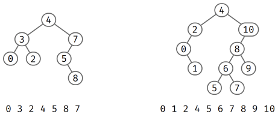
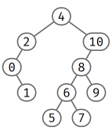
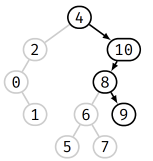
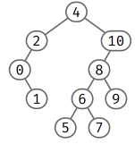
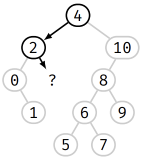
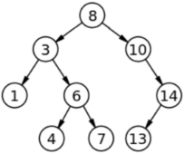
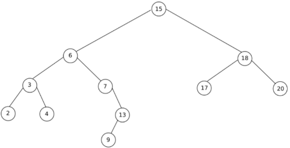
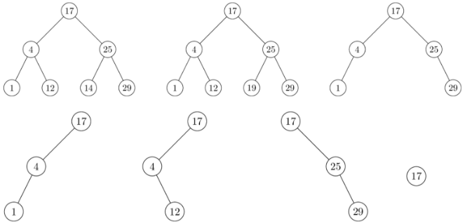
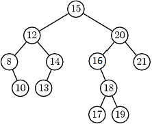
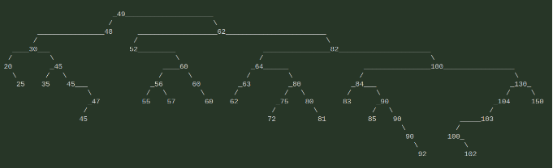

---
author: ELP
title: 06b Arbre binaire de recherche
---


---

## 🗂️ **Table des matières**

1. 🔰 [Introduction](#_toc149153662)
2. 🧾 [Définition](#_toc149153663)
3. ⚡ [Est-ce performant ?](#_toc149153664)
4. 🧩 [Exemples](#_toc149153665)
5. 🛠️ [Les algorithmes et les implémentations en Python](#_toc149153666)
6. 📝 [Exercices](#_toc149153671)
7. 🚀 [Projet](#_toc149153672)

---

## 🎯 **Compétences évaluables**

* Rechercher une clé dans un arbre de recherche
* Insérer une clé

---

## 🔰 <H2 STYLE="COLOR:BLUE;">1. Introduction</H2>

Le **parcours infixe** des arbres ci-dessous :

{: .center }

* Le **premier arbre** donne des valeurs *non ordonnées*
* Le **second arbre** donne des valeurs *ordonnées*

➡️ Disposer de **valeurs ordonnées** permet d’avoir des **algorithmes plus performants.**

C’est ce type d’arbre que l’on appelle un **arbre binaire de recherche (ABR)**.

---

## 🧾 <H2 STYLE="COLOR:BLUE;">2. Définition</H2>

Un **arbre binaire de recherche (ABR)** (*Binary Search Tree*, BST) est une structure hiérarchique composée de **nœuds**.
Chaque nœud possède au maximum **deux enfants**, ordonnés selon cette règle :

* Les **fils gauches** ont des valeurs **inférieures** à celle du nœud.
* Les **fils droits** ont des valeurs **supérieures**.
* Cette propriété est vraie pour **tous les nœuds** de l’arbre.

🌱 Le premier élément inséré devient **la racine**.
On place ensuite les **valeurs plus petites à gauche**, et les **plus grandes à droite.**

---

## ⚡ <H2 STYLE="COLOR:BLUE;">3. Est-ce performant ?</H2>

Un ABR permet des recherches **rapides**.
Prenons l’exemple suivant :
Rechercher la clé `9` 👇

 

✅ Clé trouvée !

Rechercher la clé `3` 👇

 

❌ La clé `3` **n’est pas présente** dans l’ABR.

> 🔎 Grâce à la structure ordonnée, la recherche s’apparente à une **recherche dichotomique** :
> on divise l’espace de recherche à chaque étape.

⏱️ La complexité moyenne des opérations sur un ABR est **O(log n)**.
C’est donc **bien plus performant** qu’un parcours linéaire d’une liste.


## 🧩 <H2 STYLE="COLOR:BLUE;">4. Exemples</H2>

**Exemple :**
La séquence `{8, 3, 10, 1, 6, 14, 4, 7, 13}` donne l’arbre suivant :

{: .center }

!!! info "🧠 Capytale"

???+ question "🌳 **Activité n° 1 : Séquence d’un ABR**"

    Quelle est la **séquence associée** à l’arbre binaire de recherche ci-dessous ?

    {: .center }

    ??? success "❇️ Solution :"

        L’arbre correspond à une séquence ordonnée de **gauche à droite**.  
        Il faut donc lire les valeurs selon le **parcours infixe (gauche → racine → droite)**.  
        👉 {2, 3, 4, 6, 7, 9, 13, 15, 17, 18, 20}


???+ question "🧠 **Activité n° 2 : Reconnaître un ABR**"

    Identifier lequel des arbres suivants respecte les **règles d’un arbre binaire de recherche**.

    {: .center }

    ??? success "❇️ Solution :"

        👉 Seul l’arbre où **toutes les valeurs à gauche sont inférieures**  
        et **toutes celles à droite sont supérieures** respecte la définition d’un ABR.  
        Seul le **1er arbre** n'est pas un ABR.


???+ question "🐾 **Activité n° 3 : Construire un ABR — Cas vétérinaire**"

    Un vétérinaire souhaite stocker les fiches médicales de ses animaux sous forme d’un ABR.  
    La clé de tri utilisée est **le nom de l’animal**, dans l’ordre **alphabétique croissant**.

    Il reçoit les animaux dans cet ordre :  
    **Gaufrette**, **Charlie**, **Médor**, **Flipper**, **Bubulle**, **Augustin**.

    Construire l’arbre correspondant.

    ??? success "❇️ Solution :"

        - Racine : Gaufrette  
        - Charlie < Gaufrette → gauche  
        - Médor > Gaufrette → droite  
        - Flipper < Gaufrette mais > Charlie → droite de Charlie  
        - Bubulle < Charlie → gauche de Charlie  
        - Augustin < Bubulle → gauche de Bubulle  


???+ question "🔁 **Activité n° 4 : Impact de l’ordre d’insertion**"

    Reprenons la séquence :  
    `{Gaufrette, Charlie, Médor, Flipper, Augustin, Bubulle}`  
    ➤ Augustin arrive **avant** Bubulle.

    L’arbre obtenu est-il le même ?  
    Quelle **conclusion** peut-on en tirer ?

    ??? success "❇️ Solution :"

        Non, l’arbre est **différent** car **l’ordre d’insertion** influence sa forme.  
        Un ABR **ne dépend pas uniquement des valeurs**, mais aussi de **l’ordre d’ajout**.

        📌 À retenir :
        - La **valeur la plus à gauche** → le **minimum**  
        - La **valeur la plus à droite** → le **maximum**


## 🛠️ <H2 STYLE="COLOR:BLUE;">5. Les algorithmes et les implémentations en Python</H2>


### 🧱 <H3 STYLE="COLOR:GREEN;">5.1. Créer un ABR</H3>

Un ABR est composé de **nœuds**.
Chaque nœud contient :

* une **valeur**,
* un **parent** (facultatif),
* deux **enfants** (gauche et droite).


???+ question "💻 **Activité n° 5 : Création d’un ABR en Python**"

    Implémenter la classe suivante dans un fichier `ABR.py` :

    ```python
    class Node:
        def __init__(self, value, left=None, right=None):
            pass

        def __str__(self):
            pass

        def estFeuille(self):
            pass
    ```

    Puis tester avec le code suivant :

    ```python
    if __name__ == "__main__":
        n3 = Node(3)
        n7 = Node(7)
        n5 = Node(5, n3, n7)

        print(n5)
        print(n3.estFeuille())
        print(n5.estFeuille())
    ```

    ??? success "❇️ Solution :"

        ```python
        class Node:
            def __init__(self, value, left=None, right=None):
                self.value = value
                self.left = left
                self.right = right

            def __str__(self):
                return f"({self.value})"

            def estFeuille(self):
                return self.left is None and self.right is None
        ```


### ❤️ <H3 STYLE="COLOR:GREEN;">5.2. Insérer dans un ABR</H3>


📘 **Principe de l’algorithme d’insertion :**

1. Si l’arbre est **vide**, on crée la **racine**.
2. Sinon, on compare la **clé** au nœud courant :

   * Si elle est **inférieure**, on insère dans le **sous-arbre gauche**.
   * Si elle est **supérieure**, dans le **sous-arbre droit**.
3. L’insertion se fait **récursivement** jusqu’à trouver la bonne position.


???+ question "🌳 **Activité n° 6 : Insertion dans un ABR (fonction)**"

    Créer la **fonction** `inserer(T, data)` qui applique l’algorithme ci-dessus.

    On testera avec :
    ```python
    T = None 

    for value in [8, 3, 10, 1, 6, 14, 4, 7, 13]:
        T = inserer(T, value)

    print(T)
    ```

    ??? success "❇️ Solution :"

        ```python
        class Node:
            def __init__(self, value, left=None, right=None):
                self.value = value
                self.left = left
                self.right = right

        def inserer(T, data):
            if T is None:
                return Node(data)
            if data < T.value:
                T.left = inserer(T.left, data)
            elif data > T.value:
                T.right = inserer(T.right, data)
            return T
        ```


???+ question "🌿 **Activité n° 7 : Insertion dans un ABR (méthode)**"

    Créer la **méthode** `insert(self, data)` dans la classe `Node`.

    On testera avec :
    ```python
    T = Node(8)  

    for value in [3, 10, 1, 6, 14, 4, 7, 13]:
        T.insert(value)

    print(T)
    ```

    ??? success "❇️ Solution :"

        ```python
        class Node:
            def __init__(self, value, left=None, right=None):
                self.value = value
                self.left = left
                self.right = right

            def insert(self, data):
                if data < self.value:
                    if self.left is None:
                        self.left = Node(data)
                    else:
                        self.left.insert(data)
                elif data > self.value:
                    if self.right is None:
                        self.right = Node(data)
                    else:
                        self.right.insert(data)
        ```

        ✅ Les deux approches (`inserer()` et `insert()`) sont **équivalentes** :  
        elles construisent toutes deux un ABR à partir d’une série de valeurs.


On peut représenter visuellement un ABR avec la bibliothèque **Graphviz**, qui permet d’afficher les nœuds et les liens parent-enfant.


???+ question "🌿 **Activité n° 8 : Représentation graphique de l’arbre (fonction)**"

    Implémenter la fonction suivante pour afficher un arbre :

    ```python
    from graphviz import Digraph

    def dessiner_arbre_graphviz(arbre):
        """
        Génère un rendu visuel de l'ABR en utilisant Graphviz.
        """
        def ajouter_noeud(graphe, arbre):
            if arbre:
                graphe.node(str(arbre.value))
                if arbre.left:
                    graphe.edge(str(arbre.value), str(arbre.left.value))
                    ajouter_noeud(graphe, arbre.left)
                if arbre.right:
                    graphe.edge(str(arbre.value), str(arbre.right.value))
                    ajouter_noeud(graphe, arbre.right)

        dot = Digraph(comment="Arbre Binaire de Recherche")
        ajouter_noeud(dot, arbre)
        return dot

    dot = dessiner_arbre_graphviz(T)
    dot
    ```

    ??? success "❇️ Solution :"

        💡 La fonction crée un **graphe orienté** où :
        - chaque **nœud** correspond à une valeur de l’arbre,  
        - et chaque **lien** représente la relation parent → enfant.


???+ question "🌳 **Activité n° 9 : Tester la représentation graphique**"

    Tester le programme précédent avec les deux approches : **méthode** et **fonction**.

    **Avec la méthode :**
    ```python
    abr = Node(6)
    abr.insert(8)
    abr.insert(3)
    abr.insert(1)
    abr.insert(4)
    abr.insert(9)
    abr.insert(2)
    abr.insert(7)
    abr.insert(5)
    dot_abr = dessiner_arbre_graphviz(abr)
    dot_abr
    ```

    **Puis avec la fonction :**
    ```python
    T = Node(6)
    inserer(T, 8)
    inserer(T, 3)
    inserer(T, 1)
    inserer(T, 4)
    inserer(T, 9)
    inserer(T, 2)
    inserer(T, 7)
    inserer(T, 5)
    dot_T = dessiner_arbre_graphviz(T)
    dot_T
    ```

    ??? success "❇️ Solution :"

        Les deux approches produisent le **même arbre visuel**.  
        On peut éviter la répétition en insérant les valeurs avec une **boucle sur liste** :
        ```python
        valeurs = [8, 3, 1, 6, 4, 7, 10, 14, 13]
        for v in valeurs:
            inserer(T, v)
        ```


### 🔍 <H3 STYLE="COLOR:GREEN;">5.3. ❤️ Recherche d’une clé dans un ABR ❤️</H3>

Pour **rechercher une clé donnée**, on applique la même logique que pour l’insertion :

1. Si la clé est égale à la valeur du nœud courant → **clé trouvée**.
2. Si elle est **supérieure**, on cherche dans le **sous-arbre droit**.
3. Sinon, on cherche dans le **sous-arbre gauche**.


???+ question "🧠 **Activité n° 10 : Recherche dans un ABR (fonction)**"

    Créer une **fonction** `rechercher(T, cle)` selon l’algorithme ci-dessus.  
    (Vous pouvez mettre la représentation graphique en commentaire.)

    Tester avec la clé `7` puis `188`.

    ??? success "❇️ Solution :"

        ```python
        def rechercher(T, cle):
            if T is None:
                return False
            if cle == T.value:
                return True
            elif cle < T.value:
                return rechercher(T.left, cle)
            else:
                return rechercher(T.right, cle)
        ```

        ✅ Recherche dichotomique :  
        - 7 → trouvée  
        - 188 → non trouvée


???+ question "🌿 **Activité n° 11 : Recherche dans un ABR (méthode)**"

    Ajouter une **méthode** `search()` à la classe `Node`.

    Tester-la avec les valeurs `7` et `188`.

    ??? success "❇️ Solution :"

        ```python
        class Node:
            ...
            def search(self, cle):
                if self.value == cle:
                    return True
                elif cle < self.value and self.left:
                    return self.left.search(cle)
                elif cle > self.value and self.right:
                    return self.right.search(cle)
                else:
                    return False
        ```

        👉 Les résultats sont identiques à ceux de la fonction `rechercher()`.


### 🌿 <H3 STYLE="COLOR:GREEN;">5.4. Parcours infixe</H3>

Le **parcours infixe** consiste à :

1. parcourir le **sous-arbre gauche**,
2. **afficher la racine**,
3. puis parcourir le **sous-arbre droit**.

Il permet d’obtenir les valeurs **dans l’ordre croissant**.


???+ question "🌳 **Activité n° 12 : Parcours infixe**"


    Créer une **fonction** `parcours_infixe(T)` qui affiche les valeurs de l’arbre dans l’ordre croissant.  

    Tester-la sur les deux arbres précédents. Que remarquez-vous ?

    ??? success "❇️ Solution :"

        ```python
        def parcours_infixe(T):
            if T:
                parcours_infixe(T.left)
                print(T.value, end=" ")
                parcours_infixe(T.right)
        ```

        ✅ Le parcours infixe affiche toujours les **valeurs triées** d’un ABR.


## <H2 STYLE="COLOR:BLUE;"> <a name="_toc149153671"></a>**6. Exercices**</H2>

!!! info "🧠 => **CAPYTALE Le code vous sera donné par votre enseignant**"

!!! abstract "**Exercice n° 01 : Implémentation de quelques méthodes dans un ABR**"

    Utiliser la classe Node du cours pour implémenter les méthodes suivantes.


    1. Recopier  le fichier ABR
    2. D’après les propriétés de l’arbre, le nœud ayant la plus petite valeur se trouve forcément le plus à gauche. Implémenter une méthode qui donnera le min de l’ABR
    3. Pour rechercher le maximum, c’est la logique inverse de la recherche du minimum, on descend le plus à droite possible. Implémenter une méthode qui donnera le maximum de l’ABR
    4. Implémenter la méthode ou la fonction donnant la hauteur de l’ABR (convention 1 pour la racine)
    5. Implémenter la méthode ou la fonction donnant le parcours en largeur de l’ABR
    6. Implémenter la méthode ou la fonction donnant la taille de l’ABR

!!! abstract "**Exercice n° 02 : Trier une liste en utilisant un ABR**"

    1. Créer une liste de 10 entiers aléatoires distincts, puis générer un ABR dont les clés sont ces entiers. 
    2. Utiliser la fonction graphicarbre pour l’afficher. 
    3. Quel parcours permet d’afficher ces nombres dans l’ordre croissant ? 
    4. Écrire une fonction nom\_du\_parcours(abr, lst\_triee) prenant en argument un ABR et une liste vide, et ajoutant les clés de l’ABR à la liste dans l’ordre. 
    5. Écrire la fonction tri\_abr(lst) renvoyant une copie triée de la liste lst en utilisant un ABR.

## <H2 STYLE="COLOR:BLUE;"> <a name="_toc149153672"></a>**7. Projet**</H2>

!!! info "🧠 => **CAPYTALE Le code vous sera donné par votre enseignant**"

!!! abstract "**Exercice n° 01 : arbre binaire de recherche ABR**"


    

    **Insertion**

    L'insertion d'un nœud commence par une recherche : on cherche la clé du nœud à insérer ; lorsqu'on arrive à une feuille, on ajoute le nœud comme fils de la feuille en comparant sa clé à celle de la feuille : si elle est inférieure, le nouveau nœud sera à gauche ; sinon il sera à droite.

    On choisit d’implémenter de tels arbres binaires à l’aide de la classe suivante, où on utilise des valeurs par défaut dans le constructeur pour les deux enfants :

    ```python
    class BinarySearchTree:
        def __init__(self, key : int, left_child=None, right_child=None):
            self.__key   = int(key)
            self.__left  = left_child	# None ou un arbre de la classe BinarySearchTree
            self.__right = right_child	# None ou un arbre de la classe BinarySearchTree
    ```


    1 Implémenter une méthode \_\_repr\_\_()

    ```python
    def is_leaf(self):
        """ fonction testant si l'arbre est une feuille"""
        return not self.__left and not self.__right

    def __repr__(self):
        if self.is_leaf():
            return "<" + str(self.__key) + ">"
        left  = "<>" if self.__left is None else self.__left.__repr__()
        right = "<>" if self.__right is None else self.__right.__repr__()
        return "<{0},{1},{2}>".format(self.__key, left, right)
    ```

    2 Ajouter une méthode publique insert() qui ajoute un nœud à l’arbre.

    3 Créer un ABR correspondant au schéma ci-dessus.

    4 Valider le test unitaire suivant :

    ```python
    str(abr) == "<15,<12,<8,<>,<10>>,<14,<13>,<>>>,<20,<16,<>,<18,<17>,<19>>>,<21>>>"
    ```

    5 Implémenter une méthode publique infix\_traversal() de parcours en profondeur infixé de l’arbre.

    6 Valider le test unitaire suivant :

    ```python
    abr.infix_traversal() == [8, 10, 12, 13, 14, 15, 16, 17, 18, 19, 20, 21]
    ```

    7 Insérer un nœud de clef = 15 et revalider les tests unitaires précédents.

    **Recherche**

    La recherche dans un ABR d'un nœud ayant une clé particulière est un procédé récursif. On commence par examiner la racine. Si sa clé est la clé recherchée, l'algorithme se termine et renvoie la racine. Si elle est strictement inférieure, alors elle est dans le sous-arbre gauche, sur lequel on effectue alors récursivement la recherche. De même si la clé recherchée est strictement supérieure à la clé de la racine, la recherche continue dans le sous-arbre droit. Si on atteint une feuille dont la clé n'est pas celle recherchée, on sait alors que la clé recherchée n'appartient à aucun nœud.

    8 Ajouter une méthode publique `search()` qui recherche une clé dans l’arbre et retourne True si la clé est trouvée, False sinon.

    9 Valider les tests unitaires suivants :

    ```python
    abr.search(16) == True
    abr.search(9) == False
    ```

    On peut comparer l'exploration d'un ABR avec la recherche par dichotomie qui procède à peu près de la même manière, sauf qu'elle accède directement à chaque élément d'un tableau au lieu de suivre des liens. La différence entre les deux algorithmes est que, dans la recherche dichotomique, on suppose avoir un critère de découpage de l'espace en deux parties que l'on n'a pas dans la recherche dans un ABR.

!!! abstract "**Exercice n° 02 : arbre binaire de recherche des Pokemons**"

    **Seulement sur Thonny**

    On aura besoin d’un module d’affichage `pip install binarytree`.

    Ici, on utilisera les fonctions d’interface (primitives) suivantes :

    **Les fonctions liées aux Nœuds** :

    1. `nvND(cle:Cle, data:Data) -> Noeud` : on crée un nouveau noeud et son élément attaché. Ce n'est pas une fonction d'interface de l'arbre, mais on a besoin au moins de pouvoir créer un Noeud.
    2. `cle(noeud:Noeud) -> Cle` : renvoie la clé ou l'étiquette du noeud.
    3. `data(noeud:Noeud) -> Data` : renvoie les données associées au noeud.

    **Les fonctions liées à l'Arbre Binaire lui-même** :

    1. `nvAV() -> Arbre` : on le note ainsi pour dire nouvelArbreVide : on crée un nouvel ARBRE BINAIRE vide.
    2. `nvAB(r:Noeud, g:Arbre, d:Arbre) -> Arbre` : on crée un nouvel ARBRE BINAIRE dont la racine est r et dont les sous-arbres sont g et d fournis.
    3. `estArbreVide(arbre:Arbre) -> bool` : True si l'arbre est un arbre vide.
    4. `racine(arbre:Arbre) -> Noeud` : renvoie le noeud jouant le rôle de la racine pour cet arbre.
    5. `gauche(arbre:Arbre) -> Arbre` : renvoie le sous-arbre gauche de arbre. On obtient bien un Arbre. Si vous voulez le noeud gauche, il faudra appliquer en plus la fonction `racine`.
    6. `droite(arbre:Arbre) -> Arbre` : renvoie le sous-arbre droit de arbre.

    **Collection des Pokemon**

    

    Nous allons récupérer un fichier CSV contenant les données de 800 Pokémons. Pour rappel, il s'agit d'un simple fichier texte :

    - Un enregistrement (ici un pokemon) par ligne : le passage à la ligne est donc le caractère séparateur pour les enregistrements.
    - Sur chaque enregistrement, les différents attributs ou champs sont séparés par une virgule (ou un point-virgule ou autre)

    Si on rajoute les éléments importants en rouge (dont le passage à la ligne (invisible à l'affichage)**↲**):

    ```
    #,Name,Type 1,Type 2,Total,HP,Attack,Defense,Sp. Atk,Sp. Def,Speed,Generation,Legendary↲
    1,Bulbasaur,Grass,Poison,318,45,49,49,65,65,45,1,False↲
    2,Ivysaur,Grass,Poison,405,60,62,63,80,80,60,1,False↲
    3,Venusaur,Grass,Poison,525,80,82,83,100,100,80,1,False↲
    ```

    Le but ici est d'utiliser les enregistrements pour construire l'ABR.

    Au final, vous aurez donc une variable nommée `pokemons` qui est un simple tableau qui contiendra les enregistrements (sous forme de dictionnaires).

    Voici le début du contenu du tableau `pokemons` :

    ```python
    pokemons = [
        {
            '#': '1',
            'Name': 'Bulbasaur',
            'Type 1': 'Grass',
            'Type 2': 'Poison',
            'Total': '318',
            'HP': '45',
            'Attack': '49',
            'Defense': '49',
            'Sp. Atk': '65',
            'Sp. Def': '65',
            'Speed': '45',
            'Generation': '1',
            'Legendary': 'False'
        },
        {'#': '2', 'Name': 'Ivysaur', 'Type 1': 'Grass', 'Type 2': 'Poison', 'Total': '405', 'HP': '60', 'Attack': '62', 'Defense': '63', 'Sp. Atk': '80', 'Sp. Def': '80', 'Speed': '60', 'Generation': '1', 'Legendary': 'False'},
        {'#': '3', 'Name': 'Venusaur', 'Type 1': 'Grass', 'Type 2': 'Poison', 'Total': '525', 'HP': '80', 'Attack': '82', 'Defense': '83', 'Sp. Atk': '100', 'Sp. Def': '100', 'Speed': '80', 'Generation': '1', 'Legendary': 'False'},
        {'#': '3', 'Name': 'VenusaurMega Venusaur', 'Type 1': 'Grass', 'Type 2': 'Poison', 'Total': '625', 'HP': '80', 'Attack': '100', 'Defense': '123', 'Sp. Atk': '122', 'Sp. Def': '120', 'Speed': '80', 'Generation': '1', 'Legendary': 'False'},
        ...
    ]
    ```

    1. Comment obtenir l'enregistrement d'index 0 contenu dans `pokemons` ?

    2. Comment obtenir l'ensemble des clés disponibles sur cet enregistrement ? Comment afficher une par une les clés ?

    3. Comment afficher un par un les couples (clé, valeur) sur cet enregistrement ?

    4. Comment afficher un par un les couples (c, v) sous la forme "La clé {c} est associée à la valeur {v}" ?

    5. Comment obtenir la valeur associée à la clé "Attack" pour l'enregistrement d'index 0 contenu dans `pokemons` ?

    6. Comment faire la même chose, mais en récupérant un entier ?

    **Récupération des données**

    Nous allons maintenant télécharger 

    - le fichier CSV 
    - Un module `creation\_collect.py` permettant de créer la collection sous forme d'un tableau de dictionnaires
    - Un module `abr.py` permettant de gérer les ABR

    Voici la description des 3 fonctions d'interface qui vont nous être utiles au début :

    ```python
    def nvND(cle: Cle, data: Data = None) -> Noeud:
        '''Renvoie la référence d'un nouveau Noeud ayant cle comme clé et data comme données annexes'''

    def nvABR(racine: Noeud, g: Arbre = nvAV(), d: Arbre = nvAV()) -> ABR:
        '''Renvoie la référence d'un nouvel Arbre dont le noeud-racine est racine et les sous-arbre g et d'''

    def inserer_noeud_dans_ABR(arbre: ABR, nd: Noeud) -> None:
        '''Insère le noeud dans l'ABR'''
    ```

    La dernière fonction insère le Noeud en respectant l'algorithme vu pour les ABR.

    7 Ouvrir le fichier nommé `arbre\_pokemons.py` et lancer le. Mettre le programme en mémoire, puis lancer les commandes suivantes pour vérifier que la documentation est bien présente :

    ```
    >>> help(inserer_noeud_dans_ABR)
    >>> help(nvABR)
    >>> help(nvND)
    ```

    Peut-on voir que certains paramètres ont une valeur par défaut ?

    Peut-on voir qu'en réalité les objets ABR, Noeud... sont issus du module `abr.py` ?

    8 Dessiner sur papier l'arbre créé en utilisant la fonction de test de création suivante :

    ```python
    def creation_test():
        '''Renvoie un ABR de test'''
        arbre = nvABR(nvND(20))
        inserer_noeud_dans_ABR(arbre, nvND(25))
        inserer_noeud_dans_ABR(arbre, nvND(15))
        inserer_noeud_dans_ABR(arbre, nvND(17))
        inserer_noeud_dans_ABR(arbre, nvND(10))
        return arbre
    ```

    Vérifier ensuite votre réponse en tapant simplement ceci :

    ```
    >>> arbre = creation_test()
    >>> print(arbre)
    ```

    9 Rajoutons un nœud dont la clé est 21. Vérifiez qu'il se positionne bien en affichant l'arbre.

    ```python
    >>> inserer_noeud_dans_ABR(arbre, nvND(21))
    ```

    10 Nous allons utiliser l'une des fonctions pour importer le fichier CSV et placer ces données dans une collection de dictionnaires.

    ```python
    def creation_cp():
        '''Renvoie une collection-tableau de dictionnaires des pokemons'''
        return creer_collection('pokemon.csv')
    ```

    En regardant les importations, expliquer :

    - dans quel module se trouve la fonction `creer_collection`
    - pourquoi on a le droit de l'utiliser en notant simplement `creer_collection` et pas `nom_du_module.creer_collection`

    11 Utiliser le jeu de commandes suivants pour comprendre le principe :

    ```python
    >>> collect = creation_cp()
    >>> len(collect)
    800

    >>> collect[0]
    {'#': '1', 'Name': 'Bulbasaur', 'Type 1': 'Grass', 'Type 2': 'Poison', 'Total': '318', 'HP': '45', 'Attack': '49', 'Defense': '49', 'Sp. Atk': '65', 'Sp. Def': '65', 'Speed': '45', 'Generation': '1', 'Legendary': 'False'}

    >>> collect[1]
    {'#': '2', 'Name': 'Ivysaur', 'Type 1': 'Grass', 'Type 2': 'Poison', 'Total': '405', 'HP': '60', 'Attack': '62', 'Defense': '63', 'Sp. Atk': '80', 'Sp. Def': '80', 'Speed': '60', 'Generation': '1', 'Legendary': 'False'}

    >>> for index in range(0,10,1): print(collect[index]['Name'])

    Bulbasaur
    Ivysaur
    Venusaur
    VenusaurMega Venusaur
    Charmander
    Charmeleon
    Charizard
    CharizardMega Charizard X
    CharizardMega Charizard Y
    Squirtle
    ```

    Essayons maintenant de voir ce que fait la dernière fonction : la fonction `creation_aap`.

    12 Observer le code de la fonction et répondre aux questions :

    ```python
    def creation_cp():
        '''Renvoie une collection-tableau de dictionnaires des pokemons'''
        return creer_collection('pokemon.csv')

    def creation_aap():
        '''Renvoie un arbre contenant des noeuds-pokemons'''

        pokemons = creer_collection('pokemon.csv')
        choix = 'Attack'

        arbre = nvAV()

        for index in range(len(pokemons)):
            d = pokemons[index] # d pour data (pour ne pas écraser la fonction data)
            c = int(d[choix])   # c pour cle (pour ne pas écraser la fonction cle)
            noeud = nvND(c, d)
            
            if estArbreVide(arbre):
                arbre = nvABR(noeud)
            elif index < 41 :        
                inserer_noeud_dans_ABR(arbre, noeud)

        return arbre
    ```

    Ligne 30 : quel est l'attribut du dictionnaire choisi pour jouer le rôle de clé dans l'arbre ?

    Ligne 32 : quel est le contenu de l'arbre initialement ?

    Ligne 34 : la base des pokemons contient 800 pokemons. Quelle va être la valeur finale de la variable de boucle `index` ?

    Ligne 35 : à chaque tour de boucle, la variable `d` va-t-elle contenir un enregistrement ou la valeur de la clé choisie ?

    Ligne 36 : à chaque tour de boucle, la variable `c` va-t-elle contenir un string ou un entier ?

    Ligne 37 : Quelle est la clé du noeud créé ? Quel est le contenu de l'attribut data associé à ce Noeud ?

    Ligne 39 et suivantes : Que fait-on si l'arbre est vide lors du premier tour de boucle ?

    Que fait-on si l'arbre n'est pas vide lors des autres tours de boucle ?

    Quelle va être la taille de l'arbre à la fin de la boucle FOR ?

    13 Utilisez le code suivant pour voir le principe de nos enregistrements stockés dans l'arbre à Pokemons (`aap`):

    ```python
    >>> arbre = creation_aap()
    >>> print(arbre)
    ```

    

    14 Utilisez les commandes suivantes pour répondre aux questions :

    - quelle est la version d'utilisation qui correspond à un utilisateur ne connaissant pas l'implémentation exacte de l'ABR et qui utilise les fonctions d'interface ?
    - quelle est la version d'utilisation qui correspond à un utilisateur connaissant l'implémentation actuelle et la manipulant directement ?
    - sous quelle forme l'ABR est-il manifestement implémenté ?
    - En cas de modification future de l'implémentation, quelle est la version d'utilisation à privilégier ?

    **Version 1 :**

    ```python
    >>> cle(racine(arbre))
    49

    >>> data(racine(arbre))
    {'#': '1', 'Name': 'Bulbasaur', 'Type 1': 'Grass', 'Type 2': 'Poison', 'Total': '318', 'HP': '45', 'Attack': '49', 'Defense': '49', 'Sp. Atk': '65', 'Sp. Def': '65', 'Speed': '45', 'Generation': '1', 'Legendary': 'False'}

    >>> data(racine(arbre))['Name']
    'Bulbasaur'

    >>> g = gauche(arbre)
    >>> data(racine(g))['Name']
    'Squirtle'

    >>> cle(racine(g))
    48

    >>> d = droite(arbre)
    >>> data(racine(d))['Name']
    'Ivysaur'

    >>> cle(racine(d))
    62
    ```

    **Version 2 :**

    ```python
    >>> arbre.racine.cle
    49

    >>> arbre.racine.data
    {'#': '1', 'Name': 'Bulbasaur', 'Type 1': 'Grass', 'Type 2': 'Poison', 'Total': '318', 'HP': '45', 'Attack': '49', 'Defense': '49', 'Sp. Atk': '65', 'Sp. Def': '65', 'Speed': '45', 'Generation': '1', 'Legendary': 'False'}

    >>> arbre.racine.data['Name']
    'Bulbasaur'

    >>> g = arbre.gauche
    >>> g.racine.data['Name']
    'Squirtle'

    >>> g.racine.cle
    48

    >>> d = arbre.droite
    >>> d.racine.data['Name']
    'Ivysaur'

    >>> d.racine.cle
    62
    ```

    **Recherche**

    15 Ouvrir le module `abr.py`. Retrouver un algorithme permettant de rechercher un noeud dans un ABR en utilisant **les fonctions d'interface du module**. Une fois l'algorithme retrouvé, implémentez-le dans la fonction `recherche`.

    Renvoyez la valeur au lieu de True.

    16 Tester l'absence d'erreur en lançant directement le module `abr.py`. Vérifiez ensuite que la fonction fonctionne : relancer le programme **arbre\_pokemons.py** puis lancez ces commandes :

    ```python
    >>> aap = creation_aap()
    >>> print(aap)
    >>> recherche(aap, 49)
    <abr.Noeud object at 0x7f0da76a0e48>

    >>> reponse = recherche(aap, 102)
    >>> data(reponse)['Name']
    'Nidoking'

    >>> data(recherche(aap, 102))['Name']
    'Nidoking'
    ```

    **Affichage particulier**

    Premier avantage des ABR : les noeuds sont 'triés' entre eux. Du coup, on peut les afficher un par un de façon ... triée.

    Il suffit de demander l'affichage infixe (la racine au milieu de l'affichage) !

    Deuxième avantage : pour trouver la plus petite clé disponible, il suffit d'aller à gauche tant que le sous-arbre n'est pas vide.

    Troisième avantage : pour trouver la plus grande clé, il suffit d'aller à droite tant que le sous-arbre n'est pas vide.

    17 Afficher les attaques de 41 Pokemons stockées en utilisant simplement ceci :

    ```python
    >>> parcours_infixe(arbre)
    20
    25
    30
    35
    45
    45
    45
    47
    48
    49
    52
    55
    56
    57
    60
    60
    60
    62
    62
    63
    64
    72
    75
    80
    80
    81
    82
    83
    84
    85
    90
    90
    90
    92
    100
    100
    102
    103
    104
    130
    150
    ```

    

    18 Modifier `parcours_infixe` : il faudra afficher également le nom du Pokemon à côté de son score d'attaque.

    ```python
    >>> aap = creation_aap()
    >>> parcours_infixe(aap)
    20 pour Metapod
    25 pour Kakuna
    30 pour Caterpie
    35 pour Weedle
    45 pour Butterfree
    45 pour Pidgey
    45 pour Clefairy
    47 pour Nidoran♀
    48 pour Squirtle
    49 pour Bulbasaur
    52 pour Charmander
    55 pour Pikachu
    56 pour Rattata
    57 pour Nidoran♂
    60 pour Pidgeotto
    60 pour Spearow
    60 pour Ekans
    62 pour Ivysaur
    62 pour Nidorina
    63 pour Wartortle
    64 pour Charmeleon
    72 pour Nidorino
    75 pour Sandshrew
    80 pour Pidgeot
    80 pour PidgeotMega Pidgeot
    81 pour Raticate
    82 pour Venusaur
    83 pour Blastoise
    84 pour Charizard
    85 pour Arbok
    90 pour Beedrill
    90 pour Fearow
    90 pour Raichu
    92 pour Nidoqueen
    100 pour VenusaurMega Venusaur
    100 pour Sandslash
    102 pour Nidoking
    103 pour BlastoiseMega Blastoise
    104 pour CharizardMega Charizard Y
    130 pour CharizardMega Charizard X
    150 pour BeedrillMega Beedrill
    ```

    19 A droite toute : rajouter dans le programme `arbre_pokemon` la fonction récursive `cle_max` : on transfère la plus grande valeur à chaque appel !

    ```python
    def cle_max(arbre, maximum=None):
        if estArbreVide(arbre):
            return maximum
        else:
            maximum = cle(racine(arbre))
            return cle_max(droite(arbre), maximum)
    ```

    Utilisation :

    ```python
    >>> aap = creation_aap()
    >>> cle_max(aap)
    150

    >>> recherche(aap, 150)
    <abr.Noeud object at 0x7fac40696f28>

    >>> data(recherche(aap, 150))['Name']
    'BeedrillMega Beedrill'
    ```

    20 A gauche toute : créer dans le programme `arbre_pokemon` la fonction récursive `cle_min` : on transfère la plus petite valeur à chaque appel !
