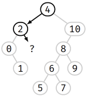
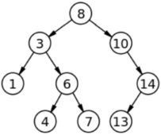

**Table des matières**

[1.	Introduction	](#_toc149153662)

[2.	Définition	](#_toc149153663)

[3.	Est-ce performant ?	](#_toc149153664)

[4.	Exemples	](#_toc149153665)

[5.	Les algorithmes et les implémentations en Python	](#_toc149153666)

[6.	Exercices	](#_toc149153671)

[7.	Projet	](#_toc149153672)

**Compétences évaluables :**

- Rechercher une clé dans un arbre de recherche, insérer une clé

1. # **Introduction**
Le parcours infixe des arbres suivants :

Le premier donne des valeurs non ordonnées alors que le selon donne des valeurs ordonnées. Or c’est bien plus pratique d’avoir des données ordonnées car on aura des **algorithmes plus performants.** 

C’est précisément ce type d’arbre que l’on va appeler un **arbre binaire de recherche**
1. # **Définition**
Un arbre binaire de recherche (ABR) (en anglais, Binary Search Tree ou BST) est une structure de donnée composée de nœuds. Chaque nœud a au plus 2 enfants ordonnés d’une manière particulière : 

- les enfants à gauche d’un nœud ont **des valeurs inférieures** à lui.
- les enfants à droite d’un nœud ont **des valeurs supérieures** à lui. Et cela doit être vrai pour chaque nœud de l’arbre.

Le **premier élément** inséré dans l'arbre devient **la racine**. Ensuite, il suffit de mettre **à gauche les éléments plus petits** et **à droite les éléments plus grands**. 
1. # **Est-ce performant ?**
On va le voir cela permet très efficacement d’avoir les opérations désirées pour manipuler un dictionnaire

La fonction principale est **la fonction de recherche** : on veut savoir si la clé 9 est dans l’ABR

		

On a trouvé

Si on recherche la clé 3

                          

Et là il n’y a rien donc 3 n’est pas présent dans l’ABR

C'est cette particularité qui rend les BST intéressants : la plupart des opérations réalisées sur les arbres binaires de recherche ont une complexité temporelle logarithmique **O(log n)** dans le cas moyen.

Cela est dû au fait que, grâce à la relation d'ordre liant les valeurs, on peut naviguer dans l'arbre **avec** **une logique rappelant une recherche dichotomique**, ce qui est **plus performant** que les listes, par exemple, que l'on doit parcourir élément par élément.

1. # **Exemples**
**Exemple** : Ainsi la séquence {8 3 10 1 6 14 4 7 13} peut-être traduite sous la forme de l’arbre binaire de recherche suivant :

|
**Activité n° AUTONUM  \* Arabic :**  **Séquence dans un arbre binaire de recherche :** Quelle est la séquence associée à l’arbre binaire de recherche ci-dessous ?

|
| - |

|
**Activité n° AUTONUM  \* Arabic :**  **Reconnaitre un arbre binaire de recherche** 

|
| - |

|**Activité n° AUTONUM  \* Arabic :**  **Construire un arbre binaire de recherche** Un vétérinaire voudrait stocker les fiches médicales de ses patients, et, plutôt que d'utiliser un tableau ou une liste, on se propose d'utiliser un arbre binaire. La fiche contiendra différentes informations sur l'animal ; on utilisera son nom comme clé (c'est-à-dire comme critère pour la relation d'ordre), que l'on triera selon l'ordre alphabétique croissant. Le vétérinaire reçoit sa première patiente, qui répond au nom de Gaufrette. Comme sa fiche sera le premier nœud de notre arbre, elle en devient automatiquement la racine. Puis le vétérinaire reçoit les animaux dans l’ordre suivant afin de les soigner : Charlie, Médor, Flipper, Bubulle et Augustin|
| :- |

|**Activité n° AUTONUM  \* Arabic :**  **Construire un arbre binaire de recherche** Imaginons que la séquence soit maintenant la suivante : {Gaufrette, Charlie, Médor, Flipper, Augustin, Bubulle}, c’est-à-dire que Augustin soit arrivé au rendez-vous médical avant Bubulle. L’arbre binaire de recherche est-il encore le même ? Quelle conclusion peut-on en tirer ?|
| - |

La valeur la plus à **gauche** correspond au **minimum** de l’ABR. Et la valeur la plus à **droite** correspond au **maximum** de l’ABR.

1. # **Les algorithmes et les implémentations en Python**
   1. **Créer un ABR** 

Un ABR est composé de **nœuds.** Chaque nœud contient obligatoirement une **valeur et optionnellement un parent et 2 enfants (un à droite et un à gauche)** :

|
**Activité n° AUTONUM  \* Arabic : Création d’un ABR** : Implémenter ce script dans un fichier que l’on nommera ABR

class Node:  `    `def \_\_init\_\_(self, value, left=None, right=None): `        `pass  `    `def \_\_str\_\_(self): `        `pass

 `    `def estFeuille(self): `        `pass
|
| :- |

1. **❤️Insérer dans un ABR ❤️**

**Algorithme :**

- Si l'arbre est vide, on renvoie un nouvel objet Arbre contenant la clé.
- Sinon, on compare la clé à la valeur du nœud sur lequel on est positionné :
- Si la clé est inférieure à cette valeur, on va modifier le sous-arbre gauche en le faisant pointer vers ce même sous-arbre une fois que la clé y aura été injecté, par un appel récursif.
- Si la clé est supérieure, on fait la même chose avec l'arbre de droite.
- on renvoie le nouvel arbre ainsi créé.

|**Activité n° AUTONUM  \* Arabic : Insertion dans un ABR** Créer la **fonction** inserer(T, data)qui répond à l’algorithme précédent|
| :- |

|**Activité n° AUTONUM  \* Arabic : Insertion dans un ABR** Créer la **méthode** insert(self, data) à la classe Node |
| :- |

La fonction inserer et la méthode insert sont équivalent car elles permettent de construire l’ABR.

|
**Activité n° AUTONUM  \* Arabic : Représentation graphique de l’arbre** importer le fichier graphicarbre.py au script précédent pour visualiser l’arbre binaire de recherche 

from graphicarbre import \*
|
| - |

|
**Activité n° AUTONUM  \* Arabic : Représentation graphique de l’arbre** Tester le programme précédent avec 

if \_\_name\_\_ == '\_\_main\_\_': `    `# avec la méthode `    `abr = Node(6) `    `abr.insert(8) `    `abr.insert(3) `    `abr.insert(1) `    `abr.insert(4) `    `abr.insert(9) `    `abr.insert(2) `    `abr.insert(7) `    `abr.insert(5) `    `graphicarbre(abr)  `    `# avec la fonction `    `T = Node(6) `    `inserer(T, 8) `    `inserer(T, 3) `    `inserer(T, 1) `    `inserer(T, 4) `    `inserer(T, 9) `    `inserer(T, 2) `    `inserer(T, 7) `    `inserer(T, 5) `    `graphicarbre(T)
|
| - |

**Remarque** : on peut faire une boucle sur une liste pour éviter de recopier le code

1. **❤️Recherche d’une clé dans un ABR❤️**
- Pour rechercher une clé donnée dans l’arbre binaire de recherche, nous la comparons d’abord avec la racine, si la clé est présente à racine nous retournons racine. 
- Si la clé est **supérieu**re à la clé de la racine, on recommence pour le **sous-arbre droit du nœud racine.** 
- **Sinon le sous-arbre gauche**

|
**Activité n° AUTONUM  \* Arabic : Recherche dans un ABR** : Créer une **fonction** rechercher(T, cle) qui répond à l’algorithme précédent mettre la représentation graphique en commentaire

Tester la avec la valeur 7 et la valeur 188.
|
| :- |

|
**Activité n° AUTONUM  \* Arabic : Recherche dans un ABR** : Créer une **méthode** search à la classe Node mettre la représentation graphique en commentaire

Tester la avec la valeur 7 et la valeur 188.
|
| - |

1. **Parcours infixe**

|
**Activité n° AUTONUM  \* Arabic**** : parcours infixe : Créer une fonction parcours\_infixe(T) 

Tester la sur les 2 arbres. Que remarquez vous ?
|
| - |

1. # **Exercices**
**Exercice n° 01 : Implémentation de quelques méthodes dans un ABR**

Utiliser la classe Node du cours pour implémenter les méthodes suivantes.

1. Créer un fichier ABR\_complet
1. Recopier ou importer le fichier ABR
1. D’après les propriétés de l’arbre, le nœud ayant la plus petite valeur se trouve forcément le plus à gauche. Implémenter une méthode qui donnera le min de l’ABR
1. Pour rechercher le maximum, c’est la logique inverse de la recherche du minimum, on descend le plus à droite possible. Implémenter une méthode qui donnera le maximum de l’ABR
1. Implémenter la méthode ou la fonction donnant la hauteur de l’ABR (convention 1 pour la racine)
1. Implémenter la méthode ou la fonction donnant le parcours en largeur de l’ABR
1. Implémenter la méthode ou la fonction donnant la taille de l’ABR

**Exercice n° 02 : Trier une liste en utilisant un ABR**

1. Créer un fichier tri\_liste\_ABR
1. Créer une liste de 10 entiers aléatoires distincts, puis générer un ABR dont les clés sont ces entiers. 
1. Utiliser le fichier graphicarbre pour l’afficher. 
1. Quel parcours permet d’afficher ces nombres dans l’ordre croissant ? 
1. Écrire une fonction nom\_du\_parcours(abr, lst\_triee) prenant en argument un ABR et une liste vide, et ajoutant les clés de l’ABR à la liste dans l’ordre. 
1. Écrire la fonction tri\_abr(lst) renvoyant une copie triée de la liste lst en utilisant un ABR.

1. # **Projet** 
**Exercice n° 01 : arbre binaire de recherche ABR**

1. **Insertion**

L'insertion d'un nœud commence par une recherche : on cherche la clé du nœud à insérer ; lorsqu'on arrive à une feuille, on ajoute le nœud comme fils de la feuille en comparant sa clé à celle de la feuille : si elle est inférieure, le nouveau nœud sera à gauche ; sinon il sera à droite.

On choisit d’implémenter de tels arbres binaires à l’aide de la classe suivante, où on utilise des valeurs par défaut dans le constructeur pour les deux enfants :

**class** BinarySearchTree:

`    `**def** \_\_init\_\_(self, key : int, left\_child=None, right\_child=None):

`        `self.\_\_key   = int(key)

`        `self.\_\_left  = left\_child	*# None ou un arbre de la classe BinarySearchTree*

`        `self.\_\_right = right\_child	*# None ou un arbre de la classe BinarySearchTree*

1. Créer un fichier Python binarySearchTree.py.
1. Implémenter une méthode \_\_repr\_\_()

*def* is\_leaf(*self*):
`    `*""" fonction testant si l'arbre est une feuille"""
`    `return not self*.\_\_left *and not self*.\_\_right

*def \_\_repr\_\_*(*self*):
`    `*if self*.is\_leaf():
`        `*return* "<" + *str*(*self*.\_\_key) + ">"
`    `left  = "<>" *if self*.\_\_left *is None else self*.\_\_left.*\_\_repr\_\_*()
`    `right = "<>" *if self*.\_\_right *is None else self*.\_\_right.*\_\_repr\_\_*()
`    `*return* "<{0},{1},{2}>".format(*self*.\_\_key, left, right)

1. Ajouter une méthode publique insert() qui ajoute un nœud à l’arbre.
1. Créer un ABR correspondant au schéma ci-dessus.
1. Valider le test unitaire suivant :

str(abr) == "<15,<12,<8,<>,<10>>,<14,<13>,<>>>,<20,<16,<>,<18,<17>,<19>>>,<21>>>"

1. Implémenter une méthode publique infix\_traversal() de parcours en profondeur infixé de l’arbre.
1. Valider le test unitaire suivant :

abr.infix\_traversal() == [8, 10, 12, 13, 14, 15, 16, 17, 18, 19, 20, 21]

1. Insérer un nœud de clef = 15 et revalider les tests unitaires précédents.
1. **Recherche**

La recherche dans un ABR d'un nœud ayant une clé particulière est un procédé récursif. On commence par examiner la racine. Si sa clé est la clé recherchée, l'algorithme se termine et renvoie la racine. Si elle est strictement inférieure, alors elle est dans le sous-arbre gauche, sur lequel on effectue alors récursivement la recherche. De même si la clé recherchée est strictement supérieure à la clé de la racine, la recherche continue dans le sous-arbre droit. Si on atteint une feuille dont la clé n'est pas celle recherchée, on sait alors que la clé recherchée n'appartient à aucun nœud.

1. Ajouter une méthode publique search() qui recherche une clef dans l’arbre et retourne True si la clef est trouvée, False sinon.
1. Valider les tests unitaires suivants :

abr.search(16) == True

abr.search(9) == False

On peut comparer l'exploration d'un ABR avec la recherche par dichotomie qui procède à peu près de la même manière sauf qu'elle accède directement à chaque élément d'un tableau au lieu de suivre des liens. La différence entre les deux algorithmes est que, dans la recherche dichotomique, on suppose avoir un critère de découpage de l'espace en deux parties que l'on n'a pas dans la recherche dans un ABR.

**Exercice n° 02 : arbre binaire de recherche des Pokemons**

On aura besoin d’un module d’affichage pip install binarytree

Ici on utilisera : les fonctions d’interface (primitives) suivantes :

Les fonctions liées aux Noeuds :

1. nvND(cle:Cle, data:Data) -> Noeud : on crée un nouveau noeud et son élément attaché. Ce n'est pas une fonction d'interface de l'arbre mais on a besoin au moins de pouvoir créer un Noeud.
1. cle(noeud:Noeud) -> Cle : renvoie la clé ou l'étiquette du noeud.
1. data(noeud:Noeud) -> Data : renvoie les données associées au noeud.

Les fonctions liées à l'Arbre Binaire lui-même :

1. nvAV() -> Arbre : on le note ainsi pour dire nouvelArbreVide : on crée un nouvel ARBRE BINAIRE vide.
1. nvAB(r:Noeud, g:Arbre, d:Arbre) -> Arbre : on crée un nouvel ARBRE BINAIRE dont la racine est r et dont les sous-arbres sont g et d fournis.
1. estArbreVide(arbre:Arbre) -> bool : True si l'arbre est un arbre vide.
1. racine(arbre:Arbre) -> Noeud : renvoie le noeud jouant le rôle de la racine pour cet arbre.
1. gauche(arbre:Arbre) -> Arbre : renvoie le sous-arbre gauche de arbre. On obtient bien un Arbre. Si vous voulez le noeud gauche, il faudra appliquer en plus la fonction racine.
1. droite(arbre:Arbre) -> Arbre : renvoie le sous-arbre droit de arbre.
   1. **Collection des Pokemon**

Nous allons récupérer un fichier CSV contenant les données de 800 Pokémons. Pour rappel, il s'agit d'un simple fichier texte :

- Un enregistrement (ici un pokemon) par ligne : le passage à la ligne est donc le caractère séparateur pour les enregistrements.
- Sur chaque enregistrement, les différents attributs ou champs sont séparés par une virgule (ou un point-virgule ou autre)

Si on rajoute les éléments importants en rouge (dont le passage à la ligne (invisible à l'affichage)**↲**):

|
1

2

3

4
|
#**,**Name**,**Type 1**,**Type 2**,**Total**,**HP**,**Attack**,**Defense**,**Sp. Atk**,**Sp. Def**,**Speed**,**Generation**,**Legendary**↲**

1**,**Bulbasaur**,**Grass**,**Poison**,**318**,**45**,**49**,**49**,**65**,**65**,**45**,**1**,**False**↲**

2**,**Ivysaur**,**Grass**,**Poison**,**405**,**60**,**62**,**63**,**80**,**80**,**60**,**1**,**False**↲**

3**,**Venusaur**,**Grass**,**Poison**,**525**,**80**,**82**,**83**,**100**,**100**,**80**,**1**,**False**↲**
|
| :- | :- |

Le but ici est d'utiliser les enregistrements pour construire l'ABR.

Au final, vous aurez donc une variable nommée pokemons qui est simple tableau qui contiendra les enregistrements (sous forme de dictionnaires).

Voici le début du contenu du tableau pokemons :

**pokemons** = **[**

`    `**{**

`        `'#': '1',

`        `'Name': 'Bulbasaur',

`        `'Type 1': 'Grass',

`        `'Type 2': 'Poison',

`        `'Total': '318',

`        `'HP': '45',

`        `'Attack': '49',

`        `'Defense': '49',

`        `'Sp. Atk': '65',

`        `'Sp. Def': '65',

`        `'Speed': '45',

`        `'Generation': '1',

`        `'Legendary': 'False'

`    `**},**

`    `**{**'#': '2', 'Name': 'Ivysaur', 'Type 1': 'Grass', 'Type 2': 'Poison', 'Total': '405', 'HP': '60', 'Attack': '62', 'Defense': '63', 'Sp. Atk': '80', 'Sp. Def': '80', 'Speed': '60', 'Generation': '1', 'Legendary': 'False'**},**

`    `**{**'#': '3', 'Name': 'Venusaur', 'Type 1': 'Grass', 'Type 2': 'Poison', 'Total': '525', 'HP': '80', 'Attack': '82', 'Defense': '83', 'Sp. Atk': '100', 'Sp. Def': '100', 'Speed': '80', 'Generation': '1', 'Legendary': 'False'**},**

`    `**{**'#': '3', 'Name': 'VenusaurMega Venusaur', 'Type 1': 'Grass', 'Type 2': 'Poison', 'Total': '625', 'HP': '80', 'Attack': '100', 'Defense': '123', 'Sp. Atk': '122', 'Sp. Def': '120', 'Speed': '80', 'Generation': '1', 'Legendary': 'False'**},**

...

**]**

1. Comment obtenir l'enregistrement d'index 0 contenus dans pokemons ?
1. Comment obtenir l'ensemble des clés disponibles sur cet enregistrement ? Comment afficher une par une les clés ?
1. Comment afficher un par un les couples (clé, valeur) sur cet enregistrement ?
1. Comment afficher un par un les couples (c, v) sous la forme "La clé {c} est associée à la valeur {v}" ?
1. Comment obtenir la valeur associée à la clé "Attack" pour l'enregistrement d'index 0 contenus dans pokemons ?
1. Comment faire la même chose mais en récupérant un entier ?

1. **Récupération des données**

Nous allons maintenant télécharger 

- le fichier CSV 
- Un module creation\_collect.py permettant de créer la collection sous forme d'un tableau de dictionnaire
- Un module abr.py permettant de gérer les ABR

Voici la description des 3 fonctions d'interface qui vont nous être utiles au début :

def nvND(cle: Cle, data: Data = None) -> Noeud:
`    `'''Renvoie la référence d'un nouveau Noeud ayant cle comme clé et data comme données annexes'''

def nvABR(racine: Noeud, g: Arbre = nvAV(), d: Arbre = nvAV()) -> ABR:
`    `'''Renvoie la référence d'un nouvel Arbre dont le noeud-racine est racine et les sous-arbre g et d'''

def inserer\_noeud\_dans\_ABR(arbre: ABR, nd: Noeud) -> None:
`    `'''Insére le noeud dans l'ABR'''

La dernière fonction insère le Noeud en respectant l'algorithme vu pour les ABR.

7. Ouvrir le fichier nommé arbre\_pokemons.py et lancer le. Mettre le programme en mémoire puis lancer les commandes suivantes pour vérifier que la documentation est bien présente :

**>>> help(inserer\_noeud\_dans\_ABR)**
**

**>>> help(nvABR)**
**

**>>> help(nvND)**

Peut-on voir que certains paramètres ont une valeur par défaut ?

Peut-on voir qu'en réalité les objets ABR, Noeud... sont issus du module abr.py ?

7. Dessiner sur papier l'arbre créer en utilisant la fonction de test de création suivante

def creation\_test():
`    `'''Renvoie un ABR de test'''
`    `arbre = nvABR(nvND(20))
`    `inserer\_noeud\_dans\_ABR(arbre, nvND(25))
`    `inserer\_noeud\_dans\_ABR(arbre, nvND(15))
`    `inserer\_noeud\_dans\_ABR(arbre, nvND(17))
`    `inserer\_noeud\_dans\_ABR(arbre, nvND(10))
`    `return arbre

Vérifier ensuite votre réponse en tapant simplement ceci :

**>>> arbre = creation\_test()**

**>>> print(arbre)**

7. Rajoutons un noeud dont la clé est 21. Vérifier qu'il se positionne bien en affichant l'arbre.

**>>> inserer\_noeud\_dans\_ABR(arbre, nvND(21))**

7. Nous allons utiliser l'une des fonctions pour importer le fichier CSV et placer ces données dans une Collection de dictionnaires.

def creation\_cp():
`    `'''Renvoie une collection-tableau de dictionnaires des pokemons'''
`    `return creer\_collection('pokemon.csv')

En regardant les importations, expliquer :

- dans quel module se trouve la fonction creer\_collection
- pourquoi on a le droit de l'utilisation en notant simplement creer\_collection et pas nom\_du\_module.creer\_collection

  7. Utiliser le jeu de commandes suivants pour comprendre de le principe :

\>>> collect = creation\_cp()

\>>> len(collect)

800

\>>> collect[0]

{'#': '1', 'Name': 'Bulbasaur', 'Type 1': 'Grass', 'Type 2': 'Poison', 'Total': '318', 'HP': '45', 'Attack': '49', 'Defense': '49', 'Sp. Atk': '65', 'Sp. Def': '65', 'Speed': '45', 'Generation': '1', 'Legendary': 'False'}

\>>> collect[1]

{'#': '2', 'Name': 'Ivysaur', 'Type 1': 'Grass', 'Type 2': 'Poison', 'Total': '405', 'HP': '60', 'Attack': '62', 'Defense': '63', 'Sp. Atk': '80', 'Sp. Def': '80', 'Speed': '60', 'Generation': '1', 'Legendary': 'False'}

\>>> for index in range(0,10,1): print(collect[index]['Name'])

` `Bulbasaur

` `Ivysaur

` `Venusaur

` `VenusaurMega Venusaur

` `Charmander

` `Charmeleon

` `Charizard

` `CharizardMega Charizard X

` `CharizardMega Charizard Y

` `Squirtle

Essayons maintenant de voir ce que fait la dernière fonction : la fonction creation\_aap.

7. Observer le code de la fonction et répondre aux questions :

|
22

23

24

25

26

27

28

29

30

31

32

33

34

35

36

37

38

39

40

41

42

43

44
|def creation\_cp(): `    `'''Renvoie une collection-tableau de dictionnaires des pokemons''' `    `return creer\_collection('pokemon.csv')  def creation\_aap(): `    `'''Renvoi un arbre contenant des noeuds-pokemons'''  `    `pokemons = creer\_collection('pokemon.csv') `    `choix = 'Attack'  `    `arbre = nvAV()  `    `for index in range(len(pokemons)): `        `d = pokemons[index] # d pour data (pour ne pas écraser la fonction data) `        `c = int(d[choix])   # c pour cle (pour ne pas écraser la fonction cle) `        `noeud = nvND(c, d)          `        `if estArbreVide(arbre): `            `arbre = nvABR(noeud) `        `elif index < 41 :         `            `inserer\_noeud\_dans\_ABR(arbre, noeud)  `    `return arbre|
| - | :- |

Ligne 30 : quel est l'attribut du dictionnaire choisi pour jouer le rôle de clé dans l'arbre ?

Ligne 32 : quel est le contenu de l'arbre initialement ?

Ligne 34 : la base des pokemons contient 800 pokemons. Quel va être la valeur finale de la variable de boucle index ?

Ligne 35 : à chaque tour de boucle, la variable d va t-elle contenir un enregistrement ou la valeur de la clé choisie ?

Ligne 36 : à chaque tour de boucle, la variable c va t-elle contenir un string ou un entier ?

Ligne 37 : Quelle est la clé du noeud créé ? Quel est le contenu de l'attribut data associé à ce Noeud ?

Ligne 39 et +

Que fait-on si l'arbre est vide lors du premier tour de boucle ?

Que fait-on si l'arbre n'est pas vide lors des autres tours de boucle ?

Quelle va être la taille de l'arbre à la fin de la boucle POUR ?

7. Utilisez le code suivant pour voir le principe de nos enregistrements stockés dans l'arbre à Pokemons (aap):

\>>> arbre = creation\_aap()

\>>> print(arbre)

![Arbre de Pokémons avec l'attaque en clé]

7. Utilisez les commandes suivantes pour réopndre aux questions :
- quelle est la version d'utilisation qui correspond à un utilisateur ne connaissant pas l'implémentation exacte de l'ABR et qui utilise les fonctions d'interface ?
- quelle est la version d'utilisation qui correspond à un utilisateur connaissant l'implémentation actuelle et la manipulant directement ?
- sous quelle forme l'ABR est-il manifestement implémenté ?
- En cas de modification future de l'implémentation, quelle est la version d'utilisation à privilégier ?

**Version 1 :**

\>>> cle(racine(arbre))

49

\>>> data(racine(arbre))

{'#': '1', 'Name': 'Bulbasaur', 'Type 1': 'Grass', 'Type 2': 'Poison', 'Total': '318', 'HP': '45', 'Attack': '49', 'Defense': '49', 'Sp. Atk': '65', 'Sp. Def': '65', 'Speed': '45', 'Generation': '1', 'Legendary': 'False'}

\>>> data(racine(arbre))['Name']

'Bulbasaur'

\>>> g = gauche(arbre)

\>>> data(racine(g))['Name']

'Squirtle'

\>>> cle(racine(g))

48

\>>> d = droite(arbre)

\>>> data(racine(d))['Name']

'Ivysaur'

\>>> cle(racine(d))

62

**Version 2 :**

\>>> arbre.racine.cle

49

\>>> arbre.racine.data

{'#': '1', 'Name': 'Bulbasaur', 'Type 1': 'Grass', 'Type 2': 'Poison', 'Total': '318', 'HP': '45', 'Attack': '49', 'Defense': '49', 'Sp. Atk': '65', 'Sp. Def': '65', 'Speed': '45', 'Generation': '1', 'Legendary': 'False'}

\>>> arbre.racine.data['Name']

'Bulbasaur'

\>>> g = arbre.gauche

\>>> g.racine.data['Name']

'Squirtle'

\>>> g.racine.cle

48

\>>> d = arbre.droite

\>>> d.racine.data['Name']

'Ivysaur'

\>>> d.racine.cle

62

1. **Recherche**

3\.15. Ouvrir le module **abr.py**. Retrouver un algorithme permettant de rechercher un noeud dans un ABR en utilisant **les fonctions d'interface du module**. Une fois l'algorithme retrouvé, implémenter le dans la fonction recherche.

Renvoyer la valeur au lieu de True

3\.16. Tester l'absence d'erreur en lançant directement le module abr.py. Vérifiez ensuite que la fonction fonctionne : relancer le programme **arbre\_pokemons.py** puis lancer ces commandes :

\>>> aap = creation\_aap()

\>>> print(aap)

\>>> recherche(aap, 49)

<abr.Noeud object at 0x7f0da76a0e48>

\>>> reponse = recherche(aap, 102)

\>>> data(reponse)['Name']

'Nidoking'

\>>> data(recherche(aap, 102))['Name']

'Nidoking'

1. **Affichage particulier**

Premier avantage des ABR : les noeuds sont 'triés' entre eux. Du coup, on peut les afficher un par un de façon ... triée.

Il suffit de demander l'affichage infixe (la racine au milieu de l'affichage) !

Deuxième avantage : pour trouver la plus petite clé disponible, il suffit d'aller à gauche tant que le sous-arbre n'est pas vide.

Troisième avantage : pour trouver la plus grande clé, il suffit d'aller à droite tant que le sous-arbre n'est pas vide.

4\.17. Afficher les attaques de 41 Pokemons stockées en utilisant simplement ceci :

\>>> parcours\_infixe(arbre)

20

25

30

35

45

45

45

47

48

49

52

55

56

57

60

60

60

62

62

63

64

72

75

80

80

81

82

83

84

85

90

90

90

92

100

100

102

103

104

130

150

![Arbre de Pokémons avec l'attaque en clé]

4\.18. Modifier **parcours\_infixe** : il faudra afficher également le nom du Pokemon à côté de son score d'attaque.

\>>> aap = creation\_aap()

\>>> parcours\_infixe(aap)

` `20 pour Metapod

` `25 pour Kakuna

` `30 pour Caterpie

` `35 pour Weedle

` `45 pour Butterfree

` `45 pour Pidgey

` `45 pour Clefairy

` `47 pour Nidoran♀

` `48 pour Squirtle

` `49 pour Bulbasaur

` `52 pour Charmander

` `55 pour Pikachu

` `56 pour Rattata

` `57 pour Nidoran♂

` `60 pour Pidgeotto

` `60 pour Spearow

` `60 pour Ekans

` `62 pour Ivysaur

` `62 pour Nidorina

` `63 pour Wartortle

` `64 pour Charmeleon

` `72 pour Nidorino

` `75 pour Sandshrew

` `80 pour Pidgeot

` `80 pour PidgeotMega Pidgeot

` `81 pour Raticate

` `82 pour Venusaur

` `83 pour Blastoise

` `84 pour Charizard

` `85 pour Arbok

` `90 pour Beedrill

` `90 pour Fearow

` `90 pour Raichu

` `92 pour Nidoqueen

` `100 pour VenusaurMega Venusaur

` `100 pour Sandslash

` `102 pour Nidoking

` `103 pour BlastoiseMega Blastoise

` `104 pour CharizardMega Charizard Y

` `130 pour CharizardMega Charizard X

` `150 pour BeedrillMega Beedrill

4\.19. A droite toute : rajouter dans le programme arbre\_pokemon la fonction récursive cle\_max : on transfère la plus grande valeur à chaque appel !

def cle\_max(arbre, maximum=None):
`    `if estArbreVide(arbre):
`        `return maximum
`    `else:
`        `maximum = cle(racine(arbre))
`        `return cle\_max(droite(arbre), maximum)

Utilisation :

\>>> aap = creation\_aap()

\>>> cle\_max(aap)

150

\>>> recherche(aap, 150)

<abr.Noeud object at 0x7fac40696f28>

\>>> data(recherche(aap, 150))['Name']

'BeedrillMega Beedrill'

4\.20. A gauche toute : créer dans le programme arbre\_pokemon la fonction récursive cle\_min : on transfère la plus petite valeur à chaque appel !

Terminale NSI 	Chap 06 : Les arbres binaires de recherche	Page 15/15

[Arbre de Pokémons avec l'attaque en clé]: Aspose.Words.6e55a686-622e-41c3-8254-4f896d64da0f.017.png
