## 🗂️ **Table des matières**

1. 🕰️ [Historique](#_toc154844728)
2. 🧠 [Rappels de première](#_toc154844729)
3. 🛰️ [Tables de routage et routage statique](#_toc154844742)
4. 🔄 [Routage dynamique RIP](#_toc154844745)
5. ⚙️ [Routage dynamique OSPF](#_toc154844749)
6. 📝 [Exercices](#_toc154844753)

---

## 🎯 **Compétence évaluée**

> Identifier, selon le protocole de routage utilisé, la route empruntée par un paquet.

---

##  <H2 STYLE="COLOR:BLUE;">**1. 🕰️ Historique**</H2>

Le réseau **ARPANET**, ancêtre de l’Internet moderne, voit le jour en **1969**.
C’est le **premier réseau à commutation de paquets**, conçu pour transférer des données de manière décentralisée.

📅 **Le 29 octobre 1969**, le **premier message** est transmis entre l’université **UCLA (Californie)** et le centre de recherche de **Stanford**.
Cette expérience marque **la naissance de l’Internet.**

---

##  <H2 STYLE="COLOR:BLUE;">**2. 🧠 Rappels de première**</H2>

---

###  <H3 STYLE="COLOR:GREEN;">**2.1. 🧩 Le modèle TCP/IP et les couches de communication**</H3>

| Les règles de communication (**protocoles**) entre ordinateurs doivent respecter certaines contraintes afin d’assurer la compatibilité entre réseaux.
Le **modèle TCP/IP** est un **modèle en couches** :
chaque couche communique uniquement avec la couche **immédiatement supérieure ou inférieure**.

Deux notions fondamentales assurent la stabilité du système :

1️⃣ **Encapsulation** : chaque tâche est isolée dans sa propre couche.

2️⃣ **Interface** : les échanges se font uniquement via des interfaces définies.

| Ainsi, les couches restent **indépendantes** : on peut modifier le code interne d’une couche sans affecter les autres, tant que l’interface reste identique. | 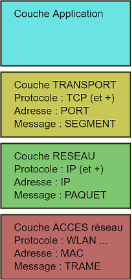 |
| ------------------------------------------------------------------------------------------------------------------------------------------------------------ | -------------------------------------------------------------- |

---

###  <H3 STYLE="COLOR:GREEN;">**2.2. 🌍 La couche Application**</H3>

| La **couche application** a pour rôle de **déterminer le mode de communication** entre programmes.

| Elle repose sur des **protocoles standards** comme **HTTP**, **HTTPS**, **FTP**, **SMTP**, etc. |
| ----------------------------------------------------------------------------------------------- |

{: .center}

📘 **Exemple :**
Votre navigateur web (ex. **Firefox**) communique avec un **serveur HTTP** (par ex. `elisa.leprettre.free.fr`) via un **langage commun : le protocole HTTP.**

{: .center}

Le **serveur HTTP** écoute sur un **port spécifique** :

* Port **80** pour **HTTP**,
* Port **443** pour **HTTPS** (connexion sécurisée).

---

#### 💬 **Les types de requêtes HTTP**

🔹 **Méthode GET** :
Les paramètres sont envoyés **dans l’URL**.
→ Simple à utiliser, mais la taille de l’URL est limitée et les données (comme un mot de passe) peuvent apparaître en clair.

🔹 **Méthode POST** :
Les paramètres sont envoyés **dans le corps (BODY)** de la requête.
→ Plus adaptée pour des **données volumineuses** ou **sensibles** (formulaires, fichiers...).

💡 Quelle que soit la méthode utilisée, le **navigateur** met en forme la requête selon les règles du **protocole HTTP**.

📌 **Conclusion :**
HTTP fait partie de la **couche Application**, car il définit **comment deux programmes échangent des données** via des règles de communication standardisées.

Mais le navigateur ne contacte **pas directement le serveur distant** :
il délègue l’envoi à la **couche Transport**.

---

###  <H3 STYLE="COLOR:GREEN;">**2.3. 🚚 La couche Transport**</H3>

| La **couche Transport** est chargée de **mettre en œuvre le mode de transmission** choisi par la couche Application.
Deux grands protocoles existent :

* **TCP (Transmission Control Protocol)** : protocole **fiable**, assurant la remise **sans erreur et dans le bon ordre** des données.

* **UDP (User Datagram Protocol)** : protocole **rapide mais non fiable**, utilisé quand la perte de paquets n’est pas critique (ex. streaming, jeux en ligne). 


#### ⚙️ **Rôle de la couche Transport**

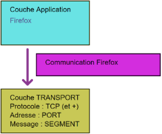{: .center}

1️⃣ **Découper le message** si sa taille est trop importante.
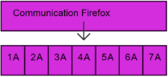{: .center}

2️⃣ **Identifier les applications communicantes** à l’aide de **ports** :

* Chaque programme (navigateur, serveur web, etc.) est identifié par un **numéro de port** (de 1 à 65535).

3️⃣ **Assembler les sous-messages** et ajouter un **en-tête TCP**, contenant :

* Le **port source** (application émettrice),
* Le **port destination** (application réceptrice),
* Un **numéro de séquence**,
* Et d’autres informations de contrôle.

---

#### 🔍 **Le segment TCP**

| Un **segment TCP** correspond à un **sous-message** accompagné d’un **en-tête TCP**.
Celui-ci contient notamment :

* Le **port source**,
* Le **port destination**,
* Le **numéro de séquence**, etc.

| Grâce à cette structure, la machine réceptrice peut **reconstituer le message original**. |
| ----------------------------------------------------------------------------------------- |

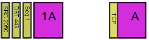{: .center}

🧩 Une fois les segments créés, il faut maintenant **les acheminer vers la bonne machine**.
👉 Cela devient la mission de la **couche Réseau (ou Internet).**

---

###  <H3 STYLE="COLOR:GREEN;">**2.4. 🌐 La couche Réseau (ou Internet)**</H3>

####  <H4 STYLE="COLOR:MAGENTA;">**2.4.1. 📦 Le protocole IP et le rôle de la couche Internet**</H4>

| La **couche Internet** est responsable de **l’interconnexion entre réseaux**.
Elle utilise le **protocole IP (Internet Protocol)** pour acheminer les données jusqu’à leur destinataire.

| Les couches supérieures (TCP, Application) se chargent ensuite de **réordonner** et **interpréter** les messages. |
| ----------------------------------------------------------------------------------------------------------------- |

---

#### 🧭 **Exemples de fonctionnement :**

1️⃣ **Communication locale (même machine)**
→ Le message est directement transmis à la **couche Application**.
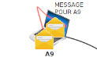{: .center}

---

2️⃣ **Communication sur le même réseau local**
→ Le message est envoyé à la **couche Réseau** du destinataire.
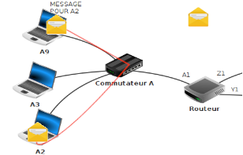{: .center}

---

3️⃣ **Communication entre deux réseaux différents**
→ Le message passe par un **routeur**, chargé de trouver le **chemin optimal** jusqu’au réseau cible.
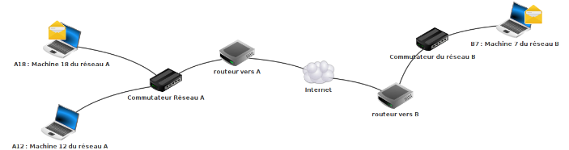{: .center}

---


## <H4 STYLE="COLOR:MAGENTA;"> 2.4.2. 🧭 Comment savoir si la destination est locale ou extérieure ?</H4>

| **Adresse IP = Adresse réseau + Adresse machine**
La couche **RÉSEAU / INTERNET** identifie les machines grâce à l’**adresse IP**.
Comme il est impossible de connaître toutes les adresses d’Internet, **une IP est découpée en deux parties** :

* une **adresse réseau** (identifie le réseau),
* une **adresse machine (hôte)** (identifie la machine sur ce réseau).

| Que ce soit en IPv4 ou IPv6, un **mécanisme permet de décider** si la destination est **sur le même réseau** (on reste en local) ou **hors réseau** (on sort via le routeur par défaut). |
| ---------------------------------------------------------------------------------------------------------------------------------------------------------------------------------------- |

---

## <H4 STYLE="COLOR:MAGENTA;">2.4.3. 🗂️ Qui attribue les adresses IP ?</H4>

| **Attribution des IP**
Chaque machine se connecte via une **carte réseau** identifiée par une **adresse MAC**.
La correspondance **IP ↔ MAC** est maintenue via **ARP** (Address Resolution Protocol).

| En pratique, c’est souvent le **serveur DHCP** qui **attribue automatiquement** une IP au poste lorsqu’il rejoint le réseau. |
| ---------------------------------------------------------------------------------------------------------------------------- |

---

## <H4 STYLE="COLOR:MAGENTA;">2.4.4. 🧮 À quel réseau appartient une machine ?</H4>

Une **adresse IP** est fournie avec un **masque** (ex. `255.255.255.0`) ou en **CIDR** (ex. `/24`).
Exemple : `192.168.0.5/16`  ⇒ réseau **192.168.0.0**, machine **0.5**.

* `192.168.1.6/16` est **dans le même réseau** (192.168.0.0).
* `192.168.1.6/24` est **dans un autre réseau** (192.168.1.0).

**Règle** : l’**adresse réseau = IP AND masque** (ET logique bit à bit).

Exemple détaillé : `172.128.10.5/18` (masque `255.255.192.0`)

```
172.128.10.5          → 10101100 . 10000000 . 00001010 . 00000101
255.255.192.0         → 11111111 . 11111111 . 11000000 . 00000000
ET (AND)              → 10101100 . 10000000 . 00000000 . 00000000
= Adresse réseau      → 172.128.0.0
```

### 🌐 Taille du sous-réseau & broadcast

Dans ce /18, la partie « hôte » fait **14 bits** (2ⁱ⁴ = **16384** adresses possibles).
On retire **l’adresse réseau** et **l’adresse de broadcast** ⇒ **16382** machines utilisables.

**Adresse de broadcast** (tout à 1 côté hôte) :

```
réseau    : 172 . 128 .  0 .   0
masque    : 255 . 255 . 192 .  0
broadcast : 172 . 128 .  63 . 255   (192+63=255)
```

👉 **Plage utilisable** : `172.128.0.1` → `172.128.63.254`.

---

## <H4 STYLE="COLOR:MAGENTA;">2.4.5. 🔤 DNS (Domain Name System)</H4>

| On ne tape pas les IP dans la vraie vie, on tape des **noms de domaine** (`www.google.fr`).

| Un **serveur DNS** traduit ce nom en **adresse IP** correspondante. |
| ------------------------------------------------------------------- |

---

## <H4 STYLE="COLOR:MAGENTA;">2.4.6. 📦 Qu’est-ce qu’un paquet IP ?</H4>

| La couche **RÉSEAU** reçoit des **segments TCP/UDP** de la couche TRANSPORT et leur ajoute un **en-tête IP** pour indiquer l’**IP source**, l’**IP destination**, le **TTL/Hop Limit**, etc. |
| -------------------------------------------------------------------------------------------------------------------------------------------------------------------------------------------- |

| **Que contient l’en-tête IP (extraits utiles)**

* **IP destination** (IPv4 : 4 octets, IPv6 : 16 octets)
* **IP source** (idem)
* **TTL** (IPv4) / **Hop Limit** (IPv6) : décrémente à chaque routeur, évite les boucles |
  | 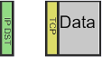 |

> On symbolise un paquet IP par un bloc « En-tête IP + Segment ».
> (Tu gardes tes schémas actuels 👍)

---

## <H4 STYLE="COLOR:MAGENTA;">2.4.7. 📉 Les pertes de paquets</H4>

| Des **pertes de paquets** peuvent survenir (engorgement, délais, etc.).

| Le **protocole TCP** gère fiabilité et ordre via des **accusés de réception (ACK)** ; il **détecte les pertes** et **réémet** si nécessaire. |
| -------------------------------------------------------------------------------------------------------------------------------------------- |

---

# 🧪 Activités — Décider « local ou extérieur » (avec solutions)

> Rappel méthode (IPv4) : **Comparer l’IP réseau** (IP AND masque) **des deux hôtes**.
> Si elles sont identiques → **même réseau (local)**, sinon → **sortie via routeur**.
> (IPv6 : comparer sur le **préfixe** — très souvent **/64** en LAN.)

---

???+ question "🧠 **Activité n° 1** — IPv4 /16"
  La machine **70.30.20.145/16** veut joindre **70.30.21.5**.
  Faut-il **rester dans le réseau** ou **sortir** ?

  
  ??? success "❇️ Solution :"
      `/16` ⇒ réseau = **70.30.0.0**.  
      - 70.30.20.145 ∈ 70.30.0.0/16  
      - 70.30.21.5   ∈ 70.30.0.0/16  
      **Même réseau** ⇒ on **reste local** (pas de routeur).
  

---

???+ question "🧠 **Activité n° 2** — IPv4 /24"
  La machine **70.30.20.145/24** veut joindre **70.30.21.5**.
  Faut-il **rester** ou **sortir** ?


  ??? success "❇️ Solution :"
      `/24` ⇒ réseau = **70.30.20.0** pour la première, **70.30.21.0** pour la seconde.  
      **Réseaux différents** ⇒ on **sort via le routeur**.


---

???+ question "🧠 **Activité n° 3** — IPv4 masque 255.0.0.0 (/8)"
  La machine **20.30.40.50** (masque **255.0.0.0**) veut joindre **20.200.100.5**.


  ??? success "❇️ Solution :"
      `/8` ⇒ réseau = **20.0.0.0** dans les deux cas.  
      **Même réseau** ⇒ **communication locale**.


---

???+ question "🧠 **Activité n° 4** — IPv4 masque 255.255.255.0 (/24)"
  La machine **90.80.20.120** (masque **/24**) veut joindre **90.80.20.5**.


  ??? success "❇️ Solution :"
      `/24` ⇒ réseau = **90.80.20.0** dans les deux cas.  
      **Même réseau** ⇒ **local**.


---

???+ question "🧠 **Activité n° 5** — IPv6 (préfixe implicite)"
  La machine **2a01:cb0c:96ac:d400:63ba:f65c:3616:15d4** veut joindre
  **2a01:cb0c:96ac:d400:73ba:12e3:3616:45a1**.
  Faut-il **rester** ou **sortir** ?


  ??? success "❇️ Solution :"
      En IPv6, **les LAN utilisent presque toujours /64**.  
      Les **4 premiers groupes** (le préfixe /64) sont **identiques** :  
      `2a01:cb0c:96ac:d400::/64`  
      ⇒ **Même sous-réseau** (Neighbor Discovery), **communication locale**.  
      > Si le préfixe était plus court (ex. /48), il faudrait le connaître pour conclure.


---


## <H4 STYLE="COLOR:MAGENTA;">2.4.8. 🔁 Le protocole de bit alterné</H4>

Considérons deux ordinateurs **A** et **B**.

* À l’émission d’une trame, **A** ajoute un **bit drapeau** (*flag*), 0 ou 1.
* À la réception, **B** envoie un **accusé de réception (ACK)** en **inversant** le drapeau (1 si la trame reçue avait 0, et inversement).

**Règle :**
La **première trame** envoyée par **A** porte le **drapeau 0**. À réception, **B** répond avec **ACK/1** (ce **1** signifie : « la **prochaine trame** que A m’enverra devra avoir **1** »).
Dès que **A** reçoit **ACK/1**, il envoie la **2e trame** avec **drapeau 1**, etc.

```
A------Trame1/0---->B
A<-----ACK/1--------B
A------Trame2/1---->B
A<-----ACK/0--------B
A------Trame3/0---->B
A<-----ACK/1--------B
```

⏱️ **Temporisation (timeout)** : côté émetteur, un **chronomètre** démarre à chaque envoi.
Si **aucun ACK correct** (avec le bon drapeau) n’est reçu **avant l’expiration**, **la trame est considérée perdue** et **renvoyée**.

**Exemple 1 — Perte de la trame :**

```
A------Trame1/0 xx B   (Trame perdue)
-----------------------
⏱ Temps écoulé
A------Trame1/0---->B  (Renvoyée)
A<-----ACK/1--------B
```

**Exemple 2 — Perte de l’ACK :**

```
A------Trame1/0---->B
A< xx ACK/1---------B  (ACK perdu)
-----------------------
⏱ Temps écoulé
A------Trame1/0---->B  (Trame renvoyée)
A<-----ACK/1--------B
```

⚠️ **Limites** : dans certaines situations, ce protocole **ne récupère pas** toutes les pertes (ex. duplications/ambiguïtés), d’où son remplacement par des protocoles plus **efficaces et robustes** (mais plus complexes).

> Tu gardes tes schémas « données définitivement perdues » et **conclusion** tels quels 👍.

---

## <H2 STYLE="COLOR:BLUE;">3. 🗺️ Tables de routage & routage statique</H2>

### <H3 STYLE="COLOR:GREEN;">3.1. 🧵 Les chemins dans le réseau</H3>

On a un **paquet IP** avec **IP source** et **IP destination** :

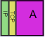{: .center}

On ne peut l’envoyer **qu’à un voisin direct**. Il faut donc choisir **l’intermédiaire** (passerelle/routeur) approprié pour **approcher** la destination.

| La **couche RÉSEAU (IP)** décide **qui** doit gérer le paquet **ensuite** : **quelle passerelle** est le **prochain saut** (*next hop*). |
| ---------------------------------------------------------------------------------------------------------------------------------------- |

---

### <H3 STYLE="COLOR:GREEN;">3.2. 📋 Les tables de routage</H3>

| **Structure type d’une table de routage :**

1. **Destination** : réseau/masque de la cible (permet d’identifier le **réseau de destination**).
2. **Passerelle (Gateway)** : **IP du routeur voisin** à qui **confier** le paquet **si** la destination n’est **pas** dans notre sous-réseau (peut être vide si réseau directement connecté).
3. **Interface (Sortie)** : **IP locale** (ou nom d’interface) **par laquelle** le paquet **sort**. **Toujours** renseignée. |
   | - |

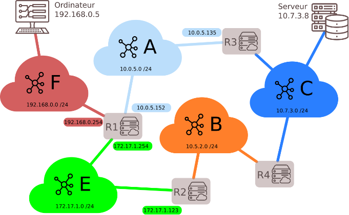{: .center}

**Exemple (scénario du schéma)** :

* La machine **192.168.0.5** veut joindre **10.7.3.8**.
* Ce n’est **pas** dans le sous-réseau **F (192.168.0.0/24)**, donc la requête est **envoyée au routeur** via sa **passerelle** dans F (**192.168.0.254**).
* Le routeur regarde si **10.7.3.8** appartient à l’un de ses **réseaux directement connectés** (A, E…) → **non**.
* Il consulte alors sa **table de routage** :

  * si **C** y figure, il choisit le **meilleur voisin** (ex. **R3**) comme **passerelle**.
  * sinon, il utilise la **route par défaut** (panneau « **toutes directions** »).

**Exemple — Table de R1**

| Destination | Interface     | Passerelle   |
| ----------- | ------------- | ------------ |
| F           | 192.168.0.254 |              |
| A           | 10.0.5.152    |              |
| E           | 172.17.1.254  |              |
| B           | 172.17.1.254  | 172.17.1.123 |
| C           | 10.0.5.152    | 10.0.5.135   |

* **F, A, E** : réseaux **directement connectés** → **pas** de passerelle.
* **B** : passerelle = **R2** (**172.17.1.123**).
* **C** : passerelle = **R3** (**10.0.5.135**).

| **Construction des tables :**

* **Statique** : saisie **à la main** (petits réseaux).
* **Dynamique** : **protocoles de routage** qui échangent les informations et **convergent** vers une **vision cohérente** (ex. **RIP**, **OSPF**). |
  | - |

---

## <H2 STYLE="COLOR:BLUE;">4. 🔄 Routage dynamique — RIP (Routing Information Protocol)</H2>

### <H3 STYLE="COLOR:GREEN;">4.1. 🧩 Principe de RIP</H3>

* Tous les **30 s**, chaque routeur **diffuse sa table de routage**.
* Au départ, un routeur ne connaît que ses **réseaux directement connectés** à **distance 1** (*hop count*).
* Mise à jour à réception des tables voisines :

  * **Nouvelle destination** découverte → **ajout** avec **distance reçue + 1**.
  * **Chemin plus court** trouvé → **mise à jour** (on **remplace**).
  * **Chemin plus long** que l’existant → **ignoré** (on **garde** le meilleur).
  * **Même destination via le même voisin** mais métrique **modifiée** → **mise à jour** (topologie a changé).
  * Si le réseau **n’évolue plus**, les tables **convergent** (stable).
  * **Absence d’info 3 min** d’un voisin → routes via ce voisin marquées **infinies = 16**.

**Remarques / Limites :**

* **Métrique = nombre de sauts**, **max = 15** → réseaux **petite taille**.
* **Routing by rumor** : chaque routeur **n’a pas la topologie globale**, seulement ce que **racontent** les voisins.
* La métrique **ignore la qualité** des liens (débit, latence…), **contrairement à OSPF**.

---

???+ question "🚦 **Activité n° 6 — Routage RIP**"
  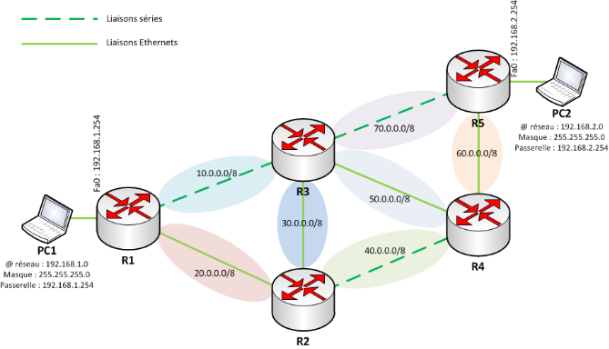{: .center}


  1) Pour **chaque sous-réseau entre deux routeurs**, donner la **première** et la **dernière** adresse **utilisable**.  
  2) Attribuer aux **interfaces** des routeurs leurs **adresses**.  
  3) Compléter la **table de routage initiale de R1** (avec colonne **Distance**) — **sans** passerelle si réseau directement connecté.  
  4) Même chose pour **R3** puis **R2**.  
  5) **Table de R1** après **échange RIP** avec **R3**.  
  6) **Table de R1** après échange avec **R2**.  
  7) **Table finale** de **R1** (après convergence).  
  8) Quel **chemin** suivront les paquets entre **PC1** et **PC2** ?

  ??? success "❇️ Solution (méthode & trame de réponse — à compléter selon le schéma fourni)"
      **Étape A — Bornes d’adressage (par lien)**
      - Pour chaque lien R•↔R• (ou R•↔LAN), relever le **préfixe** (ex. /30, /29, /24…).  
      - **Première adresse utilisable** = **adresse réseau + 1**.  
      - **Dernière adresse utilisable** = **broadcast − 1** (en IPv4).

      **Étape B — Adressage des interfaces**
      - Noter pour chaque routeur **l’IP de chaque interface** (dans le bon sous-réseau).  
      - Exemple (format) :  
        - **R1–IF_A** : 10.0.5.152/24  
        - **R1–IF_E** : 172.17.1.254/24  
        - **R1–IF_F** : 192.168.0.254/24  
        *(Adresses exactes à lire sur le schéma.)*

      **Étape C — Tables initiales (R1, R2, R3)**
      - **Seuls** les réseaux **directement connectés** avec **Distance = 1**.  
      - **Passerelle** vide (—) si réseau directement connecté.  
      - **Interface** = celle par laquelle on sort.

      **Modèle de tableau (R1 init)**  
      | Destination | Masque      | Passerelle | Interface      | Distance |
      | - | - | - | - | - |
      | F (192.168.0.0) | 255.255.255.0 | — | 192.168.0.254 | 1 |
      | A (10.0.5.0)    | 255.255.255.0 | — | 10.0.5.152    | 1 |
      | E (172.17.1.0)  | 255.255.255.0 | — | 172.17.1.254  | 1 |

      *(Adapter aux préfixes exacts de ton schéma.)*

      **Étape D — Échange RIP (R1 ↔ R3), puis (R1 ↔ R2)**
      - À **chaque route reçue** d’un voisin **V** vers un réseau **X** avec **distance d**,  
        → **candidat** = (X, distance = **d+1**, passerelle = **IP de V**, interface = **IF vers V**).  
      - **Si X absent** de la table → **ajouter** le candidat.  
      - **Si X présent** mais **distance meilleure** → **remplacer**.  
      - **Si X présent** mais **distance moins bonne** → **ignorer** (sauf si même voisin et métrique mise à jour → **actualiser**).

      **Étape E — Table finale de R1**
      - Après les deux échanges (et convergence), R1 doit lister :  
        - **ses réseaux directs** (distance 1, passerelle —),  
        - **les réseaux atteignables via R3** (passerelle = IP de R3, distance calculée),  
        - **les réseaux atteignables via R2** (passerelle = IP de R2, distance calculée).  

      **Étape F — Chemin PC1 → PC2**
      - Partir du **LAN de PC1** → **passerelle par défaut** (routeur local).  
      - Suivre la table de R1 (puis R2/R3) **vers le réseau de PC2**.  
      - **Donner la séquence de routeurs** (ex. R1 → R3 → …) selon les passerelles choisies en table finale.

      > 💡 **Astuce** : pour chaque ajout via RIP, **note explicitement** « +1 » sur la distance reçue.  
      > **Rappel** : en RIP, **distance max = 15**, **16 = infini**.


---


## <H3 STYLE="COLOR:GREEN;">4.2. 🧮 Métrique maximale (RIP)</H3>

**Idée clé :** pour limiter la taille des échanges et éviter les routes absurdes, RIP considère qu’une **métrique de 16** équivaut à **injoignable** (∞).

📌 **Exemple (Windows – `route print`, IPv4) :**

```
===========================================================================
Itinéraires actifs :
Destination réseau    Masque réseau  Adr. passerelle   Adr. interface Métrique
          0.0.0.0          0.0.0.0    192.168.1.254    192.168.1.138     55
        127.0.0.0        255.0.0.0         On-link         127.0.0.1    331
        127.0.0.1  255.255.255.255         On-link         127.0.0.1    331
  127.255.255.255  255.255.255.255         On-link         127.0.0.1    331
      192.168.1.0    255.255.255.0         On-link     192.168.1.138    311
    192.168.1.138  255.255.255.255         On-link     192.168.1.138    311
    192.168.1.255  255.255.255.255         On-link     192.168.1.138    311
        224.0.0.0        240.0.0.0         On-link         127.0.0.1    331
        224.0.0.0        240.0.0.0         On-link     192.168.1.138    311
  255.255.255.255  255.255.255.255         On-link         127.0.0.1    331
  255.255.255.255  255.255.255.255         On-link     192.168.1.138    311
===========================================================================
```

➡️ On ignore les adresses **loopback** (127.x.x.x), **multicast** (224.x.x.x) et **broadcast** (…255). Il reste :

```
===========================================================================
Itinéraires actifs :
Destination réseau    Masque réseau  Adr. passerelle   Adr. interface Métrique
          0.0.0.0          0.0.0.0    192.168.1.254    192.168.1.138     55
      192.168.1.0    255.255.255.0         On-link     192.168.1.138    311
    192.168.1.138  255.255.255.255         On-link     192.168.1.138    311
===========================================================================
```

🧭 **Ordre d’examen des routes :** du masque le plus précis vers le moins précis :

1. **/32** (255.255.255.255) → une machine exacte
2. **/24** (255.255.255.0) → le réseau local
3. **/0**  (0.0.0.0) → **route par défaut** (si rien d’autre ne correspond)

* Destinataire = **192.168.1.138/32** → même machine (**On-link** = pas de passerelle).
* Destinataire ∈ **192.168.1.0/24** → réseau local (toujours **On-link**).
* Sinon → **0.0.0.0/0** : on sort via la **passerelle** `192.168.1.254` (route par défaut).

ℹ️ **“On-link”** signifie « atteignable directement sur le lien local (pas de passerelle) ».

---

## <H3 STYLE="COLOR:GREEN;">4.3. 🧾 Conclusion sur le protocole RIP</H3>

* 🧩 **Rôle** : protocole **réparti**, aucun routeur “chef”.
* 📏 **Métrique** : **nombre de sauts** (hop count).
* 🔁 **Échanges** : protocole **vecteur de distance** — toutes les **30 s**, chaque routeur envoie à ses **voisins** les paires *(destination ; distance)* qu’il connaît (il ajoute +1 au coût reçu).
* 🗺️ **Vision du réseau** : **locale** (pas de vue globale). On choisit **uniquement la prochaine passerelle**.
* 🧱 **Limite** : distance ≤ **15** (au-delà → **16 = infini**).
* 🕒 **Convergence lente** : apprentissage **de proche en proche**, **30 s** par “saut”.

---

## <H2 STYLE="COLOR:BLUE;">5. 🧭 Le routage dynamique OSPF (Open Shortest Path First)</H2>

### <H3 STYLE="COLOR:GREEN;">🧠 5.1. Le principe du routage OSPF</H3>

* OSPF échange des **états de liens** (**LSA**) pour construire, chez **chaque routeur**, une **carte complète** du réseau (base de données d’état de liens).
* Chaque routeur exécute **Dijkstra** pour calculer ses **meilleurs chemins**.
* Avantage : les chemins tiennent compte non seulement du **nombre de sauts**, mais aussi de la **bande passante** (≈ qualité/rapidité des liens).
* Résultat : on choisit le **chemin le plus “rapide”** (métrique minimale), pas forcément le plus court en nombre de sauts.

---

### <H3 STYLE="COLOR:GREEN;">📐 5.2. La métrique d’OSPF</H3>

* **Bande passante** (capacité max) vs **débit** (réel observé).
* **Formule classique** (rappelée dans l’énoncé) :
  [
  \textbf{Coût OSPF} = \left\lfloor \frac{10^8}{\text{débit (b/s)}} \right\rfloor
  ]
  (Arrondi **entier**, plage 1…65535)

> ⚠️ Toujours **suivre la formule donnée par l’énoncé** (certaines implémentations personnalisent la référence).

---

???+ question "🧮 **Activité n° 7 : Calcul de coût OSPF (1 Gbit/s)**"

```
Calculer la métrique OSPF pour une **liaison fibre 1 Gbit/s** avec référence \(10^8\).

??? success "❇️ Solution :"
    Débit = **1 000 000 000 b/s**  
    Coût = ⌊\(10^8 / 10^9\)⌋ = ⌊0.1⌋ = **0**, mais **le coût minimal est 1** → **coût = 1**.
```

---

???+ question "🧮 **Activité n° 8 : Calcul de coût OSPF (100 Mbit/s)**"

```
Calculer la métrique OSPF pour **FastEthernet 100 Mbit/s** avec référence \(10^8\).

??? success "❇️ Solution :"
    Débit = **100 000 000 b/s**  
    Coût = ⌊\(10^8 / 10^8\)⌋ = ⌊1⌋ = **1**.
```

---

???+ question "🧮 **Activité n° 9 : Calcul de coût OSPF (10 Mbit/s)**"

```
Calculer la métrique OSPF pour **Ethernet 10 Mbit/s** avec référence \(10^8\).

??? success "❇️ Solution :"
    Débit = **10 000 000 b/s**  
    Coût = ⌊\(10^8 / 10^7\)⌋ = ⌊10⌋ = **10**.
```

---

???+ question "🧮 **Activité n° 10 : Coût → Bande passante**"

```
Une liaison a un **coût OSPF = 50** (référence \(10^8\)).  
**Quelle est sa bande passante ?**

??? success "❇️ Solution :"
    On inverse la formule :  
    \( \text{débit} = \dfrac{10^8}{\text{coût}} = \dfrac{10^8}{50} = 2\,000\,000 \,\text{b/s} = \) **2 Mbit/s**.
```

---

???+ question "🗺️ **Activité n° 11 : Construire le graphe (coûts OSPF)**"

```
D’après les infos reçues par le routeur **A** (OSPF) :  
- A–B : 1 ; A–C : 1000 ; A–D : 100  
- B–D : 10  
- C–E : 200 ; C–F : 100  
- D–E : 1  
- E–G : 100 ; F–G : 10  

Représenter le **graphe** (sommets = routeurs, arcs pondérés = coûts).

??? success "❇️ Solution :"
    Sommets : **A, B, C, D, E, F, G**  
    Arêtes pondérées :  
    A–B (**1**), A–C (**1000**), A–D (**100**),  
    B–D (**10**), C–E (**200**), C–F (**100**),  
    D–E (**1**), E–G (**100**), F–G (**10**).  
    ➜ Graphe **non orienté** (coûts symétriques) à dessiner tel quel.
```

---

???+ question "🧭 **Activité n° 12 : Coût du chemin AE + question**"

```
**Objectif :** déterminer le **meilleur coût** d’**A → E** (toutes routes possibles, garder la plus faible).  
**Question bonus :** contrairement à RIP, **A** peut-il connaître **le chemin exact** que suivra le paquet jusqu’à **E** ?

??? success "❇️ Solution :"
    Quelques chemins et leurs coûts :
    - A→D→E : 100 + 1 = **101** ✅
    - A→B→D→E : 1 + 10 + 1 = **12** ✅✅ (meilleur)
    - A→C→E : 1000 + 200 = **1200**  
    - A→C→F→G→E : 1000 + 100 + 10 + 100 = **1210**  
    
    **Coût minimal A→E = 12**, via **A–B–D–E**.  
    **Bonus :** Oui. En OSPF, A dispose de la **topologie complète** et calcule les chemins avec **Dijkstra** → il **connaît le chemin** retenu, pas seulement la prochaine passerelle.
```

---

## <H3 STYLE="COLOR:GREEN;">5.3. 🧮 L’algorithme de Dijkstra (plus court chemin)</H3>

Objectif : trouver le **chemin de coût minimal** entre deux sommets d’un graphe pondéré **à coûts positifs**.

🗺️ **Principe** :

* On maintient un **ensemble des sommets “fixés”** (distance minimale connue),
* À chaque étape, on **prend le sommet non fixé** de **distance provisoire minimale**,
* On **met à jour** les distances de ses voisins,
* On répète jusqu’à fixer la destination (ou tous les sommets).

💡 Résultat : tableau des **distances minimales** + **prédécesseurs** → reconstitution du chemin.

[Voir l’exemple animé (lien donné)](https://ladigitale.dev/digiview/#/v/66c13a448a875)

---

???+ question "🧭 **Activité n° 13 : Plus court chemin E → F**"


  Sur le graphe fourni, **donner le plus court chemin de E à F**.

  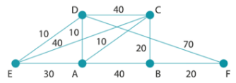{: .center}

  ??? success "❇️ Solution :"
      En suivant la logique de Dijkstra (ou en testant les chemins raisonnables) :
      - Exemple de route typique : **E → D → B → A → C → F** (selon les coûts fournis dans l’énoncé/référence).  
      - **À l’évaluation**, le chemin minimal dépend **strictement** des **pondérations exactes** de ton graphe.  
      👉 Pour ton sujet, applique Dijkstra et additionne les coûts affichés sur **chaque arête** ; choisis la somme **minimale** (et donne la **suite de sommets** correspondante).


---

## <H2 STYLE="COLOR:BLUE;">6. 🧩 Exercices</H2>


!!! info "🧠 => CAPYTALE Le code vous sera donné par votre enseignant"


!!! abstract "**Exercice n°1 : Protocole RIP**"

  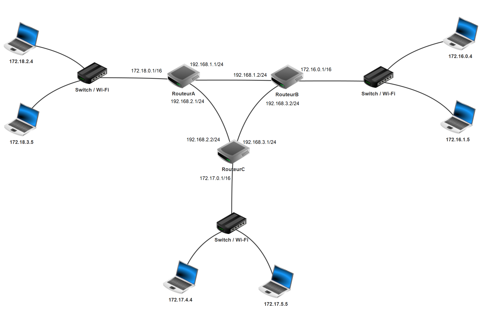{: .center}

  1\. Établir la table de routage du routeur A en vous basant sur le protocole RIP (métrique = nombre de sauts).

  |**Destination**|**Masque**|**Passerelle**|**Interface**|**Distance**|
  | :- | :- | :- | :- | :- |
  ||||||

  2\. Quel est, d’après la table de routage construite ci-dessus, le chemin qui sera emprunté par un paquet pour aller d’une machine ayant pour adresse IP 172.18.1.1/16 à une machine ayant pour adresse IP 172.16.5.3/16?

!!! abstract "**Exercice n°2 : Protocole OSPF**"

  1\. Calculer les coûts des routes suivantes :

  |Route|1|2|3|4|5|6|7|8|
  | :-: | :-: | :-: | :-: | :-: | :-: | :-: | :-: | :-: |
  |Débit|50 kbps|100 kbps|500 kbps|1 Mbps|10 Mbps|100 Mbps|1 Gbps|10 Gbps|
  |Coût|||||||1<sup>(\*)</sup>|1<sup>(\*)</sup>|

  (\*) Le coût ne peut être qu’un nombre entier. Fast Ethernet (100Mbps), Gigabit et 10 Gigas, partagent le même coût.

  2\. Soit le réseau suivant :

  {: .center}

  On donne les débits suivants :

  - Liaison routeur A - routeur B : 1 Mbps.
  - Liaison routeur A - routeur C : 10 Mbps.
  - Liaison routeur C - routeur B : 10 Mbps.

  En vous basant sur le protocole OSPF (métrique = somme des coûts), **déterminer** la table de routage du routeur A

  |**Réseau**|**Métrique**|
  | :-: | :-: |
  |**172.18.0.0/16**||
  |**192.168.1.0/24**||
  |**192.168.2.0/24**||
  |||
  |||
  |||
  |||

  3\. Quel est, d'après la table de routage construite ci-dessus, le chemin qui sera emprunté par un paquet pour aller d'une machine ayant pour adresse IP 172.18.2.4/16 à une machine ayant pour adresse IP 172.16.1.5/16 ? Préciser la métrique.

!!! abstract "**Exercice n°3 : Masque réseau**"

  Trois machines ont respectivement pour adresses IP 90.8.220.5, 90.8.220.33 et 90.8.220.29. Est-ce que ces machines appartiennent toutes les trois au réseau 90.8.220.0/27?

  Sinon combien de routeurs sont nécessaires pour faire communiquer ces machines ? Quelles sont les adresses de leurs cartes réseau (interfaces)?

!!! abstract "**Exercice n°4 : Table de routage**"

  Une machine M1 a pour adresse IP 192.168.1.12 et elle se trouve dans un réseau d’adresses 192.168.1.0/24. Elle est reliée à un routeur qui possède deux interfaces réseau qui ont pour adresses respectives 192.168.1.1/24 et 172.20.121.1/24. Une seconde machine M2 a pour adresse IP 172.20.121.17 et se trouve dans le réseau d'adresses 172.20.121.0/24, reliée au routeur. 

  1\. Compléter la table de routage de ce routeur.

  |Adresse|Masque|Passerelle|Interface|
  | :-: | :-: | :-: | :-: |
  |192.168.1.0||||
  |172.20.121.0||||
  |||||

  2\. Compléter la table de routage de la machine M1.

  |Adresse|Masque|Passerelle|Interface|
  | :-: | :-: | :-: | :-: |
  |192.168.1.0||||
  |0.0.0.0||||
  |||||

  3\. Compléter la table de routage de la machine M2. 

  |Adresse|Masque|Passerelle|Interface|
  | :-: | :-: | :-: | :-: |
  |172.20.121.0||||
  |0.0.0.0||||
  |||||

!!! abstract "**Exercice n°5 : Protocoles RIP**"

  Considérons le réseau suivant, pour lequel on admettra la norme suivante :

  - Le poste client et le poste serveur se voient attribués respectivement la première adresse de la plage de leur réseau (soit respectivement 192.168.1.1 et 172.16.180.1).
  - Les routeurs d'accès R1 et R6 ont sur leur interface réseau les dernières adresses IP de la plage de leur réseau (soit respectivement 192.168.1.254 et 172.16.180.254).
  - Entre deux interfaces internes, le routeur de plus bas indice possède la première adresse et le routeur de dernier indice la seconde adresse : par exemple entre R2 et R5, les interfaces sont connectées par le réseau 10.1.4.0/30, donc l'interface de R2 est 10.1.4.1 et celle de R5 est 10.1.4.2.
  - Tous les routeurs suivent le protocole RIP.

  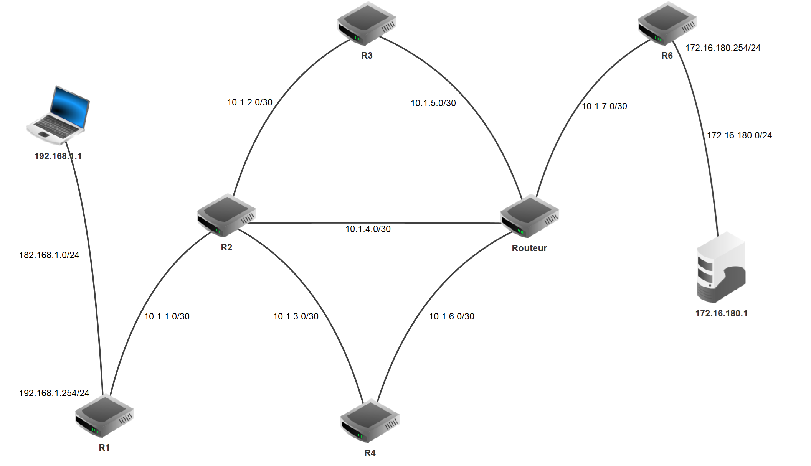{: .center}

  Attribuer les bonnes adresses IP aux interfaces des différents routeurs.

  Déterminer les tables de routage de R1, R2 et R3.

!!! abstract "**Exercice n°6 : Protocole OSPF**"

  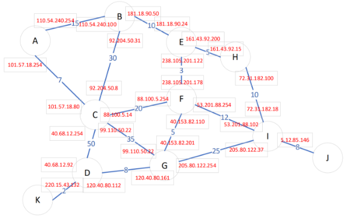{: .center}

  1\.	Un hôte du nœud K envoie un paquet à destination du nœud J, à l’adresse 5.12.85.26. Quelle va être la route suivie par ce paquet?

  a)	Avec le protocole RIP?

  b)	Avec le protocole OSPF?

  2\.	Un hôte du nœud A envoie un paquet à destination du nœud J, à l’adresse 5.12.85.26. Quelle va être la route suivie par ce paquet avec le protocole OSPF?

  3\. On admet que tous les sous-réseaux ont pour masques 255.255.255.0. Déterminer la table de routage du routeur A avec le protocole OSPF en lettre (Compléter le tableau suivant)

  Destination	Passerelle	Métrique

  4\. Déterminer la table de routage du routeur A avec le protocole OSPF en IP

  IP destination	   Masque	        Passerelle	        Interface	        Métrique

!!! abstract "**Exercice n°7 : Réseaux**"

  Un réseau est constitué de 6 routeurs R1 à R6 dont on donne des tables de routage simplifiées. Les réseaux ont tous pour masque 255.255.255.0. La colonne M est la métrique utilisée.

  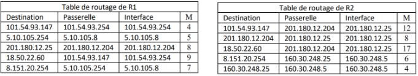{: .center}

  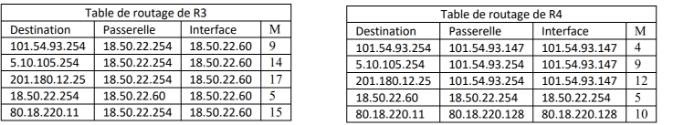{: .center}

  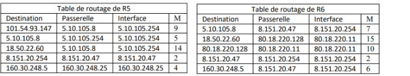{: .center}

  1\.	Indiquer la route décrite par un paquet envoyé du routeur R1 au routeur R6.

  2\.	Indiquer la route décrite par un paquet envoyé du routeur R2 au routeur R3.

  3\.	Représenter ce réseau sous forme de graphe.

!!! abstract "**Exercice n°8 : Adressage IP**"

  1\. L’adresse IPv4 d’un réseau est 192.168.56.0/24. Combien de bits sont-ils dédiés à la partie réseau? Combien de machines peut-on incorporer à ce réseau?

  2\. Quel est le masque de réseau de l’adresse de la question 1?

  3\. Quelle est la première adresse utilisable sur le réseau de la question 1? La dernière?

  4\. Écrire l’adresse IPv4 222.1.1.20, de masque 255.255.255.192 en notation CIDR (c'est à dire en /x).

  5\. Écrire l’adresse IPv4 135.1.1.25, de masque 255.255.248.0 en notation CIDR (c'est à dire en /x)****.

  6\. Sur un ordinateur dont le système d’exploitation est Linux, la commande `ifconfig` retourne l’adresse IPv4 172.16.20.234 et le masque 255.255.0.0. Quelle est l’adresse réseau du réseau auquel cet ordinateur appartient?

  7\. Combien d’ordinateurs peut-on incorporer au réseau de la question précédente?

  8\. L’adresse IPv4 d’un ordinateur est 172.16.20.234/22. Combien d’ordinateurs peut-on incorporer à ce réseau?

  9\. Quelle est la première adresse utilisable sur le réseau de la question précédente? La dernière?
