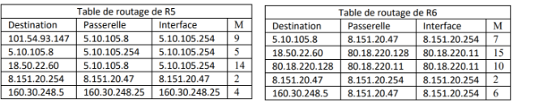

**Table des matières**

[1.	Historique](#_toc154844728)

[2.	Rappels de première](#_toc154844729)

[3.	Tables de routages et le routage statique](#_toc154844742)

[4.	Le routage dynamique RIP (Routing Information Protocol)](#_toc154844745)

[5.	Le routage dynamique OSPF (Open Shortest Path First)](#_toc154844749)

[6.	Exercices](#_toc154844753)

**Compétences évaluables :**

- Identifier, suivant le protocole de routage utilisé, la route empruntée par un paquet


## <a name="_toc154844728"></a>**1. Historique** 
Le réseau ARPANET, ancêtre de l’Internet, date de **1969**. C’est le premier réseau qui a utilisé un système à base de paquets pour le transfert de données.

Le premier message est envoyé le 29 octobre 1969 entre l’université UCLA de Californie et l’institut de recherche de Stanford.

## <a name="_toc154844729"></a>**2. Rappels de première**
### <a name="_toc154844730"></a>**2.1. Les différentes couches**

|<p>Les règles de communications (**Protocoles**) entre ordinateurs doivent se soumettre à certaines contraintes pour que les réseaux soient compatibles entre eux.</p><p>Le **modèle TCP / IP** est un modèle en couches. Chaque couche ne peut communiquer qu'avec la couche immédiatement **inférieure** ou **supérieure**.</p><p>On retrouve **deux notions** très importantes pour obtenir un système stable :</p><p>1. **Encapsulation** : chaque tâche est encapsulée dans une couche.</p><p>2. **Interface** : chaque couche communique avec ses couches voisines en utilisant uniquement l'interface.</p><p>A part cela, les couches sont **indépendantes** : tant que son interface reste la même, on peut changer le code interne d'une couche sans risques </p>||
| - |


### <a name="_toc154844731"></a>**2.2. La couche application**

|<p>- **La couche application** : Son rôle est principalement de **choisir le mode de transmission** (ce sont des protocoles comme http, https, ftp, smtp....)</p>|
| - |


{: .center}
**Exemple** : Votre navigateur Web (par exemple Firefox) veut communiquer avec le serveur HTTP servant le site elisa.leprettre.free.fr

Pour cela, les deux programmes (le **client HTTP** et le **serveur HTTP**) respectent un **langage commun : le HTTP.**

{: .center}

Un **programme-serveur** tourne sur une machine distante et il est identifié par un **PORT** sur cet **ordinateur** qu'on appelle serveur. Le PORT typique est **80 pour http** et **443 pour https**.

**Quels types de requêtes peut-on avoir ?**

- **Méthode GET : paramètres dans l'URL** : La méthode GET permet de discuter très facilement avec le serveur puisqu'on peut placer les paramètres qu'on veut lui transmettre directement dans l'URL.

- **Méthode POST : paramètres dans le body de la requête** 

La méthode GET est **pratique** mais si vous devez envoyer beaucoup de données, l'URL va être très longue.
Autre désavantage : si vous passez un mot de passe en GET en https, le message est crypté OK. Personne ne peut lire votre mot de passe sur le réseau. C'est vrai. Mais le mot de passe sera noté en clair dans votre URL.

Dans ces deux cas, on préférera la méthode de transfert vers le serveur en **POST** : cette fois, le client va transmettre les données fournies (paramètres, fichiers...) dans le BODY. C'est pour cela que le BODY de la méthode GET est vide. On n'y place rien.

Quelle que soit la requête, le navigateur, ici Firefox, va mettre en forme les données que vous voulez envoyer en respectant le protocole HTTP.

Le **protocole HTTP** fait donc parti de la **couche APPLICATION** : il définit comment deux applications peuvent discuter en respectant des règles de communications communes : le **protocole**.

Mais ce n'est pas le programme FIREFOX lui-même qui va directement envoyer le message au serveur.

Non, il va simplement envoyer son message (mis en forme en respectant HTTP) à la couche du dessous : la couche **TRANSPORT**.

### <a name="_toc154844732"></a>**2.3. La couche transport**

|<p>**La couche transport :** Une fois choisi le mode de transport,  cette couche est chargée **de le mettre en œuvre.**</p><p></p><p>En gros deux protocoles sont disponibles : **UDP** (User Datagram Protocol) et **TCP** (Transmission Control Protocol).</p><p></p><p>- TCP est un **protocole fiable**, qui permet l'acheminement sans erreur de données issues d'une machine à une autre machine. Son **rôle est de fragmenter le message** à transmettre de manière à pouvoir le faire passer sur la couche internet. A l'inverse, sur la machine destination, TCP replace dans l'ordre les fragments transmis sur la couche internet pour reconstruire le message initial.</p><p>- UDP est en revanche un protocole plus simple que TCP. Son utilisation présuppose que l'on n'a **pas besoin de la conservation de l'ordre de remise** des paquets. Il n'y a pas vérification de l'arrivée de tous les paquets, ( très utile pour la transmission de vidéos...)</p>|
| - |


**Que va faire la couche TRANSPORT du message que lui envoie Firefox ?**

{: .center}


- Premièrement, elle **découpe le message** en plusieurs sous-messages si le message du base est trop gros.

  {: .center}

- Ensuite, elle **identifie chaque programme** (émetteur et récepteur) avec un identifiant. L'identifiant de la couche TRANSPORT est le **PORT**, un simple numéro encodé sur 2 octets (donc entre 1 et 65535). 

- A l'aide des sous-messages et des informations sur les PORTS, la couche **crée ensemble de segments TCP**.

|<p>**Un segment TCP :** C'est l'un des sous-messages précédé d'informations supplémentaires qu'on nomme l'**en-tête TCP**. Notamment (mais pas que)</p><p>- Le **PORT de l'application Source** du message (SRC) [ ce PORT est encodé sur les deux premiers octets ]</p><p>- Le **PORT de l'application Destinataire** du message (DST) [ce PORT est encodé sur les deux octets suivants]</p><p>- Un moyen d'identifier le **numéro du segment** par rapport aux autres (Séquence) [...]</p><p>- et d'autres choses encore ...</p>|
| - |


On connaît la structure de l'en-tête bit par bit et qu'on peut donc récupérer facilement les données à l'intérieur. On va simplement noter cet en-tête TCP par un rectangle jaune.

{: .center}

A présent on a plein de segments dont on connaît l'expéditeur et le destinataire. **Mais comment trouver la bonne machine ?**

C'est simple : la **couche TRANSPORT** ne sait pas faire. Alors elle délègue à la **couche RESEAU** qu'on nomme également couche **INTERNET**.

### <a name="_toc154844733"></a>**2.4. La couche réseau ou internet**
#### <a name="_toc154844734"></a>**2.4.1. Réseau et IP**

|<p>- **La couche internet :** Cette couche réalise **l'interconnexion** des réseaux et ce **à l'aide du protocole IP** (Internet Protocol). Elle permet d'acheminer les données au bon destinataire dans le réseau, en laissant aux couches supérieures le soin de les réordonner (TCP) et de les interpréter (Application)</p>|
| - |


**Exemple** :

Cette couche est considérée comme un aiguilleur. Elle se charge de savoir si le message est à destination: 

- de la **même machine** (ici A9 à un message pour A9): elle va envoyer le message vers la **couche APPLICATION**

  {: .center}

- d'une machine qui **appartient au même réseau** que la machine elle-même (ici A9 à un message pour A2): on sait alors qu'on peut envoyer le message à la couche RESEAU du destinataire via sur le réseau interne

  {: .center}

- d'une machine qui **n'appartient pas au même réseau** (ici A18 à un message pour B7): on sait qu'il faut envoyer le message vers un réseau externe.

{: .center}

#### <a name="_toc154844735"></a>**2.4.2. Et comment fait cette couche pour savoir si le destinataire est sur le réseau interne ou s'il faut sortir du réseau actuel?**

|<p>**Adresse IP = Adresse réseau + Adresse machine**</p><p>La couche RESEAU / INTERNET peut identifier les machines à l'aide de l’adresse IP. Il est totalement impossible qu'une machine connaisse les adresses de TOUTES les autres machines branchées sur INTERNET. </p><p>Du coup, cette adresse IP est en réalité composée de deux parties.</p><p>- Une **adresse réseau** qui identifie le réseau auquel appartient la machine</p><p>- Une **adresse machine** qui identifie la machine elle-même sur ce réseau</p><p>Qu'on soit en IP version 4 ou en IP version 6, **il existe un mécanisme permettant de savoir si l'adresse de destination est sur le même réseau que l'ordinateur actuel** ou si l'ordinateur de destination est en dehors du réseau actuel.</p>|
| - |


#### <a name="_toc154844736"></a>**2.4.3. Qui attribue les adresse IP ?**

|<p>**Attribution des adresses IP** : Tout ordinateur se connecte sur un réseau via une carte réseau. Cette carte réseau possède un numéro d'identification unique : **l'adresse mac.** Une table de correspondance entre les adresses MAC et les adresses IP est maintenue à jour par le protocole de résolution d’adresses **ARP**.</p><p>Notre ordinateur via sa carte se connecte sur un réseau ( via un routeur) qui se connecte sur un autre réseau etc....</p><p>Pour simplifier : c'est le **serveur DHCP** (Dynamic Host Configuration Protocol) qui est chargé de délivrer une adresse IP.</p>|
| - |

#### <a name="_toc154844737"></a>**2.4.4. Comment savoir à quel réseau appartient une machine ?**

Une **adresse IP** est accompagnée d'un **masque sous réseau**. Un masque sous réseau est de la forme : 255.0.0.0 ou 255.255.0.0 ou encore 255.255.255.0.  On utilise à présent la « notation CIDR » (*Classless Inter-Domain Routing*). 

**Par exemple** IP : 192.168.0.5/16 (masque : 255.255.0.0) 

Signifie que c'est la machine 0.5 dans le réseau **192.168**.0.0. 

La machine dont l'adresse IP est **192.168**.1.6/16, fait partie du même réseau que la précédente. C'est à dire la machine 1.6 du réseau **192.168**.0.0 

Alors que la machine **192.168.1.**6/24 fait partie d'un autre réseau (**192.168.1**.0) (c'est la machine 6 du réseau **192.168.1**.0)

**Comment déterminer l'adresse du réseau de cette machine ?** L'adresse réseau de cette machine est le résultat du ET logique appliqué entre l'adresse IP et le masque. ..... c'est à dire ?

Considérons la machine dont la configuration réseau est : 172.128.10.5 **/18**; (Masque **:** 255.255.192.0)

On obtient **l'adresse du sous réseau** avec l'opérateur AND et on obtient **l'adresse de la machine** (l'hôte) dans le sous réseau avec le AND du complément du masque. Écrivons en binaire l'adresse IP et le masque :
```
172.128.10.5
s'écrit en binaire :
10101100 . 10000000 . 00001010 . 00000101

Le masque de sous réseau s'écrit en binaire :
11111111 . 11111111 . 11000000 . 00000000
```

Posons l'opération du ET logique entre ces deux écritures :
```
     10101100 . 10000000 . 00001010 . 00000101
ET   11111111 . 11111111 . 11000000 . 00000000
--------------------------------------------------
     10101100 . 10000000 . 00000000 . 00000000     
```

On met en décimal le résultat : **172.128.0.0 qui est l'adresse du réseau**.

**Pour ce réseau, combien d'adresse sont utilisables ?** 

Reprenons l'écriture en binaire du masque. On observe que nous pouvons la découper en deux parties ( en partant de la droite ) Une partie avec que des 0 et le reste
```
11111111 . 11111111 . 11 <---> 000000 . 00000000
```
On peut aller de 000000 . 00000000 à 111111 . 11111111. En décimal : de 0 à 16383 C'est à dire 16384 adresses possibles.... soit 2^14 = 16 384

Enfin pas tout à fait :

- Il faut retirer l'adresse du réseau lui-même : 172.128.0.0
- Il faut également retirer (la dernière ) l'adresse de broadcast (adresse réservée pour une diffusion sur toutes les machines du réseau)

Donc en tout : 16382 machines

**Quelle est l'adresse de broadcast ?**

L'adresse de **broadcast** qui permet d'envoyer des données à toutes les machines du sous réseau (pour l'apprentissage du réseau par exemple et créer la table de routage). L'adresse de broadcast est la dernière adresse disponible, on remplit de 1 à droite.

Pour la déterminer on fait le complément à 255 de la partie sous-réseau..., c'est à dire :
```
            réseau        sous-réseau
            -------------|----------
réseau    : 172  .  128  .  0  .  0
masque    : 255  .  255  . 192 .  0
broadcast : 172  .  128  . 63  . 255 (192+63 = 255 et 0+255 = 255)
```


Donc la plage d'adresse disponible est de **172 . 128 . 0 . 1 à 172 . 128 . 63 . 254**

#### <a name="_toc154844738"></a>**2.4.5. Le protocole DNS (Domain Name Server)**

|<p>Dans la réalité, on ne tape pas l'adresse IP de tel ou tel site. On écrit une adresse du type : www.google.fr. C'est un nom de domaine qui est associé à une adresse IP.</p><p>Cette association est réalisée par un **serveur DNS**</p>|
| - |


#### <a name="_toc154844739"></a>**2.4.6. Qu’est-ce qu’un paquet IP ?**

|<p>**Un paquet IP :** La couche **RESEAU** reçoit les segments que la couche **TRANSPORT** lui a fourni. Elle ne les envoie pas directement : les segments ne contiennent pas l'adresse IP du destinataire !</p><p>On prend donc le segment et on lui rajoute un **en-tête IP.**</p><p></p>|
| - |

|<p>**L'en-tête IP** : L'en-tête IP est un ensemble d'information qu'on va placer devant le segment TCP.</p><p>Comme l'en-tête TCP, il s'agit **d'informations encodées** sur un nombre spécifique d'octets et décodables facilement.</p><p>Le contenu exact de l'en-tête va dépendre du système d'adressage utilisé : IPv4 ou IPv6 par exemple.</p>|
| - |

 

|<p>**Que rajoute-on dans cet en-tête ?**</p><p>- L'adresse IP destination (4 octets en IPv4, 16 octets en IPV6). On la place en premier car c'est la première chose qu'un routeur doit lire. </p>||
| - | - |
|- L'adresse IP source (4 octets en IPv4, 16 octets en IPV6). Sans cela, on ne pourrait pas répondre au message.||
|- Un compteur nommé TTL (Time to Live) en IPv4 ou Hop Limit en IPv6 (1 octet dans les deux cas) : c'est un compteur qui décroit de 1 à chaque fois que le paquet est transféré par un routeur. Arrivé à 1, le paquet n'est plus déplacé et part juste à la poubelle.||
| - | - |


|<p>Il existe bien entendu encore d'autres données dans cet en-tête mais nous allons nous limiter à ceux-ci.</p><p>Ils permettent de comprendre l'essentiel du protocole.</p><p></p>|
| - |


On symbolisera donc le paquet IP à l'aide d'un symbole plus symbolique. Par exemple :

{: .center}

**Activité n° 1 :**  La machine d'adresse IP v4  70.30.20.145 /16  veut joindre la machine d'adresse IP  70.30.21.5 . Comment sait-on s'il faut rester dans le réseau actuel ou quitter le réseau ?

**Activité n° 2 :**  La machine d'adresse IP v4  70.30.20.145 /24  veut joindre la machine d'adresse IP  70.30.21.5 . Comment sait-on s'il faut rester dans le réseau actuel ou quitter le réseau ?

**Activité n° 3 :**  La machine d'adresse IP v4  20.30.40.50  et de masque  255.0.0.0  veut joindre la machine d'adresse IP  20.200.100.5 . Comment sait-on s'il faut rester dans le réseau actuel ou quitter le réseau ?

**Activité n° 4 :**  La machine d'adresse IP v4  90.80.20.120  et de masque  255.255.255.0  veut joindre la machine d'adresse IP  90.80.20.5 . Comment sait-on s'il faut rester dans le réseau actuel ou quitter le réseau ?

**Activité n° 5 :**  La machine d'adresse IP v6  2a01:cb0c:96ac:d400:63ba:f65c:3616:15d4  veut joindre la machine d'adresse IP  2a01:cb0c:96ac:d400:73ba:12e3:3616:45a1 . Comment sait-on s'il faut rester dans le réseau actuel ou quitter le réseau ?

#### <a name="_toc154844740"></a>**2.4.7. Les pertes de paquets**

|<p>Il se peut, et cela est courant que des paquets se perdent...</p><p>Les causes possibles sont nombreuses :</p><p>- Engorgement d'un serveur</p><p>- Délai d'attente trop long</p><p>- etc.</p><p>Le protocole TCP contrôle l'envoi et la bonne réception des paquets avec des accusés de réception (**ACK : acknowledgement** ou acquittement en Français ). Ce processus d'acquittement permet de détecter les pertes de paquets.</p>|
| - |


#### <a name="_toc154844741"></a>**2.4.8. Le protocole de bit alterné**

Considérons deux ordinateurs A et B.

- Au moment d'émettre une trame, A va lui ajouter un bit ( 0 ou 1) appelé drapeau( flag)
- Dès cette trame reçue, B envoie un accusé de réception en ajoutant un bit (1 ou 0)

**La règle :** la première trame envoyée par A aura pour drapeau 0, dès cette trame reçue par B, ce dernier va envoyer un accusé de réception avec le drapeau 1 (ce 1 signifie "la prochaine trame que A va m'envoyer devra avoir son drapeau à 1").

Dès que A reçoit l'accusé de réception avec le drapeau à 1, il envoie la 2e trame avec un drapeau à 1, et ainsi de suite...
```
A------Trame1/0---->B
A<-----ACK/1--------B
A------Trame2/1---->B
A<-----ACK/0--------B
A------Trame3/0---->B
A<-----ACK/1--------B
```

etc...

Le système de drapeau est complété avec un **système d'horloge** côté émetteur. Un "chronomètre" est déclenché à chaque envoi de trame, si au bout d'un certain temps, l'émetteur n'a pas reçu un acquittement correct (avec le bon drapeau), la trame précédemment envoyée par l'émetteur est considérée comme perdue et est de **nouveau envoyée**.

**Exemple 1 :**
```
A------Trame1/0 xx B ( la trame 1 s'est perdue )
-----------------------
Le temps est écoulé
A------Trame1/0---->B (la trame1 est renvoyée)
A<-----ACK/1--------B
```
**Exemple 2 :**
```
A------Trame1/0---->B
A< xx ACK/1--------B ( l'accusé réception s'est perdu)
-----------------------
Le temps est écoulé
A------Trame1/0---->B (la trame est renvoyée)
A<-----ACK/1--------B
```


**Les limites** : Dans certaines situations, le protocole de bit alterné ne permet pas de récupérer les trames perdues, c'est pour cela que ce protocole est aujourd'hui remplacé par des protocoles plus efficaces, mais aussi plus complexes. 

Un exemple de données définitivement perdues

{: .center}


En **conclusion** :

{: .center}

## <a name="_toc154844742"></a>**3. Tables de routages et le routage statique**
### <a name="_toc154844743"></a>**3.1. Les chemins dans le réseau**
On a donc un paquet IP qui contient l'adresse IP du **destinataire** et l'adresse de l'expéditeur initial

{: .center}

Il n'y a plus qu'à envoyer le message. La difficulté est qu'on ne peut donner le message qu'à un autre ordinateur avec qui on est en liaison directe. Nous allons donc voir à quel **intermédiaire de communication** (ou **passerelle**) transférer ce paquet IP pour qu'il parvienne à destination.

|<p>La **couche RESEAU et son protocole IP** se charge justement de savoir qui doit gérer le paquet ensuite, qui est la prochaine passerelle.</p>|
| - |


### <a name="_toc154844744"></a>**3.2. Les tables de routage**
|<p>Voici comment se présente une table de routage :</p><p>1. Une colonne **IP Destinataire** permet d'identifier l'adresse IP de destination (et donc le réseau de destination)</p><p>2. Une colonne **Passerelle** : **C'est l'adresse IP de la carte réseau du routeur** **à qui on va confier le paquet**, si on n'est pas capable de le délivrer directement (donc si l'adresse IP de destination n'est pas dans notre propre sous-réseau). Cette adresse de passerelle n'est donc pas *systématiquement* mentionnée. Quand elle l'est, elle donne le renseignement sur le prochain routeur à qui le paquet est confié.</p><p>3. une colonne **Interface** : On parle également d'interface d'entrée/sortie. c'est **l'adresse IP de la carte réseau du routeur par où va sortir** le paquet à envoyer. Il y a donc **toujours** une adresse d'interface à renseigner. Parfois cette interface sera juste nommée *interface1* ou *interface2*.</p>|
| - |

{: .center}

Dans le réseau ci-dessus, si l'ordinateur d'adresse 192.168.0.5 veut interroger le serveur 10.7.3.8 :

\- l'adresse 10.7.3.8 **n'étant pas dans le sous-réseau F** (d'adresse 192.168.0.0 / 24), la requête est confiée au routeur **via son adresse passerelle dans le réseau F (ici 192.168.0.254)**.

\- le routeur observe si l'IP recherchée appartient à un autre des sous-réseaux auquel il est connecté. Ici, l'IP recherchée 10.7.3.8 **n'appartient ni au sous-réseau A ou E**.

\- le routeur va donc regarder dans sa table de routage **l'adresse passerelle d'un autre routeur** vers qui elle doit rediriger les données. 

  - **Si le sous-réseau C fait partie de sa table de routage**, le routeur R1 saura alors que le meilleur chemin est (par exemple) de confier les données au routeur R3.

  - **si le sous-réseau C ne fait pas partie de la table de routage**, le routeur R1 va alors le rediriger vers une route «par défaut» (que l'on peut assimiler au panneau «toutes directions» sur les panneaux de signalisation).

**Exemple: table de routage du routeur R1**

|**Destination**|**Interface**|**Passerelle**|
| - | - | - |
|F|192\.168.0.254||
|A|10\.0.5.152||
|E|172\.17.1.254||
|B|172\.17.1.254|172\.17.1.123|
|C|10\.0.5.152|10\.0.5.135|
||||

Les trois réseaux F, A et E sont directement accessibles au routeur R1, puisqu'il en fait partie : il n'a donc **pas besoin d'adresse passerelle** pour communiquer avec ces réseaux.

Par contre, la communication avec le réseau B nécessite de confier le paquet au routeur R2 (c'est le choix de cette table de routage). Il faut donc mentionner **l'adresse IP de ce routeur R2** (172.17.1.123), qu'on appelle **adresse de passerelle**.

De la même manière, la communication avec le réseau C nécessite de confier le paquet au routeur R3 (c'est le choix de cette table de routage). Il faut donc mentionner **l'adresse IP de ce routeur R3** (10.0.5.135)

|<p>**Comment sont construites les tables de routage ?**</p><p>- Soit à la main par l'administrateur réseau, quand le réseau est petit : on parle alors de table **statique**.</p><p>- Soit de manière **dynamique** : les réseaux s'envoient eux-mêmes des informations permettant de mettre à jour leurs tables de routages respectives. Des algorithmes de détermination de meilleur chemin sont alors utilisés : nous allons en découvrir deux, le **protocole RIP et le protocole OSPF.**</p>|
| - |


## <a name="_toc154844745"></a>**4. Le routage dynamique RIP (Routing Information Protocol)**
### <a name="_toc154844746"></a>**4.1. Le principe du routage RIP**

Le **Routing Information Protocol (RIP)** est basé sur **l'échange** (toutes les **30 secondes**) des tables de routage de chaque routeur.

Au début, chaque routeur ne connaît **que les réseaux auquel il est directement connecté**, associé à la **distance 1.**

Ensuite, chaque routeur **va recevoir** périodiquement (toutes les 30 secondes) la table des réseaux auquel il est connecté, et mettre à jour sa propre table suivant les règles ci-dessous :

- s'il découvre une route vers un **nouveau réseau inconnu**, il **l'ajoute à sa table en augmentant de 1** la distance annoncée par le routeur qui lui a transmis sa table.

- s'il découvre une route vers un **réseau connu mais plus courte** (en rajoutant 1) que celle qu'il possède dans sa table, **il actualise sa table.**

- s'il découvre une route vers un **réseau connu mais plus longue** que celle qu'il possède dans sa table, il **ignore cette route**.

- s'il reçoit une route vers un **réseau connu** en provenance d'un routeur déjà existant dans sa table, il **met à jour sa table** car la topologie du réseau a été modifiée.

- si le réseau n'évolue pas (dûs à une panne ou ajout de nouveau matériel), les tables de routage ***convergent*** vers une **valeur stable**. Elles n'évoluent plus.

- si un routeur ne reçoit pas **pendant 3 minutes** d'information de la part d'un routeur qui lui avait auparavant communiqué sa table de routage, ce routeur est considéré comme en panne, et toutes les routes passant par lui sont affectées de la **distance infinie** : 16.


**Remarques et inconvénients:**

- Le protocole RIP n'admet qu'une distance maximale égale à 15 (ceci explique que 16 soit considéré comme la distance infinie), ce qui le limite aux réseaux de petite taille.
- Chaque routeur n'a jamais connaissance de la topologie du réseau tout entier : il ne le connaît que par ce que les autres routeurs lui ont raconté. On dit que ce protocole de routage est du *routing by rumor*.
- La *métrique* utilisée (le nombre de sauts) ne tient pas compte de la qualité de la liaison, contrairement au protocole OSPF.

**Activité n° 6 :**  Routage RiP

{: .center}

1\. Pour chaque sous-réseau situé entre deux routeurs, donner la première adresse utilisable pour adresser une machine et la dernière.
2\. Attribuer aux différentes interfaces des routeurs des adresses.
3\. Donner la table de routage du routeur R1​ à son initialisation. Ajouter une colonne distance.

|**Destination**|**Masque**|**Passerelle**|**Interface**|**Distance**|
| :- | :- | :- | :- | :- |
|||||

**Remarque :** Pour simplifier la lecture, ne rien écrire dans la colonne Passerelle si celle-ci est le routeur lui-même. De plus, ne pas prendre en compte l’adresse de loopback et la route par défaut.

4\. Même question pour le routeur R3​ et le routeur R2

5\. Donner la table de routage du routeur R1​ si on imagine qu’il a d’abord échangé une demande RIP avec le routeur R3

6\. Donner la table de routage du routeur R1si on imagine qu’il a ensuite échangé une demande RIP avec le routeur R2

7\. Quelle est la table de routage finale pour le routeur R1​.

8\. Quel chemin vont suivre les paquets entre PC1 et PC2 ?


### <a name="_toc154844747"></a>**4.2. Métrique maximale**

**Métrique maximale :** Pour limiter le nombre de routes inutiles et limiter la taille des messages RIP sur le réseau, on considère qu'une **métrique de 16** correspond à une **route impossible à atteindre**.


**Par exemple :** Sur un ordinateur relié à une box internet dans un réseau privé, on obtient par exemple la table de routage qui suit, résultat de la commande route print sous Windows. Par exemple : IPv4 Table de routage
```
===========================================================================
Itinéraires actifs :
Destination réseau    Masque réseau  Adr. passerelle   Adr. interface Métrique
          0.0.0.0          0.0.0.0    192.168.1.254    192.168.1.138     55
        127.0.0.0        255.0.0.0         On-link         127.0.0.1    331
        127.0.0.1  255.255.255.255         On-link         127.0.0.1    331
  127.255.255.255  255.255.255.255         On-link         127.0.0.1    331
      192.168.1.0    255.255.255.0         On-link     192.168.1.138    311
    192.168.1.138  255.255.255.255         On-link     192.168.1.138    311
    192.168.1.255  255.255.255.255         On-link     192.168.1.138    311
        224.0.0.0        240.0.0.0         On-link         127.0.0.1    331
        224.0.0.0        240.0.0.0         On-link     192.168.1.138    311
  255.255.255.255  255.255.255.255         On-link         127.0.0.1    331
  255.255.255.255  255.255.255.255         On-link     192.168.1.138    311
===========================================================================
```


Les adresses commençant par 127, ou par 224 ou par 255 et celles se terminant par 255 sont spécifiques au loopback, au multicast et au broadcast. Il reste :
```
===========================================================================
Itinéraires actifs :
Destination réseau    Masque réseau  Adr. passerelle   Adr. interface Métrique
          0.0.0.0          0.0.0.0    192.168.1.254    192.168.1.138     55
      192.168.1.0    255.255.255.0         On-link     192.168.1.138    311
    192.168.1.138  255.255.255.255         On-link     192.168.1.138    311
===========================================================================
```

Pour effectuer un envoi, la machine examine les lignes du tableau selon l’ordre des masques du plus grand au plus petit. Ici 255.255.255.255, puis 255.255.255.0 et enfin 0.0.0.0.

- Si le destinataire est la machine qui a pour IP 192.168.1.138 (masque 255.255.255.255), l’interface utilisé a pour adresse 192.168.1.138 c’est la **même machine**.
- Si le destinataire a pour IP 192.168.1.0 avec le masque 255.255.255.0, il s’agit du réseau local auquel est connectée la machine, et l’interface utilisé a pour adresse 192.168.1.138. C’est encore la **même machine**.
- Si le destinataire a pour IP 0.0.0.0, avec le masque 0.0.0.0, il s’agit de toutes les autres adresses possibles. L’interface utilisée a pour adresse 192.168.1.138 c’est la machine locale, mais il faut sortir du réseau local et passer par la passerelle, qui appartient au réseau local, d’adresse 192.168.1.254. Autrement dit, la destination 0.0.0.0 avec le masque 0.0.0.0 propose **une route par défaut**, si aucune autre route n’a été trouvée.

Précision : la mention **On-link** pour l’adresse de la passerelle, indique que la route cherchée est sur le réseau auquel est connectée la machine émettrice.

### <a name="_toc154844748"></a>**4.3. Conclusion sur le protocole RIP**
- **Rôle** : aucun routeur n'a de rôle prépondérant dans le système autonome (à part le fait que certains soient en liaison avec l'extérieur par exemple) : **RIP** utilise un **algorithme totalement réparti**
- **Métrique** : La métrique utilisée pour définir les distances est simplement **le nombre de sauts**
- **Informations transmises** : c'est un protocole à **vecteur de distance** : chaque routeur transmet toutes les 30s à ses voisins directs l'ensemble des couples **(destination;distance)** qu'il connait. Chaque routeur reçoit les informations de ses voisins, rajoute simplement 1 à leurs métriques (pour prendre en compte le saut supplémentaire vers eux) et garde les meilleurs choix de passerelles pour les différentes destinations : celles dont la métrique est la plus basse.
- **Connaissance du réseau** : **RIP** ne permet pas aux routeurs d'avoir une vision globale du réseau et de choisir certains chemins : on décide juste de la passerelle suivante à qui on transmet le paquet. Chaque routeur ne connait donc que ses voisins directs et sait auquel transmettre un paquet IP pour une destination donnée. 
- **Taille** : RIP ne permet pas de gérer des systèmes autonomes comportant des routeurs situés à plus de 15 sauts l'un de l'autre (sinon, le réseau serait encombré par les messages RIP et n'aurait plus le temps de gérer les vrais messages !)
- **Mise en place** : **RIP** met du temps à se mettre en place car la connaissance des nouvelles routes se fait de proche en proche, un nouveau saut uniquement toutes les 30s. Ici le routeur central va mettre 90s à apprendre l'existence des routeurs Gauche et Droite. Et le routeur Droite va donc devoir attendre encore 90s pour apprendre l'existence du routeur Gauche !


## <a name="_toc154844749"></a>**5. Le routage dynamique OSPF (Open Shortest Path First)**
### <a name="_toc154844750"></a>**5.1. Le principe du routage OSPF**

Dans le **protocole OSPF (*Open Shortest Path First*)**, comme dans le cas du protocole RIP, les routeurs échangent entre eux des informations, mais ces échanges sont plus « intelligents » dans le cas d’OSPF, permettant ainsi de réduire l’occupation du réseau.

- Tous les routeurs ont une **vision globale** et **identique** du réseau : pour cela, ils reçoivent des informations depuis tout le réseau

- Les distances prennent en compte le nombre de routeur à traverser (nombre de sauts), mais également le **débit binaire** de chaque « câble » (appelé aussi **bande passante**), exprimé en bits/s.

Le protocole OSPF permet à chaque routeur de connaitre le graphe complet des liaisons entre tous les routeurs du réseau, avec leur débits.

Ainsi, le « meilleur » chemin n’est pas forcément le plus court, mais le plus rapide.


### <a name="_toc154844751"></a>**5.2. Le métrique d’OSPF**

**Bande Passante et débit** : La **bande passante** caractérise la valeur maximale d'une communication entre deux ordinateurs, exprimée en bit.s<sup>-1</sup>.

Le **débit** caractérise lui la valeur réelle de cette capacité de transmission. Le débit est donc inférieur à la bande passante.

{: .center}


**Métrique OSPF :** OSPF (Open Shortest Path First) utilise le coût entre deux routeurs comme paramètre de sa métrique : plus la liaison est rapide, plus la valeur utilisée sera petite. 
Sur la plupart des systèmes travaillant en OSPF, la valeur de référence par défaut est actuellement de  1.10<sup>8</sup> .

Avec cette valeur de référence, on obtient alors :

$Coût=\frac{10^8}{débit(b/s)}$

Particularité d'OSPF : on arrondit les coûts à l'entier. Le coût des liaisons transmises est un entier compris entre 1 et 65535.

Cette formule de calcul peut être différente suivant les exercices, et sera systématiquement redonnée. 


**Activité n° 7 :**  Calculer la métrique OSPF d'une liaison Fibre (1 Gbit/s) avec une valeur par défaut de 10<sup>8</sup>.

**Activité n° 8 :**  Calculer la métrique OSPF d'une liaison FastEthernet (100 Mbit/s) avec une valeur par défaut de 10<sup>8</sup>.

**Activité n° 9 :**  Calculer la métrique OSPF d'une liaison Ethernet (10 Mbit/s) avec une valeur par défaut de 10<sup>8</sup>

**Activité n° 10 :**  Que vaut la bande passante d'une liaison dont le coût OSPF est de 50 avec une valeur de référence de 10<sup>8</sup>.

**Activité n° 11 :**  Un routeur A3 fonctionnant sous OSPF reçoit les informations suivantes :

- Liaison A - B avec un coût de 1

- Liaison A - C avec un coût de 1000

- Liaison A - D avec un coût de 100

- Liaison B - D avec un coût de 10

- Liaison C - E avec un coût de 200

- Liaison C - F avec un coût de 100

- Liaison D - E avec un coût de 1

- Liaison E - G avec un coût de 100

- Liaison F - G avec un coût de 10

Représenter le tout sous forme d'un graphe où les sommets sont les routeurs et les arcs portent les coûts.

**Activité n° 12 :**  Quel est le coût de la liaison AE ? Calculer toutes les routes possibles et choisir celle qui présente le coût le plus faible.

Question supplémentaire : contrairement au cas RIP, le routeur A a-t-il les moyens de connaitre la route que va suivre le paquet le long du trajet A vers E ?


### <a name="_toc154844752"></a>**5.3. L’algorithme de Dijkstra**
L’algorithme de Dijkstra permet de résoudre un problème algorithmique : le problème du plus court chemin.

Le principe de l’algorithme est de chercher à chaque étape le plus court chemin.

On souhaite aller de la ville A à la ville G en empruntant le plus court chemin :

{: .center}

|A|B|C|D|E|F|G|Etapes|
| :-: | :-: | :-: | :-: | :-: | :-: | :-: | :-: |
|0|1A|2A|||||1|
|x|1A||3B||4B||2|
|x|x|2A|5C|6C|||3|
|x|x|x|3B|5D|6D|6D|4|
|x|x|x|x||4B|8F|5|
|x|x|x|x|5D|x|10E|6|
|x|x|x|x|x|x|6D|7|

On fait donc 6 km de A à G en suivant le chemin : A, B, D, G

https://ladigitale.dev/digiview/#/v/66c13a448a875

**Activité n° 13 :** Donner le plus court chemin pour aller de E à F dans le graphe ci-dessous :
{: .center}


## <a name="_toc154844753"></a>**6. Exercices**

**Exercice n°1 : Protocole RIP**

{: .center}

1\. Établir la table de routage du routeur A en vous basant sur le protocole RIP (métrique = nombre de sauts).

|**Destination**|**Masque**|**Passerelle**|**Interface**|**Distance**|
| :- | :- | :- | :- | :- |
||||||

2\. Quel est, d’après la table de routage construite ci-dessus, le chemin qui sera emprunté par un paquet pour aller d’une machine ayant pour adresse IP 172.18.1.1/16 à une machine ayant pour adresse IP 172.16.5.3/16?

**Exercice n°2 : <a name="_hlk52886978"></a>Protocole OSPF**

1\. Calculer les coûts des routes suivantes :

|Route|1|2|3|4|5|6|7|8|
| :-: | :-: | :-: | :-: | :-: | :-: | :-: | :-: | :-: |
|Débit|50 kbps|100 kbps|500 kbps|1 Mbps|10 Mbps|100 Mbps|1 Gbps|10 Gbps|
|Coût|||||||1<sup>(\*)</sup>|1<sup>(\*)</sup>|

(\*) Le coût ne peut être qu’un nombre entier Fast Ethernet(100Mbps), Gigabit et 10 Gigas, partagent le même cout

2\. Soit le réseau suivant :


{: .center}


On donne les débits suivants :

- Liaison routeur A - routeur B : 1 Mbps
- Liaison routeur A - routeur C : 10 Mbps
- Liaison routeur C - routeur B : 10 Mbps

En vous basant sur le protocole OSPF (métrique = somme des coûts), **déterminer** la table de routage du routeur A

|**Réseau**|**Métrique**|
| :-: | :-: |
|**172.18.0.0/16**||
|**192.168.1.0/24**||
|**192.168.2.0/24**||
|||
|||
|||
|||

3\. Quel est, d'après la table de routage construite ci-dessus, le chemin qui sera emprunté par un paquet pour aller d'une machine ayant pour adresse IP 172.18.2.4/16 à une machine ayant pour adresse IP 172.16.1.5/16 ? Préciser la métrique.

**Exercice n°3 : masque réseau**

Trois machines ont respectivement pour adresses IP 90.8.220.5, 90.8.220.33 et 90.8.220.29. Est-ce que ces machines appartiennent toutes les trois au réseau 90.8.220.0/27?

Sinon combien de routeurs sont nécessaires pour faire communiquer ces machines ? Quelles sont les adresses de leurs cartes réseau (interfaces)?

**Exercice n°4 : table de routage**

Une machine Ml a pour adresse IP 192.168.1.12 et elle se trouve dans un réseau d’adresses 192.168.1.0/24. Elle est reliée à un routeur qui possède deux interfaces réseau qui ont pour adresses respectives 192.168.1.1/24 et 172.20.121.1/24. Une seconde machine M2 a pour adresse IP 172.20.121.17 et se trouve dans le réseau d'adresses 172.20.121.0/24, reliée au routeur. 

1\. Compléter la table de routage de ce routeur.

|Adresse|Masque|Passerelle|Interface|
| :-: | :-: | :-: | :-: |
|192.168.1.0||||
|172.20.121.0||||
|||||

2\. Compléter la table de routage de la machine M1.

|Adresse|Masque|Passerelle|Interface|
| :-: | :-: | :-: | :-: |
|192.168.1.0||||
|0.0.0.0||||
|||||

3\. Compléter la table de routage de la machine M2. 

|Adresse|Masque|Passerelle|Interface|
| :-: | :-: | :-: | :-: |
|172.20.121.0||||
|0.0.0.0||||
|||||


**Exercice n°5 : protocoles RIP**

Considérons le réseau suivant, pour lequel on admettra la norme suivante :

- le poste client et le poste serveur se voient attribués respectivement la première adresse de la plage de leur réseau ( soit respectivement 192.168.0.1 et 172.16.180.1) ;
- les routeurs d'accès R1 et R6 ont sur leur interface réseau les dernières adresses IP de la plage de leur réseau (soit respectivemment 192.168.0.254 et 172.16.180.251) ;
- Entre deux interfaces internes, le routeur de plus bas indice possède la première adresse et le routeur de dernier indice la seconde adresse : par exemple entre R2 et R5, les interfaces sont connectées par le réseau 10.1.4.0/30, donc l'interface de R2 est 10.1.4.1 et celle de R5 est 10.1.4.2 ;
- tous les routeurs suivent le protocole RIP.

{: .center}

Déterminer les tables de routage de R1, R2 et R3


**Exercice n°6 : protocole OSPF**

{: .center}

1\.	Un hôte du nœud K envoie un paquet à destination du nœud J, à l’adresse 5.12.85.26. Quelle va être la route suivie par ce paquet

a)	Avec le protocole RIP ?

b)	Avec le protocole OSPF ?

2\.	Un hôte du nœud A envoie un paquet à destination du nœud J, à l’adresse 5.12.85.26. Quelle va être la route suivie par ce paquet avec le protocole OSPF ?

3\. On admet que tous les sous-réseaux ont pour masques 255.255.255.0. Déterminer la table de routage du routeur A avec le protocole OSPF

**Exercice n°7 : réseaux**

Un réseau est constitué de 6 routeurs R1 à R6 dont on donne des tables de routage simplifiées. Les réseaux ont tous pour masque 255.255.255.0. La colonne M est la métrique utilisée.

{: .center}

{: .center}

{: .center}

1\.	Indiquer la route décrite par un paquet envoyé du routeur R1 au routeur R6.

2\.	Indiquer la route décrite par un paquet envoyé du routeur R2 au routeur R3.

3\.	Représenter ce réseau sous forme de graphe.

**Exercice 8 : Adressage IP :**

1\. L’adresse IPv4 d’un réseau est 192.168.56.0/24. Combien de bits sont-ils dédiés à la partie réseau ? Combien de machines peut-on incorporer à ce réseau ?

2\. Quel est le masque de réseau de l’adresse de la question 1 ?

3\. Quelle est la première adresse utilisable sur le réseau de la question 1 ? La dernière ?

4\. Écrire l’adresse IPv4 222.1.1.20, de masque 255.255.255.192 en notation CIDR.

5\. Écrire l’adresse IPv4 135.1.1.25, de masque 255.255.248.0 en notation CIDR.

6\. Sur un ordinateur dont le système d’exploitation est Linux, la commande ifconfig retourne l’adresse IPv4 172.16.20.234 et le masque 255.255.0.0. Quelle est l’adresse réseau du réseau auquel cet ordinateur appartient ?

7\. Combien d’ordinateurs peut-on incorporer au réseau de la question précédente ?

8\. L’adresse IPv4 d’un ordinateur est 172.16.20.234/22. Combien d’ordinateurs peut-on incorporer à ce réseau ?

9\. Quelle est la première adresse utilisable sur le réseau de la question précédente ? La dernière ?


