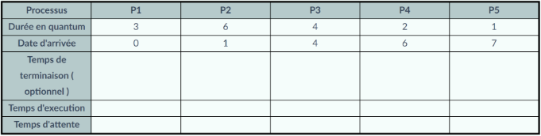
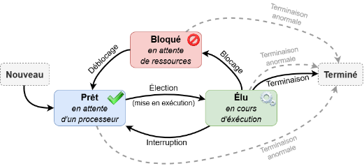
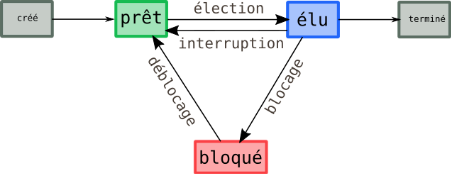
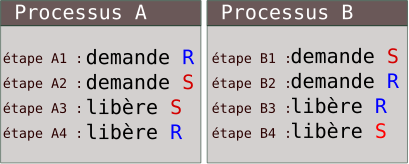
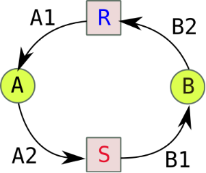
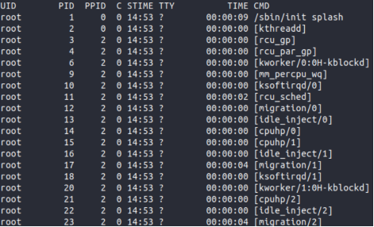
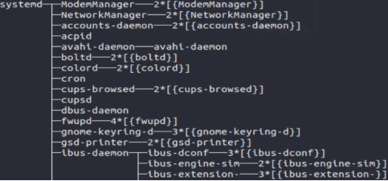
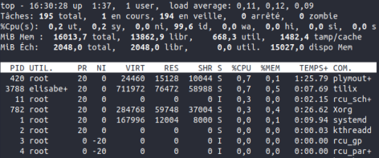

---
author: ELP
title: 08 Les processus
---


🧭 Table des matières

[1. Rappels de première](#_toc154927166)
[2. Les processus](#_toc154927169)
[3. Les processus sous Linux](#_toc154927175)
[4. Exercices](#_toc154927179)

---

🎯 Compétences évaluables

* Décrire **la création et l’ordonnancement des processus** par le système d’exploitation.
* Identifier **les risques d’interblocage** (*deadlock*).

---

## <H2 STYLE="COLOR:BLUE;"> <a name="_toc154927166"></a>1. 🔹 Rappels de première</H2>

### <H3 STYLE="COLOR:GREEN;"> <a name="_toc154927167"></a>1.1. 🧠 Rôle du système d’exploitation</H3>

Le **système d’exploitation (OS)** est le véritable chef d’orchestre de l’ordinateur 🎼.
Il gère toutes les ressources et fait le lien entre l’utilisateur, les programmes et le matériel.

⚙️ Fonctions principales de l’OS

* 🧩 **Gestion des ressources matérielles** : l’OS cache la complexité du matériel, gère les interruptions, les entrées/sorties, évite les conflits et protège le système contre les usages impropres.
* 📚 **Bibliothèques et compatibilité** : il fournit des bibliothèques pour simplifier la programmation et permettre à un même programme de tourner sur plusieurs machines compatibles.
* 🚀 **Exécution des programmes** : il charge les programmes en mémoire et gère leur exécution simultanée. Ces programmes actifs sont appelés **processus**.
* 🔐 **Sécurité** : il contrôle les accès, isole les utilisateurs et protège le système des erreurs ou intrusions.

💡 *En résumé : l’OS est le cœur logiciel de la machine. Sans lui, aucune communication, aucun programme, aucune sécurité.*

---

### <H3 STYLE="COLOR:GREEN;"> <a name="_toc154927168"></a>💻 1.2. Commandes Linux de base</H3>

Quelques commandes essentielles pour manipuler le système :

| 🧩 **Commande** | 💬 **Signification (anglais)** | 🧠 **Rôle / Description**                                                  |
| :-------------- | :----------------------------- | :------------------------------------------------------------------------- |
| `sudo`          | substitute user do             | Exécute une commande avec les droits administrateur (mot de passe requis). |
| `pwd`           | print working directory        | Affiche le répertoire courant.                                             |
| `cd arg/`       | change directory               | Change de répertoire ; sans argument, revient au *home*.                   |
| `ls arg`        | list                           | Liste le contenu d’un dossier.                                             |
| `ll` ou `ls -l` | long list                      | Affiche des informations détaillées sur les fichiers.                      |
| `ls -a`         | list all                       | Montre aussi les fichiers cachés.                                          |
| `chmod`         | change mode                    | Modifie les droits d’accès à un fichier/dossier.                           |
| `mkdir`         | make directory                 | Crée un dossier.                                                           |
| `rmdir`         | remove directory               | Supprime un dossier vide.                                                  |
| `rm`            | remove                         | Supprime un fichier.                                                       |
| `rm -r`         | remove recursively             | Supprime un dossier et tout son contenu.                                   |
| `mv arg1 arg2`  | move                           | Renomme ou déplace un fichier.                                             |
| `touch arg`     | touch                          | Crée un fichier vide ou met à jour sa date de modification.                |
| `kill arg`      | kill                           | Stoppe le processus ayant le PID spécifié.                                 |

🔗 [Tester ces commandes ici](http://luffah.xyz/bidules/Terminus/)

---

## <H2 STYLE="COLOR:BLUE;"> <a name="_toc154927169"></a>2. ⚙️ Les processus</H2>

### <H3 STYLE="COLOR:GREEN;"> <a name="_toc154927170"></a>2.1. 📀 Notion de processus</H3>

Lorsqu’un programme est lancé, le système crée un ou plusieurs **processus** :
👉 une **instance d’exécution** du programme.

Un **processus** comprend :

* 🔢 un ensemble d’instructions à exécuter ;
* 🧮 l’état des registres du processeur ;
* 💾 les ressources nécessaires (mémoire, ports, fichiers…).

💬 **Différence essentielle :**

* Un **programme** = fichier statique d’instructions.
* Un **processus** = exécution dynamique en cours de ce programme.

🧠 L’OS peut afficher et gérer ces processus à l’aide du **gestionnaire de tâches** ou d’outils comme `ps` sous Linux.

---

### <H3 STYLE="COLOR:GREEN;"> <a name="_toc154927171"></a>2.2. 🆔 Identification des processus</H3>

Chaque processus est identifié par un **PID** (*Process IDentifier*), un numéro unique.
➡️ Le premier processus (souvent *init*) possède le PID 1.

Chaque processus a aussi un **PPID** (*Parent Process ID*), identifiant du processus parent.

📊 Exemple :

* PID = 1 → processus **init**
* PPID = 0 → aucun parent (le premier processus du système)

🧩 Ainsi, tous les processus forment une **arborescence hiérarchique**.

---

### <H3 STYLE="COLOR:GREEN;"> <a name="_toc154927172"></a>2.3. 🧭 Ordonnancement des processus</H3>

Un système multitâche donne l’illusion que plusieurs programmes tournent en même temps.
Mais ⚠️ un processeur **ne traite qu’une instruction à la fois** (sauf multi-cœurs).

C’est l’**ordonnanceur** (*scheduler*) qui décide quel processus passe à quel moment.

🎛️ Objectifs de l’ordonnanceur :

* Choisir quel processus exécuter.
* Déterminer combien de temps lui accorder.

---

🔄 Principaux algorithmes d’ordonnancement :

| 🧩 **Modèle**                               | 🧠 **Principe**                                                                        |
| :------------------------------------------ | :------------------------------------------------------------------------------------- |
| **FIFO / FCFS** (*First Come First Served*) | Le premier arrivé est le premier servi.                                                |
| **SJF** (*Shortest Job First*)              | Le plus court processus est exécuté en premier.                                        |
| **Round Robin**                             | Chaque processus s’exécute à tour de rôle pendant un temps fixe (quantum de 20–30 ms). |
| **Priorité**                                | Le processus ayant la priorité la plus élevée passe avant les autres.                  |

---

🧮 Exemple : ordonnancement SJF

{: .center}

**Explication du déroulement :**

1️⃣ P1 arrive en premier → s’exécute immédiatement.

2️⃣ P2 arrive ensuite → s’exécute après P1.

3️⃣ P3, P4, P5 arrivent pendant l’exécution de P2.

4️⃣ L’algorithme choit le plus court (P5), puis P4, puis P3.

{: .center}

---

⏱️ Définitions utiles :

* **Temps d’arrivée (soumission)** → moment où un processus entre dans la file.
* **Durée d’exécution** → temps nécessaire pour son traitement complet.
* **Temps de terminaison** → moment où le processus se termine réellement.

📘 *Exemple :*

* Temps d’arrivée de P5 : 7
* Durée de P5 : 1
* Temps d’arrivée de P4 : 6
* Durée de P4 : 2

---

!!! info "🧠 **Capytale : Activités**" 

???+ question "🧮 **Activité n° 1 : temps de terminaison**"
    Compléter la ligne « temps de terminaison » du **tableau précédent**.
    
    Rappel utile :
    
    - **Temps de terminaison** d’un processus *P* = instant où *P* **se termine** (depuis t = 0).

    - On le lit directement sur le **diagramme de Gantt** (fin de la dernière tranche d’exécution de *P*).

    
    ??? success "❇️ Solution :"
        - Méthode : repérer sur la frise temporelle l’instant où se termine chaque processus.

        - Notation : `Tfin(P)`.
        
        - Exemple de calcul (générique) :
        
         * Si P commence à t = 3, s’exécute 2 unités, puis reprend à t = 8 pour 1 unité, alors `Tfin(P) = 9`.
  


---

???+ question "⏱️ **Activité n° 2 : temps d’exécution (temps de séjour)**"
    Compléter la ligne « temps d’exécution / temps de séjour » du **tableau précédent**.

    Définition :

    - **Temps de séjour** (aussi appelé **temps d’exécution** dans ce contexte) :
   
    $T_{\text{séjour}}(P)$ = $T_{\text{fin}}(P) - T_{\text{arrivée}}(P)$

    ??? success "❇️ Solution :"
        - Calcul : `T_séjour(P) = Tfin(P) - Tarr(P)`.

        - Interprétation : durée totale passée dans le système (file d’attente + processeur).

        - Exemple :

           * Si `Tarr(P)=1` et `Tfin(P)=9`, alors `T_séjour(P)=8`.


---

???+ question "🕓 **Activité n° 3 : temps d’attente**"
    Compléter la ligne « temps d’attente » du **tableau précédent**.

    Définition :
   
    - **Temps d’attente** (dans la file, **hors** CPU) :
   
    $T_{\text{attente}}(P)$ = $T_{\text{séjour}}(P) - \text{Durée}(P)$

    ??? success "❇️ Solution :"
        - Calcul en deux étapes :

           1) `T_séjour(P) = Tfin(P) - Tarr(P)`

           2) `T_attente(P) = T_séjour(P) - Durée(P)`

        - Exemple : Si `Durée(P)=3`, `Tarr(P)=2`, `Tfin(P)=10`

           → `T_séjour=8`

           → `T_attente=8-3=5`.


???+ question "📋 **Activité n° 4 : Ordonnancement FIFO ou FCFS**"
    Compléter le tableau pour l’ordonnancement **FIFO/FCFS** et **schématiser** l’algorithme (diagramme de Gantt).

    | Processus         | P1 | P2 | P3 | P4 |
    |-------------------|:--:|:--:|:--:|:--:|
    | **Durée**         |  3 |  2 |  4 |  3 |
    | **Date d’arrivée**|  0 |  2 |  1 |  3 |
    | **Temps d’attente** |    |    |    |    |
    | **Temps d’exécution** *(séjour)* |    |    |    |    |

    Rappel FIFO : on exécute les processus **dans l’ordre d’arrivée** (en cas d’égalité, on garde l’ordre d’apparition).

    ??? success "❇️ Solution : (FIFO/FCFS)"
        **Ordre d’exécution** (par arrivée) :  
      
        P1 (t=0) → P3 (arrivé à 1) → P2 (arrivé à 2) → P4 (arrivé à 3)

        **Gantt (en unités de temps)**  

        `|--P1--|------P3------|--P2--|---P4---|`

        `0------3--------------7------9-------12`

        **Temps de fin**

        - P1 : 3

        - P3 : 7

        - P2 : 9

        - P4 : 12

        **Temps d’exécution (séjour) = Tfin − Tarr**

        - P1 : 3 − 0 = **3**

        - P3 : 7 − 1 = **6**

        - P2 : 9 − 2 = **7**

        - P4 : 12 − 3 = **9**

        **Temps d’attente = Séjour − Durée**

        - P1 : 3 − 3 = **0**

        - P3 : 6 − 4 = **2**

        - P2 : 7 − 2 = **5**

        - P4 : 9 − 3 = **6**

        **Tableau complété**

        | Processus         | P1 | P2 | P3 | P4 |
        |-------------------|:--:|:--:|:--:|:--:|
        | **Durée**         |  3 |  2 |  4 |  3 |
        | **Date d’arrivée**|  0 |  2 |  1 |  3 |
        | **Temps d’attente** | 0 | 5 | 2 | 6 |
        | **Temps d’exécution (séjour)** | 3 | 7 | 6 | 9 |


---

???+ question "📋 **Activité n° 5 : Ordonnancement Round Robin**"
    Compléter le tableau pour l’ordonnancement **Round Robin** et **schématiser** l’algorithme.

    👉 Préciser un **quantum** (ex. `q = 2` unités de temps).

    | Processus                         |  P1 |  P2 |  P3 |  P4 |
    | :-------------------------------- | :-: | :-: | :-: | :-: |
    | **Durée**                         |  3  |  2  |  4  |  3  |
    | **Date d’arrivée**                |  0  |  2  |  1  |  3  |
    | **Temps d’attente**               |     |     |     |     |
    | **Temps d’exécution *(séjour)* ** |     |     |     |     |

    🔁 **Rappel Round Robin :**

    Chaque processus actif reçoit le CPU pendant **q unités** ; s’il n’a pas terminé, il retourne **en fin de file**.

    ??? success "❇️ Solution :" (Round Robin, exemple avec q = 2)"
        **Arrivées :**  
        
        P1 @ 0 (3)      P3 @ 1 (4)      P2 @ 2 (2)      P4 @ 3 (3)

        **Gantt (q = 2)**  

        - t = 0 .. 2 : P1 (reste 1) 

        - t = 2 .. 4 : P3 (reste 2) 

        - t = 4 .. 6 : P2 (termine) 

        - t = 6 .. 7 : P1 (termine) 

        - t = 7 .. 9 : P4 (reste 1) 

        - t = 9 .. 11 : P3 (termine)

        - t = 11 .. 12 : P4 (termine)

        **Temps de fin :**  

        - P2 : **6**  

        - P1 : **7**  

        - P3 : **11**  

        - P4 : **12**

        **Temps d’exécution (séjour) = Tfin − Tarr :**  

        - P1 : 7 − 0 = **7**  

        - P2 : 6 − 2 = **4**  

        - P3 : 11 − 1 = **10**  

        - P4 : 12 − 3 = **9**

        **Temps d’attente = Séjour − Durée :**  

        - P1 : 7 − 3 = **4**  

        - P2 : 4 − 2 = **2**  

        - P3 : 10 − 4 = **6**  

        - P4 : 9 − 3 = **6**

        **✅ Tableau complété (q = 2)**

        | Processus | P1 | P2 | P3 | P4 |
        |:-----------|:--:|:--:|:--:|:--:|
        | **Durée** | 3 | 2 | 4 | 3 |
        | **Date d’arrivée** | 0 | 2 | 1 | 3 |
        | **Temps d’attente** | 4 | 2 | 6 | 6 |
        | **Temps d’exécution (séjour)** | 7 | 4 | 10 | 9 |

> ℹ️ Si votre quantum diffère, **rejouez le Gantt** (Le diagramme de Gantt représente la chronologie d’exécution des processus) avec votre valeur : les formules de séjour/attente restent identiques.


---

### <H3 STYLE="COLOR:GREEN;">🧠 **2.4. État des processus**</H3>

Selon que l’ordonnanceur lui attribue ou non le processeur, un processus peut être :

* ⚙️ **Prêt** : en attente d’être exécuté ;
* 🚀 **Élu** : en cours d’exécution ;
* ⏸️ **Bloqué** : en attente d’une ressource (E/S, fichier, saisie…), il repassera **Prêt** lorsque la ressource sera disponible.

📊 **Diagrammes de transitions** (source : info.blaisepascal.fr) :

{: .center}

**Version simplifiée :**

{: .center}

💬 **Pourquoi un blocage ?**
Pendant l’exécution, le processus peut réclamer une **ressource indisponible** (ex. fichier déjà ouvert) ou attendre une **entrée utilisateur**.
➡️ Il passe alors en **Bloqué**, libérant le CPU pour d’autres.
Quand la ressource arrive, il revient en **Prêt**, puis sera **Élu** à nouveau.

---

### <H3 STYLE="COLOR:GREEN;"> <a name="_toc154927174"></a>⚠️ **2.5. Notion d’interblocage (deadlock)**</H3>

Un **interblocage** (*deadlock*) survient lorsque des processus se bloquent **mutuellement** en attendant des ressources détenues par l’autre.

💡 **Exemple :** deux processus *A* et *B*, deux ressources *R* et *S* :

{: .center}

**Déroulement résumé :**
*A* prend **R**, *B* prend **S**, puis *A* attend **S** et *B* attend **R** → **blocage mutuel**.

🧩 **Schéma « ressources / processus » :**
Cercles = processus, carrés = ressources :

{: .center}

On repère un **cycle d’interdépendance** → deadlock.

---

### 🧰 **Prévenir / gérer un deadlock :**

* 🔒 **Prévention :** déclarer **à l’avance** toutes les ressources nécessaires.
* 🧠 **Évitement :** maintenir un état du système garantissant **une issue possible**.
* 🧹 **Détection / résolution :** laisser survenir puis **briser le cycle** (ex. forcer la libération d’une ressource).

---

### 🧱 **Exemples concrets :**

{: .center}

{: .center}

---


## <H2 STYLE="COLOR:BLUE;"> <a name="_toc154927175"></a>**3. 🐧 Les processus sous Linux**</H2>

### <H3 STYLE="COLOR:GREEN;"> <a name="_toc154927176"></a>**3.1. 👀 Affichage des processus**</H3>

💡 Pour obtenir de l’aide sur une commande Linux, utilisez :

```bash
man <commande>
```

Exemple :

```bash
man ps
```

Sous Linux, plusieurs commandes permettent de **visualiser et analyser les processus** en cours d’exécution.

🔗 [MOOC Bash interactif – Université de La Réunion](https://moocbash.univ-reunion.fr/?cpu=asm&n=1)

---

???+ question "🧩 **Activité n° 6 : commande `ps -aef`**"
    1️⃣ Ouvrir un terminal.
    2️⃣ Taper la commande :

    ```bash
    ps -aef
    ```

    Vous obtiendrez une **liste détaillée** des processus en cours :
    
    PID, PPID, utilisateur, état, etc.

    {: .center}

    👉 Pour afficher l’**arbre des processus**, utilisez :

    ```bash
    pstree
    ```

    {: .center}

    ??? success "❇️ Solution : / Explications**"
        - `ps` : affiche les processus actifs.  

        - Options :

           * `-a` → affiche tous les processus (pas seulement ceux du terminal courant)
         
           * `-e` → inclut tous les utilisateurs

           * `-f` → affiche les informations complètes  

        - Exemple ciblé :
           ```bash
           ps -e -o pid,ppid,stat,command
           ```
           ➜ permet de sélectionner précisément les colonnes affichées.  

        - `pstree` : affiche les processus **sous forme d’arborescence hiérarchique** (relations père/fils).


---

???+ question "🧩 **Activité n° 7 : commande `top`**"
    1️⃣ Dans un terminal, taper la commande :

    ```bash
    top
    ```

    {: .center}

    2️⃣ Pour quitter le mode interactif, appuyer sur **`q`**.

    ??? success "❇️ Solution : / Explications"
        - `top` affiche en **temps réel** la liste des processus (mise à jour dynamique).  

           Contrairement à `ps`, qui donne un **état figé**. 

        - Cette commande permet de surveiller :

           * la **charge CPU (%)**  
         
           * la **mémoire utilisée**  
         
           * l’**état des processus** (`R` = running, `S` = sleeping, etc.)  

        - Pour quitter `top`, tapez `q`.  
      
        - Tous les processus ont pour ancêtre ultime le **PID 0** :
           
           * Ses fils directs sont `init` et `kthreadd`.


---

### <H3 STYLE="COLOR:GREEN;"> <a name="_toc154927177"></a>**3.2. 🧱 Interruption d’un processus**</H3>

Un processus peut être **interrompu ou supprimé** à l’aide de la commande `kill`.

🧩 **Commande :**

```bash
kill <PID>
```

où `<PID>` correspond au numéro du processus à terminer.

Lorsqu’un processus est "tué", il reçoit un **signal** de terminaison.
Les plus courants sont :

| 🔢 Signal |     Nom     | Description                                                                        |
| :-------: | :---------: | :--------------------------------------------------------------------------------- |
|     15    | **SIGTERM** | Demande polie de terminaison (libère proprement les ressources).                   |
|     9     | **SIGKILL** | Interruption immédiate, brutale (ne laisse pas le processus se fermer proprement). |

---

???+ question "🧩 **Activité n° 8 : commande `kill`**"
    1️⃣ Lancer `top` dans un terminal pour observer les processus.
   
    2️⃣ Relevez le **PID** du processus `top` dans la liste.
    
    3️⃣ Dans un autre terminal, exécutez :

    ```bash
    kill -15 <PID>
    ```

    4️⃣ Revenez sur le premier terminal.
   
    ❓ Que constatez-vous ?

    ??? success "❇️ Solution : / Explications"
        - Après `kill -15 <PID>`, le processus `top` reçoit un **signal SIGTERM** → il se ferme proprement.  
      
        - Si vous relancez `ps` ou `pstree`, `top` **n’apparaît plus** dans la liste.  
      
        - Sur la console où `top` tournait : le programme s’arrête automatiquement.  
        
        - Si un processus refuse de s’arrêter :
           ```bash
           kill -9 <PID>
           ```
           → **SIGKILL** : arrêt immédiat, sans nettoyage (⚠️ à utiliser avec prudence).


---

### <H3 STYLE="COLOR:GREEN;"> <a name="_toc154927178"></a>**3.3. 🧬 Création d’un processus**</H3>

Sous Linux, la création d’un processus s’effectue via l’appel système **`fork()`**, qui **duplique le processus existant**.

* 👨‍👦 Le **processus père** appelle `fork()`.
* 👶 Le **processus fils** est créé par **clonage** du père.
* 🔁 Après duplication, chacun exécute son code indépendamment.

Le fils peut remplacer son programme par un autre grâce à **`exec()`**, qui charge un **nouveau programme** dans son espace mémoire.

> 💡 C’est le cœur du fonctionnement multitâche de Linux : chaque commande lancée crée un nouveau processus, issu du terminal ou d’un parent.

---

!!! info "🧠 **Capytale : Le code sera fourni par votre enseignant.**" 

## <H2 STYLE="COLOR:BLUE;"> <a name="_toc154927179"></a>**4. 🧠 Exercices**</H2>


!!! abstract "**Exercice n°1 : Processus et interblocage**"

      On considère trois processus P1, P2 et P3 décrits ci-dessous :

      P1 : demande R1, demande R2, libère R1, libère R2 ;

      P2 : demande R2, demande R3, libère R2, libère R3 ;

      P3 : demande R3, demande R1, libère R3, libère R1.

      Si les processus sont exécutés l’un après l’autre, d’abord P1, puis P2 et enfin P3, il n’y a pas de situation d’interblocage.

      Décrire une exécution des trois processus qui conduit à une situation d’interblocage.

      Dessiner un schéma représentant la situation.

!!! abstract "**Exercice n°2 : Processus**"

      1. Qu'est-ce qui limite concrètement le nombre de processus pouvant être lancer en même temps ?
      1. Qu'est-ce qu'un système d'exploitation multitâche ?
      1. Que va devoir faire un système d'exploitation multitâche lorsque plusieurs processus fonctionnent "en même temps" sur un ordinateur ne disposant que d'un seul microprocesseur (un coeur) ?
      1. Que se passe-t-il au démarrage de l'ordinateur ?
      1. Quels sont les états pendant lesquels la mémoire vive réserve de la place au processeur ?
