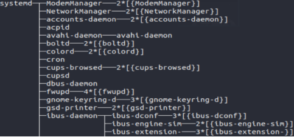

**Table des matières**

[1.	Rappels de première	](#_toc154927166)

[2.	Les processus](#_toc154927169)

[3.	Les processus sous Linux](#_toc154927175)

[4.	Exercices	](#_toc154927179)

**Compétences évaluables :**

- Décrire la création d’un processus, l’ordonnancement de plusieurs processus par le système.
- Mettre en évidence le risque de l’interblocage (deadlock)

## **1. Rappels de première**
### **1.1. Rôle du système d’exploitation**
Le système d’exploitation d’un ordinateur est chargé d’assurer les fonctionnalités de communication et d’interfaçage avec l’utilisateur. Un OS est un logiciel dont le principal domaine d’intervention est la gestion de toutes les ressources de l’ordinateur comme:

- **Gestion des ressources matérielles** : L’OS cache la complexité du matériel, arbitre les requêtes d’accès aux ressources, évite les conflits, traite les interruptions, les entrées-sorties et les erreurs, empêchant les usages impropres de la machine.
- **Mise à disposition de bibliothèques** - L’OS facilite l’utilisation de la machine grâce à un ensemble de bibliothèques, qui rendent la programmation plus facile, plus simple et permet à un même programme de fonctionner sur des machines très différentes munies du même système d’exploitation. 
- **Exécution des programmes** - L’OS charge les programmes depuis la mémoire de masse et gère leurs exécutions simultanées (ou plutôt en alternance). On appelle ces programmes en mémoire des processus. L’OS s’assure que seule la partie utile à l’exécution du programme à l’instant t est chargée dans la RAM en effaçant les données non utilisées pendant un certain temps. 
- **Sécurisation** - L’OS assure la sécurité globale du système.

C'est donc une composante logicielle très importante.

### **1.2. Commandes Linux de base**

   |sudo|*subsitute utilisator do*|Permet d’effectuer des commandes non autorisées. Le mot de passe est demandé. |
   | - | - | - |
   |pwd |*print working directory* |Affiche le répertoire de travail |
   |cd *arg/* |*change directory* |Change de répertoire de travail ; *arg/* est ce nouveau répertoire. cd sans argument positionne dans le répertoire *home*. |
   |ls *arg* |*list* |Liste le contenu *arg* si celui-ci est un répertoire. Sans argument, ls liste le contenu du répertoire de travail. |
   |ll *arg* ou ls -l *arg* |*long list* |Affiche des informations [détaillées](C:\Users\Fred\Documents\1ere NSI\cours\Quelques commandes shell UNIX.html#ll) sur le fichier *arg* |
   |ls -a *arg* |*list all* |Affiche tous les fichiers de *arg*, même ceux commençant par .., si celui-ci est un répertoire. Les options de ls peuvent être combinées : ls -al. |
   |chmod *autorisations* *arg* |*change mode* |Change les autorisations (droits) du fichier/dossier, cf. cours de 1ère.|
   |mkdir *arg* |*make directory* |Crée le répertoire *arg*. |
   |rmdir *arg* |*remove directory* |Supprime le répertoire s'il est vide. |
   |rm *arg* |*remove* |Supprime le fichier *arg*. |
   |rm -r *arg* |*remove recursively* |Supprime *arg* et, éventuellement, tous les fichiers qu'il contient. |
   |mv *arg1* *arg2* |*move* |Renomme *arg1* en *arg2* (si *arg2* n’est pas un nom de répertoire), ou déplace *arg1* dans le répertoire *arg2* (si *arg2* est un nom de répertoire).|
   |touch *arg* |*touch* |Crée un fichier vide de nom *arg*, s'il n'existe pas, sinon met à jour, avec la date courante, sa date de dernière modification s'il existe déjà. |
   |kill *arg*|*kill*|Arrête le processus numéro *arg*|

[http://luffah.xyz/bidules/Terminus/](http://luffah.xyz/bidules/Terminus/)

## **2. Les processus**
### **2.1. Notion de processus**
Lorsqu'un programme est exécuté sur un ordinateur, celui-ci va créer un (ou plusieurs) **processus**.

On dit que ce processus est une **instance d'exécution** de ce programme.

Un **processus** est un programme en cours d’exécution, qui est constitué : 

- D’un **ensemble d'instructions à exécuter**;
- **l'état des registres** du processeur 
- de ressources permettant des entrées-sorties de données (comme des ports réseau).

**Remarques :** 

- Un **programme est statique**: c’est un fichier contenant une suite d’instructions qui lorsqu’elles sont exécutées modifient l’état du processeur et de la mémoire afin de réaliser une tâche donnée.
- Un **processus est dynamique**: c’est une instance d’exécution d’un programme sur une machine de son lancement jusqu’à sa fin.

Les systèmes d’exploitation permettent à l’utilisateur de visualiser et gérer les processus grâce à un **gestionnaire de processus**.

### **2.2. Identification des processus**

Chaque processus possède un identifiant appelé **PID** (**Process Identification**), ce PID est un nombre entier. 

Le premier processus créé au démarrage du système à pour PID 0, le second 1, le troisième 2… Le système d’exploitation utilise un compteur qui est incrémenté de 1 à chaque création de processus, le système utilise ce compteur pour attribuer les PID aux processus.

Chaque processus possède aussi un **PPID** (**Parent Process Identification**). Ce PPID permet de connaitre le processus parent d’un processus (par exemple le processus *init* vu ci-dessus à un PID de 1 et un PPID de 0). 

A noter que le processus 0 ne possède pas de PPID (c’est le seul dans cette situation).
### **2.3. Ordonnancement des processus**
Dans un système multitâche, plusieurs processus sont actifs simultanément, mais un processeur (simple cœur) ne peut exécuter qu’une instruction à la fois. Si plusieurs processus sont prêts, le système d’exploitation doit gérer l’allocation du processeur aux différents processus à exécuter. C’est **l’ordonnanceur** (**scheduler**) qui s’acquitte de cette tâche.

Un ordonnanceur fait face à deux problèmes principaux :

- Le choix du processus à exécuter ;
- Le temps d’allocation du processeur au processus choisi

Pour cela il existe plusieurs algorithmes d'ordonnancement :

- Le **modèle FIFO ou First-Come First-Served (FCFS**): on affecte les processus dans l'ordre de leur apparition dans la file d'attente.
- Le **modèle SJF: Shortest Job First**, on affecte en premier le « plus court processus en premier » de la file d'attente à l'unité de calcul.
- Le **modèle Round Robin**: (ou méthode du tourniquet) on effectue un bloc de chaque processus présents dans la file d'attente à tour de rôle, pendant un quantum de temps d'en général 20 à 30 ms. Si le processus n'est pas terminé, il repart en fin de liste d'attente.
- Il existe d'autres algorithmes d'ordonnancement, comme par exemple le **modèle Priorité**, où chaque processus dispose d’une valeur de priorité et on choisit le processus de plus forte priorité à chaque fois (nous ne détaillerons pas cet algorithme).

Par exemple pour un ordonnancement sur le modèle SJF :

{: .center}

Schéma d’ordonnancement de ces processus sur le modèle SJF

{: .center}

P1 arrive en premier, puis P2 qui va donc s’exécuter après P1. Puis P3, P4 et P5 arrive pendant que P2 s’exécute. L’algorithme SJF va choisir le plus court, c’est-à-dire P5. Puis l’algorithme SJF va choisir le plus cours entre P4 et P3 donc c’est P4, et enfin P3

Le **temps d’arrivée** d’un processus, ou **temps de soumission**, correspond au moment où le processus arrive dans la file d’attente.

Le temps d’arrivée du processus P5 est 7. Celui de P4 est 6.

La **durée du processus** P, ou **durée d’exécution** sur le cœur, correspond à la durée en quantum nécessaire à l’exécution du processus.

La durée du processus P5 est 1. Celui de P4 est 2

Le **temps de terminaison** d’un processus P est la durée écoulée entre le temps 0 et le temps où le processus est terminée P

=> **CAPYTALE Le code vous sera donné par votre enseignant**

**Activité n° 1 :**  **temps de terminaison:**  compléter la ligne correspondante du tableau précédent

Le **temps d’exécution** ou **temps de séjour** du processus P, correspond à la différence du temps d’arrivée de P et du temps de terminaison de P

**Activité n° 2 :**  **temps d’exécution:**  compléter la ligne correspondante du tableau précédent

Le **temps ou durée d’attente** d’un processus P correspond à la différence entre le temps de séjour et la durée du processus

**Activité n° 3 :**  **temps d’attente:**  compléter la ligne correspondante du tableau précédent

**Activité n° 4 :**  **Ordonnancement FIFO ou FCFS :**  Compléter le tableau suivant pour l’ordonnancement FIFO et schématiser cet algorithme

|Processus|P1|P2|P3|P4|
| - | - | - | - | - |
|Durée|3|2|4|3|
|Date d’arrivée|0|2|1|3|
|Temps d’attente|||||
|Temps d’exécution|||||

||
| - |

|**Activité n° AUTONUM  \* Arabic :**  **Ordonnancement Round Robin :**  Compléter le tableau suivant pour l’ordonnancement FIFO et schématiser cet algorithme|
| - |

|Processus|P1|P2|P3|P4|
| - | - | - | - | - |
|Durée|3|2|4|3|
|Date d’arrivée|0|2|1|3|
|Temps d’attente|||||
|Temps d’exécution|||||

||
| - |
1. ## **Etat des processus**
Selon que l'ordonnanceur aura décidé de le confier ou non au processeur pour son exécution, un processus peut donc se trouver dans 3 états :

- **Prêt** : il attend qu'arrive le moment de son exécution.
- **Élu** : il est en cours d'exécution par le processeur.
- **Bloqué** : pendant son exécution (état **Élu**), le processus réclame une ressource qui n'est pas immédiatement disponible. Son exécution s'interrompt. Lorsque la ressource sera disponible, le processus repassera par l'état **Prêt** et attendra à nouveau son tour.

Voici les transitions possibles entre ces états (diagramme issu de <https://info.blaisepascal.fr/nsi-processus-et-ressources>) :

Ou de manière simplifiée :

**Pourquoi l'accès à une ressource peut bloquer un processus ?**

Pendant son exécution, un processus peut avoir besoin d'accéder à une **ressource déjà occupée** (un fichier déjà ouvert, par exemple) ou être **en attente d'une entrée-utilisateur** (un input() dans un code Python par exemple). Dans ce cas-là, le processeur va passer ce processus à l'état **Bloqué**, pour pouvoir ainsi se consacrer à un autre processus.

Une fois débloqué, le processus va repasser à l'état **Prêt** et rejoindre (par exemple) la file d'attente des processus avant d'être à nouveau **Élu** et donc exécuté.
1. ## **Notion d’interblocage (deadlock)**
Un **interblocage** (ou étreinte fatale, *deadlock* en anglais pour impasse) est un phénomène qui peut se produire en programmation concurrente lorsque des processus s’attendent mutuellement.

**Exemple** :Considérons 2 processus A et B, et deux ressources R et S. L'action des processus A et B est décrite ci-dessous :

**Déroulement des processus A et B :**

- A et B sont créés et passent à l'état **Prêt**.
- L'ordonnanceur déclare **Élu** le processus A (ou bien B, cela ne change rien).
- L'étape A1 de A est réalisée : la ressource R est donc affectée à A.
- L'ordonnanceur déclare maintenant **Élu** le processus B. A est donc passé à **Prêt** en attendant que son tour revienne.
- L'étape B1 de B est réalisée : la ressource S est donc affectée à B.
- L'ordonnanceur déclare à nouveau **Élu** le processus A. B est donc passé à **Prêt** en attendant que son tour revienne.
- L'étape A2 de A est donc enclenchée : problème, il faut pour cela pouvoir accèder à la ressource S, qui n'est pas disponible. L'ordonnanceur va donc passer A à **Bloqué** et va revenir au processus B qui redevient **Élu**.
- L'étape B2 de B est donc enclenchée : problème, il faut pour cela pouvoir accèder à la ressource R, qui n'est pas disponible. L'ordonnanceur va donc passer B à **Bloqué**.

Les deux processus A et B sont donc dans l'état **Bloqué**, chacun en attente de la libération d'une ressource bloquée par l'autre : ils se bloquent mutuellement.

Cette situation (critique) est appelée **interblocage** ou **deadlock**.

**Représentation schématique**

les processus seront représentés par des **cercles**, les ressources par des **carrés**.

Ce type de schéma fait apparaître un **cycle d'interdépendance**, qui caractérise ici la situation de deadlock.

**Comment s'en prémunir ?**  

Il existe trois stratégies pour éviter les interblocages :

- **la prévention** : on oblige le processus à déclarer à l'avance la liste de toutes les ressources auxquelles il va accéder.
- **l'évitement** : on fait en sorte qu'à chaque étape il reste une possibilité d'attribution de ressources qui évite le deadlock.
- **la détection/résolution** : on laisse la situation arriver jusqu'au deadlock, puis un algorithme de résolution détermine quelle ressource libérer pour mettre fin à l'interblocage.

**Exemples dans la vie quotidienne**

1. # **Les processus sous Linux**
   1. ## **Affichage des processus** 
Pour toute aide sous Linux : man *commande*. Par exemple man ps.

Sous Linux il existe des commandes permettant de visualiser les processus.

|
**Activité n° AUTONUM  \* Arabic :**  **Commande** ps -aef :Après avoir ouvert un terminal, tapez la commande suivante : ps -aef

Vous devriez avoir plusieurs informations sur les processus en cours sur votre ordinateur, notamment les PID et les PPID de ces processus.

Affiche l’arbre des processus. Taper la commande pstree

|
| :- |

**Lister les processus** : La liste des processus peut être obtenu avec la  commande : ps avec les options suivantes:

- -a tous les processus
- -e les processus de tout le monde
- -f toutes les infos sur les processus

Ou ps -e -o pid,ppid,stat,command qui permet d’affiner ce qu’on veut afficher comme paramètres.

pstree : affichage sous forme d’arbre

|
**Activité n° AUTONUM  \* Arabic :**  **Commande** top : Après avoir ouvert un terminal, tapez la commande suivante : top

En utilisant la commande top dans un terminal, observez ce qui se passe au niveau des processus quand vous **ouvrez le** navigateur web.

**Fermez** le navigateur Web et observez le résultat dans le terminal

Selon le navigateur que vous utilisez, il se peut que le fonctionnement du navigateur soit associé à plusieurs processus.

Noter le PID des processus liés au fonctionnement du navigateur.

Il faut taper q pour sortir.
|
| - |

**Commande** top : La commande ps ne permet pas de suivre en temps réel les processus (affichage figé). Pour avoir un suivi en temps réel, vous pouvez utiliser la commande top.

Il faut taper q pour sortir.

Les processus fils du processus 0 sont init et kthreadd. Tous les processus ont pour aïeul le processus de PID 0.
1. ## **Interruption d’un processus**
**Commande** kill : Il est possible de supprimer un processus en utilisant la commande kill. L'utilisation de cette commande est très simple, il suffit de taper kill suivi du PID

Pour tuer un processus, on lui envoie un signal de terminaison. On en utilise principalement 2 :

- SIGTERM (15) : demande la terminaison d'un processus. Cela permet au processus de se terminer proprement en libérant les ressources allouées.
- SIGKILL (9) : demande la terminaison immédiate et inconditionnelle d'un processus. C'est une terminaison violente à n'appliquer que sur les processus récalcitrants qui ne répondent pas au signal SIGTERM. 

|
**Activité n° AUTONUM  \* Arabic :**  **Commande** kill : Lancer la commande top

Dans une autre console, repérer le PID de top puis tuer le avec la commande kill -15 n°PID.

Faire afficher la liste des processus. top est-il présent ? que s’est-il passer sur l’autre console ?
|
| - |

|**Activité n° AUTONUM  \* Arabic :**  **Commande** kill : ouvrir un navigateur, utiliser la commande kill afin de supprimer le (ou les) processus lié(s) au fonctionnement du navigateur. Que se passe-t-il ?|
| :- |
1. ## **Creation d’un processus**
Sur Linux, la création d'un processus se fait par clonage d'un autre processus au travers d'un appel systeme : fork().

- le processus qui fait appel à fork() est appelé **processus père**
- le processus qui est ainsi créé par clonage est le **processus fils**
- après le clonage, un processus peut remplacer son programme par un autre programme grâce à l'appel système exec().
1. # **Exercices**
**Exercice n°1 : Processus et interblocage**

On considère trois processus P1, P2 et P3 décrits ci-dessous :

P1 : demande R1, demande R2, libère R1, libère R2 ;

P2 : demande R2, demande R3, libère R2, libère R3 ;

P3 : demande R3, demande R1, libère R3, libère R1.

Si les processus sont exécutés l’un après l’autre, d’abord P1, puis P2 et enfin P3, il n’y a pas de situation d’interblocage.

Décrire une exécution des trois processus qui conduit à une situation d’interblocage.

Dessiner un schéma représentant la situation.

**Exercice n°2 : Processus** 

1. Qu'est-ce qui limite concrètement le nombre de processus pouvant être lancer en même temps ?
1. Qu'est-ce qu'un système d'exploitation multitâche ?
1. Que va devoir faire un système d'exploitation multitâche lorsque plusieurs processus fonctionnent "en même temps" sur un ordinateur ne disposant que d'un seul microprocesseur (un coeur) ?
1. Que se passe-t-il au démarrage de l'ordinateur ?
1. Quels sont les états pendant lesquels la mémoire vive réserve de la place au processeur ?

Terminale NSI 		Chap 08 : Les processus	Page 12/12

[ref1]: Aspose.Words.1361c803-fbec-488b-944e-f896249bb67b.014.jpeg
[ref2]: Aspose.Words.1361c803-fbec-488b-944e-f896249bb67b.015.jpeg
