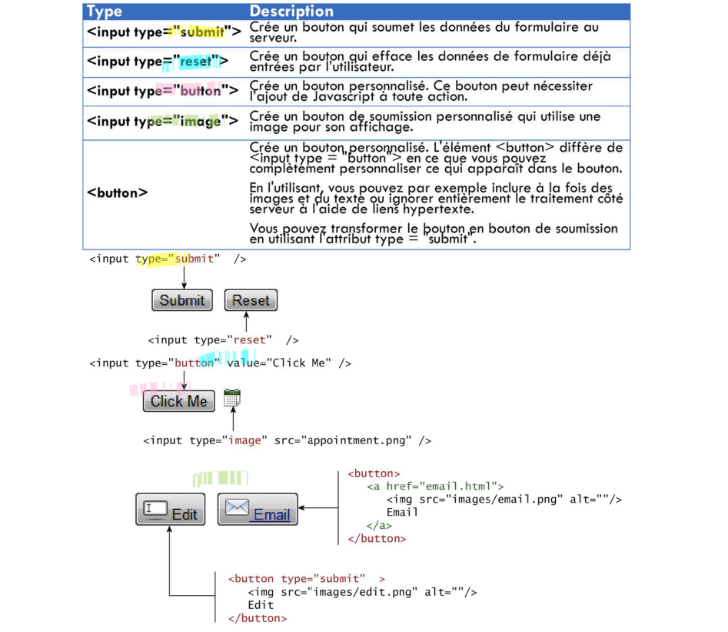

---
author: ELP
title: 08b Interaction client-serveur - Requête
---


**Table des matières** 

1. [Modèle client/serveur=](#_page0_x40.00_y516.92)
1. [Le protocole HTTP=](#_page1_x40.00_y233.92)
3. [Coder l’envoi d’une requête par le navigateur](#_page3_x40.00_y617.92)
4. [APPLICATION : Création d’une page web dynamique](#_page8_x40.00_y503.92)
5. [Exercices](#_page13_x40.00_y36.92)


## **1. Modèle<a name="_page0_x40.00_y516.92"></a> client/serveur** 


Deux  ordinateurs  en  réseau  peuvent  s’échanger  des  **données**.  Un ordinateur A va souvent se contenter de **demander** (faire une **requête**)  des ressources à un ordinateur B. L’ordinateur B va lui se contenter de  **fournir**  des  ressources  à tous les ordinateurs  qui lui  en feront la  demande. On dira que A est le **client** alors que B est le **serveur**.   

Un client peut être défini comme une application logicielle qui **envoie** des requêtes à un serveur. Un serveur peut être défini comme une application logicielle qui **attend** et **traite les requêtes** provenant de clients.  

La communication entre un client et un serveur se fait généralement à l'aide d'un **protocole de communication spécifique**.(par exemple : HTTP entre navigateurs web et serveurs web) 

Les serveurs sont aujourd’hui **capables de générer eux-mêmes du code HTML**. Les résultats qui s’affichent à l’écran dépendent des demandes effectuées par l’utilisateur du site : le web est devenu **dynamique** 

Différents langages de programmation peuvent être utilisés « coté serveur » afin de permettre au serveur de générer lui-même le code HTML à envoyer. Le plus utilisé encore aujourd’hui se nomme **PHP**. D’autres langages sont utilisables côté serveur : Java, Python,… 

Par exemple : 
```php
<?php 
$heure = date("H:i"); 
echo '<h1>Bienvenue sur mon site</h1> 
	<p>Il est '.$heure.'</p>'; 
?> 
```


Si un client se connecte à un serveur web qui exécute ce code à 18h23, le serveur enverra au client le code HTML ci-dessous : 
```html
<h1>Bienvenue sur mon site</h1> 
<p>Il est 18h23</p>
```


## **2. Le<a name="_page1_x40.00_y233.92"></a> protocole HTTP** 
### **2.1. Qu’est<a name="_page1_x40.00_y255.92"></a> ce que c’est et quel est son rôle ?** 

Le **HTTP (HyperText Transfert Protocol)** va permettre au client **d’effectuer des requêtes** à destination d’un serveur web. En retour, le serveur web va envoyer **une réponse**.  

Le rôle de HTTP dans les interactions client-serveur est de fournir **une structure pour les requêtes et les réponses.**  La requête HTTP est composée de plusieurs lignes de texte qui **décrivent ce que le client demande au serveur**.  La réponse HTTP est également composée de plusieurs lignes de texte qui **décrivent ce que le serveur renvoie au client.** 

### **2.2. Les<a name="_page1_x40.00_y417.92"></a> codes de statut HTTP** 

Les **codes de statuts** sont des codes numériques qui indiquent **le résultat** d'une requête HTTP :  

- 200 et suivants indiquent une **réussite**.  
- 300 et suivants indiquent **un déplacement de la ressource demandée**.  
- 400 et suivants indiquent une **erreur du client** : requête mal formulée ou ressource inexistante (400: "Bad Request", 401: "Unauthorized", 402: "Payment Required", 403: "Forbidden", 404: "Not Found",...) 
- 500 et suivants indiquent une **erreur du serveur.** (500: "Internal Server Error", 501: "Not Implemented", 502: "Bad Gateway", 503: "Service Unavailable",...)

### **2.3. Principe<a name="_page1_x40.00_y564.92"></a> d’une requête** 

Composition simplifiée d’une requête HTTP (client vers serveur) : 

- La **méthode employée** pour effectuer la requête 
- L’**URL** de la ressource 
- La **version du protocole** utilisé par le client (souvent HTTP 1.1) 
- Le **navigateur employé** (Firefox, Chrome) et sa **version** 
- Le **type du document demandé** (par exemple HTML) 

#### **2.3.1. Ligne de Requête**
La première ligne d'une requête HTTP est la ligne de requête, qui spécifie le type de requête (méthode HTTP), l'URL de la ressource demandée, et la version du protocole HTTP.

**Exemple:**
```
GET /index.html HTTP/1.1
```
- **GET** : Méthode HTTP utilisée (GET, POST, PUT, DELETE, etc.).
- **/index.html** : URL de la ressource demandée.
- **HTTP/1.1** : Version du protocole HTTP.

#### **2.3.2. En-têtes de Requête (Headers)**
Les en-têtes de requête fournissent des informations supplémentaires sur la requête ou sur le client lui-même. Ils sont placés après la ligne de requête, chaque en-tête étant sur une nouvelle ligne.

**Exemple:**
```
Host: www.example.com
User-Agent: Mozilla/5.0 (Windows NT 10.0; Win64; x64) AppleWebKit/537.36 (KHTML, like Gecko) Chrome/58.0.3029.110 Safari/537.3
Accept: text/html,application/xhtml+xml,application/xml;q=0.9,image/webp,*/*;q=0.8
Accept-Language: en-US,en;q=0.5
```
- **Host** : Spécifie le domaine de destination (nécessaire pour les serveurs hébergeant plusieurs domaines).
- **User-Agent** : Fournit des informations sur le client (navigateur, système d'exploitation).
- **Accept** : Indique les types MIME que le client accepte.
- **Accept-Language** : Indique les langues préférées du client.

#### **2.3.3. Corps de la Requête (Request Body)**
Le corps de la requête est utilisé pour envoyer des données au serveur. Il est généralement utilisé avec les méthodes POST, PUT, et PATCH. Dans une requête GET, le corps est généralement vide.

**Exemple:**
Pour une requête POST envoyant des données de formulaire :
```
POST /submit-form HTTP/1.1
Host: www.example.com
Content-Type: application/x-www-form-urlencoded
Content-Length: 27

name=John&age=30&city=Paris
```
- **Content-Type** : Spécifie le type de données envoyées dans le corps de la requête.
- **Content-Length** : Spécifie la longueur du corps de la requête.
- Le corps de la requête : Contient les données réelles (ex: `name=John&age=30&city=Paris`).

Une requête HTTP utilise une méthode (c’est une commande qui demande au serveur d’effectuer une certaine action). Il y a plusieurs méthodes disponibles :
-	**GET** : c’est la méthode la plus courante pour demander une ressource. Elle est sans effet sur la ressource.
-	**POST** : cette méthode est utilisée pour soumettre des données en vue d’un traitement (côté serveur). Typiquement c’est la méthode employée lorsque l’on envoie au serveur les données issues d’un formulaire.
-	**DELETE** : cette méthode permet de supprimer une ressource sur le serveur.
-	**PUT** : cette méthode permet de modifier une ressource sur le serveur
-	**PATCH** : pour modifier une ressource existante

#### **2.3.4. Composition Complète de la Requête**
Voici à quoi ressemble une requête HTTP complète en utilisant une requête POST comme exemple :

```
POST /submit-form HTTP/1.1
Host: www.example.com
User-Agent: Mozilla/5.0 (Windows NT 10.0; Win64; x64) AppleWebKit/537.36 (KHTML, like Gecko) Chrome/58.0.3029.110 Safari/537.3
Accept: text/html,application/xhtml+xml,application/xml;q=0.9,image/webp,*/*;q=0.8
Accept-Language: en-US,en;q=0.5
Content-Type: application/x-www-form-urlencoded
Content-Length: 27

name=John&age=30&city=Paris
```

- **Ligne de requête** : Début de la requête, spécifiant la méthode, l'URL et la version du protocole.
- **En-têtes de requête** : Informations supplémentaires sur la requête ou le client.
- **Corps de la requête** : Données envoyées au serveur (utilisé principalement dans les requêtes POST et PUT).

### **2.4. Réponse HTTP du Serveur avec PHP**

#### **2.4.1. En-têtes de Réponse**
Les en-têtes de réponse restent les mêmes.

**Exemple:**
```
HTTP/1.1 200 OK
Content-Type: text/html; charset=UTF-8
Content-Length: [calculated automatically by server]
Connection: keep-alive
```
**Ligne de Statut** :
   - `HTTP/1.1 200 OK` : Indique que la requête a été traitée avec succès et que le serveur renvoie la page demandée.

**En-têtes de Réponse** :
   - `Content-Type: text/html; charset=UTF-8` : Indique que le contenu de la réponse est une page HTML encodée en UTF-8.
   - `Content-Length: [calculated automatically by server]` : La longueur du corps de la réponse est calculée automatiquement par le serveur.
   - `Connection: keep-alive` : Indique que la connexion doit rester ouverte pour les requêtes suivantes.

#### **2.4.2. Corps de la Réponse avec PHP**

Le corps de la réponse contient le code HTML avec du PHP pour afficher dynamiquement les informations.

**Exemple:**
```html
<!DOCTYPE html>
<html lang="fr">
<head>
    <meta charset="UTF-8">
    <title>Bienvenue</title>
</head>
<body>
    <?php
    // Récupérer les données POST
    $name = $_POST['name'];
    $city = $_POST['city'];
    ?>
    <h1>Bienvenue sur mon site, <?php echo htmlspecialchars($name); ?> de <?php echo htmlspecialchars($city); ?>!</h1>
    <p>Nous sommes heureux de vous accueillir.</p>
</body>
</html>
```
**Corps de la Réponse avec PHP** :
   - Utilise PHP pour récupérer les données de la requête POST.
   - Utilise `htmlspecialchars` pour échapper correctement les caractères spéciaux et éviter les attaques XSS.
   - Génère dynamiquement le message de bienvenue avec le nom et la ville fournis.


Une fois la requête reçue, le serveur va renvoyer une réponse, par exemple : 
```html
Date: Thu, 15 feb 2019 12:02:32 GMT 
Server: Apache/2.0.54 (Debian GNU/Linux) DAV/2 SVN/1.1.4 
Connection: close 
Transfer-Encoding: chunked 
Content-Type: text/html; charset=ISO-8859-1 

<!doctype html> 
<html lang="fr"> 
<head> 
<meta charset="utf-8"> 
<title>Voici mon site</title> 
</head> 
<body> 
<h1>Hello World! Ceci est un titre</h1> 
<p>Ceci est un <strong>paragraphe</strong>. Avez-vous bien compris ?</p> 
</body> 
</html>
```


Le **HTTPS** est la version « sécurisée » du protocole HTTP : les données **sont chiffrées avant d’être transmises sur le réseau.** Lorsque la communication avec un site WEB est sécurisée, la barre d’adresse commence par un **cadenas**. 


### **2.4. Syntaxe<a name="_page3_x40.00_y314.92"></a> complète des URL** 

La syntaxe des URL est de la forme ```protocole://nom-ou-adresse:port/document?n1=v1&…nk=vk#id```

- Le port est **le port TCP** sur lequel effectuer la connexion.  
- Le document est écrit comme **chemin relatif** à partir du répertoire où est stocké le site sur le serveur. La partie marquée par un « ? » est la liste des **paramètres de requête**.  
- Ces paramètres sont des paires ni=vi où ni est le **nom du paramètre** et vi sa **valeur**. La portion finale #id est appelé un **signet** et permet de cibler un élément particulier dans la ressource demandée. 


**Activité n°1.** Passage de paramètre  un serveur 

- Aller sur[ HTTPs://fr.wikipedia.org ](https://fr.wikipedia.org/)
- Dans la zone de recherche taper informatique 
- Noter URL complète obtenue 
- Aller sur[ HTTPs://fr.wikipedia.org/w/index.php?search=informatique.](https://fr.wikipedia.org/w/index.php?search=informatique) Que remarque-t-on ? 
- Aller sur[ HTTPs://fr.wikipedia.org/wiki/Informatique#Algorithmique.](https://fr.wikipedia.org/wiki/Informatique#Algorithmique) Que remarque-t-on ? 

En fait sur la page la portion de code HTML correspondant est : 

```<span… id="Algorithmique">Algorithmique</span>```

## **3.  Coder l’envoi d’une requête par le navigateur<a name="_page3_x40.00_y617.92"></a>** 

Il existe plusieurs manières d'envoyer une requête HTTP depuis un navigateur. Voici quelques-unes des méthodes les plus courantes : 

- **En utilisant une URL dans la barre d'adresse du navigateur** : le navigateur envoie une requête **GET** à la ressource indiquée dans la URL. 
- **En utilisant un formulaire HTML** : un formulaire HTML peut être soumis en utilisant la méthode **GET** ou la méthode **POST**. La requête envoyée inclura les données saisies dans les champs du formulaire.
- **En utilisant JavaScript** : en utilisant JavaScript, vous pouvez envoyer une requête HTTP en utilisant l'objet **XMLHttpRequest** ou en utilisant une bibliothèque telle que jQuery. Cela permet de faire des requêtes **GET**, **POST**, **PUT**, **DELETE**, etc. en fonction de vos besoins. 

### **3.1. Exemples<a name="_page4_x40.00_y36.92"></a> de formulaire HTML**


**Activité n°2.** : Ouvrir un bloc note. Ajouter le script suivant et vérifier ce qu’on obtient dans le navigateur. Enregistrer le sous index.html **ATTENTION** à bien sélectionner tous les fichiers !


```html
<!DOCTYPE html>
<head>
  <meta charset="UTF-8">
  <title>requête</title>
</head>
<body>
<form method='GET' action='./login'>
    <input name='user' type='text' required>
    <input name='password' type='password' required>
    <button type='submit'>login</button>
</form>
</body>
```


**Activité n°3. :** Remplir ce formulaire et le soumettre fera envoyer une requête GET vers l'URL ./login. Observer la nouvelle URL

Avec la méthode GET, les données du formulaire seront encodées **dans l'URL.**  

Si on saisit trois valeurs par exemple «Dupont », « azerty » et qu’on clique sur le bouton, alors le navigateur charge la page correspondante à ```user=dupont&password=*****```

 

**Activité n°4. :** Modifier la page pour pouvoir la soumettre avec une requête POST. Remplir ce formulaire et le soumettre fera envoyer une requête POST et observer la nouvelle URL.

Dans le cas d'un POST ils seront alors encodés **dans le corps de la requête**. 

### **3.2. Précision<a name="_page7_x40.00_y370.92"></a> sur la méthode GET ou POST** 

Lors de l’utilisation de la méthode GET dans un formulaire**, les données sont transmises en clair** dans la barre d’adresse du navigateur. Dans les faits, on obtient ```action.php?identifiant=<texte entré>```.  

L’intérêt de la méthode GET est que toutes l’information nécessaire est contenue dans l’URL. Il est donc possible de recharger plusieurs fois la même URL.  

**Par exemple** :[ HTTPs://www.data.gouv.fr/fr/search/?q=informatique.](https://www.data.gouv.fr/fr/search/?q=informatique) 

Par contre les URL ne peuvent **pas être de taille longue** : si le **champ du formulaire est long** le serveur peut renvoyer un **code d’erreur 414.**  

De plus, les mots de passes sont affichés comme une suite d’étoile dans l’URL mais lorsqu’ on clique sur le bouton le navigateur exécute la requête et affiche sans sa barre d’adresse URL **le mot de passe en clair**, et une personne présente à proximité de l’écran peut le voir. 

Les caractéristique de la méthode POST sont exactement inverses. Lors du processus de soumission, l’URL n’est pas suffisante : il faut que les paramètres soient passés dans le corps de la requête. On ne pourra **pas sauvegarder l’URL**. **Si la taille des paramètres** envoyés est **trop importante** alors seule la méthode POST garanti que la requête ne sera pas tronquée. De même, pour les formulaires demandant un **mot de passe**, la méthode POST ne rendra **pas visible** ce dernier dans la barre d’adresse.  

GET : 

- Les données transmises sont visibles dans la barre d’adresse 
- Les données restent dans l’historique du navigateur et dans le cache 
- Les données peuvent être stockées dans un signet 
- Limite le nombre de caractères dans les données de formulaire renvoyées 

POST : 

- Les données peuvent contenir des données binaires 
- Les données sont masquées à l’utilisateur 
- Les données soumises ne sont pas stockées dans le cache, l’historique ou les signets 


 
### **3.3. Les<a name="_page4_x40.00_y568.92"></a> éléments d’un formulaire HTML**


| Type         | Description                                                                            |
|--------------|----------------------------------------------------------------------------------------|
| `<button>`   | Définit un bouton cliquable.                                                           |
| `<fieldset>` | Regroupe les éléments liés dans un formulaire.                                         |
| `<form>`     | Définit le conteneur de formulaire.                                                    |
| `<input>`    | Définit un champ de saisie. HTML5 définit plus de 20 types d'entrée différents.        |
| `<label>`    | Définit une étiquette pour un élément d’entrée de formulaire.                          |
| `<legend>`   | Définit l'étiquette d'un groupe de champs.                                             |
| `<option>`   | Définit une option dans une liste multi-éléments.                                      |
| `<optgroup>` | Définit un groupe d'options connexes dans une liste à éléments multiples.              |
| `<select>`   | Définit une liste à choix multiples.                                                   |
| `<textarea>` | Définit une zone de saisie de texte multiligne.                                        |


### **3.4. Elément<a name="_page5_x40.00_y275.92"></a> ```<input>``` : quelques exemples**


### **3.5. Elément<a name="_page5_x40.00_y485.92"></a> ```<select>``` : quelques exemples**


### **3.6. Elément<a name="_page6_x40.00_y36.92"></a> value dans ```<select>```**

L'attribut value de l'élément est utilisé pour spécifier quelle valeur sera renvoyée au serveur. L'attribut value est **facultatif**. S’il n’est pas spécifié, alors **le texte** dans le conteneur **est envoyé à la place** 


### **3.7. Les<a name="_page6_x40.00_y300.92"></a> boutons de commande** 

| Type                      | Description                                                                                                                                                       |
|---------------------------|-------------------------------------------------------------------------------------------------------------------------------------------------------------------|
| `<input type="submit">`   | Crée un bouton qui soumet les données du formulaire au serveur.                                                                                                    |
| `<input type="reset">`    | Crée un bouton qui efface les données de formulaire déjà entrées par l’utilisateur.                                                                                |
| `<input type="button">`   | Crée un bouton personnalisé. Ce bouton peut nécessiter l’ajout de Javascript à toute action.                                                                       |
| `<input type="image">`    | Crée un bouton de soumission personnalisé qui utilise une image pour son affichage.                                                                                |
| `<button>`                | Crée un bouton personnalisé. L'élément `<button>` diffère de `<input type="button">` en ce que vous pouvez complètement personnaliser ce qui apparaît dans le bouton. |
|                           | En l’utilisant, vous pouvez par exemple inclure à la fois des images et du texte ou ignorer entièrement le traitement côté serveur à l’aide de liens hypertexte.     |
|                           | Vous pouvez transformer le bouton en bouton de soumission en utilisant l’attribut type = = `submit`.                                                                | |                                                                 |


**ATTENTION** à ne pas confondre :

-	```<button>``` avec ```<input type=’button’>```

-	```<input type=’submit’>``` avec ```<button type=’submit’>```


### **3.8. Comment<a name="_page7_x40.00_y36.92"></a> le formulaire interagit avec le serveur ?** 


### **3.9. Les<a name="_page8_x40.00_y290.92"></a> cookies** 

Il est important pour un site web de pouvoir identifier ces différents clients. Il utilise des **cookies**. C’est une petite quantité de données. Il est composé d’un nom, d’une valeur et optionnellement d’une date d’expiration. Le nom, la valeur et la durée de vie sont choisie par le serveur.  

Lorsqu’un serveur veut déposer un cookie particulier chez un client, il l’envoie comme un entête de réponse HTTP.  

**Exemple d'Entête de Réponse HTTP avec Cookie**

```http
HTTP/1.1 200 OK
Content-Type: text/html; charset=UTF-8
Set-Cookie: username=JohnDoe; Expires=Wed, 21 Jul 2024 07:28:00 GMT; Path=/; Domain=example.com; Secure; HttpOnly
```


**Ligne de Statut** :
   - `HTTP/1.1 200 OK` : Indique que la requête a été traitée avec succès et que le serveur renvoie une réponse correcte.

**En-têtes de Réponse** :
   - `Content-Type: text/html; charset=UTF-8` : Spécifie le type de contenu de la réponse. Ici, il s'agit de HTML encodé en UTF-8.
   
**Set-Cookie** :
   - `Set-Cookie: username=JohnDoe` : Crée un cookie nommé `username` avec la valeur `JohnDoe`.
   - `Expires=Wed, 21 Jul 2024 07:28:00 GMT` : Date et heure d'expiration du cookie. Passée cette date, le cookie sera supprimé par le navigateur.
   - `Path=/` : Le cookie est disponible pour toutes les URL du domaine.
   - `Domain=example.com` : Le domaine pour lequel le cookie est valide. Le cookie sera envoyé pour toutes les requêtes à `example.com` et ses sous-domaines.
   - `Secure` : Indique que le cookie doit être envoyé uniquement via des connexions sécurisées (HTTPS).
   - `HttpOnly` : Indique que le cookie n'est accessible que par le serveur et ne peut pas être manipulé par le JavaScript côté client, ce qui aide à protéger contre les attaques XSS.

**Utilisation Typique**

Lorsqu'un client (navigateur web) reçoit cette réponse du serveur, il stocke le cookie conformément aux directives spécifiées. Par exemple :

**Connexion sécurisée** :
   - Le cookie ne sera envoyé au serveur que lors de requêtes via HTTPS (grâce au flag `Secure`).

**Accès au cookie** :
   - Le cookie est accessible pour toutes les pages du domaine `example.com` (grâce au flag `Path=/` et `Domain=example.com`).

**Durée de vie** :
   - Le cookie expirera et sera supprimé automatiquement après le 21 juillet 2024 (grâce au flag `Expires`).

**Protection contre XSS** :
   - Le cookie n'est pas accessible via JavaScript, ce qui le protège contre certaines attaques XSS (grâce au flag `HttpOnly`).

## **4. APPLICATION<a name="_page8_x40.00_y503.92"></a> : Création d’une page web dynamique**
### **4.1. Mise<a name="_page8_x40.00_y525.92"></a> en place d’un serveur en Python ou un serveur Apache Lamp**
En fin d’année ….  


2. **Mise<a name="_page8_x40.00_y565.92"></a> en place d’un serveur Apache Wamp**  

Telecharger un serveur Wamp (choisissez le exe) : UwAmp Wamp Server - Apache MySQL PHP [https://www.uwamp.com/fr/](https://www.uwamp.com/fr/)

Normalement il s’installe dans C:\UwAmp

**Activité n°5**. : Demarrer le serveur Wamp


### **4.3. Formulaire<a name="_page9_x40.00_y154.92"></a> d’une page Web version php**


PHP est un langage de programmation qui s'intègre dans vos pages  HTML. Le sigle PHP est un acronyme récursif pour : PHP **Hypertext  Preprocessor** ! Il permet la **génération automatisée** (Preprocessor)  de vos pages Web (Hypertext). Celles-ci peuvent ainsi **s'adapter à la  demande ou suivant certaines conditions**. C'est pour cela que l'on  parle de pages **web dynamiques.**   

Cas très simple où le serveur va renvoyer au client une simple page HTML statique. Le  serveur Web Apache a été configuré pour qu'il envoie vers le client une page HTML située  dans un répertoire nommé "www", ce répertoire "www" devant se trouver dans votre répertoire UniServerZ. 


**Activité n°6.** Créer avec le bloc note, un fichier où on aura copier :

```html
<!doctype html>
<html lang="fr">
    <head>
        <meta charset="utf-8">
        <title>Utilisation d'Apache</title>
    </head>
    <body>
        <p>Le serveur Apache fonctionne parfaitement</p>
    </body>
</html>
```
Enregistrer le dans le répertoire C:\UwAmp\www  sous le nom "index.html". **ATTENTION** à bien sélectionner tous les fichiers.


**Activité n°7. :** Ouvrir votre navigateur Web et taper dans la barre d'adresse **"localhost"**. On devrait voir la page Web s'afficher. 

Avec le "localhost", on indique au navigateur que le serveur Web se trouve sur le même ordinateur que lui (on parle de machine locale). Dans un cas normal, la barre d'adresse devrait être renseignée avec l'adresse du serveur Web. 

Pour l'instant, le site est **statique** : la page reste identique, quelles que soient les actions des visiteurs. Pour avoir un **site dynamique**, nous allons **exécuter, côté serveur, un programme qui va créer de toute pièce une page HTML**, cette page HTML sera ensuite envoyée au client par l'intermédiaire du serveur Web. Il existe différents langages de programmation qui permettent de générer des pages HTML à la volée **: Python, Java, Ruby...** Dans notre cas, nous allons utiliser le **PHP.**  

Le PHP est un langage très utilisé même si dans le monde professionnel Java, Python, Ruby,... sont préférés au PHP.  

Il est très important de bien comprendre les processus mis en œuvre : 

- **le client (le navigateur Web) envoie** une requête HTTP vers un serveur Web 
- en fonction de la requête reçue **le serveur "fabrique" une page HTML** grâce à l'exécution d'un programme écrit en PHP (ou en Python, Java...) 
- **le serveur Web envoie la page nouvellement créée au** client 
- une fois reçue, **la page HTML est affichée dans le navigateur** Web 


**Activité n°8. :** Après avoir supprimé le fichier "index.html" préalablement créé dans le répertoire "www" **ET** le fichier "index.php", Créer avec le bloc note, un fichier où on aura copier : toujours dans le répertoire "www". 
```php
<?php
date_default_timezone_set('Europe/Paris'); // Définir le fuseau horaire à Paris
$heure = date("H:i");
echo '<h1>Bienvenue sur mon site</h1>
      <p>Il est '.$heure.'</p>';
?>
```
Enregistrer le dans le répertoire C:\UwAmp\www  sous le nom "index.php". **ATTENTION** à bien sélectionner tous les fichiers.


**Activité n°9.** Ouvrir votre navigateur Web et taper dans la barre d'adresse **"localhost"**. 

On doit avoir une page HTML qui donne l'heure, si on **actualise** la page, **l'heure évolue**. On a donc bien une page dynamique : le serveur PHP crée la page Web au moment où elle est demandée. À chaque fois que la page est actualisée, la page HTML est générée de nouveau. 

L’extension ".html" a été remplacée par ".php". Au moment de la requête, le programme contenu dans ce fichier a été exécuté et la page HTML a été générée. Dans les 2 cas, le fichier se nomme "index", car par défaut, le serveur prend en compte un fichier nommé "index" ("index.php" ou "index.html" selon les cas).  

**Comment ça marche ?** 

- "```$heure = date("H:i");```", "```$heure```" est une variable (en **PHP les variables commencent** par **un "**$**"**), cette variable "contient" une chaîne de caractères qui correspond à l'heure courante 

- **l'instruction "**```echo```**" permet d'afficher la chaîne de caractères** **qui suit l'instruction**. 

Dans  notre  cas,  la  chaîne  de  caractères  est  "```<h1>Bienvenue  sur  mon  site</h1>  <p>Il  est '.$heure.'</p>```" ce qui correspond à du HTML à l'exception de "$heure" qui permet d'afficher le contenu de la variable "```$heure```".  

La page Web générée contiendra le code HTML et le contenu de la variable "$heure".  

**Le point "**.**" est, en PHP, l'opérateur de concaténation** (alors que par exemple en Python, l'opérateur de concaténation est le "+")  

Si un client effectue une requête à 18h23, le serveur enverra au client le code HTML ci-dessous : 
```html
<h1>Bienvenue sur mon site</h1> 
<p>Il est 18h23</p> 
```
**Activité n°10. :** Après avoir supprimé le fichier "index.php" préalablement créé dans le répertoire "www", Créer avec le bloc note, un fichier où on aura copier : toujours dans le répertoire "www". 

```html
<!doctype html>
<html lang="fr">
    <head>
        <meta charset="utf-8">
        <title>Le formulaire</title>
    </head>
    <body>
        <form action="trait_form.php" method="post">
                <label>Nom</label> : <input type="text" name="nom" />
                <label>Prénom</label> : <input type="text" name="prenom" />
                <input type="submit" value="Envoyer" />
        </form>
    </body>
</html>
```
Enregistrer le dans le répertoire C:\UwAmp\www  sous le nom "index.html". ATTENTION à bien sélectionner tous les fichiers.

**Activité n°11.** : Créer avec le bloc note, un fichier où on aura copier : toujours dans le répertoire "www".  
```php
<?php
    $n=$_POST['nom'];
    $p=$_POST['prenom'];
    echo "<p>Bonjour ".$p." ".$n.", j'espère que vous allez bien.</p>";
?>
```
Enregistrer le dans le répertoire C:\UwAmp\www  sous le nom " trait_form.php  ". ATTENTION à bien sélectionner tous les fichiers.

**Activité n°12.** : Ouvrir le navigateur Web et taper dans la barre d'adresse "localhost". Une fois la page Web affichée dans votre navigateur, remplir le formulaire proposé et valider en cliquant sur le bouton "Envoyer"

**Comment ça marche ?** 

- **Dans la page en HTML** :   

Dans la balise ```<form>``` du code HTML, il y a 2 attributs : « action » et « method ».  

- L’attribut ```action="trait_form.php"```  indique que le client enverra une requête http vers le serveur en cas de click sur le bouton « envoyer ». Pour répondre à cette requête du client, le serveur devra exécuter le programme PHP contenu dans le fichier « trait_form.php ».  
- La ```method="post"``` indique que la méthode utilisée pour effectuer cette requête http est une méthode « POST » . 

Au niveau des deux balises « input » permettant de saisir le nom et le prénom, on voit l’attribut « name »   

- **Dans la page en PHP** :  
- la ligne ```$n=$\_POST['nom'];``` permet d’attribuer à la variable $n la chaine de caractères qui a été saisie par l’utilisateur dans le formulaire : balise input ayant l’attribut name="nom". Le nom de ```$_POST['nom']``` est directement lié au nom de l’attribut ```name="nom"```.
- Le principe est le même pour la variable $p : le ```prenom``` de ```$_POST['prenom']``` est directement lié au prenom de l’attribut ```name="prenom"```.
Un ```$_POST['toto']```  contiendra  la  chaine  de  caractère  saisie  par  l’utilisateur  dans  le  champ correspondant à une balise input possédant un attribut ```name="toto"```. 

- ```echo "<p>Bonjour ".$p." ".$n.", j'espère que vous allez bien.</p>"```  contient l’instruction echo déjà vu précédemment 

Un clic sur le bouton "Envoyer" **déclenche une requête HTTP** vers le serveur et que les informations saisies dans le formulaire sont envoyées vers le serveur (puisqu'il est possible de récupérer ces informations au niveau du code PHP : une fois de plus, le code **PHP est uniquement exécuté du côté serveur**).  

Ces informations transitent entre le client et le serveur selon méthode utilisée par la requête HTTP. Dans l'exemple ci-dessus, la méthode utilisée est la méthode "POST" ("```method="post```"). 


**Activité n°13. :** Modifier les fichiers "index.html" et "trait_form.php" comme suit : 
Pour index.html
```html
<!doctype html>
<html lang="fr">
    <head>
        <meta charset="utf-8">
        <title>Le formulaire</title>
    </head>
    <body>
        <form action="trait_form.php" method="get">
                <label>Nom</label> : <input type="text" name="nom" />
                <label>Prénom</label> : <input type="text" name="prenom" />
                <input type="submit" value="Envoyer" />
        </form>
    </body>
</html>
```


Pour trait_form.php 
```php
<?php
    $n=$_GET['nom'];
    $p=$_GET['prenom'];
    echo "<p>Bonjour ".$p." ".$n.", j'espère que vous allez bien.</p>";
?>
```


**Activité n°14. :** Ouvrir le navigateur Web et taper dans la barre d'adresse "localhost". Une fois la page Web affichée dans votre navigateur, Saisir le prénom et le nom puis valider en cliquant sur le bouton "Envoyer". **Observer attentivement la barre d'adresse du navigateur.** 

Cette  fois-ci,  les  informations  du  formulaire  sont  transmises  au  serveur  par  l'intermédiaire  de  l'url  : ```localhost/trait_form.php?nom=tartempion&prenom=tartiflette```

Dans le cas de l'utilisation d'une méthode "POST" les données issues d'un formulaire sont envoyées au serveur **sans être directement visibles**, alors que dans le cas de l'utilisation d'une méthode "GET", les données **sont visibles** (et accessibles) puisqu'elles sont envoyées par l'intermédiaire de l'url. 

Les données envoyées par l'intermédiaire d'une méthode "GET" peuvent être modifiées directement dans l'url. 

**Activité n°15. :** Ouvrir le navigateur Web et taper dans la barre d'adresse "localhost". Une fois la page Web affichée dans votre navigateur, Saisir le prénom et le nom puis valider en cliquant sur le bouton "Envoyer". Modifier l'url : "```localhost/trait_form.php?nom=Martin&prenom=Jean-Pierre```", validez votre modification en appuyant sur la touche "Entrée". 

Normalement la page a bien été modifiée : "Bonjour Jean-Pierre Martin, j'espère que vous allez bien." 

Même si dans notre cas cette opération de modification d'URL est inoffensive, il faut bien se douter que dans des situations plus complexes, une telle modification pourrait entrainer des conséquences plus problématiques (piratage). **Il faut donc éviter d'utiliser la méthode "**GET**" pour transmettre les données issues d'un formulaire vers un serveur.** 

Il est important de bien comprendre que la méthode "POST" **n'offre pas non plus une sécurité absolue** puisque toute personne ayant un bagage technique minimum sera capable de lire les données transmises à l'aide de la méthode "POST" en analysant la requête HTTP, même si ces données ne sont pas directement visibles dans l'URL. Seule l'utilisation du **protocole sécurisé HTTPS** garantit un transfert sécurisé des données entre le client et le serveur (les données sont chiffrées et donc illisibles pour une personne ne possédant pas la clé de déchiffrement). 

**Activité n°16**. : Fermer le serveur Wamp

Si le PHP vous passionne :  

- Introduction.[ http://www.phpdebutant.org/article118.php ](http://www.phpdebutant.org/article118.php)
- Afficher une phrase ou une image.[ http://www.phpdebutant.org/article14.php ](http://www.phpdebutant.org/article14.php) 
- Afficher la date et l'heure.[ http://www.phpdebutant.org/article53.php ](http://www.phpdebutant.org/article53.php) 
- PHP dans du code HTML.[ http://www.phpdebutant.org/article54.php ](http://www.phpdebutant.org/article54.php) 
- La concaténation.[ http://www.phpdebutant.org/article55.php ](http://www.phpdebutant.org/article55.php) 
- Récupérer les valeurs d'un formulaire.[ http://www.phpdebutant.org/article56.php ](http://www.phpdebutant.org/article56.php) 
- Les structures de contrôle.[ http://www.phpdebutant.org/article57.php ](http://www.phpdebutant.org/article57.php) 
- Ecrire et lire dans un fichier texte.[ http://www.phpdebutant.org/article58.php ](http://www.phpdebutant.org/article58.php) 
- Les fonctions utilisateurs.[ http://www.phpdebutant.org/article59.php ](http://www.phpdebutant.org/article59.php) 
- Les variables d'environnement.[ http://www.phpdebutant.org/article60.php ](http://www.phpdebutant.org/article60.php) 
- Quelques fonctions utiles.[ http://www.phpdebutant.org/article61.php ](http://www.phpdebutant.org/article61.php) 
- Les sessions.[ http://www.phpdebutant.org/article69.php ](http://www.phpdebutant.org/article69.php) 

Editeurs PHP en ligne : 

- [http://phpfiddle.org/ ](http://phpfiddle.org/) 
- [https://www.runphponline.com/ ](https://www.runphponline.com/) 


## **5. Exercices<a name="_page13_x40.00_y36.92"></a>** 

**Exercice n°1 :** Réaliser le visuel du formulaire suivant :


Pour cela : 

- vous utilisez les balises input et select,  
- vous préciserez le type lors de l'utilisation d'une balise input, 
- vous préciserez le name dans chacun des cas (attribut name utilisé plus tard pour retrouver la valeur d'un élément d'un formulaire).
- vous proposerez deux types de carte bancaire possibles : 'Visa' et 'Bleue' (carte par défaut). 
- Attention ! Sans Javascript, votre bouton 'Valider le paiement' sera sans effet.

**Exercice n°2 :** Expliquer ce que fait ce code. 
```html
<form>
<p> Choix d'une nationalité :</p>
    <select id="choix" name="lang" onchange="selection()">
        <option value="ras">Choisir sa nationalité</option>
        <option value="fr">Français</option>
        <option value="zh">Chinois</option>
        <option value="it">Italien</option>
    </select>
<p> Vous avez choisi comme nationalité :<span id="nat">  </span> </p>
</form>
```


**Pour aller plus loin (avec du JS) : Exercice n°3 :** 

Pour l'exercice on a besoin de trois instructions (déjà vues) : 

- **getElementById('id')** est une méthode qui récupère l'objet de la page identifié par 'id'. 

document.getElementById('id') récupère l'objet de la page en cours identifié par 'id'.

- **selectedIndex** est une méthode qui renvoie la valeur l'option choisie par une liste déroulante ; plus généralement, cette méthode indique le rang à partir de 0 de l'élément de la liste qui a été sélectionnée par l'utilisateur.

selecteur.selectedIndex renvoie l'indice du choix fait par l'utilisateur de la liste déroulante nommée 'selecteur'. 

- **innerHTML** est une méthode qui permet de récupérer tout le contenu HTML d'un élément d'une page html.

document.getElementById('ici').innerHTML intégre du contenu html à l'emplacement de la page identifié par l'id nommé 'ici'. 

voilà le script d'une fonction écrite en javascript :
```JS
function selection() {
        const selecteur = document.getElementById('choix');
        const monChoix = selecteur[selecteur.selectedIndex];
        console.log(monChoix.value +' '+ monChoix.text);
        document.getElementById('nat').innerHTML = monChoix.text;
    }
```


1. Intégrer au code de l'exercice 2 ci-dessus ce script, soit directement, soit avec un lien vers un fichier javascript. 
1. Relancer le code ainsi augmenté de l'exercice 2. Que remarquez-vous ? 
1. Commenter chaque ligne de cette fonction écrite en JavaScript. 

Utiliser la console de votre navigateur afin de voir l'effet d'une des lignes. 

**Pour aller plus loin (avec du JS) : Exercice n°4 :**  

Ecrire un formulaire qui demande votre âge et qui indique dans la même page si vous êtes majeur ou mineur. 

 

**Pour aller plus loin (avec du JS) : Exercice n°5 :**  

On donne le code suivant : 
```html
<form>
    <fieldset>
        <legend>Veuillez sélectionner vos spécialités l'année prochaine :
        </legend>
        <div>
            <input type="checkbox" id="nsi" name="interest" value="nsi">
            <label for="nsi">NSI</label>
        </div>
        <div>
            <input type="checkbox" id="ma" name="interest" value="ma">
            <label for="ma">Maths</label>
        </div>
        <div>
            <input type="checkbox" id="svt" name="interest" value="svt">
            <label for="svt">SVT</label>
        </div>
    </fieldset>
</form>
```


En vous inspirant de l'exercice précédent, faire un formulaire qui demande quelles spécialités vous allez conserver l'année prochaine 

Vous ferez une question pour la première 

La réponse sera affichée dans la page HTML. 

Si la réponse contient NSI, la page HTML doit afficher : "Bravo, bon choix !". 
