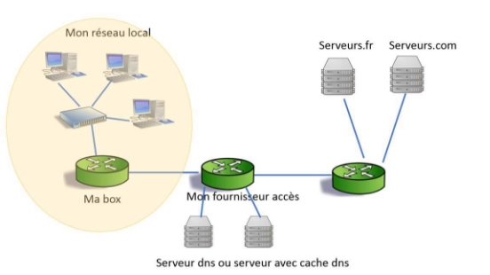
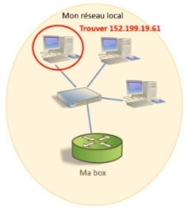
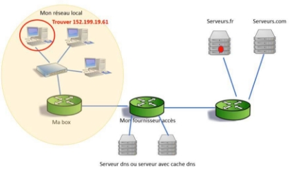
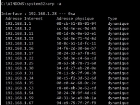
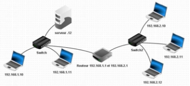

**Table des matières** 

1. [Que se passe-t-il lorsqu’on veut afficher une page web dans le navigateur ?](#_page0_x40.00_y569.92)
2. [Observation d’un réseau](#_page5_x40.00_y260.92)
3. [Le protocole ARP](#_page5_x40.00_y455.92)
4. [Le modèle TCP/IP](#_page5_x40.00_y630.92)
5. [Menaces courantes sur les réseaux](#_titre5)
6. [Mesures de protection des réseaux](#_titre6)
7. [Analyse de trame](#_titre7)
8. [Simulation d’un réseau avec Filius](#_page10_x40.00_y36.92)

**Un  réseau**  est  une  **connexion  de  plusieurs machines  entre  elles,**  afin  qu’elles  puissent  communiquer, échanger des informations suivant **des protocoles communs (règles communes)** définis à l’avance. 

Le mot **réseau** s’applique aussi bien à l’ensemble des machines qu’aux infrastructures qui les relient.  

**Video 1** : Histoire de l’internet[ https://ladigitale.dev/digiview/#/v/6690fd5d7c1bd ](https://ladigitale.dev/digiview/#/v/6690fd5d7c1bd) 

Le Web correspond à **World Wide Web**, composé de worldwide (« **mondial** ») et de web (« **toile d’araignée** ») 

## <H2 STYLE="COLOR:BLUE;">**1. Que<a name="_page0_x40.00_y569.92"></a> se passe-t-il lorsqu’on veut afficher une page web dans le navigateur ?**</H2>

On a différents éléments : 


### <H3 STYLE="COLOR:GREEN;">**1.1. Une<a name="_page0_x40.00_y699.92"></a> adresse MAC**</H3>

Une **adresse MAC** (Media Access Control), parfois appelée **adresse physique**, est un **identifiant physique** stocké dans **une carte réseau** ou **une interface réseau** similaire. Elle est **unique au monde**. 

### <H3 STYLE="COLOR:GREEN;">**1.2. Une<a name="_page1_x40.00_y36.92"></a> adresse IP**</H3>

Une **adresse IP** (Internet Protocol), est un numéro d’identification qui est **attribué de façon permanente ou provisoire à chaque périphérique relié à un réseau informatique qui utilise l’Internet Protocol**.  L’adresse IP est à la base du **système d’acheminement** (le **routage**) des paquets de données sur Internet. 

Il existe des adresse IP de **version 4 (IPV4)** sur 32 bits et de **version 6 (IPV6)** sur 128 bits. La version 4 est actuellement la plus utilisée. 

### <H3 STYLE="COLOR:GREEN;">**1.3. Anatomie<a name="_page1_x40.00_y162.92"></a> d’une adresse IP**</H3>  
#### <H4 STYLE="COLOR:MAGENTA;">**1.3.1. Adresse<a name="_page1_x40.00_y181.92"></a> machine**</H4>

Chaque  adresse  IP  contient  deux  informations  basiques,  **une  adresse  de  réseau**  et  une  **adresse  d'hôte**.  La combinaison des deux désigne de **manière unique** une machine et une seule sur un réseau. 

La partie réseau  (**NetID**) aussi appelé **préfixe**, de l'adresse IP vient toujours en tête, la partie hôte (**HostID**) est donc toujours en queue. 

*Exemple : une machine dont l’adresse serait 131.254.100.48.* 


|*Réseau* |*Réseau* |*Réseau* |*Machine* |
| - | - | - | - |
|*131* |*254* |*100* |*48* |

*Exemple :* 

*Si les trois premiers octets désignent l’adresse du réseau, toutes les machines de  ce réseau auront une adresse commençant par 131.254.100.xxx.*  

On indique toujours la taille du préfixe à la suite de l’adresse IPv4. Dans notre exemple la machine aura l’adresse suivante : 131.254.100.48 **/24.**  

Les 24 premiers bits désignent le préfixe du réseau :  

**10000011.11111110.01100100**.**xxxxxxxx/24**  

**Combien de machines sont adressables sur ce réseau ?**

On a l’identification de l’interface réseau de la machine comprend **8 bits**, on peut donc avoir 28 = **256 possibilités** soit 256-2 = **254 machines différentes** dans le réseau.  

Il y a deux **adresses réservées** : 

- la **zéro (adresse du sous réseau)** 
- la **255** (c’est le **broadcast (adresse de diffusion)** : envoie vers toutes les machines) 
#### <H4 STYLE="COLOR:MAGENTA;">**1.3.2. Adresse<a name="_page1_x40.00_y612.92"></a> du sous réseau**</H4>

On obtient **l'adresse du sous réseau** avec l'opérateur AND  

**Exemple 1 : Par exemple : Voici une IPv4 192.168.1.55/24 et son masque de sous réseau 255.255.255.0** En binaire cela donne 
```
  	 11000000.10101000.00000001.00110111 
AND  11111111.11111111.11111111.00000000

   	 11000000.10101000.00000001.000000000 
```
(AND : cela fait 1 quand les deux bits sont à 1) cela fait :
* soit 192.168.1.0 **c'est l'adresse du (sous) réseau**.
* et 192.168.1.255 **c'est l'adresse du broadcast**.

On comprend vite que donner ces réponses avec des masques de 255 et 0 **est très simple** et ne nécessite pas le passage en binaire. 
```
192.168.1.239/24
 	=> 192.168.1.0 pour le sous réseau
	=> 0.0.0.239 pour la partie hôte
	=> 192.168.1.255 pour le broadcast
192.168.1.239/16
 	=> 192.168.0.0 pour le sous réseau
	=> 0.0.1.239 pour la partie hôte
	=> 192.168.255.255 pour le broadcast
192.168.1.239/8
 	=> 192.0.0.0 pour le sous réseau
	=> 0.168.1.239 pour la partie hôte
	=> 192.255.255.255 pour le broadcast
```


**Exemple 2 : Par exemple 90.98.100.3/21** indique que le masque est 11111111.11111111.11111000.00000000 soit 255.255.248.0 

Cherchons l'adresse du sous réseau puis de l'hôte destination: 
```
     01011010.01100010.01100100.00000011 
AND  11111111.11111111 .11111000.00000000

     01011010.01100010.01100000.000000000 
```

soit 90.98.96.0 pour IP **du (sous) réseau**  
L'adresse de broadcast sera: 
```01011010.01100010.01100111.1111111111=> 90.98.103.255```

Pour aller plus loin:

- Protocole IP[ https://www.commentcamarche.net/contents/530-le-protocole-ip ](https://www.commentcamarche.net/contents/530-le-protocole-ip)

- Classes d’adresse[ https://www.inetdoc.net/articles/adressage.ipv4/adressage.ipv4.class.html ](https://www.inetdoc.net/articles/adressage.ipv4/adressage.ipv4.class.html)

#### <H4 STYLE="COLOR:MAGENTA;">**1.3.3. Adresse<a name="_page2_x40.00_y473.92"></a> publique et adresse privée**</H4>


Les **adresses publiques** permettent à une machine de communiquer avec l’Internet. 

Les **adresses privées** peuvent être attribuées dans des réseaux internes qui n’ont pas vocation à

 communiquer directement avec Internet. On dit que les adresses privées **ne sont pas routables** 

Si  un  réseau  utilisant  **un  adressage  privé**  veut  communiquer  avec  l’Internet,  il  faudra  qu’un  équipement fasse une **translation** (ou traduction)  entre l’adresse privée et une adresse publique qui  serait disponible pour dialoguer avec l’Internet. On  appelle cette opération le **NAT**[^1].  

### <H3 STYLE="COLOR:GREEN;">**1.4. Un<a name="_page3_x40.00_y36.92"></a> switch (commutateur réseau)**</H3>

Un commutateur est un dispositif qui **achemine les données issues** d'un des différents **ports d'entrée vers un port de sortie spécifique** qui, à son tour, transfère ces données vers la destination prévue. 

Le commutateur **garde en mémoire dans une table, l'adresse mac des destinataires.** Il décode ainsi **l'en-tête du paquet** pour y trouver son **adresse mac et l'envoyer uniquement à l'ordinateur concerné.** 

Lorsqu'il reçoit une trame destinée à une adresse présente dans cette table, le commutateur renvoie la trame sur le port correspondant.  

- Si **pas de problème** la **trame est transmise** 
- Si le **port de destination est le même que celui de l'émetteur**, la **trame n'est pas transmise**.  
- Si **l'adresse du destinataire est inconnue** dans la table, alors la trame est traitée **comme un broadcast**, c'est-à-dire qu'elle est transmise à tous les ports du commutateur à l'exception du port de réception. 

### <H3 STYLE="COLOR:GREEN;">**1.5. Un<a name="_page3_x40.00_y209.92"></a> routeur**</H3>

Le routeur est un périphérique faisant la **liaison entre deux réseaux**.  

Un routeur est un élément intermédiaire dans un réseau informatique assurant le **routage des paquets** entre réseaux indépendants. Ce routage est réalisé selon un ensemble de règles formant la **table de routage**.  

### <H3 STYLE="COLOR:GREEN;">**1.6. Etude<a name="_page3_x40.00_y273.92"></a> de cas concret**</H3>

Je veux aller sur[ www.nsi.fr.](http://www.nsi.fr/) Cette adresse n’existe pas sous cette forme. On a besoin de l’adresse réelle de ce site : **son IP**.  

- C’est le rôle du **serveur DNS**. 

Cette IP est de la forme : 200.16.0.1  



J’interroge : 

- ma box  
- puis mon fournisseur d’accès qui a un serveur DNS.  

Une fois l’adresse IP connue elle me renvient. 

J'ai enfin **l'adresse IP** du site que je veux voir. Mon ordinateur va pouvoir demander à ce que je vois cette page. Pour cela, le procédé est du **même type** que la recherche DNS 

Je regarde si la page est dans le **cache du navigateur**. Sinon, mon programme (le navigateur) va se débrouiller  pour **envoyer ma demande sur internet** et faire en sorte  que la réponse me revienne   


1. Il faut que je dise quel genre de données je veux, c'est la **couche application** (couche 4) qui décide cela. Ici on veut une page **html** 

2. La **couche transport** (couche 3) va dire qu'elle veut une page html: elle va appliquer le **protocole TCP** car c'est celui qui est approprié à cette demande et dire qu'elle fait une requête http. Ce message est un **segment TCP.** 

3. elle prépare un message en donnant: ip de destination, son ip et tout ce que l'on a dit avant  ! C'est la **couche internet** (couche 2). Ce message est **un paquet.** 

4. Notre poste possède **une table ARP** (address resolution protocol). Elle contient des associations **d'adresses IP et des adresses MA**C. 

**2 cas : soit la table ARP connait ou ne connait pas notre box !** 

- Si la **table ARP connait notre box** notre message va aller vers lui 
- Si la **table ARP** ne connait pas notre box ? 

La destination ip n'est pas dans mon réseau donc je dois trouver l'adresse mac **de ma passerelle** par défaut (ma box). Je sais que c'est par là que j'en sors. 

1. J'envoie donc une **requête ARP**. (« je cherche Ma box  »). Je donne mon adresse mac et celle que je veux. Je ne donne pas mon IP. On ne va pas quitter notre réseau. Le rôle d'une requête ARP est la **recherche d'adresse MAC**. 
2. Le switch reçoit cette requête. Du coup il connait maintenant ma MAC adresse! il l'ajoute à sa table. S'il connait l'adresse **MAC de ma box, il me la renvoie.** 
3. S'il ne la connait pas? Le switch va faire du **'flooding**'. Il va **dupliquer**  ma demande ARP et l'envoyer à tout le monde autour de lui. Celui qui se reconnait comme destination en profite pour m'enregistrer dans sa table ARP et fait une réponse ARP (**'c'est moi**'). Son adresse MAC passe dans **ma table ARP** 

Maintenant je connais la sortie vers l'internet, j'avais commencé à préparer un **paquet** avec : 

- les données  
- les  IP (src et dst)  
- et j’ajoute maintenant **mon adresse mac et l'adresse mac de la sortie** vers l'internet  

On est donc en **couche Réseau** : couche 1.  

Cet ensemble est appelé **TRAME** (ou **frame**), le protocole employé est nommé **Ethernet.** 

Tout cela arrive au routeur « ma box ». Il regarde la trame, voit qu'elle lui est destinée ! Il regarde donc le **paquet** (IP src, IP dst).  

Le routeur va chercher dans sa **table de routage** pour voir s'il connait cette adresse.   

- Si oui il suit la route en reformant une trame avec le même paquet mais en adresse de destination il met la nouvelle. 
- Si non, il reforme une **trame en conservant** le paquet et une destination vers un autre serveur. 



On arrive enfin au serveur contenant ma page ! 

Il lit la trame. Ah !! mais c’est pour moi (mon adresse mac). Il ouvre alors le **segment TCP**. C’est son IP. Il regarde donc les données …. Et là il voit une **requête HTTP**. 

Le serveur doit envoyer une page html, son application lui dit qu’on va utiliser le HTTP, donc le **protocole TCP.** Il fait le **paquet IP** avec :  

- mon IP,  
- son IP  
- le **segment TCP** 

On ajoute par le **protocole Ethernet** :  

- mon port comme destination,  
- le sien 
- le paquet IP  

Et c’est reparti !! Par forcément par la même route 

## <H2 STYLE="COLOR:BLUE;">**2. Observation<a name="_page5_x40.00_y260.92"></a> d’un réseau**</H2>

**<H3 STYLE="COLOR:red;">Activité n°1.:</H3>** Dans une fenêtre **cmd** lancer les commandes 

- **hostname** : affiche le nom réseau de l'ordinateur 
- **ipconfig** (ifconfig sous linux): affiche un résumé des propriétés IP des cartes réseaux. Vous pourrez voir l'IP, le masque de sous réseau, la passerelle par défaut, si vous êtes en IPv6 ou Ipv4. 
- **ipconfig /all** : donne en plus le nom de l'ordinateur (l'hôte) l'adresse MAC, le serveur dns 
- **ipconfig /flushdns** : vide le cache dns 
- **ipconfig /displaydns** : affiche le cache dns 
- **ping** : suivi d'une ip ou d'une adresse de site, teste la connexion vers le site 
- **tracert**: suivi d'une ip ou d'une adresse de site, affiche tous les sauts (la route) permettant l'accès au site demandé. 
- **netstat**: permet d'afficher les ports actifs. Utile pour détecter un virus 
## <H2 STYLE="COLOR:BLUE;">**3. Le<a name="_page5_x40.00_y455.92"></a> protocole ARP**</H2>

**ARP** (Adresse Resolution Protocol) est un protocole de communication, compagnon du protocole IP qui permet de **mettre en correspondance une adresse IPv4** d’un équipement **avec l’adresse physique** (MAC codage unique de l’équipement  quelque soit

 le réseau)  

*Pour aller plus loin Protocole ARP :*   
[*https://www.supinfo.com/articles/single/2440-protocole-arp* ](https://www.supinfo.com/articles/single/2440-protocole-arp) 


Par exemple : la table ARP de mon ordinateur ci-contre

 


**<H3 STYLE="COLOR:red;">Activité n°2.:</H3>** Dans une fenêtre **cmd** lancer la commande   l’instant fait 
```arp -a```

## <H2 STYLE="COLOR:BLUE;">**4. Le<a name="_page5_x40.00_y630.92"></a> modèle TCP/IP**</H2>
### <H3 STYLE="COLOR:GREEN;">**4.1. Principe<a name="_page5_x40.00_y658.92"></a> des couches**</H3>

Le **modèle OSI** (Open Systems Interconnexion) est une **norme de communication**, en réseau, de tous les systèmes informatiques. C'est un modèle de communications entre ordinateurs. Il fut conçu dans les années 70. 

A l’époque de sa sortie, les grands opérateurs télécoms européens, alors tous publics, le combattent.  

C'est à cause de ce retard et de son contexte trop peu ouvert, que la norme OSI **sera supplantée par TCP/IP** dans le domaine de l'Internet naissant puisqu'il sera adopté par le **réseau Arpanet le 1er janvier 1983.**

Le sigle **TCP/IP regroupe un ensemble de protocoles** dont **TCP et IP.** Cette famille de protocole a été mise au point à partir d’une étude commandée au début des années 1970 par le DARPA (Defense Advanced Project Research Agency) qui dépend du département de la défense américaine. 

A l’origine, un groupe de réseaux TCP/IP interconnectés était appelé inter-réseau ou **inter-net.** 

### <H3 STYLE="COLOR:GREEN;">**4.2. Les<a name="_page6_x40.00_y147.92"></a> rôles des couches dans le modèle TCP/IP**</H3>

Le **modèle TCP/IP** est une suite de protocoles utilisées pour le transfert des données sur Internet. Il comporte  **4 couches** :  

- La couche **application** (couche n°4) se charge de traduire en langage machine les messages qui seront envoyés sur le réseau Internet. 
- La couche **transport** (couche 3) permet d’envoyer les messages à la bonne application  et s’occupe de découper les paquets, vérifier les erreurs etc.. 
- La couche **Internet** (couche 2) va s’occuper de l’acheminement des données de bout en bout sur Internet, c’est ce qu’on appelle le routage. Elle gère aussi le réassemblage des paquets à la réception. 
- La couche **Réseau** (couche 1) va acheminer les données de routeur en routeur par les réseaux Internet  

### <H3 STYLE="COLOR:GREEN;">**4.3. Principe<a name="_page6_x40.00_y290.92"></a> de l’encapsulation**</H3>


Chaque couche **ne s’occupe que du rôle qu’elle a à jouer**  et non du rôle de la précédente.  

### <H3 STYLE="COLOR:GREEN;">**4.4. Application<a name="_page6_x40.00_y409.92"></a> au modèle  TCP/IP**</H3>   


En émission les données traversent chacune des couches de la machine émettrice et à chaque couche une information est ajoutée au paquet de données => c’est l’entête 

L’entête définit le protocole utilisé dans chaque couche => c’est **l’encapsulation** 

Le message est découpé en segment.  
Chacun des segments est alors **encapsulé** dans un **paquet TCP** comprenant en particulier les numéros de ports des applications sources et destinataires.  
Ce paquet TCP est alors transmis à la **couche Internet** qui **l’encapsule** dans un **datagramme IP**.  
Celui-ci est ensuite transmis à la **couche Réseau** qui l’encapsule dans une **trame Ethernet**. 


L’entête est lu, interprétée et supprimée => **désencapsulation** 

### <H3 STYLE="COLOR:GREEN;">**4.5. Etablissement<a name="_page7_x40.00_y349.92"></a> de la communication TCP (« three way handshake »)**</H3>

Une communication TCP s’établit selon le principe d’une connexion en trois temps (three way handshake = poignée de main en trois temps) 

- **Le client envoie** un numéro aléatoire de séquence dans un paquet TCP : qui sera un **SYN** 

Exemple : 1010 

- **Le serveur qui reçoit** le paquet SYN génère un numéro aléatoire  **qu’il va renvoyer** dans un paquet particulier (**SYN-ACK**) qui contient aussi le numéro du client incrémenté de 1. Ce paquet est à la fois un accusé  de  réception  (acknowledgement)  pour  le  client  et  une  synchronisation  au  niveau  des  numéros d’échange côté serveur et client. 

Exemple : 1010 + 1 = 1011 et le numéro aléatoire 3002 

- **Le client qui reçoit** ce paquet se considère connecté au serveur et envoie un dernier paquet particulier (ACK) dans lequel le numéro de séquence serveur aura été incrémenté. Le serveur qui reçoit ce paquet se considère à son tour connecté au client. 

Exemple : 3002 + 1 = 3003 


*Il existe une technique de piratage, appelée spoofing IP, permettant de corrompre cette relation d'approbation ! *

### <H3 STYLE="COLOR:GREEN;">**4.6. Fiabilité<a name="_page8_x40.00_y36.92"></a> des transferts : protocole du bit alterné**</H3>

Le protocole TCP permet d’assurer le transfert des données de façon fiable. Pour cela, il possède un **système d’accusé de réception** permettant au client et au serveur de s’assurer de la bonne réception mutuelle des données.  

- **Cas où l’échange se passe correctement** 

Dans le protocole du **bit alterné**, l’émetteur envoie les données encapsulées dans des trames contenant entre autres informations techniques, **le bit de séquence.** La couche émettrice **alterne la valeur du bit de séquence d’une trame émise à l’autre**.  

- Lors de l’émission d’un segment, un numéro d’ordre est associé. La première trame aura pour **drapeau (flag) 0**.  

- A réception d’un segment de donnée, la machine réceptrice va retourner un segment de donnée dont le **drapeau** (flag) ACK (acknowledgement : accusé de réception) **est à 1** (afin de signaler qu’il l’a bien reçu) accompagné d’un numéro d’accusé de réception égal au **numéro d’ordre précédent** qui seront ajouter au niveau de l’entête. 


- **Cas où la trame émise n’est pas reçue** 

Si la trame émise n’est pas reçue, l’émetteur réagit. Il constate, en effet, qu’il n’a pas reçue d’accusé de réception dans les délais et renvoie la trame 


- **Cas du chevauchement de message** 

En fait la trame n’a pas été perdu, elle arrive tout de même à destination. Le récepteur reçoit finalement deux trames identiques, mais écartera la seconde car son bit de séquence ne correspondra pas au bit attendu.  


- **Cas du chevauchement d’acquittements** 

Il en va de même pour le chevauchement d’acquittements. Le récepteur rejettera l’acquittement qui n’aura pas le bit de séquence attendu. 


- **Pourquoi bit alterné ?** 

La règle est relativement simple : la première trame envoyée par A aura pour drapeau 0, dès cette trame reçue par B, ce dernier va envoyer un accusé de réception avec le drapeau 1 (ce 1 signifie "la prochaine trame que A va m'envoyer devra avoir son drapeau à 1"). Dès que A reçoit l'accusé de réception avec le drapeau à 1, il envoie la 2e trame avec un drapeau à 1, et ainsi de suite... 

*Pour aller encore plus loin : TCP sur site[ https://www.frameip.com/entete-tcp/ ](https://www.frameip.com/entete-tcp/) *

## <H2 STYLE="COLOR:BLUE;">**5. Menaces courantes sur les réseaux<a name="#_titre5"></a>**</H2>

### <H3 STYLE="COLOR:GREEN;">**5.1. Phishing**</H3>
- **Description** : Le phishing est une technique de fraude où un attaquant se fait passer pour une entité de confiance pour obtenir des informations sensibles comme des identifiants de connexion, des numéros de carte bancaire, etc.
- **Exemple** : Un utilisateur reçoit un email qui semble provenir de sa banque, lui demandant de vérifier ses informations de compte en cliquant sur un lien qui mène à un faux site web.

### <H3 STYLE="COLOR:GREEN;">**5.2. DDoS (Distributed Denial of Service)**</H3>
- **Description** : Une attaque DDoS vise à rendre un service ou un réseau indisponible en le submergeant de trafic provenant de multiples sources. Cela surcharge les serveurs et les réseaux, empêchant les utilisateurs légitimes d'accéder aux services.
- **Exemple** : Un site web d'e-commerce est bombardé de requêtes malveillantes provenant de milliers d'ordinateurs compromis, rendant le site inaccessible aux clients.

### <H3 STYLE="COLOR:GREEN;">**5.3. Man-In-The-Middle (MITM)**</H3>
- **Description** : Dans une attaque MITM, un attaquant intercepte et peut altérer les communications entre deux parties sans qu'elles le sachent. Cela permet à l'attaquant de voler des informations sensibles ou d'injecter des données malveillantes.
- **Exemple** : Un utilisateur se connecte à un Wi-Fi public et un attaquant intercepte les communications entre l'utilisateur et un site web sécurisé, dérobant ainsi les identifiants de connexion de l'utilisateur.

## <H2 STYLE="COLOR:BLUE;">**6. Mesures de protection des réseaux<a name="#_titre6"></a>**</H2>

### <H3 STYLE="COLOR:GREEN;">**6.1. Firewalls**</H3>
- **Description** : Un firewall est une barrière de sécurité qui surveille et contrôle le trafic réseau entrant et sortant en fonction de règles de sécurité prédéfinies. Il peut être matériel, logiciel, ou les deux.
- **Fonctionnement** : 
  - **Filtrage des paquets** : Analyse chaque paquet de données entrant ou sortant et le bloque ou le permet en fonction des règles établies.
  - **Proxy** : Intercepte toutes les communications entre les utilisateurs et le réseau, les inspecte et les transfère si elles sont sûres.
- **Exemple** : Un firewall bloque les tentatives de connexion non autorisées provenant d'adresses IP suspectes.

### <H3 STYLE="COLOR:GREEN;">**6.2. VPN (Virtual Private Network)**</H3>
- **Description** : Un VPN crée une connexion sécurisée et chiffrée entre l'utilisateur et le réseau, permettant de masquer l'adresse IP de l'utilisateur et de protéger ses données contre les interceptions.
- **Fonctionnement** :
  - **Tunneling** : Les données sont encapsulées dans un protocole de tunneling et chiffrées, rendant difficile pour les attaquants d'intercepter ou de lire les informations.
  - **Authentification** : Utilise des protocoles d'authentification pour s'assurer que seuls les utilisateurs autorisés peuvent accéder au réseau.
- **Exemple** : Un employé utilise un VPN pour accéder aux ressources de l'entreprise en travaillant à distance, garantissant que les données transmises sont sécurisées.

### <H3 STYLE="COLOR:GREEN;">**6.3. Chiffrement**</H3>
- **Description** : Le chiffrement transforme les données en une forme illisible pour toute personne non autorisée. Seules les parties possédant la clé de déchiffrement peuvent lire les données.
- **Fonctionnement** :
  - **Chiffrement symétrique** : Utilise la même clé pour chiffrer et déchiffrer les données.
  - **Chiffrement asymétrique** : Utilise une paire de clés (publique et privée). La clé publique chiffre les données, et seule la clé privée correspondante peut les déchiffrer.
- **Exemple** : Les transactions bancaires en ligne utilisent le chiffrement SSL/TLS pour sécuriser les données échangées entre le client et le serveur bancaire.

## <H2 STYLE="COLOR:BLUE;">**7. Mesures de protection des réseaux<a name="#_titre7"></a>**</H2>

<H3 STYLE="COLOR:red;">**Activité n°3 :**</H3> Analyse d'une trame fictive

```
Frame 1: 66 bytes on wire (528 bits), 66 bytes captured (528 bits) on interface en0, id 0
Ethernet II, Src: 00:0c:29:36:bc:5a, Dst: 00:50:56:c0:00:01
Internet Protocol Version 4, Src: 192.168.1.101, Dst: 192.168.1.1
Transmission Control Protocol, Src Port: 443, Dst Port: 56324, Seq: 1, Ack: 1, Len: 0
```
- Question 1 : Adresse MAC : Quelle est l'adresse MAC source et l'adresse MAC de destination ?
- Question 2 : Adresse IP: Quelle est l'adresse IP source et l'adresse IP de destination ?
- Question 3 : Protocole utilisé : Quel protocole de couche transport est utilisé par cette trame ?
- Question 4 : Ports utilisés : Quels sont les ports source et destination ?
- Question 5 : Numéro de séquence et d'accusé de réception : Quel est le numéro de séquence et le numéro d'accusé de réception de cette trame TCP ?

**Remarque** pour faire une analyse de trame, on peut utiliser un logiciel type wiresharp
**Installation et prise en main de Wireshark**
1. **Installation de Wireshark**
   - Aller sur le site officiel de Wireshark : [https://www.wireshark.org/](https://www.wireshark.org/).
   - Télécharger la version appropriée pour votre système d'exploitation (Windows, macOS, Linux).
   - Suivre les instructions d'installation.

2. **Premier lancement et configuration**
   - Ouvrir Wireshark.
   - Sélectionner l'interface réseau à utiliser pour la capture (par exemple, Wi-Fi ou Ethernet).
   - Démarrer une capture en cliquant sur le bouton "Start capturing packets".


**Capture et analyse de trames réseau**

1. **Démarrer une capture réseau**
   - Avec Wireshark ouvert et une capture en cours, ouvrir un navigateur web et visiter quelques sites web (ex. : www.google.com, www.wikipedia.org).
   - Retourner à Wireshark et arrêter la capture en cliquant sur le bouton "Stop capturing packets".

2. **Analyse des trames capturées**
   - Dans la fenêtre principale de Wireshark, vous verrez une liste de trames capturées.
   - Sélectionner une trame TCP et observer les détails dans les différentes sections (Frame, Ethernet, IP, TCP).


## <H2 STYLE="COLOR:BLUE;">**8.  Simulation d’un réseau avec Filius<a name="_page10_x40.00_y36.92"></a>**</H2>

<H3 STYLE="COLOR:red;">**Activité n°4.:**</H3> Lien direct entre deux ordinateurs  


- Lancer Filius  
- Créer le réseau ci contre.   
- Lancer la simulation   
- Sur le poste 10 installer Ligne de commande  
- Ouvrir le logiciel et faire ping 192.168.1.11  
- Afficher les données échangées avec un click droit sur l’ordinateur 
- Faire un ipconfig dans le cmd du poste 10 et comparer l’adresse Mac avec l’adresse Mac de la source sur le tabelau des données échangées  

<H3 STYLE="COLOR:red;">**Activité n°5.:**</H3> 2 ordinateurs et un serveur  

-

 Modifier le réseau précédent pour mettre un serveur 192.168.1.12 et un switch  
- Installer sur le serveur générique (port 55555) et démarrer le serveur  
- sur  un  des  ordinateurs  installer  client  générique  et connecter  le  client  au  serveur   
- envoyer un message au serveur en utilisant le client générique  
- Afficher les données échangées avec un click droit sur l’ordinateur  

La couche de transport est utilisée pour la première fois. On voit :  

Selon le protocole de communication TCP, une connexion entre deux hôtes s’établit 

en trois étapes : Tri-wayhandshake. Dès la connexion on définit les numéros de séquence que l’on utilisera pour le transfert de données TCP 

1. SYN : le client qui désire établir une connexion avec le serveur va envoyer un premier paquet SYN (synchronize) au serveur. Le numéro de séquence de ce paquet est un nombre aléatoire A. 
1. SYN-ACK : le serveur va répondre au client à l’aide d’un paquet SYN-ACK (synchronize acknowledge). Le numéro du ACK est A+1. Tandis que le numéro de séquence du paquet SYN-ACK est un nombre aléatoire B. 
1. ACK : pour terminer, le client va envoyer un paquet ACK au serveur qui va servir d’accusé de réception. Le numéro de séquence de ce paquet est défini par A+1 et le numéro du ACK est B+1 

Puis envoi du message du client au serveur L’accusé de réception du serveur au client en A+2 L’envoi du message du serveur au client L’accusé de réception du client en B+2 

- Cliquer sur déconnexion  

On voit des échanges entre le client et le serveur en 4 temps 

<H3 STYLE="COLOR:red;">**Activité n°6.:**</H3> 2 réseaux  


- Modifier le réseau précédent pour obtenir  les deux réseaux inter connectés suivants :  
- Pinguer depuis le poste en 1.10 le poste en 2.10   

Normalement le message n’arrive pas à quitter le  premier réseau pour le second.  

Il  faut  donc  indiquer  une  passerelle  qui  sera  l’adresse du routeur 192.168.1.1 et 192.168.1.2  

- Mettre une passerelle sur chaque ordinateur en 1.x et faire de même pour chaque ordinateur en 2.x. 
- Pinguer de nouveau depuis le poste en 1.10, le poste en 2.10 
- Installer un client générique sur le poste 2.10 et connecter le poste en 2.10 au serveur en 1.12 pour lui envoyer le message « bonjour » 
- Afficher et observer les données échangées 

<H3 STYLE="COLOR:red;">**Activité n°7.:**</H3> Simulation du web avec adresse IP 

- Installer un serveur web  et un éditeur de texte sur le serveur en 1.12 
- Utiliser l’éditeur de texte pour ouvrir le fichier index.html qui se trouve sur le répertoire root/webserver 

- Modifier pour qu’il affiche une de vos pages créées. Pour cela installer un explorateur de document. Importer la page1.html, importer le fichier script.js dans un dossier js et le fichier style.css dans un dossier css et éventuellement les images dans un dossier images. Renommer index.html en indexold.html et renommer la page1.html en index.html 
Sauvegarder. 

- Sur le bureau de votre serveur web, lancer l’application «Serveur Web ». Appuyer sur « Démarrer ». 
- Ensuite installer un navigateur web sur le poste 2.10. Lancer et se connecter au serveur 1.12 en tapant l’URL ```http://192.168.1.12``` dans la barre d’adresse du navigateur. 

On voit deux choses : le css ne fonctionne pas ni le codage utf-8 !! 

<H3 STYLE="COLOR:red;">**Activité  n°8.:**</H3>  Simulation  du  web  avec  serveur DNS  

Normalement on ne s’adresse pas ainsi à un  serveur : on n’utilise pas l’adresse IP mais  son url. Le serveur de noms de domaine (ou  DNS) va traduire url en IP.  

- Il faut ajouter un serveur d’adresse IP  192.168.3.10 et comme passerelle on  mettra  192.168.3.1.  et  ajouter  une  connexion au routeur en 192.168.3.1  
- Pour  permettre  à  tous  les  postes  d’utiliser les services du DNS, il faut ajouter l’adresse IP du DNS dans la configuration de tous les ordinateurs du réseau. Sur chaque ordinateur rajouter dans serveur DNS l’IP du serveur DNS. 
- Installer sur le serveur DNS l’application serveur DNS. Lancer et paramétrer pour faire correspondre l’adresse : .www.serverwebdensi.fr avec 192.168.1.12 (IP du serveur). Puis démarrer le serveur DNS. 
- Sur le poste 2.10, taper l’url[ www.serverwebdensi.fr.](http://www.serverwebdensi.fr/)  

Le DNS fait son travaille 
Vérification :  

- Aller sur le poste1.10. Dans l’editeur de commande taper host[ www.serverwebdensi.fr.](http://www.serverwebdensi.fr/) Observer 

<H3 STYLE="COLOR:red;">**Activité n°9.:**</H3> Chemin d’un client à un serveur 

- ouvrir le fichier snt\_sim\_res.fls. 
- Faire un "traceroute" entre l'ordinateur M14 et l'ordinateur M9 (n'oubliez pas de faire un "ipconfig" sur la machine M9 afin d'obtenir son adresse IP). Noter le chemin parcouru pour aller de la machine M14 à la machine M9. 
- Supprimer le câble réseau qui relie le routeur F au routeur E (simulation de panne), refaites un "traceroute" entre M14 et M9. Que constatez-vous ? (ATTENTION : cela peut ne pas fonctionner du premier coup, car la mise à jour des tables de routage n'est pas immédiate : vous pouvez essayer de faire un ping entre M14 et M9, si cela ne fonctionne pas (timeout), attendez quelques secondes et recommencez. Une fois que le ping fonctionne, vous pouvez faire le traceroute). 

Sous windows c’est tracert 

<H3 STYLE="COLOR:red;">**Activité n°10.:**</H3> Chemin d’un client à un serveur version graphique 

Sur le site[ https://gsuite.tools/traceroute ](https://gsuite.tools/traceroute)on pourra voir le chemin vers un des serveurs de plusieurs site web 

- Visualiser le chemin pour le site gs-cassaigne.fr (on peut zoomer) 
- Visualiser le chemin pour le site aliexpress.com (site chinois) 
- De même pour[ www.intechinfo.fr ](http://www.intechinfo.fr/)
- De même pour malekal.com 

commande ipconfig pcastuces :[ https://www.pcastuces.com/pratique/windows/outils_reseau/page4.htm ](https://www.pcastuces.com/pratique/windows/outils_reseau/page4.htm)

commande ipconfig papergeek[ https://www.papergeek.fr/ipconfig-comment-connaitre-son-adresse-ip-locale-et-son- adresse-mac-sous-windows-80996 ](https://www.papergeek.fr/ipconfig-comment-connaitre-son-adresse-ip-locale-et-son-adresse-mac-sous-windows-80996)


[^1]: Network Address Translation : Traduction d’adresse réseau