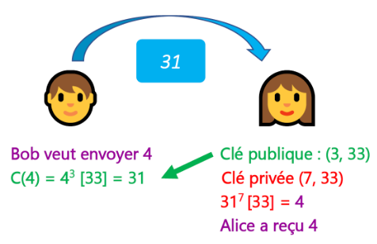
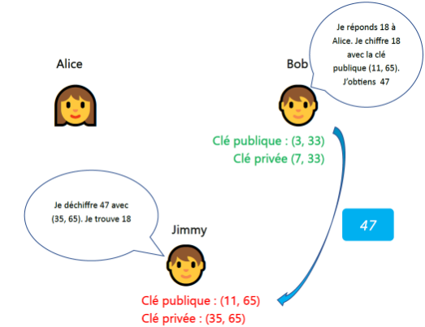
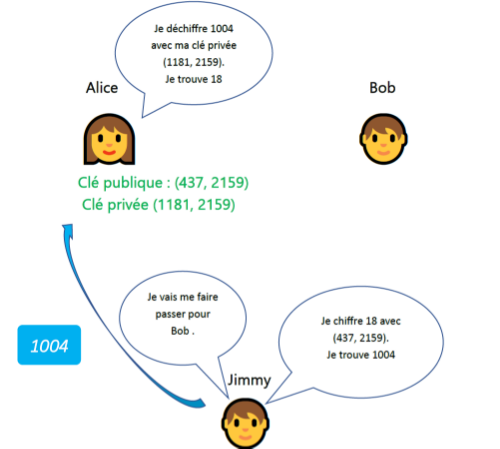
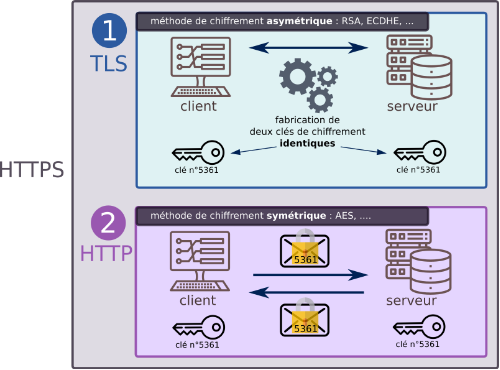

**Table des matières**

[1.	Rappels	](#_toc174920494)

[2.	Vocabulaire	](#_toc174920495)

[3.	Introduction	](#_toc174920496)

[4.	Le chiffrement	](#_toc174920497)

[5.	Le protocole HTTPS	](#_toc174920506)

[6.	Exercices	](#_toc174920509)

[7.	Projet	](#_toc174920510)

**Compétences évaluables :**

- Décrire les principes de chiffrement symétrique (clef partagée) et asymétrique (avec clef privée/clef publique)
- Décrire l’échange d’une clef symétrique en utilisant un protocole asymétrique pour sécuriser une communication HTTPS

## <a name="_toc174920494"></a>**1. Rappels** 

{: .center}

Avec les acquis du programme de première, nous pouvons comprendre exactement ce qu'il se passe lorsque l'on navigue vers un site web, par exemple « http://gs-cassaigne.fr/ ».

- L'**URL du site** est **décodée** par le navigateur qui isole :
- le protocole (HTTP), 
- le **nom de domaine** (gs-cassaigne.fr) 
- le chemin vers la ressource (ici **/**, la « racine » du site).
- Le navigateur effectue **une résolution de nom** pour déterminer **l'adresse IP** correspondant au nom de domaine (213.186.33.16). (on peut la trouver en faisant un tracert dans la console windows)
- Le navigateur peut alors établir une **connexion TCP** vers l'adresse IP du serveur web, sur le port 80 via un hanshaking en trois temps

- Une fois la connexion établie, client et serveur échangent des données en utilisant le **protocole HTTP** tout en découpant les données en **paquets TCP**, eux-mêmes **encapsulés dans des paquets IP**.

{: .center}

On se souvient aussi que les communications sur Internet utilisent un ensemble de protocoles, organisés en couches:

- **Couche accès réseau** avec des protocoles tels que Ethernet ou 802.11 n.
- **Couche Internet**, avec le protocole IP permettant de définir des routes, c'est-à-dire l'ensemble des machines du réseau traversées pour atteindre la machine de destination.
- **Couche de transport** avec les protocoles UDP ou TCP, qui s'occupent en particulier de garantir l'intégrité des données transmises (garanties minimales pour UDP ou très fortes pour TCP).
- **Couche d'application** dans laquelle se trouvent les protocoles de haut niveau : HTTP, IMAP, etc.

Ce processus a été **très peu modifié depuis la conception** de TCP/IP à la fin des années 1970. 

Chaque protocole (SMTP, FTP, puis HTTP au milieu des années 1990), s'est inséré dans ce cadre au niveau de la couche d'application.

Cependant, avec la démocratisation d'Internet, du Web et la diversification des usages, **des problèmes sont apparus**.

Les paquets IP sont envoyés par la source au prochain routeur de son sous-réseau.

Ce routeur retransmet ensuite le paquet au routeur suivant et ainsi de suite jusqu'à l'arrivée à destination. 

Chaque routeur peut donc inspecter les paquets pour en **connaître le contenu.**

{: .center}

Cette situation n'est **clairement pas idéale.** En effet, si l'on utilise un site web pour effectuer des transactions bancaires, renseigner des informations personnelles (impôts, arrêt maladie, etc.), ou simplement exprimer son opinion, on souhaite que le contenu des messages envoyés ne soit connu que de deux entités: la source et la destination.

Ce simple constat nous permet de mettre en avant trois aspects liés à la sécurisation des communications:

- Comment chiffrer le contenu des communications afin qu'elles ne soient lisibles que par la source et la destination (garantie de **confidentialité**) ?
- Comment garantir que le serveur auquel on se connecte est bien celui auquel on pense se connecter (garantie d'**authenticité**) ?
- Comment s'assurer que le message transmis n'a pas été modifié par un tiers (garantie d'**intégrité**) ?

Le tout devant bien entendu se faire dans le cadre d'une communication en utilisant l'infrastructure d'Internet, à savoir les communications TCP/IP ?


## <a name="_toc174920495"></a>**2. Vocabulaire**

- **Coder**, c'est représenter l'information par un ensemble de signes prédéfinis. **Décoder**, c'est interpréter un ensemble de signes pour en extraire l'information qu'ils représentent.

  Coder et décoder s'emploient lorsqu'il n'y a pas de secret. Par exemple on peut coder/décoder des entiers relatifs par une suite de bits par un «codage en complément à deux».

- La **cryptographie** est une discipline veillant à protéger des messages (pour en assurer la confidentialité, l'authenticité et l'intégrité), par l'intermédiaire de **clés de chiffrements**.

- La cryptographie est utilisée depuis au moins l'antiquité.

- La **cryptanalyse** est la technique qui consiste à déduire un texte en clair d’un texte chiffré **sans posséder la clé de chiffrement**. Le processus par lequel on tente de comprendre un message en particulier est appelé **une attaque**.
- **Chiffrer** un message, c'est rendre une suite de symboles incompréhensible au moyen d'une **clé de chiffrement**.
- **Déchiffrer** ou **décrypter**, c'est retrouver la suite de symboles originale à partir du message chiffré. On utilise **déchiffrer** quand on utilise la clé de chiffrement pour récupérer le texte original, et **décrypter** lorsqu'on arrive à retrouver le message original sans connaitre la clé de chiffrement.

## <a name="_toc174920496"></a>**3. Introduction** 
**Vidéo** : Comprendre le chiffrement SSL \_ TLS avec des emojis \_et le HTTPS

## <a name="_toc174920497"></a>**4. Le chiffrement** 
**Exemple** : Alice veut transmettre un message secret à Bob via un réseau non sécurisé, comme Internet. C’est-à-dire que le message peut être intercepté par une autre personne. Un réseau sécurisé serait par exemple un câble unique allant directement de l’ordinateur d’Alice  à celui de Bob sans intermédiaire et sans autre connexion.  

Le message **doit être chiffré** (crypté) à l’aide d’un algorithme de chiffrement et d’une clé.

### <a name="_toc174920498"></a>**4.1. Le chiffrement symétrique**
#### <a name="_toc174920499"></a>**4.1.1. Le principe**
Dans un chiffrement symétrique, c'est **la même clé** qui va servir au chiffrement et au déchiffrement.

{: .center}

**Qu'appelle-t-on une clé ?** 

La clé est un renseignement permettant de chiffrer ou déchiffrer un message. Cela peut être :

- un nombre (dans un simple décalage des lettres de l'alphabet, comme [le chiffre de César](https://fr.wikipedia.org/wiki/Chiffrement_par_d%C3%A9calage))
- une phrase (dans la méthode du [masque jetable](https://fr.wikipedia.org/wiki/Masque_jetable))
- une image (imaginez un chiffrement où on effectue un XOR par les pixels d'une image)

Un chiffrement **est dit symétrique** lorsque la connaissance de la clé **ayant servi au chiffrement permet de déchiffrer** le message.


**Quel est l'avantage d'un chiffrement symétrique ?** 

Les chiffrements symétriques sont souvent **rapides**, consommant **peu de ressources** et donc adaptés au chiffrement de flux important d'informations.

Comme nous le verrons, la sécurisation des données transitant par le **protocole HTTPS** est basée sur un chiffrement symétrique.

**Quel est l'inconvénient d'un chiffrement symétrique ?**

**L’inconvénient majeur** est de **donner la clef au destinataire** avant l’envoyer le message. En effet, si j’envoie la clef à mon destinataire, elle ne doit pas être chiffrée, toute personne qui intercepte le message peut récupérer la clef partagée et donc intercepter mes futurs messages pour les déchiffrer.

**Un chiffrement symétrique est-il un chiffrement de mauvaise qualité ?** 

NON ! S'il est associé naturellement à des chiffrements simples et faibles (comme le décalage de César), un chiffrement symétrique **peut être très robuste**... voire inviolable.

C'est le cas du masque jetable. Si le masque avec lequel on effectue le XOR sur le message est aussi long que le message, alors il est **impossible** de retrouver le message initial. Pourquoi ?

Imaginons qu'Alice veuille transmettre le message clair "LUNDI". Elle le chiffre avec un masque jetable (que connait aussi Bob), et Bob reçoit donc "KHZOK". Si Marc a intercepté le message "KHZOK", *même s'il sait que la méthode de chiffrement utilisée est celle du masque jetable* (*principe de Kerckhoffs*), il n'a pas d'autre choix que de tester tous les masques de 5 lettres possibles.

Ce qui lui donne 26<sup>5</sup> possibilités (plus de 11 millions) pour le masque, et par conséquent (propriété de bijectivité du XOR) 26<sup>5</sup> possibilités pour le message «déchiffré»...

**Quels sont les chiffrements symétriques modernes ?** 

L'algorithme de chiffrement symétrique le plus utilisé actuellement est le chiffrement [AES](https://fr.wikipedia.org/wiki/Advanced_Encryption_Standard), pour Advanced Encryption Standard.

- chiffrement par bloc de 128 bits, répartis dans une matrice de 16 octets (matrice carrée de taille 4).
- ces 128 bits sont transformés par des rotations, multiplications, transpositions, [...] de la matrice initiale, en faisant intervenir dans ces transformations une clé de 128, 192 ou 256 bits.
- pour l'AES-256 (avec une clé de 256 bits), l'attaque par force brute nécessiterait 2<sup>256</sup> opérations, soit un nombre à 78 chiffres...
- il n'existe pas d'attaque connue efficace à ce jour.

#### <a name="_toc174920500"></a>**4.1.2. Réalisation**

<b>1<sup>ère</sup> étape : le message :</b> Soit le message Hello World! en binaire :
```
010010000110010101101100011011000110111100100000010101110110111101110010011011000110010000100001
```

On a simplement utilisé le code ASCII de chaque caractère (par exemple, on peut vérifier que le H correspond bien à l'octet 01001000). Pour effectuer la "conversion" texte vers code binaire ASCII ou vis versa, vous pouvez utiliser le site <https://www.rapidtables.com/convert/number/ascii-to-binary.html>

<b>2<sup>ème</sup> étape la clef</b> : On choisit un mot (ou une phrase) qui nous servira de clé de chiffrement, prenons pour exemple le mot "toto". "toto" nous donne en binaire :
```
01110100011011110111010001101111
```


<b>3<sup>ème</sup> étape le chiffrement</b> : Pour chiffrer le message nous allons effectuer un XOR bit à bit. Pour rappel, vous trouverez la table de vérité du XOR ci-dessous :

Table de vérité "XOR" :


Comme la clé est plus courte que le message, il faut "reproduire" la clé vers la droite autant de fois que nécessaire (si la taille du message n'est pas un multiple de la taille de la clé, on peut reproduire seulement quelques bits de la clé pour la fin du message):

```
 
  010010000110010101101100011011000110111100100000010101110110111101110010011011000110010000100001
⊕
 
  011101000110111101110100011011110111010001101111011101000110111101110100011011110111010001101111
  ________________________________________________________________________________________________
  001111000000101000011000000000110001101101001111001000110000000000000110000000110001000001001110
```   

Si on cherche à afficher le message chiffré avec un éditeur de texte) : 


Maintenant ce message est prêt pour être envoyé à son destinataire B. Si P intercepte le message et cherche à le lire avec un éditeur de texte, il obtiendra la suite de caractère 

<b>4<sup>ème</sup> étape le déchiffrement</b> : Bob a maintenant reçu le message chiffré, il possède la clé (toto), il va donc pouvoir déchiffrer le message <b>en appliquant un XOR</b> entre le message chiffré et la clé (on applique exactement la même méthode que ci-dessus).

```  
 
  001111000000101000011000000000110001101101001111001000110000000000000110000000110001000001001110
⊕   
 
  011101000110111101110100011011110111010001101111011101000110111101110100011011110111010001101111
  ________________________________________________________________________________________________
  010010000110010101101100011011000110111100100000010101110110111101110010011011000110010000100001

```  


On retrouve bien le code binaire d'origine. Pour ne pas s’embêter à vérifier bit par bit, on peut utiliser ce [site](https://www.rapidtables.com/convert/number/binary-to-ascii.html) (<https://www.rapidtables.com/convert/number/binary-to-ascii.html>) qui vous permettra de repasser du code binaire ASCII au texte.

On retrouve bien le message d'origine : Hello World!, B a pu lire le message envoyé par A alors que pour P, malgré le fait qu'il a pu intercepter le message, il n'a pas pu prendre connaissance de son contenu sans la clé.

**Activité n° 1  : Application du chiffrement symétrique :** 
- Créer une fonction chiffre(message, masque) qui chiffre message en le XOR avec masque.
- Cette fonction doit pouvoir **aussi** servir à déchiffrer le message chiffré.

clé de chiffrement :  Vive la NSI !!  

on chiffrera la phrase : Je suis en spécialité NSI et j’adore 


### <a name="_toc174920501"></a>**4.2. Le chiffrement asymétrique**
Le chiffrement asymétrique permet au poste destinataire de messages de générer une unique paire de clefs :

- Une **clef privée** gardée secrète sur le poste destinataire des messages et stockée de manière sécurisée 
- Une **clef publique** diffusée par le destinataire à tous les postes distants 


#### <a name="_toc174920502"></a>**4.2.1. Le principe** 
**Exemple :** 

Alice crée deux clés, une clé de **chiffrement** 🔓 qu’elle rend **publique** et une clé de **déchiffrement** 🔑 qui reste **privée** (uniquement en possession de Alice). 

Bob récupère la clé publique 🔓 et peut chiffrer les messages. Seul Alice, qui possède la clé privée 🔑, peut les déchiffrer.

{: .center}

{: .center}

{: .center}

**Avantage** : Même si quelqu’un intercepte le message, **il n’a pas la clef privée** donc ne peut déchiffrer le message

**Inconvénients** : on doit générer **autant de clefs que d’expéditeurs potentiels**. De même, l’expéditeur doit avoir **autant de clef publique que de destinataire** à qui il envoie des messages. De plus, il est relativement lent même s’il existe des algorithmes (par exemple avec [l'algorithme de Rivest, Shamir et Adleman](https://fr.wikipedia.org/wiki/Chiffrement_RSA)) qui sont relativement rapides

**Cependant, un problème reste à régler, il s'agit du problème de l'authentification : la sureté des communications dépend essentiellement sur le fait qu'Alice et Bob soient certains de communiquer avec la bonne personne.**

#### <a name="_toc174920503"></a>**4.2.2. Echange de clé symétrique avec clés asymétriques : méthode de Diffie-Hellman**
En 1976, [Martin Hellman](https://fr.wikipedia.org/wiki/Martin_Hellman) a coécrit avec [Whit Diffie](https://fr.wikipedia.org/wiki/Whitfield_Diffie) un [article](https://ee.stanford.edu/~hellman/publications/24.pdf) où est décrit le protocole suivant, utilisant **les clefs asymétriques pour échanger des clefs symétriques**. On illustre le protocole par un message 📃 placé dans une boîte 📦 fermée par des cadenas.

1. Alice met le message 📃 dans la boîte 📦 , puis la ferme avec sa clef publique 🔓 ;
1. Alice envoie la boîte fermée 📦🔒 à Bob  ;
1. Bob ne peut pas ouvrir la boîte 📦🔒 car il n'a pas la clef privée 🔑 d'Alice ; alors il rajoute sa clef publique 📦🔒🔒
1. Bob envoie la boîte fermée deux fois 📦🔒🔒 à Alice ;
1. Alice utilise sa clef privée 🔑 pour ouvrir partiellement la boîte 📦🔓 ;
1. Alice renvoie la boîte 📦🔒 à Bob.
1. Bob utilise sa clef privée 🔑 pour ouvrir la boîte 📦.
1. Bob peut alors récupérer le message 📃 .

Pour HTTPS, le message 📃 partagé entre Alice et Bob est **une clef symétrique** 🔐. La sécurisation de la communication est assurée parce qu'il est impossible à Marc 👽 de [se faire passer](https://fr.wikipedia.org/wiki/Attaque_de_l%27homme_du_milieu) pour Alice ou pour Bob sans disposer de **la clé privée** 🔑 de l'un des deux.

Le protocole de Diffie-Hellman permet donc d'échanger une clé de chiffrement symétrique 🔐 à l'aide du chiffrement asymétrique. <https://www.venafi.com/fr/blog/en-quoi-les-echange-de-cles-diffie-hellman-et-rsa-different-ils> 

#### <a name="_toc174920504"></a>**4.2.3. Un exemple de chiffrement asymétrique : le chiffrement RSA**
**Les congruences :**

Il est 22h, quelle heure sera-t-il 8h plus tard ?

Si vous avez répondu 6h (et pas 30h à la question précédente), vous venez de faire de l'*arithmétique modulaire*, en effet vous n'avez conservé que le reste dans la division euclidienne par 24:

30=1×24+6 on écrira que 30≡6[24] et on lira 30 est égal à 6 modulo 24 ou 30 est congru à 6 modulo 24

Vérifions que 53≡5[24]. En effet 53=2×24+5

**Activité n° 2  : Les congruences :** 

a. Compléter 103≡…[24]

b. Compléter : 13≡…[5]

c. Compléter : 42≡…[7]


**Les nombres premiers** : On dit que deux nombres sont premiers entre eux **lorsque leur PGCD vaut 1**.

Par exemple 12 et 5 sont premiers entre eux

33 et 27 ne sont pas premiers entre eux : 33=3×11 et 27=3<sup>3</sup>. Leur PGCD est égal à 3.

**Activité n° 3  : Nombres premiers :** Donner la liste des nombres premiers avec 12 qui sont inférieurs à 12.

**Histoire du chiffrement RSA** : Trois chercheurs du MIT (Boston), Ron Rivest, Adi Shamir et Len Adleman se penchent sur le protocole de Diffie et Hellman (concept de **chiffrement asymétrique**), convaincus qu'il est en effet impossible d'en trouver une implémentation pratique. En 1977, au cours de leurs recherches, ils démontrent en fait l'inverse de ce qu'ils cherchaient : ils créent le **premier protocole concret de chiffrement asymétrique** : le chiffrement **RSA**.

**Étape 1 :**

Alice choisit **2 grands nombres premiers *p* et *q***. Dans la réalité ces nombres seront vraiment très grands (plus de 100 chiffres).

Dans notre exemple, nous prendrons *p* =3 et *q* =11.

**Étape 2 :**

Alice multiplie ces deux nombres *p* et *q* et obtient ainsi un **nombre *n* appelé module de déchiffrement**..

- 😊 Il est très facile pour Alice de calculer *n* en connaissant *p* et *q*.
- 😢 Il est extrêmement difficile pour Eve de faire le travail inverse : trouver *p* et *q* en connaissant *n* prend un temps exponentiel avec la taille de *n*.

C'est sur cette difficulté (appelée **difficulté de *factorisation***) que repose la robustesse du système RSA. (Cf. vidéo « chiffrement RSA »)

**Étape 3 : Alice crée sa clé publique**

On note ϕ**(*n*)** le nombre (*p* −1)(*q* −1). C'est **l'indicatrice d'Euler.**

Alice choisit un nombre ***e* appelé exposant de chiffrement**, qui doit être premier avec (*p* −1)(*q* −1).

Dans notre exemple, (*p* −1)(*q* −1)=20, Alice choisit donc *e* =3. (mais elle aurait pu aussi choisir 7, 9, 13...).

Le **couple (*e*,*n*) sera la clé publique** d'Alice. Elle la diffuse à qui veut lui écrire.

Dans notre exemple, la clé publique d'Alice est (3,33).

**Étape 4 : Alice calcule sa clé privée**

Alice calcule maintenant sa clé privée : elle doit trouver un nombre *d* qui vérifie l'égalité *e* ×*d* ≡1[ϕ(*n*) ].

Dans notre exemple, comme 3 × 7 ≡1[20], ce nombre *d* est égal à 7. En pratique, il existe un algorithme simple (algorithme d'[Euclide étendu](https://fr.wikipedia.org/wiki/Algorithme_d%27Euclide_%C3%A9tendu)) pour trouver cette valeur *d*, appelée *inverse de e*.

Le **couple (*d*,*n*) sera la clé privée** d'Alice. Elle ne la diffuse à personne.

Dans notre exemple, la clé privée d'Alice est (7,33).

**Étape 5 : Bob envoie un message chiffré à Alice avec la clé publique d'Alice**

Supposons que Bob veuille écrire à Alice pour lui envoyer le nombre 4. Il possède la clé publique d'Alice, qui est (3,33).

Il calcule donc 4<sup>3</sup> modulo 33, qui vaut 31.(4<sup>3</sup> - 33 = 64 – 33 = 31) C'est cette valeur 31 qu'il transmet à Alice.

Cela se note 4<sup>3</sup>≡31[33]

Si Eve intercepte cette valeur 31, même en connaissant la clé publique d'Alice (3,33), il ne peut pas résoudre l'équation *x* <sup>3</sup>≡31[33] de manière efficace.


**Étape 6**

Alice reçoit la valeur 31. Il lui suffit alors d'élever 31 à la puissance 7 (sa clé privée), et de calculer le reste modulo 33 :

31<sup>7</sup>=27512614111

27512614111≡4[33]

Elle récupère la valeur 4, qui est bien le message original de Bob.

{: .center}

<b>Comment ça marche ?</b> Grâce au [Petit Théorème de Fermat](https://fr.wikipedia.org/wiki/Petit_th%C3%A9or%C3%A8me_de_Fermat), on démontre (voir [ici](https://fr.wikipedia.org/wiki/Chiffrement_RSA)) assez facilement que <i>M <sup>ed</sup></i> ≡ <i>M</i> [<i>n</i>]. Il faut remarquer que <i>M <sup>ed</sup></i> = <i>M <sup>de</sup></i>. On voit que les rôles de la clé publique et de la clé privée sont <b>symétriques</b> : un message chiffré avec la clé publique se déchiffrera en le chiffrant avec la clé privée, tout comme un message chiffré avec la clé privée se déchiffrera en le chiffrant avec la clé publique.

**Animation interactive** voir <https://animations.interstices.info/interstices-rsa/rsa.html>

**Activité n° 4  : Chiffrement RSA :** 

Alice veut écrire à Bob.

Soit le couple de nombre premiers (p,q) avec  p=5 et q=13.

a. Calculer n et ϕ(*n*).

b. Justifier que (9,65) ne peut pas être une clé publique.

c. Vérifier que (11,65) est une clé publique. C'est la clé publique de Bob.

d. Vérifier que 35 est un inverse de 11 modulo 48.

e. En déduire la clé privée de Bob.

f. Chiffrer le nombre secret d'Alice 17 avec la clé publique de Bob. C'est ce nombre qu'Alice envoie à Bob.

g. Déchiffrer le nombre reçu par Bob

**RSA, un système inviolable ?**

Le chiffrement RSA **a des défauts** (notamment une grande consommation des ressources, due à la manipulation de très grands nombres). Mais le choix d'une **clé publique de grande taille** (actuellement 1024 ou 2048 bits) le rend pour l'instant inviolable.

Actuellement, il n'existe pas d'algorithme efficace pour factoriser un nombre ayant plusieurs centaines de chiffres.

Deux évènements pourraient faire s'écrouler la sécurité du RSA :

- la découverte d'un **algorithme efficace de factorisation**, capable de tourner sur les ordinateurs actuels. Cette annonce est régulièrement faite, et tout aussi régulièrement contredite par la communauté scientifique.
- **l'avènement d'[ordinateurs quantiques**](https://fr.wikipedia.org/wiki/Calculateur_quantique)**, dont la vitesse d'exécution permettrait une factorisation rapide. Il est à noter que l'algorithme de factorisation destiné à tourner sur un ordinateur quantique existe déjà : [l'algorithme de Schor](https://fr.wikipedia.org/wiki/Algorithme_de_Shor).


### <a name="_toc174920505"></a>**4.3. Attaque de l’homme du milieu (man in the middle)**
{: .center}

{: .center}

{: .center}

{: .center}

{: .center}

Alice et Bob sont chacun persuadés d'utiliser la clé de l'autre, alors qu'ils utilisent en réalité tous les deux la clé de Jimmy.

Ce type d'attaque est appelé "**Man in the middle**". Elle peut être tentée contre RSA.

**Certification**

Pour se prémunir de ces attaques, une *autorité de certification* assure de l'identité d'un site afin d'éviter des attaques du type [*homme du milieu*](https://en.wikipedia.org/wiki/Man-in-the-middle_attack), sans laquelle on pourrait se connecter à un site tiers en pensant qu'il s'agit par exemple de sa banque en ligne. Les requêtes HTTPS peuvent être observées à partir de la console de firefox. Pour cela :

**Activité n° 5  : Certification :** 

Ecrire l'adresse : [https://www.elysee.fr/](https://www.elysee.fr) dans votre barre de navigation. Cliquer sur le cadenas, puis chercher le certificat.


## <a name="_toc174920506"></a>**5. Le protocole HTTPS**
### <a name="_toc174920507"></a>**5.1. Principe général**
Aujourd'hui, plus de **90 % du trafic sur internet est chiffré** : les données ne transitent plus en clair (protocole HTTP) mais de manière chiffrée (protocole HTTPS), ce qui empêche la lecture de paquets éventuellement interceptés.

Le protocole HTTPS est la réunion de deux protocoles :

- le **protocole TLS (Transport Layer Security**, qui a succédé au SSL) : ce protocole, basé sur du **chiffrement asymétrique**, va conduire à la génération d'une clé identique chez le client et chez le serveur.
- le protocole HTTP, mais qui convoiera maintenant des données chiffrées avec la clé générée à l'étape précédente. Les données peuvent toujours être interceptées, mais sont illisibles. Le **chiffrement symétrique** utilisé est actuellement le chiffrement AES.


**Pourquoi ne pas utiliser que le chiffrement asymétrique, RSA par exemple ?**

Le chiffrement RSA est très gourmand en ressources ! Le chiffrement/déchiffrement doit être rapide pour ne pas ralentir les communications ou l'exploitation des données.

- Le **chiffrement asymétrique est donc réservé à l'échange de clés** (au début de la communication).
- Le **chiffrement symétrique**, bien plus rapide, prend ensuite le relais pour l'ensemble de la communication.

{: .center}

### <a name="_toc174920508"></a>**5.2. (HP) Fonctionnement du TLS : explication du *handshake***
Observons en détail le fonctionnement du protocole TLS, dont le rôle est de générer de manière sécurisée une clé dont disposeront à la fois le client et le serveur, leur permettant ainsi d'appliquer un chiffrement symétrique à leurs échanges.

{: .center}

- **étape 1** : le «client Hello». Le client envoie sa version de TLS utilisée.
- **étape 2** : le «server Hello». Le serveur répond en renvoyant son certificat prouvant son identité, ainsi que sa clé publique.
- **étape 3** : le client interroge l'autorité de certification pour valider le fait que le certificat est bien valide et que le serveur est bien celui qu'il prétend être. Cette vérification est faite grâce à un mécanisme de chiffrement asymétrique.
- **étape 4** : une fois vérifiée l'authenticité du serveur et que son certificat est valide, le client calcule ce qui sera la future clé de chiffrement symétrique (appelée «clé AES» dans l'infographie). Cette clé est chiffrée avec la clé publique du server (transmise à l'étape 1), ce qui assure la sécurité de son transfert. Le serveur déchiffre cette clé grâce à sa clé privée, et dispose ainsi lui aussi de la clé.

Le transmission par protocole HTTP de données chiffrées au préalable avec la clé AES peut commencer.

**Remarque** : en réalité, ce n'est pas la clé AES qui est transmise à l'étape 4, mais un nombre choisi par le client, qui permettra, avec deux autres nombres choisis par le client (étape 1) et le serveur (étape 2) de reconstituer la clé AES, qui sera donc identique côté client et côté serveur.

**POUR ALLER PLUS LOIN :** [Concours Alkindi (concours-alkindi.fr)](https://concours-alkindi.fr/main.html#/pageDiscover)


Merci à Gilles Lassus et Mireille Coilhac 


## <a name="_toc174920509"></a>**6. Exercices**

**Exercice n°1 :** chiffre\_xor

Écrire en Python une fonction chiffre\_xor(msg, cle) qui prend en arguments deux chaînes d'octets (type bytes) et qui renvoie le chiffrement XOR du message avec la clé, sous forme d'une liste

L'opérateur XOR en python est «^».

Vérifions les tables de vérité avec la fonction xor du cours et l’opérateur «^»
```
>>> xor(0,0)
0
>>> 0^0
0
>>> xor(1,0)
1
>>> 1^0
1
>>> xor(0,1)
1
>>> 0^1
1
>>> xor(1,1)
0
>>> 1^1
0
```


Comme on va utiliser les lettres accentuées, on devra utiliser la méthode encode() qui permet d’encoder en utf-8.

Par exemple :
```
>>> m = "je suis un élève".encode()
>>> print(m)
b'je suis un \xc3\xa9l\xc3\xa8ve'
```


On utilisera l’opérateur bytes dans le return de la liste codée. Il renvoie un objet bytes qui est une séquence immuable (ne peut pas être modifiée) d'entiers dans la plage 0 <=x < 256.

Par exemple :
```
>>> bytes([65, 66, 67])
b'ABC'
```

Indication : On rappelle que pour un chiffrement XOR, la clé doit être «étendue» de façon à avoir la même taille que le message. On pourra faire une utilisation judicieuse de l'opérateur «%» dans une compréhension de liste…. 

Test : 
```python
m = "L'informatique c'est super".encode()
c = "NSI".encode()
assert chiffre_xor(m, c) == b"\x02t  5&<>(::8;6i-t,='i=&9+!"
assert chiffre_xor(b"\x02t  5&<>(::8;6i-t,='i=&9+!", c) == b"L'informatique c'est super"
```


