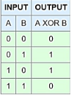
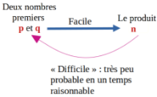
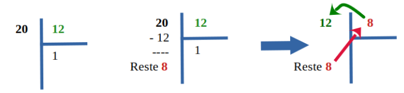

**Table des matières**

[1.	Rappels	](#_toc174920494)

[2.	Vocabulaire	](#_toc174920495)

[3.	Introduction	](#_toc174920496)

[4.	Le chiffrement	](#_toc174920497)

[5.	Le protocole HTTPS	](#_toc174920506)

[6.	Exercices	](#_toc174920509)

[7.	Projet	](#_toc174920510)

**Compétences évaluables :**

- Décrire les principes de chiffrement symétrique (clef partagée) et asymétrique (avec clef privée/clef publique)
- Décrire l’échange d’une clef symétrique en utilisant un protocole asymétrique pour sécuriser une communication HTTPS

## <a name="_toc174920494"></a>**1. Rappels** 

{: .center}

Avec les acquis du programme de première, nous pouvons comprendre exactement ce qu'il se passe lorsque l'on navigue vers un site web, par exemple « http://gs-cassaigne.fr/ ».

- L'**URL du site** est **décodée** par le navigateur qui isole :
- le protocole (HTTP), 
- le **nom de domaine** (gs-cassaigne.fr) 
- le chemin vers la ressource (ici **/**, la « racine » du site).
- Le navigateur effectue **une résolution de nom** pour déterminer **l'adresse IP** correspondant au nom de domaine (213.186.33.16). (on peut la trouver en faisant un tracert dans la console windows)
- Le navigateur peut alors établir une **connexion TCP** vers l'adresse IP du serveur web, sur le port 80 via un hanshaking en trois temps

- Une fois la connexion établie, client et serveur échangent des données en utilisant le **protocole HTTP** tout en découpant les données en **paquets TCP**, eux-mêmes **encapsulés dans des paquets IP**.

{: .center}

On se souvient aussi que les communications sur Internet utilisent un ensemble de protocoles, organisés en couches:

- **Couche accès réseau** avec des protocoles tels que Ethernet ou 802.11 n.
- **Couche Internet**, avec le protocole IP permettant de définir des routes, c'est-à-dire l'ensemble des machines du réseau traversées pour atteindre la machine de destination.
- **Couche de transport** avec les protocoles UDP ou TCP, qui s'occupent en particulier de garantir l'intégrité des données transmises (garanties minimales pour UDP ou très fortes pour TCP).
- **Couche d'application** dans laquelle se trouvent les protocoles de haut niveau : HTTP, IMAP, etc.

Ce processus a été **très peu modifié depuis la conception** de TCP/IP à la fin des années 1970. 

Chaque protocole (SMTP, FTP, puis HTTP au milieu des années 1990), s'est inséré dans ce cadre au niveau de la couche d'application.

Cependant, avec la démocratisation d'Internet, du Web et la diversification des usages, **des problèmes sont apparus**.

Les paquets IP sont envoyés par la source au prochain routeur de son sous-réseau.

Ce routeur retransmet ensuite le paquet au routeur suivant et ainsi de suite jusqu'à l'arrivée à destination. 

Chaque routeur peut donc inspecter les paquets pour en **connaître le contenu.**

{: .center}

Cette situation n'est **clairement pas idéale.** En effet, si l'on utilise un site web pour effectuer des transactions bancaires, renseigner des informations personnelles (impôts, arrêt maladie, etc.), ou simplement exprimer son opinion, on souhaite que le contenu des messages envoyés ne soit connu que de deux entités: la source et la destination.

Ce simple constat nous permet de mettre en avant trois aspects liés à la sécurisation des communications:

- Comment chiffrer le contenu des communications afin qu'elles ne soient lisibles que par la source et la destination (garantie de **confidentialité**) ?
- Comment garantir que le serveur auquel on se connecte est bien celui auquel on pense se connecter (garantie d'**authenticité**) ?
- Comment s'assurer que le message transmis n'a pas été modifié par un tiers (garantie d'**intégrité**) ?

Le tout devant bien entendu se faire dans le cadre d'une communication en utilisant l'infrastructure d'Internet, à savoir les communications TCP/IP ?


## <a name="_toc174920495"></a>**2. Vocabulaire**

- **Coder**, c'est représenter l'information par un ensemble de signes prédéfinis. **Décoder**, c'est interpréter un ensemble de signes pour en extraire l'information qu'ils représentent.

  Coder et décoder s'emploient lorsqu'il n'y a pas de secret. Par exemple on peut coder/décoder des entiers relatifs par une suite de bits par un «codage en complément à deux».

- La **cryptographie** est une discipline veillant à protéger des messages (pour en assurer la confidentialité, l'authenticité et l'intégrité), par l'intermédiaire de **clés de chiffrements**.

- La cryptographie est utilisée depuis au moins l'antiquité.

- La **cryptanalyse** est la technique qui consiste à déduire un texte en clair d’un texte chiffré **sans posséder la clé de chiffrement**. Le processus par lequel on tente de comprendre un message en particulier est appelé **une attaque**.
- **Chiffrer** un message, c'est rendre une suite de symboles incompréhensible au moyen d'une **clé de chiffrement**.
- **Déchiffrer** ou **décrypter**, c'est retrouver la suite de symboles originale à partir du message chiffré. On utilise **déchiffrer** quand on utilise la clé de chiffrement pour récupérer le texte original, et **décrypter** lorsqu'on arrive à retrouver le message original sans connaitre la clé de chiffrement.

## <a name="_toc174920496"></a>**3. Introduction** 
**Vidéo** : Comprendre le chiffrement SSL \_ TLS avec des emojis \_et le HTTPS

## <a name="_toc174920497"></a>**4. Le chiffrement** 
**Exemple** : Alice veut transmettre un message secret à Bob via un réseau non sécurisé, comme Internet. C’est-à-dire que le message peut être intercepté par une autre personne. Un réseau sécurisé serait par exemple un câble unique allant directement de l’ordinateur d’Alice  à celui de Bob sans intermédiaire et sans autre connexion.  

Le message **doit être chiffré** (crypté) à l’aide d’un algorithme de chiffrement et d’une clé.

### <a name="_toc174920498"></a>**4.1. Le chiffrement symétrique**
#### <a name="_toc174920499"></a>**4.1.1. Le principe**
Dans un chiffrement symétrique, c'est **la même clé** qui va servir au chiffrement et au déchiffrement.


**Qu'appelle-t-on une clé ?** 

La clé est un renseignement permettant de chiffrer ou déchiffrer un message. Cela peut être :

- un nombre (dans un simple décalage des lettres de l'alphabet, comme [le chiffre de César](https://fr.wikipedia.org/wiki/Chiffrement_par_d%C3%A9calage))
- une phrase (dans la méthode du [masque jetable](https://fr.wikipedia.org/wiki/Masque_jetable))
- une image (imaginez un chiffrement où on effectue un XOR par les pixels d'une image)

Un chiffrement **est dit symétrique** lorsque la connaissance de la clé **ayant servi au chiffrement permet de déchiffrer** le message.


**Quel est l'avantage d'un chiffrement symétrique ?** 

Les chiffrements symétriques sont souvent **rapides**, consommant **peu de ressources** et donc adaptés au chiffrement de flux important d'informations.

Comme nous le verrons, la sécurisation des données transitant par le **protocole HTTPS** est basée sur un chiffrement symétrique.

**Quel est l'inconvénient d'un chiffrement symétrique ?**

**L’inconvénient majeur** est de **donner la clef au destinataire** avant l’envoyer le message. En effet, si j’envoie la clef à mon destinataire, elle ne doit pas être chiffrée, toute personne qui intercepte le message peut récupérer la clef partagée et donc intercepter mes futurs messages pour les déchiffrer.

**Un chiffrement symétrique est-il un chiffrement de mauvaise qualité ?** 

NON ! S'il est associé naturellement à des chiffrements simples et faibles (comme le décalage de César), un chiffrement symétrique **peut être très robuste**... voire inviolable.

C'est le cas du masque jetable. Si le masque avec lequel on effectue le XOR sur le message est aussi long que le message, alors il est **impossible** de retrouver le message initial. Pourquoi ?

Imaginons qu'Alice veuille transmettre le message clair "LUNDI". Elle le chiffre avec un masque jetable (que connait aussi Bob), et Bob reçoit donc "KHZOK". Si Marc a intercepté le message "KHZOK", *même s'il sait que la méthode de chiffrement utilisée est celle du masque jetable* (*principe de Kerckhoffs*), il n'a pas d'autre choix que de tester tous les masques de 5 lettres possibles.

Ce qui lui donne 26<sup>5</sup> possibilités (plus de 11 millions) pour le masque, et par conséquent (propriété de bijectivité du XOR) 26<sup>5</sup> possibilités pour le message «déchiffré»...

**Quels sont les chiffrements symétriques modernes ?** 

L'algorithme de chiffrement symétrique le plus utilisé actuellement est le chiffrement [AES](https://fr.wikipedia.org/wiki/Advanced_Encryption_Standard), pour Advanced Encryption Standard.

- chiffrement par bloc de 128 bits, répartis dans une matrice de 16 octets (matrice carrée de taille 4).
- ces 128 bits sont transformés par des rotations, multiplications, transpositions, [...] de la matrice initiale, en faisant intervenir dans ces transformations une clé de 128, 192 ou 256 bits.
- pour l'AES-256 (avec une clé de 256 bits), l'attaque par force brute nécessiterait 2<sup>256</sup> opérations, soit un nombre à 78 chiffres...
- il n'existe pas d'attaque connue efficace à ce jour.

#### <a name="_toc174920500"></a>**4.1.2. Réalisation**

<b>1<sup>ère</sup> étape : le message :</b> Soit le message Hello World! en binaire :
```
010010000110010101101100011011000110111100100000010101110110111101110010011011000110010000100001
```

On a simplement utilisé le code ASCII de chaque caractère (par exemple, on peut vérifier que le H correspond bien à l'octet 01001000). Pour effectuer la "conversion" texte vers code binaire ASCII ou vis versa, vous pouvez utiliser le site <https://www.rapidtables.com/convert/number/ascii-to-binary.html>

<b>2<sup>ème</sup> étape la clef</b> : On choisit un mot (ou une phrase) qui nous servira de clé de chiffrement, prenons pour exemple le mot "toto". "toto" nous donne en binaire :
```
01110100011011110111010001101111
```


<b>3<sup>ème</sup> étape le chiffrement</b> : Pour chiffrer le message nous allons effectuer un XOR bit à bit. Pour rappel, vous trouverez la table de vérité du XOR ci-dessous :

Table de vérité "XOR" :



Comme la clé est plus courte que le message, il faut "reproduire" la clé vers la droite autant de fois que nécessaire (si la taille du message n'est pas un multiple de la taille de la clé, on peut reproduire seulement quelques bits de la clé pour la fin du message):

```
 
  010010000110010101101100011011000110111100100000010101110110111101110010011011000110010000100001
⊕
 
  011101000110111101110100011011110111010001101111011101000110111101110100011011110111010001101111
  ________________________________________________________________________________________________
  001111000000101000011000000000110001101101001111001000110000000000000110000000110001000001001110
```   

Si on cherche à afficher le message chiffré avec un éditeur de texte) : 


Maintenant ce message est prêt pour être envoyé à son destinataire B. Si P intercepte le message et cherche à le lire avec un éditeur de texte, il obtiendra la suite de caractère 

<b>4<sup>ème</sup> étape le déchiffrement</b> : Bob a maintenant reçu le message chiffré, il possède la clé (toto), il va donc pouvoir déchiffrer le message <b>en appliquant un XOR</b> entre le message chiffré et la clé (on applique exactement la même méthode que ci-dessus).

```  
 
  001111000000101000011000000000110001101101001111001000110000000000000110000000110001000001001110
⊕   
 
  011101000110111101110100011011110111010001101111011101000110111101110100011011110111010001101111
  ________________________________________________________________________________________________
  010010000110010101101100011011000110111100100000010101110110111101110010011011000110010000100001

```  


On retrouve bien le code binaire d'origine. Pour ne pas s’embêter à vérifier bit par bit, on peut utiliser ce [site](https://www.rapidtables.com/convert/number/binary-to-ascii.html) (<https://www.rapidtables.com/convert/number/binary-to-ascii.html>) qui vous permettra de repasser du code binaire ASCII au texte.

On retrouve bien le message d'origine : Hello World!, B a pu lire le message envoyé par A alors que pour P, malgré le fait qu'il a pu intercepter le message, il n'a pas pu prendre connaissance de son contenu sans la clé.

**Activité n° 1  : Application du chiffrement symétrique :** 
- Créer une fonction chiffre(message, masque) qui chiffre message en le XOR avec masque.
- Cette fonction doit pouvoir **aussi** servir à déchiffrer le message chiffré.

clé de chiffrement :  Vive la NSI !!  

on chiffrera la phrase : Je suis en spécialité NSI et j’adore 


### <a name="_toc174920501"></a>**4.2. Le chiffrement asymétrique**
Le chiffrement asymétrique permet au poste destinataire de messages de générer une unique paire de clefs :

- Une **clef privée** gardée secrète sur le poste destinataire des messages et stockée de manière sécurisée 
- Une **clef publique** diffusée par le destinataire à tous les postes distants 


#### <a name="_toc174920502"></a>**4.2.1. Le principe** 
**Exemple :** 

Alice crée deux clés, une clé de **chiffrement** 🔓 qu’elle rend **publique** et une clé de **déchiffrement** 🔑 qui reste **privée** (uniquement en possession de Alice). 

Bob récupère la clé publique 🔓 et peut chiffrer les messages. Seul Alice, qui possède la clé privée 🔑, peut les déchiffrer.

{: .center}

{: .center}

{: .center}

**Avantage** : Même si quelqu’un intercepte le message, **il n’a pas la clef privée** donc ne peut déchiffrer le message

**Inconvénients** : on doit générer **autant de clefs que d’expéditeurs potentiels**. De même, l’expéditeur doit avoir **autant de clef publique que de destinataire** à qui il envoie des messages. De plus, il est relativement lent même s’il existe des algorithmes (par exemple avec [l'algorithme de Rivest, Shamir et Adleman](https://fr.wikipedia.org/wiki/Chiffrement_RSA)) qui sont relativement rapides

**Cependant, un problème reste à régler, il s'agit du problème de l'authentification : la sureté des communications dépend essentiellement sur le fait qu'Alice et Bob soient certains de communiquer avec la bonne personne.**

#### <a name="_toc174920503"></a>**4.2.2. Echange de clé symétrique avec clés asymétriques : méthode de Diffie-Hellman**
En 1976, [Martin Hellman](https://fr.wikipedia.org/wiki/Martin_Hellman) a coécrit avec [Whit Diffie](https://fr.wikipedia.org/wiki/Whitfield_Diffie) un [article](https://ee.stanford.edu/~hellman/publications/24.pdf) où est décrit le protocole suivant, utilisant **les clefs asymétriques pour échanger des clefs symétriques**. On illustre le protocole par un message 📃 placé dans une boîte 📦 fermée par des cadenas.

1. Alice met le message 📃 dans la boîte 📦 , puis la ferme avec sa clef publique 🔓 ;
1. Alice envoie la boîte fermée 📦🔒 à Bob  ;
1. Bob ne peut pas ouvrir la boîte 📦🔒 car il n'a pas la clef privée 🔑 d'Alice ; alors il rajoute sa clef publique 📦🔒🔒
1. Bob envoie la boîte fermée deux fois 📦🔒🔒 à Alice ;
1. Alice utilise sa clef privée 🔑 pour ouvrir partiellement la boîte 📦🔓 ;
1. Alice renvoie la boîte 📦🔒 à Bob.
1. Bob utilise sa clef privée 🔑 pour ouvrir la boîte 📦.
1. Bob peut alors récupérer le message 📃 .

Pour HTTPS, le message 📃 partagé entre Alice et Bob est **une clef symétrique** 🔐. La sécurisation de la communication est assurée parce qu'il est impossible à Marc 👽 de [se faire passer](https://fr.wikipedia.org/wiki/Attaque_de_l%27homme_du_milieu) pour Alice ou pour Bob sans disposer de **la clé privée** 🔑 de l'un des deux.

Le protocole de Diffie-Hellman permet donc d'échanger une clé de chiffrement symétrique 🔐 à l'aide du chiffrement asymétrique. <https://www.venafi.com/fr/blog/en-quoi-les-echange-de-cles-diffie-hellman-et-rsa-different-ils> 

#### <a name="_toc174920504"></a>**4.2.3. Un exemple de chiffrement asymétrique : le chiffrement RSA**
**Les congruences :**

Il est 22h, quelle heure sera-t-il 8h plus tard ?

Si vous avez répondu 6h (et pas 30h à la question précédente), vous venez de faire de l'*arithmétique modulaire*, en effet vous n'avez conservé que le reste dans la division euclidienne par 24:

30=1×24+6 on écrira que 30≡6[24] et on lira 30 est égal à 6 modulo 24 ou 30 est congru à 6 modulo 24

Vérifions que 53≡5[24]. En effet 53=2×24+5

**Activité n° 2  : Les congruences :** 

a. Compléter 103≡…[24]

b. Compléter : 13≡…[5]

c. Compléter : 42≡…[7]


**Les nombres premiers** : On dit que deux nombres sont premiers entre eux **lorsque leur PGCD vaut 1**.

Par exemple 12 et 5 sont premiers entre eux

33 et 27 ne sont pas premiers entre eux : 33=3×11 et 27=3<sup>3</sup>. Leur PGCD est égal à 3.

**Activité n° 3  : Nombres premiers :** Donner la liste des nombres premiers avec 12 qui sont inférieurs à 12.

**Histoire du chiffrement RSA** : Trois chercheurs du MIT (Boston), Ron Rivest, Adi Shamir et Len Adleman se penchent sur le protocole de Diffie et Hellman (concept de **chiffrement asymétrique**), convaincus qu'il est en effet impossible d'en trouver une implémentation pratique. En 1977, au cours de leurs recherches, ils démontrent en fait l'inverse de ce qu'ils cherchaient : ils créent le **premier protocole concret de chiffrement asymétrique** : le chiffrement **RSA**.

**Étape 1 :**

Alice choisit **2 grands nombres premiers *p* et *q***. Dans la réalité ces nombres seront vraiment très grands (plus de 100 chiffres).

Dans notre exemple, nous prendrons *p* =3 et *q* =11.

**Étape 2 :**

Alice multiplie ces deux nombres *p* et *q* et obtient ainsi un **nombre *n* appelé module de déchiffrement**..

- 😊 Il est très facile pour Alice de calculer *n* en connaissant *p* et *q*.
- 😢 Il est extrêmement difficile pour Eve de faire le travail inverse : trouver *p* et *q* en connaissant *n* prend un temps exponentiel avec la taille de *n*.

C'est sur cette difficulté (appelée **difficulté de *factorisation***) que repose la robustesse du système RSA. (Cf. vidéo « chiffrement RSA »)

**Étape 3 : Alice crée sa clé publique**

On note ϕ**(*n*)** le nombre (*p* −1)(*q* −1). C'est **l'indicatrice d'Euler.**

Alice choisit un nombre ***e* appelé exposant de chiffrement**, qui doit être premier avec (*p* −1)(*q* −1).

Dans notre exemple, (*p* −1)(*q* −1)=20, Alice choisit donc *e* =3. (mais elle aurait pu aussi choisir 7, 9, 13...).

Le **couple (*e*,*n*) sera la clé publique** d'Alice. Elle la diffuse à qui veut lui écrire.

Dans notre exemple, la clé publique d'Alice est (3,33).

**Étape 4 : Alice calcule sa clé privée**

Alice calcule maintenant sa clé privée : elle doit trouver un nombre *d* qui vérifie l'égalité *e* ×*d* ≡1[ϕ(*n*) ].

Dans notre exemple, comme 3 × 7 ≡1[20], ce nombre *d* est égal à 7. En pratique, il existe un algorithme simple (algorithme d'[Euclide étendu](https://fr.wikipedia.org/wiki/Algorithme_d%27Euclide_%C3%A9tendu)) pour trouver cette valeur *d*, appelée *inverse de e*.

Le **couple (*d*,*n*) sera la clé privée** d'Alice. Elle ne la diffuse à personne.

Dans notre exemple, la clé privée d'Alice est (7,33).

**Étape 5 : Bob envoie un message chiffré à Alice avec la clé publique d'Alice**

Supposons que Bob veuille écrire à Alice pour lui envoyer le nombre 4. Il possède la clé publique d'Alice, qui est (3,33).

Il calcule donc 4<sup>3</sup> modulo 33, qui vaut 31.(4<sup>3</sup> - 33 = 64 – 33 = 31) C'est cette valeur 31 qu'il transmet à Alice.

Cela se note 4<sup>3</sup>≡31[33]

Si Eve intercepte cette valeur 31, même en connaissant la clé publique d'Alice (3,33), il ne peut pas résoudre l'équation *x* <sup>3</sup>≡31[33] de manière efficace.


**Étape 6**

Alice reçoit la valeur 31. Il lui suffit alors d'élever 31 à la puissance 7 (sa clé privée), et de calculer le reste modulo 33 :

31<sup>7</sup>=27512614111

27512614111≡4[33]

Elle récupère la valeur 4, qui est bien le message original de Bob.

{: .center}

<b>Comment ça marche ?</b> Grâce au [Petit Théorème de Fermat](https://fr.wikipedia.org/wiki/Petit_th%C3%A9or%C3%A8me_de_Fermat), on démontre (voir [ici](https://fr.wikipedia.org/wiki/Chiffrement_RSA)) assez facilement que <i>M <sup>ed</sup></i> ≡ <i>M</i> [<i>n</i>]. Il faut remarquer que <i>M <sup>ed</sup></i> = <i>M <sup>de</sup></i>. On voit que les rôles de la clé publique et de la clé privée sont <b>symétriques</b> : un message chiffré avec la clé publique se déchiffrera en le chiffrant avec la clé privée, tout comme un message chiffré avec la clé privée se déchiffrera en le chiffrant avec la clé publique.

**Animation interactive** voir <https://animations.interstices.info/interstices-rsa/rsa.html>

**Activité n° 4  : Chiffrement RSA :** 

Alice veut écrire à Bob.

Soit le couple de nombre premiers (p,q) avec  p=5 et q=13.

a. Calculer n et ϕ(*n*).

b. Justifier que (9,65) ne peut pas être une clé publique.

c. Vérifier que (11,65) est une clé publique. C'est la clé publique de Bob.

d. Vérifier que 35 est un inverse de 11 modulo 48.

e. En déduire la clé privée de Bob.

f. Chiffrer le nombre secret d'Alice 17 avec la clé publique de Bob. C'est ce nombre qu'Alice envoie à Bob.

g. Déchiffrer le nombre reçu par Bob

**RSA, un système inviolable ?**

Le chiffrement RSA **a des défauts** (notamment une grande consommation des ressources, due à la manipulation de très grands nombres). Mais le choix d'une **clé publique de grande taille** (actuellement 1024 ou 2048 bits) le rend pour l'instant inviolable.

Actuellement, il n'existe pas d'algorithme efficace pour factoriser un nombre ayant plusieurs centaines de chiffres.

Deux évènements pourraient faire s'écrouler la sécurité du RSA :

- la découverte d'un **algorithme efficace de factorisation**, capable de tourner sur les ordinateurs actuels. Cette annonce est régulièrement faite, et tout aussi régulièrement contredite par la communauté scientifique.
- **l'avènement d'[ordinateurs quantiques**](https://fr.wikipedia.org/wiki/Calculateur_quantique)**, dont la vitesse d'exécution permettrait une factorisation rapide. Il est à noter que l'algorithme de factorisation destiné à tourner sur un ordinateur quantique existe déjà : [l'algorithme de Schor](https://fr.wikipedia.org/wiki/Algorithme_de_Shor).


### <a name="_toc174920505"></a>**4.3. Attaque de l’homme du milieu (man in the middle)**
{: .center}

{: .center}

{: .center}

{: .center}

{: .center}

Alice et Bob sont chacun persuadés d'utiliser la clé de l'autre, alors qu'ils utilisent en réalité tous les deux la clé de Jimmy.

Ce type d'attaque est appelé "**Man in the middle**". Elle peut être tentée contre RSA.

**Certification**

Pour se prémunir de ces attaques, une *autorité de certification* assure de l'identité d'un site afin d'éviter des attaques du type [*homme du milieu*](https://en.wikipedia.org/wiki/Man-in-the-middle_attack), sans laquelle on pourrait se connecter à un site tiers en pensant qu'il s'agit par exemple de sa banque en ligne. Les requêtes HTTPS peuvent être observées à partir de la console de firefox. Pour cela :

**Activité n° 5  : Certification :** 

Ecrire l'adresse : [https://www.elysee.fr/](https://www.elysee.fr) dans votre barre de navigation. Cliquer sur le cadenas, puis chercher le certificat.


1. # <a name="_toc174920506"></a>**Le protocole HTTPS**
   1. ## <a name="_toc174920507"></a>**Principe général**
Aujourd'hui, plus de **90 % du trafic sur internet est chiffré** : les données ne transitent plus en clair (protocole HTTP) mais de manière chiffrée (protocole HTTPS), ce qui empêche la lecture de paquets éventuellement interceptés.

Le protocole HTTPS est la réunion de deux protocoles :

- le **protocole TLS (Transport Layer Security**, qui a succédé au SSL) : ce protocole, basé sur du **chiffrement asymétrique**, va conduire à la génération d'une clé identique chez le client et chez le serveur.
- le protocole HTTP, mais qui convoiera maintenant des données chiffrées avec la clé générée à l'étape précédente. Les données peuvent toujours être interceptées, mais sont illisibles. Le **chiffrement symétrique** utilisé est actuellement le chiffrement AES.


**Pourquoi ne pas utiliser que le chiffrement asymétrique, RSA par exemple ?**

Le chiffrement RSA est très gourmand en ressources ! Le chiffrement/déchiffrement doit être rapide pour ne pas ralentir les communications ou l'exploitation des données.

- Le **chiffrement asymétrique est donc réservé à l'échange de clés** (au début de la communication).
- Le **chiffrement symétrique**, bien plus rapide, prend ensuite le relais pour l'ensemble de la communication.


1. ## <a name="_toc174920508"></a>**(HP) Fonctionnement du TLS : explication du *handshake***
Observons en détail le fonctionnement du protocole TLS, dont le rôle est de générer de manière sécurisée une clé dont disposeront à la fois le client et le serveur, leur permettant ainsi d'appliquer un chiffrement symétrique à leurs échanges.


- **étape 1** : le «client Hello». Le client envoie sa version de TLS utilisée.
- **étape 2** : le «server Hello». Le serveur répond en renvoyant son certificat prouvant son identité, ainsi que sa clé publique.
- **étape 3** : le client interroge l'autorité de certification pour valider le fait que le certificat est bien valide et que le serveur est bien celui qu'il prétend être. Cette vérification est faite grâce à un mécanisme de chiffrement asymétrique.
- **étape 4** : une fois vérifiée l'authenticité du serveur et que son certificat est valide, le client calcule ce qui sera la future clé de chiffrement symétrique (appelée «clé AES» dans l'infographie). Cette clé est chiffrée avec la clé publique du server (transmise à l'étape 1), ce qui assure la sécurité de son transfert. Le serveur déchiffre cette clé grâce à sa clé privée, et dispose ainsi lui aussi de la clé.

Le transmission par protocole HTTP de données chiffrées au préalable avec la clé AES peut commencer.

**Remarque** : en réalité, ce n'est pas la clé AES qui est transmise à l'étape 4, mais un nombre choisi par le client, qui permettra, avec deux autres nombres choisis par le client (étape 1) et le serveur (étape 2) de reconstituer la clé AES, qui sera donc identique côté client et côté serveur.

**POUR ALLER PLUS LOIN :** [Concours Alkindi (concours-alkindi.fr)](https://concours-alkindi.fr/main.html#/pageDiscover)


Merci à Gilles Lassus et Mireille Coilhac 
1. # <a name="_toc174920509"></a>**Exercices**
**Exercice n°1 :** chiffre\_xor

Écrire en Python une fonction chiffre\_xor(msg, cle) qui prend en arguments deux chaînes d'octets (type bytes) et qui renvoie le chiffrement XOR du message avec la clé, sous forme d'une liste

L'opérateur XOR en python est «^».

Vérifions les tables de vérité avec la fonction xor du cours et l’opérateur «^»

\>>> xor(0,0)

0

\>>> 0^0

0

\>>> xor(1,0)

1

\>>> 1^0

1

\>>> xor(0,1)

1

\>>> 0^1

1

\>>> xor(1,1)

0

\>>> 1^1

0

Comme on va utiliser les lettres accentuées, on devra utiliser la méthode encode() qui permet d’encoder en utf-8.

Par exemple :

\>>> m = "je suis un élève".encode()

\>>> print(m)

b'je suis un \xc3\xa9l\xc3\xa8ve'

On utilisera l’opérateur bytes dans le return de la liste codée. Il renvoie un objet bytes qui est une séquence immuable (ne peut pas être modifiée) d'entiers dans la plage 0 <=x < 256.

Par exemple :

\>>> bytes([65, 66, 67])

b'ABC'

Indication : On rappelle que pour un chiffrement XOR, la clé doit être «étendue» de façon à avoir la même taille que le message. On pourra faire une utilisation judicieuse de l'opérateur «%» dans une compréhension de liste…. 

Test : 

m = "L'informatique c'est super".encode()
c = "NSI".encode()
assert chiffre\_xor(m, c) == b"\x02t  5&<>(::8;6i-t,='i=&9+!"
assert chiffre\_xor(b"\x02t  5&<>(::8;6i-t,='i=&9+!", c) == b"L'informatique c'est super"


**Exercice n°2 :** dechiffre\_xor

Comme expliqué dans le cours, un chiffrement XOR simple n'apporte pas une grande sécurité. 

On va montrer qu'en connaissant quelques informations on peut facilement retrouver la clé si cette dernière est trop courte.

Soit la chaîne d'octets chiffrée:

b'\x0c7,)x8,=#z,+5-/\x99\xf1y69y8774=y(\x9b\xf0\*77)=x'

On sait que les 4 derniers caractères du message en clair sont "nse!". 

On utilisera la méthode endswith() pour tester la terminaison 

<https://www.w3schools.com/python/ref_string_endswith.asp>

Par exemple ici :

mon\_test.endswith(b"nse!")

On sait aussi que la clé fait exactement 3 caractères et que ce sont des lettres majuscules sans accent.

Écrire un programme Python (fonction dechiffre\_xor), en important la fonction chiffre\_xor de l’exercice précédent, qui essaye toutes les combinaisons de clé jusqu'à trouver la bonne. 

Mesurer le temps d'exécution. 

On pourra utiliser la fonction time.time() du module time pour connaître l'heure courante, en nombre de secondes depuis une date de référence non spécifiée.


1. # <a name="_toc174920510"></a>**Projet**
**Exercice n°01 : clé symétrique :**

On utilisera un fichier echange\_cle.py.

**La situation** : Alice veut établir une liaison sécurisée avec Bob en chiffrement symétrique avec la clef kfinale. Mais comment transmettre cette clef à Bob sans que celle-ci ne soit interceptée ?

<a name="_hlk155014082"></a>**Etapes du processus :**  Voici comment Alice et Bob vont procéder :

La clef ne sera jamais "transmise", mais elle sera créée par Bob, et retrouvée par Alice.

- - **1er temps** : Alice génère une clef publique (notée kpub) et l'envoie à Bob. Cette clef peut être interceptée mais ce n'est pas grave.

En même temps que la clef publique, elle génère une clef privée (notée kpriv). Les deux clefs sont liées, nous verrons un peu plus tard comment.

- - **2ème temps** : Bob génère une clef kfinale qu'il garde secrète et qui servira à chiffrer les échanges avec Alice. Il chiffre cette clef qui devient kFinaleChiffree grâce à kpub qu'il a reçu d'Alice. Il envoie kFinaleChiffree à Alice.
- - **3ème temps** : Alice déchiffre kFinaleChiffree avec sa clef privée et trouve kfinale.

kfinale est donc maintenant connue d'Alice et de Bob qui vont pouvoir l'utiliser pour communiquer en chiffrement symétrique.

**Lien entre clef publique et clé privée :** Notons  𝑓(kpub, m)  le message m chiffré avec la clef publique, et  𝑓(kpriv, m)  le message m chiffré avec la clef privée.

kpub et kpriv obéissent à :

𝑓(kpriv, 𝑓(kpub, m)) = 𝑓(kpub,  𝑓(kpriv, m)) = m

En d'autres termes, si Bob chiffre avec la clef publique, Alice saura déchiffrer avec sa clef privée connue d'elle seule. Le système exige aussi que la connaissance de la clef publique ne permette pas de déchiffrer le message envoyé par Bob. C'est le cas quand on chiffre avec des fonctions de hashage, mais ici, pour comprendre le principe, nous allons simplifier et utiliser un chiffrement proche de celui de Vigenère.

Nous admettrons, pour l'exemple, que l'on ne peut pas décrypter le message de Bob avec la clef publique, ni découvrir la clef privée à partir de la clef publique.

- 1. 1<sup>er</sup> temps : Créer la clé publique

Dans notre exemple, on va utiliser un code proche du codage de Vigenere

- - On génère 10 nombres aléatoire entre 0 et 36 qui seront les décalages à appliquer
- - On convertit ces nombres en hexa de longueur 2
- - On concatène pour créer une clef de longueur 20 (mais elle serait très simple à casser !)

nous allons utiliser un alphabet de 36 lettres : [0-9] et [A-Z].

Vous pourrez utiliser la fonction suivante qui convertit un entier (entre 0 et 255) en une chaine hexadécimale de 2 chiffres.

def d2H(n: int) -> str:
`    `"""
`    `convertit un nombre décimal compris entre 0 et 255 en un hexadécimal à 2 chiffres
`    `:param n: entier à convertir en base 16
`    `:return: une chaine de caractère représentant le nombre en base 16 sur deux caractères
`    `>>> d2H(10)
`    `'0a'
`    `>>> d2H(100)
`    `'64'
`    `"""
`    `h = hex(n)[2:]
`    `if len(h)<2 :
`        `h = "0" + h
`    `return h

assert d2H(10) == '0a'
assert d2H(100) == '64'

- 1. La fonction creCle()

💻 Ajouter et compléter la fonction creCle()

Voici son fonctionnement :

- - On génère 10 nombres aléatoires entre 0 et 255.
- - On convertit ces nombres en hexadécimal de longueur 2, en utilisant la fonction d2H
- - On concatène pour créer une clef de longueur 20. Les lettres devront être converties en majuscules.

Cette clef serait très simple à casser, mais nous étudions ici seulement le principe.

from random import randint

def creClef() -> str:
`    `""" Crée un clef de chiffrement composée de 20 caractères 
`    `parmi ceux-ci : 0, 1, 2, ..., 9, A, B, C, D, E, F
`    `:return: renvoie 20 caractères de 0, 1, 2, ..., 9, A, B, C, D, E, F
`    `Par exemple : 'C5D71484F8CF9BF4B76F'
`    `C5 représente 197, D7 représente 215 etc...
`    `"""
`    `pass


print(creClef())

Aide : on pourra utiliser **join()** et **upper()**

Créez quelques clefs pour voir …

for \_ in range(3) :
`    `print(creClef())

- 1. Approfondissement sur le module random :

🤔 Pour tester notre fonction, comment obtenir des nombres "aléatoires" toujours identiques?
En fait random crée des nombres "pseudos-aléatoires". Si on lui donne une initialisation a avec seed(a) , les nombres générés seront toujours identiques.

**Tester ci-dessous** **en dehors du fichier** echange\_cle.py

Sans initialisation du générateur, on obtient 5 listes différentes.

Par défaut l'initialisation se fait avec la date actuelle, qui change tout le temps ..

for i in range(5):
`    `print([randint(0, 255) for i in range(10)])

On utilise une initialisation, par exemple seed(0)

from random import seed
for i in range(5):
`    `seed(0)
`    `print([randint(0, 255) for i in range(10)])

Nous aurions pu en choisir une autre, par exemple seed(42)

from random import seed
for i in range(5):
`    `seed(42)
`    `print([randint(0, 255) for i in range(10)])

Que remarquez vous ?

😀 Nous pouvons donc tester notre fonction !

Ajouter au fichier echange\_cle.py

from random import seed
seed(0)
assert creClef() == 'C5D71484F8CF9BF4B76F'

- 1. 1<sup>er</sup> temps : Créer la clé privée

🔑 Il faut aussi créer une clef privée, liée à la clef publique. Dans notre exemple, le processus de création de la clef est très simple, et la conversion en hexadécimal est totalement factice. Il ne s'agit, comme dans le chiffrement de Vigenère, que d'appliquer un décalage variable des lettres. Pour les 10 premières lettres, le décalage est codé dans la clef, pour la 11ème on reprend le décalage de la 1ere, et ainsi de suite.... c'est ce qu'avait imaginé Vigenère.

❓ Comment faire?

Pour créer une clef qui permette de respecter :

𝑓(kpriv, 𝑓(kpub, m)) = 𝑓(kpub,  𝑓(kpriv, m)) = m

il suffit de créer les décalages qui compensent.

Rappelons que nous allons utiliser un alphabet de 36 lettres :

ALPHA = '0123456789ABCDEFGHIJKLMNOPQRSTUVWXYZ'

Par exemple, si on décale vers la droite de 12 (%36), il suffit de décaler encore de 36 - 12 = 24, en bouclant au début de l'alphabet, pour "retomber" sur le même caractère.

On pourrait donc choisir un décalage dPriv = 36 - dPub % 36 .

Pour "compliquer", on peut choisir également comme décalage dPriv = 36 - dPub % 36 + randint(1, 6) \* 36
En effet, cela ne changera rien d'ajouter un décalage d'un nombre entier de fois 36. (On se limite à randint(1,6) pour que le nombre soit possible à coder en hexadécimal sur deux caractères).

Voilà comment procéder pour créer la clef privée :

pour chaque décalage dPub de la clef publique :

`    `dPriv = 36 - dPub % 36 + randint(1, 6) \* 36 

`    `coder dPriv en hexa2

concaténer les hexa2(dPriv) en une chaine 

💻 Ajouter et compléter la fonction creClef()

Attention, elle doit renvoyer un tuple (clef publique, clef privée)

def creClef() -> tuple :
`    `"""
`    `creClef doit renvoyer un tuple avec les 2 clefs: la publique et la privée
`    `Exemple renvoyé:
`    `('47904730804B9E3225A9', '91D82584A08DCAEE6BBF')
`    `"""
`    `pass


print(creeClef())

- 1. Comment utiliser les clés ?

**Tester ci-dessous** **en dehors du fichier** echange\_cle.py

Prenons un exemple kpub = '48E52E29A3FA379A953F'

Le premier décalage est codé par les deux premiers caractères 48, qui en décimal et modulo 36 sera :

int('48', 16) % 36

Le second est E5

int('E5', 16) % 36

Si la clef privé est kpriv = 'D883116D359FEC5CED375', les deux premiers décalages sont :

print('D8 -> d = ',int('D8',16) % 36)
print('83 -> d = ',int('83',16) % 36)

Dans l'exemple ci-dessus, la somme des décalages

- - pour le 1er caractère vaut : 0 + 0 = 0
- - pour le 2ème caractère vaut : 13 + 23 = 36
- - On pourrait ainsi vérifier que pour n'importe quel caractère, la somme des décalages est égale à 0 ou à 36, ce qui, modulo 36, fait toujours 0.

L'application de kpriv compensera donc l'application de kpub, ce qui assure la condition !

**Ajouter** le script suivant au fichier echange\_cle.py.

Pour bien comprendre, voici comment retrouver les décalages en lisant les clés :

\# le code ci-dessous vous montre comment retrouver les décalages en lisant les clefs
\# la fonction decal(clef, i) convertit la tranche clef[i:i+2] en décimal
(kpub, kpriv) = creClef()
print('clef publique :', kpub, '\t clef privée :', kpriv)

def decimal\_tranche\_i(clef, i):
`    `return int(clef[i:i + 2], 16)

for i in range(0, 20, 2):
`    `dPub = kpub[i:i + 2]
`    `dPriv = kpriv[i:i + 2]
`    `dPub\_dec = decimal\_tranche\_i(kpub, i)
`    `dPriv\_dec = decimal\_tranche\_i(kpriv, i)
`    `print('décalages hexa public privé:', dPub, dPriv, \
`          `'\t -> \tdécalages décimaux public privé:', dPub\_dec, dPriv\_dec, \
`          `'\t total = ', dPub\_dec + dPriv\_dec)

`    `assert (dPub\_dec + dPriv\_dec) % 36 == 0

- 1. 2<sup>ème</sup> temps : Créer puis chiffrer une clé qui sera utilisée pour le chiffrement symétrique

💻 Ajouter et compléter la fonction qui va être utilisée pour créer une clef de chiffrement symétrique kfinale

\# Bob crée la clef finale
def creeKFinale() -> str:
`    `"""
`    `crée un mot de 20 lettres en piochant 20 fois avec remise dans ALPHA
`    `:return: par exemple 'KFIBCB2GU458925YPXHX'
`    `"""
`    `pass


print(creeKFinale())

Vérification 

\# Vérification
seed(0)
assert creeKFinale() == 'OQ2GWVPJUMDW8I86GY9J'

Bob doit maintenant chiffrer cette clef finale avec la clef publique d’Alice.

Il nous faut donc une fonction f(k, m) qui chiffre un message m avec une clef k.

Nous aurons besoin de la fonction ci-dessous à ajouter au fichier :

def decal(clef: str) -> list:
`    `"""
`    `:param clef: chaîne de 20 caractères parmi 0, 1, 2, ..., 9, A, B, C, D, E, F
`    `Par exemple : 'C5D71484F8CF9BF4B76F'
`    `:return: liste de 10 entiers qui correspondent aux décalages en décimal à 
`    `appliquer dans le chiffrement modulo 36
`    `>>> decal('C5D71484F8CF9BF4B76F')
`    `[17, 35, 20, 24, 32, 27, 11, 28, 3, 3]
`    `En effet C5 correspond à 197 en décimal, et 197 % 36 = 17
`    `"""
`    `return [int(clef[i:i+2], 16) % 36 for i in range(0, len(clef), 2)]

Principe de la fonction f(k, m) :

Cette fonction chiffre le message m par le principe du chiffrement de Vigenère avec la clef k.

f respecte f(kpriv, f(kpub,m)) = m.

Elle est cependant très basique : elle effetue un décalage des lettres conforme à la clef... C'est un décodage de Vigenère dont la clef serait publique donc trivialement cassée.

💻 Ajouter et compléter la fonction avec :

- - On définit ALPHA : chaîne des caractères possibles utilisés.
- - On convertit la clef en une liste de décalages avec la fonction decal
- - On initialise m\_chiffre = ""
- - pour chaque ième caractère de m :
- - déterminer son rang dans ALPHA : rang = ALPHA.index(lettre)
- - déterminer decaler\_dele decalage à appliquer à rang. Il s'obtient pour la lettre de rang i de la clef. La clef étant plus courte que m, on boucle sur la clef. Le décalage est donc pour le rang i : decaler\_de = decalages[i % len(decalages)]
- - déterminer idx qui est l'indice dans ALPHA du caractère chiffré.
- idx = (rang + decaler\_de) % 36
- - ajouter à m\_chiffre le caractère chiffré correspondant à idx
- - renvoyer m\_chiffre

\# Bob chiffre la clef finale
def f(k: str, m: str) -> str:
`    `"""
`    `Cette fonction chiffre le message m par le principe du chiffrement de 
`    `Vigenère avec la clef k.
`    `:param k: clef qui sert au chiffrement (on boucle la clef sur la longueur de m)
`    `:param m: message à chiffrer
`    `:return: le message chiffré
`    `>>> f("00000000000000000000", "CLE2CHIFFRER")
`    `'CLE2CHIFFRER'
`    `>>> f("C5D71484F8CF9BF4B76F", "CLE2CHIFFRER")
`    `'TKYQ88T7IUVQ'
`    `"""
`    `pass


assert f("C5D71484F8CF9BF4B76F", "CLE2CHIFFRER") == 'TKYQ88T7IUVQ'

- 1. Scénario complet de la création et transmission de clef

💻 Ajouter et compléter le scénario :

😀 Nous avons maintenant tout ce qu'il nous faut, l'échange peut avoir lieu.

📅 Nous allons reprendre nos 3 temps expliqués dans les étapes du processus au début de ce TP.

🧗 Le déroulé est donné ci-dessous, les seules information qui peuvent être interceptées sont présentées décalées à droite :

<b>1<sup>er</sup> temps :</b>

\# Création des clef publique et privée
(kpub,kpriv) = creClef()
print('Alice crée (et envoie à Bob) une clef publique : \t\t\t\tK\_pub\_Alice :', ❓)
print('clef privée associée secrète:  \t', ❓)

<b>2<sup>ème</sup> temps :</b> 

print('Alice demande a Bob de créer la clef kfinale et ')
print('de la chiffrer en utilisant la clef publique.')
kfinale = ❓
print('Bob crée la clef kfinale et la garde secrète : ', kfinale)
kFinaleChiffree = ❓
print("Il envoie kFinaleChiffree chiffrée avec la clé publique d'Alice \t\tkFinaleChiffree:", kFinaleChiffree)

<b>3<sup>ème</sup> temps :</b>

print("Alice déchiffre kFinaleChiffree avec sa clef privée")
print("Elle obtient :", ❓
print("Cela correspond bien à la clef kfinale créée par Bob et tenue secrète.")

😀 Notez bien, la clef publique ne permet pas de décoder le mot

print("On obtiendrait :", ❓)

😀 Le tour est joué ! Alice et Bob connaissent la clef kFinale, il vont pouvoir communiquer en utilisant un chiffrement symétrique !

- 1. Alice et Bob communiquent !

Maintenant Alice et Bob vont communiquer avec cette clef échangée kfinale.

Ajouter les scripts suivants. Ils vont utiliser le chiffrement symétrique de Vigenère du TP précédent, dont on donne ci-dessous un script :

def chiffrement\_Vigenere(k: str, m: str, sens: int) -> str:
`    `"""
`    `Chiffre ou déchiffre le message m avec la clef k
`    `:param k: la clef de chiffrement
`    `:param m:  le texte à chiffrer
`    `:param sens: sens = 1 pour le chiffrage et sens = -1 pour le déchiffrage
`    `:return: la fonction renvoie le texte chiffré ou déchiffré suivant le sens choisi: type str.
`    `Par exemple :
`    `>>> chiffrement\_Vigenere('bizare', 'abominable', 1)
`    `'ucgfskucdx'
`    `>>> chiffrement\_Vigenere('bizare','ucgfskucdx', -1)
`    `'abominable'
`    `"""
`    `m\_chiffre = ""
`    `for i in range(len(m)):
`        `code = ord(m[i])
`        `decal = sens \* ord(k[i % len(k)])
`        `if 65 <= code <= 90:
`            `code = ((code + decal) - 65) % 26 + 65
`        `elif 97 <= code and code <= 122:
`            `code = ((code + decal) - 97) % 26 + 97
`        `elif 32 <= code and code <= 64:
`            `code = ((code + decal) - 32) % 33 + 32
`        `m\_chiffre += chr(code)
`    `return m\_chiffre

Alice veut demander à Bob son mot de passe (qui est "bRa1cAPStp3").

Bob chiffre donc son mot de passe avec kfinale qu'ils connaissent maintenant tous les deux, puis l'envoie :

mdp\_chiffre = chiffrement\_Vigenere(kfinale,'bRa1cAPStp3',1)
print("Bob envoie 'bRa1cAPStp3' chiffré avec kFinale -> ", mdp\_chiffre)

Alice déchiffre le mdp reçu avec kfinale:

mdp\_clair = chiffrement\_Vigenere(kfinale,mdp\_chiffre,-1)
print('Alice déchiffre avec kfinale ->', mdp\_clair)

🌞 Mission réussie !

- 1. Jimmy bad boy entre en scène…

Alice et Bob sont habitués à procéder comme nous venons de le voir. Bob va donc créer kFinale qui va leur servir pour communiquer en chiffrement symétrique.

💣 Mais Jimmy va un peu changer les données du problème. Pour communiquer, Alice et Bob envoient des paquets qui transitent sur de nombreux routeurs. L'un d'eux appartient à Jimmy....

🦸‍♂️ Dans ce qui suit, vous êtes Jimmy.

💻 Ajouter et compléter le scénario :

\1) 👩 Tout commence comme d'habitude : Alice crée une clef publique et une clef privée :

\# # créez les clef publiques et privées d'Alice :
(kpubAlice, kprivAlice) = creClef()

print("clé publique de Alice :", ❓)
print("clé privée de Alice :", ❓)

\2) 👩 Alice envoie à Bob la clé publique
Du moins, c'est ce qu'elle pense. Elle ignore votre présence ...

\3) 🦸‍♂️ Mais\.\.\. Vous intervenez \.\.\.
Vous interceptez l'envoi. Vous n'allez pas envoyer cette clef à Bob mais une autre : la votre !

\# créez votre clef publique et votre clef privée associée
(kpubJimmy, kprivJimmy) = creClef()

print('clé publique de Jimmy :', ❓)
print('clé privée de Jimmy :', ❓)

Vous avez une clef publique et une clef privée. Vous envoyez votre clef publique à Bob, qui pensera qu'il s'agit de la clef publique d'Alice.

\4) 👨 Bob ne se doute de rien !

Bob chiffre kFinale (la clé finale) avec cette clé publique qu'il vient de recevoir, et envoie cette clé chiffrée à Alice (où du moins, c'est ce qu'il pense. Mais vous êtes là...)

La clé finale crée par Bob est : **'0VLFK4CEF9YS55KWV6JZ'**

Créez la clé finale chiffrée avec votre clé publique (celle que Bob imagine être la clé de Alice)

kFinale = "0VLFK4CEF9YS55KWV6JZ"
\# codez cette clef avec la clé publique de Jimmy (Bob croit qu'il s'agit de celle de Alice)
kfinaleChiffreBob = ❓
print('Bob envoie sa clé privé chiffrée avec la clé publique de Jimmy :', kfinaleChiffreBob)

\5) 🦸‍♂️ Vous interceptez cette clef !

Vous déchiffrez cette clef interceptée grâce à votre clef privée :

Vous obtenez donc kFinale\_decryptee.

kFinale\_decryptee = ❓
print(kFinale\_decryptee)

🦸‍♂️ Sans surprise, **vous voyez que vous détenez bien la clé finale**.

En effet kFinale\_decryptee que vous avez reconstituée est bien égale à kFinale créée par Bob.

6)🦸‍♂️ Vous faites comme si vous étiez Bob !

Vous allez maintenant chiffrer kFinale\_decryptee avec la clé publique d' Alice, et lui envoyer.

\# Créez la clé finale chiffrée avec la clé d'Alice :
kfinaleChiffreAlice = ❓

print("Jimmy envoie la clé privée de Bob chiffrée avec la vraie clé publique d'Alice :", kfinaleChiffreAlice)

\7) 👩 Alice reçoit cette clef et la déchiffre avec sa clé privée\.

print(f(kprivAlice, kfinaleChiffreAlice))

Elle obtient kFinale la bonne clé créée par Bob, et ils vont l'utiliser pour communiquer.

\8) 👩🦸‍♂️👨Tous les échanges ultérieurs seront interceptés et décryptés par Jimmy !

Ni Alice ni Bob ne se doute que Jimmy bad boy connait aussi la clé kFinale...

👍 Bravo, vous avez réussi **une attaque par l'homme du milieu**.
**


**Exercice n° 02 : chiffrement RSA**

**1 - PRINCIPE DU CRYPTAGE ASYMÉTRIQUE**

Il y a eu plusieurs types de systèmes de chiffrement asymétrique. Nous ne verrons que la version qui correspond à la version actuelle de ce type de système : le système **RSA**.

Il comporte un **clé Publique** et une **clé Privée** dont voici le principe.

- La clé Publique ne permet pas de décrypter les messages cryptés avec la clé Publique.
- La clé Privée ne permet pas de décrypter les messages cryptés avec la clé Privée.
- On peut décrypter avec la clé Privée les messages cryptés à l'aide de la clé Publique.
- On peut décrypter avec la clé Publique les messages cryptés à l'aide de la clé Privée.


L'une des conditions de l'utilisation d'un tel chiffrement : qu'on ne puisse pas retrouver la valeur de la clé privée connaissant la valeur de la clé privée ou d'un message crypté quelconque. Il faut que cela soit trop compliqué et demande trop de temps ou qu'il existe beaucoup de valeurs possibles par exemple.

RSA est basé sur le principe des **fonctions à sens unique** : connaissant le message m, il est facile de chiffrer le message en calculant f(m) mais connaissant f(m) il est "difficile" de retrouver m. La notion de complexité algorithmique donne un moyen de quantifier la notion sinon floue de "difficile".


En outre, **RSA** utilise des **fonctions à sens unique possédant une brèche** : connaissant la clé de déchiffrement, il devient "facile" de retrouver m connaissant f(m).

Là où c'est compliqué à mettre en place, c'est que trouver la brèche doit s'avérer "impossible" en un temps raisonnable.

**2 - RSA**

Le chiffrement  **RSA**  date de **1977** et doit son nom aux initiales de ses trois inventeurs  :

- [Ronald Rivest](https://fr.wikipedia.org/wiki/Ronald_Rivest "https://fr.wikipedia.org/wiki/Ronald_Rivest") (né en 1947, cryptologue américain)
- [Adi Shamir](https://www.infoforall.fr/act/archi/projet-chiffrement-rsa/) (né en 1962, mathématicien et cryptologue israélien)
- [Leonard Adleman](https://www.infoforall.fr/act/archi/projet-chiffrement-rsa/) (né en 1945, chercheur américain en informatique théorique, et en informatique-biologie moléculaire)

**RSA** a été breveté par le **MIT** (Massachusetts Institute of Technology) en **1983** aux États-Unis.

Le brevet a expiré le 21 septembre **2000**.

Le cryptage RSA utilise de grands nombres premiers et le petit théorème de Fermat (lié à la division entière et à la congruence).

La facilité du cryptage et la difficulté du décryptage sont liées au fait qu'il est facile de calculer le produit  **n = p\*q**  de deux nombres premiers **p** et **q** mais qu'il est difficile de retrouver **p** et **q** si on ne connaît que **n**.

Vous allez donc comprendre l'intérêt qu'on porte aux nombres premiers et aux diviseurs communs.
##### Division entière ou euclidienne
Nous avons déjà vu la **division euclidienne et la notion de reste**.

Si  **a = b\*q + r**  alors

- La division euclidienne de a par b donne q :  **a // b = q** .
- Le reste de cette division entière est alors r :  **a % b = r**  avec r dans  **[0;b[** .

**Exemple**

Si on prend 15, on peut écrire que  15 = 2\*6 + 3 .

La division euclidienne de 15 par 6 donne 2 :  15 // 6 = 2 .

Le reste de cette division est de 3 :  15 % 6 = 3 .
#####
##### Congruence (hors programme)
La notion de **congruence** (hors programme en NSI, on ne l'aborde ici qu'en terme de culture générale) est liée à ce reste.

**Exemples sans définition exacte**

0, 6, 12, 18, 24, 30... sont congrus modulo 6 entre eux car le reste de leur division euclidienne par 6 donne un reste de 0 à chaque fois.

1, 7, 13, 19, 25, 31... sont congrus modulo 6 entre eux car le reste de leur division euclidienne par 6 donne un reste de 1 à chaque fois.

2, 8, 14, 20, 26, 32... sont congrus modulo 6 entre eux car le reste de leur division euclidienne par 6 donne un reste de 2 à chaque fois.

etc. ...

**Définition**

Soient

- ` `**n**  un entier naturel non nul et,
- ` `**a**  et  **b**  deux entiers relatifs.

On dit que  **a  et  b  sont congrus modulo  n**  s'ils ont le même reste dans une division euclidienne par n.

En Python, on peut donc écrire  **a % n == b % n** .

On dit aussi que  **a  est congru à  b  modulo  n** .

**Notation mathématique**

La notation mathématique est **a ≡ b (mod n)** pour signaler que  **a  et  b  sont congrus modulo  n** .

**Exemple**

- ` `156 = 17\*9 + 3 . Donc  156 % 17  donne un reste de  3 .
- ` `105 = 17\*6 + 3 . Donc  105 % 17  donne un reste de  3 .
- On peut donc écrire que  **156 ≡ 105 (mod 17)**  pour dire que 156 est congru à 105 modulo 17.

**Conséquence**

On remarquera que **a ≡ b (mod n)** implique que (a-b) est divisible par n :

En Python :  **(a-b) % n == 0** 

Ou encore :  **(a-b) // n == k**  avec k entier.

` `156 ≡ 105 (mod 17)  implique que (156-105) / 17 donne un résultat entier.

En Python :  (156-105) / 17 = 51 / 17 = 3.0 

**Exemple d'utilisation**

La **Clé Publique** est un n-uplet  **cpub = (n, e)**  contenant deux informations notées **n** et **e**.

Sur notre exemple, nous prendrons  **cpub = (2159, 437)** 

Si **m** est un bout du message à chiffrer, on obtient le message chiffré **mc** correspondant en utilisant cette formule :

` `<b>mc = (m<sup>e</sup>) % n</b> 

- **n** se nomme le **module de chiffrement** car il sert à faire un modulo et
- **e** est l'**exposant de chiffrement** car on l'utilise en tant que mise à la puissance du message.

En Python, ça donnera :

` `**mc = (m\*\*e) % n** 

La **Clé Privée** est un n-uplet  **cpri = (n, d)**  contenant

- le **module de chiffrement** **n** et
- l'**exposant de déchiffrement** **d**.

Si **mc** est un bout du message chiffré, on obtient le message déchiffré **md** correspondant en utilisant cette formule :

` `<b>md = (mc<sup>d</sup>) % n</b> 

Bien entendu, si les valeurs sont correctes, on aura **md** = **m** !

Pour notre exemple, nous prendrons (pas par hasard !)  **cpri = (2159, 1181)** .

On la gardera secrète de façon à être le seul à pouvoir déchiffrer les messages chiffrés avec la Clé Publique.

1. <a name="_hlk73046625"></a>On désire transmettre par exemple 500 et 1000 de façon cryptée. Calculer les deux messages **mc** à envoyer après application basique du chiffrement sur 500 et 1000 avec  **cpub = (2159, 437)** .

` `**mc = (m\*\*e) % n** 

1. <a name="_hlk73046670"></a>Que va donner le chiffrement d'un message valant 6000 ?
1. <a name="_hlk73046715"></a>La personne ayant émis la clé publique reçoit le message suivant : **504** - **1746** - **900**. Sa clé privée (tenue secrète) est  **cpri = (2159, 1181)** .

Comment retrouver le message déchiffré ?

##### Limitation du message chiffré par rapport au module de chiffrement n
La valeur de **n** permet d'obtenir la plage des valeurs qui seront déchiffrables : les valeurs **m** à chiffrer doivent impérativement être dans l'intervalle **[0,n[** ou **[0,n-1]**, sinon on ne peut parviendra pas à déchiffrer correctement la valeur initiale.

Ici puisque  **n = 2159**, cela veut dire qu'on ne peut chiffrer que des valeurs comprises entre 0 et 2158.

Attention, certaines valeurs ont un chiffrement assez problématique :

Les deux premières valeurs (0 et 1) et la dernière valeur (2158) posent problème :

\>>> (0\*\*437) % 2159

0        Un peu inutile car on retrouve le message de base...


\>>> (2159\*\*437) % 2159

0        Inutile car on obtiendra 0 en déchiffrant !


\>>> (1\*\*437) % 2159

1        Pas vraiment un chiffrement...


\>>> (2158\*\*437) % 2159

2158        Pas vraiment un chiffrement...

Entre 2 et 2157, ça fonctionne correctement :

\>>> (2\*\*437) % 2159

389


\>>> (2157\*\*437) % 2159

1770
#####
##### Principe d'un vrai chiffrement
Le vrai chiffrement se fait **sur un bloc d'octets** en réalité sinon, on transforme simplement une valeur comprise entre 0 et 255. C'est problématique dans le cas d'un texte car il suffit alors de connaître la fréquence du "e" dans la langue utilisée, et on pourrait retrouver assez facilement la valeur chiffrée du "e".

On considère donc plutôt un encodage basé sur un ensemble d'octets et pas un octet unique.

On pourrait par exemple vouloir transmettre le string "AB" qui va se retrouver encodé en deux octets YZ: Y = 65 suivi de Z = 66 en ASCII.

On va alors considérer que le message **m** à envoyer est 65\*256 + 66, soit 16706.

Dans ce cas, il faut donc que **n** soit supérieur à 255\*256 + 255, 65535. Il faut donc un module de chiffrement **n** au moins égal à 65536...

C'est logique, 2 octets correspondent à 16 bits, 2<sup>16</sup> possibilités, donc 2<sup>16</sup> - 1 pour la valeur maximale en entier naturel.

Puisque **n** = **p** \* **q**, les nombres premiers **p** et **q** ne doivent donc pas être trop petits à cause de cela également.

Une autre technique courante consiste à utiliser des permutations d'octets par exemple. Mais le but ici n'est pas de faire un exposé sur les implémentations réelles de RSA.

1. ` `<a name="_hlk73046851"></a>Quelle doit être la valeur minimale du module de chiffrement si on veut envoyer des blocs chiffrés de 4 octets ?
1. <a name="_hlk73046894"></a> Peut-on utiliser des blocs de deux octets avec nos clés ?
1. <a name="_hlk73046946"></a>Envoyer le message "Bonjour à tous" en utilisant simplement UNICODE : on chiffre chaque caractère directement par sa valeur unicode.

On utilisera les clés fournies dans cette activité.

On peut trouver les valeurs unicode des caractères en utilisant la fonction native de Python **ord** :

\>>> ord('A')

65


\>>> chr(65)

'A'

Attention à l'espace, qui est bien un caractère en lui-même.

Créer une fonction Python pour trouver la valeur UNICODE et une fonction Python pour renvoyer la valeur chiffrée pourrait vous simplifier la vie...

**3 - DÉTERMINATION DES CLÉS RSA**

Le principe de l'utilisation étant posé, regardons comment déterminer les clés.

**Etape 1 : choisir deux nombres entiers p et q**

Assez facile.

Pour notre exemple, nous prendrons par exemple  **p = 17**  et  **q = 127** .

Attention, pour obtenir des clés réellement utilisables, il faut prendre de très grands nombres premiers !

**Etape 2 : calculer le module de chiffrement n**

Facile, c'est une multiplication.

` `**n = p \* q** 

Cette valeur sera transmise à la fois dans la clé publique et la clé privée.

La valeur de **n** n'est donc pas d'une donnée secrète. Par contre, les valeurs de **p** et **q** devront être dissimulées.

Avec nos valeurs de test, on obtient  n = 17 \* 127 , soit  **n = 2159** .

Ce nombre n'est pas un nombre premier, puisqu'il est décomposable.

Néanmoins, c'est bien de là que vient la "difficulté" du retour en arrière : si on vous donne un n très grand, on ne pourra pas retrouver p et q en un temps raisonnable.

Avec  **n = 2159** , ce n'est pas très difficile ok.

Avec  **n = 35823194494940926873** , c'est déjà plus diffile, non ?

Et encore, ce nombre n'est pas si grand que cela puisqu'il ne nécessite que 65 bits pour être encodé :

\>>> n = p\*q

\>>> n

35823194494940926873


\>>> bin(n)[2:]

'11111000100100101100011011001011111111110101011101101001110011001'


\>>> len(\_)

65


\>>> p

3875804809


\>>> q

9242775697

Si on prend un nombre n beaucoup plus grand, cela va forcément être encore plus diffile. Pour information, le nombre de bits de n est directement lié aux nombres de bits de p et q :

\>>> len(bin(p)[2:])

32


\>>> len(bin(q)[2:])

34

Prendre des nombres p et q de 1000 bits chacun, et tout de suite ça vous donne une idée de la difficulté à retrouver p et q connaissant n.

**Taille de la clé asymétrique**

Actuellement (2021), on considère que les clés asymétriques basées sur un nombre n de 2048 bits sont valables en terme de sécurité jusqu'en 2030. Au delà, on conseille d'augmenter le nombre de bits car la puissance de calculs aura bien évolué. Est-ce à dire que les clés asymétriques de 1024 bits ne sont plus sécurisées ? Tout dépends de ce que voulez protéger. Augmenter le nombre de bits, augmente en effet le temps d'exécution du chiffrement/déchiffrement.

En effet, contrairement au cas symétrique (où avec 128 bits, on a vraiment presque 2<sup>128</sup> valeurs possibles), une clé asymétrique de 128 bits ne présente qu'une seule factorisation possible. Cela restreint fortement le nombre de possibilités à tester. Il faut donc augmenter la taille de la clé.

**Comment obtenir un nombre n sur 2048 bits**

Le plus simple est d'avoir deux nombres premiers **p** et **q** de 1024 bits chacun.

**Etape 3 : calculer indicatrice d'Euler φ**

Etape facile, c'est un simple calcul.

` `**φ = (p-1) \* (q-1)** 

Ici, on obtient  φ = (17-1) \* (127-1) , soit  **φ = 2016** .

**Etape 4 : choisir l'exposant de chiffrement e**

Cette étape est plus délicate à réaliser. Nous allons voir qu'il va falloir utiliser l'**algorithme d'Euclide**.

Sans un bon algorithme, cette simple recherche peut prendre du temps.

Ce exposant de chiffrement **e** doit être

1. un entier inférieur à **φ**
1. premier avec **φ** : **e** ne doit pas partager de diviseur commun avec **φ** , d'où l'algorithme d'Euclide.

Ici, on a  **φ = 2016**  et on ne pourrait pas prendre  **e = 2014**  car 2016 et 2014 sont divisibles par 2.

On peut décomposer 2016 de cette façon :  2016 = 2<sup>5</sup> \* 3<sup>2</sup> \* 7  : 2, 3 et 7 sont donc les diviseurs à ne pas prendre pour **e**.

Il suffit donc de prendre un nombre **e** qui ne soit divisible ni par 2, ni par 3, ni par 7.

Prenons par exemple  e = 19 \* 23 , soit  **e = 437** .

Il existe donc de nombreuses valeurs admissibles de **e**. Ces valeurs dépendent de **φ** et donc uniquement indirectement de p et **q**. Le principe est de ne pas permettre à quelqu'un connaissant la clé publique (donc **e**) d'obtenir d'indice supplémentaire sur les valeurs possibles de **p** et **q**.

**Etape 5 : trouver l'exposant de déchiffrement d (connaissant e et φ)**

Ce exposant de déchiffrement **d** doit être l'inverse de **e** modulo **φ**.

Cela veut dire qu'il faut respecter cette condition : le reste de la division entière de (e\*d) par φ vaut 1.

` `**(e \* d) % φ = 1** 

D'où la notion d'inverse "e = 1 / d".

Dans le cas de notre exemple :

- Indicatrice d'Euler  **φ = 2016** 
- Exposant de chiffrement  **e = 437** 
- on détermine que l'exposant de déchiffrement est  **d = 1181** 

Vérification avec Python :

\>>> e = 437

\>>> d = 1181

\>>> phi = 2016

\>>> (e\*d) % phi

1

Cette fois, il faudra utiliser l'algorithme d'Euclide étendu. Sinon, encore une fois, cela prendrait un temps énorme pour p et q de grande taille.

##### Trouver d ?
Pour déterminer **d**, il faut connaître **e** (facile, c'est dans la clé publique) et **φ** (non connue car cette valeur n'est pas publiée). Or pour connaître **φ**, il faut parvenir à retrouver **p** et **q** à partir de **n** ! C'est donc difficile algorithmiquement.

On vient donc bien de dire que connaître la clé publique (**n** ,**e**) ne permet pas de trouver facilement la clé privée ou secrète (**n**, **d**).

**4 - TP PYTHON - VÉRIFIER LA PRIMALITÉ D'UN ENTIER**

Le but de cette activité est d'automatiser tout cela pour générer une clé privée et une clé publique automatiquement.

Il ne s'agit pas de réaliser une véritable implémentation de RSA permettant de générer une clé de 2048 bits ! Juste de manipuler un peu le système pour voir qu'il fonctionne et que manipuler des grands nombres nécessite de faire attention à nos algorithmes, sinon c'est looooooooooong.

4\.7. Installer **matplotlib**.

Nous allons devoir trouver deux nombres premiers.

Il va donc falloir vérifier qu'un entier donné est un nombre premier ou pas. Une tâche pas trop compliqué si ce nombre est petit mais un calcul qui devient de plus en plus long lorsque le nombre devient important.

##### Nombre premier
**Définition** : un nombre premier est un nombre entier naturel qui n'est divisible que par 1 et par lui-même.

**Exemples** :

- 5 est premier car il n'est divisible que par 1 et 5.
- 6 n'est pas premier car il est divisible par 1, 2, 3 et 6.
- 7 est premier car il n'est divisible que par 1 et 7.
- 8 n'est pas premier car il est divisible par 1, 2, 4 et 8.

Les nombres premiers inferieurs à 100 sont : 2, 3, 5, 7, 11, 13, 17, 19, 23, 29, 31, 37, 41, 43, 47, 53, 59, 61,67,71, 73, 79, 83, 89 et 97.

Jusque là, tout va bien.

Mais comment faire pour un nombre de grande taille, disons 170141183460469231731687303715884105727 ?

Une version naïve d'une fonction vérifiant si un nombre est premier est donc de vérifier qu'il ne soit pas divisible par l'un des entiers qui lui sont strictement inférieurs (à part 1).

**Algorithme le plus brute et naïf qui soit**

On tente de diviser **x** un par un par tous les nombres entiers dans **[2;x[**.

La version avec un **while** :

def est\_premier\_v1(x):
`    `'''Fonction très naïve qui recherche si un nombre est premier par force brute'''
`    `assert type(x) == int
`    `d = 2
`    `while x % d != 0:  # tant que d n'est pas un diviseur de x
`        `d = d + 1
`    `if d < x:  # on a rencontré un diviseur avant d'atteindre x
`        `reponse = False
`    `else:
`        `reponse = True
`    `return reponse

La version avec un **for** :

def est\_premier\_v1(x):
`    `'''Fonction très naïve qui recherche si un nombre est premier par force brute'''
`    `assert type(x) == int
`    `for d in range(2, x, 1):
`        `if x % d == 0:  # si d est un diviseur de x
`            `return False  # On vient de rencontrer un diviseur
`    `return True  # Nous n'avons pas rencontré de diviseur

Prenons le cas de 18. On voit bien que pour tester la primalité, il suffira de le diviser par deux et c'est plié : le reste est nul.

<a name="_hlk73047392"></a>4.8**. Première question** : un nombre (et donc pair) peut-il être divisible par 4, 8, 16... sans être divisible par 2 ?

**Deuxième question** : une fois qu'on a vérifié la division par 2, quels sont les prochains diviseurs à tester ?

<a name="_hlk73047467"></a>4.9. Fichier est\_premier.py ! Version avec un peu d'algorithmique : modifier la fonction (version avec while) de façon à ce qu'elle renvoie bien la bonne réponse mais en utilisant le petit truc de la parité :

- Si x est égal à 2 : on renvoie True.
- Sinon si x est pair : on renvoie False.
- Sinon : on effectue la boucle TANT QUE mais cette fois, on commence à 3 et on augmente de 2 pour ne prendre que les nombres impairs.

Prenons le cas de 100. Voici les différentes façons de décomposer 100 (qui n'est pas premier) 

- 100 = 1 \* 100
- 100 = 2 \* 50
- 100 = 4 \* 25
- 100 = 5 \* 20
- 100 = 10 \* 10.

Au delà de la racine de 100, 10, on va donc retrouver les mêmes valeurs mais en inversant leur ordre :

- 100 = 20 \*5
- 100 = 25 \* 4
- 100 = 50 \* 2
- 100 = 100 \* 1

Prenons le cas de 103. Sa racine vaut approximativement 10.14889156509222. Pour savoir s'il est premier, il est inutile de chercher un diviseur éventuel supérieur à 10 :

- soit on trouve un diviseur inférieur à 10 et on saura que 103 n'est pas premier.
  - **103 % 2 = 1** car 103 = 2 \* 51 + 1
  - **103 % 3 = 1** car 103 = 3 \* 34 + 1
  - **103 % 5 = 3** car 103 = 5 \* 20 + 3
  - **103 % 7 = 5** car 103 = 7 \* 14 + 5
  - **103 % 9 = 4** car 103 = 9 \* 11 + 4
- il est inutile de continuer : il faudrait écrire 11 \* quelque chose de supérieur à 10 sinon nous l'aurions trouvé avant ! Or, même 10\*11 donne 110 donc quelque chose de supérieur à 103...

##### Trouver un diviseur avec la racine
Pour un nombre x, s'il existe un diviseur supérieur à la racine de x, c'est qu'il existe nécessairement un diviseur inférieur à la racine de x.

**x** = **a** \* **b**

- S'il existe a plus grand que la racine de x, c'est que b est plus petit que la racine de x
- S'il existe a plus petit que la racine de x, c'est que b est plus grand que la racine de x.

Moralité : si on cherche les diviseurs du plus grand ou plus petit, on finira pas tomber d'abord sur le plus petit : inutile de continuer après la racine si on n'a pas trouver avant la racine.

<a name="_hlk73047636"></a>4.10. Considérons un nombre **x** et notons **r** sa racine carrée. Montrer par l'absurde qu'on ne peut pas écrire **x** = **a** \* **b** avec **a** **et** **b** supérieurs à **r**.

<a name="_hlk73047726"></a>4.11. Programmation et bugs : Quelqu'un veut créer un programme en utilisant cette notion de **a** **et** **b** supérieurs à **r**. Voici l'un de ses tests. Que teste-on réellement ici ?

if a and b > r:

Que faut-il écrire pour réellement tester **a** **et** **b** supérieurs à **r** ?

4\.12. <a name="_hlk73047823"></a>Utiliser la (mauvaise) fonction booléenne **est\_premier\_v1(x)** pour vérifier qu'elle renvoie bien **True** si **x** est premier et **False** sinon.

Cette fonction va au-delà de la racine et est donc assez mal codée.

La fonction gère déjà le cas 2 ou pair. Le TANT QUE doit gérer le cas d'un diviseur supérieur ou égal à 3 puisqu'on commence à diviser **x** par 3. Il faut continuer à modifier **d** dans la boucle non bornée TANT QUE la division euclidienne de **x** par **d** ne donne par un reste nul et que **d** est inférieur à **x**.

\>>> est\_premier\_v1(13)

True


\>>> est\_premier\_v1(8191)

True


\>>> est\_premier\_v1(131071)

True


\>>> est\_premier\_v1(524287)

True


\>>> est\_premier\_v1(1008001)

True


\>>> est\_premier\_v1(10003199)

True


\>>> est\_premier\_v1(100003679)

True

La fonction a l'air de fonctionner mais...

<a name="_hlk73048018"></a>4.13. Programmation et bugs : Pourquoi la fonction ne fonctionne-t-elle pas pour 2 alors qu'elle ne provoque pas d'erreur et qu'elle semble fonctionner pour les valeurs supérieures à deux ?

Modifier la fonction pour qu'elle fonctionne, même pour 2.

\>>> est\_premier\_v1(2)

False

<a name="_hlk73048253"></a>4.14. Programmation et bugs° Aidez ce pauvre programmeur qui ne comprend pas pourquoi sa propre fonction ne fonctionne pas alors qu'il a bien fait ce qu'on lui demande : on divise par les entiers de 3 jusqu'à l'entier **x** dont on veut tester la primalité. Il a pourtant "presque" la même chose que nous... Et c'est ce "presque" qui pose problème.

\>>> est\_premier\_v1(13)

False

Voici sa fonction :

def est\_premier\_v1(x):
`    `'''Fonction naïve qui recherche si un nombre est premier par force brute'''
`    `assert type(x) == int
`    `if x == 2:  # si x vaut 2, on renvoie True
`        `reponse = True
`    `elif x % 2 == 0:  # sinon si x est pair, on renvoie False
`        `reponse = False
`    `else:  # sinon, il faut chercher
`        `d = 3
`        `while x % d != 0:  # tant que d n'est pas un diviseur de x
`            `d = d + 2
`        `if d <= x:  # on est sorti avant d'avoir atteint x
`            `reponse = False
`        `else:
`            `reponse = True
`    `return reponse

4\.15. Fichier rsa.py. Mettre le code en mémoire. Il comporte 5 fonctions :

1. la fonction booléenne **est\_premier\_v1**(**x**) qui teste naïvement si **x** est premier en allant au delà de la racine
1. la fonction booléenne **est\_premier\_v2**(**x**) qui teste naïvement si **x** est premier en allant uniquement jusqu'à racine de x.
1. la fonction **duree\_v1**(**x**, **nb\_essais**=10) qui renvoie un float correspondant au nombre de secondes pour que la fonction **est\_premier\_v1** réponde, sur une moyenne de 10 essais par défaut.
1. la fonction **duree\_v2**(**x**, **nb\_essais**=10) fait la même chose mais pour **est\_premier\_v2**.
1. la fonction **trace\_duree**(**t**, **nb\_essais**=10) qui trace un graphique correspondant aux durées moyennes pour répondre à la primalité des entiers contenus dans le tableau t, entier par entier. Elle ne renvoie rien, c'est une fonction-procédure d'interface créant un simple affichage.

4\.16. Tester la rapidité des deux fonctions en utilisant les nombres premiers stockés dans **NBP**, le tableau de **N**om**B**res **P**remiers.

NBP = [3, 7, 13, 29, 47, 127, 179, 257, 521, 1039, 2111]

\>>> duree\_v1(NBP[0])

1\.8533000911702402e-06


\>>> duree\_v1(NBP[1])

3\.363799987710081e-06


\>>> duree\_v1(NBP[2])

4\.335299854574259e-06


\>>> duree\_v1(NBP[3])

6\.7793998823617585e-06


\>>> duree\_v1(NBP[4])

1\.0627700066834223e-05


\>>> duree\_v1(NBP[5])

1\.2311300088185817e-05


\>>> duree\_v1(NBP[6])

1\.2284100012038835e-05


\>>> duree\_v1(NBP[7])

4\.099059988220688e-05


\>>> duree\_v1(NBP[8])

5\.155100006959401e-05


\>>> duree\_v1(NBP[9])

0\.00012017009994451655


\>>> duree\_v1(NBP[10])

0\.000294514900087961

<a name="_hlk73100049"></a><a name="_hlk73048504"></a>**Question** : que constate-t-on au niveau des temps de réponses lorsque le nombre premier devient de plus en plus grand ? A quoi est-ce dû ?

<a name="_hlk73048569"></a>4.17. Comparer plusieurs durées d'exécution pour un même nombre premier en fournissant un seul essai à chaque fois. Pourquoi a-t-on de telles différentes ?

\>>> duree\_v1(2111, 1)

0\.0002949560002889484


\>>> duree\_v1(2111, 1)

0\.00023148800028138794


\>>> duree\_v1(2111, 1)

0\.00027341500026523136


\>>> duree\_v1(2111, 1)

0\.0007015280007180991

4\.18. Pour obtenir un temps d'exécution moyen, on peut donc demander à notre fonction d'évaluer cette durée non pas sur un seul essai mais sur plusieurs milliers par exemple.

\>>> duree\_v1(2111, 1000)

0\.00017470132400012516


\>>> duree\_v1(2111, 1000)

0\.0001734132050005428


\>>> duree\_v1(2111, 1000)

0\.0001750983299989457


\>>> duree\_v1(2111, 1000)

0\.00017563680700004625

<a name="_hlk73048638"></a>Que vaut cette durée ici avec un seul nombre significatif  ?

4\.19. Comparer les temps d'exécution pour notre deuxième fonction de recherche, celle qui ne cherche les diviseurs que jusqu'à la racine carré de **x**.

\>>> duree\_v2(2111, 1000)

4\.331548000563634e-06

<a name="_hlk73048746"></a>Exprimer les durées des questions 18 et 19 en puissance de 10<sup>-6</sup> puis comparer les durées moyennes d'exécution des questions 16 et 17.

4\.20. La durée est liée aux nombres de diviseurs à vérifier (nombre de fois où on effectue la boucle), à la taille (en octets) du nombre x par rapport aux nombres d'octets ainsi qu'à la taille (en octets) du diviseur...

\>>> duree\_v2(1008001, 10000)

8\.181419499996992e-05


\>>> duree\_v2(1008003, 10000)

1\.609260599980189e-06


\>>> duree\_v2(1008005, 10000)

1\.8608375999974668e-06


\>>> duree\_v2(1008002, 10000)

6\.398853001883253e-07

<a name="_hlk73048832"></a>**Questions**

- - Pourquoi les temps de réponses pour 1008003, 1008005 et 108002 (ces 3 nombres ne sont pas premiers) sont-ils bien plus bas que pour le nombre premier 1008001 ?
- - Pourquoi la réponse pour 108002 est-elle encore plus rapide ?
- - Que devrait faire cette durée pour vérifier de vrais nombres premiers de plus en plus grands ?

<a name="_hlk73048992"></a>4.21. Utiliser les appels suivants qui vont permettre de comparer les durées mais également les allures des coûts. Gagne-t-on simplement en temps en utilisant la limite de la racine carrée ?

\>>> trace\_duree(NBP, duree\_v1, 1000)


\>>> trace\_duree(NBP, duree\_v2, 100000)

##### Complexité de l'algorithme naïf
Nous avons vu qu'avec un peu d'algorithmique (on teste uniquement les entiers impairs) et de mathématique (on teste uniquement les diviseurs jusq'à la racine carrée), on était parvenu à améliorer la rapidité de la réponse pour un entier premier.

\>>> trace\_duree(NBP2, duree\_v2, 100000)


Réfléchissons un peu au coût d'une réponse sur un nombre premier **x**.

Avec 2 bits b, on peut écrire des nombres de 0 à 3.

Avec 3 bits b, on peut écrire des nombres de 0 à 7.

Avec 4 bits b, on peut écrire des nombres de 0 à 15.

Avec b bits, on peut écrire des nombres de 0 à 2<sup>b</sup>-1.

Le lien entre n et b est donc de type <b>2<sup>b</sup></b>.

Cela veut donc dire que le lien entre b et n est de type **log2(n)**.

Si on en revient à notre algorithme :

1. Au pire, on doit faire autant de tours de boucle que la racine carrée de **x**. La complexité semble donc liée à ceci :


1. On pourrait croire que le coût de l'algorithme est lié à la racine carré mais en réalité la difficulté du travail demandé dépend du nombre de bits nécessaires à l'encodage du nombre.


1. Or, puisque la racine carré n'est rien d'autres que la mise à la puisance 1/2, on peut donc écrire que :
1. Le coût de la recherche de primalité d'un nombre quelconque s'exprimant avec b bits est en <b>O(2<sup>b/2</sup>)</b>
1. Le coût de la recherche de primalité d'un nombre premier s'exprimant avec b bits est en <b>Θ(2<sup>b/2</sup>)</b>

Conclusion : on ne pourra pas utiliser cet algorithme pour créer des nombres premiers de 512 bits au moins.

Déçu ? Eh oui. Il va falloir cette fois abandonner les méthodes de résolution purement informatique et sortir l'arsenal des mathématiques. Mais ce n'est pas pour tout de suite, ni pour cette année. Nous allons donc nous limiter à des recherches sur des nombres premiers d'une vingtaine de bits chacune. C'est déjà pas mal. Ca permettra de créer des clés de 40 bits.

En prenant quelques minutes, on pourrait rajouter quelques bits supplémentaires mais rien qui permettent de vraiment d'atteindre 1024 bits ou plus. Pour cela, il va falloir gagner quelques niveaux en mathématiques d'abord.

4\.22. Décommenter la ligne 111. Vous allez pouvoir obtenir la comparaison entre la courbe réelle des durées d'exécution et la courbe théorique exponentielle.


\# Création du graphique
plt.plot(axe\_x, axe\_y, label="Temps de recherche 1er essai", color='red')
plt.plot(axe\_x, [2\*\*(b/2)/((2\*\*(axe\_x[-1]/2))/axe\_y[-1]) for b in axe\_x], color='blue', label="Temps de recherche théorique")


Pour finir avec cette partie, voici l'allure des durées de traitement pour déterminer la primalité des entiers jusqu'à 1 million (à peine 20 bits donc) 

On peut voir que la durée évolue à peine dans le cas d'un nombre non-premier (le bas de la courbe) mais qu'il devient de plus en plus long d'estimer si un grand nombre premier est premier.


4\.23. programmation et bugs Dernière chose : quelqu'un propose une dernière implémentation de la fonction. Plutôt que d'utiliser un while pour implémenter le TANT QUE, il est passé par un for associé au fait qu'on sorte de la fonction après avoir rencontré un return.

<a name="_hlk73049432"></a>**Questions** :

1. qu'est-ce qui provoque l'exécution des exemples du docstring (qui normalement ne sont que des exemples présents dans la documentation ?
1. Pourquoi les exemples ne font-ils pas se lancer automatiquement si on importe le module et qu'on le lance depuis un autre script ?
1. Pourrait-on la ligne vide 21 ?
1. où se trouve l'erreur ? Modifier le code pour qu'elle fonctionne.

def est\_premier\_v3(x: int) -> bool:
`    `'''Fonction naïve qui recherche si un nombre est premier par force brute
`    `:: param x(int)   :: un entier positif
`    `:: return (bool)  :: True si x est premier, False sinon
.. ATTENTION : cette version disfonctionne si elle n'est pas modifée

`    `:: exemples ::
`    `>>> est\_premier\_v3(7)
`    `True
`    `>>> est\_premier\_v3(5)
`    `True
`    `>>> est\_premier\_v3(25)
`    `False
`    `>>> est\_premier\_v3(4)
`    `False
`    `>>> est\_premier\_v3(11)
`    `True
`    `>>> est\_premier\_v3(15)
`    `False

`    `'''

`    `if x == 2:
`        `return True
`    `elif x % 2 == 0:
`        `return False
`    `else:
`        `limite = math.floor(math.sqrt(x))
`        `for d in range(3, limite, 2):
`            `if x % d == 0:
`                `return False
`    `return True


if \_\_name\_\_ == '\_\_main\_\_':
`    `import doctest
`    `doctest.testmod()

\*\*\*\*\*\*\*\*\*\*\*\*\*\*\*\*\*\*\*\*\*\*\*\*\*\*\*\*\*\*\*\*\*\*\*\*\*\*\*\*\*\*\*\*\*\*\*\*\*\*\*\*\*\*\*\*\*\*\*\*\*\*\*\*\*\*\*\*\*\*

File "activite\_prog\_rsa.py", line 31, in \_\_main\_\_.est\_premier\_v3

Failed example:

`    `est\_premier\_v3(25)

Expected:

`    `False

Got:

`    `True

\*\*\*\*\*\*\*\*\*\*\*\*\*\*\*\*\*\*\*\*\*\*\*\*\*\*\*\*\*\*\*\*\*\*\*\*\*\*\*\*\*\*\*\*\*\*\*\*\*\*\*\*\*\*\*\*\*\*\*\*\*\*\*\*\*\*\*\*\*\*

File "activite\_prog\_rsa.py", line 37, in \_\_main\_\_.est\_premier\_v3

Failed example:

`    `est\_premier\_v3(15)

Expected:

`    `False

Got:

`    `True

\*\*\*\*\*\*\*\*\*\*\*\*\*\*\*\*\*\*\*\*\*\*\*\*\*\*\*\*\*\*\*\*\*\*\*\*\*\*\*\*\*\*\*\*\*\*\*\*\*\*\*\*\*\*\*\*\*\*\*\*\*\*\*\*\*\*\*\*\*\*

1 items had failures:

`   `2 of   6 in \_\_main\_\_.est\_premier\_v3

\*\*\*Test Failed\*\*\* 2 failures.

**5 - ETAPES 1-2-3**

Maintenant que nous savons déterminer (avec un algorithme assez peu performant) si un entier est premier ou pas, nous allons pouvoir réaliser les trois premières étapes de RSA :

**Etape 1 : choisir deux nombres entiers p et q de b bits.**

**Etape 2 : calculer le module de chiffrement n.**

` `**n = p \* q** 

**Etape 3 : calculer indicatrice d'Euler φ**

` `**φ = (p-1) \* (q-1)** 

Commençons par nous souvenir qu'avec <b>b</b> bits, on peut encoder un entier naturel dont la valeur varie de  <b>0</b>  à  <b>2<sup>b</sup> - 1</b> , soit  <b>2<sup>b</sup></b>  entiers au total.

On veut créer un nombre qui nécessite vraiment b bits et qui ne soit pas zéro : il faut donc que le bit de poids fort et le bit de poids faible ne soient pas 0 :  **1-------1** .

- Au minimum : seuls ces deux bits sont à 1. On a alors  <b>2<sup>b-1</sup> + 1</b> .
- Au maximum : tous les bits sont à 1. On a alors la valeur maximale  <b>2<sup>b</sup> - 1</b> 

Si on désire créer un nombre premier aléatoire de **b** bits, il suffit **naïvement** d'utiliser cet algorithme (on ne considèrera pas le cas où 2 est un premier possible, puisqu'on désire générer des grands nombres):

La fonction **trouver\_premier**(**b**)

- Calcule le plus petit et le plus grand nombre possible
- Tire un nombre aléatoire IMPAIR entre ces deux nombres
- Renvoie le premier nombre premier qu'on trouve à partir de ce nombre IMPAIR

5\.24. programmation et bugs : Fichier rsa\_v2.py. Mettre ce programme en mémoire.

Lancer l'appel suivant puis corriger l'erreur qui apparaît.

\>>> est\_premier\_v2(13)

True


\>>> est\_premier\_v2(23)

True


\>>> nombre\_impair(13, 23)

`    `while x % 2 == 0 or x < minimum or x > maximum:

UnboundLocalError: local variable 'x' referenced before assignment


Finalisons.
##### Algorithme pour obtenir un nombre premier au hasard
Remarque : l'algorithme utilise

1. la fonction **est\_premier**, ici dans sa version 2.
1. la fonction **nombre\_impair**(**minimum**, **maximum**) qui renvoie un nombre impair aléatoire dans l'intervalle [minimum, maximum]

**Description de l'algorithme de recherche** **renvoyer\_premier**(**b**)

` 	`<b>minimum</b> ← le plus petit nombre IMPAIR voulu (<b>2<sup>b-1</sup> + 1</b>)

` 	`<b>maximum</b> ← le plus grand nombre IMPAIR voulu (<b>2<sup>b</sup> - 1</b>)

**x** ← **nombre\_impair**(**minimum**, **maximum**)

**TANT QUE** **NON** **est\_premier\_v2**(**x**)

` 		`**x** ← **x** + 2

` 	`**SI** **x** > **maximum**

` 		`**x** ← **minimum**

` 	`Fin SI

Fin TANT QUE

**Renvoyer** **x**

5\.25. <a name="_hlk73132134"></a>Réaliser l'implémentation de la fonction **renvoyer\_premier**.

Ouf. Presque fini avec l'étape 1, 2 et 3 :

##### Structure d'un programme ou d'un module
On place les éléments dans un ordre précis et en séparant clairement les parties :

- les importations
- les CONSTANTES éventuelles
- les déclarations de Classes
- les déclarations de fonctions en séparant si possible :
  - les fonctions internes (pas d'appel depuis l'extérieur)
  - les fonctions d'interface (utilisables)
- le programme qu'on veut voir s'exécuter uniquement en cas d'appel direct

Voici ci-dessous le programme permettant de (presque) gérer les étapes 1, 2 et 3.

<a name="_hlk73104884"></a>5.26. Fichier rsa3.py : Observer la fonction **creer\_cles** puis lancer le programme. Observer les erreurs d'exécution fournies par le module **doctest**.

**Questions**

1. Où se trouve l'appel de la fonction **creer\_cles** ?
1. Sous quelle condition cet appel ne se fera-t-il pas ?

**6 - TESTER**

Avant de continuer, voyons comment vérifier le bon déroulement du programme **même si un utilisateur envoie un mauvais argument à l'une des fonctions d'interface.**

Nous allons revoir qu'on gère différemment

- les **fonctions d'interface** : l'utilisateur a potentiellement envoyé n'importe quoi, il convient donc de vérifier les paramètres avant de demander aux fonctions internes de travailler sur ces données.
- les **fonctions internes** : normalement, ces fonctions ont été testées et validées avant utilisation, si on leur transmet de bons arguments, pas de raison qu'elles dysfonctionnent.

##### Tester les fonctions avec des assertions
Première façon de faire : on stoppe l'exécution du programme

- si l'une des préconditions est fausse (conditions sur les paramètres d'ENTREES)
- si l'une des postconditions est fausse (conditions sur la réponse en SORTIE)

Avantage : on surveille tout et on détecte tous les dysfonctionnements qu'on peut tenter de gérer ensuite

Désavantage : ça coupe tout au moindre problème et ça ralentit le tout à cause du nombre importants de tests.

On peut voir cela comme de la programmation "défensive" : on accepte de travailler qu'avec des données valides et on refuse de continuer au moindre problème. Ca peut être bien sur certaines applications où les problèmes engendrés peuvent être pires qu'une simple interruption.

6\.27. On va étudier deux fonctions supplémentaires. Lancer le fichier rsa4.py.

En vous aidant de la première, créer des assertions pour la seconde fonction :

1. les préconditions AVANT de commencer à calculer phi.
1. vérifiez les deux postconditions suivantes APRES avec calculer phi mais avant de faire répondre la fonction :
   1. phi est bien un entier et
   1. phi < p\*q

6\.28. <a name="_hlk73105518"></a>Tester si **p** et **q** sont premiers est-il rapide ou lent ?

Est-ce bien utile d'ailleurs pour une fonction qui est juste censée renvoyer une multiplication ?

**Conclusion sur l'utilisation des assertions**

Tout vérifier est contre-productif. Il faut vérifier ce qui est important pour la fonction en elle-même, sans oublier qu'elle s'insère dans un ensemble.


<a name="_hlk73105585"></a>6.29. Pourquoi n'est-ce pas la peine de vérifier la primalité de **p** et **q** dans **calculer\_module** si on a bien vérifié la fonction **renvoyer\_premier** ?

Habituellement (sauf exception), on va donc supprimer une bonne partie des exceptions après la phase de développement. En garder quelques-unes bien choisies permet de détecter plus facilement les dysfonctionnements pour une cause non prévue si on n’a pas montrer la correction de toutes les fonctions.

Une fois toutes les fonctions internes validées, il ne reste qu'à bien filtrer les arguments envoyés aux fonctions d'interface.

##### Filtrer les paramètres des fonctions d'interface (hors programme, simple présentation de culture générale)
Avec les fonctions d'interface, c'est plus compliqué : le contenu des paramètres est potentiellement mauvais.

1. Soit on met des assertions : tant pis pour l'utilisateur qui fait n'importe quoi (on protège les données). Mais ça fait stopper le système.

def creer\_cles(b: int) -> tuple:
`    `'''Renvoie un tuple contenant la clé publique et la clé privée ou None

`    `:: param b(int)        :: le nombre de bits voulus pour les entiers premiers
`    `:: return (tuple|None) :: un tuple contenant les clés ou None en cas de problème

`    `'''

`    `assert type(b) == int, "b n'est pas un entier"
`    `assert b > 0

..code
`    `normal..

1. Soit on fait des tests d'erreurs (avec des **if**) sur les erreurs d'entrée qu'on peut prévoir, et on réalise autre chose que la séquence normale si c'est le cas. Il faut penser à tout et dire à l'utilisateur qu'on va renvoyer un mauvais résultat s'il envoie n'importe quoi... Est-ce mieux ?

def creer\_cles(b: int) -> tuple:
`    `'''Renvoie un tuple contenant la clé publique et la clé privée ou None

`    `:: param b(int)        :: le nombre de bits voulus pour les entiers premiers
`    `:: return (tuple|None) :: un tuple contenant les clés ou None en cas de problème

`    `'''

`    `if type(b) == int and b > 0:

...
`        `code
`        `normal...

`    `else:

`        `return None

1. Soit on tente de faire fonctionner le système (avec des **try**) et en cas déclenchement d'une erreur, on prévoit autre chose (avec des **except**). Mais on n'en parlera pas plus que ça, ce n'est pas au programme et il faut faire attention à ce qu'on fait aussi : si on envoie un flottant, ça passera ici ! Je n'en parle qu'en terme de culture générale, pour que vous sachiez ce que cela fait si vous tombez sur un tel code. On en parlera plus ensuite.

def creer\_cles(b: int) -> tuple:
`    `'''Renvoie un tuple contenant la clé publique et la clé privée ou None

`    `:: param b(int)        :: le nombre de bits voulus pour les entiers premiers
`    `:: return (tuple) :: un tuple contenant les clés
.. on utilisera des premiers sur 20 bits en cas de problème quelconque

`    `'''

`    `try:
`        `b = int(b)
`    `except:
`        `b = 20

`    `if not b > 0:
`        `b = 20

..code
`    `normal..

Le problème des méthodes 2 et 3 : il n'y pas toujours facile de retrouver la raison initiale d'une erreur à un moment si on a modifier les 'mauvaises' données envoyées par l'utilisateur. Bref, comme vous le voyez c'est un vrai sujet qui mérite des heures de formation.


##### A retenir pour cette année :
On distinguera 3 grands types d'erreur :

1. les **erreurs de syntaxe** : facile à détecter par l'interpréteur (on a oublié un :, on a écrit dec plutôt que def...)
1. les **erreurs d'exécution** : le code est "propre" mais l'un des contenus n'est pas du bon type ou ne contient pas ce qu'il faut. Il faut vérifier le contenu des variables pour savoir d'où vient le problème. Et si on a trop filtrer les arguments, il est possible que cela soit encore plus difficile !
1. Les **erreurs logiques ou sémantiques** : le code a l'air propre mais l'algorithme est faux. Cela ne déclenche pas d'erreur mais renvoie de mauvaises réponses. Comme elles ne déclenchent pas d'erreur en elles-même, ces erreurs sont compliquées à gérer. C'est l'un qu'un bon choix d'assertions permet de couper le programme à l'endroit où les préconditions ou postconditions ne sont plus bonnes.

Quelques bonnes pratiques pour limiter le nombre d'erreurs :

1. Faire de petites fonctions ET les tester avant de passer à autre chose : c'est l'intéret des jeux de tests
1. Placer des assertions permettant de vérifer les préconditions et les postconditions (cela coupe le déroulement du processus lorsqu'on détecte un problème)
1. Choisir judicieusement les assertions en prenant en compte la position de la fonction dans le programme ou le module (fonction d'interface, fonction interne...)
1. Le filtrage des paramètres est possible mais nécessite des précautions et n'est pas une solution miracle non plus : cela peut même compliquer la recherche de la source d'un bug.

**7 - DÉTERMINER L'EXPOSANT E DE CHIFFREMENT**

[⇩](https://www.infoforall.fr/act/archi/projet-chiffrement-rsa/#partie_8) [⇧](https://www.infoforall.fr/act/archi/projet-chiffrement-rsa/#partie_6) [⤊](https://www.infoforall.fr/act/archi/projet-chiffrement-rsa/#en_haut)

Rappel :

**Etape 4 : choisir l'exposant de chiffrement e**

Cette étape est plus délicate à réaliser. Nous allons voir qu'il va falloir utiliser l'**algorithme d'Euclide**.

Sans un bon algorithme, cette simple recherche peut prendre du temps.

Ce exposant de chiffrement **e** doit être

1. un entier inférieur à **φ**
1. premier avec **φ** : **e** ne doit pas partager de diviseur commun avec **φ** , d'où l'algorithme d'Euclide.

Ici, on a  **φ = 2016**  et on décompose 2106 de cette façon :  2016 = 2<sup>5</sup> \* 3<sup>2</sup> \* 7  : 2, 3 et 7 sont donc les diviseurs à ne pas prendre pour **e**.

Il suffit donc de prendre un nombre **e** qui ne soit divisible ni par 2, ni par 3, ni par 7.

**Le plus grand commun diviseur de deux nombres premiers entre eux est donc ... 1 !**

Il existe donc de nombreuses valeurs admissibles de **e**. Ces valeurs dépendent uniquement de **φ** (et donc indirectement de **p** et **q**).

Commençons par voir comment fonctionne **l'algorithme d'Euclide** qui permet de déterminer le plus grand commun diviseur (PGCD) entre deux entiers.

Le principe est de diviser un dividende par un diviseur pour trouver le reste.

Le diviseur devient alors le dividende et le reste devient le diviseur.

Si avant de faire la division, on voit que le diviseur est 0, on renvoie le dividende et il s'agit alors du PGCD.

Cherchons le plus grand commun diviseur de 20 et 12 :



Le reste (qui est devenu le diviseur 8 maintenant) n'est pas nul, on continue.


Le reste (qui est devenu le diviseur 4 maintenant) n'est pas nul, on continue.


Le reste (qui est devenu le diviseur 0 maintenant) est nul : on arrête et on renvoie le nouveau dividende qui est le ... dernier diviseur non nul.


C'est bien la bonne réponse puisque 20 = 4 \* 5 et que 12 = 3 \* 4. 4 est bien le Plus Grand Commun Diviseur.

Notez bien qu'avec Python, ce sera simple à coder puisqu'on peut obtenir le reste directement.

\>>> 20 % 12

8


\>>> 12 % 8

4


\>>> 8 % 4

0

Le principe de l'algorithme est simple à appliquer (je ne parlerai pas des justifications, et démonstration ici)
##### Algorithme d'Euclide


Gravure d'Euclide (depuis <https://fr.wikipedia.org/wiki/Euclide#/media/Fichier:Euklid-von-Alexandria_1.jpg>) - Domaine Public

**BUT**

Renvoyer le plus grand commun diviseur de deux nombres entiers.

Si on travaille avec :

- **1614915** qu'on peut décomposer sous cette forme **5 \* 9 \* 17 \* 2111** de multiplication d'entiers et
- **25455706711** dont la décomposition est **23 \* 2111 \* 524287**
- le plus grand commun diviseur est **2111**

**ENTREES**

Deux nombres **a** et **b**

**Préconditions** 

- Ce sont bien des entiers
- Si **a** < **b**, on rajoute juste une étape supplémentaire : l'algorithme parvient automatiquement à inverser a et b !

**Description de l'algorithme**

**dividende** ← **a**

**diviseur** ← **b**

**TANT QUE** **diviseur** est différent de **0**

` 		`**reste** ← **dividende** % **diviseur**

` 		`**dividende** ← **diviseur**
**
` 			`on remplace le dividence par l'ancien diviseur

` 		`**diviseur** ← **reste**
**
` 			`on remplace le diviseur par le reste obtenu

Fin TANT QUE

` 	`**Renvoyer** **dividende**

on renvoie donc le diviseur ayant mené à un reste nul

7\.30. Fichier rsa5.py : <a name="_hlk73132094"></a>Réaliser l'implémentation de l'algorithme via la fonction **pgcd** en ligne 116 : quelqu'un vous a déjà tapé deux lignes de code pour récupérer a et b. Il vous suffit donc de remplacer le **pass** par l'implémentation du **while**.

Votre fonction doit passer les tests.

Attention, une faute d'inattention se cache dans les quelques lignes déjà tapées. Mais les jeux de tests devraient vous dire clairement ce qui ne va pas.

##### Bug typique
Il s'agissait donc ici d'un mauvais nommage de variables

D'où l'intérêt d'utiliser les propositions automatiques qui s'affichent sur les bons éditeurs de code.

7\.31. Observer **euclide\_bis**. Les noms ne sont pas explicites cette fois : certaines préfèrent de telles versions "épurées" avec des noms courts. Le problème vient de la compréhension du code quelques semaines, mois ou années plus tard.

<a name="_hlk73132229"></a>7.32. Votre fonction renvoie le plus grand commun diviseur. Quel doit être le PGCD de deux nombres premiers entre eux (tels que **e** et **φ**) ?

**8 - DÉTERMINER L'EXPOSANT D DE DÉCHIFFREMENT**

Voici le code si vous redemarrez à partir d'ici pendant une nouvelle séance et que vous n'êtes plus certain d'avoir un code valide : fichier rsa6.py

**Etape 5 : trouver l'exposant de déchiffrement d (connaissant e et φ)**

Ce exposant de déchiffrement **d** doit être l'inverse de **e** modulo **φ**.

Cela veut dire qu'il faut respecter cette condition : le reste de la division entière de (e\*d) par φ vaut 1.

` `**(e \* d) % φ = 1** 

D'où la notion d'inverse "e = 1 / d".

Dans le cas de notre exemple :

- Indicatrice d'Euler  **φ = 2016** 
- Exposant de chiffrement  **e = 437** 
- on détermine que l'exposant de déchiffrement est  **d = 1181** 

Vérification avec Python :

\>>> e = 437

\>>> d = 1181

\>>> phi = 2016

\>>> (e\*d) % phi

1

Cette fois, il faudra utiliser **l'algorithme d'Euclide étendu**. Sinon, encore une fois, cela prendrait un temps énorme pour p et q de grande taille.

Nous n'allons pas l'étudier, il est déjà codé et fonctionnel ici.

Par contre, vous aller créer une fonction qui fait la même chose mais en version naïve et nous verrons que notre RSA maison ne fonctionnera plus trop bien sur cette dernière étape : trop lent pour de grandes clés.

8\.33. <a name="_hlk73132516"></a>Coder la fonction **calculer\_d\_naif** pour qu'elle renvoie la valeur de d en respectant cette technique 

Connaissant **e et φ**, tester toutes les valeurs possibles de d jusqu'à trouver celle qui répond à :

` `**(e \* d) % φ = 1** 

Prenons le premier exemple du cours :

- p = 17
- q = 127
- n = 2159
- φ = 2016
- e = 437

La valeur de d est alors 1181.

8\.34. Tester ceci pour voir que les deux fonctions fonctionnent :

\>>> e = 437

\>>> φ = 2016

\>>> calculer\_d(e,φ)

1181


\>>> calculer\_d\_naif(e,φ)

1181

Voilà, vous avez codé de bout en bout la génération de clés RSA. Même la fin visiblement. Les oiseaux chantent, un arc-en-ciel apparâit, tout va bien dans le meilleur des mondes.

Prenons cet exemple :

- p = 703837
- q = 844127
- n = 594127815299
- φ = 594126267336
- e = 135478415797

La valeur de d est alors 378707856781.

8\.35. Tester ceci pour voir que les deux fonctions fonctionnent, ou de façon problématique pour l'une d'entre elles, devinez laquelle ;o) :

\>>> e = 135478415797

\>>> φ = 594126267336

\>>> calculer\_d(e,φ)

378707856781


\>>> calculer\_d\_naif(e,φ)

378707856781

**9 - ET AVEC UN VRAI FICHIER ?**

Maintenant que vous avez un moyen de générer de (petites) clés RSA, il est tenté de partager une clé publique avec quelqu'un que vous connaissez pour qu'il puisse vous transmettre des fichiers cryptés.

8\.36. <a name="_hlk73133013"></a>Documentation et programmation° Fichier rsa7.py : Placer le gros programme suivant en mémoire. Ensuite, taper ceci dans la console pour comprendre comment fonctionne le chiffrement et le déchiffrement d'un fichier quelconque.

\>>> cpub, cpri = creer\_cles(20)

\>>> cpub

(524019377303, 89243442031)


\>>> cpri

(524019377303, 453869594791)


\>>> help(chiffrer\_fichier)


\>>> help(dechiffrer\_fichier)

Voici un exemple d'utilisation :

\>>> cpub, cpri = creer\_cles(20)

\>>> cpub

(501751207679, 233074674377)


\>>> cpri

(501751207679, 316864673033)

\>>> chiffrer\_fichier(cpub, "test.png", "chiffre.png")


Chiffrement en cours...

50 ko - 100 ko - 150 ko - 200 ko -

Chiffrement terminé

\>>> dechiffrer\_fichier(cpri, "chiffre.png", "dechiffre.png")


Déchiffrement en cours...

50 ko - 100 ko - 150 ko - 200 ko - 250 ko -

Déchiffrement réalisé


8\.37. Générer deux clés. Gardez les valeurs de la privées. Envoyer via l'ENT ou par mail la clé publique à vos destinataires.

8\.38. Demander à cette personne de créer un fichier (texte, musique, pdf, video...) et de vous l'envoyer après l'avoir crypté avec la clé publique.

Il ne restera qu'à la décrypter avec la clé privée.

Attention : ça peut être long. C'est pour cela qu'on préférera utiliser un chiffrement symétrique une fois le canal sécurisé par le système asymétrique.

Enfin, le chiffrement et le déchiffrement sont moins gourmands en temps avec un système symétrique.

**10 - FAQ**
##### Petit théorème de Fermat (hors programme)

**Enoncé**

Si  **p**  est un nombre premier et
si  **a**  est un entier **non divisible par  p** ,

alors  <b>a<sup>p–1</sup> – 1</b>  est un multiple de <b>p</b>.

On pourrait donc écrire  <b>a<sup>p–1</sup> – 1 = k*p</b> .

Ou on peut aussi écrire  <b>a<sup>p–1</sup> = k*p + 1</b> .

Or, le reste de la division de 1 par n'importe quel nombre donne bien un reste de 1. On peut donc écrire :

` `<b>a<sup>p–1</sup> % p == 1 % p</b> 

**Conséquence**

Version 1  <b>a<sup>p–1</sup> ≡ 1 (mod p)</b> 


Version 2  <b>a<sup>p</sup> ≡ a (mod p)</b>  (en multipliant par a de chaque côté)

**Exemple**

Prenons le nombre premier p = 17.

Prenons le nombre entier a = 50, non divisible par 17 : 50 / 17 =

\>>> p = 17

\>>> a = 50


\>>> (a\*\*(p-1)) % p == 1 % p

True


\>>> (a\*\*p) % p == a % p

True

Terminale NSI 	Chap 09 : Sécurisation des communications	Page 44/44

[ref1]: Aspose.Words.5bd2e875-ac10-4ba8-af1a-e3d7ad787223.007.png
[image]: Aspose.Words.5bd2e875-ac10-4ba8-af1a-e3d7ad787223.009.png
[image]: Aspose.Words.5bd2e875-ac10-4ba8-af1a-e3d7ad787223.010.png
[image]: Aspose.Words.5bd2e875-ac10-4ba8-af1a-e3d7ad787223.011.png
