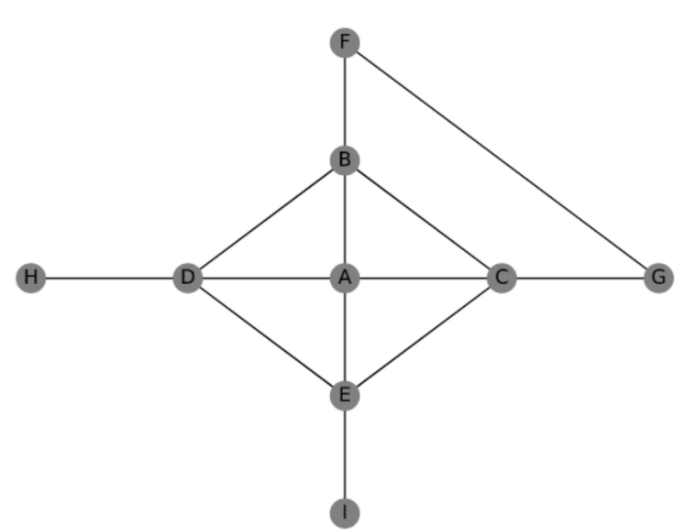
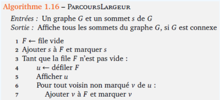
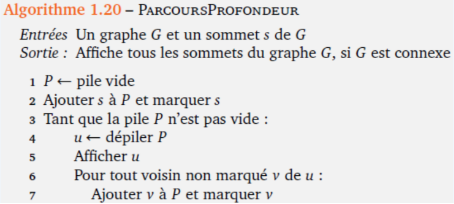
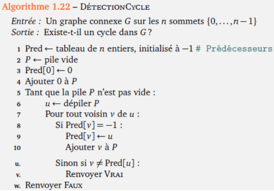
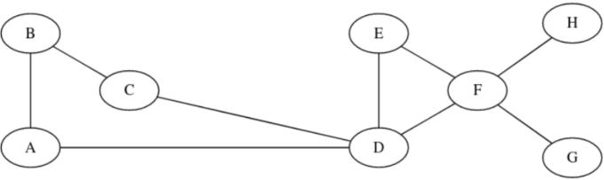
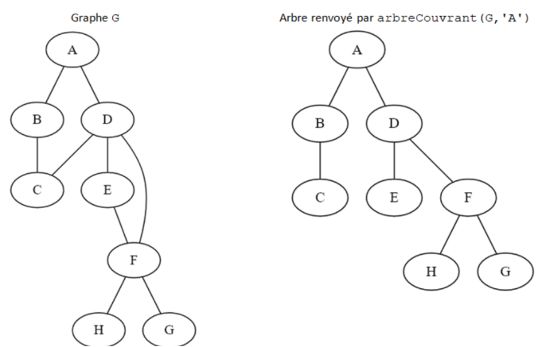
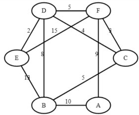
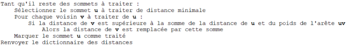

---
author: ELP
title: 10 Les graphes
---


**Table des matières**

[1.	Introduction et notion de base	2](#_toc161063570)

[2.	Modélisations d’un graphe	5](#_toc161063576)

[3.	Visualiser un graphe (à faire chez soi)	8](#_toc161063584)

[4.	❤️Création d’une class Graphe❤️	9](#_toc161063587)

[5.	Les parcours	10](#_toc161063590)

[6.	Exercices	18](#_toc161063596)

[7.	Projet	25](#_toc161063597)


**Compétences évaluables :**

- Modéliser des situations sous forme de graphes
- Ecrire les implémentations correspondantes d’un graphe : matrice d’adjacence, liste de successeurs/de prédécesseurs
- Passer d’une représentation à une autre.
- Parcourir un graphe en profondeur d’abord, en largeur d’abord.
- Repérer la présence d’un cycle dans un graphe
- Chercher un chemin dans un graphe


## <a name="_toc161063570"></a>**1. Introduction et notion de base**
### <a name="_toc161063571"></a>**1.1. Qu’est ce qu’un graphe ?**

Un graphe est une structure de données qui représente **des relations entre des objets.** Les objets sont représentés par des **sommets** (également appelés nœuds) et les relations entre eux sont représentées par des **arêtes** ou **arc**.


Il y a donc zéro ou une arête entre une paire de sommets.

Le nombre de sommets d’un graphe s’appelle l’**ordre du graphe.**

Le graphe précédent est d’ordre ????????????????.

### <a name="_toc161063572"></a>**1.2. A quoi sert un graphe ?**
Il sert à représenter des **relations** entre des éléments. 

Par exemple il peut représenter un **réseau social** :


Ou un **réseau de transport**


Ou un **réseau informatique**


Les graphes servent aussi à représenter **des relations entre des données**, des **objets** ou pour faire du **routage dans les réseaux**.

**Activité n° 1 : Graphe social :**  Construisez un graphe de réseau social à partir des informations suivantes :

- A est ami avec B et E

- B est ami avec A et C

- C est ami avec B,F et D

- D est ami avec C,F et E

- E est ami avec A,D et F

- F est ami avec C, D et E


### <a name="_toc161063573"></a>**1.3. Vocabulaire**
On dit que deux sommets A et B sont **voisins** s’ils sont reliés par une arête : ils sont aussi dits **adjacents.**

Le **degré d’un sommet** c’est le nombre d’arêtes issues de ce sommet.

Une **chaine** est **une suite d'arêtes consécutives dans un graphe**, un peu comme si on se promenait sur le graphe.

On la désigne par **les lettres des sommets** qu'elle comporte.

Un **cycle** est **une chaine qui commence et se termine au même sommet**


**Activité n° 2 : Question vocabulaire**

Soit le graphe suivant : 


- Donner l’ordre de ce graphe

- Donner le degré de chaque sommet de ce graphe

- Donner deux sommets adjacents

- Donner deux sommets non adjacents

### <a name="_toc161063574"></a>**1.4. Les différents types de graphes**
**Premier exemple :**

Soit les lieux suivants : A, B, C, D, E, F et G.


Les différents lieux sont reliés par les routes suivantes :

- il existe une route entre A et C
- il existe une route entre A et B
- il existe une route entre A et D
- il existe une route entre B et F
- il existe une route entre B et E
- il existe une route entre B et G
- il existe une route entre D et G
- il existe une route entre E et F

**Problème** :
Avec cette représentation du réseau routier sous forme de graphe, il est ***impossible de tenir compte des routes en sens unique***. (par exemple il est possible d'aller de A vers D mais pas de D vers A)

**Deuxième exemple :**

Voici de nouvelles contraintes :


- il existe une route entre A et C (double sens)
- il existe une route entre A et B (sens unique B->A)
- il existe une route entre A et D (sens unique A->D)
- il existe une route entre B et F (sens unique B->F)
- il existe une route entre B et E (sens unique E->B)
- il existe une route entre B et G (double sens)
- il existe une route entre D et G (double sens)
- il existe une route entre E et F (double)

Dans un graphe **orienté**, chaque arête ne peut être parcourue que dans un seul sens indiqué par une flèche. L’arête s’appelle alors un **arc**.


**Troisième exemple :**

Parfois il est intéressant **d'associer aux arrêtes ou aux arcs des valeurs**, on parle alors de **graphes pondérés.**


Si nous revenons à notre "graphe cartographie", il est possible **d'associer à chaque arête la distance en km entre les 2 lieux** :


Il est aussi possible **d'associer à chaque arête la durée du trajet entre 2 points :**

En fonction du choix fait par le conducteur (trajet le plus court "en distance" ou trajet le plus court "en temps").

### <a name="_toc161063575"></a>**1.5. Applications courantes des graphes**
Les graphes sont utilisés dans de nombreuses applications courantes, notamment :

- **Réseaux sociaux** : les réseaux sociaux peuvent être modélisés en utilisant des graphes où les sommets représentent les utilisateurs et les arêtes représentent les relations entre les utilisateurs (amis, abonnements, etc.).
- **Mappage de routes** : les systèmes de navigation peuvent utiliser des graphes pour trouver les itinéraires les plus rapides entre les points d'intérêt en utilisant les informations sur les distances et les temps de parcours.
- **Optimisation de la production** : les graphes peuvent être utilisés pour planifier la production en utilisant des informations sur les dépendances entre les tâches et les ressources.
- **Science des données** : les graphes peuvent être utilisés pour explorer et visualiser les relations entre les données.
- **Analyse de réseau** : les graphes peuvent être utilisés pour étudier les réseaux complexes, tels que les réseaux de diffusion de l'information, les réseaux économiques, les réseaux biologiques, etc.
- **Jeux** : les graphes peuvent être utilisés pour implémenter des algorithmes de jeu, tels que l'algorithme minimax utilisé dans les jeux d'échecs et d'autres jeux à deux joueurs.
- **Réseau électrique** : les graphes peuvent être utilisés pour modéliser les réseaux électriques en utilisant des sommets pour représenter les nœuds et des arêtes pour représenter les lignes électriques.
- **Recherche en intelligence artificielle** : les graphes peuvent être utilisés pour implémenter des algorithmes d'IA, tels que l'algorithme A\* pour la recherche de chemin.

## <a name="_toc161063576"></a>**2. Modélisations d’un graphe**

Il existe **deux méthodes** permettant d'implémenter un graphe : les **listes d’adjacence et les matrices d'adjacences**


### <a name="_toc161063577"></a>**>2.1. Représentation par matrice d’adjacence** 

- On **classe les sommets** (en les numérotant, ou par ordre alphabétique).
- on représente les arêtes (ou les arcs) **dans une matrice**, c'est-à-dire un tableau à deux dimensions où on inscrit un 1 en ligne i et colonne j si les sommets de rang i et de rang j sont **voisins** (dits aussi ***adjacents***).

Ce tableau s'appelle une **matrice d'adjacence** (on aurait très bien pu l'appeler aussi *matrice de voisinage*).


#### <a name="_toc161063578"></a>**2.1.1. Graphe non orienté**


Dans ce graphe non orienté, comme B est voisin de C, C est aussi voisin de B, ce qui signifie que l'arête qui relie B et C va donner lieu à deux "1" dans la matrice, situé de part et d'autre de la diagonale descendante (un mathématicien parlera de matrice *symétrique*).

#### <a name="_toc161063579"></a>**2.1.2. Graphe orienté**


#### <a name="_toc161063580"></a>**2.1.3. Graphe pondéré**


**Activité n° 3 :** Soit un ensemble d'amis connectés sur un réseau social quelconque. Voici les interactions qu'on a recensées:

- André est ami avec Béa, Charles, Estelle et Fabrice,

- Béa est amie avec André, Charles, Denise et Héloïse,

- Charles est ami avec André, Béa, Denise, Estelle, Fabrice et Gilbert,

- Denise est amie avec Béa, Charles et Estelle,

- Estelle est amie avec André, Charles et Denise,

- Fabrice est ami avec André, Charles et Gilbert,

- Gilbert est ami avec Charles et Fabrice,

- Héloïse est amie avec Béa.

1\. **Sur une feuille** : Représenter le graphe des relations dans ce réseau social (on désignera chaque individu par l'initiale de son prénom). Il est possible de faire en sorte que les arêtes ne se croisent pas !

2\. Donner la matrice d'adjacence de ce graphe.


**Activité n° 4 : Sur feuille** : Construire les graphes correspondants aux matrices d'adjacence suivantes:

1. 

2. 

3. 

#### <a name="_toc161063581"></a>**2.1.4. ❤️Implémentation Python des matrices d’adjacence❤️**
Une matrice se représente naturellement par une liste de listes.

**Exemple:** La matrice 


associée au graphe suivant


sera représentée par la variable G suivante :
```python
G = [[0, 1, 1, 1, 1],
      [1, 0, 1, 0, 0],
      [1, 1, 0, 1, 0],
      [1, 0, 1, 0, 1],
      [1, 0, 0, 1, 0]]
```


**Complexité en mémoire et temps d'accès :**

- Pour un graphe à n sommets, la complexité en mémoire (appelée aussi *complexité spatiale*) de la représentation matricielle est **en O(n²).**

- Tester si un **sommet est isolé** (ou connaître ses voisins) est **en O(n)** puisqu'il faut parcourir une ligne, mais tester si deux sommets **sont adjacents** (voisins) est **en O(1),** c'est un simple accès au tableau.

### <a name="_toc161063582"></a>**2.2. ❤️Représentation par les listes d’adjacence❤️**

- On associe à chaque sommet **sa liste des voisins** (c'est-à-dire les sommets adjacents). On utilise pour cela un **dictionnaire** dont les clés sont les sommets et les valeurs les listes des voisins.

- Dans le cas d'un **graphe orienté** on associe à chaque sommet **la liste des *successeurs*** (ou bien des *prédécesseurs*, au choix).


Par exemple, le graphe


sera représenté par le dictionnaire :
```python
G = {'A': ['B', 'C', 'D', 'E'],
     'B': ['A', 'C'],
     'C': ['A', 'B', 'D'],
     'D': ['A', 'C', 'E'],
     'E': ['A', 'D']
    }
```


**Complexité en mémoire et temps d'accès :**

- Pour un graphe à n sommets et m arêtes, la complexité spatiale de la représentation en liste d'adjacence est **en O(n+m)**. C'est beaucoup mieux qu'une matrice d'adjacence lorsque le graphe comporte peu d'arêtes (i.e. beaucoup de 0 dans la matrice, non stockés avec des listes).

- Tester si un **sommet est isolé** (ou connaître ses voisins) est **en O(1)** puisqu'on y accède immédiatement, mais tester si **deux sommets sont adjacents** (voisins) est **en O(n)** car il faut parcourir la liste.

**Activité n° 5 : Sur feuille :** Construire les graphes correspondants aux listes d'adjacence suivantes :
1\.
```python
G1 = {
'A': ['B', 'C'],
'B': ['A', 'C', 'E', 'F'],
'C': ['A', 'B', 'D'],
'D': ['C', 'E'],
'E': ['B', 'D', 'F'],
'F': ['B', 'E']
     }
```
2\.
```python
G2 = {
'A': ['B'],
'B': ['C', 'E'],
'C': ['B', 'D'],
'D': [],
'E': ['A']
     }
```

### <a name="_toc161063583"></a>**2.3. ❤️Passage d’une représentation à l’autre❤️**

Dans THONNY : dans un fichier **graphe.py**

=> **CAPYTALE Le code vous sera donné par votre enseignant**

**Activité n° 6 : Représentation par une matrice : Passage d’une représentation à l’autre :**  Ecrire une fonction matrice2dico(sommets, matrice) qui prend un graphe représenté par une liste de sommets et une matrice d’adjacence et renvoie le graphe équivalent représenté par un dictionnaire.


Tester avec M1, M2 et M3

**Activité n° 7 : Représentation par dictionnaire: Passage d’une représentation à l’autre :**  Ecrire une fonction dico2matrice(graphe\_dico) qui prend un graphe représenté par un dictionnaire et qui renvoie  une liste de sommets et une matrice d’adjacence.
```python
G = {'A': ['B', 'C', 'D', 'E'],
     'B': ['A', 'C'],
     'C': ['A', 'B', 'D'],
     'D': ['A', 'C', 'E'],
     'E': ['A', 'D']
    }

G1 = {
'A': ['B', 'C'],
'B': ['A', 'C', 'E', 'F'],
'C': ['A', 'B', 'D'],
'D': ['C', 'E'],
'E': ['B', 'D', 'F'],
'F': ['B', 'E']
     }

G2 = {
'A': ['B'],
'B': ['C', 'E'],
'C': ['B', 'D'],
'D': [],
'E': ['A']
     }
```

Tester avec G, G1 et G2

## <a name="_toc161063584"></a>**3. Visualiser un graphe**

### <a name="_toc161063585"></a>**3.1. Avec le module networkx**

Pour visualiser ce graphe, nous allons utiliser les bibliothèques networkx et matplotlib. Pensez à vérifier que les deux bibliothèques sont installées 

**Activité n° 8 : Représentation avec networkx :**  
```python
import matplotlib.pyplot as plt
import networkx as nx

def cree_graphe_non_oriente_nx(dictionnaire: dict) -> nx.Graph:
    """
    Cette fonction premet de transformer une représentation en dictionnaire en
    une représentation «complexe» d'un objet graphe orienté.

    - Précondition : l'entrée est un dictionnaire
    - Postcondition : la sortie est un graphe orienté (Graph) de Networkx
    """
    Gnx = nx.Graph() 
    for sommets in dictionnaire.keys():
        Gnx.add_node(sommets) # Creation des sommets
    for sommet in dictionnaire.keys():
        for sommets_adjacents in dictionnaire[sommet]:
            Gnx.add_edge(sommet, sommets_adjacents) # Creation des arcs
    return Gnx

plt.cla()# Pour effacer les figures précédentes
dico = {0:[1, 2], 1:[0, 2, 3], 2 : [0, 1, 3], 3: [1,2]}
G = cree_graphe_non_oriente_nx(dico)
# nx.draw_circular(G, with_labels=True)
nx.draw(G,with_labels = True) # Pour une representation classique
plt.show()
```

**Activité n° 9 : représentation avec networkx :**  Tester avec G, G1 et G2 de la partie 2.2.

### <a name="_toc161063586"></a>**3.2. Avec le module graphviz**

dans Thonny : Vérifiez que la bibliothèque graphviz est installée

**Activité n° 10 : représentation avec graphviz  d’un graphe orienté**
```python
import graphviz
graphe_oriente = graphviz.Digraph()

#Ajout des noeuds avec la méthode node
graphe_oriente.node("A")
graphe_oriente.node("B")
graphe_oriente.node("C")

#Ajout des arcs avec la méthode edge
graphe_oriente.edge("A","B")
graphe_oriente.edge("A","C")

#Affichage du graphe
graphviz.Source(graphe_oriente)
graphe_oriente.view()
```

**Activité n° 11 : représentation avec graphviz d’un graphe orienté :**  Tester avec G2

**Activité n° 12 : représentation avec graphviz  d’un graphe non orienté**
```python
import graphviz
graphe_non_oriente = graphviz.Graph()

#Ajout des noeuds avec la méthode node
graphe_non_oriente.node("A")
graphe_non_oriente.node("B")
graphe_non_oriente.node("C")

#Ajout des arcs avec la méthode edge
graphe_non_oriente.edge("A","B")
graphe_non_oriente.edge("A","C")

#Affichage du graphe
graphviz.Source(graphe_non_oriente)
graphe_non_oriente.view()
```

**Activité n° 13 : représentation avec graphviz d’un graphe non orienté :**  Tester avec G et G1

## <a name="_toc161063587"></a>**4. ❤️Création d’une class Graphe❤️**

Dans cette partie, nous ne traiterons que des graphes **non-orientés**.

### <a name="_toc161063588"></a>**4.1. Interface** 


Dans THONNY : Dans un fichier **graphe\_POO.py**

=> **CAPYTALE Le code vous sera donné par votre enseignant**


Nous voulons que le graphe puisse être créé grâce aux instructions suivantes :

- constructeur(s : liste de Sommets) -> Graphe: renvoie le graphe (S, Δ) où Δ est une liste vide d’arêtes

- ajouter\_arete(g : Graphe, s1 : Sommet, s2 : Somme) -> graphe: à partir du graphe g = (S, A) et de deux sommets s1 et s2 appartenant à S renvoie le graphe (S, A ∪ {(s1, s2)})

- voisins(g : Graphe, s : Sommets) -> liste de Sommets: renvoie la liste des sommets voisins de s dans le graphe g. Cette fonction est remplacée par une fonction successeurs et/ou predecesseurs dans le cas d’un graphe orienté.

- sont\_voisins(g : Graphe, s1 : Sommet, s2 : Somme) -> bool: à partir du graphe g et de deux sommets s1 et s2 renvoie si s1 et voisin de s2

- get\_dictionnaire(g : Graphe) -> dict : à partir du graphe renvoie le dictionnaire donnant la liste d’adjacence

L'objet de type Graphe aura comme attributs :

- une liste liste\_sommets (donnée en paramètre dans la liste liste\_sommets)

- un dictionnaire adjacents, où chaque sommet se verra attribuer une liste vide [].

### <a name="_toc161063589"></a>**4.2. Implémentation** 

```python
class Graphe:
    def __init__(self, liste_sommets):
        self.liste_sommets = liste_sommets
        self.adjacents = {sommet : [] for sommet in liste_sommets}

    def ajouter_arete(self, s1, s2):
        pass

    def voisins(self, s):
        pass

    def sont_voisins(self, s1, s2):
        pass

    def get_dictionnaire(self):
        pass


#################################### Pour réaliser l'affichage #########################
import matplotlib.pyplot as plt
import networkx as nx

def cree_graphe_non_oriente_nx(dictionnaire: dict) -> nx.Graph:
    Gnx = nx.Graph()
    for sommets in dictionnaire.keys():
        Gnx.add_node(sommets) # Creation des sommets
    for sommet in dictionnaire.keys():
        for sommets_adjacents in dictionnaire[sommet]:
            Gnx.add_edge(sommet, sommets_adjacents) # Creation des arcs
    return Gnx


if __name__ == '__main__':
    g = Graphe(['A', 'B', 'C', 'D', 'E'])
    g.ajouter_arete('A', 'B')
    g.ajouter_arete('A', 'C')
    g.ajouter_arete('A', 'D')
    g.ajouter_arete('A', 'E')
    g.ajouter_arete('B', 'C')
    g.ajouter_arete('C', 'D')
    g.ajouter_arete('D', 'E')
    assert g.sont_voisins('E', 'A') == True
    assert g.sont_voisins('E', 'B') == False
    assert g.voisins('C') == ['A', 'B', 'D']
    dict_2 = g.get_dictionnaire()
    print(dict_2)
    plt.cla()
    G2 = cree_graphe_non_oriente_nx(dict_2)
    nx.draw_circular(G2, with_labels=True)
    plt.show()
```


## <a name="_toc161063590"></a>**5. Les parcours**
Un parcours de graphe est un algorithme consistant à **explorer les sommets d'un graphe de proche en proche** à partir d'un sommet initial. 

Parcourir simplement le dictionnaire ou la matrice d’un graphe comme on peut le faire pour effectuer une copie du graphe n’est pas considéré comme un parcours de graphe. 

Tous les parcours suivent plus ou moins le même algorithme de base : 

-\ On visite un sommet s1. On crée une structure S qui contiendra l’ensemble des voisins de s1. 
-\ Tant que S n’est pas vide : 
  - on choisit un sommet s de S
  - on visite s 
  - on ajoute à S tous les voisins de s pas encore visités


```python
Attention : sommets visités :class Graphe:
    def __init__(self, liste_sommets):
        self.liste_sommets = liste_sommets
        self.adjacents = {sommet : [] for sommet in liste_sommets}

    def ajouter_arete(self, s1, s2):
        pass

    def voisins(self, s):
        pass

    def sont_voisins(self, s1, s2):
        pass

    def get_dictionnaire(self):
        pass


#################################### Pour réaliser l'affichage #########################
import matplotlib.pyplot as plt
import networkx as nx

def cree_graphe_non_oriente_nx(dictionnaire: dict) -> nx.Graph:
    Gnx = nx.Graph()
    for sommets in dictionnaire.keys():
        Gnx.add_node(sommets) # Creation des sommets
    for sommet in dictionnaire.keys():
        for sommets_adjacents in dictionnaire[sommet]:
            Gnx.add_edge(sommet, sommets_adjacents) # Creation des arcs
    return Gnx


if __name__ == '__main__':
    g = Graphe(['A', 'B', 'C', 'D', 'E'])
    g.ajouter_arete('A', 'B')
    g.ajouter_arete('A', 'C')
    g.ajouter_arete('A', 'D')
    g.ajouter_arete('A', 'E')
    g.ajouter_arete('B', 'C')
    g.ajouter_arete('C', 'D')
    g.ajouter_arete('D', 'E')
    assert g.sont_voisins('E', 'A') == True
    assert g.sont_voisins('E', 'B') == False
    assert g.voisins('C') == ['A', 'B', 'D']
    dict_2 = g.get_dictionnaire()
    print(dict_2)
    plt.cla()
    G2 = cree_graphe_non_oriente_nx(dict_2)
    nx.draw_circular(G2, with_labels=True)
    plt.show()
```

Contrairement à un parcours d'arbre, où les fils d'un nœud ne peuvent pas avoir été visités avant le nœud, **un voisin d'un sommet peut avoir déjà été visité** en tant que voisin d'un sommet précédent...

Il est donc nécessaire **de mémoriser les sommets déjà visités** ou découverts (on dira qu'un sommet est découvert lorsqu'on l'ajoute à S).

### <a name="_toc161063591"></a>**5.1. ❤️Parcours en largeur ❤️** 

**Cf : Video Parcours graphe**

Si on utilise une **file** (FIFO) pour S, les sommets enregistrés dans S en premier vont être visités les premiers. On va donc visiter d’abord les sommets le plus prêts de s<sub>1</sub> (ceux à distance 1, puis ceux à distance 2, puis 3…). C’est un **parcours en largeur (BFS, Breadth First Search)**. 

On va utiliser ce parcours pour trouver :

- le **sommet le plus prêt** de s<sub>1</sub> vérifiant une condition donnée 
- le **chemin le plus court** entre s<sub>1</sub> et un autre sommet.


![ref4]

Sur ce graphe A-B-C-F-E-D-G est un parcours en largeur au départ de A.

B-A-C-E-F-D-G et B-A-F-E-C-G-D sont des parcours en largeur au départ de B.

|<p>![ref5]**Activité n° AUTONUM  \* Arabic : Parcours en largeur :**   Appliquez l'algorithme du parcours en largeur au graphe ci-dessous.</p><p>Le 'point de départ' de notre parcours (le sommet s dans l'algorithme), sera le sommet A.</p><p>Vous noterez les sommets atteints à chaque étape ainsi que les sommets présents dans la file f.</p><p>Vous pourrez aussi, à chaque étape, donner les changements de couleur des sommets.</p><p></p>|
| - |


Dans Thonny : dans **le** fichier **graphe.py**

**L’algorithme du BFS** :

On marque les sommets découverts afin que chaque sommet ne soit enfilé qu’une fois. Ainsi, lorsqu’on défile un sommet, on sait qu’il n’a pas encore été visité.


**Aide :** 

**# les voisins de tmp: G[tmp]**

Le test SI voisin n est pas dans decouverts permet donc de ne pas mettre en file d'attente un voisin qui est (ou a été) déjà en file d'attente.

**Que contient la file en\_attente :**

À chaque instant, la file en\_attente contient des sommets à la distance k+1 et à la distance k du point de départ :


**Rappels sur les files**

- 1er cas : Utiliser une file déjà codée
- 2ème cas: liste de python

file = [ ]

file.append(…)

file.pop(0)

- 3ème cas : avec module queue

from queue import Queue

file = Queue()

file.empty() 

file.put(…)

file.get()

- 4<sup>ème</sup> cas : avec module collections

from collections import deque

file = deque([ ])

file.append(…)

file.popleft()

if file : => si la file n’est pas vide

|<p>**Activité n° AUTONUM  \* Arabic : Parcours en largeur:**   Implémenter l'algorithme du parcours en largeur .</p><p>#importer une file !!<br><br><br>def parcours\_largeur\_i(G, s):<br>`    `decouverts=[]<br>`    `en\_attente = File()<br>`    `pass</p><p></p><p>print(parcours\_largeur({"A": ("B", "D", "E"), "B": ("A", "C"), "C": ("B", "D"),<br>`                            `"D": ("A", "C", "E"), "E": ("A", "D", "F", "G"), <br>`                            `"F": ("E", "G"), "G": ("E", "F", "H"),<br>`                            `"H": ("G")}, "A"))</p>|
| - |

|<p>**Activité n° AUTONUM  \* Arabic : Parcours en largeur :**   Implémenter l'algorithme du parcours en largeur .</p><p>![image]Voici le graphe :</p><p>graphe= {'A': ['B', 'C'], 'B': ['A', 'D', 'E'], 'C': ['A', 'D'], 'D': ['B', 'C', 'E'], 'E': ['B', 'D', 'F', 'G'], 'F': ['E', 'G'], 'G': ['E', 'F', 'H'], 'H': ['G']},'B') </p><p>1. Donner le parcours en largeur de g grâce à l'algorithme BFS, si le sommet de départ est B. </p><p>2. Deviner le parcours en largeur de départ D, puis de départ G. </p><p>3. Vérifier grâce à votre algorithme.</p>|
| - |
1. # <a name="_toc161063592"></a>**❤️Parcours en profondeur ❤️**
**Cf : Video Parcours graphe**

Si on utilise une **pile** (LIFO) pour S, les sommets enregistrés en dernier vont être visités en premier : on parcourt le graphe en visitant à chaque fois un voisin du dernier sommet, sauf si celui-ci n’a pas de voisin non visité, auquel cas on remonte au dernier sommet ayant un voisin non visité. C’est un **parcours en profondeur (DFS, Depth First Search)**. 

C’est le parcours utilisé naturellement par une personne qui explore **un labyrinthe**.


![ref4]

Sur le graphe précédent, A-B-C-D-E-F-G et F-B-C-D-G-E-A sont des parcours en profondeur. 

F-B-C-D-G-A-E n’en est pas un (E a été empilé après A, donc sera dépilé avant).

|<p>![ref5]**Activité n° AUTONUM  \* Arabic : Parcours en profondeur :**   Appliquez l'algorithme du parcours en profondeur au graphe ci-dessous.</p><p></p>|
| - |

**L’algorithme du DFS en version itérative**

Dans Thonny : dans **le** fichier **graphe.py**


**Rappels sur les piles**

- 1er cas : Utiliser une pile déjà codée
- 2ème cas: liste de python

pile = [ ]

pile.append(…)

pile.pop()

- 3<sup>ème</sup> cas : avec module collections

from collections import deque

pile = deque([ ])

pile.appendleft(…) # ou append()

pile.popleft()     #ou pop()

if pile : => si la pile n’est pas vide

|<p>**Activité n° AUTONUM  \* Arabic : Parcours en profondeur en version itérative:**   Implémenter l'algorithme du parcours en profondeur</p><p># Importer une pile</p><p></p><p>def parcours\_profondeur(G, s):<br>`    `decouverts=[]<br>`    `en\_attente = Pile()<br>`    `pass</p><p></p><p>print(parcours\_profondeur({"A": ("B", "D", "E"), "B": ("A", "C"), "C": ("B", "D"),<br>`                         `"D": ("A", "C", "E"), "E": ("A", "D", "F", "G"),<br>`                         `"F": ("E", "G"), "G": ("E", "F", "H"),<br>`                         `"H": ("G")}, "A") )</p>|
| - |

|<p>**Activité n° AUTONUM  \* Arabic : Parcours en profondeur :**   Implémenter l'algorithme du parcours en largeur .</p><p>![image]</p><p>Voici le graphe :</p><p>graphe= {'A': ['B', 'C'], 'B': ['A', 'D', 'E'], 'C': ['A', 'D'], 'D': ['B', 'C', 'E'], 'E': ['B', 'D', 'F', 'G'], 'F': ['E', 'G'], 'G': ['E', 'F', 'H'], 'H': ['G']},'B') == ['B', 'A', 'D', 'E', 'C', 'F', 'G', 'H']</p><p>1. Donner le parcours en profondeur de g grâce à l'algorithme DFS, si le sommet de départ est B. </p><p>2. Deviner le parcours en largeur de départ D, puis de départ G. </p><p>3. Vérifier grâce à votre algorithme.</p>|
| - |

**L’algorithme du DFS en version récursive** :


**Remarque** : En récursif il y a un petit souci : le fait de relancer la fonction parcours\_profondeur\_recur n’efface pas réellement la liste précédente => elle apparaitra sur l’appelle pour le graphe suivant…Donc **relancer la console avant chaque test !** ou passer une liste vide en paramètre

|<p>**Activité n° AUTONUM  \* Arabic : Parcours en profondeur en version recursive:**   Implémenter l'algorithme du parcours en profondeur</p><p>def parcours\_profondeur\_r (G, s,decouverts = [] ):<br>`    `pass</p><p></p><p>print(parcours\_profondeur\_r({"A": ("B", "D", "E"), "B": ("A", "C"), "C": ("B", "D"),<br>`                     `"D": ("A", "C", "E"), "E": ("A", "D", "F", "G"),<br>`                     `"F": ("E", "G"), "G": ("E", "F", "H"),<br>`                     `"H": ("G")}, "A") )</p>|
| - |


On remarque que l’on n’obtient pas le même parcours en profondeur
1. # <a name="_toc161063593"></a>**Application des parcours**
   1. ### <a name="_toc161063594"></a>**Le BFS et le chemin le plus court (Dijkstra)**

**Cf : Video Parcours graphe**

Cette implémentation utilise 

- **un dictionnaire** **distance** pour stocker les distances des nœuds à partir de la source.
- **tableau unvisited** pour stocker les nœuds qui n'ont pas encore été visités. 

À chaque itération, nous trouvons le nœud le plus proche de la source en utilisant la fonction **min()** et en utilisant la fonction de clé **key=lambda x: distances[x]**. Une fois que le nœud a été visité, nous l'enlevons du tableau **unvisited**.

Cette implémentation est simple, mais peut-être moins performante pour de grandes entrées en raison de la nécessité de trouver le nœud le plus proche à chaque itération en parcourant le tableau complet.

def dijkstra(graph, start, end):
`    `distances = {node: float('inf') for node in graph}
`    `distances[start] = 0
`    `unvisited = list(distances.keys()) # ou [key for key in graph.keys()]
`    `while unvisited:
`        `<a name="_hlk161065331"></a>current\_node = min(unvisited, key=lambda x: distances[x])
`        `unvisited.remove(current\_node)
`        `for neighbor, weight in graph[current\_node].items():
`            `distance = distances[current\_node] + weight
`            `if distance < distances[neighbor]:
`                `distances[neighbor] = distance
`    `return distances[end]

graph = {'A': {'B': 1, 'C': 4},'B': {'A': 1, 'C': 2, 'D': 5},'C': {'A': 4, 'B': 2, 'D': 1},'D': {'B': 5, 'C': 1},}


print(dijkstra(graph, 'A', 'D'))  # Output: 4

Explication : 

- **distances = {node: float('inf') for node in graph}** : ce bloc de code initialise un dictionnaire **distances** qui contiendra **les distances minimales depuis le noeud de départ pour chaque noeud dans le graphe.** Tous les éléments du dictionnaire sont initialisés à **float('inf')**, qui représente l'infini.
- **distances[start] = 0** : ce bloc de code définit la distance du nœud de départ à lui-même à 0.
- **unvisited = list(distances.keys())** : ce bloc de code crée un tableau **unvisited** qui contiendra les noeuds qui n'ont pas encore été visités.
- **while unvisited:** : ce bloc de code définit une boucle qui s'exécutera tant qu'il reste des noeuds non visités.
- **current\_node = min(unvisited, key=lambda x: distances[x])** : ce bloc de code trouve **le noeud dans unvisited avec la distance minimale à partir du nœud de départ** et le définit comme le noeud actuel. Plus précisément, **lambda x: distances[x]** est une fonction qui prend un nœud x comme entrée et renvoie la distance de ce nœud à partir du nœud de départ (comme stocké dans le dictionnaire distances). 
- **unvisited.remove(current\_node)** : ce bloc de code **retire le nœud actuel** de la liste **unvisited** pour marquer qu'il a été visité.
- **for neighbor, weight in graph[current\_node].items():** : ce bloc de code définit une **boucle qui parcourt les voisins** du nœud actuel.
- **distance = distances[current\_node] + weight** : ce bloc de **code calcule la distance minimale pour le voisin** en ajoutant le poids de l'arc qui relie le nœud actuel au voisin.
- **if distance < distances[neighbor]:** : ce bloc de code vérifie si la distance minimale pour le voisin est plus petite que la valeur actuelle dans le dictionnaire **distances**.
- **distances[neighbor] = distance** : ce bloc de code met à jour la distance minimale pour le voisin dans le dictionnaire **distances** si elle est plus petite que la valeur actuelle.
- **return distances[end]** : ce bloc de code retourne la distance minimale pour le noeud de destination depuis le nœud de départ.

**Aide** :

La ligne 

current\_node = min(unvisited, key=lambda x: distances[x])

peut être remplacée par :

min\_distance = float('inf')
current\_node = None
for node in unvisited:
`    `if distances[node] < min\_distance:
`        `min\_distance = distances[node]
`        `current\_node = node

C’est moins efficace (complexité temporelle plus grande due à l’absence de la fonction min qui est plus efficace que notre code) mais il fait la même chose : Pour chaque sommet appelé node non visité, on  garde le node qui a la distance minimale du départ


1. ### <a name="_toc161063595"></a>**Parcourir un labyrinthe**
**Considérons le problème suivant :**

rechercher le chemin le plus long entre deux stations dans le métro. Indépendamment de l'aspect ludique, c'est en fait un problème difficile qu'on aurait bien du mal à résoudre de façon raisonnable sur un gros graphe comme celui du métro. Pour simplifier, nous allons donc considérer des labyrinthes.


**Les labyrinthes**

Voici l'image d'un labyrinthe :


Ce labyrinthe correspond au graphe suivant :

**Implémentation du labyrinthe**

Implémentons ce labyrinthe avec un graphe. Vous utiliserez l'implémentation de graphe fournie ci-dessous.

Vous nommerez les sommet (1, 1) (1, 2) .. etc

Les arêtes relient les cases voisines quand le passage est possible. Si une paroie empêche de passer on ne met pas l'arête.

Par exemple il n'y a pas d'arête entre les sommets (1, 1) et (1, 2) mais il y en a une entre (1, 1) et (2, 1).

Dans THONNY : Ouvrir le fichier **TP\_labyrinthe.py**

|<p>**Capytale**</p><p>**70ca-3804414**</p>|
| :-: |

1. vérifier que l’implémentation est bonne
1. vérifier que la liste d’adjacence de 3,6

**Dessin de votre labyrinthe**

Pour voir le labyrinthe que vous avez créé, vous allez avoir besoin des fonction ci-dessous.

Vous n'avez pas besoin de les regarder, la seule chose dont vous avez besoin c'est de dessiner avec show\_Labyrinthe(cote, nli, ncol) avec :

- cote est un entier qui code la longuer des coté des case (mettez 40)
- nli et ncol sont les nombres de lignes et colones de votre labyrinthe, donc ici 4 et 8

**Promenade dans le labyrinthe**

**1. commencez par implémenter les deux parcours en largeur (BFS) et en profondeur (DFS), en partant de la case (1, 1)**

**Parcours en largeur : BFS** compléter le code

**Parcours en profondeur DFS** compléter le code

**2. On souhaite tracer les chemins, et non plus seulement les sommets visités**

Il va donc maintenant falloir garder en mémoire, pour chaque sommet, le parent associé (d'où l'on venait)

Pour cela recopiez la fonction DFS faite précédement et modifiez là comme suit :

1. Avant la boucle créez une liste vide chemin et un dictionnaire vide parent
1. Toujours avant la boucle, pour chaque sommet s dans a\_voir, définir son parent égal à (1, 1) : parent[s] = (1, 1)
- A chaque fois qu'on ajoute un sommet dans a\_voir, il faut définir son parent dans le dictionnaire parent
- A chaque fois qu'on ajoute un sommet dans vus on doit ajouter dans chemin un tuple (parent[sommet], sommet)

Compléter le code

**Ouverture possible** : puisqu'on entre en (1, 1) et que la sortie est en (4, 8), autant s'arrêter dès qu'on a trouvé la sortie, modifier le code en ajouter une condition dans le while pour éviter un break


Merci à Gilles Lassus, Cédric Gouyou, Jean-Louis Thirot, et Mireille Coilhac
1. # <a name="_toc161063596"></a>**Exercices**
**Exercice n°1 : Implémentation avec matrice d’adjacence**

|<p>**Capytale**</p><p>**70ca-3804414**</p>|
| :-: |

**On se place ici dans le cas de graphes non orientés.**

1. **Constructeur**

Créer la fonction **creer\_graphe** qui prend en paramètre une liste (non vide) constituée des noms des sommets et qui renvoie un graphe vide, constitué de ces sommets.

def creer\_graphe(sommets):
`    `"""
`    `À partir de la liste des sommets renvoie le graphe (S,∆) 
`    `où ∆ est la matrice d'ajacence vide.
`    `Entrées
`    `---------
`    `sommets : liste des sommets

`    `Sortie
`    `---------
`    `le graphe
`    `"""


"""Cette cellule sert à tester la validité du code. Exécutez-là. 
\- S'il n'y a pas d'erreur, votre code est probablement juste.
\- S'il y a une erreur, il est forcément faux."""

assert(creer\_graphe(['a', 'b', 'c', 'd', 'e']) == (['a', 'b', 'c', 'd', 'e'],
` `[[0, 0, 0, 0, 0],
`  `[0, 0, 0, 0, 0],
`  `[0, 0, 0, 0, 0],
`  `[0, 0, 0, 0, 0],
`  `[0, 0, 0, 0, 0]]))

assert(creer\_graphe(['e', 'g', 'h']) == (['e', 'g', 'h'], [[0, 0, 0], [0, 0, 0], [0, 0, 0]]))
assert(creer\_graphe(['a', 'b', 'c', 'd', 'e', 'f', 'g', 'h']) == (['a', 'b', 'c', 'd', 'e', 'f', 'g', 'h'],
` `[[0, 0, 0, 0, 0, 0, 0, 0],
`  `[0, 0, 0, 0, 0, 0, 0, 0],
`  `[0, 0, 0, 0, 0, 0, 0, 0],
`  `[0, 0, 0, 0, 0, 0, 0, 0],
`  `[0, 0, 0, 0, 0, 0, 0, 0],
`  `[0, 0, 0, 0, 0, 0, 0, 0],
`  `[0, 0, 0, 0, 0, 0, 0, 0],
`  `[0, 0, 0, 0, 0, 0, 0, 0]]))

\# On vérifie que la matrice a bien été créée correctement
g = creer\_graphe(['e', 'g', 'h'])
g[1][1][1] = 1
assert(g == (['e', 'g', 'h'], [[0, 0, 0], [0, 1, 0], [0, 0, 0]]))

1. **Opération**

Créer la fonction **ajouter\_arete** qui prend en paramètre un graphe **g** et le nom de deux sommets **s1** et **s2** (appartenant au graphe) et qui renvoie le même graphe auquel on a ajouté l'arête joignant les sommets **s1** et **s2**.

def ajouter\_arete(g, s1, s2):
`    `"""
`    `À partir d'un graphe et de deux sommets, renvoie le graphe g
`    `auquel l'arête reliant s1 à s2 a été ajoutée.
`    `Entrées
`    `---------
`    `g : un graphe
`    `s1, s2 : les deux sommets à relier

`    `Sortie
`    `---------
`    `le graphe
`    `"""

"""Cette cellule sert à tester la validité du code. Exécutez-là. 
\- S'il n'y a pas d'erreur, votre code est probablement juste.
\- S'il y a une erreur, il est forcément faux."""

G = creer\_graphe(['e', 'g', 'h'])
assert(ajouter\_arete(G, 'e', 'g') == (['e', 'g', 'h'], [[0, 1, 0], [1, 0, 0], [0, 0, 0]]))
assert(ajouter\_arete(G, 'h', 'g') == (['e', 'g', 'h'], [[0, 1, 0], [1, 0, 1], [0, 1, 0]]))

H = creer\_graphe(['a', 'b', 'c', 'd', 'e', 'f', 'g', 'h'])
ajouter\_arete(H, 'a', 'b')
ajouter\_arete(H, 'e', 'b')
ajouter\_arete(H, 'e', 'f')
ajouter\_arete(H, 'a', 'h')
ajouter\_arete(H, 'c', 'd')
ajouter\_arete(H, 'e', 'd')
ajouter\_arete(H, 'e', 'h')
assert(H == (['a', 'b', 'c', 'd', 'e', 'f', 'g', 'h'],
` `[[0, 1, 0, 0, 0, 0, 0, 1],
`  `[1, 0, 0, 0, 1, 0, 0, 0],
`  `[0, 0, 0, 1, 0, 0, 0, 0],
`  `[0, 0, 1, 0, 1, 0, 0, 0],
`  `[0, 1, 0, 1, 0, 1, 0, 1],
`  `[0, 0, 0, 0, 1, 0, 0, 0],
`  `[0, 0, 0, 0, 0, 0, 0, 0],
`  `[1, 0, 0, 0, 1, 0, 0, 0]]))

1. **Sélecteurs**

Créer la fonction **sommets** qui prend en paramètre un graphe **g** et qui renvoie la liste de ses sommets.

def sommets(g):
`    `"""
`    `"""

"""Cette cellule sert à tester la validité du code. Exécutez-là. 
\- S'il n'y a pas d'erreur, votre code est probablement juste.
\- S'il y a une erreur, il est forcément faux."""

assert(sommets((['e', 'g', 'h'], [[0, 0, 0], [0, 0, 0], [0, 0, 0]])) == ['e', 'g', 'h'])

assert(sommets((['a', 'b', 'c', 'd', 'e', 'f', 'g', 'h'],
` `[[0, 0, 0, 0, 0, 0, 0, 0],
`  `[0, 0, 0, 0, 0, 0, 0, 0],
`  `[0, 0, 0, 0, 0, 0, 0, 0],
`  `[0, 0, 0, 0, 0, 0, 0, 0],
`  `[0, 0, 0, 0, 0, 0, 0, 0],
`  `[0, 0, 0, 0, 0, 0, 0, 0],
`  `[0, 0, 0, 0, 0, 0, 0, 0],
`  `[0, 0, 0, 0, 0, 0, 0, 0]])) == ['a', 'b', 'c', 'd', 'e', 'f', 'g', 'h'])

Créer la fonction **voisins** qui prend en paramètre un graphe **g** et un sommet **s** du graphe et qui renvoie la liste des sommets voisins de **s**.

def voisins(g, s):
`    `"""
`    `"""

"""Cette cellule sert à tester la validité du code. Exécutez-là. 
\- S'il n'y a pas d'erreur, votre code est probablement juste.
\- S'il y a une erreur, il est forcément faux."""

H = creer\_graphe(['a', 'b', 'c', 'd', 'e', 'f', 'g', 'h'])
ajouter\_arete(H, 'a', 'b')
ajouter\_arete(H, 'e', 'b')
ajouter\_arete(H, 'e', 'f')
ajouter\_arete(H, 'a', 'h')
ajouter\_arete(H, 'c', 'd')
ajouter\_arete(H, 'e', 'd')
ajouter\_arete(H, 'e', 'h')
assert(voisins(H, 'a') == ['b', 'h'])
assert(voisins(H, 'e') == ['b', 'd', 'f', 'h'])
assert(voisins(H, 'g') == [])

1. **Fonctions supplémentaires**

On cherche à étendre le Type Abstrait de Donnes (TAD) **Graphe simple** avec de nouvelles opérations :

1. Degré

Écrire une fonction **degre** qui prend en paramètre un graphe **g** et un sommet **s** et qui renvoie le degré du sommet **s**.

def degre(g, s):
`    `"""
`    `"""

"""Cette cellule sert à tester la validité du code. Exécutez-là. 
\- S'il n'y a pas d'erreur, votre code est probablement juste.
\- S'il y a une erreur, il est forcément faux."""

H = creer\_graphe(['a', 'b', 'c', 'd', 'e', 'f', 'g', 'h'])
ajouter\_arete(H, 'a', 'b')
ajouter\_arete(H, 'e', 'b')
ajouter\_arete(H, 'e', 'f')
ajouter\_arete(H, 'a', 'h')
ajouter\_arete(H, 'c', 'd')
ajouter\_arete(H, 'e', 'd')
ajouter\_arete(H, 'e', 'h')
assert(degre(H, 'a') == 2)
assert(degre(H, 'e') == 4)
assert(degre(H, 'g') == 0)

1. Sommet isolé

Écrire une fonction **est\_isole** qui prend en paramètre un graphe simple **g** et un sommet **s** et renvoie un booléen indiquant si **s** est isolé.

def est\_isole(g, s):
`    `"""
`    `"""

"""Cette cellule sert à tester la validité du code. Exécutez-là. 
\- S'il n'y a pas d'erreur, votre code est probablement juste.
\- S'il y a une erreur, il est forcément faux."""

H = creer\_graphe(['a', 'b', 'c', 'd', 'e', 'f', 'g', 'h'])
ajouter\_arete(H, 'a', 'b')
ajouter\_arete(H, 'e', 'b')
ajouter\_arete(H, 'e', 'f')
ajouter\_arete(H, 'a', 'h')
ajouter\_arete(H, 'c', 'd')
ajouter\_arete(H, 'e', 'd')
ajouter\_arete(H, 'e', 'h')
assert(est\_isole(H, 'a') ==  False)
assert(est\_isole(H, 'e') ==  False)
assert(est\_isole(H, 'g') ==  True)

1. Degré moyen

Écrire une fonction **degre\_moyen** qui prend en paramètre un graphe simple **g** et renvoie un réel indiquant le degré moyen des sommets de **g**.

def degre\_moyen(g):
`    `"""
`    `"""

"""Cette cellule sert à tester la validité du code. Exécutez-là. 
\- S'il n'y a pas d'erreur, votre code est probablement juste.
\- S'il y a une erreur, il est forcément faux."""

H = creer\_graphe(['a', 'b', 'c', 'd', 'e', 'f', 'g', 'h'])
ajouter\_arete(H, 'a', 'b')
ajouter\_arete(H, 'e', 'b')
ajouter\_arete(H, 'e', 'f')
ajouter\_arete(H, 'a', 'h')
ajouter\_arete(H, 'c', 'd')
ajouter\_arete(H, 'e', 'd')
ajouter\_arete(H, 'e', 'h')
assert(degre\_moyen(H) ==  1.75)

I = creer\_graphe(['a', 'b', 'c', 'd', 'e'])
ajouter\_arete(I, 'a', 'b')
ajouter\_arete(I, 'a', 'c')
ajouter\_arete(I, 'a', 'd')
ajouter\_arete(I, 'a', 'e')
ajouter\_arete(I, 'b', 'd')
ajouter\_arete(I, 'b', 'e')
ajouter\_arete(I, 'c', 'e')
assert(degre\_moyen(I) ==  2.8)

1. Sont voisins

Écrire une fonction **sont\_voisins** qui prend en paramètre un graphe simple **g** et de deux sommets **s1** et **s2** et renvoie un booléen indiquant si **s1** est voisin de **s2**.

def sont\_voisins(g, s1, s2):
`    `"""
`    `"""

"""Cette cellule sert à tester la validité du code. Exécutez-là. 
\- S'il n'y a pas d'erreur, votre code est probablement juste.
\- S'il y a une erreur, il est forcément faux."""

H = creer\_graphe(['a', 'b', 'c', 'd', 'e', 'f', 'g', 'h'])
ajouter\_arete(H, 'a', 'b')
ajouter\_arete(H, 'e', 'b')
ajouter\_arete(H, 'e', 'f')
ajouter\_arete(H, 'a', 'h')
ajouter\_arete(H, 'c', 'd')
ajouter\_arete(H, 'e', 'd')
ajouter\_arete(H, 'e', 'h')
assert(sont\_voisins(H, 'a', 'b' ) ==  True)
assert(sont\_voisins(H, 'a', 'c' ) ==  False)
assert(sont\_voisins(H, 'a', 'h' ) ==  True)
assert(sont\_voisins(H, 'f', 'e' ) ==  True)
assert(sont\_voisins(H, 'd', 'a' ) ==  False)

I = creer\_graphe(['a', 'b', 'c', 'd', 'e'])
ajouter\_arete(I, 'a', 'b')
ajouter\_arete(I, 'a', 'c')
ajouter\_arete(I, 'a', 'd')
ajouter\_arete(I, 'a', 'e')
ajouter\_arete(I, 'b', 'd')
ajouter\_arete(I, 'b', 'e')
ajouter\_arete(I, 'c', 'e')
assert(sont\_voisins(I, 'a', 'b' ) ==  True)
assert(sont\_voisins(I, 'a', 'c' ) ==  True)
assert(sont\_voisins(I, 'a', 'd' ) ==  True)
assert(sont\_voisins(I, 'e', 'b' ) ==  True)
assert(sont\_voisins(I, 'c', 'd' ) ==  False)
assert(sont\_voisins(I, 'c', 'b' ) ==  False)

1. **Graphe orienté**

**On va traiter maintenant le cas de graphes orientés.**

1. Opération

À partir de la fonction **ajouter\_arete** , créer la fonction **ajouter\_arc** qui prend en paramètre un graphe **g** et le nom de deux sommets **s1** et **s2** (appartenant au graphe) et qui renvoie le même graphe auquel on a ajouté l'arc joignant le sommet **s1** au sommet **s2**.

def ajouter\_arc(g, s1, s2):
`    `"""
`    `"""

"""Cette cellule sert à tester la validité du code. Exécutez-là. 
\- S'il n'y a pas d'erreur, votre code est probablement juste.
\- S'il y a une erreur, il est forcément faux."""

G = creer\_graphe(['a', 'b', 'c', 'd', 'e'])
ajouter\_arc(G, 'a', 'b')
ajouter\_arc(G, 'b', 'e')
ajouter\_arc(G, 'd', 'e')
ajouter\_arc(G, 'e', 'd')
assert(G ==  (['a', 'b', 'c', 'd', 'e'],
` `[[0, 1, 0, 0, 0],
`  `[0, 0, 0, 0, 1],
`  `[0, 0, 0, 0, 0],
`  `[0, 0, 0, 0, 1],
`  `[0, 0, 0, 1, 0]]))

H = creer\_graphe(['a', 'b', 'c', 'd', 'e', 'f', 'g', 'h'])
ajouter\_arc(H, 'a', 'b')
ajouter\_arc(H, 'e', 'b')
ajouter\_arc(H, 'e', 'f')
ajouter\_arc(H, 'a', 'h')
ajouter\_arc(H, 'c', 'd')
ajouter\_arc(H, 'e', 'd')
ajouter\_arc(H, 'e', 'h')
assert(H == (['a', 'b', 'c', 'd', 'e', 'f', 'g', 'h'],
` `[[0, 1, 0, 0, 0, 0, 0, 1],
`  `[0, 0, 0, 0, 0, 0, 0, 0],
`  `[0, 0, 0, 1, 0, 0, 0, 0],
`  `[0, 0, 0, 0, 0, 0, 0, 0],
`  `[0, 1, 0, 1, 0, 1, 0, 1],
`  `[0, 0, 0, 0, 0, 0, 0, 0],
`  `[0, 0, 0, 0, 0, 0, 0, 0],
`  `[0, 0, 0, 0, 0, 0, 0, 0]]))

1. Successeurs

Créer la fonction **successeurs** qui prend en paramètre un graphe **g** et un sommet **s**. Elle renvoie la liste de ses successeurs.

"""Cette cellule sert à tester la validité du code. Exécutez-là. 
\- S'il n'y a pas d'erreur, votre code est probablement juste.
\- S'il y a une erreur, il est forcément faux."""

def successeurs(g, s):
`    `"""
`    `"""

"""Cette cellule sert à tester la validité du code. Exécutez-là. 
\- S'il n'y a pas d'erreur, votre code est probablement juste.
\- S'il y a une erreur, il est forcément faux."""

H = creer\_graphe(['a', 'b', 'c', 'd', 'e', 'f', 'g', 'h'])
ajouter\_arc(H, 'a', 'b')
ajouter\_arc(H, 'e', 'b')
ajouter\_arc(H, 'e', 'f')
ajouter\_arc(H, 'a', 'h')
ajouter\_arc(H, 'c', 'd')
ajouter\_arc(H, 'e', 'd')
ajouter\_arc(H, 'e', 'h')

assert(successeurs(H, 'a') == ['b', 'h'])
assert(successeurs(H, 'b') == [])
assert(successeurs(H, 'c') == ['d'])
assert(successeurs(H, 'd') == [])
assert(successeurs(H, 'e') == ['b', 'd', 'f', 'h'])

1. Prédécesseurs

Créer la fonction **prédecesseurs** qui prend en paramètre un graphe **g** et un sommet **s**. Elle renvoie la liste de ses prédécesseurs.

def predecesseurs(g, s):
`    `"""
`    `"""

"""Cette cellule sert à tester la validité du code. Exécutez-là. 
\- S'il n'y a pas d'erreur, votre code est probablement juste.
\- S'il y a une erreur, il est forcément faux."""

H = creer\_graphe(['a', 'b', 'c', 'd', 'e', 'f', 'g', 'h'])
ajouter\_arc(H, 'a', 'b')
ajouter\_arc(H, 'e', 'b')
ajouter\_arc(H, 'e', 'f')
ajouter\_arc(H, 'a', 'h')
ajouter\_arc(H, 'c', 'd')
ajouter\_arc(H, 'e', 'd')
ajouter\_arc(H, 'e', 'h')

assert(predecesseurs(H, 'a') == [])
assert(predecesseurs(H, 'b') == ['a', 'e'])
assert(predecesseurs(H, 'c') == [])
assert(predecesseurs(H, 'd') == ['c', 'e'])
assert(predecesseurs(H, 'f') == ['e'])

1. Sommet isolé

Écrire une fonction **est\_isole\_oriente** qui prend en paramètre un graphe simple **g** et un sommet **s** et renvoie un booléen indiquant si **s** est isolé (on ne pourra pas utiliser ici la fonction **voisins**).

def est\_isole\_oriente(g, s):
`    `"""
`    `"""

"""Cette cellule sert à tester la validité du code. Exécutez-là. 
\- S'il n'y a pas d'erreur, votre code est probablement juste.
\- S'il y a une erreur, il est forcément faux."""

H = creer\_graphe(['a', 'b', 'c', 'd', 'e', 'f', 'g', 'h'])
ajouter\_arc(H, 'a', 'b')
ajouter\_arc(H, 'e', 'b')
ajouter\_arc(H, 'e', 'f')
ajouter\_arc(H, 'a', 'h')
ajouter\_arc(H, 'c', 'd')
ajouter\_arc(H, 'e', 'd')
ajouter\_arc(H, 'e', 'h')

assert(est\_isole\_oriente(H, 'a') == False)
assert(est\_isole\_oriente(H, 'b') == False)
assert(est\_isole\_oriente(H, 'c') == False)
assert(est\_isole\_oriente(H, 'd') == False)
assert(est\_isole\_oriente(H, 'e') == False)
assert(est\_isole\_oriente(H, 'f') == False)
assert(est\_isole\_oriente(H, 'g') == True)
assert(est\_isole\_oriente(H, 'h') == False)

<a name="_toc161063597"></a>

**Exercice n°2 : Implémentation POO**

|<p>**Capytale**</p><p>**70ca-3804414**</p>|
| :-: |

1. **Graphes**

Plusieurs façon d'implémenter les graphes **non orientés** peuvent être utilisée. Nous allons en voir deux :

- avec un dictionnaire
- avec la matrice d'adjacence

Dans tous les cas, nous chercherons à implémenter les méthodes suivantes :


\# Import de graphviz pour l'affichage des graphes.
from graphviz import Graph
import basthon

1. **Implémentation avec un dictionnaire**
   1. **Exercice 1**

Compléter la classe Graphe ci-dessous. Les clés seront les sommets du graphe et leur valeur sera la liste des sommets adjacents.

Attention, comme le graphe n'est pas orienté, si A et B sont adjacents, il faudra faire une arête de A vers B et aussi de B vers A.

class Graphe:
`    `def \_\_init\_\_(self):
`        `pass

`    `def ajouter\_sommet(self,s):
`        `pass

`    `def ajouter\_arc(self, s1, s2):
`        `pass

`    `def arc(self,s1,s2):
`        `pass

`    `def sommets(self):
`        `pass

`    `def voisins(self,s):
`        `pass

`    `def afficher(self): 
`        `"Affichage du graphe en utilisant le module networkx"
`        `dot = Graph('G')
`        `for s1 in self.sommets():
`            `for s2 in self.voisins(s1): 
`                `# Condition pour éviter les doubles arêtes
`                `if '{} -- {}'.format(s2,s1) not in dot.source:
`                    `dot.edge(s1,s2)
`        `basthon.display(dot)

\# Exemple

g = Graphe()
g.ajouter\_arc("A","B")
g.ajouter\_arc("A","D")
g.ajouter\_arc("B","C")
g.ajouter\_arc("D","B")

print("Sommets du graphe:",g.sommets())
print("Voisins de A:",g.voisins("A"))
print("Voisins de B:",g.voisins("B"))

g.afficher()

1. **Exercice 2**

Utilisez la classe précédente pour créer le graphe ci-dessous.


\# Votre code ici.
pass

g.afficher()

1. **Exercice 3**

Ecrire des fonctions qui permettent :

1. d'afficher le nombre de sommets d'un graphe passé en paramètre
1. d'afficher le nombre d'arêtes d'un graphe passé en paramètre
1. le degré d'un sommet passé en paramètre
1. le sommet de plus haut degré et le degré d'un graphe passé en paramètre

\# Votre code ici :
\# Question 1.

\# Question 2.


\# Question 3.


\# Question 4.

1. **Implémentation sous forme de matrice d'adjacence**

Compléter la classe Graphe ci-dessous.
On utilisera une matrice d'adjacence pour stocker les arêtes entre les différents sommets.
La taille de la matrice sera spécifiée lors de la création du graphe via le paramètre n
Les sommets sont accessible par leur indice (de 0 à n-1)

Attention, comme le graphe n'est pas orienté, si A et B sont adjacents, il faudra faire une arête de A vers B et aussi de B vers A.
</div>

class Graphe:    
`    `def \_\_init\_\_(self,n : int):
`        `self.n = n 
`        `self.adj = [[False]\*n for \_ in range(n)]

`    `def ajouter\_arc(self, s1, s2):
`        `pass

`    `def arc(self,s1,s2):
`        `pass

`    `def voisins(self, s):
`        `pass

`    `def afficher(self): 
`        `"Affichage du graphe en utilisant le module networkx"
`        `dot = Graph('G')
`        `for s1 in range(self.n):
`            `for s2 in self.voisins(s1): 
`                `# Condition pour éviter les doubles arêtes
`                `if '{} -- {}'.format(s2,s1) not in dot.source:
`                    `# dot.edge n'accepte que le type ste
`                    `dot.edge(str(s1),str(s2))        
`        `basthon.display(dot)

\# Exemple
g = Graphe(4)
g.ajouter\_arc(0,1)
g.ajouter\_arc(0,3)
g.ajouter\_arc(1,2)
g.ajouter\_arc(3,1)

g.afficher()

1. **Bonus : modifier ces classes pour des graphes orientés**
   1. **Avec le dictionnaire**

from graphviz import Digraph

class Graphe:
`    `def \_\_init\_\_(self):
`        `pass

`    `def ajouter\_sommet(self,s):
`        `pass

`    `def ajouter\_arc(self, s1, s2):
`        `pass

`    `def arc(self,s1,s2):
`        `pass

`    `def sommets(self):
`        `pass

`    `def voisins(self,s):
`        `pass

`    `def afficher(self): 
`        `"Affichage du graphe en utilisant le module graphviz"
`        `dot = Digraph('G')
`        `for s1 in self.sommets():
`            `for s2 in self.voisins(s1):
`                `dot.edge(s1,s2)        
`        `basthon.display(dot)

\# Exemple
g = Graphe()
g.ajouter\_arc("A","B")
g.ajouter\_arc("A","D")
g.ajouter\_arc("B","C")
g.ajouter\_arc("D","B")

print("Sommets du graphe:",g.sommets())
print("Voisins de A:",g.voisins("A"))
print("Voisins de B:",g.voisins("B"))

g.afficher()

1. **Avec la matrice d'adjacence :**

class Graphe:    
`    `def \_\_init\_\_(self,n : int):
`        `pass

`    `def ajouter\_arc(self, s1, s2):
`        `pass

`    `def arc(self,s1,s2):
`        `pass

`    `def voisins(self, s):
`        `pass

`    `def afficher(self): 
`        `"Affichage du graphe en utilisant le module networkx"
`        `dot = Digraph('G')
`        `for s1 in range(self.n):
`            `for s2 in self.voisins(s1):
`                `dot.edge(str(s1),str(s2))
`        `basthon.display(dot)

\# Exemple
g = Graphe(4)
g.ajouter\_arc(0,1)
g.ajouter\_arc(0,3)
g.ajouter\_arc(1,2)
g.ajouter\_arc(3,1)

g.afficher()


**Exercice n°3 : Parcours de graphe**

|<p>**Capytale**</p><p>**70ca-3804414**</p>|
| :-: |

**Objectif**

Nous allons utiliser la classe Graphe du dernier TP (celle avec le dictionnaire d'adjacence) puis implémenter les parcours en profondeur et en largeur et voir quelques applications de ces parcours.

1. **Parcours d'un graphe à la main**

On considère le graphe G suivant



1. **Question 1**

On choisit de partir de A.

Réaliser à la main un parcours en largeur du graphe (on insérera dans la file les sommets pas ordre alphabétique), en indiquant comme dans le cours les états successifs de la file. Donner à la fin la liste des sommets parcourus.

1. **Question 2**

Même question en partant de H.

1. **Question 3**

Même question pour le parcours en profondeur (donc avec une pile) en partant de A.

1. **Question 4**

Même question en partant de H.

1. **Implémentation des parcours**

On donne ci-dessous les classes <code>File, <code>Pile et <code>Graphe dont on utilisera les méthodes. La classe Graphe utilise le dictionnaire d'adjacence.

Exécuter les deux cellules suivantes.
~~~ python
# Import de graphviz pour l'affichage des graphes.
from graphviz import Graph
import basthon
~~~
~~~ python
class File:
    '''Une implémentation basique à l'aide d'une liste python'''
    def __init__(self):
        self.liste=[]
    def estVide(self):
        return self.liste==[]
    def enfile(self,e):
        self.liste.append(e)
    def defile(self):
        return self.liste.pop(0)
class Pile:
    '''Une implémentation basique à l'aide d'une liste python'''
    def __init__(self):
        self.liste=[]
    def estVide(self):
        return self.liste==[]
    def empile(self,e):
        self.liste.append(e)
    def depile(self):
        return self.liste.pop()
class Graphe:    
    def __init__(self):
        self.d = dict() # dictionnaire d'adjacence 
    def ajoute_sommet(self,s):
        '''Ajoute le sommet s au graphe si celui-ci est un nouveau sommet''' 
        if s not in self.d :
            self.d[s] = []
    def ajoute_arete(self,s,t):
        '''Ajoute si nécessaire les sommets s et t puis crée si elle n'existait pas une arête entre s et t'''
        self.ajoute_sommet(s)
        self.ajoute_sommet(t)
        if t not in self.d[s]:
            self.d[s].append(t)
        if s not in self.d[t]:
            self.d[t].append(s)
    def arete(self,s,t):
        '''Renvoie True s'il y a une arête entre s et t et False sinon'''
        return (t in self.d[s])
    def sommets(self):
        '''Renvoie la liste de tous les sommets du graphe'''
        return list(self.d.keys())
    def voisins(self,s):
        '''Renvoie la liste des voisins de s'''
        return self.d[s]
    def affiche(self): 
        "Affichage du graphe en utilisant le module networkx"
        dot = Graph('G')
        for s in self.sommets():
            for t in self.voisins(s): 
                # Condition pour éviter les doubles arêtes
                if '{} -- {}'.format(t,s) not in dot.source:
                    dot.edge(s,t)
        basthon.display(dot)
~~~

1. **Question 5**

Compléter le code ci-dessous pour instancier et représenter le graphe G plus haut. La liste L est la liste des arêtes du graphe : s'en servir pour instancier le graphe.
~~~ python
L=[('A','B'),('A','C'),('A','D'),('A','E'),('B','C'),('B','D'),('B','F'),('C','E'),('C','G'),('D','E'),('D','H'),('E','I'),('F','G')]
G=Graphe()
for elmt in L:
    G.ajoute_arete(elmt[0], elmt[1])
G.affiche()
~~~

1. **Question 6**

On rappelle l'algorithme parcoursLargeur :


Compléter la fonction parcoursLargeur ci-dessous et la tester
~~~ python
def parcoursLargeur(G,s):
    ''' In : un graphe G et un sommet s
        Out: la liste du parcours en largeur'''
    F=File()
    decouverts=[] # la liste des sommets visités que l'on va retourner
    F.enfile(s)
    while not F.estVide():
        tmp = F.defile()
        if tmp not in decouverts:
            decouverts.append(tmp)
            voisins=[n for n in G.voisins(tmp) if n not in decouverts]
            for v in voisins:
                F.enfile(v)
    return decouverts
~~~
~~~ python
# jeu de tests (on vérifiera les réponses aux questions 1 et 2)
parcoursLargeur(G,'A')
~~~
~~~ python
parcoursLargeur(G,'H')
~~~
~~~ python
# Test des différentes méthodes précédentes
# me permet de voir que vos méthodes ont l'air correctes, c'est le cas si cette cellule ne renvoie pas d'erreur
GTest=Graphe()
for i in range(0,10,2):
    for j in range(1,10,2):
        GTest.ajoute_arete(i,j)
assert parcoursLargeur(GTest,0)==[0, 1, 3, 5, 7, 9, 2, 4, 6, 8]
assert parcoursLargeur(GTest,1)==[1, 0, 2, 4, 6, 8, 3, 5, 7, 9]
~~~

1. **Question 7**

On rappelle l'algorithme parcoursProfondeur :


Compléter la fonction parcoursProfondeur ci-dessous et la tester
~~~ python
def parcoursProfondeur(G,s):
    ''' In : un graphe G et un sommet s
        Out: la liste du parcours en profondeur'''
    P=Pile()
    decouverts=[] # la liste des sommets visités que l'on va retourner
    P.empile(s)
    while not P.estVide():
        tmp = P.depile()
        if tmp not in decouverts:
            decouverts.append(tmp)
            voisins=[n for n in G.voisins(tmp) if n not in decouverts]
            for v in voisins:
                P.empile(v)
    return decouverts
~~~
~~~ python
# jeu de tests (on vérifiera les réponses aux questions 1 et 2)
parcoursProfondeur(G,'A')
~~~
~~~ python
parcoursProfondeur(G,'H')
~~~
~~~ python
# Test des différentes méthodes précédentes
# me permet de voir que vos méthodes ont l'air correctes, c'est le cas si cette cellule ne renvoie pas d'erreur
GTest=Graphe()
for i in range(0,10,2):
    for j in range(1,10,2):
        GTest.ajoute_arete(i,j)
assert parcoursProfondeur(GTest,0)==[0, 9, 8, 6, 4, 2, 7, 5, 3, 1]
assert parcoursProfondeur(GTest,1)==[1, 8, 9, 7, 5, 3, 6, 4, 2, 0]
~~~

1. **Question 7**

Compléter la version récursive du parcours en profondeur ci-dessous et la tester (attention, le parcours ne sera pas le même que ParcoursProfondeur, mais le but est de parcourir tous les sommets du graphe)

La liste dejaVu qui est en paramètre va se remplir peu à peu, c'est elle que l'on retournera
~~~ python
def parcoursProfondeur_rec(G,s,dejaVu=[]):
    ''' In : un graphe G, un sommet s, une liste des sommets déjà visités
        Out: la liste du parcours en profondeur'''
    dejaVu.append(s) # on commence par dire que s a été visité
    for v in G.voisins(s):# pour tous les voisins v de s 
        # on aurait pu aussi voisins=[n for n in G.voisins(tmp) if n not in decouverts] avec decouverts à la place de dejaVu
        if not (v in dejaVu):# si v n'a pas été visité
            parcoursProfondeur_rec(G, v, dejaVu) # on parcourt récursivement à partir de v
    return dejaVu
~~~
~~~ python
parcoursProfondeur_rec(G,'A')
~~~
~~~ python
# Test des différentes méthodes précédentes
# me permet de voir que vos méthodes ont l'air correctes, c'est le cas si cette cellule ne renvoie pas d'erreur
GTest=Graphe()
for i in range(0,10,2):
    for j in range(1,10,2):
        GTest.ajoute_arete(i,j)
assert parcoursProfondeur_rec(GTest,0,[])==[0, 1, 2, 3, 4, 5, 6, 7, 8, 9]
assert parcoursProfondeur_rec(GTest,1,[])==[1, 0, 3, 2, 5, 4, 7, 6, 9, 8]
~~~

1. **1ère application d'un parcours : détecter si un graphe est connexe ou pas**
   1. **Question 8**

A l'image de l'instanciation du graphe G fait plus haut, créer un graphe G1 non connexe et le dessiner
~~~ python
L1=[('A','B'),('A','C'),('B','C'),('D','E')]
G1=Graphe()
for elmt in L1:
    G1.ajoute_arete(elmt[0], elmt[1])
G1.affiche()
~~~

1. **Question 9**

Compléter la fonction suivante qui teste si un graphe est connexe ou pas, puis la tester.

il suffit de reprendre un des parcours vus, de choisir un sommet quelconque s et de comparer ... (ben, je vais pas tout vous dire quand même :)
~~~ python
def estConnexe(G):
    ''' In : un graphe G non vide
        Out: True si G est connexe, False sinon'''
    s=G.sommets()[0]
    F=File()
    L=[]
    marque={s:False for s in G.sommets()}
    F.enfile(s)
    marque[s]=True
    while not F.estVide():
        u=F.defile()
        L.append(u)
        for v in G.voisins(u):
            if not marque[v]:
                F.enfile(v)
                marque[v]=True
    return len(L)==len(G.sommets())
~~~
~~~ python
# Jeu de tests de la fonction estConnexe
estConnexe(G)
~~~
~~~ python
estConnexe(G1)
~~~
~~~ python
# Test des différentes méthodes précédentes
# me permet de voir que vos méthodes ont l'air correctes, c'est le cas si cette cellule ne renvoie pas d'erreur
GTest=Graphe()
for i in range(0,10,2):
    for j in range(1,10,2):
        GTest.ajoute_arete(i,j)
GTestBis=Graphe()
for i in range(9):
    for j in range(i+1,10):
        GTestBis.ajoute_arete(i,j)
for i in range(10,19):
    for j in range(i+1,20):
        GTestBis.ajoute_arete(i,j) 
assert estConnexe(GTest)==True
assert estConnexe(GTestBis)==False
~~~

1. **Application du parcours en largeur : calculer la distance entre 2 sommets**

On rappelle que la distance entre deux sommets s et t d'un graphe non orienté est la longueur de la plus petite chaîne reliant  s et t

Compléter la fonction suivante qui renvoie le dictionnaire donnant les distances entre un sommet s donné et tous les autres sommets du graphe atteignables par s
~~~ python
def distances(G,s):
    ''' In : un graphe G non orienté et un sommet s
        Out: le dictionnaire donnant la distance entre s et les autres sommets atteignables par s'''
    F=File()
    d=dict() # le dictionnaire en question
    F.enfile(s)
    d[s]=0 # la distance de s à s est 0, cela permet également de marquer s
        
    while not F.estVide():
        tmp=F.defile()
        for v in G.voisins(tmp):
            if not (v in d):
                F.enfile(v)
                d[v]=d[tmp]+1
    return d
~~~
~~~ python
# Jeu de tests de la fonction distances
distances(G,'A')
~~~
~~~ python
distances(G,'H')
~~~
~~~ python
# Test des différentes méthodes précédentes
# me permet de voir que vos méthodes ont l'air correctes, c'est le cas si cette cellule ne renvoie pas d'erreur
GTest=Graphe()
for i in range(0,10,2):
    for j in range(1,10,2):
        GTest.ajoute_arete(i,j)
assert distances(GTest,0)=={0: 0, 1: 1, 3: 1, 5: 1, 7: 1, 9: 1, 2: 2, 4: 2, 6: 2, 8: 2}
assert distances(GTest,1)=={1: 0, 0: 1, 2: 1, 4: 1, 6: 1, 8: 1, 3: 2, 5: 2, 7: 2, 9: 2}
~~~

1. **Application du parcours en profondeur : détecter un cycle**
   1. **Question 11**

A l'image de l'instanciation du graphe G fait plus haut, créer un graphe G2 acyclique (càd sans cycle), par exemple un arbre et le dessiner
~~~ python
L2=[('A','B'),('A','C'),('B','D'),('B','E')]
G2=Graphe()
for elmt in L2:
    G2.ajoute_arete(elmt[0], elmt[1])
G2.affiche()
~~~

1. **Question 12**

On rappelle l'algorithme détectionCycle :


Adapter cet algorithme (pour qu'il puisse fonctionner avec des sommets autres que des entiers de 0 à n) en prenant non pas une liste de prédecesseurs mais un dictionnaire puis compléter la fonction suivante qui détecte s'il y a un cycle ou non, et enfin la tester
~~~ python
def detectionCycle(G,s):
    ''' In : un graphe G non orienté et un sommet s
        Out: True s'il n'y a pas de cycle atteignable par s, et False sinon'''
    P=Pile()
    Pred=dict() # le dictionnaire des prédecesseurs (inutile d'initialiser à -1 puisqu'il est vide)
    P.empile(s)
    Pred[s]=s
    while not P.estVide():
        tmp=P.depile()  
        for v in G.voisins(tmp):
            if not (v in Pred):
                Pred[v]=tmp
                P.empile(v)
            elif v!=Pred[tmp]:
                return True
    return False
~~~
~~~ python
detectionCycle(G,'A')
~~~
~~~ python
detectionCycle(G1,'A')
~~~
~~~ python
detectionCycle(G2,'A')
~~~
~~~ python
# Test des différentes méthodes précédentes
# me permet de voir que vos méthodes ont l'air correctes, c'est le cas si cette cellule ne renvoie pas d'erreur
GTest=Graphe()
for i in range(0,20,2):
    GTest.ajoute_arete(i,i+1)
    GTest.ajoute_arete(i+1,i+2)
assert detectionCycle(GTest,0)==False
GTest.ajoute_arete(0,19)
assert detectionCycle(GTest,0)==True
~~~

1. **Question 13**

Compléter la fonction suivante qui teste si le graphe donné est un arbre ou pas.

Challenge : à faire sur 1 seule ligne (si c'est possible en utilisant les fonctions précédentes et sans compter la docstring évidemment)
~~~ python
def estUnArbre(G):
    ''' In : un graphe G non orienté
        Out: True si G est un arbre et False sinon'''
    return estConnexe(G) and (not detectionCycle(G,G.sommets()[0]))
~~~
~~~ python
# Jeu de tests de la fonction estUnArbre
estUnArbre(G)
~~~
~~~ python
estUnArbre(G1)
~~~
~~~ python
estUnArbre(G2)
~~~
~~~ python
# Test des différentes méthodes précédentes
# me permet de voir que vos méthodes ont l'air correctes, c'est le cas si cette cellule ne renvoie pas d'erreur
GTest=Graphe()
for i in range(0,20,2):
    GTest.ajoute_arete(i,i+1)
    GTest.ajoute_arete(i+1,i+2)
assert estUnArbre(GTest)==True
GTest.ajoute_arete(0,19)
assert estUnArbre(GTest)==False
GTestBis=Graphe()
for i in range(9):
    for j in range(i+1,10):
        GTestBis.ajoute_arete(i,j)
for i in range(10,19):
    for j in range(i+1,20):
        GTestBis.ajoute_arete(i,j) 
assert estUnArbre(GTestBis)==False
~~~

<div style="padding:10px ;border:solid 4px lightblue; border-radius: 10px; background-color:aliceblue;">

1. **Question 14**

Représenter le graphe donné en cours noté G3 en vous aidant de son dictionnaire d'adjacence donné ci-dessous
~~~ python
d3={'0': ['1', '2', '8'], '1': ['0', '4', '5'], '2': ['0', '4', '5'], '3': ['5', '6'], '4': ['1', '2', '8'], '5': ['1', '2', '3', '7', '8'], '6': ['3', '8', '9'], '7': ['5', '8'], '8': ['0', '4', '5', '6', '7'], '9': ['6']}
G3=Graphe()
for key, value in d3.items():
    for elmt in value:
        G3.ajoute_arete(key, elmt)
G3.affiche()
~~~

<div style="padding:10px ;border:solid 4px lightblue; border-radius: 10px; background-color:aliceblue;">

1. **Question 15**

Compléter la fonction suivante (seulement 2 lignes) qui renvoie une chaîne contenant le 1er cycle détecté en partant d'un sommet s donné
~~~ python
def premierCycle(G,s):
    ''' In : un graphe G non orienté et un sommet s
        Out: renvoie sous forme de liste une chaîne contenant le 1er cycle détecté atteignable par s
             Si G n'a pas de cycle, renvoie une liste vide'''
    P=Pile()
    Pred=dict() # le dictionnaire des prédecesseurs (inutile d'initialiser à -1 puisqu'il est vide)
    P.empile(s)
    Pred[s]=s
    while not P.estVide():
        u=P.depile()
        for v in G.voisins(u):
            if not (v in Pred):
                Pred[v]=u
                P.empile(v)
            elif v!=Pred[u]:# Le cycle est alors s-....-Pred[u]-u-v-Pred[v]-...-s
                # on cherche tous les sommets : u - Pred[u] - ... - s
                L=[u]
                sommet_courant=u
                while sommet_courant!=s:
                    sommet_courant=...
                    L.append(sommet_courant)
                # maintenant, on cherche tous les sommets : v - Pred[v] - ... - s
                sommet_courant=v
                while sommet_courant!=s:
                    L.insert(0,sommet_courant) # pour insérer par la gauche
                    sommet_courant=...
                return L
    return []
~~~
~~~ python
# Jeu de tests (on pensera à tester le graphe G3 pour vérifier l'exercice 17 du cours)
premierCycle(G,'A')
~~~
~~~ python

~~~
~~~ python

~~~
~~~ python

~~~
~~~ python

~~~
~~~ python

~~~
~~~ python

~~~
~~~ python
# Test des différentes méthodes précédentes
# me permet de voir que vos méthodes ont l'air correctes, c'est le cas si cette cellule ne renvoie pas d'erreur
GTest=Graphe()
for i in range(0,20,2):
    GTest.ajoute_arete(i,i+1)
    GTest.ajoute_arete(i+1,i+2)
assert premierCycle(GTest,0)==[]
GTest.ajoute_arete(0,19)
assert premierCycle(GTest,0)==[1, 2, 3, 4, 5, 6, 7, 8, 9, 10, 11, 12, 13, 14, 15, 16, 17, 18, 19, 0]
~~~
~~~ python

~~~

**

**Exercice n°4 : plus court chemin**

|<p>**Capytale**</p><p>**70ca-3804414**</p>|
| :-: |

1. **Une autre application du parcours en largeur pour déterminer "le" chemin le plus court entre deux sommets**

On donne ci-dessous les classes File et Graphe dont on utilisera les méthodes. La classe Graphe utilise le dictionnaire d'adjacence.

Exécuter les deux cellules suivantes.

\# Import de graphviz pour l'affichage des graphes.
from graphviz import Graph
import basthon

class File:
`    `'''Une implémentation basique à l'aide d'une liste python'''
`    `def \_\_init\_\_(self):
`        `self.liste=[]
`    `def estVide(self):
`        `return self.liste==[]
`    `def enfile(self,e):
`        `self.liste.append(e)
`    `def defile(self):
`        `return self.liste.pop(0)
class Graphe:    
`    `def \_\_init\_\_(self):
`        `self.d = dict() # dictionnaire d'adjacence 
`    `def ajoute\_sommet(self,s):
`        `'''Ajoute le sommet s au graphe si celui-ci est un nouveau sommet''' 
`        `if s not in self.d :
`            `self.d[s] = []
`    `def ajoute\_arete(self,s,t):
`        `'''Ajoute si nécessaire les sommets s et t puis crée si elle n'existait pas une arête entre s et t'''
`        `self.ajoute\_sommet(s)
`        `self.ajoute\_sommet(t)
`        `if t not in self.d[s]:
`            `self.d[s].append(t)
`        `if s not in self.d[t]:
`            `self.d[t].append(s)
`    `def arete(self,s,t):
`        `'''Renvoie True s'il y a une arête entre s et t et False sinon'''
`        `return (t in self.d[s])
`    `def sommets(self):
`        `'''Renvoie la liste de tous les sommets du graphe'''
`        `return list(self.d.keys())
`    `def voisins(self,s):
`        `'''Renvoie la liste des voisins de s'''
`        `return self.d[s]
`    `def affiche(self): 
`        `"Affichage du graphe en utilisant le module networkx"
`        `dot = Graph('G')
`        `for s in self.sommets():
`            `for t in self.voisins(s): 
`                `# Condition pour éviter les doubles arêtes
`                `if '{} -- {}'.format(t,s) not in dot.source:
`                    `dot.edge(s,t)
`        `basthon.display(dot)

On considère le graphe G non orienté ci-dessous


1. **Question 1**

Instancier le graphe G ci-dessus puis le représenter

G=Graphe()
\# à compléter
G.affiche()

1. **Question 2**

On rappelle ci-dessous la fonction parcoursLargeur. Modifier la fonction parcoursLargeurPred de façon à renvoyer le dictionnaire des prédécesseurs de chaque sommet dans le parcours en largeur à partir d'un sommet s.

Au lieu d'un dictionnaire marque de booléens, on utilisera un dictionnaire Pred (pour prédécesseurs) qu'on va remplir au fur et à mesure. Pred[s] sera initialisé à None et pour tout sommet t atteignable par s, Pred[s] sera le prédecesseur de s dans le parcours en largeur.

Par exemple, pour le graphe G plus haut, parcoursLargeurPred(G,'A') doit renvoyer le dictionnaire Pred={'A':None,'B':'A','D':'A','C':'B','E':'D','F':'D','H':'F','G': 'F'}
</div>

def parcoursLargeur(G,s):
`    `''' In : un graphe G et un sommet s
`        `Out: la liste du parcours en largeur'''
`    `F=File()
`    `L=[]
`    `marque={s:False for s in G.sommets()}
`    `F.enfile(s)
`    `marque[s]=True
`    `while not F.estVide():
`        `u=F.defile()
`        `L.append(u)
`        `for v in G.voisins(u):
`            `if not marque[v]:
`                `F.enfile(v)
`                `marque[v]=True
`    `return L
def parcoursLargeurPred(G,s):
`    `''' In : un graphe G et un sommet s
`        `Out: le dictionnaire des prédécesseurs dans le parcours en largeur issue de s'''
`    `F=File()
`    `L=[] # ligne à supprimer
`    `marque={s:False for s in G.sommets()} # ligne à remplacer par Pred={s:None}
`    `F.enfile(s)
`    `marque[s]=True # ligne à supprimer
`    `while not F.estVide():
`        `u=F.defile()
`        `L.append(u) # ligne à supprimer
`        `for v in G.voisins(u):
`            `if not marque[v]:# ligne à remplacer en se servant du dictionnaire Pred
`                `F.enfile(v)
`                `marque[v]=True # ligne à remplacer en se servant du dictionnaire Pred
`    `return L # ligne à remplacer par return Pred

\# Jeu de tests de la fonction parcoursLargeurPred

\# Cellule me permettant de tester votre fonction
GTest=Graphe()
GTest.d={'A': ['B', 'C', 'D', 'E'], 'B': ['A', 'C', 'D', 'F'], 'C': ['A', 'B', 'E', 'G'], 'D': ['A', 'B', 'E', 'H'], 'E': ['A', 'C', 'D', 'I'], 'F': ['B', 'G'], 'G': ['C', 'F'], 'H': ['D'], 'I': ['E']}
assert parcoursLargeurPred(GTest,'A')=={'A': None, 'B': 'A', 'C': 'A', 'D': 'A', 'E': 'A', 'F': 'B', 'G': 'C', 'H': 'D', 'I': 'E'}
assert parcoursLargeurPred(GTest,'H')=={'H': None, 'D': 'H', 'A': 'D', 'B': 'D', 'E': 'D', 'C': 'A', 'F': 'B', 'I': 'E', 'G': 'C'}

1. **Question 3**

Afin de visualiser un peu mieux à quoi correspond le dictionnaire des prédecesseurs renvoyé par la fonction parcoursLargeurPred, compléter la fonction suivante qui renvoie l'arbre correspondant au parcours en largeur issue du sommet s.

Par exemple, pour le graphe G donné plus haut et s='A', la fonction devra renvoyer l'arbre suivant :

Ceci permet de visualiser très facilement,

- le sommet distant de 0 de A : A,
- les sommets distants de 1 de A : B et D,
- les sommets distants de 2 de A : C, D et F,
- les sommets distants de 3 de A : H et G

def arbreCouvrant(G,s):
`    `''' In : un graphe G et un sommet s
`        `Out: l'arbre couvrant de G par le parcours en largeur en partant de s'''
`    `Pred=# à compléter
`    `T=Graphe()
`    `for (s,t) in Pred.items():
`        `T.ajoute\_sommet(s)
`        `if ... :# condition à compléter
`            `T.ajoute\_arete(s,t)
`    `return T

\# Jeu de tests pour la fonction arbreCouvrant (on pensera à afficher l'arbre obtenu)

\# Jeu de tests pour la fonction arbreCouvrant (on pensera à afficher l'arbre obtenu)

\# Cellule me permettant de tester votre fonction
GTest=Graphe()
GTest.d={'A': ['B', 'C', 'D', 'E'], 'B': ['A', 'C', 'D', 'F'], 'C': ['A', 'B', 'E', 'G'], 'D': ['A', 'B', 'E', 'H'], 'E': ['A', 'C', 'D', 'I'], 'F': ['B', 'G'], 'G': ['C', 'F'], 'H': ['D'], 'I': ['E']}
T=arbreCouvrant(G,'A')
assert T.d=={'A': ['B', 'D'], 'B': ['A', 'C'], 'D': ['A', 'E', 'F'], 'C': ['B'], 'E': ['D'], 'F': ['D', 'H', 'G'], 'H': ['F'], 'G': ['F']}
T=arbreCouvrant(G,'H')
assert T.d=={'H': ['F'], 'F': ['H', 'D', 'E', 'G'], 'D': ['F', 'A', 'C'], 'E': ['F'], 'G': ['F'], 'A': ['D', 'B'], 'C': ['D'], 'B': ['A']}

1. **Question 4**

Compléter la fonction suivante qui renvoie le chemin le plus court entre deux sommets (sous forme d'une liste).

Par exemple, chemin(G,'A','G')=['A','D','F','G']

- Récupérer la liste des prédecesseurs Pred issue de s et servez-vous en.
- Si t n'est pas dans Pred, renvoyer None indiquant qu'il n'existe pas de tel chemin
- Sinon, remonter le chemin en partant de t jusqu'à s (on rappelle à ce titre que Pred[s]=None qui sera la condition d'arrêt de la boucle while

def chemin(G,s,t):
`    `''' In : un graphe G et deux sommets s et t de G
`        `Out: un chemin allant de s à t s'il existe, None sinon'''
`    `Pred=# à compléter
`    `if# à compléter:# t n'est pas atteignable par s
`        `return None
`    `else:
`        `L=[t] # sera le chemin à renvoyer
`        `while not (# à compléter):# tant qu'il existe un prédécesseur de t 
`            `t=# à compléter
`            `L.append(t)
`        `L.reverse() # le chemin est donné de t à s, on le met de s à t
`        `return L

\# Jeu de tests

\# Cellule me permettant de tester votre fonction
GTest=Graphe()
GTest.d={'A': ['B', 'C', 'D', 'E'], 'B': ['A', 'C', 'D', 'F'], 'C': ['A', 'B', 'E', 'G'], 'D': ['A', 'B', 'E', 'H'], 'E': ['A', 'C', 'D', 'I'], 'F': ['B', 'G'], 'G': ['C', 'F'], 'H': ['D'], 'I': ['E'],'J':['K','L'],'K':['J','L'],'L':['J','K']}
assert chemin(GTest,'A','G')==['A', 'C', 'G']
assert chemin(GTest,'I','H')==['I', 'E', 'D', 'H']
assert chemin(GTest,'A','J')==None

1. **Algorithme Dijkstra pour déterminer le plus court chemin dans un graphe pondéré**

Pour toute la suite de ce TP, afin de représenter graphiquement un graphe pondéré (orienté ou pas) donné par son dictionnaire d'adjacence (en y précisant les pondérations), on utilisera la fonction genereDotDir qui renvoie une chaîne de caractères correspondante au graphe permettant de tracer le graphe pondéré avec la fonction from\_string du module graphviz.

Exécuter les cellules suivantes pour voir le fonctionnement

\# Import de graphviz pour l'affichage des graphes.
from graphviz import Source
def genereDotDir(dic):
`    `"""
`    `Génère un graphe directionnel sous forme d'une chaine de caractère compatible avec graphviz pour basthon. 
`    `Le graphe doit être transmis sous forme d'un dictionnaire de dictionnaire représentant la liste d'adjacence
`    `conformément a l'exemple suivant :
`    `reseau = {'A': {'B': 12, 'C': 15}, 'B': {'A': 12, 'C': 8}, 'C': {'A': 20}}
`    `Dans cet exemple : 
`    `- la liaison entre A est B est symétrique
`    `- la liaison entre B et C est unirectionnelle
`    `- la liaison entre C et A est bidirectionnelle mais asymétrique.
`    `"""
`    `dotStr = "digraph g {node [penwidth = 2]\n"
`    `biStr = "edge [dir = none, penwidth = 2]\n"  #bidirectionnelle -> both ou none selon préférence
`    `unStr = "edge [dir = forward, penwidth = 2]\n"  #unidirectionnelle
`    `for nD in dic:
`        `#nD noeud de départ
`        `for nA in dic[nD]:
`            `#nA noeud arrivée
`            `#réciprocité du parcours ?
`            `d = dic[nD][nA]
`            `if nD in dic.get(nA) and dic[nD][nA] == dic[nA][nD]:
`                `#oui
`                `if nA + " -> {" + nD + "} [label = " + str(d) + "]\n" not in biStr:
`                    `biStr += nD + " -> {" + nA + "} [label = " + str(d) + "]\n"
`            `else:
`                `#non
`                `unStr += nD + " -> {" + nA + "}" + "[label = " + str(d) + "]\n"
`    `return dotStr + biStr + unStr + "}"

G0 = {'A': {'B': 10, 'F': 9}, 
`     `'B': {'A': 10, 'C': 5, 'D': 8, 'E': 13}, 
`     `'C': {'B': 5 , 'D': 4, 'F': 3}, 
`     `'D': {'B': 8 , 'C': 4, 'E': 2, 'F': 5},
`     `'E': {'B': 13, 'D': 2, 'F': 15},
`     `'F': {'A': 9 , 'C': 3, 'D': 5, 'E': 15}} 
dot=genereDotDir(G0)
Source(dot, engine ='circo')

On considère le graphe G1 ci-dessous
![ref6]

1. **Question 5**

Définir le graphe G1 par un dictionnaire d'ajacence comme dans l'exemple du graphe G0 puis le représenter

G1 = # à compléter (en vous servant de l'exemple de G0 au-dessus)
dot=genereDotDir(G1)
Source(dot, engine ='circo')

1. **Question 6**

Tojours pour le graphe G1, déterminer à la main,

- le chemin le plus court entre les sommets A et E
- la distance entre A et E
- plus généralement, les distances entre le sommet A et tous les autres sommets
  ![ref6]
  1. **Question 7**

Pour le graphe G1, déterminer à la main,

- les deux chemins les plus courts entre les sommets D et A
- la distance entre D et A
- plus généralement, les distances entre le sommet D et tous les autres sommets (qu'on donnera sous la forme d'un dictionnaire dont une clé est un sommet et sa valeur est la distance entre D et ce sommet)
  ![ref6]
  1. **Question 8**

Pour le graphe G0, déterminer à la main,

- le chemin le plus court entre les sommets A et E
- la distance entre A et E
- plus généralement, les distances entre le sommet A et tous les autres sommets (qu'on donnera sous la forme d'un dictionnaire dont une clé est un sommet et sa valeur est la distance entre A et ce sommet)
  
  1. **Question 9**

L'algorithme de Dijkstra va nous permettre dans un premier temps de déterminer les distances entre un sommet, ici D, et les autres sommets (sous la forme d'un dictionnaire, comme dans la question 7)

- On initialise un dictionnaire distance qui, à chaque sommet du graphe, associe $+\infty$ hormis le sommet initial D qu'on associe à 0
- un tableau a\_traiter, pour l'instant constitué de tous les sommets du graphe, mais qui se videra au cours de l'exécution de l'algorithme.

A l'aide de l'algorithme ci-dessous, compléter plus bas, l'exécution pas à pas de l'algorithme sur le graphe pondéré précédent



1. **Question 10**

Compléter la fonction ci-dessous qui renvoie le sommet u à traiter de distance minimale. Par exemple, sommetDeDistanceMin({'A':6,'B':1,'C':3,'D':2,'E':7,'F':4},['A','C','E','F'])='C' car parmi les sommets A, C, E et F, celui dont la distance est minimale est C

def sommetDeDistanceMin(distance,a\_traiter):
`    `''' In : un dictionnaire des distances à un sommet, et un tableau non vide des sommets à traiter
`        `Out: un sommet parmi les sommets à traiter de distance minimale'''
`    `n=len(a\_traiter)
`    `u=a\_traiter[0]
`    `m=distance[u]
`    `for i in range(1,n):
`        `# à compléter
`        `# à compléter
`        `# à compléter
`    `return u

\# Jeu de tests

\# Cellule me permettant de tester votre fonction
d={'A':6,'B':1,'C':3,'D':2,'E':7,'F':4}
L=['B', 'D', 'C', 'F', 'A', 'E']
for i in range(len(L)):
`    `assert sommetDeDistanceMin(d,L[i:])==L[i]

1. **Question 11**

Compléter la fonction ci-dessous implémantant l'algorithme de Dijkstra puis la tester

def dijkstra(G,s):
`    `''' In : un graphe G pondéré donné par son dictionnaire d'adjacence et un sommet s
`        `Out: les distances entre s et les autres sommets du graphe (sous forme d'un dictionnaire)'''
`    `distance={u:float('inf') for u in G} # au début, tous les sommets sont à distance inf de s
`    `distance[s]=0 # sauf s bien sûr qui est à une distance de 0 de lui-même
`    `a\_traiter=[u for u in G] # tous les sommets du grahe sont à traiter au début
`    `while len(a\_traiter)>0: 
`        `u=sommetDeDistanceMin(distance,a\_traiter)
`        `for ...:
`            `if ...:
`                `if ...:
`                    `distance[v]=...
`        `a\_traiter.remove(u) # on supprime le sommet u des sommets à traiter
`    `return distance

\# Jeu de tests


\# Cellule me permettant de tester votre fonction
GTest={'D': {'B': 3, 'E': 1}, 
`     `'B': {'D': 3, 'E': 1, 'C': 2}, 
`     `'E': {'D': 1, 'B': 1, 'C': 3, 'F': 5}, 
`     `'F': {'E': 5, 'C': 1, 'A': 1},
`     `'C': {'B': 2, 'E':3 , 'F': 1, 'A':3},
`     `'A': {'C': 3, 'F': 1}}
assert dijkstra(GTest,'A')=={'D': 6, 'B': 4, 'E': 5, 'F': 1, 'C': 2, 'A': 0}
assert dijkstra(GTest,'B')=={'D': 2, 'B': 0, 'E': 1, 'F': 3, 'C': 2, 'A': 4}
assert dijkstra(GTest,'F')=={'D': 5, 'B': 3, 'E': 4, 'F': 0, 'C': 1, 'A': 1}

1. **Reconstruction des chemins**

On souhaite maintenant modifier l'algorithme de Dijkstra pour qu'il nous renvoie 'le' chemin le plus court entre un sommet s et les autres sommets du graphe (atteignable par s)

1. **Question 12**

Compléter la fonction suivante qui, au lieu de renvoyer le dictionnaire des distances à un sommet s, renvoie aussi le dictionnaire des prédécesseurs des sommets du graphe dans le chemin correspondant à la plus courte distance.

Par exemple, dijkstra2(G1,'D') doit renvoyer le couple de dictionnaires :

- {'D': 0, 'B': 2, 'E': 1, 'F': 5, 'C': 4, 'A': 6}
- {'D': None, 'B': 'E', 'E': 'D', 'C': 'E', 'F': 'C', 'A': 'F'}

Faites un copier-coller du corps de la fonction dijkstra, rajouter les 2 lignes ci-dessous (à vous de voir à quel endroit) :

- Pred={s:None}
- Pred[v]=u

puis remplacer le return distance par return distance,Pred

def dijkstra2(G,s):
`    `''' In : un graphe G pondéré donné par son dictionnaire d'ajacence et un sommet s
`        `Out: le dictionnaire Pred des prédécesseurs tel que Pred[s]=None et pour les autres
`             `sommets u, Pred[u]=prédécesseur de u dans le chemin le + court de s à u'''
`    `pass

\# Jeu de tests


\# Cellule me permettant de tester votre fonction
GTest={'D': {'B': 3, 'E': 1}, 
`     `'B': {'D': 3, 'E': 1, 'C': 2}, 
`     `'E': {'D': 1, 'B': 1, 'C': 3, 'F': 5}, 
`     `'F': {'E': 5, 'C': 1, 'A': 1},
`     `'C': {'B': 2, 'E':3 , 'F': 1, 'A':3},
`     `'A': {'C': 3, 'F': 1}}
assert dijkstra2(GTest,'A')=={'A': None, 'C': 'F', 'F': 'A', 'E': 'C', 'B': 'C', 'D': 'E'}
assert dijkstra2(GTest,'D')=={'D': None, 'B': 'E', 'E': 'D', 'C': 'E', 'F': 'C', 'A': 'F'}
assert dijkstra2(GTest,'C')=={'C': None, 'B': 'C', 'E': 'C', 'F': 'C', 'A': 'F', 'D': 'E'}

1. **Question 13**

Compléter la fonction suivante qui renvoie "le" chemin le plus court entre deux sommets du graphe, puis la tester

Faites un copier-coller du corps de la fonction chemin de la question 4 et modifier seulement la 1ère ligne en faisant appel à la fonction dijkstra2

def cheminDijkstra(G,s,t):
`    `''' In : un graphe G et deux sommets s et t de G
`        `Out: un chemin allant de s à t s'il existe, None sinon'''
`    `pass

\# Jeu de tests


\# Cellule me permettant de tester votre fonction
GTest={'D': {'B': 3, 'E': 1}, 
`     `'B': {'D': 3, 'E': 1, 'C': 2}, 
`     `'E': {'D': 1, 'B': 1, 'C': 3, 'F': 5}, 
`     `'F': {'E': 5, 'C': 1, 'A': 1},
`     `'C': {'B': 2, 'E':3 , 'F': 1, 'A':3},
`     `'A': {'C': 3, 'F': 1}}
d={('D', 'D'): ['D'], ('D', 'B'): ['D', 'E', 'B'], ('D', 'E'): ['D', 'E'], ('D', 'F'): ['D', 'E', 'C', 'F'], ('D', 'C'): ['D', 'E', 'C'], ('D', 'A'): ['D', 'E', 'C', 'F', 'A'], ('B', 'D'): ['B', 'E', 'D'], ('B', 'B'): ['B'], ('B', 'E'): ['B', 'E'], ('B', 'F'): ['B', 'C', 'F'], ('B', 'C'): ['B', 'C'], ('B', 'A'): ['B', 'C', 'F', 'A'], ('E', 'D'): ['E', 'D'], ('E', 'B'): ['E', 'B'], ('E', 'E'): ['E'], ('E', 'F'): ['E', 'C', 'F'], ('E', 'C'): ['E', 'C'], ('E', 'A'): ['E', 'C', 'F', 'A'], ('F', 'D'): ['F', 'C', 'E', 'D'], ('F', 'B'): ['F', 'C', 'B'], ('F', 'E'): ['F', 'C', 'E'], ('F', 'F'): ['F'], ('F', 'C'): ['F', 'C'], ('F', 'A'): ['F', 'A'], ('C', 'D'): ['C', 'E', 'D'], ('C', 'B'): ['C', 'B'], ('C', 'E'): ['C', 'E'], ('C', 'F'): ['C', 'F'], ('C', 'C'): ['C'], ('C', 'A'): ['C', 'F', 'A'], ('A', 'D'): ['A', 'F', 'C', 'E', 'D'], ('A', 'B'): ['A', 'F', 'C', 'B'], ('A', 'E'): ['A', 'F', 'C', 'E'], ('A', 'F'): ['A', 'F'], ('A', 'C'): ['A', 'F', 'C'], ('A', 'A'): ['A']}
for s in GTest:
`    `for t in GTest:
`        `assert cheminDijkstra(GTest,s,t)==d[(s,t)]


1. # **Projet**
**Exercice n°1 Utiliser Dijkstra pour :**

- **et les chemins qui mènent à Rome**

Tous les chemins mènent à Rome, mais pour un parmesan (un habitant de Parme !)

**Appliquer le programme** précédent pour déterminer

- Quel est le moins long ?
- Le plus rapide ? 
- Le moins cher ?


- **les chemins mènent aussi aux routeurs…**

La distance entre différents routeurs est donnée dans le tableau suivant. Le symbole ∞ signifie que deux routeurs ne sont pas reliés.

||**Routeur1**|**Routeur2**|**Routeur3**|**Routeur4**|**Routeur5**|**Routeur6**|
| :-: | :-: | :-: | :-: | :-: | :-: | :-: |
|**Routeur1**|∞|1km|10km|∞|∞|∞|
|**Routeur2**|1km|∞|∞|22km|∞|∞|
|**Routeur3**|10km|∞|∞|3km|1km|1km|
|**Routeur4**|∞|22km|3km|∞|4km|∞|
|**Routeur5**|∞|1km|4km|∞|1km||
|**Routeur6**|∞|∞|1km|∞|1km|∞|

Un réseau peut se représenter à l’aide d’un graphe. Chaque nœud (sommet) est un routeur. Chaque lien (arête) est le support qui véhicule l’information que l’on pondère avec la distance à parcourir. Ainsi, le poids du lien entre les routeur 3 et 5 est de 1 km. C’est un graphe pondéré.


*figure* 

1. Compléter à la main la figure , en donnant la distance à la source et le prédécesseur sur chaque sommet (on considère que la source est le Routeur 1 et la destination le Routeur 6).
1. Modifier votre programme en donnant le graphe descriptif correspondant à la figure 2.

NB : on donnera comme étiquette au sommet R1 pour Routeur1, R2 pour Routeur2, etc...

1. Vérifier que le programme donne le résultat attendu.
1. Donner comme source R2 et non plus R1. Relancer le programme et conclure.


**Exercice n° 02 : projet ouvert Dijkstra**

Coder l’algorithme de Dijkstra pour déterminer le plus court chemin entre deux villes sur le graphe du réseau routier (en km ou en temps au choix).

**Exercice n° 03 : projet ouvert Coloriage d’un parcours**

Reprendre les parcours de graphe mais à chaque étape du parcours, plutôt que d’afficher juste le sommet courant, afficher le graphe complet en coloriant les sommets au fur et à mesure du parcours.

On pourra colorier dans deux couleurs différentes les sommets découverts et les sommets visités.

Plutôt que d’afficher le graphe à chaque étape, on peut enregistrer les différentes étapes sur disque puis créer un gif.

**Exercice n°04 : projet ouvert Simulation d’un réseau de routeurs suivant le protocole RIP**

On créera des classes TableRoutage, Routeur et Reseau.

La classe TableRoutage contient notamment les méthodes :

- \_\_init\_\_(self, ip\_list) : à l’initialisation, la table de routage contient uniquement les adresses IP du routeurs (une par réseau auquel il est connecté)
- envoyer(self) : renvoie la liste des lignes de la table ne correspondant pas aux adresses locales
- recevoir(self, iphote, ipdest, table\_etrangere) : permet de recevoir la table d’un autre routeur, d’adresse ipdest accessible via l’interface iphote

La table Routeur possède les attributs nom, ip\_list, table\_routage et voisins, liste dans laquelle sont enregistrés les routeurs voisins, avec leur adresse ip et l’interface permettant de les joindre. 

Elle dispose notamment des méthodes suivantes :

- get\_table(self) : renvoie la table de routage
- ajouter\_voisin(self, r2, …) : ajoute un routeur voisin à la liste de voisins
- recevoir\_table\_routage(self, iphote, ipdest, table): reçoit la table du retour d’ip ipdest accessible via l’interface iphost et lance la mise à jour de la table de routage
- envoyer\_table\_routage(self)

La classe Reseau représente le graphe des routeurs. Elle est initialisée avec une liste des routeurs. À l’initialisation, elle compare les adresses IP des routeurs pour voir lesquels sont sur le même réseau et crée les arêtes entre ces routeurs. Pour simplifier, on pourra supposer que tous les réseaux ont un masque de 255.255.255.0.

Elle contient quatre méthodes :

- \_\_init\_\_(self, routeurs)
- creation\_aretes(self) : méthode appelée à l’initialisation pour créer les arêtes du graphe entre routeurs voisins, mettre à jour la liste des voisins de chaque routeurs, et rajouter les destinations vers ces voisins dans les tables de routage.
- rip(self) : lorsqu’on appelle cette méthode, les routeurs s’échangent les tables de routage jusqu’à ce que celles-ci n’évoluent plus
- montrer(self) : permet d’afficher le graphe des routeurs avec les adresses réseaux écrites sur les arêtes à l’aide de graphviz par exemple

**Exercice n°05 : projet ouvert Labyrinthe**

On considère un labyrinthe défini comme une grille de cellules. Chaque cellule possède un mur droit et un mur bas, et chaque mur peut être ouvert, ce qui revient à dire qu’il n’y a un passage, ou pas de mur, ou fermé. Le passage entre deux cellules adjacentes est possible :

- horizontalement si la cellule de gauche à un mur droit ouvert
- verticalement si la cellule du haut à un mur bas ouvert.

Le labyrinthe est encadré de murs (pas de passage vers le haut sur la première ligne…).

Le labyrinthe est créé avec tous les murs « fermés » (aucun passage entre les cellules), puis une méthode *generation* permet d’ouvrir des murs afin qu’il existe toujours un chemin entre deux cellules du labyrinthe. L’algorithme utilisé est décrit ici :

<https://fr.wikipedia.org/wiki/Mod%C3%A9lisation_math%C3%A9matique_de_labyrinthe>

**class** Cellule:

`    `**def** \_\_init\_\_(self):

`        `self.mur\_bas = True       	# True signifie que le mur est fermé

`        `self.mur\_droit = True    	# False signifie que le mur est ouvert

**class** Labyrinthe:

`    `**def** \_\_init\_\_(self, largeur, hauteur):

`        `self.hauteur = hauteur

`        `self.largeur = largeur

`        `self.grille = [[Cellule() **for** j **in** range(largeur)] **for** i **in** range(hauteur)]

`        `self.generation()

`    `**def** solution(self, depart\_ligne, depart\_colonne, arrivee\_ligne, arrivee\_colonne):

`        `"""

`        `Renvoie la liste de directions à suivre pour se rendre de la cellule

`        `(depart\_ligne, depart\_colonne) à la cellule (arrivee\_ligne, arrivee\_colonne).

`        `Exemple de retour : ['n', 'e', 'e', 's', 'o']

`        `"""

**Travail à faire**

Écrire la méthode solution renvoyant un chemin permettant de se rendre d’une cellule de départ à une cellule d’arrivée.

Vous testerez votre code dans le fichier labyrinthe.py.

Terminale NSI 	Chap 10 : Les graphes	Page 52/52

[ref1]: Aspose.Words.8c5294cc-4794-40b4-b86e-e5b8e2c35888.019.png
[ref2]: Aspose.Words.8c5294cc-4794-40b4-b86e-e5b8e2c35888.022.png
[ref3]: Aspose.Words.8c5294cc-4794-40b4-b86e-e5b8e2c35888.024.png
[image]: Aspose.Words.8c5294cc-4794-40b4-b86e-e5b8e2c35888.025.png
[ref4]: Aspose.Words.8c5294cc-4794-40b4-b86e-e5b8e2c35888.029.png
[ref5]: Aspose.Words.8c5294cc-4794-40b4-b86e-e5b8e2c35888.030.png
[image]: Aspose.Words.8c5294cc-4794-40b4-b86e-e5b8e2c35888.033.png
[image]: Aspose.Words.8c5294cc-4794-40b4-b86e-e5b8e2c35888.036.png
[ref6]: Aspose.Words.8c5294cc-4794-40b4-b86e-e5b8e2c35888.047.png
