---
author: ELP
title: 10 Les graphes
---


**Table des matières**

1️⃣ [Introduction et notion de base](#_toc161063570)  
2️⃣ [Modélisations d’un graphe](#_toc161063576)  
3️⃣ [Visualiser un graphe](#_toc161063584)  
4️⃣ [❤️Création d’une class Graphe❤️](#_toc161063587)  
5️⃣ [Les parcours](#_toc161063590)  
6️⃣ [Synthèse](#_toc161063595)  
7️⃣ [Exercices](#_toc161063596)  
8️⃣ [Projet](#_toc161063597)

**🎯 Compétences évaluables :**

- Modéliser des situations sous forme de graphes
- Écrire les implémentations correspondantes d’un graphe : matrice d’adjacence, liste de successeurs/de prédécesseurs
- Passer d’une représentation à une autre.
- Parcourir un graphe en profondeur d’abord, en largeur d’abord.
- Repérer la présence d’un cycle dans un graphe
- Chercher un chemin dans un graphe


## <H2 STYLE="COLOR:BLUE;"> <a name="_toc161063570"></a>**🟦 1. Introduction et notion de base**</H2>


### <H3 STYLE="COLOR:GREEN;"> <a name="_toc161063571"></a>**🟢 1.1. Qu’est ce qu’un graphe ?**</H3>

📌 **Définition**

Un **graphe** est une structure de données qui permet de représenter **des relations entre des objets**.
Les objets sont représentés par des **sommets** (également appelés *nœuds*) et les relations entre eux par des **arêtes** ou des **arcs**.

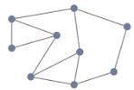{: .center}

🔎 Il y a donc **zéro ou une arête** entre une paire de sommets.

📌 Autrement dit, dans les graphes étudiés ici, deux sommets sont soit reliés, soit non reliés, mais on ne considère pas plusieurs arêtes différentes entre les mêmes sommets.


📐 Le nombre de sommets d’un graphe s’appelle **l’ordre du graphe**.

➡️ Le graphe précédent est d’ordre : **????????????????**


### <H3 STYLE="COLOR:GREEN;"> <a name="_toc161063572"></a>**🟢 1.2. À quoi sert un graphe ?**</H3>

🧠 Un graphe sert à représenter **des relations** entre des éléments.

📱 **Exemple 1 : un réseau social**

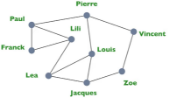{: .center}

🚗 **Exemple 2 : un réseau de transport**

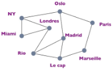{: .center}

🖧 **Exemple 3 : un réseau informatique**

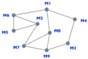{: .center}

📊 Plus généralement, les graphes permettent de représenter :

* des **relations entre des données**,
* des **objets interconnectés**,
* ou encore de réaliser du **routage dans les réseaux**.

---

???+ question "🧠 **Activité n° 1 — Graphe social**"
    👉 Construire un **graphe de réseau social** à partir des informations suivantes :

    - A est ami avec B et E  
    - B est ami avec A et C  
    - C est ami avec B, F et D  
    - D est ami avec C, F et E  
    - E est ami avec A, D et F  
    - F est ami avec C, D et E  

    📌 **Consigne** :

    - Représenter chaque personne par un **sommet**

    - Représenter chaque relation d’amitié par une **arête**

    - Le graphe est **non orienté** (l’amitié est réciproque)

    ??? success "✅ Solution possible (schéma + analyse)"
        **Sommets du graphe :**  
        A, B, C, D, E, F  

        **Arêtes du graphe :**
        - A — B  
        - A — E  
        - B — C  
        - C — F  
        - C — D  
        - D — F  
        - D — E  
        - E — F  

        🔎 **Remarque :**

        - Chaque relation apparaît une seule fois

        - Le graphe est **connexe** (on peut atteindre tous les sommets)


📘 Un graphe est dit **connexe** lorsqu’il est possible de relier n’importe quel sommet à n’importe quel autre en suivant des arêtes.


### <H3 STYLE="COLOR:GREEN;"> <a name="_toc161063573"></a>**🟢 1.3. Vocabulaire**</H3>

📘 **Notions essentielles**

* Deux sommets A et B sont dits **voisins** (ou **adjacents**) s’ils sont reliés par une arête.

* Le **degré d’un sommet** correspond au **nombre d’arêtes issues de ce sommet**.

* Une **chaîne** est une **suite d’arêtes consécutives dans un graphe**, comme un chemin que l’on parcourt. Les chaînes servent à décrire un **parcours possible** dans un graphe, par exemple pour aller d’un sommet à un autre.

* Une chaîne est désignée par **la suite des sommets** qu’elle traverse.


* Un **cycle** est une chaîne **qui commence et se termine au même sommet**.


???+ question "🧠 **Activité n° 2 — Vocabulaire des graphes**"
    👉 On considère le graphe suivant :

    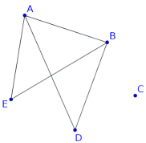{: .center}


    📌 **Questions** :

    - Donner **l’ordre** de ce graphe  

    - Donner le **degré de chaque sommet**  

    - Donner **deux sommets adjacents**  

    - Donner **deux sommets non adjacents**

    ??? success "✅ Solution"
        🔹 **Ordre du graphe**  
        L’ordre du graphe correspond au **nombre total de sommets**.  
        → Il y a **X sommets**, donc l’ordre du graphe est **X**.

        🔹 **Degré de chaque sommet**  
        Le degré d’un sommet correspond au **nombre d’arêtes qui lui sont incidentes**.

        - degré(A) = …  
        - degré(B) = …  
        - degré(C) = …  
        - degré(D) = …  
        *(à compléter en observant le graphe)*

        🔹 **Deux sommets adjacents**  
        Deux sommets sont adjacents s’ils sont reliés par une arête.  
        → Exemple : **A et B**

        🔹 **Deux sommets non adjacents**  
        Deux sommets non adjacents ne sont reliés par **aucune arête**.  
        → Exemple : **A et D**


### <H3 STYLE="COLOR:GREEN;"> <a name="_toc161063574"></a>**🟢 1.4. Les différents types de graphes**</H3>


##### 🔹 Premier exemple :

Soient les lieux suivants : **A, B, C, D, E, F et G**.

{: .center}

🛣️ Les routes existantes sont :

* A ↔ C
* A ↔ B
* A ↔ D
* B ↔ F
* B ↔ E
* B ↔ G
* D ↔ G
* E ↔ F

⚠️ **Problème**

Avec cette représentation, il est **impossible de prendre en compte des routes à sens unique**.
Par exemple : on peut aller de **A vers D**, mais pas forcément de **D vers A**.


##### 🔹 Deuxième exemple : graphes orientés

De nouvelles contraintes apparaissent :

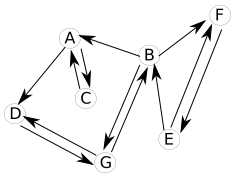{: .center}

* A ↔ C (double sens)
* B → A (sens unique)
* A → D (sens unique)
* B → F (sens unique)
* E → B (sens unique)
* B ↔ G (double sens)
* D ↔ G (double sens)
* E ↔ F (double sens)

➡️ Dans un **graphe orienté**, chaque arête possède **un sens**.
On parle alors **d’arc**, représenté par une flèche.

📌 Dans un graphe orienté, il est possible d’aller de A vers B
sans pouvoir revenir de B vers A.


{: .center}


##### 🔹 Troisième exemple : graphes pondérés

📏 Il est parfois utile **d’associer une valeur aux arêtes ou aux arcs**.
On parle alors de **graphe pondéré**.

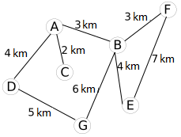{: .center}

🗺️ Dans un graphe cartographique, on peut par exemple associer :

* la **distance (en km)** entre deux lieux
* ou la **durée du trajet**

{: .center}

🧭 En fonction du choix fait par le conducteur
*(trajet le plus court en **distance** ou trajet le plus court en **temps**).*


### <H3 STYLE="COLOR:GREEN;"> <a name="_toc161063575"></a>**1.5. 🧩 Applications courantes des graphes**</H3>

Les graphes sont utilisés dans de nombreuses applications courantes, notamment :

* 🌐 **Réseaux sociaux** : les sommets représentent les utilisateurs et les arêtes les relations (amis, abonnements, etc.).
* 🗺️ **Mappage de routes** : les systèmes de navigation utilisent des graphes pour calculer des itinéraires optimaux selon la distance ou le temps.
* 🏭 **Optimisation de la production** : planification des tâches en tenant compte des dépendances.
* 📊 **Science des données** : exploration et visualisation de relations complexes entre données.
* 📡 **Analyse de réseau** : étude de réseaux de diffusion, économiques ou biologiques.
* 🎮 **Jeux** : implémentation d’algorithmes de décision (ex. minimax).
* ⚡ **Réseaux électriques** : modélisation des lignes et nœuds électriques.
* 🤖 **Intelligence artificielle** : recherche de chemin (algorithme A* par exemple).


## <H2 STYLE="COLOR:BLUE;"> <a name="_toc161063576"></a>**2. Modélisations d’un graphe**</H2>

Il existe **deux méthodes principales** pour implémenter un graphe :

* 🧮 **la matrice d’adjacence**
* 📋 **la liste d’adjacence**


### <H3 STYLE="COLOR:GREEN;"> <a name="_toc161063577"></a>**2.1. 🧮 Représentation par matrice d’adjacence**</H3>

Principe :

* On **classe les sommets** (numéros ou lettres).
* On utilise un **tableau à deux dimensions**.
* On place :

  * `1` si deux sommets sont voisins,
  * `0` sinon.

Ce tableau est appelé **matrice d’adjacence**.


#### <H4 STYLE="COLOR:MAGENTA;"> <a name="_toc161063578"></a>**2.1.1. Graphe non orienté**</H4>

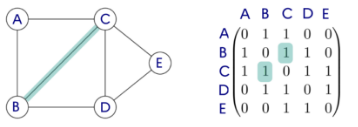{: .center}

➡️ Si B est voisin de C, alors **C est voisin de B**
➡️ La matrice est **symétrique** par rapport à la diagonale.

**Explication :**

Dans un graphe non orienté, une relation fonctionne dans les deux sens.  

Si le sommet B est relié au sommet C, alors C est aussi relié à B.

Cela se traduit dans la matrice par :
- un `1` en ligne B, colonne C
- **et** un `1` en ligne C, colonne B

C’est cette double présence qui rend la matrice **symétrique**.


#### <H4 STYLE="COLOR:MAGENTA;"> <a name="_toc161063579"></a>**2.1.2. Graphe orienté**</H4>

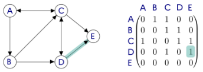{: .center}

➡️ La présence d’un `1` en ligne *i*, colonne *j* signifie un **arc i → j**.

📌 **Attention** :  
Dans un graphe orienté, les relations ne sont **pas forcément réciproques**.

Un `1` en ligne *i*, colonne *j* signifie :
➡️ il existe un **arc allant de i vers j**  
➡️ mais cela **n’implique pas** qu’il existe un arc de j vers i

La matrice d’un graphe orienté n’est donc **pas forcément symétrique**.


#### <H4 STYLE="COLOR:MAGENTA;"> <a name="_toc161063580"></a>**2.1.3. Graphe pondéré**</H4>

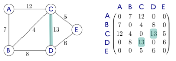{: .center}

➡️ Les valeurs dans la matrice représentent un **poids** (distance, durée, coût…).

📌 Le **poids** peut représenter selon le contexte :

- une distance (en km),

- un temps (en minutes),

- un coût (en euros),

- une consommation d’énergie, etc.

Un graphe pondéré permet donc de modéliser des situations réelles où toutes les relations n’ont pas la même importance.


???+ question "🧠 **Activité n° 3 — Réseau social et matrice d’adjacence**"
    👉 On considère les relations suivantes entre amis.
    
    - André est ami avec Béa, Charles, Estelle et Fabrice,
    
    - Béa est amie avec André, Charles, Denise et Héloïse,

    -Charles est ami avec André, Béa, Denise, Estelle, Fabrice et Gilbert, 
    
    -Denise est amie avec Béa, Charles et Estelle,
    
    -Estelle est amie avec André, Charles et Denise,
    
    -Fabrice est ami avec André, Charles et Gilbert,
    
    -Gilbert est ami avec Charles et Fabrice,
    
    -Héloïse est amie avec Béa.

    📌 **Travail demandé** :
    1. Représenter le graphe sur une feuille (initiales des prénoms).
    2. Donner la **matrice d’adjacence** correspondante.

    ??? success "✅ Solution (méthode attendue)"
        ✔️ Chaque personne est représentée par un sommet  
        ✔️ Une amitié correspond à une arête  
        ✔️ La matrice contient `1` si deux personnes sont amies, `0` sinon

        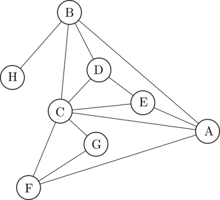
        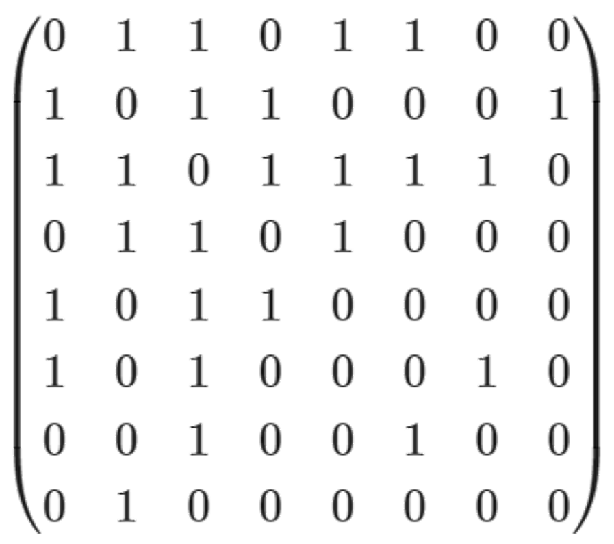


???+ question "🧠 **Activité n° 4 — Graphes à partir de matrices**"
    👉 Construire les graphes correspondant aux matrices suivantes (sur une feuille).

    1. 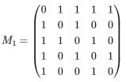{: .center}

    2. 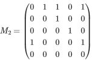{: .center}

    3. 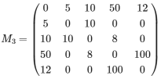{: .center}

    📌 **Méthode** :
    - Un `1` indique une arête
    - Une valeur non nulle indique un poids

    ??? success "✅ Solution (principe)"
        ✔️ Identifier les sommets
        ✔️ Tracer une arête pour chaque valeur non nulle
        ✔️ Ajouter le poids si le graphe est pondéré

        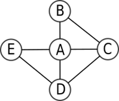
        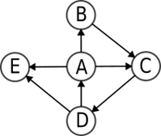
        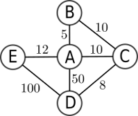


#### <H4 STYLE="COLOR:MAGENTA;"> <a name="_toc161063581"></a>**2.1.4. ❤️ Implémentation Python des matrices d’adjacence ❤️**</H4>

Une matrice est représentée en Python par une **liste de listes**.
**Exemple :** La matrice

{: .center}

associée au graphe suivant

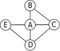{: .center}

sera représentée par la variable G suivante :

```python
G = [[0, 1, 1, 1, 1],
     [1, 0, 1, 0, 0],
     [1, 1, 0, 1, 0],
     [1, 0, 1, 0, 1],
     [1, 0, 0, 1, 0]]
```

🔍 **Complexité** :


- **Mémoire : O(n²)**  
  La matrice contient n lignes et n colonnes, même si peu de sommets sont reliés.

- **Tester si deux sommets sont adjacents : O(1)**  
  Il suffit de lire une seule case de la matrice.

- **Connaître les voisins d’un sommet : O(n)**  
  Il faut parcourir toute la ligne correspondant au sommet.


### <H3 STYLE="COLOR:GREEN;"> <a name="_toc161063582"></a>**2.2. ❤️ Représentation par listes d’adjacence**❤️</H3>

Principe :

* À chaque sommet, on associe la **liste de ses voisins**.
* On utilise un **dictionnaire** Python.
*-* Dans le cas d'un **graphe orienté** on associe à chaque sommet **la liste des *successeurs*** (ou bien des *prédécesseurs*, au choix).

Par exemple, le graphe

{: .center}

sera représenté par le dictionnaire :
```python
G = {'A': ['B', 'C', 'D', 'E'],
     'B': ['A', 'C'],
     'C': ['A', 'B', 'D'],
     'D': ['A', 'C', 'E'],
     'E': ['A', 'D']}
```

📌 Cette représentation est particulièrement adaptée lorsque :
- le nombre de sommets est élevé,
- mais que chaque sommet a peu de voisins.

On évite ainsi de stocker de nombreuses valeurs inutiles (les `0`), contrairement à la matrice d’adjacence.


🔍 **Complexité** :


- **Mémoire : O(n + m)**  
  On stocke uniquement les sommets et les arêtes existantes.

- **Connaître les voisins d’un sommet : O(1)**  
  Ils sont directement accessibles via le dictionnaire.

- **Tester si deux sommets sont adjacents : O(n)**  
  Il faut parcourir la liste des voisins.


???+ question "🧠 **Activité n° 5 — Graphes à partir de listes d’adjacence**"
    👉 Construire les graphes correspondant aux dictionnaires fournis (sur une feuille).

    1.

    ```python
    G1 = {
    'A': ['B', 'C'],
    'B': ['A', 'C', 'E', 'F'],
    'C': ['A', 'B', 'D'],
    'D': ['C', 'E'],
    'E': ['B', 'D', 'F'],
    'F': ['B', 'E']
        }
    ```

    2.

    ```python
    G2 = {
    'A': ['B'],
    'B': ['C', 'E'],
    'C': ['B', 'D'],
    'D': [],
    'E': ['A']
        }
    ```

    📌 **Méthode** :

    - Chaque clé est un sommet

    - Chaque élément de la liste est un voisin

    ??? success "✅ Solution (méthode attendue)"

        ✔️ Tracer les sommets

        ✔️ Relier chaque sommet à ses voisins

        ✔️ Vérifier la cohérence des arêtes

        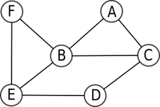

        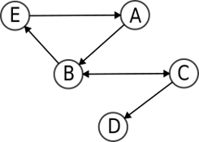


### <H3 STYLE="COLOR:GREEN;"> <a name="_toc161063583"></a>**2.3. ❤️ Passage d’une représentation à l’autre ❤️**</H3>

Dans la pratique, un même graphe peut être représenté **de plusieurs façons** :

* par une **matrice d’adjacence**,
* par un **dictionnaire de voisins**.

Il est donc essentiel de savoir **passer d’une représentation à une autre**, notamment en Python.


👉 **CAPYTALE** : le code vous sera fourni par votre enseignant.


???+ question "🧠 **Activité n° 6 — De la matrice au dictionnaire**"
    👉 Écrire une fonction
    `python
        matrice2dico(sommets, matrice)
        `
    qui :
    - prend en paramètre :

    - une **liste de sommets**

    - une **matrice d’adjacence**

    - renvoie le **dictionnaire des voisins** correspondant.

    
    📌 **Rappel** :

    - si la valeur de la matrice est **non nulle**, alors il existe une arête (ou un arc)

    - dans le cas pondéré, la valeur correspond au **poids**

    {: .center}  
    {: .center}  
    {: .center}

    Tester la fonction avec les matrices **M1, M2 et M3**.

    ```python
    
    M1 = [
        [0, 1, 1, 1, 1],
        [1, 0, 1, 0, 0],
        [1, 1, 0, 1, 0],
        [1, 0, 1, 0, 1],
        [1, 0, 0, 1, 0]
    ]

   
    M2 = [
        [0, 1, 1, 0, 1],
        [0, 0, 1, 0, 0],
        [0, 0, 0, 1, 0],
        [1, 0, 0, 0, 1],
        [0, 0, 0, 0, 0]
    ]

    
    M3 = [
        [0, 5, 10, 50, 12],
        [5, 0, 10, 0, 0],
        [10, 10, 0, 8, 0],
        [50, 0, 8, 0, 100],
        [12, 0, 0, 100, 0]
    ]

    sommets = ['A', 'B', 'C', 'D', 'E']
    

    ??? success "✅ Solution — matrice → dictionnaire"
        ```python
        def matrice2dico(sommets, matrice):
            dico = {}
            n = len(sommets)

            for i in range(n):
                voisins = []
                for j in range(n):
                    if matrice[i][j] != 0:
                        voisins.append(sommets[j])
                dico[sommets[i]] = voisins

            return dico
        ```

        🔎 **Principe** :

        - on parcourt chaque ligne de la matrice

        - chaque valeur non nulle indique un voisin

        - l’indice de colonne permet d’identifier le sommet correspondant
    


???+ question "🧠 **Activité n° 7 — Du dictionnaire à la matrice**"

    👉 Écrire une fonction
    `python
        dico2matrice(graphe_dico)
        `
    qui :
    - prend en paramètre un **dictionnaire de voisins**
    - renvoie :
    - la **liste des sommets**
    - la **matrice d’adjacence** correspondante

    ```python
    G1 = {
        'A': ['B', 'C', 'D', 'E'],
        'B': ['A', 'C'],
        'C': ['A', 'B', 'D'],
        'D': ['A', 'C', 'E'],
        'E': ['A', 'D']
    }

    G2 = {
        'A': ['B', 'C'],
        'B': ['A', 'C', 'E', 'F'],
        'C': ['A', 'B', 'D'],
        'D': ['C', 'E'],
        'E': ['B', 'D', 'F'],
        'F': ['B', 'E']
    }

    G3 = {
        'A': ['B'],
        'B': ['C', 'E'],
        'C': ['B', 'D'],
        'D': [],
        'E': ['A']
    }
    ```

    Tester la fonction avec **G1, G2 et G3**.

    ??? success "✅ Solution — dictionnaire → matrice"
        ```python
        def dico2matrice(graphe_dico):
            sommets = list(graphe_dico.keys())
            n = len(sommets)
            indice = {sommets[i]: i for i in range(n)}

            matrice = [[0]*n for _ in range(n)]

            for sommet in graphe_dico:
                i = indice[sommet]
                for voisin in graphe_dico[sommet]:
                    j = indice[voisin]
                    matrice[i][j] = 1

            return sommets, matrice
        ```

        🔎 **Principe** :

        - on associe chaque sommet à un indice

        - on initialise une matrice remplie de 0

        - chaque voisin entraîne un `1` dans la matrice


## <H2 STYLE="COLOR:BLUE;"> <a name="_toc161063584"></a>**3. Visualiser un graphe**</H2>

Visualiser un graphe permet de :

* mieux comprendre sa structure,
* vérifier une implémentation,
* interpréter plus facilement les parcours.


### <H3 STYLE="COLOR:GREEN;"> <a name="_toc161063585"></a>**3.1. Avec le module networkx**</H3>

Nous allons utiliser les bibliothèques :

* **networkx** : pour manipuler des graphes,
* **matplotlib** : pour les afficher.

📌 Pensez à vérifier que ces bibliothèques sont installées.

---

???+ question "🧠 **Activité n° 8 — Visualisation avec NetworkX**"

    👉 Compléter et exécuter le programme suivant afin de visualiser un graphe
    à partir d’un dictionnaire de voisins.


    ```python
    import matplotlib.pyplot as plt
    import networkx as nx

    def cree_graphe_non_oriente_nx(dictionnaire: dict) -> nx.Graph:
        """
        Transforme une représentation en dictionnaire
        en un graphe NetworkX non orienté.
        """
        Gnx = nx.Graph()

        # Création des sommets
        for sommet in dictionnaire.keys():
            Gnx.add_node(sommet)

        # Création des arêtes
        for sommet in dictionnaire.keys():
            for voisin in dictionnaire[sommet]:
                Gnx.add_edge(sommet, voisin)

        return Gnx

    plt.cla()
    dico = {0: [1, 2], 1: [0, 2, 3], 2: [0, 1, 3], 3: [1, 2]}
    G = cree_graphe_non_oriente_nx(dico)

    nx.draw(G, with_labels=True)
    plt.show()
    ```

    ??? success "✅ Explication"
        ✔️ Chaque clé du dictionnaire correspond à un **sommet**  
        ✔️ Chaque voisin entraîne la création d’une **arête**  
        ✔️ NetworkX se charge automatiquement de la disposition graphique  


???+ question "🧠 **Activité n° 9 — Visualisation avec NetworkX**"
    👉 Représenter graphiquement les graphes **G1, G2 et G3** (définis en partie 2.2)

    à l’aide du module **networkx**.

    
    📌 **Consigne** :
    - réutiliser la fonction `cree_graphe_non_oriente_nx`
    - afficher successivement chaque graphe

    ??? success "✅ Solution (exemple)"
        ```python
        plt.cla()# Pour effacer les figures précédentes
        G = cree_graphe_non_oriente_nx(G1)
        # nx.draw_circular(G, with_labels=True)
        nx.draw(G,with_labels = True) # Pour une representation classique
        plt.show()

        plt.cla()# Pour effacer les figures précédentes
        G = cree_graphe_non_oriente_nx(G2)
        # nx.draw_circular(G, with_labels=True)
        nx.draw(G,with_labels = True) # Pour une representation classique
        plt.show()

        plt.cla()# Pour effacer les figures précédentes
        G = cree_graphe_non_oriente_nx(G3)
        # nx.draw_circular(G, with_labels=True)
        nx.draw(G,with_labels = True) # Pour une representation classique
        plt.show()
        ```

🔎 **Remarque** :
        
NetworkX gère automatiquement la disposition des sommets, ce qui permet une visualisation rapide et lisible.


### <H3 STYLE="COLOR:GREEN;"> <a name="_toc161063586"></a>**3.2. Avec le module Graphviz**</H3>

Le module **graphviz** permet de produire des graphes :

* plus **structurés visuellement**,

* exportables en **SVG ou PDF**,

* particulièrement adaptés aux **graphes orientés**.


???+ question "🧠 **Activité n° 10 — Graphe orienté avec Graphviz**"

    👉 Représenter un **graphe orienté simple** avec Graphviz.

    
    ```python
    import graphviz

    # Création du graphe orienté avec sortie au format SVG
    graphe_oriente = graphviz.Digraph(format='svg')

    # Ajout des nœuds
    graphe_oriente.node("A")
    graphe_oriente.node("B")
    graphe_oriente.node("C")

    # Ajout des arcs
    graphe_oriente.edge("A", "B")
    graphe_oriente.edge("A", "C")
   
    # Affichage du graphe
    # graphviz.Source(graphe_oriente) # pour le télécharger
    # #graphe_non_oriente.view()
    from graphviz import Source
    Source(graphe_oriente.source)
    ```

    ??? success "✅ Explication"

        ✔️ `Digraph` permet de créer un graphe **orienté**  

        ✔️ `node()` ajoute un sommet  

        ✔️ `edge(A, B)` crée un **arc A → B**  
        
        ✔️ Le rendu est exportable au format SVG  


???+ question "🧠 **Activité n° 11 — Graphe orienté à partir de G3**"
    
    👉 Adapter le code précédent pour représenter le graphe **G3**
    (défini sous forme de dictionnaire).

    
    ??? success "✅ Solution (adaptation)"
        ```python
        import graphviz
        from graphviz import Source

        G3 = {
            'A': ['B'],
            'B': ['C', 'E'],
            'C': ['B', 'D'],
            'D': [],
            'E': ['A']
        }

        graphe_oriente = graphviz.Digraph(format='svg')

        for sommet in G3:
            graphe_oriente.node(sommet)

        for sommet in G3:
            for voisin in G3[sommet]:
                graphe_oriente.edge(sommet, voisin)

        #Affichage du graphe
        # graphviz.Source(graphe_oriente) # pour le télécharger
        # graphe_oriente.view()
        from graphviz import Source
        Source(graphe_oriente.source)
        ```

        🔎 **Principe** :

        chaque clé représente un sommet,
        
        chaque voisin entraîne la création d’un **arc orienté**.


???+ question "🧠 **Activité n° 12 — Graphe non orienté avec Graphviz**"

    👉 Représenter un **graphe non orienté simple** avec Graphviz.

    
    ```python
    import graphviz
    from graphviz import Source

    graphe_non_oriente = graphviz.Graph()

    #Ajout des noeuds avec la méthode node
    graphe_non_oriente.node("A")
    graphe_non_oriente.node("B")
    graphe_non_oriente.node("C")

    #Ajout des arcs avec la méthode edge
    graphe_non_oriente.edge("A", "B")
    graphe_non_oriente.edge("A", "C")

    #Affichage du graphe
    # graphviz.Source(graphe_non_oriente) # pour le télécharger
    # graphe_non_oriente.view()
    from graphviz import Source
    Source(graphe_non_oriente.source)
    ```

    ??? success "✅ Explication"
        ✔️ `Graph()` crée un graphe **non orienté**  
        ✔️ Les arêtes sont **sans flèches**  
        ✔️ Le rendu est plus structuré qu’avec NetworkX  


???+ question "🧠 **Activité n° 13 — Graphe non orienté à partir de G1**"
    👉 Adapter le code précédent pour représenter le graphe **G1**.


    ??? success "✅ Solution"
        ```python
        import graphviz
        from graphviz import Source

        graphe_non_oriente = graphviz.Graph()

        for sommet in G1:
            graphe_non_oriente.node(sommet)

        for sommet in G1:
            for voisin in G1[sommet]:
                graphe_non_oriente.edge(sommet, voisin)

        #Affichage du graphe
        # graphviz.Source(graphe_non_oriente) # pour le télécharger
        # graphe_non_oriente.view()
        from graphviz import Source
        Source(graphe_non_oriente.source)
        ```


## <H2 STYLE="COLOR:BLUE;"> <a name="_toc161063587"></a>**4. ❤️ Création d’une classe Graphe ❤️**</H2>

Nous allons maintenant **implémenter un graphe en Programmation Orientée Objet**, afin de regrouper les données et les méthodes associées dans une même structure.


👉 **CAPYTALE** : le squelette du code est fourni par l’enseignant.


Jusqu’à présent, les graphes ont été représentés à l’aide :

* de **matrices d’adjacence**,

* de **dictionnaires de voisins**.

Nous allons maintenant regrouper **les données** et **les opérations associées** à un graphe dans une **classe Python**, en utilisant la **Programmation Orientée Objet (POO)**.

📌 **Objectif** :
Créer un objet `Graphe` capable de :

* mémoriser les sommets et les arêtes,

* fournir des méthodes pour manipuler le graphe,

* garantir une utilisation cohérente des opérations.

### <H3 STYLE="COLOR:GREEN;"> <a name="_toc161063588"></a>**4.1. Interface**</H3>  

##### 🔹 Interface attendue

On appelle **interface** l’ensemble des **méthodes accessibles**
permettant d’utiliser un objet sans connaître son implémentation interne.

Un objet de type `Graphe` devra permettre les opérations suivantes :

* **constructeur**
  `Graphe(liste_sommets)`
  → crée un graphe dont les sommets sont donnés, sans arêtes au départ

* **ajouter_arete(g, s1, s2) → Graphe**
  → ajoute une arête entre les sommets `s1` et `s2`

* **voisins(g, s) → liste de Sommets**
  → renvoie la liste des sommets adjacents à `s`
  *(dans un graphe orienté, cette méthode serait remplacée par `successeurs` et/ou `predecesseurs`)*

* **sont_voisins(g, s1, s2) → bool**
  → indique si `s1` et `s2` sont directement reliés

* **get_dictionnaire(g) → dict**
  → renvoie la représentation du graphe sous forme de dictionnaire d’adjacence


##### 🔹 Attributs internes de la classe

L’objet `Graphe` possèdera les attributs suivants :

* `liste_sommets` :
  liste contenant l’ensemble des sommets du graphe

* `adjacents` :
  dictionnaire associant à chaque sommet la liste de ses voisins
  *(initialement vide pour chaque sommet)*

📌 **Remarque importante** :

L’utilisateur de la classe n’a **pas besoin de modifier directement ces attributs** ; il interagit uniquement via les **méthodes de l’interface**.


### <H3 STYLE="COLOR:GREEN;"> <a name="_toc161063589"></a>**4.2. Implémentation en POO**</H3>

Cette classe implémente un **graphe non orienté simple**.

???+ question "🧠 **Activité n° 14 — Implémentation de la classe Graphe**"
    👉 Compléter les méthodes de la classe suivante.


    ```python
    class Graphe:
        def __init__(self, liste_sommets):
            self.liste_sommets = liste_sommets
            self.adjacents = {sommet: [] for sommet in liste_sommets}

        def ajouter_arete(self, s1, s2):
            pass

        def voisins(self, s):
            pass

        def sont_voisins(self, s1, s2):
            pass

        def get_dictionnaire(self):
            pass

    #################################### Pour réaliser l'affichage #########################
    import matplotlib.pyplot as plt
    import networkx as nx

    def cree_graphe_non_oriente_nx(dictionnaire: dict) -> nx.Graph:
        Gnx = nx.Graph()
        for sommets in dictionnaire.keys():
            Gnx.add_node(sommets) # Creation des sommets
        for sommet in dictionnaire.keys():
            for sommets_adjacents in dictionnaire[sommet]:
                Gnx.add_edge(sommet, sommets_adjacents) # Creation des arcs
        return Gnx


    if __name__ == '__main__':
        g = Graphe(['A', 'B', 'C', 'D', 'E'])
        g.ajouter_arete('A', 'B')
        g.ajouter_arete('A', 'C')
        g.ajouter_arete('A', 'D')
        g.ajouter_arete('A', 'E')
        g.ajouter_arete('B', 'C')
        g.ajouter_arete('C', 'D')
        g.ajouter_arete('D', 'E')
        assert g.sont_voisins('E', 'A') == True
        assert g.sont_voisins('E', 'B') == False
        assert g.voisins('C') == ['A', 'B', 'D']
        dict_2 = g.get_dictionnaire()
        print(dict_2)
        plt.cla()
        G2 = cree_graphe_non_oriente_nx(dict_2)
        nx.draw_circular(G2, with_labels=True)
        plt.show()

    ```

    ??? success "✅ Solution complète"
        ```python
        class Graphe:
            def __init__(self, liste_sommets):
                self.liste_sommets = liste_sommets
                self.adjacents = {sommet: [] for sommet in liste_sommets}

            def ajouter_arete(self, s1, s2):
                if s2 not in self.adjacents[s1]:
                    self.adjacents[s1].append(s2)
                if s1 not in self.adjacents[s2]:
                    self.adjacents[s2].append(s1)

            def voisins(self, s):
                return self.adjacents[s]

            def sont_voisins(self, s1, s2):
                return s2 in self.adjacents[s1]

            def get_dictionnaire(self):
                return self.adjacents
        ```

        🔎 **Remarques importantes** :

        - le graphe est **non orienté**

        - chaque arête est ajoutée dans les deux sens

        - aucune duplication d’arêtes
    


## <H2 STYLE="COLOR:BLUE;"> <a name="_toc161063590"></a>**5. Les parcours**</H2>

Un **parcours de graphe** est un algorithme qui consiste à **explorer les sommets d’un graphe de proche en proche** à partir d’un sommet initial.

⚠️ **Attention**

Parcourir simplement une matrice ou un dictionnaire (par exemple pour copier un graphe) **n’est pas un parcours de graphe**.


##### 🔁 Principe général d’un parcours

Tous les parcours reposent sur le même schéma général :

* On **visite un sommet initial** ( s_1 )

* On crée une structure ( S ) contenant ses voisins

* Tant que ( S ) n’est pas vide :

  * on choisit un sommet ( s ) dans ( S )

  * on visite ( s )

  * on ajoute à ( S ) les voisins de ( s ) **non encore visités**

📌 **Gestion des sommets visités**

Contrairement à un arbre, un sommet d’un graphe peut être rencontré **plusieurs fois** par des chemins différents.

👉 Il est donc **indispensable de mémoriser** :

* les sommets **déjà visités**

* les sommets **déjà découverts** (ajoutés à la structure ( S ))


### <H3 STYLE="COLOR:GREEN;"> <a name="_toc161063591"></a>**5.1. ❤️ Parcours en largeur ❤️ (BFS)**</H3>

📺 *Vidéo de référence* :
[https://ladigitale.dev/digiview/#/v/66c66c81c573a](https://ladigitale.dev/digiview/#/v/66c66c81c573a)

---

##### 🧠 Principe du BFS

Si la structure ( S ) est une **file (FIFO)** :

* les sommets ajoutés **en premier** sont visités **en premier**

* on explore d’abord les sommets à distance 1, puis 2, puis 3…

👉 On parle de **parcours en largeur** (*Breadth First Search*).

📌 Le BFS est utilisé pour :

* trouver le **sommet le plus proche** vérifiant une condition

* trouver le **chemin le plus court** entre deux sommets (graphe non pondéré)

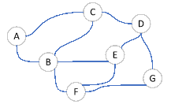{: .center}

Exemples :

* depuis A : `A – B – C – F – E – D – G`

* depuis B : `B – A – C – E – F – D – G`


???+ question "🧠 **Activité n° 15 — Parcours en largeur à la main**"
    👉 Appliquer l’algorithme du **parcours en largeur** au graphe ci-dessous.


    {: .center}

    📌 **Consignes** :

    - sommet de départ : **A**

    - noter à chaque étape :

        - les sommets visités

        - le contenu de la file

    - indiquer les changements de couleur éventuels

    ??? success "✅ Méthode attendue"

        - `file` : file FIFO contenant les sommets à visiter (dans l’ordre d’arrivée)

        - `découverts` : liste des sommets déjà visités (dans l’ordre de découverte)


        ###  **Initialisation**

        - `découverts = [A]`

        - `file = [A]`


        ### Étape 1 : Traitement de `A`

        - Voisins de `A` : B, F

        - On ajoute B et F dans `découverts` et dans `file`  

        (nouvel ordre dans `file` : en fin de file)

        - `découverts = [A, B, F]`

        - `file = [B, F]`


        ### Étape 2 : Traitement de `B`

        - Voisins de `B` : A, C, D, G

        - A déjà découvert → ignoré

        - C, D, G sont ajoutés

        - `découverts = [A, B, F, C, D, G]`

        - `file = [F, C, D, G]`


        ### Étape 3 : Traitement de `F`

        - Voisins de `F` : A, G, H

        - A et G déjà découverts → ignorés

        - H est ajouté

        - `découverts = [A, B, F, C, D, G, H]`

        - `file = [C, D, G, H]`


        ### Étape 4 : Traitement de `C`

        - Voisins de `C` : B, E

        - B déjà découvert → ignoré

        - E est ajouté

        - `découverts = [A, B, F, C, D, G, H, E]`

        - `file = [D, G, H, E]`


        ### Étape 5 : Traitement de `D`

        - Voisins de `D` : B, I

        - B déjà découvert → ignoré

        - I est ajouté

        - `découverts = [A, B, F, C, D, G, H, E, I]`

        - `file = [G, H, E, I]`


        ### Étape 6 : Traitement de `G`

        - Voisins de `G` : B, F, I

        - Tous déjà découverts → rien à faire

        - `découverts = [A, B, F, C, D, G, H, E, I]`

        - `file = [H, E, I]`


        ### Étape 7 : Traitement de `H`

        - Voisins de `H` : F

        - F déjà découvert → rien à faire

        - `découverts = [A, B, F, C, D, G, H, E, I]`

        - `file = [E, I]`


        ### Étape 8 : Traitement de `E`

        - Voisins de `E` : C, I

        - Déjà découverts → rien à faire

        - `découverts = [A, B, F, C, D, G, H, E, I]`

        - `file = [I]`


        ### Étape 9 : Traitement de `I`

        - Voisins de `I` : D, E, G

        - Déjà découverts → rien à faire

        - `découverts = [A, B, F, C, D, G, H, E, I]`

        - `file = []`


        ###  **Fin du parcours**

        - **Ordre de découverte des sommets** :  

        `A → B → F → C → D → G → H → E → I`


##### 🧩 Algorithme du BFS

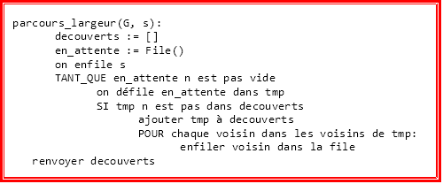{: .center}

📌 Chaque sommet est **enfilé une seule fois** grâce à la liste `decouverts`,puis **défilé exactement une fois**.

**Aide Python** :

```python
# voisins du sommet tmp
G[tmp]
```


##### 📦 Que contient la file `en_attente` ?

À tout instant, la file contient :

* des sommets à distance ( k )

* puis à distance ( k+1 )

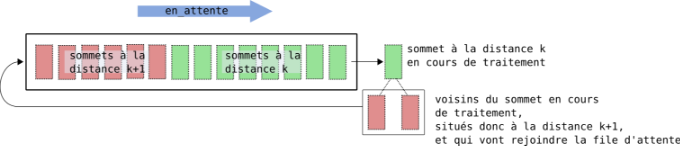{: .center}


##### 🔁 Rappels sur les files

```python
# avec une liste
file = []
file.append(x)
file.pop(0)
```

```python
# avec queue
from queue import Queue
file = Queue()
file.empty() 
file.put(x)
file.get()
```

```python
# avec deque (recommandé)
from collections import deque
file = deque()
file.append(x)
file.popleft()
if file : # => si la file n’est pas vide
```


???+ question "🧠 **Activité n° 16 — Implémentation du BFS**"
    👉 Implémenter le parcours en largeur en Python.


    ```python
    from collections import deque

    def parcours_largeur(G, s):
        decouverts = []
        en_attente = deque()
        pass

    print(parcours_largeur({"A": ("B", "D", "E"), "B": ("A", "C"), "C": ("B", "D"),
                            "D": ("A", "C", "E"), "E": ("A", "D", "F", "G"), 
                            "F": ("E", "G"), "G": ("E", "F", "H"),
                            "H": ("G")}, "A"))
    ```

    ??? success "✅ Solution — BFS itératif"
        ```python
        from collections import deque

        def parcours_largeur(G, s):
            decouverts=[]
            en_attente = deque()
            en_attente.append(s)
            while en_attente :
                tmp = en_attente.popleft()
                if tmp not in decouverts:
                    decouverts.append(tmp)
                    for v in G[tmp]:
                        en_attente.append(v)
            return decouverts

        print(parcours_largeur({"A": ("B", "D", "E"), "B": ("A", "C"), "C": ("B", "D"),
                                    "D": ("A", "C", "E"), "E": ("A", "D", "F", "G"), 
                                    "F": ("E", "G"), "G": ("E", "F", "H"),
                                    "H": ("G")}, "A"))
        ```


???+ question "🧠 **Activité n° 17 — Analyse de parcours BFS**"
    👉 On considère le graphe suivant :


    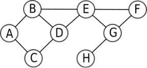{: .center}


    ```python
    graphe = {
        'A': ['B', 'C'],
        'B': ['A', 'D', 'E'],
        'C': ['A', 'D'],
        'D': ['B', 'C', 'E'],
        'E': ['B', 'D', 'F', 'G'],
        'F': ['E', 'G'],
        'G': ['E', 'F', 'H'],
        'H': ['G']
    }
    ```

    1. Donner le parcours BFS depuis **B**

    2. Deviner le parcours depuis **D**, puis **G**

    3. Vérifier avec votre fonction

    ??? success "✅ Solution (exemple)"
        
        1. et 2.

        ['B', 'A', 'D', 'E', 'C', 'F', 'G', 'H']

        ['D', 'B', 'C', 'E', 'A', 'F', 'G', 'H']

        ['G', 'E', 'F', 'H', 'B', 'D', 'A', 'C']

        3.
        
        ```python
        parcours_largeur(graphe, 'B')
        parcours_largeur(graphe, 'D')
        parcours_largeur(graphe, 'G')
        ```


### <H3 STYLE="COLOR:GREEN;"> <a name="_toc161063592"></a>**5.2. ❤️ Parcours en profondeur ❤️ (DFS)**</H3>

📺 *Vidéo de référence* :
[https://ladigitale.dev/digiview/#/v/66c672b885a2a](https://ladigitale.dev/digiview/#/v/66c672b885a2a)


##### 🧠 Principe du DFS

Si la structure ( S ) est une **pile (LIFO)** :

* on explore un chemin **le plus loin possible**

* lorsqu’un sommet n’a plus de voisin non visité, on **revient en arrière**

👉 C’est le **parcours en profondeur** (*Depth First Search*).

🧭 Ce parcours est analogue à l’exploration d’un **labyrinthe**.

{: .center}

Exemples :

* `A – B – C – D – E – F – G`

* `F – B – C – D – G – E – A`

🚫 `F – B – C – D – G – A – E` **n’est pas un DFS valide**
(car `E` a été empilé après `A` et doit être dépilé avant)


???+ question "🧠 **Activité n° 18 — Parcours en profondeur à la main**"
    👉 Appliquer l’algorithme du **parcours en profondeur** au graphe ci-dessous.

    
    {: .center}

    📌 **Consigne** :

    - choisir un sommet de départ

    - noter l’ordre de visite des sommets

    - indiquer les retours en arrière lorsqu’un sommet n’a plus de voisin non visité

    

    ??? success "✅ Méthode attendue"
        - Visiter le sommet de départ
        - Empiler un voisin non visité
        - Continuer tant que possible
        - Dépiler lorsqu’aucun voisin n’est disponible


        🔁 Déroulement du DFS (pas à pas)

        On utilise une **pile (LIFO)** et on va **le plus loin possible**.

        **Étapes :**

        1. **A**
        → voisin non visité : **B**

        2. **B**
        → voisin non visité : **C**

        3. **C**
        → voisin non visité : **E**

        4. **E**
        → voisin non visité : **I**

        5. **I**
        → voisin non visité : **D**

        6. **D**
        → aucun voisin non visité
        ↩️ retour en arrière vers **I**

        7. **I**
        → voisin non visité : **G**

        8. **G**
        → voisin non visité : **F**

        9. **F**
        → voisin non visité : **H**

        10. **H**
            → aucun voisin non visité
            ↩️ retour en arrière successif jusqu’à épuisement

        

        📋 **Ordre de visite DFS**

        ```text
        A – B – C – E – I – D – G – F – H
        ```


    


##### 🧩 Algorithme du DFS — version itérative


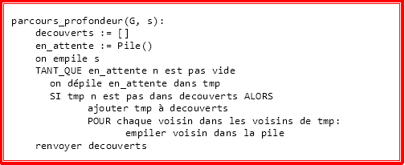{: .center}


📌 Dans un parcours en profondeur, le choix d’une **pile (LIFO)** impose
une exploration en allant le plus loin possible avant de revenir en arrière.


##### 🔁 Rappels sur les piles

```python
# avec une liste Python
pile = []
pile.append(x)
pile.pop()
```

```python
# avec deque (recommandé)
from collections import deque
pile = deque()
pile.append(x)
pile.pop()
if pile:
    pass
```


???+ question "🧠 **Activité n° 19 — DFS itératif**"
    👉 Implémenter le parcours en profondeur **en version itérative**.


    ```python
    from collections import deque

    def parcours_profondeur(G, s):
        decouverts = []
        pile = deque()
        pass
    
    print(parcours_profondeur({"A": ("B", "D", "E"), "B": ("A", "C"), "C": ("B", "D"),
                         "D": ("A", "C", "E"), "E": ("A", "D", "F", "G"),
                         "F": ("E", "G"), "G": ("E", "F", "H"),
                         "H": ("G")}, "A") )
    ```

    ??? success "✅ Solution — DFS itératif"
        ```python
        from collections import deque

        def parcours_profondeur(G, s):
            decouverts=[]
            en_attente = deque()
            en_attente.append(s)
            while en_attente :
                tmp = en_attente.pop()
                if tmp not in decouverts:
                    decouverts.append(tmp)
                    for v in G[tmp]:
                        en_attente.append(v)
            return decouverts

        print(parcours_profondeur({"A": ("B", "D", "E"), "B": ("A", "C"), "C": ("B", "D"),
                                "D": ("A", "C", "E"), "E": ("A", "D", "F", "G"),
                                "F": ("E", "G"), "G": ("E", "F", "H"),
                                "H": ("G")}, "A") )
        ```

🔎 **Remarque importante** :  

L’ordre dépend de l’ordre des voisins dans le dictionnaire.


???+ question "🧠 **Activité n° 20 — Analyse d’un DFS**"
    👉 On considère le graphe suivant :


    {: .center}

    ```python
    graphe = {
        'A': ['B', 'C'],
        'B': ['A', 'D', 'E'],
        'C': ['A', 'D'],
        'D': ['B', 'C', 'E'],
        'E': ['B', 'D', 'F', 'G'],
        'F': ['E', 'G'],
        'G': ['E', 'F', 'H'],
        'H': ['G']
    }
    ```

    1. Donner le parcours DFS depuis **B**

    2. **Deviner le **parcours en profondeur (DFS) depuis **D**, puis depuis **G****


    3. Vérifier avec votre algorithme

    ??? success "✅ Vérification"
        1. et 2.

        ['B', 'E', 'G', 'H', 'F', 'D', 'C', 'A']

        ['D', 'E', 'G', 'H', 'F', 'B', 'A', 'C']

        ['G', 'H', 'F', 'E', 'D', 'C', 'A', 'B']

        3.
        ```python
        parcours_profondeur(graphe, 'B')
        parcours_profondeur(graphe, 'D')
        parcours_profondeur(graphe, 'G')
        ```


##### 🧠 DFS — version récursive

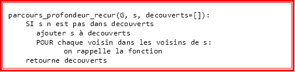{: .center}

📌 **Remarque importante (Python)**
Une liste utilisée comme paramètre par défaut est **partagée entre les appels**.

👉 Il faut donc **initialiser explicitement la liste des sommets découverts**.


???+ question "🧠 **Activité n° 21 — DFS récursif**"
    👉 Implémenter le parcours en profondeur **en version récursive**.


    ```python
    def parcours_profondeur_r(G, s,decouverts = [] ):
        pass


    print(parcours_profondeur_r({"A": ("B", "D", "E"), "B": ("A", "C"), "C": ("B", "D"),
                     "D": ("A", "C", "E"), "E": ("A", "D", "F", "G"),
                     "F": ("E", "G"), "G": ("E", "F", "H"),
                     "H": ("G")}, "A") )
    ```

    ??? success "✅ Solution — DFS récursif"
        ```python
        def parcours_profondeur_r (G, s,decouverts = [] ):
            if s not in decouverts:
                decouverts.append(s)
                for v in G[s]:
                    parcours_profondeur_r(G, v, decouverts)
            return decouverts

        print(parcours_profondeur_r({"A": ("B", "D", "E"), "B": ("A", "C"), "C": ("B", "D"),
                            "D": ("A", "C", "E"), "E": ("A", "D", "F", "G"),
                            "F": ("E", "G"), "G": ("E", "F", "H"),
                            "H": ("G")}, "A") )
        ```

🔎 **Remarque** :

Le parcours obtenu peut différer de la version itérative selon l’ordre des voisins.


### <H3 STYLE="COLOR:GREEN;"> <a name="_toc161063593"></a>**5.3. ❤️ Applications des parcours ❤️**</H3>


#### <H4 STYLE="COLOR:MAGENTA;"><a name="_toc161063594_cycle"></a>**5.3.1. ❤️ Détection de cycles dans un graphe ❤️**</H4>


##### 🧠 Problème posé

Dans de nombreuses situations, il est important de savoir si un graphe contient un **cycle** :

* dépendances circulaires entre tâches,
* boucle dans un réseau,
* erreur de conception dans un graphe de relations.

📌 **Rappel** :
Un **cycle** est un chemin qui **commence et se termine au même sommet**, en parcourant **au moins une arête**.


##### 🧩 Pourquoi détecter les cycles ?

👉 La présence d’un cycle peut :

* empêcher un ordonnancement (ex. tâches),
* rendre certains algorithmes invalides,
* indiquer une anomalie logique.

📌 Exemple :

* un graphe de prérequis scolaires **ne doit pas contenir de cycle**
* un graphe routier **peut** contenir des cycles


##### 🧠 Principe général (avec DFS)

La détection de cycles repose sur un **parcours en profondeur (DFS)**.

📌 Idée clé :

> Lors d’un DFS, si l’on rencontre un sommet **déjà en cours d’exploration** alors un **cycle existe**.


##### 🔁 États des sommets

Chaque sommet peut être dans **trois états** :

| État           | Signification                           |
| -------------- | --------------------------------------- |
| **non visité** | le sommet n’a jamais été rencontré      |
| **en cours**   | le sommet est dans la pile de récursion |
| **terminé**    | tous ses voisins ont été explorés       |

👉 **Un cycle est détecté si :**

* on rencontre un sommet **en cours d’exploration**


##### 🧠 Cas étudié en Terminale 

📌 On se place dans le cas :

* d’un **graphe orienté**
* représenté par un **dictionnaire de successeurs**


???+ question "🧠 **Activité n° 22 — Détection de cycle (principe)**"
    👉 Observer le graphe suivant et indiquer s’il contient un cycle.


    - A → B
    - B → C
    - C → A

    📌 Question :
    - pourquoi ce graphe pose-t-il problème pour un ordonnancement ?

    ??? success "✅ Réponse attendue"
        - A dépend de B
        - B dépend de C
        - C dépend de A
        → dépendance circulaire ⇒ **cycle**


##### 🧩 Algorithme de détection de cycle (DFS récursif)


???+ question "🧠 **Activité n° 23 — Tester la détection de cycle**"
    👉 Tester la fonction sur les graphes suivants.

    ```python
    def contient_cycle(graphe):
        etat = {sommet: "non_visité" for sommet in graphe}

        def dfs(s):
            etat[s] = "en_cours"

            for voisin in graphe[s]:
                if etat[voisin] == "en_cours":
                    return True
                if etat[voisin] == "non_visité":
                    if dfs(voisin):
                        return True

            etat[s] = "terminé"
            return False

        for sommet in graphe:
            if etat[sommet] == "non_visité":
                if dfs(sommet):
                    return True

        return False

    G1 = {
        'A': ['B'],
        'B': ['C'],
        'C': ['A']
    }

    G2 = {
        'A': ['B'],
        'B': ['C'],
        'C': []
    }

    print(contient_cycle(G1))
    print(contient_cycle(G2))
    ```

    ??? success "✅ Résultat attendu"

        ```
        True
        False
        ```


##### 🔎 Explication pas à pas

* un sommet passe à l’état **en_cours** quand on entre dans le DFS
* s’il est rencontré **avant d’être terminé**, il est dans la pile
* cela signifie que l’on revient sur un sommet déjà engagé → **cycle**


##### 📌 Cas d’un graphe non orienté (culture)

📌 Dans un graphe **non orienté**, la détection est légèrement différente
(car chaque arête existe dans les deux sens).

👉 Ce cas est **hors exigence bac**, mais repose aussi sur DFS
(en ignorant le sommet parent).


#### <H4 STYLE="COLOR:MAGENTA;"><a name="_toc161063594"></a>**5.3.2. BFS et chemin le plus court — Dijkstra**</H4>

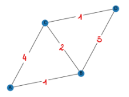{: .center}

📺 *Vidéo de référence* :
[https://ladigitale.dev/digiview/#/v/66c675d32ad85](https://ladigitale.dev/digiview/#/v/66c675d32ad85)

📌 **Attention importante** :  
- Le parcours en largeur (BFS) permet de trouver le plus court chemin
  **uniquement dans un graphe non pondéré**.
- Dans un graphe pondéré, on utilise un algorithme dédié :
  **l’algorithme de Dijkstra**.


##### 🧠 Principe de l’algorithme de Dijkstra

L’algorithme utilise :

* un **dictionnaire `distances`** : distance minimale depuis la source
* une liste **`unvisited`** : sommets non encore traités

À chaque étape :

* on choisit le sommet non visité **le plus proche**
* on met à jour les distances de ses voisins


???+ question "🧠 **Activité n° 24 — Le chemin le plus court (Dijkstra)**"
    👉 Tester l’algorithme suivant.


    ```python
    def dijkstra(graph, start, end):
        distances = {node: float('inf') for node in graph}
        distances[start] = 0
        unvisited = list(distances.keys())

        while unvisited:
            current_node = min(unvisited, key=lambda x: distances[x])
            unvisited.remove(current_node)

            for neighbor, weight in graph[current_node].items():
                distance = distances[current_node] + weight
                if distance < distances[neighbor]:
                    distances[neighbor] = distance

        return distances[end]
    ```

    ```python
    graph = {
        'A': {'B': 1, 'C': 4},
        'B': {'A': 1, 'C': 2, 'D': 5},
        'C': {'A': 4, 'B': 2, 'D': 1},
        'D': {'B': 5, 'C': 1}
    }

    print(dijkstra(graph, 'A', 'D'))
    ```

    ??? success "✅ Résultat attendu"
        ```
        4
        ```


##### 🔎 Explication détaillée de l’algorithme

🟦 1️⃣ Initialisation des distances

```python
distances = {node: float('inf') for node in graph}
```

👉 On crée un dictionnaire `distances` qui stocke
**la distance minimale depuis le sommet de départ** vers chaque sommet.

* Toutes les distances sont initialisées à **∞ (infini)**
* Cela signifie : *« on ne connaît encore aucun chemin »*

🟦 2️⃣ Distance du sommet de départ

```python
distances[start] = 0
```

👉 La distance du sommet de départ à lui-même est **0**
(car on est déjà dessus).

🟦 3️⃣ Sommets non visités

```python
unvisited = list(distances.keys())
```

👉 On crée la liste des sommets **non encore traités**.
Au départ : **tous les sommets sont non visités**.

🟦 4️⃣ Boucle principale

```python
while unvisited:
```

👉 Tant qu’il reste des sommets à explorer, on continue l’algorithme.

🟦 5️⃣ Choix du sommet le plus proche

```python
current_node = min(unvisited, key=lambda x: distances[x])
```

👉 On choisit **le sommet non visité dont la distance est minimale**.

📌 **Rôle du `lambda`** :

```python
lambda x: distances[x]
```

* prend un sommet `x`
* renvoie sa distance depuis le départ
* permet à `min()` de comparer les sommets correctement

🟦 6️⃣ Marquer le sommet comme visité

```python
unvisited.remove(current_node)
```

👉 Le sommet est maintenant **traité définitivement**
(on ne reviendra plus dessus).

🟦 7️⃣ Mise à jour des voisins (relaxation)

```python
for neighbor, weight in graph[current_node].items():
```

👉 On parcourt **tous les voisins** du sommet courant.

```python
distance = distances[current_node] + weight
```

👉 On calcule la distance en passant par le sommet courant.

```python
if distance < distances[neighbor]:
    distances[neighbor] = distance
```

👉 Si ce nouveau chemin est **plus court**,
on met à jour la distance minimale du voisin.

🟦 8️⃣ Résultat final

```python
return distances[end]
```

👉 On renvoie la **distance minimale** entre le sommet de départ
et le sommet d’arrivée.

⚠️ **Attention importante**

🚫 **L’algorithme de Dijkstra ne fonctionne pas**
si le graphe contient des **poids négatifs**.

👉 Dans ce cas, on utilisera **Bellman-Ford**.


##### 🔧 Variante sans `min()` (plus explicite)

```python
min_distance = float('inf')
current_node = None

for node in unvisited:
    if distances[node] < min_distance:
        min_distance = distances[node]
        current_node = node
```

📌 Cette version :

* est **moins efficace**
* mais **plus facile à comprendre**
* fait **exactement la même chose**


#### <H4 STYLE="COLOR:MAGENTA;"> <a name="_toc161063596"></a>**5.3.3. Chemin le plus court avec poids négatifs — Bellman-Ford**</H4>

📌 **Problème rencontré avec Dijkstra**

L’algorithme de **Dijkstra** fonctionne **uniquement si tous les poids sont positifs ou nuls**.

👉 S’il existe des **poids négatifs**, Dijkstra peut donner un **résultat faux**.

➡️ On utilise alors un autre algorithme :
**l’algorithme de Bellman-Ford**.


##### 🧠 Principe de l’algorithme de Bellman-Ford

Bellman-Ford permet de :

* calculer le **plus court chemin** depuis un sommet source,
* dans un graphe **pondéré**,
* **même si certaines arêtes ont un poids négatif**.

📌 Idée centrale :

> On améliore progressivement les distances en testant **toutes les arêtes**, plusieurs fois.


##### 🔁 Fonctionnement général

L’algorithme repose sur le principe suivant :

* initialiser toutes les distances à l’infini
* fixer la distance de la source à 0
* répéter **(nombre de sommets − 1) fois** :

  * pour chaque arête `(u, v)` :

    * tenter d’améliorer la distance de `v` via `u`

📌 Pourquoi `n − 1` répétitions ?

➡️ Dans un graphe sans cycle, le plus long chemin simple contient au maximum `n − 1` arêtes.


##### ⚠️ Détection des cycles de poids négatif

Un **cycle de poids négatif** est un cycle dont la somme des poids est négative.

👉 Dans ce cas :

* il est possible de **réduire indéfiniment la distance**
* le problème du plus court chemin **n’a pas de solution**

📌 Bellman-Ford permet de **détecter ces cycles**, contrairement à Dijkstra.


##### 🧠 Comparaison Dijkstra / Bellman-Ford

| Algorithme   | Poids négatifs | Détection de cycles négatifs | Complexité             |
| ------------ | -------------- | ---------------------------- | ---------------------- |
| BFS          | ❌              | ❌                            | O(n + m)               |
| Dijkstra     | ❌              | ❌                            | O(n²) (version simple) |
| Bellman-Ford | ✅              | ✅                            | O(n × m)               |


???+ question "🧠 **Activité n° 25 — Algorithme de Bellman-Ford**"
    👉 Tester l’algorithme suivant sur un graphe pondéré pouvant contenir des poids négatifs.

    ```python
    def bellman_ford(graph, start):
        # Initialisation
        distances = {sommet: float('inf') for sommet in graph}
        distances[start] = 0

        # Relaxation des arêtes (n - 1 fois)
        for _ in range(len(graph) - 1):
            for u in graph:
                for v, poids in graph[u].items():
                    if distances[u] + poids < distances[v]:
                        distances[v] = distances[u] + poids

        return distances
    ```

    ```python
    graph = {
        'A': {'B': 4, 'C': 2},
        'B': {'C': -3, 'D': 2},
        'C': {'D': 3},
        'D': {}
    }

    print(bellman_ford(graph, 'A'))
    ```

    ??? success "✅ Résultat attendu"

        ```
        {'A': 0, 'B': 4, 'C': 1, 'D': 4}
        ```


##### 🔎 Explication détaillée ligne par ligne

🟦 1️⃣ Initialisation des distances

```python
distances = {sommet: float('inf') for sommet in graph}
```

👉 On crée un dictionnaire `distances` :

* chaque sommet a une distance initiale de **∞ (infini)**
* cela signifie : *« on ne connaît encore aucun chemin »*

🟦 2️⃣ Distance du sommet de départ

```python
distances[start] = 0
```

👉 La distance du sommet de départ à lui-même est **0**.

🟦 3️⃣ Nombre de répétitions (n − 1)

```python
for _ in range(len(graph) - 1):
```

👉 Pourquoi **n − 1** fois ?

* un graphe de `n` sommets
* un plus court chemin simple utilise **au maximum n − 1 arêtes**

📌 Chaque passage permet d’améliorer progressivement les distances.

🟦 4️⃣ Parcours de toutes les arêtes

```python
for u in graph:
    for v, poids in graph[u].items():
```

👉 On parcourt :

* chaque sommet `u`
* chacune de ses arêtes `(u → v)` avec son **poids**

📌 Contrairement à Dijkstra :

* **aucun sommet n’est “verrouillé”**
* on revisite toutes les arêtes à chaque itération

🟦 5️⃣ Relaxation d’une arête

```python
if distances[u] + poids < distances[v]:
    distances[v] = distances[u] + poids
```

👉 On vérifie :

> Passer par `u` permet-il d’atteindre `v` avec un chemin plus court ?

* si oui → on met à jour la distance de `v`
* sinon → on ne change rien

📌 C’est **le cœur de l’algorithme**.

🟦 6️⃣ Résultat final

```python
return distances
```

👉 On renvoie :

* la distance minimale depuis le sommet de départ
* vers **tous les autres sommets**


#### 🚨 Détection d’un cycle de poids négatif 


Après avoir appliqué l’algorithme de **Bellman-Ford** pendant **`n − 1` itérations** (où `n` est le nombre de sommets) :

👉 **si une distance peut encore être améliorée**, alors **il existe un cycle de poids négatif dans le graphe**.

📌 En effet, un plus court chemin simple ne peut pas contenir plus de `n − 1` arêtes.

Une amélioration supplémentaire signifie donc que l’on **tourne en rond en gagnant du poids**, ce qui caractérise un **cycle négatif**.


🧩 **Implémentation en Python**

```python
def contient_cycle_negatif(graph, distances):
    for u in graph:
        for v, poids in graph[u].items():
            if distances[u] + poids < distances[v]:
                return True
    return False
```


🔎 **Explication du code**

* On parcourt **toutes les arêtes du graphe**
* On vérifie si une **relaxation est encore possible**
* Si oui :

  * cela signifie qu’une distance peut diminuer indéfiniment
  * donc qu’un **cycle de poids négatif existe**

👉 La fonction renvoie :

* `True` : cycle négatif détecté
* `False` : aucun cycle négatif


⚠️ **Pourquoi est-ce un problème ?**

Un cycle de poids négatif signifie que :

> il n’existe **pas de plus court chemin**
> (on peut toujours faire un tour de plus pour réduire le coût)

📌 Dans ce cas, les résultats de Bellman-Ford **n’ont plus de sens** pour le calcul de chemins minimaux.


##### 📌 Bilan

* **Dijkstra** est rapide mais limité
* **Bellman-Ford** est plus lent mais plus général
* le choix de l’algorithme dépend :

  * du type de graphe
  * des contraintes sur les poids

👉 **Toujours analyser le problème avant de choisir l’algorithme**.


#### <H4 STYLE="COLOR:MAGENTA;"> <a name="_toc161063595"></a>**5.3.3.  Parcourir un labyrinthe**</H4>

👉 **CAPYTALE** : le code est fourni par l’enseignant.

##### 🧠 Problème posé

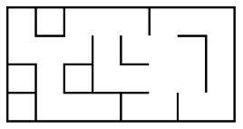{: .center}

On cherche à **rechercher un chemin dans un graphe complexe**, par exemple :

> le chemin le plus long entre deux stations de métro.

Sur un graphe réel (comme un réseau de métro), ce problème est **très difficile à résoudre efficacement**.

👉 Pour simplifier, nous allons travailler sur un **labyrinthe**, qui est une forme particulière de graphe.


##### 🧩 Les labyrinthes comme graphes

Voici un labyrinthe :

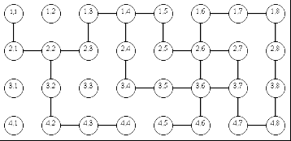{: .center}

Chaque **case** du labyrinthe correspond à un **sommet** du graphe.
Les **arêtes** relient deux cases voisines **lorsque le passage est possible**.

📌 **Règle importante** :

* s’il y a un mur → **pas d’arête**

* s’il n’y a pas de mur → **arête entre les deux sommets**


##### 🧱 Implémentation du labyrinthe

On modélise le labyrinthe par un graphe :

* les sommets sont notés sous la forme `(ligne, colonne)`
  ex. `(1,1)`, `(1,2)`, `(2,1)`…

* deux sommets sont voisins **si les cases sont adjacentes et sans mur**

📌 **Exemple** :

* pas d’arête entre `(1,1)` et `(1,2)` (mur)

* arête entre `(1,1)` et `(2,1)` (passage libre)


???+ question "🧠 **Activité n° 26 — Vérification de l’implémentation du labyrinthe**"
    👉 Vérifier que le graphe du labyrinthe est correctement construit.

    ```python
    class Graph():
    def __init__(self):
        self.lst_adj = {}

    def __str__(self):
        return str(self.lst_adj)

    def add_sommet(self, sommet):
        self.lst_adj[sommet] = []

    def add_arete(self, a, b):
        self.lst_adj[a].append(b)
        self.lst_adj[b].append(a)


    ##################################################Implémentation du labyrinthe###################################
    labyrinthe = Graph()
    for i in range(1, 5):
        for j in range(1, 9):
            labyrinthe.add_sommet((i, j))
    labyrinthe.add_arete((1, 1), (2, 1))
    labyrinthe.add_arete((2, 1), (2, 2))
    labyrinthe.add_arete((2, 2), (2, 3))
    labyrinthe.add_arete((2, 2), (3, 2))
    labyrinthe.add_arete((2, 3), (1, 3))
    labyrinthe.add_arete((1, 3), (1, 4))
    labyrinthe.add_arete((1, 4), (1, 5))
    labyrinthe.add_arete((1, 4), (2, 4))
    labyrinthe.add_arete((1, 5), (2, 5))
    labyrinthe.add_arete((2, 4), (3, 4))
    labyrinthe.add_arete((2, 5), (2, 6))
    labyrinthe.add_arete((2, 6), (1, 6))
    labyrinthe.add_arete((2, 6), (3, 6))
    labyrinthe.add_arete((2, 7), (3, 7))
    labyrinthe.add_arete((1, 6), (1, 7))
    labyrinthe.add_arete((2, 6), (2, 7))
    labyrinthe.add_arete((1, 7), (1, 8))
    labyrinthe.add_arete((1, 8), (2, 8))
    labyrinthe.add_arete((3, 2), (4, 2))
    labyrinthe.add_arete((4, 2), (4, 3))
    labyrinthe.add_arete((4, 3), (4, 4))
    labyrinthe.add_arete((3, 4), (3, 5))
    labyrinthe.add_arete((3, 5), (3, 6))
    labyrinthe.add_arete((3, 6), (4, 6))
    labyrinthe.add_arete((3, 6), (3, 7))
    labyrinthe.add_arete((4, 6), (4, 5))
    labyrinthe.add_arete((3, 7), (4, 7))
    labyrinthe.add_arete((4, 7), (4, 8))
    labyrinthe.add_arete((4, 8), (3, 8))
    labyrinthe.add_arete((2, 8), (3, 8))

    ##################################################vérification du l'implémentation#############################
    #print(labyrinthe)


    ```

    📌 **Travail demandé** :

    1. Vérifier que l’implémentation correspond bien au labyrinthe


    2. Donner la **liste d’adjacence du sommet (3, 6)**

    ??? success "✅ Solution"

        2\.

        🔍 Étape 1 — Repérer toutes les arêtes impliquant (3, 6)

        On parcourt ton code et on relève toutes les lignes où (3, 6) apparaît.

        Voici les arêtes concernées :
        labyrinthe.add_arete((2, 6), (3, 6))
        labyrinthe.add_arete((3, 5), (3, 6))
        labyrinthe.add_arete((3, 6), (4, 6))
        labyrinthe.add_arete((3, 6), (3, 7))


        ⚠️ Le graphe est non orienté, donc chaque arête compte dans les deux sens.

        📌 Étape 2 — Liste des voisins de (3, 6)

        Les sommets directement reliés à (3, 6) sont donc :

        (2, 6) → au-dessus

        (3, 5) → à gauche

        (4, 6) → en dessous

        (3, 7) → à droite

        ✅ Réponse attendue (liste d’adjacence)
        [(2, 6), (3, 5), (4, 6), (3, 7)]


        👉 L’ordre peut varier selon l’ordre d’ajout des arêtes, mais le contenu doit être exactement celui-ci.


##### 🎨 Dessin du labyrinthe

Pour visualiser le labyrinthe, vous disposez de fonctions déjà écrites.

👉 Vous **n’avez pas besoin de comprendre leur code**.

📌 Utiliser simplement :

```python
show_Labyrinthe(cote, nli, ncol)
```

avec :

* `cote = 40`
* `nli = 4`
* `ncol = 8`


##### 🚶‍♂️ Promenade dans le labyrinthe

On souhaite maintenant **explorer le labyrinthe** à partir de l’entrée `(1,1)`.


???+ question "🧠 **Activité n° 27 — Parcours du labyrinthe**"
    👉 Implémenter les deux parcours suivants :


    1. **Parcours en largeur (BFS)** à partir de `(1,1)`
    
    ```python
    #####################################################Promenade dans le labyrinthe###############################
    #~~~~~~~~~~~~~~~~~~~~~~~~~~~~~~~~~~~~~~~~~~~~~~~~~~~~ BFS ~~~~~~~~~~~~~~~~~~~~~~~~~~~~~~~~~~~~~~~~~~~~~~~~~~~~~~~
    # A COMPLETER
    sommet = (1, 1)
    vus = [sommet]
    a_voir = list(labyrinthe.lst_adj[(1, 1)])  # Copie de la liste pour qu'elle ne soit pas modifiée
    # print(a_voir)
    while a_voir != ... :
        sommet = a_voir.pop(...)
        vus.append(...)
        voisins = labyrinthe.lst_adj[...]
        for s in voisins :
            if s not in ... and s not in ... :
                a_voir.append(s)

    #print('BFS',vus)
    ```

    2. **Parcours en profondeur (DFS)** à partir de `(1,1)`

    ```python
    #~~~~~~~~~~~~~~~~~~~~~~~~~~~~~~~~~~~~~~~~~~~~~~~~~~~~ DFS ~~~~~~~~~~~~~~~~~~~~~~~~~~~~~~~~~~~~~~~~~~~~~~~~~~~~~~~
    # A COMPLETER
    sommet = (1, 1)
    vus = [sommet]
    a_voir = list(labyrinthe.lst_adj[(1, 1)])  # Copie de la liste pour qu'elle ne soit pas modifiée
    # print(a_voir)
    while a_voir != [] :
        sommet = a_voir.pop()
        vus.append(...)
        voisins = labyrinthe.lst_adj[...]
        for s in voisins :
            if s not in ... and s not in ... :
                a_voir.append(...)
    #print('DFS',vus)
    ```


    📌 **Objectif** :

    - obtenir la liste des cases visitées

    - comparer les comportements de BFS et DFS

    ??? success "✅ Rappel"
        - BFS explore d’abord les cases les plus proches
        - DFS explore un chemin le plus loin possible avant de revenir en arrière


##### 🧵 Tracer un chemin dans le labyrinthe — Parcours en profondeur (DFS)

Jusqu’à présent, le parcours en profondeur permettait uniquement d’obtenir **la liste des sommets visités**.

👉 Nous allons maintenant **tracer le chemin parcouru**, c’est-à-dire mémoriser **les arêtes empruntées** lors du parcours.

Pour cela, il est nécessaire de mémoriser **d’où l’on vient** lorsqu’un sommet est découvert.


##### 🧠 🧠 Principe du dictionnaire `parent`

On associe à chaque sommet **son parent**, c’est-à-dire :

> le sommet depuis lequel il a été découvert.

Ce dictionnaire permet ensuite de reconstruire le chemin sous la forme d’une **suite d’arêtes**.


???+ question "🧠 **Activité n° 28 — Tracer le chemin (DFS)**"
    
    🎯 Objectifs

    * Modifier un parcours DFS existant

    * Mémoriser les **arêtes parcourues**

    * Préparer l’affichage graphique du chemin
    
    📌 Travail demandé

    1️⃣ **Avant la boucle de parcours** :

    * créer une liste vide `chemin`
    * créer un dictionnaire vide `parent`

    2️⃣ **Initialisation** :

    * le sommet de départ est `(1,1)`
    * tous les sommets initialement empilés dans `a_voir` ont pour parent `(1,1)`

    3️⃣ **Pendant le parcours DFS** :

    * à chaque fois qu’un sommet est ajouté dans `a_voir`, mémoriser son parent
    * à chaque fois qu’un sommet est ajouté dans `vus`, ajouter l’arête correspondante dans `chemin`

    🧪 Code à compléter

    ```python
    ################################################ Tracer les chemins ################################################
    # DFS avec mémorisation du chemin

    sommet = (1, 1)
    vus = [sommet]

    a_voir = list(labyrinthe.lst_adj[(1, 1)])  # pile (copie)
    chemin = ...
    parent = ...

    # Initialisation des parents
    for s in a_voir:
        ...

    while a_voir != []:
        sommet = a_voir.pop()
        vus.append(...)
        chemin.append((parent[sommet], ...))

        voisins = labyrinthe.lst_adj[...]
        #print(voisins)
        for s in voisins:
            if s not in ... and s not in ...:
                a_voir.append(...)
                parent[s] = ...

    #print('DFS chemin', chemin)
    ```

    ??? success "✅ Principe attendu"
        - `parent` mémorise l’origine de chaque sommet
        - `chemin` contient les arêtes du parcours
        - le chemin peut être reconstruit en remontant les parents


📌 Remarque : le chemin obtenu dépend de l’algorithme utilisé
(DFS ne donne pas forcément le chemin le plus court).


???+ question "🧠 **Activité n° 29 — Arrêt anticipé du parcours**"
    
    Lorsqu’on cherche un chemin dans un labyrinthe :

    * l’entrée est `(1,1)`
    * la sortie est `(4,8)`

    👉 Il est inutile de poursuivre le parcours une fois la sortie atteinte.

    🎯 Objectif

    Optimiser l’algorithme en **arrêtant le DFS dès que la sortie est trouvée**, sans utiliser `break`.

    📌 Travail demandé

    1️⃣ Modifier la condition de la boucle `while` afin que :

    * le parcours s’arrête lorsque la pile est vide
    * **ou** lorsque le sommet courant est `(4,8)`

    2️⃣ Vérifier que :

    * le chemin obtenu mène bien jusqu’à la sortie
    * le parcours est plus court que sans arrêt anticipé

    -🧪 Code à adapter

    ```python
    while a_voir != [] and sommet != (4, 8):
        ...
    ```
    

    ??? success "✅ Idée clé"
        - la condition d’arrêt est intégrée dans le `while`
        - le parcours s’arrête dès que `(4,8)` est découvert


📌 **Remarque importante** 

> ⚠️ Le chemin obtenu dépend de l’ordre d’exploration du DFS.
> Un parcours en profondeur **ne garantit pas** le chemin le plus court.

➡️ Pour le plus court chemin :

* graphe non pondéré → **BFS**
* graphe pondéré → **Dijkstra / Bellman-Ford**


## <H2 STYLE="COLOR:BLUE;"> <a name="_toc161063595"></a>**6.🔎 Synthèse**</H2>


##### 🧠 Schémas — *Les graphes*


##### 📌 Carte conceptuelle des graphes et de leurs algorithmes 


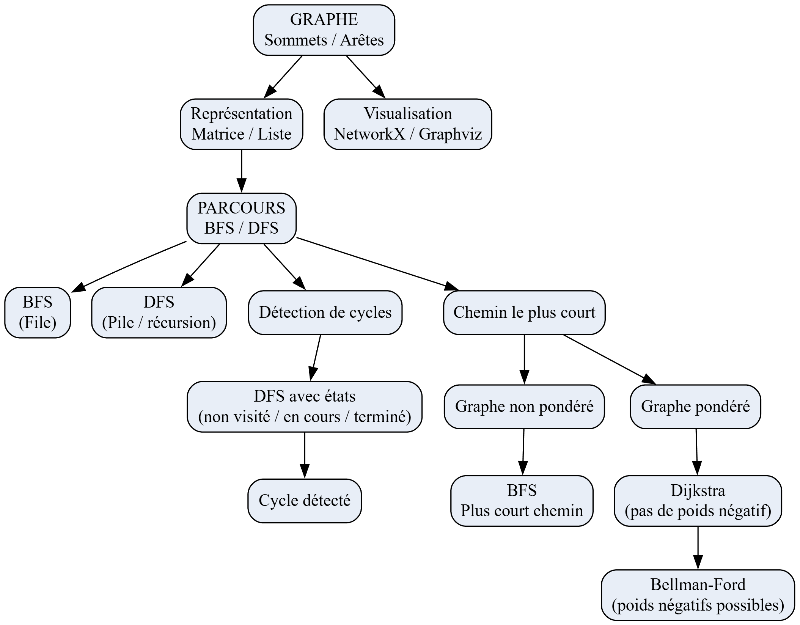


##### 🧩 La démarche logique pour travailler sur un graphe

1️⃣ **On commence toujours par un graphe**

* Sommets = objets
* Arêtes = relations
* Orienté / non orienté
* Pondéré / non pondéré


2️⃣ **On choisit une représentation**

* Matrice d’adjacence → rapide pour tester une arête
* Liste d’adjacence → économique en mémoire


3️⃣ **On explore : les parcours**

| Algorithme | Structure        | Idée                     |
| ---------- | ---------------- | ------------------------ |
| **BFS**    | File             | On explore par distance  |
| **DFS**    | Pile / récursion | On explore en profondeur |


4️⃣ **Applications directes des parcours**

🔁** Détection de cycle**

* Basée sur **DFS**
* Si on revient sur un sommet **en cours** → cycle

🧭 **Recherche de chemin**

* BFS → plus court chemin **non pondéré**
* DFS → chemin quelconque (pas optimal)


5️⃣ **Graphes pondérés : on change d’algorithme**

| Situation      | Algorithme                        |
| -------------- | --------------------------------- |
| Poids positifs | **Dijkstra**                      |
| Poids négatifs | **Bellman-Ford**                  |
| Cycle négatif  | **Bellman-Ford détecte l’erreur** |


6️⃣ **Cas concret final : le labyrinthe**

* Graphe en grille
* BFS / DFS pour explorer
* `parent` pour reconstruire le chemin
* Arrêt anticipé quand sortie trouvée


> *Un graphe se modélise, se représente, se parcourt.*
> *Les parcours permettent de détecter des cycles et de chercher des chemins.*
> *Le choix de l’algorithme dépend du type de graphe.*


Merci à Gilles Lassus, Cédric Gouyou, Jean-Louis Thirot, et Mireille Coilhac


## <H2 STYLE="COLOR:BLUE;"> <a name="_toc161063596"></a>**7.🔎 Exercices**</H2>


!!! info "🧠 **Capytale : Les codes seront fournis par votre enseignant.**" 


!!! abstract "🧩 **Exercice n°1 : Implémentation avec matrice d’adjacence**"

!!! abstract "🧩 **Exercice n°2 : Implémentation POO**"

!!! abstract "🧩 **Exercice n°3 : Parcours de graphe**"

!!! abstract "🧩 **Exercice n°4 : plus court chemin**"


## <H2 STYLE="COLOR:BLUE;"> **8. 🔎 Projet**</H2>  

!!! info "🧠 **Capytale : Les codes seront fournis par votre enseignant.**" 

!!! abstract "🧩 **Exercice n°1 : Utiliser Dijkstra pour :**"


    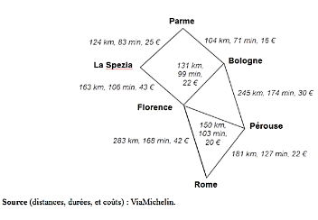{: .center}

    - **et les chemins qui mènent à Rome**

    Tous les chemins mènent à Rome, mais pour un parmesan (un habitant de Parme !).

    **Appliquer le programme** précédent pour déterminer

    - Quel est le moins long ?
    - Le plus rapide ?
    - Le moins cher ?

    - **les chemins mènent aussi aux routeurs…**

    La distance entre différents routeurs est donnée dans le tableau suivant. Le symbole ∞ signifie que deux routeurs ne sont pas reliés.

    |**Routeur1**|**Routeur2**|**Routeur3**|**Routeur4**|**Routeur5**|**Routeur6**|
    |:-:|:-:|:-:|:-:|:-:|:-:|
    |∞|1km|10km|∞|∞|∞|
    |1km|∞|∞|22km|∞|∞|
    |10km|∞|∞|3km|1km|1km|
    |∞|22km|3km|∞|4km|∞|
    |∞|1km|4km|∞|1km||
    |∞|∞|1km|∞|1km|∞|

    Un réseau peut se représenter à l’aide d’un graphe. Chaque nœud (sommet) est un routeur. Chaque lien (arête) est le support qui véhicule l’information que l’on pondère avec la distance à parcourir. Ainsi, le poids du lien entre les routeur 3 et 5 est de 1 km. C’est un graphe pondéré.

    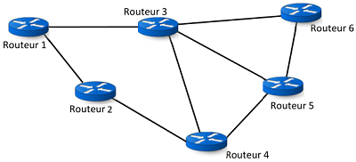{: .center}

    *figure* 

    1. Compléter à la main la figure , en donnant la distance à la source et le prédécesseur sur chaque sommet (on considère que la source est le Routeur 1 et la destination le Routeur 6).
    2. Modifier votre programme en donnant le graphe descriptif correspondant à la figure 2.

    NB : on donnera comme étiquette au sommet R1 pour Routeur1, R2 pour Routeur2, etc...

    3. Vérifier que

    le programme donne le résultat attendu.
    4. Donner comme source R2 et non plus R1. Relancer le programme et conclure.

!!! abstract "🧩 **Exercice n°2 : projet ouvert Dijkstra:**"


    Coder l’algorithme de Dijkstra pour déterminer le plus court chemin entre deux villes sur le graphe du réseau routier (en km ou en temps au choix).

!!! abstract "🧩 **Exercice n°3 : projet ouvert Coloriage d’un parcours**"


    Reprendre les parcours de graphe mais à chaque étape du parcours, plutôt que d’afficher juste le sommet courant, afficher le graphe complet en coloriant les sommets au fur et à mesure du parcours.

    On pourra colorier dans deux couleurs différentes les sommets découverts et les sommets visités.

    Plutôt que d’afficher le graphe à chaque étape, on peut enregistrer les différentes étapes sur disque puis créer un gif.

!!! abstract "🧩 **Exercice n°4 : projet ouvert Simulation d’un réseau de routeurs suivant le protocole RIP**"


    On créera des classes `TableRoutage`, `Routeur` et `Reseau`.

    La classe `TableRoutage` contient notamment les méthodes :

    - `__init__(self, ip_list)`: à l’initialisation, la table de routage contient uniquement les adresses IP du routeur (une par réseau auquel il est connecté).
    - `envoyer(self)`: renvoie la liste des lignes de la table ne correspondant pas aux adresses locales.
    - `recevoir(self, iphote, ipdest, table_etrangere)`: permet de recevoir la table d’un autre routeur, d’adresse ipdest accessible via l’interface iphote.

    La classe `Routeur` possède les attributs `nom`, `ip_list`, `table_routage` et `voisins`, liste dans laquelle sont enregistrés les routeurs voisins, avec leur adresse ip et l’interface permettant de les joindre. 

    Elle dispose notamment des méthodes suivantes :

    - `get_table(self)`: renvoie la table de routage.
    - `ajouter_voisin(self, r2, …)`: ajoute un routeur voisin à la liste de voisins.
    - `recevoir_table_routage(self, iphote, ipdest, table)`: reçoit la table du retour d’ip ipdest accessible via l’interface iphost et lance la mise à jour de la table de routage.
    - `envoyer_table_routage(self)`.

    La classe `Reseau` représente le graphe des routeurs. Elle est initialisée avec une liste des routeurs. À l’initialisation, elle compare les adresses IP des routeurs pour voir lesquels sont sur le même réseau et crée les arêtes entre ces routeurs. Pour simplifier, on pourra supposer que tous les réseaux ont un masque de 255.255.255.0.

    Elle contient quatre méthodes :

    - `__init__(self, routeurs)`
    - `creation_aretes(self)`: méthode appelée à l’initialisation pour créer les arêtes du graphe entre routeurs voisins, mettre à jour la liste des voisins de chaque routeurs, et rajouter les destinations vers ces voisins dans les tables de routage.
    - `rip(self)`: lorsqu’on appelle cette méthode, les routeurs s’échangent les tables de routage jusqu’à ce que celles-ci n’évoluent plus.
    - `montrer(self)`: permet d’afficher le graphe des routeurs avec les adresses réseaux écrites sur les arêtes à l’aide de graphviz par exemple.

!!! abstract "🧩 **Exercice n°5 : projet ouvert Labyrinthe**"


    On considère un labyrinthe défini comme une grille de cellules. Chaque cellule possède un mur droit et un mur bas, et chaque mur peut être ouvert, ce qui revient à dire qu’il n’y a un passage, ou pas de mur, ou fermé. Le passage entre deux cellules adjacentes est possible :

    - horizontalement si la cellule de gauche à un mur droit ouvert.
    - verticalement si la cellule du haut à un mur bas ouvert.

    Le labyrinthe est encadré de murs (pas de passage vers le haut sur la première ligne…).

    Le labyrinthe est créé avec tous les murs « fermés » (aucun passage entre les cellules), puis une méthode *generation* permet d’ouvrir des murs afin qu’il existe toujours un chemin entre deux cellules du labyrinthe. L’algorithme utilisé est décrit ici :

    [](https://fr.wikipedia.org/wiki/Mod%C3%A9lisation_math%C3%A9matique_de_labyrinthe)

    ```python
    class Cellule:
        def __init__(self):
            self.mur_bas = True       	# True signifie que le mur est fermé
            self.mur_droit = True    	# False signifie que le mur est ouvert

    class Labyrinthe:
        def __init__(self, largeur, hauteur):
            self.hauteur = hauteur
            self.largeur = largeur
            self.grille = [[Cellule() for j in range(largeur)] for i in range(hauteur)]
            self.generation()

        def solution(self, depart_ligne, depart_colonne, arrivee_ligne, arrivee_colonne):
            """
            Renvoie la liste de directions à suivre pour se rendre de la cellule
            (depart_ligne, depart_colonne) à la cellule (arrivee_ligne, arrivee_colonne).
            Exemple de retour : ['n', 'e', 'e', 's', 'o']
            """
    ```

    **Travail à faire**

    Écrire la méthode solution renvoyant un chemin permettant de se rendre d’une cellule de départ à une cellule d’arrivée.

    

