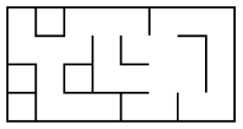

**Table des matières**

[1. Introduction et notion de base](#_toc161063570)  
[2. Modélisations d’un graphe](#_toc161063576)  
[3. Visualiser un graphe](#_toc161063584)  
[4. ❤️Création d’une class Graphe❤️](#_toc161063587)  
[5. Les parcours](#_toc161063590)  
[6. Exercices](#_toc161063596)  
[7. Projet](#_toc161063597)

**Compétences évaluables :**

- Modéliser des situations sous forme de graphes
- Écrire les implémentations correspondantes d’un graphe : matrice d’adjacence, liste de successeurs/de prédécesseurs
- Passer d’une représentation à une autre.
- Parcourir un graphe en profondeur d’abord, en largeur d’abord.
- Repérer la présence d’un cycle dans un graphe
- Chercher un chemin dans un graphe

## <H2 STYLE="COLOR:BLUE;"> <a name="_toc161063570"></a>**1. Introduction et notion de base**</H2>  
### <H3 STYLE="COLOR:GREEN;"> <a name="_toc161063571"></a>**1.1. Qu’est ce qu’un graphe ?**</H3>

Un graphe est une structure de données qui représente **des relations entre des objets.** Les objets sont représentés par des **sommets** (également appelés nœuds) et les relations entre eux sont représentées par des **arêtes** ou **arc**.

{: .center}

Il y a donc zéro ou une arête entre une paire de sommets.

Le nombre de sommets d’un graphe s’appelle l’**ordre du graphe.**

Le graphe précédent est d’ordre ????????????????.

### <H3 STYLE="COLOR:GREEN;"> <a name="_toc161063572"></a>**1.2. A quoi sert un graphe ?**</H3>  
Il sert à représenter des **relations** entre des éléments. 

Par exemple, il peut représenter un **réseau social** :

{: .center}

Ou un **réseau de transport**

{: .center}

Ou un **réseau informatique**

{: .center}

Les graphes servent aussi à représenter **des relations entre des données**, des **objets** ou pour faire du **routage dans les réseaux**.

**<H3 STYLE="COLOR:red;">Activité n° 1 : Graphe social :**</H3>  
Construisez un graphe de réseau social à partir des informations suivantes :

- A est ami avec B et E
- B est ami avec A et C
- C est ami avec B,F et D
- D est ami avec C,F et E
- E est ami avec A,D et F
- F est ami avec C, D et E

### <H3 STYLE="COLOR:GREEN;"> <a name="_toc161063573"></a>**1.3. Vocabulaire**</H3>  
On dit que deux sommets A et B sont **voisins** s’ils sont reliés par une arête : ils sont aussi dits **adjacents.**

Le **degré d’un sommet** c’est le nombre d’arêtes issues de ce sommet.

Une **chaîne** est **une suite d'arêtes consécutives dans un graphe**, un peu comme si on se promenait sur le graphe.

On la désigne par **les lettres des sommets** qu'elle comporte.

Un **cycle** est **une chaîne qui commence et se termine au même sommet**.

**<H3 STYLE="COLOR:red;">Activité n° 2 : Question vocabulaire**</H3>  
Soit le graphe suivant :

{: .center}

- Donner l’ordre de ce graphe
- Donner le degré de chaque sommet de ce graphe
- Donner deux sommets adjacents
- Donner deux sommets non adjacents

### <H3 STYLE="COLOR:GREEN;"> <a name="_toc161063574"></a>**1.4. Les différents types de graphes**</H3>  
**Premier exemple :**

Soit les lieux suivants : A, B, C, D, E, F et G.

{: .center}

Les différents lieux sont reliés par les routes suivantes :

- il existe une route entre A et C
- il existe une route entre A et B
- il existe une route entre A et D
- il existe une route entre B et F
- il existe une route entre B et E
- il existe une route entre B et G
- il existe une route entre D et G
- il existe une route entre E et F

**Problème :**  
Avec cette représentation du réseau routier sous forme de graphe, il est **impossible de tenir compte des routes en sens unique**. (par exemple, il est possible d'aller de A vers D mais pas de D vers A)

**Deuxième exemple :**

Voici de nouvelles contraintes :

{: .center}

- il existe une route entre A et C (double sens)
- il existe une route entre A et B (sens unique B->A)
- il existe une route entre A et D (sens unique A->D)
- il existe une route entre B et F (sens unique B->F)
- il existe une route entre B et E (sens unique E->B)
- il existe une route entre B et G (double sens)
- il existe une route entre D et G (double sens)
- il existe une route entre E et F (double)

Dans un graphe **orienté**, chaque arête ne peut être parcourue que dans un seul sens indiqué par une flèche. L’arête s’appelle alors un **arc**.

{: .center}

**Troisième exemple :**

Parfois, il est intéressant **d'associer aux arrêtes ou aux arcs des valeurs**, on parle alors de **graphes pondérés.**

{: .center}

Si nous revenons à notre "graphe cartographique", il est possible **d'associer à chaque arête la distance en km entre les 2 lieux** :

{: .center}

Il est aussi possible **d'associer à chaque arête la durée du trajet entre 2 points :**

En fonction du choix fait par le conducteur (trajet le plus court "en distance" ou trajet le plus court "en temps").

### <H3 STYLE="COLOR:GREEN;"> <a name="_toc161063575"></a>**1.5. Applications courantes des graphes**</H3>  
Les graphes sont utilisés dans de nombreuses applications courantes, notamment :

- **Réseaux sociaux** : les réseaux sociaux peuvent être modélisés en utilisant des graphes où les sommets représentent les utilisateurs et les arêtes représentent les relations entre les utilisateurs (amis, abonnements, etc.).
- **Mappage de routes** : les systèmes de navigation peuvent utiliser des graphes pour trouver les itinéraires les plus rapides entre les points d'intérêt en utilisant les informations sur les distances et les temps de parcours.
- **Optimisation de la production** : les graphes peuvent être utilisés pour planifier la production en utilisant des informations sur les dépendances entre les tâches et les ressources.
- **Science des données** : les graphes peuvent être utilisés pour explorer et visualiser les relations entre les données.
- **Analyse de réseau** : les graphes peuvent être utilisés pour étudier les réseaux complexes, tels que les réseaux de diffusion de l'information, les réseaux économiques, les réseaux biologiques, etc.
- **Jeux** : les graphes peuvent être utilisés pour implémenter des algorithmes de jeu, tels que l'algorithme minimax utilisé dans les jeux d'échecs et d'autres jeux à deux joueurs.
- **Réseau électrique** : les graphes peuvent être utilisés pour modéliser les réseaux électriques en

 utilisant des sommets pour représenter les nœuds et des arêtes pour représenter les lignes électriques.
- **Recherche en intelligence artificielle** : les graphes peuvent être utilisés pour implémenter des algorithmes d'IA, tels que l'algorithme A\* pour la recherche de chemin.

## <H2 STYLE="COLOR:BLUE;"> <a name="_toc161063576"></a>**2. Modélisations d’un graphe**</H2>  
Il existe **deux méthodes** permettant d'implémenter un graphe : les **listes d’adjacence et les matrices d'adjacences**.

### <H3 STYLE="COLOR:GREEN;"> <a name="_toc161063577"></a>**2.1. Représentation par matrice d’adjacence**</H3>

- On **classe les sommets** (en les numérotant, ou par ordre alphabétique).
- On représente les arêtes (ou les arcs) **dans une matrice**, c'est-à-dire un tableau à deux dimensions où on inscrit un 1 en ligne i et colonne j si les sommets de rang i et de rang j sont **voisins** (dits aussi **adjacents**).

Ce tableau s'appelle une **matrice d'adjacence** (on aurait très bien pu l'appeler aussi **matrice de voisinage**).

#### <H4 STYLE="COLOR:MAGENTA;"> <a name="_toc161063578"></a>**2.1.1. Graphe non orienté**</H4>

{: .center} 

Dans ce graphe non orienté, comme B est voisin de C, C est aussi voisin de B, ce qui signifie que l'arête qui relie B et C va donner lieu à deux "1" dans la matrice, situé de part et d'autre de la diagonale descendante (un mathématicien parlera de matrice *symétrique*).

#### <H4 STYLE="COLOR:MAGENTA;"> <a name="_toc161063579"></a>**2.1.2. Graphe orienté**</H4>

{: .center}

#### <H4 STYLE="COLOR:MAGENTA;"> <a name="_toc161063580"></a>**2.1.3. Graphe pondéré**</H4>

{: .center}

**<H3 STYLE="COLOR:red;">Activité n° 3 :**</H3>  
Soit un ensemble d'amis connectés sur un réseau social quelconque. Voici les interactions qu'on a recensées:

- André est ami avec Béa, Charles, Estelle et Fabrice,
- Béa est amie avec André, Charles, Denise et Héloïse,
- Charles est ami avec André, Béa, Denise, Estelle, Fabrice et Gilbert,
- Denise est amie avec Béa, Charles et Estelle,
- Estelle est amie avec André, Charles et Denise,
- Fabrice est ami avec André, Charles et Gilbert,
- Gilbert est ami avec Charles et Fabrice,
- Héloïse est amie avec Béa.

1\. **Sur une feuille** : Représenter le graphe des relations dans ce réseau social (on désignera chaque individu par l'initiale de son prénom). Il est possible de faire en sorte que les arêtes ne se croisent pas !

2\. Donner la matrice d'adjacence de ce graphe.

**<H3 STYLE="COLOR:red;">Activité n° 4 :**</H3>  
Sur feuille : Construire les graphes correspondants aux matrices d'adjacence suivantes:

1. {: .center}
2. {: .center}
3. {: .center}

#### <H4 STYLE="COLOR:MAGENTA;"> <a name="_toc161063581"></a>**2.1.4. ❤️Implémentation Python des matrices d’adjacence❤️**</H4>  
Une matrice se représente naturellement par une liste de listes.

**Exemple :** La matrice

{: .center}

associée au graphe suivant

{: .center}

sera représentée par la variable G suivante :

```python
G = [[0, 1, 1, 1, 1],
      [1, 0, 1, 0, 0],
      [1, 1, 0, 1, 0],
      [1, 0, 1, 0, 1],
      [1, 0, 0, 1, 0]]
```

**Complexité en mémoire et temps d'accès :**

- Pour un graphe à n sommets, la complexité en mémoire (appelée aussi **complexité spatiale**) de la représentation matricielle est **en O(n²).**
- Tester si un **sommet est isolé** (ou connaître ses voisins) est **en O(n)** puisqu'il faut parcourir une ligne, mais tester si deux sommets **sont adjacents** (voisins) est **en O(1),** c'est un simple accès au tableau.

### <H3 STYLE="COLOR:GREEN;"> <a name="_toc161063582"></a>**2.2. ❤️Représentation par les listes d’adjacence❤️**</H3>

- On associe à chaque sommet **sa liste des voisins** (c'est-à-dire les sommets adjacents). On utilise pour cela un **dictionnaire** dont les clés sont les sommets et les valeurs les listes des voisins.
- Dans le cas d'un **graphe orienté** on associe à chaque sommet **la liste des *successeurs*** (ou bien des *prédécesseurs*, au choix).

Par exemple, le graphe

{: .center}

sera représenté par le dictionnaire :

```python
G = {'A': ['B', 'C', 'D', 'E'],
     'B': ['A', 'C'],
     'C': ['A', 'B', 'D'],
     'D': ['A', 'C', 'E'],
     'E': ['A', 'D']
    }
```

**Complexité en mémoire et temps d'accès :**

- Pour un graphe à n sommets et m arêtes, la complexité spatiale de la représentation en liste d'adjacence est **en O(n+m)**. C'est beaucoup mieux qu'une matrice d'adjacence lorsque le graphe comporte peu d'arêtes (i.e. beaucoup de 0 dans la matrice, non stockés avec des listes).
- Tester si un **sommet est isolé** (ou connaître ses voisins) est **en O(1)** puisqu'on y accède immédiatement, mais tester si **deux sommets sont adjacents** (voisins) est **en O(n)** car il faut parcourir la liste.

**<H3 STYLE="COLOR:red;">Activité n° 5 : Sur feuille :**</H3>  
Construire les graphes correspondants aux listes d'adjacence suivantes :

1.

```python
G1 = {
'A': ['B', 'C'],
'B': ['A', 'C', 'E', 'F'],
'C': ['A', 'B', 'D'],
'D': ['C', 'E'],
'E': ['B', 'D', 'F'],
'F': ['B', 'E']
     }
```

2.

```python
G2 = {
'A': ['B'],
'B': ['C', 'E'],
'C': ['B', 'D'],
'D': [],
'E': ['A']
     }
```

### <H3 STYLE="COLOR:GREEN;"> <a name="_toc161063583"></a>**2.3. ❤️Passage d’une représentation à l’autre❤️**</H3>  
Dans THONNY : dans un fichier **graphe.py**

=> **CAPYTALE Le code vous sera donné par votre enseignant**

**<H3 STYLE="COLOR:red;">Activité n° 6 : Représentation par une matrice :**</H3>  
Passage d’une représentation à l’autre : Ecrire une fonction `matrice2dico(sommets, matrice)` qui prend un graphe représenté par une liste de sommets et une matrice d’adjacence et renvoie le graphe équivalent représenté par un dictionnaire.

{: .center}  
{: .center}  
{: .center}

Tester avec M1, M2 et M3.

**<H3 STYLE="COLOR:red;">Activité n° 7 : Représentation par dictionnaire :**</H3>  
Passage d’une représentation à l’autre : Ecrire une fonction `dico2matrice(graphe_dico)` qui prend un graphe représenté par un dictionnaire et qui renvoie une liste de sommets et une matrice d’adjacence.

```python
G = {'A': ['B', 'C', 'D', 'E'],
     'B': ['A', 'C'],
     'C': ['A', 'B', 'D'],
     'D': ['A', 'C', 'E'],
     'E': ['A', 'D']
    }

G1 = {
'A': ['B', 'C'],
'B': ['A', 'C', 'E', 'F'],
'C': ['A', 'B', 'D'],
'D': ['C', 'E'],
'E': ['B', 'D', 'F'],
'F': ['B', 'E']
     }

G2 = {
'A': ['B'],
'B': ['C', 'E'],
'C': ['B', 'D'],
'D': [],
'E': ['A']
     }
```

Tester avec G, G1 et G2.

## <H2 STYLE="COLOR:BLUE;"> <a name="_toc161063584"></a>**3. Visualiser un graphe**</H2>  

### <H3 STYLE="COLOR:GREEN;"> <a name="_toc161063585"></a>**3.1. Avec le module networkx**</H3>  
Pour visualiser ce graphe, nous allons utiliser les bibliothèques networkx et matplotlib. Pensez à vérifier que les deux bibliothèques sont installées.

**<H3 STYLE="COLOR:red;">Activité n° 8 : Représentation avec networkx :**</H3>  
```python
import matplotlib.pyplot as plt
import networkx as nx

def cree_graphe_non_oriente_nx(dictionnaire: dict) -> nx.Graph:
    """
    Cette fonction premet de transformer une représentation en dictionnaire en
    une représentation «complexe» d'un objet graphe orienté.

    - Précondition : l'entrée est un dictionnaire
    - Postcondition : la sortie est un graphe orienté (Graph) de Networkx
    """
    Gnx = nx.Graph() 
    for sommets in dictionnaire.keys():
        Gnx.add_node(sommets) # Creation des sommets
    for sommet in dictionnaire.keys():
        for sommets_adjacents in dictionnaire[sommet]:
            Gnx.add_edge(sommet, sommets_adjacents) # Creation des arcs
    return Gnx

plt.cla()# Pour effacer les figures précédentes
dico = {0:[1, 2], 1:[0, 2, 3], 2 : [0, 1, 3], 3: [1,2]}
G = cree_graphe_non_oriente_nx(dico)
# nx.draw_circular(G, with_labels=True)
nx.draw(G,with_labels = True) # Pour une representation classique
plt.show()
```

**<H3 STYLE="COLOR:red;">Activité n° 9 : Représentation avec networkx :**</H3>  
Tester avec G, G1 et G2 de la partie 2.2.

### <H3 STYLE="COLOR:GREEN;"> <a name="_toc161063586"></a>**3.2. Avec le module graphviz**</H3>  
Dans Thonny : Vérifiez que la bibliothèque graphviz est installée.

**<H3 STYLE="COLOR:red;">Activité n° 10 : Représentation avec graphviz d’un graphe orienté**</H3>  
```python
import graphviz
graphe_oriente = graphviz.Digraph()

#Ajout des noeuds avec la méthode node
graphe_oriente.node("A")
graphe_oriente.node("B")
graphe_oriente.node("C")

#Ajout des arcs avec la méthode edge
graphe_oriente.edge("A","B")
graphe_oriente.edge("A","C")

#Affichage du graphe
graphviz.Source(graphe_oriente)
graphe_oriente.view()
```

**<H3 STYLE="COLOR:red;">Activité n° 11 : Représentation avec graphviz d’un graphe orienté :**</H3>  
Tester avec G2.

**<H3 STYLE="COLOR:red;">Activité n° 12 : Représentation avec graphviz d’un graphe non orienté**</H3>  
```python
import graphviz
graphe_non_oriente = graphviz.Graph()

#Ajout des noeuds avec la méthode node
graphe_non_oriente.node("A")
graphe_non_oriente.node("B")
graphe_non_oriente.node("C")

#Ajout des arcs avec la méthode edge
graphe_non_oriente.edge("A","B")
graphe_non_oriente.edge("A","C")

#Affichage du graphe
graphviz.Source(graphe_non_oriente)
graphe_non_oriente.view()
```

**<H3 STYLE="COLOR:red;">Activité n° 13 : Représentation avec graphviz d’un graphe non orienté :**</H3>  
Tester avec G et G1.

## <H2 STYLE="COLOR:BLUE;"> <a name="_toc161063587"></a>**4. ❤️Création d’une class Graphe❤️**</H2>  

### <H3 STYLE="COLOR:GREEN;"> <a name="_toc161063588"></a>**4.1. Interface**</H3>  
Dans THONNY : Dans un fichier **graphe_POO.py**

=> **CAPYTALE Le code vous sera donné par votre enseignant**

{: .center}

Nous voulons que le graphe puisse être créé grâce aux instructions suivantes :

- constructeur(s : liste de Sommets) -> Graphe: renvoie le graphe (S, Δ) où Δ est une liste vide d’arêtes
- ajouter_arete(g : Graphe, s1 : Sommet, s2 : Sommet) -> graphe: à partir du graphe g = (S, A) et de deux sommets s1 et s2 appartenant à S renvoie le graphe (S, A ∪ {(s1, s2)})
- voisins(g : Graphe, s : Sommets) -> liste de Sommets: renvoie la liste des sommets voisins de s dans le graphe g. Cette fonction est remplacée par une fonction successeurs et/ou predecesseurs dans le cas d’un graphe orienté.
- sont_voisins(g : Graphe, s1 : Sommet, s2 : Sommet) -> bool: à partir du graphe g et de deux sommets s1 et s2 renvoie si s1 et voisin de s2
- get_dictionnaire(g : Graphe) -> dict : à partir du graphe renvoie le dictionnaire donnant la liste d’adjacence

L'objet de type Graphe aura comme attributs :

- une liste `liste_sommets` (donnée en paramètre dans la liste `liste_sommets`)
- un dictionnaire `adjacents`, où chaque sommet se verra attribuer une liste vide `[]`.

### <H3 STYLE="COLOR:GREEN;"> <a name="_toc161063589"></a>**4.2. Implémentation**</H3> 
 **<H3 STYLE="COLOR:red;">Activité n° 14 :  Implémentation du graphe en POO :**</H3>  Compléter les méthodes suivantes
```python
class Graphe:
    def __init__(self, liste_sommets):
        self.liste_sommets = liste_sommets
        self.adjacents = {sommet : [] for sommet in liste_sommets}

    def ajouter_arete(self, s1, s2):
        pass

    def voisins(self, s):
        pass

    def sont_voisins(self, s1, s2):
        pass

    def get_dictionnaire(self):
        pass


#################################### Pour réaliser l'affichage #########################
import matplotlib.pyplot as plt
import networkx as nx

def cree_graphe_non_oriente_nx(dictionnaire: dict) -> nx.Graph:
    Gnx = nx.Graph()
    for sommets in dictionnaire.keys():
        Gnx.add_node(sommets) # Creation des sommets
    for sommet in dictionnaire.keys():
        for sommets_adjacents in dictionnaire[sommet]:
            Gnx.add_edge(sommet, sommets_adjacents) # Creation des arcs
    return Gnx


if __name__ == '__main__':
    g = Graphe(['A', 'B', 'C', 'D', 'E'])
    g.ajouter_arete('A', 'B')
    g.ajouter_arete('A', 'C')
    g.ajouter_arete('A', 'D')
    g.ajouter_arete('A', 'E')
    g.ajouter_arete('B', 'C')
    g.ajouter_arete('C', 'D')
    g.ajouter_arete('D', 'E')
    assert g.sont_voisins('E', 'A') == True
    assert g.sont_voisins('E', 'B') == False
    assert g.voisins('C') == ['A', 'B', 'D']
    dict_2 = g.get_dictionnaire()
    print(dict_2)
    plt.cla()
    G2 = cree_graphe_non_oriente_nx(dict_2)
    nx.draw_circular(G2, with_labels=True)
    plt.show()
```

## <H2 STYLE="COLOR:BLUE;"> <a name="_toc161063590"></a>**5. Les parcours**</H2>  
Un parcours de graphe est un algorithme consistant à **explorer les sommets d'un graphe de proche en proche** à partir d'un sommet initial.

Parcourir simplement le dictionnaire ou la matrice d’un graphe comme on peut le faire pour effectuer une copie du graphe n’est pas considéré comme un parcours de graphe.

Tous les parcours suivent plus ou moins le même algorithme de base :

-\ On visite un sommet s1. On crée une structure S qui contiendra l’ensemble des voisins de s1.

-\ Tant que S n’est pas vide :

  - on choisit un sommet s de S

  - on visite s
  
  - on ajoute à S tous les voisins de s pas encore visités

**Attention : sommets visités :**

Contrairement à un parcours d'arbre, où les fils d'un nœud ne peuvent pas avoir été visités avant le nœud, **un voisin d'un sommet peut avoir déjà été visité** en tant que voisin d'un sommet précédent...

Il est donc nécessaire **de mémoriser les sommets déjà visités** ou découverts (on dira qu'un sommet est découvert lorsqu'on l'ajoute à S).

### <H3 STYLE="COLOR:GREEN;"> <a name="_toc161063591"></a>**5.1. ❤️Parcours en largeur ❤️**</H3>  

**Cf : Video [https://ladigitale.dev/digiview/#/v/66c66c81c573a](https://ladigitale.dev/digiview/#/v/66c66c81c573a)**

Si on utilise une **file** (FIFO) pour S, les sommets enregistrés dans S en premier vont être visités les premiers. On va donc visiter d'abord les sommets les plus proches de s<sub>1</sub> (ceux à distance 1, puis ceux à distance 2, puis 3…). C’est un **parcours en largeur (BFS, Breadth First Search)**.

On va utiliser ce parcours pour trouver :

- le **sommet le plus près** de s<sub>1</sub> vérifiant une condition donnée
- le **chemin le plus court** entre s<sub>1</sub> et un autre sommet.

{: .center}

Sur ce graphe A-B-C-F-E-D-G est un parcours en largeur au départ de A.

B-A-C-E-F-D-G et B-A-F-E-C-G-D sont des parcours en largeur au départ de B.

**<H3 STYLE="COLOR:red;">Activité n° 15 : Parcours en largeur :**</H3>  
Appliquez l'algorithme du parcours en largeur au graphe ci-dessous.

{: .center}

Le 'point de départ' de notre parcours (le sommet s dans l'algorithme), sera le sommet A.

Vous noterez les sommets atteints à chaque étape ainsi que les sommets présents dans la file f.

Vous pourrez aussi, à chaque étape, donner les changements de couleur des sommets.

Dans Thonny : dans **le** fichier **graphe.py**

=> **CAPYTALE Le code vous sera donné par votre enseignant**

**L’algorithme du BFS** :

{: .center}

On marque les sommets découverts afin que chaque sommet ne soit enfilé qu’une fois. Ainsi, lorsqu’on défile un sommet, on sait qu’il n’a pas encore été visité.

**Aide :**

```python
# les voisins de tmp: G[tmp]
```

Le test SI voisin n est pas dans découverts permet donc de ne pas mettre en file d'attente un voisin qui est (ou a été) déjà en file d'attente.

**Que contient la file en_attente :**

À chaque instant, la file en_attente contient des sommets à la distance k+1 et à la distance k du point de départ :

{: .center}

**Rappels sur les files**

- 1er cas : Utiliser une file déjà codée
- 2ème cas: liste de python
```python
file = [ ]
file.append(…)
file.pop(0)
```
- 3ème cas : avec module queue
```python
from queue import Queue
file = Queue()
file.empty() 
file.put(…)
file.get()
```
- 4<sup>ème</sup> cas : avec module collections
```python
from collections import deque
file = deque([ ])
file.append(…)
file.popleft()
if file : # => si la file n’est pas vide
```

**<H3 STYLE="COLOR:red;">Activité n° 16 : Parcours en largeur :**</H3>  
Implémenter l'algorithme du parcours en largeur .

```python
#importer une file !!

def parcours_largeur_i(G, s):
    decouverts=[]
    en_attente = File()
    pass

print(parcours_largeur({"A": ("B", "D", "E"), "B": ("A", "C"), "C": ("B", "D"),
                            "D": ("A", "C", "E"), "E": ("A", "D", "F", "G"), 
                            "F": ("E", "G"), "G": ("E", "F", "H"),
                            "H": ("G")}, "A"))
```

**<H3 STYLE="COLOR:red;">Activité n° 17 : Parcours en largeur :**</H3>  
Implémenter l'algorithme du parcours en largeur .

Voici le graphe :

{: .center}

```python
graphe= {'A': ['B', 'C'], 'B': ['A', 'D', 'E'], 'C': ['A', 'D'], 'D': ['B', 'C', 'E'], 'E': ['B', 'D', 'F', 'G'], 'F': ['E', 'G'], 'G': ['E', 'F', 'H'], 'H': ['G']},'B') 
```

1. Donner le parcours en largeur de g grâce à l'algorithme BFS, si le sommet de départ est B.  
2. Deviner le parcours en largeur de départ D, puis de départ G.  
3. Vérifier grâce à votre algorithme.

### <H3 STYLE="COLOR:GREEN;"> <a name="_toc161063592"></a>**5.2. ❤️Parcours en profondeur ❤️**</H3>  

**Cf : Video [https://ladigitale.dev/digiview/#/v/66c672b885a2a](https://ladigitale.dev/digiview/#/v/66c672b885a2a)**

Si on utilise une **pile** (LIFO) pour S, les sommets enregistrés en dernier vont être visités en premier : on parcourt le graphe en visitant à chaque fois un voisin du dernier sommet, sauf si celui-ci n’a pas de voisin non visité, auquel cas on remonte au dernier sommet ayant un voisin non visité. C’est un **parcours en profondeur (DFS, Depth First Search)**.

C’est le parcours utilisé naturellement par une personne qui explore **un labyrinthe**.

{: .center}

Sur le graphe précédent, A-B-C-D-E-F-G et F-B-C-D-G-E-A sont des parcours en profondeur.

F-B-C-D-G-A-E n’en est pas un (E a été empilé après A, donc sera dépilé avant).

**<H3 STYLE="COLOR:red;">Activité n° 18 : Parcours en profondeur :**</H3>  
Appliquez l'algorithme du parcours en profondeur au graphe ci-dessous.

{: .center}

**L’algorithme du DFS en version itérative**

Dans Thonny : dans **le** fichier **graphe.py**

{: .center}

**Rappels sur les piles**

- 1er cas : Utiliser une pile déjà codée
- 2ème cas: liste de python
```python
pile = [ ]
pile.append(…)
pile.pop()
```

- 3<sup>ème</sup> cas : avec module collections
```python
from collections import deque
pile = deque([ ])
pile.appendleft(…) # ou append()
pile.popleft()     #ou pop()
if pile : #=> si la pile n’est pas vide
```

**<H3 STYLE="COLOR:red;">Activité n° 19 : Parcours en profondeur en version itérative :**</H3>  
Implémenter l'algorithme du parcours en profondeur.

```python
# Importer une pile

def parcours_profondeur(G, s):
    decouverts=[]
    en_attente = Pile()
    pass

print(parcours_profondeur({"A": ("B", "D", "E"), "B": ("A", "C"), "C": ("B", "D"),
                         "D": ("A", "C", "E"), "E": ("A", "D", "F", "G"),
                         "F": ("E", "G"), "G": ("E", "F", "H"),
                         "H": ("G")}, "A") )
```

**<H3 STYLE="COLOR:red;">Activité n° 20 : Parcours en profondeur :**</H3>  
Implémenter l'algorithme du parcours en largeur .

Voici le graphe :

{: .center}

```python
graphe= {'A': ['B', 'C'], 'B': ['A', 'D', 'E'], 'C': ['A', 'D'], 'D': ['B', 'C', 'E'], 'E': ['B', 'D', 'F', 'G'], 'F': ['E', 'G'], 'G': ['E', 'F', 'H'], 'H': ['G']},'B') == ['B', 'A', 'D', 'E', 'C', 'F', 'G', 'H']
```

1. Donner le parcours en profondeur de g grâce à l'algorithme DFS, si le sommet de départ est B.  
2. Deviner le parcours en largeur de départ D, puis de départ G.  
3. Vérifier grâce à votre algorithme.

**L’algorithme du DFS en version récursive :**

{: .center}

**Remarque :** En récursif il y a un petit souci : le fait de relancer la fonction `parcours_profondeur_recur` n’efface pas réellement la liste précédente => elle apparaitra sur l’appel pour le graphe suivant… Donc **relancer la console avant chaque test !** ou passer une liste vide en paramètre.

**<H3 STYLE="COLOR:red;">Activité n° 21 : Parcours en profondeur en version récursive :**</H3>  
Implémenter l'algorithme du parcours en profondeur.

```python
def parcours_profondeur_r (G, s,decouverts = [] ):
    pass

print(parcours_profondeur_r({"A": ("B", "D", "E"), "B": ("A", "C"), "C": ("B", "D"),
                     "D": ("A", "C", "E"), "E": ("A", "D", "F", "G"),
                     "F": ("E", "G"), "G": ("E", "F", "H"),
                     "H": ("G")}, "A") )
```

On remarque que l’on n’obtient pas le même parcours en profondeur.

### <H3 STYLE="COLOR:GREEN;"> <a name="_toc161063593"></a>**5.3. Application des parcours**</H3>  
#### <H4 STYLE="COLOR:MAGENTA;"><a name="_toc161063594"></a>**5.3.1. Le BFS et le chemin le plus court (Dijkstra)**</H4>

{: .center}

**Cf : Video [https://ladigitale.dev/digiview/#/v/66c675d32ad85](https://ladigitale.dev/digiview/#/v/66c675d32ad85)**

Cette implémentation utilise 

- **un dictionnaire** `distance` pour stocker les distances des nœuds à partir de la source.
- **tableau unvisited** pour stocker les nœuds qui n'ont pas encore été visités.

À chaque itération, nous trouvons le nœud le plus proche de la source en utilisant la fonction **min()** et en utilisant la fonction de clé **key=lambda x: distances[x]**. Une fois que le nœud a été visité, nous l'enlevons du tableau **unvisited**.

Cette implémentation est simple, mais peut-être moins performante pour de grandes entrées en raison de la nécessité de trouver le nœud le plus proche à chaque itération en parcourant le tableau complet.

 **<H3 STYLE="COLOR:red;">Activité n° 22 :  Le chemin le plus court:**</H3>  Tester :
```python
def dijkstra(graph, start, end):
    distances = {node: float('inf') for node in graph}
    distances[start] = 0
    unvisited = list(distances.keys()) # ou [key for key in graph.keys()]
    while unvisited:
        current_node = min(unvisited, key=lambda x: distances[x])
        unvisited.remove(current_node)
        for neighbor, weight in graph[current_node].items():
            distance = distances[current_node] + weight
            if distance < distances[neighbor]:
                distances[neighbor] = distance
    return distances[end]

graph = {'A': {'B': 1, 'C': 4},'B': {'A': 1, 'C': 2, 'D': 5},'C': {'A': 4, 'B': 2, 'D': 1},'D': {'B': 5, 'C': 1},}

print(dijkstra(graph, 'A', 'D'))  # Output: 4
```

Explication :

- **distances = {node: float('inf') for node in graph}** : ce bloc de code initialise un dictionnaire **distances** qui contiendra **les distances minimales depuis le noeud de départ pour chaque noeud dans le graphe.** Tous les éléments du dictionnaire sont initialisés à **float('inf')**, qui représente l'infini.
- **distances[start] = 0** : ce bloc de code définit la distance du nœud de départ à lui-même à 0.
- **unvisited = list(distances.keys())** : ce bloc de code crée un tableau **unvisited** qui contiendra les noeuds qui n'ont pas encore été visités.
- **while unvisited:** : ce bloc de code définit une boucle qui s'exécutera tant qu'il reste des noeuds non visités.
- **current_node = min(unvisited, key=lambda x: distances[x])** : ce bloc de code trouve **le noeud dans unvisited avec la distance minimale à partir du nœud de départ** et le définit comme le noeud actuel. Plus précisément, **lambda x: distances[x]** est une fonction qui prend un nœud x comme entrée et renvoie la distance de ce nœud à partir du nœud de départ (comme stocké dans le dictionnaire distances). 
- **unvisited.remove(current_node)** : ce bloc de code **retire le nœud actuel** de la liste **unvisited** pour marquer qu'il a été visité.
- **for neighbor, weight in graph[current_node].items():** : ce bloc de code définit une **boucle qui parcourt les voisins** du nœud actuel.
- **distance = distances[current_node] + weight** : ce bloc de **code calcule la distance minimale pour le voisin** en ajoutant le poids de l'arc qui relie le nœud actuel au voisin.
- **if distance < distances[neighbor]:** : ce bloc de code vérifie si la distance minimale pour le voisin est plus petite que la valeur actuelle dans le dictionnaire **distances**.
- **distances[neighbor] = distance** : ce bloc de code met à jour la distance minimale pour le voisin dans le dictionnaire **distances** si elle est plus petite que la valeur actuelle.
- **return distances[end]** : ce bloc de code retourne la distance minimale pour le noeud de destination depuis le nœud de départ.

**Aide :**

La ligne 

```python
current_node = min(unvisited, key=lambda x: distances[x])
```

peut être remplacée par :

```python
min_distance = float('inf')
current_node = None
for node in unvisited:
    if distances[node] < min_distance:
        min_distance = distances[node]
        current_node = node
```

C’est moins efficace (complexité temporelle plus grande due à l’absence de la fonction `min` qui est plus efficace que notre code) mais il fait la même chose : Pour chaque sommet appelé `node` non visité, on garde le `node` qui a la distance minimale du départ.

#### <H4 STYLE="COLOR:MAGENTA;"> <a name="_toc161063595"></a>**5.3.2. Parcourir un labyrinthe**</H4>  
**Considérons le problème suivant :**



Rechercher le chemin le plus long entre deux stations dans le métro. Indépendamment de l'aspect ludique, c'est en fait un problème difficile qu'on aurait bien du mal à résoudre de façon raisonnable sur un gros graphe comme celui du métro. Pour simplifier, nous allons donc considérer des labyrinthes.

**Les labyrinthes**

Voici l'image d'un labyrinthe :


Ce labyrinthe correspond au graphe suivant :

**Implémentation du labyrinthe**

Implémentons ce labyrinthe avec un graphe. Vous utiliserez l'implémentation de graphe fournie ci-dessous.

Vous nommerez les sommets (1, 1) (1, 2) .. etc.

Les arêtes relient les cases voisines quand le passage est possible. Si une paroi empêche de passer on ne met pas l'arête.

Par exemple il n'y a pas d'arête entre les sommets (1, 1) et (1, 2) mais il y en a une entre (1, 1) et (2, 1).

Dans THONNY : Ouvrir le fichier **TP_labyrinthe.py**

=> **CAPYTALE Le code vous sera donné par votre enseignant**

1. vérifier que l’implémentation est bonne
2. vérifier la liste d’adjacence de 3,6

**Dessin de votre labyrinthe**

Pour voir le labyrinthe que vous avez créé, vous allez avoir besoin des fonctions ci-dessous.

Vous n'avez pas besoin de les regarder, la seule chose dont vous avez besoin c'est de dessiner avec `show_Labyrinthe(cote, nli, ncol)` avec :

- `cote` est un entier qui code la longueur des côtés des cases (mettez 40)
- `nli` et `ncol` sont les nombres de lignes et colonnes de votre labyrinthe, donc ici 4 et 8

**Promenade dans le labyrinthe**

1. commencez par implémenter les deux parcours en largeur (BFS) et en profondeur (DFS), en partant de la case (1, 1).

**Parcours en largeur : BFS** compléter le code.

**Parcours en profondeur DFS** compléter le code.

2. On souhaite tracer les chemins, et non plus seulement les sommets visités.

Il va donc maintenant falloir garder en mémoire, pour chaque sommet, le parent associé (d'où l'on venait).

Pour cela recopiez la fonction DFS faite précédemment et modifiez là comme suit :

1\. Avant la boucle créez une liste vide `chemin` et un dictionnaire vide `parent`.
2\. Toujours avant la boucle, pour chaque sommet `s` dans `a_voir`, définir son parent égal à (1, 1) : `parent[s] = (1, 1)`

    - A chaque fois qu'on ajoute un sommet dans `a_voir`, il faut définir son parent dans le dictionnaire `parent`.
    
    - A chaque fois qu'on ajoute un sommet dans `vus` on doit ajouter dans chemin un tuple `(parent[sommet], sommet)`.

Compléter le code.

**Ouverture possible :** puisqu'on entre en (1, 1) et que la sortie est en (4, 8), autant s'arrêter dès qu'on a trouvé la sortie, modifier le code en ajoutant une condition dans le `while` pour éviter un `break`.

Merci à Gilles Lassus, Cédric Gouyou, Jean-Louis Thirot, et Mireille Coilhac

## <H2 STYLE="COLOR:BLUE;"> <a name="_toc161063596"></a>**6. Exercices**</H2>

=> **CAPYTALE Le code vous sera donné par votre enseignant**

**<H3 STYLE="COLOR:red;">Exercice n°2 : Implémentation POO**</H3>

=> **CAPYTALE Le code vous sera donné par votre enseignant**

**<H3 STYLE="COLOR:red;">Exercice n°3 : Parcours de graphe**</H3>

=> **CAPYTALE Le code vous sera donné par votre enseignant**

**<H3 STYLE="COLOR:red;">Exercice n°4 : plus court chemin**</H3>

=> **CAPYTALE Le code vous sera donné par votre enseignant**

## <H2 STYLE="COLOR:BLUE;"> **7. Projet**</H2>  
**<H3 STYLE="COLOR:red;">Exercice n°1 Utiliser Dijkstra pour :**</H3>

{: .center}

- **et les chemins qui mènent à Rome**

Tous les chemins mènent à Rome, mais pour un parmesan (un habitant de Parme !).

**Appliquer le programme** précédent pour déterminer

- Quel est le moins long ?
- Le plus rapide ?
- Le moins cher ?

- **les chemins mènent aussi aux routeurs…**

La distance entre différents routeurs est donnée dans le tableau suivant. Le symbole ∞ signifie que deux routeurs ne sont pas reliés.

|**Routeur1**|**Routeur2**|**Routeur3**|**Routeur4**|**Routeur5**|**Routeur6**|
|:-:|:-:|:-:|:-:|:-:|:-:|
|∞|1km|10km|∞|∞|∞|
|1km|∞|∞|22km|∞|∞|
|10km|∞|∞|3km|1km|1km|
|∞|22km|3km|∞|4km|∞|
|∞|1km|4km|∞|1km||
|∞|∞|1km|∞|1km|∞|

Un réseau peut se représenter à l’aide d’un graphe. Chaque nœud (sommet) est un routeur. Chaque lien (arête) est le support qui véhicule l’information que l’on pondère avec la distance à parcourir. Ainsi, le poids du lien entre les routeur 3 et 5 est de 1 km. C’est un graphe pondéré.

{: .center}

*figure* 

1. Compléter à la main la figure , en donnant la distance à la source et le prédécesseur sur chaque sommet (on considère que la source est le Routeur 1 et la destination le Routeur 6).
2. Modifier votre programme en donnant le graphe descriptif correspondant à la figure 2.

NB : on donnera comme étiquette au sommet R1 pour Routeur1, R2 pour Routeur2, etc...

3. Vérifier que

 le programme donne le résultat attendu.
4. Donner comme source R2 et non plus R1. Relancer le programme et conclure.

**<H3 STYLE="COLOR:red;">Exercice n° 02 : projet ouvert Dijkstra**</H3>

Coder l’algorithme de Dijkstra pour déterminer le plus court chemin entre deux villes sur le graphe du réseau routier (en km ou en temps au choix).

**<H3 STYLE="COLOR:red;">Exercice n° 03 : projet ouvert Coloriage d’un parcours**</H3>

Reprendre les parcours de graphe mais à chaque étape du parcours, plutôt que d’afficher juste le sommet courant, afficher le graphe complet en coloriant les sommets au fur et à mesure du parcours.

On pourra colorier dans deux couleurs différentes les sommets découverts et les sommets visités.

Plutôt que d’afficher le graphe à chaque étape, on peut enregistrer les différentes étapes sur disque puis créer un gif.

**<H3 STYLE="COLOR:red;">Exercice n°04 : projet ouvert Simulation d’un réseau de routeurs suivant le protocole RIP**</H3>

On créera des classes `TableRoutage`, `Routeur` et `Reseau`.

La classe `TableRoutage` contient notamment les méthodes :

- `__init__(self, ip_list)`: à l’initialisation, la table de routage contient uniquement les adresses IP du routeur (une par réseau auquel il est connecté).
- `envoyer(self)`: renvoie la liste des lignes de la table ne correspondant pas aux adresses locales.
- `recevoir(self, iphote, ipdest, table_etrangere)`: permet de recevoir la table d’un autre routeur, d’adresse ipdest accessible via l’interface iphote.

La classe `Routeur` possède les attributs `nom`, `ip_list`, `table_routage` et `voisins`, liste dans laquelle sont enregistrés les routeurs voisins, avec leur adresse ip et l’interface permettant de les joindre. 

Elle dispose notamment des méthodes suivantes :

- `get_table(self)`: renvoie la table de routage.
- `ajouter_voisin(self, r2, …)`: ajoute un routeur voisin à la liste de voisins.
- `recevoir_table_routage(self, iphote, ipdest, table)`: reçoit la table du retour d’ip ipdest accessible via l’interface iphost et lance la mise à jour de la table de routage.
- `envoyer_table_routage(self)`.

La classe `Reseau` représente le graphe des routeurs. Elle est initialisée avec une liste des routeurs. À l’initialisation, elle compare les adresses IP des routeurs pour voir lesquels sont sur le même réseau et crée les arêtes entre ces routeurs. Pour simplifier, on pourra supposer que tous les réseaux ont un masque de 255.255.255.0.

Elle contient quatre méthodes :

- `__init__(self, routeurs)`
- `creation_aretes(self)`: méthode appelée à l’initialisation pour créer les arêtes du graphe entre routeurs voisins, mettre à jour la liste des voisins de chaque routeurs, et rajouter les destinations vers ces voisins dans les tables de routage.
- `rip(self)`: lorsqu’on appelle cette méthode, les routeurs s’échangent les tables de routage jusqu’à ce que celles-ci n’évoluent plus.
- `montrer(self)`: permet d’afficher le graphe des routeurs avec les adresses réseaux écrites sur les arêtes à l’aide de graphviz par exemple.

**<H3 STYLE="COLOR:red;">Exercice n°05 : projet ouvert Labyrinthe**</H3>

On considère un labyrinthe défini comme une grille de cellules. Chaque cellule possède un mur droit et un mur bas, et chaque mur peut être ouvert, ce qui revient à dire qu’il n’y a un passage, ou pas de mur, ou fermé. Le passage entre deux cellules adjacentes est possible :

- horizontalement si la cellule de gauche à un mur droit ouvert.
- verticalement si la cellule du haut à un mur bas ouvert.

Le labyrinthe est encadré de murs (pas de passage vers le haut sur la première ligne…).

Le labyrinthe est créé avec tous les murs « fermés » (aucun passage entre les cellules), puis une méthode *generation* permet d’ouvrir des murs afin qu’il existe toujours un chemin entre deux cellules du labyrinthe. L’algorithme utilisé est décrit ici :

[](https://fr.wikipedia.org/wiki/Mod%C3%A9lisation_math%C3%A9matique_de_labyrinthe)

```python
class Cellule:
    def __init__(self):
        self.mur_bas = True       	# True signifie que le mur est fermé
        self.mur_droit = True    	# False signifie que le mur est ouvert

class Labyrinthe:
    def __init__(self, largeur, hauteur):
        self.hauteur = hauteur
        self.largeur = largeur
        self.grille = [[Cellule() for j in range(largeur)] for i in range(hauteur)]
        self.generation()

    def solution(self, depart_ligne, depart_colonne, arrivee_ligne, arrivee_colonne):
        """
        Renvoie la liste de directions à suivre pour se rendre de la cellule
        (depart_ligne, depart_colonne) à la cellule (arrivee_ligne, arrivee_colonne).
        Exemple de retour : ['n', 'e', 'e', 's', 'o']
        """
```

**Travail à faire**

Écrire la méthode solution renvoyant un chemin permettant de se rendre d’une cellule de départ à une cellule d’arrivée.

Dans Thonny : Vous testerez votre code dans le fichier `labyrinthe.py`.

