---
author: ELP
title: 11 Programmation dynamique
---

**Table des matières**

[1.	Paradigmes algorithmiques](#_toc159507072)

[2.	Programmation dynamique de la suite de Fibonacci](#_toc159507076)

[3.	L’optimisation du problème du rendu de monnaie](#_toc159507082)

[4.	Exercices :](#_toc159507090)

[5.	Projet : le triangle de Pascal	](#_toc159507091)

**Compétences évaluables :**

- Utiliser la programmation dynamique pour écrire un algorithme

1. **Paradigmes algorithmiques**
   1. **L’algorithme glouton**

Lorsque l’on utilise un algorithme glouton, on applique le **paradigme** de l’algorithme glouton. Ce paradigme se concentre sur les **problèmes d’optimisation**. Voici quelques caractéristiques importantes de la programmation d’un algorithme glouton :

- **Construction incrémentale** : L’algorithme glouton construit une solution étape par étape. À chaque étape, il choisit **la direction la plus prometteuse** en se basant sur des règles simples et en considérant une seule donnée à la fois.
- **Optimalité locale** : Le choix effectué à **chaque étape est localement optimal**, mais cela ne garantit **pas une solution globalement optimale**. Cependant, dans certains cas, l’optimalité locale conduit à l’optimalité globale.
- **Heuristique** : Dans certains cas, l’algorithme glouton est simplement une heuristique (**méthode de résolution** qui privilégie des **solutions approximatives)** qui fournit **une solution sous-optimale.** Cependant, lorsque nous ne connaissons pas d’algorithme exact efficace, cette approche peut être utilisée.
  1. **Diviser pour régner**

Il **divise** un problème en sous-problèmes indépendants (qui ne se chevauchent pas), **résout** chaque sous-problème, et **combine** les solutions des sous-problèmes pour former une solution du problème initial.

1. **La programmation dynamique**

La **programmation dynamique** est un **paradigme algorithmique** qui permet de résoudre des problèmes **d’optimisation** en les décomposant en **sous-problèmes** et en stockant les résultats intermédiaires pour éviter de recalculer les mêmes valeurs. Voici quelques points importants concernant la programmation dynamique :

1. **Décomposition en sous-problèmes** : L’idée centrale de la programmation dynamique est de diviser un problème complexe en **sous-problèmes plus simples**. Chaque sous-problème est résolu indépendamment.
1. **Stockage des résultats** : Plutôt que de recalculer les mêmes valeurs à plusieurs reprises, la programmation dynamique **mémoïse les résultats** des sous-problèmes dans une structure de données (généralement un tableau ou une matrice).
1. **Optimalité de Bellman** : La programmation dynamique s’appuie sur le **principe d’optimalité de Bellman**. Selon ce principe, une solution optimale d’un problème global peut être construite en combinant des solutions optimales de sous-problèmes.
1. **Deux approches** :
   1. **Ascendante** : On commence par résoudre **les sous-problèmes les plus petits** et on remonte progressivement vers le problème initial. Les résultats sont stockés dans un tableau.
   1. **Descendante** : On part du problème global et on le décompose en sous-problèmes. On résout **chaque sous-problème en utilisant les résultats déjà calculés**.

1. **Programmation dynamique de la suite de Fibonacci**

Toutes les activités de cette partie du cours seront effectuées dans un seul fichier nommé **fibonacci.py**

La suite de Fibonacci est définie par :

Fn=0, si n=01, si n=1Fn-1+F(n-2), si n>1

1. **La suite de Fibonacci : algorithme itératif**

La version itérative a déjà été vu en première.

|
**Activité n° AUTONUM  \* Arabic : Suite de Fibonacci  avec l’algorithme iteractif :** Tester le pour n = 6

def fibonacci\_iteractif(*n*): `    `u, v = 0, 1 `    `for i in range(*n*-1) : `        `u, v = v, u+v `    `return v

Tester avec n =10, 100,… y a-t-il un problème ?
|
| - |

1. **La suite de Fibonacci : algorithme récursif**

La version récursive est plus proche de la définition.

|
**Activité n° AUTONUM  \* Arabic : Suite de Fibonacci avec l’algorithme récursif dit naif :** Tester le pour n = 6

def fibonacci\_recursif(*n*) : `    `if n == 0 or n == 1 : `        `return *n* `    `else : `        `return fibonacci\_recursif(*n*-1)+fibonacci\_recursif(*n*-2)

Tester avec n =10, 100,… y a-t-il un problème ?
|
| - |

Cette fonction est **très peu performante.** 

En effet, nous avons vu avec la suite de Fibonacci que programmer récursivement cette suite est contre-productif, car elle nécessite de résoudre plusieurs fois le **même sous-problème** (un même terme). Elle ne mémorise pas les termes déjà calculés pour s’en resservir.

Pour n = 6, il est possible d’illustrer le fonctionnement de ce programme avec le graphe des appels récursifs suivant :

<https://www.recursionvisualizer.com/?function_definition=def%20fib%28n%29%20%3A%0A%20%20%20%20if%20n%20%3D%3D%200%20or%20n%20%3D%3D%201%20%3A%0A%20%20%20%20%20%20%20%20return%20n%0A%20%20%20%20else%20%3A%0A%20%20%20%20%20%20%20%20return%20fib%28n-1%29%2Bfib%28n-2%29%0A&function_call=fib%286%29>

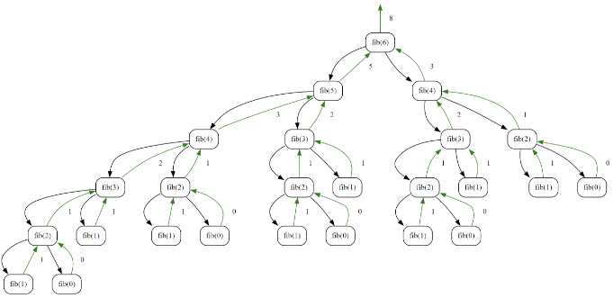

On voit bien que certaines valeurs sont **calculées plusieurs fois.** 

Et les appels augmentent de manière exponentielle comme on peut le voir dans l’arbre des appels de fib(8)

<https://www.recursionvisualizer.com/?function_definition=def%20fib%28n%29%20%3A%0A%20%20%20%20if%20n%20%3D%3D%200%20or%20n%20%3D%3D%201%20%3A%0A%20%20%20%20%20%20%20%20return%20n%0A%20%20%20%20else%20%3A%0A%20%20%20%20%20%20%20%20return%20fib%28n-1%29%2Bfib%28n-2%29%0A&function_call=fib%288%29>

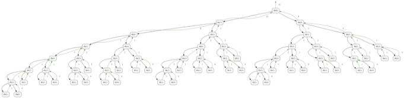

Il faut donc **mémoriser ces valeurs** : on va donc utiliser une **matrice (tableau de tableaux)**. 

De plus, l'utilisation de ce tableau va permettre de transformer cet **algorithme récursif en un itératif** : il suffit de changer l'ordre de parcours ; au lieu de diminuer de n à 1 et 0 comme dans l'algorithme récursif, il suffit d'augmenter dans le tableau de 0 et 1 à n.

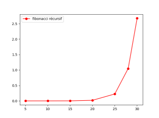

1. **La suite de Fibonacci : avec mémoïsation**

Ici :

- l'écriture d'un **algorithme récursif naïf** (donné au début dans cet exemple) afin de résoudre d'abord les cas simples (ceux de la condition d'arrêt) pour pouvoir traiter ensuite les cas plus compliqués.
- **utiliser un tableau (ou un dictionnaire) servant à mémoriser les résultats** déjà calculés pour ne pas les recalculer afin de réduire le coût en temps de calcul,
- **transformer un algorithme récursif et en itératif** en raisonnant dans l'ordre inverse de celui des appels récursifs afin de finir l'optimisation (élément effectué en même temps que le précédent dans cet exemple).

|
**Activité n° AUTONUM  \* Arabic : Suite de fibonacci avec mémoïsation avec un tableau :** Etude de la mémoïsation

# initialisation d'un tableau contenant des -1 F = [-1]\*101  def fibonacci\_mem(n): `    `pass

Tester avec n =6, 10, 100,… y a-t-il un problème ?
|
| - |

<https://www.recursionvisualizer.com/?function_definition=F%20%3D%20%5B-1%5D*101%0A%0Adef%20fibonacci_mem%28n%29%3A%0A%20%20%20%20if%20n%20%3D%3D%200%20or%20n%20%3D%3D%201%20%3A%0A%20%20%20%20%20%20%20%20return%20n%0A%20%20%20%20else%20%3A%0A%20%20%20%20%20%20%20%20if%20F%5Bn%5D%20%3D%3D%20-1%3A%0A%20%20%20%20%20%20%20%20%20%20%20%20F%5Bn%5D%20%3D%20fibonacci_mem%28n-1%29%2Bfibonacci_mem%28n-2%29%0A%20%20%20%20%20%20%20%20return%20F%5Bn%5D%0A%0A&function_call=fibonacci_mem%286%29>

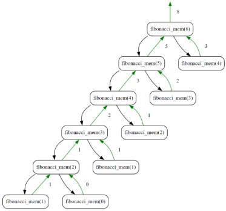

On peut bien sûr intégrer la création de la liste dans la fonction pour un code **plus élégant.** 

|
**Activité n° AUTONUM  \* Arabic : Suite de fibonacci avec mémoïsation avec un tableau:** 

def fibonacci\_mem2(n, F=[0,1]): `    `if n >= len(F): `        `F.append(fibonacci\_mem2(n-1, F)+fibonacci\_mem2(n-2, F)) `    `return F[n]

Tester avec n =6, 10, 100,… y a-t-il un problème ?
|
| - |

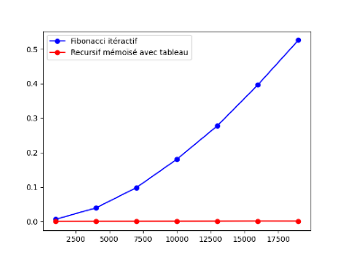

|
**Activité n° AUTONUM  \* Arabic : Suite de fibonacci avec mémoïsation avec un dictionnaire:** 

def fibonacci\_mem3(n, F={0:0, 1:1}): `    `pass

Tester avec n =6, 10, 100,… y a-t-il un problème ?
|
| - |

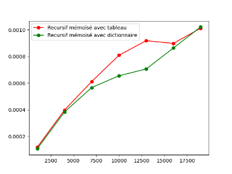

L'accès à un élément d'un dictionnaire est en O(1).

Pour une liste c'est O(n). Du coup, on pourrait s'attendre à une complexité linéaire avec le dictionnaire, mais quadratique avec la liste.

Dans les 2 cas on voit quelque chose qu'on pourrait **qualifier de pseudo linéaire....**

La liste est moins efficace, c'est donc normal, mais la différence n'est pas drastique. En fait, on accède toujours aux 2 derniers éléments de la liste. Dans ce cas, le processeur garde à porté de la main les données qui vont servir à chaque itération. A porté de la main ? En cache !

1. **La suite de Fibonacci : approche de bas en haut**

|
**Activité n° AUTONUM  \* Arabic : Suite de fibonacci approche de bas en haut :** 

def fiboMonte(n) : `    `fib=[0 for \_ in range(n + 2)] `    `fib[1] = 1 `    `for i in range(2, n+1) : `        `fib[i] = fib[i - 1] + fib[i - 2] `    `return fib[n]

Tester avec n =6, 10, 100,… y a-t-il un problème ?
|
| - |

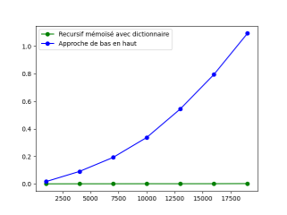

1. **La suite de Fibonacci : version pythonesque**

|
**Activité n° AUTONUM  \* Arabic : Suite de fibonacci approche de bas en haut version pythonesque :** 

def fiboMonte2(n) : `    `a = b = 1 `    `for i in range(3, n + 1) : `        `a, b = a+b, a `    `return a

Tester avec n =6, 10, 100,… y a-t-il un problème ?
|
| - |

On a dit que c'est linéaire....Regardons pour de plus grandes valeurs de n ....

Avec la version montante, sans récursion, on peut aller très loin. Voyez les 2 courbes ci-dessous, on dirait du **O(n²).**

On peut explorer des grandes valeurs de n :⏳ Il faut un peu de patience ...

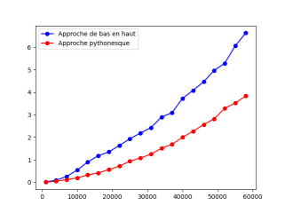

Merci à Mireille Coilhac

1. **L’optimisation du problème du rendu de monnaie**

La programmation dynamique qui consiste à résoudre un problème en le décomposant en sous-problèmes, puis à résoudre les sous-problèmes des plus petits au plus grands, en stockant des résultats intermédiaires, permet d’aboutir rapidement à un résultat optimal en examinant tous les cas possibles : ce qu’on appelle **force brute**.

Les **algorithmes gloutons** utilisés pour la résolution de ce même problème n’aboutissent pas forcément à un résultat optimal voir ne trouvent aucun résultat.

**Enoncé du problème** : étant donné un système de monnaie (billets et pièces), comment rendre une somme de façon optimale c’est-à-dire avec le nombre minimal de pièces et de billets.

1. **Le rendu de monnaie en force brute**

L’approche de force brute pour le problème du rendu de monnaie consiste à **essayer toutes les combinaisons possibles de pièces jusqu’à ce que nous trouvions la solution**. C’est une approche simple mais elle peut être très lente pour de grandes sommes d’argent car elle calcule les mêmes résultats plusieurs fois.

|
**Activité n° AUTONUM  \* Arabic : Force Brute** Dans un fichier rendu\_monnaie écrire un programme dans le cas d’un rendu de 6€

def rendre\_monnaie\_brute(monnaie, somme):      `    `return …

  if \_\_name\_\_ == "\_\_main\_\_": `    `monnaie = [1, 3, 4] `    `somme = 6 `    `assert rendre\_monnaie\_brute(monnaie, somme)== [[0, 2, 0], [2, 0, 1], [3, 1, 0], [6, 0, 0]]

|
| - |
Notez que cette approche **peut être très lente** pour de grandes sommes d’argent car elle calcule les mêmes résultats plusieurs fois. 

1. **Application classique avec les algorithmes gloutons**

L’algorithme glouton pour le problème du rendu de monnaie fonctionne en prenant toujours la plus grande pièce possible jusqu’à ce que toute la monnaie soit rendue. C’est une approche simple et efficace qui fonctionne bien lorsque l’ensemble des pièces est canonique. Les algorithmes gloutons permettent de trouver une solution mais ce n’est **pas toujours une solution optimale**.

|
**Activité n° AUTONUM  \* Arabic : Algorithme glouton** Dans un fichier rendu\_monnaie implémenter le script suivant. 

Tester le programme avec 6 €

def rendre\_monnaie\_glouton(monnaie, somme): `    `# Trier la liste des pièces en ordre décroissant `    `pass

 `    `# Initialiser le résultat `    `pass  `    `# Pour chaque pièce `    `pass `        `# Tant que la somme est supérieure ou égale à la valeur de la pièce `        `pass `            `# Soustraire la valeur de la pièce de la somme `            `pass  `            `# Ajouter la pièce au résultat `            `pass `    `return resultat    if \_\_name\_\_ == "\_\_main\_\_": `    `monnaie = [1, 3, 4] `    `somme = 6 `    `assert rendre\_monnaie\_glouton(monnaie, somme) ==[1, 0, 2]

|
| - |

L’algorithme glouton retourne au mieux 3 billets/pièces

Mais la **solution optimale est 2**. Ici, l’algorithme glouton donne une solution mais ce n’est **pas la solution optimale, car le système de monnaie choisi n’est pas canonique,** ce qui n’est pas le cas des euros

Comment rendre la monnaie avec l’algorithme glouton précédent ? => on est bloqué car lorsqu’on exécute l’algorithme glouton, **une fois la décision prise on ne peut pas revenir en arrière**.

Par contre, l’algorithme glouton **est souvent très rapide** devant l’algorithme de force brute.

La complexité de l'algorithme glouton pour le problème du rendu de monnaie est **linéaire**

1. **Approche récursive**

|
**Activité n° AUTONUM  \* Arabic : Récursif** Dans un fichier rendu\_monnaie Écrire le programme récursif qui renvoie le nombre de pièces rendues

def rendre\_monnaie\_rec(monnaie, somme): `    `# Initialiser le nombre minimum de pièces `    `min\_pieces = float('inf')  `    `# Vérifier si la somme est dans la liste des pièces `    `pass `    `else: `        `# Pour chaque pièce dont la valeur est inférieure à la somme `        `pass `                `# Compter le nombre de pièces en utilisant la récursion `                `pass `                `# Si le nbre de pièces est < au minimum, mettre à jour le minimum `                `pass `    `return min\_pieces

  if \_\_name\_\_ == "\_\_main\_\_": `    `monnaie = [1, 3, 4] `    `somme = 6 `    `assert rendre\_monnaie(monnaie, somme)==2

|
| - |
Dans cet exemple, rendre\_monnaie est une fonction récursive qui prend en entrée une liste de pièces et une somme à rendre. Elle retourne le **nombre minimum de pièces** nécessaires pour rendre cette somme. 

- Si la somme est dans la liste des pièces, elle retourne 1. 
- Sinon, elle essaie de rendre la monnaie pour chaque pièce dont la valeur est inférieure à la somme et garde le minimum. 

À la fin, elle retourne le nombre minimum de pièces nécessaires pour rendre la somme. Si la somme ne peut pas être rendue avec les pièces disponibles, elle retourne la somme elle-même, ce qui est le pire cas possible. 

|**Activité n° AUTONUM  \* Arabic : Récursif** : Décrire en quoi cette approche est une application de la méthode « diviser pour régner ».|
| - |

L’arbre des appels récursifs : 

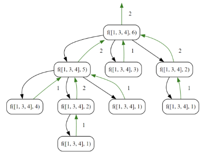

<https://www.recursionvisualizer.com/?function_definition=def%20f%28monnaie%2C%20somme%29%3A%0A%20%20%20%20%23%20Initialiser%20le%20nombre%20minimum%20de%20pi%C3%A8ces%0A%20%20%20%20min_pieces%20%3D%20float%28'inf'%29%0A%0A%20%20%20%20%23%20V%C3%A9rifier%20si%20la%20somme%20est%20dans%20la%20liste%20des%20pi%C3%A8ces%0A%20%20%20%20if%20somme%20in%20monnaie%3A%0A%20%20%20%20%20%20%20%20return%201%0A%20%20%20%20else%3A%0A%20%20%20%20%20%20%20%20%23%20Pour%20chaque%20pi%C3%A8ce%20dont%20la%20valeur%20est%20inf%C3%A9rieure%20%C3%A0%20la%20somme%0A%20%20%20%20%20%20%20%20for%20piece%20in%20monnaie%20%3A%0A%20%20%20%20%20%20%20%20%20%20%20%20if%20piece%20%3C%3D%20somme%3A%0A%20%20%20%20%20%20%20%20%20%20%20%20%20%20%20%20%23%20Compter%20le%20nombre%20de%20pi%C3%A8ces%20en%20utilisant%20la%20r%C3%A9cursion%0A%20%20%20%20%20%20%20%20%20%20%20%20%20%20%20%20nb_pieces%20%3D%20min%28min_pieces%2C%201%20%2B%20f%28monnaie%2C%20somme-piece%29%29%0A%0A%20%20%20%20%20%20%20%20%20%20%20%20%20%20%20%20%23%20%20%20Si%20le%20nombre%20de%20pi%C3%A8ces%20est%20inf%C3%A9rieur%20au%20minimum%20actuel%2C%20mettre%20%C3%A0%20jour%20le%20minimum%0A%20%20%20%20%20%20%20%20%20%20%20%20%20%20%20%20if%20nb_pieces%20%3C%20min_pieces%3A%0A%20%20%20%20%20%20%20%20%20%20%20%20%20%20%20%20%20%20%20%20min_pieces%20%3D%20nb_pieces%0A%20%20%20%20return%20min_pieces&function_call=f%28%5B1%2C%203%2C%204%5D%2C%206%29>

- Sur le schéma, **tous les cas sont "traités**" (quand un algorithme "traite" tous les cas possibles, on parle souvent de méthode "brute force").
- pour certains cas, on se retrouve dans une "impasse" (cas où on termine par un "1"), dans cette situation, la fonction renvoie "inf" ce qui permet de s'assurer que cette "solution"ne sera pas "retenue".
- la profondeur minimum de l'arbre (avec une feuille 0) est de 2, la solution au problème est donc 2 (il existe plusieurs parcours : (1,1,4), (1,4,1), (4,1,1.) qui donne à chaque fois 3 mais un  seul parcours qui donne 2 (3,3)

Il y a trop d’appels, il est trop lent à cause de **calculs répétitifs**

1. **Programmation dynamique** 

Pour éviter de résoudre plusieurs fois le même problème (comme pour Fibonacci), on **mémorise** (dans un tableau ou une table de hachage) les arguments pour lesquels la fonction récursive a déjà été calculée. On choisit de **calculer tous les résultats des sous-problèmes**, en commençant par les plus simples et en finissant par les plus compliqués, ce qui permet de supprimer la récursivité.

On donne l'algorithme suivant :

fonction rendu\_monnaie\_dyna(somme\_à\_rendre, système)
`   `nb ← tableau contenant les entiers de 0 à somme\_à\_rendre
`   `pour s allant de 1 à somme\_à\_rendre
`      `pour toutes les pièces p du système
`         `si p ≤ s alors
`            `nb[s] ← minimum(nb[s], 1 + nb[s-p])
`         `fin si
`      `fin pour
`   `fin pour
`   `renvoyer nb[somme]
fin fonction
1. ### ***Première approche : A la main***

|
**Activité n° AUTONUM  \* Arabic : programmation dynamique du rendu de monnaie**: On exécute l'instruction rendu\_monnaie\_dyna(5, [2, 1]).

1. Quel est la somme à rendre et quel est le système monétaire utilisé ?

2. Décrire ci-dessous les différentes étapes lors de l'exécution de cette instruction.
|
| - |
1. ### **Implémentation**

|
**Activité n° AUTONUM  \* Arabic : programmation dynamique du rendu de monnaie**: 

1. Implémenter l’algorithme précédent

2. On exécute l'instruction suivante : rendu\_monnaie\_dyna(10, [9, 3, 2]) La réponse est-elle correcte ? Pourquoi cela se produit-il ? Comment pourrait-on y remédier ?
|
| - |

Dans cette fonction, on a deux boucles emboitées qui contiennent **une opération en temps constant** (calcul d'un minimum). Le temps d'exécution est alors **proportionnel au produit du nombre de pièces du système par la somme**. C'est plus long que pour l'algorithme glouton mais on obtient **une solution optimale** avec tous les systèmes de pièces qui contiennent la pièce de valeur 1 Par contre, cette amélioration nécessite un **plus grand espace mémoire** avec le tableau.
1. ### **Deuxième approche : pour aller plus loin**
Dans le code précédent, on calcule le nombre de pièces correspondant à la solution optimale, mais on ne précise pas comment cette solution a été obtenue. Pire, la fonction renvoie une solution (un nombre de pièces), alors que celle-ci n'est pas solution de notre problème 

On propose ci-dessous une fonction permettant, non seulement de calculer le nombre de pièces utiles, mais aussi la combinaison des pièces à rendre et on gère également le cas où le rendu est impossible.

def rendu\_monnaie\_dyna\_combi(somme\_à\_rendre, système):
`    `'''
`    `Renvoie une liste minimale de pièces constituant la combinaison des pièces à rendre pour le rendu
`    `de la somme donnée avec le système de pièces donné.
`    `La fonction renvoie [-1] quand le rendu est impossible.
`    `'''
`    `combi = [[0 for k in range(s)] for s in range(0,somme\_à\_rendre+1)]
`    `for s in range(1,somme\_à\_rendre+1):
`        `for piece in système:
`            `if piece <= s:
`                `if len(combi[s]) > 1+len(combi[s-piece]) or 0 in combi[s]:
`                    `combi[s] = combi[s-piece] + [piece]
`    `if 0 in combi[somme\_à\_rendre]: # somme impossible à réaliser
`        `return [-1]
`    `return combi[somme\_à\_rendre]

\# quelques exemples
assert rendu\_monnaie\_dyna\_combi(49, [50, 20, 10, 5, 2, 1]) == [2, 2, 5, 20, 20] # système euro
assert rendu\_monnaie\_dyna\_combi(49, [30, 24, 12, 6, 3, 1]) == [1, 24, 24] # ancien système impérial britannique
assert rendu\_monnaie\_dyna\_combi(49, [9, 3, 2]) == [2, 2, 9, 9, 9, 9, 9] # système imaginaire
assert rendu\_monnaie\_dyna\_combi(5, [2, 1]) == [1, 2, 2]
assert rendu\_monnaie\_dyna\_combi(10, [9, 3, 2]) == [2, 2, 3, 3]
assert rendu\_monnaie\_dyna\_combi(1, [9, 3, 2]) == [-1]

|
**Activité n° AUTONUM  \* Arabic : dynamique** : 

1. Expliquer la ligne 7.

2. Expliquer le test de la ligne 11.

3. Que renvoie la fonction quand on l'exécute avec le système imaginaire et la somme  10 ? Expliquer
|
| - |

Merci à Charles Poulmaire

1. **Exercices :** 

**Exercice n°01 : le pb du sac à dos**

On rappelle le problème du sac à dos déjà vu en première : on dispose de *n* objets assimilables à des couples (valeur, poids) et d’un sac à dos qui peut porter un poids maximum *w*. L’objectif est de maximiser la valeur des objets contenus dans le sac.

Nous avons vu deux stratégies en première :

- force brute : tester toutes les combinaisons possibles, envisageable avec 20 objets par exemple, mais pas avec 60 objets.
- algorithmes gloutons :
  - glouton 1 : on prend d’abord les objets de valeurs maximales
  - glouton 2 : on prend d’abord les objets maximisant le rapport valeur/poids.

Les algorithmes gloutons sont très rapides, en O(<i>n log2</i>(<i>n</i>)) si on trie les objets suivant le critère choisi avec un bon algorithme de tri, mais ne garantissent pas d’obtenir la meilleure solution.

**Résolution par programmation dynamique**

On peut construire une solution optimale du problème à *i* objets à partir d’une résolution du problème à *i* – 1 objets.

Supposons qu’on a résolu le problème à *i* – 1 objets pour un poids maximal *p* allant de 0 à *w*.

On rajoute un <i>i</i>-ème objet (<i>vi</i>, <i>pi</i>). Alors, une solution optimale du problème à <i>i</i> objets avec un poids maximal de <i>w</i> est :

- soit une solution optimale du problème à *i* – 1 objets avec le poids maximal *w*
- soit une solution optimale du problème à <i>i</i> – 1 objets avec le poids maximal <i>w</i> – <i>pi</i> à laquelle on ajoute le <i>i</i>-ème objet.

On résout donc successivement les problèmes à 1 objet, 2 objets, 3 objets, … pour les poids allant de 0 à *w*. On présente les solutions dans un tableau. Le contenu du tableau dépend de l’ordre des objets mais pas la dernière ligne.

**Exemple**

Résolution du problème du sac à dos avec la liste objets = [(3, 2), (8, 10), (2, 2), (8, 1), (4, 6), (6, 6)] et le poids maximal *w* = 10 kg. Les objets sont au format (valeur, poids).

|objets\poids|0|1|2|3|4|5|6|7|8|9|10|
| :-: | :-: | :-: | :-: | :-: | :-: | :-: | :-: | :-: | :-: | :-: | :-: |
|0|0|0|0|0|0|0|0|0|0|0|0|
|1|0|0|3|3|3|3|3|3|3|3|3|
|2|0|0|3|3|3|3|3|3|3|3|8|
|3|0|0|3|3|5|5|5|5|5|5|8|
|4|0|8|8|11|11|13|13|13|13|13|13|
|5|0|8|8|11|11|13|13|13|13|15|15|
|6|0|8|8|11|11|13|13|14|14|17|17|

La valeur maximale est 17, atteinte avec un poids de 9 kg. Puisque cette valeur n’est pas atteinte avec 5 objets, on a pris l’objet n°6, qui pèse 6 kg, donc il reste 9 – 6 = 3 kg pour 5 objets. Pour 5 objets, la valeur maximale atteinte avec 3 kg est égale à 11, c’est la même avec 4 objets. On n’a donc pas pris l’objet n°5, mais on a pris l’objet n°4 qui pèse 1 kg, donc il reste 2 kg pour 3 objets, ce qui permet une valeur égale à 3, déjà atteinte avec l’objet n°1.

On obtient donc la valeur optimale de 17 avec les objets 1, 4, 6.

**Exercice**

Même exercice avec objets = [(5, 3), (9, 2), (10, 5), (6, 4), (7, 1), (9, 3)]** et** *w* = 10.

**Algorithme**

1. Écrire l’algorithme en langage naturel permettant, à partir d’une liste d’objets au format (valeur, poids) et d’un poids maximal *w* de construire le tableau des solutions du problème du sac à dos comme ci-dessus.

1. Écrire l’algorithme renvoyant une solution optimale à partir du tableau précédent.

***ou***

Expliquer la démarche en français le plus précisément possible.

1. Quelle est la complexité, en temps et en mémoire, de cette méthode de résolution ?

**Programmation**

Ouvrir le fichier sacados\_eleve.py.

1. Écrire la fonction tableau\_kp\_dynamique(objets, w) qui renvoie le tableau donnant les solutions optimales pour 0 à len(objets) objets et des poids de 0 à w.

   Exécuter le code pour tester votre fonction.

1. Écrire la fonction kp\_dynamique(objets, w), qui utilise la fonction tableau\_kp\_dynamique(objets, w) et renvoie la valeur maximale et une liste d’objets réalisant cette valeur. 

   Exécuter la fonction test\_dynamique() pour tester votre fonction.

**

**Exercice n° 2 : le problème de la découpe**

Une scierie récupère des troncs d'arbre de 10 mètres et plus pour en faire des planches.

Voici le prix moyen des planches qu'elle peut vendre actuellement en fonction de la longueur de la planche :

|Longueur (m)|1|2|3|4|5|6|7|8|9|10|
| :-: | :-: | :-: | :-: | :-: | :-: | :-: | :-: | :-: | :-: | :-: |
|Prix|1|5|8|9|10|17|17|20|24|30|

1. Quelle est la meilleure découpe à faire pour des planches de 2 mètres ?
1. Quelle est la meilleure découpe à faire pour des planches de 3 mètres ? Utilisez le résultat de la question précédente pour connaître la découpe optimale pour moins de 3 mètres.
1. Quelle est la meilleure découpe à faire pour des planches de 4 mètres ? Utilisez les résultats des questions précédentes pour connaître la découpe optimale pour moins de 4 mètres.
1. Quelle est la meilleure découpe à faire pour des planches de 5 mètres ? Utilisez les résultats des questions précédentes pour connaître la découpe optimale pour moins de 5 mètres.
1. Quelle est la meilleure découpe à faire pour des planches de 6 mètres ? Utilisez les résultats des questions précédentes pour connaître la découpe optimale pour moins de 6 mètres.
1. Quelle est la meilleure découpe à faire pour des planches de 7 mètres ? Utilisez les résultats des questions précédentes pour connaître la découpe optimale pour moins de 7 mètres.
1. Expliquer comment fonctionne l'appel decoupe\_optimale(prix, 7)

def decoupe\_optimale(p, lg\_max):
`    `'''Renvoie au final le prix maximum qu'on peut obtenir à partir des prix p'''
`    `m = [-math.inf for i in range(len(p))]
`    `m[0] = 0
`    `m[1] = p[1]
`    `return dr(lg\_max, p, m)

def dr(lg, p, m):
`    `'''Renvoie le prix maximum d'une planche de longueur lg'''
`    `# dr pour découpe récursive
`    `if m[lg] != -math.inf:  # condition d'arrêt
`        `return m[lg]
`    `else:
`        `# 1 - on fixe le prix à - l'infini pour cette lg
`        `prix\_max = -math.inf
`        `# 2 - on cherche le prix pour les différentes découpes
`        `for i in range(1, lg + 1):  # 
`            `prix\_max = max(prix\_max, p[i] + dr(lg - i, p, m))
`        `# 3 - on mémoïse le prix max pour cette longueur de planche
`        `m[lg] = prix\_max
`        `# 4 - on répond à l'appel
`        `return prix\_max

1. **Projet : le triangle de Pascal**

**Principe :** 

En mathématiques, le triangle de Pascal est une présentation des coefficients binomiaux dans un triangle. Il fut nommé ainsi en l’honneur du mathématicien français Blaise Pascal. Il est connu sous l’appellation « triangle de Pascal » en Occident, bien qu’il fût étudié par d’autres mathématiciens, parfois plusieurs siècles avant lui.

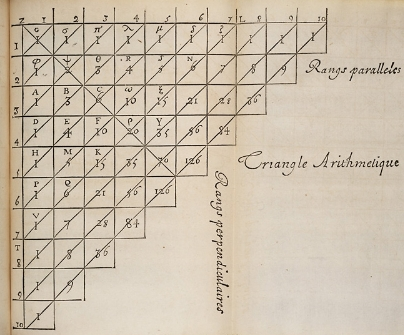

[premières lignes du triangle de Pascal](https://commons.wikimedia.org/w/index.php?curid=3105222)

Cette figure permet de calculer les coefficients binomiaux d’un polynôme (x+y) à la puissance n:

n=2,x+y2= x2+2xy+y2

n=3,x+y3= x3+3x2y+3xy2+y3

n=4,x+y4= x4+4x3y+6x2y2+4xy3+y4

voir compléments sur la page wikipedia : [Lien](https://fr.wikipedia.org/wiki/Triangle_de_Pascal)

**Propriétés :** 

- Il est possible de calculer directement un coefficient binomial à l’aide de cette formule
  - Cnk=n!k!n-k!
- Un coefficient quelconque du triangle, situé à la ligne i et à la colonne j est calculé à partir de la formule de récurrence : (i et j supérieurs à 1)

Cij=Ci-1j-1+Ci-1j

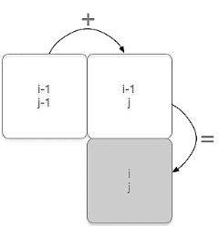

Dans le triangle ci-dessous, cela signifie :

1. qu’on remplit les lignes une par une,
1. qu’on ajoute deux valeurs voisine d’une même ligne pour obtenir celle sous la valeur de droite.

Par exemple le *3* est obtenu en faisant *1 + 2 = 3* (ses voisins du dessus)

1. Compléter le triangle de Pascal suivant

   |**n\k**|**0**|**1**|**2**|**3**|**4**|**5**|**6**|**7**|
   | :-: | :-: | :-: | :-: | :-: | :-: | :-: | :-: | :-: |
   |0|1||||||||
   |1|1|1|||||||
   |2|**1**|**2**|1||||||
   |3|1|**3**|||||||
   |4|||||||||
   |5|||||||||
   |6|||||||||
   |7|||||||||

1. Ecrire des fonctions factorielle(n) et binome(n,k) qui permettent de calculer respectivement n ! et Cnk avec la première formule. Il faudra tenir compte des cas k =0 et k>n (dans ce cas là le coefficient binomial vaut 0)

   Test :

\>>> binome(3,2)

3

\>>> binome(2,3)

0

\>>> binome(3,0)

1

1. Ecrire une fonction récursive binome\_rec(n, k) qui calcule le coefficient binomial avec le deuxième formule

1. Affichage de tous les coefficient binomiaux pour une valeur de n donnée : écrire une fonction pascal(n)  qui prend en paramètre la valeur de n et qui retourne tous les coefficients binomiaux de n = 0 à n = 9 et de k = 0 à k = 9

   Test :

\>>> pascal(9)

[[1, 0, 0, 0, 0, 0, 0, 0, 0, 0],
[1, 1, 0, 0, 0, 0, 0, 0, 0, 0],
[1, 2, 1, 0, 0, 0, 0, 0, 0, 0],
[1, 3, 3, 1, 0, 0, 0, 0, 0, 0],
[1, 4, 6, 4, 1, 0, 0, 0, 0, 0],
[1, 5, 10, 10, 5, 1, 0, 0, 0, 0],
[1, 6, 15, 20, 15, 6, 1, 0, 0, 0],
[1, 7, 21, 35, 35, 21, 7, 1, 0, 0],
[1, 8, 28, 56, 70, 56, 28, 8, 1, 0],
[1, 9, 36, 84, 126, 126, 84, 36, 9, 1]]

On remarque que l’on calcule souvent les mêmes coefficients binomiaux :

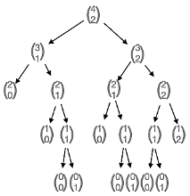

arbre de calcul des coefficients pour n=4 p=2

La mémoïsation consistera alors à stocker dans un tableau les solutions pour les sous-problèmes afin de ne pas les recalculer…

1. Écrire une fonction pascal\_dyn(n) utilisant la programmation dynamique qui calcule et affiche les coefficient binomiaux pour une valeur de n entrée en paramètre

Terminale NSI 	Chap 11 : Programmation dynamique	Page 1/6
