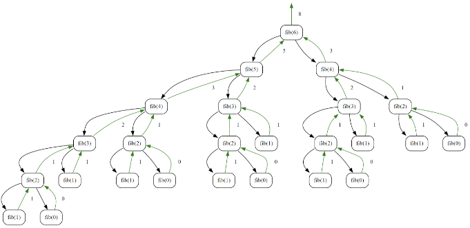
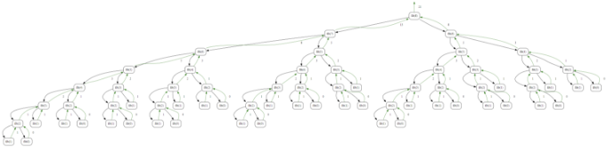
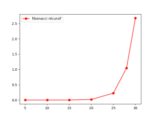
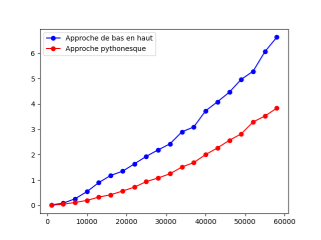
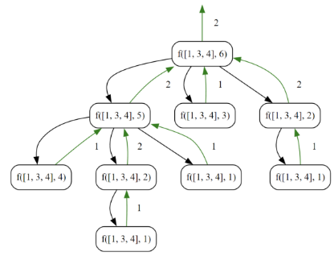
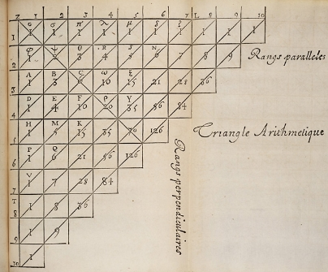
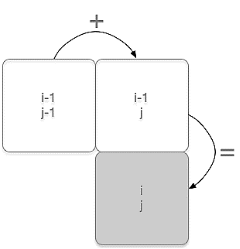
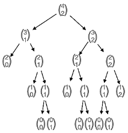

---
author: ELP
title: 11 Programmation dynamique
---


**Table des matières**

1. [Paradigmes algorithmiques](#_toc159507072)  
2. [Programmation dynamique de la suite de Fibonacci](#_toc159507076)  
3. [L’optimisation du problème du rendu de monnaie](#_toc159507082)  
4. [Exercices](#_toc159507090)  
5. [Projet : le triangle de Pascal](#_toc159507091)  


**🎯 Compétences évaluables :**

- Utiliser la **programmation dynamique** pour écrire un algorithme

---


## <H2 STYLE="COLOR:BLUE;"> <a name="_toc159507072"></a>**🧵 1. Paradigmes algorithmiques**</H2>

### <H3 STYLE="COLOR:GREEN;"><a name="_toc159507073"></a>**✨ 1.1. L’algorithme glouton**</H3>

🧠 Lorsque l’on utilise un algorithme glouton, on applique le **paradigme glouton**.  
Ce paradigme est très utilisé pour les **problèmes d’optimisation**.

🔎 **Caractéristiques importantes :**

- 🧱 **Construction incrémentale**  
  La solution est construite **étape par étape**.  
  À chaque étape, on choisit **la meilleure option immédiate** (la plus prometteuse) selon une règle simple.

- 🎯 **Optimalité locale**  
  Le choix est **optimal localement**, mais cela ne garantit **pas** une solution optimale au final.  
  👉 Cependant, dans certains problèmes, l’optimalité locale suffit.

- 🧭 **Heuristique**  
  L’algorithme glouton peut être une **heuristique**  (méthode de résolution qui privilégie des solutions **approximatives**) :  
  une méthode qui donne parfois une solution **approchée** (sous-optimale), mais rapide.

???+ question "🧠 Mini-question — Comprendre le glouton"
    👉 Pourquoi dit-on que l’algorithme glouton fait des choix « localement optimaux » ?

    ??? success "✅ Réponse attendue"
        Parce qu’à **chaque étape**, il choisit la meilleure option **sur le moment**, sans garantir que ce choix mène à la meilleure solution **globale**.

---

### <H3 STYLE="COLOR:GREEN;"><a name="_toc159507074"></a>**🪁 1.2. Diviser pour régner**</H3>

✂️ Ce paradigme consiste à :

1. **Diviser** le problème en sous-problèmes **indépendants** (qui ne se chevauchent pas)
2. **Résoudre** chaque sous-problème
3. **Combiner** les solutions pour obtenir la solution finale

💡 **Exemples classiques :**
- tri fusion
- recherche dichotomique

---

### <H3 STYLE="COLOR:GREEN;"><a name="_toc159507075"></a>**🧩 1.3. La programmation dynamique**</H3>

🧩 La **programmation dynamique** est un paradigme algorithmique adapté aux **problèmes d’optimisation**.  
Elle repose sur une idée clé : **éviter de recalculer plusieurs fois les mêmes sous-problèmes**.

✅ Points essentiels :

1. 🧱 **Décomposition en sous-problèmes**  
   On découpe un problème en sous-problèmes **plus simples**.

2. 💾 **Stockage des résultats (mémoïsation)**  
   On conserve les résultats intermédiaires dans un **tableau** ou une **matrice**.

3. 🏁 **Principe d’optimalité de Bellman**  
   Une solution optimale peut être construite en assemblant des solutions optimales de sous-problèmes.

4. 🔼🔽 **Deux approches**

   - 🔼 **Approche ascendante**  
     On part des cas simples (**petits n**) et on remonte jusqu’au problème final.

   - 🔽 **Approche descendante**  
     On part du problème final et on calcule les sous-problèmes en mémorisant.

???+ question "🧠 Mini-question — Identifier la programmation dynamique"
    👉 Quel est le *but principal* de la programmation dynamique ?

    ??? success "✅ Réponse attendue"
        Le but est d’**éviter les recalculs**, en mémorisant les résultats des sous-problèmes déjà résolus.

---

## <H2 STYLE="COLOR:BLUE;"> <a name="_toc159507076"></a>**🛡️ 2. Programmation dynamique de la suite de Fibonacci**</H2>

👉 **CAPYTALE** : le code vous sera fourni par votre enseignant.

📌 Définition mathématique :

```text
Fn = 0              si n = 0
     1              si n = 1
     F(n−1)+F(n−2)   si n > 1
```

---

### <H3 STYLE="COLOR:GREEN;"><a name="_toc159507077"></a>**🧫 2.1. Fibonacci : algorithme itératif**</H3>

🧠 La version itérative a déjà été vue en première.
Elle est rapide car elle calcule les valeurs **une seule fois**.

???+ question "🧠 **Activité n° 1 — Fibonacci (version itérative)**"
    👉 Tester la fonction suivante pour `n = 6`.


    ```python
    def fibonacci_iteratif(n):
        u, v = 0, 1
        for i in range(n-1):
            u, v = v, u+v
        return v
    ```

    🧪 Tester ensuite avec `n = 10`, `n = 100`, …  
    ❓ Y a-t-il un problème ?

    ??? success "✅ Solution (méthode attendue)"
        ✔️ Pour `n = 6` → **8**  
        ✔️ Pour `n = 10` → **55**

        ✅ Pour `n = 100`, ça reste **rapide** car :
        - on fait une boucle de taille `n` → complexité **O(n)**
        - Python gère les grands entiers automatiquement

        ✅ Conclusion : la version itérative est **efficace**.
    

---

### <H3 STYLE="COLOR:GREEN;"><a name="_toc159507078"></a>**🎯 2.2. Fibonacci : algorithme récursif (naïf)**</H3>

🧠 La version récursive suit directement la définition, mais elle est souvent **très inefficace**.

???+ question "🧠 **Activité n° 2 — Fibonacci (récursif naïf)**"
    👉 Tester la fonction suivante pour `n = 6`.

    ```python
    def fibonacci_recursif(n):
        if n == 0 or n == 1:
            return n
        else:
            return fibonacci_recursif(n-1) + fibonacci_recursif(n-2)
    ```

    🧪 Tester ensuite avec `n = 10`, `n = 30`, `n = 40`, …  
    ❓ Que constates-tu ?

    ??? success "✅ Solution (méthode attendue)"
        ✔️ Pour `n = 6`, on obtient **8** (même résultat que l’itératif).

        ⚠️ Mais dès que `n` devient grand :
        - le programme devient **très lent**
        - on a l’impression que ça “bloque” (souvent dès `n ≈ 35-40`)

        ✅ Explication :
        - la fonction recalculent plusieurs fois les mêmes valeurs (ex : `fib(2)`, `fib(3)`, etc.)
        - le nombre d’appels augmente de manière **exponentielle**

        👉 Conclusion : il faut **mémoriser** les résultats → programmation dynamique.
    

---

Cette fonction est **très peu performante.**

En effet, programmer récursivement cette suite est contre-productif, car elle nécessite de résoudre plusieurs fois le **même sous-problème** (un même terme). Elle ne mémorise pas les termes déjà calculés pour s’en resservir.

Pour `n = 6`, il est possible d’illustrer le fonctionnement de ce programme avec le graphe des appels récursifs suivant :

[lien](https://www.recursionvisualizer.com/?function_definition=def%20fib%28n%29%20%3A%0A%20%20%20%20if%20n%20%3D%3D%200%20or%20n%20%3D%3D%201%20%3A%0A%20%20%20%20%20%20%20%20return%20n%0A%20%20%20%20else%20%3A%0A%20%20%20%20%20%20%20%20return%20fib%28n-1%29%2Bfib%28n-2%29%0A&function_call=fib%286%29)



On voit bien que certaines valeurs sont **calculées plusieurs fois.**

Et les appels augmentent de manière exponentielle comme on peut le voir dans l’arbre des appels de `fib(8)` :

[lien](https://www.recursionvisualizer.com/?function_definition=def%20fib%28n%29%20%3A%0A%20%20%20%20if%20n%20%3D%3D%200%20or%20n%20%3D%3D%201%20%3A%0A%20%20%20%20%20%20%20%20return%20n%0A%20%20%20%20else%20%3A%0A%20%20%20%20%20%20%20%20return%20fib%28n-1%29%2Bfib%28n-2%29%0A&function_call=fib%288%29)



Il faut donc **mémoriser ces valeurs** : on va utiliser un tableau (structure de stockage).

De plus, l'utilisation de ce tableau va permettre de transformer cet **algorithme récursif en un itératif** :
il suffit de changer l'ordre de parcours ; au lieu de diminuer de `n` à `1` et `0` comme dans l'algorithme récursif, il suffit d'augmenter dans le tableau de `0` et `1` à `n`.




### <H3 STYLE="COLOR:GREEN;"><a name="_toc159507079"></a>**🎭 2.3. La suite de Fibonacci : avec mémoïsation (top-down)**</H3>

🧠 Dans cette partie, on améliore l’algorithme récursif naïf en appliquant le principe de **mémoïsation**.

👉 L’idée est de :

- ✏️ partir d’un **algorithme récursif naïf** (comme précédemment),
- 💾 **mémoriser les résultats** déjà calculés dans une structure (liste ou dictionnaire),
- 🚀 **réduire drastiquement le temps de calcul**,
- 🔁 tendre vers une transformation du raisonnement récursif en **approche optimisée**.

---

???+ question "🧠 **Activité n° 3 — Fibonacci avec mémoïsation (liste, top-down)**"
    👉 Étudier le principe de la **mémoïsation**.

    ```python
    # initialisation d'un tableau contenant des -1
    F = [-1] * 101

    def fibonacci_mem(n):
        pass
    ```

    🧪 Tester avec `n = 6`, `n = 10`, `n = 100`  
    ❓ Y a-t-il encore un problème de performance ?

    🔗 Visualisation des appels récursifs :  
    [lien](https://www.recursionvisualizer.com/?function_definition=F%20%3D%20%5B-1%5D*101%0A%0Adef%20fibonacci_mem%28n%29%3A%0A%20%20%20%20if%20n%20%3D%3D%200%20or%20n%20%3D%3D%201%20%3A%0A%20%20%20%20%20%20%20%20return%20n%0A%20%20%20%20else%20%3A%0A%20%20%20%20%20%20%20%20if%20F%5Bn%5D%20%3D%3D%20-1%3A%0A%20%20%20%20%20%20%20%20%20%20%20%20F%5Bn%5D%20%3D%20fibonacci_mem%28n-1%29%2Bfibonacci_mem%28n-2%29%0A%20%20%20%20%20%20%20%20return%20F%5Bn%5D%0A%0A&function_call=fibonacci_mem%286%29)

    ??? success "✅ Solution (méthode attendue)"
        ```python
        F = [-1] * 101

        def fibonacci_mem(n):
            if n == 0 or n == 1:
                return n
            if F[n] == -1:
                F[n] = fibonacci_mem(n-1) + fibonacci_mem(n-2)
            return F[n]
        ```

        ✔️ Les résultats sont désormais **mémorisés** dans la liste `F`.

        ✔️ Chaque valeur de Fibonacci est calculée **une seule fois**.

        ✔️ Les performances sont **très fortement améliorées**, même pour `n = 100`.

---

#### 🔼 **Pourquoi parle-t-on d’approche **top-down** ?**

On parle d’approche **top-down** parce que :

- 🔹 La fonction `fibonacci_mem(n)` **appelle récursivement**  
  `fibonacci_mem(n-1)` et `fibonacci_mem(n-2)`.

- 🔹 On part du **problème global** (calculer le terme `n`)  
  et on le décompose en **sous-problèmes de plus en plus petits**,  
  jusqu’aux **cas de base** (`n == 0` ou `n == 1`).

- 🔹 À chaque appel récursif, on **mémorise** le résultat dans la structure `F`,  
  afin **d’éviter de recalculer** plusieurs fois les mêmes valeurs.

👉 Cela correspond exactement à la définition de la **programmation dynamique top-down avec mémoïsation**.

💡 **Remarque** :  
On peut bien sûr intégrer la création de la structure de mémoïsation directement dans la fonction,  
afin d’obtenir un code **plus élégant** et plus autonome.

---

???+ question "🧠 **Activité n° 4 — Fibonacci avec mémoïsation intégrée (liste, top-down)**"
    👉 Observer une version plus compacte et plus élégante.

    ```python
    def fibonacci_mem2(n, F=[0, 1]):
        if n >= len(F):
            F.append(fibonacci_mem2(n-1, F) + fibonacci_mem2(n-2, F))
        return F[n]
    ```

    🧪 Tester avec `n = 6`, `n = 10`, `n = 100`  
    ❓ Y a-t-il un problème ?

    ??? success "✅ Solution (analyse attendue)"
        ✔️ Cette version est **correcte** et très efficace.

        ⚠️ Attention toutefois :
        - l’argument `F` est une **liste mutable par défaut**
        - son contenu est **conservé entre deux appels successifs**

        👉 Ce comportement est acceptable ici, mais doit être **maîtrisé**.

---


???+ question "🧠 **Activité n° 5 — Fibonacci avec mémoïsation (dictionnaire, top-down)**"
    👉 Comparer la mémoïsation avec une **liste** et avec un **dictionnaire**.

    ```python
    def fibonacci_mem3(n, F={0: 0, 1: 1}):
        pass
    ```

    🧪 Tester avec `n = 6`, `n = 10`, `n = 100`

    ??? success "✅ Solution (méthode attendue)"
        ```python
        def fibonacci_mem3(n, F={0: 0, 1: 1}):
            if n not in F:
                F[n] = fibonacci_mem3(n-1, F) + fibonacci_mem3(n-2, F)
            return F[n]
        ```

        ✔️ L’accès à un élément du dictionnaire est en **O(1)** en moyenne.

        ✔️ L’accès à un élément d’une liste par indice est aussi en **O(1)**.

        👉 Dans ce problème précis, **les performances sont comparables**.

---


#### 🧠 **Liste ou dictionnaire : quel impact sur les performances ?**

L’accès à un élément d’un **dictionnaire** se fait en **O(1) en moyenne**, grâce à l’utilisation d’une **table de hachage**.

Pour une **liste**, l’accès à un élément par son indice (`L[i]`) est également en **O(1)**.  
En revanche, rechercher une valeur sans connaître son indice (`x in L`) est en **O(n)**, car il faut parcourir la liste.

Dans le cas de la suite de Fibonacci en **programmation dynamique**, on accède toujours aux éléments **par indice connu**.  
👉 La complexité d’accès est donc **O(1) dans les deux cas** (liste ou dictionnaire).

On pourrait s’attendre à ce que le dictionnaire soit plus efficace grâce à sa **flexibilité**, et que la liste soit moins performante.  
En pratique, la différence n’est pas aussi marquée. Pourquoi ?

🔍 **Explication** :

- Dans l’algorithme de Fibonacci, on accède **toujours aux deux dernières valeurs calculées**.
- Ces valeurs sont stockées dans des emplacements mémoire **contigus** dans le cas d’une liste.
- Le processeur exploite alors la **mémoire cache**, qui conserve à portée immédiate les données récemment utilisées.

👉 Cette **localité mémoire** permet un traitement très rapide, malgré la simplicité apparente de la liste.

📈 **Bilan sur la complexité** :

On observe ainsi, **en pratique**, un temps de calcul **proportionnel à n dans les deux cas**  
(cette situation est parfois qualifiée de **complexité pseudo-linéaire**). 

On parle parfois de pseudo-linéaire car le nombre d’opérations dépend aussi de la taille des nombres manipulés

➡️ La liste, bien que moins souple qu’un dictionnaire, profite pleinement de la mémoire cache, ce qui la rend **très compétitive en pratique** pour ce type d’algorithme.

🧩 **À retenir** :
- Liste et dictionnaire offrent ici des performances **comparables**
- Le **contexte d’utilisation** est plus important que la structure elle-même
- La programmation dynamique repose autant sur la **stratégie algorithmique** que sur le **choix de la structure de données**

---

### <H3 STYLE="COLOR:GREEN;"><a name="_toc159507080"></a>**🪁 2.4. La suite de Fibonacci : approche de bas en haut (bottom-up)**</H3>

🧱 Cette fois, on change complètement de stratégie.

➡️ On ne part plus du problème global, mais des **cas de base**, que l’on combine progressivement.

---

???+ question "🧠 **Activité n° 6 — Fibonacci approche bottom-up**"
    👉 Implémenter la version **ascendante** de Fibonacci.

    ```python
    def fiboMonte(n):
        fib = [0 for _ in range(n + 2)]
        fib[1] = 1
        for i in range(2, n + 1):
            fib[i] = fib[i - 1] + fib[i - 2]
        return fib[n]
    ```

    🧪 Tester avec `n = 6`, `n = 10`, `n = 100`

    ??? success "✅ Solution (analyse attendue)"
        ✔️ Cette version est **itérative**.

        ✔️ Chaque valeur est calculée **une seule fois**.

        ✔️ Il n’y a **aucun appel récursif**, donc aucun surcoût.

        ✔️ La complexité est **O(n)** en temps et **O(n)** en mémoire.

---


#### 🔍 **Exemple d’exécution : `fiboMonte(5)`**

- Initialisation : `fib = [0, 1, 0, 0, 0, 0, 0]`

- Boucle :
  - `i = 2` → `fib[2] = 1`
  - `i = 3` → `fib[3] = 2`
  - `i = 4` → `fib[4] = 3`
  - `i = 5` → `fib[5] = 5`

- Résultat retourné : **5**

---

#### 🔽 **L’approche **bottom-up** (de bas en haut)**

L’approche **bottom-up** consiste à :

- 🔹 **Résoudre d’abord les plus petits sous-problèmes**, souvent les **cas de base**  
  (par exemple `fibo(0)` et `fibo(1)`).

- 🔹 **Construire progressivement la solution finale**  
  en remontant pas à pas vers le problème global.

- 🔹 Utiliser une structure **itérative**  
  (généralement une **boucle**) plutôt que la récursion.

- 🔹 **Éviter** les appels multiples et coûteux de fonctions **récursives**,  
  ce qui améliore fortement les performances.


### <H3 STYLE="COLOR:GREEN;"><a name="_toc159507081"></a>**✨ 2.5. La suite de Fibonacci : version pythonesque**</H3>

🧠 Jusqu’ici, nous avons vu plusieurs versions de Fibonacci en programmation dynamique.  
Il existe une version encore plus efficace, très compacte, qui exploite parfaitement les
capacités du langage Python.

---

???+ question "🧠 **Activité n° 7 — Fibonacci bottom-up (version pythonesque)**"
    👉 On considère la fonction suivante :

    ```python
    def fiboMonte2(n):
        a = b = 1
        for i in range(3, n + 1):
            a, b = a + b, a
        return a
    ```

    🧪 **Travail demandé** :
    - Tester la fonction pour `n = 6`, `n = 10`, `n = 100`
    - Puis tester avec des valeurs **beaucoup plus grandes**

    ❓ **Question** :  
    Observe-t-on un problème ? Le temps d’exécution évolue-t-il comme prévu ?

    ??? success "✅ Analyse et réponse attendues"
        ✔️ La fonction est correcte et renvoie les bonnes valeurs.

        ✔️ Elle utilise une approche **bottom-up** :
        - pas de récursion
        - une simple boucle
        - seulement **deux variables**

        ✔️ En nombre d’itérations, la complexité est bien **O(n)**.

        ⚠️ Cependant, pour de très grandes valeurs de `n`,  
        le temps d’exécution **augmente plus vite qu’on ne l’imaginait**.

---

#### 📈 **Une impression trompeuse : « on dirait du O(n²) »**

On a montré que l’algorithme est **linéaire**.  
Pourtant, lorsqu’on observe les temps d’exécution pour de très grandes valeurs de `n`,
la courbe **semble se courber**, donnant l’impression d’un comportement en **O(n²)**.

⏳ On peut explorer des valeurs très grandes de `n`…  
il faut simplement **un peu de patience**.



🙏 Merci à Mireille Coilhac

---

#### ❓ **Pourquoi cette impression de ralentissement ?**

🔁 Dans l’approche bottom-up **avec liste** (vue précédemment), Python doit :

- accéder à **deux cases mémoire** (`i-1` et `i-2`) à chaque itération ;
- gérer une **structure dynamique** (la liste), ce qui introduit un léger surcoût
  lorsque la liste devient grande.

Même si chaque accès est en **O(1)**,  
la **latence mémoire** et la gestion de la structure peuvent provoquer des **ralentissements**.

---

#### 🔍 **La raison principale (à ne pas oublier)**

👉 Le ralentissement observé ne vient pas seulement de la structure utilisée.

- Les termes de la suite de Fibonacci deviennent **très grands**.
- Les entiers Python ont une **taille variable**.
- Additionner deux très grands entiers **n’est plus une opération constante**.

📌 Le temps d’exécution dépend donc aussi de la **taille des nombres manipulés**,  
et pas uniquement du nombre d’itérations.

---

#### ⚡ **Pourquoi la version pythonesque est la plus rapide en pratique**

L’approche pythonesque :

- ❌ n’utilise **aucune structure dynamique** (pas de liste) ;
- ✔️ se limite à **deux entiers**, stockés dans des variables locales ;
- ✔️ exploite très efficacement la **mémoire cache du processeur**.

👉 **Bilan** :

- Les deux algorithmes sont en **O(n)** en nombre d’itérations ;
- Mais le **coefficient caché** est beaucoup plus faible pour cette version ;
- 👉 C’est pourquoi elle est **nettement plus rapide en pratique**.

🧩 **À retenir** :
- Complexité théorique ≠ temps mesuré
- Les détails d’implémentation comptent
- Python gère des entiers arbitrairement grands → impact réel sur les performances

## <H2 STYLE="COLOR:BLUE;"> <a name="_toc159507082"></a>**🎯 3. L’optimisation du problème du rendu de monnaie**</H2>

🧠 La **programmation dynamique** consiste à résoudre un problème en le :

- 🔹 **décomposant en sous-problèmes**,
- 🔹 résolvant **du plus petit au plus grand**,
- 🔹 **mémorisant** les résultats intermédiaires afin d’éviter les calculs redondants.

Cette approche permet d’aboutir efficacement à une solution **optimale**, en explorant **tous les cas possibles**, mais de manière **structurée et non redondante**.

👉 À l’inverse, la **force brute** explore également tous les cas,  
mais **sans mémorisation** ni stratégie, ce qui la rend très coûteuse en temps.

🟡 Les **algorithmes gloutons**, quant à eux, procèdent différemment :
- ils font des **choix successifs immédiats** selon un critère **local** (le “meilleur choix à court terme”),
- ils sont souvent **rapides**,
- mais ils **ne garantissent pas toujours** une solution optimale.

---

#### 🪙 **Énoncé du problème**

📌 Étant donné un système de monnaie (billets et pièces),  
comment rendre une somme de façon **optimale**,  
c’est-à-dire avec le **nombre minimal de pièces et de billets** ?

---

!!! info "🧠 **Capytale : Les codes seront fournis par votre enseignant : TNSI_11_méthode gloutonne et programmation dynamique_TD.**"


### <H3 STYLE="COLOR:GREEN;"><a name="_toc159507083"></a>**📀 3.1. Le rendu de monnaie en force brute**</H3>

🔍 L’approche de **force brute** pour le problème du rendu de monnaie consiste à :

- **tester toutes les combinaisons possibles** de pièces,
- jusqu’à trouver **toutes les solutions valides**.

👉 Cette méthode est simple à comprendre,  
mais elle devient **très lente** lorsque la somme à rendre augmente,  
car **les mêmes sous-problèmes sont recalculés plusieurs fois**.

---

???+ question "🧠 **Activité n° 8 — Rendu de monnaie en force brute**"
    👉 Dans un fichier `rendu_monnaie.py`, écrire un programme permettant de trouver  
    **toutes les combinaisons possibles** pour rendre une somme de **6 €**.

    ```python
    def rendre_monnaie_brute(monnaie, somme):
        pass


    if __name__ == "__main__":
        monnaie = [1, 3, 4]
        somme = 6
        assert rendre_monnaie_brute(monnaie, somme) == [
            [0, 2, 0],
            [2, 0, 1],
            [3, 1, 0],
            [6, 0, 0]
        ]
    ```

    🧪 **Travail demandé** :
    - comprendre ce que représente chaque liste de résultats,
    - vérifier que toutes les combinaisons possibles sont bien présentes.

    ??? success "✅ Solution (principe attendu)"
        ✔️ L’algorithme explore **toutes les possibilités**.

        ✔️ Chaque solution correspond à une combinaison de pièces :
        - `[0, 2, 0]` → 2 pièces de 3 €
        - `[2, 0, 1]` → 2 pièces de 1 € et 1 pièce de 4 €
        - etc.

        ⚠️ Les mêmes sous-problèmes sont recalculés plusieurs fois.

        👉 Cette approche est **correcte**, mais **très inefficace** dès que la somme augmente.

---

📌 **À retenir** :

- ✔️ La force brute donne toujours des solutions correctes
- ❌ Elle n’est **pas adaptée** aux grandes sommes
- 🔁 Elle illustre parfaitement le besoin de **programmation dynamique**


### <H3 STYLE="COLOR:GREEN;"><a name="_toc159507084"></a>**🧮 3.2. Application classique avec les algorithmes gloutons**</H3>

🧠 Un **algorithme glouton** résout un problème en faisant, à chaque étape,
le **meilleur choix local possible**, sans jamais revenir en arrière.

Dans le cas du **rendu de monnaie**, cela consiste à :
- prendre **la plus grande pièce possible**,
- puis recommencer jusqu’à ce que toute la somme soit rendue.

✔️ Cette approche est **simple** et souvent **rapide**.  
❌ Mais elle **ne garantit pas toujours une solution optimale**.

👉 Elle fonctionne correctement lorsque le système de monnaie est **canonique**
(c’est le cas des euros), mais peut échouer pour d’autres systèmes.

---

???+ question "🧠 **Activité n° 9 — Rendu de monnaie avec un algorithme glouton**"
    👉 Dans un fichier `rendu_monnaie.py`, implémenter l’algorithme glouton suivant.  
    Tester le programme avec une somme de **6 €**.

    ```python
    def rendre_monnaie_glouton(monnaie, somme):
        # Trier la liste des pièces par ordre décroissant
        monnaie.sort(reverse=True)

        # Initialiser le résultat
        resultat = [0] * len(monnaie)

        # Pour chaque pièce
        for i in range(len(monnaie)):
            # Tant que la somme est supérieure ou égale à la valeur de la pièce
            while somme >= monnaie[i]:
                somme -= monnaie[i]
                resultat[i] += 1

        return resultat


    if __name__ == "__main__":
        monnaie = [1, 3, 4]
        somme = 6
        assert rendre_monnaie_glouton(monnaie, somme) == [1, 0, 2]
    ```

    🧪 **Travail demandé** :
    - exécuter le programme,
    - interpréter le résultat obtenu,
    - comparer avec la solution optimale.

    ??? success "✅ Analyse et résultat attendus"
        ✔️ L’algorithme glouton retourne :
        - `[1, 0, 2]` → 1 pièce de 4 € et 2 pièces de 1 €  
        👉 soit **3 pièces** au total.

        ❌ Or, la solution **optimale** est :
        - 2 pièces de 3 € → **2 pièces** seulement.

        ✔️ L’algorithme glouton trouve donc une solution,
        ❌ mais **pas la meilleure possible**.

        📌 Explication :
        - le système de monnaie `[1, 3, 4]` **n’est pas canonique**,
        - une fois une pièce choisie, l’algorithme **ne peut pas revenir en arrière**.

---

#### 🧠 **À retenir sur les algorithmes gloutons**

- ✔️ Ils sont **souvent très rapides** (beaucoup plus que la force brute).
- ❌ Ils **ne garantissent pas toujours** une solution optimale.
- 🔁 Une décision prise est **définitive**.
- 📈 Pour le rendu de monnaie, la complexité de l’algorithme glouton est **linéaire** par rapport à la somme rendue.

👉 Ce constat motive l’utilisation de la **programmation dynamique**,
qui permet de garantir une solution optimale **sans explorer inutilement tous les cas**.

!!! info "🧠 **Capytale : Les codes seront fournis par votre enseignant : TNSI_11_Programmation dynamique - rendu de monnaie**

### <H3 STYLE="COLOR:GREEN;"><a name="_toc159507085"></a>**🔎 3.3. Approche récursive**</H3>

🧠 Avant d’introduire la programmation dynamique pour le rendu de monnaie,
on commence par une **approche récursive naïve**.
Elle permet de bien comprendre le problème… mais aussi ses limites.

---

???+ question "🧠 **Activité n° 10 — Rendu de monnaie (approche récursive)**"
    👉 Tester la fonction récursive suivante
    qui **renvoie le nombre minimal de pièces** nécessaires pour rendre une somme donnée.

    ```python
    def rendre_monnaie_rec(monnaie, somme):
        # Initialiser le nombre minimum de pièces
        min_pieces = float('inf')

        # Vérifier si la somme correspond exactement à une pièce disponible
        if somme in monnaie:
            return 1
        else:
            # Pour chaque pièce dont la valeur est inférieure ou égale à la somme
            for piece in monnaie:
                if piece <= somme:
                    # Compter le nombre de pièces en utilisant la récursion
                    nb_pieces = 1 + rendre_monnaie_rec(monnaie, somme - piece)

                    # Mettre à jour le minimum si nécessaire
                    if nb_pieces < min_pieces:
                        min_pieces = nb_pieces

        return min_pieces


    if __name__ == "__main__":
        monnaie = [1, 3, 4]
        somme = 6
        assert rendre_monnaie_rec(monnaie, somme) == 2
    ```

    ??? success "✅ Explication de l’algorithme"
        ✔️ La fonction est **récursive**.

        ✔️ Cas simple :
        - si la somme correspond exactement à une pièce disponible,
          une seule pièce suffit → on retourne `1`.

        ✔️ Sinon :
        - la fonction essaie **toutes les pièces possibles**,
        - elle appelle récursivement la fonction pour la somme restante,
        - elle conserve la solution utilisant le **moins de pièces**.

        ✔️ À la fin, la fonction retourne le **minimum** parmi toutes les possibilités testées.

        ⚠️ Si la somme ne peut pas être rendue (cas non traité explicitement ici),
        la fonction retourne `float('inf')`, représentant un **pire cas**.

---

???+ question "🧠 **Activité n° 11 — Analyse de l’approche récursive**"
    👉 Expliquer en quoi cette méthode est une application du paradigme  
    **« diviser pour régner »**.

    ??? success "✅ Réponse attendue"
        ✔️ Le problème global (rendre une somme) est **divisé** en sous-problèmes :
        rendre `somme - pièce`.

        ✔️ Chaque sous-problème est **résolu indépendamment** par récursion.

        ✔️ Les solutions partielles sont ensuite **comparées** pour choisir la meilleure.

        👉 C’est exactement le principe du **diviser pour régner**.

---

#### 🌳 **Arbre des appels récursifs**

Le schéma suivant représente **tous les appels récursifs**
effectués par la fonction `rendre_monnaie_rec([1,3,4], 6)` :



🔗 Visualisation interactive :  
[lien](https://www.recursionvisualizer.com/?function_definition=def%20f%28monnaie%2C%20somme%29%3A%0A%20%20%20%20min_pieces%20%3D%20float%28%27inf%27%29%0A%20%20%20%20if%20somme%20in%20monnaie%3A%0A%20%20%20%20%20%20%20%20return%201%0A%20%20%20%20else%3A%0A%20%20%20%20%20%20%20%20for%20piece%20in%20monnaie%3A%0A%20%20%20%20%20%20%20%20%20%20%20%20if%20piece%20%3C%3D%20somme%3A%0A%20%20%20%20%20%20%20%20%20%20%20%20%20%20%20%20nb_pieces%20%3D%201%20%2B%20f%28monnaie%2C%20somme-piece%29%0A%20%20%20%20%20%20%20%20%20%20%20%20%20%20%20%20if%20nb_pieces%20%3C%20min_pieces%3A%0A%20%20%20%20%20%20%20%20%20%20%20%20%20%20%20%20%20%20%20%20min_pieces%20%3D%20nb_pieces%0A%20%20%20%20return%20min_pieces&function_call=f%28%5B1%2C%203%2C%204%5D%2C%206%29)

---

#### 🔍 **Analyse de l’arbre**

- ✔️ Tous les **chemins possibles** sont explorés → **force brute**.
- ❌ Certains chemins mènent à une **impasse** (somme impossible à rendre).
- 🔁 Les **mêmes sous-problèmes** sont recalculés plusieurs fois.
- 📉 La **profondeur minimale** de l’arbre est **2** :
  - solution optimale : `3 + 3`.

D’autres solutions valides comme `(1, 1, 4)` ou `(4, 1, 1)`
utilisent **3 pièces**, donc sont moins bonnes.

---

#### ⚠️ **Limite majeure de cette approche**

❗ Le principal problème de cette méthode est qu’elle **répète les mêmes calculs**.

👉 C’est exactement cette inefficacité qui va motiver l’utilisation
de la **programmation dynamique**, avec **mémoïsation**,
dans la partie suivante.


### <H3 STYLE="COLOR:GREEN;"><a name="_toc159507086"></a>**💡 3.4. Programmation dynamique**</H3>

🧠 Pour **optimiser** le problème du rendu de monnaie, on utilise la
**programmation dynamique**, selon deux approches possibles :

- 💾 **Mémoïsation (top-down)** : on mémorise les résultats intermédiaires ;
- 🔁 **Approche itérative (bottom-up)** : on élimine la récursion et on accélère fortement les calculs.

Dans les deux cas, l’objectif est le même :
👉 **éviter de recalculer plusieurs fois les mêmes sous-problèmes**.

---

### 📐 Algorithme de principe (bottom-up)

```
fonction rendu_monnaie_dyna(somme_à_rendre, système)
   nb ← tableau contenant les entiers de 0 à somme_à_rendre
   pour s allant de 1 à somme_à_rendre
      pour toutes les pièces p du système
         si p ≤ s alors
            nb[s] ← minimum(nb[s], 1 + nb[s-p])
         fin si
      fin pour
   fin pour
   renvoyer nb[somme]
fin fonction
```

📌 Cet algorithme :
- résout d’abord les **plus petites sommes**,
- construit progressivement la solution optimale,
- garantit une solution **optimale** si elle existe.

---

#### <H4 STYLE="COLOR:MAGENTA;"> <a name="_toc159507087"></a>**📗 3.4.1. Première approche : à la main**</H4>

???+ question "🧠 **Activité n° 12 — Programmation dynamique du rendu de monnaie (à la main)**"
    👉 On exécute l’instruction suivante :  
    `rendu_monnaie_dyna(5, [1, 2])`

    1. Quelle est la **somme à rendre** ?  
    2. Quel est le **système monétaire utilisé** ?  
    3. Décrire les **différentes étapes** de l’algorithme.

    ??? success "✅ Solution attendue"
        1. Somme à rendre :
        👉 La somme à rendre est 5.

        2\. Système monétaire utilisé :
        👉 Le système monétaire est composé des pièces de 1 € et 2 €.

        3\. Principe de l’algorithme :
        L’algorithme de programmation dynamique :

        - calcule successivement le nombre minimal de pièces nécessaires pour rendre les sommes de 1 jusqu’à la somme demandée ;

        - pour chaque somme intermédiaire, il teste toutes les pièces disponibles ;

        - il conserve, pour chaque somme, la meilleure solution trouvée (celle qui utilise le moins de pièces).

        👉 La présence de la pièce de 1 € garantit que toutes les sommes peuvent être rendues, ce qui permet à l’algorithme de fonctionner sans cas impossible.

---

## 🧠 **Initialisation**

On crée un tableau `nb` de taille `somme_à_rendre + 1` (ici de 0 à 5) :

```python
nb = [0, ∞, ∞, ∞, ∞, ∞]
```

* `nb[0] = 0` : il faut **0 pièce** pour rendre la somme 0.
* Les autres cases sont initialisées à l’infini (ou une grande valeur), car le nombre minimal de pièces n’est pas encore connu.

---

## 🔁 **Remplissage du tableau (approche bottom-up)**

On calcule progressivement `nb[s]` pour `s` allant de 1 à 5.

À chaque étape, on applique la formule :
[
nb[s] = \min_{p \le s}(1 + nb[s - p])
]

---

### 🔹 Étape **s = 1**

* Pièce `1` :

  * `1 ≤ 1` → `nb[1] = min(∞, 1 + nb[0]) = 1`

Résultat :

```python
nb = [0, 1, ∞, ∞, ∞, ∞]
```

👉 Il faut **1 pièce de 1 €** pour rendre 1.

---

### 🔹 Étape **s = 2**

* Pièce `1` :

  * `1 + nb[1] = 2`
* Pièce `2` :

  * `1 + nb[0] = 1` ✅

Résultat :

```python
nb = [0, 1, 1, ∞, ∞, ∞]
```

👉 Il faut **1 pièce de 2 €** pour rendre 2.

---

### 🔹 Étape **s = 3**

* Pièce `1` :

  * `1 + nb[2] = 2`
* Pièce `2` :

  * `1 + nb[1] = 2`

Résultat :

```python
nb = [0, 1, 1, 2, ∞, ∞]
```

👉 Il faut **2 pièces** (2 + 1) pour rendre 3.

---

### 🔹 Étape **s = 4**

* Pièce `1` :

  * `1 + nb[3] = 3`
* Pièce `2` :

  * `1 + nb[2] = 2` ✅

Résultat :

```python
nb = [0, 1, 1, 2, 2, ∞]
```

👉 Il faut **2 pièces de 2 €** pour rendre 4.

---

### 🔹 Étape **s = 5**

* Pièce `1` :

  * `1 + nb[4] = 3`
* Pièce `2` :

  * `1 + nb[3] = 3`

Résultat final :

```python
nb = [0, 1, 1, 2, 2, 3]
```

👉 Il faut **3 pièces** (2 + 2 + 1) pour rendre 5.

---

## ✅ **Résultat final**

La fonction renvoie :

```python
nb[5] = 3
```

👉 **Le nombre minimal de pièces nécessaires pour rendre la somme 5 est donc 3.**

---

## 🔚 **Résumé**

| Somme `s` | Meilleure solution | Nombre minimal de pièces |
| --------- | ------------------ | ------------------------ |
| 1         | 1                  | 1                        |
| 2         | 2                  | 1                        |
| 3         | 2 + 1              | 2                        |
| 4         | 2 + 2              | 2                        |
| 5         | 2 + 2 + 1          | 3                        |


--- 

#### <H4 STYLE="COLOR:MAGENTA;"> <a name="_toc159507088"></a>**📔 3.4.2. Implémentation**</H4>

???+ question "🧠 **Activité n° 13 — Implémentation de l’algorithme dynamique**"
    👉 
    1. Implémenter l’algorithme `rendu_monnaie_dyna`.
    2. Exécuter :  
       `rendu_monnaie_dyna(10, [9, 3, 2])`


    ??? success "✅ Analyse attendue"
        ```python
        def rendu_monnaie_dyna(somme_a_rendre, systeme):
            # Initialisation du tableau : +∞ sauf pour la somme 0
            nb = [float('inf')] * (somme_a_rendre + 1)  # ou from math import inf
            nb[0] = 0  # Il faut 0 pièce pour rendre 0

            for s in range(1, somme_a_rendre + 1):
                for p in systeme:
                    if p <= s:
                        nb[s] = min(nb[s], 1 + nb[s - p])

            return nb[somme_a_rendre]


        assert rendu_monnaie_dyna(5, [2, 1]) == 3
        ```


---


#### ✅ **La réponse est-elle correcte ?**

👉 **Oui, le résultat renvoyé par l’algorithme est correct**, même s’il peut paraître surprenant.

En effet, avec les pièces **9, 3 et 2**, **il est impossible de rendre la somme 10**.
Aucune combinaison de ces pièces ne permet d’obtenir exactement 10.

L’algorithme renvoie donc une valeur spéciale (`∞`, ou une grande valeur), ce qui signifie :

> *« La somme demandée n’est pas atteignable avec ce système de pièces. »*

---

#### ✅ **Pourquoi ce résultat apparaît-il ?**

La programmation dynamique repose sur le principe suivant :

> Pour pouvoir calculer correctement une somme `s`, **il faut que toutes les sous-sommes `s - p` soient atteignables**.

Dans ce cas :

* `10 - 9 = 1` ❌ impossible
* `10 - 3 = 7` ❌ impossible
* `10 - 2 = 8` ❌ impossible

Aucune sous-somme nécessaire n’est atteignable, donc :

* la case `nb[10]` **ne peut jamais être mise à jour**
* elle conserve sa valeur initiale (`∞`)

👉 **L’algorithme ne se trompe pas : il signale une impossibilité.**

---

#### ✅ **Comment corriger ou améliorer ce comportement ?**

Il ne s’agit pas de corriger l’algorithme, mais **d’améliorer son interface** pour gérer explicitement ce cas.

On peut par exemple :

* tester si la valeur finale est `∞`
* renvoyer une valeur spéciale (ex. `-1`) ou un message explicite

```python
def rendu_monnaie_dyna(somme, pieces):
    nb = [float('inf')] * (somme + 1)
    nb[0] = 0

    for s in range(1, somme + 1):
        for p in pieces:
            if p <= s:
                nb[s] = min(nb[s], 1 + nb[s - p])

    if nb[somme] == float('inf'):
        return -1  # somme impossible à rendre
    return nb[somme]
```


#### <H4 STYLE="COLOR:MAGENTA;"> <a name="_toc159507089"></a>**🖌️ 3.4.3. Deuxième approche : pour aller plus loin**</H4>

🧠 Dans l’implémentation précédente, on obtient uniquement le **nombre minimal de pièces**.

➡️ L’objectif est maintenant de retrouver **la combinaison exacte des pièces utilisées**  
et de gérer explicitement le cas où le rendu est **impossible**.

```python
def rendu_monnaie_dyna_combi(somme_à_rendre, système):
    '''
    Renvoie une liste minimale de pièces constituant la combinaison des pièces à rendre
    pour la somme donnée avec le système de pièces donné.
    La fonction renvoie [-1] lorsque le rendu est impossible.
    '''
    combi = [[0 for k in range(s)] for s in range(0, somme_à_rendre + 1)]
    for s in range(1, somme_à_rendre + 1):
        for piece in système:
            if piece <= s:
                if len(combi[s]) > 1 + len(combi[s - piece]) or 0 in combi[s]:
                    combi[s] = combi[s - piece] + [piece]
    if 0 in combi[somme_à_rendre]:
        return [-1]
    return combi[somme_à_rendre]
```

```python
# Quelques exemples
assert rendu_monnaie_dyna_combi(49, [50, 20, 10, 5, 2, 1]) == [2, 2, 5, 20, 20]
assert rendu_monnaie_dyna_combi(49, [30, 24, 12, 6, 3, 1]) == [1, 24, 24]
assert rendu_monnaie_dyna_combi(49, [9, 3, 2]) == [2, 2, 9, 9, 9, 9, 9]
assert rendu_monnaie_dyna_combi(5, [2, 1]) == [1, 2, 2]
assert rendu_monnaie_dyna_combi(10, [9, 3, 2]) == [2, 2, 3, 3]
assert rendu_monnaie_dyna_combi(1, [9, 3, 2]) == [-1]
```

---

???+ question "🧠 **Activité n° 14 — Analyse d’un algorithme dynamique avancé**"

    1. Expliquer la **ligne 7**.
    2. Expliquer le **test de la ligne 11**.
    3. Que renvoie la fonction pour le système `[9, 3, 2]` et la somme `10` ? Pourquoi ?

    ??? success "✅ Analyse attendue"
        #### 1️⃣ **Expliquer la ligne 7**

        ```python
        combi = [[0 for k in range(s)] for s in range(0, somme_à_rendre + 1)]
        ```

        👉 Cette ligne initialise un tableau `combi` tel que :

        * `combi[s]` contient **une combinaison de pièces** permettant de rendre la somme `s` ;
        * la présence du nombre `0` dans une combinaison signifie que **la somme n’est pas encore atteignable**.

        Ainsi :

        * `combi[0] = []` (rendre 0 est possible sans pièce)
        * pour les autres sommes, la combinaison contient au départ des `0`, servant de **sentinelle d’impossibilité**.


        #### 2️⃣ **Expliquer le test de la ligne 11**

        ```python
        if 0 in combi[somme_à_rendre]:
        ```

        👉 Ce test permet de vérifier si **aucune combinaison valide n’a été trouvée** pour la somme demandée.

        * Si `0` est encore présent dans `combi[somme_à_rendre]`, cela signifie que :

        * aucune mise à jour n’a permis de construire une combinaison valide ;
        * la somme est **impossible à rendre** avec le système de pièces donné.

        La fonction renvoie alors `[-1]`.


        #### 3️⃣ **Résultat pour le système `[9, 3, 2]` et la somme `10`**

        La fonction renvoie :

        ```python
        [2, 2, 3, 3]
        ```

        👉 Explication :

        * la somme `10` est atteignable avec les pièces `[9, 3, 2]` ;
        * la combinaison optimale utilise **4 pièces** :
        ( 2 + 2 + 3 + 3 = 10 ) ;
        * aucune combinaison utilisant moins de pièces n’existe ;
        * la programmation dynamique garantit donc une solution **optimale**.


🙏 Merci à Charles Poulmaire.


---


## <H2 STYLE="COLOR:BLUE;"> **4. 🔎 Exercices :**</H2>

!!! info "🧠 **Capytale : Les codes seront fournis par votre enseignant.**"

!!! abstract "🧩 **Exercice n°1 : le pb du sac à dos**"

    On rappelle le problème du sac à dos déjà vu en première : on dispose de *n* objets assimilables à des couples (valeur, poids) et d’un sac à dos qui peut porter un poids maximum *w*. L’objectif est de maximiser la valeur des objets contenus dans le sac.

    Nous avons vu deux stratégies en première :

    - force brute : tester toutes les combinaisons possibles, envisageable avec 20 objets par exemple, mais pas avec 60 objets.
    - algorithmes gloutons :
    - glouton 1 : on prend d’abord les objets de valeurs maximales.
    - glouton 2 : on prend d’abord les objets maximisant le rapport valeur/poids.

    Les algorithmes gloutons sont très rapides, en O(<i>n log<sub>2</sub></i>(<i>n</i>)) si on trie les objets suivant le critère choisi avec un bon algorithme de tri, mais ne garantissent pas d’obtenir la meilleure solution.

    **Résolution par programmation dynamique**

    On peut construire une solution optimale du problème à *i* objets à partir d’une résolution du problème à *i* – 1 objets.

    Supposons qu’on a résolu le problème à *i* – 1 objets pour un poids maximal *p* allant de 0 à *w*.

    On rajoute un <i>i</i>-ème objet (<i>v<sub>i</sub></i>, <i>p<sub>i</sub></i>). Alors, une solution optimale du problème à <i>i</i> objets avec un poids maximal de <i>w</i> est :

    - soit une solution optimale du problème à *i* – 1 objets avec le poids maximal *w*,
    - soit une solution optimale du problème à <i>i</i> – 1 objets avec le poids maximal <i>w</i> – <i>p<sub>i</sub></i> à laquelle on ajoute le <i>i</i>-ème objet.

    On résout donc successivement les problèmes à 1 objet, 2 objets, 3 objets, … pour les poids allant de 0 à *w*. On présente les solutions dans un tableau. Le contenu du tableau dépend de l’ordre des objets mais pas la dernière ligne.

    **Exemple**

    Résolution du problème du sac à dos avec la liste objets = [(3, 2), (8, 10), (2, 2), (8, 1), (4, 6), (6, 6)] et le poids maximal *w* = 10 kg. Les objets sont au format (valeur, poids).


    | Objets\Poids | 0  | 1  | 2  | 3  | 4  | 5  | 6  | 7  | 8  | 9  | 10 |
    |--------------|----|----|----|----|----|----|----|----|----|----|----|
    | 0            | 0  | 0  | 0  | 0  | 0  | 0  | 0  | 0  | 0  | 0  | 0  |
    | 1            | 0  | 0  | 3  | 3  | 3  | 3  | 3  | 3  | 3  | 3  | 3  |
    | 2            | 0  | 0  | 3  | 3  | 3  | 3  | 3  | 3  | 3  | 3  | 8  |
    | 3            | 0  | 0  | 3  | 3  | 5  | 5  | 5  | 5  | 5  | 5  | 8  |
    | 4            | 0  | 8  | 8  | 11 | 11 | 13 | 13 | 13 | 13 | 13 | 13 |
    | 5            | 0  | 8  | 8  | 11 | 11 | 13 | 13 | 13 | 13 | 15 | 15 |
    | 6            | 0  | 8  | 8  | 11 | 11 | 13 | 13 | 14 | 14 | 17 | 17 |


    La valeur maximale est 17, atteinte avec un poids de 9 kg. Puisque cette valeur n’est pas atteinte avec 5 objets, on a pris l’objet n°6, qui pèse 6 kg, donc il reste 9 – 6 = 3 kg pour 5 objets. Pour 5 objets, la valeur maximale atteinte avec 3 kg est égale à 11, c’est la même avec 4 objets. On n’a donc pas pris l’objet n°5, mais on a pris l’objet n°4 qui pèse 1 kg, donc il reste 2 kg pour 3 objets, ce qui permet une valeur égale à 3, déjà atteinte avec l’objet n°1.

    On obtient donc la valeur optimale de 17 avec les objets 1, 4, 6.

    **Exercice**

    Même exercice avec

    objets = [(5, 3), (9, 2), (10, 5), (6, 4), (7, 1), (9, 3)]** et** *w* = 10.

    **Algorithme**

    1\. Écrire l’algorithme en langage naturel permettant, à partir d’une liste d’objets au format (valeur, poids) et d’un poids maximal *w* de construire le tableau des solutions du problème du sac à dos comme ci-dessus.

    2\. Écrire l’algorithme renvoyant une solution optimale à partir du tableau précédent.

    ***ou***

    Expliquer la démarche en français le plus précisément possible.

    3\. Quelle est la complexité, en temps et en mémoire, de cette méthode de résolution ?

    **Programmation**

    Ouvrir le fichier sacados\_eleve.py.

    1\. Écrire la fonction tableau\_kp\_dynamique(objets, w) qui renvoie le tableau donnant les solutions optimales pour 0 à len(objets) objets et des poids de 0 à w.

    Exécuter le code pour tester votre fonction.

    2\. Écrire la fonction kp\_dynamique(objets, w), qui utilise la fonction tableau\_kp\_dynamique(objets, w) et renvoie la valeur maximale et une liste d’objets réalisant cette valeur. 

    Exécuter la fonction test\_dynamique() pour tester votre fonction.


!!! abstract "🧩 **Exercice n° 2 : le problème de la découpe**"

    Une scierie récupère des troncs d'arbre de 10 mètres et plus pour en faire des planches.

    Voici le prix moyen des planches qu'elle peut vendre actuellement en fonction de la longueur de la planche :

    |Longueur (m)|1|2|3|4|5|6|7|8|9|10|
    | :-: | :-: | :-: | :-: | :-: | :-: | :-: | :-: | :-: | :-: | :-: |
    |Prix|1|5|8|9|10|17|17|20|24|30|

    1. Quelle est la meilleure découpe à faire pour des planches de 2 mètres ?
    1. Quelle est la meilleure découpe à faire pour des planches de 3 mètres ? Utilisez le résultat de la question précédente pour connaître la découpe optimale pour moins de 3 mètres.
    1. Quelle est la meilleure découpe à faire pour des planches de 4 mètres ? Utilisez les résultats des questions précédentes pour connaître la découpe optimale pour moins de 4 mètres.
    1. Quelle est la meilleure découpe à faire pour des planches de 5 mètres ? Utilisez les résultats des questions précédentes pour connaître la découpe optimale pour moins de 5 mètres.
    1. Quelle est la meilleure découpe à faire pour des planches de 6 mètres ? Utilisez les résultats des questions précédentes pour connaître la découpe optimale pour moins de 6 mètres.
    1. Quelle est la meilleure découpe à faire pour des planches de 7 mètres ? Utilisez les résultats des questions précédentes pour connaître la découpe optimale pour moins de 7 mètres.
    1. Expliquer comment fonctionne l'appel decoupe\_optimale(prix, 7)

    ```python
    def decoupe_optimale(p, lg_max):
        '''Renvoie au final le prix maximum qu'on peut obtenir à partir des prix p'''
        m = [-math.inf for i in range(len(p))]
        m[0] = 0
        m[1] = p[1]
        return dr(lg_max, p, m)


    def dr(lg, p, m):
        '''Renvoie le prix maximum d'une planche de longueur lg'''
        # dr pour découpe récursive
        if m[lg] != -math.inf:  # condition d'arrêt
            return m[lg]
        else:
            # 1 - on fixe le prix à - l'infini pour cette lg
            prix_max = -math.inf
            # 2 - on cherche le prix pour les différentes découpes
            for i in range(1, lg + 1):  # 
                prix_max = max(prix_max, p[i] + dr(lg - i, p, m))
            # 3 - on mémoïse le prix max pour cette longueur de planche
            m[lg] = prix_max
            # 4 - on répond à l'appel
            return prix_max
    ```


## <H2 STYLE="COLOR:BLUE;"><a name="_toc159507091"></a>**5. 🔎 Projet </h2>**

!!! info "🧠 **Capytale : Les codes seront fournis par votre enseignant.**"

!!! abstract "🧩 **le triangle de Pascal**"

    **Principe :** 

    En mathématiques, le triangle de Pascal est une présentation des coefficients binomiaux dans un triangle. Il fut nommé ainsi en l’honneur du mathématicien français Blaise Pascal. Il est connu sous l’appellation « triangle de Pascal » en Occident, bien qu’il fût étudié par d’autres mathématiciens, parfois plusieurs siècles avant lui.

    

    [premières lignes du triangle de Pascal](https://commons.wikimedia.org/w/index.php?curid=3105222)

    Cette figure permet de calculer les coefficients binomiaux d’un polynôme (x+y) à la puissance n:

    $n=2,\left(x+y\right)^2=\ x^2+2xy+y^2$

    $n=3,\left(x+y\right)^3=\ x^3+3x^2y+3xy^2+y^3$

    $n=4,\left(x+y\right)^4=\ x^4+4x^3y+6x^2y^2+4xy^3+y^4$

    voir compléments sur la page wikipedia : [Lien](https://fr.wikipedia.org/wiki/Triangle_de_Pascal)

    **Propriétés :** 

    - Il est possible de calculer directement un coefficient binomial à l’aide de cette formule
    $C\left(\begin{matrix}n\\k\\\end{matrix}\right)=\frac{n!}{k!\left(n-k\right)!}$
    - Un coefficient quelconque du triangle, situé à la ligne i et à la colonne j est calculé à partir de la formule de récurrence : (i et j supérieurs à 1)

    $C\left(\begin{matrix}i\\j\\\end{matrix}\right)=C\left(\begin{matrix}i-1\\j-1\\\end{matrix}\right)+C\left(\begin{matrix}i-1\\j\\\end{matrix}\right)$

    

    Dans le triangle ci-dessous, cela signifie :

    1\. qu’on remplit les lignes une par une,
    2\. qu’on ajoute deux valeurs voisine d’une même ligne pour obtenir celle sous la valeur de droite.

    Par exemple le *3* est obtenu en faisant *1 + 2 = 3* (ses voisins du dessus)

    1\. Compléter le triangle de Pascal suivant

    |**n\k**|**0**|**1**|**2**|**3**|**4**|**5**|**6**|**7**|
    | :-: | :-: | :-: | :-: | :-: | :-: | :-: | :-: | :-: |
    |0|1||||||||
    |1|1|1|||||||
    |2|**1**|**2**|1||||||
    |3|1|**3**|||||||
    |4|||||||||
    |5|||||||||
    |6|||||||||
    |7|||||||||

    2\. Ecrire des fonctions factorielle(n) et binome(n,k) qui permettent de calculer respectivement n ! et Cnk avec la première formule. Il faudra tenir compte des cas k =0 et k>n (dans ce cas là le coefficient binomial vaut 0)

    Test :
    ```
    >>> binome(3,2)
    3
    >>> binome(2,3)
    0
    >>> binome(3,0)
    1
    ```

    3\. Ecrire une fonction récursive binome\_rec(n, k) qui calcule le coefficient binomial avec le deuxième formule

    4\. Affichage de tous les coefficient binomiaux pour une valeur de n donnée : écrire une fonction pascal(n)  qui prend en paramètre la valeur de n et qui retourne tous les coefficients binomiaux de n = 0 à n = 9 et de k = 0 à k = 9

    Test :
    ```
    >>> pascal(9)
    [[1, 0, 0, 0, 0, 0, 0, 0, 0, 0],
    [1, 1, 0, 0, 0, 0, 0, 0, 0, 0],
    [1, 2, 1, 0, 0, 0, 0, 0, 0, 0],
    [1, 3, 3, 1, 0, 0, 0, 0, 0, 0],
    [1, 4, 6, 4, 1, 0, 0, 0, 0, 0],
    [1, 5, 10, 10, 5, 1, 0, 0, 0, 0],
    [1, 6, 15, 20, 15, 6, 1, 0, 0, 0],
    [1, 7, 21, 35, 35, 21, 7, 1, 0, 0],
    [1, 8, 28, 56, 70, 56, 28, 8, 1, 0],
    [1, 9, 36, 84, 126, 126, 84, 36, 9, 1]]
    ```

    On remarque que l’on calcule souvent les mêmes coefficients binomiaux :

    

    arbre de calcul des coefficients pour n=4 p=2

    La mémoïsation consistera alors à stocker dans un tableau les solutions pour les sous-problèmes afin de ne pas les recalculer…

    5\. Écrire une fonction pascal\_dyn(n) utilisant la programmation dynamique qui calcule et affiche les coefficient binomiaux pour une valeur de n entrée en paramètre

