---
author: Elisabeth Le Prettre (LePrettre)
title: 11 Programmation dynamique
---


📚 **Table des matières**

1. [Paradigmes algorithmiques](#_toc159507072)  
2. [Programmation dynamique de la suite de Fibonacci](#_toc159507076)  
3. [L’optimisation du problème du rendu de monnaie](#_toc159507082)  
4. [Exercices](#_toc159507090)  
5. [Projet : le triangle de Pascal](#_toc159507091)  


**🎯 Compétences évaluables :**

- Utiliser la **programmation dynamique** pour écrire un algorithme

---


## <H2 STYLE="COLOR:BLUE;"> <a name="_toc159507072"></a>**🧵 1. Paradigmes algorithmiques**</H2>

### <H3 STYLE="COLOR:GREEN;"><a name="_toc159507073"></a>**✨ 1.1. L’algorithme glouton**</H3>

🧠 Lorsque l’on utilise un algorithme glouton, on applique le **paradigme glouton**.  
Ce paradigme est très utilisé pour les **problèmes d’optimisation**.

🔎 **Caractéristiques importantes :**

- 🧱 **Construction incrémentale**  
  La solution est construite **étape par étape**.  
  À chaque étape, on choisit **la meilleure option immédiate** (la plus prometteuse) selon une règle simple.

- 🎯 **Optimalité locale**  
  Le choix est **optimal localement**, mais cela ne garantit **pas** une solution optimale au final.  
  👉 Cependant, dans certains problèmes, l’optimalité locale suffit.

- 🧭 **Heuristique**  
  L’algorithme glouton peut être une **heuristique**  (méthode de résolution qui privilégie des solutions **approximatives**) :  
  une méthode qui donne parfois une solution **approchée** (sous-optimale), mais rapide.

???+ question "🧠 Mini-question — Comprendre le glouton"
    👉 Pourquoi dit-on que l’algorithme glouton fait des choix « localement optimaux » ?

    ??? success "✅ Réponse attendue"
        Parce qu’à **chaque étape**, il choisit la meilleure option **sur le moment**, sans garantir que ce choix mène à la meilleure solution **globale**.

---

### <H3 STYLE="COLOR:GREEN;"><a name="_toc159507074"></a>**🪁 1.2. Diviser pour régner**</H3>

✂️ Ce paradigme consiste à :

1. **Diviser** le problème en sous-problèmes **indépendants** (qui ne se chevauchent pas)
2. **Résoudre** chaque sous-problème
3. **Combiner** les solutions pour obtenir la solution finale

💡 **Exemples classiques :**

- tri fusion

- recherche dichotomique

---

### <H3 STYLE="COLOR:GREEN;"><a name="_toc159507075"></a>**🧩 1.3. La programmation dynamique**</H3>

🧩 La **programmation dynamique** est un paradigme algorithmique adapté aux **problèmes d’optimisation**.  
Elle repose sur une idée clé : **éviter de recalculer plusieurs fois les mêmes sous-problèmes**.

✅ Points essentiels :

1. 🧱 **Décomposition en sous-problèmes**  
   On découpe un problème en sous-problèmes **plus simples**.

2. 💾 **Stockage des résultats (mémoïsation)**  
   On conserve les résultats intermédiaires dans un **tableau** ou une **matrice**.

3. 🏁 **Principe d’optimalité de Bellman**  
   Une solution optimale peut être construite en assemblant des solutions optimales de sous-problèmes.

4. 🔼🔽 **Deux approches**


    - 🔼 **Approche ascendante**  
     On part des cas simples (**petits n**) et on remonte jusqu’au problème final.

    - 🔽 **Approche descendante**  
     On part du problème final et on calcule les sous-problèmes en mémorisant.

???+ question "🧠 Mini-question — Identifier la programmation dynamique"
    👉 Quel est le *but principal* de la programmation dynamique ?

    ??? success "✅ Réponse attendue"
        Le but est d’**éviter les recalculs**, en mémorisant les résultats des sous-problèmes déjà résolus.

---

## <H2 STYLE="COLOR:BLUE;"> <a name="_toc159507076"></a>**🛡️ 2. Programmation dynamique de la suite de Fibonacci**</H2>

!!! info "🧠 **Capytale : Le code vous sera fourni par votre enseignant**"

📌 Définition mathématique :

```text
Fn = 0              si n = 0
     1              si n = 1
     F(n−1)+F(n−2)   si n > 1
```

---

### <H3 STYLE="COLOR:GREEN;"><a name="_toc159507077"></a>**🧫 2.1. Fibonacci : algorithme itératif**</H3>

🧠 La version itérative a déjà été vue en première.
Elle est rapide car elle calcule les valeurs **une seule fois**.

???+ question "🧠 **Activité n° 1 — Fibonacci (version itérative)**"
    👉 Tester la fonction suivante pour `n = 6`.


    ```python
    def fibonacci_iteratif(n):
        if n == 0 : return 0
        u = 0   # u = F(i-2)
        v = 1   # v = F(i-1)
        for i in range(2, n + 1):
            temp = u + v   # temp = F(i)
            u = v          # u devient F(i-1) pour l'itération suivante
            v = temp       # v devient F(i)
        return v
    ```

    🧪 Tester ensuite avec `n = 10`, `n = 100`, …  

    ❓ Y a-t-il un problème ?

    ??? success "✅ Solution (méthode attendue)"

        ✔️ Pour `n = 6` → **8**  

        ✔️ Pour `n = 10` → **55**

        ✅ Pour `n = 100`, ça reste **rapide** car :

        - on fait une boucle de taille `n` → complexité **O(n)**

        - Python gère les grands entiers automatiquement

        ✅ Conclusion : la version itérative est **efficace**.
    

---

### <H3 STYLE="COLOR:GREEN;"><a name="_toc159507078"></a>**🎯 2.2. Fibonacci : algorithme récursif (naïf)**</H3>

🧠 La version récursive suit directement la définition, mais elle est souvent **très inefficace**.

???+ question "🧠 **Activité n° 2 — Fibonacci (récursif naïf)**"
    👉 Tester la fonction suivante pour `n = 6`.

    ```python
    def fibonacci_recursif(n):
        if n == 0 or n == 1:
            return n
        else:
            return fibonacci_recursif(n-1) + fibonacci_recursif(n-2)
    ```

    🧪 Tester ensuite avec `n = 10`, `n = 30`, `n = 40`, …  

    ❓ Que constates-tu ?

    ??? success "✅ Solution (méthode attendue)"
        ✔️ Pour `n = 6`, on obtient **8** (même résultat que l’itératif).

        ⚠️ Mais dès que `n` devient grand :

        - le programme devient **très lent**

        - on a l’impression que ça “bloque” (souvent dès `n ≈ 35-40`)

        ✅ Explication :

        - la fonction recalcule plusieurs fois les mêmes valeurs (ex : `fib(2)`, `fib(3)`, etc.)

        - le nombre d’appels augmente de manière **exponentielle**

        👉 Conclusion : il faut **mémoriser** les résultats → programmation dynamique.
    

---

Cette fonction est **très peu performante.**

En effet, programmer récursivement cette suite est contre-productif, car elle nécessite de résoudre plusieurs fois le **même sous-problème** (un même terme). Elle ne mémorise pas les termes déjà calculés pour s’en resservir.

Pour `n = 6`, il est possible d’illustrer le fonctionnement de ce programme avec l'arbre des appels récursifs suivant :

[lien](https://www.recursionvisualizer.com/?function_definition=def%20fib%28n%29%20%3A%0A%20%20%20%20if%20n%20%3D%3D%200%20or%20n%20%3D%3D%201%20%3A%0A%20%20%20%20%20%20%20%20return%20n%0A%20%20%20%20else%20%3A%0A%20%20%20%20%20%20%20%20return%20fib%28n-1%29%2Bfib%28n-2%29%0A&function_call=fib%286%29)

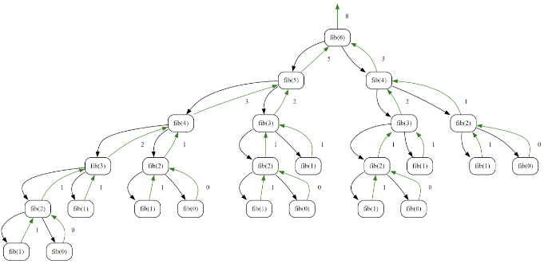

On voit bien que certaines valeurs sont **calculées plusieurs fois.**

Et les appels augmentent de manière exponentielle comme on peut le voir dans l’arbre des appels de `fib(8)` :

[lien](https://www.recursionvisualizer.com/?function_definition=def%20fib%28n%29%20%3A%0A%20%20%20%20if%20n%20%3D%3D%200%20or%20n%20%3D%3D%201%20%3A%0A%20%20%20%20%20%20%20%20return%20n%0A%20%20%20%20else%20%3A%0A%20%20%20%20%20%20%20%20return%20fib%28n-1%29%2Bfib%28n-2%29%0A&function_call=fib%288%29)

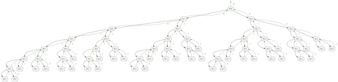

Il faut donc **mémoriser ces valeurs** : on va utiliser un tableau (structure de stockage).

De plus, l'utilisation de ce tableau va permettre de transformer cet **algorithme récursif en un itératif** :
il suffit de changer l'ordre de parcours ; au lieu de diminuer de `n` à `1` et `0` comme dans l'algorithme récursif, il suffit d'augmenter dans le tableau de `0` et `1` à `n`.

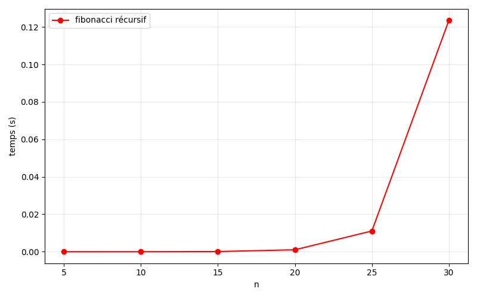

??? sucess "Script Python correspondant"
    ```python
    """
    Mesure du temps d'exécution de la version récursive naïve de Fibonacci.
    On observe une croissance exponentielle caractéristique.
    """

    import time
    import matplotlib.pyplot as plt


    def fibonacci_recursif(n):
        if n == 0 or n == 1:
            return n
        else:
            return fibonacci_recursif(n - 1) + fibonacci_recursif(n - 2)


    # Valeurs de n à tester : de 5 à 30 par pas de 5
    valeurs_n = list(range(5, 31, 5))
    temps = []

    print("Mesure des temps d'exécution :")
    print("-" * 30)
    for n in valeurs_n:
        debut = time.perf_counter()
        fibonacci_recursif(n)
        fin = time.perf_counter()
        duree = fin - debut
        temps.append(duree)
        print(f"  n = {n:2d}  →  {duree:.4f} s")

    # Tracé du graphique
    plt.figure(figsize=(8, 5))
    plt.plot(valeurs_n, temps, 'ro-', label='fibonacci récursif')
    plt.xlabel('n')
    plt.ylabel('temps (s)')
    plt.legend(loc='upper left')
    plt.grid(True, alpha=0.3)
    plt.tight_layout()
    plt.savefig('temps_fibonacci_recursif.png', dpi=100)
    plt.show()
    ```


### <H3 STYLE="COLOR:GREEN;"><a name="_toc159507079"></a>**🎭 2.3. La suite de Fibonacci : avec mémoïsation (top-down)**</H3>

🧠 Dans cette partie, on améliore l'algorithme récursif naïf en appliquant le principe de **mémoïsation**.

👉 L'idée est de :

- ✏️ partir d'un **algorithme récursif naïf** (comme précédemment),
- 💾 **mémoriser les résultats** déjà calculés dans une structure (liste ou dictionnaire),
- 🚀 **réduire drastiquement le temps de calcul**,
- 🔁 tendre vers une transformation du raisonnement récursif en **approche optimisée**.

---

???+ question "🧠 **Activité n° 3 — Fibonacci avec mémoïsation (liste, top-down)**"
    👉 On souhaite mémoriser les résultats déjà calculés dans une liste `F`,
    afin d'éviter de refaire les mêmes calculs plusieurs fois.

    **Compléter** la fonction `fibonacci_mem(n)` en suivant les indications :

    ```python
    # Tableau de mémoïsation : -1 signifie "pas encore calculé"
    # (les nombres de Fibonacci sont tous positifs ou nuls,
    #  donc -1 ne peut pas être confondu avec une vraie valeur).
    # La taille 101 permet de calculer jusqu'à F(100) inclus.
    F = [-1] * 101

    def fibonacci_mem(n):
        # 1. Traiter les cas de base : F(0) = 0 et F(1) = 1
        # 2. Sinon, si F[n] n'a pas encore été calculé (= -1),
        #    le calculer récursivement et le stocker dans F[n]
        # 3. Renvoyer F[n]
        pass
    ```

    🧪 Tester avec `n = 6`, `n = 10`, `n = 100`.  
    ❓ Y a-t-il encore un problème de performance ?

    🔗 **Visualiser** l'arbre des appels récursifs :  
    [lien](https://www.recursionvisualizer.com/?function_definition=F%20%3D%20%5B-1%5D*101%0A%0Adef%20fibonacci_mem%28n%29%3A%0A%20%20%20%20if%20n%20%3D%3D%200%20or%20n%20%3D%3D%201%20%3A%0A%20%20%20%20%20%20%20%20return%20n%0A%20%20%20%20else%20%3A%0A%20%20%20%20%20%20%20%20if%20F%5Bn%5D%20%3D%3D%20-1%3A%0A%20%20%20%20%20%20%20%20%20%20%20%20F%5Bn%5D%20%3D%20fibonacci_mem%28n-1%29%2Bfibonacci_mem%28n-2%29%0A%20%20%20%20%20%20%20%20return%20F%5Bn%5D%0A%0A&function_call=fibonacci_mem%286%29)

    👀 **Observer** : combien de fois `fib(2)` apparaît-il dans l'arbre ?
    Combien de fois `fib(3)` ? Comparer avec l'arbre des appels de l'activité 2.

    ??? success "✅ Solution (méthode attendue)"
        ```python
        F = [-1] * 101

        def fibonacci_mem(n):
            if n == 0 or n == 1:
                return n
            if F[n] == -1:
                F[n] = fibonacci_mem(n-1) + fibonacci_mem(n-2)
            return F[n]
        ```

        ✔️ Les résultats sont désormais **mémorisés** dans la liste `F`.

        ✔️ Chaque valeur de Fibonacci est calculée **une seule fois**.

        ✔️ Les performances sont **très fortement améliorées**, même pour `n = 100`.

        💡 **Un chiffre pour comprendre l'enjeu** — pour `n = 30` :

        | Version | Nombre d'appels récursifs |
        |---------|---------------------------|
        | naïve (activité 2) | **2 692 537** (≈ 2,7 millions) |
        | mémoïsation (activité 3) | **59** (soit `2n − 1`) |

        ⚠️ **Attention à la taille du tableau** : avec `F = [-1] * 101`,
        on ne peut calculer Fibonacci que jusqu'à `n = 100`.  
        Pour `n = 150`, on obtient une erreur `IndexError`.  
        Cette limitation sera levée dans l'activité 4 grâce à une
        mémoïsation **intégrée directement dans la fonction**.

---

#### 🔼 **Pourquoi parle-t-on d'approche **top-down** ?**

On parle d'approche **top-down** parce que :

- 🔹 La fonction `fibonacci_mem(n)` **appelle récursivement** `fibonacci_mem(n-1)` et `fibonacci_mem(n-2)`.

- 🔹 On part du **problème global** (calculer le terme `n`) et on le décompose en **sous-problèmes de plus en plus petits**, jusqu'aux **cas de base** (`n == 0` ou `n == 1`).

- 🔹 À chaque appel récursif, **si le résultat n'est pas encore connu**, on le calcule **et** on le mémorise dans la structure `F`, afin **d'éviter de recalculer** plusieurs fois les mêmes valeurs.

👉 Cela correspond exactement à la définition de la **programmation dynamique top-down avec mémoïsation**.

💡 **Remarque** :  

On peut bien sûr intégrer la création de la structure de mémoïsation directement dans la fonction, afin d'obtenir un code **plus élégant** et plus autonome — c'est l'objet de l'**activité 4**.


---


???+ question "🧠 **Activité n° 4 — Fibonacci avec mémoïsation intégrée (liste, top-down)**"
    👉 Pour s'affranchir de la **taille fixe** du tableau (activité 3, limité à `n = 100`),
    on intègre la mémoïsation **directement** dans la fonction grâce à un paramètre par défaut.

    ```python
    def fibonacci_mem2(n, F=[0, 1]):
        if n >= len(F):
            F.append(fibonacci_mem2(n-1, F) + fibonacci_mem2(n-2, F))
        return F[n]
    ```

    🧪 Tester avec `n = 6`, `n = 10`, `n = 100`, puis avec `n = 150`.

    ❓ Cette fois, l'erreur `IndexError` se produit-elle ?

    👀 **Observer plus finement** :

    - Faire un premier appel à `fibonacci_mem2(50)` (mesurer le temps).
    - Puis un second appel à `fibonacci_mem2(50)` (mesurer le temps).
    - Que constate-t-on ?

    ??? success "✅ Solution (analyse attendue)"
        ✔️ Cette version est **correcte** et très efficace.

        ✔️ **Plus de limite de taille** : la liste `F` s'agrandit dynamiquement
        avec `F.append(...)`. On peut calculer `fibonacci_mem2(150)`,
        `fibonacci_mem2(1000)`, etc. (sous réserve de la profondeur de récursion
        de Python).

        ⚠️ **Attention — piège classique de Python** :

        - L'argument `F=[0, 1]` est une **liste mutable utilisée comme valeur par défaut**.
        - Cette liste est créée **une seule fois**, à la définition de la fonction.
        - Tous les appels à `fibonacci_mem2(n)` (sans préciser `F`) **partagent donc la même liste**.

        👉 Conséquence : le contenu de `F` est **conservé entre deux appels successifs**.

        💡 **Ici, c'est plutôt un avantage** : après un premier appel à `fibonacci_mem2(50)`,
        un second appel à `fibonacci_mem2(50)` (ou même à `fibonacci_mem2(30)`)
        renvoie le résultat **instantanément**, sans aucun calcul.

        ⚠️ Ce comportement est **acceptable ici**, mais doit être **maîtrisé** :
        en général, il faut éviter d'utiliser une **structure mutable** comme
        valeur par défaut.

---

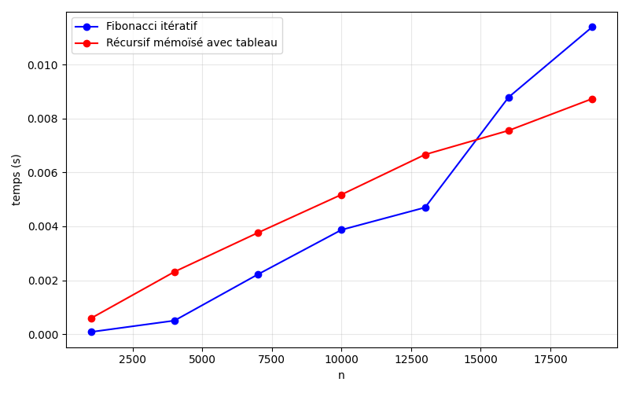

---

??? sucess "Script Python correspondant"
    ```python
    """
    Comparaison des temps d'exécution avec moyennage :
      - Fibonacci itératif (recalcule tout à chaque appel)
      - Fibonacci récursif mémoïsé avec tableau (cache persistant entre appels successifs)

    Pour réduire le bruit, on répète NB_REPETITIONS fois la séquence complète
    de mesures, et on prend la moyenne. Avant chaque répétition, le cache de la
    version mémoïsée est réinitialisé (sinon il serait conservé d'une répétition
    à l'autre et fausserait la mesure).
    """

    import sys
    import time
    import statistics
    import matplotlib.pyplot as plt

    sys.setrecursionlimit(25000)


    def fibonacci_iteratif(n):
        u = 0
        v = 1
        for i in range(2, n + 1):
            temp = u + v
            u = v
            v = temp
        return v


    def make_fibonacci_mem():
        """
        Crée une nouvelle fonction fibonacci_mem avec son propre cache F.
        À chaque appel de make_fibonacci_mem(), on obtient une fonction
        indépendante avec un cache vide. C'est ce qui nous permet de
        réinitialiser proprement le cache entre deux répétitions.
        """
        F = [0, 1]

        def fibonacci_mem(n):
            if n >= len(F):
                F.append(fibonacci_mem(n - 1) + fibonacci_mem(n - 2))
            return F[n]

        return fibonacci_mem


    # Paramètres
    NB_REPETITIONS = 10
    valeurs_n = list(range(1000, 19001, 3000))  # [1000, 4000, 7000, ..., 19000]

    # Stockage des temps : une liste de mesures par valeur de n
    temps_iteratif_all = [[] for _ in valeurs_n]
    temps_memoise_all = [[] for _ in valeurs_n]

    print(f"Mesure des temps sur {NB_REPETITIONS} répétitions...")

    for rep in range(NB_REPETITIONS):
        print(f"  Répétition {rep + 1}/{NB_REPETITIONS}")

        # Nouvelle instance de la fonction mémoïsée → cache vide
        fibonacci_mem = make_fibonacci_mem()

        for i, n in enumerate(valeurs_n):
            # Mesure itératif
            debut = time.perf_counter()
            fibonacci_iteratif(n)
            fin = time.perf_counter()
            temps_iteratif_all[i].append(fin - debut)

            # Mesure mémoïsé (le cache persiste à l'intérieur de la répétition)
            debut = time.perf_counter()
            fibonacci_mem(n)
            fin = time.perf_counter()
            temps_memoise_all[i].append(fin - debut)

    # Calcul des moyennes et écarts-types
    moyennes_iteratif = [statistics.mean(t) for t in temps_iteratif_all]
    moyennes_memoise = [statistics.mean(t) for t in temps_memoise_all]
    ecart_iteratif = [statistics.stdev(t) for t in temps_iteratif_all]
    ecart_memoise = [statistics.stdev(t) for t in temps_memoise_all]

    # Affichage console
    print(f"\nMoyennes sur {NB_REPETITIONS} répétitions :")
    print("-" * 70)
    print(f"{'n':>6} | {'itératif (s)':>22} | {'mémoïsé (s)':>22}")
    print(f"{'':>6} | {'moy. ± écart-type':>22} | {'moy. ± écart-type':>22}")
    print("-" * 70)
    for i, n in enumerate(valeurs_n):
        iter_str = f"{moyennes_iteratif[i]:.5f} ± {ecart_iteratif[i]:.5f}"
        mem_str = f"{moyennes_memoise[i]:.5f} ± {ecart_memoise[i]:.5f}"
        print(f"{n:>6} | {iter_str:>22} | {mem_str:>22}")

    # Tracé du graphique avec barres d'erreur
    plt.figure(figsize=(8, 5))
    plt.errorbar(valeurs_n, moyennes_iteratif, yerr=ecart_iteratif,
                 fmt='bo-', label='Fibonacci itératif', capsize=4)
    plt.errorbar(valeurs_n, moyennes_memoise, yerr=ecart_memoise,
                 fmt='ro-', label='Récursif mémoïsé avec tableau', capsize=4)
    plt.xlabel('n')
    plt.ylabel('temps moyen (s)')
    plt.title(f'Moyenne sur {NB_REPETITIONS} répétitions')
    plt.legend(loc='upper left')
    plt.grid(True, alpha=0.3)
    plt.tight_layout()
    plt.savefig('comparaison_moyennee.png', dpi=300)
    plt.show()
    ```

---

📊 **Lecture du graphique**

Ce graphique compare les temps d'exécution moyennés sur 10 répétitions :

- 🔵 La version **itérative** (recalcule tout depuis 0 à chaque appel)
- 🔴 La version **récursive mémoïsée** (avec cache persistant entre les appels successifs)

🔍 **Une observation surprenante : un croisement des courbes**

- Pour les **petites valeurs** de `n` (`n < 14 000` environ), l'**itératif est plus rapide**.  
  C'est attendu : une simple boucle, sans aucun coût d'appel de fonction.

- Pour les **grandes valeurs** de `n` (`n > 14 000` environ), le **mémoïsé prend l'avantage**.  
  C'est plus inattendu !

🧠 **Comment l'expliquer ?**

À chaque mesure (`n = 1000`, puis `4000`, puis `7000`…), la version itérative recalcule **tout depuis 0**.  
La version mémoïsée, elle, **réutilise** les valeurs déjà calculées lors des mesures précédentes, grâce au cache persistant de la liste `F` (le comportement vu à l'**activité 4**).

Au fur et à mesure, le travail cumulé de l'itératif s'alourdit, alors que le mémoïsé ne calcule jamais qu'environ **3 000 nouvelles valeurs** par étape.

💡 **À retenir**

Le **bon choix de structure** ne suffit pas : le **scénario d'utilisation** compte aussi.  
Si on appelle plusieurs fois la fonction Fibonacci avec des valeurs croissantes, la mémoïsation devient un véritable atout — c'est l'idée même de la **programmation dynamique**.

---

???+ question "🧠 **Activité n° 5 — Fibonacci avec mémoïsation (dictionnaire, top-down)**"
    👉 Plutôt que d'utiliser une liste, on peut utiliser un **dictionnaire** pour stocker les valeurs déjà calculées.

    **Compléter** la fonction `fibonacci_mem3(n)` sur le même principe que l'activité 4.

    ```python
    def fibonacci_mem3(n, F={0: 0, 1: 1}):
        # 1. Si la clé n n'est pas encore présente dans F,
        #    calculer F[n] récursivement et l'ajouter au dictionnaire
        # 2. Renvoyer F[n]
        pass
    ```

    🧪 Tester avec `n = 6`, `n = 10`, `n = 100`.

    ❓ Comparer avec la version liste de l'activité 4 (lisibilité, comportement).

    ??? success "✅ Solution (méthode attendue)"
        ```python
        def fibonacci_mem3(n, F={0: 0, 1: 1}):
            if n not in F:
                F[n] = fibonacci_mem3(n-1, F) + fibonacci_mem3(n-2, F)
            return F[n]
        ```

        ✔️ Le code est **encore plus lisible** que la version liste :
        `if n not in F` exprime directement « si on n'a pas encore calculé F(n) ».

        ✔️ L'accès à un élément du dictionnaire (`F[n]`) est en **O(1) en moyenne**.

        ⚠️ Même remarque qu'à l'activité 4 : `F={0: 0, 1: 1}` est un **dictionnaire mutable par défaut**, donc partagé entre tous les appels.

        👉 Dans ce problème précis, **les performances sont comparables** à celles de la version liste. La section suivante explique pourquoi.

---

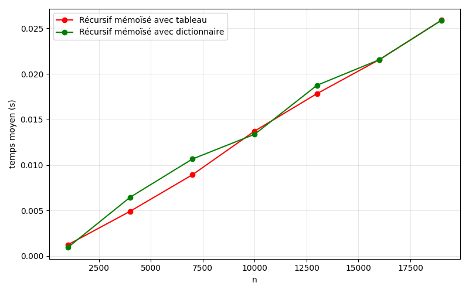

??? success "Script Python du graphique"
    ```python
    """
    Comparaison des temps d'exécution avec moyennage :
    - Fibonacci récursif mémoïsé avec liste (tableau)
    - Fibonacci récursif mémoïsé avec dictionnaire

    Les deux versions exploitent un cache persistant à l'intérieur de chaque
    répétition. Le cache est réinitialisé entre deux répétitions pour que le
    moyennage ait du sens.
    """

    import sys
    import time
    import statistics
    import matplotlib.pyplot as plt

    sys.setrecursionlimit(25000)


    def make_fibonacci_mem_liste():
        """Crée une fonction fibonacci_mem (version liste) avec cache vide."""
        F = [0, 1]

        def fibonacci_mem(n):
            if n >= len(F):
                F.append(fibonacci_mem(n - 1) + fibonacci_mem(n - 2))
            return F[n]

        return fibonacci_mem


    def make_fibonacci_mem_dict():
        """Crée une fonction fibonacci_mem (version dictionnaire) avec cache vide."""
        F = {0: 0, 1: 1}

        def fibonacci_mem(n):
            if n not in F:
                F[n] = fibonacci_mem(n - 1) + fibonacci_mem(n - 2)
            return F[n]

        return fibonacci_mem


    # Paramètres
    NB_REPETITIONS = 10
    valeurs_n = list(range(1000, 19001, 3000))  # [1000, 4000, 7000, ..., 19000]

    temps_liste_all = [[] for _ in valeurs_n]
    temps_dict_all = [[] for _ in valeurs_n]

    print(f"Mesure des temps sur {NB_REPETITIONS} répétitions...")

    for rep in range(NB_REPETITIONS):
        print(f"  Répétition {rep + 1}/{NB_REPETITIONS}")

        # Nouvelles instances des deux fonctions → caches vides
        fibo_liste = make_fibonacci_mem_liste()
        fibo_dict = make_fibonacci_mem_dict()

        for i, n in enumerate(valeurs_n):
            # Mesure version liste
            debut = time.perf_counter()
            fibo_liste(n)
            fin = time.perf_counter()
            temps_liste_all[i].append(fin - debut)

            # Mesure version dictionnaire
            debut = time.perf_counter()
            fibo_dict(n)
            fin = time.perf_counter()
            temps_dict_all[i].append(fin - debut)

    # Moyennes
    moyennes_liste = [statistics.mean(t) for t in temps_liste_all]
    moyennes_dict = [statistics.mean(t) for t in temps_dict_all]

    #### Affichage console
    print(f"\nMoyennes sur {NB_REPETITIONS} répétitions :")
    print("-" * 60)
    print(f"{'n':>6} | {'liste (s)':>15} | {'dictionnaire (s)':>20}")
    print("-" * 60)
    for i, n in enumerate(valeurs_n):
        print(f"{n:>6} | {moyennes_liste[i]:>15.5f} | {moyennes_dict[i]:>20.5f}")

    # Tracé du graphique
    plt.figure(figsize=(8, 5))
    plt.plot(valeurs_n, moyennes_liste, 'ro-', label='Récursif mémoïsé avec tableau')
    plt.plot(valeurs_n, moyennes_dict, 'go-', label='Récursif mémoïsé avec dictionnaire')
    plt.xlabel('n')
    plt.ylabel('temps moyen (s)')
    plt.legend(loc='upper left')
    plt.grid(True, alpha=0.3)
    plt.tight_layout()
    plt.savefig('comparaison_liste_dict.png', dpi=100)
    plt.show()
    ```

---

#### 🧠 **Liste ou dictionnaire : quel impact sur les performances ?**

L'accès à un élément d'un **dictionnaire** par sa clé se fait en **O(1) en moyenne**, grâce à l'utilisation d'une **table de hachage**.

Pour une **liste**, l'accès par indice (`L[i]`) est également en **O(1)**.  
En revanche, rechercher une valeur sans connaître son indice (`x in L`) est en **O(n)**, car il faut parcourir la liste.

Dans le cas de la suite de Fibonacci en **programmation dynamique**, on accède toujours aux éléments **par indice connu** (`F[n]`).  
👉 La complexité d'accès théorique est donc **identique** dans les deux cas.

📊 **Et en pratique ?**

Le graphique ci-dessus compare les deux versions mémoïsées sur les mêmes valeurs de `n`.  
On constate que **les deux courbes restent très proches sur toute la plage testée**.  
Aucune des deux structures ne s'impose clairement : selon la **machine**, la **version de Python**, ou l'**instant de la mesure**, l'avantage bascule d'un côté ou de l'autre.

🔍 **Pourquoi cette équivalence ?**

On pourrait s'attendre à ce que le **dictionnaire**, plus souple, l'emporte facilement.  
Mais la liste bénéficie d'un atout important : la **localité mémoire**.

- Dans l'algorithme de Fibonacci, on accède **toujours aux deux dernières valeurs calculées** (`F[n-1]` et `F[n-2]`).
- Ces valeurs sont stockées dans des emplacements mémoire **contigus** dans le cas d'une liste.
- Le processeur exploite alors la **mémoire cache** (cache CPU), qui conserve à portée immédiate les données récemment utilisées.

👉 Cette **localité mémoire** explique pourquoi la liste rivalise sans difficulté avec le dictionnaire, malgré sa simplicité apparente.

📈 **Bilan sur la complexité** :

On observe en pratique un temps de calcul **proportionnel à n** dans les deux cas.

💬 On qualifie parfois cette complexité de **pseudo-linéaire** : elle est linéaire en nombre d'opérations élémentaires, mais le **coût d'une addition** augmente lui aussi avec `n`, car les nombres de Fibonacci deviennent de plus en plus grands à manipuler.

🧩 **À retenir** :

- Liste et dictionnaire offrent ici des performances **comparables**.

- Le **contexte d'utilisation** est plus important que la structure elle-même.

- La programmation dynamique repose autant sur la **stratégie algorithmique** que sur le **choix de la structure de données**.

---

### <H3 STYLE="COLOR:GREEN;"><a name="_toc159507080"></a>**🪁 2.4. La suite de Fibonacci : approche de bas en haut (bottom-up)**</H3>

🧱 Cette fois, on change complètement de stratégie.

➡️ On ne part plus du problème global pour le décomposer (approche **top-down**), mais des **cas de base** que l'on combine progressivement pour atteindre le problème global.

---

???+ question "🧠 **Activité n° 6 — Fibonacci approche bottom-up**"
    👉 On considère la fonction suivante, qui construit les valeurs de Fibonacci
    **dans l'ordre croissant** des indices, en partant de `F(0)` et `F(1)`.

    ```python
    def fiboMonte(n):
        fib = [0 for _ in range(n + 2)]
        fib[1] = 1
        for i in range(2, n + 1):
            fib[i] = fib[i - 1] + fib[i - 2]
        return fib[n]
    ```

    🧪 Tester avec `n = 6`, `n = 10`, `n = 100`.

    ❓ **Questions** :

    - Pourquoi crée-t-on un tableau de taille `n + 2` et non `n + 1` ?

    - Y a-t-il encore un appel récursif dans cette fonction ?

    ??? success "✅ Solution (analyse attendue)"
        ✔️ Cette version est **entièrement itérative** : **aucun appel récursif**,donc aucun risque de dépassement de la pile d'appels (`RecursionError`).

        ✔️ Chaque valeur est calculée **une seule fois**.

        ✔️ La complexité est **O(n) en temps** et **O(n) en mémoire**.

        💡 **L'astuce du `n + 2`** :  
        Cela permet de **traiter uniformément les cas de base** `n = 0` et `n = 1`,
        sans ajouter de `if`.

        - Pour `n = 0` : `fib = [0, 1]` puis on retourne `fib[0] = 0` ✓
        - Pour `n = 1` : `fib = [0, 1, 0]` puis on retourne `fib[1] = 1` ✓

        Si on utilisait `n + 1`, la ligne `fib[1] = 1` planterait pour `n = 0`avec une `IndexError`.

---

#### 🔍 **Exemple d'exécution : `fiboMonte(5)`**

- Initialisation : `fib = [0, 1, 0, 0, 0, 0, 0]` (tableau de taille `n + 2 = 7`)

- Boucle :

    * `i = 2` → `fib[2] = fib[1] + fib[0] = 1 + 0 = 1`

    * `i = 3` → `fib[3] = fib[2] + fib[1] = 1 + 1 = 2`

    * `i = 4` → `fib[4] = fib[3] + fib[2] = 2 + 1 = 3`

    * `i = 5` → `fib[5] = fib[4] + fib[3] = 3 + 2 = 5`

- Résultat retourné : **`fib[5] = 5`**

---

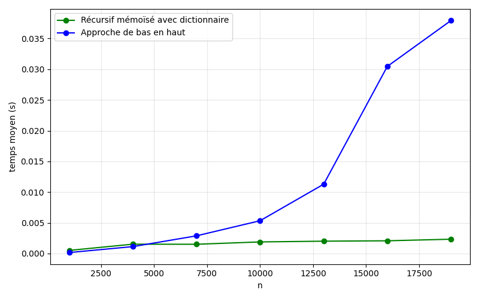

??? sucess "Script Python"
    ```python
    """
    Comparaison des temps d'exécution avec moyennage :
    - Approche bottom-up (fiboMonte) : recalcule tout depuis 0 à chaque appel,
        et alloue une nouvelle liste de taille n+2 à chaque fois.
    - Récursif mémoïsé avec dictionnaire : cache persistant entre les appels
        successifs (à l'intérieur d'une répétition).

    Pour le moyennage, on répète NB_REPETITIONS fois la séquence complète de
    mesures, en réinitialisant le cache de la version mémoïsée entre chaque
    répétition.
    """

    import sys
    import time
    import statistics
    import matplotlib.pyplot as plt

    sys.setrecursionlimit(25000)


    def fiboMonte(n):
        fib = [0 for _ in range(n + 2)]
        fib[1] = 1
        for i in range(2, n + 1):
            fib[i] = fib[i - 1] + fib[i - 2]
        return fib[n]


    def make_fibonacci_mem_dict():
        """Crée une fonction fibonacci_mem (version dictionnaire) avec cache vide."""
        F = {0: 0, 1: 1}

        def fibonacci_mem(n):
            if n not in F:
                F[n] = fibonacci_mem(n - 1) + fibonacci_mem(n - 2)
            return F[n]

        return fibonacci_mem


    # Paramètres
    NB_REPETITIONS = 10
    valeurs_n = list(range(1000, 19001, 3000))  # [1000, 4000, 7000, ..., 19000]

    temps_bottomup_all = [[] for _ in valeurs_n]
    temps_dict_all = [[] for _ in valeurs_n]

    print(f"Mesure des temps sur {NB_REPETITIONS} répétitions...")

    for rep in range(NB_REPETITIONS):
        print(f"  Répétition {rep + 1}/{NB_REPETITIONS}")

        # Nouvelle instance de la fonction mémoïsée → cache vide
        fibo_dict = make_fibonacci_mem_dict()

        for i, n in enumerate(valeurs_n):
            # Mesure approche bottom-up (recalcule tout à chaque appel)
            debut = time.perf_counter()
            fiboMonte(n)
            fin = time.perf_counter()
            temps_bottomup_all[i].append(fin - debut)

            # Mesure version mémoïsée dict (cache persistant à l'intérieur de la rép.)
            debut = time.perf_counter()
            fibo_dict(n)
            fin = time.perf_counter()
            temps_dict_all[i].append(fin - debut)

    # Moyennes
    moyennes_bottomup = [statistics.mean(t) for t in temps_bottomup_all]
    moyennes_dict = [statistics.mean(t) for t in temps_dict_all]

    # Affichage console
    print(f"\nMoyennes sur {NB_REPETITIONS} répétitions :")
    print("-" * 60)
    print(f"{'n':>6} | {'bottom-up (s)':>18} | {'mémoïsé dict (s)':>20}")
    print("-" * 60)
    for i, n in enumerate(valeurs_n):
        print(f"{n:>6} | {moyennes_bottomup[i]:>18.5f} | {moyennes_dict[i]:>20.5f}")

    # Tracé du graphique
    plt.figure(figsize=(8, 5))
    plt.plot(valeurs_n, moyennes_dict, 'go-', label='Récursif mémoïsé avec dictionnaire')
    plt.plot(valeurs_n, moyennes_bottomup, 'bo-', label='Approche de bas en haut')
    plt.xlabel('n')
    plt.ylabel('temps moyen (s)')
    plt.legend(loc='upper left')
    plt.grid(True, alpha=0.3)
    plt.tight_layout()
    plt.savefig('comparaison_bottomup_dict.png', dpi=100)
    plt.show()
    ```

---


#### 🔽 **L'approche **bottom-up** (de bas en haut)**

L'approche **bottom-up** consiste à :

- 🔹 **Résoudre d'abord les plus petits sous-problèmes**, à savoir les **cas de base**  
  (`F(0) = 0` et `F(1) = 1`).

- 🔹 **Construire progressivement la solution finale**  
  en remontant pas à pas vers le problème global (`F(n)`).

- 🔹 Utiliser une structure **itérative**  
  (généralement une **boucle**) plutôt que la récursion.

- 🔹 **Supprimer complètement les appels récursifs** :
    - plus de surcoût lié à l'empilement des appels,
    - plus de risque de `RecursionError` pour de très grandes valeurs de `n`.

🔁 **Comparaison rapide top-down ↔ bottom-up** :

| Aspect | Top-down (activités 3 à 5) | Bottom-up (activité 6) |
|--------|---------------------------|------------------------|
| Sens du calcul | du global vers les cas de base | des cas de base vers le global |
| Implantation | récursive (avec mémoïsation) | itérative |
| Complexité en temps | O(n) | O(n) |
| Risque de `RecursionError` | oui pour très grand `n` | non |
| Cache persistant entre appels | possible (paramètre par défaut) | non — chaque appel recalcule depuis 0 |

👉 Les deux approches donnent **le même résultat** avec **la même complexité asymptotique O(n)**.

- Le **bottom-up** évite la récursion : pas de risque de `RecursionError`, ce qui le rend adapté à de très grandes valeurs de `n` **en un seul appel**.
- Le **top-down avec mémoïsation** peut, lui, exploiter un **cache persistant** entre plusieurs appels successifs — c'est ce qu'illustre le graphique précédent.

Le choix dépend donc du **scénario d'utilisation** : un seul gros appel, ou une série d'appels successifs.

💡 **Remarque** :  
À chaque étape, on n'utilise que les **deux dernières valeurs** calculées (`fib[i-1]` et `fib[i-2]`).  
A-t-on vraiment besoin de stocker **toutes** les valeurs intermédiaires ?  
C'est ce que va explorer la **version pythonesque** de la section 2.5.

---

### <H3 STYLE="COLOR:GREEN;"><a name="_toc159507081"></a>**✨ 2.5. La suite de Fibonacci : version pythonesque**</H3>

🧠 Jusqu'ici, nous avons vu plusieurs versions de Fibonacci en programmation dynamique.  
Il existe une version encore plus compacte, qui exploite parfaitement les capacités du langage Python.

💡 **Idée de départ** :  
Dans l'approche bottom-up (`fiboMonte`), nous avons vu qu'à chaque itération, on n'utilise que les **deux dernières valeurs** calculées. Pourquoi stocker tout le tableau ?

---

???+ question "🧠 **Activité n° 7 — Fibonacci bottom-up (version pythonesque)**"
    👉 On considère la fonction suivante :

    ```python
        def fiboMonte2(n):
            a, b = 0, 1
            for _ in range(n):
                a, b = b, a + b
            return a
    ```

    🧪 **Travail demandé** :

    - Tester la fonction pour `n = 6`, `n = 10`, `n = 100`.

    - Puis tester avec des valeurs **beaucoup plus grandes**.

    ❓ **Questions** :

    - Observe-t-on un problème ? Le temps d'exécution évolue-t-il comme prévu ?

    - En quoi cette version est-elle plus « pythonesque » que `fiboMonte` ?

    ??? success "✅ Analyse et réponse attendues"
        ✔️ La fonction est correcte et renvoie les bonnes valeurs, cohérentes avec la définition
        `F(0) = 0, F(1) = 1` utilisée dans tout le chapitre.

        | n  | résultat attendu |
        |----|-----------------|
        | 0  | 0               |
        | 1  | 1               |
        | 6  | 8               |
        | 10 | 55              |

        ✔️ Elle utilise une approche **bottom-up** :

        - pas de récursion

        - une simple boucle

        - seulement **deux variables** (au lieu d'un tableau)

        💡 **Ce qui la rend « pythonesque »** :

        - L'affectation simultanée `a, b = b, a + b` permet de mettre à jour les deux variables **en une seule ligne**, sans variable temporaire.
        - Le `_` (au lieu de `i`) indique que la variable de boucle **n'est pas utilisée** — c'est une convention Python (PEP 8).

        ✔️ En nombre d'itérations, la complexité est bien **O(n)**.

        ⚠️ Cependant, pour de très grandes valeurs de `n`, le temps d'exécution **augmente plus vite qu'on ne l'imaginait**.

---

#### 📈 **Une impression trompeuse : « on dirait du O(n²) »**

On a montré que l'algorithme est **linéaire**.  
Pourtant, lorsqu'on observe les temps d'exécution pour de très grandes valeurs de `n`, la courbe **semble se courber**, donnant l'impression d'un comportement en **O(n²)**.

⏳ On peut explorer des valeurs très grandes de `n`…  
il faut simplement **un peu de patience**.

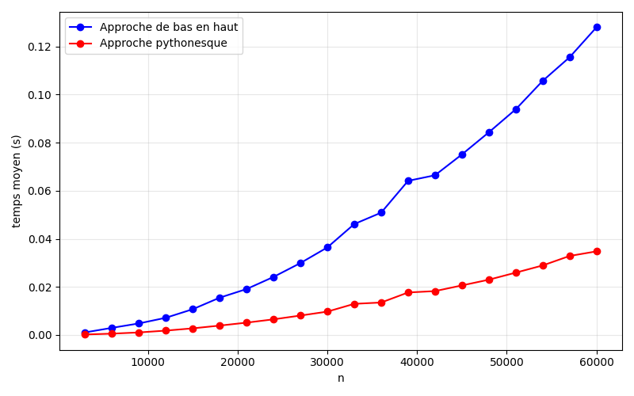

??? success "Script Python"
    ```python
    """
    Comparaison des temps d'exécution pour de grandes valeurs de n :
    - Approche bottom-up (fiboMonte) : tableau de taille n+2
    - Approche pythonesque (fiboMonte2) : deux variables seulement

    Aucune des deux versions n'utilise de cache persistant, donc chaque appel
    recalcule tout depuis 0. La comparaison met en évidence le surcoût
    de la liste par rapport aux deux variables locales.

    ⚠️ ATTENTION : pour n = 60 000, chaque appel peut prendre plusieurs
    secondes (taille des entiers Fibonacci très grande). Le script entier
    peut durer 1 à 2 minutes.
    """

    import time
    import statistics
    import matplotlib.pyplot as plt


    def fiboMonte(n):
        fib = [0 for _ in range(n + 2)]
        fib[1] = 1
        for i in range(2, n + 1):
            fib[i] = fib[i - 1] + fib[i - 2]
        return fib[n]


    def fiboMonte2(n):
        a, b = 0, 1
        for _ in range(n):
            a, b = b, a + b
        return a


    # Paramètres
    NB_REPETITIONS = 5
    valeurs_n = list(range(3000, 60001, 3000))  # [3000, 6000, 9000, ..., 60000]

    temps_bottomup_all = [[] for _ in valeurs_n]
    temps_pythonesque_all = [[] for _ in valeurs_n]

    print(f"Mesure des temps sur {NB_REPETITIONS} répétitions...")
    print(f"({len(valeurs_n)} valeurs de n testées, de {valeurs_n[0]} à {valeurs_n[-1]})")
    print("Patience : les grandes valeurs de n prennent du temps.\n")

    for rep in range(NB_REPETITIONS):
        print(f"  Répétition {rep + 1}/{NB_REPETITIONS}")
        for i, n in enumerate(valeurs_n):
            # Mesure approche bottom-up
            debut = time.perf_counter()
            fiboMonte(n)
            fin = time.perf_counter()
            temps_bottomup_all[i].append(fin - debut)

            # Mesure approche pythonesque
            debut = time.perf_counter()
            fiboMonte2(n)
            fin = time.perf_counter()
            temps_pythonesque_all[i].append(fin - debut)

    # Moyennes
    moyennes_bottomup = [statistics.mean(t) for t in temps_bottomup_all]
    moyennes_pythonesque = [statistics.mean(t) for t in temps_pythonesque_all]

    # Affichage console
    print(f"\nMoyennes sur {NB_REPETITIONS} répétitions :")
    print("-" * 65)
    print(f"{'n':>6} | {'bottom-up (s)':>18} | {'pythonesque (s)':>20}")
    print("-" * 65)
    for i, n in enumerate(valeurs_n):
        print(f"{n:>6} | {moyennes_bottomup[i]:>18.4f} | {moyennes_pythonesque[i]:>20.4f}")

    # Tracé du graphique
    plt.figure(figsize=(8, 5))
    plt.plot(valeurs_n, moyennes_bottomup, 'bo-', label='Approche de bas en haut')
    plt.plot(valeurs_n, moyennes_pythonesque, 'ro-', label='Approche pythonesque')
    plt.xlabel('n')
    plt.ylabel('temps moyen (s)')
    plt.legend(loc='upper left')
    plt.grid(True, alpha=0.3)
    plt.tight_layout()
    plt.savefig('comparaison_bottomup_pythonesque.png', dpi=100)
    plt.show()
    ```

🙏 Merci à Mireille Coilhac

---

#### 🔍 **Pourquoi cette impression de ralentissement ?**

La cause **principale** n'est pas la structure de données utilisée (ici, juste deux variables), mais la **taille des nombres** manipulés.

- Les termes de la suite de Fibonacci deviennent **très grands** avec `n`.
- Python gère des entiers de **taille arbitraire** (pas de limite à 32 ou 64 bits).
- Additionner deux très grands entiers **n'est plus une opération à coût constant** : le coût croît avec le nombre de chiffres.

📊 **Quelques ordres de grandeur** :

| `n` | nombre de chiffres de `F(n)` |
|---|------------------------------|
| 10 | 2 |
| 100 | 21 |
| 1 000 | 209 |
| 10 000 | 2 090 |
| 100 000 | 20 899 |

📌 Le temps d'exécution dépend donc aussi de la **taille des nombres manipulés**, et pas uniquement du nombre d'itérations.

💡 **Conséquence** : dans la version `fiboMonte` (avec liste), on cumule **deux surcoûts** — la taille des entiers **et** la gestion d'un tableau de taille `n + 2`. Dans `fiboMonte2`, seul le premier subsiste — c'est ce qui la rend nettement plus rapide.

---

#### ⚡ **Pourquoi la version pythonesque est la plus rapide en pratique**

L'approche pythonesque :

- ❌ n'utilise **aucune structure dynamique** (pas de liste) → pas d'allocation mémoire en début d'appel ;
- ✔️ se limite à **deux entiers**, stockés dans des variables locales ;
- ✔️ ne fait **aucun accès par indice** (qui passe par plusieurs couches d'abstraction en Python) ;
- ✔️ se traduit en très peu d'instructions par itération.

👉 **Bilan** :

- Les deux algorithmes (`fiboMonte` et `fiboMonte2`) sont en **O(n)** en nombre d'itérations ;
- Mais le **coefficient caché** est beaucoup plus faible pour `fiboMonte2` ;
- 👉 C'est pourquoi elle est **nettement plus rapide en pratique**.

🧩 **À retenir** :

- Complexité théorique ≠ temps mesuré

- Les détails d'implémentation comptent

- Python gère des entiers arbitrairement grands → impact réel sur les performances pour de très grandes valeurs

---

## <H2 STYLE="COLOR:BLUE;"> <a name="_toc159507082"></a>**🎯 3. L'optimisation du problème du rendu de monnaie**</H2>

🧠 La **programmation dynamique** consiste à résoudre un problème en :

- 🔹 le **décomposant en sous-problèmes**,
- 🔹 résolvant ces sous-problèmes **du plus petit au plus grand**,
- 🔹 **mémorisant** les résultats intermédiaires afin d'éviter les calculs redondants.

Cette approche permet d'aboutir efficacement à une **solution optimale**, en résolvant **chaque sous-problème une seule fois**.

👉 À l'inverse, la **force brute** explore **toutes les combinaisons possibles**, sans mémorisation ni stratégie — ce qui la rend très coûteuse en temps.

🟡 Les **algorithmes gloutons**, quant à eux, procèdent différemment :

- ils font des choix successifs immédiats selon un critère local (le « meilleur choix à court terme »),
- ils sont souvent **rapides**,
- mais ils **ne garantissent pas toujours une solution optimale**.

💡 **Exemple où le glouton échoue** :  
Avec un système de pièces `{1, 3, 4}` et une somme à rendre de `6` :

- 🔻 Glouton : `4 + 1 + 1 = 6` → **3 pièces**
- ✅ Optimal : `3 + 3 = 6` → **2 pièces**

➡️ C'est pour traiter ces cas que la **programmation dynamique** devient indispensable.

---

### 🪙 **Énoncé du problème**

📌 **Donnée** : un système de monnaie `S = {p₁, p₂, …, pₖ}` (valeurs des pièces et billets disponibles) et une **somme** `n` à rendre.

📌 **Objectif** : déterminer le **nombre minimal de pièces** permettant de rendre exactement la somme `n`.

🧪 **Hypothèses** :

- Chaque pièce peut être utilisée **autant de fois que nécessaire**.
- On suppose qu'il est **toujours possible** de rendre la somme avec le système donné (par exemple, si la pièce `1` est présente).

---


### <H3 STYLE="COLOR:GREEN;"><a name="_toc159507083"></a>**📀 3.1. Le rendu de monnaie en force brute**</H3>

🔍 L'approche de **force brute** pour le problème du rendu de monnaie consiste à :

- **énumérer toutes les combinaisons possibles** de pièces dont la somme vaut `n`,

- puis sélectionner celle qui utilise **le moins de pièces**.

👉 Cette méthode est **simple à comprendre** et **garantit de trouver la solution optimale**, mais elle devient **très lente** lorsque la somme augmente, car **le nombre de combinaisons à explorer croît exponentiellement**.

🔢 **Représentation d'une combinaison** :

Pour un système `monnaie = [1, 3, 4]`, une combinaison sera représentée par une liste donnant **le nombre de pièces de chaque type**, dans l'ordre du système :

- `[3, 1, 0]` signifie **3 pièces de 1 € + 1 pièce de 3 € + 0 pièce de 4 €**, soit `3 + 3 = 6 €`.

---

???+ question "🧠 **Activité n° 8 — Rendu de monnaie en force brute**"
    👉 On reprend le contre-exemple de l'introduction : `monnaie = [1, 3, 4]` et `somme = 6`.

    Écrire une fonction `rendre_monnaie_brute(monnaie, somme)` qui retourne **toutes les combinaisons possibles** de pièces dont la somme vaut exactement `somme`.

    💡 **Indice algorithmique** :  
    On peut procéder **récursivement** : pour chaque type de pièce, essayer toutes les quantités possibles (de 0 à `somme // valeur_pièce`), et explorer les sous-problèmes restants.

    ```python
    def rendre_monnaie_brute(monnaie, somme):
        pass


    if __name__ == "__main__":
        monnaie = [1, 3, 4]
        somme = 6
        assert rendre_monnaie_brute(monnaie, somme) == [
            [0, 2, 0],
            [2, 0, 1],
            [3, 1, 0],
            [6, 0, 0]
        ]
    ```

    🧪 **Travail demandé** :

    - écrire la fonction,

    - vérifier que toutes les combinaisons sont bien trouvées,

    - **identifier la solution optimale** (celle avec le moins de pièces).

    ??? success "✅ Solution (méthode attendue)"
        ```python
        def rendre_monnaie_brute(monnaie, somme):
            solutions = []

            def explorer(restant, indice, combinaison):
                # Cas terminal : on a considéré toutes les pièces
                if indice == len(monnaie):
                    if restant == 0:
                        solutions.append(combinaison[:])
                    return
                # On essaie 0, 1, 2, ... pièces du type courant
                for k in range(restant // monnaie[indice] + 1):
                    combinaison.append(k)
                    explorer(restant - k * monnaie[indice], indice + 1, combinaison)
                    combinaison.pop()

            explorer(somme, 0, [])
            return solutions
        ```

        ✔️ L'algorithme explore **toutes les combinaisons** possibles.

        ✔️ Interprétation des résultats pour `[1, 3, 4]` et somme `6` :

        | Combinaison | Détail | Nombre de pièces |
        |-------------|--------|------------------|
        | `[0, 2, 0]` | 2 pièces de 3 € | **2** ⭐ |
        | `[2, 0, 1]` | 2 pièces de 1 € + 1 pièce de 4 € | 3 |
        | `[3, 1, 0]` | 3 pièces de 1 € + 1 pièce de 3 € | 4 |
        | `[6, 0, 0]` | 6 pièces de 1 € | 6 |

        ⭐ La solution optimale est `[0, 2, 0]` (2 pièces).  
        👉 C'est précisément la solution que **l'algorithme glouton n'avait pas trouvée**.

        ⚠️ Le nombre de combinaisons croît **très vite** avec la somme et le nombre de pièces. Pour rendre 100 € avec `[1, 2, 5, 10, 20, 50]`, on doit déjà explorer plusieurs milliers de cas.

---

📌 **À retenir** :

- ✔️ La force brute trouve **toujours** la solution optimale.
- ❌ Elle est **inutilisable en pratique** pour des sommes importantes : la complexité croît exponentiellement.
- 🔁 Elle illustre parfaitement le besoin d'une approche plus efficace : la **programmation dynamique**.

---

### <H3 STYLE="COLOR:GREEN;"><a name="_toc159507084"></a>**🧮 3.2. Application classique avec les algorithmes gloutons**</H3>

🧠 Un **algorithme glouton** résout un problème en faisant, à chaque étape, le **meilleur choix local possible**, sans jamais revenir en arrière.

Dans le cas du **rendu de monnaie**, cela consiste à :

- prendre **la plus grande pièce possible** à chaque étape,

- puis recommencer jusqu'à ce que toute la somme soit rendue.

✔️ Cette approche est **simple** et souvent **rapide**.  

❌ Mais elle **ne garantit pas toujours une solution optimale**.

💡 **Système canonique** :  
Un système de monnaie est dit **canonique** lorsque l'algorithme glouton trouve **toujours** la solution optimale, quelle que soit la somme à rendre.

👉 C'est le cas du système **euro** : `[1, 2, 5, 10, 20, 50, 100, 200]` (en centimes).  
👉 Ce n'est **pas** le cas du système `[1, 3, 4]`, comme nous allons le voir.

---

???+ question "🧠 **Activité n° 9 — Rendu de monnaie avec un algorithme glouton**"
    👉 On reprend le système non canonique `monnaie = [1, 3, 4]` et la somme `6`.

    ```python
    def rendre_monnaie_glouton(monnaie, somme):
        # Copie triée par ordre décroissant (sans modifier la liste d'origine)
        monnaie_triee = sorted(monnaie, reverse=True)

        # Initialiser le résultat (même ordre que monnaie_triee)
        resultat = [0] * len(monnaie_triee)

        # Pour chaque pièce, de la plus grande à la plus petite
        for i in range(len(monnaie_triee)):
            # Tant que la somme est supérieure ou égale à la valeur de la pièce
            while somme >= monnaie_triee[i]:
                somme -= monnaie_triee[i]
                resultat[i] += 1

        return resultat


    if __name__ == "__main__":
        monnaie = [1, 3, 4]
        somme = 6
        assert rendre_monnaie_glouton(monnaie, somme) == [1, 0, 2]
    ```

    ⚠️ **Attention au format de retour** : ici, le résultat est donné dans l'**ordre décroissant** des pièces (`[4, 3, 1]`), pas dans l'ordre du système d'origine. C'est différent de l'activité 8.

    🧪 **Travail demandé** :

    - exécuter le programme et interpréter le résultat obtenu,

    - **identifier précisément le moment où le glouton fait un choix qui empêche la solution optimale**,

    - comparer avec les combinaisons trouvées en force brute (activité 8).

    ??? success "✅ Analyse et résultat attendus"
        ✔️ L'algorithme glouton retourne `[1, 0, 2]` (dans l'ordre `[4, 3, 1]`) :

        - 1 pièce de 4 € + 0 pièce de 3 € + 2 pièces de 1 €  
        - 👉 soit **3 pièces** au total.

        ❌ Or, la solution **optimale** (vue à l'activité 8) est :

        - 2 pièces de 3 € → **2 pièces** seulement.

        🔍 **Le moment décisif** :

        - À la première étape, somme = 6 et la plus grande pièce disponible est `4`. Le glouton **prend la pièce de 4**.
        - Il reste alors `2` à rendre, mais aucune pièce ne vaut 2 ou 3 (≤ 2).
        - Le glouton est obligé d'utiliser deux pièces de 1 → 3 pièces au total.

        💡 Si, à la première étape, l'algorithme avait choisi `3` au lieu de `4`, il aurait pu rendre la somme avec **2 pièces de 3 €**.  
        Mais un algorithme glouton **ne peut pas anticiper** : il prend toujours le choix immédiatement le plus avantageux.

        📌 **Conclusion** :

        - le système `[1, 3, 4]` n'est **pas canonique**,
        - une fois une pièce choisie, l'algorithme **ne peut pas revenir en arrière**,
        - c'est pour cela qu'il échoue ici.

---

#### 🧠 **À retenir sur les algorithmes gloutons**

- ✔️ Ils sont **souvent très rapides** (beaucoup plus que la force brute).
- ❌ Ils **ne garantissent pas toujours** une solution optimale.
- 🔁 Une décision prise est **définitive** (pas de retour en arrière).
- 📈 Pour le rendu de monnaie, la complexité de l'algorithme glouton est **linéaire** par rapport à la somme à rendre (au pire `O(somme)`, lorsqu'il faut utiliser beaucoup de petites pièces).

👉 Ce constat motive l'utilisation de la **programmation dynamique**, qui permet de garantir une solution optimale **sans explorer inutilement tous les cas comme la force brute**.


### <H3 STYLE="COLOR:GREEN;"><a name="_toc159507085"></a>**🔎 3.3. Approche récursive**</H3>

🧠 Avant d'introduire la programmation dynamique pour le rendu de monnaie, on commence par une **approche récursive naïve**.  
Elle permet de bien comprendre le problème… mais aussi ses limites.

---

???+ question "🧠 **Activité n° 10 — Rendu de monnaie (approche récursive)**"
    👉 Tester la fonction récursive suivante qui **renvoie le nombre minimal de pièces** nécessaires pour rendre une somme donnée.

    ```python
    def rendre_monnaie_rec(monnaie, somme):
        # Cas de base : aucune pièce nécessaire pour rendre 0
        if somme == 0:
            return 0

        # On initialise le minimum à une valeur infinie
        min_pieces = float('inf')

        # On essaie chaque pièce dont la valeur est inférieure ou égale à la somme
        for piece in monnaie:
            if piece <= somme:
                # Appel récursif pour la somme restante
                nb_pieces = 1 + rendre_monnaie_rec(monnaie, somme - piece)
                # On garde le meilleur (minimum) parmi toutes les pièces essayées
                if nb_pieces < min_pieces:
                    min_pieces = nb_pieces

        return min_pieces


    if __name__ == "__main__":
        monnaie = [1, 3, 4]
        somme = 6
        assert rendre_monnaie_rec(monnaie, somme) == 2
    ```

    ??? success "✅ Explication de l'algorithme"
        ✔️ La fonction est **récursive**.

        ✔️ **Cas de base** :

        - si la somme à rendre vaut `0`, aucune pièce n'est nécessaire → on retourne `0`.

        ✔️ **Cas général** :

        - la fonction essaie **toutes les pièces possibles** dont la valeur est ≤ somme,
        - elle appelle récursivement la fonction pour la **somme restante**,
        - elle conserve la solution utilisant le **moins de pièces**.

        ✔️ À la fin, la fonction retourne le **minimum** parmi toutes les possibilités testées.

        ⚠️ Si la somme ne peut pas être rendue avec le système donné, la fonction retourne `float('inf')`, valeur conventionnelle représentant un cas **impossible**.

---

???+ question "🧠 **Activité n° 11 — Analyse de l'approche récursive**"
    👉 Expliquer en quoi cette méthode **ne relève pas** du paradigme  
    **« diviser pour régner »**, mais plutôt d'une approche par **force brute récursive**.

    💡 **Indice** : observer dans l'arbre des appels récursifs ci-dessous s'il y a des sommes intermédiaires (par exemple `somme = 2` ou `somme = 3`) qui apparaissent **plusieurs fois**.

    ??? success "✅ Réponse attendue"
        ✔️ À première vue, la fonction **ressemble** au diviser pour régner :  
        elle décompose le problème (rendre `somme`) en sous-problèmes plus petits (rendre `somme - pièce`).

        ❌ Mais ce n'est **pas** du diviser pour régner, pour une raison essentielle :

        👉 Dans le diviser pour régner (vu en section 1.2), les sous-problèmes sont **indépendants** : résoudre l'un ne nécessite pas de résoudre l'autre.

        👉 Ici, les sous-problèmes **se chevauchent** : la même somme intermédiaire (par exemple `somme = 2`) peut être recalculée de nombreuses fois par différentes branches de l'arbre récursif.

        ✔️ C'est exactement cette propriété — des **sous-problèmes qui se chevauchent** — qui distingue les problèmes relevant de la **programmation dynamique** de ceux relevant du diviser pour régner.

        📌 **Bilan** :

        | Paradigme               | Sous-problèmes      | Mémorisation  |
        |-------------------------|---------------------|---------------|
        | Diviser pour régner     | Indépendants        | Non nécessaire |
        | Programmation dynamique | Qui se chevauchent  | Indispensable |

        👉 Cette méthode est donc une **force brute récursive** : elle explore tous les chemins possibles **sans mémoriser** les résultats intermédiaires, ce qui la rend très inefficace et motive directement l'utilisation de la **programmation dynamique** dans la partie suivante.

---

#### 🌳 **Arbre des appels récursifs**

Le schéma suivant représente **tous les appels récursifs** effectués par la fonction `rendre_monnaie_rec([1,3,4], 6)` :

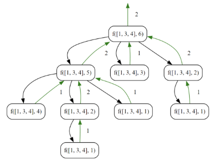

🔗 Visualisation interactive :  
[lien](https://www.recursionvisualizer.com/?function_definition=def%20f%28monnaie%2C%20somme%29%3A%0A%20%20%20%20min_pieces%20%3D%20float%28%27inf%27%29%0A%20%20%20%20if%20somme%20in%20monnaie%3A%0A%20%20%20%20%20%20%20%20return%201%0A%20%20%20%20else%3A%0A%20%20%20%20%20%20%20%20for%20piece%20in%20monnaie%3A%0A%20%20%20%20%20%20%20%20%20%20%20%20if%20piece%20%3C%3D%20somme%3A%0A%20%20%20%20%20%20%20%20%20%20%20%20%20%20%20%20nb_pieces%20%3D%201%20%2B%20f%28monnaie%2C%20somme-piece%29%0A%20%20%20%20%20%20%20%20%20%20%20%20%20%20%20%20if%20nb_pieces%20%3C%20min_pieces%3A%0A%20%20%20%20%20%20%20%20%20%20%20%20%20%20%20%20%20%20%20%20min_pieces%20%3D%20nb_pieces%0A%20%20%20%20return%20min_pieces&function_call=f%28%5B1%2C%203%2C%204%5D%2C%206%29)

👀 **À observer dans cet arbre** :

- combien de fois la somme intermédiaire `somme = 2` apparaît-elle ?
- même question pour `somme = 3` ?

---

#### 🔍 **Analyse de l'arbre**

- ✔️ Tous les **chemins possibles** sont explorés → **force brute**.
- ❌ Certains chemins mènent à une **impasse** (somme impossible à atteindre exactement).
- 🔁 Les **mêmes sous-problèmes** (mêmes valeurs de `somme`) sont recalculés plusieurs fois — c'est la source principale de l'inefficacité.
- 🎯 La **solution optimale** est trouvée à travers le chemin `f(6) → f(3) → 0`, soit **2 pièces** (deux pièces de 3 €).

Les autres chemins valides (par exemple `f(6) → f(5) → f(4) → f(0)` ou `f(6) → f(2) → f(1) → f(0)`) utilisent **3 pièces ou plus**, donc sont moins bons.

---

#### ⚠️ **Limite majeure de cette approche**

❗ Le principal problème de cette méthode est qu'elle **répète les mêmes calculs** en explorant tous les chemins indépendamment.

👉 C'est exactement cette inefficacité qui va motiver l'utilisation de la **programmation dynamique**, avec **mémoïsation**, dans la partie suivante.

---

### <H3 STYLE="COLOR:GREEN;"><a name="_toc159507086"></a>**💡 3.4. Programmation dynamique**</H3>

🧠 Pour **optimiser** le problème du rendu de monnaie, on utilise la **programmation dynamique**, selon deux approches possibles :

- 💾 **Mémoïsation (top-down)** : on garde l'approche récursive mais on mémorise les résultats intermédiaires (comme à l'activité 4 pour Fibonacci) ;

- 🔁 **Approche itérative (bottom-up)** : on élimine complètement la récursion en construisant la solution des **plus petites sommes vers la plus grande**.

Dans les deux cas, l'objectif est le même :

👉 **éviter de recalculer plusieurs fois les mêmes sous-problèmes**.

💡 **Dans la suite du chapitre, nous nous concentrerons sur l'approche bottom-up**, qui présente plusieurs avantages pour ce problème :

- ✔️ pas de récursion → pas de risque de `RecursionError` pour de grandes sommes,
- ✔️ structure de données simple (un tableau),
- ✔️ déroulement très visuel, idéal pour comprendre le principe « du plus petit au plus grand ».

---

### 📐 **Algorithme de principe (bottom-up)**

```
fonction rendu_monnaie_dyna(somme_à_rendre, système)
   nb ← tableau de taille (somme_à_rendre + 1) initialisé à +∞
   nb[0] ← 0                           # il faut 0 pièce pour rendre 0
   pour s allant de 1 à somme_à_rendre
      pour toutes les pièces p du système
         si p ≤ s alors
            nb[s] ← minimum(nb[s], 1 + nb[s - p])
         fin si
      fin pour
   fin pour
   renvoyer nb[somme_à_rendre]
fin fonction
```

📌 Cet algorithme :

- résout d'abord les **plus petites sommes**,

- construit progressivement la solution pour toutes les sommes intermédiaires,

- garantit une solution **optimale** si elle existe — sinon `nb[somme]` reste à `+∞`, ce qui signale que la somme **n'est pas atteignable**.


---

#### <H4 STYLE="COLOR:MAGENTA;"> <a name="_toc159507087"></a>**📗 3.4.1. Première approche : à la main**</H4>

???+ question "🧠 **Activité n° 12 — Programmation dynamique du rendu de monnaie (à la main)**"
    👉 On exécute l'instruction suivante :  
    `rendu_monnaie_dyna(5, [1, 2])`

    1. Quelle est la **somme à rendre** ?

    2. Quel est le **système monétaire utilisé** ?

    3. Décrire en quelques mots le **principe général** de l'algorithme.


    ??? success "✅ Réponses aux questions 1, 2 et 3"
        1\. Somme à rendre :

        👉 La somme à rendre est **5**.

        2\. Système monétaire utilisé :

        👉 Le système monétaire est composé des pièces de **1 €** et **2 €**.

        3\. Principe de l'algorithme :

        L'algorithme de programmation dynamique :

        - calcule successivement le nombre minimal de pièces nécessaires pour rendre les sommes de `1` jusqu'à la somme demandée ;

        - pour chaque somme intermédiaire, il **teste toutes les pièces** disponibles ;

        - il conserve, pour chaque somme, la **meilleure solution** trouvée (celle qui utilise le moins de pièces).

        👉 La présence de la pièce de 1 € garantit que toutes les sommes peuvent être rendues, ce qui permet à l'algorithme de fonctionner sans cas impossible.


??? success "🧠 **Déroulé pas à pas**"
    #### 🧠 **Initialisation**

    On crée un tableau `nb` de taille `somme_à_rendre + 1` (ici, de l'indice 0 à 5) :

    ```python
    nb = [0, ∞, ∞, ∞, ∞, ∞]
    ```

    * `nb[0] = 0` : il faut **0 pièce** pour rendre la somme 0.

    * Les autres cases sont initialisées à l'infini, car le nombre minimal de pièces n'est pas encore connu.

    ---

    #### 🔁 **Remplissage du tableau (approche bottom-up)**

    On calcule progressivement `nb[s]` pour `s` allant de 1 à 5.

    À chaque étape, on applique la formule :

    $nb[s] = \min_{p \in S,\ p \le s}(1 + nb[s - p])$

    où `S` désigne le système de monnaie.

    ---

    ##### 🔹 Étape **s = 1**

    * Pièce `1` : `1 ≤ 1` → `nb[1] = min(∞, 1 + nb[0]) = 1`
    * Pièce `2` : `2 > 1` → ignorée

    Résultat :

    ```python
    nb = [0, 1, ∞, ∞, ∞, ∞]
    ```

    👉 Il faut **1 pièce de 1 €** pour rendre 1.

    ---

    ##### 🔹 Étape **s = 2**

    * Pièce `1` : `1 + nb[1] = 2`
    * Pièce `2` : `1 + nb[0] = 1` ✅

    Résultat :

    ```python
    nb = [0, 1, 1, ∞, ∞, ∞]
    ```

    👉 Il faut **1 pièce de 2 €** pour rendre 2.

    ---

    ##### 🔹 Étape **s = 3**

    * Pièce `1` : `1 + nb[2] = 2`
    * Pièce `2` : `1 + nb[1] = 2`

    Les deux choix mènent au même nombre de pièces : **2**.

    Résultat :

    ```python
    nb = [0, 1, 1, 2, ∞, ∞]
    ```

    👉 Il faut **2 pièces** (par exemple 2 + 1) pour rendre 3.

    ---

    ##### 🔹 Étape **s = 4**

    * Pièce `1` : `1 + nb[3] = 3`
    * Pièce `2` : `1 + nb[2] = 2` ✅

    Résultat :

    ```python
    nb = [0, 1, 1, 2, 2, ∞]
    ```

    👉 Il faut **2 pièces de 2 €** pour rendre 4.

    ---

    ##### 🔹 Étape **s = 5**

    * Pièce `1` : `1 + nb[4] = 3`
    * Pièce `2` : `1 + nb[3] = 3`

    Résultat final :

    ```python
    nb = [0, 1, 1, 2, 2, 3]
    ```

    👉 Il faut **3 pièces** (par exemple 2 + 2 + 1) pour rendre 5.

    ---

    #### ✅ **Résultat final**

    La fonction renvoie :

    ```python
    nb[5] = 3
    ```

    👉 **Le nombre minimal de pièces nécessaires pour rendre la somme 5 est donc 3.**

    ---

    #### 🔚 **Résumé**

    | Somme `s` | Meilleure combinaison | Nombre minimal de pièces |
    | --------- | --------------------- | ------------------------ |
    | 0         | (rien)                | 0                        |
    | 1         | 1                     | 1                        |
    | 2         | 2                     | 1                        |
    | 3         | 2 + 1                 | 2                        |
    | 4         | 2 + 2                 | 2                        |
    | 5         | 2 + 2 + 1             | 3                        |

    💡 **Observation importante** : le tableau `nb` contient la solution **non seulement pour la somme demandée, mais aussi pour toutes les sommes intermédiaires**. C'est l'essence même de la programmation dynamique : on résout tous les sous-problèmes en chemin.

---

#### <H4 STYLE="COLOR:MAGENTA;"> <a name="_toc159507088"></a>**📔 3.4.2. Implémentation**</H4>

???+ question "🧠 **Activité n° 13 — Implémentation de l'algorithme dynamique**"
    👉 Travail demandé :

    1. **Implémenter** l'algorithme `rendu_monnaie_dyna` en Python.

    2. **Tester** sur plusieurs cas, notamment :

        - `rendu_monnaie_dyna(5, [2, 1])` → résultat attendu : `3`
        - `rendu_monnaie_dyna(6, [1, 3, 4])` → résultat attendu : `2`
        - `rendu_monnaie_dyna(10, [9, 3, 2])` → ❓ **que renvoie l'algorithme et pourquoi ?**

    3. **Interpréter** le résultat du dernier test.

    ??? success "✅ Implémentation attendue"
        ```python
        def rendu_monnaie_dyna(somme_a_rendre, systeme):
            # Initialisation du tableau : +∞ partout, sauf nb[0] = 0
            nb = [float('inf')] * (somme_a_rendre + 1)
            nb[0] = 0  # il faut 0 pièce pour rendre 0

            for s in range(1, somme_a_rendre + 1):
                for p in systeme:
                    if p <= s:
                        nb[s] = min(nb[s], 1 + nb[s - p])

            # Si nb[somme] est resté à l'infini, la somme n'est pas atteignable
            if nb[somme_a_rendre] == float('inf'):
                return -1  # convention : -1 signifie "somme impossible à rendre"
            return nb[somme_a_rendre]


        # Tests
        assert rendu_monnaie_dyna(5, [2, 1]) == 3     # 2 + 2 + 1
        assert rendu_monnaie_dyna(6, [1, 3, 4]) == 2  # 3 + 3
        assert rendu_monnaie_dyna(10, [9, 3, 2]) == -1  # impossible
        ```

---

##### ✅ **La réponse `-1` est-elle correcte ?**

👉 **Oui**, et ce résultat illustre une propriété importante de la programmation dynamique : pour pouvoir calculer une somme `s`, il faut qu'**au moins une sous-somme `s - p`** soit déjà atteignable.

Avec les pièces `[9, 3, 2]` et la somme `10`, vérifions les sous-sommes nécessaires :

* `10 - 9 = 1` → atteignable ? **non** (1 n'est pas représentable avec `{9, 3, 2}`)
* `10 - 3 = 7` → atteignable ? **non** (7 n'est pas représentable non plus)
* `10 - 2 = 8` → atteignable ? **non** (8 ne l'est pas non plus)

Aucune sous-somme nécessaire n'est atteignable, donc :

* la case `nb[10]` **ne peut jamais être mise à jour**,
* elle conserve sa valeur initiale `+∞`,
* la fonction renvoie alors `-1`, par convention.

👉 **L'algorithme ne se trompe pas : il signale une impossibilité.**

---

##### 📈 **Complexité de l'algorithme**

L'algorithme effectue **deux boucles imbriquées** :

- une boucle externe sur les sommes `s` de 1 à `somme_à_rendre` → `n` itérations,
- une boucle interne sur les pièces `p` du système → `k` itérations.

👉 **Complexité en temps** : `O(n × k)`, où `n` est la somme à rendre et `k` le nombre de pièces.

👉 **Complexité en espace** : `O(n)` pour stocker le tableau `nb`.

🔥 **Comparaison avec la force brute récursive (activité 10)** :

| Approche | Complexité en temps |
|----------|---------------------|
| Force brute récursive | **exponentielle** (au pire `O(k^n)`) |
| Programmation dynamique | **polynomiale** (`O(n × k)`) |

➡️ C'est l'**énorme** gain qui justifie tout ce chapitre.

---

##### 💡 **Mais quelles pièces sont utilisées ?**

L'algorithme actuel renvoie **le nombre minimal de pièces**, mais pas **lesquelles**.  
La section suivante (3.4.3) va y remédier.

---

#### <H4 STYLE="COLOR:MAGENTA;"> <a name="_toc159507089"></a>**🖌️ 3.4.3. Deuxième approche : pour aller plus loin**</H4>

🧠 Dans l'implémentation précédente, on obtient uniquement le **nombre minimal de pièces**.

➡️ L'objectif est maintenant de retrouver **la combinaison exacte des pièces utilisées**, et de continuer à gérer explicitement le cas où le rendu est **impossible**.

```python
def rendu_monnaie_dyna_combi(somme_à_rendre, système):
    '''
    Renvoie une liste minimale de pièces constituant la combinaison
    permettant de rendre la somme donnée avec le système de pièces donné.
    La fonction renvoie [-1] lorsque le rendu est impossible.
    '''
    combi = [[0 for k in range(s)] for s in range(0, somme_à_rendre + 1)]
    for s in range(1, somme_à_rendre + 1):
        for piece in système:
            if piece <= s:
                if len(combi[s]) > 1 + len(combi[s - piece]) or 0 in combi[s]:
                    combi[s] = combi[s - piece] + [piece]
    if 0 in combi[somme_à_rendre]:
        return [-1]
    return combi[somme_à_rendre]
```

```python
# Quelques exemples
assert rendu_monnaie_dyna_combi(49, [50, 20, 10, 5, 2, 1]) == [2, 2, 5, 20, 20]
assert rendu_monnaie_dyna_combi(49, [30, 24, 12, 6, 3, 1]) == [1, 24, 24]
assert rendu_monnaie_dyna_combi(49, [9, 3, 2]) == [2, 2, 9, 9, 9, 9, 9]
assert rendu_monnaie_dyna_combi(5, [2, 1]) == [1, 2, 2]
assert rendu_monnaie_dyna_combi(10, [9, 3, 2]) == [2, 2, 3, 3]
assert rendu_monnaie_dyna_combi(1, [9, 3, 2]) == [-1]
```

💡 **Idée centrale de cet algorithme** :  
On remplace le tableau de **nombres** (`nb` dans la version précédente) par un tableau de **listes** (`combi`), où chaque case `combi[s]` contient une combinaison de pièces dont la somme vaut `s`. À la fin, `combi[somme_à_rendre]` contient directement la solution.

L'astuce est d'utiliser le chiffre `0` comme **sentinelle d'impossibilité** : tant qu'une combinaison contient des `0`, c'est qu'elle n'a pas encore été validée par l'algorithme.

---

???+ question "🧠 **Activité n° 14 — Analyse de l'algorithme avancé**"

    1. **Expliquer l'initialisation** du tableau `combi` :
    ```python
       combi = [[0 for k in range(s)] for s in range(0, somme_à_rendre + 1)]
    ```

    2. **Expliquer la double condition** de mise à jour :
    ```python
       if len(combi[s]) > 1 + len(combi[s - piece]) or 0 in combi[s]:
    ```

    3. **Expliquer le test final** :
    ```python
       if 0 in combi[somme_à_rendre]:
    ```

    4. Que renvoie la fonction pour le système `[9, 3, 2]` et la somme `10` ? Pourquoi est-ce la **solution optimale** ?

    ??? success "✅ Analyse attendue"
        #### 1️⃣ **L'initialisation du tableau `combi`**

        👉 Cette ligne initialise un tableau de listes tel que :

        * `combi[0] = []` → la liste vide (rendre 0 ne nécessite **aucune pièce**),
        * `combi[1] = [0]` → une liste contenant un seul `0`,
        * `combi[2] = [0, 0]` → deux `0`,
        * …
        * `combi[s] = [0] * s` → `s` zéros.

        La taille `s` correspond au **pire des cas** : si on n'avait que des pièces de 1 €, il faudrait `s` pièces pour rendre `s`. Toute combinaison **valide** trouvée par l'algorithme sera donc nécessairement **plus courte ou égale**.

        💡 **Rôle des `0`** : ce sont des **sentinelles d'impossibilité**. Tant qu'une liste contient un `0`, c'est que l'algorithme n'a pas encore trouvé de combinaison valide pour cette somme.

        ---

        #### 2️⃣ **La double condition de mise à jour**

        ```python
        if len(combi[s]) > 1 + len(combi[s - piece]) or 0 in combi[s]:
            combi[s] = combi[s - piece] + [piece]
        ```

        Cette condition met à jour `combi[s]` dans **deux cas** :

        🔹 **Cas 1** : on a trouvé une combinaison **strictement plus courte**.  
        `len(combi[s]) > 1 + len(combi[s - piece])` signifie que la nouvelle combinaison (en utilisant `piece` puis en complétant avec `combi[s - piece]`) utiliserait moins de pièces que la solution actuelle.

        🔹 **Cas 2** : la combinaison actuelle est encore **invalide** (contient des `0`).  
        Dans ce cas, **toute** combinaison valide est meilleure que la combinaison sentinelle, même si elle n'est pas strictement plus courte. C'est ce que dit `or 0 in combi[s]`.

        ⚠️ **Subtilité** : si `combi[s - piece]` contient encore un `0`, alors la nouvelle combinaison contiendra aussi un `0`. C'est normal : on propage l'invalidité tant qu'aucun chemin valide n'a été trouvé.

        ---

        #### 3️⃣ **Le test final**

        ```python
        if 0 in combi[somme_à_rendre]:
            return [-1]
        ```

        👉 Si à la fin du calcul, `combi[somme_à_rendre]` contient encore un `0`, c'est qu'**aucune combinaison valide** n'a été trouvée : la somme est **impossible à rendre** avec ce système. La fonction retourne alors la convention `[-1]`.

        ---

        #### 4️⃣ **Résultat pour `[9, 3, 2]` et somme `10`**

        La fonction renvoie `[2, 2, 3, 3]` :

        * la combinaison vérifie bien `2 + 2 + 3 + 3 = 10` ✓
        * elle utilise **4 pièces**.

        💡 **Pourquoi est-ce optimal ?** Aucune combinaison de pièces de `{9, 3, 2}` ne permet de rendre 10 avec moins de 4 pièces :

        - Pas de solution à 1 pièce (aucune pièce ne vaut 10).
        - Pas de solution à 2 pièces : `9 + ? = 10` → `1` impossible ; `3 + ? = 10` → `7` impossible ; `2 + ? = 10` → `8` impossible.
        - Pas de solution à 3 pièces : on peut le vérifier en énumérant `9+x+y`, `3+x+y`, `2+x+y` avec `x, y ∈ {9, 3, 2}` — aucune ne donne 10.
        - À 4 pièces, on trouve enfin `2 + 2 + 3 + 3 = 10`.

        👉 La programmation dynamique garantit donc une solution **optimale**.

---

##### 🔍 **Remarque — alternative classique**

L'algorithme présenté ici utilise une astuce élégante (les sentinelles `0` dans des listes de tailles variables), mais ce n'est **pas l'approche la plus standard** pour ce problème.

Une approche alternative consiste à garder le tableau `nb` de la section 3.4.2 et à maintenir **en parallèle** un second tableau `parent[s]` qui mémorise, pour chaque somme `s`, **la pièce utilisée** dans la solution optimale. On peut ensuite **remonter** ce tableau à partir de `parent[somme]` pour reconstituer la combinaison.

✔️ Avantage : complexité en espace `O(n)` au lieu de `O(n²)` (avec les listes de tailles variables).

📚 Cette variante est un excellent exercice pour aller encore plus loin.

---

🙏 Merci à Charles Poulmaire.

---


## <H2 STYLE="COLOR:BLUE;"> **4. 🔎 Exercices :**</H2>

!!! info "🧠 **Capytale : Les codes seront fournis par votre enseignant.**"

!!! abstract "🧩 **Exercice n°1 : le pb du sac à dos**"


    On rappelle le problème du sac à dos déjà vu en première : on dispose de *n* objets assimilables à des couples (valeur, poids) et d'un sac à dos qui peut porter un poids maximum *w*. L'objectif est de maximiser la valeur des objets contenus dans le sac.

    Nous avons vu deux stratégies en première :

    - force brute : tester toutes les combinaisons possibles, envisageable avec 20 objets par exemple, mais pas avec 60 objets.

    - algorithmes gloutons :

        - glouton 1 : on prend d'abord les objets de valeurs maximales.
        - glouton 2 : on prend d'abord les objets maximisant le rapport valeur/poids.

    Les algorithmes gloutons sont très rapides, en O(*n log₂*(*n*)) si on trie les objets suivant le critère choisi avec un bon algorithme de tri, mais ne garantissent pas d'obtenir la meilleure solution.

    **Résolution par programmation dynamique**

    On peut construire une solution optimale du problème à *i* objets à partir d'une résolution du problème à *i* – 1 objets.

    Supposons qu'on a résolu le problème à *i* – 1 objets pour un poids maximal *p* allant de 0 à *w*.

    On rajoute un *i*-ème objet (*vᵢ*, *pᵢ*). Alors, une solution optimale du problème à *i* objets avec un poids maximal de *w* est :

    - soit une solution optimale du problème à *i* – 1 objets avec le poids maximal *w*,

    - soit une solution optimale du problème à *i* – 1 objets avec le poids maximal  *w* – *pᵢ* à laquelle on ajoute le *i*-ème objet.

    On résout donc successivement les problèmes à 1 objet, 2 objets, 3 objets, … pour les poids allant de 0 à *w*. On présente les solutions dans un tableau. Le contenu du tableau dépend de l'ordre des objets mais pas la dernière ligne.

    **Exemple**

    Résolution du problème du sac à dos avec la liste 
    `objets = [(3, 2), (8, 10), (2, 2), (8, 1), (4, 6), (6, 6)]` 
    et le poids maximal *w* = 10 kg. Les objets sont au format (valeur, poids).

    | Objets\Poids | 0 | 1 | 2 | 3 | 4 | 5 | 6 | 7 | 8 | 9 | 10 |
    |---|---|---|---|---|---|---|---|---|---|---|---|
    | 0 | 0 | 0 | 0 | 0 | 0 | 0 | 0 | 0 | 0 | 0 | 0 |
    | 1 (3,2) | 0 | 0 | 3 | 3 | 3 | 3 | 3 | 3 | 3 | 3 | 3 |
    | 2 (8,10) | 0 | 0 | 3 | 3 | 3 | 3 | 3 | 3 | 3 | 3 | 8 |
    | 3 (2,2) | 0 | 0 | 3 | 3 | 5 | 5 | 5 | 5 | 5 | 5 | 8 |
    | 4 (8,1) | 0 | 8 | 8 | 11 | 11 | 13 | 13 | 13 | 13 | 13 | 13 |
    | 5 (4,6) | 0 | 8 | 8 | 11 | 11 | 13 | 13 | 13 | 13 | 15 | 15 |
    | 6 (6,6) | 0 | 8 | 8 | 11 | 11 | 13 | 13 | 14 | 14 | 17 | 17 |

    La valeur maximale est **17**, atteinte avec un poids de **9 kg**.

    **Remontée pour retrouver les objets choisis :**

    - La valeur 17 (ligne 6, poids 9) diffère de la ligne 5 → on a pris l'**objet 6** (valeur 6, poids 6). Poids restant : 9 – 6 = 3, on remonte à la ligne 5.

    - La valeur à (ligne 5, poids 3) = 11, identique à (ligne 4, poids 3) → on n'a **pas pris l'objet 5**. On remonte à la ligne 4.

    - La valeur à (ligne 4, poids 3) = 11 diffère de (ligne 3, poids 3) = 3 → on a pris l'**objet 4** (valeur 8, poids 1). Poids restant : 3 – 1 = 2, on remonte à la ligne 3.

    - La valeur à (ligne 3, poids 2) = 3, identique à (ligne 2, poids 2) = 3 → on n'a **pas pris l'objet 3**. On remonte à la ligne 2.

    - La valeur à (ligne 2, poids 2) = 3, identique à (ligne 1, poids 2) = 3 → on n'a **pas pris l'objet 2**. On remonte à la ligne 1.

    - La valeur à (ligne 1, poids 2) = 3 diffère de (ligne 0, poids 2) = 0 → on a pris l'**objet 1** (valeur 3, poids 2).

    👉 Solution optimale : **objets 1, 4 et 6** — valeur totale = 3 + 8 + 6 = **17**, 
    poids total = 2 + 1 + 6 = **9 kg** ✅

    ---

    **Exercice**

    Même exercice avec

    `objets = [(5, 3), (9, 2), (10, 5), (6, 4), (7, 1), (9, 3)]` et *w* = 10.

    **Algorithme**

    1\. Écrire l'algorithme en langage naturel permettant, à partir d'une liste d'objets au format (valeur, poids) et d'un poids maximal *w*, de construire le tableau des solutions du problème du sac à dos comme ci-dessus.

    2\. Écrire l'algorithme renvoyant une solution optimale à partir du tableau précédent.

    ***ou***

    Expliquer la démarche en français le plus précisément possible.

    3\. Quelle est la complexité, en temps et en mémoire, de cette méthode de résolution ?

    **Programmation**

    Ouvrir le fichier `sacados_eleve.py`.

    4\. Écrire la fonction `tableau_kp_dynamique(objets, w)` qui renvoie le tableau donnant les solutions optimales pour 0 à `len(objets)` objets et des poids de 0 à *w*.

    Exécuter le code pour tester votre fonction.

    5\. Écrire la fonction `kp_dynamique(objets, w)`, qui utilise la fonction  `tableau_kp_dynamique(objets, w)` et renvoie la valeur maximale et une liste d'objets réalisant cette valeur.

    Exécuter la fonction `test_dynamique()` pour tester votre fonction.


!!! abstract "🧩 **Exercice n° 2 : le problème de la découpe**"

    Une scierie récupère des troncs d'arbre de 10 mètres et plus pour en faire des planches.

    Voici le prix moyen des planches qu'elle peut vendre actuellement en fonction de la longueur de la planche :

    | Longueur (m) | 1 | 2 | 3 | 4 | 5 | 6 | 7 | 8 | 9 | 10 |
    |---|---|---|---|---|---|---|---|---|---|---|
    | Prix | 1 | 5 | 8 | 9 | 10 | 17 | 17 | 20 | 24 | 30 |

    Pour chaque question, on note `m[i]` le prix optimal pour une planche de longueur `i`.

    1\. Quelle est la meilleure découpe pour une planche de **2 mètres** ?

    2\. Quelle est la meilleure découpe pour une planche de **3 mètres** ?

    3\. Quelle est la meilleure découpe pour une planche de **4 mètres** ?

    4\. Quelle est la meilleure découpe pour une planche de **5 mètres** ?

    5\. Quelle est la meilleure découpe pour une planche de **6 mètres** ?

    6\. Quelle est la meilleure découpe pour une planche de **7 mètres** ?

    7\. Expliquer comment fonctionne l'appel `decoupe_optimale(prix, 7)`.

    ```python
    def decoupe_optimale(p, lg_max):
        '''Renvoie au final le prix maximum qu'on peut obtenir à partir des prix p'''
        m = [-math.inf for i in range(len(p))]
        m[0] = 0
        m[1] = p[1]
        return dr(lg_max, p, m)


    def dr(lg, p, m):
        '''Renvoie le prix maximum d'une planche de longueur lg'''
        # dr pour découpe récursive
        if m[lg] != -math.inf:  # condition d'arrêt
            return m[lg]
        else:
            # 1 - on fixe le prix à - l'infini pour cette lg
            prix_max = -math.inf
            # 2 - on cherche le prix pour les différentes découpes
            for i in range(1, lg + 1):  # 
                prix_max = max(prix_max, p[i] + dr(lg - i, p, m))
            # 3 - on mémoïse le prix max pour cette longueur de planche
            m[lg] = prix_max
            # 4 - on répond à l'appel
            return prix_max
    ```


## <H2 STYLE="COLOR:BLUE;"><a name="_toc159507091"></a>**5. 🔎 Projet </h2>**

!!! info "🧠 **Capytale : Les codes seront fournis par votre enseignant.**"

!!! abstract "🧩 **le triangle de Pascal**"

    **Principe :** 

    En mathématiques, le triangle de Pascal est une présentation des coefficients binomiaux dans un triangle. Il fut nommé ainsi en l'honneur du mathématicien français Blaise Pascal. Il est connu sous l'appellation « triangle de Pascal » en Occident, bien qu'il fût étudié par d'autres mathématiciens, parfois plusieurs siècles avant lui.

    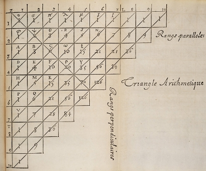

    [premières lignes du triangle de Pascal](https://commons.wikimedia.org/w/index.php?curid=3105222)

    Cette figure permet de calculer les coefficients binomiaux d'un polynôme (x+y) à la puissance n :

    $n=2,\left(x+y\right)^2=\ x^2+2xy+y^2$

    $n=3,\left(x+y\right)^3=\ x^3+3x^2y+3xy^2+y^3$

    $n=4,\left(x+y\right)^4=\ x^4+4x^3y+6x^2y^2+4xy^3+y^4$

    voir compléments sur la page wikipedia : [Lien](https://fr.wikipedia.org/wiki/Triangle_de_Pascal)

    **Propriétés :** 

    - Il est possible de calculer directement un coefficient binomial à l'aide de cette formule :
    $C\left(\begin{matrix}n\\k\\\end{matrix}\right)=\frac{n!}{k!\left(n-k\right)!}$

    - Un coefficient quelconque du triangle, situé à la ligne i et à la colonne j est calculé à partir de la formule de récurrence (i et j supérieurs à 1) :

    $C\left(\begin{matrix}i\\j\\\end{matrix}\right)=C\left(\begin{matrix}i-1\\j-1\\\end{matrix}\right)+C\left(\begin{matrix}i-1\\j\\\end{matrix}\right)$

    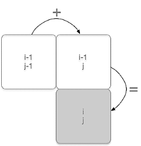

    Dans le triangle ci-dessous, cela signifie :

    1\. qu'on remplit les lignes une par une,
    
    2\. qu'on ajoute deux valeurs voisines d'une même ligne pour obtenir celle sous la valeur de droite.

    Par exemple le *3* est obtenu en faisant *1 + 2 = 3* (ses voisins du dessus).

    On rappelle que les coefficients situés aux bords du triangle de Pascal valent toujours 1.

    ---

    **1\. Compléter le triangle de Pascal suivant :**

    | **n\k** | **0** | **1** | **2** | **3** | **4** | **5** | **6** | **7** |
    |:---:|:---:|:---:|:---:|:---:|:---:|:---:|:---:|:---:|
    | 0 | 1 | | | | | | | |
    | 1 | 1 | 1 | | | | | | |
    | 2 | 1 | 2 | 1 | | | | | |
    | 3 | | | | | | | | |
    | 4 | | | | | | | | |
    | 5 | | | | | | | | |
    | 6 | | | | | | | | |
    | 7 | | | | | | | | |

    ---

    **2\. Écrire les fonctions `factorielle(n)` et `binome(n, k)`**
    ```python
    def factorielle(n):
        pass

    def binome(n, k):
        pass
    ```

    Tests :
    ```
    >>> binome(3, 2)
    3
    >>> binome(2, 3)
    0
    >>> binome(3, 0)
    1
    ```

    ---

    **3\. Écrire une fonction récursive `binome_rec(n, k)`**
    ```python
    def binome_rec(n, k):
        pass
    ```


     ---

    **4\. Écrire une fonction `pascal(n)`**
    ```python
    def pascal(n):
        pass
    ```

    Test :
    ```
    >>> pascal(9)
    [[1, 0, 0, 0, 0, 0, 0, 0, 0, 0],
     [1, 1, 0, 0, 0, 0, 0, 0, 0, 0],
     [1, 2, 1, 0, 0, 0, 0, 0, 0, 0],
     [1, 3, 3, 1, 0, 0, 0, 0, 0, 0],
     [1, 4, 6, 4, 1, 0, 0, 0, 0, 0],
     [1, 5, 10, 10, 5, 1, 0, 0, 0, 0],
     [1, 6, 15, 20, 15, 6, 1, 0, 0, 0],
     [1, 7, 21, 35, 35, 21, 7, 1, 0, 0],
     [1, 8, 28, 56, 70, 56, 28, 8, 1, 0],
     [1, 9, 36, 84, 126, 126, 84, 36, 9, 1]]
    ```

    ---

    On remarque que l'on calcule souvent les mêmes coefficients binomiaux :

    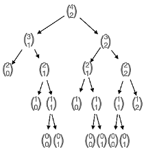

    arbre de calcul des coefficients pour n=4, k=2

    La mémoïsation consistera alors à stocker dans un tableau les solutions 
    pour les sous-problèmes afin de ne pas les recalculer…

    ---

    **5\. Écrire une fonction `pascal_dyn(n)` utilisant la programmation dynamique**
    ```python
    def pascal_dyn(n):
        pass
    ```


   

   
    


     

