---
author: ELP
title: 12 Algorithme de Boyer - Moore
---


📚 **Table des matières**

[1.	Les fonctions déjà implémentées dans python	](#_toc159537143)

[2.	La recherche textuelle naïve](#_toc159537146)

[3.	Application de l’algorithme de Boyer-Moore](#_toc159537151)


🎯 **Compétences évaluables**

- Etudier l’algorithme de Boyer-Moore pour la recherche d’un motif dans un texte


---


## <H2 STYLE="COLOR:BLUE;"> <a name="_toc159537143"></a>**🪅 1. Les fonctions déjà implémentées dans Python**</H2>

!!! info "🧠 **Capytale : Le code vous sera fourni par votre enseignant**"

---

### <H3 STYLE="COLOR:GREEN;"> <a name="_toc159537144"></a>**🎲 1.1. La méthode `index()`**</H3>

La méthode `index()` permet de rechercher une **sous-chaîne** dans une chaîne de caractères.

* Elle renvoie l’**indice de la première occurrence**
* Elle **lève une exception `ValueError`** si la sous-chaîne n’est pas trouvée

Exemple :

```python
texte = "Bonjour tout le monde"

print(texte.index("tout"))   # 7
print(texte.index("pomme"))  # ValueError
```

---

???+ question "🧠 **Activité n°1 — Utiliser la méthode `index()`**"
    👉 Écrire une fonction `trouve_lettre(c, texte)` qui :

    * renvoie l’indice de la **première occurrence** de `c` dans `texte`

    * renvoie `None` si la lettre n’est pas présente

    📌 **Indice** : utiliser `try / except`

    ```python
    def trouve_lettre(c, texte):
        """Renvoie l'indice de la première occurrence de c dans texte
        ou None si la lettre n'est pas trouvée"""
        pass

    assert trouve_lettre('j', 'bonjour') == 3
    assert trouve_lettre('j', 'alphabet') is None
    ```

    ??? success "✅ Solution"

        ```python
        def trouve_lettre(c, texte):
            try:
                return texte.index(c)
            except ValueError:
                return None

        assert trouve_lettre('j', 'bonjour') == 3
        assert trouve_lettre('j', 'alphabet') is None
        ```

---

#### 🔎 Vocabulaire essentiel

* **Motif** : chaîne de caractères recherchée

* **Occurrence** : position `i` telle que

  ```python
  texte[i:i+len(motif)] == motif
  ```

On compare toujours une fenêtre du texte de même longueur que le motif, que l’on décale progressivement dans le texte.

➡️ La recherche devient plus complexe lorsqu’on cherche un **motif** plutôt qu’un seul caractère.

---

### <H3 STYLE="COLOR:GREEN;"> <a name="_toc159537145"></a>**🛡️ 1.2. La méthode `find()`**</H3>

Contrairement à `index()` :

* `find()` **ne lève pas d’exception**

* elle renvoie `-1` si le motif n’est pas trouvé

Exemple :

```python
texte = "Bonjour tout le monde"

print(texte.find("tout"))    # 7
print(texte.find("pomme"))   # -1
```

---

???+ question "🧠 **Activité n°2 — Recherche dans un texte long**"
    📖 Télécharger le roman *Le Rouge et le Noir* :

    🔗 [https://www.gutenberg.org/ebooks/798.txt.utf-8](https://www.gutenberg.org/ebooks/798.txt.utf-8)

    ➡️ Renommer le fichier : `rougenoir.txt`

    👉 Vérifier :

    * si le motif **"Julien"** apparaît dans le texte

    * trouver une **deuxième occurrence**

    ```python
    fichier = open('rougenoir.txt', 'r', encoding='utf-8')
    stendhal = fichier.read()
    fichier.close()

    print(stendhal.find('Julien'))
    print(stendhal.find('Julien', 25378))
    ```

    ??? success "✅ Solution"

        * Le premier `find` renvoie l’indice de la **première occurrence**

        * Le second permet de rechercher **après une position donnée**, donc une autre occurrence

---


???+ question "🧠 **Activité n°3 — Compter les occurrences d’un motif (version itérative)**"
    👉 Dans cette activité, on cherche à compter le **nombre total d’occurrences** d’un **motif** dans un texte.

    📌 **Objectif**  
    
    Cette activité se déroule en deux étapes :
    
    1. Comprendre comment la méthode `find()` permet de localiser **une occurrence** d’un motif.
    
    2. Utiliser une **boucle** pour répéter cette recherche et compter **toutes les occurrences** du motif.

    👉 Compléter la fonction `nb_occurrences(texte, motif)` qui :
    - renvoie le **nombre total d’occurrences** du motif dans le texte ;
    - renvoie `0` si le motif n’apparaît pas.

    ```python
    def nb_occurrences(texte, motif):
        """Renvoie le nombre de fois où motif apparaît dans texte"""
        pass

    assert nb_occurrences('bonjour monsieur gaboriot votre abonnement est fini', 'bo') == 3
    assert nb_occurrences(stendhal, 'Julien') == 1908
    assert nb_occurrences(stendhal, 'amour') == 225
    assert nb_occurrences(stendhal, 'informatique') == 0
    ```

    ??? success "✅ Solution"

        ```python
        def nb_occurrences(texte, motif):
            count = 0
            pos = texte.find(motif)

            while pos != -1:
                count += 1
                pos = texte.find(motif, pos + 1)

            return count

        assert nb_occurrences('bonjour monsieur gaboriot votre abonnement est fini', 'bo') == 3
        assert nb_occurrences(stendhal, 'Julien') == 1908
        assert nb_occurrences(stendhal, 'amour') == 225
        assert nb_occurrences(stendhal, 'informatique') == 0
        ```

📝 **À retenir**
La méthode `find()` ne permet de trouver **qu’une occurrence à la fois** ;
c’est la **boucle** qui permet de détecter et de compter **toutes les occurrences** du motif.


---


**Conclusion** : index() et find() reposent sur des algorithmes similaires ; la différence porte uniquement sur la gestion de l’erreur (exception ou valeur -1).

Dans la suite du chapitre, nous n’utiliserons plus les méthodes intégrées, mais nous implémenterons nous-mêmes des algorithmes de recherche.


## <H2 STYLE="COLOR:BLUE;">🔎 <a name="_toc159537146"></a>**2. La recherche textuelle naïve**</H2>

---

### <H3 STYLE="COLOR:GREEN;">⚙️ <a name="_toc159537147"></a>**2.1. L’algorithme**</H3>

🎥 **Vidéo (6 premières minutes) : Recherche Boyer-Moore**
[https://ladigitale.dev/digiview/#/v/66c903de43b5c](https://ladigitale.dev/digiview/#/v/66c903de43b5c)

La **recherche naïve** (ou **force brute**) parcourt l’ensemble de la chaîne caractère après caractère.
À chaque position, on compare les lettres du motif avec celles du texte.

Le traitement est **simple**, **fiable**, mais **coûteux en temps**.

---

🖼️ **Illustrations**

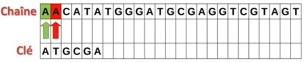

On compare chaque lettre du motif au texte.
Le **A** correspond, mais le **T** non → décalage.

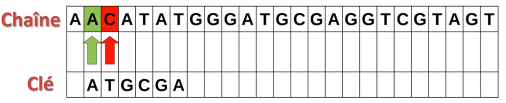

Le **A** correspond mais le **C** non → décalage.

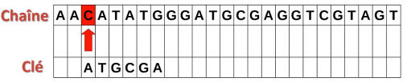

Le **C** ne correspond pas → décalage.

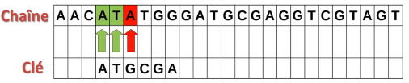

Le **A** et le **T** correspondent, mais le **G** non → décalage.

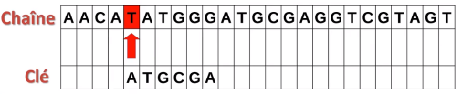

Le **A** ne correspond pas → décalage.

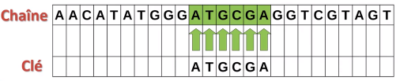

➡️ À chaque échec, on décale d’**un seul caractère** et on recommence.

---

### <H3 STYLE="COLOR:GREEN;">🧪 <a name="_toc159537148"></a>**2.2. Implémentation**</H3>

???+ question "🧠 **Activité n°4 — Implémenter la recherche naïve**"
    👉 Implémenter l’algorithme précédent en Python.

    ```python
    def recherche_naive(chaine, cle):
        long_txt = len(chaine)
        long_cle = len(cle)

        # Parcourir la chaîne de caractères
        pass
            # Tant que j est inférieur à la longueur de la clé et que
            # le caractère à la position i+j dans la chaîne est égal
            # au caractère à la position j dans la clé
            pass
            # Si j est égal à la longueur de la clé
            pass

        return -1


    texte = 'CAATGTCTGCACCAAGAC'
    motif = 'CAAG'
    assert recherche_naive(texte, motif) == 12
    assert recherche_naive(texte, 'BB') == -1
    ```

    ??? success "✅ Solution"

        ```python
        def recherche_naive(chaine, cle):
            long_txt = len(chaine)
            long_cle = len(cle)

            for i in range(long_txt - long_cle + 1):
                j = 0
                while j < long_cle and chaine[i + j] == cle[j]:
                    j += 1
                if j == long_cle:
                    return i

            return -1


        texte = 'CAATGTCTGCACCAAGAC'
        motif = 'CAAG'
        assert recherche_naive(texte, motif) == 12
        assert recherche_naive(texte, 'BB') == -1
        ```

---

### <H3 STYLE="COLOR:GREEN;">📈 <a name="_toc159537149"></a>**2.3. Complexité**</H3>

* Le texte contient **N** caractères
* Le motif contient **n** caractères
* Il y a **N − n + 1** positions possibles
* Chaque comparaison peut nécessiter jusqu’à **n** tests

➡️ **Complexité dans le pire des cas :**

la complexité est proportionnelle au produit de la taille du texte et du motif,

$O(n^2)$

Dans le cadre du lycée, on retient l’ordre de grandeur $O(n^2)$, sans distinguer précisément la taille du texte et celle du motif.

---

### <H3 STYLE="COLOR:GREEN;">⏱️ <a name="_toc159537150"></a>**2.4. Mesure du temps**</H3>

???+ question "🧠 **Activité n°5 — Comparer les temps d’exécution**"
    👉 Comparer la méthode intégrée `find()` et l’algorithme naïf.

    ```python
    from timeit import timeit

    def recherche_find(livre, texte):
        return livre.find(texte)

    def recherche_naif(livre, texte):
        return recherche_naive(livre, texte)

    livre = stendhal
    texte = 'Mme de Rênal fut fidèle à sa promesse'

    temps_find = timeit("recherche_find(livre, texte)", number=10, globals=globals())
    temps_naif = timeit("recherche_naif(livre, texte)", number=10, globals=globals())

    print("Temps en utilisant find :", temps_find)
    print("Temps en utilisant l'algorithme naïf :", temps_naif)
    ```

    ??? success "✅ Solution / Interprétation"

        * `find()` est **beaucoup plus rapide**

        * La recherche naïve devient **inefficace sur de grands textes**

        * ➜ **Besoin d’un algorithme optimisé**

---


## <H2 STYLE="COLOR:BLUE;">🚀 <a name="_toc159537151"></a>**3. Application de l’algorithme de Boyer-Moore**</H2>

---

### <H3 STYLE="COLOR:GREEN;">🧩 <a name="_toc159537152"></a>**3.1. Un cas concret**</H3>

L’algorithme de **Boyer-Moore** repose sur une idée clé :

> 👉 **Ne pas comparer inutilement tous les caractères**
> 👉 Exploiter les **discordances** pour effectuer des **sauts intelligents**

#### 🔎 Principe général

1. On compare le motif au texte **en partant de la fin du motif**
2. Tant que les caractères correspondent, on remonte dans le motif
3. Dès qu’il y a une discordance :

   * soit la lettre **n’existe pas dans le motif** → saut maximal
   * soit elle **existe** → saut jusqu’à sa position

---

#### 🎞️ Animations 

##### ▶️ 1ᵉʳ cas : la lettre n’est **pas présente** dans la clé

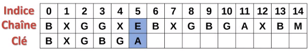

La lettre **E** ne correspond pas au **A** de la clé
👉 **E n’est pas dans la clé** → saut maximal (longueur de la clé)

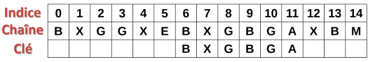

---

##### ▶️ 2ᵉ cas : la lettre est **présente** dans la clé

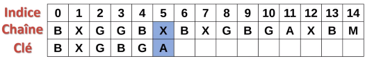

La lettre **X** ne correspond pas, mais **elle existe dans la clé** à l’indice 1
👉 On décale jusqu’à cette position

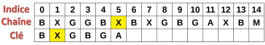

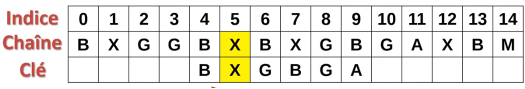

---

##### ▶️ 3ᵉ cas : discordance après plusieurs correspondances

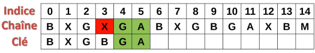

**A** et **G** correspondent, mais **X** ne correspond pas
👉 **X est dans la clé**

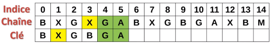

On décale de **2 positions**

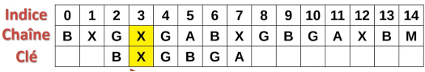

---

### <H3 STYLE="COLOR:GREEN;">🛠️ <a name="_toc159537153"></a>**3.2. Prétraitement du motif**</H3>

#### 🎯 Pourquoi un prétraitement ?

Avant de rechercher le motif dans le texte, on construit une **table de sauts** :

* pour chaque lettre du motif
* indiquant de combien on peut **décaler la fenêtre**

👉 Plus le motif est long, **plus les sauts sont grands**, donc plus l’algorithme est rapide.

---

#### 📋 Exemple : motif `TARTEMPION`

Table de sauts obtenue :

|  A  |  R  |  T  |  E  |  M  |  P  |  I  |  O  | Autre |
| :-: | :-: | :-: | :-: | :-: | :-: | :-: | :-: | :---: |
|  +8 |  +7 |  +6 |  +5 |  +4 |  +3 |  +2 |  +1 |  +10  |

Si la lettre rencontrée n’apparaît pas dans la table, on effectue le saut maximal correspondant à la longueur du motif.

---

Le prétraitement est la clé de l’efficacité de Boyer-Moore : il permet de décider rapidement de la taille du saut à effectuer.


???+ question "🧠 **Activité n°6 — Prétraitement du motif**"
    👉 Implémenter la fonction `pre_traitement(mot)` qui :

    * renvoie un **dictionnaire**
    * associe chaque lettre du motif à son **décalage**

    ```python
    def pre_traitement(mot):
        """Renvoie un dictionnaire avec pour clé la lettre et pour valeur le décalage"""
        decalages = {}
        n = len(mot)

        pass

    assert pre_traitement("dab") == {'d': 2, 'a': 1}
    assert pre_traitement("maman") == {'m': 2, 'a': 1}
    ```

    ??? success "✅ Solution"

        ```python
        def pre_traitement(mot):
            decalages = {}
            n = len(mot)

            for i in range(n - 1):
                decalages[mot[i]] = n - 1 - i

            return decalages


        assert pre_traitement("dab") == {'d': 2, 'a': 1}
        assert pre_traitement("maman") == {'m': 2, 'a': 1}
        ```

---

### <H3 STYLE="COLOR:GREEN;">⚙️ <a name="_toc159537154"></a>**3.3. L’algorithme de Boyer-Moore**</H3>

#### 🧠 Rappel du fonctionnement

À chaque étape :

- on compare **depuis la fin du motif**
- si discordance :

  * on consulte la **table de sauts**
  * on effectue un **décalage intelligent**

---

???+ question "🧠 **Activité n°7 — Implémenter Boyer-Moore**"
    👉 Implémenter une version qui :

    * renvoie `True` si le mot est trouvé
    * renvoie `False` sinon

    ```python
    def recherche_boyer(texte, mot):
        """Recherche un mot dans un texte avec l'algo de Boyer-Moore"""
        N = len(texte)
        n = len(mot)

        decalages = pre_traitement(mot)
        i = n - 1

        while i < N:
            lettre = texte[i]
            if lettre == mot[-1]:
                if texte[i - n + 1:i + 1] == mot:
                    return True
            if lettre in decalages:
                i += decalages[lettre]
            else:
                i += n

        return False


    assert recherche_boyer('abracadabra', 'dab')
    assert recherche_boyer('abracadabra', 'abra')
    assert recherche_boyer('abracadabra', 'obra') is False
    assert recherche_boyer('abracadabra', 'bara') is False
    assert recherche_boyer('maman est là', 'maman')
    assert recherche_boyer('bonjour maman', 'maman')
    assert recherche_boyer('bonjour maman', 'papa') is False
    ```

    ??? success "✅ Solution validée"
        ✔ Tous les tests passent
        ✔ Les sauts évitent les comparaisons inutiles
        ✔ L’algorithme est **nettement plus rapide** que le naïf

---

### <H3 STYLE="COLOR:GREEN;">⏱️ <a name="_toc159537155"></a>**3.4. Comparaison des temps**</H3>

???+ question "🧠 **Activité n°8 — Comparer les performances**"
    👉 Comparer les temps d’exécution entre :

    * la recherche naïve
    * l’algorithme de Boyer-Moore

    ```python
    temps_boyer = timeit("recherche_boyer(livre, texte)", number=10, globals=globals())
    print("Temps en utilisant l'algorithme naïf :", temps_naif)
    print("Temps en utilisant l'algorithme Boyer-Moore :", temps_boyer)
    ```

    ??? success "✅ Interprétation"

        * Boyer-Moore est **beaucoup plus rapide**
        * Les **sauts intelligents** font toute la différence
        * L’écart se creuse quand le texte devient long

---

> L’algorithme effectue des sauts dans le texte, ce qui réduit fortement le nombre de positions testées.
> Boyer-Moore n’est pas plus rapide parce qu’il compare mieux, mais parce qu’il évite des comparaisons inutiles.