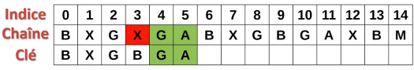

**Table des matières**

[1.	Les fonctions déjà implémentées dans python	1](#_toc159537143)

[2.	La recherche textuelle naïve	2](#_toc159537146)

[3.	Application de l’algorithme de Boyer-Moore	4](#_toc159537151)

**Compétences évaluables :**

- Etudier l’algorithme de Boyer-Moore pour la recherche d’un motif dans un texte

## **1. Les fonctions déjà implémentées dans python**

La méthode index()

On sait déjà chercher un **caractère** dans une chaîne de caractères.

|
**Activité n° AUTONUM  \* Arabic  : index() :** dans un fichier** recherche\_textuelle.py **:** écrivez une fonction trouve\_lettre(c, texte) qui renvoie le premier indice où l'on a trouvé la lettre c dans la chaîne de caractères texte, et qui renvoie None si la lettre cherchée ne s'y trouve pas.

def trouve\_lettre(c, texte): `    `"""renvoie l'indice de la première occurrence de c dans texte `    `ou renvoie None par convention sinon""" `    `pass  assert trouve\_lettre('j', 'bonjour') == 3 assert trouve\_lettre('j', 'alphabet') is None
|
| - |

Le problème est plus difficile quand il faut chercher non plus un seul caractère mais un **mot** dans le texte.

**Vocabulaire** :

- on ne parlera pas de 'mot' mais de **motif**, ce qui est plus général.
- quand on trouve le motif cherché à un endroit du texte, on dira qu'il s'agit d'une **occurrence** du motif dans le texte : cela désignera l'indice i tel que texte[i:i+1] == motif
  1. **La méthode find()**

Python dispose d'une méthode find() attachée aux objets chaînes de caractère qui permet justement de trouver un motif dans la chaîne

|
**Activité n° AUTONUM  \* Arabic  : find() :** télécharger le livre Le rouge et le noir de Stendhal, et chercher ensuite si le motif 'Julien’ apparaît quelque part dans le roman et trouver une deuxième occurrence du mot ‘Julien’

fichier = open('rougenoir.txt', 'r', encoding = 'utf-8') stendhal = fichier.read() fichier.close() …
|
| - |

La méthode find renvoie -1 si le motif cherché n'apparaît pas dans le texte. 

|
**Activité n° AUTONUM  \* Arabic  : find() :** Complétez ci-dessous le code de la fonction nb\_occurrences(texte, motif)

def nb\_occurrences(texte, motif): `    `"""renvoie le nombre de fois où motif apparaît dans texte """ `    `pass  assert nb\_occurrences('bonjour monsieur gaboriot votre abonnement est fini', 'bo') == 3 assert nb\_occurrences(stendhal, 'Julien') == 1908 assert nb\_occurrences(stendhal, 'amour') == 225 assert nb\_occurrences(stendhal, 'informatique') == 0
|
| - |

Autre réponse possible avec une fonction récursive.

|
**Activité n° AUTONUM  \* Arabic  : find() :** Complétez ci-dessous le code de la fonction nb\_occurrences\_rec(texte, motif)

import sys sys.setrecursionlimit(2000)  def nb\_occurrences\_rec(texte, motif, i=0): `    `occurence = texte.find(motif, i) `    `if occurence == -1 : `        `pass `    `else : `        `pass  assert nb\_occurrences\_rec('bonjour monsieur gaboriot votre abonnement est fini', 'bo') == 3 assert nb\_occurrences\_rec(stendhal, 'Julien') == 1908 assert nb\_occurrences\_rec(stendhal, 'amour') ==225 assert nb\_occurrences\_rec(stendhal, 'informatique') == 0
|
| - |

1. **La recherche textuelle naïve**
   1. **L’algorithme**

**Vidéo (6 premières minutes) : recherche Boyer Moore**

La **recherche naïve** ou de **force brute** parcourt l’ensemble de la chaine caractère après caractère. A chaque caractère, on réalise une comparaison afin de vérifier que la clé de recherche correspond au caractère suivant de la chaine. Le traitement est long mais sûr.

Exemple :

On compare chaque lettre de la clé à la chaine. Le A correspond, mais le T non. Donc on effectue un décalage

Le A correspond mais le C non. Donc on décale

Le C ne correspond pas. On décale

Le A correspond, le T correspond mais le G ne correspond pas. On décale

Le A ne correspond pas, on décale

Etc,

Le temps de traitement est **assez long** car il faut décaler à chaque fois d’un indice, car on parcourt l’ensemble de la chaine en comparant caractère après caractère. Dès qu’un caractère ne correspond pas il faut décaler d’un indice et recommencer.

On relève l’indice du texte où débute le motif reconnu et on peut recommencer la recherche

1. **Implémentation**

|
**Activité n° AUTONUM  \* Arabic  : Algorithme naif :** Implémenter l’algorithme précédent en Python** 

def recherche\_naive(chaine, cle): `    `long\_txt = len(chaine) `    `long\_cle = len(cle)  `    `# Parcourir la chaîne de caractères `    `pass `        `# Tant que j est inférieur à la longueur de la clé et que le caractère à la position i+j dans la chaîne est égal au caractère à la position j dans la clé `        `pass `        `## Si j est égal à la longueur de la clé (ce qui signifie que tous les caractères de la clé ont été trouvés dans la chaîne à partir de la position i) `        `pass

 `    `return -1   texte = 'CAATGTCTGCACCAAGAC' motif = 'CAAG' assert(recherche\_naive(texte, motif) == 12) assert(recherche\_naive(texte, 'BB') == -1)

|
| - |
1. **Complexité**
- Pour chaque position dans le texte (il y en a N-n+1), nous comparons le motif à la sous-chaîne du texte de la même longueur.
- Chaque comparaison prend n opérations dans le pire des cas (quand le motif est présent à la position courante ou diffère seulement par le dernier caractère).
- Donc, dans le pire des cas, nous effectuons (N-n) \* n comparaisons, d’où la complexité en **O(n²)**

1. **Mesure du temps**

On va reprendre ici le texte du roman *Le rouge et le noir* utilisé à la partie 1, et comparer les temps de recherche entre la fonction intégrée find de Python et notre fonction cherche.

|
**Activité n° AUTONUM  \* Arabic  : temps :** Tester

from timeit import timeit def recherche\_find(livre, texte): `    `return livre.find(texte)  def recherche\_naif(livre, texte): `    `return recherche\_naive(livre, texte )  livre = stendhal texte = 'Mme de Rênal fut fidèle à sa promesse' temps\_find = timeit("recherche\_find(livre, texte)", number=10, globals=globals()) temps\_naif = timeit("recherche\_naif(livre, texte)", number=10, globals=globals()) print("Temps en utilisant find : ",temps\_find) print("Temps en utilisant l'algorithme naif : ",temps\_naif)
|
| - |

1. **Application de l’algorithme de Boyer-Moore**
   1. **Un cas concret**

L’algorithme : 

1. On examine la chaine, en partant du **bout de la clé**, et **en remontant les caractères de la clé un par un jusqu’à trouver une discordance**
1. Si la lettre de la chaine examinée est identique à celle de la clé, **on remonte la clé**
1. Sinon on regarde si cette lettre existe dans la clé :
   1. Si elle n’existe pas : on peut faire un **saut maximal**
   1. Sinon : on réalise un saut jusqu’à **sa position**

**Animation**

<b>1er cas</b> :  la lettre n’est pas présente dans la clé

On positionne la clé en début de la chaine et on parcourt la chaine à partir du dernier élément de la clé. E ne correspond pas au A et **il n’y a pas de E dans la clé.** On **décale la clé de la longueur de celle-ci** c’est-à-dire de 6 indices

<b>2ème cas</b> : La lettre est présente dans la clé

Le X est non concordant avec le A de la clé par contre **il est présent dans la clé à l’indice 1**

On décale alors **de 4 indices**

Et on continue

<b>3ème cas</b> : une lettre présente dans la clé après quelques coïncidences

A est en correspondance, G est en correspondance mais X n’est pas en correspondance mais **il se trouve dans la clé**

On décale de **deux indices** 

Et on continue

1. **Prétraitement du motif** 

**Intérêt du prétraitement :** 

- l’algorithme connait les caractères qui se trouvent dans la clé
- Avant de lancer l’algorithme il faut créer une table de saut pour chaque caractère de la clé
  - Ecart minimal entre une lettre de la clé et la fin de la clé
  - La dernière lettre et traitée à part : écart maximal si elle n’est pas présente ailleurs dans la clé

Les sauts effectuer lors du traitement permettent de réduire sa durée. Plus la clé est longue plus l’algorithme est efficace pour la trouver car les sauts sont en moyenne plus grands.

Pour construire la table de sauts pour TARTEMPION, l’algorithme teste d’abord le 10ème caractère de ce texte. Si c’est un N, il regarde si le 9ème caractère est un O, puis le 8ème ,…jusqu’au 1er .

Si le caractère lu est E il faut décaler de 5 positions,

On obtient ainsi la table de sauts suivante selon les lettres lues :

|A|R|T|E|M|P|I|O|Autre|
| :-: | :-: | :-: | :-: | :-: | :-: | :-: | :-: | :-: |
|+8|+7|+6|+5|+4|+3|+2|+1|+10|

À chaque lecture d’une lettre, si la lettre correspond à la lettre recherchée, on compare les lettres précédentes pour vérifier s’il s’agit du motif cherché. Sinon, on utilise la table de sauts pour décaler la fenêtre de recherche.

|
**Activité n° AUTONUM  \* Arabic  : Algorithme pré-traitement :** Implémenter l’algorithme précédent en Python 

def pre\_traitement(mot): `    `"""Renvoie un dictionnaire avec pour clé la lettre et pour valeur le décalage""" `    `decalages = {} `    `n = len(mot)  `    `pass  assert pre\_traitement("dab") == {'d': 2, 'a': 1} assert pre\_traitement("maman") == {'m': 2, 'a': 1}
|
| - |

1. **L’algorithme**

La **première étape** est de réaliser le **pré-traitement c’est-à-dire la table de sauts**

A chaque examen jusqu’à la fin de la chaine (-longueur de la clé) : 

- Vérifier les **correspondances des caractères** en partant de la fin de la clé
- Si correspondance, on remonte **la clé à l’envers**, lettre après lettre
- Sinon, **on regarde dans la table de saut** si la lettre est présente :
  - Si la lettre est présente on fait le saut correspondant
  - Si la lettre est non présente on fait le saut maximal

|
**Activité n° AUTONUM  \* Arabic  : Algorithme boyer\_moore : Rajouter:** 

def recherche\_boyer(texte, mot): `    `"""Recherche un mot dans un texte avec l'algo de boyer-moore    """ `    `N = len(texte) `    `n = len(mot)  `    `# création de notre dictionnaire de décalages `    `decalages = pre\_traitement(mot)  `    `# on commence à la fin du mot `    `i = …      `    `while i < N: `        `lettre = … # on récupère la lettre à la positon i dans le texte `        `if lettre == … # si la lettre est la dernière du mot

 `            `# On vérifie que le mot est là avec un slice sur texte `            `if … `                `return True `        `# on décale `        `if lettre in …: `            `i += … `        `else: `            `i += …  `    `return False

  assert recherche\_boyer('abracadabra', 'dab') assert recherche\_boyer('abracadabra', 'abra') assert recherche\_boyer('abracadabra', 'obra') is False assert recherche\_boyer('abracadabra', 'bara') is False assert recherche\_boyer('maman est là', 'maman') assert recherche\_boyer('bonjour maman', 'maman') assert recherche\_boyer('bonjour maman', 'papa') is False
|
| - |

1. **Comparaison des temps**

|
**Activité n° AUTONUM  \* Arabic  : Algorithme boyer\_moore : Rajouter:**

temps\_boyer = timeit("recherche\_boyer(livre, texte)", number=10, globals=globals()) print("Temps en utilisant find : ",temps\_naif) print("Temps en utilisant l'algorithme Boyer-Moore : ",temps\_boyer)
|
| - |

