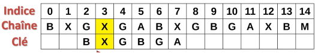

**Table des matières**

[1.	Les fonctions déjà implémentées dans python	1](#_toc159537143)

[2.	La recherche textuelle naïve	2](#_toc159537146)

[3.	Application de l’algorithme de Boyer-Moore	4](#_toc159537151)


**Compétences évaluables :**

- Etudier l’algorithme de Boyer-Moore pour la recherche d’un motif dans un texte


## <a name="_toc159537143"></a>**1. Les fonctions déjà implémentées dans python**

### <a name="_toc159537144"></a>**1.1. La méthode index()**

On sait déjà chercher un **caractère** dans une chaîne de caractères.

**Activité n° 1  : index() :** dans un fichier **recherche\_textuelle.py**: écrivez une fonction trouve\_lettre(c, texte) qui renvoie le premier indice où l'on a trouvé la lettre c dans la chaîne de caractères texte, et qui renvoie None si la lettre cherchée ne s'y trouve pas.
```python
def trouve_lettre(c, texte):
    """renvoie l'indice de la première occurrence de c dans texte
    ou renvoie None par convention sinon"""
    pass

assert trouve_lettre('j', 'bonjour') == 3
assert trouve_lettre('j', 'alphabet') is None
```

Le problème est plus difficile quand il faut chercher non plus un seul caractère mais un **mot** dans le texte.

**Vocabulaire** :

- on ne parlera pas de 'mot' mais de **motif**, ce qui est plus général.
- quand on trouve le motif cherché à un endroit du texte, on dira qu'il s'agit d'une **occurrence** du motif dans le texte : cela désignera l'indice i tel que texte[i:i+1] == motif

### <a name="_toc159537145"></a>**1.2. La méthode find()**

Python dispose d'une méthode find() attachée aux objets chaînes de caractère qui permet justement de trouver un motif dans la chaîne

**Activité n° 2  : find() :** 
**sur Thonny** : télécharger le livre Le rouge et le noir de Stendhal, 
ICI : [https://www.gutenberg.org/ebooks/798.txt.utf-8](https://www.gutenberg.org/ebooks/798.txt.utf-8)
renommer le 'rougenoir.txt'

et chercher ensuite si le motif 'Julien’ apparaît quelque part dans le roman et trouver une deuxième occurrence du mot ‘Julien’

```python
fichier = open('rougenoir.txt', 'r', encoding = 'utf-8')
stendhal = fichier.read()
fichier.close()
...
```

La méthode find renvoie -1 si le motif cherché n'apparaît pas dans le texte. 

**Activité n° 3  : find() :** Complétez ci-dessous le code de la fonction nb\_occurrences(texte, motif)
```python
def nb_occurrences(texte, motif):
    """renvoie le nombre de fois où motif apparaît dans texte """
    pass

assert nb_occurrences('bonjour monsieur gaboriot votre abonnement est fini', 'bo') == 3
assert nb_occurrences(stendhal, 'Julien') == 1908
assert nb_occurrences(stendhal, 'amour') == 225
assert nb_occurrences(stendhal, 'informatique') == 0
```


Autre réponse possible avec une fonction récursive.

**Activité n° 4  : find() :** Complétez ci-dessous le code de la fonction nb\_occurrences\_rec(texte, motif)
```python
import sys
sys.setrecursionlimit(2000)

def nb_occurrences_rec(texte, motif, i=0):
    occurence = texte.find(motif, i)
    if occurence == -1 :
        pass
    else :
        pass

assert nb_occurrences_rec('bonjour monsieur gaboriot votre abonnement est fini', 'bo') == 3
assert nb_occurrences_rec(stendhal, 'Julien') == 1908
assert nb_occurrences_rec(stendhal, 'amour') ==225
assert nb_occurrences_rec(stendhal, 'informatique') == 0
```


## <a name="_toc159537146"></a>**2. La recherche textuelle naïve**
### <a name="_toc159537147"></a>**2.1. L’algorithme**

**[Vidéo (6 premières minutes) : recherche Boyer Moore](https://ladigitale.dev/digiview/#/v/66c903de43b5c)**

La **recherche naïve** ou de **force brute** parcourt l’ensemble de la chaine caractère après caractère. A chaque caractère, on réalise une comparaison afin de vérifier que la clé de recherche correspond au caractère suivant de la chaine. Le traitement est long mais sûr.

Exemple :


On compare chaque lettre de la clé à la chaine. Le A correspond, mais le T non. Donc on effectue un décalage


Le A correspond mais le C non. Donc on décale


Le C ne correspond pas. On décale


Le A correspond, le T correspond mais le G ne correspond pas. On décale


Le A ne correspond pas, on décale

Etc,


Le temps de traitement est **assez long** car il faut décaler à chaque fois d’un indice, car on parcourt l’ensemble de la chaine en comparant caractère après caractère. Dès qu’un caractère ne correspond pas il faut décaler d’un indice et recommencer.

On relève l’indice du texte où débute le motif reconnu et on peut recommencer la recherche

### <a name="_toc159537148"></a>**2.2. Implémentation**

**Activité n° 5  : Algorithme naif :** Implémenter l’algorithme précédent en Python
```python
def recherche_naive(chaine, cle):
    long_txt = len(chaine)
    long_cle = len(cle)

    # Parcourir la chaîne de caractères
    pass
        # Tant que j est inférieur à la longueur de la clé et que le caractère à la position i+j dans la chaîne est égal au caractère à la position j dans la clé
        pass
        ## Si j est égal à la longueur de la clé (ce qui signifie que tous les caractères de la clé ont été trouvés dans la chaîne à partir de la position i)
        pass

    return -1


texte = 'CAATGTCTGCACCAAGAC'
motif = 'CAAG'
assert(recherche_naive(texte, motif) == 12)
assert(recherche_naive(texte, 'BB') == -1)
```


### <a name="_toc159537149"></a>**2.3. Complexité**
- Pour chaque position dans le texte (il y en a N-n+1), nous comparons le motif à la sous-chaîne du texte de la même longueur.
- Chaque comparaison prend n opérations dans le pire des cas (quand le motif est présent à la position courante ou diffère seulement par le dernier caractère).
- Donc, dans le pire des cas, nous effectuons (N-n) \* n comparaisons, d’où la complexité en **O(n²)**

### <a name="_toc159537150"></a>**2.4. Mesure du temps**

On va reprendre ici le texte du roman *Le rouge et le noir* utilisé à la partie 1, et comparer les temps de recherche entre la fonction intégrée find de Python et notre fonction cherche.

**Activité n° 6  : temps :** Tester
```python
from timeit import timeit
def recherche_find(livre, texte):
    return livre.find(texte)

def recherche_naif(livre, texte):
    return recherche_naive(livre, texte )

livre = stendhal
texte = 'Mme de Rênal fut fidèle à sa promesse'
temps_find = timeit("recherche_find(livre, texte)", number=10, globals=globals())
temps_naif = timeit("recherche_naif(livre, texte)", number=10, globals=globals())
print("Temps en utilisant find : ",temps_find)
print("Temps en utilisant l'algorithme naif : ",temps_naif)
```


## <a name="_toc159537151"></a>**3. Application de l’algorithme de Boyer-Moore**
### <a name="_toc159537152"></a>**3.1. Un cas concret**

L’algorithme : 

1\. On examine la chaine, en partant du **bout de la clé**, et **en remontant les caractères de la clé un par un jusqu’à trouver une discordance**
2\. Si la lettre de la chaine examinée est identique à celle de la clé, **on remonte la clé**
3\. Sinon on regarde si cette lettre existe dans la clé :
   1. Si elle n’existe pas : on peut faire un **saut maximal**
   1. Sinon : on réalise un saut jusqu’à **sa position**


**Animation**

<b>1<sup>er</sup> cas</b> :  la lettre n’est pas présente dans la clé


On positionne la clé en début de la chaine et on parcourt la chaine à partir du dernier élément de la clé. E ne correspond pas au A et **il n’y a pas de E dans la clé.** On **décale la clé de la longueur de celle-ci** c’est-à-dire de 6 indices


<b>2<sup>ème</sup> cas</b> : La lettre est présente dans la clé


Le X est non concordant avec le A de la clé par contre **il est présent dans la clé à l’indice 1**


On décale alors **de 4 indices**


Et on continue


<b>3<sup>ème</sup> cas</b> : une lettre présente dans la clé après quelques coïncidences


A est en correspondance, G est en correspondance mais X n’est pas en correspondance mais **il se trouve dans la clé**


On décale de **deux indices** 



Et on continue

### <a name="_toc159537153"></a>**3.2. Prétraitement du motif** 

**Intérêt du prétraitement :** 

-\ l’algorithme connait les caractères qui se trouvent dans la clé

-\ Avant de lancer l’algorithme il faut créer une table de saut pour chaque caractère de la clé

  - Ecart minimal entre une lettre de la clé et la fin de la clé
  - La dernière lettre et traitée à part : écart maximal si elle n’est pas présente ailleurs dans la clé

Les sauts effectuer lors du traitement permettent de réduire sa durée. Plus la clé est longue plus l’algorithme est efficace pour la trouver car les sauts sont en moyenne plus grands.


Pour construire la table de sauts pour TARTEMPION, l’algorithme teste d’abord le 10<sup>ème</sup> caractère de ce texte. Si c’est un N, il regarde si le 9<sup>ème</sup> caractère est un O, puis le 8<sup>ème</sup> ,…jusqu’au 1<sup>er</sup> .

Si le caractère lu est E il faut décaler de 5 positions,

On obtient ainsi la table de sauts suivante selon les lettres lues :

|A|R|T|E|M|P|I|O|Autre|
| :-: | :-: | :-: | :-: | :-: | :-: | :-: | :-: | :-: |
|+8|+7|+6|+5|+4|+3|+2|+1|+10|

À chaque lecture d’une lettre, si la lettre correspond à la lettre recherchée, on compare les lettres précédentes pour vérifier s’il s’agit du motif cherché. Sinon, on utilise la table de sauts pour décaler la fenêtre de recherche.

**Activité n° 7  : Algorithme pré-traitement :** Implémenter l’algorithme précédent en Python 
```python
def pre_traitement(mot):
    """Renvoie un dictionnaire avec pour clé la lettre et pour valeur le décalage"""
    decalages = {}
    n = len(mot)

    pass

assert pre_traitement("dab") == {'d': 2, 'a': 1}
assert pre_traitement("maman") == {'m': 2, 'a': 1}
```


### <a name="_toc159537154"></a>**3.3. L’algorithme**

La **première étape** est de réaliser le **pré-traitement c’est-à-dire la table de sauts**

A chaque examen jusqu’à la fin de la chaine (-longueur de la clé) : 

-\ Vérifier les **correspondances des caractères** en partant de la fin de la clé

-\ Si correspondance, on remonte **la clé à l’envers**, lettre après lettre

-\ Sinon, **on regarde dans la table de saut** si la lettre est présente :

  - Si la lettre est présente on fait le saut correspondant
  - Si la lettre est non présente on fait le saut maximal


**Activité n° 8  : Algorithme boyer\_moore : Rajouter:** 
```python
def recherche_boyer(texte, mot):
    """Recherche un mot dans un texte avec l'algo de boyer-moore    """
    N = len(texte)
    n = len(mot)

    # création de notre dictionnaire de décalages
    decalages = pre_traitement(mot)

    # on commence à la fin du mot
    i = …
    
    while i < N:
        lettre = … # on récupère la lettre à la positon i dans le texte
        if lettre == … # si la lettre est la dernière du mot

            # On vérifie que le mot est là avec un slice sur texte
            if …
                return True
        # on décale
        if lettre in …:
            i += …
        else:
            i += …

    return False


assert recherche_boyer('abracadabra', 'dab')
assert recherche_boyer('abracadabra', 'abra')
assert recherche_boyer('abracadabra', 'obra') is False
assert recherche_boyer('abracadabra', 'bara') is False
assert recherche_boyer('maman est là', 'maman')
assert recherche_boyer('bonjour maman', 'maman')
assert recherche_boyer('bonjour maman', 'papa') is False
```


### <a name="_toc159537155"></a>**3.4. Comparaison des temps**

**Activité n° 9  : Algorithme boyer\_moore : Rajouter:**
```python
temps_boyer = timeit("recherche_boyer(livre, texte)", number=10, globals=globals())
print("Temps en utilisant find : ",temps_naif)
print("Temps en utilisant l'algorithme Boyer-Moore : ",temps_boyer)
```


