---
author: ELP
title: 13 Les SOC
---

**Table des matières**

[1.	Historique et présentation	](#_toc162874814)

[2.	What can we find in a modern PC?	](#_toc162874817)

[3.	Les SOCs	](#_toc162874822)

[4.	Exercices	](#_toc162874826)

**Compétences évaluables :**

- Identifier les principaux composants sur un schéma de circuit et les avantages de leur intégration en termes de vitesse et de consommation

## <H2 STYLE="COLOR:BLUE;"> **1. Historique et présentation**</H2>

[lien vidéo](http://www.lumni.fr/video/une-histoire-de-l-architecture-des-ordinateurs)

[Une vidéo en anglais](https://youtu.be/NKfW8ijmRQ4)

Pour regarder la vidéo avec les sous-titres en français :

- Cliquer pour regarder dans YouTube
- Sélectionner les paramètres
- Sélectionner sous-titres
- Sélectionner traduire automatiquement
- Sélectionner français

### <H3 STYLE="COLOR:GREEN;"> **1.1. La Loi de Moore**</H3>

En 1965, Gordon Moore postule que le **nombre de transistors présents sur une puce de microprocesseur doublera tous les deux ans**.

Cette prédiction s'est révélée étonnamment juste (à quelques approximations près) et les équipements électroniques n'ont depuis jamais cessé de devenir toujours plus performants / miniatures / économes en énergie.

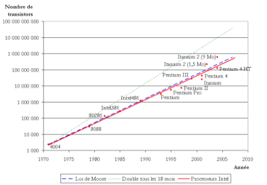{: .center}

### <H3 STYLE="COLOR:GREEN;"> **1.2. Evolution de la taille des ordinateurs**</H3>
- IBM 650, le premier ordinateur fabriqué en série (1955) 

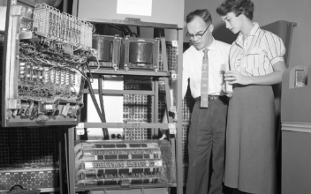{: .center}

Cet ordinateur n'a pas encore de transistors mais des tubes à vide.

- IBM 7090, le premier ordinateur à transistors (1959) 

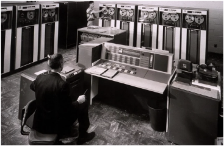{: .center}

- Le rôle crucial de la taille des transistors

Ainsi que l'avait prédit Moore, c'est la progression du nombre de transistors gravables sur le processeur qui guidera pendant des années l'évolution de l'informatique :

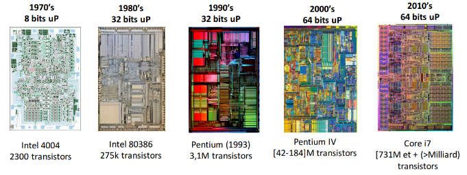{: .center}

Le transistor est un composant électronique essentiel : il permet de laisser (ou non) passer un courant électrique.

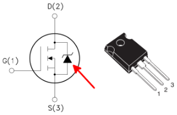{: .center}

## <H2 STYLE="COLOR:BLUE;"> **2. What can we find in a modern PC?**</H2>
### <H3 STYLE="COLOR:GREEN;"> **2.1. Composition**</H3>

Dans un ordinateur “classique” tel qu’un PC de bureau, le « hardware » est organisé autour de 4 éléments principaux: 

- **le processeur (CPU – Central Processing Unit)** se charge de réaliser les calculs les plus courants, ceux qui permettent par exemple de faire tourner le système d’exploitation ou un navigateur web. 
- **la mémoire vive (RAM – Random Access Memory)** permet d’enregistrer temporairement les données traitées par le processeur. 
- **la carte graphique (ou GPU – Graphics Processing Unit)** se charge d’afficher une image, qu’elle soit en 2D ou bien en 3D comme dans les jeux. 
- **la carte-mère (Motherboard)** permet l’acheminement des données entre les composants (CPU, RAM, GPU, disque dur, SSD, cartes réseau …) via des « BUS ».

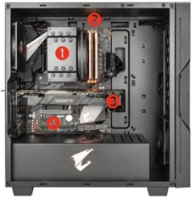{: .center}

Principaux éléments d’un PC :

1. CPU surmonté d’un dissipateur thermique (ventirad)
2. Barrettes de RAM
3. GPU
4. Carte mère

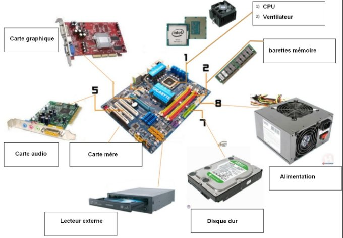{: .center}

### <H3 STYLE="COLOR:GREEN;"> **2.2. Revisions (1ère NSI)**</H3>
#### <H4 STYLE="COLOR:MAGENTA;"> **2.2.1. L’architecture de Von-Neumann (❤️❤️❤️)**</H4>

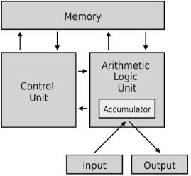{: .center}

**L’Unité Centrale de Traitement** (**Central Processing Unit** en anglais) ou Processeur est constituée de deux sous-unités :

- **L’Unité de contrôle** charge la prochaine instruction dont l’adresse mémoire se trouve dans un registre appelé Compteur de Programme (**PC** en anglais) ou Compteur ordinal, la décode avec le décodeur et commande l’exécution par l’ALU avec le séquenceur. 
- **L’Unité Arithmétique et Logique** (ALU en anglais) qui réalise des opérations arithmétiques (addition, multiplication . . .), logiques (et, ou . . .), de comparaisons ou de déplacement de mémoire (copie de ouvers la mémoire). L’ALU stocke les données dans des mémoires d’accès très rapide appelées registres. Les opérations sont réalisées par des circuits logiques constituant le jeu d’instructions du processeur.

La **mémoire** où sont stockés les données et les programmes.

Des **bus** qui sont des fils reliant le CPU et la mémoire et permettant les échanges de données et d’adresses. Les adresses, les données et les commandes circulent par les bus.

Des **dispositifs d’entrées/sorties** permettant d’échanger avec l’extérieur (lecture ou écriture de données).

👉 Dans le modèle de Von Neumann, le processeur exécute une instruction à la fois, **de façon séquentielle.**

#### <H4 STYLE="COLOR:MAGENTA;"> **2.2. Les puces**</H4>

On entend souvent dire que les smartphones sont de véritables ordinateurs, ce qui est vrai. 

Si les smartphones sont des ordinateurs, on doit obligatoirement trouver à l'intérieur les mêmes composants que dans un PC : CPU, RAM, carte graphique et interfaces réseau !

La solution ? Placer tous ces composants dans une puce unique d'une centaine de mm² :

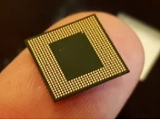{: .center}

Ces puces accueillant CPU, RAM, circuit graphique (GPU : équivalent à la carte graphique dans un PC) et circuits radio (Wifi et Bluetooth), sont souvent appelées "système sur puce" , "**system on a chip**" en anglais dont l'abréviation commune est "**SoC**".

## <H2 STYLE="COLOR:BLUE;"> **3. Les SoCs**</H2>
### <H3 STYLE="COLOR:GREEN;"> **3.1. Les composants sur des puces**</H3>

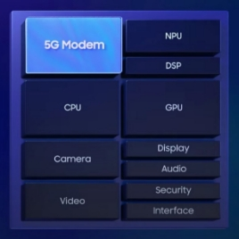{: .center}
Un système sur puce (System on Chip – SoC), comme le microcontrôleur, rassemble donc sur une seule puce (circuit intégré) différents composants, comme :

- des microprocesseurs (principal, graphique, …)
- des mémoires (RAM, flash, …)
- des périphériques d’interface (Wifi, BlueTooth, …)
- des capteurs (GPS, …) 

Exemple du SoC Exynos 2100 qui équipe les Galaxy\_S21

On y trouve:

- **Le processeur** (CPU)
- **Le carte graphique** (GPU)
- **La puce neuronale** ou Neutral Processing Unit (NPU), est une puce en charge de l’intelligence artificielle de votre smartphone.
- **Le modem** qui gère non seulement le Wifi, Bluetooth, le NFC ou bien encore les technologies mobiles. C’est-à-dire la 5G mais également de plus vieux réseaux tels que la 3G ou 4G.
- **Le processeur de signal numérique** ou Digital Signal Processor (DSP) est en charge de traiter les signaux numériques. Ainsi, il va permettre le filtrage, la compression ou encore l’extraction de différents signaux tels que la musique ou encore une vidéo.
- **Le processeur d’image** ou Image Signal Processor (ISP) est une puce prenant en charge la création d’images numériques comme le Qualcomm

 Spectra, qui se charge des différents traitements numériques relatifs aux images prises par l’appareil photo. 

  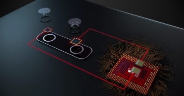{: .center}

  Clear Sight, le double capteur version Qualcomm

- **Le processeur sécurité** ou Secure Processing Unit (SPU) est le bouclier de votre smartphone. Son alimentation électrique est indépendante afin de ne pas pouvoir être éteint en cas d’attaque sur celui-ci. Le SPU est d’une importance capitale, celui-ci va stocker vos données biométriques, bancaires, votre SIM ou encore vos titres de transport. C’est lui qui contient les clés de chiffrement de vos données.)
- ET les différentes choses qui ne sont pas représentées sur le schéma, **la mémoire**, 

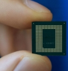{: .center}

SoC Exynos 2100 qui équipe les Galaxy\_S21

### <H3 STYLE="COLOR:GREEN;"> **3.2. Les avantages/inconvénients**</H3>

😀 Présents sur les systèmes nomades (smartphone, tablettes, …) et dans les systèmes embarqués (voitures, robots, …), les SoC disposent de nettement plus de puissance de calcul que les microcontrôleurs et sont équipés de périphériques de plus haut niveau.

Moins puissants que les ordinateurs avec carte mère, ils présentent néanmoins de nombreux avantages:

- Faible consommation énergétique : composants plus proches, donc moins de câblage
- Faible coût de production : l’automatisation est favorisée par la compacité du système
- Plus grande sécurité : la conception globale (matériel et micrologiciel) interdit l’ajout ou l’échange de composants.

En revanche, il devient impossible de remplacer un composant défectueux (mémoire, périphérique, …) , comme on le ferait sur la carte mère.

## <H2 STYLE="COLOR:BLUE;"> **4. Exercices**</H2>

=> **CAPYTALE Le code vous sera donné par votre enseignant**

**<H3 STYLE="COLOR:red;">Exercice n°1 :**</H3>

1\. Qu’est-ce qu’un SoC ?

2\. Quels sont les appareils à base de SoC ?

3\. Au niveau hardware, qu’est-ce qui différencie fondamentalement un SoC des composants d’un ordinateur ?

4\. Pourquoi les CPU d’un SoC embarquent-ils plusieurs cœurs ? 

5\. Donner un ordre de grandeur de la fréquence du CPU d’un SoC. 

6\. Sur quel paramètre influe la fréquence du CPU d’un SoC ?

7\. Qu’est-ce qu’un thread ?

8\. Qu’est-ce que la mémoire cache d’un CPU ?

9\. Dans un SoC, à quoi sert le GPU ?

10\. Dans un SoC, quel élément est chargé du traitement des photos prises par la (les) caméra(s) intégrée(s) au smartphone ?

11\. Dans un SoC, quel élément permet de lire de l’audio ou de la vidéo ?

12\. Dans un SoC, à quoi sert le SPU ?

13\. Quel élément d’un SOC permet à un smartphone de communiquer avec d’autres machines ?

14\. Quels sont les principaux avantages d’un SoC ?

15\. Citer le principal inconvénient d’un SoC.

16\. Pour les modèles 2019-2020 de téléphones portables, quelle est la finesse de gravures des SoC ?

17\. Quel est l’ordre de grandeur de la surface d’un SoC ?

18\. Quel est l’ordre de grandeur du nombre de transistors présents sur un SoC ?

19\. Quel est l’ordre de grandeur de la densité moyenne de transistors par mm² dans un SoC ?

20\. Quelle sera la finesse de gravure des SoC pour la prochaine génération de smartphone ?

21\. Quelle est la principale difficulté technologique rencontrée à l’heure actuelle par les concepteurs de SoC ?

**<H3 STYLE="COLOR:red;">Exercice n°2 :**</H3>

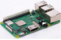{: .center}

À partir de l'article du site [elektormagazine.fr](https://www.elektormagazine.fr/news/un-soc-combine-pour-dynamiser-les-performances-du-raspberry-pi-3-modele-b)

1) Relevez les différentes caractéristiques du SoC du Raspberry Pi 3 modèle B+\.

2) Les comparez au SoC du Raspberry Pi 4\.

3) Quelles sont les principales évolutions qui contribuent à ce gain? Une copie de l'article disponible dans le dossier ressource.

**<H3 STYLE="COLOR:red;">Exercice n°3 :**</H3>

Sur l’image d’un SoC on peut lire Adreno 630, Hexagon 685, Kryo 385, X20 LTE, Spectra 280. À quels composants du SoC correspondent ces dénominations ?

**<H3 STYLE="COLOR:red;">Exercice 4 : Identification des composants sur un schéma de circuit**</H3>

Expliquez brièvement le rôle de chacun de ces composants dans le SoC :
    - CPU (Central Processing Unit)
    - GPU (Graphics Processing Unit)
    - RAM (Random Access Memory)
    - Interface réseau
    - Mémoire flash
    - Module de gestion de l'énergie (PMIC)

**<H3 STYLE="COLOR:red;">Exercice 5 : Analyse des avantages de l'intégration des composants**</H3>

Un concepteur de circuits vous demande de justifier l'utilisation d'un SoC plutôt qu'un assemblage de composants séparés pour un smartphone.

1. Comparez la vitesse d'exécution entre un SoC intégrant CPU, GPU et RAM sur une seule puce et un système où ces composants sont séparés.
2. Expliquez en quoi l'intégration des composants dans un SoC peut réduire la consommation d'énergie par rapport à un système de composants séparés.
3. Discutez des avantages et des inconvénients de l'intégration des composants du point de vue de la maintenance et des mises à jour matérielles.
