---
author: ELP
title: 13 Les SOC
---

📚 **Table des matières**

[1.	Historique et présentation	](#_toc162874814)  
[2.	What can we find in a modern PC?	](#_toc162874817)  

🎯 **Compétences évaluables**

- Identifier les principaux composants sur un schéma de circuit  
- Comprendre les avantages de l’intégration des composants en termes de vitesse et de consommation  

---

## <H2 STYLE="COLOR:BLUE;"> 🕰️ **1. Historique et présentation**</H2>

🎯 **Objectif de cette partie**

Comprendre comment l’évolution technologique des composants électroniques a conduit à l’intégration massive de fonctions matérielles sur une seule puce, préfigurant l’apparition des **System on a Chip (SoC)**.

---

🎥 **Vidéos d’introduction**

- 📺 [Une histoire de l’architecture des ordinateurs – Lumni](http://www.lumni.fr/video/une-histoire-de-l-architecture-des-ordinateurs)  
- 🌍 [Vidéo en anglais – YouTube](https://youtu.be/NKfW8ijmRQ4)

📝 *Astuce pour activer les sous-titres en français sur YouTube* :

- Cliquer sur **Paramètres**

- Sélectionner **Sous-titres**

- Choisir **Traduire automatiquement**

- Sélectionner **Français**

---

### <H3 STYLE="COLOR:GREEN;"> 📈 **1.1. La loi de Moore**</H3>

En 1965, **Gordon Moore**, cofondateur d’Intel, postule que le **nombre de transistors présents sur une puce de microprocesseur double environ tous les deux ans**.

Cette prédiction s’est révélée remarquablement juste (à quelques variations près) et explique pourquoi, depuis plusieurs décennies, les équipements électroniques deviennent :

- 🚀 plus performants  

- 📉 plus compacts  

- 🔋 plus économes en énergie  

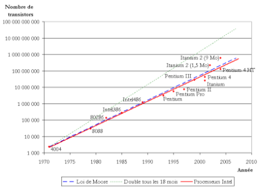{: .center}

👉 **La loi de Moore explique pourquoi il est devenu possible d’intégrer toujours plus de composants sur une même puce.**

---

### <H3 STYLE="COLOR:GREEN;"> 🏗️ **1.2. Évolution de la taille des ordinateurs**</H3>

#### 🖥️ Premiers ordinateurs

- **IBM 650** (1955), premier ordinateur fabriqué en série  

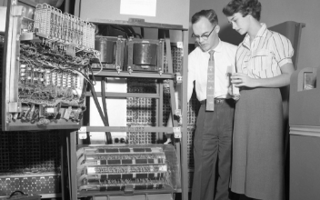{: .center}

➡️ Cet ordinateur ne contient **aucun transistor**, mais utilise des **tubes à vide**.

---

- **IBM 7090** (1959), premier ordinateur à transistors  

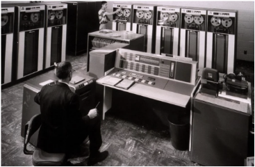{: .center}

---

#### 🔬 Le rôle crucial de la taille des transistors

Comme l’avait anticipé Moore, c’est la capacité à **réduire la taille des transistors** et à en **augmenter le nombre sur une puce** qui a guidé l’évolution de l’informatique :

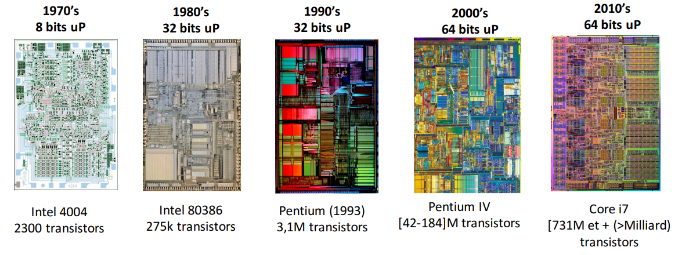{: .center}

Cette miniaturisation permet non seulement :

- d’augmenter la puissance de calcul,

- mais aussi de **regrouper plusieurs fonctions matérielles sur un même circuit intégré**.

---

#### 🔌 Le transistor : composant fondamental

Le **transistor** est un composant électronique essentiel : il permet de **laisser passer ou non un courant électrique**.

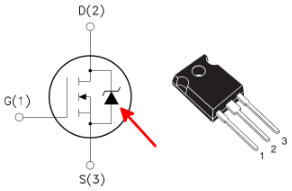{: .center}

Dans un processeur, les transistors servent notamment à :

- réaliser des **opérations logiques et arithmétiques**,

- stocker temporairement des informations,

- contrôler l’exécution des instructions.

---

🧩 **Conclusion**

L’évolution de l’informatique est directement liée à la miniaturisation des transistors.  
Cette progression technologique a rendu possible l’intégration de composants autrefois séparés au sein d’un **même circuit intégré**.

➡️ Cette logique d’intégration conduit naturellement au concept de **System on a Chip (SoC)**, au cœur des systèmes modernes comme les smartphones.

---

## <H2 STYLE="COLOR:BLUE;"> **🧠 2. What can we find in a modern PC? (Que trouve-t-on dans un PC moderne ?)**</H2>

### <H3 STYLE="COLOR:GREEN;"> 🧩 **2.1. Composition d’un PC moderne**</H3>

Dans un ordinateur « classique » tel qu’un **PC de bureau**, le matériel (*hardware*) est organisé autour de **quatre éléments principaux** :

- 🧠 **Le processeur (CPU – Central Processing Unit)**  
  Il réalise les calculs nécessaires à l’exécution des programmes (système d’exploitation, navigateur web, logiciels…).

- 🧠 **La mémoire vive (RAM – Random Access Memory)**  
  Elle stocke **temporairement** les données utilisées par le processeur afin d’y accéder rapidement.

- 🎮 **La carte graphique (GPU – Graphics Processing Unit)**  
  Elle calcule et affiche les images, en **2D ou en 3D** (jeux vidéo, vidéos, interfaces graphiques).

- 🧩 **La carte mère (Motherboard)**  
  Elle assure la **communication entre tous les composants** (CPU, RAM, GPU, stockage, réseau…) via des **bus**.

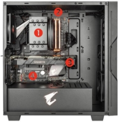{: .center}

📌 **Principaux éléments visibles sur la carte mère** :

1. CPU (surmonté d’un dissipateur thermique)

2. Barrettes de RAM

3. Carte graphique (GPU)

4. Carte mère

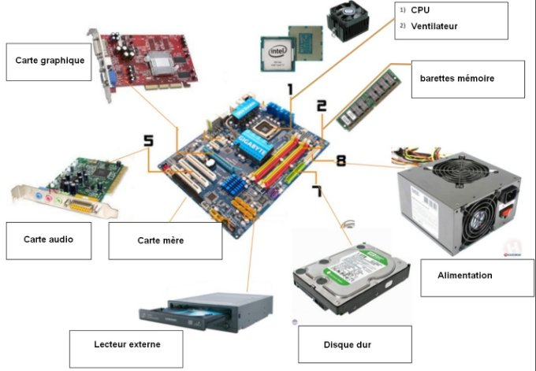{: .center}

---

📝 **À retenir**

👉 Dans un PC classique, **chaque composant est séparé physiquement** et relié aux autres par des **liaisons matérielles** (bus, pistes, câbles).

---

### <H3 STYLE="COLOR:GREEN;"> 🔁 **2.2. Révisions – Architecture matérielle (1ʳᵉ NSI)**</H3>

#### <H4 STYLE="COLOR:MAGENTA;"> ❤️ **2.2.1. L’architecture de Von Neumann**</H4>

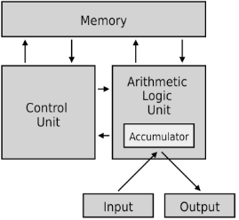{: .center}

Dans l’architecture de **John von Neumann**, mathématicien et informaticien, un ordinateur est organisé autour de plusieurs blocs fonctionnels.

---

🧠 **L’Unité Centrale de Traitement (CPU)** est composée de deux sous-unités :

- 🔄 **L’unité de contrôle**  
  Elle :

   * récupère l’instruction à exécuter depuis la mémoire,

   * la décode,

   * pilote son exécution.

- ➕ **L’unité arithmétique et logique (ALU)**  
  Elle effectue :

   * des calculs arithmétiques (addition, multiplication…),
  
   * des opérations logiques (ET, OU…),
  
   * des comparaisons.

Les données manipulées sont stockées dans des **registres**, des mémoires internes **très rapides**.

---

💾 **La mémoire**

Elle stocke :

- les **programmes**,

- les **données** utilisées par le processeur.

---

🔗 **Les bus**

Ce sont des ensembles de fils permettant de transporter :

- les **adresses**,

- les **données**,

- les **commandes**  

entre le processeur, la mémoire et les périphériques.

---

🔌 **Les dispositifs d’entrées/sorties**

Ils permettent la communication avec l’extérieur :

- clavier, souris,

- écran,

- réseau,

- stockage.

---

🧠 **Caractéristique essentielle**

👉 Dans le modèle de Von Neumann, le processeur exécute les instructions **une par une**, **de manière séquentielle**.

---

#### <H4 STYLE="COLOR:MAGENTA;"> 📱 **2.2.2. Des ordinateurs… dans nos poches**</H4>

On entend souvent dire que les **smartphones sont de véritables ordinateurs**.  
C’est exact.

➡️ Un smartphone doit donc contenir :

- un CPU,

- de la RAM,

- un GPU,

- des interfaces réseau.

Mais contrairement à un PC, il serait **impossible** de placer tous ces composants **séparément** dans un appareil aussi compact.

---

🧩 **La solution technologique**

➡️ Regrouper **tous les composants sur une seule puce**, d’une surface de quelques centaines de mm² :

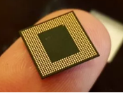{: .center}

Ces puces sont appelées :

> **System on a Chip**  
> ou **SoC** (système sur puce)

Elles intègrent notamment :

- le processeur,

- la mémoire,

- le processeur graphique,

- les interfaces réseau.

---

🧩 **Conclusion**

Un PC est composé de **composants séparés** reliés par des bus.  
À l’inverse, les appareils mobiles ont conduit à une **intégration extrême** de ces composants sur **une seule puce**.

➡️ Cette intégration constitue le principe fondamental des **SoC**, que nous allons étudier dans la partie suivante.

---

## <H2 STYLE="COLOR:BLUE;"> 🧩 **3. Les SoC (System on Chip)**</H2>

### <H3 STYLE="COLOR:GREEN;"> 🧠 **3.1. Les composants intégrés sur une puce**</H3>

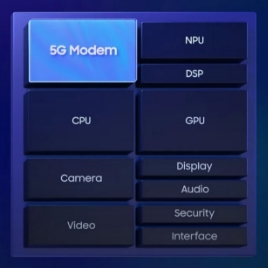{: .center}

Un **System on Chip (SoC)** est un **circuit intégré unique** qui regroupe, sur **une seule puce**, l’ensemble des composants nécessaires au fonctionnement d’un système informatique complet.

👉 On retrouve dans un SoC des éléments qui, dans un PC classique, sont **physiquement séparés**.

---

🧩 **Un SoC intègre généralement :**

- 🧠 **Des processeurs**

   * CPU (processeur principal)
  
   * GPU (processeur graphique)

- 💾 **Des mémoires**
  
   * RAM
  
   * mémoire flash

- 📡 **Des interfaces et périphériques**
  
   * Wi-Fi
  
   * Bluetooth
  
   * NFC
  
   * GPS

- 📷 **Des processeurs spécialisés**
  
   * traitement d’image
  
   * traitement du son
  
   * intelligence artificielle

---

📱 **Exemple concret : SoC Exynos 2100**  
(utilisé notamment dans les Galaxy S21)

On y trouve :

- 🧠 **Le processeur (CPU)**  
  Responsable de l’exécution générale des programmes.

- 🎮 **La carte graphique (GPU)**  
  En charge de l’affichage et des calculs graphiques.

- 🤖 **La puce neuronale (NPU – Neural Processing Unit)**  
  Dédiée aux calculs liés à l’**intelligence artificielle**  
  (reconnaissance faciale, photo, traduction, assistants vocaux…).

- 📡 **Le modem**  
  Gère :

   * le Wi-Fi,
  
   * le Bluetooth,
  
   * le NFC,
  
   * les réseaux mobiles (3G, 4G, 5G).

- 🎵 **Le processeur de signal numérique (DSP – Digital Signal Processor)**  
  Spécialisé dans :

   * le traitement audio,
  
   * la vidéo,
  
   * la compression et le filtrage des signaux.

- 📷 **Le processeur d’image (ISP – Image Signal Processor)**  
  En charge du traitement des images issues des caméras.

  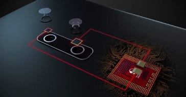{: .center}

  Exemple : le module **Spectra** développé par **Qualcomm**.

- 🔐 **Le processeur de sécurité (SPU – Secure Processing Unit)**  
  Véritable **coffre-fort matériel**, il stocke :
  
   * données biométriques,
  
   * informations bancaires,
  
   * clés de chiffrement,
  
   * données de la carte SIM.

  👉 Son alimentation est **indépendante** pour garantir la sécurité.

- 💾 **La mémoire**  
  (non toujours représentée sur les schémas)

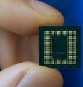{: .center}

---

📝 **À retenir**

👉 Un SoC est un **ordinateur complet miniaturisé** sur une seule puce, optimisé pour la **performance**, la **consommation énergétique** et la **sécurité**.

---

### <H3 STYLE="COLOR:GREEN;"> ⚖️ **3.2. Avantages et inconvénients des SoC**</H3>

😀 Les SoC sont omniprésents dans :

- les **smartphones**,

- les **tablettes**,

- les **systèmes embarqués** (voitures, objets connectés, robots…).

Ils sont **nettement plus puissants** que les microcontrôleurs et disposent de périphériques de haut niveau.

---

✅ **Avantages principaux**

- 🔋 **Faible consommation énergétique**  
  Les composants sont très proches → moins de pertes électriques.

- 💰 **Coût de production réduit**  
  La forte intégration favorise l’automatisation industrielle.

- 🔐 **Sécurité renforcée**  
  L’intégration matérielle empêche :

   * l’ajout de composants non autorisés,
  
   * la modification physique du système.

- 🚀 **Performances élevées**  
  Les échanges entre composants sont très rapides car ils sont situés sur la même puce.

---

❌ **Inconvénient majeur**

- 🔧 **Maintenance impossible**  
  Contrairement à un PC :

   * un composant défectueux ne peut pas être remplacé,
  
   * toute la puce doit être changée.

---

🧩 **Conclusion**

Les **SoC** représentent l’aboutissement de la miniaturisation informatique : ils intègrent sur une seule puce l’ensemble des composants nécessaires au fonctionnement d’un système moderne.

👉 Cette intégration explique pourquoi les smartphones sont à la fois :

- puissants,

- compacts,

- économes en énergie,

- mais peu réparables.

---

## <H2 STYLE="COLOR:BLUE;"> 📝 **4. Exercices**</H2>

!!! info "🧠 **Capytale : le code ou les documents seront fournis par votre enseignant**"

---

### <H3 STYLE="COLOR:red;">🧪 **Exercice n°1 — Compréhension générale**</H3>

👉 Répondre aux questions suivantes :

1. Qu’est-ce qu’un **SoC** ?  
2. Quels types d’appareils utilisent des SoC ?  
3. Au niveau **hardware**, qu’est-ce qui différencie fondamentalement un SoC  
   des composants d’un ordinateur classique ?  
4. Pourquoi les CPU d’un SoC embarquent-ils **plusieurs cœurs** ?  
5. Donner un **ordre de grandeur** de la fréquence du CPU d’un SoC.  
6. Sur quel paramètre influe la fréquence du CPU d’un SoC ?  
7. Qu’est-ce qu’un **thread** ?  
8. Qu’est-ce que la **mémoire cache** d’un CPU ?  
9. Dans un SoC, à quoi sert le **GPU** ?  
10. Dans un SoC, quel élément est chargé du traitement des **photos** prises par la (les) caméra(s) ?  
11. Dans un SoC, quel élément permet de lire de l’**audio** ou de la **vidéo** ?  
12. Dans un SoC, à quoi sert le **SPU** ?  
13. Quel élément d’un SoC permet à un smartphone de **communiquer** avec d’autres machines ?  
14. Quels sont les **principaux avantages** d’un SoC ?  
15. Citer le **principal inconvénient** d’un SoC.  
16. Pour les modèles 2019–2020 de smartphones, quelle est la **finesse de gravure** des SoC ?  
17. Quel est l’ordre de grandeur de la **surface** d’un SoC ?  
18. Quel est l’ordre de grandeur du **nombre de transistors** présents sur un SoC ?  
19. Quel est l’ordre de grandeur de la **densité moyenne de transistors** par mm² ?  
20. Quelle sera la **finesse de gravure** des SoC pour la prochaine génération de smartphones ?  
21. Quelle est aujourd’hui la **principale difficulté technologique** rencontrée par les concepteurs de SoC ?

---

### <H3 STYLE="COLOR:red;">📊 **Exercice n°2 — Étude comparative de SoC**</H3>

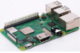{: .center}

À partir de l’article du site  
🔗 https://www.elektormagazine.fr/news/un-soc-combine-pour-dynamiser-les-performances-du-raspberry-pi-3-modele-b  

👉 Une **copie de l’article** est disponible dans le dossier *ressources*.

1. Relever les **caractéristiques techniques** du SoC du **Raspberry Pi 3 modèle B+**.  
2. Comparer ces caractéristiques avec celles du **SoC du Raspberry Pi 4**.  
3. Identifier les **évolutions majeures** expliquant le gain de performances.

---

### <H3 STYLE="COLOR:red;">🧩 **Exercice n°3 — Identifier les composants d’un SoC**</H3>

Sur l’image d’un SoC, on peut lire les dénominations suivantes :

- **Adreno 630**  

- **Hexagon 685**  

- **Kryo 385**  

- **X20 LTE**  

- **Spectra 280**

👉 Associer chaque dénomination au **composant correspondant du SoC**  
(CPU, GPU, DSP, modem, ISP, etc.).

---

### <H3 STYLE="COLOR:red;">🔍 **Exercice n°4 — Identification sur schéma**</H3>

Expliquez brièvement le rôle de chacun des composants suivants dans un **System on Chip** :

- CPU (*Central Processing Unit*) 

- GPU (*Graphics Processing Unit*) 

- RAM (*Random Access Memory*) 

- Interface réseau 

- Mémoire flash

- Module de gestion de l’énergie (**PMIC**)

---

### <H3 STYLE="COLOR:red;">⚙️ **Exercice n°5 — Analyse de l’intégration**</H3>

Un concepteur de circuits hésite entre :

- un **SoC**,

- un assemblage de **composants séparés** pour un smartphone.

👉 Justifiez le choix d’un SoC en répondant aux questions suivantes :

1. Comparer la **vitesse d’exécution** entre :

   - un SoC intégrant CPU, GPU et RAM,
   - un système où ces composants sont séparés.

2. Expliquer en quoi l’intégration des composants dans un SoC permet de **réduire la consommation énergétique**.

3. Discuter les **avantages et inconvénients** de l’intégration du point de vue :

   - de la maintenance,
   - des mises à jour matérielles.

---

